# Phase 1 — AI/ML Foundations

## Complete Learning & Interview Mastery Guide

---

## Table of Contents

1. [What is Artificial Intelligence (AI)](#what-is-artificial-intelligence-ai)
2. [What is Machine Learning (ML)](#what-is-machine-learning-ml)
3. [What is Deep Learning (DL)](#what-is-deep-learning-dl)
4. [AI vs ML vs DL — Complete Comparison](#ai-vs-ml-vs-dl--complete-comparison)
5. [Supervised Learning](#supervised-learning)
6. [Unsupervised Learning](#unsupervised-learning)
7. [Reinforcement Learning](#reinforcement-learning)
8. [Training vs Inference](#training-vs-inference)
9. [Features & Labels](#features--labels)
10. [Bias vs Variance](#bias-vs-variance)
11. [Overfitting & Underfitting](#overfitting--underfitting)
12. [Interview Mastery](#interview-mastery)

---

## What is Artificial Intelligence (AI)

### Beginner Explanation

Imagine you have a robot assistant. You want this robot to make decisions, recognize faces, understand speech, and even play chess — all without you telling it every single step. That ability of a machine to mimic human intelligence is what we call **Artificial Intelligence**.

AI is the broadest concept — it encompasses any technique that enables machines to imitate human behavior.

### Technical Explanation

**Artificial Intelligence** is a branch of computer science that aims to create systems capable of performing tasks that would normally require human intelligence. These tasks include:

- Visual perception (computer vision)
- Speech recognition
- Decision-making
- Natural language understanding
- Problem-solving
- Learning from experience

AI systems can be rule-based (expert systems) or learning-based (machine learning). Modern AI predominantly uses learning-based approaches.

### Internal Working

AI systems operate on a spectrum:

| Type | Description | Example |
|------|-------------|---------|
| **Narrow AI (ANI)** | Designed for one specific task | Siri, Chess engine, Spam filter |
| **General AI (AGI)** | Can perform any intellectual task a human can | Does not exist yet |
| **Super AI (ASI)** | Surpasses human intelligence in all areas | Theoretical concept |

Currently, ALL AI systems in production are **Narrow AI**. They excel at one task but cannot transfer knowledge to unrelated tasks.

### How AI Actually Works — The Pipeline

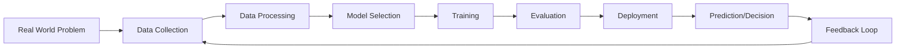

### Real-World Analogy

Think of AI like teaching a child:
- You show the child many examples of cats and dogs (data)
- The child learns patterns (training)
- Next time the child sees a new animal, they can identify it (inference)
- If they make a mistake, you correct them (feedback)

### Production Use Cases

| Industry | AI Application | Impact |
|----------|---------------|--------|
| Healthcare | Disease diagnosis from X-rays | 95%+ accuracy in some studies |
| Finance | Fraud detection | Billions saved annually |
| Retail | Recommendation systems | 35% of Amazon's revenue |
| Automotive | Self-driving cars | Reduced accidents |
| Manufacturing | Quality control | Near-zero defect rates |
| Customer Service | Chatbots | 24/7 availability, cost reduction |

### Trade-offs

| Advantage | Disadvantage |
|-----------|--------------|
| 24/7 operation without fatigue | High initial development cost |
| Consistent performance | Requires large amounts of data |
| Scales easily | Can inherit biases from data |
| Handles repetitive tasks efficiently | Lacks true understanding (narrow AI) |
| Processes data faster than humans | Explainability challenges |

### Common Mistakes

1. **Thinking AI = Human Intelligence** — Current AI is narrow, not general
2. **Ignoring data quality** — "Garbage in, garbage out" is the #1 rule
3. **Over-promising capabilities** — AI cannot solve every problem
4. **Neglecting ethical considerations** — Bias, privacy, fairness matter

### Interview Explanation Style

> "AI is the broad field of creating intelligent machines. It encompasses everything from simple rule-based systems to complex neural networks. In production, we primarily work with Narrow AI — systems designed to excel at specific tasks like image classification, language translation, or recommendation. The key insight is that modern AI is predominantly data-driven: the quality and quantity of your data often matters more than the algorithm itself."

---

## What is Machine Learning (ML)

### Beginner Explanation

Instead of telling a computer exactly what to do (traditional programming), you give it lots of examples and let it figure out the rules by itself. That's Machine Learning.

**Traditional Programming:**
```
Rules + Data → Output
```

**Machine Learning:**
```
Data + Output → Rules (learned automatically)
```

### Technical Explanation

**Machine Learning** is a subset of AI where systems learn patterns from data without being explicitly programmed for each scenario. The system improves its performance on a task through experience (more data).

Formally: A computer program is said to learn from experience **E** with respect to task **T** and performance measure **P**, if its performance at task T, as measured by P, improves with experience E. — *Tom Mitchell, 1997*

### Internal Working

The ML pipeline in detail:

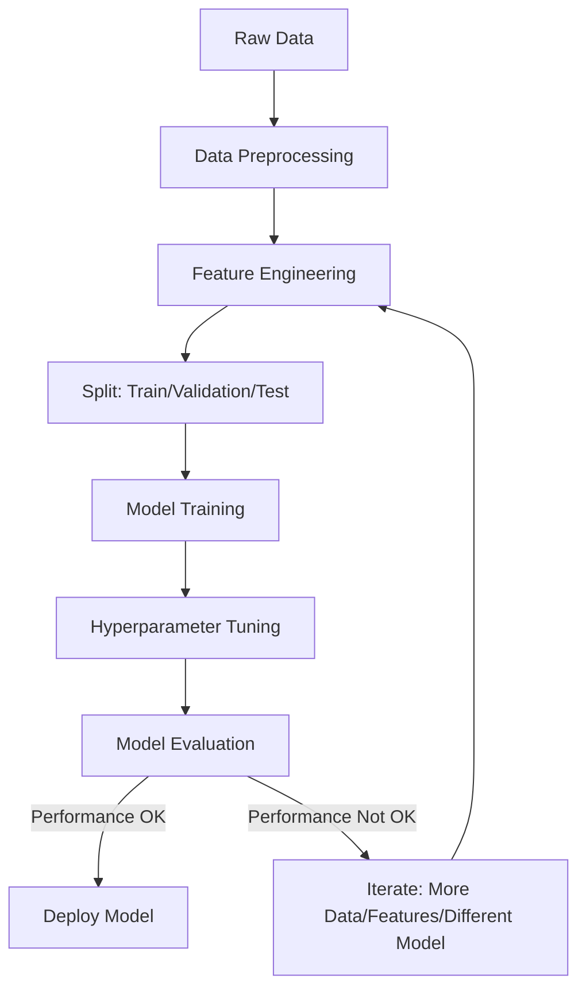

### Mathematical Intuition

At its core, ML is an **optimization problem**. Given:
- Input features: X
- Target variable: y
- Model with parameters: f(X; θ)
- Loss function: L(y, ŷ)

The goal is to find parameters θ that minimize the loss:

```
θ* = argmin_θ Σ L(y_i, f(X_i; θ))
```

In plain English: Find the best settings (parameters) for your model so that the difference between what it predicts and the actual answers is as small as possible.

### Real-World Analogy

Imagine you're learning to estimate house prices:
- You look at 1000 houses with their features (size, location, bedrooms) and their prices
- Over time, you develop an intuition: "bigger houses in good areas cost more"
- When you see a new house, you can estimate its price

ML does exactly this, but mathematically and at scale.

### Types of Machine Learning

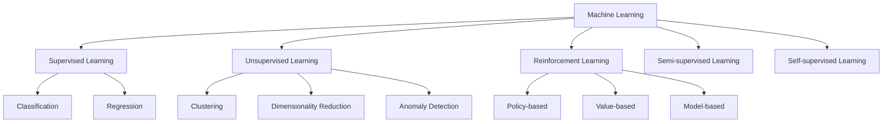

### Code Example — Your First ML Model

```python
# Complete ML Pipeline Example
from sklearn.datasets import load_iris
from sklearn.model_selection import train_test_split
from sklearn.ensemble import RandomForestClassifier
from sklearn.metrics import accuracy_score, classification_report

# Step 1: Load data
data = load_iris()
X = data.data      # Features (sepal length, width, petal length, width)
y = data.target    # Labels (0=setosa, 1=versicolor, 2=virginica)

# Step 2: Split into train and test sets
X_train, X_test, y_train, y_test = train_test_split(
    X, y, test_size=0.2, random_state=42
)

# Step 3: Create and train the model
model = RandomForestClassifier(n_estimators=100, random_state=42)
model.fit(X_train, y_train)

# Step 4: Make predictions
y_pred = model.predict(X_test)

# Step 5: Evaluate
accuracy = accuracy_score(y_test, y_pred)
print(f"Accuracy: {accuracy:.2f}")
print("\nClassification Report:")
print(classification_report(y_test, y_pred, target_names=data.target_names))
```

### Production Use Cases

| Use Case | ML Type | Algorithm Family |
|----------|---------|-----------------|
| Email spam detection | Supervised (Classification) | Naive Bayes, SVM |
| Stock price prediction | Supervised (Regression) | LSTM, Gradient Boosting |
| Customer segmentation | Unsupervised (Clustering) | K-Means, DBSCAN |
| Fraud detection | Supervised + Anomaly Detection | Isolation Forest, XGBoost |
| Product recommendations | Collaborative Filtering | Matrix Factorization |
| Image recognition | Supervised (Classification) | CNN |

### Trade-offs

| Advantage | Disadvantage |
|-----------|--------------|
| Discovers patterns humans miss | Needs substantial training data |
| Improves with more data | Black-box models lack interpretability |
| Automates complex decisions | Vulnerable to data drift |
| Generalizes to new inputs | Computationally expensive to train |
| Handles high-dimensional data | Requires domain expertise for feature engineering |

### Performance Considerations

- **Data size**: More data generally = better performance (up to a point)
- **Feature quality**: Well-engineered features can outperform complex models
- **Model complexity**: More complex ≠ better; start simple
- **Training time**: Deep models can take days/weeks on GPUs
- **Inference latency**: Production models need fast prediction times

### Best Practices

1. **Start simple** — Linear models first, then increase complexity
2. **Understand your data** — EDA before modeling
3. **Proper evaluation** — Always use held-out test sets
4. **Version control** — Track data, code, and models
5. **Monitor in production** — Models degrade over time (data drift)

---

## What is Deep Learning (DL)

### Beginner Explanation

Deep Learning is ML using **neural networks with many layers**. Just as your brain has billions of connected neurons, deep learning creates artificial neural networks with millions of parameters that learn increasingly complex patterns.

Think of it like a factory assembly line:
- Layer 1: Detects simple edges in an image
- Layer 2: Combines edges into shapes
- Layer 3: Combines shapes into parts (eyes, nose)
- Layer 4: Combines parts into faces

Each layer builds upon the previous one — that's why it's called "deep."

### Technical Explanation

**Deep Learning** is a subset of ML that uses artificial neural networks with multiple hidden layers (hence "deep") to learn hierarchical representations of data. The depth allows the network to automatically learn features at multiple levels of abstraction.

Key characteristics:
- **Automatic feature extraction** — No manual feature engineering needed
- **Hierarchical learning** — Each layer learns more abstract representations
- **End-to-end learning** — Raw input → final output, learned jointly
- **Massive scale** — Millions to billions of parameters

### Internal Working — Neural Network Architecture

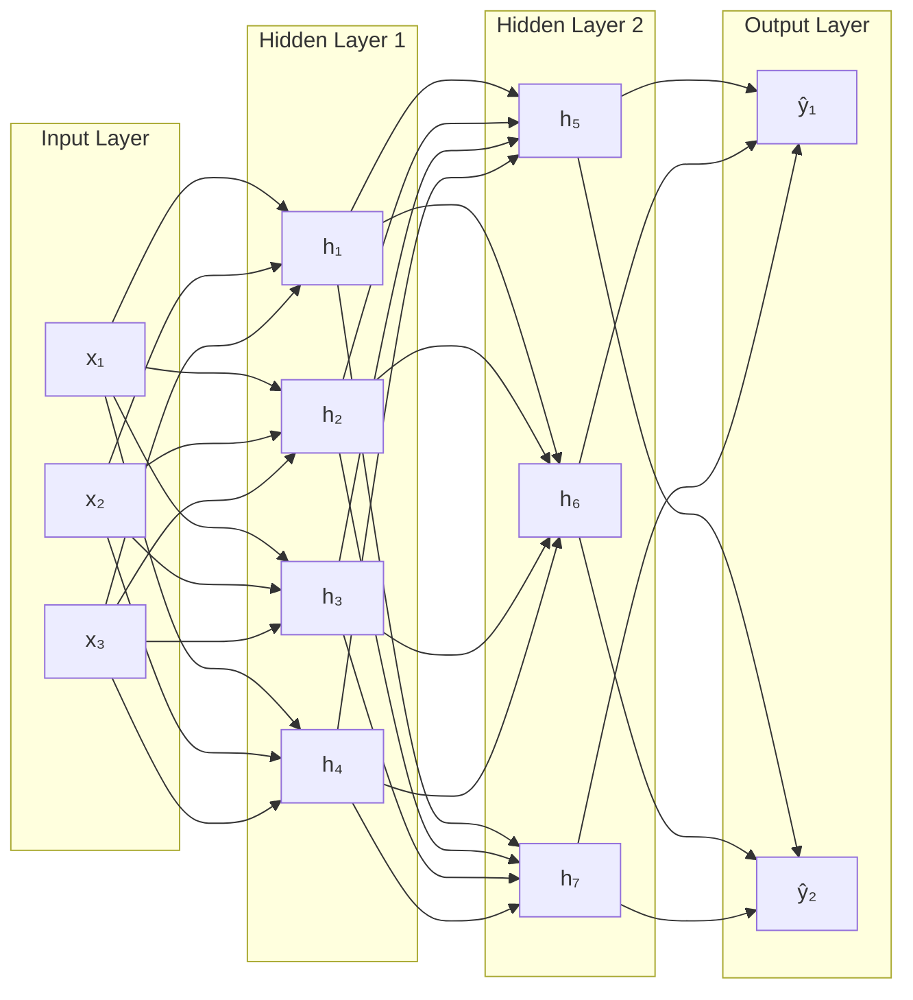

### Mathematical Intuition

Each neuron computes:

```
output = activation(Σ(weight_i × input_i) + bias)
```

Or more formally:

```
z = W·x + b        (linear transformation)
a = σ(z)           (non-linear activation)
```

Where:
- **W** = weight matrix (learned parameters)
- **x** = input vector
- **b** = bias term
- **σ** = activation function (ReLU, sigmoid, tanh)

The "learning" happens through **backpropagation** — computing how much each weight contributed to the error and adjusting accordingly using gradient descent.

### Why "Deep" Matters

| Network Depth | What It Can Learn | Example |
|---------------|-------------------|---------|
| 1 layer | Linear boundaries | AND/OR gates |
| 2 layers | Simple non-linear boundaries | XOR problem |
| 3-5 layers | Complex patterns | Digit recognition |
| 10-50 layers | Abstract features | Image classification |
| 100+ layers | Highly abstract representations | Language understanding |

### Code Example — Simple Neural Network in PyTorch

```python
import torch
import torch.nn as nn
import torch.optim as optim
from torch.utils.data import DataLoader, TensorDataset

# Define a simple neural network
class SimpleNN(nn.Module):
    def __init__(self, input_size, hidden_size, num_classes):
        super(SimpleNN, self).__init__()
        self.layer1 = nn.Linear(input_size, hidden_size)
        self.relu = nn.ReLU()
        self.layer2 = nn.Linear(hidden_size, hidden_size)
        self.layer3 = nn.Linear(hidden_size, num_classes)
    
    def forward(self, x):
        x = self.relu(self.layer1(x))
        x = self.relu(self.layer2(x))
        x = self.layer3(x)
        return x

# Create model
model = SimpleNN(input_size=4, hidden_size=64, num_classes=3)

# Loss function and optimizer
criterion = nn.CrossEntropyLoss()
optimizer = optim.Adam(model.parameters(), lr=0.001)

# Training loop (simplified)
for epoch in range(100):
    # Forward pass
    outputs = model(X_train_tensor)
    loss = criterion(outputs, y_train_tensor)
    
    # Backward pass and optimize
    optimizer.zero_grad()
    loss.backward()
    optimizer.step()
    
    if (epoch + 1) % 10 == 0:
        print(f'Epoch [{epoch+1}/100], Loss: {loss.item():.4f}')
```

### Production Use Cases

| Domain | Application | Architecture |
|--------|------------|--------------|
| Computer Vision | Object detection | YOLO, Faster R-CNN |
| NLP | Machine translation | Transformer |
| Speech | Voice assistants | DeepSpeech, Whisper |
| Gaming | Game AI | Deep Q-Networks |
| Art | Image generation | GANs, Diffusion Models |
| Science | Protein folding | AlphaFold |
| Autonomous Driving | Perception + Planning | Multi-modal CNNs |

### When to Use DL vs Traditional ML

| Criterion | Use Traditional ML | Use Deep Learning |
|-----------|-------------------|-------------------|
| Data size | < 10,000 samples | > 100,000 samples |
| Features | Well-defined, structured | Raw, unstructured |
| Interpretability | Required | Not critical |
| Compute budget | Limited | GPUs available |
| Time constraint | Need quick solution | Can invest in training |
| Domain knowledge | Strong | Limited |

### Trade-offs

| Advantage | Disadvantage |
|-----------|--------------|
| Automatic feature learning | Requires massive datasets |
| State-of-the-art performance | Computationally expensive (GPUs/TPUs) |
| Handles unstructured data | Hard to interpret ("black box") |
| Transfer learning possible | Prone to overfitting with small data |
| Scales with data and compute | Long training times |

---

## AI vs ML vs DL — Complete Comparison

### Visual Relationship

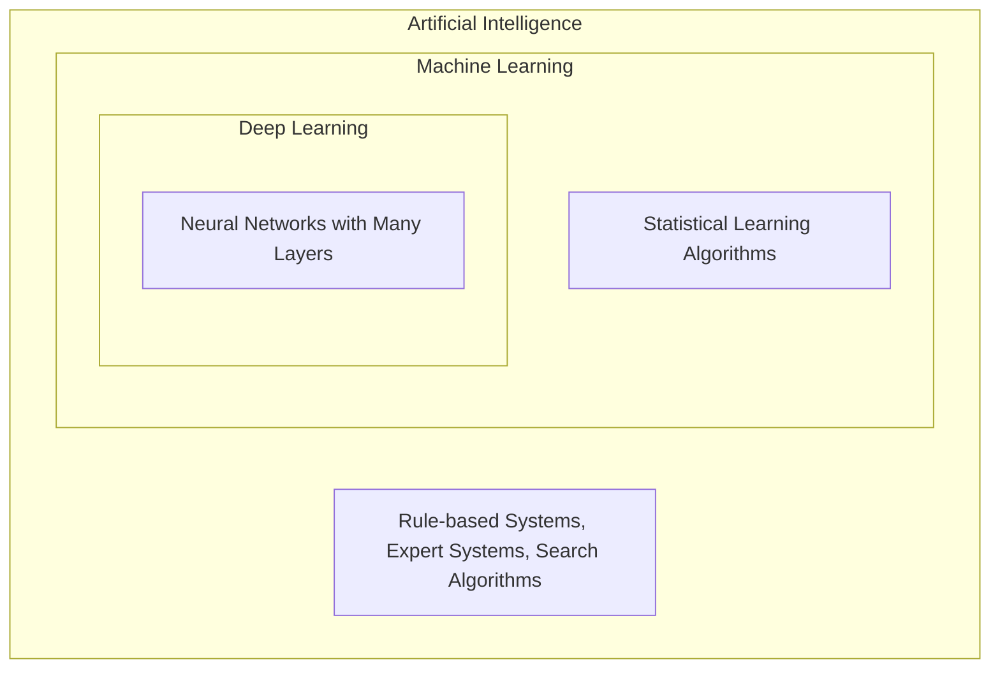

**Deep Learning ⊂ Machine Learning ⊂ Artificial Intelligence**

### Comprehensive Comparison Table

| Aspect | AI | ML | DL |
|--------|----|----|-----|
| **Definition** | Machines that mimic human intelligence | Machines that learn from data | Neural networks with many layers |
| **Scope** | Broadest | Subset of AI | Subset of ML |
| **Data Needs** | Varies | Moderate | Very large |
| **Feature Engineering** | Manual rules | Semi-automatic | Automatic |
| **Hardware** | CPU sufficient | CPU/GPU | GPU/TPU required |
| **Interpretability** | High (rule-based) | Medium | Low |
| **Examples** | Chess engine, Siri | Spam filter, Recommendations | GPT, DALL-E, Self-driving |
| **Development Time** | Depends on rules | Moderate | Long (training) |
| **Accuracy Ceiling** | Limited by rules | Good | State-of-the-art |

### Historical Timeline

```
1950s-1970s: Rule-based AI (Expert Systems, Logic)
1980s-1990s: Statistical ML (SVMs, Decision Trees)
2000s-2010s: Feature-engineered ML (Random Forest, XGBoost)
2012+:       Deep Learning revolution (AlexNet, GPT, etc.)
2020+:       Foundation Models & Generative AI (GPT-4, DALL-E, etc.)
```

### Real-World Analogy

| Concept | Analogy |
|---------|---------|
| **AI** | The entire field of education |
| **ML** | Learning through practice and examples |
| **DL** | Learning complex subjects through layers of understanding |

---

## Supervised Learning

### Beginner Explanation

Imagine a teacher showing a student flashcards:
- Card shows a picture of a cat → Teacher says "cat"
- Card shows a picture of a dog → Teacher says "dog"
- After enough examples, the student can identify new animals

That's supervised learning — you provide **labeled examples** (input + correct answer), and the model learns the mapping.

### Technical Explanation

In supervised learning, the model learns a function **f: X → Y** that maps input features X to output labels Y, using a training dataset of (X, Y) pairs.

The two main types:

| Type | Output | Example |
|------|--------|---------|
| **Classification** | Discrete categories | Spam/Not spam, Cat/Dog |
| **Regression** | Continuous values | House price, Temperature |

### Internal Working

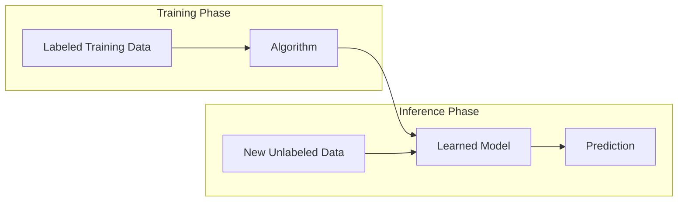

### Mathematical Intuition

**For Regression (e.g., Linear Regression):**
```
ŷ = w₁x₁ + w₂x₂ + ... + wₙxₙ + b

Loss = (1/n) Σ (y_i - ŷ_i)²    [Mean Squared Error]
```

**For Classification (e.g., Logistic Regression):**
```
P(y=1|x) = σ(w·x + b) = 1 / (1 + e^(-(w·x + b)))

Loss = -Σ [y_i·log(ŷ_i) + (1-y_i)·log(1-ŷ_i)]    [Binary Cross-Entropy]
```

### Code Example — Classification

```python
from sklearn.datasets import load_breast_cancer
from sklearn.model_selection import train_test_split
from sklearn.preprocessing import StandardScaler
from sklearn.ensemble import GradientBoostingClassifier
from sklearn.metrics import accuracy_score, confusion_matrix, roc_auc_score

# Load data
data = load_breast_cancer()
X, y = data.data, data.target

# Preprocess
scaler = StandardScaler()
X_scaled = scaler.fit_transform(X)

# Split
X_train, X_test, y_train, y_test = train_test_split(
    X_scaled, y, test_size=0.2, random_state=42, stratify=y
)

# Train
model = GradientBoostingClassifier(
    n_estimators=100, 
    learning_rate=0.1,
    max_depth=3,
    random_state=42
)
model.fit(X_train, y_train)

# Evaluate
y_pred = model.predict(X_test)
y_prob = model.predict_proba(X_test)[:, 1]

print(f"Accuracy: {accuracy_score(y_test, y_pred):.4f}")
print(f"ROC-AUC: {roc_auc_score(y_test, y_prob):.4f}")
print(f"\nConfusion Matrix:\n{confusion_matrix(y_test, y_pred)}")
```

### Code Example — Regression

```python
from sklearn.datasets import fetch_california_housing
from sklearn.model_selection import train_test_split
from sklearn.ensemble import RandomForestRegressor
from sklearn.metrics import mean_squared_error, r2_score
import numpy as np

# Load data
housing = fetch_california_housing()
X, y = housing.data, housing.target

# Split
X_train, X_test, y_train, y_test = train_test_split(
    X, y, test_size=0.2, random_state=42
)

# Train
model = RandomForestRegressor(n_estimators=100, random_state=42)
model.fit(X_train, y_train)

# Evaluate
y_pred = model.predict(X_test)
rmse = np.sqrt(mean_squared_error(y_test, y_pred))
r2 = r2_score(y_test, y_pred)

print(f"RMSE: {rmse:.4f}")
print(f"R² Score: {r2:.4f}")

# Feature importance
for name, importance in sorted(
    zip(housing.feature_names, model.feature_importances_),
    key=lambda x: x[1], reverse=True
):
    print(f"{name}: {importance:.4f}")
```

### Common Supervised Learning Algorithms

| Algorithm | Type | Best For | Complexity |
|-----------|------|----------|------------|
| Linear Regression | Regression | Linear relationships | O(n·p²) |
| Logistic Regression | Classification | Binary classification | O(n·p) |
| Decision Trees | Both | Interpretable models | O(n·p·log n) |
| Random Forest | Both | General-purpose | O(k·n·p·log n) |
| XGBoost | Both | Tabular data competitions | O(k·n·p·log n) |
| SVM | Both | High-dimensional data | O(n²·p) to O(n³) |
| KNN | Both | Small datasets | O(n·p) per prediction |
| Neural Networks | Both | Large unstructured data | Varies |

### Trade-offs

| Advantage | Disadvantage |
|-----------|--------------|
| Clear performance metrics | Requires labeled data (expensive) |
| Well-understood theory | Labels may contain errors |
| Many mature algorithms | Doesn't discover new patterns |
| Easy to evaluate | Limited by label quality |

---

## Unsupervised Learning

### Beginner Explanation

Imagine you have a box of 1000 photographs with no labels. You ask someone to organize them into groups. Without being told what to look for, they might group them by:
- Indoor vs outdoor
- People vs landscapes
- Day vs night

That's unsupervised learning — finding hidden patterns in data **without labels**.

### Technical Explanation

Unsupervised learning algorithms find structure in data without explicit labels. The model discovers inherent patterns, groupings, or representations.

Main tasks:

| Task | Goal | Example |
|------|------|---------|
| **Clustering** | Group similar data points | Customer segmentation |
| **Dimensionality Reduction** | Reduce features while preserving information | PCA, t-SNE |
| **Anomaly Detection** | Find unusual data points | Fraud detection |
| **Association Rules** | Find relationships between items | Market basket analysis |
| **Generative Models** | Learn data distribution | GANs, VAEs |

### Internal Working — K-Means Clustering

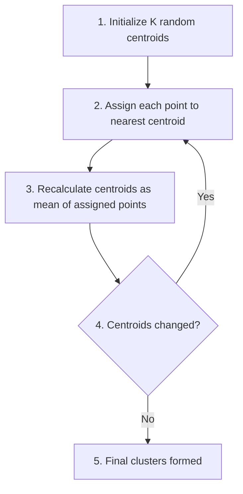

### Code Example — Clustering

```python
from sklearn.cluster import KMeans
from sklearn.preprocessing import StandardScaler
from sklearn.decomposition import PCA
import numpy as np

# Generate sample data (customer features)
np.random.seed(42)
n_customers = 1000

# Features: [annual_income, spending_score, age, visit_frequency]
X = np.random.randn(n_customers, 4)

# Scale features
scaler = StandardScaler()
X_scaled = scaler.fit_transform(X)

# Find optimal K using elbow method
inertias = []
K_range = range(2, 11)
for k in K_range:
    kmeans = KMeans(n_clusters=k, random_state=42, n_init=10)
    kmeans.fit(X_scaled)
    inertias.append(kmeans.inertia_)

# Train with optimal K
optimal_k = 4
kmeans = KMeans(n_clusters=optimal_k, random_state=42, n_init=10)
labels = kmeans.fit_predict(X_scaled)

print(f"Cluster sizes: {np.bincount(labels)}")
print(f"Cluster centers:\n{kmeans.cluster_centers_}")

# Reduce to 2D for visualization
pca = PCA(n_components=2)
X_2d = pca.fit_transform(X_scaled)
print(f"Explained variance: {pca.explained_variance_ratio_.sum():.2%}")
```

### Code Example — Anomaly Detection

```python
from sklearn.ensemble import IsolationForest
import numpy as np

# Normal transactions + some fraudulent ones
np.random.seed(42)
normal = np.random.randn(1000, 2) * 1  # Normal transactions
fraud = np.random.randn(20, 2) * 1 + 5  # Fraudulent (outliers)

X = np.vstack([normal, fraud])

# Isolation Forest
iso_forest = IsolationForest(
    contamination=0.02,  # Expected fraction of anomalies
    random_state=42
)
predictions = iso_forest.fit_predict(X)

# -1 = anomaly, 1 = normal
n_anomalies = (predictions == -1).sum()
print(f"Detected anomalies: {n_anomalies}")
print(f"Actual anomalies: 20")
```

### Real-World Analogy

| Supervised | Unsupervised |
|------------|--------------|
| Teacher gives you labeled flashcards | You organize a messy room without instructions |
| GPS gives turn-by-turn directions | You explore a new city and create your own map |
| Recipe with exact steps | Experimenting in the kitchen |

### Trade-offs

| Advantage | Disadvantage |
|-----------|--------------|
| No labeled data needed | Hard to evaluate (no ground truth) |
| Discovers hidden patterns | Results may be subjective |
| Scales to massive datasets | Difficult to interpret clusters |
| Useful for exploration | Sensitive to hyperparameters |

---

## Reinforcement Learning

### Beginner Explanation

Imagine training a dog:
- Dog sits → Give treat (positive reward)
- Dog jumps on furniture → Say "no" (negative reward)
- Over time, the dog learns which behaviors lead to treats

That's **Reinforcement Learning (RL)** — an agent learns by trial and error, receiving rewards or penalties for its actions.

### Technical Explanation

In RL, an **agent** interacts with an **environment**, taking **actions** based on the current **state**, and receiving **rewards**. The goal is to learn a **policy** (strategy) that maximizes cumulative reward over time.

Key components:

| Component | Description | Example (Chess) |
|-----------|-------------|-----------------|
| Agent | The learner/decision-maker | Chess-playing AI |
| Environment | What the agent interacts with | The chess board |
| State (s) | Current situation | Board position |
| Action (a) | What agent can do | Move a piece |
| Reward (r) | Feedback signal | +1 win, -1 lose, 0 otherwise |
| Policy (π) | Strategy for choosing actions | Move selection function |

### Internal Working

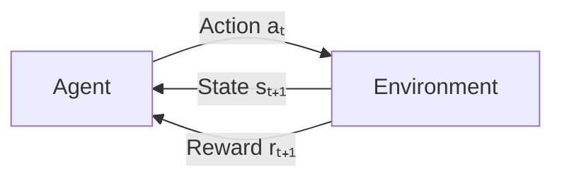

The **Bellman Equation** (foundation of RL):

```
V(s) = max_a [R(s,a) + γ · V(s')]

Where:
- V(s) = value of state s
- R(s,a) = immediate reward for taking action a in state s
- γ = discount factor (0 to 1, how much future rewards matter)
- s' = next state
```

### Types of RL

| Type | Description | Example |
|------|-------------|---------|
| **Model-free** | Learn directly from experience | Q-Learning, Policy Gradient |
| **Model-based** | Learn a model of the environment | AlphaZero |
| **Value-based** | Learn value of states/actions | DQN |
| **Policy-based** | Learn action probabilities directly | REINFORCE, PPO |
| **Actor-Critic** | Combine value and policy | A3C, SAC |

### Production Use Cases

| Application | Company | Impact |
|-------------|---------|--------|
| Game AI | DeepMind (AlphaGo) | Defeated world champion |
| Robotics | Boston Dynamics | Physical task learning |
| Recommendations | Netflix/YouTube | Maximize engagement |
| Trading | Various hedge funds | Automated trading strategies |
| Resource Management | Google (data centers) | 40% cooling energy reduction |
| Ad Bidding | Meta, Google | Optimal bid placement |

### Trade-offs

| Advantage | Disadvantage |
|-----------|--------------|
| Handles sequential decisions | Extremely sample-inefficient |
| No labeled data needed | Training instability |
| Can surpass human performance | Reward design is challenging |
| Adapts to changing environments | Hard to debug |
| Solves complex control problems | Simulation often needed |

### Common Mistakes

1. **Poor reward shaping** — Agent exploits loopholes in reward function
2. **Insufficient exploration** — Agent gets stuck in local optima
3. **Ignoring safety** — Agent finds dangerous but rewarding strategies
4. **Underestimating compute** — RL requires enormous training time

---

## Training vs Inference

### Beginner Explanation

| Phase | Analogy | Description |
|-------|---------|-------------|
| **Training** | Studying for an exam | Model learns from data |
| **Inference** | Taking the exam | Model makes predictions on new data |

### Technical Explanation

**Training** is the process of optimizing model parameters using a dataset. The model iteratively adjusts its weights to minimize a loss function.

**Inference** is using the trained model to make predictions on new, unseen data.

### Detailed Comparison

| Aspect | Training | Inference |
|--------|----------|-----------|
| **Goal** | Learn parameters | Make predictions |
| **Data** | Training dataset | New/live data |
| **Compute** | Very high (GPUs, days/weeks) | Low (can run on CPU) |
| **Frequency** | Once (or periodic retraining) | Continuous (real-time) |
| **Gradient** | Computed (backpropagation) | Not needed |
| **Memory** | High (store activations) | Lower |
| **Batch size** | Large (32, 64, 256) | Often single sample |
| **Mode** | model.train() | model.eval() |

### Training Pipeline

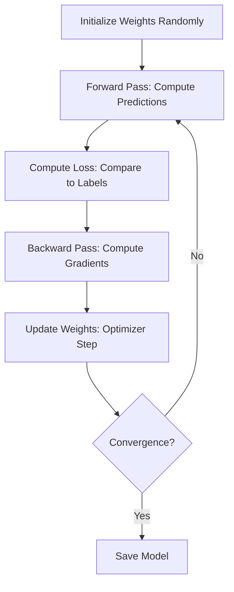

### Inference Pipeline


### Code Example — Training vs Inference in PyTorch

```python
import torch
import torch.nn as nn

model = SimpleNN(input_size=4, hidden_size=64, num_classes=3)
optimizer = torch.optim.Adam(model.parameters(), lr=0.001)
criterion = nn.CrossEntropyLoss()

# === TRAINING ===
model.train()  # Enable dropout, batch norm in training mode
for epoch in range(100):
    for batch_X, batch_y in train_loader:
        # Forward pass
        outputs = model(batch_X)
        loss = criterion(outputs, batch_y)
        
        # Backward pass (ONLY during training)
        optimizer.zero_grad()
        loss.backward()        # Compute gradients
        optimizer.step()       # Update weights

# Save trained model
torch.save(model.state_dict(), 'model.pth')

# === INFERENCE ===
model.eval()  # Disable dropout, use running stats for batch norm
with torch.no_grad():  # No gradient computation needed
    new_data = torch.tensor([[5.1, 3.5, 1.4, 0.2]])
    prediction = model(new_data)
    predicted_class = prediction.argmax(dim=1)
    print(f"Predicted class: {predicted_class.item()}")
```

### Performance Considerations

| Optimization | Training | Inference |
|-------------|----------|-----------|
| **Hardware** | Multi-GPU, TPU clusters | CPU, single GPU, edge devices |
| **Techniques** | Mixed precision, gradient accumulation | Quantization, pruning, distillation |
| **Latency** | Not critical (can take hours) | Critical (milliseconds matter) |
| **Throughput** | Maximize samples/second | Maximize requests/second |
| **Memory** | Gradient storage needed | Only forward pass activations |

---

## Features & Labels

### Beginner Explanation

Think of a spreadsheet:
- **Features** = The columns you use to make a prediction (inputs)
- **Labels** = The column you want to predict (output/answer)

Example: Predicting house prices
| Size (ft²) | Bedrooms | Location Score | **Price** |
|-------------|----------|----------------|-----------|
| 1500 | 3 | 8 | **$300K** |
| 2000 | 4 | 9 | **$450K** |

- Features: Size, Bedrooms, Location Score (what you know)
- Label: Price (what you want to predict)

### Technical Explanation

| Term | Symbol | Definition |
|------|--------|------------|
| **Feature** | X, x_i | An individual measurable property of the data |
| **Feature Vector** | **x** | All features for one sample |
| **Feature Matrix** | **X** | All features for all samples (n × p) |
| **Label/Target** | y | The ground truth output |
| **Prediction** | ŷ | The model's estimated output |

### Types of Features

| Feature Type | Description | Example | Encoding Method |
|-------------|-------------|---------|-----------------|
| **Numerical (Continuous)** | Real-valued numbers | Age, salary, temperature | Scaling/normalization |
| **Numerical (Discrete)** | Countable integers | Number of rooms, clicks | May need binning |
| **Categorical (Nominal)** | No natural ordering | Color, country, gender | One-hot encoding |
| **Categorical (Ordinal)** | Natural ordering | Education level, rating | Label encoding |
| **Binary** | Two possible values | Yes/No, True/False | 0/1 encoding |
| **Text** | Natural language | Reviews, descriptions | Embedding, TF-IDF |
| **Temporal** | Time-based | Dates, timestamps | Feature extraction |

### Feature Engineering Example

```python
import pandas as pd
import numpy as np
from sklearn.preprocessing import StandardScaler, OneHotEncoder

# Raw data
data = pd.DataFrame({
    'age': [25, 45, 35, 52, 28],
    'income': [50000, 120000, 75000, 95000, 45000],
    'city': ['NYC', 'LA', 'NYC', 'Chicago', 'LA'],
    'purchased': [0, 1, 1, 1, 0]  # Label
})

# Separate features and label
X = data.drop('purchased', axis=1)
y = data['purchased']

# Numerical features — scaling
scaler = StandardScaler()
X[['age', 'income']] = scaler.fit_transform(X[['age', 'income']])

# Categorical features — one-hot encoding
X = pd.get_dummies(X, columns=['city'], drop_first=True)

print("Processed Features:")
print(X)
print(f"\nLabels: {y.values}")
```

### Good Features vs Bad Features

| Good Feature | Bad Feature |
|-------------|-------------|
| Correlated with target | Random noise |
| Low missing values | Mostly null |
| Informative signal | Redundant with other features |
| Available at prediction time | Leaks future information |
| Stable over time | Drifts significantly |

### Common Mistakes

1. **Data leakage** — Using information from the label to create features
2. **High cardinality** — Too many categories (use target encoding)
3. **Missing value mishandling** — Dropping rows vs imputation
4. **Not scaling** — Distance-based algorithms require scaled features
5. **Ignoring feature interactions** — Combining features can add signal

---

## Bias vs Variance

### Beginner Explanation

Imagine throwing darts at a target:

```
High Bias, Low Variance:     Low Bias, High Variance:
   All darts clustered         Darts scattered but
   AWAY from center            centered on bullseye
   (consistent but wrong)      (right on average, but inconsistent)

        ●●●                         ●
       ●●●●                      ●     ●
      ●●●●●                    ●    ⊕   ●
                                 ●      ●
    ⊕ = bullseye                    ●
```

- **Bias** = How far your average prediction is from the truth (systematic error)
- **Variance** = How much your predictions vary across different training data (sensitivity)

### Technical Explanation

For any model, the expected prediction error decomposes as:

```
Total Error = Bias² + Variance + Irreducible Noise

Where:
- Bias² = [E[ŷ] - y_true]²        (systematic under/over-estimation)
- Variance = E[(ŷ - E[ŷ])²]       (sensitivity to training data)
- Noise = σ²                       (inherent randomness in data)
```

### The Bias-Variance Tradeoff

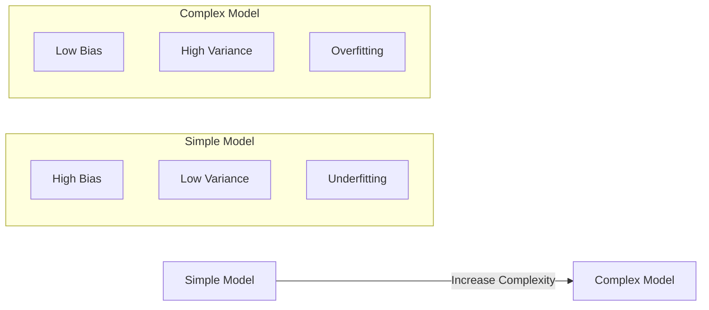

| Model Complexity | Bias | Variance | Training Error | Test Error |
|-----------------|------|----------|----------------|------------|
| Too simple | High | Low | High | High |
| Just right | Low | Low | Low | Low |
| Too complex | Low | High | Very Low | High |

### Visual Representation

```
Error
  |
  |  \                    /
  |   \    Total Error   /
  |    \      ___       /
  |     \    /   \     /
  |      \  /     \   /
  |  Bias \/ Sweet  \ / Variance
  |        \  Spot   /
  |         --------
  |________________________
       Model Complexity →
```

### Real-World Examples

| Scenario | Bias | Variance | Result |
|----------|------|----------|--------|
| Linear model on non-linear data | High | Low | Underfitting |
| Decision tree with max depth | Low | High | Overfitting |
| Random Forest (ensemble) | Low | Low | Good generalization |
| Regularized neural network | Balanced | Balanced | Good generalization |

### How to Diagnose

| Symptom | Diagnosis | Solution |
|---------|-----------|----------|
| High train error + High test error | High bias (underfitting) | More complex model, more features |
| Low train error + High test error | High variance (overfitting) | Regularization, more data, simpler model |
| Low train error + Low test error | Good fit | Deploy! |

### Code Example — Demonstrating Bias-Variance

```python
from sklearn.model_selection import learning_curve
from sklearn.tree import DecisionTreeRegressor
from sklearn.linear_model import LinearRegression
import numpy as np

# High Bias model (underfitting)
linear_model = LinearRegression()

# High Variance model (overfitting)
complex_tree = DecisionTreeRegressor(max_depth=None)  # No limit

# Balanced model
balanced_tree = DecisionTreeRegressor(max_depth=5)

# Compare using cross-validation
from sklearn.model_selection import cross_val_score

models = {
    'Linear (High Bias)': linear_model,
    'Deep Tree (High Variance)': complex_tree,
    'Balanced Tree': balanced_tree
}

for name, model in models.items():
    train_scores = []
    test_scores = []
    
    # Cross-validation
    cv_scores = cross_val_score(model, X_train, y_train, cv=5, scoring='r2')
    model.fit(X_train, y_train)
    train_score = model.score(X_train, y_train)
    test_score = model.score(X_test, y_test)
    
    print(f"{name}:")
    print(f"  Train R²: {train_score:.4f}")
    print(f"  Test R²:  {test_score:.4f}")
    print(f"  Gap:      {train_score - test_score:.4f}")
    print()
```

### Strategies to Address

| Problem | Strategy |
|---------|----------|
| **High Bias** | Add more features, use polynomial features, reduce regularization, use more complex model |
| **High Variance** | Add more training data, increase regularization, use dropout, ensemble methods, feature selection |
| **Both** | Better feature engineering, try different algorithm families |

---

## Overfitting & Underfitting

### Beginner Explanation

| Concept | Student Analogy |
|---------|-----------------|
| **Underfitting** | Student who didn't study enough — can't answer basic questions |
| **Good Fit** | Student who understood concepts — can answer new questions |
| **Overfitting** | Student who memorized answers — fails on rephrased questions |

### Technical Explanation

**Overfitting**: Model learns noise and specific patterns in training data that don't generalize. Performs well on training data but poorly on unseen data.

**Underfitting**: Model is too simple to capture the underlying patterns in the data. Performs poorly on both training and unseen data.

### Visual Representation

```
Underfitting:          Good Fit:             Overfitting:
(Too simple)          (Just right)          (Too complex)

    ●   ●              ●   ●                ●   ●
  ●       ●          ●  ___  ●            ●  /\  ●
 ●_________●        ● /     \ ●         ● /    \ ●
●           ●      ●/         \●       ●/  \/\/  \●

Straight line        Smooth curve         Wiggly line through
misses the           captures the         every single point
pattern              pattern
```

### Diagnosing with Learning Curves

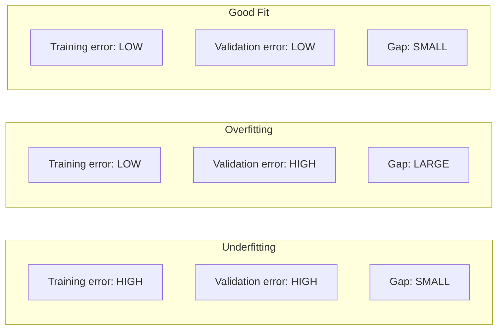

### Solutions — Complete Toolkit

#### Preventing Overfitting

| Technique | How It Works | When to Use |
|-----------|-------------|-------------|
| **More training data** | Harder to memorize more examples | Always try first |
| **Regularization (L1/L2)** | Penalizes large weights | Linear/logistic regression |
| **Dropout** | Randomly disable neurons during training | Neural networks |
| **Early stopping** | Stop before overfitting starts | Any iterative model |
| **Cross-validation** | Train/test on multiple splits | Model selection |
| **Data augmentation** | Create variations of training data | Image/text data |
| **Ensemble methods** | Combine multiple models | Competition, production |
| **Reduce model complexity** | Fewer layers/parameters | When model is too powerful |
| **Pruning** | Remove unnecessary branches/weights | Trees, neural networks |

#### Fixing Underfitting

| Technique | How It Works | When to Use |
|-----------|-------------|-------------|
| **Increase model complexity** | More parameters to learn | Model too simple |
| **Add more features** | Give model more information | Missing important signals |
| **Feature engineering** | Create informative features | Domain knowledge available |
| **Reduce regularization** | Let model fit more freely | Over-regularized |
| **Train longer** | More optimization iterations | Model hasn't converged |
| **Use non-linear model** | Capture complex patterns | Linear model on non-linear data |

### Code Example — Demonstrating and Fixing Overfitting

```python
from sklearn.model_selection import train_test_split, cross_val_score
from sklearn.tree import DecisionTreeClassifier
from sklearn.ensemble import RandomForestClassifier
from sklearn.metrics import accuracy_score
import numpy as np

# Create dataset
from sklearn.datasets import make_classification
X, y = make_classification(
    n_samples=1000, n_features=20, n_informative=10,
    n_redundant=5, random_state=42
)

X_train, X_test, y_train, y_test = train_test_split(
    X, y, test_size=0.2, random_state=42
)

# --- OVERFITTING EXAMPLE ---
overfit_model = DecisionTreeClassifier(max_depth=None)  # No constraints
overfit_model.fit(X_train, y_train)
print("=== Overfitting Model (Unlimited Decision Tree) ===")
print(f"Train Accuracy: {overfit_model.score(X_train, y_train):.4f}")
print(f"Test Accuracy:  {overfit_model.score(X_test, y_test):.4f}")

# --- UNDERFITTING EXAMPLE ---
underfit_model = DecisionTreeClassifier(max_depth=1)  # Too simple
underfit_model.fit(X_train, y_train)
print("\n=== Underfitting Model (Depth=1 Decision Tree) ===")
print(f"Train Accuracy: {underfit_model.score(X_train, y_train):.4f}")
print(f"Test Accuracy:  {underfit_model.score(X_test, y_test):.4f}")

# --- GOOD FIT EXAMPLE ---
good_model = RandomForestClassifier(
    n_estimators=100, max_depth=10, random_state=42
)
good_model.fit(X_train, y_train)
print("\n=== Good Fit Model (Random Forest, max_depth=10) ===")
print(f"Train Accuracy: {good_model.score(X_train, y_train):.4f}")
print(f"Test Accuracy:  {good_model.score(X_test, y_test):.4f}")

# Cross-validation for robust evaluation
cv_scores = cross_val_score(good_model, X, y, cv=5)
print(f"CV Accuracy:    {cv_scores.mean():.4f} ± {cv_scores.std():.4f}")
```

### Regularization Techniques Explained

```python
from sklearn.linear_model import Ridge, Lasso, ElasticNet

# L2 Regularization (Ridge) — shrinks weights toward zero
# Loss = MSE + α × Σ(w_i²)
ridge = Ridge(alpha=1.0)

# L1 Regularization (Lasso) — can zero out weights (feature selection)
# Loss = MSE + α × Σ|w_i|
lasso = Lasso(alpha=0.1)

# ElasticNet — combination of L1 and L2
# Loss = MSE + α₁ × Σ|w_i| + α₂ × Σ(w_i²)
elastic = ElasticNet(alpha=0.1, l1_ratio=0.5)
```

### Industry Best Practices

1. **Always split data**: Train / Validation / Test (60/20/20 or 70/15/15)
2. **Monitor the gap**: |Train Error - Validation Error| should be small
3. **Use cross-validation**: k-fold CV gives more robust estimates
4. **Start simple**: Begin with simple models, add complexity as needed
5. **Regularize by default**: It rarely hurts and often helps
6. **Collect more data**: The best regularizer is more training data
7. **Domain knowledge**: Feature engineering > model complexity

---

## Interview Mastery

### Beginner Interview Questions

---

**Q1: What is the difference between AI, ML, and DL?**

**Perfect Answer:**
> "AI is the broadest field — any technique that enables machines to mimic human intelligence. Machine Learning is a subset of AI where systems learn patterns from data instead of being explicitly programmed. Deep Learning is a further subset of ML that uses neural networks with multiple hidden layers to automatically learn hierarchical features from raw data.

> Think of it as concentric circles: AI contains ML, which contains DL. A key distinction is that traditional ML requires manual feature engineering, while DL learns features automatically. However, DL requires significantly more data and compute."

**Interviewer Expects:** Clear hierarchical relationship, practical distinction about feature engineering, awareness of tradeoffs.

**Common Mistake:** Treating them as separate, unrelated fields rather than nested subsets.

---

**Q2: What is supervised vs unsupervised learning?**

**Perfect Answer:**
> "In supervised learning, we train models on labeled data — each input has a corresponding correct output. The model learns the mapping from inputs to outputs. Examples include classification (spam detection) and regression (price prediction).

> In unsupervised learning, we have no labels. The model must discover hidden structure in the data on its own. Examples include clustering (customer segmentation) and dimensionality reduction (PCA).

> The key tradeoff: supervised learning gives more predictable, measurable results but requires expensive labeled data. Unsupervised learning can work with any data but is harder to evaluate."

**Interviewer Expects:** Clear definition, concrete examples, understanding of when each applies.

**Common Mistake:** Not mentioning semi-supervised learning when relevant, or not discussing evaluation differences.

---

**Q3: What are features and labels?**

**Perfect Answer:**
> "Features are the input variables — the measurable properties we use to make predictions. Labels are the target variable — what we want to predict.

> For example, in a house price model: features include square footage, number of bedrooms, and location. The label is the price. Features are our X matrix (n samples × p features), and labels are our y vector.

> In practice, feature engineering — selecting, transforming, and creating features — is often the most impactful part of an ML pipeline. A model is only as good as its features."

**Interviewer Expects:** Clear definition with example, awareness that feature engineering matters.

---

**Q4: Explain overfitting in simple terms.**

**Perfect Answer:**
> "Overfitting is when a model memorizes the training data instead of learning generalizable patterns. It performs excellently on training data but poorly on new, unseen data.

> Analogy: A student who memorizes exam answers word-for-word can score perfectly on practice tests but fails when questions are rephrased.

> We detect overfitting by comparing training accuracy vs validation accuracy — a large gap indicates overfitting. Solutions include regularization, more training data, cross-validation, dropout (for neural networks), and early stopping."

**Interviewer Expects:** Definition, analogy, how to detect it, and how to fix it.

**Common Mistake:** Only mentioning detection but not solutions, or not mentioning the train/test gap.

---

### Intermediate Interview Questions

---

**Q5: Explain the bias-variance tradeoff.**

**Perfect Answer:**
> "The bias-variance tradeoff is the fundamental tension in machine learning between two sources of error:

> **Bias** is systematic error — the model consistently misses the target because it's too simple to capture the true pattern. High bias leads to underfitting.

> **Variance** is sensitivity to training data — the model captures noise and performs differently on different training sets. High variance leads to overfitting.

> Total Error = Bias² + Variance + Irreducible Noise

> The tradeoff: as we increase model complexity, bias decreases but variance increases. The sweet spot minimizes total error. In practice, we manage this with regularization (controls variance), ensemble methods (reduces both), and proper validation."

**Interviewer Expects:** Mathematical decomposition, practical implications, solutions.

**Common Mistake:** Not mentioning irreducible noise, or not giving concrete strategies to manage the tradeoff.

---

**Q6: How does training differ from inference? What are the production considerations?**

**Perfect Answer:**
> "Training is the offline process of learning model parameters from data — it involves forward passes, loss computation, and backpropagation. It's compute-intensive, requires GPUs, and can take hours to weeks.

> Inference is the online process of making predictions with a trained model — only forward passes, no gradients. It must be fast (milliseconds) and can often run on CPUs.

> Production considerations:
> - **Latency**: Inference must be fast (model quantization, pruning, distillation help)
> - **Throughput**: Batch inference for non-real-time, single inference for real-time
> - **Model size**: Edge deployment needs smaller models
> - **Monitoring**: Track data drift, model degradation
> - **Retraining**: Schedule periodic retraining as data evolves"

**Interviewer Expects:** Clear distinction, awareness of production constraints.

---

**Q7: When would you choose traditional ML over deep learning?**

**Perfect Answer:**
> "I'd choose traditional ML (XGBoost, Random Forest, etc.) when:
> 1. Dataset is small (< 10K samples) — DL overfits on small data
> 2. Data is structured/tabular — gradient boosting still outperforms DL on tabular data
> 3. Interpretability is required — regulations, healthcare, finance
> 4. Compute budget is limited — no GPU available
> 5. Fast iteration is needed — quicker to train and tune

> I'd choose deep learning when:
> 1. Data is unstructured (images, text, audio)
> 2. Dataset is very large (>100K samples)
> 3. Transfer learning is applicable
> 4. State-of-the-art performance is required
> 5. Auto feature extraction is beneficial

> Importantly, for tabular data in production, XGBoost/LightGBM remain extremely competitive. DL hasn't definitively surpassed gradient boosting for structured data."

**Interviewer Expects:** Nuanced answer showing practical experience, not blanket "deep learning is always better."

---

**Q8: Explain reinforcement learning and give a production example.**

**Perfect Answer:**
> "Reinforcement learning is a paradigm where an agent learns through interaction with an environment. It takes actions, observes state transitions and rewards, and learns a policy to maximize cumulative reward.

> Key components: Agent, Environment, State, Action, Reward, Policy.

> Production example: **YouTube's recommendation system** uses RL to maximize long-term user engagement. The 'state' is user history, the 'action' is which video to recommend, and the 'reward' is whether the user watches and engages. Unlike supervised learning that just predicts clicks, RL optimizes for long-term satisfaction, reducing clickbait recommendations.

> The challenge in production RL is the exploration-exploitation tradeoff — do we show what we know users like (exploit) or try new content to discover preferences (explore)?"

**Interviewer Expects:** Formal definition, real production example, awareness of challenges.

---

### Advanced Interview Questions

---

**Q9: How would you detect and handle overfitting in a production ML system?**

**Perfect Answer:**
> "Detection approaches:
> 1. **During development**: Compare train vs validation metrics — gap > 5-10% relative suggests overfitting
> 2. **Learning curves**: Plot train/val error vs training samples — diverging curves indicate overfitting
> 3. **Cross-validation**: High variance across folds suggests overfitting
> 4. **In production**: Performance degradation on live data vs holdout performance

> Handling strategies (in order of priority):
> 1. **More data** — most reliable fix
> 2. **Regularization** — L1/L2 for linear models, dropout + weight decay for neural nets
> 3. **Feature selection** — remove noisy/irrelevant features
> 4. **Early stopping** — monitor validation loss, stop when it starts increasing
> 5. **Ensemble methods** — bagging reduces variance
> 6. **Data augmentation** — synthetic training examples
> 7. **Architecture search** — reduce model capacity

> In production specifically:
> - Monitor data drift (feature distribution changes)
> - A/B test model updates
> - Use shadow deployment before full rollout
> - Set up alerts on performance metrics dropping below threshold"

**Interviewer Expects:** Systematic approach, both development and production perspectives, prioritized solutions.

---

**Q10: If your model has high bias, what specific steps would you take?**

**Perfect Answer:**
> "High bias means the model is too simple to capture the underlying pattern. My systematic approach:

> 1. **Verify the diagnosis**: Confirm both train AND test errors are high (not just test)
> 2. **Feature engineering**: Create polynomial features, interaction terms, domain-specific transformations
> 3. **Reduce regularization**: If using Ridge/Lasso, decrease alpha; if using dropout, decrease rate
> 4. **Increase model complexity**: More layers/neurons (DL), deeper trees, more estimators
> 5. **Try non-linear models**: Switch from linear regression to gradient boosting or neural networks
> 6. **Longer training**: Ensure the model has converged (check loss curve)
> 7. **Error analysis**: Examine misclassified examples — what pattern is the model missing?

> Important: Adding more training data does NOT help high bias — the model can't learn the pattern regardless of data size. This is a common mistake in interviews."

**Interviewer Expects:** Systematic approach, specific techniques, awareness that more data doesn't fix bias.

---

### Scenario-Based Questions

---

**Q11: You deployed a model that had 95% accuracy in testing but only 70% in production. What happened?**

**Perfect Answer:**
> "This is a classic train-serving skew. I'd investigate in this order:

> 1. **Data distribution shift**: Production data differs from training data. Maybe training used historical data that doesn't represent current patterns (concept drift).

> 2. **Data leakage during training**: Features available in training but not in production. Example: using future information that isn't available at prediction time.

> 3. **Feature engineering mismatch**: Preprocessing in training pipeline differs from serving pipeline (different libraries, different normalization statistics).

> 4. **Sample selection bias**: Training data wasn't representative of production traffic. Example: training only on users who completed a flow, predicting for all users.

> 5. **Label definition change**: What the model learned to predict isn't exactly what production needs.

> **My action plan**:
> - Compare feature distributions (training vs production)
> - Check for missing features or null values in production
> - Audit the data pipeline end-to-end
> - Look for temporal patterns (time-based drift)
> - Implement monitoring: feature drift detection + prediction confidence tracking"

**Interviewer Expects:** Structured debugging approach, multiple hypotheses, concrete action plan.

---

**Q12: You have a dataset with 1 million samples but only 100 are positive (fraud cases). How do you build a model?**

**Perfect Answer:**
> "This is a severe class imbalance problem (0.01% positive rate). My approach:

> **Metric selection** (most critical):
> - NOT accuracy (99.99% by predicting all negative)
> - Use Precision-Recall AUC, F1-score, or business-specific metric
> - Possibly optimize for recall (catch all fraud) with acceptable precision

> **Data strategies**:
> - Oversampling minority: SMOTE or ADASYN for synthetic examples
> - Undersampling majority: Random or Tomek links (risky — lose information)
> - Combined: SMOTE + undersampling

> **Algorithm strategies**:
> - Class weights: `class_weight='balanced'` or custom weights
> - Anomaly detection approach: Isolation Forest, One-class SVM
> - Ensemble: Balanced Random Forest, EasyEnsemble

> **Practical approach**:
> 1. Start with XGBoost + `scale_pos_weight=10000` (ratio of negative to positive)
> 2. Optimize threshold: Don't use 0.5; use precision-recall curve to pick threshold
> 3. Ensemble multiple models for robustness

> **Production considerations**:
> - Real-time scoring with low latency
> - Feedback loop: Confirmed fraud cases → retrain
> - Cost-sensitive: False negative (missed fraud) costs far more than false positive (blocked transaction)"

**Interviewer Expects:** Awareness that accuracy is wrong metric, multiple strategies, production thinking.

---

### FAANG-Style Conceptual Questions

---

**Q13: Explain gradient descent to a non-technical person.**

**Perfect Answer:**
> "Imagine you're blindfolded on a hilly landscape and need to reach the lowest valley. You can only feel the slope under your feet. Your strategy:
> 1. Feel which direction is downhill (compute gradient)
> 2. Take a step in that direction (update parameters)
> 3. Repeat until you reach a flat area (convergence)

> The 'learning rate' is your step size:
> - Too large: You might overshoot the valley and bounce around
> - Too small: You'll reach the valley but take forever
> - Just right: Efficient convergence

> In ML, the 'landscape' is the loss function, the 'position' is our model's parameters, and 'downhill' is the direction that reduces prediction error. We repeat this for millions of examples until the model finds parameters that minimize error."

**Interviewer Expects:** Clear non-technical explanation that shows deep understanding, learning rate discussion.

---

**Q14: If you could only use one algorithm for the rest of your career on tabular data, what would it be and why?**

**Perfect Answer:**
> "**Gradient Boosted Trees (XGBoost/LightGBM)**, without question.

> Reasons:
> 1. **Handles mixed data**: Works with numerical and categorical features natively
> 2. **No scaling required**: Tree-based, so feature magnitude doesn't matter
> 3. **Handles missing values**: Built-in handling
> 4. **Feature importance**: Built-in interpretability
> 5. **Robust to outliers**: Tree splits are rank-based
> 6. **State-of-the-art**: Dominates Kaggle tabular competitions
> 7. **Fast inference**: Millisecond predictions
> 8. **Tunable**: From simple to complex with hyperparameters
> 9. **Handles both regression and classification**: Versatile
> 10. **Works with small and large datasets**: 1K to 100M rows

> The only time I'd pick something else is for very high-dimensional sparse data (logistic regression) or when I need probabilities calibrated out of the box (logistic regression)."

**Interviewer Expects:** Decisive answer with well-reasoned justification showing practical experience.

---

### Production Debugging Questions

---

**Q15: Your model's accuracy suddenly dropped from 92% to 78% overnight. Walk me through your debugging process.**

**Perfect Answer:**
> "I'd follow this systematic debugging process:

> **Immediate (first 30 minutes):**
> 1. Check if the data pipeline is healthy — are features being computed correctly?
> 2. Look for null/missing values that appeared overnight
> 3. Check if data volume changed dramatically (data source issues)
> 4. Verify model serving infrastructure (correct model version deployed?)

> **Data investigation:**
> 5. Compare today's feature distributions vs yesterday's (statistical tests)
> 6. Check for upstream schema changes (new columns, renamed fields, type changes)
> 7. Look for one specific feature that changed dramatically
> 8. Check if a specific segment is driving the drop (region, user type, device)

> **Model investigation:**
> 9. Run the model on a saved validation set — if it still works, it's a data issue
> 10. Check if retraining was triggered and introduced a bug
> 11. Look at prediction distribution — has it shifted?

> **Root cause patterns I've seen:**
> - Feature pipeline broke (most common)
> - Upstream data source changed format
> - Concept drift (seasonal patterns)
> - A/B test contamination
> - Infrastructure issue (model loaded old version)

> **Resolution:**
> - Immediate: Roll back to previous model if available
> - Short-term: Fix the specific data/pipeline issue
> - Long-term: Add monitoring alerts for feature drift and prediction distribution"

**Interviewer Expects:** Systematic approach, real-world experience awareness, both immediate and long-term solutions.

---

### ML System Design Questions

---

**Q16: Design a recommendation system for an e-commerce website.**

**Perfect Answer:**
> "I'd design this in layers:

> **Layer 1 — Candidate Generation (reduce millions → thousands):**
> - Collaborative filtering: Users who bought X also bought Y
> - Content-based: Items similar to user's history
> - Popular/trending items as fallback
> - Use approximate nearest neighbors (FAISS) for speed

> **Layer 2 — Ranking (reduce thousands → dozens):**
> - XGBoost/neural network to predict P(purchase|user, item)
> - Features: user features (demographics, history), item features (price, category, popularity), context features (time, device), interaction features (past clicks)
> - Optimize for engagement metric (clicks, purchases, revenue)

> **Layer 3 — Re-ranking (business rules):**
> - Diversity: Don't show all same category
> - Freshness: Boost new items
> - Business: Boost high-margin items
> - Fairness: Ensure variety of sellers

> **Architecture:**
> ```
> User Request → Feature Store → Candidate Generation → Ranking Model → Re-ranking → Response
>                    ↑                    ↑                    ↑
>              Real-time              Pre-computed         Business
>              features               embeddings            rules
> ```

> **Key considerations:**
> - Cold start: New users → popular items; new items → content-based
> - Latency budget: < 200ms end-to-end
> - A/B testing: Measure CTR, conversion, revenue per session
> - Feedback loop: Click/purchase data → daily retraining"

**Interviewer Expects:** Multi-stage architecture, awareness of cold start, latency, and evaluation metrics.

---

### Coding Questions

---

**Q17: Implement a function that performs k-fold cross-validation from scratch.**

```python
import numpy as np

def k_fold_cross_validation(X, y, model_class, k=5, **model_params):
    """
    Perform k-fold cross-validation from scratch.
    
    Args:
        X: Feature matrix (numpy array)
        y: Labels (numpy array)
        model_class: sklearn-compatible model class
        k: Number of folds
        **model_params: Parameters to pass to model constructor
    
    Returns:
        scores: List of accuracy scores for each fold
    """
    n_samples = len(X)
    fold_size = n_samples // k
    indices = np.arange(n_samples)
    np.random.shuffle(indices)
    
    scores = []
    
    for i in range(k):
        # Define validation indices for this fold
        val_start = i * fold_size
        val_end = val_start + fold_size if i < k - 1 else n_samples
        
        val_indices = indices[val_start:val_end]
        train_indices = np.concatenate([indices[:val_start], indices[val_end:]])
        
        # Split data
        X_train, X_val = X[train_indices], X[val_indices]
        y_train, y_val = y[train_indices], y[val_indices]
        
        # Train model
        model = model_class(**model_params)
        model.fit(X_train, y_train)
        
        # Evaluate
        score = model.score(X_val, y_val)
        scores.append(score)
    
    return scores

# Usage:
# from sklearn.ensemble import RandomForestClassifier
# scores = k_fold_cross_validation(X, y, RandomForestClassifier, k=5, n_estimators=100)
# print(f"Mean accuracy: {np.mean(scores):.4f} ± {np.std(scores):.4f}")
```

---

**Q18: Implement gradient descent for linear regression from scratch.**

```python
import numpy as np

def gradient_descent_linear_regression(X, y, learning_rate=0.01, epochs=1000, tol=1e-6):
    """
    Linear regression using gradient descent from scratch.
    
    Args:
        X: Feature matrix (n_samples, n_features)
        y: Target values (n_samples,)
        learning_rate: Step size for parameter updates
        epochs: Maximum iterations
        tol: Convergence tolerance
    
    Returns:
        weights: Learned weights
        bias: Learned bias
        history: Loss at each epoch
    """
    n_samples, n_features = X.shape
    
    # Initialize parameters
    weights = np.zeros(n_features)
    bias = 0.0
    history = []
    
    for epoch in range(epochs):
        # Forward pass: predictions
        y_pred = X @ weights + bias
        
        # Compute loss (MSE)
        loss = np.mean((y - y_pred) ** 2)
        history.append(loss)
        
        # Compute gradients
        dw = (-2 / n_samples) * (X.T @ (y - y_pred))  # d(Loss)/d(weights)
        db = (-2 / n_samples) * np.sum(y - y_pred)      # d(Loss)/d(bias)
        
        # Update parameters
        weights -= learning_rate * dw
        bias -= learning_rate * db
        
        # Check convergence
        if epoch > 0 and abs(history[-2] - history[-1]) < tol:
            print(f"Converged at epoch {epoch}")
            break
    
    return weights, bias, history

# Usage:
# X = np.random.randn(100, 3)
# y = 2*X[:, 0] + 3*X[:, 1] - X[:, 2] + np.random.randn(100) * 0.1
# weights, bias, history = gradient_descent_linear_regression(X, y)
# print(f"Learned weights: {weights}")  # Should be close to [2, 3, -1]
```

---

### Key Interview Tips

| Tip | Explanation |
|-----|-------------|
| **Structure your answer** | Start with definition, then explain, then example, then tradeoff |
| **Use concrete examples** | Don't just say "classification" — say "spam detection" |
| **Mention tradeoffs** | Every technique has pros and cons — show you know both |
| **Connect to production** | Show you think beyond Jupyter notebooks |
| **Ask clarifying questions** | "What's the data size?" "What's the latency requirement?" |
| **Admit what you don't know** | Better than guessing — then explain how you'd find out |
| **Draw diagrams** | Visual explanations show deeper understanding |
| **Quantify when possible** | "95% accuracy" > "high accuracy" |

---

[⬇️ Download This File](#)
