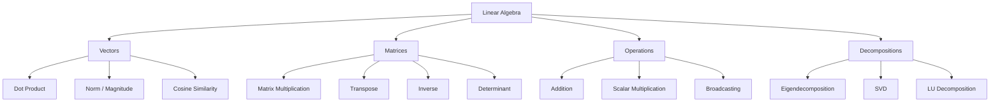
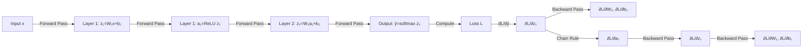
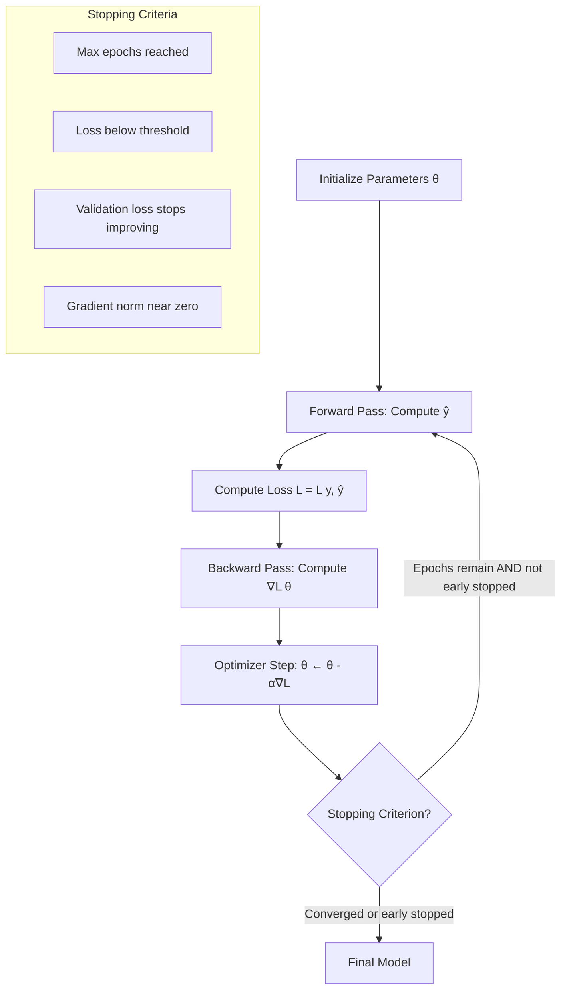

# Phase 2 — Mathematics for AI/ML

## Complete Learning & Interview Mastery Guide

---

## Table of Contents

1. [Why Mathematics Matters in AI/ML](#why-mathematics-matters-in-aiml)
2. [Linear Algebra](#linear-algebra)
3. [Vectors](#vectors)
4. [Matrices](#matrices)
5. [Probability](#probability)
6. [Statistics](#statistics)
7. [Calculus Basics](#calculus-basics)
8. [Gradients](#gradients)
9. [Optimization Intuition](#optimization-intuition)
10. [Interview Mastery](#interview-mastery)

---

## Why Mathematics Matters in AI/ML

### The Foundation You Cannot Skip

Many beginners want to jump straight to code. This is a mistake. Every algorithm you use in AI/ML is built on mathematics. When something breaks in production — your model diverges, predictions are nonsense, training is unstable — the engineer who understands the math fixes it in 30 minutes. The engineer who doesn't spends 3 days searching Stack Overflow.

| Math Area | Where It Appears |
|-----------|-----------------|
| **Linear Algebra** | Neural networks, embeddings, PCA, SVD |
| **Probability** | Bayesian models, uncertainty, sampling |
| **Statistics** | Model evaluation, hypothesis testing, data analysis |
| **Calculus** | Backpropagation, gradient descent, optimizers |

You don't need a PhD. You need intuition and enough fluency to read papers, debug models, and talk confidently in interviews.

---

## Linear Algebra

### Beginner Explanation

Linear algebra is the mathematics of data arranged in grids (matrices) and lists (vectors). Think of it as a language for talking about data transformations.

When you resize an image, rotate it, or compress it — that's linear algebra. When a neural network transforms your input through layers — that's matrix multiplication. Linear algebra is everywhere in ML.

### Technical Explanation

Linear algebra studies **vector spaces** and **linear transformations** between them. In ML:
- A dataset of n samples with p features is an **n × p matrix**
- A neural network layer is a **linear transformation**: y = Wx + b
- Dimensionality reduction (PCA) is finding the best **subspace** to project data into
- Word embeddings map words to **vectors** in a high-dimensional space

### Core Concepts Map



---

## Vectors

### Beginner Explanation

A vector is simply an ordered list of numbers. That's it.

```
v = [3, 5]         → a 2D vector (point in 2D space)
v = [1, 0, -2, 4]  → a 4D vector (point in 4D space)
```

In ML, almost everything is a vector:
- An image of 28×28 pixels = a vector of 784 numbers
- A word embedding = a vector of 300 numbers
- A user's preferences = a vector of features

### Technical Explanation

A vector **v** ∈ ℝⁿ is an element of n-dimensional real space. Geometrically, it represents a point or a direction and magnitude (arrow) in space.

### Key Vector Operations

#### 1. Vector Addition

```
[1, 2, 3] + [4, 5, 6] = [5, 7, 9]   (element-wise)
```

**Meaning**: Combining two transformations or features.

#### 2. Scalar Multiplication

```
3 × [1, 2, 3] = [3, 6, 9]   (scale each element)
```

**Meaning**: Stretching or shrinking a vector.

#### 3. Dot Product (Critical for ML)

```
a · b = Σ(aᵢ × bᵢ) = a₁b₁ + a₂b₂ + ... + aₙbₙ

Example:
[1, 2, 3] · [4, 5, 6] = (1×4) + (2×5) + (3×6) = 4 + 10 + 18 = 32
```

**Meaning**: Measures how much two vectors "align." This is literally what a neuron does — it takes the dot product of inputs and weights.

**Geometric interpretation**: `a · b = |a| × |b| × cos(θ)`

- If θ = 0° (same direction): dot product is maximum (positive)
- If θ = 90° (perpendicular): dot product = 0 (no similarity)
- If θ = 180° (opposite): dot product is minimum (negative)

#### 4. Vector Norm (Magnitude/Length)

```
L1 norm: ||v||₁ = Σ|vᵢ|          (Manhattan distance)
L2 norm: ||v||₂ = √(Σvᵢ²)        (Euclidean distance) ← most common
L∞ norm: ||v||∞ = max(|vᵢ|)
```

**In ML**: Used in regularization (L1 = Lasso, L2 = Ridge), distance metrics, and normalization.

#### 5. Cosine Similarity (Used Everywhere in NLP)

```
cosine_similarity(a, b) = (a · b) / (||a||₂ × ||b||₂)

Range: [-1, 1]
  1  = identical direction (same meaning)
  0  = perpendicular (no relation)
 -1  = opposite directions (opposite meaning)
```

**In ML**: Compare word embeddings, document similarity, recommendation systems.

### Visual Representation

```
2D Vector Space:

  y
  ↑
  |  b = [2, 3]
  |  ↗
  |/  a = [4, 1]
  +----------→ x

Dot product tells us how much a and b point in the same direction.
Cosine similarity normalizes this for vector length.
```

### Mathematical Intuition: Why Dot Product = Neuron

A single neuron computes:

```
output = w₁x₁ + w₂x₂ + w₃x₃ + b
       = w · x + b        ← DOT PRODUCT of weights and inputs + bias
```

This is why understanding vectors is fundamental — every neuron in every neural network is performing a dot product.

### Code — Vector Operations in NumPy

```python
import numpy as np

# Define vectors
a = np.array([1, 2, 3])
b = np.array([4, 5, 6])

# Basic operations
print("Addition:", a + b)                    # [5, 7, 9]
print("Scalar multiply:", 3 * a)             # [3, 6, 9]
print("Element-wise multiply:", a * b)       # [4, 10, 18]

# Dot product (three equivalent ways)
print("Dot product (np.dot):", np.dot(a, b))   # 32
print("Dot product (@):", a @ b)               # 32
print("Dot product (sum):", np.sum(a * b))     # 32

# Norms
print("L1 norm:", np.linalg.norm(a, ord=1))   # 6.0
print("L2 norm:", np.linalg.norm(a))           # 3.742
print("L2 norm (manual):", np.sqrt(np.sum(a**2)))  # 3.742

# Cosine similarity
def cosine_similarity(u, v):
    return np.dot(u, v) / (np.linalg.norm(u) * np.linalg.norm(v))

print("Cosine similarity:", cosine_similarity(a, b))  # 0.9746

# Unit vector (normalize)
a_unit = a / np.linalg.norm(a)
print("Unit vector:", a_unit)
print("Magnitude of unit vector:", np.linalg.norm(a_unit))  # 1.0

# Angle between vectors (in degrees)
theta = np.degrees(np.arccos(cosine_similarity(a, b)))
print(f"Angle between a and b: {theta:.2f}°")

# Cross product (3D only)
cross = np.cross(a, b)
print("Cross product:", cross)  # [-3, 6, -3]
```

### Real-World Analogies

| Vector Concept | Analogy |
|---------------|---------|
| Vector magnitude | Speed of a car (scalar from a vector) |
| Dot product | How much work is done when pushing with force F over displacement d |
| Cosine similarity | How similar two people's tastes are regardless of how strongly they feel |
| Unit vector | Compass direction (direction without magnitude) |

### Production Use Cases

| Use Case | Vector Concept | Example |
|----------|---------------|---------|
| Semantic search | Cosine similarity between embeddings | Google Search |
| Recommendation | Dot product of user × item vectors | Netflix |
| Image similarity | L2 distance between CNN features | Pinterest visual search |
| Fraud detection | Distance from "normal" user vector | Banking systems |
| RAG systems | Nearest neighbor vector search | LLM applications |

---

## Matrices

### Beginner Explanation

A matrix is a 2D grid of numbers — like a spreadsheet. Each row is a data sample, each column is a feature.

```
Dataset matrix (3 samples, 4 features):
        age  income  score  years
User1 [  25,  50000,    8,     2 ]
User2 [  45, 120000,    9,    15 ]
User3 [  35,  75000,    7,     8 ]
```

### Technical Explanation

A matrix **A** ∈ ℝ^(m×n) has m rows and n columns. In ML:
- Data matrix **X** ∈ ℝ^(n×p): n samples, p features
- Weight matrix **W** ∈ ℝ^(d_in × d_out): neural network layer weights
- Gram matrix **X^T X**: used in linear regression, covariance
- Attention matrix: transformer's query × key similarity scores

### Key Matrix Operations

#### 1. Matrix Multiplication (The Most Important Operation in DL)

For **A** (m×n) and **B** (n×p):
```
C = A × B    →    C[i,j] = Σₖ A[i,k] × B[k,j]

Result shape: C is (m×p)
Key rule: Inner dimensions must match → (m×n) × (n×p) = (m×p)
```

**Why it matters**: Every neural network forward pass is a series of matrix multiplications.

```
Input (batch_size × input_dim) × Weights (input_dim × hidden_dim) = Hidden (batch_size × hidden_dim)
```

#### Visual Matrix Multiplication

```
A (2×3):    B (3×2):        C = A×B (2×2):
[1 2 3]     [7  8 ]         [1×7+2×9+3×11  1×8+2×10+3×12]   [58  64]
[4 5 6]  ×  [9  10]    =    [4×7+5×9+6×11  4×8+5×10+6×12] = [139 154]
            [11 12]
```

#### 2. Transpose

```
A = [1 2 3]      A^T = [1 4]
    [4 5 6]            [2 5]
                       [3 6]
```

Shape of A (m×n) → A^T is (n×m). Used in backpropagation, covariance matrices.

#### 3. Matrix Inverse

```
If A × A⁻¹ = I (identity matrix), then A⁻¹ is the inverse of A.
```

**In ML**: Analytical solution to linear regression: θ = (X^T X)⁻¹ X^T y

**Warning**: Computing the inverse is O(n³) — expensive for large matrices. In practice, we never actually invert matrices; we solve systems of equations instead.

#### 4. Determinant

A scalar value that tells you:
- If det(A) = 0 → matrix is singular, not invertible
- |det(A)| tells you how much the transformation scales volumes
- Sign tells you if orientation is preserved or flipped

#### 5. Identity Matrix

```
I₃ = [1 0 0]
     [0 1 0]
     [0 0 1]
```

A × I = A (like multiplying a number by 1). Used as initialization for some weights.

### Eigenvalues and Eigenvectors — Critical for ML

**Definition**: For matrix A, vector **v** is an eigenvector if:
```
A v = λ v
```
Where λ is the **eigenvalue** — a scalar.

**Meaning**: When you transform **v** by matrix A, it doesn't change direction — it only scales by λ.

**Why it matters in ML**:
- **PCA**: Principal components are eigenvectors of the covariance matrix
- **Spectral clustering**: Graph Laplacian eigenvectors reveal cluster structure
- **Stability analysis**: Eigenvalues of the Hessian tell you about loss landscape curvature
- **PageRank**: Google's algorithm uses eigenvectors of the web link matrix

### Singular Value Decomposition (SVD)

Every matrix A can be decomposed as:
```
A = U Σ V^T

Where:
- U: Left singular vectors (m×m orthogonal)
- Σ: Diagonal matrix of singular values (m×n)
- V^T: Right singular vectors (n×n orthogonal)
```

**Applications**:
- **PCA**: SVD of centered data matrix
- **Recommendation systems**: Matrix factorization (Netflix Prize)
- **NLP**: LSA (Latent Semantic Analysis)
- **Image compression**: Keep top-k singular values
- **Pseudoinverse**: When A is not square or not invertible

### Code — Matrix Operations in NumPy

```python
import numpy as np

# Create matrices
A = np.array([[1, 2, 3],
              [4, 5, 6]])          # Shape: (2, 3)

B = np.array([[7, 8],
              [9, 10],
              [11, 12]])            # Shape: (3, 2)

# Matrix multiplication
C = A @ B                           # (2,3) @ (3,2) = (2,2)
print("Matrix multiplication:\n", C)
# [[58, 64], [139, 154]]

# Element-wise multiplication (different from matrix mult!)
D = np.array([[1, 2], [3, 4]])
E = np.array([[5, 6], [7, 8]])
print("Element-wise:\n", D * E)    # [[5,12],[21,32]]
print("Matrix mult:\n", D @ E)     # [[19,22],[43,50]]

# Transpose
print("Transpose of A:\n", A.T)    # Shape: (3, 2)

# Square matrix operations
M = np.array([[4, 7], [2, 6]])
print("Determinant:", np.linalg.det(M))          # 10.0
print("Inverse:\n", np.linalg.inv(M))
print("M @ M_inv:\n", M @ np.linalg.inv(M))     # Identity matrix

# Eigendecomposition
eigenvalues, eigenvectors = np.linalg.eig(M)
print("Eigenvalues:", eigenvalues)
print("Eigenvectors:\n", eigenvectors)

# Verify: M @ v = λ × v
for i in range(len(eigenvalues)):
    v = eigenvectors[:, i]
    lambda_ = eigenvalues[i]
    print(f"\nλ={lambda_:.2f}: M@v = {M@v}, λ×v = {lambda_*v}")
    
# SVD
U, S, Vt = np.linalg.svd(A)
print(f"\nSVD:\nU shape: {U.shape}")
print(f"S (singular values): {S}")
print(f"Vt shape: {Vt.shape}")

# Reconstruct A from SVD (low-rank approximation)
k = 2  # keep top k singular values
A_approx = U[:, :k] @ np.diag(S[:k]) @ Vt[:k, :]
print(f"\nOriginal A:\n{A}")
print(f"Rank-{k} approximation:\n{A_approx}")
```

### Matrix Operations in Neural Networks

```python
import torch

# Simulating a single linear layer
batch_size = 32
input_dim = 512
output_dim = 256

# Weight matrix W and bias b
W = torch.randn(input_dim, output_dim) * 0.01
b = torch.zeros(output_dim)

# Input batch
X = torch.randn(batch_size, input_dim)

# Forward pass: linear transformation
# This is literally just matrix multiplication!
Z = X @ W + b     # (32, 512) @ (512, 256) + (256,) = (32, 256)

print(f"Input shape: {X.shape}")       # (32, 512)
print(f"Weight shape: {W.shape}")      # (512, 256)
print(f"Output shape: {Z.shape}")      # (32, 256)

# Neural network with nn.Linear (does the same thing)
import torch.nn as nn
layer = nn.Linear(input_dim, output_dim)
Z2 = layer(X)
print(f"nn.Linear output shape: {Z2.shape}")  # (32, 256)
```

### Broadcasting — Critical NumPy Concept

```python
import numpy as np

# Broadcasting allows operations between different-shaped arrays
A = np.array([[1, 2, 3],
              [4, 5, 6]])     # (2, 3)

b = np.array([10, 20, 30])   # (3,) — will broadcast to (2, 3)

print(A + b)
# [[11, 22, 33],
#  [14, 25, 36]]

# Why this matters: Adding bias to every sample in a batch
# batch_output (batch_size=32, hidden=64) + bias (64,)
# NumPy/PyTorch automatically broadcasts bias to every row

# Rules for broadcasting:
# 1. Dimensions compared from right
# 2. Dimensions compatible if equal OR one of them is 1
# (2, 3) + (3,) → (3,) becomes (1, 3) → broadcast to (2, 3) ✓
# (2, 3) + (2,) → incompatible! (3 ≠ 2 and neither is 1) ✗
```

---

## Probability

### Beginner Explanation

Probability is the mathematics of uncertainty. Since ML models make predictions about uncertain events, probability is foundational.

Probability of event A: P(A) — a number between 0 and 1.
- P(A) = 0 → impossible
- P(A) = 1 → certain
- P(A) = 0.7 → 70% chance

### Technical Explanation

**Probability theory** provides the rigorous framework for reasoning about uncertainty. In ML:
- Model outputs are probabilities (softmax, sigmoid)
- Bayesian methods use probability to update beliefs with data
- Loss functions are derived from likelihood functions
- Regularization has a probabilistic interpretation (MAP estimation)

### Core Concepts

#### 1. Sample Space, Events, and Probability

```
Sample space Ω: All possible outcomes
Event A: A subset of Ω
Probability: P: Ω → [0,1] satisfying:
  1. P(Ω) = 1
  2. P(A ∪ B) = P(A) + P(B)  if A and B are mutually exclusive
  3. P(A) ≥ 0 for all events A
```

#### 2. Conditional Probability

```
P(A | B) = P(A ∩ B) / P(B)

"Probability of A given that B has occurred"
```

**In ML**: P(y=spam | email contains "win money") — given the features, what's the class probability?

#### 3. Independence

Events A and B are **independent** if:
```
P(A ∩ B) = P(A) × P(B)
Equivalently: P(A | B) = P(A)
```

**In ML**: Naive Bayes assumes all features are conditionally independent given the class.

#### 4. Bayes' Theorem — The Most Important Formula in Probabilistic ML

```
P(A | B) = P(B | A) × P(A) / P(B)

In ML notation:
P(θ | data) = P(data | θ) × P(θ) / P(data)

Where:
- P(θ | data) = Posterior (what we want — parameters given data)
- P(data | θ) = Likelihood (how well parameters explain data)
- P(θ)         = Prior (beliefs before seeing data)
- P(data)       = Evidence (normalizing constant)
```

**Intuitive example** — Medical test:
```
Disease prevalence: P(D) = 0.001     (1 in 1000 people have disease)
Test sensitivity:  P(+|D) = 0.99    (99% true positive rate)
Test specificity:  P(-|¬D) = 0.99   (1% false positive rate)

P(D | +) = P(+|D) × P(D) / P(+)
         = 0.99 × 0.001 / [(0.99×0.001) + (0.01×0.999)]
         = 0.000990 / (0.000990 + 0.009990)
         = 0.0902 ≈ 9%

Result: Even with a 99% accurate test, if you test positive,
there's only a 9% chance you actually have the disease!
This is the base rate fallacy — ignoring priors is dangerous.
```

#### 5. Random Variables and Distributions

A **random variable** X maps outcomes to numbers.

**Discrete distributions** (countable outcomes):

| Distribution | PMF | Parameters | Use in ML |
|-------------|-----|-----------|-----------|
| **Bernoulli** | P(X=1) = p | p | Binary outcomes, binary cross-entropy |
| **Binomial** | C(n,k) pᵏ(1-p)^(n-k) | n, p | Number of successes in n trials |
| **Categorical** | P(X=k) = pₖ | p₁,...,pₖ | Multi-class classification (softmax output) |
| **Poisson** | e^(-λ) λˣ / x! | λ | Count data, event rates |

**Continuous distributions**:

| Distribution | PDF | Parameters | Use in ML |
|-------------|-----|-----------|-----------|
| **Normal (Gaussian)** | (1/σ√2π) e^(-(x-μ)²/2σ²) | μ, σ | Weight init, noise models, CLT |
| **Uniform** | 1/(b-a) | a, b | Random initialization |
| **Beta** | Γ(α+β)/[Γ(α)Γ(β)] x^(α-1)(1-x)^(β-1) | α, β | Probabilities, Bayesian models |
| **Exponential** | λe^(-λx) | λ | Time between events |

#### 6. Expected Value and Variance

```
Expected value (mean):
E[X] = Σ x·P(X=x)          (discrete)
E[X] = ∫ x·f(x)dx           (continuous)

Variance:
Var(X) = E[(X - E[X])²] = E[X²] - (E[X])²

Standard deviation:
σ = √Var(X)
```

**In ML**: 
- Expected value = average prediction across many runs
- Variance = how much predictions vary across runs
- Cross-entropy loss = negative expected log-likelihood

#### 7. Joint, Marginal, and Conditional Distributions

```
Joint:       P(X, Y) — both X and Y together
Marginal:    P(X) = Σᵧ P(X, Y) — summing out Y
Conditional: P(X | Y) = P(X, Y) / P(Y)

These relate via: P(X, Y) = P(X | Y) × P(Y) = P(Y | X) × P(X)
```

#### 8. Maximum Likelihood Estimation (MLE) — How Models Learn

Given data D = {x₁, ..., xₙ}, find parameters θ that maximize:
```
L(θ) = P(D | θ) = Π P(xᵢ | θ)    (likelihood)

In practice, maximize log-likelihood (sum instead of product):
ℓ(θ) = Σ log P(xᵢ | θ)

Minimizing negative log-likelihood = Minimizing your loss function!
```

**Key insight**: 
- MSE loss = MLE assuming Gaussian noise
- Cross-entropy loss = MLE for classification assuming Bernoulli/Categorical

### Code — Probability in Python

```python
import numpy as np
from scipy import stats

# Normal distribution
mu, sigma = 0, 1
normal = stats.norm(mu, sigma)

# PDF (probability density at a point)
print(f"P(X=0) = {normal.pdf(0):.4f}")      # 0.3989

# CDF (cumulative probability up to a point)
print(f"P(X≤1.96) = {normal.cdf(1.96):.4f}")   # 0.9750 (classic 95% CI)
print(f"P(-1.96≤X≤1.96) = {normal.cdf(1.96) - normal.cdf(-1.96):.4f}")  # 0.9500

# Generate samples
samples = normal.rvs(size=10000)
print(f"Sample mean: {samples.mean():.4f}")     # ≈ 0
print(f"Sample std:  {samples.std():.4f}")      # ≈ 1

# Bayes' theorem implementation
def bayes_update(prior, likelihood_pos, likelihood_neg):
    """
    Update probability estimate given new evidence.
    prior: P(hypothesis)
    likelihood_pos: P(evidence | hypothesis true)
    likelihood_neg: P(evidence | hypothesis false)
    """
    # P(evidence) = P(evidence|true)*P(true) + P(evidence|false)*P(false)
    p_evidence = likelihood_pos * prior + likelihood_neg * (1 - prior)
    # P(hypothesis | evidence) = P(evidence | hypothesis) * P(hypothesis) / P(evidence)
    posterior = (likelihood_pos * prior) / p_evidence
    return posterior

# Medical test example
prior = 0.001       # 0.1% base rate
sensitivity = 0.99  # P(+ | disease)
false_pos = 0.01    # P(+ | no disease)

posterior = bayes_update(prior, sensitivity, false_pos)
print(f"\nP(disease | positive test) = {posterior:.4f}")  # 0.0902

# Demonstrate how prior matters
for base_rate in [0.001, 0.01, 0.1, 0.5]:
    p = bayes_update(base_rate, 0.99, 0.01)
    print(f"P(disease | +) with base rate {base_rate}: {p:.4f}")
```

### Information Theory Concepts Used in ML

#### Entropy

```
H(X) = -Σ P(x) log P(x)     (in bits if log₂, in nats if logₑ)

Measures: Average uncertainty / information content
- High entropy = unpredictable distribution (uniform)
- Low entropy = predictable distribution (one outcome likely)
```

#### KL Divergence

```
KL(P || Q) = Σ P(x) log[P(x)/Q(x)]

Measures: How different Q is from P
- KL(P || P) = 0
- KL is NOT symmetric: KL(P||Q) ≠ KL(Q||P)
```

**In ML**: VAE's loss uses KL divergence to keep latent space regularized.

#### Cross-Entropy

```
H(P, Q) = -Σ P(x) log Q(x) = H(P) + KL(P || Q)

In classification:
Loss = -Σ yᵢ log(ŷᵢ)

This is what we minimize when training classifiers!
```

---

## Statistics

### Beginner Explanation

Statistics is about extracting meaning from data. It answers: "What do these numbers tell us? Are these patterns real or just random noise? How confident should we be?"

In ML, statistics is used to:
- Understand data before modeling (EDA)
- Evaluate model performance
- A/B test if a new model is truly better
- Detect data drift in production

### Descriptive Statistics

| Measure | Formula | What It Tells You |
|---------|---------|-------------------|
| **Mean** | Σxᵢ / n | Central tendency (sensitive to outliers) |
| **Median** | Middle value | Central tendency (robust to outliers) |
| **Mode** | Most frequent | Most common value |
| **Variance** | Σ(xᵢ-μ)² / n | Spread around mean |
| **Std Dev** | √variance | Spread in original units |
| **IQR** | Q3 - Q1 | Robust measure of spread |
| **Skewness** | E[(x-μ)³]/σ³ | Asymmetry of distribution |
| **Kurtosis** | E[(x-μ)⁴]/σ⁴ - 3 | "Tailedness" of distribution |

### Distributions You Must Know

#### The Normal (Gaussian) Distribution — The Most Important

```
f(x) = (1/σ√2π) exp(-(x-μ)²/2σ²)

Properties:
- Symmetric around mean μ
- 68% of data within 1σ
- 95% of data within 2σ
- 99.7% of data within 3σ
```

**Why it's everywhere**:
- **Central Limit Theorem**: Sum/average of many independent random variables approaches Normal
- **Weight initialization**: Normal distribution for neural network weights
- **MLE**: Minimizing MSE assumes Gaussian noise
- **Anomaly detection**: Points > 3σ from mean are likely anomalies

#### The Central Limit Theorem (CLT)

```
If X₁, X₂, ..., Xₙ are iid random variables with mean μ and variance σ²,
then as n → ∞:

X̄ₙ ≈ Normal(μ, σ²/n)

Regardless of the underlying distribution!
```

**Practical meaning**: Sample means are approximately normally distributed even if the data isn't. This justifies using z-tests, t-tests, and confidence intervals in practice.

### Hypothesis Testing

Used to determine if a model improvement is statistically significant or just luck.

#### Framework

```
1. State null hypothesis H₀: "New model = old model (no improvement)"
2. State alternative H₁: "New model > old model"
3. Choose significance level α (typically 0.05)
4. Compute test statistic from data
5. Compute p-value: P(observing this result | H₀ is true)
6. If p-value < α: reject H₀ (statistically significant)
```

#### t-test Example

```python
from scipy import stats
import numpy as np

# Old model accuracy on 100 test samples
old_model = np.array([0.92, 0.89, 0.91, ...])  # 100 samples

# New model accuracy on same 100 samples  
new_model = np.array([0.94, 0.93, 0.95, ...])  # 100 samples

# Paired t-test (same test set)
t_stat, p_value = stats.ttest_rel(new_model, old_model)

print(f"t-statistic: {t_stat:.4f}")
print(f"p-value: {p_value:.4f}")

if p_value < 0.05:
    print("New model IS significantly better (p < 0.05)")
else:
    print("Cannot conclude new model is better")
```

### Correlation and Covariance

```
Covariance(X, Y) = E[(X - μₓ)(Y - μᵧ)]    (not normalized)

Correlation(X, Y) = Cov(X,Y) / (σₓ × σᵧ)    (ranges [-1, 1])

r = 1:  perfect positive correlation
r = 0:  no linear correlation
r = -1: perfect negative correlation
```

**In ML**: 
- Highly correlated features can cause multicollinearity in linear models
- Correlation matrix used in feature selection
- Covariance matrix is fundamental to PCA

### Code — Statistics in Python

```python
import numpy as np
import pandas as pd
from scipy import stats

# Generate sample data
np.random.seed(42)
data = np.random.normal(loc=50, scale=10, size=1000)

# Descriptive statistics
print("=== Descriptive Statistics ===")
print(f"Mean:     {np.mean(data):.4f}")
print(f"Median:   {np.median(data):.4f}")
print(f"Std:      {np.std(data):.4f}")
print(f"Variance: {np.var(data):.4f}")
print(f"Min:      {np.min(data):.4f}")
print(f"Max:      {np.max(data):.4f}")
print(f"Q1:       {np.percentile(data, 25):.4f}")
print(f"Q3:       {np.percentile(data, 75):.4f}")
print(f"IQR:      {stats.iqr(data):.4f}")
print(f"Skewness: {stats.skew(data):.4f}")
print(f"Kurtosis: {stats.kurtosis(data):.4f}")

# Pandas equivalent (one-liner)
s = pd.Series(data)
print("\n", s.describe())

# Normality test (Shapiro-Wilk for small samples)
stat, p = stats.shapiro(data[:50])
print(f"\nShapiro-Wilk test: stat={stat:.4f}, p={p:.4f}")
print("Normal?" , "Yes" if p > 0.05 else "No")

# Correlation
x = np.random.randn(100)
y = 2*x + np.random.randn(100)*0.5  # Highly correlated with x

r, p_val = stats.pearsonr(x, y)
print(f"\nPearson correlation: r={r:.4f}, p={p_val:.6f}")

rho, p_val = stats.spearmanr(x, y)
print(f"Spearman correlation: ρ={rho:.4f}, p={p_val:.6f}")

# Outlier detection using z-score
z_scores = np.abs(stats.zscore(data))
outliers = data[z_scores > 3]
print(f"\nOutliers (|z| > 3): {len(outliers)} / {len(data)}")

# Confidence interval for mean
confidence = 0.95
ci = stats.t.interval(confidence, df=len(data)-1, 
                       loc=np.mean(data), 
                       scale=stats.sem(data))
print(f"\n{int(confidence*100)}% Confidence Interval: ({ci[0]:.4f}, {ci[1]:.4f})")
```

### Statistical Concepts in ML Evaluation

| Concept | ML Application |
|---------|---------------|
| **p-value** | Is model improvement statistically significant? |
| **Confidence interval** | Range of plausible performance values |
| **Bootstrap** | Estimate metric uncertainty without theoretical assumptions |
| **A/B testing** | Compare model versions in production |
| **Effect size** | Practical significance (not just statistical) |
| **Power analysis** | How many samples needed to detect a difference? |

---

## Calculus Basics

### Beginner Explanation

Calculus is the mathematics of change. In ML, we need to know:
1. How much does the model's error change when we slightly adjust each weight?
2. Which direction should we move each weight to reduce error?

Derivatives give us exactly this — they measure **rate of change**.

### Derivatives

A derivative f'(x) (or df/dx) tells you: "If I increase x by a tiny amount, how much does f(x) change?"

#### Rules Every ML Engineer Must Know

| Rule | Formula | Example |
|------|---------|---------|
| **Power rule** | d/dx[xⁿ] = nxⁿ⁻¹ | d/dx[x³] = 3x² |
| **Sum rule** | d/dx[f+g] = f' + g' | d/dx[x²+x] = 2x+1 |
| **Product rule** | d/dx[f·g] = f'g + fg' | d/dx[x·sin(x)] = sin(x)+x·cos(x) |
| **Chain rule** | d/dx[f(g(x))] = f'(g(x))·g'(x) | d/dx[sin(x²)] = cos(x²)·2x |
| **Exponential** | d/dx[eˣ] = eˣ | Unchanged! |
| **Natural log** | d/dx[ln(x)] = 1/x | Used in cross-entropy |
| **Sigmoid** | d/dx[σ(x)] = σ(x)(1-σ(x)) | Used in backprop |

#### The Chain Rule — The Heart of Backpropagation

```
If y = f(g(x)), then:
dy/dx = (dy/dg) × (dg/dx)

For a neural network with layers:
Loss = L(a₃)
a₃ = f₃(z₃)
z₃ = W₃ · a₂ + b₃

dL/dW₃ = (dL/da₃) × (da₃/dz₃) × (dz₃/dW₃)
```

This chain of multiplied derivatives, applied layer by layer in reverse, is **backpropagation**.

### Partial Derivatives

When a function has multiple inputs (like a neural network with millions of weights), we use **partial derivatives** — derivative with respect to one variable, holding others constant.

```
f(x, y) = x² + 3xy + y²

∂f/∂x = 2x + 3y    (treat y as constant)
∂f/∂y = 3x + 2y    (treat x as constant)
```

### The Gradient — A Vector of Partial Derivatives

```
∇f(x) = [∂f/∂x₁, ∂f/∂x₂, ..., ∂f/∂xₙ]
```

**The gradient points in the direction of steepest increase.**
To minimize f, we move in the **negative gradient direction**.

### Derivatives of Common ML Functions

```
1. MSE Loss: L = (1/n) Σ(y - ŷ)²
   dL/dŷ = -(2/n)(y - ŷ)

2. Binary Cross-Entropy: L = -[y·log(ŷ) + (1-y)·log(1-ŷ)]
   dL/dŷ = -y/ŷ + (1-y)/(1-ŷ)

3. ReLU: f(x) = max(0, x)
   f'(x) = 1 if x > 0, else 0

4. Sigmoid: σ(x) = 1/(1+e⁻ˣ)
   σ'(x) = σ(x)(1-σ(x))

5. Tanh: tanh(x) = (eˣ-e⁻ˣ)/(eˣ+e⁻ˣ)
   tanh'(x) = 1 - tanh²(x)

6. Softmax: σᵢ(z) = eᶻⁱ / Σeᶻʲ
   ∂σᵢ/∂zⱼ = σᵢ(δᵢⱼ - σⱼ)
```

### Code — Automatic Differentiation in PyTorch

```python
import torch

# PyTorch tracks gradients automatically
x = torch.tensor([2.0, 3.0, 4.0], requires_grad=True)

# Define a function
y = x**2 + 3*x + 1      # y = x² + 3x + 1
z = y.sum()               # Sum to get scalar for .backward()

# Backpropagation — computes all gradients
z.backward()

# Gradients: dz/dx = 2x + 3
print("x:", x.data)                   # [2, 3, 4]
print("Computed gradients:", x.grad)  # [7, 9, 11]  (2*2+3, 2*3+3, 2*4+3)
print("Expected: 2x + 3 =", 2*x.data + 3)  # [7, 9, 11]

# Chain rule example
a = torch.tensor(3.0, requires_grad=True)
b = a ** 2         # b = a²,  db/da = 2a = 6
c = torch.sin(b)   # c = sin(b),  dc/db = cos(b)
# By chain rule: dc/da = dc/db × db/da = cos(a²) × 2a
c.backward()
print(f"\na = {a.item()}")
print(f"dc/da (automatic): {a.grad.item():.6f}")
print(f"dc/da (manual): {(torch.cos(a**2) * 2*a).item():.6f}")

# Gradient of a real loss function
weights = torch.randn(3, requires_grad=True)
X = torch.tensor([[1.0, 2.0, 3.0], [4.0, 5.0, 6.0]])
y_true = torch.tensor([7.0, 16.0])

# Forward pass
y_pred = X @ weights          # (2,3) @ (3,) = (2,)
loss = ((y_true - y_pred)**2).mean()   # MSE

# Backward pass
loss.backward()

print(f"\nLoss: {loss.item():.4f}")
print(f"dL/dweights: {weights.grad}")  # Gradient used to update weights
```

---

## Gradients

### Beginner Explanation

Imagine standing on a hillside in thick fog. You can't see the valley below, but you can feel the slope under your feet. The gradient tells you:
- **Direction**: Which way is uphill?
- **Magnitude**: How steep is the slope?

To find the lowest point (minimize loss), move in the **opposite direction** of the gradient.

### Technical Explanation

For a function f: ℝⁿ → ℝ, the gradient at point **x** is:
```
∇f(x) = [∂f/∂x₁, ∂f/∂x₂, ..., ∂f/∂xₙ]ᵀ
```

**Key properties**:
1. ∇f(x) points in the direction of steepest ascent
2. -∇f(x) points in the direction of steepest descent
3. ∇f(x) = 0 at critical points (minima, maxima, saddle points)
4. The Hessian H = ∇²f tells you about curvature (second-order info)

### Gradient Computation: Manual vs Automatic

#### Manual (for understanding)

```
For L = MSE = (1/n) Σ(yᵢ - wᵀxᵢ - b)²

∂L/∂w = -(2/n) Σ(yᵢ - wᵀxᵢ - b)xᵢ    → Gradient w.r.t. weights
∂L/∂b = -(2/n) Σ(yᵢ - wᵀxᵢ - b)       → Gradient w.r.t. bias
```

#### Automatic (PyTorch/TensorFlow does this for you)

The frameworks build a **computational graph** that tracks every operation. When you call `.backward()`, it traverses this graph in reverse, applying the chain rule at each node.

### The Backpropagation Algorithm



**Key equation for each layer**:
```
∂L/∂Wₗ = ∂L/∂aₗ · ∂aₗ/∂zₗ · ∂zₗ/∂Wₗ
        = δₗ · aₗ₋₁ᵀ

Where δₗ = ∂L/∂zₗ is the "error signal" at layer l
```

### Vanishing and Exploding Gradients

**Vanishing gradients**: During backprop, gradients shrink as they propagate backward through layers. Deep networks with sigmoid/tanh activations suffer from this — early layers barely learn.

**Exploding gradients**: Gradients grow exponentially. Common in RNNs.

```
Problem: Sigmoid derivative σ'(x) = σ(x)(1-σ(x)) ≤ 0.25
         In a 10-layer network: 0.25^10 ≈ 0.0000001 → gradient vanishes!

Solutions:
- ReLU activation: derivative = 1 (no squashing!)
- Batch normalization: normalize activations between layers
- Residual connections (ResNet): gradient highways
- Gradient clipping: cap gradient magnitude (for exploding)
- Better initialization: Xavier/He initialization
```

```python
import torch
import torch.nn as nn

# Demonstrate vanishing gradient with sigmoid
class DeepSigmoidNet(nn.Module):
    def __init__(self, depth=20):
        super().__init__()
        self.layers = nn.ModuleList([
            nn.Sequential(nn.Linear(10, 10), nn.Sigmoid())
            for _ in range(depth)
        ])
    
    def forward(self, x):
        for layer in self.layers:
            x = layer(x)
        return x

# Compare sigmoid vs ReLU gradient flow
for activation_name, activation in [("Sigmoid", nn.Sigmoid()), ("ReLU", nn.ReLU())]:
    model = nn.Sequential(*[
        nn.Sequential(nn.Linear(10, 10), activation)
        for _ in range(20)
    ])
    
    x = torch.randn(1, 10)
    y = model(x).sum()
    y.backward()
    
    # Check gradient magnitude in first layer
    first_grad = model[0][0].weight.grad
    print(f"{activation_name} - First layer gradient norm: {first_grad.norm().item():.8f}")
```

---

## Optimization Intuition

### Beginner Explanation

Optimization is finding the best solution. In ML:
- "Best" = parameters that minimize our loss function
- "Solution" = the specific values of all weights and biases

It's like navigating to the lowest point in a mountain range, but you're in a multi-million dimensional space where you can't see the whole landscape.

### The Loss Surface

The **loss surface** is a multi-dimensional landscape where:
- **Position** = current model parameters (θ)
- **Height** = current loss value L(θ)
- **Goal** = find the lowest valley (global minimum)

```
1D Illustration:

Loss
  |  
  |       /\      /\
  |      /  \    /  \     ← local minima (bad)
  |  /\ /    \  /    \
  | /  \      \/      \   ← saddle points
  |/    Global Minimum \
  |________________________
              θ
```

### Gradient Descent

The fundamental optimization algorithm in ML.

```
θ ← θ - α × ∇L(θ)

Where:
- θ = parameters (weights and biases)
- α = learning rate (step size)
- ∇L(θ) = gradient of loss w.r.t. parameters
```

#### Three Variants

| Variant | Description | Pros | Cons |
|---------|-------------|------|------|
| **Batch GD** | Compute gradient over entire dataset | Stable convergence | Slow for large datasets |
| **Stochastic GD (SGD)** | Compute gradient over 1 sample | Fast updates | Very noisy |
| **Mini-batch GD** | Compute gradient over mini-batch (32-256) | Balance of speed/stability | Common choice in DL |

### Learning Rate — The Most Critical Hyperparameter

```
Too high:  Loss oscillates or diverges   (bouncing around, missing valley)
Too low:   Training is very slow         (tiny steps toward minimum)
Just right: Stable convergence           (reaches minimum efficiently)
```

```
Typical ranges:
- SGD: 0.01 to 0.1
- Adam: 0.001 (default is almost always good)
- Fine-tuning pretrained: 1e-5 to 1e-4
```

### Learning Rate Schedules

```python
import torch
import torch.optim as optim

model = nn.Linear(10, 1)

# Base optimizer
optimizer = optim.SGD(model.parameters(), lr=0.1)

# 1. StepLR: Multiply lr by gamma every step_size epochs
scheduler = optim.lr_scheduler.StepLR(
    optimizer, step_size=30, gamma=0.1
)
# lr: epoch 0-29: 0.1, epoch 30-59: 0.01, epoch 60+: 0.001

# 2. CosineAnnealingLR: Cosine decay (popular for DL)
scheduler = optim.lr_scheduler.CosineAnnealingLR(
    optimizer, T_max=100, eta_min=1e-6
)

# 3. ReduceLROnPlateau: Reduce when metric stops improving
scheduler = optim.lr_scheduler.ReduceLROnPlateau(
    optimizer, mode='min', factor=0.5, patience=10
)

# 4. Warmup + Cosine (used in transformers)
from transformers import get_cosine_schedule_with_warmup
scheduler = get_cosine_schedule_with_warmup(
    optimizer, 
    num_warmup_steps=500,
    num_training_steps=10000
)

# Training loop with scheduler
for epoch in range(100):
    train_loss = train_one_epoch()
    
    # Update learning rate
    scheduler.step()      # Most schedulers
    # scheduler.step(val_loss)  # For ReduceLROnPlateau
    
    current_lr = optimizer.param_groups[0]['lr']
    print(f"Epoch {epoch}, Loss: {train_loss:.4f}, LR: {current_lr:.6f}")
```

### Advanced Optimizers

#### Adam — The Default Choice for Deep Learning

```
Adam (Adaptive Moment Estimation):

m_t = β₁ m_{t-1} + (1-β₁) g_t          ← 1st moment (mean of gradients)
v_t = β₂ v_{t-1} + (1-β₂) g_t²         ← 2nd moment (mean of squared gradients)

m̂_t = m_t / (1 - β₁ᵗ)                  ← bias correction
v̂_t = v_t / (1 - β₂ᵗ)                  ← bias correction

θ_t = θ_{t-1} - α × m̂_t / (√v̂_t + ε)

Default hyperparameters:
- β₁ = 0.9       (momentum for mean)
- β₂ = 0.999     (momentum for variance)
- ε = 1e-8       (numerical stability)
- α = 0.001      (learning rate)
```

**Why Adam works well**:
- **Adaptive per-parameter learning rates**: Params with large gradients get smaller effective LR
- **Momentum**: Uses history of gradients to smooth updates
- **Handles sparse gradients**: Great for NLP (most words rarely appear)

#### Optimizer Comparison

| Optimizer | Adaptive LR | Momentum | Best For | Typical LR |
|-----------|------------|---------|---------|-----------|
| **SGD** | No | Optional | CV with momentum | 0.01-0.1 |
| **SGD + Momentum** | No | Yes | ResNet, many CV tasks | 0.01 |
| **Adam** | Yes | Yes | NLP, transformers, general | 0.001 |
| **AdaGrad** | Yes | No | Sparse data | 0.01 |
| **RMSProp** | Yes | No | RNNs | 0.001 |
| **AdamW** | Yes | Yes | Transformers + weight decay | 1e-4 to 1e-5 |
| **LAMB** | Yes | Yes | Large batch training | scales with batch |

### Challenges in Optimization

#### 1. Saddle Points

Points where gradient = 0 but it's neither min nor max. Common in high-dimensional spaces. **Adam** handles these better than vanilla SGD.

#### 2. Local Minima

Multiple valleys exist — we might find a local minimum, not the global one. In practice for deep learning, local minima found by SGD are usually good enough because:
- Good local minima generalize well
- Flat minima tend to generalize better than sharp ones
- The loss landscape of well-trained networks has many equivalent good solutions

#### 3. The Importance of Initialization

Bad initialization → training diverges or converges very slowly.

```python
import torch.nn as nn

# Xavier/Glorot initialization (for sigmoid/tanh)
layer = nn.Linear(256, 128)
nn.init.xavier_uniform_(layer.weight)
# Var(W) = 2 / (fan_in + fan_out)

# He/Kaiming initialization (for ReLU)
nn.init.kaiming_normal_(layer.weight, mode='fan_out', nonlinearity='relu')
# Var(W) = 2 / fan_in

# Why it matters:
# Too small weights → signals fade through layers (vanishing)
# Too large weights → signals explode (exploding gradients)
# Proper init → signals propagate at consistent scale
```

### Second-Order Optimization (Advanced)

Gradient descent only uses first-order information (slope). Second-order methods also use curvature (the Hessian).

```
Newton's method:
θ ← θ - H⁻¹ ∇L(θ)

Where H is the Hessian matrix of second derivatives.

Advantages: Can escape saddle points, fewer iterations needed
Disadvantages: Computing H⁻¹ is O(n³) — impractical for millions of params

Practical approximations:
- L-BFGS: Approximates Hessian using gradient history
- Natural gradient: Uses Fisher information matrix
- K-FAC: Kronecker-factored approximate curvature
```

### Full Optimization Code Example

```python
import torch
import torch.nn as nn
import torch.optim as optim
from torch.utils.data import DataLoader, TensorDataset
import numpy as np

# Generate synthetic dataset
np.random.seed(42)
X = np.random.randn(1000, 20).astype(np.float32)
y = (X[:, 0] + 2*X[:, 1] - X[:, 2] + np.random.randn(1000) * 0.1).astype(np.float32)

X_tensor = torch.FloatTensor(X)
y_tensor = torch.FloatTensor(y)

# DataLoader
dataset = TensorDataset(X_tensor, y_tensor)
train_size = 800
train_dataset = torch.utils.data.Subset(dataset, range(train_size))
val_dataset = torch.utils.data.Subset(dataset, range(train_size, 1000))

train_loader = DataLoader(train_dataset, batch_size=32, shuffle=True)
val_loader = DataLoader(val_dataset, batch_size=32)

# Model
model = nn.Sequential(
    nn.Linear(20, 64),
    nn.ReLU(),
    nn.Linear(64, 32),
    nn.ReLU(),
    nn.Linear(32, 1)
)

# Initialize weights
for layer in model:
    if isinstance(layer, nn.Linear):
        nn.init.kaiming_normal_(layer.weight, nonlinearity='relu')
        nn.init.zeros_(layer.bias)

# Optimizer and scheduler
optimizer = optim.Adam(model.parameters(), lr=0.001, weight_decay=1e-4)
scheduler = optim.lr_scheduler.ReduceLROnPlateau(
    optimizer, mode='min', factor=0.5, patience=5, verbose=True
)
criterion = nn.MSELoss()

# Training loop
best_val_loss = float('inf')
patience_counter = 0
early_stopping_patience = 15

for epoch in range(200):
    # Training phase
    model.train()
    train_losses = []
    for batch_X, batch_y in train_loader:
        optimizer.zero_grad()            # Clear gradients
        predictions = model(batch_X).squeeze()
        loss = criterion(predictions, batch_y)
        loss.backward()                  # Compute gradients
        
        # Gradient clipping (prevents exploding gradients)
        torch.nn.utils.clip_grad_norm_(model.parameters(), max_norm=1.0)
        
        optimizer.step()                 # Update weights
        train_losses.append(loss.item())
    
    # Validation phase
    model.eval()
    val_losses = []
    with torch.no_grad():
        for batch_X, batch_y in val_loader:
            predictions = model(batch_X).squeeze()
            loss = criterion(predictions, batch_y)
            val_losses.append(loss.item())
    
    train_loss = np.mean(train_losses)
    val_loss = np.mean(val_losses)
    scheduler.step(val_loss)
    
    # Early stopping
    if val_loss < best_val_loss:
        best_val_loss = val_loss
        patience_counter = 0
        torch.save(model.state_dict(), 'best_model.pth')
    else:
        patience_counter += 1
        if patience_counter >= early_stopping_patience:
            print(f"Early stopping at epoch {epoch}")
            break
    
    if (epoch + 1) % 20 == 0:
        lr = optimizer.param_groups[0]['lr']
        print(f"Epoch {epoch+1}: Train={train_loss:.4f}, Val={val_loss:.4f}, LR={lr:.6f}")

# Load best model
model.load_state_dict(torch.load('best_model.pth'))
print(f"\nBest validation loss: {best_val_loss:.4f}")
```

### Optimization Visualization



---

## Interview Mastery

### Beginner Interview Questions

---

**Q1: What is a vector and why is it important in ML?**

**Perfect Answer:**
> "A vector is an ordered list of numbers representing a point or direction in multi-dimensional space. In ML, vectors are fundamental because virtually all data is represented as vectors.

> A single training example is a feature vector — if a house has 5 features, it's a 5-dimensional vector. A word in an NLP model is an embedding vector — typically 300 to 1024 dimensions. An image is flattened into a pixel vector.

> The dot product between two vectors measures their similarity, which is how neurons in neural networks work: a neuron computes the dot product of its inputs with its weights. Cosine similarity between vectors powers semantic search and recommendation systems."

**Common Mistake:** Treating vectors as just "lists" without understanding their geometric interpretation.

---

**Q2: Explain the difference between mean and median, and when would you use each?**

**Perfect Answer:**
> "Both measure central tendency, but they handle outliers very differently.

> The mean is the arithmetic average — sum all values and divide by count. It's sensitive to outliers: if salaries in a company are [50K, 60K, 55K, 500K], the mean is 166K, which represents no one.

> The median is the middle value when sorted. For the same data: 57.5K — much more representative.

> In ML, I use mean when: the distribution is approximately normal, there are no extreme outliers, or I'm computing mean squared error. I use median when: there are significant outliers (house prices, incomes), the distribution is skewed (long tail), or for robust feature scaling (RobustScaler uses IQR).

> Quick rule: Skewed data → median. Symmetric data → mean."

---

**Q3: What is gradient descent in simple terms?**

**Perfect Answer:**
> "Gradient descent is how a neural network learns. Here's the analogy:

> Imagine you're blindfolded on a hilly landscape and want to reach the lowest valley. You can only feel the slope under your feet. Your strategy: feel which direction is downhill, take a step in that direction, repeat.

> In ML: The 'landscape' is the loss surface — a high-dimensional space where height represents prediction error. The 'position' is our model's parameters. The 'slope' is the gradient. Each step is: parameters = parameters - learning_rate × gradient.

> We repeat thousands of times until the model reaches parameters where the loss is minimized. The learning rate controls step size — too large and you bounce around; too small and training takes forever."

---

### Intermediate Interview Questions

---

**Q4: Explain the chain rule and how it enables backpropagation.**

**Perfect Answer:**
> "The chain rule states that the derivative of a composite function equals the product of the derivatives of each part: if y = f(g(x)), then dy/dx = (dy/dg)(dg/dx).

> In a neural network, the loss is a composition of many functions: Loss = L(activation(weight × input)). Each layer is a function applied to the previous layer's output.

> Backpropagation applies the chain rule in reverse. Starting from the loss, we compute how much each layer's output contributed to the error, then propagate these 'error signals' backward through each layer.

> For layer l: dL/dWₗ = dL/daₗ × daₗ/dzₗ × dzₗ/dWₗ

> Practically, PyTorch builds a computational graph during the forward pass and traverses it in reverse during .backward(), automatically applying the chain rule at each operation. This is automatic differentiation — we write the forward pass and get gradients for free."

---

**Q5: Explain the bias-variance decomposition mathematically.**

**Perfect Answer:**
> "The expected mean squared error of a model decomposes as:

> E[(y - ŷ)²] = Bias² + Variance + Irreducible Noise

> Where:
> - Bias² = [E[ŷ] - y_true]² : How far the average prediction is from truth
> - Variance = E[(ŷ - E[ŷ])²] : How much predictions vary across different training sets
> - Noise = σ² : Inherent randomness in the data, irreducible

> High bias means the model is systematically wrong — it can't capture the true relationship regardless of training data. This happens when the model is too simple.

> High variance means the model is too sensitive to the specific training set used — it captures noise as signal. This happens when the model is too complex.

> In practice, regularization controls variance by penalizing model complexity. Ensemble methods like bagging reduce variance by averaging predictions. More data reduces variance but not bias. Better features or more complex models reduce bias."

---

**Q6: What is the difference between MLE and MAP estimation?**

**Perfect Answer:**
> "Both are methods for fitting a model to data using probability.

> Maximum Likelihood Estimation (MLE) finds parameters θ that maximize P(data | θ) — the probability of observing the data given the parameters. In regression, this leads to minimizing squared error (assuming Gaussian noise). In classification, this leads to minimizing cross-entropy.

> Maximum A Posteriori (MAP) estimation adds a prior P(θ) and maximizes P(θ | data) = P(data | θ) × P(θ). This is Bayesian inference.

> Connection to regularization: MAP with a Gaussian prior on weights → L2 regularization (Ridge). MAP with a Laplace prior → L1 regularization (Lasso).

> In production: MLE is the default (standard neural network training). MAP (regularization) is used when you have reason to believe parameters should be small. Full Bayesian inference is rare in production due to computational cost but gives you uncertainty estimates."

---

**Q7: Explain eigenvalues/eigenvectors and their role in PCA.**

**Perfect Answer:**
> "An eigenvector of matrix A is a special vector v such that A×v = λ×v — multiplying by A only scales it, doesn't rotate it. λ is the eigenvalue, the scaling factor.

> In PCA (Principal Component Analysis), we compute the covariance matrix C = XᵀX/(n-1) of the data. The eigenvectors of C are the principal components — the directions of maximum variance in the data. The eigenvalues tell us how much variance each direction captures.

> Algorithm:
> 1. Center the data: X_centered = X - mean(X)
> 2. Compute covariance matrix: C = X_centeredᵀ × X_centered / (n-1)
> 3. Find eigenvectors of C (these are principal components)
> 4. Sort by eigenvalue magnitude (largest = most variance)
> 5. Project data onto top-k eigenvectors

> The ratio of each eigenvalue to the sum of all eigenvalues tells you the fraction of variance explained. In production, I keep enough components to explain 95% of variance.

> PCA is essentially SVD on the centered data matrix. Most implementations use SVD directly for numerical stability."

---

### Advanced Interview Questions

---

**Q8: Why does Adam work better than SGD for transformers but SGD often outperforms Adam for CNNs in image classification?**

**Perfect Answer:**
> "This is a subtle and important empirical observation. Here's the reasoning:

> **Why Adam excels for transformers (NLP)**:
> - Transformers have highly non-uniform gradient magnitudes across parameters
> - Embedding layers (sparse updates) and attention layers have very different gradient scales
> - Adam's per-parameter adaptive learning rates handle this heterogeneity naturally
> - Sparse gradients (most tokens are rare) benefit from AdaGrad-like behavior

> **Why SGD + Momentum can outperform Adam for CNNs**:
> - CNN gradients are more homogeneous and structured
> - SGD with momentum finds 'flat' minima that generalize better
> - Adam's adaptive rates can sometimes cause it to converge to 'sharp' minima
> - With proper learning rate schedules and warm restarts, SGD often beats Adam on ImageNet
> - The original ResNet papers used SGD + momentum, not Adam

> **Practical guidance**:
> - NLP/Transformers/LLMs: Always start with AdamW
> - Image classification (ResNet, EfficientNet): Try SGD + momentum with cosine annealing
> - When in doubt: Adam with lr=1e-3 as default, then tune
> - Recent work: SAM (Sharpness-Aware Minimization) can outperform both by seeking flat minima"

---

**Q9: Explain vanishing gradients mathematically and the solutions.**

**Perfect Answer:**
> "In a network with L layers, the gradient at layer 1 is:

> ∂L/∂W₁ = ∂L/∂aₗ × ∏ₗ (∂aₗ/∂aₗ₋₁)

> This product of Jacobians is the problem. For sigmoid activation:
> σ'(x) = σ(x)(1-σ(x)) ≤ 0.25

> In a 20-layer network: 0.25^20 ≈ 9×10⁻¹³

> The gradient effectively becomes zero — early layers receive no training signal.

> **Solutions and why they work**:
> 1. **ReLU**: f'(x) = 1 for x>0. Gradient doesn't shrink through active neurons.
> 2. **Residual connections (ResNet)**: x_out = F(x) + x. Gradient flows directly through the skip connection: ∂loss/∂x ≥ 1 regardless of F.
> 3. **Batch normalization**: Normalizes activations between layers, preventing very small/large values that cause gradient issues.
> 4. **Proper initialization**: Xavier/He init ensures variance of activations stays ~1 throughout the network.
> 5. **LSTM gates**: In RNNs, gates control gradient flow, allowing useful information to bypass problematic layers.

> **Detecting in practice**: Plot gradient norms per layer during training. If early layers have norms < 1e-5 while later layers have norms ~1, you have vanishing gradients."

---

### Scenario-Based Questions

---

**Q10: Your model training diverges (loss goes to NaN or infinity). How do you debug it?**

**Perfect Answer:**
> "NaN/Inf during training is usually caused by one of these issues, in rough order of likelihood:

> **Immediate checks**:
> 1. Check learning rate — almost always too high. Try dividing by 10.
> 2. Check input data — NaN or Inf in features? Use `torch.isnan(x).any()` before training.
> 3. Check loss function — are there log(0) cases? Add epsilon: `log(pred + 1e-8)`
> 4. Check gradient norms — add gradient clipping: `clip_grad_norm_(params, max_norm=1.0)`

> **Systematic debugging**:
> 1. Run one forward pass with `torch.autograd.set_detect_anomaly(True)` — pinpoints which operation produced NaN
> 2. Check for exploding gradients: print grad norms each step
> 3. Check weight magnitudes — are they growing unboundedly?
> 4. Try smaller learning rate: 1e-5 instead of 1e-3
> 5. Try gradient clipping

> **Architecture issues**:
> - Division operations: protect with epsilon
> - Softmax with large logits → numerical overflow → use `log_softmax` + `nll_loss` instead of `softmax` + `cross_entropy`
> - Layer normalization vs batch normalization: BatchNorm fails with batch_size=1

> **Root cause pattern I've seen most**: Learning rate too large + no gradient clipping + slightly unstable initial weights."

---

### FAANG-Style Questions

---

**Q11: How would you explain the mathematical connection between regularization and Bayesian inference to a senior engineer unfamiliar with Bayesian methods?**

**Perfect Answer:**
> "There's a beautiful mathematical duality here.

> In standard training, we maximize the likelihood: θ* = argmax P(data | θ). This is equivalent to minimizing the loss.

> In Bayesian ML, we maximize the posterior: θ* = argmax P(θ | data) = P(data|θ) × P(θ).
> Taking log: = log P(data|θ) + log P(θ)

> The first term is the likelihood (our loss). The second term is the prior (our beliefs about θ).

> Now, if we assume a Gaussian prior P(θ) ~ N(0, 1/λ):
> log P(θ) = -λ/2 × Σ θᵢ² + constant

> Adding this to our log-likelihood loss gives:
> -log P(data|θ) + λ × Σ θᵢ²

> That's exactly L2 regularization (Ridge)! The regularization strength λ corresponds to the inverse variance of our prior — how strongly we believe weights should be near zero.

> Similarly, a Laplace prior leads to L1 (Lasso) regularization.

> The practical insight: **regularization isn't just a 'trick to prevent overfitting' — it encodes genuine prior beliefs about the model parameters.** Choosing regularization strength is choosing how confident you are in your prior. This also means you can tune λ to match your domain knowledge: strong prior (high λ) when you believe the true function is simple."

---

### Coding Questions

---

**Q12: Implement gradient descent for linear regression from scratch without using ML libraries.**

```python
import numpy as np

class LinearRegressionGD:
    """
    Linear Regression using Gradient Descent, implemented from scratch.
    
    No sklearn, no PyTorch — pure numpy.
    """
    
    def __init__(self, learning_rate=0.01, epochs=1000, tolerance=1e-6):
        self.lr = learning_rate
        self.epochs = epochs
        self.tol = tolerance
        self.weights = None
        self.bias = None
        self.loss_history = []
    
    def _mse_loss(self, y_true, y_pred):
        return np.mean((y_true - y_pred) ** 2)
    
    def _compute_gradients(self, X, y_true, y_pred):
        n = len(y_true)
        residuals = y_pred - y_true
        
        # dL/dW = (2/n) X^T (ŷ - y)
        dW = (2 / n) * X.T @ residuals
        
        # dL/db = (2/n) Σ(ŷ - y)
        db = (2 / n) * np.sum(residuals)
        
        return dW, db
    
    def fit(self, X, y):
        n_samples, n_features = X.shape
        
        # Initialize weights (He-like for linear)
        self.weights = np.random.randn(n_features) * np.sqrt(2 / n_features)
        self.bias = 0.0
        
        prev_loss = float('inf')
        
        for epoch in range(self.epochs):
            # Forward pass
            y_pred = X @ self.weights + self.bias
            
            # Compute loss
            loss = self._mse_loss(y, y_pred)
            self.loss_history.append(loss)
            
            # Check convergence
            if abs(prev_loss - loss) < self.tol:
                print(f"Converged at epoch {epoch}")
                break
            prev_loss = loss
            
            # Compute gradients
            dW, db = self._compute_gradients(X, y, y_pred)
            
            # Update parameters
            self.weights -= self.lr * dW
            self.bias -= self.lr * db
            
            if (epoch + 1) % 100 == 0:
                print(f"Epoch {epoch+1}: Loss = {loss:.6f}")
        
        return self
    
    def predict(self, X):
        return X @ self.weights + self.bias
    
    def score(self, X, y):
        y_pred = self.predict(X)
        ss_res = np.sum((y - y_pred) ** 2)
        ss_tot = np.sum((y - y.mean()) ** 2)
        return 1 - ss_res / ss_tot

# Test it
np.random.seed(42)
X = np.random.randn(500, 3)
true_weights = np.array([2.0, -1.5, 0.8])
y = X @ true_weights + 0.5 + np.random.randn(500) * 0.1

model = LinearRegressionGD(learning_rate=0.01, epochs=1000)
model.fit(X, y)

print(f"\nTrue weights:    {true_weights}")
print(f"Learned weights: {model.weights}")
print(f"True bias:       0.5")
print(f"Learned bias:    {model.bias:.4f}")
print(f"R² Score:        {model.score(X, y):.6f}")
```

---

**Q13: Implement PCA from scratch using only NumPy.**

```python
import numpy as np

class PCAFromScratch:
    """
    Principal Component Analysis implemented from scratch using SVD.
    """
    
    def __init__(self, n_components=None, variance_threshold=None):
        self.n_components = n_components
        self.variance_threshold = variance_threshold
        self.components_ = None          # Eigenvectors (principal components)
        self.explained_variance_ = None  # Eigenvalues
        self.explained_variance_ratio_ = None
        self.mean_ = None
    
    def fit(self, X):
        n_samples, n_features = X.shape
        
        # Step 1: Center the data
        self.mean_ = X.mean(axis=0)
        X_centered = X - self.mean_
        
        # Step 2: Compute SVD of centered data matrix
        # X_centered = U Σ Vt
        # Principal components = rows of Vt
        # Eigenvalues of covariance = Σ² / (n-1)
        U, S, Vt = np.linalg.svd(X_centered, full_matrices=False)
        
        # Step 3: Compute explained variance
        self.explained_variance_ = (S ** 2) / (n_samples - 1)
        total_variance = self.explained_variance_.sum()
        self.explained_variance_ratio_ = self.explained_variance_ / total_variance
        
        # Step 4: Determine number of components
        if self.variance_threshold is not None:
            cumvar = np.cumsum(self.explained_variance_ratio_)
            self.n_components = np.searchsorted(cumvar, self.variance_threshold) + 1
        elif self.n_components is None:
            self.n_components = min(n_samples, n_features)
        
        # Step 5: Store principal components (rows of Vt)
        self.components_ = Vt[:self.n_components]
        
        return self
    
    def transform(self, X):
        X_centered = X - self.mean_
        return X_centered @ self.components_.T  # (n, features) @ (features, k) = (n, k)
    
    def fit_transform(self, X):
        return self.fit(X).transform(X)
    
    def inverse_transform(self, X_reduced):
        return X_reduced @ self.components_ + self.mean_

# Test
np.random.seed(42)
X = np.random.randn(200, 10)

pca = PCAFromScratch(n_components=3)
X_reduced = pca.fit_transform(X)

print(f"Original shape:  {X.shape}")         # (200, 10)
print(f"Reduced shape:   {X_reduced.shape}") # (200, 3)
print(f"Explained variance ratio: {pca.explained_variance_ratio_[:3]}")
print(f"Cumulative variance (3 components): {pca.explained_variance_ratio_[:3].sum():.4f}")

# Verify against sklearn
from sklearn.decomposition import PCA
sklearn_pca = PCA(n_components=3)
X_sklearn = sklearn_pca.fit_transform(X)

# Results should match (up to sign flips)
print(f"\nMax reconstruction error vs sklearn: "
      f"{np.abs(np.abs(X_reduced) - np.abs(X_sklearn)).max():.8f}")
```

---

### Key Interview Tips for Math Questions

| Tip | How to Apply |
|-----|-------------|
| **Start with intuition** | "Before the math, here's the intuition..." |
| **Give concrete examples** | Use small 2×2 matrices, simple functions |
| **Connect to ML** | "This matters in practice because..." |
| **Acknowledge limits** | "We approximate this in practice because exact computation is O(n³)" |
| **Draw diagrams** | Sketch the loss surface, gradient descent path |
| **Bridge theory to code** | "In PyTorch, this is done with `.backward()`" |

---

[⬇️ Download This File](#)
