# Phase 3 — Python for AI/ML

## Complete Learning & Interview Mastery Guide

---

## Table of Contents

1. [Why Python for AI/ML](#why-python-for-aiml)
2. [Python Basics](#python-basics)
3. [Object-Oriented Programming (OOP)](#object-oriented-programming-oop)
4. [Functions — Deep Dive](#functions--deep-dive)
5. [File Handling](#file-handling)
6. [APIs — Working with External Services](#apis--working-with-external-services)
7. [Virtual Environments](#virtual-environments)
8. [Python Performance & Best Practices for ML](#python-performance--best-practices-for-ml)
9. [Interview Mastery](#interview-mastery)

---

## Why Python for AI/ML

### The Undisputed Language of AI

Python dominates AI/ML for compelling reasons:

| Factor | Why Python Wins |
|--------|----------------|
| **Ecosystem** | NumPy, Pandas, Scikit-learn, PyTorch, TensorFlow, HuggingFace |
| **Readability** | Pseudocode-like syntax → faster prototyping |
| **Community** | Largest ML community → more solutions, libraries, tutorials |
| **Interoperability** | C/C++ bindings for performance-critical code (NumPy is C under the hood) |
| **Flexibility** | Scripting + OOP + functional → adapt to any paradigm |
| **Industry standard** | Google, Meta, OpenAI, DeepMind all use Python as primary ML language |

### What You Actually Need to Know

You don't need to master every Python feature. For ML, focus on:

```mermaid
graph TD
    A[Python for ML] --> B[Core Language]
    A --> C[Data Structures]
    A --> D[OOP for Model Design]
    A --> E[Functional Patterns]
    A --> F[I/O & APIs]
    A --> G[Environment Management]
    
    B --> B1[Variables, Types, Control Flow]
    B --> B2[List/Dict Comprehensions]
    B --> B3[Error Handling]
    
    C --> C1[Lists, Tuples, Sets, Dicts]
    C --> C2[Collections module]
    C --> C3[Dataclasses]
    
    D --> D1[Classes for Models]
    D --> D2[Inheritance for Layers]
    D --> D3[Magic Methods]
    
    E --> E1[Lambda, Map, Filter]
    E --> E2[Generators]
    E --> E3[Decorators]
    
    F --> F1[File I/O]
    F --> F2[REST APIs]
    F --> F3[JSON/CSV handling]
    
    G --> G1[venv / conda]
    G --> G2[pip / requirements.txt]
    G --> G3[Docker basics]
```



---

## Python Basics

### Data Types

```python
# Numeric types
integer_val = 42                  # int (arbitrary precision in Python)
float_val = 3.14159               # float (64-bit double precision)
complex_val = 3 + 4j              # complex (used in signal processing)
bool_val = True                   # bool (subclass of int: True=1, False=0)

# String (immutable sequence of characters)
name = "Machine Learning"
f_string = f"I study {name}"      # f-strings (Python 3.6+) — use these always
multiline = """
This is a
multiline string
"""

# None type (null equivalent)
result = None
```

### Data Structures — The Big Four

#### Lists (Ordered, Mutable, Allows Duplicates)

```python
# Lists — your daily workhorse in ML
features = [0.5, 1.2, -0.3, 2.1]
labels = [0, 1, 1, 0, 1]

# Operations
features.append(3.0)         # Add to end: O(1)
features.insert(0, -1.0)    # Insert at index: O(n)
features.pop()               # Remove last: O(1)
features.pop(0)              # Remove first: O(n)

# Slicing (critical for data manipulation)
data = [0, 1, 2, 3, 4, 5, 6, 7, 8, 9]
print(data[2:5])      # [2, 3, 4]       — start:stop (exclusive)
print(data[:3])       # [0, 1, 2]       — first 3
print(data[-3:])      # [7, 8, 9]       — last 3
print(data[::2])      # [0, 2, 4, 6, 8] — every 2nd element
print(data[::-1])     # [9, 8, ...0]    — reversed

# List comprehensions (Pythonic and fast)
squares = [x**2 for x in range(10)]
even_squares = [x**2 for x in range(10) if x % 2 == 0]

# Nested comprehension (matrix creation)
matrix = [[0 for _ in range(cols)] for _ in range(rows)]

# Unpacking
first, *middle, last = [1, 2, 3, 4, 5]
# first=1, middle=[2,3,4], last=5
```

#### Dictionaries (Key-Value, Unordered, O(1) Lookup)

```python
# Dicts — used everywhere in ML configs, hyperparameters, results
model_config = {
    "learning_rate": 0.001,
    "batch_size": 32,
    "epochs": 100,
    "hidden_layers": [256, 128, 64],
    "optimizer": "adam",
    "dropout": 0.3
}

# Access
lr = model_config["learning_rate"]
lr = model_config.get("learning_rate", 0.01)  # Default if key missing

# Dict comprehension
metrics = {"acc": 0.95, "f1": 0.92, "precision": 0.94}
rounded = {k: round(v, 2) for k, v in metrics.items()}

# Merging dicts (Python 3.9+)
defaults = {"lr": 0.001, "epochs": 10}
overrides = {"epochs": 50, "batch_size": 64}
config = defaults | overrides   # {'lr': 0.001, 'epochs': 50, 'batch_size': 64}

# defaultdict (avoid KeyError)
from collections import defaultdict
word_counts = defaultdict(int)
for word in ["the", "cat", "the", "dog", "the"]:
    word_counts[word] += 1
# {'the': 3, 'cat': 1, 'dog': 1}

# Counter (built for counting)
from collections import Counter
counts = Counter(["the", "cat", "the", "dog", "the"])
print(counts.most_common(2))  # [('the', 3), ('cat', 1)]
```

#### Tuples (Ordered, Immutable)

```python
# Tuples — for data that shouldn't change
input_shape = (224, 224, 3)       # Image dimensions
coordinates = (40.7128, -74.0060)  # Latitude, longitude

# Named tuples (readable tuple with named fields)
from collections import namedtuple
ModelResult = namedtuple('ModelResult', ['accuracy', 'loss', 'epoch'])
result = ModelResult(accuracy=0.95, loss=0.12, epoch=50)
print(result.accuracy)  # 0.95

# Tuple unpacking
width, height, channels = input_shape
```

#### Sets (Unordered, Unique Elements, O(1) Membership)

```python
# Sets — fast membership testing, deduplication
train_ids = {1, 2, 3, 4, 5, 6, 7, 8}
test_ids = {7, 8, 9, 10}

# Set operations
overlap = train_ids & test_ids         # {7, 8} — data leakage!
all_ids = train_ids | test_ids         # union
only_train = train_ids - test_ids      # {1, 2, 3, 4, 5, 6}

# Fast membership check
if user_id in train_ids:  # O(1) vs O(n) for list
    pass

# Deduplication
unique_labels = list(set(all_labels))
```

### Control Flow

```python
# If/elif/else — straightforward
def classify_score(score):
    if score >= 0.9:
        return "excellent"
    elif score >= 0.7:
        return "good"
    elif score >= 0.5:
        return "fair"
    else:
        return "poor"

# For loops with enumerate (always use enumerate when you need index)
for i, (feature, label) in enumerate(zip(features, labels)):
    print(f"Sample {i}: feature={feature}, label={label}")

# While loop with break
patience = 10
no_improve_count = 0
while no_improve_count < patience:
    val_loss = train_one_epoch()
    if val_loss < best_loss:
        best_loss = val_loss
        no_improve_count = 0
    else:
        no_improve_count += 1
print("Early stopping triggered")

# Ternary operator
status = "converged" if loss < threshold else "training"

# Match statement (Python 3.10+)
match optimizer_name:
    case "sgd":
        optimizer = SGD(params, lr=0.01)
    case "adam":
        optimizer = Adam(params, lr=0.001)
    case "adamw":
        optimizer = AdamW(params, lr=0.001, weight_decay=0.01)
    case _:
        raise ValueError(f"Unknown optimizer: {optimizer_name}")
```

### Error Handling

```python
# Try/except — essential for production ML
def load_model(path):
    try:
        model = torch.load(path)
        return model
    except FileNotFoundError:
        print(f"Model file not found: {path}")
        return None
    except RuntimeError as e:
        print(f"Failed to load model (possibly wrong architecture): {e}")
        return None
    except Exception as e:
        print(f"Unexpected error: {type(e).__name__}: {e}")
        raise  # Re-raise unexpected errors
    finally:
        # This ALWAYS runs (cleanup code)
        print("Load attempt completed")

# Custom exceptions for ML pipelines
class DataValidationError(Exception):
    """Raised when training data fails validation checks."""
    pass

class ModelConvergenceError(Exception):
    """Raised when model fails to converge within max epochs."""
    pass

def validate_data(X, y):
    if X.shape[0] != len(y):
        raise DataValidationError(
            f"Feature matrix has {X.shape[0]} rows but labels has {len(y)} entries"
        )
    if np.isnan(X).any():
        raise DataValidationError("Feature matrix contains NaN values")

# Context managers (with statement) — handles cleanup automatically
with open("model_config.json", "r") as f:
    config = json.load(f)
# File automatically closed, even if exception occurs
```

---

## Object-Oriented Programming (OOP)

### Beginner Explanation

OOP lets you create custom data types (classes) that bundle data and behavior together. In ML:
- A **Model** class holds architecture + forward logic
- A **Dataset** class holds data + loading logic
- A **Trainer** class holds training loop + logging

PyTorch is entirely built on OOP — every model is a class that inherits from `nn.Module`.

### Technical Explanation

OOP is based on four pillars:

| Pillar | Description | ML Example |
|--------|-------------|------------|
| **Encapsulation** | Bundle data + methods, hide internals | Model hides layer details |
| **Inheritance** | Create specialized versions of classes | CustomModel inherits nn.Module |
| **Polymorphism** | Same interface, different behavior | Different layers all have `.forward()` |
| **Abstraction** | Simplify complex systems | `model.fit(X, y)` hides all training details |

### Classes and Objects

```python
class NeuralNetwork:
    """A simple neural network class demonstrating OOP concepts."""
    
    # Class variable (shared across all instances)
    model_count = 0
    
    def __init__(self, input_size, hidden_size, output_size, learning_rate=0.01):
        """Constructor — called when creating a new instance."""
        # Instance variables (unique to each instance)
        self.input_size = input_size
        self.hidden_size = hidden_size
        self.output_size = output_size
        self.lr = learning_rate
        
        # Initialize weights
        self.W1 = np.random.randn(input_size, hidden_size) * 0.01
        self.b1 = np.zeros(hidden_size)
        self.W2 = np.random.randn(hidden_size, output_size) * 0.01
        self.b2 = np.zeros(output_size)
        
        # Track training history
        self._loss_history = []  # Private by convention (underscore prefix)
        
        NeuralNetwork.model_count += 1
    
    def forward(self, X):
        """Forward pass."""
        self.z1 = X @ self.W1 + self.b1
        self.a1 = np.maximum(0, self.z1)  # ReLU
        self.z2 = self.a1 @ self.W2 + self.b2
        return self.z2
    
    def predict(self, X):
        """Make predictions."""
        output = self.forward(X)
        return np.argmax(output, axis=1)
    
    @property
    def loss_history(self):
        """Property decorator — access like an attribute, not a method call."""
        return self._loss_history.copy()  # Return copy to prevent modification
    
    @staticmethod
    def activation_relu(x):
        """Static method — doesn't need instance (self) or class (cls)."""
        return np.maximum(0, x)
    
    @classmethod
    def from_config(cls, config_dict):
        """Class method — alternative constructor from a config dict."""
        return cls(
            input_size=config_dict["input_size"],
            hidden_size=config_dict["hidden_size"],
            output_size=config_dict["output_size"],
            learning_rate=config_dict.get("lr", 0.01)
        )
    
    def __repr__(self):
        """String representation for debugging."""
        return (f"NeuralNetwork(input={self.input_size}, "
                f"hidden={self.hidden_size}, output={self.output_size})")
    
    def __len__(self):
        """Number of parameters."""
        total = (self.W1.size + self.b1.size + self.W2.size + self.b2.size)
        return total

# Usage
model = NeuralNetwork(input_size=784, hidden_size=128, output_size=10)
print(model)           # NeuralNetwork(input=784, hidden=128, output=10)
print(len(model))      # Total number of parameters
print(f"Models created: {NeuralNetwork.model_count}")

# From config
config = {"input_size": 784, "hidden_size": 256, "output_size": 10}
model2 = NeuralNetwork.from_config(config)
```

### Inheritance — How PyTorch Models Work

```python
import torch
import torch.nn as nn

# Base class: nn.Module (PyTorch's abstract base)
# All PyTorch models MUST inherit from nn.Module

class BaseModel(nn.Module):
    """Base model with shared functionality."""
    
    def __init__(self, input_dim, output_dim):
        super().__init__()  # MUST call parent's __init__
        self.input_dim = input_dim
        self.output_dim = output_dim
    
    def count_parameters(self):
        """Count trainable parameters."""
        return sum(p.numel() for p in self.parameters() if p.requires_grad)
    
    def forward(self, x):
        raise NotImplementedError("Subclasses must implement forward()")


class LinearModel(BaseModel):
    """Simple linear model inheriting from BaseModel."""
    
    def __init__(self, input_dim, output_dim):
        super().__init__(input_dim, output_dim)
        self.linear = nn.Linear(input_dim, output_dim)
    
    def forward(self, x):
        return self.linear(x)


class MLPModel(BaseModel):
    """Multi-layer perceptron inheriting from BaseModel."""
    
    def __init__(self, input_dim, hidden_dims, output_dim, dropout=0.3):
        super().__init__(input_dim, output_dim)
        
        layers = []
        prev_dim = input_dim
        for h_dim in hidden_dims:
            layers.extend([
                nn.Linear(prev_dim, h_dim),
                nn.BatchNorm1d(h_dim),
                nn.ReLU(),
                nn.Dropout(dropout)
            ])
            prev_dim = h_dim
        layers.append(nn.Linear(prev_dim, output_dim))
        
        self.network = nn.Sequential(*layers)
    
    def forward(self, x):
        return self.network(x)


class ResidualBlock(nn.Module):
    """Residual connection block."""
    
    def __init__(self, dim):
        super().__init__()
        self.block = nn.Sequential(
            nn.Linear(dim, dim),
            nn.ReLU(),
            nn.Linear(dim, dim)
        )
        self.activation = nn.ReLU()
    
    def forward(self, x):
        return self.activation(self.block(x) + x)  # Skip connection!


class ResidualMLP(BaseModel):
    """MLP with residual connections."""
    
    def __init__(self, input_dim, hidden_dim, output_dim, n_blocks=3):
        super().__init__(input_dim, output_dim)
        self.input_proj = nn.Linear(input_dim, hidden_dim)
        self.blocks = nn.Sequential(*[ResidualBlock(hidden_dim) for _ in range(n_blocks)])
        self.output_proj = nn.Linear(hidden_dim, output_dim)
    
    def forward(self, x):
        x = self.input_proj(x)
        x = self.blocks(x)
        return self.output_proj(x)

# Polymorphism in action — same interface, different behavior
models = [
    LinearModel(784, 10),
    MLPModel(784, [256, 128], 10),
    ResidualMLP(784, 128, 10, n_blocks=4)
]

x = torch.randn(32, 784)  # Batch of 32 samples
for model in models:
    output = model(x)  # Same interface: model(x)
    print(f"{model.__class__.__name__}: params={model.count_parameters():,}, "
          f"output shape={output.shape}")
```

### Magic/Dunder Methods

```python
class Dataset:
    """Custom dataset class demonstrating dunder methods."""
    
    def __init__(self, features, labels):
        self.features = np.array(features)
        self.labels = np.array(labels)
    
    def __len__(self):
        """len(dataset) → number of samples"""
        return len(self.labels)
    
    def __getitem__(self, idx):
        """dataset[0] or dataset[0:10] → indexing"""
        return self.features[idx], self.labels[idx]
    
    def __iter__(self):
        """for sample in dataset → iteration"""
        for i in range(len(self)):
            yield self[i]
    
    def __contains__(self, label):
        """label in dataset → membership test"""
        return label in self.labels
    
    def __add__(self, other):
        """dataset1 + dataset2 → concatenation"""
        return Dataset(
            np.vstack([self.features, other.features]),
            np.concatenate([self.labels, other.labels])
        )
    
    def __repr__(self):
        return f"Dataset(n_samples={len(self)}, n_features={self.features.shape[1]})"

# Usage
train_data = Dataset([[1,2],[3,4],[5,6]], [0, 1, 0])
test_data = Dataset([[7,8],[9,10]], [1, 1])

print(len(train_data))       # 3
print(train_data[0])         # (array([1, 2]), 0)
print(1 in train_data)       # True (label 1 exists)
combined = train_data + test_data
print(combined)              # Dataset(n_samples=5, n_features=2)
```

### Dataclasses (Python 3.7+) — Modern Way for Config Objects

```python
from dataclasses import dataclass, field
from typing import List, Optional

@dataclass
class TrainingConfig:
    """Immutable configuration for model training."""
    model_name: str
    learning_rate: float = 0.001
    batch_size: int = 32
    epochs: int = 100
    hidden_layers: List[int] = field(default_factory=lambda: [256, 128])
    dropout: float = 0.3
    optimizer: str = "adam"
    weight_decay: float = 1e-4
    early_stopping_patience: int = 10
    device: str = "cuda"
    checkpoint_dir: Optional[str] = None
    
    def __post_init__(self):
        """Validation after initialization."""
        if self.learning_rate <= 0:
            raise ValueError("Learning rate must be positive")
        if not 0 <= self.dropout < 1:
            raise ValueError("Dropout must be in [0, 1)")

@dataclass(frozen=True)
class ModelMetrics:
    """Immutable (frozen) result container."""
    accuracy: float
    precision: float
    recall: float
    f1: float
    
    @property
    def is_good(self):
        return self.f1 > 0.8

# Usage
config = TrainingConfig(
    model_name="classifier_v1",
    learning_rate=0.0005,
    epochs=200
)
print(config)
# TrainingConfig(model_name='classifier_v1', learning_rate=0.0005, ...)

metrics = ModelMetrics(accuracy=0.92, precision=0.89, recall=0.95, f1=0.92)
print(f"Good model? {metrics.is_good}")  # True
```

---

## Functions — Deep Dive

### Why Functions Matter in ML

Functions are the building blocks of ML code. Clean function design means:
- Reproducible experiments
- Reusable preprocessing steps
- Testable training logic
- Readable pipelines

### Function Fundamentals

```python
# Basic function with type hints (always use type hints in ML code)
def train_step(
    model: nn.Module,
    batch: tuple,
    optimizer: torch.optim.Optimizer,
    criterion: nn.Module
) -> float:
    """
    Perform one training step.
    
    Args:
        model: The neural network
        batch: Tuple of (features, labels)
        optimizer: The optimizer
        criterion: Loss function
    
    Returns:
        Loss value for this batch
    """
    features, labels = batch
    optimizer.zero_grad()
    outputs = model(features)
    loss = criterion(outputs, labels)
    loss.backward()
    optimizer.step()
    return loss.item()
```

### *args and **kwargs

```python
# *args — variable positional arguments (tuple)
def compute_metrics(*predictions):
    """Accept any number of prediction arrays."""
    return [accuracy_score(y_true, pred) for pred in predictions]

# **kwargs — variable keyword arguments (dict)
def create_model(model_class, **hyperparams):
    """Create any model with arbitrary hyperparameters."""
    return model_class(**hyperparams)

# Both together — used in wrapper functions
def log_experiment(experiment_name, *metrics, **config):
    print(f"Experiment: {experiment_name}")
    print(f"Metrics: {metrics}")
    print(f"Config: {config}")

log_experiment("run_1", 0.95, 0.92, lr=0.001, epochs=50)

# Real-world: wrapping sklearn models
def train_and_evaluate(ModelClass, X_train, y_train, X_test, y_test, **model_params):
    model = ModelClass(**model_params)
    model.fit(X_train, y_train)
    train_score = model.score(X_train, y_train)
    test_score = model.score(X_test, y_test)
    return {"train": train_score, "test": test_score, "model": model}

# Usage
from sklearn.ensemble import RandomForestClassifier
results = train_and_evaluate(
    RandomForestClassifier,
    X_train, y_train, X_test, y_test,
    n_estimators=100, max_depth=10, random_state=42
)
```

### Lambda Functions

```python
# Lambda — anonymous single-expression functions
square = lambda x: x ** 2

# Common ML use cases:
# 1. Sorting
models_results = [("RF", 0.92), ("XGB", 0.95), ("LR", 0.88)]
best_first = sorted(models_results, key=lambda x: x[1], reverse=True)

# 2. Transform columns
df["log_income"] = df["income"].apply(lambda x: np.log1p(x))

# 3. Custom loss function key
losses = [{"epoch": 1, "loss": 0.5}, {"epoch": 2, "loss": 0.3}]
min_loss = min(losses, key=lambda x: x["loss"])

# 4. Custom sorting for hyperparameter search results
results.sort(key=lambda r: (r["val_accuracy"], -r["train_time"]))
```

### Decorators — Functions That Modify Functions

```python
import time
import functools

# Timer decorator — measure function execution time
def timer(func):
    @functools.wraps(func)  # Preserves original function's name/docstring
    def wrapper(*args, **kwargs):
        start = time.perf_counter()
        result = func(*args, **kwargs)
        elapsed = time.perf_counter() - start
        print(f"{func.__name__} took {elapsed:.4f} seconds")
        return result
    return wrapper

@timer
def train_model(X, y, epochs=100):
    """Train the model."""
    # ... training logic
    time.sleep(0.1)  # Simulating work
    return "trained_model"

result = train_model(X, y, epochs=50)
# Output: train_model took 0.1003 seconds

# Retry decorator — auto-retry on failure (useful for API calls)
def retry(max_attempts=3, delay=1.0):
    def decorator(func):
        @functools.wraps(func)
        def wrapper(*args, **kwargs):
            for attempt in range(max_attempts):
                try:
                    return func(*args, **kwargs)
                except Exception as e:
                    if attempt == max_attempts - 1:
                        raise
                    print(f"Attempt {attempt+1} failed: {e}. Retrying in {delay}s...")
                    time.sleep(delay)
        return wrapper
    return decorator

@retry(max_attempts=3, delay=2.0)
def call_ml_api(prompt):
    """Call external ML API with auto-retry."""
    response = requests.post("https://api.example.com/predict", json={"text": prompt})
    response.raise_for_status()
    return response.json()

# Cache decorator — memoize expensive computations
from functools import lru_cache

@lru_cache(maxsize=128)
def compute_embedding(text: str) -> tuple:
    """Cache embeddings to avoid recomputation."""
    # Expensive operation
    return tuple(model.encode(text))  # tuple because list isn't hashable
```

### Generators — Memory-Efficient Data Processing

```python
# Generators yield one item at a time — critical for large datasets
def data_generator(file_path, batch_size=32):
    """Load data in batches instead of all at once."""
    batch = []
    with open(file_path, 'r') as f:
        for line in f:
            batch.append(process_line(line))
            if len(batch) == batch_size:
                yield np.array(batch)
                batch = []
        if batch:  # Don't forget remaining items
            yield np.array(batch)

# Usage — processes millions of rows without running out of memory
for batch in data_generator("training_data.csv", batch_size=64):
    model.train_on_batch(batch)

# Generator expressions (like list comprehension but lazy)
# List comprehension: stores ALL results in memory
all_squares = [x**2 for x in range(10_000_000)]  # ~80MB of memory!

# Generator expression: computes one at a time
squares_gen = (x**2 for x in range(10_000_000))  # Almost no memory!
first_10 = [next(squares_gen) for _ in range(10)]

# Real ML use: lazy data augmentation pipeline
def augmentation_pipeline(images):
    """Apply augmentations lazily."""
    for img in images:
        yield random_crop(img)
        yield random_flip(img)
        yield random_rotate(img)

# Infinite data generator (for training loops)
def infinite_batch_generator(X, y, batch_size):
    """Generates batches indefinitely (shuffles each epoch)."""
    n = len(X)
    while True:
        indices = np.random.permutation(n)
        for start in range(0, n, batch_size):
            idx = indices[start:start + batch_size]
            yield X[idx], y[idx]
```

### Higher-Order Functions

```python
# map, filter, reduce — functional programming patterns

# map: apply function to each element
raw_texts = ["Hello WORLD", "  ML is Cool  ", "PYTHON"]
cleaned = list(map(str.strip, map(str.lower, raw_texts)))
# ['hello world', 'ml is cool', 'python']

# filter: keep elements that satisfy condition
predictions = [0.1, 0.8, 0.3, 0.95, 0.6, 0.7]
confident = list(filter(lambda p: p > 0.7, predictions))
# [0.8, 0.95]

# reduce: accumulate values
from functools import reduce
layer_sizes = [784, 256, 128, 64, 10]
total_params = reduce(
    lambda acc, pair: acc + pair[0] * pair[1],
    zip(layer_sizes[:-1], layer_sizes[1:]),
    0
)
# 784*256 + 256*128 + 128*64 + 64*10 = total parameters

# In practice, prefer comprehensions over map/filter for readability:
confident = [p for p in predictions if p > 0.7]  # More Pythonic
```

### Closures — Functions That Remember State

```python
# A closure is a function that remembers variables from its enclosing scope
def create_learning_rate_scheduler(initial_lr, decay_factor, decay_every):
    """Create a closure that tracks learning rate state."""
    state = {"step": 0, "lr": initial_lr}
    
    def get_lr():
        state["step"] += 1
        if state["step"] % decay_every == 0:
            state["lr"] *= decay_factor
        return state["lr"]
    
    return get_lr

# Usage
lr_schedule = create_learning_rate_scheduler(0.01, 0.5, 100)
for step in range(500):
    current_lr = lr_schedule()
    # lr decays by 0.5 every 100 steps: 0.01 → 0.005 → 0.0025 → ...

# Factory pattern for loss functions
def create_weighted_loss(class_weights):
    """Create a weighted cross-entropy loss function."""
    weights = torch.tensor(class_weights, dtype=torch.float32)
    
    def loss_fn(predictions, targets):
        ce = nn.functional.cross_entropy(predictions, targets, weight=weights)
        return ce
    
    return loss_fn

# Imbalanced dataset: class 0 is 90%, class 1 is 10%
my_loss = create_weighted_loss([0.1, 0.9])
```

---

## File Handling

### Beginner Explanation

ML engineers spend significant time reading and writing data files — CSVs, JSON configs, model checkpoints, logs, and more. Python makes file I/O straightforward.

### Reading and Writing Files

```python
import json
import csv
import pickle
import yaml  # pip install pyyaml

# === TEXT FILES ===
# Write
with open("training_log.txt", "w") as f:
    f.write("epoch,loss,accuracy\n")
    f.write("1,0.5,0.82\n")
    f.write("2,0.3,0.91\n")

# Read all at once
with open("training_log.txt", "r") as f:
    content = f.read()

# Read line by line (memory efficient for large files)
with open("training_log.txt", "r") as f:
    for line in f:
        print(line.strip())

# === JSON FILES (configs, API responses) ===
config = {
    "model": "transformer",
    "layers": 12,
    "hidden_size": 768,
    "attention_heads": 12,
    "vocab_size": 30522
}

# Write JSON
with open("model_config.json", "w") as f:
    json.dump(config, f, indent=2)

# Read JSON
with open("model_config.json", "r") as f:
    loaded_config = json.load(f)

# === CSV FILES (tabular data) ===
# Write CSV
data_rows = [
    {"name": "model_v1", "accuracy": 0.92, "f1": 0.89},
    {"name": "model_v2", "accuracy": 0.95, "f1": 0.93},
]

with open("results.csv", "w", newline="") as f:
    writer = csv.DictWriter(f, fieldnames=["name", "accuracy", "f1"])
    writer.writeheader()
    writer.writerows(data_rows)

# Read CSV
with open("results.csv", "r") as f:
    reader = csv.DictReader(f)
    for row in reader:
        print(f"{row['name']}: accuracy={row['accuracy']}")

# In practice, use pandas for CSV:
import pandas as pd
df = pd.read_csv("results.csv")

# === PICKLE (Python objects, model weights) ===
import pickle

# Save
model_data = {"weights": [1.2, 3.4, 5.6], "config": config}
with open("model.pkl", "wb") as f:  # 'wb' = write binary
    pickle.dump(model_data, f)

# Load
with open("model.pkl", "rb") as f:  # 'rb' = read binary
    loaded = pickle.load(f)

# === YAML (human-readable configs) ===
# Write
with open("experiment.yaml", "w") as f:
    yaml.dump(config, f, default_flow_style=False)

# Read
with open("experiment.yaml", "r") as f:
    yaml_config = yaml.safe_load(f)
```

### Path Handling with pathlib (Modern Python)

```python
from pathlib import Path

# Create paths (cross-platform)
project_root = Path("/home/user/ml_project")
data_dir = project_root / "data"
model_dir = project_root / "models"
checkpoint = model_dir / "best_model.pth"

# Check existence
if not data_dir.exists():
    data_dir.mkdir(parents=True, exist_ok=True)

# Glob for files
csv_files = list(data_dir.glob("*.csv"))
all_python = list(project_root.rglob("*.py"))  # recursive

# File properties
print(checkpoint.stem)      # "best_model"
print(checkpoint.suffix)    # ".pth"
print(checkpoint.parent)    # /home/user/ml_project/models

# Read/write with pathlib
content = Path("config.json").read_text()
Path("output.txt").write_text("Training complete!")
```

### Saving and Loading ML Models

```python
import torch
import joblib
from sklearn.ensemble import RandomForestClassifier

# === PyTorch Model Saving/Loading ===
# Method 1: Save entire model (not recommended for production)
torch.save(model, "model_full.pth")
model = torch.load("model_full.pth")

# Method 2: Save state dict only (recommended)
torch.save(model.state_dict(), "model_weights.pth")

# Load state dict
model = MyModelClass(input_dim=784, output_dim=10)
model.load_state_dict(torch.load("model_weights.pth"))
model.eval()

# Method 3: Save full checkpoint (training resumption)
checkpoint = {
    "epoch": epoch,
    "model_state_dict": model.state_dict(),
    "optimizer_state_dict": optimizer.state_dict(),
    "loss": loss,
    "best_val_accuracy": best_accuracy,
    "config": config
}
torch.save(checkpoint, "checkpoint_epoch_50.pth")

# Resume training from checkpoint
checkpoint = torch.load("checkpoint_epoch_50.pth")
model.load_state_dict(checkpoint["model_state_dict"])
optimizer.load_state_dict(checkpoint["optimizer_state_dict"])
start_epoch = checkpoint["epoch"] + 1

# === Sklearn Model Saving/Loading ===
# joblib is preferred over pickle for sklearn (handles numpy arrays efficiently)
model = RandomForestClassifier(n_estimators=100)
model.fit(X_train, y_train)

joblib.dump(model, "sklearn_model.joblib")
loaded_model = joblib.load("sklearn_model.joblib")
predictions = loaded_model.predict(X_test)
```

---

## APIs — Working with External Services

### Beginner Explanation

APIs (Application Programming Interfaces) are how your ML code talks to other services:
- Send data to an LLM API and get responses
- Serve your model's predictions to other applications
- Fetch training data from external sources
- Log experiments to tracking services

### Making API Requests (Client Side)

```python
import requests
import json

# === GET Request — Fetch data ===
response = requests.get("https://api.example.com/data")
if response.status_code == 200:
    data = response.json()
else:
    print(f"Error: {response.status_code}")

# === POST Request — Send data for prediction ===
payload = {
    "text": "This product is amazing! I love it.",
    "model": "sentiment_v2"
}
headers = {
    "Authorization": "Bearer YOUR_API_KEY",
    "Content-Type": "application/json"
}

response = requests.post(
    "https://api.example.com/predict",
    json=payload,
    headers=headers,
    timeout=30  # Always set timeout in production
)
result = response.json()
print(f"Sentiment: {result['prediction']}")
print(f"Confidence: {result['confidence']}")

# === Calling Claude/OpenAI API ===
import anthropic

client = anthropic.Anthropic(api_key="your-key")

message = client.messages.create(
    model="claude-sonnet-4-6",
    max_tokens=1024,
    messages=[
        {"role": "user", "content": "Explain gradient descent in one paragraph."}
    ]
)
print(message.content[0].text)

# === Handling API errors gracefully ===
import time

def call_api_with_retry(url, payload, max_retries=3, backoff_factor=2):
    """Call API with exponential backoff retry."""
    for attempt in range(max_retries):
        try:
            response = requests.post(url, json=payload, timeout=30)
            response.raise_for_status()
            return response.json()
        except requests.exceptions.HTTPError as e:
            if response.status_code == 429:  # Rate limited
                wait_time = backoff_factor ** attempt
                print(f"Rate limited. Waiting {wait_time}s...")
                time.sleep(wait_time)
            elif response.status_code >= 500:  # Server error
                wait_time = backoff_factor ** attempt
                print(f"Server error. Retrying in {wait_time}s...")
                time.sleep(wait_time)
            else:
                raise  # Client error (4xx except 429) — don't retry
        except requests.exceptions.Timeout:
            print(f"Timeout on attempt {attempt + 1}")
            time.sleep(backoff_factor ** attempt)
    
    raise Exception(f"Failed after {max_retries} retries")
```

### Building ML APIs (Server Side) with FastAPI

```python
from fastapi import FastAPI, HTTPException
from pydantic import BaseModel, Field
from typing import List, Optional
import numpy as np
import joblib

# Define request/response schemas
class PredictionRequest(BaseModel):
    features: List[float] = Field(..., min_length=1, description="Input features")
    model_version: Optional[str] = "v1"

class PredictionResponse(BaseModel):
    prediction: int
    probability: float
    model_version: str

class BatchPredictionRequest(BaseModel):
    instances: List[List[float]]

class BatchPredictionResponse(BaseModel):
    predictions: List[int]
    probabilities: List[float]

# Create app
app = FastAPI(title="ML Prediction Service", version="1.0.0")

# Load model at startup
model = None

@app.on_event("startup")
async def load_model():
    global model
    model = joblib.load("production_model.joblib")
    print("Model loaded successfully")

# Single prediction endpoint
@app.post("/predict", response_model=PredictionResponse)
async def predict(request: PredictionRequest):
    try:
        features = np.array(request.features).reshape(1, -1)
        prediction = model.predict(features)[0]
        probability = model.predict_proba(features).max()
        
        return PredictionResponse(
            prediction=int(prediction),
            probability=float(probability),
            model_version=request.model_version
        )
    except Exception as e:
        raise HTTPException(status_code=500, detail=f"Prediction failed: {str(e)}")

# Batch prediction endpoint
@app.post("/predict/batch", response_model=BatchPredictionResponse)
async def predict_batch(request: BatchPredictionRequest):
    features = np.array(request.instances)
    predictions = model.predict(features).tolist()
    probabilities = model.predict_proba(features).max(axis=1).tolist()
    
    return BatchPredictionResponse(
        predictions=predictions,
        probabilities=probabilities
    )

# Health check
@app.get("/health")
async def health():
    return {"status": "healthy", "model_loaded": model is not None}

# Run with: uvicorn app:app --host 0.0.0.0 --port 8000
```

### Async Programming for ML Pipelines

```python
import asyncio
import aiohttp

async def fetch_embeddings(texts: list, api_url: str, api_key: str):
    """Fetch embeddings for multiple texts concurrently."""
    async with aiohttp.ClientSession() as session:
        tasks = []
        for text in texts:
            task = fetch_single_embedding(session, text, api_url, api_key)
            tasks.append(task)
        
        # Run ALL requests concurrently (not sequentially!)
        embeddings = await asyncio.gather(*tasks)
        return embeddings

async def fetch_single_embedding(session, text, api_url, api_key):
    """Fetch embedding for a single text."""
    headers = {"Authorization": f"Bearer {api_key}"}
    payload = {"input": text, "model": "text-embedding-3-small"}
    
    async with session.post(api_url, json=payload, headers=headers) as response:
        result = await response.json()
        return result["data"][0]["embedding"]

# Usage
texts = ["Hello world", "Machine learning", "Neural networks"]
embeddings = asyncio.run(fetch_embeddings(texts, API_URL, API_KEY))
# All 3 requests run concurrently instead of waiting for each one
```

---

## Virtual Environments

### Beginner Explanation

Imagine you have two ML projects:
- Project A needs PyTorch 1.13 + Python 3.8
- Project B needs PyTorch 2.0 + Python 3.10

Virtual environments keep each project's dependencies isolated, like giving each project its own private Python installation.

### Why They're Critical

Without virtual environments:
- `pip install` puts everything in one global Python
- Upgrading one library can break another project
- "It works on my machine" problems multiply
- Impossible to reproduce experiments

### venv — Built into Python

```bash
# Create virtual environment
python -m venv ml_project_env

# Activate (Linux/Mac)
source ml_project_env/bin/activate

# Activate (Windows)
ml_project_env\Scripts\activate

# Install packages
pip install numpy pandas scikit-learn torch

# Save requirements (ALWAYS do this)
pip freeze > requirements.txt

# Recreate environment on another machine
pip install -r requirements.txt

# Deactivate
deactivate
```

### conda — Better for ML (Handles CUDA, C libraries)

```bash
# Create environment with specific Python version
conda create -n ml_project python=3.10

# Activate
conda activate ml_project

# Install packages (conda handles binary dependencies like CUDA)
conda install pytorch torchvision torchaudio pytorch-cuda=12.1 -c pytorch -c nvidia
conda install scikit-learn pandas matplotlib

# Install from pip if not available in conda
pip install langchain chromadb

# Export environment
conda env export > environment.yml

# Recreate from file
conda env create -f environment.yml

# List environments
conda env list

# Remove environment
conda env remove -n ml_project
```

### requirements.txt Best Practices

```
# requirements.txt — pin EXACT versions for reproducibility
numpy==1.24.3
pandas==2.0.3
scikit-learn==1.3.0
torch==2.1.0
transformers==4.35.0
fastapi==0.104.0
uvicorn==0.24.0

# Or with flexible versioning (for libraries):
# numpy>=1.24,<2.0
# torch>=2.0
```

### pyproject.toml — Modern Project Configuration

```toml
[project]
name = "ml-project"
version = "0.1.0"
description = "My ML Project"
requires-python = ">=3.10"
dependencies = [
    "numpy>=1.24",
    "pandas>=2.0",
    "scikit-learn>=1.3",
    "torch>=2.0",
]

[project.optional-dependencies]
dev = [
    "pytest>=7.0",
    "black>=23.0",
    "ruff>=0.1.0",
]

[tool.pytest.ini_options]
testpaths = ["tests"]
```

### Docker — The Production Standard

```dockerfile
# Dockerfile for ML model serving
FROM python:3.10-slim

WORKDIR /app

# Install system dependencies
RUN apt-get update && apt-get install -y --no-install-recommends \
    gcc \
    && rm -rf /var/lib/apt/lists/*

# Copy requirements first (leverage Docker layer caching)
COPY requirements.txt .
RUN pip install --no-cache-dir -r requirements.txt

# Copy application code
COPY . .

# Expose port
EXPOSE 8000

# Run the application
CMD ["uvicorn", "app:app", "--host", "0.0.0.0", "--port", "8000"]
```

```bash
# Build and run
docker build -t ml-service .
docker run -p 8000:8000 ml-service
```

### Complete Project Structure

```
ml_project/
├── pyproject.toml          # Project metadata & dependencies
├── requirements.txt        # Pinned dependencies
├── Dockerfile             # Container definition
├── .gitignore             # Git ignore rules
├── README.md
├── src/
│   ├── __init__.py
│   ├── data/
│   │   ├── __init__.py
│   │   ├── dataset.py     # Custom dataset classes
│   │   └── preprocessing.py
│   ├── models/
│   │   ├── __init__.py
│   │   ├── base.py        # Base model class
│   │   ├── classifier.py  # Classification models
│   │   └── embeddings.py
│   ├── training/
│   │   ├── __init__.py
│   │   ├── trainer.py     # Training loop
│   │   └── callbacks.py   # Early stopping, logging
│   ├── inference/
│   │   ├── __init__.py
│   │   └── predictor.py   # Inference logic
│   └── utils/
│       ├── __init__.py
│       ├── metrics.py
│       └── logging.py
├── configs/
│   ├── model_config.yaml
│   └── training_config.yaml
├── scripts/
│   ├── train.py           # Training entry point
│   ├── evaluate.py        # Evaluation script
│   └── serve.py           # API server
├── tests/
│   ├── test_model.py
│   ├── test_data.py
│   └── test_api.py
├── notebooks/
│   └── exploratory.ipynb
└── data/
    ├── raw/
    ├── processed/
    └── models/             # Saved model checkpoints
```

---

## Python Performance & Best Practices for ML

### Vectorization — The #1 Performance Rule

```python
import numpy as np
import time

n = 1_000_000

# BAD: Python loop (extremely slow)
data = list(range(n))
start = time.time()
result_loop = [x ** 2 + 2*x + 1 for x in data]
loop_time = time.time() - start

# GOOD: NumPy vectorization (100-1000x faster)
data_np = np.arange(n)
start = time.time()
result_np = data_np ** 2 + 2*data_np + 1
numpy_time = time.time() - start

print(f"Python loop: {loop_time:.4f}s")
print(f"NumPy:       {numpy_time:.4f}s")
print(f"Speedup:     {loop_time/numpy_time:.0f}x")
# Typical: 50-200x speedup!

# Rule: If you have a for loop over array elements, you're doing it wrong.
# Convert to NumPy/PyTorch vector operations.
```

### Memory Efficiency

```python
# Use appropriate dtypes
import pandas as pd

# Default: float64 (8 bytes per number)
df = pd.read_csv("large_dataset.csv")
print(f"Memory: {df.memory_usage(deep=True).sum() / 1e6:.1f} MB")

# Downcast to smaller dtypes
df['age'] = df['age'].astype('int8')           # -128 to 127 (1 byte)
df['price'] = df['price'].astype('float32')    # 4 bytes (vs 8)
df['category'] = df['category'].astype('category')  # Huge savings for repeated strings

print(f"Memory after: {df.memory_usage(deep=True).sum() / 1e6:.1f} MB")
# Often 50-75% memory reduction!

# Process large files in chunks
for chunk in pd.read_csv("huge_file.csv", chunksize=10000):
    process(chunk)
```

### Type Hints — Self-Documenting Code

```python
from typing import Dict, List, Optional, Tuple, Union
import numpy as np
import torch

def preprocess_data(
    raw_data: pd.DataFrame,
    target_col: str,
    feature_cols: Optional[List[str]] = None,
    test_size: float = 0.2,
    random_state: int = 42
) -> Tuple[np.ndarray, np.ndarray, np.ndarray, np.ndarray]:
    """
    Preprocess data for ML training.
    
    Returns:
        X_train, X_test, y_train, y_test
    """
    if feature_cols is None:
        feature_cols = [c for c in raw_data.columns if c != target_col]
    
    X = raw_data[feature_cols].values
    y = raw_data[target_col].values
    
    return train_test_split(X, y, test_size=test_size, random_state=random_state)

def train_epoch(
    model: torch.nn.Module,
    dataloader: torch.utils.data.DataLoader,
    optimizer: torch.optim.Optimizer,
    device: Union[str, torch.device] = "cuda"
) -> Dict[str, float]:
    """Train for one epoch. Returns dict of metrics."""
    ...
```

### Profiling — Find the Bottleneck

```python
# Line profiler (pip install line_profiler)
# Add @profile decorator, run: kernprof -l -v script.py

# cProfile — built-in
import cProfile

def my_training_pipeline():
    # ... your code
    pass

cProfile.run('my_training_pipeline()', sort='cumulative')

# Memory profiler (pip install memory_profiler)
from memory_profiler import profile

@profile
def memory_hungry_function():
    big_list = [i ** 2 for i in range(10_000_000)]
    return sum(big_list)

# Simple timing context manager
from contextlib import contextmanager
import time

@contextmanager
def timer(description=""):
    start = time.perf_counter()
    yield
    elapsed = time.perf_counter() - start
    print(f"{description}: {elapsed:.4f}s")

with timer("Data loading"):
    df = pd.read_csv("large_file.csv")

with timer("Feature engineering"):
    features = engineer_features(df)

with timer("Model training"):
    model.fit(X_train, y_train)
```

### Multiprocessing — Parallelize CPU-Bound Work

```python
from multiprocessing import Pool, cpu_count
from concurrent.futures import ProcessPoolExecutor, ThreadPoolExecutor

# CPU-bound: use multiprocessing
def process_single_file(filepath):
    """Heavy computation per file."""
    data = pd.read_csv(filepath)
    features = compute_features(data)
    return features

files = list(Path("data/").glob("*.csv"))

# Process files in parallel
with ProcessPoolExecutor(max_workers=cpu_count()) as executor:
    results = list(executor.map(process_single_file, files))

# I/O-bound (API calls, file reads): use threading
def fetch_data(url):
    return requests.get(url).json()

urls = ["http://api.example.com/data/1", "http://api.example.com/data/2"]

with ThreadPoolExecutor(max_workers=10) as executor:
    results = list(executor.map(fetch_data, urls))
```

---

## Interview Mastery

### Beginner Interview Questions

---

**Q1: What are the key differences between a list and a tuple in Python?**

**Perfect Answer:**
> "Lists are mutable (can be changed after creation), tuples are immutable (cannot be changed). This has several practical implications:

> 1. **Performance**: Tuples are slightly faster to create and access because their size is fixed at creation.
> 2. **Hashability**: Tuples can be dictionary keys and set members; lists cannot (because they're mutable).
> 3. **Intent**: Use tuples when data shouldn't change (coordinates, configuration values, function return values). Use lists when data will be modified (collecting results, building sequences).
> 4. **Memory**: Tuples use less memory because Python doesn't need to allocate extra space for potential growth.

> In ML specifically: I use tuples for things like `input_shape = (224, 224, 3)` or returning `(X_train, X_test, y_train, y_test)`. Lists for collecting batch losses or building feature lists."

**Interviewer Expects:** Understanding of mutability, practical use cases, performance awareness.

**Common Mistake:** Only mentioning syntax difference (square vs round brackets) without understanding implications.

---

**Q2: Explain list comprehensions and when to use them vs. for loops.**

**Perfect Answer:**
> "A list comprehension is a concise way to create lists: `[expression for item in iterable if condition]`. It's syntactic sugar for a for loop with append.

> ```python
> # Comprehension (preferred)
> squares = [x**2 for x in range(10) if x % 2 == 0]
> 
> # Equivalent for loop
> squares = []
> for x in range(10):
>     if x % 2 == 0:
>         squares.append(x**2)
> ```

> **When to use comprehensions**: Simple transformations, filtering, creating new lists. One-liner logic.

> **When to use for loops**: Complex logic with multiple statements, when you need early termination (break), when the loop body has side effects (writing to files, logging), or when readability suffers from nesting.

> **Performance**: Comprehensions are 10-30% faster than equivalent for loops because they're optimized at the bytecode level — no repeated `.append()` method lookups.

> **Generator expressions** `(x**2 for x in range(10))` are the lazy version — use these when you don't need to store all results in memory at once."

---

**Q3: What is the difference between `==` and `is` in Python?**

**Perfect Answer:**
> "`==` compares values (calls `__eq__`). `is` compares identity (are they the exact same object in memory?).

> ```python
> a = [1, 2, 3]
> b = [1, 2, 3]
> a == b  # True (same values)
> a is b  # False (different objects)
> 
> c = a
> a is c  # True (same object)
> ```

> **Rule**: Use `is` only for `None`, `True`, `False` checks: `if x is None`.

> **Gotcha**: Python caches small integers (-5 to 256) and short strings, so `is` can return True for those, but you should NEVER rely on this — it's an implementation detail that could change.

> In ML: This matters when checking if an optional parameter was provided: `if config.checkpoint_path is not None:` (not `== None`)."

---

### Intermediate Interview Questions

---

**Q4: Explain Python's Global Interpreter Lock (GIL) and its implications for ML.**

**Perfect Answer:**
> "The GIL is a mutex in CPython that allows only one thread to execute Python bytecode at a time. This means Python threads cannot achieve true parallelism for CPU-bound operations.

> **Implications for ML**:
> 1. **CPU-bound work** (data preprocessing, feature engineering): Use `multiprocessing` (separate processes, each with own GIL) instead of `threading`.
> 2. **I/O-bound work** (API calls, file reads): Threading works fine because threads release GIL during I/O waits.
> 3. **NumPy/PyTorch**: These release the GIL when running C/CUDA operations, so vectorized NumPy code IS multi-threaded even with the GIL!
> 4. **Training**: PyTorch DataLoader uses multiple worker processes (not threads) for data loading precisely because of the GIL.

> **Practical guidance**:
> - For parallel data preprocessing: `multiprocessing.Pool` or `ProcessPoolExecutor`
> - For parallel API calls: `ThreadPoolExecutor` or `asyncio`
> - For model training: The GIL doesn't matter — computation happens in C/CUDA
> - For inference serving: Use `uvicorn` with multiple workers (each is a separate process)

> The GIL is why Python is 'slow' for raw computation but doesn't matter for ML in practice — the heavy lifting happens in C/CUDA anyway."

**Interviewer Expects:** Understanding that GIL exists but doesn't significantly impact ML due to C extensions.

---

**Q5: What are decorators and how would you use them in an ML project?**

**Perfect Answer:**
> "A decorator is a function that wraps another function to extend its behavior without modifying its code. It takes a function, adds functionality, and returns a modified function.

> ```python
> def decorator(func):
>     def wrapper(*args, **kwargs):
>         # Do something before
>         result = func(*args, **kwargs)
>         # Do something after
>         return result
>     return wrapper
> ```

> **Real ML use cases I've implemented**:

> 1. **Timing experiments**: `@timer` decorator to log training/inference time
> 2. **Retry with backoff**: `@retry(max_attempts=3)` for flaky API calls (embedding services)
> 3. **Caching**: `@lru_cache` for expensive embeddings or feature computations
> 4. **Input validation**: `@validate_input` to check tensor shapes before forward pass
> 5. **Logging**: `@log_metrics` to automatically push results to MLflow/W&B
> 6. **GPU memory management**: `@torch.no_grad()` is actually a decorator for inference

> In PyTorch specifically, `@torch.no_grad()`, `@torch.jit.script`, and `@property` are decorators used daily."

---

**Q6: Explain generators and why they're critical for large-scale ML.**

**Perfect Answer:**
> "A generator is a function that yields values one at a time instead of computing and returning all values at once. It uses `yield` instead of `return` and maintains state between calls.

> **Why critical for ML**:
> 1. **Memory efficiency**: Training data for LLMs is often 100GB+. You CANNOT load it all into RAM. A generator loads one batch at a time.
> 2. **Infinite streams**: A training loop that runs indefinitely with shuffling/augmentation — generators make this natural.
> 3. **Pipeline composition**: Chain generators for preprocessing → augmentation → batching.
> 4. **Lazy evaluation**: Only computes what's needed when it's needed.

> **Concrete example**: PyTorch's `DataLoader` is essentially a generator. When you write:
> ```python
> for batch in dataloader:
>     train_step(batch)
> ```
> It's lazily loading and preprocessing one batch at a time, not all data.

> **Memory comparison**:
> - `[process(x) for x in million_items]` → stores 1M results in RAM
> - `(process(x) for x in million_items)` → stores 1 result at a time

> This is the difference between your training script using 2GB RAM or 200GB RAM."

---

### Advanced Interview Questions

---

**Q7: Explain Python's memory management and how it affects ML workloads.**

**Perfect Answer:**
> "Python uses reference counting as its primary garbage collection mechanism, supplemented by a cyclic garbage collector for circular references.

> **Reference counting**: Each object has a counter. When it drops to zero, memory is freed immediately. Predictable but can't handle cycles (A references B, B references A).

> **Cyclic GC**: Periodically scans for reference cycles and breaks them. This can cause unpredictable pauses.

> **Implications for ML**:

> 1. **Large tensor management**: When you reassign a variable (`tensor = new_tensor`), the old tensor's refcount drops. If it was the only reference, memory is freed immediately. But PyTorch's CUDA memory allocator adds complexity — GPU memory isn't returned to the OS immediately (it's cached for reuse).

> 2. **Memory leaks in training loops**: Common cause: appending to a history list that grows forever. Or storing computation graph references (forget to `.detach()` or use `with torch.no_grad()`).

> 3. **`del` statement**: Explicitly drops a reference. `del large_tensor` reduces refcount. Follow with `torch.cuda.empty_cache()` for GPU memory.

> 4. **Practical advice**:
>    - Use `gc.collect()` before measuring memory usage
>    - In training loops: `.item()` for scalar losses (detaches from graph)
>    - Watch for closures accidentally capturing large objects
>    - Profile with `tracemalloc` module for memory leak debugging

> 5. **NumPy views vs copies**: `arr[::2]` creates a view (shared memory). `arr[::2].copy()` creates an independent copy. Modifying a view modifies the original — a common source of bugs."

---

**Q8: How would you design a Python class for a production ML training pipeline?**

**Perfect Answer:**
> "I'd design it with separation of concerns, configurability, and reproducibility:

```python
from dataclasses import dataclass
from typing import Optional, Dict, Any
import torch
import torch.nn as nn
from pathlib import Path
import json
import logging

@dataclass
class TrainingConfig:
    model_name: str
    learning_rate: float = 1e-3
    batch_size: int = 32
    max_epochs: int = 100
    early_stopping_patience: int = 10
    checkpoint_dir: str = "checkpoints"
    device: str = "cuda" if torch.cuda.is_available() else "cpu"
    seed: int = 42

class Trainer:
    def __init__(self, model: nn.Module, config: TrainingConfig):
        self.model = model.to(config.device)
        self.config = config
        self.device = torch.device(config.device)
        self.logger = logging.getLogger(self.__class__.__name__)
        
        self.optimizer = self._create_optimizer()
        self.scheduler = self._create_scheduler()
        self.best_val_loss = float('inf')
        self.patience_counter = 0
        
        Path(config.checkpoint_dir).mkdir(parents=True, exist_ok=True)
        self._set_seed(config.seed)
    
    def _set_seed(self, seed: int):
        torch.manual_seed(seed)
        if torch.cuda.is_available():
            torch.cuda.manual_seed_all(seed)
    
    def _create_optimizer(self) -> torch.optim.Optimizer:
        return torch.optim.AdamW(
            self.model.parameters(),
            lr=self.config.learning_rate
        )
    
    def _create_scheduler(self):
        return torch.optim.lr_scheduler.ReduceLROnPlateau(
            self.optimizer, mode='min', patience=5
        )
    
    def train(self, train_loader, val_loader) -> Dict[str, Any]:
        history = {"train_loss": [], "val_loss": []}
        
        for epoch in range(self.config.max_epochs):
            train_loss = self._train_epoch(train_loader)
            val_loss = self._validate(val_loader)
            
            history["train_loss"].append(train_loss)
            history["val_loss"].append(val_loss)
            
            self.scheduler.step(val_loss)
            
            if val_loss < self.best_val_loss:
                self.best_val_loss = val_loss
                self.patience_counter = 0
                self._save_checkpoint(epoch, val_loss)
            else:
                self.patience_counter += 1
            
            if self.patience_counter >= self.config.early_stopping_patience:
                self.logger.info(f"Early stopping at epoch {epoch}")
                break
            
            self.logger.info(
                f"Epoch {epoch}: train_loss={train_loss:.4f}, val_loss={val_loss:.4f}"
            )
        
        return history
    
    def _train_epoch(self, loader) -> float:
        self.model.train()
        total_loss = 0
        for batch in loader:
            loss = self._train_step(batch)
            total_loss += loss
        return total_loss / len(loader)
    
    def _train_step(self, batch) -> float:
        x, y = [t.to(self.device) for t in batch]
        self.optimizer.zero_grad()
        output = self.model(x)
        loss = nn.functional.cross_entropy(output, y)
        loss.backward()
        torch.nn.utils.clip_grad_norm_(self.model.parameters(), 1.0)
        self.optimizer.step()
        return loss.item()
    
    @torch.no_grad()
    def _validate(self, loader) -> float:
        self.model.eval()
        total_loss = 0
        for batch in loader:
            x, y = [t.to(self.device) for t in batch]
            output = self.model(x)
            loss = nn.functional.cross_entropy(output, y)
            total_loss += loss.item()
        return total_loss / len(loader)
    
    def _save_checkpoint(self, epoch: int, val_loss: float):
        path = Path(self.config.checkpoint_dir) / f"best_model.pth"
        torch.save({
            "epoch": epoch,
            "model_state_dict": self.model.state_dict(),
            "optimizer_state_dict": self.optimizer.state_dict(),
            "val_loss": val_loss,
            "config": self.config.__dict__
        }, path)
```

> **Key design decisions**:
> - Config as a dataclass (typed, immutable, serializable)
> - Dependency injection for model (testable, flexible)
> - Checkpoint saving (resume training, best model selection)
> - Gradient clipping (stability)
> - Logging not print (production-ready)
> - `@torch.no_grad()` for validation (memory efficiency)
> - Separation: `_train_step` is one step, `_train_epoch` orchestrates"

---

### Scenario-Based Questions

---

**Q9: You notice your Python ML pipeline takes 2 hours to process data. How do you speed it up?**

**Perfect Answer:**
> "I'd follow a systematic profiling → optimization approach:

> **Step 1: Profile first** (never optimize blind):
> ```python
> python -m cProfile -s cumulative my_pipeline.py
> ```
> Find which function takes 80% of the time.

> **Step 2: Common bottlenecks and fixes** (ordered by likelihood):

> 1. **Python loops over data** → Vectorize with NumPy/Pandas
>    - `[f(x) for x in data]` → `np.vectorize(f)(data)` or pure NumPy operations
>    - Typical speedup: 50-200x

> 2. **Pandas apply() on large DataFrames** → Use vectorized operations
>    - `df['col'].apply(lambda x: x*2)` → `df['col'] * 2`
>    - Or use `np.where()`, `pd.cut()`, `str` accessor methods

> 3. **Reading large files** → Read in chunks, use appropriate formats
>    - CSV → Parquet (10x faster reads, 75% smaller files)
>    - `pd.read_csv(..., chunksize=100000)`
>    - Use `dtype` parameter to avoid post-load conversion

> 4. **Repeated computation** → Cache with `@lru_cache` or precompute
>    - Feature engineering results → save as intermediate files

> 5. **Independent operations** → Parallelize
>    - `multiprocessing.Pool` for CPU-bound
>    - `concurrent.futures.ThreadPoolExecutor` for I/O-bound
>    - `dask` for out-of-core DataFrames

> 6. **Algorithmic** → Better data structures
>    - Membership check in list O(n) → set O(1)
>    - Repeated string concatenation → join

> **My production experience**: A 2-hour pipeline typically becomes 5-10 minutes after switching from CSV to Parquet, vectorizing loops, and parallelizing independent file processing."

---

**Q10: Write a function that efficiently processes a 50GB CSV file on a machine with 16GB RAM.**

```python
import pandas as pd
import numpy as np
from pathlib import Path
from typing import Callable, Optional
import multiprocessing as mp
from functools import partial

def process_large_csv(
    filepath: str,
    output_path: str,
    process_func: Callable[[pd.DataFrame], pd.DataFrame],
    chunksize: int = 100_000,
    dtypes: Optional[dict] = None,
    usecols: Optional[list] = None,
    n_workers: int = 4
) -> dict:
    """
    Process a CSV file larger than RAM using chunked processing.
    
    Args:
        filepath: Path to large CSV
        output_path: Path for output (parquet for efficiency)
        process_func: Function to apply to each chunk
        chunksize: Rows per chunk (tune based on available RAM)
        dtypes: Column dtypes to minimize memory
        usecols: Only load needed columns
        n_workers: Parallel workers for processing
    
    Returns:
        Processing statistics
    """
    stats = {"total_rows": 0, "chunks_processed": 0, "errors": 0}
    output_dir = Path(output_path)
    output_dir.mkdir(parents=True, exist_ok=True)
    
    # Read in chunks — never loads full file into memory
    reader = pd.read_csv(
        filepath,
        chunksize=chunksize,
        dtype=dtypes,
        usecols=usecols,
        low_memory=False
    )
    
    chunk_files = []
    
    for i, chunk in enumerate(reader):
        try:
            # Process the chunk
            processed = process_func(chunk)
            
            # Save as parquet (much faster to read later)
            chunk_path = output_dir / f"chunk_{i:05d}.parquet"
            processed.to_parquet(chunk_path, index=False)
            chunk_files.append(chunk_path)
            
            stats["total_rows"] += len(chunk)
            stats["chunks_processed"] += 1
            
            if (i + 1) % 10 == 0:
                print(f"Processed {stats['total_rows']:,} rows...")
                
        except Exception as e:
            print(f"Error on chunk {i}: {e}")
            stats["errors"] += 1
    
    # Optionally combine all parquet files
    # (or just read them individually as needed)
    print(f"Done! {stats['total_rows']:,} rows → {len(chunk_files)} parquet files")
    return stats

# Usage
def my_processing(df: pd.DataFrame) -> pd.DataFrame:
    """Feature engineering on each chunk."""
    df = df.copy()
    df['log_amount'] = np.log1p(df['amount'])
    df['day_of_week'] = pd.to_datetime(df['timestamp']).dt.dayofweek
    df = df.dropna(subset=['important_column'])
    return df

stats = process_large_csv(
    filepath="huge_dataset.csv",
    output_path="processed_data/",
    process_func=my_processing,
    chunksize=200_000,
    dtypes={"amount": "float32", "category": "category"},
    usecols=["amount", "timestamp", "category", "important_column"]
)
```

---

### FAANG-Style Questions

---

**Q11: What happens internally when you import a module in Python? How does this affect ML projects?**

**Perfect Answer:**
> "When you write `import numpy`, Python:

> 1. **Checks `sys.modules` cache**: If already imported, returns cached reference (no re-execution). This is why import order can matter for side effects.

> 2. **Finds the module**: Searches `sys.path` in order — current directory, PYTHONPATH, site-packages, standard library.

> 3. **Loads the module**: Reads the `.py` file (or `.pyc` bytecode if cached and up-to-date).

> 4. **Executes the module**: Runs ALL top-level code in the module file. This is when heavy operations happen.

> 5. **Caches in `sys.modules`**: Subsequent imports use the cache.

> **Impact on ML projects**:

> - **Slow imports**: `import torch` takes ~2-5 seconds (loads CUDA, etc.). In a FastAPI server, this happens at startup only (cached after). But in scripts called repeatedly (e.g., lambda functions), this overhead matters.

> - **Circular imports**: If `model.py` imports from `data.py` and vice versa → ImportError. Solution: restructure or use local imports inside functions.

> - **Import-time side effects**: Some ML libraries print warnings, detect hardware, or download resources at import time. Control with environment variables (e.g., `TOKENIZERS_PARALLELISM=false`).

> - **Lazy imports**: For CLI tools that may not use every module:
>   ```python
>   def train():
>       import torch  # Only import if actually training
>   ```

> - **`__init__.py` execution**: When importing a package, its `__init__.py` runs. Putting heavy imports here slows down `from package import anything`."

---

**Q12: Design a decorator that caches function results to disk (not just memory) for expensive ML computations.**

```python
import hashlib
import json
import pickle
from pathlib import Path
from functools import wraps
from typing import Optional

def disk_cache(cache_dir: str = ".cache", ttl_seconds: Optional[int] = None):
    """
    Decorator that caches function results to disk.
    Useful for expensive computations like embeddings, feature engineering.
    
    Args:
        cache_dir: Directory to store cached results
        ttl_seconds: Time-to-live in seconds (None = no expiry)
    """
    def decorator(func):
        cache_path = Path(cache_dir)
        cache_path.mkdir(parents=True, exist_ok=True)
        
        @wraps(func)
        def wrapper(*args, **kwargs):
            # Create unique cache key from function name + arguments
            key_data = {
                "func": func.__name__,
                "args": str(args),
                "kwargs": str(sorted(kwargs.items()))
            }
            key_str = json.dumps(key_data, sort_keys=True)
            cache_key = hashlib.md5(key_str.encode()).hexdigest()
            cache_file = cache_path / f"{func.__name__}_{cache_key}.pkl"
            
            # Check if cached result exists and is valid
            if cache_file.exists():
                if ttl_seconds is not None:
                    import time
                    age = time.time() - cache_file.stat().st_mtime
                    if age > ttl_seconds:
                        cache_file.unlink()  # Expired
                    else:
                        return pickle.loads(cache_file.read_bytes())
                else:
                    return pickle.loads(cache_file.read_bytes())
            
            # Compute and cache
            result = func(*args, **kwargs)
            cache_file.write_bytes(pickle.dumps(result))
            return result
        
        # Add cache management methods
        wrapper.clear_cache = lambda: [f.unlink() for f in cache_path.glob(f"{func.__name__}_*.pkl")]
        wrapper.cache_dir = cache_path
        
        return wrapper
    return decorator

# Usage
@disk_cache(cache_dir=".embedding_cache", ttl_seconds=86400)  # 24h TTL
def compute_embeddings(texts: tuple, model_name: str = "all-MiniLM-L6-v2"):
    """Expensive: calls model for each text. Cache to avoid recomputation."""
    from sentence_transformers import SentenceTransformer
    model = SentenceTransformer(model_name)
    return model.encode(list(texts))

# First call: computes (slow)
embeddings = compute_embeddings(tuple(["hello", "world"]))

# Second call: loads from disk (instant)
embeddings = compute_embeddings(tuple(["hello", "world"]))

# Clear cache when needed
compute_embeddings.clear_cache()
```

---

### Production Debugging Questions

---

**Q13: Your ML training script works locally but crashes with OOM (Out of Memory) in production. Debug it.**

**Perfect Answer:**
> "OOM in production but not locally usually means different data characteristics or environment. My debugging process:

> **Immediate analysis**:
> 1. Check if production data is larger (more features, longer sequences)
> 2. Check if batch size is appropriate for production GPU memory
> 3. Verify the machine has expected GPU memory (`nvidia-smi`)

> **Common causes**:
> 1. **Gradient accumulation**: Not clearing gradients properly → memory grows each step
>    - Fix: Ensure `optimizer.zero_grad()` is called
> 2. **Storing computation graph**: Appending `loss` instead of `loss.item()` to history
>    - Fix: `history.append(loss.item())` not `history.append(loss)`
> 3. **Larger inputs in production**: Longer text sequences, bigger images
>    - Fix: Dynamic padding, gradient checkpointing, reduce batch size
> 4. **Memory leak**: Objects not being garbage collected
>    - Fix: Profile with `torch.cuda.memory_summary()`
> 5. **Mixed precision not enabled**: FP32 uses 2x memory vs FP16
>    - Fix: `torch.cuda.amp.autocast()` + GradScaler

> **Production-specific fixes**:
> ```python
> # Gradient checkpointing (trade compute for memory)
> model.gradient_checkpointing_enable()
> 
> # Mixed precision training
> scaler = torch.cuda.amp.GradScaler()
> with torch.cuda.amp.autocast():
>     output = model(batch)
>     loss = criterion(output, labels)
> scaler.scale(loss).backward()
> scaler.step(optimizer)
> scaler.update()
> 
> # Dynamic batch sizing
> try:
>     output = model(batch)
> except RuntimeError as e:
>     if 'out of memory' in str(e):
>         torch.cuda.empty_cache()
>         # Split batch in half and retry
>         half = len(batch) // 2
>         output1 = model(batch[:half])
>         output2 = model(batch[half:])
> ```"

---

### Coding Questions

---

**Q14: Implement a mini data pipeline class with method chaining (like Pandas or Spark).**

```python
import numpy as np
from typing import Callable, List

class DataPipeline:
    """
    Chainable data transformation pipeline.
    Demonstrates: method chaining, closures, lazy evaluation.
    """
    
    def __init__(self, data: np.ndarray):
        self._data = data.copy()
        self._transformations: List[Callable] = []
        self._lazy = False
    
    @classmethod
    def from_csv(cls, filepath: str, **kwargs):
        """Alternative constructor from CSV."""
        import pandas as pd
        df = pd.read_csv(filepath, **kwargs)
        return cls(df.values)
    
    def filter_rows(self, condition: Callable) -> 'DataPipeline':
        """Keep rows where condition(row) is True."""
        mask = np.array([condition(row) for row in self._data])
        self._data = self._data[mask]
        return self  # Enable chaining
    
    def select_columns(self, indices: List[int]) -> 'DataPipeline':
        """Select specific columns."""
        self._data = self._data[:, indices]
        return self
    
    def normalize(self, method: str = "standard") -> 'DataPipeline':
        """Normalize features."""
        if method == "standard":
            mean = self._data.mean(axis=0)
            std = self._data.std(axis=0)
            std[std == 0] = 1  # Avoid division by zero
            self._data = (self._data - mean) / std
        elif method == "minmax":
            min_val = self._data.min(axis=0)
            max_val = self._data.max(axis=0)
            range_val = max_val - min_val
            range_val[range_val == 0] = 1
            self._data = (self._data - min_val) / range_val
        return self
    
    def apply(self, func: Callable) -> 'DataPipeline':
        """Apply arbitrary transformation."""
        self._data = func(self._data)
        return self
    
    def drop_nulls(self) -> 'DataPipeline':
        """Remove rows with NaN values."""
        mask = ~np.isnan(self._data).any(axis=1)
        self._data = self._data[mask]
        return self
    
    def split(self, ratio: float = 0.8, seed: int = 42):
        """Split into train/test."""
        np.random.seed(seed)
        n = len(self._data)
        indices = np.random.permutation(n)
        split_idx = int(n * ratio)
        train = self._data[indices[:split_idx]]
        test = self._data[indices[split_idx:]]
        return train, test
    
    @property
    def shape(self):
        return self._data.shape
    
    @property
    def data(self):
        return self._data.copy()
    
    def __repr__(self):
        return f"DataPipeline(shape={self.shape})"

# Usage with method chaining
np.random.seed(42)
raw_data = np.random.randn(1000, 5)
raw_data[0:10, 2] = np.nan  # Add some nulls

train, test = (
    DataPipeline(raw_data)
    .drop_nulls()
    .filter_rows(lambda row: row[0] > -2)  # Remove outliers
    .select_columns([0, 1, 2, 3])          # Drop last column
    .normalize(method="standard")
    .apply(lambda x: np.clip(x, -3, 3))    # Clip extreme values
    .split(ratio=0.8)
)

print(f"Train shape: {train.shape}")  # ~(780, 4)
print(f"Test shape: {test.shape}")    # ~(190, 4)
```

---

**Q15: Implement a custom context manager for experiment tracking.**

```python
import time
import json
import traceback
from pathlib import Path
from contextlib import contextmanager
from dataclasses import dataclass, field, asdict
from typing import Any, Dict, Optional
from datetime import datetime

@dataclass
class ExperimentLog:
    name: str
    start_time: str = ""
    end_time: str = ""
    duration_seconds: float = 0
    status: str = "running"
    params: Dict[str, Any] = field(default_factory=dict)
    metrics: Dict[str, float] = field(default_factory=dict)
    error: Optional[str] = None

class ExperimentTracker:
    """Track ML experiments with automatic logging."""
    
    def __init__(self, experiment_name: str, log_dir: str = "experiments"):
        self.name = experiment_name
        self.log_dir = Path(log_dir)
        self.log_dir.mkdir(parents=True, exist_ok=True)
        self.log = ExperimentLog(name=experiment_name)
        self._start_time = None
    
    def __enter__(self):
        """Start tracking."""
        self._start_time = time.time()
        self.log.start_time = datetime.now().isoformat()
        print(f"[Experiment '{self.name}'] Started at {self.log.start_time}")
        return self
    
    def __exit__(self, exc_type, exc_val, exc_tb):
        """Finalize and save."""
        self.log.duration_seconds = time.time() - self._start_time
        self.log.end_time = datetime.now().isoformat()
        
        if exc_type is not None:
            self.log.status = "failed"
            self.log.error = f"{exc_type.__name__}: {exc_val}"
            print(f"[Experiment '{self.name}'] FAILED: {self.log.error}")
        else:
            self.log.status = "completed"
            print(f"[Experiment '{self.name}'] Completed in {self.log.duration_seconds:.2f}s")
        
        # Save log to disk
        log_path = self.log_dir / f"{self.name}_{int(time.time())}.json"
        log_path.write_text(json.dumps(asdict(self.log), indent=2))
        
        return False  # Don't suppress exceptions
    
    def log_params(self, **params):
        """Log hyperparameters."""
        self.log.params.update(params)
    
    def log_metric(self, name: str, value: float):
        """Log a metric."""
        self.log.metrics[name] = value
        print(f"  [{self.name}] {name}: {value:.4f}")

# Usage
with ExperimentTracker("xgb_baseline_v2") as exp:
    exp.log_params(
        n_estimators=100,
        max_depth=6,
        learning_rate=0.1
    )
    
    # Simulate training
    model = train_model(X_train, y_train)
    
    # Log results
    exp.log_metric("train_accuracy", 0.95)
    exp.log_metric("val_accuracy", 0.92)
    exp.log_metric("test_accuracy", 0.91)

# If training fails, it's automatically logged as "failed" with the error
```

---

### Key Interview Tips for Python Questions

| Tip | Example |
|-----|---------|
| **Show production awareness** | "In production, I'd add retry logic and timeouts" |
| **Mention performance** | "This is O(n) because..." or "I'd vectorize this with NumPy" |
| **Use type hints** | Always annotate function signatures in interview code |
| **Handle edge cases** | Empty inputs, None values, wrong types |
| **Know the standard library** | collections, itertools, functools, pathlib |
| **Pythonic > clever** | Readable comprehensions over nested lambdas |
| **Know when NOT to use Python** | "For this latency requirement, I'd use Rust/C++ for the inference server" |

---

[⬇️ Download This File](#)
