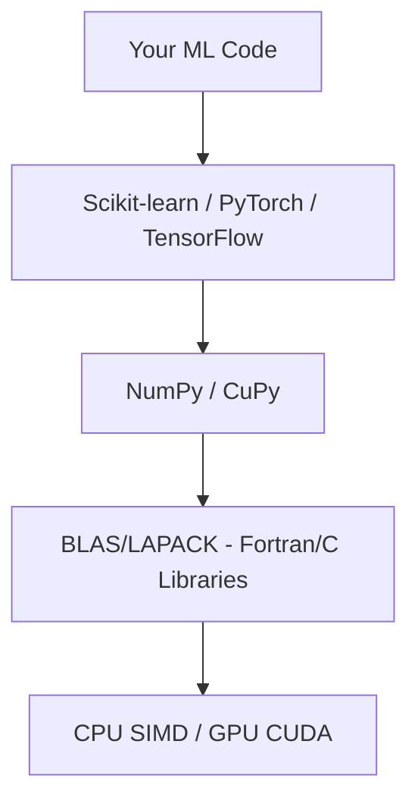

# Phase 4 — NumPy

## Complete Learning & Interview Mastery Guide

---

## Table of Contents

1. [What is NumPy and Why It Matters](#what-is-numpy-and-why-it-matters)
2. [Arrays — The Foundation](#arrays--the-foundation)
3. [Array Creation and Initialization](#array-creation-and-initialization)
4. [Indexing, Slicing, and Selection](#indexing-slicing-and-selection)
5. [Broadcasting](#broadcasting)
6. [Vectorization](#vectorization)
7. [Matrix Operations](#matrix-operations)
8. [Performance Optimization](#performance-optimization)
9. [NumPy for Real ML Tasks](#numpy-for-real-ml-tasks)
10. [Interview Mastery](#interview-mastery)

---

## What is NumPy and Why It Matters

### Beginner Explanation

NumPy (Numerical Python) is the foundation of all scientific computing in Python. It provides a powerful array object that is:
- **Fast**: Operations run in compiled C code, not slow Python loops
- **Memory-efficient**: Stores numbers in contiguous memory blocks
- **Expressive**: Supports operations on entire arrays at once

Every ML library (Pandas, Scikit-learn, PyTorch, TensorFlow) is built on NumPy or uses its array conventions.

### Technical Explanation

NumPy's core is the `ndarray` — an n-dimensional array of homogeneous data stored in a contiguous block of memory. Unlike Python lists (which store pointers to scattered objects), NumPy arrays store raw numeric values packed together, enabling:

1. **SIMD operations**: CPU processes multiple elements in one instruction
2. **Cache efficiency**: Contiguous memory → fewer cache misses
3. **No type checking**: All elements have the same type, no per-element overhead
4. **Vectorized C loops**: Inner loops are compiled C, not interpreted Python

### Performance Comparison

```python
import numpy as np
import time

n = 10_000_000

# Python list
python_list = list(range(n))
start = time.time()
result_py = [x * 2 + 1 for x in python_list]
py_time = time.time() - start

# NumPy array
numpy_array = np.arange(n)
start = time.time()
result_np = numpy_array * 2 + 1
np_time = time.time() - start

print(f"Python list: {py_time:.4f}s")
print(f"NumPy array: {np_time:.4f}s")
print(f"Speedup: {py_time/np_time:.0f}x")
# Typical result: 50-100x faster!
```

### Memory Layout

```
Python List:                         NumPy Array:
┌─────────┐                          ┌───────────────────────────────┐
│ ptr → [obj 1.0]                    │ 1.0 │ 2.0 │ 3.0 │ 4.0 │ 5.0 │
│ ptr → [obj 2.0]                    └───────────────────────────────┘
│ ptr → [obj 3.0]                    Contiguous memory block
│ ptr → [obj 4.0]                    One type, no overhead per element
│ ptr → [obj 5.0]
└─────────┘
Each element is a full Python object (28 bytes overhead per float!)
```

### Where NumPy Lives in the ML Stack



---

## Arrays — The Foundation

### Creating Arrays from Python Data

```python
import numpy as np

# From Python lists
a = np.array([1, 2, 3, 4, 5])          # 1D array (vector)
b = np.array([[1, 2, 3], [4, 5, 6]])    # 2D array (matrix)
c = np.array([[[1,2],[3,4]], [[5,6],[7,8]]])  # 3D array (tensor)

print(f"a: shape={a.shape}, ndim={a.ndim}, dtype={a.dtype}")
# a: shape=(5,), ndim=1, dtype=int64

print(f"b: shape={b.shape}, ndim={b.ndim}, size={b.size}")
# b: shape=(2, 3), ndim=2, size=6

print(f"c: shape={c.shape}, ndim={c.ndim}")
# c: shape=(2, 2, 2), ndim=3
```

### Understanding Shape, Axes, and Dimensions

```
Scalar:  shape = ()       0 dimensions   42
Vector:  shape = (5,)     1 dimension    [1, 2, 3, 4, 5]
Matrix:  shape = (3, 4)   2 dimensions   3 rows × 4 columns
Tensor:  shape = (2,3,4)  3 dimensions   2 "blocks" of 3×4 matrices
```

**In ML Context**:

| Data Type | Typical Shape | Meaning |
|-----------|---------------|---------|
| Single sample features | (n_features,) | One data point |
| Feature matrix | (n_samples, n_features) | Dataset |
| Grayscale image | (height, width) | 2D pixels |
| Color image | (height, width, 3) | RGB channels |
| Batch of images | (batch, height, width, channels) | Training batch |
| Text embedding batch | (batch, sequence_len, embedding_dim) | Transformer input |
| Video | (batch, frames, height, width, channels) | 5D tensor |

### Understanding Axes

```python
# axis=0 means "operate along rows" (collapse rows)
# axis=1 means "operate along columns" (collapse columns)

data = np.array([[1, 2, 3],
                 [4, 5, 6],
                 [7, 8, 9]])

print(np.sum(data, axis=0))   # [12, 15, 18]  — sum each column (collapse rows)
print(np.sum(data, axis=1))   # [6, 15, 24]   — sum each row (collapse columns)
print(np.sum(data))           # 45            — sum everything

# Think of it as: axis=N removes dimension N
# shape (3, 3) → sum(axis=0) → shape (3,)   [3 rows collapsed → 1 row]
# shape (3, 3) → sum(axis=1) → shape (3,)   [3 cols collapsed → 1 value per row]
```

```
         axis=1 →
         col0  col1  col2
axis=0  ┌─────┬─────┬─────┐
  ↓     │  1  │  2  │  3  │  → sum(axis=1) = 6
        ├─────┼─────┼─────┤
        │  4  │  5  │  6  │  → sum(axis=1) = 15
        ├─────┼─────┼─────┤
        │  7  │  8  │  9  │  → sum(axis=1) = 24
        └─────┴─────┴─────┘
         ↓      ↓      ↓
  sum(axis=0) = 12    15    18
```

### Data Types (dtypes)

```python
# Controlling precision and memory
a = np.array([1.0, 2.0, 3.0], dtype=np.float32)   # 4 bytes per element
b = np.array([1.0, 2.0, 3.0], dtype=np.float64)   # 8 bytes per element (default)
c = np.array([1, 2, 3], dtype=np.int8)             # 1 byte per element

# ML-relevant dtypes
float32 = np.float32   # Standard for GPU training (PyTorch default)
float64 = np.float64   # Standard for NumPy (more precision, slower on GPU)
float16 = np.float16   # Half precision (mixed precision training)
int8    = np.int8       # Model quantization
bool_   = np.bool_      # Masks

# Type conversion
arr = np.array([1.7, 2.3, 3.9])
print(arr.astype(np.int32))    # [1, 2, 3] — truncates, doesn't round!
print(arr.astype(np.float32))  # [1.7, 2.3, 3.9] — lower precision

# Memory comparison
big_array = np.random.randn(1000, 1000)
print(f"float64: {big_array.nbytes / 1e6:.1f} MB")   # 8.0 MB
print(f"float32: {big_array.astype(np.float32).nbytes / 1e6:.1f} MB")  # 4.0 MB
print(f"float16: {big_array.astype(np.float16).nbytes / 1e6:.1f} MB")  # 2.0 MB
```

---

## Array Creation and Initialization

### Common Initialization Patterns

```python
import numpy as np

# === Zeros, Ones, Full ===
zeros = np.zeros((3, 4))          # 3×4 matrix of 0s
ones = np.ones((2, 3))            # 2×3 matrix of 1s
full = np.full((2, 2), 7.5)      # 2×2 matrix of 7.5s
empty = np.empty((3, 3))         # Uninitialized (garbage values, but fast!)

# === Like existing array (same shape) ===
template = np.array([[1, 2, 3], [4, 5, 6]])
zeros_like = np.zeros_like(template)     # Same shape, all zeros
ones_like = np.ones_like(template)       # Same shape, all ones

# === Ranges ===
range_arr = np.arange(0, 10, 2)          # [0, 2, 4, 6, 8] — like Python range
linspace = np.linspace(0, 1, 5)          # [0, 0.25, 0.5, 0.75, 1.0] — N evenly spaced
logspace = np.logspace(0, 3, 4)          # [1, 10, 100, 1000] — log scale

# === Identity and Diagonal ===
eye = np.eye(3)                          # 3×3 identity matrix
diag = np.diag([1, 2, 3])               # 3×3 diagonal matrix
diag_extract = np.diag(np.array([[1,2],[3,4]]))  # Extract diagonal: [1, 4]

# === Random Arrays (critical for ML) ===
np.random.seed(42)  # Reproducibility!

uniform = np.random.rand(3, 4)              # Uniform [0, 1)
normal = np.random.randn(3, 4)              # Standard normal (μ=0, σ=1)
normal_custom = np.random.normal(5, 2, (3, 4))  # Normal(μ=5, σ=2)
integers = np.random.randint(0, 10, (3, 4))     # Random integers [0, 10)
choice = np.random.choice([0, 1], size=100, p=[0.9, 0.1])  # Weighted sampling

# Modern way (NumPy 1.17+) — preferred in production
rng = np.random.default_rng(42)
samples = rng.normal(0, 1, (1000, 10))
shuffled_indices = rng.permutation(100)
```

### Weight Initialization for Neural Networks

```python
# Xavier/Glorot initialization (for sigmoid/tanh activations)
def xavier_init(fan_in, fan_out):
    """Variance = 2 / (fan_in + fan_out)"""
    std = np.sqrt(2.0 / (fan_in + fan_out))
    return np.random.randn(fan_in, fan_out) * std

# He/Kaiming initialization (for ReLU activations)
def he_init(fan_in, fan_out):
    """Variance = 2 / fan_in"""
    std = np.sqrt(2.0 / fan_in)
    return np.random.randn(fan_in, fan_out) * std

# Example: Initialize weights for a 784 → 256 → 10 network
W1 = he_init(784, 256)     # First layer (ReLU)
W2 = xavier_init(256, 10)  # Output layer (softmax/sigmoid)

print(f"W1: mean={W1.mean():.4f}, std={W1.std():.4f}")
# Should be ~0 mean and std ≈ sqrt(2/784) ≈ 0.0505
```

---

## Indexing, Slicing, and Selection

### Basic Indexing and Slicing

```python
# 1D slicing (same as Python lists)
arr = np.array([0, 1, 2, 3, 4, 5, 6, 7, 8, 9])
print(arr[3])       # 3
print(arr[2:5])     # [2, 3, 4]
print(arr[::-1])    # [9, 8, 7, ..., 0]  reversed
print(arr[-3:])     # [7, 8, 9]  last 3

# 2D slicing
matrix = np.arange(20).reshape(4, 5)
# [[ 0,  1,  2,  3,  4],
#  [ 5,  6,  7,  8,  9],
#  [10, 11, 12, 13, 14],
#  [15, 16, 17, 18, 19]]

print(matrix[1, 3])        # 8       — single element
print(matrix[1])           # [5,6,7,8,9]  — entire row 1
print(matrix[:, 2])        # [2,7,12,17]  — entire column 2
print(matrix[1:3, 2:4])    # [[7,8],[12,13]]  — submatrix
print(matrix[:, ::2])      # Every other column: [[0,2,4],[5,7,9],...]
```

### Boolean Indexing (Masking) — Used Constantly in ML

```python
data = np.array([1, -2, 3, -4, 5, -6, 7, -8])

# Create boolean mask
mask = data > 0
print(mask)              # [True, False, True, False, True, False, True, False]

# Apply mask to filter
positive = data[mask]    # [1, 3, 5, 7]
data[~mask] = 0          # Replace negatives with 0: [1, 0, 3, 0, 5, 0, 7, 0]

# Multiple conditions
arr = np.random.randn(1000)
selected = arr[(arr > -1) & (arr < 1)]  # Values within 1 std
print(f"Within 1σ: {len(selected)/len(arr)*100:.1f}%")  # ~68%

# ML application: Filter predictions by confidence
predictions = np.array([0.1, 0.8, 0.3, 0.95, 0.6, 0.7])
labels = np.array([0, 1, 0, 1, 1, 0])

confident_mask = predictions > 0.7  # High confidence predictions
print(f"Confident predictions: {predictions[confident_mask]}")
print(f"Their labels: {labels[confident_mask]}")
```

### Fancy Indexing (Integer Array Indexing)

```python
arr = np.array([10, 20, 30, 40, 50, 60, 70, 80, 90])

# Select specific indices
indices = np.array([0, 3, 5, 7])
print(arr[indices])  # [10, 40, 60, 80]

# ML application: Batch sampling
dataset = np.random.randn(10000, 20)  # 10000 samples, 20 features
batch_indices = np.random.choice(10000, size=32, replace=False)
batch = dataset[batch_indices]  # Random batch of 32 samples

# Train/test split with fancy indexing
n = len(dataset)
indices = np.random.permutation(n)
train_idx = indices[:int(0.8*n)]
test_idx = indices[int(0.8*n):]
X_train = dataset[train_idx]
X_test = dataset[test_idx]

# Sorting by column values
data = np.array([[3, 1], [1, 4], [2, 2]])
sorted_by_col0 = data[data[:, 0].argsort()]  # Sort by first column
print(sorted_by_col0)  # [[1,4], [2,2], [3,1]]
```

### Views vs. Copies — Critical to Understand

```python
# VIEWS: Share memory with original (modifications affect original!)
arr = np.array([1, 2, 3, 4, 5])
view = arr[1:4]        # This is a VIEW
view[0] = 99           # Modifies original!
print(arr)             # [1, 99, 3, 4, 5]  ← Changed!

# COPIES: Independent memory
arr = np.array([1, 2, 3, 4, 5])
copy = arr[1:4].copy()  # This is a COPY
copy[0] = 99            # Does NOT modify original
print(arr)              # [1, 2, 3, 4, 5]  ← Unchanged

# Rules:
# Basic slicing → VIEW
# Fancy indexing (integer array) → COPY
# Boolean indexing → COPY

# Check if it's a view
view = arr[::2]
print(view.base is arr)  # True → it's a view

# Why this matters in ML:
# If you slice a dataset and modify it, you corrupt the original!
# Always .copy() if you plan to modify the result.
```

---

## Broadcasting

### Beginner Explanation

Broadcasting is NumPy's way of doing arithmetic on arrays of different shapes. Instead of requiring arrays to be the same size, NumPy "stretches" the smaller array to match the larger one — without actually copying data.

### The Broadcasting Rules

```
Two arrays are compatible for broadcasting if, for EACH dimension
(compared from right to left):
1. They have the same size, OR
2. One of them has size 1

If one array has fewer dimensions, it's padded with 1s on the left.
```

### Visual Examples

```
Example 1: (3, 4) + (4,)
  Step 1: (4,) becomes (1, 4)     — pad left with 1
  Step 2: (1, 4) broadcasts to (3, 4)  — stretch dim 0
  Result: (3, 4)

Example 2: (3, 1) + (1, 4)
  Step 1: (3, 1) stretches to (3, 4)   — stretch dim 1
  Step 2: (1, 4) stretches to (3, 4)   — stretch dim 0
  Result: (3, 4)

Example 3: (3, 4) + (3,)
  Step 1: (3,) becomes (1, 3)
  Step 2: Check: (3, 4) vs (1, 3)  → 4 ≠ 3 and neither is 1
  Result: ERROR! Incompatible shapes.
```

### Broadcasting in Practice

```python
import numpy as np

# === Example 1: Adding bias to every sample ===
# This is what happens in EVERY neural network layer!
batch = np.random.randn(32, 128)   # 32 samples, 128 features
bias = np.random.randn(128)         # 128 bias values

result = batch + bias  # (32, 128) + (128,) → (32, 128)
# bias is broadcast to every row automatically!

# === Example 2: Normalizing features (zero mean, unit variance) ===
X = np.random.randn(1000, 20)       # 1000 samples, 20 features
mean = X.mean(axis=0)               # (20,) — mean of each feature
std = X.std(axis=0)                  # (20,) — std of each feature

X_normalized = (X - mean) / std      # Broadcasting: (1000, 20) - (20,) / (20,)
# Each feature is independently normalized!

# === Example 3: Outer product via broadcasting ===
a = np.array([1, 2, 3]).reshape(-1, 1)  # (3, 1) column vector
b = np.array([4, 5, 6]).reshape(1, -1)  # (1, 3) row vector

outer = a * b  # (3, 1) × (1, 3) → (3, 3) outer product!
print(outer)
# [[ 4,  5,  6],
#  [ 8, 10, 12],
#  [12, 15, 18]]

# === Example 4: Computing pairwise distances ===
# Given two sets of points, compute distance between every pair
points_a = np.random.randn(100, 3)   # 100 points in 3D
points_b = np.random.randn(50, 3)    # 50 points in 3D

# Reshape for broadcasting:
# (100, 1, 3) - (1, 50, 3) → (100, 50, 3)
diff = points_a[:, np.newaxis, :] - points_b[np.newaxis, :, :]
distances = np.sqrt((diff ** 2).sum(axis=2))  # (100, 50)
print(f"Distance matrix shape: {distances.shape}")  # (100, 50)

# === Example 5: Softmax with numerical stability ===
logits = np.array([[2.0, 1.0, 0.1],
                   [1.0, 3.0, 0.1]])   # (2, 3) — batch of 2

# Subtract max for numerical stability (broadcast!)
logits_stable = logits - logits.max(axis=1, keepdims=True)  # (2,3) - (2,1)
exp_logits = np.exp(logits_stable)
softmax = exp_logits / exp_logits.sum(axis=1, keepdims=True)  # (2,3) / (2,1)
print(f"Softmax output:\n{softmax}")
print(f"Row sums: {softmax.sum(axis=1)}")  # [1.0, 1.0]
```

### keepdims — Preserving Broadcasting Compatibility

```python
data = np.random.randn(5, 3)

# Without keepdims: shape (3,) — broadcasting may be ambiguous
mean_no_keep = data.mean(axis=0)
print(mean_no_keep.shape)  # (3,)

# With keepdims: shape (1, 3) — broadcasting is explicit
mean_keep = data.mean(axis=0, keepdims=True)
print(mean_keep.shape)  # (1, 3)

# For row operations:
row_sum = data.sum(axis=1, keepdims=True)  # (5, 1)
data_normalized = data / row_sum            # (5, 3) / (5, 1) → (5, 3) ✓

# Rule: Always use keepdims=True when the result will be used in
# further broadcasting operations. It's explicit and prevents bugs.
```

### Common Broadcasting Mistakes

```python
# MISTAKE 1: Wrong axis
X = np.random.randn(100, 5)  # 100 samples, 5 features
mean = X.mean(axis=1)         # Shape (100,) — mean PER SAMPLE (wrong for normalization!)
# X - mean would fail or give wrong result!

# CORRECT:
mean = X.mean(axis=0)         # Shape (5,) — mean PER FEATURE
X_centered = X - mean         # (100, 5) - (5,) → (100, 5) ✓

# MISTAKE 2: Forgetting that (5,) and (5, 1) are different
a = np.ones((3, 5))
b = np.ones(5)       # Shape (5,) — broadcasts as ROW
c = np.ones((5, 1))  # Shape (5, 1) — INCOMPATIBLE with (3, 5)!
# a + b works: (3,5) + (5,) → (3,5)
# a + c FAILS: (3,5) + (5,1) → Error (3≠5 in axis 0)

# MISTAKE 3: Modifying view instead of copy
X_train = data[:80]  # This is a VIEW
X_train -= X_train.mean(axis=0)  # This MODIFIES the original data array!
# FIX: X_train = data[:80].copy()
```

---

## Vectorization

### Beginner Explanation

Vectorization means replacing explicit Python loops with NumPy array operations. Instead of looping through elements one by one, you operate on the entire array at once. The heavy lifting happens in optimized C code.

**Rule**: If you have a for loop over array elements in ML code, you're probably doing it wrong.

### Technical Explanation

Vectorization exploits:
1. **SIMD (Single Instruction Multiple Data)**: CPU processes 4-8 elements in one instruction
2. **Compiled loops**: C loops are 100x faster than Python loops
3. **Cache locality**: Contiguous memory access patterns
4. **Parallelism**: NumPy can use multi-threaded BLAS for linear algebra

### Vectorization Examples

```python
import numpy as np
import time

n = 1_000_000

# === EXAMPLE 1: Element-wise operations ===

# BAD: Python loop
data = np.random.randn(n)
start = time.time()
result_loop = np.empty(n)
for i in range(n):
    result_loop[i] = data[i] ** 2 + 2 * data[i] + 1
loop_time = time.time() - start

# GOOD: Vectorized
start = time.time()
result_vec = data ** 2 + 2 * data + 1
vec_time = time.time() - start

print(f"Loop: {loop_time:.4f}s | Vectorized: {vec_time:.4f}s | Speedup: {loop_time/vec_time:.0f}x")

# === EXAMPLE 2: Conditional operations ===

# BAD: Loop with if statement
data = np.random.randn(n)
start = time.time()
result_loop = np.empty(n)
for i in range(n):
    if data[i] > 0:
        result_loop[i] = data[i]
    else:
        result_loop[i] = 0
loop_time = time.time() - start

# GOOD: np.where or np.maximum (ReLU activation!)
start = time.time()
result_vec = np.maximum(data, 0)  # ReLU in one line!
vec_time = time.time() - start

# Alternative: np.where
result_where = np.where(data > 0, data, 0)  # Same result

print(f"Loop: {loop_time:.4f}s | Vectorized: {vec_time:.4f}s | Speedup: {loop_time/vec_time:.0f}x")

# === EXAMPLE 3: Distance computation ===
# Compute Euclidean distance between each pair of 1000 points

points = np.random.randn(1000, 3)

# BAD: Double loop O(n²)
start = time.time()
n_points = len(points)
dist_loop = np.zeros((n_points, n_points))
for i in range(n_points):
    for j in range(n_points):
        diff = points[i] - points[j]
        dist_loop[i, j] = np.sqrt(np.sum(diff ** 2))
loop_time = time.time() - start

# GOOD: Vectorized with broadcasting
start = time.time()
diff = points[:, np.newaxis, :] - points[np.newaxis, :, :]  # (1000, 1000, 3)
dist_vec = np.sqrt((diff ** 2).sum(axis=2))                   # (1000, 1000)
vec_time = time.time() - start

# BEST: Using scipy (optimized C implementation)
from scipy.spatial.distance import cdist
start = time.time()
dist_scipy = cdist(points, points)
scipy_time = time.time() - start

print(f"Loop: {loop_time:.2f}s | Vectorized: {vec_time:.4f}s | scipy: {scipy_time:.4f}s")
```

### Common ML Operations — Vectorized

```python
# === Sigmoid activation ===
def sigmoid(x):
    return 1 / (1 + np.exp(-x))

z = np.random.randn(1000, 256)
activations = sigmoid(z)  # Applies to ALL elements at once

# === Softmax ===
def softmax(logits, axis=-1):
    """Numerically stable softmax."""
    max_val = logits.max(axis=axis, keepdims=True)
    exp_x = np.exp(logits - max_val)
    return exp_x / exp_x.sum(axis=axis, keepdims=True)

logits = np.random.randn(32, 10)  # Batch of 32, 10 classes
probs = softmax(logits, axis=1)
print(f"Each row sums to 1: {np.allclose(probs.sum(axis=1), 1)}")

# === Cross-entropy loss ===
def cross_entropy_loss(predictions, targets):
    """Vectorized cross-entropy loss."""
    epsilon = 1e-12
    predictions = np.clip(predictions, epsilon, 1 - epsilon)
    n = len(targets)
    # For one-hot encoded targets (multi-class)
    loss = -np.sum(targets * np.log(predictions)) / n
    return loss

# For sparse labels (integer class indices)
def sparse_cross_entropy(predictions, labels):
    """predictions: (batch, n_classes), labels: (batch,) integer indices"""
    n = len(labels)
    log_probs = np.log(predictions[np.arange(n), labels] + 1e-12)
    return -np.mean(log_probs)

# === Batch normalization ===
def batch_norm(x, gamma, beta, eps=1e-5):
    """Vectorized batch normalization."""
    mean = x.mean(axis=0)
    var = x.var(axis=0)
    x_norm = (x - mean) / np.sqrt(var + eps)
    return gamma * x_norm + beta

# === Cosine similarity matrix (all pairs) ===
def cosine_similarity_matrix(A, B):
    """Compute cosine similarity between all pairs of rows in A and B."""
    # Normalize rows
    A_norm = A / np.linalg.norm(A, axis=1, keepdims=True)
    B_norm = B / np.linalg.norm(B, axis=1, keepdims=True)
    # Matrix multiply gives all pairwise cosine similarities
    return A_norm @ B_norm.T

embeddings = np.random.randn(100, 768)  # 100 documents, 768-dim embeddings
sim_matrix = cosine_similarity_matrix(embeddings, embeddings)
print(f"Similarity matrix: {sim_matrix.shape}")  # (100, 100)
```

### np.vectorize — When You Can't Avoid Python Logic

```python
# np.vectorize wraps a Python function to work on arrays
# NOTE: It does NOT give true vectorization speedup!
# It's just syntactic sugar for a loop.

def categorize_score(score):
    """Complex logic that's hard to vectorize."""
    if score > 0.9:
        return "excellent"
    elif score > 0.7:
        return "good"
    elif score > 0.5:
        return "fair"
    else:
        return "poor"

# Vectorize it (convenience, not performance!)
v_categorize = np.vectorize(categorize_score)
scores = np.array([0.95, 0.3, 0.72, 0.55, 0.88])
categories = v_categorize(scores)
print(categories)  # ['excellent', 'poor', 'good', 'fair', 'good']

# BETTER: Use np.select for this pattern (truly vectorized)
conditions = [
    scores > 0.9,
    scores > 0.7,
    scores > 0.5,
]
choices = ["excellent", "good", "fair"]
categories_fast = np.select(conditions, choices, default="poor")
```

---

## Matrix Operations

### Matrix Multiplication — The Core of Deep Learning

```python
import numpy as np

# Matrix multiplication: (m×n) @ (n×p) = (m×p)
A = np.random.randn(3, 4)  # 3×4
B = np.random.randn(4, 5)  # 4×5
C = A @ B                    # 3×5

# Equivalent ways:
C = np.matmul(A, B)
C = np.dot(A, B)  # For 2D arrays, same as matmul
C = A @ B          # Preferred syntax (Python 3.5+)

# === Neural Network Forward Pass ===
batch_size, input_dim, hidden_dim, output_dim = 32, 784, 256, 10

X = np.random.randn(batch_size, input_dim)    # Input batch
W1 = np.random.randn(input_dim, hidden_dim) * 0.01   # Layer 1 weights
b1 = np.zeros(hidden_dim)                     # Layer 1 bias
W2 = np.random.randn(hidden_dim, output_dim) * 0.01  # Layer 2 weights
b2 = np.zeros(output_dim)                     # Layer 2 bias

# Forward pass — just matrix multiplications!
z1 = X @ W1 + b1              # (32, 784) @ (784, 256) + (256,) = (32, 256)
a1 = np.maximum(z1, 0)        # ReLU activation
z2 = a1 @ W2 + b2             # (32, 256) @ (256, 10) + (10,) = (32, 10)
output = softmax(z2, axis=1)  # Softmax for class probabilities

print(f"Input: {X.shape}")
print(f"Hidden: {a1.shape}")
print(f"Output: {output.shape}")
```

### Linear Algebra Operations

```python
# === Solving Linear Systems ===
# Solve Ax = b  (faster than computing A⁻¹ then multiplying!)
A = np.array([[3, 1], [1, 2]])
b = np.array([9, 8])
x = np.linalg.solve(A, b)  # [2, 3]
print(f"Solution: {x}")
print(f"Verify: A@x = {A@x}")  # [9, 8] ✓

# === Eigendecomposition ===
cov_matrix = np.array([[2.0, 1.0], [1.0, 3.0]])
eigenvalues, eigenvectors = np.linalg.eig(cov_matrix)
print(f"Eigenvalues: {eigenvalues}")
print(f"Eigenvectors:\n{eigenvectors}")

# === SVD (Singular Value Decomposition) ===
data = np.random.randn(100, 50)
U, S, Vt = np.linalg.svd(data, full_matrices=False)
print(f"U: {U.shape}, S: {S.shape}, Vt: {Vt.shape}")

# Low-rank approximation (keep top k components)
k = 10
data_approx = U[:, :k] @ np.diag(S[:k]) @ Vt[:k, :]
print(f"Original shape: {data.shape}")
print(f"Approximation error: {np.linalg.norm(data - data_approx) / np.linalg.norm(data):.4f}")

# === Determinant, Rank, Norm ===
A = np.random.randn(5, 5)
print(f"Determinant: {np.linalg.det(A):.4f}")
print(f"Rank: {np.linalg.matrix_rank(A)}")
print(f"Frobenius norm: {np.linalg.norm(A):.4f}")       # √(Σ aᵢⱼ²)
print(f"Spectral norm: {np.linalg.norm(A, ord=2):.4f}")  # Largest singular value

# === Condition Number (numerical stability indicator) ===
print(f"Condition number: {np.linalg.cond(A):.2f}")
# High condition number → matrix is nearly singular → numerically unstable
```

### PCA Implementation Using NumPy

```python
def pca_numpy(X, n_components):
    """
    PCA implementation using only NumPy.
    
    Args:
        X: Data matrix (n_samples, n_features)
        n_components: Number of principal components to keep
    
    Returns:
        X_reduced: Projected data (n_samples, n_components)
        components: Principal component directions
        explained_variance_ratio: Fraction of variance per component
    """
    # Step 1: Center the data
    mean = X.mean(axis=0)
    X_centered = X - mean
    
    # Step 2: Compute covariance matrix
    n = X.shape[0]
    cov = (X_centered.T @ X_centered) / (n - 1)  # (features, features)
    
    # Step 3: Eigendecomposition of covariance
    eigenvalues, eigenvectors = np.linalg.eigh(cov)  # eigh for symmetric matrices
    
    # Step 4: Sort by eigenvalue (descending)
    sorted_idx = np.argsort(eigenvalues)[::-1]
    eigenvalues = eigenvalues[sorted_idx]
    eigenvectors = eigenvectors[:, sorted_idx]
    
    # Step 5: Select top k components
    components = eigenvectors[:, :n_components].T  # (n_components, n_features)
    
    # Step 6: Project data
    X_reduced = X_centered @ components.T  # (n_samples, n_components)
    
    # Explained variance
    total_var = eigenvalues.sum()
    explained_variance_ratio = eigenvalues[:n_components] / total_var
    
    return X_reduced, components, explained_variance_ratio

# Test
X = np.random.randn(500, 20)  # 500 samples, 20 features
X_reduced, components, var_ratio = pca_numpy(X, n_components=5)

print(f"Original shape: {X.shape}")
print(f"Reduced shape: {X_reduced.shape}")
print(f"Explained variance: {var_ratio}")
print(f"Total explained: {var_ratio.sum():.4f}")
```

---

## Performance Optimization

### Memory Layout: C-order vs Fortran-order

```python
# C-order (row-major): rows are contiguous — DEFAULT in NumPy
# Fortran-order (column-major): columns are contiguous

# This matters for performance!
arr_c = np.zeros((1000, 1000), order='C')  # Row-major
arr_f = np.zeros((1000, 1000), order='F')  # Column-major

# Row operations are faster on C-order
%timeit arr_c.sum(axis=1)   # Fast: rows are contiguous
%timeit arr_f.sum(axis=1)   # Slow: needs to jump between rows

# Column operations are faster on Fortran-order
%timeit arr_f.sum(axis=0)   # Fast: columns are contiguous
%timeit arr_c.sum(axis=0)   # Slower: needs to jump between columns

# Check order
print(arr_c.flags['C_CONTIGUOUS'])  # True
print(arr_f.flags['F_CONTIGUOUS'])  # True

# Make contiguous (for passing to external C code)
arr_contiguous = np.ascontiguousarray(arr_f)
```

### Avoid Unnecessary Copies

```python
# These create COPIES (expensive for large arrays):
new_arr = arr + 0           # Copy disguised as operation
new_arr = arr * 1           # Copy disguised as operation
new_arr = arr.flatten()     # Always creates copy
new_arr = arr[indices]      # Fancy indexing → copy

# These create VIEWS (cheap, shared memory):
view = arr.reshape(...)     # View (usually)
view = arr.T                # Transpose is a view
view = arr[::2]             # Slice → view
view = arr.ravel()          # View when possible (flatten copies always)

# In-place operations (modify existing array, no allocation):
arr += 1                    # In-place add
arr *= 2                    # In-place multiply
np.add(arr, 1, out=arr)    # Explicit in-place

# Pre-allocate output arrays
result = np.empty_like(arr)
np.multiply(arr, 2, out=result)  # Write directly to pre-allocated array
```

### Vectorization Performance Tips

```python
# 1. Use specialized functions instead of general operations
# BAD: general
result = np.sqrt(np.sum(arr ** 2, axis=1))
# GOOD: specialized (optimized internal path)
result = np.linalg.norm(arr, axis=1)

# 2. Use einsum for complex tensor operations
A = np.random.randn(100, 50)
B = np.random.randn(50, 80)

# Standard matmul
C = A @ B

# einsum (same operation, sometimes faster for complex patterns)
C = np.einsum('ij,jk->ik', A, B)

# Batch matrix multiply
batched_A = np.random.randn(32, 100, 50)
batched_B = np.random.randn(32, 50, 80)
batched_C = np.einsum('bij,bjk->bik', batched_A, batched_B)  # (32, 100, 80)

# Trace (sum of diagonal)
trace = np.einsum('ii', A[:50, :50])

# 3. Avoid creating intermediate arrays
# BAD: creates 3 temporary arrays
result = np.sqrt(np.sum(np.square(A - B), axis=1))

# GOOD: minimize temporaries
diff = A - B
np.square(diff, out=diff)  # In-place
result = np.sqrt(diff.sum(axis=1))

# 4. Use np.add.reduce instead of repeated np.sum for large reductions
# (Usually np.sum already does this, but explicit when needed)
```

### Structured Arrays and Record Arrays

```python
# For mixed-type data without Pandas overhead
dt = np.dtype([
    ('name', 'U20'),       # Unicode string, max 20 chars
    ('age', np.int32),
    ('score', np.float64)
])

data = np.array([
    ('Alice', 25, 0.92),
    ('Bob', 30, 0.88),
    ('Charlie', 35, 0.95)
], dtype=dt)

# Access by field name
print(data['name'])    # ['Alice', 'Bob', 'Charlie']
print(data['score'])   # [0.92, 0.88, 0.95]

# Filter
high_scorers = data[data['score'] > 0.9]
```

---

## NumPy for Real ML Tasks

### Complete Linear Regression from Scratch

```python
import numpy as np

class LinearRegressionNumPy:
    """Linear regression using normal equation and gradient descent."""
    
    def __init__(self, method='normal', learning_rate=0.01, epochs=1000):
        self.method = method
        self.lr = learning_rate
        self.epochs = epochs
        self.weights = None
        self.bias = None
    
    def fit(self, X, y):
        n_samples, n_features = X.shape
        
        if self.method == 'normal':
            # Normal equation: θ = (XᵀX)⁻¹Xᵀy
            X_b = np.column_stack([np.ones(n_samples), X])  # Add bias column
            theta = np.linalg.pinv(X_b.T @ X_b) @ X_b.T @ y
            self.bias = theta[0]
            self.weights = theta[1:]
        
        elif self.method == 'gradient_descent':
            self.weights = np.zeros(n_features)
            self.bias = 0.0
            
            for _ in range(self.epochs):
                # Forward pass
                y_pred = X @ self.weights + self.bias
                
                # Gradients
                error = y_pred - y
                dW = (2 / n_samples) * (X.T @ error)
                db = (2 / n_samples) * error.sum()
                
                # Update
                self.weights -= self.lr * dW
                self.bias -= self.lr * db
    
    def predict(self, X):
        return X @ self.weights + self.bias
    
    def score(self, X, y):
        """R² score."""
        y_pred = self.predict(X)
        ss_res = np.sum((y - y_pred) ** 2)
        ss_tot = np.sum((y - y.mean()) ** 2)
        return 1 - ss_res / ss_tot

# Generate data
np.random.seed(42)
X = np.random.randn(500, 3)
true_w = np.array([2.0, -1.0, 0.5])
y = X @ true_w + 3.0 + np.random.randn(500) * 0.1

# Fit
model = LinearRegressionNumPy(method='normal')
model.fit(X, y)
print(f"True weights: {true_w}")
print(f"Learned weights: {model.weights}")
print(f"True bias: 3.0, Learned bias: {model.bias:.4f}")
print(f"R²: {model.score(X, y):.6f}")
```

### K-Means Clustering from Scratch

```python
def kmeans_numpy(X, k, max_iters=100, tol=1e-4):
    """
    K-Means clustering using only NumPy.
    
    Args:
        X: Data (n_samples, n_features)
        k: Number of clusters
        max_iters: Maximum iterations
        tol: Convergence tolerance
    
    Returns:
        labels: Cluster assignment for each sample
        centroids: Final centroid positions
    """
    n_samples, n_features = X.shape
    
    # Initialize centroids (k-means++ inspired)
    rng = np.random.default_rng(42)
    idx = rng.choice(n_samples, k, replace=False)
    centroids = X[idx].copy()
    
    for iteration in range(max_iters):
        # Step 1: Assign each point to nearest centroid
        # Compute distances: (n_samples, k)
        distances = np.sqrt(((X[:, np.newaxis, :] - centroids[np.newaxis, :, :]) ** 2).sum(axis=2))
        labels = distances.argmin(axis=1)
        
        # Step 2: Update centroids
        new_centroids = np.array([
            X[labels == i].mean(axis=0) if (labels == i).sum() > 0 else centroids[i]
            for i in range(k)
        ])
        
        # Check convergence
        shift = np.sqrt(((new_centroids - centroids) ** 2).sum())
        if shift < tol:
            print(f"Converged at iteration {iteration}")
            break
        
        centroids = new_centroids
    
    # Compute inertia (sum of squared distances to nearest centroid)
    inertia = sum(((X[labels == i] - centroids[i]) ** 2).sum() for i in range(k))
    
    return labels, centroids, inertia

# Test
X = np.vstack([
    np.random.randn(100, 2) + [2, 2],
    np.random.randn(100, 2) + [-2, -2],
    np.random.randn(100, 2) + [2, -2]
])

labels, centroids, inertia = kmeans_numpy(X, k=3)
print(f"Cluster sizes: {np.bincount(labels)}")
print(f"Centroids:\n{centroids}")
print(f"Inertia: {inertia:.2f}")
```

### Neural Network Forward + Backward Pass

```python
class NeuralNetNumPy:
    """
    2-layer neural network with full forward/backward pass in NumPy.
    Demonstrates backpropagation without any framework.
    """
    
    def __init__(self, input_dim, hidden_dim, output_dim, lr=0.01):
        # He initialization
        self.W1 = np.random.randn(input_dim, hidden_dim) * np.sqrt(2/input_dim)
        self.b1 = np.zeros(hidden_dim)
        self.W2 = np.random.randn(hidden_dim, output_dim) * np.sqrt(2/hidden_dim)
        self.b2 = np.zeros(output_dim)
        self.lr = lr
    
    def relu(self, x):
        return np.maximum(0, x)
    
    def relu_derivative(self, x):
        return (x > 0).astype(float)
    
    def softmax(self, x):
        exp_x = np.exp(x - x.max(axis=1, keepdims=True))
        return exp_x / exp_x.sum(axis=1, keepdims=True)
    
    def forward(self, X):
        """Forward pass — store activations for backprop."""
        self.z1 = X @ self.W1 + self.b1           # (batch, hidden)
        self.a1 = self.relu(self.z1)               # (batch, hidden)
        self.z2 = self.a1 @ self.W2 + self.b2      # (batch, output)
        self.a2 = self.softmax(self.z2)            # (batch, output)
        return self.a2
    
    def backward(self, X, y_onehot):
        """Backward pass — compute gradients via chain rule."""
        batch_size = X.shape[0]
        
        # Output layer gradient
        # dL/dz2 = a2 - y (for softmax + cross-entropy)
        dz2 = self.a2 - y_onehot                          # (batch, output)
        
        # Gradients for W2 and b2
        dW2 = (self.a1.T @ dz2) / batch_size              # (hidden, output)
        db2 = dz2.mean(axis=0)                             # (output,)
        
        # Hidden layer gradient (chain rule through W2 and ReLU)
        da1 = dz2 @ self.W2.T                              # (batch, hidden)
        dz1 = da1 * self.relu_derivative(self.z1)          # (batch, hidden)
        
        # Gradients for W1 and b1
        dW1 = (X.T @ dz1) / batch_size                    # (input, hidden)
        db1 = dz1.mean(axis=0)                             # (hidden,)
        
        # Update weights (gradient descent)
        self.W2 -= self.lr * dW2
        self.b2 -= self.lr * db2
        self.W1 -= self.lr * dW1
        self.b1 -= self.lr * db1
    
    def compute_loss(self, y_pred, y_onehot):
        """Cross-entropy loss."""
        epsilon = 1e-12
        return -np.mean(np.sum(y_onehot * np.log(y_pred + epsilon), axis=1))
    
    def train(self, X, y, epochs=100, batch_size=32):
        """Training loop with mini-batches."""
        n_classes = len(np.unique(y))
        y_onehot = np.eye(n_classes)[y]  # One-hot encode
        
        losses = []
        for epoch in range(epochs):
            # Shuffle
            perm = np.random.permutation(len(X))
            X_shuffled = X[perm]
            y_shuffled = y_onehot[perm]
            
            epoch_loss = 0
            for i in range(0, len(X), batch_size):
                X_batch = X_shuffled[i:i+batch_size]
                y_batch = y_shuffled[i:i+batch_size]
                
                # Forward
                predictions = self.forward(X_batch)
                loss = self.compute_loss(predictions, y_batch)
                epoch_loss += loss
                
                # Backward
                self.backward(X_batch, y_batch)
            
            avg_loss = epoch_loss / (len(X) / batch_size)
            losses.append(avg_loss)
            
            if (epoch + 1) % 20 == 0:
                acc = self.accuracy(X, y)
                print(f"Epoch {epoch+1}: Loss={avg_loss:.4f}, Accuracy={acc:.4f}")
        
        return losses
    
    def predict(self, X):
        probs = self.forward(X)
        return np.argmax(probs, axis=1)
    
    def accuracy(self, X, y):
        return (self.predict(X) == y).mean()

# Test with sklearn's digits dataset
from sklearn.datasets import load_digits
from sklearn.model_selection import train_test_split
from sklearn.preprocessing import StandardScaler

digits = load_digits()
X, y = digits.data, digits.target

# Preprocess
scaler = StandardScaler()
X = scaler.fit_transform(X)

X_train, X_test, y_train, y_test = train_test_split(X, y, test_size=0.2, random_state=42)

# Train
nn = NeuralNetNumPy(input_dim=64, hidden_dim=128, output_dim=10, lr=0.1)
losses = nn.train(X_train, y_train, epochs=100, batch_size=32)

print(f"\nFinal Test Accuracy: {nn.accuracy(X_test, y_test):.4f}")
```

### Random Sampling and Statistical Operations

```python
# === Bootstrapping (confidence intervals) ===
def bootstrap_confidence_interval(data, statistic_func, n_bootstrap=10000, ci=0.95):
    """
    Compute confidence interval using bootstrap resampling.
    All NumPy, no loops needed!
    """
    n = len(data)
    # Generate all bootstrap samples at once
    indices = np.random.randint(0, n, size=(n_bootstrap, n))
    bootstrap_samples = data[indices]  # (n_bootstrap, n) using fancy indexing
    
    # Compute statistic for each bootstrap sample
    statistics = statistic_func(bootstrap_samples, axis=1)
    
    # Confidence interval
    lower = np.percentile(statistics, (1 - ci) / 2 * 100)
    upper = np.percentile(statistics, (1 + ci) / 2 * 100)
    
    return lower, upper

scores = np.array([0.92, 0.91, 0.93, 0.89, 0.95, 0.90, 0.92, 0.94, 0.88, 0.93])
lower, upper = bootstrap_confidence_interval(scores, np.mean)
print(f"95% CI for mean accuracy: [{lower:.4f}, {upper:.4f}]")

# === Efficient random sampling ===
rng = np.random.default_rng(42)

# Stratified sampling
def stratified_sample(X, y, n_per_class):
    """Sample n items from each class."""
    classes = np.unique(y)
    indices = []
    for cls in classes:
        cls_indices = np.where(y == cls)[0]
        selected = rng.choice(cls_indices, min(n_per_class, len(cls_indices)), replace=False)
        indices.extend(selected)
    return np.array(indices)

# Weighted random choice (for imbalanced sampling)
weights = np.array([0.1, 0.1, 0.1, 0.7])  # Class weights
samples = rng.choice(4, size=1000, p=weights)
print(f"Class distribution: {np.bincount(samples)}")  # ~[100, 100, 100, 700]
```

---

## Interview Mastery

### Beginner Interview Questions

---

**Q1: What is the difference between a Python list and a NumPy array?**

**Perfect Answer:**
> "The key differences are:

> 1. **Homogeneous type**: NumPy arrays store elements of a single type (e.g., all float64). Lists can mix types (int, string, object). This allows NumPy to store data in contiguous memory.

> 2. **Performance**: NumPy operations are 50-100x faster because they execute in compiled C code, not interpreted Python. Operations apply to the entire array at once (vectorization).

> 3. **Memory**: A NumPy float64 array uses ~8 bytes per element. A Python list of floats uses ~28 bytes per element (object overhead + pointer).

> 4. **Operations**: NumPy supports element-wise operations, broadcasting, and linear algebra natively. Lists require explicit loops.

> 5. **Fixed size**: NumPy arrays have a fixed size at creation (appending creates a new array). Lists are dynamic.

> In ML, we always use NumPy arrays for numerical data because training on millions of samples with Python lists would be 100x slower — turning a 1-hour training run into a 4-day run."

**Common Mistake:** Only mentioning speed without explaining WHY (contiguous memory, C loops, SIMD).

---

**Q2: Explain NumPy broadcasting. Give an example of where it's used in ML.**

**Perfect Answer:**
> "Broadcasting is NumPy's mechanism for performing arithmetic on arrays with different shapes. Instead of requiring identical shapes, it 'stretches' smaller arrays to match larger ones — without actually copying data.

> The rules (compared from right to left): dimensions are compatible if they're equal OR one of them is 1.

> **Most common ML example** — adding bias in a neural network:
> ```python
> # batch output: (32, 256) — 32 samples, 256 features
> # bias: (256,) — one bias per feature
> output = batch @ weights + bias  # (32, 256) + (256,) → (32, 256)
> ```
> The bias vector is automatically broadcast across all 32 samples.

> Another example — feature normalization:
> ```python
> X = data - data.mean(axis=0)  # (1000, 20) - (20,) → (1000, 20)
> ```
> Each feature's mean is subtracted from that feature across all samples.

> Broadcasting is what makes vectorized code possible without explicit loops. It's happening every time you normalize features, add bias, or compute softmax."

---

**Q3: What is the difference between a view and a copy in NumPy?**

**Perfect Answer:**
> "A **view** shares memory with the original array. Modifying the view modifies the original. A **copy** is an independent array with its own memory.

> ```python
> arr = np.array([1, 2, 3, 4, 5])
> view = arr[1:4]    # VIEW — shares memory
> view[0] = 99       # Changes arr to [1, 99, 3, 4, 5]!
> 
> copy = arr[1:4].copy()  # COPY — independent
> copy[0] = 0             # arr unchanged
> ```

> **Rules**:
> - Basic slicing → view
> - Fancy indexing (integer array) → copy
> - Boolean indexing → copy
> - `.reshape()` → view (usually)
> - `.flatten()` → copy; `.ravel()` → view (when possible)

> **Why this matters in ML**: If you slice your training data and then normalize it in-place, you'll corrupt the original dataset. Always `.copy()` before in-place modifications. I check with `view.base is original` to verify."

---

### Intermediate Interview Questions

---

**Q4: How would you implement a numerically stable softmax? Why is stability needed?**

**Perfect Answer:**
> "The naive softmax is `exp(x) / sum(exp(x))`. The problem: if any x_i is large (e.g., 1000), `exp(1000)` overflows to infinity. If x_i is very negative, `exp(x_i)` underflows to 0.

> **Solution**: Subtract the maximum value before exponentiating:
> ```python
> def stable_softmax(x, axis=-1):
>     x_max = x.max(axis=axis, keepdims=True)
>     exp_x = np.exp(x - x_max)  # Now max value is exp(0)=1, no overflow
>     return exp_x / exp_x.sum(axis=axis, keepdims=True)
> ```

> **Mathematical justification**: softmax(x) = softmax(x - c) for any constant c. Subtracting max doesn't change the result but prevents numerical overflow.

> **Why keepdims=True**: Ensures broadcasting works correctly. Without it, the subtraction and division would fail for batch inputs (2D arrays).

> In production, frameworks like PyTorch use `log_softmax` + `nll_loss` instead of `softmax` + `cross_entropy` because it's even more stable — computing `log(softmax(x))` directly avoids the intermediate step that can lose precision."

---

**Q5: Explain np.einsum and when you'd use it.**

**Perfect Answer:**
> "`np.einsum` (Einstein summation) is a general-purpose function for expressing tensor operations using subscript notation. It can replace matmul, transpose, trace, outer product, batch operations, and more in a single call.

> The syntax is `np.einsum('subscripts', *operands)`:
> ```python
> # Matrix multiply: C[i,k] = Σⱼ A[i,j] × B[j,k]
> C = np.einsum('ij,jk->ik', A, B)
> 
> # Batch matrix multiply: C[b,i,k] = Σⱼ A[b,i,j] × B[b,j,k]
> C = np.einsum('bij,bjk->bik', A, B)
> 
> # Trace: Σᵢ A[i,i]
> trace = np.einsum('ii', A)
> 
> # Dot product of every row pair
> dots = np.einsum('ij,ij->i', A, B)
> 
> # Attention scores: Q@K^T per head per batch
> scores = np.einsum('bhsd,bhtd->bhst', Q, K)
> ```

> **When to use**:
> - Complex tensor contractions (attention mechanisms)
> - Batch operations that don't have dedicated NumPy functions
> - When you want to express the operation mathematically rather than as reshapes + matmuls
> - Can sometimes be faster by finding optimal contraction order

> **When NOT to use**: Simple operations like `A @ B` are clearer with the `@` operator."

---

**Q6: How does NumPy achieve its performance? What happens under the hood?**

**Perfect Answer:**
> "NumPy's speed comes from multiple layers of optimization:

> 1. **Contiguous memory**: Arrays stored as packed C arrays. CPU prefetcher can load data efficiently. No pointer-chasing like Python lists.

> 2. **Compiled loops**: Operations like `arr * 2` call a C function that loops over the raw memory. Python interpreter overhead is avoided for the inner loop.

> 3. **SIMD (vectorization)**: Modern CPUs can process 4-8 floats in one instruction (AVX, SSE). NumPy leverages this via compiler auto-vectorization.

> 4. **BLAS/LAPACK**: Matrix operations delegate to highly optimized Fortran libraries (OpenBLAS, MKL). These use cache-blocking, tiling, and multi-threading.

> 5. **No type checking**: Since all elements are the same type, there's no per-element type dispatch.

> 6. **Memory pre-allocation**: Output arrays are allocated once. No repeated reallocation like Python list.append().

> 7. **Stride tricks**: Operations like transpose just change metadata (strides), not data. Broadcasting also works via stride manipulation — the 'stretched' dimension has stride 0.

> **Practical implication**: Always prefer NumPy operations over Python loops. A `for` loop over array elements negates all these optimizations."

---

### Advanced Interview Questions

---

**Q7: How would you efficiently compute pairwise cosine similarity for 1 million documents with 768-dimensional embeddings?**

**Perfect Answer:**
> "Computing all pairwise similarities for 1M documents is 1M × 1M = 1 trillion operations — impractical to store (would need ~4TB in float32). Here's my approach at different scales:

> **For manageable sizes (< 50K documents)**:
> ```python
> # Normalize then matmul gives cosine similarity
> norms = np.linalg.norm(embeddings, axis=1, keepdims=True)
> normalized = embeddings / norms
> similarity_matrix = normalized @ normalized.T  # (N, N)
> ```

> **For 1M documents** — can't store full matrix:

> 1. **Approximate Nearest Neighbors (ANN)**: Use FAISS (Facebook's library)
>    ```python
>    import faiss
>    index = faiss.IndexFlatIP(768)  # Inner product = cosine for normalized
>    faiss.normalize_L2(embeddings)
>    index.add(embeddings)
>    D, I = index.search(query, k=10)  # Top-10 nearest neighbors
>    ```

> 2. **Chunked computation**: Process in blocks to limit memory
>    ```python
>    chunk_size = 10000
>    for i in range(0, n, chunk_size):
>        chunk = normalized[i:i+chunk_size]
>        similarities = chunk @ normalized.T  # (chunk_size, N)
>        # Process and discard immediately
>    ```

> 3. **Dimensionality reduction first**: PCA to 128 dimensions, then compute. Loses some accuracy but 6x faster.

> 4. **Quantization**: Use int8 embeddings (FAISS ScalarQuantizer) for 4x memory reduction.

> **Key insight**: For retrieval (finding similar items), you never need the full N×N matrix — you need top-k neighbors per item. ANN indices solve this in O(N log N) instead of O(N²)."

---

**Q8: Implement batch matrix multiplication without using np.einsum or explicit loops.**

**Perfect Answer:**
```python
def batch_matmul(A, B):
    """
    Batch matrix multiplication: C[b] = A[b] @ B[b]
    
    A: shape (batch, m, n)
    B: shape (batch, n, p)
    Returns: shape (batch, m, p)
    """
    # Method 1: np.matmul handles batch dimensions natively
    return np.matmul(A, B)  # or A @ B (works with 3D+ arrays!)
    
    # Method 2: If we had to implement it manually
    # Using broadcasting + sum:
    # A[:, :, :, np.newaxis] → (batch, m, n, 1)
    # B[:, np.newaxis, :, :] → (batch, 1, n, p)
    # product → (batch, m, n, p)
    # sum over axis=2 → (batch, m, p)
    # return (A[:, :, :, np.newaxis] * B[:, np.newaxis, :, :]).sum(axis=2)

# Verify
batch, m, n, p = 16, 10, 20, 30
A = np.random.randn(batch, m, n)
B = np.random.randn(batch, n, p)

# All methods should give same result
result1 = batch_matmul(A, B)
result2 = np.einsum('bmn,bnp->bmp', A, B)
result3 = np.array([A[i] @ B[i] for i in range(batch)])  # Loop (reference)

print(f"Shape: {result1.shape}")  # (16, 10, 30)
print(f"All equal: {np.allclose(result1, result2) and np.allclose(result1, result3)}")
```

> "The key insight is that `@` (matmul) in NumPy already handles batch dimensions. For arrays with more than 2 dimensions, it treats the leading dimensions as batch dimensions and performs matrix multiplication on the last two. This is the same behavior as PyTorch's `torch.bmm()` or `torch.matmul()`.

> The broadcasting approach (Method 2) works but creates a large intermediate tensor (batch × m × n × p) which can be memory-expensive. `np.matmul` uses optimized BLAS calls that avoid this."

---

### Scenario-Based Questions

---

**Q9: You have a preprocessing pipeline that takes 45 minutes to run on a 10M row dataset. Profile shows 80% of time is in a Python function that computes custom features row by row. How do you fix it?**

**Perfect Answer:**
> "This is a classic vectorization opportunity. The function processes rows in a loop, which means Python interpreter overhead per row. My approach:

> **Step 1: Understand the function**
> Look at what it computes. Most 'custom features' can be expressed as array operations.

> **Step 2: Vectorize** (in order of effort):

> a) **Pure NumPy vectorization** (best):
> ```python
> # Before: 45 min
> for i in range(len(df)):
>     df.loc[i, 'feature'] = some_calc(df.iloc[i])
> 
> # After: 30 seconds
> df['feature'] = np.where(df['col1'] > 0, df['col1'] * df['col2'], 0)
> ```

> b) **Pandas vectorized operations**:
> ```python
> df['ratio'] = df['col1'] / df['col2'].clip(lower=1e-8)
> df['rolling_mean'] = df.groupby('id')['value'].transform('mean')
> ```

> c) **If logic is truly complex** — use `numba` JIT compilation:
> ```python
> from numba import njit
> 
> @njit
> def compute_features(col1, col2, col3):
>     result = np.empty(len(col1))
>     for i in range(len(col1)):
>         # Complex logic that's hard to vectorize
>         result[i] = complex_calculation(col1[i], col2[i], col3[i])
>     return result
> ```
> Numba compiles the loop to machine code → 100x speedup with minimal code changes.

> d) **Parallelize** if operations are independent:
> ```python
> from multiprocessing import Pool
> chunks = np.array_split(df, cpu_count())
> with Pool() as p:
>     results = p.map(process_chunk, chunks)
> df = pd.concat(results)
> ```

> **Expected result**: 45 minutes → 30-90 seconds (50-100x improvement). I've seen this exact pattern many times in production pipelines."

---

**Q10: You're building a feature store and need to compute rolling statistics (mean, std, max) over windows of various sizes for 100M rows. How do you approach this with NumPy?**

**Perfect Answer:**
> "For 100M rows, memory and computation efficiency are critical. Here's my approach:

> **For uniform-stride windows (e.g., last 7 values)**:
> ```python
> from numpy.lib.stride_tricks import sliding_window_view
> 
> # Creates views (no data copying!) over sliding windows
> windows = sliding_window_view(data, window_shape=7)  # (N-6, 7)
> rolling_mean = windows.mean(axis=1)
> rolling_std = windows.std(axis=1)
> rolling_max = windows.max(axis=1)
> ```

> **For large datasets that don't fit in memory**:
> ```python
> # Process in chunks with overlap
> chunk_size = 1_000_000
> overlap = max_window_size - 1
> 
> for start in range(0, total_rows, chunk_size):
>     end = min(start + chunk_size + overlap, total_rows)
>     chunk = load_chunk(start, end)
>     features = compute_rolling(chunk)
>     save_features(features[:chunk_size])  # Trim overlap
> ```

> **For multiple window sizes efficiently**:
> ```python
> # Use cumulative sum trick for O(1) per window computation
> cumsum = np.cumsum(data)
> cumsum = np.insert(cumsum, 0, 0)
> 
> for window in [7, 14, 30]:
>     rolling_sum = cumsum[window:] - cumsum[:-window]
>     rolling_mean = rolling_sum / window
> ```

> **For grouped rolling** (e.g., per-user statistics):
> - Use Pandas `groupby().rolling()` if it fits in memory
> - Otherwise, sort by group key, then process each group with NumPy
> - Consider using Polars for lazy evaluation + multi-threading

> **Production considerations**:
> - Store as Parquet (columnar) for efficient column-wise operations
> - Pre-compute common windows; compute rare ones on demand
> - Use float32 instead of float64 (halves memory, sufficient precision)
> - Consider Apache Arrow for zero-copy data sharing between processes"

---

### Coding Questions

---

**Q11: Implement a function to find the top-k elements per row in a matrix without sorting the entire rows.**

```python
def topk_per_row(matrix, k):
    """
    Find top-k values and their indices for each row.
    Uses partial sorting (O(n) per row) instead of full sort (O(n log n)).
    
    Args:
        matrix: 2D numpy array (n_rows, n_cols)
        k: Number of top elements per row
    
    Returns:
        values: (n_rows, k) top-k values per row (sorted descending)
        indices: (n_rows, k) column indices of top-k values
    """
    # np.argpartition: O(n) partial sort — finds k largest without sorting all
    # It partitions so that the k-th element is in its final sorted position
    top_k_indices = np.argpartition(matrix, -k, axis=1)[:, -k:]  # (n_rows, k)
    
    # Get the values at those indices
    rows = np.arange(matrix.shape[0])[:, np.newaxis]
    top_k_values = matrix[rows, top_k_indices]  # (n_rows, k)
    
    # Sort within each row's top-k (small sort, only k elements)
    sorted_within = np.argsort(-top_k_values, axis=1)
    
    # Apply the secondary sort
    final_indices = np.take_along_axis(top_k_indices, sorted_within, axis=1)
    final_values = np.take_along_axis(top_k_values, sorted_within, axis=1)
    
    return final_values, final_indices

# Test
np.random.seed(42)
matrix = np.random.randn(5, 10)
values, indices = topk_per_row(matrix, k=3)

print("Top-3 values per row:")
print(values)
print("\nTop-3 indices per row:")
print(indices)

# Verify correctness against brute-force sort
for i in range(5):
    sorted_idx = np.argsort(matrix[i])[::-1][:3]
    assert np.allclose(sorted(indices[i]), sorted(sorted_idx))
print("\nCorrectness verified!")
```

---

**Q12: Implement efficient one-hot encoding using NumPy.**

```python
def one_hot_encode(labels, n_classes=None):
    """
    Fast one-hot encoding using NumPy.
    
    Args:
        labels: 1D array of integer class labels
        n_classes: Total number of classes (auto-detected if None)
    
    Returns:
        One-hot encoded matrix (n_samples, n_classes)
    """
    labels = np.asarray(labels, dtype=int)
    if n_classes is None:
        n_classes = labels.max() + 1
    
    # Method 1: Eye indexing (most elegant)
    return np.eye(n_classes, dtype=np.float32)[labels]
    
    # Method 2: Zero array + scatter (more explicit)
    # one_hot = np.zeros((len(labels), n_classes), dtype=np.float32)
    # one_hot[np.arange(len(labels)), labels] = 1.0
    # return one_hot

# Test
labels = np.array([0, 2, 1, 0, 3, 2, 1])
encoded = one_hot_encode(labels, n_classes=4)
print(f"Labels: {labels}")
print(f"One-hot:\n{encoded}")
# [[1, 0, 0, 0],
#  [0, 0, 1, 0],
#  [0, 1, 0, 0],
#  [1, 0, 0, 0],
#  [0, 0, 0, 1],
#  [0, 0, 1, 0],
#  [0, 1, 0, 0]]

# Inverse: from one-hot back to labels
decoded = np.argmax(encoded, axis=1)
print(f"Decoded: {decoded}")
assert np.array_equal(labels, decoded)
```

---

**Q13: Implement mini-batch gradient descent data loading using only NumPy.**

```python
def create_batches(X, y, batch_size, shuffle=True, seed=None):
    """
    Generator that yields mini-batches.
    Handles edge cases: last batch may be smaller.
    
    Args:
        X: Feature matrix (n_samples, n_features)
        y: Labels (n_samples,)
        batch_size: Samples per batch
        shuffle: Whether to shuffle each epoch
        seed: Random seed for reproducibility
    
    Yields:
        (X_batch, y_batch) tuples
    """
    n_samples = len(X)
    rng = np.random.default_rng(seed)
    
    if shuffle:
        indices = rng.permutation(n_samples)
    else:
        indices = np.arange(n_samples)
    
    for start in range(0, n_samples, batch_size):
        end = min(start + batch_size, n_samples)
        batch_idx = indices[start:end]
        yield X[batch_idx], y[batch_idx]


def training_loop(X, y, model, epochs, batch_size, lr=0.01):
    """
    Complete training loop with mini-batches.
    """
    n_samples = len(X)
    n_batches = (n_samples + batch_size - 1) // batch_size
    
    for epoch in range(epochs):
        epoch_loss = 0
        
        for X_batch, y_batch in create_batches(X, y, batch_size, seed=epoch):
            # Forward pass
            predictions = model.forward(X_batch)
            loss = model.compute_loss(predictions, y_batch)
            epoch_loss += loss
            
            # Backward pass
            model.backward(X_batch, y_batch, lr)
        
        if (epoch + 1) % 10 == 0:
            avg_loss = epoch_loss / n_batches
            print(f"Epoch {epoch+1}: Loss = {avg_loss:.4f}")

# Usage
X = np.random.randn(10000, 20)
y = np.random.randint(0, 3, 10000)

# Verify batch creation
for i, (X_b, y_b) in enumerate(create_batches(X, y, batch_size=64)):
    if i == 0:
        print(f"First batch: X={X_b.shape}, y={y_b.shape}")
    if i >= 155:
        print(f"Last batch: X={X_b.shape}, y={y_b.shape}")
        break
print(f"Total batches: {i+1}")  # ceil(10000/64) = 157
```

---

### Key Interview Tips for NumPy Questions

| Tip | Example |
|-----|---------|
| **Always mention vectorization** | "I'd vectorize this instead of using a loop" |
| **Know broadcasting rules** | Explain right-to-left dimension matching |
| **Memory awareness** | "This creates a temporary array of size N×N which is too large" |
| **Views vs copies** | "Basic slicing returns a view, so I need .copy() here" |
| **Numerical stability** | "I'd subtract the max before exp() to prevent overflow" |
| **Know axis convention** | "axis=0 collapses rows, axis=1 collapses columns" |
| **Practical alternatives** | "For this scale, I'd use FAISS/scipy instead of pure NumPy" |
| **dtype awareness** | "Using float32 halves memory with negligible precision loss for ML" |

---

[⬇️ Download This File](#)
