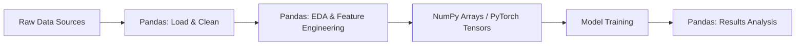
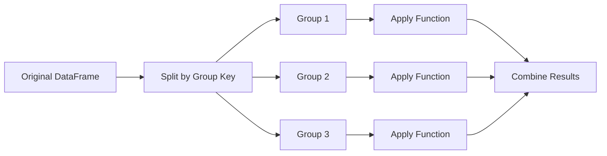

# Phase 5 — Pandas

## Complete Learning & Interview Mastery Guide

---

## Table of Contents

1. [What is Pandas and Why It Matters](#what-is-pandas-and-why-it-matters)
2. [DataFrames — The Core Data Structure](#dataframes--the-core-data-structure)
3. [Data Loading and Inspection](#data-loading-and-inspection)
4. [Data Cleaning](#data-cleaning)
5. [Missing Values — Complete Guide](#missing-values--complete-guide)
6. [GroupBy — Split-Apply-Combine](#groupby--split-apply-combine)
7. [Merge, Join, and Concatenation](#merge-join-and-concatenation)
8. [Pivot Tables and Reshaping](#pivot-tables-and-reshaping)
9. [Feature Engineering with Pandas](#feature-engineering-with-pandas)
10. [Time-Series Handling](#time-series-handling)
11. [Performance Optimization](#performance-optimization)
12. [Interview Mastery](#interview-mastery)

---

## What is Pandas and Why It Matters

### Beginner Explanation

Pandas is Python's library for working with structured (tabular) data — think spreadsheets or SQL tables but with the power of Python. If NumPy is for raw numbers, Pandas is for labeled, heterogeneous data with rows and columns.

In ML, you spend **60-80% of your time** on data preparation — loading, cleaning, transforming, and exploring data. Pandas is the tool for all of it.

### Technical Explanation

Pandas provides two core data structures:
- **Series**: A 1D labeled array (like a column in a spreadsheet)
- **DataFrame**: A 2D labeled structure (like a full spreadsheet/SQL table)

Built on NumPy, it adds:
- Column labels and row indices
- Mixed data types per column
- Built-in handling of missing values (NaN)
- SQL-like operations (groupby, merge, pivot)
- Time-series functionality

### Where Pandas Fits in the ML Pipeline



### Pandas vs Other Tools

| Tool | Best For | Limitations |
|------|----------|-------------|
| **Pandas** | Data < 10GB, exploration, prototyping | Single machine, memory-bound |
| **Polars** | Large data, speed-critical pipelines | Less ecosystem support |
| **PySpark** | Distributed data > 100GB | Overhead for small data |
| **Dask** | Pandas API on larger-than-memory data | Some operations not supported |
| **SQL** | Stored data, aggregations | Less flexible transformations |

---

## DataFrames — The Core Data Structure

### Creating DataFrames

```python
import pandas as pd
import numpy as np

# From dictionary (most common)
df = pd.DataFrame({
    'name': ['Alice', 'Bob', 'Charlie', 'Diana'],
    'age': [25, 30, 35, 28],
    'salary': [50000, 70000, 90000, 65000],
    'department': ['Engineering', 'Marketing', 'Engineering', 'Data Science']
})

# From list of dicts (common for API responses)
records = [
    {'model': 'RF', 'accuracy': 0.92, 'f1': 0.89},
    {'model': 'XGB', 'accuracy': 0.95, 'f1': 0.93},
    {'model': 'LR', 'accuracy': 0.88, 'f1': 0.85}
]
results_df = pd.DataFrame(records)

# From NumPy array
data = np.random.randn(100, 5)
df_numpy = pd.DataFrame(data, columns=['f1', 'f2', 'f3', 'f4', 'f5'])

# From CSV, Parquet, SQL (production)
df_csv = pd.read_csv('data.csv')
df_parquet = pd.read_parquet('data.parquet')
# df_sql = pd.read_sql('SELECT * FROM users', connection)
```

### DataFrame Anatomy

```
             columns
          ┌─────────────────────────────┐
          │  name    age  salary  dept   │
          ├─────────────────────────────┤
index → 0 │  Alice   25   50000   Eng   │
        1 │  Bob     30   70000   Mkt   │
        2 │  Charlie 35   90000   Eng   │
        3 │  Diana   28   65000   DS    │
          └─────────────────────────────┘
          
- Each column is a Series (homogeneous type)
- Each row has an index (default: 0, 1, 2, ...)
- DataFrame = dict of Series sharing an index
```

### Accessing Data

```python
# === Column access ===
df['age']              # Returns Series
df[['name', 'age']]   # Returns DataFrame (multiple columns)
df.age                 # Attribute access (avoid for production code — can conflict with methods)

# === Row access ===
df.iloc[0]             # By integer position (first row)
df.iloc[0:3]           # Rows 0, 1, 2 by position
df.loc[0]              # By label (when index is default integers, same as iloc)
df.loc[df['age'] > 28] # By boolean condition

# === Cell access ===
df.iloc[0, 1]          # Row 0, Column 1 by position → 25
df.loc[0, 'age']       # Row 0, Column 'age' by label → 25
df.at[0, 'age']        # Fast scalar access → 25

# === .loc vs .iloc (critical distinction!) ===
# .loc = label-based (INCLUSIVE on both ends)
# .iloc = integer position-based (EXCLUSIVE on end, like Python slicing)

df_custom = pd.DataFrame({'val': [10, 20, 30]}, index=['a', 'b', 'c'])
print(df_custom.loc['a':'b'])    # rows 'a' AND 'b' (inclusive!)
print(df_custom.iloc[0:2])       # rows 0 and 1 (exclusive end!)
```

### Data Types in Pandas

```python
print(df.dtypes)
# name          object    (strings)
# age           int64     (integers)
# salary        int64
# department    object

# Optimize dtypes for memory
df['age'] = df['age'].astype('int8')            # 1 byte vs 8
df['salary'] = df['salary'].astype('int32')     # 4 bytes vs 8
df['department'] = df['department'].astype('category')  # Huge savings for repeated strings

# Nullable integer type (supports NaN in integer columns)
df['count'] = pd.array([1, 2, None, 4], dtype=pd.Int64Dtype())

# Check memory usage
print(df.memory_usage(deep=True))
print(f"Total: {df.memory_usage(deep=True).sum() / 1024:.1f} KB")
```

---

## Data Loading and Inspection

### Loading Data

```python
# === CSV (most common) ===
df = pd.read_csv(
    'data.csv',
    sep=',',                        # Delimiter
    header=0,                       # Row number for column names
    index_col=None,                 # Column to use as index
    usecols=['col1', 'col2'],       # Only load specific columns
    dtype={'id': str, 'val': float},# Specify dtypes (faster, less memory)
    na_values=['NA', 'null', ''],   # Custom NA values
    parse_dates=['date_col'],       # Auto-parse dates
    nrows=10000,                    # Load only first N rows (for testing)
    chunksize=100000                # Returns iterator of chunks (for large files)
)

# === Parquet (recommended for ML — faster, smaller, typed) ===
df = pd.read_parquet('data.parquet', columns=['feature1', 'feature2', 'label'])

# === Excel ===
df = pd.read_excel('data.xlsx', sheet_name='Sheet1')

# === JSON ===
df = pd.read_json('data.json')
# For nested JSON:
df = pd.json_normalize(json_data, record_path=['results'])

# === SQL ===
import sqlite3
conn = sqlite3.connect('database.db')
df = pd.read_sql('SELECT * FROM users WHERE active = 1', conn)

# === From clipboard (quick exploration) ===
df = pd.read_clipboard()
```

### Inspecting Data — First Steps in Any ML Project

```python
# Shape and size
print(f"Shape: {df.shape}")           # (rows, columns)
print(f"Size: {df.size}")             # Total elements
print(f"Memory: {df.memory_usage(deep=True).sum() / 1e6:.1f} MB")

# First/last rows
print(df.head(10))
print(df.tail(5))

# Column info
print(df.info())          # Dtypes, non-null counts, memory
print(df.dtypes)          # Just dtypes
print(df.columns.tolist())# Column names as list

# Statistical summary
print(df.describe())              # Numeric columns: count, mean, std, min, quartiles, max
print(df.describe(include='all')) # Include categorical columns too

# Unique values
print(df['category'].nunique())          # Number of unique values
print(df['category'].value_counts())      # Count per category
print(df['category'].value_counts(normalize=True))  # Proportions

# Missing values
print(df.isnull().sum())                  # Count NaN per column
print(df.isnull().sum() / len(df) * 100)  # Percentage missing per column

# Duplicates
print(f"Duplicates: {df.duplicated().sum()}")
print(f"Duplicate rows:\n{df[df.duplicated(keep=False)]}")

# Correlations
print(df.select_dtypes(include=[np.number]).corr())
```

### Exploratory Data Analysis (EDA) Template

```python
def quick_eda(df, target_col=None):
    """Quick EDA report for any DataFrame."""
    print("=" * 60)
    print(f"DATASET OVERVIEW")
    print("=" * 60)
    print(f"Shape: {df.shape[0]:,} rows × {df.shape[1]} columns")
    print(f"Memory: {df.memory_usage(deep=True).sum() / 1e6:.1f} MB")
    print(f"Duplicates: {df.duplicated().sum()}")
    
    print("\n" + "=" * 60)
    print("COLUMN TYPES")
    print("=" * 60)
    print(f"Numeric: {df.select_dtypes(include=[np.number]).columns.tolist()}")
    print(f"Categorical: {df.select_dtypes(include=['object', 'category']).columns.tolist()}")
    print(f"Datetime: {df.select_dtypes(include=['datetime']).columns.tolist()}")
    
    print("\n" + "=" * 60)
    print("MISSING VALUES")
    print("=" * 60)
    missing = df.isnull().sum()
    missing_pct = (missing / len(df) * 100).round(1)
    missing_df = pd.DataFrame({'count': missing, 'percent': missing_pct})
    print(missing_df[missing_df['count'] > 0].sort_values('percent', ascending=False))
    
    if target_col and target_col in df.columns:
        print("\n" + "=" * 60)
        print(f"TARGET: {target_col}")
        print("=" * 60)
        if df[target_col].dtype in [np.number]:
            print(df[target_col].describe())
        else:
            print(df[target_col].value_counts())
            print(f"\nClass balance: {df[target_col].value_counts(normalize=True).to_dict()}")

# Usage
quick_eda(df, target_col='label')
```

---

## Data Cleaning

### Handling Duplicates

```python
# Detect duplicates
print(f"Total duplicates: {df.duplicated().sum()}")
print(f"Duplicates on subset: {df.duplicated(subset=['user_id', 'date']).sum()}")

# Remove duplicates
df_clean = df.drop_duplicates()                          # All columns
df_clean = df.drop_duplicates(subset=['user_id', 'date'], keep='last')  # Keep last occurrence

# Find duplicate groups for inspection
dup_mask = df.duplicated(subset=['user_id'], keep=False)  # keep=False marks ALL duplicates
print(df[dup_mask].sort_values('user_id'))
```

### Data Type Conversion

```python
# String to numeric
df['price'] = pd.to_numeric(df['price'], errors='coerce')  # Invalid → NaN
df['count'] = pd.to_numeric(df['count'], errors='coerce').astype('Int64')  # Nullable int

# String to datetime
df['date'] = pd.to_datetime(df['date'], format='%Y-%m-%d', errors='coerce')
df['timestamp'] = pd.to_datetime(df['timestamp'], unit='s')  # Unix timestamp

# Categorical
df['status'] = df['status'].astype('category')

# Boolean
df['is_active'] = df['is_active'].map({'yes': True, 'no': False, 'Y': True, 'N': False})
```

### String Cleaning

```python
# Access string methods via .str accessor
df['name'] = df['name'].str.strip()              # Remove whitespace
df['name'] = df['name'].str.lower()              # Lowercase
df['email'] = df['email'].str.replace(r'\s+', '', regex=True)  # Remove all spaces

# Split and extract
df['first_name'] = df['full_name'].str.split(' ').str[0]
df['domain'] = df['email'].str.split('@').str[1]

# Pattern matching
df['has_number'] = df['text'].str.contains(r'\d+', regex=True)
df['phone'] = df['text'].str.extract(r'(\d{3}-\d{3}-\d{4})')

# Replace values
df['category'] = df['category'].replace({
    'ML': 'Machine Learning',
    'DL': 'Deep Learning',
    'NLP': 'Natural Language Processing'
})
```

### Outlier Detection and Handling

```python
# IQR method
def detect_outliers_iqr(series, factor=1.5):
    Q1 = series.quantile(0.25)
    Q3 = series.quantile(0.75)
    IQR = Q3 - Q1
    lower = Q1 - factor * IQR
    upper = Q3 + factor * IQR
    return (series < lower) | (series > upper)

# Z-score method
def detect_outliers_zscore(series, threshold=3):
    z_scores = np.abs((series - series.mean()) / series.std())
    return z_scores > threshold

# Apply
outlier_mask = detect_outliers_iqr(df['salary'])
print(f"Outliers detected: {outlier_mask.sum()}")

# Handling options:
# 1. Remove
df_no_outliers = df[~outlier_mask]

# 2. Cap (winsorize)
lower = df['salary'].quantile(0.01)
upper = df['salary'].quantile(0.99)
df['salary_capped'] = df['salary'].clip(lower, upper)

# 3. Log transform (reduce skewness)
df['salary_log'] = np.log1p(df['salary'])

# 4. Replace with NaN (then impute later)
df.loc[outlier_mask, 'salary'] = np.nan
```

---

## Missing Values — Complete Guide

### Beginner Explanation

Missing values (NaN, null) are unavoidable in real data. Sensors fail, users skip fields, data pipelines break. How you handle missing data significantly impacts model performance.

### Understanding Missing Data Types

| Type | Description | Example | Strategy |
|------|-------------|---------|----------|
| **MCAR** (Missing Completely At Random) | No pattern to missingness | Random sensor failures | Safe to drop or impute |
| **MAR** (Missing At Random) | Related to observed data | High-income people skip age field | Impute using related features |
| **MNAR** (Missing Not At Random) | Related to the missing value itself | Sick people miss health surveys | Requires domain knowledge |

### Detection

```python
# Basic detection
print(df.isnull().sum())                    # Count per column
print(df.isnull().sum() / len(df) * 100)    # Percentage per column
print(df.isnull().any(axis=1).sum())        # Rows with ANY missing value

# Visualize missingness patterns
missing_matrix = df.isnull().astype(int)
# Check if missing values correlate (MAR detection)
print(missing_matrix.corr())

# Profile missing data
def missing_profile(df):
    missing = df.isnull().sum()
    percent = (missing / len(df) * 100).round(2)
    dtypes = df.dtypes
    profile = pd.DataFrame({
        'missing_count': missing,
        'missing_percent': percent,
        'dtype': dtypes
    })
    return profile[profile['missing_count'] > 0].sort_values('missing_percent', ascending=False)

print(missing_profile(df))
```

### Handling Strategies

```python
# === 1. DROPPING ===
# Drop rows with any NaN
df_dropped = df.dropna()

# Drop rows where specific columns are NaN
df_dropped = df.dropna(subset=['target_column', 'critical_feature'])

# Drop columns with too many missing values
threshold = 0.5  # Drop if >50% missing
cols_to_drop = df.columns[df.isnull().mean() > threshold]
df = df.drop(columns=cols_to_drop)

# === 2. SIMPLE IMPUTATION ===
# Numeric: mean, median, or constant
df['age'].fillna(df['age'].median(), inplace=True)
df['income'].fillna(df['income'].mean(), inplace=True)
df['score'].fillna(0, inplace=True)  # Domain-specific default

# Categorical: mode or 'Unknown'
df['category'].fillna(df['category'].mode()[0], inplace=True)
df['city'].fillna('Unknown', inplace=True)

# Forward/backward fill (time series)
df['price'].fillna(method='ffill', inplace=True)  # Use previous value
df['price'].fillna(method='bfill', inplace=True)  # Use next value

# === 3. GROUP-BASED IMPUTATION (better for MAR) ===
# Fill with group mean
df['salary'] = df.groupby('department')['salary'].transform(
    lambda x: x.fillna(x.median())
)

# === 4. ADVANCED IMPUTATION ===
from sklearn.impute import KNNImputer, SimpleImputer
from sklearn.experimental import enable_iterative_imputer
from sklearn.impute import IterativeImputer

# KNN Imputer — uses similar samples to impute
knn_imputer = KNNImputer(n_neighbors=5)
X_imputed = knn_imputer.fit_transform(df[numeric_cols])

# Iterative Imputer (MICE) — models each feature as function of others
mice_imputer = IterativeImputer(max_iter=10, random_state=42)
X_imputed = mice_imputer.fit_transform(df[numeric_cols])

# === 5. INDICATOR COLUMNS (preserve missingness information) ===
# The fact that a value is missing can itself be informative!
df['salary_missing'] = df['salary'].isnull().astype(int)
df['salary'] = df['salary'].fillna(df['salary'].median())
```

### Best Practices for Missing Values in ML

```python
# Complete preprocessing pipeline for missing values
def handle_missing_values(df, numeric_strategy='median', categorical_strategy='mode'):
    """Production-ready missing value handler."""
    df = df.copy()
    
    numeric_cols = df.select_dtypes(include=[np.number]).columns
    categorical_cols = df.select_dtypes(include=['object', 'category']).columns
    
    # Step 1: Add missing indicators for columns with >5% missing
    for col in df.columns:
        if df[col].isnull().mean() > 0.05:
            df[f'{col}_is_missing'] = df[col].isnull().astype(int)
    
    # Step 2: Impute numeric columns
    for col in numeric_cols:
        if df[col].isnull().any():
            if numeric_strategy == 'median':
                df[col] = df[col].fillna(df[col].median())
            elif numeric_strategy == 'mean':
                df[col] = df[col].fillna(df[col].mean())
    
    # Step 3: Impute categorical columns
    for col in categorical_cols:
        if df[col].isnull().any():
            if categorical_strategy == 'mode':
                df[col] = df[col].fillna(df[col].mode()[0])
            else:
                df[col] = df[col].fillna('Unknown')
    
    return df
```

---

## GroupBy — Split-Apply-Combine

### Beginner Explanation

GroupBy splits your data into groups (like GROUP BY in SQL), applies a function to each group, and combines the results. It's how you answer questions like "What's the average salary per department?" or "What's the click-through rate per user segment?"

### The Split-Apply-Combine Pattern



### Basic GroupBy Operations

```python
# Sample data
df = pd.DataFrame({
    'department': ['Eng', 'Mkt', 'Eng', 'DS', 'Mkt', 'DS', 'Eng', 'DS'],
    'level': ['Jr', 'Sr', 'Sr', 'Jr', 'Jr', 'Sr', 'Jr', 'Sr'],
    'salary': [70, 90, 120, 65, 55, 110, 75, 130],
    'performance': [4.2, 3.8, 4.5, 3.9, 4.0, 4.7, 3.5, 4.3]
})

# Single column groupby
dept_stats = df.groupby('department')['salary'].mean()
print(dept_stats)
# DS     101.67
# Eng     88.33
# Mkt     72.50

# Multiple aggregations
dept_summary = df.groupby('department')['salary'].agg(['mean', 'median', 'std', 'count'])
print(dept_summary)

# Multiple columns, multiple aggregations
summary = df.groupby('department').agg({
    'salary': ['mean', 'min', 'max'],
    'performance': ['mean', 'std']
})
print(summary)

# Named aggregations (cleaner output)
summary = df.groupby('department').agg(
    avg_salary=('salary', 'mean'),
    max_salary=('salary', 'max'),
    avg_perf=('performance', 'mean'),
    headcount=('salary', 'count')
)
print(summary)

# Multiple group keys
multi_group = df.groupby(['department', 'level']).agg(
    avg_salary=('salary', 'mean'),
    count=('salary', 'count')
).reset_index()
print(multi_group)
```

### Transform vs Aggregate vs Apply

```python
# AGGREGATE: One result per group (reduces rows)
# "What's the average salary per department?"
df.groupby('department')['salary'].mean()
# Returns: Series with one value per department

# TRANSFORM: Same shape as input (broadcasts group result back)
# "What's each person's salary relative to their department average?"
df['dept_avg'] = df.groupby('department')['salary'].transform('mean')
df['salary_vs_dept'] = df['salary'] - df['dept_avg']
# Returns: Series with same length as original (group value repeated)

# APPLY: Most flexible (arbitrary function per group)
# "For each department, who are the top 2 earners?"
top_earners = df.groupby('department').apply(
    lambda x: x.nlargest(2, 'salary')
).reset_index(drop=True)

# === When to use which ===
# aggregate() → summary statistics, reporting
# transform() → feature engineering (group-level features per row)
# apply()     → complex logic that doesn't fit agg/transform
```

### Advanced GroupBy for Feature Engineering

```python
# Rolling statistics within groups (e.g., user history)
df_sorted = df.sort_values(['user_id', 'date'])
df_sorted['user_rolling_avg'] = df_sorted.groupby('user_id')['amount'].transform(
    lambda x: x.rolling(window=7, min_periods=1).mean()
)

# Rank within group
df['salary_rank_in_dept'] = df.groupby('department')['salary'].rank(
    method='dense', ascending=False
)

# Percentage of group total
df['pct_of_dept_salary'] = df.groupby('department')['salary'].transform(
    lambda x: x / x.sum() * 100
)

# Lag/lead within group (previous value)
df_sorted['prev_purchase'] = df_sorted.groupby('user_id')['amount'].shift(1)
df_sorted['days_since_last'] = df_sorted.groupby('user_id')['date'].diff().dt.days

# Cumulative statistics
df_sorted['cumulative_spend'] = df_sorted.groupby('user_id')['amount'].cumsum()
df_sorted['purchase_number'] = df_sorted.groupby('user_id').cumcount() + 1

# Custom aggregation with multiple statistics
def compute_user_features(group):
    return pd.Series({
        'total_spend': group['amount'].sum(),
        'avg_spend': group['amount'].mean(),
        'transaction_count': len(group),
        'days_active': (group['date'].max() - group['date'].min()).days,
        'recency': (pd.Timestamp.now() - group['date'].max()).days,
        'spend_std': group['amount'].std(),
        'max_single_spend': group['amount'].max()
    })

user_features = df.groupby('user_id').apply(compute_user_features).reset_index()
```

---

## Merge, Join, and Concatenation

### Beginner Explanation

In real ML projects, your data lives in multiple tables. You need to combine them:
- **Merge/Join**: Combine tables side-by-side based on matching keys (like SQL JOIN)
- **Concatenate**: Stack tables on top of each other (like UNION)

### Merge (SQL-style Joins)

```python
# Sample tables
users = pd.DataFrame({
    'user_id': [1, 2, 3, 4, 5],
    'name': ['Alice', 'Bob', 'Charlie', 'Diana', 'Eve'],
    'age': [25, 30, 35, 28, 42]
})

orders = pd.DataFrame({
    'order_id': [101, 102, 103, 104, 105],
    'user_id': [1, 2, 2, 3, 6],  # Note: user 6 not in users table!
    'amount': [50, 75, 30, 120, 45]
})

# INNER JOIN: Only matching rows from both tables
inner = pd.merge(users, orders, on='user_id', how='inner')
print(f"Inner join: {len(inner)} rows")  # Users 1, 2, 3 only

# LEFT JOIN: All rows from left table + matching from right
left = pd.merge(users, orders, on='user_id', how='left')
print(f"Left join: {len(left)} rows")  # All 5 users (Diana, Eve have NaN for order)

# RIGHT JOIN: All rows from right table + matching from left
right = pd.merge(users, orders, on='user_id', how='right')
print(f"Right join: {len(right)} rows")  # All 5 orders (user 6 has NaN for name)

# OUTER JOIN: All rows from both tables
outer = pd.merge(users, orders, on='user_id', how='outer')
print(f"Outer join: {len(outer)} rows")  # Everyone

# Different column names
df1 = pd.DataFrame({'id_col': [1,2,3], 'value': [10,20,30]})
df2 = pd.DataFrame({'key_col': [1,2,4], 'score': [0.5, 0.8, 0.3]})
merged = pd.merge(df1, df2, left_on='id_col', right_on='key_col', how='inner')

# Multiple join keys
merged = pd.merge(
    orders_df, products_df,
    on=['product_id', 'store_id'],  # Join on composite key
    how='left'
)
```

### Visual Join Reference

```
INNER JOIN:          LEFT JOIN:           OUTER JOIN:
  A ∩ B               A (all) + B          A ∪ B

  ┌───┐               ┌───┐               ┌───┐
  │   │●●●│           │███│●●●│           │███│●●●│
  │   │●●●│           │███│●●●│           │███│●●●│
  └───┘               │███│               │███│●●●│
                      └───┘               └───┘
  
  Only where           All left rows,       All rows from
  both match           NaN where no match   both, NaN for gaps
```

### Concatenation

```python
# Stack vertically (add more rows)
train = pd.DataFrame({'feature': [1,2,3], 'label': [0,0,1]})
test = pd.DataFrame({'feature': [4,5,6], 'label': [1,0,1]})

combined = pd.concat([train, test], axis=0, ignore_index=True)
# Reset index to avoid duplicate indices

# Stack horizontally (add more columns)
features = pd.DataFrame({'f1': [1,2,3], 'f2': [4,5,6]})
labels = pd.DataFrame({'label': [0, 1, 1]})
dataset = pd.concat([features, labels], axis=1)

# Concatenate with source indicator
combined = pd.concat([train, test], keys=['train', 'test'])
# Creates MultiIndex to track source
```

### ML-Specific Join Patterns

```python
# Join features from multiple sources
user_demographics = pd.read_csv('users.csv')          # user_id, age, city
user_behavior = pd.read_csv('behavior.csv')           # user_id, clicks, time_spent
user_purchases = pd.read_csv('purchases.csv')         # user_id, total_spend, items

# Build feature table by progressive left joins
feature_table = (
    user_demographics
    .merge(user_behavior, on='user_id', how='left')
    .merge(user_purchases, on='user_id', how='left')
)

# Validate join quality
print(f"Original users: {len(user_demographics)}")
print(f"After joins: {len(feature_table)}")
# If these differ, you have a many-to-one issue!

# Check for accidental row multiplication
assert len(feature_table) == len(user_demographics), "Join created duplicate rows!"
```

---

## Pivot Tables and Reshaping

### Pivot Tables

```python
# Sample data
sales = pd.DataFrame({
    'date': ['2024-01', '2024-01', '2024-02', '2024-02', '2024-01', '2024-02'],
    'product': ['A', 'B', 'A', 'B', 'A', 'B'],
    'region': ['North', 'North', 'North', 'South', 'South', 'South'],
    'revenue': [100, 150, 120, 80, 90, 110]
})

# Simple pivot table
pivot = sales.pivot_table(
    values='revenue',
    index='product',
    columns='region',
    aggfunc='sum'
)
print(pivot)
# region    North  South
# product
# A           220     90
# B           150    190

# Multiple aggregations
pivot_multi = sales.pivot_table(
    values='revenue',
    index='product',
    columns='date',
    aggfunc=['sum', 'mean', 'count'],
    fill_value=0,
    margins=True  # Add row/column totals
)
```

### Melt (Unpivot) — Wide to Long Format

```python
# Wide format (common in spreadsheets)
wide_df = pd.DataFrame({
    'user_id': [1, 2, 3],
    'jan_score': [85, 90, 78],
    'feb_score': [88, 87, 82],
    'mar_score': [92, 91, 85]
})

# Convert to long format (better for ML)
long_df = pd.melt(
    wide_df,
    id_vars=['user_id'],
    value_vars=['jan_score', 'feb_score', 'mar_score'],
    var_name='month',
    value_name='score'
)
print(long_df)
# user_id      month  score
#       1  jan_score     85
#       2  jan_score     90
#       ...
```

### Stack and Unstack

```python
# Useful for MultiIndex manipulation
multi_idx = sales.groupby(['region', 'product'])['revenue'].sum()
print(multi_idx)
# region  product
# North   A          220
#         B          150
# South   A           90
#         B          190

# Unstack: Move inner index level to columns
print(multi_idx.unstack())
# product     A    B
# region
# North     220  150
# South      90  190

# Stack: Move columns to index (opposite)
```

---

## Feature Engineering with Pandas

### Beginner Explanation

Feature engineering is the art of creating new informative columns from existing data. It's often the biggest differentiator between a mediocre model and a great one. Pandas makes this fast and expressive.

### Numeric Feature Engineering

```python
import pandas as pd
import numpy as np

# Sample dataset
df = pd.DataFrame({
    'price': [10, 25, 50, 100, 200],
    'quantity': [100, 50, 20, 10, 5],
    'weight_kg': [0.5, 1.2, 2.5, 5.0, 10.0],
    'rating': [4.2, 3.8, 4.5, 3.9, 4.7],
    'reviews': [150, 30, 500, 80, 1200]
})

# === Mathematical transforms ===
df['revenue'] = df['price'] * df['quantity']
df['price_per_kg'] = df['price'] / df['weight_kg']
df['log_price'] = np.log1p(df['price'])           # Log transform for skewed data
df['price_squared'] = df['price'] ** 2             # Polynomial feature
df['sqrt_reviews'] = np.sqrt(df['reviews'])

# === Binning/Discretization ===
df['price_tier'] = pd.cut(
    df['price'], 
    bins=[0, 20, 50, 100, np.inf],
    labels=['budget', 'mid', 'premium', 'luxury']
)

df['rating_category'] = pd.qcut(
    df['rating'], q=3, labels=['low', 'medium', 'high']
)  # Equal frequency bins

# === Interaction features ===
df['price_x_rating'] = df['price'] * df['rating']
df['review_density'] = df['reviews'] / df['price']  # Reviews per dollar spent

# === Statistical features ===
df['price_zscore'] = (df['price'] - df['price'].mean()) / df['price'].std()
df['price_rank'] = df['price'].rank(pct=True)  # Percentile rank
df['above_median_price'] = (df['price'] > df['price'].median()).astype(int)
```

### Categorical Feature Engineering

```python
df = pd.DataFrame({
    'color': ['red', 'blue', 'green', 'red', 'blue', 'red'],
    'size': ['S', 'M', 'L', 'XL', 'M', 'S'],
    'brand': ['Nike', 'Adidas', 'Nike', 'Puma', 'Nike', 'Adidas']
})

# === One-Hot Encoding ===
encoded = pd.get_dummies(df['color'], prefix='color', drop_first=True)
df = pd.concat([df, encoded], axis=1)

# === Label Encoding (ordinal) ===
size_order = {'S': 0, 'M': 1, 'L': 2, 'XL': 3}
df['size_encoded'] = df['size'].map(size_order)

# === Frequency Encoding ===
freq_map = df['brand'].value_counts(normalize=True).to_dict()
df['brand_frequency'] = df['brand'].map(freq_map)

# === Target Encoding (powerful but prone to leakage!) ===
def target_encode(df, column, target, smoothing=10):
    """Target encoding with smoothing to reduce overfitting."""
    global_mean = df[target].mean()
    agg = df.groupby(column)[target].agg(['mean', 'count'])
    
    # Smoothing: blend category mean with global mean
    smooth = (agg['count'] * agg['mean'] + smoothing * global_mean) / (agg['count'] + smoothing)
    return df[column].map(smooth)

# === Count/Rare encoding ===
# Group rare categories together
value_counts = df['brand'].value_counts()
rare_mask = value_counts < 2  # Categories with <2 occurrences
rare_categories = value_counts[rare_mask].index
df['brand_grouped'] = df['brand'].replace(rare_categories, 'Other')
```

### Date/Time Feature Engineering

```python
df = pd.DataFrame({
    'timestamp': pd.date_range('2024-01-01', periods=1000, freq='h')
})

# Extract components
df['year'] = df['timestamp'].dt.year
df['month'] = df['timestamp'].dt.month
df['day'] = df['timestamp'].dt.day
df['hour'] = df['timestamp'].dt.hour
df['day_of_week'] = df['timestamp'].dt.dayofweek      # 0=Monday
df['day_name'] = df['timestamp'].dt.day_name()
df['is_weekend'] = df['timestamp'].dt.dayofweek >= 5
df['quarter'] = df['timestamp'].dt.quarter
df['week_of_year'] = df['timestamp'].dt.isocalendar().week

# Cyclical encoding (so Dec 31 is close to Jan 1)
df['hour_sin'] = np.sin(2 * np.pi * df['hour'] / 24)
df['hour_cos'] = np.cos(2 * np.pi * df['hour'] / 24)
df['month_sin'] = np.sin(2 * np.pi * df['month'] / 12)
df['month_cos'] = np.cos(2 * np.pi * df['month'] / 12)

# Time-based features
df['days_since_start'] = (df['timestamp'] - df['timestamp'].min()).dt.days
df['is_business_hour'] = df['hour'].between(9, 17)
df['is_month_end'] = df['timestamp'].dt.is_month_end
```

### Text Feature Engineering

```python
df = pd.DataFrame({
    'description': [
        'Amazing product! Works perfectly.',
        'Terrible quality, broke after one day.',
        'Good value for money, recommended!',
        'Not worth the price.',
        'Best purchase ever!! 5 stars'
    ]
})

# Basic text features
df['text_length'] = df['description'].str.len()
df['word_count'] = df['description'].str.split().str.len()
df['avg_word_length'] = df['description'].apply(
    lambda x: np.mean([len(w) for w in x.split()])
)
df['exclamation_count'] = df['description'].str.count('!')
df['question_count'] = df['description'].str.count(r'\?')
df['has_uppercase'] = df['description'].str.contains(r'[A-Z]{2,}').astype(int)
df['digit_count'] = df['description'].str.count(r'\d')

# Sentiment indicators (simple keyword-based)
positive_words = ['amazing', 'great', 'best', 'perfect', 'love', 'excellent', 'recommended']
negative_words = ['terrible', 'worst', 'bad', 'broke', 'hate', 'awful', 'not worth']

df['positive_word_count'] = df['description'].str.lower().apply(
    lambda x: sum(1 for w in positive_words if w in x)
)
df['negative_word_count'] = df['description'].str.lower().apply(
    lambda x: sum(1 for w in negative_words if w in x)
)
```

---

## Time-Series Handling

### Beginner Explanation

Time-series data is data collected over time — stock prices, sensor readings, user activity, website traffic. Pandas has powerful built-in tools for time-series analysis, which is critical for forecasting and feature engineering.

### DateTime Index and Resampling

```python
# Create time-series data
dates = pd.date_range('2023-01-01', '2023-12-31', freq='D')
ts = pd.DataFrame({
    'date': dates,
    'sales': np.random.poisson(100, len(dates)) + np.sin(np.arange(len(dates)) * 2 * np.pi / 365) * 30,
    'visitors': np.random.poisson(500, len(dates))
})
ts = ts.set_index('date')

# === Resampling (change frequency) ===
# Downsample: Daily → Weekly
weekly = ts.resample('W').agg({
    'sales': 'sum',
    'visitors': 'mean'
})

# Downsample: Daily → Monthly
monthly = ts.resample('M').agg({
    'sales': ['sum', 'mean', 'std'],
    'visitors': ['sum', 'mean']
})

# Upsample: Monthly → Daily (with interpolation)
monthly_data = ts.resample('M').mean()
daily_interpolated = monthly_data.resample('D').interpolate(method='linear')
```

### Rolling and Expanding Windows

```python
# Rolling window statistics
ts['sales_rolling_7d'] = ts['sales'].rolling(window=7).mean()
ts['sales_rolling_30d'] = ts['sales'].rolling(window=30).mean()
ts['sales_rolling_std'] = ts['sales'].rolling(window=7).std()

# Exponentially weighted moving average (more weight on recent)
ts['sales_ewm'] = ts['sales'].ewm(span=7).mean()

# Expanding window (cumulative from start)
ts['cumulative_sales'] = ts['sales'].expanding().sum()
ts['cumulative_avg'] = ts['sales'].expanding().mean()

# Rolling with min_periods (handle start of series)
ts['sales_rolling_safe'] = ts['sales'].rolling(window=7, min_periods=1).mean()
```

### Lag Features (Critical for Time-Series ML)

```python
# Create lag features (previous values as features)
for lag in [1, 7, 14, 30]:
    ts[f'sales_lag_{lag}'] = ts['sales'].shift(lag)

# Difference features (rate of change)
ts['sales_diff_1d'] = ts['sales'].diff(1)    # Change from yesterday
ts['sales_diff_7d'] = ts['sales'].diff(7)    # Change from last week
ts['sales_pct_change'] = ts['sales'].pct_change(1)  # Percentage change

# Rolling statistics as features
ts['sales_7d_mean'] = ts['sales'].rolling(7).mean()
ts['sales_7d_std'] = ts['sales'].rolling(7).std()
ts['sales_7d_min'] = ts['sales'].rolling(7).min()
ts['sales_7d_max'] = ts['sales'].rolling(7).max()

# Ratio features
ts['sales_vs_7d_avg'] = ts['sales'] / ts['sales_7d_mean']
ts['sales_vs_30d_avg'] = ts['sales'] / ts['sales'].rolling(30).mean()

# Drop NaN rows caused by lagging
ts = ts.dropna()
```

### Time-Series Train/Test Split

```python
# NEVER randomly split time-series data!
# Always use temporal split to prevent data leakage.

def temporal_train_test_split(df, test_size=0.2):
    """Split time-series data chronologically."""
    n = len(df)
    split_idx = int(n * (1 - test_size))
    train = df.iloc[:split_idx]
    test = df.iloc[split_idx:]
    return train, test

train, test = temporal_train_test_split(ts, test_size=0.2)
print(f"Train: {train.index.min()} to {train.index.max()}")
print(f"Test:  {test.index.min()} to {test.index.max()}")

# Time-series cross-validation
from sklearn.model_selection import TimeSeriesSplit
tscv = TimeSeriesSplit(n_splits=5)
for train_idx, val_idx in tscv.split(ts):
    train_fold = ts.iloc[train_idx]
    val_fold = ts.iloc[val_idx]
```

---

## Performance Optimization

### Memory Optimization

```python
def optimize_dtypes(df):
    """Reduce DataFrame memory by optimizing dtypes."""
    start_mem = df.memory_usage(deep=True).sum() / 1e6
    
    for col in df.columns:
        col_type = df[col].dtype
        
        if col_type == 'object':
            # Convert to category if low cardinality
            if df[col].nunique() / len(df) < 0.5:
                df[col] = df[col].astype('category')
        
        elif col_type in ['int64', 'int32']:
            c_min, c_max = df[col].min(), df[col].max()
            if c_min >= 0:
                if c_max < 255:
                    df[col] = df[col].astype(np.uint8)
                elif c_max < 65535:
                    df[col] = df[col].astype(np.uint16)
                elif c_max < 4294967295:
                    df[col] = df[col].astype(np.uint32)
            else:
                if c_min > -128 and c_max < 127:
                    df[col] = df[col].astype(np.int8)
                elif c_min > -32768 and c_max < 32767:
                    df[col] = df[col].astype(np.int16)
                elif c_min > -2147483648 and c_max < 2147483647:
                    df[col] = df[col].astype(np.int32)
        
        elif col_type == 'float64':
            df[col] = df[col].astype(np.float32)
    
    end_mem = df.memory_usage(deep=True).sum() / 1e6
    print(f"Memory: {start_mem:.1f} MB → {end_mem:.1f} MB ({(1-end_mem/start_mem)*100:.0f}% reduction)")
    return df
```

### Speed Optimization

```python
# === 1. Use vectorized operations ALWAYS ===
# BAD
for i in range(len(df)):
    df.loc[i, 'new_col'] = df.loc[i, 'a'] * df.loc[i, 'b']
# GOOD
df['new_col'] = df['a'] * df['b']

# === 2. Use .values or .to_numpy() for NumPy operations ===
# BAD (Pandas overhead)
result = df['col'].apply(lambda x: x ** 2)
# GOOD (NumPy speed)
result = df['col'].values ** 2

# === 3. Avoid iterrows() — use vectorized or apply ===
# TERRIBLE (Python loop over rows)
for idx, row in df.iterrows():
    df.loc[idx, 'result'] = compute(row['a'], row['b'])
# BETTER (vectorized)
df['result'] = np.where(df['a'] > 0, df['a'] * df['b'], 0)

# === 4. Use query() for complex filtering ===
# Standard
filtered = df[(df['age'] > 25) & (df['salary'] > 50000) & (df['dept'] == 'Eng')]
# query() — often faster for large DataFrames
filtered = df.query('age > 25 and salary > 50000 and dept == "Eng"')

# === 5. Use Parquet instead of CSV ===
# CSV: slow to read, large file size, no type information
# Parquet: fast to read, compressed, preserves types

# Write
df.to_parquet('data.parquet', index=False)
# Read (5-10x faster than CSV, 50-75% smaller files)
df = pd.read_parquet('data.parquet')

# === 6. Use categorical dtype for repeated strings ===
# Before: 'Engineering' stored 10,000 times as full string
# After: stored as integer pointer to single 'Engineering' string
df['department'] = df['department'].astype('category')

# === 7. Method chaining (avoid intermediate DataFrames) ===
result = (
    df
    .query('age > 25')
    .assign(salary_k=lambda x: x['salary'] / 1000)
    .groupby('department')
    .agg(avg_salary_k=('salary_k', 'mean'))
    .sort_values('avg_salary_k', ascending=False)
    .head(10)
)
```

### Processing Large Files

```python
# === Chunked processing ===
def process_large_csv(filepath, chunksize=100_000):
    """Process CSV larger than RAM in chunks."""
    results = []
    for chunk in pd.read_csv(filepath, chunksize=chunksize):
        processed = feature_engineering(chunk)
        results.append(processed)
    return pd.concat(results, ignore_index=True)

# === Only load needed columns ===
df = pd.read_csv('huge.csv', usecols=['col1', 'col2', 'target'])

# === Sampling for EDA ===
# Read only 1% of rows for exploration
df_sample = pd.read_csv('huge.csv', skiprows=lambda i: i > 0 and np.random.random() > 0.01)

# === Use Dask for out-of-core computation ===
import dask.dataframe as dd
ddf = dd.read_csv('huge_*.csv')  # Reads multiple files lazily
result = ddf.groupby('user_id')['amount'].sum().compute()  # Only computes on .compute()
```

---

## Interview Mastery

### Beginner Interview Questions

---

**Q1: What is the difference between loc and iloc?**

**Perfect Answer:**
> "`.loc` is label-based indexing — it selects data by row/column labels. `.iloc` is integer position-based — it selects by numerical position (0, 1, 2...).

> Key difference in slicing: `.loc` is inclusive on both ends, `.iloc` is exclusive on the end (like Python slicing).

> ```python
> df = pd.DataFrame({'A': [10,20,30,40]}, index=['a','b','c','d'])
> df.loc['a':'c']   # Rows a, b, c (inclusive!)
> df.iloc[0:3]      # Rows 0, 1, 2 (exclusive on end!)
> ```

> **When to use which**:
> - `loc`: When you know column names and want readable code
> - `iloc`: When you need positional access (first N rows, last column)
> - `at`/`iat`: For single scalar access (faster than loc/iloc)

> A common mistake is using `.loc` with integer indices and thinking it's positional — if your index is [5, 10, 15], `df.loc[0]` raises KeyError because there's no label 0."

---

**Q2: How do you handle missing values in a dataset?**

**Perfect Answer:**
> "My approach depends on the missingness pattern and the percentage missing:

> **Step 1: Diagnose** — Is it MCAR (random), MAR (related to other columns), or MNAR (related to the missing value itself)?

> **Step 2: Based on percentage**:
> - < 5% missing: Simple imputation (median for numeric, mode for categorical)
> - 5-30% missing: Group-based imputation or KNN imputer, plus add a missing indicator column
> - > 30% missing: Consider dropping the column, or use algorithms that handle NaN natively (XGBoost, LightGBM)

> **Step 3: Add missing indicators** — The fact that a value is missing can itself be informative! `df['col_is_missing'] = df['col'].isnull().astype(int)`

> **Important rules**:
> - Never impute using statistics from the full dataset — fit imputer on train only, transform test
> - For time-series: use forward-fill or interpolation, never future data
> - For tree-based models: often best to leave NaN (they handle it natively)
> - Always document your imputation strategy for reproducibility"

---

**Q3: Explain the difference between merge and concat.**

**Perfect Answer:**
> "`pd.merge()` combines DataFrames horizontally based on matching key columns — like a SQL JOIN. It aligns rows based on shared values.

> `pd.concat()` stacks DataFrames vertically (axis=0, add rows) or horizontally (axis=1, add columns). It aligns by index, not by key values.

> ```python
> # merge: combine on matching keys
> pd.merge(users, orders, on='user_id', how='left')
> # Produces: each user row + their order info
> 
> # concat axis=0: stack rows
> pd.concat([jan_data, feb_data, mar_data])
> # Produces: all months stacked vertically
> 
> # concat axis=1: stack columns
> pd.concat([features_df, labels_df], axis=1)
> # Produces: features and labels side by side
> ```

> **When to use which**:
> - `merge`: Combining related tables with a shared key (like SQL joins)
> - `concat axis=0`: Combining same-structure data (train + test, monthly files)
> - `concat axis=1`: Adding pre-aligned columns together

> A common production bug: merge creating more rows than expected due to many-to-many relationships. Always check `len(result)` after a merge."

---

### Intermediate Interview Questions

---

**Q4: Explain the GroupBy split-apply-combine pattern. When would you use transform vs aggregate?**

**Perfect Answer:**
> "GroupBy splits data into groups based on key values, applies a function to each group independently, then combines results.

> **aggregate()** reduces each group to a single value:
> ```python
> df.groupby('dept')['salary'].mean()
> # Returns: one row per department
> ```

> **transform()** returns a value for every original row (broadcasts group result back):
> ```python
> df['dept_avg'] = df.groupby('dept')['salary'].transform('mean')
> # Returns: same number of rows, each having their department's average
> ```

> **When to use which**:
> - **aggregate**: Summary statistics, reporting, creating lookup tables
> - **transform**: Feature engineering where you need group-level info per row. Examples: 'salary relative to department average', 'rank within group', 'percentage of group total'
> - **apply**: Complex logic that doesn't fit either — returns arbitrary shape. Use sparingly as it's slowest.

> **Real ML example**: For a fraud detection model, I'd use transform to create features like 'user's transaction amount vs their personal average', 'number of transactions in last hour for this user' — all without aggregating away the row-level data needed for training."

---

**Q5: How would you detect and handle data leakage during feature engineering?**

**Perfect Answer:**
> "Data leakage is when information from the test set or future time influences training. It leads to unrealistically high validation scores that don't generalize.

> **Common leakage sources in Pandas feature engineering**:

> 1. **Target leakage**: Using the target variable (or a proxy) as a feature
>    - Example: Including 'is_fraud_reported' when predicting fraud
>    - Fix: Review every feature for causal relationship with target

> 2. **Temporal leakage**: Using future information for past predictions
>    - Example: Using `df['col'].mean()` which includes test data
>    - Fix: All statistics computed on training set only. For time-series, use only past data (lag features, not lead features)

> 3. **Train-test contamination**: Preprocessing before splitting
>    ```python
>    # WRONG: fit on all data
>    scaler.fit(X)  # Sees test data statistics!
>    
>    # RIGHT: fit on train only
>    scaler.fit(X_train)
>    X_train_scaled = scaler.transform(X_train)
>    X_test_scaled = scaler.transform(X_test)
>    ```

> 4. **Group leakage**: Same entity in both train and test
>    - Example: Same user's transactions split randomly
>    - Fix: Use GroupKFold or GroupShuffleSplit

> **Detection**:
> - If validation accuracy is suspiciously high (>99% on a hard problem), suspect leakage
> - Check feature importance — if a single feature dominates, investigate its source
> - Train a model and verify that removing the top feature doesn't collapse performance"

---

**Q6: How would you handle a 50GB CSV file with Pandas?**

**Perfect Answer:**
> "A 50GB file won't fit in memory for most machines (you'd need ~150GB RAM for full Pandas overhead). My approach:

> **Strategy 1: Reduce memory footprint**
> ```python
> # Only load needed columns
> df = pd.read_csv('big.csv', usecols=['col1', 'col2', 'target'])
> # Specify dtypes upfront
> df = pd.read_csv('big.csv', dtype={'id': 'int32', 'amount': 'float32'})
> # Often reduces 50GB → 10-15GB
> ```

> **Strategy 2: Chunked processing**
> ```python
> chunks = pd.read_csv('big.csv', chunksize=1_000_000)
> results = []
> for chunk in chunks:
>     processed = feature_engineering(chunk)
>     results.append(processed.describe())  # Or save to parquet
> ```

> **Strategy 3: Convert to Parquet first**
> Process once in chunks, save as Parquet. Future reads are 5-10x faster and 50-75% smaller.

> **Strategy 4: Use Dask or Polars**
> ```python
> import dask.dataframe as dd
> ddf = dd.read_csv('big.csv')
> result = ddf.groupby('user_id')['amount'].sum().compute()
> ```

> **Strategy 5: Use SQL/database**
> Load into PostgreSQL or DuckDB, do aggregations in SQL, pull results into Pandas.

> **In practice**: I'd first profile which columns and rows I actually need. Often a 50GB file can become a 2GB working dataset after column selection and filtering."

---

### Advanced Interview Questions

---

**Q7: Design a feature engineering pipeline for a credit card fraud detection model using Pandas.**

**Perfect Answer:**
> "I'd build features at multiple levels:

> **Transaction-level features:**
> ```python
> df['amount_log'] = np.log1p(df['amount'])
> df['is_night'] = df['hour'].between(0, 6).astype(int)
> df['is_weekend'] = df['day_of_week'].isin([5, 6]).astype(int)
> df['amount_rounded'] = (df['amount'] % 1 == 0).astype(int)  # Exact dollar amounts
> ```

> **User-level features (GroupBy + transform):**
> ```python
> df['user_avg_amount'] = df.groupby('user_id')['amount'].transform('mean')
> df['user_std_amount'] = df.groupby('user_id')['amount'].transform('std')
> df['amount_vs_user_avg'] = df['amount'] / df['user_avg_amount']
> df['user_transaction_count'] = df.groupby('user_id')['amount'].transform('count')
> ```

> **Temporal features (within user, time-ordered):**
> ```python
> df = df.sort_values(['user_id', 'timestamp'])
> df['time_since_last_txn'] = df.groupby('user_id')['timestamp'].diff().dt.total_seconds()
> df['amount_diff_from_last'] = df.groupby('user_id')['amount'].diff()
> 
> # Rolling window: transactions in last hour
> df['txn_count_1h'] = df.groupby('user_id').apply(
>     lambda g: g.set_index('timestamp')['amount'].rolling('1H').count()
> ).reset_index(level=0, drop=True)
> 
> # Velocity: total spend in last 24h
> df['spend_24h'] = df.groupby('user_id').apply(
>     lambda g: g.set_index('timestamp')['amount'].rolling('24H').sum()
> ).reset_index(level=0, drop=True)
> ```

> **Merchant-level features:**
> ```python
> df['merchant_fraud_rate'] = df.groupby('merchant_id')['is_fraud'].transform('mean')
> df['merchant_txn_volume'] = df.groupby('merchant_id')['amount'].transform('count')
> ```

> **Critical consideration — data leakage prevention:**
> - All group statistics computed only on training data
> - Rolling features use only past data (no future leakage)
> - Merchant fraud rate must be computed on training period only
> - Use proper temporal train/test split"

---

**Q8: What's the difference between apply(), map(), and applymap()? When does performance matter?**

**Perfect Answer:**
> "`map()` — Series method: Element-wise transformation. Takes a function, dict, or Series.
> ```python
> df['status_code'] = df['status'].map({'active': 1, 'inactive': 0})
> ```

> `apply()` — Works on both Series and DataFrame:
> - On Series: like map (function per element)
> - On DataFrame: function receives entire row/column
> ```python
> df['row_sum'] = df.apply(lambda row: row['a'] + row['b'], axis=1)  # Per row
> df.apply(np.mean, axis=0)  # Per column
> ```

> `applymap()` (deprecated in recent Pandas, use `map()` on DataFrame):
> - Element-wise on entire DataFrame
> ```python
> df[numeric_cols].map(lambda x: round(x, 2))  # Round every element
> ```

> **Performance hierarchy** (fastest to slowest):
> 1. Vectorized NumPy/Pandas operations (100x fastest)
> 2. `.map()` with dict lookup
> 3. `.apply()` on Series with simple function
> 4. `.apply()` on DataFrame with axis=1 (SLOWEST for row-wise)

> **Rule**: If you're using `apply(axis=1)`, you're probably doing it wrong. Almost always there's a vectorized alternative:
> ```python
> # SLOW: df.apply(lambda r: r['a'] * r['b'], axis=1)
> # FAST: df['a'] * df['b']
> 
> # SLOW: df.apply(lambda r: 'high' if r['score'] > 0.9 else 'low', axis=1)
> # FAST: np.where(df['score'] > 0.9, 'high', 'low')
> ```"

---

### Scenario-Based Questions

---

**Q9: You have a dataset with 100 columns. 30 are numeric, 50 are categorical (some with 1000+ categories), and 20 are dates. How do you prepare this for an ML model?**

**Perfect Answer:**
> "I'd build a systematic preprocessing pipeline:

> **Step 1: Profile and clean**
> ```python
> # Drop constant/near-constant columns
> nunique = df.nunique()
> drop_cols = nunique[nunique <= 1].index
> 
> # Drop columns with >80% missing
> missing_pct = df.isnull().mean()
> drop_cols = missing_pct[missing_pct > 0.8].index
> ```

> **Step 2: Numeric columns (30)**
> - Handle missing: median imputation + missing indicator
> - Handle outliers: clip at 1st/99th percentile
> - Feature engineering: log transform skewed features, interaction terms
> - Scaling: StandardScaler (for linear models) or leave raw (for tree models)

> **Step 3: Categorical columns (50)**
> - Low cardinality (<10 categories): One-hot encoding
> - Medium cardinality (10-50): Target encoding (with regularization) or frequency encoding
> - High cardinality (1000+): Target encoding, embedding (if deep learning), or hashing trick
> - Handle unseen categories at inference: map to 'Unknown' category
> ```python
> for col in high_card_cols:
>     freq = df[col].value_counts(normalize=True)
>     df[col + '_freq'] = df[col].map(freq)
>     # Group rare categories
>     rare = freq[freq < 0.01].index
>     df[col] = df[col].replace(rare, 'RARE')
> ```

> **Step 4: Date columns (20)**
> - Extract: year, month, day, dayofweek, hour, is_weekend, quarter
> - Cyclical encoding: sin/cos for month, hour, dayofweek
> - Relative: days_since_event, days_until_next_event
> - Business logic: is_holiday, is_business_day

> **Step 5: Feature selection** (reduce from 100 to what matters)
> - Remove highly correlated features (>0.95 correlation)
> - Use feature importance from a quick Random Forest
> - Keep top-k features based on mutual information

> **Final check**: Verify no data leakage, validate with cross-validation, ensure pipeline reproduces on test set."

---

**Q10: Your model's accuracy dropped 5% after a new batch of data arrived. You suspect a data quality issue. How do you investigate using Pandas?**

**Perfect Answer:**
> "Systematic data quality investigation:

> **Step 1: Statistical comparison**
> ```python
> # Compare distributions: old vs new data
> for col in numeric_cols:
>     old_stats = old_data[col].describe()
>     new_stats = new_data[col].describe()
>     diff = (new_stats - old_stats) / old_stats * 100
>     if diff.abs().max() > 20:  # >20% change
>         print(f'ALERT: {col} shifted significantly')
>         print(diff)
> ```

> **Step 2: Missing value pattern changes**
> ```python
> old_missing = old_data.isnull().mean()
> new_missing = new_data.isnull().mean()
> missing_diff = new_missing - old_missing
> print(missing_diff[missing_diff.abs() > 0.05])  # Columns with >5% missing rate change
> ```

> **Step 3: Categorical distribution shift**
> ```python
> for col in cat_cols:
>     old_dist = old_data[col].value_counts(normalize=True)
>     new_dist = new_data[col].value_counts(normalize=True)
>     # Check for new unseen categories
>     new_categories = set(new_data[col].unique()) - set(old_data[col].unique())
>     if new_categories:
>         print(f'ALERT: New categories in {col}: {new_categories}')
> ```

> **Step 4: Schema changes**
> ```python
> old_cols = set(old_data.columns)
> new_cols = set(new_data.columns)
> print(f'Dropped columns: {old_cols - new_cols}')
> print(f'New columns: {new_cols - old_cols}')
> 
> # Dtype changes
> for col in old_cols & new_cols:
>     if old_data[col].dtype != new_data[col].dtype:
>         print(f'ALERT: {col} dtype changed: {old_data[col].dtype} → {new_data[col].dtype}')
> ```

> **Step 5: Segment-level investigation**
> ```python
> # Check which segment dropped
> for segment in new_data['segment'].unique():
>     seg_mask = new_data['segment'] == segment
>     seg_acc = model.score(new_data[seg_mask][features], new_data[seg_mask]['target'])
>     print(f'{segment}: accuracy = {seg_acc:.4f}')
> ```

> **Common root causes I've found**: upstream schema change, NULL values appearing in a previously clean column, new category values not in training data, timezone/encoding issues in date fields, or an upstream pipeline bug that duplicated rows."

---

### FAANG-Style Questions

---

**Q11: How would you build a real-time feature store using Pandas concepts?**

**Perfect Answer:**
> "A feature store provides consistent features for both training and real-time inference. While production feature stores use specialized systems (Feast, Tecton), the concepts come from Pandas:

> **Architecture**:
> ```
> Batch features → Offline store (Parquet/DB) → Training
>                                              ↗
> Event stream → Online store (Redis/DynamoDB) → Serving
> ```

> **Key Pandas concepts applied**:

> 1. **Feature computation** — same as Pandas GroupBy + transform:
>    - `user_avg_spend_30d` = rolling mean over user's transactions
>    - `user_transaction_count` = expanding count per user
>    - These are pre-computed and stored

> 2. **Point-in-time correctness** (hardest part):
>    - For training: features must reflect what was known at prediction time
>    - Like `df.groupby('user').apply(lambda g: g.set_index('time')['amount'].expanding().mean())`
>    - Cannot use future data!

> 3. **Consistency** — same feature logic for batch (training) and real-time (serving):
>    ```python
>    # Define feature logic ONCE
>    def compute_user_features(transactions_df):
>        return transactions_df.groupby('user_id').agg(
>            avg_amount=('amount', 'mean'),
>            total_txns=('amount', 'count'),
>            days_active=('date', lambda x: (x.max()-x.min()).days)
>        )
>    
>    # Batch: apply to full history for training
>    # Real-time: maintain running aggregates, update on new events
>    ```

> 4. **Backfilling**: When adding a new feature, compute it historically for all training data — like computing a new column for the entire DataFrame.

> **Production implementation**:
> - Feature definitions stored as code (version controlled)
> - Batch pipeline runs daily (Spark/Dask for scale)
> - Online pipeline updates features on each event
> - Both use identical computation logic
> - Monitoring: track feature distribution drift"

---

### Coding Questions

---

**Q12: Write a function that performs target encoding with k-fold regularization to prevent leakage.**

```python
import pandas as pd
import numpy as np
from sklearn.model_selection import KFold

def target_encode_kfold(
    train_df: pd.DataFrame,
    test_df: pd.DataFrame,
    column: str,
    target: str,
    n_folds: int = 5,
    smoothing: float = 10.0,
    random_state: int = 42
) -> tuple:
    """
    Target encoding with k-fold regularization.
    
    For training data: Uses out-of-fold predictions to prevent leakage.
    For test data: Uses statistics from all training data.
    
    Args:
        train_df: Training DataFrame
        test_df: Test DataFrame
        column: Categorical column to encode
        target: Target column name
        n_folds: Number of folds for regularization
        smoothing: Smoothing factor (higher = more regularization)
    
    Returns:
        train_encoded: Series with encoded values for training
        test_encoded: Series with encoded values for test
    """
    train_encoded = pd.Series(index=train_df.index, dtype=float)
    global_mean = train_df[target].mean()
    
    kf = KFold(n_splits=n_folds, shuffle=True, random_state=random_state)
    
    # Training data: out-of-fold encoding (prevents leakage!)
    for train_idx, val_idx in kf.split(train_df):
        fold_train = train_df.iloc[train_idx]
        fold_val = train_df.iloc[val_idx]
        
        # Compute statistics from fold's training portion only
        stats = fold_train.groupby(column)[target].agg(['mean', 'count'])
        
        # Smoothed encoding: blend category mean with global mean
        smoothed = (
            (stats['count'] * stats['mean'] + smoothing * global_mean) /
            (stats['count'] + smoothing)
        )
        
        # Apply to fold's validation portion
        train_encoded.iloc[val_idx] = fold_val[column].map(smoothed).fillna(global_mean)
    
    # Test data: use ALL training data statistics
    stats_full = train_df.groupby(column)[target].agg(['mean', 'count'])
    smoothed_full = (
        (stats_full['count'] * stats_full['mean'] + smoothing * global_mean) /
        (stats_full['count'] + smoothing)
    )
    test_encoded = test_df[column].map(smoothed_full).fillna(global_mean)
    
    return train_encoded, test_encoded

# Usage
np.random.seed(42)
train = pd.DataFrame({
    'category': np.random.choice(['A', 'B', 'C', 'D'], 1000),
    'target': np.random.binomial(1, 0.3, 1000)
})
test = pd.DataFrame({
    'category': np.random.choice(['A', 'B', 'C', 'D', 'E'], 200)  # Note: 'E' not in train
})

train_enc, test_enc = target_encode_kfold(train, test, 'category', 'target')
train['category_encoded'] = train_enc
test['category_encoded'] = test_enc

print("Training encoded values (sample):")
print(train.groupby('category')['category_encoded'].mean())
print(f"\nTest unseen category 'E' gets global mean: {test[test['category']=='E']['category_encoded'].iloc[0]:.4f}")
print(f"Global mean: {train['target'].mean():.4f}")
```

---

**Q13: Implement a function that detects feature drift between training and production data.**

```python
import pandas as pd
import numpy as np
from scipy import stats

def detect_feature_drift(
    reference_df: pd.DataFrame,
    current_df: pd.DataFrame,
    numeric_threshold: float = 0.05,
    categorical_threshold: float = 0.1
) -> pd.DataFrame:
    """
    Detect feature drift between reference (training) and current (production) data.
    
    Uses:
    - KS test for numeric features
    - Chi-squared test for categorical features
    - Population Stability Index (PSI) for overall drift
    
    Args:
        reference_df: Training/reference data
        current_df: Production/current data
        numeric_threshold: p-value threshold for KS test
        categorical_threshold: PSI threshold for alert
    
    Returns:
        DataFrame with drift report per feature
    """
    results = []
    
    common_cols = list(set(reference_df.columns) & set(current_df.columns))
    
    for col in common_cols:
        ref_series = reference_df[col].dropna()
        cur_series = current_df[col].dropna()
        
        result = {'feature': col, 'dtype': str(ref_series.dtype)}
        
        if pd.api.types.is_numeric_dtype(ref_series):
            # Kolmogorov-Smirnov test
            ks_stat, p_value = stats.ks_2samp(ref_series, cur_series)
            result['test'] = 'KS'
            result['statistic'] = ks_stat
            result['p_value'] = p_value
            result['drifted'] = p_value < numeric_threshold
            
            # PSI for numeric (bin first)
            psi = compute_psi(ref_series.values, cur_series.values)
            result['psi'] = psi
            
            # Summary stats comparison
            result['ref_mean'] = ref_series.mean()
            result['cur_mean'] = cur_series.mean()
            result['mean_change_pct'] = abs(cur_series.mean() - ref_series.mean()) / (abs(ref_series.mean()) + 1e-8) * 100
            
        else:
            # Chi-squared test for categorical
            ref_counts = ref_series.value_counts(normalize=True)
            cur_counts = cur_series.value_counts(normalize=True)
            
            # Align categories
            all_cats = set(ref_counts.index) | set(cur_counts.index)
            ref_aligned = ref_counts.reindex(all_cats, fill_value=0)
            cur_aligned = cur_counts.reindex(all_cats, fill_value=0)
            
            # PSI for categorical
            psi = compute_psi_categorical(ref_aligned.values, cur_aligned.values)
            result['test'] = 'PSI'
            result['statistic'] = psi
            result['p_value'] = None
            result['psi'] = psi
            result['drifted'] = psi > categorical_threshold
            
            # New categories in production
            new_cats = set(cur_series.unique()) - set(ref_series.unique())
            result['new_categories'] = len(new_cats)
            result['ref_mean'] = None
            result['cur_mean'] = None
            result['mean_change_pct'] = None
        
        results.append(result)
    
    report = pd.DataFrame(results).sort_values('drifted', ascending=False)
    
    # Summary
    n_drifted = report['drifted'].sum()
    print(f"Feature Drift Report: {n_drifted}/{len(report)} features drifted")
    
    return report


def compute_psi(reference, current, n_bins=10):
    """Population Stability Index for numeric features."""
    # Create bins from reference data
    bins = np.percentile(reference, np.linspace(0, 100, n_bins + 1))
    bins[0] = -np.inf
    bins[-1] = np.inf
    
    ref_counts = np.histogram(reference, bins=bins)[0] / len(reference)
    cur_counts = np.histogram(current, bins=bins)[0] / len(current)
    
    # Avoid log(0)
    ref_counts = np.clip(ref_counts, 1e-8, None)
    cur_counts = np.clip(cur_counts, 1e-8, None)
    
    psi = np.sum((cur_counts - ref_counts) * np.log(cur_counts / ref_counts))
    return psi


def compute_psi_categorical(ref_proportions, cur_proportions):
    """PSI for categorical features."""
    ref_proportions = np.clip(ref_proportions, 1e-8, None)
    cur_proportions = np.clip(cur_proportions, 1e-8, None)
    psi = np.sum((cur_proportions - ref_proportions) * np.log(cur_proportions / ref_proportions))
    return psi

# Usage
np.random.seed(42)
reference = pd.DataFrame({
    'age': np.random.normal(35, 10, 10000),
    'income': np.random.lognormal(10, 1, 10000),
    'city': np.random.choice(['NYC', 'LA', 'Chicago'], 10000, p=[0.4, 0.35, 0.25])
})

# Simulate drift: income distribution shifted
current = pd.DataFrame({
    'age': np.random.normal(35, 10, 5000),
    'income': np.random.lognormal(10.5, 1.2, 5000),  # Drifted!
    'city': np.random.choice(['NYC', 'LA', 'Chicago', 'Houston'], 5000, p=[0.3, 0.3, 0.2, 0.2])
})

report = detect_feature_drift(reference, current)
print("\nDrift Report:")
print(report[['feature', 'test', 'statistic', 'psi', 'drifted', 'mean_change_pct']])
```

---

### Key Interview Tips for Pandas Questions

| Tip | Example |
|-----|---------|
| **Always mention vectorization** | "I'd use vectorized operations instead of apply with axis=1" |
| **Data leakage awareness** | "Statistics must be computed on training set only" |
| **Memory consciousness** | "For a 50GB file, I'd use chunked reading or Parquet" |
| **Know the tradeoffs** | "merge can multiply rows; always check output length" |
| **GroupBy mastery** | "transform for per-row group features, agg for summaries" |
| **Time-series caution** | "Never random split time data — use temporal splits" |
| **Production thinking** | "I'd add drift monitoring and validate data quality at ingestion" |
| **Show alternatives** | "For this scale, I'd consider Polars/Dask instead of pure Pandas" |

---

[⬇️ Download This File](#)
