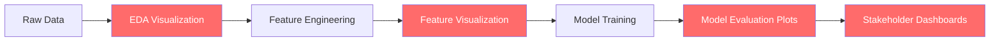
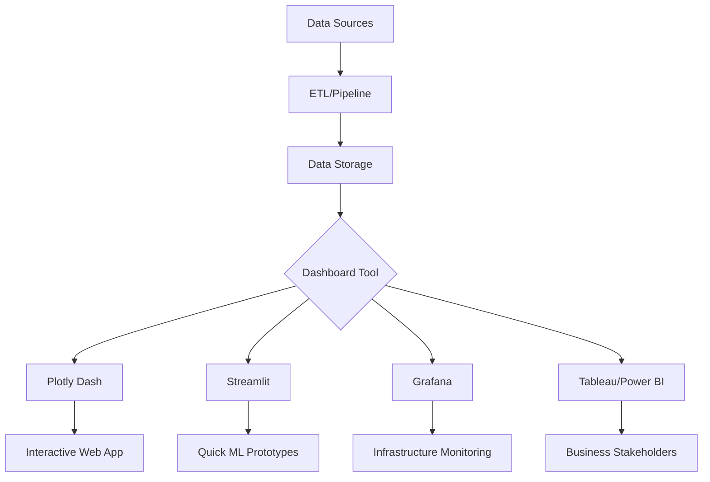

# Phase 7 — Data Visualization

## Complete Learning & Interview Mastery Guide

---

## Table of Contents

1. [Why Visualization Matters for AI/ML](#why-visualization-matters-for-aiml)
2. [Matplotlib — The Foundation](#matplotlib--the-foundation)
3. [Seaborn — Statistical Visualization](#seaborn--statistical-visualization)
4. [Plotly — Interactive Visualization](#plotly--interactive-visualization)
5. [EDA Visualization Patterns for ML](#eda-visualization-patterns-for-ml)
6. [Model Evaluation Visualization](#model-evaluation-visualization)
7. [Dashboard Concepts](#dashboard-concepts)
8. [Visualization Best Practices](#visualization-best-practices)
9. [Interview Mastery](#interview-mastery)

---

## Why Visualization Matters for AI/ML

### Beginner Explanation

Data visualization is the art of turning numbers and data into pictures — charts, graphs, and plots that reveal patterns, trends, and anomalies you'd never see in raw tables. In ML, visualization is not optional — it's critical at every stage: understanding your data (EDA), checking data quality, evaluating model performance, and communicating results to stakeholders.

Think of it this way: you can stare at 10,000 numbers in a spreadsheet for hours, or you can plot them and instantly see if there's a trend, outliers, or clusters.

### Technical Explanation

Visualization serves four distinct purposes in ML workflows:

1. **Exploratory Data Analysis (EDA)** — Understand distributions, correlations, outliers, and patterns before modeling
2. **Data Quality Auditing** — Detect missing values, imbalanced classes, data drift, and anomalies
3. **Model Diagnostics** — Evaluate performance via ROC curves, confusion matrices, learning curves, residual plots
4. **Communication** — Present findings to non-technical stakeholders clearly and convincingly

### Where Visualization Fits in the ML Pipeline



### Python Visualization Ecosystem

| Library | Best For | Interactivity | Learning Curve |
|---------|----------|---------------|----------------|
| **Matplotlib** | Full control, publication plots, custom layouts | Static | Medium |
| **Seaborn** | Statistical plots, beautiful defaults, EDA | Static | Low |
| **Plotly** | Interactive dashboards, web-ready plots | Full | Low-Medium |
| **Plotly Express** | Quick interactive plots (Plotly high-level) | Full | Very Low |
| **Bokeh** | Large data, streaming, web apps | Full | Medium |
| **Altair** | Declarative grammar-of-graphics, concise | Limited | Low |
| **Pandas .plot()** | Quick inline exploration | Static | Very Low |

### Real-World Analogy

Visualization is like an X-ray for your data. A doctor doesn't operate blindly — they look at scans to understand what's happening inside. Similarly, an ML engineer doesn't train models blindly — they visualize data to understand its structure, check model performance, and diagnose issues. Without visualization, you're flying blind.

---

## Matplotlib — The Foundation

### What is Matplotlib?

Matplotlib is Python's foundational plotting library. Every other visualization library (Seaborn, Pandas plots) is built on top of it. It gives you **complete control** over every element of a plot — at the cost of more verbose code.

### Architecture: Figure and Axes

```python
import matplotlib.pyplot as plt
import numpy as np

# Understanding the hierarchy:
# Figure → contains one or more Axes (subplots)
# Axes   → a single plot with its own x-axis, y-axis, title
# Axis   → the x or y number line with ticks and labels
```

```
+--------- Figure (canvas) -----------+
|  +------ Axes (subplot 1) ------+   |
|  |  Title                        |   |
|  |  Y-label  |  Plot Area  |    |   |
|  |           |              |    |   |
|  |  ------  X-label -------     |   |
|  +-------------------------------+   |
|  +------ Axes (subplot 2) ------+   |
|  |  ...                          |   |
|  +-------------------------------+   |
+--------------------------------------+
```

### Basic Plots

```python
import matplotlib.pyplot as plt
import numpy as np

# --- Line Plot ---
x = np.linspace(0, 10, 100)
y = np.sin(x)

plt.figure(figsize=(10, 6))
plt.plot(x, y, color='blue', linewidth=2, linestyle='-', label='sin(x)')
plt.plot(x, np.cos(x), color='red', linewidth=2, linestyle='--', label='cos(x)')
plt.title('Trigonometric Functions', fontsize=16, fontweight='bold')
plt.xlabel('x', fontsize=12)
plt.ylabel('y', fontsize=12)
plt.legend(fontsize=11)
plt.grid(True, alpha=0.3)
plt.tight_layout()
plt.savefig('trig_functions.png', dpi=150, bbox_inches='tight')
plt.show()
```

```python
# --- Scatter Plot ---
np.random.seed(42)
x = np.random.randn(200)
y = 2 * x + np.random.randn(200) * 0.5

plt.figure(figsize=(8, 6))
plt.scatter(x, y, c='steelblue', alpha=0.6, edgecolors='navy', s=50)
plt.title('Feature Correlation')
plt.xlabel('Feature X')
plt.ylabel('Feature Y')
plt.grid(True, alpha=0.3)
plt.tight_layout()
plt.show()
```

```python
# --- Bar Plot ---
categories = ['Linear Reg', 'Decision Tree', 'Random Forest', 'XGBoost', 'Neural Net']
accuracies = [0.72, 0.78, 0.85, 0.88, 0.86]
colors = ['#ff6b6b', '#feca57', '#48dbfb', '#ff9ff3', '#54a0ff']

plt.figure(figsize=(10, 6))
bars = plt.bar(categories, accuracies, color=colors, edgecolor='black', linewidth=0.8)
plt.ylim(0.5, 1.0)
plt.ylabel('Accuracy', fontsize=12)
plt.title('Model Comparison', fontsize=14)

# Add value labels on bars
for bar, acc in zip(bars, accuracies):
    plt.text(bar.get_x() + bar.get_width()/2, bar.get_height() + 0.01,
             f'{acc:.2f}', ha='center', fontsize=11)

plt.tight_layout()
plt.show()
```

```python
# --- Histogram ---
data = np.random.exponential(scale=2, size=1000)

plt.figure(figsize=(10, 6))
plt.hist(data, bins=50, color='steelblue', edgecolor='black',
         alpha=0.7, density=True, label='Data distribution')

# Overlay a KDE curve
from scipy.stats import expon
x_range = np.linspace(0, 15, 100)
plt.plot(x_range, expon.pdf(x_range, scale=2), 'r-', linewidth=2,
         label='Theoretical PDF')

plt.title('Feature Distribution (Exponential)', fontsize=14)
plt.xlabel('Value')
plt.ylabel('Density')
plt.legend()
plt.tight_layout()
plt.show()
```

### Subplots — Multiple Plots in One Figure

```python
import matplotlib.pyplot as plt
import numpy as np

fig, axes = plt.subplots(2, 2, figsize=(12, 10))

# Top-left: Line plot
x = np.linspace(0, 10, 100)
axes[0, 0].plot(x, np.sin(x), 'b-', linewidth=2)
axes[0, 0].set_title('Training Loss Over Epochs')
axes[0, 0].set_xlabel('Epoch')
axes[0, 0].set_ylabel('Loss')
axes[0, 0].grid(True, alpha=0.3)

# Top-right: Scatter plot
np.random.seed(42)
x_data = np.random.randn(100)
y_data = x_data * 2 + np.random.randn(100) * 0.5
axes[0, 1].scatter(x_data, y_data, alpha=0.6, c='coral')
axes[0, 1].set_title('Feature Correlation')
axes[0, 1].set_xlabel('Feature 1')
axes[0, 1].set_ylabel('Feature 2')

# Bottom-left: Histogram
data = np.random.normal(0, 1, 1000)
axes[1, 0].hist(data, bins=40, color='lightgreen', edgecolor='black', alpha=0.7)
axes[1, 0].set_title('Feature Distribution')
axes[1, 0].axvline(x=0, color='red', linestyle='--', label='Mean')
axes[1, 0].legend()

# Bottom-right: Box plot
data_groups = [np.random.normal(0, 1, 100),
               np.random.normal(1, 1.5, 100),
               np.random.normal(-1, 0.5, 100)]
bp = axes[1, 1].boxplot(data_groups, labels=['Group A', 'Group B', 'Group C'],
                         patch_artist=True)
colors = ['lightblue', 'lightcoral', 'lightgreen']
for patch, color in zip(bp['boxes'], colors):
    patch.set_facecolor(color)
axes[1, 1].set_title('Feature Comparison by Group')

plt.suptitle('EDA Dashboard', fontsize=16, fontweight='bold', y=1.02)
plt.tight_layout()
plt.show()
```

### Heatmaps (Correlation Matrix)

```python
import matplotlib.pyplot as plt
import numpy as np
import pandas as pd

# Generate sample ML feature matrix
np.random.seed(42)
n = 500
df = pd.DataFrame({
    'age': np.random.normal(35, 10, n),
    'income': np.random.normal(50000, 15000, n),
    'credit_score': np.random.normal(700, 50, n),
    'loan_amount': np.random.normal(200000, 50000, n),
    'monthly_payment': np.random.normal(1500, 500, n),
    'debt_ratio': np.random.uniform(0.1, 0.8, n)
})
# Add correlated features
df['income'] = df['income'] + df['age'] * 500
df['loan_amount'] = df['loan_amount'] + df['income'] * 2

# Compute correlation matrix
corr_matrix = df.corr()

# Plot
fig, ax = plt.subplots(figsize=(10, 8))
im = ax.imshow(corr_matrix, cmap='RdBu_r', vmin=-1, vmax=1)

# Add color bar
cbar = plt.colorbar(im)
cbar.set_label('Correlation Coefficient', fontsize=12)

# Add labels
ax.set_xticks(range(len(corr_matrix.columns)))
ax.set_yticks(range(len(corr_matrix.columns)))
ax.set_xticklabels(corr_matrix.columns, rotation=45, ha='right')
ax.set_yticklabels(corr_matrix.columns)

# Add values in cells
for i in range(len(corr_matrix)):
    for j in range(len(corr_matrix)):
        color = 'white' if abs(corr_matrix.iloc[i, j]) > 0.5 else 'black'
        ax.text(j, i, f'{corr_matrix.iloc[i, j]:.2f}',
                ha='center', va='center', color=color, fontsize=10)

ax.set_title('Feature Correlation Matrix', fontsize=14, fontweight='bold')
plt.tight_layout()
plt.show()
```

### Matplotlib Customization Deep Dive

```python
import matplotlib.pyplot as plt
import matplotlib as mpl

# --- Custom Style Sheet ---
# Use built-in styles
plt.style.use('seaborn-v0_8-whitegrid')  # clean, modern look
# Other options: 'ggplot', 'dark_background', 'fivethirtyeight', 'bmh'

# --- Custom Color Palettes ---
# Professional color palettes for ML papers
colors_professional = ['#2E4057', '#048A81', '#54C6EB', '#8EE3EF', '#F7F7F7']
colors_diverging = ['#d73027', '#fc8d59', '#fee08b', '#d9ef8b', '#91cf60', '#1a9850']

# --- Custom RC Params (global defaults) ---
plt.rcParams.update({
    'figure.figsize': (10, 6),
    'font.size': 12,
    'axes.titlesize': 14,
    'axes.labelsize': 12,
    'lines.linewidth': 2,
    'axes.grid': True,
    'grid.alpha': 0.3,
    'figure.dpi': 100,
    'savefig.dpi': 150
})

# --- Annotations ---
fig, ax = plt.subplots(figsize=(10, 6))
x = np.linspace(0, 10, 100)
y = np.sin(x)
ax.plot(x, y)

# Annotate a specific point
ax.annotate('Local Maximum',
            xy=(np.pi/2, 1),          # point to annotate
            xytext=(3, 1.3),          # text position
            fontsize=12,
            arrowprops=dict(arrowstyle='->', color='red', lw=2),
            color='red')

ax.set_title('Annotated Plot')
plt.show()
```

---

## Seaborn — Statistical Visualization

### What is Seaborn?

Seaborn is built on Matplotlib and provides a high-level interface for creating **statistical graphics**. It integrates tightly with Pandas DataFrames, has beautiful default themes, and automatically handles many common visualization patterns that would require dozens of Matplotlib lines.

### Seaborn vs Matplotlib

| Feature | Matplotlib | Seaborn |
|---------|-----------|---------|
| Code verbosity | High (many lines) | Low (one function) |
| Statistical plots | Manual | Built-in |
| DataFrame integration | Partial | Native |
| Default aesthetics | Basic | Beautiful |
| Customization | Unlimited | Limited (falls back to mpl) |
| Complex multi-plots | Manual subplots | FacetGrid, PairGrid |

### Setup and Themes

```python
import seaborn as sns
import matplotlib.pyplot as plt
import pandas as pd
import numpy as np

# Set theme (applies globally)
sns.set_theme(style='whitegrid', palette='deep', font_scale=1.1)
# style options: 'darkgrid', 'whitegrid', 'dark', 'white', 'ticks'
# palette options: 'deep', 'muted', 'bright', 'pastel', 'dark', 'colorblind'
```

### Distribution Plots — Understanding Feature Distributions

```python
# Generate sample ML dataset
np.random.seed(42)
n = 1000
df = pd.DataFrame({
    'age': np.random.normal(35, 10, n),
    'income': np.random.lognormal(10.8, 0.5, n),
    'credit_score': np.random.normal(700, 50, n),
    'churn': np.random.choice([0, 1], n, p=[0.8, 0.2])
})

# --- Histogram with KDE ---
fig, axes = plt.subplots(1, 3, figsize=(15, 5))

# Single distribution
sns.histplot(data=df, x='age', kde=True, color='steelblue', ax=axes[0])
axes[0].set_title('Age Distribution')

# Distribution by class (critical for ML — shows feature separability)
sns.histplot(data=df, x='income', hue='churn', kde=True,
             palette=['green', 'red'], alpha=0.5, ax=axes[1])
axes[1].set_title('Income by Churn Status')

# KDE only (smooth density estimate)
sns.kdeplot(data=df, x='credit_score', hue='churn',
            fill=True, alpha=0.4, ax=axes[2])
axes[2].set_title('Credit Score Density by Class')

plt.tight_layout()
plt.show()
```

```python
# --- Box Plot & Violin Plot ---
fig, axes = plt.subplots(1, 2, figsize=(14, 6))

# Box plot: see median, quartiles, outliers
sns.boxplot(data=df, x='churn', y='income', palette='Set2', ax=axes[0])
axes[0].set_title('Income Distribution by Churn')
axes[0].set_xticklabels(['Retained', 'Churned'])

# Violin plot: box plot + density shape
sns.violinplot(data=df, x='churn', y='credit_score',
               palette='muted', inner='box', ax=axes[1])
axes[1].set_title('Credit Score Distribution by Churn')
axes[1].set_xticklabels(['Retained', 'Churned'])

plt.tight_layout()
plt.show()
```

### Relationship Plots — Feature Correlations

```python
# --- Scatter plot with regression line ---
fig, axes = plt.subplots(1, 2, figsize=(14, 6))

# Basic regression plot
sns.regplot(data=df, x='age', y='income', scatter_kws={'alpha': 0.3},
            line_kws={'color': 'red'}, ax=axes[0])
axes[0].set_title('Age vs Income (with regression line)')

# Scatter colored by target variable
sns.scatterplot(data=df, x='age', y='income', hue='churn',
                palette={0: 'green', 1: 'red'}, alpha=0.5, ax=axes[1])
axes[1].set_title('Age vs Income colored by Churn')
axes[1].legend(title='Churned', labels=['No', 'Yes'])

plt.tight_layout()
plt.show()
```

```python
# --- Pair Plot (see ALL feature relationships at once) ---
# Most powerful EDA tool for ML: reveals correlations, clusters, separability

# Select numeric features + target
features_df = df[['age', 'income', 'credit_score', 'churn']].copy()

pair_grid = sns.pairplot(
    features_df,
    hue='churn',
    palette={0: '#2ecc71', 1: '#e74c3c'},
    diag_kind='kde',
    corner=True,           # only lower triangle (avoid redundancy)
    plot_kws={'alpha': 0.4, 's': 20}
)
pair_grid.fig.suptitle('Feature Pair Plot — Churn Analysis', y=1.02, fontsize=16)
plt.show()
```

### Heatmaps — Correlation Analysis

```python
# --- Correlation Heatmap (Seaborn — much simpler than Matplotlib version) ---
plt.figure(figsize=(10, 8))

corr = df[['age', 'income', 'credit_score']].corr()

sns.heatmap(
    corr,
    annot=True,            # show values
    fmt='.2f',             # 2 decimal places
    cmap='RdBu_r',         # diverging colormap (red=negative, blue=positive)
    vmin=-1, vmax=1,       # fixed range
    center=0,              # center at 0
    square=True,           # square cells
    linewidths=1,          # cell borders
    cbar_kws={'shrink': 0.8}
)
plt.title('Feature Correlation Matrix', fontsize=14, pad=20)
plt.tight_layout()
plt.show()
```

```python
# --- Clustermap (hierarchical clustering of correlations) ---
# Shows which features group together — useful for feature selection
sns.clustermap(
    corr,
    annot=True, fmt='.2f',
    cmap='coolwarm',
    vmin=-1, vmax=1,
    figsize=(8, 8),
    linewidths=0.5,
    method='ward'     # clustering method
)
plt.title('Clustered Correlation Matrix')
plt.show()
```

### Categorical Plots — Class Analysis

```python
# --- Count Plot (class distribution) ---
fig, axes = plt.subplots(1, 2, figsize=(12, 5))

# Simple class distribution
sns.countplot(data=df, x='churn', palette=['#2ecc71', '#e74c3c'], ax=axes[0])
axes[0].set_title('Class Distribution')
axes[0].set_xticklabels(['Retained (0)', 'Churned (1)'])

# Add percentage labels
total = len(df)
for p in axes[0].patches:
    pct = f'{100 * p.get_height() / total:.1f}%'
    axes[0].annotate(pct, (p.get_x() + p.get_width()/2., p.get_height()),
                     ha='center', va='bottom', fontsize=12)

# Grouped count plot (multi-categorical)
df['age_group'] = pd.cut(df['age'], bins=[0, 25, 35, 45, 100],
                         labels=['<25', '25-35', '35-45', '45+'])
sns.countplot(data=df, x='age_group', hue='churn',
              palette=['#2ecc71', '#e74c3c'], ax=axes[1])
axes[1].set_title('Churn by Age Group')
axes[1].legend(title='Churned', labels=['No', 'Yes'])

plt.tight_layout()
plt.show()
```

### FacetGrid — Multi-Panel Plots

```python
# FacetGrid: create grids of plots split by a categorical variable
# Each panel shows the same plot for a different subgroup

g = sns.FacetGrid(df, col='age_group', hue='churn',
                  col_wrap=2, height=4, palette=['green', 'red'])
g.map(sns.histplot, 'income', kde=True, alpha=0.5)
g.add_legend(title='Churned')
g.fig.suptitle('Income Distribution by Age Group and Churn', y=1.02)
plt.show()
```

---

## Plotly — Interactive Visualization

### What is Plotly?

Plotly creates **interactive** visualizations that work in Jupyter notebooks, web browsers, and dashboards. Users can zoom, pan, hover for details, and toggle data series — critical when exploring ML results with stakeholders.

### Plotly Express — Quick Interactive Plots

```python
import plotly.express as px
import plotly.graph_objects as go
from plotly.subplots import make_subplots
import pandas as pd
import numpy as np

# Generate sample data
np.random.seed(42)
n = 500
df = pd.DataFrame({
    'feature_1': np.random.randn(n),
    'feature_2': np.random.randn(n) * 2 + 1,
    'cluster': np.random.choice(['A', 'B', 'C'], n),
    'value': np.random.exponential(5, n),
    'date': pd.date_range('2023-01-01', periods=n, freq='D')
})
```

```python
# --- Interactive Scatter Plot ---
fig = px.scatter(
    df, x='feature_1', y='feature_2',
    color='cluster',                    # color by category
    size='value',                       # size by continuous value
    hover_data=['value'],               # show on hover
    title='Cluster Visualization',
    color_discrete_sequence=px.colors.qualitative.Set2
)
fig.update_layout(width=800, height=600)
fig.show()
```

```python
# --- Interactive Histogram ---
fig = px.histogram(
    df, x='value',
    color='cluster',
    marginal='box',          # add box plot on top
    nbins=50,
    title='Value Distribution by Cluster',
    opacity=0.7,
    barmode='overlay'
)
fig.show()
```

```python
# --- Interactive Line Plot (Time Series) ---
daily_stats = df.groupby('date')['value'].agg(['mean', 'std']).reset_index()

fig = px.line(
    daily_stats, x='date', y='mean',
    title='Daily Value Trend',
    labels={'mean': 'Average Value', 'date': 'Date'}
)
# Add confidence band
fig.add_scatter(
    x=daily_stats['date'], y=daily_stats['mean'] + daily_stats['std'],
    mode='lines', line=dict(width=0), showlegend=False
)
fig.add_scatter(
    x=daily_stats['date'], y=daily_stats['mean'] - daily_stats['std'],
    mode='lines', line=dict(width=0), fill='tonexty',
    fillcolor='rgba(68, 68, 255, 0.1)', showlegend=False
)
fig.show()
```

```python
# --- 3D Scatter (useful for dimensionality reduction visualization) ---
fig = px.scatter_3d(
    df, x='feature_1', y='feature_2', z='value',
    color='cluster',
    title='3D Feature Space',
    opacity=0.7
)
fig.update_layout(width=900, height=700)
fig.show()
```

### Plotly Graph Objects — Full Control

```python
# --- Custom multi-axis plot ---
fig = make_subplots(
    rows=2, cols=2,
    subplot_titles=('Training Loss', 'Accuracy', 'Learning Rate', 'Confusion Matrix'),
    specs=[[{}, {}], [{}, {'type': 'heatmap'}]]
)

# Simulated training metrics
epochs = list(range(1, 51))
train_loss = [1.0 * np.exp(-0.05 * e) + np.random.normal(0, 0.02) for e in epochs]
val_loss = [1.1 * np.exp(-0.04 * e) + np.random.normal(0, 0.03) for e in epochs]
train_acc = [1 - l + np.random.normal(0, 0.01) for l in train_loss]
val_acc = [1 - l + np.random.normal(0, 0.015) for l in val_loss]

# Loss curves
fig.add_trace(go.Scatter(x=epochs, y=train_loss, name='Train Loss',
                         line=dict(color='blue')), row=1, col=1)
fig.add_trace(go.Scatter(x=epochs, y=val_loss, name='Val Loss',
                         line=dict(color='red', dash='dash')), row=1, col=1)

# Accuracy curves
fig.add_trace(go.Scatter(x=epochs, y=train_acc, name='Train Acc',
                         line=dict(color='blue')), row=1, col=2)
fig.add_trace(go.Scatter(x=epochs, y=val_acc, name='Val Acc',
                         line=dict(color='red', dash='dash')), row=1, col=2)

# Learning rate schedule
lr = [0.01 * (0.95 ** e) for e in epochs]
fig.add_trace(go.Scatter(x=epochs, y=lr, name='LR',
                         line=dict(color='green')), row=2, col=1)

# Confusion matrix
cm = np.array([[850, 50], [30, 70]])
fig.add_trace(go.Heatmap(z=cm, x=['Pred 0', 'Pred 1'], y=['True 0', 'True 1'],
                          colorscale='Blues', showscale=False,
                          text=cm, texttemplate='%{text}'), row=2, col=2)

fig.update_layout(height=700, width=1000, title_text='Model Training Dashboard')
fig.show()
```

### Plotly for ML Model Comparison

```python
# --- Model comparison radar chart ---
categories = ['Accuracy', 'Precision', 'Recall', 'F1-Score', 'AUC-ROC', 'Speed']

models = {
    'Logistic Regression': [0.82, 0.79, 0.75, 0.77, 0.85, 0.99],
    'Random Forest':       [0.88, 0.85, 0.82, 0.83, 0.91, 0.70],
    'XGBoost':             [0.91, 0.89, 0.86, 0.87, 0.94, 0.65],
    'Neural Network':      [0.89, 0.87, 0.88, 0.87, 0.93, 0.40]
}

fig = go.Figure()
for model_name, values in models.items():
    fig.add_trace(go.Scatterpolar(
        r=values + [values[0]],    # close the polygon
        theta=categories + [categories[0]],
        name=model_name,
        fill='toself',
        opacity=0.6
    ))

fig.update_layout(
    polar=dict(radialaxis=dict(visible=True, range=[0, 1])),
    title='Model Performance Comparison',
    width=700, height=600
)
fig.show()
```

---

## EDA Visualization Patterns for ML

### Pattern 1: Target Variable Analysis

```python
import seaborn as sns
import matplotlib.pyplot as plt
import pandas as pd
import numpy as np

# Always start EDA by understanding your target variable

def plot_target_analysis(df, target_col, figsize=(14, 5)):
    """Visualize target variable distribution — first step in any ML EDA."""
    fig, axes = plt.subplots(1, 3, figsize=figsize)

    if df[target_col].nunique() <= 10:  # Classification
        # Distribution
        counts = df[target_col].value_counts()
        sns.barplot(x=counts.index, y=counts.values, ax=axes[0], palette='viridis')
        axes[0].set_title(f'{target_col} Distribution')
        axes[0].set_ylabel('Count')

        # Percentage
        pcts = df[target_col].value_counts(normalize=True) * 100
        axes[1].pie(pcts.values, labels=pcts.index, autopct='%1.1f%%',
                   colors=sns.color_palette('viridis', len(pcts)))
        axes[1].set_title(f'{target_col} Percentage')

        # Imbalance ratio
        majority = counts.max()
        minority = counts.min()
        ratio = majority / minority
        axes[2].text(0.5, 0.5, f'Imbalance Ratio\n{ratio:.1f}:1',
                    ha='center', va='center', fontsize=20,
                    color='red' if ratio > 5 else 'green')
        axes[2].set_title('Class Balance Check')
        axes[2].axis('off')

    else:  # Regression
        sns.histplot(df[target_col], kde=True, ax=axes[0], color='steelblue')
        axes[0].set_title(f'{target_col} Distribution')

        # Log-transformed
        sns.histplot(np.log1p(df[target_col]), kde=True, ax=axes[1], color='coral')
        axes[1].set_title(f'log({target_col}) Distribution')

        # QQ plot (normality check)
        from scipy import stats
        stats.probplot(df[target_col], dist="norm", plot=axes[2])
        axes[2].set_title('Q-Q Plot (Normality Check)')

    plt.tight_layout()
    plt.show()
```

### Pattern 2: Missing Value Visualization

```python
def plot_missing_values(df, figsize=(12, 6)):
    """Visualize missing data patterns — critical before imputation decisions."""
    # Calculate missing percentages
    missing = df.isnull().sum()
    missing_pct = (missing / len(df)) * 100
    missing_df = pd.DataFrame({'column': missing.index,
                               'missing_pct': missing_pct.values})
    missing_df = missing_df[missing_df['missing_pct'] > 0].sort_values(
        'missing_pct', ascending=False)

    if len(missing_df) == 0:
        print("No missing values!")
        return

    fig, axes = plt.subplots(1, 2, figsize=figsize)

    # Bar chart of missing percentages
    sns.barplot(data=missing_df, x='missing_pct', y='column',
                palette='Reds_r', ax=axes[0])
    axes[0].set_title('Missing Values by Feature')
    axes[0].set_xlabel('% Missing')
    axes[0].axvline(x=50, color='red', linestyle='--', alpha=0.5)

    # Missing value heatmap (shows patterns — are misses correlated?)
    # Sample for performance if dataset is large
    sample = df.sample(min(200, len(df)), random_state=42)
    sns.heatmap(sample.isnull(), cbar=True, yticklabels=False,
                cmap='viridis', ax=axes[1])
    axes[1].set_title('Missing Value Pattern (Yellow = Missing)')

    plt.tight_layout()
    plt.show()
```

### Pattern 3: Feature Distribution by Target

```python
def plot_features_by_target(df, features, target, figsize=(15, 4)):
    """Compare feature distributions across target classes.
    Shows which features have discriminative power."""

    n_features = len(features)
    fig, axes = plt.subplots(1, n_features, figsize=(figsize[0], figsize[1]))

    if n_features == 1:
        axes = [axes]

    for idx, feature in enumerate(features):
        if df[feature].dtype in ['float64', 'int64', 'float32', 'int32']:
            # Continuous: overlapping density plots
            for target_val in sorted(df[target].unique()):
                subset = df[df[target] == target_val][feature]
                sns.kdeplot(subset, ax=axes[idx], label=f'{target}={target_val}',
                           fill=True, alpha=0.3)
            axes[idx].set_title(f'{feature}')
            axes[idx].legend()
        else:
            # Categorical: stacked bar
            ct = pd.crosstab(df[feature], df[target], normalize='index')
            ct.plot(kind='bar', stacked=True, ax=axes[idx], colormap='RdYlGn')
            axes[idx].set_title(f'{feature}')
            axes[idx].legend(title=target)

    plt.suptitle('Feature Distributions by Target Class', fontsize=14, y=1.02)
    plt.tight_layout()
    plt.show()
```

### Pattern 4: Outlier Detection Visualization

```python
def plot_outlier_analysis(df, features, figsize=(14, 5)):
    """Detect and visualize outliers using IQR and Z-score methods."""

    fig, axes = plt.subplots(1, 3, figsize=figsize)

    # Box plots showing outliers
    df_numeric = df[features].select_dtypes(include=[np.number])
    # Standardize for comparable box plots
    df_std = (df_numeric - df_numeric.mean()) / df_numeric.std()
    sns.boxplot(data=df_std, orient='h', ax=axes[0], palette='Set3')
    axes[0].set_title('Standardized Box Plots')
    axes[0].axvline(x=3, color='red', linestyle='--', alpha=0.5, label='3σ')
    axes[0].axvline(x=-3, color='red', linestyle='--', alpha=0.5)
    axes[0].legend()

    # Z-score distribution (how many points are outliers?)
    z_scores = np.abs(df_std).values.flatten()
    z_scores = z_scores[~np.isnan(z_scores)]
    sns.histplot(z_scores, bins=50, ax=axes[1], color='steelblue')
    axes[1].axvline(x=3, color='red', linestyle='--', label='Outlier threshold (|z|>3)')
    outlier_pct = (z_scores > 3).sum() / len(z_scores) * 100
    axes[1].set_title(f'Z-Score Distribution ({outlier_pct:.1f}% outliers)')
    axes[1].legend()

    # Scatter plot of two features highlighting outliers
    if len(features) >= 2:
        f1, f2 = features[0], features[1]
        z1 = np.abs((df[f1] - df[f1].mean()) / df[f1].std())
        z2 = np.abs((df[f2] - df[f2].mean()) / df[f2].std())
        is_outlier = (z1 > 3) | (z2 > 3)

        axes[2].scatter(df[~is_outlier][f1], df[~is_outlier][f2],
                       alpha=0.4, label='Normal', c='steelblue', s=20)
        axes[2].scatter(df[is_outlier][f1], df[is_outlier][f2],
                       alpha=0.8, label='Outlier', c='red', s=50, marker='x')
        axes[2].set_xlabel(f1)
        axes[2].set_ylabel(f2)
        axes[2].set_title('Outlier Scatter')
        axes[2].legend()

    plt.tight_layout()
    plt.show()
```

### Pattern 5: Time-Series Visualization for ML

```python
def plot_time_series_eda(df, date_col, value_col, figsize=(14, 10)):
    """Comprehensive time-series EDA for ML."""
    fig, axes = plt.subplots(3, 2, figsize=figsize)

    df = df.sort_values(date_col).copy()
    df[date_col] = pd.to_datetime(df[date_col])

    # 1. Raw time series
    axes[0, 0].plot(df[date_col], df[value_col], linewidth=0.8, alpha=0.8)
    axes[0, 0].set_title('Raw Time Series')
    axes[0, 0].set_xlabel('Date')

    # 2. Rolling mean + std (trend + volatility)
    rolling_mean = df[value_col].rolling(window=30).mean()
    rolling_std = df[value_col].rolling(window=30).std()
    axes[0, 1].plot(df[date_col], df[value_col], alpha=0.3, label='Raw')
    axes[0, 1].plot(df[date_col], rolling_mean, color='red', label='30-day MA')
    axes[0, 1].fill_between(df[date_col],
                            rolling_mean - 2*rolling_std,
                            rolling_mean + 2*rolling_std,
                            alpha=0.2, color='red', label='±2σ Band')
    axes[0, 1].legend()
    axes[0, 1].set_title('Trend + Volatility')

    # 3. Distribution over time (monthly box plots)
    df['month'] = df[date_col].dt.to_period('M').astype(str)
    monthly_data = df.groupby('month')[value_col].apply(list).reset_index()
    # Show last 12 months
    recent_months = df['month'].unique()[-12:]
    df_recent = df[df['month'].isin(recent_months)]
    sns.boxplot(data=df_recent, x='month', y=value_col, ax=axes[1, 0], palette='viridis')
    axes[1, 0].set_title('Monthly Distribution')
    axes[1, 0].tick_params(axis='x', rotation=45)

    # 4. Day-of-week pattern (seasonality)
    df['day_of_week'] = df[date_col].dt.day_name()
    day_order = ['Monday', 'Tuesday', 'Wednesday', 'Thursday', 'Friday', 'Saturday', 'Sunday']
    sns.boxplot(data=df, x='day_of_week', y=value_col, order=day_order,
                ax=axes[1, 1], palette='Set3')
    axes[1, 1].set_title('Day-of-Week Pattern')
    axes[1, 1].tick_params(axis='x', rotation=45)

    # 5. Lag plot (autocorrelation check)
    axes[2, 0].scatter(df[value_col].iloc[:-1], df[value_col].iloc[1:],
                      alpha=0.3, s=10)
    axes[2, 0].set_xlabel('y(t)')
    axes[2, 0].set_ylabel('y(t+1)')
    axes[2, 0].set_title('Lag-1 Autocorrelation Plot')

    # 6. Autocorrelation function
    from pandas.plotting import autocorrelation_plot
    autocorrelation_plot(df[value_col].dropna(), ax=axes[2, 1])
    axes[2, 1].set_title('Autocorrelation Function')

    plt.tight_layout()
    plt.show()
```

---

## Model Evaluation Visualization

### Confusion Matrix

```python
import numpy as np
import matplotlib.pyplot as plt
import seaborn as sns
from sklearn.metrics import confusion_matrix

def plot_confusion_matrix(y_true, y_pred, class_names=None, figsize=(8, 6)):
    """Professional confusion matrix visualization."""
    cm = confusion_matrix(y_true, y_pred)
    cm_pct = cm.astype('float') / cm.sum(axis=1)[:, np.newaxis] * 100

    if class_names is None:
        class_names = [f'Class {i}' for i in range(len(cm))]

    fig, axes = plt.subplots(1, 2, figsize=(figsize[0]*2, figsize[1]))

    # Absolute counts
    sns.heatmap(cm, annot=True, fmt='d', cmap='Blues',
                xticklabels=class_names, yticklabels=class_names,
                ax=axes[0], cbar=False)
    axes[0].set_title('Confusion Matrix (Counts)')
    axes[0].set_ylabel('True Label')
    axes[0].set_xlabel('Predicted Label')

    # Percentages (normalized by true label)
    sns.heatmap(cm_pct, annot=True, fmt='.1f', cmap='Oranges',
                xticklabels=class_names, yticklabels=class_names,
                ax=axes[1], cbar=False)
    axes[1].set_title('Confusion Matrix (% of True Class)')
    axes[1].set_ylabel('True Label')
    axes[1].set_xlabel('Predicted Label')

    plt.tight_layout()
    plt.show()

    # Print key metrics
    tn, fp, fn, tp = cm.ravel()
    print(f"True Positives:  {tp}  |  False Positives: {fp}")
    print(f"False Negatives: {fn}  |  True Negatives:  {tn}")
    print(f"Precision: {tp/(tp+fp):.3f}  |  Recall: {tp/(tp+fn):.3f}")
```

### ROC Curve and AUC

```python
from sklearn.metrics import roc_curve, auc, precision_recall_curve, average_precision_score

def plot_roc_and_pr_curves(y_true, y_proba, model_name='Model', figsize=(14, 6)):
    """Plot ROC and Precision-Recall curves side by side."""
    fig, axes = plt.subplots(1, 2, figsize=figsize)

    # --- ROC Curve ---
    fpr, tpr, thresholds_roc = roc_curve(y_true, y_proba)
    roc_auc = auc(fpr, tpr)

    axes[0].plot(fpr, tpr, color='darkorange', lw=2,
                label=f'{model_name} (AUC = {roc_auc:.3f})')
    axes[0].plot([0, 1], [0, 1], 'k--', lw=1, label='Random (AUC = 0.500)')
    axes[0].fill_between(fpr, tpr, alpha=0.1, color='darkorange')
    axes[0].set_xlim([0, 1])
    axes[0].set_ylim([0, 1.05])
    axes[0].set_xlabel('False Positive Rate', fontsize=12)
    axes[0].set_ylabel('True Positive Rate', fontsize=12)
    axes[0].set_title('ROC Curve', fontsize=14)
    axes[0].legend(loc='lower right', fontsize=11)
    axes[0].grid(True, alpha=0.3)

    # --- Precision-Recall Curve ---
    precision, recall, thresholds_pr = precision_recall_curve(y_true, y_proba)
    avg_prec = average_precision_score(y_true, y_proba)

    axes[1].plot(recall, precision, color='purple', lw=2,
                label=f'{model_name} (AP = {avg_prec:.3f})')
    # Baseline = positive class ratio
    baseline = y_true.mean()
    axes[1].axhline(y=baseline, color='k', linestyle='--', lw=1,
                   label=f'Baseline ({baseline:.3f})')
    axes[1].fill_between(recall, precision, alpha=0.1, color='purple')
    axes[1].set_xlim([0, 1])
    axes[1].set_ylim([0, 1.05])
    axes[1].set_xlabel('Recall', fontsize=12)
    axes[1].set_ylabel('Precision', fontsize=12)
    axes[1].set_title('Precision-Recall Curve', fontsize=14)
    axes[1].legend(loc='upper right', fontsize=11)
    axes[1].grid(True, alpha=0.3)

    plt.tight_layout()
    plt.show()
```

### Multiple Model ROC Comparison

```python
def plot_multi_model_roc(models_results, figsize=(10, 8)):
    """Compare ROC curves of multiple models.

    models_results: dict of {model_name: (y_true, y_proba)}
    """
    plt.figure(figsize=figsize)
    colors = plt.cm.Set1(np.linspace(0, 1, len(models_results)))

    for (name, (y_true, y_proba)), color in zip(models_results.items(), colors):
        fpr, tpr, _ = roc_curve(y_true, y_proba)
        roc_auc = auc(fpr, tpr)
        plt.plot(fpr, tpr, color=color, lw=2,
                label=f'{name} (AUC = {roc_auc:.3f})')

    plt.plot([0, 1], [0, 1], 'k--', lw=1)
    plt.xlim([0, 1])
    plt.ylim([0, 1.05])
    plt.xlabel('False Positive Rate', fontsize=12)
    plt.ylabel('True Positive Rate', fontsize=12)
    plt.title('Model Comparison — ROC Curves', fontsize=14)
    plt.legend(loc='lower right', fontsize=11)
    plt.grid(True, alpha=0.3)
    plt.tight_layout()
    plt.show()
```

### Learning Curves

```python
from sklearn.model_selection import learning_curve

def plot_learning_curve(estimator, X, y, cv=5, figsize=(12, 5)):
    """Plot learning curve to diagnose overfitting/underfitting."""
    train_sizes, train_scores, val_scores = learning_curve(
        estimator, X, y, cv=cv,
        train_sizes=np.linspace(0.1, 1.0, 10),
        scoring='accuracy', n_jobs=-1
    )

    train_mean = train_scores.mean(axis=1)
    train_std = train_scores.std(axis=1)
    val_mean = val_scores.mean(axis=1)
    val_std = val_scores.std(axis=1)

    fig, axes = plt.subplots(1, 2, figsize=figsize)

    # Learning curve
    axes[0].fill_between(train_sizes, train_mean - train_std,
                         train_mean + train_std, alpha=0.1, color='blue')
    axes[0].fill_between(train_sizes, val_mean - val_std,
                         val_mean + val_std, alpha=0.1, color='red')
    axes[0].plot(train_sizes, train_mean, 'o-', color='blue', label='Training')
    axes[0].plot(train_sizes, val_mean, 'o-', color='red', label='Validation')
    axes[0].set_xlabel('Training Set Size')
    axes[0].set_ylabel('Accuracy')
    axes[0].set_title('Learning Curve')
    axes[0].legend(loc='lower right')
    axes[0].grid(True, alpha=0.3)

    # Gap between train and val (overfitting indicator)
    gap = train_mean - val_mean
    axes[1].plot(train_sizes, gap, 'g-o', linewidth=2)
    axes[1].axhline(y=0.05, color='orange', linestyle='--', label='Warning threshold')
    axes[1].fill_between(train_sizes, 0, gap, alpha=0.2, color='green')
    axes[1].set_xlabel('Training Set Size')
    axes[1].set_ylabel('Train - Val Gap')
    axes[1].set_title('Overfitting Indicator')
    axes[1].legend()
    axes[1].grid(True, alpha=0.3)

    plt.tight_layout()
    plt.show()

    # Interpretation
    if gap[-1] > 0.1:
        print("⚠️ High overfitting — model memorizes training data. Try: more data, regularization, simpler model.")
    elif val_mean[-1] < 0.7:
        print("⚠️ Underfitting — model too simple. Try: more features, complex model, fewer constraints.")
    else:
        print("✓ Good fit — train/val gap is reasonable.")
```

### Feature Importance Visualization

```python
def plot_feature_importance(feature_names, importances, top_n=20, figsize=(10, 8)):
    """Horizontal bar chart of feature importances — standard ML visualization."""
    # Sort by importance
    indices = np.argsort(importances)[-top_n:]
    top_features = [feature_names[i] for i in indices]
    top_importances = importances[indices]

    plt.figure(figsize=figsize)
    colors = plt.cm.viridis(np.linspace(0.3, 0.9, len(top_features)))
    plt.barh(range(len(top_features)), top_importances, color=colors, edgecolor='black', linewidth=0.5)
    plt.yticks(range(len(top_features)), top_features)
    plt.xlabel('Importance')
    plt.title(f'Top {top_n} Feature Importances', fontsize=14)
    plt.grid(True, axis='x', alpha=0.3)
    plt.tight_layout()
    plt.show()

# Usage with scikit-learn model:
# plot_feature_importance(X.columns, model.feature_importances_)
```

### Residual Plots (Regression)

```python
def plot_regression_diagnostics(y_true, y_pred, figsize=(14, 5)):
    """Comprehensive regression model diagnostics."""
    residuals = y_true - y_pred

    fig, axes = plt.subplots(1, 3, figsize=figsize)

    # 1. Actual vs Predicted
    axes[0].scatter(y_true, y_pred, alpha=0.4, s=20, c='steelblue')
    min_val = min(y_true.min(), y_pred.min())
    max_val = max(y_true.max(), y_pred.max())
    axes[0].plot([min_val, max_val], [min_val, max_val], 'r--', lw=2)
    axes[0].set_xlabel('Actual')
    axes[0].set_ylabel('Predicted')
    axes[0].set_title('Actual vs Predicted')
    axes[0].grid(True, alpha=0.3)

    # 2. Residuals vs Predicted (check heteroscedasticity)
    axes[1].scatter(y_pred, residuals, alpha=0.4, s=20, c='coral')
    axes[1].axhline(y=0, color='red', linestyle='--', lw=2)
    axes[1].set_xlabel('Predicted')
    axes[1].set_ylabel('Residual')
    axes[1].set_title('Residuals vs Predicted')
    axes[1].grid(True, alpha=0.3)

    # 3. Residual distribution (check normality)
    sns.histplot(residuals, kde=True, ax=axes[2], color='purple', alpha=0.6)
    axes[2].axvline(x=0, color='red', linestyle='--', lw=2)
    axes[2].set_title('Residual Distribution')
    axes[2].set_xlabel('Residual Value')

    plt.tight_layout()
    plt.show()

    # Print metrics
    from sklearn.metrics import mean_squared_error, r2_score, mean_absolute_error
    print(f"R² Score: {r2_score(y_true, y_pred):.4f}")
    print(f"RMSE: {np.sqrt(mean_squared_error(y_true, y_pred)):.4f}")
    print(f"MAE: {mean_absolute_error(y_true, y_pred):.4f}")
```

---

## Dashboard Concepts

### What is a Dashboard?

A dashboard is a single-screen collection of visualizations that provides an at-a-glance overview of key metrics and trends. In ML, dashboards are used for:
- **Model monitoring** — track live performance, data drift, prediction distributions
- **Experiment tracking** — compare model versions across metrics
- **Business reporting** — translate ML outputs into business value for stakeholders

### Dashboard Architecture



### Dashboard Tool Comparison

| Tool | Best For | Technical Level | Deployment |
|------|----------|-----------------|------------|
| **Streamlit** | ML prototypes, internal tools | Python only | Simple (free hosting) |
| **Plotly Dash** | Production dashboards, complex interactions | Python + web concepts | Flask-based |
| **Grafana** | Time-series monitoring, alerts | Config + PromQL | Docker/Cloud |
| **Tableau** | Business analytics, non-technical users | Drag-and-drop | Enterprise |
| **Power BI** | Microsoft ecosystem, business users | Low-code | Microsoft Cloud |
| **MLflow UI** | Experiment tracking | ML framework | Self-hosted |

### Streamlit — Quick ML Dashboard

```python
# Save as app.py and run with: streamlit run app.py

import streamlit as st
import pandas as pd
import numpy as np
import plotly.express as px

st.set_page_config(page_title="ML Model Dashboard", layout="wide")
st.title("🤖 ML Model Performance Dashboard")

# Sidebar controls
st.sidebar.header("Filters")
model_version = st.sidebar.selectbox("Model Version", ["v1.0", "v2.0", "v3.0"])
date_range = st.sidebar.date_input("Date Range", value=(pd.Timestamp("2024-01-01"),
                                                         pd.Timestamp("2024-06-01")))

# Metrics row
col1, col2, col3, col4 = st.columns(4)
col1.metric("Accuracy", "0.923", "+0.012")
col2.metric("Precision", "0.891", "+0.005")
col3.metric("Recall", "0.867", "-0.003")
col4.metric("F1 Score", "0.879", "+0.001")

# Charts
st.subheader("Model Performance Over Time")
dates = pd.date_range("2024-01-01", periods=180, freq='D')
performance = pd.DataFrame({
    'date': dates,
    'accuracy': 0.9 + np.cumsum(np.random.randn(180) * 0.001),
    'predictions_per_day': np.random.poisson(1000, 180)
})

fig = px.line(performance, x='date', y='accuracy',
              title='Daily Accuracy Trend')
fig.add_hline(y=0.85, line_dash='dash', line_color='red',
              annotation_text='Minimum threshold')
st.plotly_chart(fig, use_container_width=True)

# Two columns
left, right = st.columns(2)
with left:
    st.subheader("Prediction Distribution")
    predictions = np.random.beta(5, 2, 1000)
    fig2 = px.histogram(x=predictions, nbins=50,
                        title='Prediction Probability Distribution')
    st.plotly_chart(fig2, use_container_width=True)

with right:
    st.subheader("Feature Importance")
    features_df = pd.DataFrame({
        'feature': ['age', 'income', 'credit_score', 'tenure', 'activity'],
        'importance': [0.25, 0.20, 0.18, 0.22, 0.15]
    })
    fig3 = px.bar(features_df, x='importance', y='feature', orientation='h',
                  title='Top Feature Importances')
    st.plotly_chart(fig3, use_container_width=True)

# Data table
st.subheader("Recent Predictions")
st.dataframe(pd.DataFrame({
    'user_id': range(1, 11),
    'prediction': np.random.choice(['churn', 'retain'], 10),
    'confidence': np.random.uniform(0.6, 0.99, 10).round(3)
}))
```

### Plotly Dash — Production Dashboard

```python
# Save as app.py and run with: python app.py
import dash
from dash import dcc, html, callback, Output, Input
import plotly.express as px
import pandas as pd
import numpy as np

app = dash.Dash(__name__)

# Sample data
np.random.seed(42)
df = pd.DataFrame({
    'date': pd.date_range('2024-01-01', periods=100, freq='D'),
    'accuracy': np.cumsum(np.random.randn(100) * 0.002) + 0.9,
    'loss': np.exp(-np.linspace(0, 3, 100)) + np.random.randn(100) * 0.02,
    'predictions': np.random.poisson(500, 100)
})

app.layout = html.Div([
    html.H1("ML Model Monitoring Dashboard", style={'textAlign': 'center'}),

    # Controls
    html.Div([
        dcc.Dropdown(
            id='metric-selector',
            options=[
                {'label': 'Accuracy', 'value': 'accuracy'},
                {'label': 'Loss', 'value': 'loss'},
                {'label': 'Predictions', 'value': 'predictions'}
            ],
            value='accuracy',
            style={'width': '300px'}
        )
    ], style={'padding': '20px'}),

    # Chart
    dcc.Graph(id='metric-chart'),

    # Auto-refresh every 60 seconds (for live monitoring)
    dcc.Interval(id='interval-component', interval=60*1000, n_intervals=0)
])

@callback(
    Output('metric-chart', 'figure'),
    Input('metric-selector', 'value')
)
def update_chart(metric):
    fig = px.line(df, x='date', y=metric, title=f'{metric.title()} Over Time')
    fig.update_layout(height=500)
    return fig

if __name__ == '__main__':
    app.run_server(debug=True, port=8050)
```

### Dashboard Design Principles for ML

```
1. HIERARCHY: Most important metric (North Star) at the top, details below

2. LAYOUT (standard ML monitoring dashboard):
   ┌─────────────────────────────────────────────────┐
   │  KPI Cards: Accuracy | Precision | Recall | F1  │  ← Glanceable
   ├───────────────────────┬─────────────────────────┤
   │  Performance Over Time│  Prediction Distribution │  ← Trends
   ├───────────────────────┼─────────────────────────┤
   │  Feature Drift        │  Data Quality Alerts     │  ← Diagnostics
   ├───────────────────────┴─────────────────────────┤
   │  Recent Predictions Table / Logs                 │  ← Details
   └─────────────────────────────────────────────────┘

3. ALERTS: Red/yellow/green indicators for:
   - Model accuracy drops below threshold
   - Feature drift exceeds limits
   - Prediction volume anomaly
   - Data freshness (stale data)

4. AUDIENCE: Different dashboards for different users:
   - ML Engineer: technical metrics, experiment comparisons
   - Business Stakeholder: business impact, predictions
   - Operations: uptime, latency, throughput
```

---

## Visualization Best Practices

### Rule 1: Choose the Right Chart Type

```
GOAL → CHART TYPE

Compare categories        → Bar chart (horizontal for many categories)
Show distribution         → Histogram, KDE, box plot, violin plot
Show relationship         → Scatter plot, heatmap
Show trend over time      → Line chart
Show composition          → Stacked bar, pie chart (≤5 categories)
Show ranking              → Sorted bar chart
Show flow                 → Sankey diagram
Show geography            → Choropleth map
Show ML clusters          → Scatter + color
Compare models            → Grouped bar, radar chart
Show confusion            → Annotated heatmap
Show threshold decision   → ROC / PR curves
Diagnose model            → Learning curve, residuals
```

### Rule 2: Color Usage

```python
# Good color practices for ML visualizations:

# 1. Sequential: for continuous values (low to high)
#    Examples: feature importance, heatmaps
#    Palettes: 'viridis', 'Blues', 'YlOrRd'

# 2. Diverging: for values around a center (negative to positive)
#    Examples: correlation matrices, residuals
#    Palettes: 'RdBu_r', 'coolwarm', 'PiYG'

# 3. Categorical: for discrete groups
#    Examples: clusters, model comparison
#    Palettes: 'Set2', 'tab10', 'colorblind'

# 4. Binary ML convention:
#    Positive class / True Positive: GREEN
#    Negative class / False Positive: RED
#    Neutral: BLUE/GRAY

# 5. Colorblind-friendly palette (8% of men are colorblind):
import seaborn as sns
sns.set_palette('colorblind')
# Or use: '#0072B2', '#D55E00', '#009E73', '#CC79A7', '#F0E442'
```

### Rule 3: Avoid Common Visualization Mistakes

```
❌ MISTAKE                          ✅ FIX
─────────────────────────────────────────────────────────
Pie chart with 10+ slices      →   Horizontal bar chart
Y-axis not starting at 0       →   Start at 0 (or clearly label)
  (for bar charts)
3D charts (distort perception) →   2D with color/size encoding
Too many colors                →   Max 5-7 distinct colors
No axis labels                 →   Always label axes + units
Truncated axis to exaggerate   →   Show full range, annotate delta
Overplotting (scatter)         →   Reduce alpha, sample, hex bins
```

### Rule 4: Publication-Quality Plots

```python
def publication_style():
    """Apply publication-quality style settings."""
    plt.rcParams.update({
        'figure.figsize': (8, 5),
        'figure.dpi': 150,
        'font.size': 11,
        'font.family': 'sans-serif',
        'axes.titlesize': 13,
        'axes.labelsize': 11,
        'xtick.labelsize': 10,
        'ytick.labelsize': 10,
        'legend.fontsize': 10,
        'lines.linewidth': 1.5,
        'axes.linewidth': 0.8,
        'axes.grid': True,
        'grid.alpha': 0.3,
        'grid.linewidth': 0.5,
    })
    sns.set_palette('colorblind')

# Saving for papers/presentations:
# plt.savefig('figure.pdf', bbox_inches='tight', dpi=300)   # PDF for papers
# plt.savefig('figure.png', bbox_inches='tight', dpi=150)   # PNG for web
# plt.savefig('figure.svg', bbox_inches='tight')            # SVG for scaling
```

---

## Interview Mastery

### Beginner Questions

---

**Q1: What is data visualization and why is it important in ML?**

**Perfect Answer:**
> "Data visualization translates numbers into visual patterns that humans can quickly interpret. In ML, it's critical at three stages: (1) EDA — understanding distributions, correlations, and anomalies before modeling; (2) Model evaluation — comparing models via ROC curves, confusion matrices, learning curves; (3) Communication — presenting results to stakeholders who don't read code. Anscombe's Quartet proves why: four datasets with identical statistical summaries look completely different when plotted — visualization catches what statistics miss."

**Interviewer expectation:** Mention at least 2-3 specific ML visualization use cases. Bonus for mentioning Anscombe's Quartet.

---

**Q2: What's the difference between Matplotlib, Seaborn, and Plotly?**

**Perfect Answer:**
> "Matplotlib is the low-level foundation — complete control but verbose code. Seaborn builds on Matplotlib for statistical plots — beautiful defaults, one-line syntax, native DataFrame support. Plotly creates interactive web-based visualizations — zoom, hover, toggle. In practice: I use Seaborn for EDA in notebooks, Plotly for dashboards and presentations, and fall back to Matplotlib when I need pixel-perfect control over a publication figure. Seaborn is for quick exploration, Plotly is for communication."

---

**Q3: When would you use a box plot vs a histogram?**

**Perfect Answer:**
> "Both show distributions but serve different purposes. Histograms show the full shape — bimodality, skewness, exact distribution form. Box plots summarize with quartiles and show outliers explicitly, and are better for comparing multiple groups side-by-side. I use histograms when I need to see the distribution shape (is it normal? bimodal? skewed?) and box plots when comparing a feature across 5+ categories or looking for outliers. Violin plots combine both — show shape like a histogram but compare groups like box plots."

---

**Q4: How would you visualize class imbalance?**

**Perfect Answer:**
> "A simple count plot or bar chart with the class labels on x-axis and counts on y-axis, with percentage annotations. I add a horizontal line at 50% to make the imbalance visually obvious. For severe imbalance, I'll also show the exact ratio (e.g., '95:5 = 19:1 imbalance'). Then I'll follow up with feature distribution plots split by class to check whether features can even separate the minority class — if the KDE curves overlap completely, no amount of resampling will help."

---

### Intermediate Questions

---

**Q5: How would you use visualization to diagnose overfitting?**

**Perfect Answer:**
> "Learning curves are the primary tool. I plot training and validation performance (accuracy or loss) against training set size or epochs. Overfitting shows as: high training performance but low validation performance — a widening gap between the curves. Additionally, I look at the training loss curve: if it keeps decreasing but validation loss increases after some point, that's the classic overfit pattern. The gap magnitude tells me severity, and the curve shapes tell me the remedy — if both curves converge with more data, I need more data; if the gap persists regardless of data size, I need regularization or a simpler model."

```python
# Quick diagnostic code:
# Large gap = overfitting → regularize or get more data
# Both low = underfitting → increase model complexity
# Both converge = good fit
```

---

**Q6: What visualization would you use to select a classification threshold?**

**Perfect Answer:**
> "I use three plots together: (1) The precision-recall curve — shows the trade-off directly and where the 'elbow' is; (2) A threshold plot with precision, recall, and F1 all plotted against threshold on x-axis — the peak of F1 gives the optimal balanced threshold; (3) A cost-sensitive analysis plot where I plot the business cost (e.g., cost of false positive vs false negative) against threshold to find the minimum total cost. The default 0.5 threshold is rarely optimal — in imbalanced problems like fraud detection, I might set it at 0.3 to catch more fraud even at the cost of more false alarms."

```python
# Threshold optimization visualization
def plot_threshold_analysis(y_true, y_proba, figsize=(10, 6)):
    from sklearn.metrics import precision_recall_curve, f1_score
    
    thresholds = np.linspace(0.01, 0.99, 100)
    precisions, recalls, f1s = [], [], []
    
    for t in thresholds:
        y_pred = (y_proba >= t).astype(int)
        p = (y_pred[y_true == 1] == 1).mean() if y_pred.sum() > 0 else 0
        r = (y_pred[y_true == 1] == 1).sum() / (y_true == 1).sum()
        f = 2 * p * r / (p + r) if (p + r) > 0 else 0
        precisions.append(p)
        recalls.append(r)
        f1s.append(f)
    
    plt.figure(figsize=figsize)
    plt.plot(thresholds, precisions, 'b-', label='Precision')
    plt.plot(thresholds, recalls, 'r-', label='Recall')
    plt.plot(thresholds, f1s, 'g-', linewidth=2, label='F1 Score')
    best_t = thresholds[np.argmax(f1s)]
    plt.axvline(x=best_t, color='green', linestyle='--',
               label=f'Best Threshold = {best_t:.2f}')
    plt.xlabel('Threshold')
    plt.ylabel('Score')
    plt.title('Precision / Recall / F1 vs Threshold')
    plt.legend()
    plt.grid(True, alpha=0.3)
    plt.show()
```

---

**Q7: How would you visualize high-dimensional data (50+ features)?**

**Perfect Answer:**
> "Direct visualization of 50D is impossible, so I use dimensionality reduction techniques: (1) PCA — project to 2-3D while preserving variance, color by target to check separability; (2) t-SNE — preserves local structure, reveals clusters but non-linear so distances between clusters aren't meaningful; (3) UMAP — faster than t-SNE, preserves both local and global structure. I also use correlation heatmaps + hierarchical clustering to find feature groups, and parallel coordinates plots to see patterns across many features simultaneously. For feature selection, I visualize feature importance as a sorted horizontal bar chart."

---

### Advanced Questions

---

**Q8: How would you build a model monitoring dashboard for production?**

**Perfect Answer:**
> "A production monitoring dashboard needs four layers:
> 
> **Layer 1 — Performance Metrics** (top, most visible): Daily/hourly accuracy, precision, recall tracked as time-series lines with alert thresholds marked. I add a 7-day rolling average to smooth noise and make trends visible.
> 
> **Layer 2 — Data Quality**: Feature distribution drift plots comparing current vs training distributions using KL divergence or PSI (Population Stability Index) values. Histogram overlays of key features (training=blue, production=red). Alert when PSI > 0.2.
> 
> **Layer 3 — Prediction Distribution**: Histogram of model output probabilities. If the distribution shifts significantly from training (e.g., all predictions clustering near 0.5 when training showed bimodal), that's a signal something changed.
> 
> **Layer 4 — Operational Health**: Latency percentiles (p50, p95, p99), throughput, error rates, model version deployed.
> 
> I'd build this with Grafana (for time-series metrics from Prometheus) combined with custom Plotly Dash pages for ML-specific visualizations (drift histograms, confusion matrices). Alerts go to PagerDuty when metrics cross thresholds."

---

**Q9: Explain Anscombe's Quartet and its lesson for ML.**

**Perfect Answer:**
> "Anscombe's Quartet is four datasets that have nearly identical summary statistics — same mean, variance, correlation, and regression line — but look completely different when plotted. One is a normal linear relationship, another is a perfect quadratic curve, another has a single outlier skewing the line, and the last has all points at one X except one outlier that creates a false correlation. The lesson for ML is: never trust statistics alone. Always visualize your data before modeling. A dataset can have the same mean and standard deviation but wildly different shapes — bimodal distributions, non-linear patterns, or outlier-driven statistics that will mislead your model selection and evaluation."

---

**Q10: What visualizations would you create to explain a model's predictions to a non-technical business stakeholder?**

**Perfect Answer:**
> "For non-technical stakeholders, I focus on impact, not mechanism:
> 
> 1. **Waterfall chart** (SHAP force plot) — shows how each feature pushes a single prediction higher or lower. 'This customer churned because: low engagement (-0.3), high ticket count (-0.2), offset slightly by high tenure (+0.1)'
> 
> 2. **Simple bar chart of top drivers** — 'The 3 biggest factors in churn are: days since last login, support tickets filed, and contract length'
> 
> 3. **Before/after business metrics** — 'Since deploying the model, we've reduced churn by 15%' shown as a line chart with a clear 'model deployed' annotation
> 
> 4. **Confusion matrix in business terms** — not TP/FP but 'We correctly identified 87 of 100 churning customers, while incorrectly flagging 12 loyal customers for intervention'
> 
> I avoid: ROC curves, loss functions, mathematical notation, anything that requires ML vocabulary to interpret."

---

**Q11: How would you visualize the results of a hyperparameter search?**

**Perfect Answer:**
> "Depends on the search dimensionality:
> 
> **2 hyperparameters** — Heatmap/contour plot with parameter values on axes and performance as color intensity. Shows the landscape clearly — where the optimum is, how sensitive the model is.
> 
> **3+ hyperparameters** — Parallel coordinates plot where each vertical axis is a parameter and lines connect each trial's values. Color lines by performance score. Top performers reveal parameter ranges that work well.
> 
> **Many trials (Bayesian optimization)** — Plot convergence: best-so-far score vs trial number. Shows whether search has converged or needs more iterations.
> 
> **Importance** — Bar chart of hyperparameter importance from tools like Optuna's `plot_param_importances()` — which parameters actually matter for performance."

```python
# Plotly parallel coordinates for hyperparameter search
import plotly.express as px

results_df = pd.DataFrame({
    'learning_rate': [0.001, 0.01, 0.1, 0.01, 0.001],
    'max_depth': [3, 5, 7, 10, 5],
    'n_estimators': [100, 200, 300, 150, 250],
    'accuracy': [0.82, 0.88, 0.85, 0.91, 0.87]
})

fig = px.parallel_coordinates(
    results_df,
    dimensions=['learning_rate', 'max_depth', 'n_estimators', 'accuracy'],
    color='accuracy',
    color_continuous_scale='Viridis',
    title='Hyperparameter Search Results'
)
fig.show()
```

---

**Q12: Scenario — You're presenting ML results to executives. Your model improved precision from 0.80 to 0.92 but recall dropped from 0.75 to 0.60. How do you visualize and explain this trade-off?**

**Perfect Answer:**
> "I'd present three visualizations:
> 
> 1. **Business-impact bar chart**: Show the concrete numbers — old model: flagged 100 churners correctly but sent 25 wasted interventions and missed 33 churners. New model: flagged 92 churners correctly, sent only 8 wasted interventions, but missed 53 churners. This makes the trade-off tangible.
> 
> 2. **Cost analysis chart**: Plot total cost = (cost_per_missed_churn × FN) + (cost_per_wasted_intervention × FP). If missing a churner costs $500 and a wasted intervention costs $20, the old model was better despite lower precision. Show this crossover point.
> 
> 3. **Threshold slider visualization**: Show that precision and recall aren't fixed — they depend on the threshold. Present an interactive threshold plot where executives can see 'if we're willing to accept X false alarms, we catch Y% of churners.' Let them make the business decision rather than imposing a technical one.
> 
> The key message: 'Precision vs recall is a business decision, not a technical one. What's more expensive — missing a churner or wasting an intervention on a loyal customer?'"

---

### Quick Reference: When to Use Each Plot in ML

| ML Stage | Visualization | Purpose |
|----------|--------------|---------|
| EDA | Histogram / KDE | Feature distributions |
| EDA | Pair plot | All pairwise relationships |
| EDA | Correlation heatmap | Feature dependencies |
| EDA | Box plot by class | Feature separability |
| EDA | Missing value heatmap | Data quality |
| Feature Eng | Bar chart | Feature importance |
| Feature Eng | Scatter + color | Cluster validation |
| Training | Line plot (loss curves) | Convergence monitoring |
| Training | Learning curve | Overfit/underfit diagnosis |
| Evaluation | Confusion matrix | Classification performance |
| Evaluation | ROC / PR curve | Threshold selection |
| Evaluation | Residual plot | Regression diagnostics |
| Deployment | Time-series dashboard | Performance monitoring |
| Deployment | Distribution overlay | Data drift detection |
| Communication | Waterfall (SHAP) | Individual predictions |
| Communication | Simple bar chart | Key drivers |

---

[⬇️ Download This File](#)

---

*Phase 7 Complete. Waiting for confirmation to proceed to Phase 8 — Machine Learning Fundamentals.*
