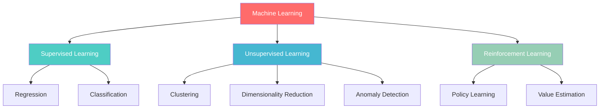
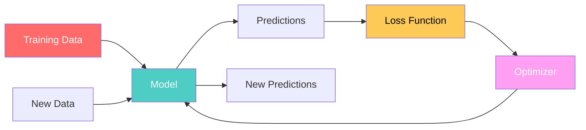
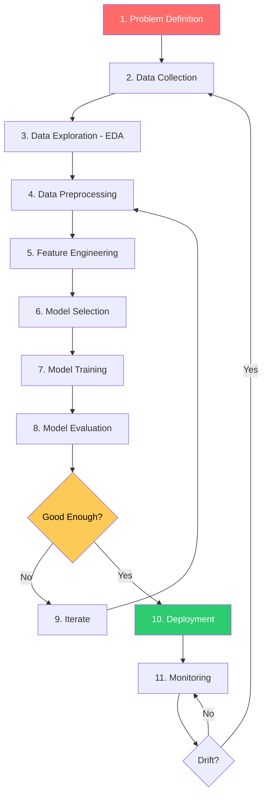
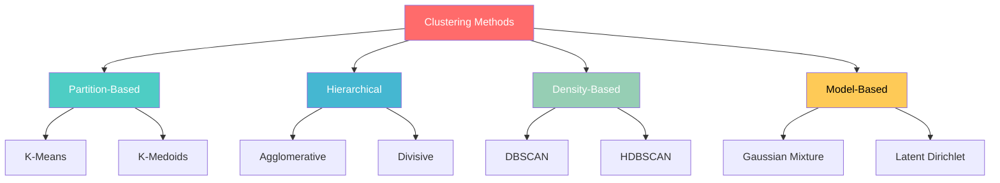
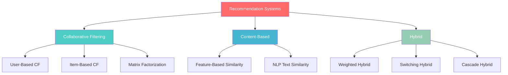

# Phase 8 — Machine Learning Fundamentals

## Complete Learning & Interview Mastery Guide

---

## Table of Contents

1. [What is Machine Learning — Deep Understanding](#what-is-machine-learning--deep-understanding)
2. [The ML Workflow — End to End](#the-ml-workflow--end-to-end)
3. [Regression — Predicting Continuous Values](#regression--predicting-continuous-values)
4. [Classification — Predicting Categories](#classification--predicting-categories)
5. [Clustering — Discovering Structure](#clustering--discovering-structure)
6. [Recommendation Systems](#recommendation-systems)
7. [Data Preprocessing Pipeline](#data-preprocessing-pipeline)
8. [Train-Test Split & Cross-Validation](#train-test-split--cross-validation)
9. [Bias-Variance Tradeoff Deep Dive](#bias-variance-tradeoff-deep-dive)
10. [Overfitting & Underfitting — Complete Guide](#overfitting--underfitting--complete-guide)
11. [Regularization Techniques](#regularization-techniques)
12. [Hyperparameter Tuning](#hyperparameter-tuning)
13. [End-to-End ML Project](#end-to-end-ml-project)
14. [Interview Mastery](#interview-mastery)

---

## What is Machine Learning — Deep Understanding

### Beginner Explanation

Machine Learning is teaching computers to learn from examples instead of programming them with explicit rules. Instead of writing "if customer has X, Y, Z → they will churn," you give the computer thousands of examples of customers who did and didn't churn, and it figures out the patterns itself.

**Traditional Programming:** Input + Rules → Output  
**Machine Learning:** Input + Output → Rules (learned automatically)

### Technical Explanation

Machine Learning is the field of algorithms that improve their performance on a task through experience (data). Formally:

> A computer program is said to **learn** from experience E with respect to some task T and performance measure P, if its performance at T, as measured by P, improves with experience E. — Tom Mitchell

The core idea: find a function f(x) that maps inputs to outputs by optimizing some objective function on training data, such that the learned function generalizes to unseen data.

### The Three Pillars of ML



| Type | Input | Goal | Examples |
|------|-------|------|----------|
| **Supervised** | Features + Labels | Predict labels for new data | Spam detection, price prediction |
| **Unsupervised** | Features only (no labels) | Find hidden structure | Customer segmentation, anomaly detection |
| **Reinforcement** | States + Rewards | Learn optimal actions | Game AI, robotics, recommendation |

### How ML Actually Works — The Core Loop



```
1. Feed training data (X, y) to the model
2. Model makes predictions ŷ = f(X)
3. Loss function measures error: L(y, ŷ)
4. Optimizer adjusts model parameters to minimize loss
5. Repeat until convergence
6. Deploy: use learned f(X) on new data
```

### Mathematical Foundation

Every supervised ML model is solving this optimization:

```
minimize  L(θ) = (1/n) Σ loss(yᵢ, f(xᵢ; θ))  +  λ · R(θ)
   θ

Where:
- θ = model parameters (weights)
- f(xᵢ; θ) = model prediction for input xᵢ
- loss() = measures how wrong the prediction is
- R(θ) = regularization (prevents overfitting)
- λ = regularization strength
```

### Real-World Analogy

Think of ML like a student studying for an exam:
- **Training data** = textbook examples with solutions
- **Model** = the student's brain forming patterns
- **Loss function** = the score on practice tests (how wrong they were)
- **Optimization** = the student adjusting their understanding after each mistake
- **Test data** = the actual exam (never seen before)
- **Overfitting** = memorizing answers without understanding (fails on new questions)
- **Underfitting** = barely studying (can't answer anything)
- **Good generalization** = truly understanding concepts (handles new questions)

---

## The ML Workflow — End to End

### Complete ML Pipeline



### Each Step Explained

| Step | What Happens | Key Questions |
|------|-------------|---------------|
| Problem Definition | Define what you're predicting and why | Is ML the right tool? What metric matters? |
| Data Collection | Gather labeled training data | Is there enough data? Is it representative? |
| EDA | Visualize distributions, correlations, outliers | Any data quality issues? Class imbalance? |
| Preprocessing | Clean data, handle missing values, encode | What imputation strategy? What encoding? |
| Feature Engineering | Create new meaningful features | What domain knowledge can we encode? |
| Model Selection | Choose algorithm(s) to try | What's the baseline? Linear vs non-linear? |
| Training | Fit model on training data | What hyperparameters? What hardware? |
| Evaluation | Measure on held-out test data | Which metrics? Is it better than baseline? |
| Iteration | Improve based on error analysis | Where is the model failing? Why? |
| Deployment | Serve predictions in production | Batch vs real-time? Latency requirements? |
| Monitoring | Track performance over time | Data drift? Performance degradation? |

---

## Regression — Predicting Continuous Values

### Beginner Explanation

Regression predicts a **number** — how much, how many, how long. Given input features, it outputs a continuous value. Examples: predicting house prices, forecasting sales, estimating delivery time, predicting a customer's lifetime value.

### Technical Explanation

Regression finds a function f: ℝⁿ → ℝ that maps n-dimensional input features to a continuous output value, minimizing prediction error on training data.

```
Input: X = [x₁, x₂, ..., xₙ]  (features — continuous/categorical)
Output: y ∈ ℝ                   (continuous target value)
Goal: Find f(X) ≈ y such that error is minimized on unseen data
```

### Types of Regression Problems

```
Simple Regression:     y = f(x₁)           → one feature predicts target
Multiple Regression:   y = f(x₁, x₂, ...) → many features
Polynomial Regression: y = f(x, x², x³)    → nonlinear relationships
Time-Series Regression: yₜ = f(yₜ₋₁, xₜ)  → predict future values
```

### Common Loss Functions for Regression

```python
import numpy as np

# Mean Squared Error (MSE) — most common
# Penalizes large errors heavily (squared)
def mse(y_true, y_pred):
    return np.mean((y_true - y_pred) ** 2)

# Mean Absolute Error (MAE)
# Robust to outliers (not squared)
def mae(y_true, y_pred):
    return np.mean(np.abs(y_true - y_pred))

# Root Mean Squared Error (RMSE)
# Same units as target variable — interpretable
def rmse(y_true, y_pred):
    return np.sqrt(np.mean((y_true - y_pred) ** 2))

# R² Score (Coefficient of Determination)
# How much variance is explained (1.0 = perfect, 0 = predicts mean)
def r2_score(y_true, y_pred):
    ss_res = np.sum((y_true - y_pred) ** 2)
    ss_tot = np.sum((y_true - np.mean(y_true)) ** 2)
    return 1 - (ss_res / ss_tot)

# Huber Loss — combines MSE + MAE (robust to outliers)
def huber_loss(y_true, y_pred, delta=1.0):
    error = y_true - y_pred
    is_small = np.abs(error) <= delta
    loss = np.where(is_small, 0.5 * error**2, delta * np.abs(error) - 0.5 * delta**2)
    return np.mean(loss)
```

### When to Use Which Metric

| Metric | When to Use | Sensitivity to Outliers |
|--------|------------|------------------------|
| MSE/RMSE | Default choice, large errors are expensive | Very sensitive |
| MAE | Outliers present, median prediction preferred | Robust |
| R² | Reporting model quality (0 to 1 scale) | Moderate |
| MAPE | Percentage errors matter (different scales) | Moderate |
| Huber | Some outliers but large errors still matter | Configurable |

### Complete Regression Example

```python
import numpy as np
import pandas as pd
from sklearn.model_selection import train_test_split, cross_val_score
from sklearn.preprocessing import StandardScaler
from sklearn.linear_model import LinearRegression, Ridge, Lasso
from sklearn.ensemble import RandomForestRegressor, GradientBoostingRegressor
from sklearn.metrics import mean_squared_error, r2_score, mean_absolute_error
import matplotlib.pyplot as plt

# Load data (California Housing as example)
from sklearn.datasets import fetch_california_housing
data = fetch_california_housing()
X = pd.DataFrame(data.data, columns=data.feature_names)
y = data.target

# EDA
print(f"Dataset shape: {X.shape}")
print(f"Target range: {y.min():.2f} to {y.max():.2f}")
print(f"Target mean: {y.mean():.2f}, std: {y.std():.2f}")
print(f"\nFeature correlations with target:")
correlations = X.corrwith(pd.Series(y)).sort_values(ascending=False)
print(correlations)

# Preprocessing
X_train, X_test, y_train, y_test = train_test_split(
    X, y, test_size=0.2, random_state=42
)

scaler = StandardScaler()
X_train_scaled = scaler.fit_transform(X_train)
X_test_scaled = scaler.transform(X_test)

# Train multiple models
models = {
    'Linear Regression': LinearRegression(),
    'Ridge (α=1.0)': Ridge(alpha=1.0),
    'Lasso (α=0.01)': Lasso(alpha=0.01),
    'Random Forest': RandomForestRegressor(n_estimators=100, random_state=42),
    'Gradient Boosting': GradientBoostingRegressor(n_estimators=100, random_state=42)
}

results = {}
for name, model in models.items():
    # Use scaled data for linear models, raw for tree models
    if 'Forest' in name or 'Boosting' in name:
        model.fit(X_train, y_train)
        y_pred = model.predict(X_test)
    else:
        model.fit(X_train_scaled, y_train)
        y_pred = model.predict(X_test_scaled)

    results[name] = {
        'RMSE': np.sqrt(mean_squared_error(y_test, y_pred)),
        'MAE': mean_absolute_error(y_test, y_pred),
        'R²': r2_score(y_test, y_pred)
    }

# Compare results
results_df = pd.DataFrame(results).T
print("\n" + "="*60)
print("MODEL COMPARISON")
print("="*60)
print(results_df.round(4))
```

---

## Classification — Predicting Categories

### Beginner Explanation

Classification predicts a **category/label** — which group something belongs to. Given input features, it outputs a class label. Examples: spam or not spam, which disease a patient has, whether a transaction is fraudulent, what type of customer someone is.

### Technical Explanation

Classification finds a function f: ℝⁿ → {C₁, C₂, ..., Cₖ} that maps input features to one of k discrete classes. Most classifiers also output probabilities P(class|features) which enables threshold tuning.

```
Binary Classification:      y ∈ {0, 1}           → two classes
Multi-class Classification: y ∈ {1, 2, ..., K}    → K > 2 classes
Multi-label Classification: y ∈ {0,1}^K           → multiple labels per sample
```

### Classification vs Regression Decision

```
Is the target variable...
├── A number on a continuous scale? → REGRESSION
│   (price, temperature, age, revenue)
├── A category/class? → CLASSIFICATION
│   (spam/not spam, cat/dog, high/medium/low)
└── Ordered categories? → Could be either
    (rating 1-5: ordinal regression or classification)
```

### Common Loss Functions for Classification

```python
import numpy as np

# Binary Cross-Entropy (Log Loss) — most common for binary classification
# Heavily penalizes confident wrong predictions
def binary_cross_entropy(y_true, y_pred_prob):
    epsilon = 1e-15  # avoid log(0)
    y_pred_prob = np.clip(y_pred_prob, epsilon, 1 - epsilon)
    return -np.mean(
        y_true * np.log(y_pred_prob) + (1 - y_true) * np.log(1 - y_pred_prob)
    )

# Categorical Cross-Entropy — multi-class extension
def categorical_cross_entropy(y_true_onehot, y_pred_probs):
    epsilon = 1e-15
    y_pred_probs = np.clip(y_pred_probs, epsilon, 1 - epsilon)
    return -np.mean(np.sum(y_true_onehot * np.log(y_pred_probs), axis=1))

# Hinge Loss — used by SVM
def hinge_loss(y_true, y_pred):  # y_true ∈ {-1, +1}
    return np.mean(np.maximum(0, 1 - y_true * y_pred))
```

### Classification Metrics — Complete Guide

```python
from sklearn.metrics import (accuracy_score, precision_score, recall_score,
                             f1_score, roc_auc_score, classification_report,
                             confusion_matrix)

# Example predictions
y_true = np.array([1, 0, 1, 1, 0, 1, 0, 0, 1, 0])
y_pred = np.array([1, 0, 1, 0, 0, 1, 1, 0, 1, 0])
y_prob = np.array([0.9, 0.1, 0.8, 0.4, 0.2, 0.95, 0.6, 0.15, 0.85, 0.3])

# Accuracy: correct predictions / total predictions
# Use when: classes are balanced
accuracy = accuracy_score(y_true, y_pred)  # 0.80

# Precision: TP / (TP + FP) — "of those I predicted positive, how many were right?"
# Use when: false positives are costly (spam filter — don't miss real email)
precision = precision_score(y_true, y_pred)  # 0.80

# Recall (Sensitivity): TP / (TP + FN) — "of actual positives, how many did I catch?"
# Use when: false negatives are costly (cancer detection — don't miss cancer)
recall = recall_score(y_true, y_pred)  # 0.80

# F1 Score: harmonic mean of precision and recall
# Use when: you need balance between precision and recall
f1 = f1_score(y_true, y_pred)  # 0.80

# ROC-AUC: measures ranking quality (probability outputs, not thresholds)
# Use when: you want threshold-independent performance
auc = roc_auc_score(y_true, y_prob)

# Full report
print(classification_report(y_true, y_pred, target_names=['Negative', 'Positive']))
```

### When to Use Which Metric

| Scenario | Primary Metric | Why |
|----------|---------------|-----|
| Balanced classes, simple use case | Accuracy | All errors equal |
| Imbalanced classes | F1, AUC-ROC, PR-AUC | Accuracy is misleading |
| False positives expensive | Precision | (spam → real email lost) |
| False negatives expensive | Recall | (cancer → patient dies) |
| Ranking/scoring quality | AUC-ROC | Threshold-independent |
| Severe imbalance (1:100+) | PR-AUC | More informative than ROC |

### Complete Classification Example

```python
import numpy as np
import pandas as pd
from sklearn.model_selection import train_test_split, cross_val_score
from sklearn.preprocessing import StandardScaler, LabelEncoder
from sklearn.linear_model import LogisticRegression
from sklearn.tree import DecisionTreeClassifier
from sklearn.ensemble import RandomForestClassifier, GradientBoostingClassifier
from sklearn.svm import SVC
from sklearn.neighbors import KNeighborsClassifier
from sklearn.metrics import classification_report, roc_auc_score
from sklearn.datasets import load_breast_cancer

# Load data
data = load_breast_cancer()
X = pd.DataFrame(data.data, columns=data.feature_names)
y = data.target  # 0 = malignant, 1 = benign

# Check class balance
print(f"Class distribution: {np.bincount(y)}")
print(f"Class ratio: {np.bincount(y)[1]/np.bincount(y)[0]:.2f}")

# Split
X_train, X_test, y_train, y_test = train_test_split(
    X, y, test_size=0.2, random_state=42, stratify=y
)

# Scale
scaler = StandardScaler()
X_train_scaled = scaler.fit_transform(X_train)
X_test_scaled = scaler.transform(X_test)

# Multiple models
models = {
    'Logistic Regression': LogisticRegression(max_iter=1000, random_state=42),
    'Decision Tree': DecisionTreeClassifier(max_depth=5, random_state=42),
    'Random Forest': RandomForestClassifier(n_estimators=100, random_state=42),
    'Gradient Boosting': GradientBoostingClassifier(n_estimators=100, random_state=42),
    'SVM (RBF)': SVC(probability=True, random_state=42),
    'KNN (k=5)': KNeighborsClassifier(n_neighbors=5)
}

print("\n" + "="*70)
print("MODEL COMPARISON — Breast Cancer Classification")
print("="*70)

for name, model in models.items():
    model.fit(X_train_scaled, y_train)
    y_pred = model.predict(X_test_scaled)
    y_prob = model.predict_proba(X_test_scaled)[:, 1]

    accuracy = (y_pred == y_test).mean()
    auc = roc_auc_score(y_test, y_prob)
    cv_scores = cross_val_score(model, X_train_scaled, y_train, cv=5, scoring='accuracy')

    print(f"\n{name}:")
    print(f"  Test Accuracy: {accuracy:.4f}")
    print(f"  ROC-AUC: {auc:.4f}")
    print(f"  CV Accuracy: {cv_scores.mean():.4f} ± {cv_scores.std():.4f}")
```

---

## Clustering — Discovering Structure

### Beginner Explanation

Clustering finds **natural groups** in your data without any labels. You don't tell the algorithm what the groups are — it discovers them by finding data points that are similar to each other. Examples: customer segmentation, document grouping, anomaly detection, image compression.

### Technical Explanation

Clustering is unsupervised learning that partitions n data points into k groups such that points within a group are more similar to each other than to points in other groups. No labels are provided — the algorithm discovers structure purely from the feature space.

```
Input: X = {x₁, x₂, ..., xₙ}  (features only — no labels)
Output: Cluster assignments C = {c₁, c₂, ..., cₙ}  where cᵢ ∈ {1, ..., k}
Goal: Minimize within-cluster distance, maximize between-cluster distance
```

### Types of Clustering



### K-Means — The Core Clustering Algorithm

```python
import numpy as np
from sklearn.cluster import KMeans, DBSCAN
from sklearn.preprocessing import StandardScaler
from sklearn.metrics import silhouette_score
import matplotlib.pyplot as plt

# Generate sample customer data
np.random.seed(42)
n_customers = 500

# 3 natural clusters (segments)
cluster1 = np.random.randn(200, 2) * 0.5 + [2, 2]    # High value
cluster2 = np.random.randn(150, 2) * 0.8 + [-1, -1]   # Budget
cluster3 = np.random.randn(150, 2) * 0.6 + [3, -2]    # New

X = np.vstack([cluster1, cluster2, cluster3])

# K-Means clustering
kmeans = KMeans(n_clusters=3, random_state=42, n_init=10)
labels = kmeans.fit_predict(X)
centroids = kmeans.cluster_centers_

# Evaluate
sil_score = silhouette_score(X, labels)
print(f"Silhouette Score: {sil_score:.3f}")  # -1 to 1, higher = better
print(f"Inertia (within-cluster sum of squares): {kmeans.inertia_:.2f}")
```

### Elbow Method — Finding Optimal K

```python
# How many clusters? Use the elbow method + silhouette scores

inertias = []
silhouette_scores = []
K_range = range(2, 11)

for k in K_range:
    km = KMeans(n_clusters=k, random_state=42, n_init=10)
    labels = km.fit_predict(X)
    inertias.append(km.inertia_)
    silhouette_scores.append(silhouette_score(X, labels))

fig, axes = plt.subplots(1, 2, figsize=(12, 5))

# Elbow plot (look for the "bend")
axes[0].plot(K_range, inertias, 'bo-', linewidth=2)
axes[0].set_xlabel('Number of Clusters (K)')
axes[0].set_ylabel('Inertia')
axes[0].set_title('Elbow Method')
axes[0].grid(True, alpha=0.3)

# Silhouette scores (pick the peak)
axes[1].plot(K_range, silhouette_scores, 'ro-', linewidth=2)
axes[1].set_xlabel('Number of Clusters (K)')
axes[1].set_ylabel('Silhouette Score')
axes[1].set_title('Silhouette Analysis')
axes[1].grid(True, alpha=0.3)

plt.tight_layout()
plt.show()
```

### Clustering Algorithm Comparison

| Algorithm | Cluster Shape | Handles Outliers | Needs K | Scalability |
|-----------|--------------|-----------------|---------|-------------|
| **K-Means** | Spherical | No | Yes | O(nk) — fast |
| **DBSCAN** | Arbitrary | Yes (labels them) | No | O(n log n) |
| **Hierarchical** | Any (dendrogram) | No | Cut-based | O(n²) — slow |
| **GMM** | Elliptical | Soft assignments | Yes | O(nk²) |
| **HDBSCAN** | Arbitrary | Yes | No | O(n log n) |

### Customer Segmentation — Complete Example

```python
import pandas as pd
import numpy as np
from sklearn.cluster import KMeans
from sklearn.preprocessing import StandardScaler
from sklearn.metrics import silhouette_score

# Simulate customer data (RFM-like)
np.random.seed(42)
n = 1000
customers = pd.DataFrame({
    'customer_id': range(n),
    'recency_days': np.concatenate([
        np.random.exponential(10, 300),    # Active
        np.random.exponential(60, 400),    # At-risk
        np.random.exponential(150, 300)    # Dormant
    ]),
    'frequency': np.concatenate([
        np.random.poisson(20, 300),
        np.random.poisson(5, 400),
        np.random.poisson(2, 300)
    ]),
    'monetary': np.concatenate([
        np.random.lognormal(7, 0.5, 300),
        np.random.lognormal(5, 0.8, 400),
        np.random.lognormal(4, 0.6, 300)
    ])
})

# Preprocessing (critical for K-Means — sensitive to scale)
features = ['recency_days', 'frequency', 'monetary']
scaler = StandardScaler()
X_scaled = scaler.fit_transform(customers[features])

# Fit K-Means with optimal K (determined by elbow/silhouette)
kmeans = KMeans(n_clusters=3, random_state=42, n_init=10)
customers['segment'] = kmeans.fit_predict(X_scaled)

# Analyze segments
segment_profiles = customers.groupby('segment')[features].agg(['mean', 'std', 'count'])
print("\nSegment Profiles:")
print(segment_profiles.round(1))

# Name segments based on characteristics
segment_names = {0: 'Champions', 1: 'At-Risk', 2: 'Lost'}
customers['segment_name'] = customers['segment'].map(segment_names)
```

---

## Recommendation Systems

### Beginner Explanation

Recommendation systems predict what a user might like based on their past behavior or similarity to other users. Netflix suggesting movies, Amazon suggesting products, Spotify suggesting songs — all recommendation systems.

### Types of Recommendation Systems



### Collaborative Filtering — "Users like you also liked..."

```python
import numpy as np
from sklearn.metrics.pairwise import cosine_similarity

# User-Item rating matrix
# Rows = users, Columns = items, Values = ratings (0 = not rated)
ratings = np.array([
    [5, 4, 0, 0, 3, 0],  # User 0
    [0, 5, 4, 0, 4, 0],  # User 1
    [4, 0, 5, 3, 0, 2],  # User 2
    [0, 3, 0, 5, 0, 4],  # User 3
    [5, 0, 4, 0, 3, 0],  # User 4
])

items = ['Movie_A', 'Movie_B', 'Movie_C', 'Movie_D', 'Movie_E', 'Movie_F']

# --- User-Based CF ---
# Step 1: Find similar users (cosine similarity)
user_similarity = cosine_similarity(ratings)
print("User Similarity Matrix:")
print(np.round(user_similarity, 2))

# Step 2: Predict rating for User 0, Movie_C (currently 0)
target_user = 0
target_item = 2  # Movie_C

# Get similarity of all users to target user
similarities = user_similarity[target_user]

# Users who have rated this item
rated_mask = ratings[:, target_item] > 0
relevant_similarities = similarities[rated_mask]
relevant_ratings = ratings[rated_mask, target_item]

# Weighted average prediction
predicted_rating = np.average(relevant_ratings, weights=relevant_similarities[rated_mask])
print(f"\nPredicted rating for User 0, Movie_C: {predicted_rating:.2f}")

# --- Item-Based CF ---
# Compute item-item similarity
item_similarity = cosine_similarity(ratings.T)  # Transpose: columns become rows
print(f"\nItem Similarity Matrix:")
print(np.round(item_similarity, 2))
```

### Content-Based Filtering — "Because you liked X features..."

```python
import pandas as pd
import numpy as np
from sklearn.feature_extraction.text import TfidfVectorizer
from sklearn.metrics.pairwise import cosine_similarity

# Movie metadata
movies = pd.DataFrame({
    'title': ['The Matrix', 'Inception', 'Interstellar', 'The Notebook', 'Titanic'],
    'genres': ['sci-fi action thriller', 'sci-fi thriller dream',
               'sci-fi drama space', 'romance drama', 'romance drama historical'],
    'description': [
        'A hacker discovers reality is a simulation',
        'A thief enters dreams to plant ideas',
        'Astronauts travel through wormhole to save humanity',
        'A love story spanning years of separation',
        'Love story aboard a doomed ship'
    ]
})

# Create content features using TF-IDF
tfidf = TfidfVectorizer(stop_words='english')
content_matrix = tfidf.fit_transform(movies['genres'] + ' ' + movies['description'])

# Compute item similarity based on content
content_similarity = cosine_similarity(content_matrix)

def recommend_similar(movie_title, top_n=3):
    idx = movies[movies['title'] == movie_title].index[0]
    similarity_scores = list(enumerate(content_similarity[idx]))
    similarity_scores = sorted(similarity_scores, key=lambda x: x[1], reverse=True)

    print(f"\nMovies similar to '{movie_title}':")
    for i, score in similarity_scores[1:top_n+1]:
        print(f"  {movies.iloc[i]['title']} (similarity: {score:.3f})")

recommend_similar('The Matrix')
recommend_similar('The Notebook')
```

### Comparison Table

| Method | Approach | Cold Start? | Scalability | Best For |
|--------|----------|-------------|-------------|----------|
| **User-Based CF** | Find similar users | Needs user history | O(n²) users | Small user bases |
| **Item-Based CF** | Find similar items | Needs item ratings | O(m²) items | E-commerce |
| **Matrix Factorization** | Decompose rating matrix | Needs some data | O(nmk) | Large sparse matrices |
| **Content-Based** | Match item features | Can recommend new items | O(m²) features | When metadata rich |
| **Hybrid** | Combine multiple methods | Mitigates | Varies | Production systems |

---

## Data Preprocessing Pipeline

### Why Preprocessing Matters

Raw data is messy. ML models need clean, numeric, properly scaled data. The preprocessing pipeline transforms raw data into model-ready features. A bad preprocessing pipeline ruins even the best model.

### Complete Preprocessing Pipeline


### Handling Missing Values

```python
import pandas as pd
import numpy as np
from sklearn.impute import SimpleImputer, KNNImputer

# Create sample data with missing values
df = pd.DataFrame({
    'age': [25, 30, np.nan, 45, np.nan, 35, 28, np.nan, 50, 42],
    'income': [50000, 75000, 60000, np.nan, 45000, np.nan, 55000, 80000, np.nan, 70000],
    'category': ['A', 'B', np.nan, 'A', 'C', 'B', np.nan, 'A', 'C', 'B'],
    'target': [0, 1, 0, 1, 0, 1, 0, 1, 1, 0]
})

print("Missing values per column:")
print(df.isnull().sum())
print(f"\nTotal missing: {df.isnull().sum().sum()} / {df.size} = {df.isnull().sum().sum()/df.size*100:.1f}%")

# Strategy 1: Remove rows/columns (ONLY if very few missing)
df_dropped = df.dropna()  # drops ANY row with missing
df_dropped_cols = df.dropna(axis=1, thresh=int(0.7*len(df)))  # drop columns >30% missing

# Strategy 2: Imputation with statistics
# Numeric: mean, median (robust to outliers), or mode
numeric_imputer = SimpleImputer(strategy='median')  # or 'mean'
df[['age', 'income']] = numeric_imputer.fit_transform(df[['age', 'income']])

# Categorical: mode (most frequent) or 'Unknown'
cat_imputer = SimpleImputer(strategy='most_frequent')
df[['category']] = cat_imputer.fit_transform(df[['category']])

# Strategy 3: KNN Imputation (uses similar rows to estimate missing)
knn_imputer = KNNImputer(n_neighbors=5)
df_knn = pd.DataFrame(
    knn_imputer.fit_transform(df.select_dtypes(include=[np.number])),
    columns=df.select_dtypes(include=[np.number]).columns
)

# Strategy 4: Indicator variable (let model learn "missingness" is informative)
df['age_was_missing'] = df['age'].isnull().astype(int)
df['age'] = df['age'].fillna(df['age'].median())
```

### Missing Value Strategy Decision Tree

```
How much is missing?
├── <5%: Drop rows (if dataset is large enough)
├── 5-30%: Impute
│   ├── Numeric?
│   │   ├── Normally distributed → mean imputation
│   │   ├── Skewed / has outliers → median imputation
│   │   └── Correlated features → KNN or iterative imputation
│   └── Categorical?
│       ├── Few categories → mode imputation
│       └── Many categories → 'Unknown' / 'Missing' category
├── 30-50%: Consider adding "is_missing" indicator + impute
└── >50%: Consider dropping the column
```

### Encoding Categorical Variables

```python
import pandas as pd
from sklearn.preprocessing import LabelEncoder, OneHotEncoder, OrdinalEncoder

df = pd.DataFrame({
    'color': ['red', 'blue', 'green', 'red', 'blue'],
    'size': ['small', 'medium', 'large', 'medium', 'small'],
    'brand': ['Nike', 'Adidas', 'Puma', 'Nike', 'Reebok'],
    'price': [100, 150, 80, 120, 90]
})

# --- Label Encoding (ordinal variables where order matters) ---
# size: small < medium < large
ordinal_enc = OrdinalEncoder(categories=[['small', 'medium', 'large']])
df['size_encoded'] = ordinal_enc.fit_transform(df[['size']])
# Result: small=0, medium=1, large=2

# --- One-Hot Encoding (nominal variables — no order) ---
# color: red, blue, green (no natural order)
df_encoded = pd.get_dummies(df, columns=['color'], drop_first=True, dtype=int)
# drop_first=True avoids multicollinearity (dummy variable trap)
# Creates: color_green, color_red (blue is reference)

# --- scikit-learn OneHotEncoder (for pipelines) ---
ohe = OneHotEncoder(sparse_output=False, drop='first', handle_unknown='ignore')
color_encoded = ohe.fit_transform(df[['color']])

# --- Target Encoding (for high-cardinality categoricals) ---
# Encode category by mean of target variable
# Careful: can cause leakage if not done within CV folds
target_means = df.groupby('brand')['price'].mean()
df['brand_target_encoded'] = df['brand'].map(target_means)

# --- Frequency Encoding ---
freq = df['brand'].value_counts(normalize=True)
df['brand_freq'] = df['brand'].map(freq)
```

### When to Use Which Encoding

| Encoding | When to Use | Algorithm Compatibility |
|----------|------------|------------------------|
| **Label/Ordinal** | Ordered categories (low/med/high) | Trees (any), NOT linear models |
| **One-Hot** | Nominal categories (≤ ~20 unique) | All algorithms |
| **Target Encoding** | High cardinality (1000+ categories) | All, but needs regularization |
| **Frequency Encoding** | High cardinality, frequency matters | All |
| **Binary Encoding** | Medium cardinality (20-100) | All |
| **Leave-one-out** | Prevents target leakage in encoding | Classification |

### Feature Scaling

```python
import numpy as np
from sklearn.preprocessing import StandardScaler, MinMaxScaler, RobustScaler

X = np.array([[100, 0.001, 50000],
              [200, 0.002, 75000],
              [150, 0.0015, 60000],
              [300, 0.003, 90000],
              [5000, 0.01, 200000]])  # outlier row

# --- StandardScaler (Z-score normalization) ---
# Transforms to mean=0, std=1
# Use when: data is approximately Gaussian, required by many algorithms
standard = StandardScaler()
X_standard = standard.fit_transform(X)
# Formula: z = (x - μ) / σ

# --- MinMaxScaler (0-1 normalization) ---
# Scales to [0, 1] range
# Use when: bounded features needed (neural nets, distance-based)
minmax = MinMaxScaler()
X_minmax = minmax.fit_transform(X)
# Formula: x_scaled = (x - min) / (max - min)

# --- RobustScaler (uses median and IQR) ---
# Robust to outliers
# Use when: data has significant outliers
robust = RobustScaler()
X_robust = robust.fit_transform(X)
# Formula: x_scaled = (x - median) / IQR
```

### When Scaling Is Needed vs Not Needed

```
NEEDS SCALING:                  DOESN'T NEED SCALING:
- Linear Regression             - Decision Trees
- Logistic Regression           - Random Forest
- SVM                           - Gradient Boosting (XGBoost, LightGBM)
- KNN                           - Naive Bayes
- Neural Networks
- PCA
- K-Means Clustering

Rule: If the algorithm uses distance or gradient → scale.
      If it uses splits/thresholds → don't need to scale.
```

---

## Train-Test Split & Cross-Validation

### Why Split Data?

If you evaluate a model on the same data it trained on, you're measuring **memorization**, not **generalization**. The model might score 99% on training data but fail horribly on new data (overfitting). Splitting ensures honest evaluation.

### The Standard Split Strategy

```
Total Dataset (100%)
├── Training Set (60-80%) — model learns from this
├── Validation Set (10-20%) — tune hyperparameters
└── Test Set (10-20%) — final evaluation (touch ONCE)
```

```python
from sklearn.model_selection import (train_test_split, KFold,
    StratifiedKFold, TimeSeriesSplit, cross_val_score)
import numpy as np

# --- Simple Train/Test Split ---
X_train, X_test, y_train, y_test = train_test_split(
    X, y,
    test_size=0.2,        # 20% for testing
    random_state=42,      # reproducibility
    stratify=y            # maintain class proportions (CRITICAL for imbalanced data)
)

# --- Train/Validation/Test Split ---
# First split: separate test set
X_temp, X_test, y_temp, y_test = train_test_split(X, y, test_size=0.15, stratify=y, random_state=42)
# Second split: separate validation from training
X_train, X_val, y_train, y_val = train_test_split(X_temp, y_temp, test_size=0.18, stratify=y_temp, random_state=42)
# Result: ~70% train, ~15% val, ~15% test
```

### Cross-Validation — More Robust Evaluation

```python
# K-Fold Cross-Validation
# Splits data into K folds, trains K models, each using different fold as validation
from sklearn.model_selection import KFold, StratifiedKFold, cross_val_score
from sklearn.ensemble import RandomForestClassifier

model = RandomForestClassifier(n_estimators=100, random_state=42)

# --- Standard K-Fold (5 folds) ---
kf = KFold(n_splits=5, shuffle=True, random_state=42)
scores = cross_val_score(model, X, y, cv=kf, scoring='accuracy')
print(f"5-Fold CV Accuracy: {scores.mean():.4f} ± {scores.std():.4f}")

# --- Stratified K-Fold (maintains class proportions in each fold) ---
# USE THIS for classification (especially imbalanced)
skf = StratifiedKFold(n_splits=5, shuffle=True, random_state=42)
scores = cross_val_score(model, X, y, cv=skf, scoring='roc_auc')
print(f"Stratified 5-Fold AUC: {scores.mean():.4f} ± {scores.std():.4f}")

# --- Time Series Split (no future data leakage) ---
# MUST USE for time-series data — cannot randomly split time data!
tscv = TimeSeriesSplit(n_splits=5)
scores = cross_val_score(model, X, y, cv=tscv, scoring='neg_mean_squared_error')
print(f"Time Series CV MSE: {-scores.mean():.4f} ± {scores.std():.4f}")
```

### Cross-Validation Visualization

```
Standard K-Fold (K=5):

Fold 1: [VAL] [TRAIN] [TRAIN] [TRAIN] [TRAIN]
Fold 2: [TRAIN] [VAL] [TRAIN] [TRAIN] [TRAIN]
Fold 3: [TRAIN] [TRAIN] [VAL] [TRAIN] [TRAIN]
Fold 4: [TRAIN] [TRAIN] [TRAIN] [VAL] [TRAIN]
Fold 5: [TRAIN] [TRAIN] [TRAIN] [TRAIN] [VAL]

Time Series Split:

Fold 1: [TRAIN] [VAL] [    ]  [    ]  [    ]
Fold 2: [TRAIN] [TRAIN] [VAL] [    ]  [    ]
Fold 3: [TRAIN] [TRAIN] [TRAIN] [VAL] [    ]
Fold 4: [TRAIN] [TRAIN] [TRAIN] [TRAIN] [VAL]

↑ Time →
(Never peek into the future!)
```

### Common Mistakes in Train/Test Split

```
❌ NOT using stratify for imbalanced classification
   → One fold might have 0% positive class

❌ Random split for time-series data
   → Trains on future data, tests on past (temporal leakage)

❌ Feature engineering BEFORE splitting
   → Information from test set leaks into training (data leakage)

❌ Evaluating on validation set many times, then reporting as "test accuracy"
   → You've indirectly overfit to validation set

❌ Using the same data for training and evaluation
   → Measures memorization, not generalization

✅ CORRECT order:
   1. Split data FIRST
   2. Fit preprocessing ONLY on training data
   3. Transform both train and test using training statistics
   4. Do feature engineering ONLY within each CV fold
   5. Report test metrics ONCE at the very end
```

---

## Bias-Variance Tradeoff Deep Dive

### Beginner Explanation

Every ML model's error comes from three sources:
- **Bias** = how wrong the model's assumptions are (too simple)
- **Variance** = how much the model changes with different training data (too sensitive)
- **Irreducible noise** = inherent randomness in the data (can't fix)

The tradeoff: reducing bias (making model more complex) increases variance, and vice versa. The goal is finding the sweet spot.

### Mathematical Formulation

```
Expected Error = Bias² + Variance + Irreducible Noise

For a prediction f̂(x) of the true function f(x):
- Bias = E[f̂(x)] - f(x)         → systematic error in average prediction
- Variance = E[(f̂(x) - E[f̂(x)])²]  → how much f̂(x) varies with different training data
- Noise = σ²                      → inherent randomness in y
```

### Visual Intuition — The Dartboard Analogy

```
                    Low Variance              High Variance
                (consistent shots)        (scattered shots)

Low Bias        ●●●                        ●    ●
(aims at         ●●                            ●  ●
 bullseye)        ● ← BULLSEYE               ●    ← BULLSEYE
                                            ●     ●

High Bias         ●●●                        ●  ●
(aims off          ●● ← shots here        ●     ●
 center)            ●                    ●         ●
                     ← BULLSEYE here       ← BULLSEYE here

IDEAL: Low Bias + Low Variance (tight cluster at bullseye)
```

### Bias-Variance in Common Models

| Model | Bias | Variance | When It Fails |
|-------|------|----------|---------------|
| Linear Regression | High | Low | Nonlinear relationships |
| Polynomial (high degree) | Low | High | Small datasets |
| Decision Tree (deep) | Low | High | Noisy data |
| Decision Tree (shallow) | High | Low | Complex patterns |
| Random Forest | Low | Low-Medium | Computationally expensive |
| k-NN (k=1) | Low | Very High | Noisy data |
| k-NN (k=n) | High | Low | Any complex pattern |

### Code: Demonstrating Bias-Variance

```python
import numpy as np
import matplotlib.pyplot as plt
from sklearn.preprocessing import PolynomialFeatures
from sklearn.linear_model import LinearRegression
from sklearn.pipeline import make_pipeline
from sklearn.metrics import mean_squared_error

# True function (unknown in practice)
def true_function(x):
    return np.sin(2 * x) + 0.5 * x

# Generate multiple training sets to observe variance
np.random.seed(42)
n_datasets = 50
n_points = 30
x_test = np.linspace(0, 5, 100).reshape(-1, 1)
y_true = true_function(x_test.ravel())

degrees = [1, 3, 15]  # Low complexity → High complexity
fig, axes = plt.subplots(1, 3, figsize=(15, 5))

for ax, degree in zip(axes, degrees):
    predictions = []

    for i in range(n_datasets):
        # New training data each time
        X_train = np.random.uniform(0, 5, n_points).reshape(-1, 1)
        y_train = true_function(X_train.ravel()) + np.random.normal(0, 0.3, n_points)

        # Fit polynomial of given degree
        model = make_pipeline(PolynomialFeatures(degree), LinearRegression())
        model.fit(X_train, y_train)
        y_pred = model.predict(x_test)
        predictions.append(y_pred)

        # Plot this model (faint)
        ax.plot(x_test, y_pred, alpha=0.1, color='blue')

    predictions = np.array(predictions)
    avg_prediction = predictions.mean(axis=0)

    # Bias = (average prediction - true)²
    bias_squared = (avg_prediction - y_true) ** 2
    # Variance = average (prediction - average prediction)²
    variance = predictions.var(axis=0)

    ax.plot(x_test, y_true, 'r-', linewidth=2, label='True function')
    ax.plot(x_test, avg_prediction, 'b--', linewidth=2, label='Avg prediction')
    ax.set_title(f'Degree {degree}\nBias²={bias_squared.mean():.3f}, Var={variance.mean():.3f}')
    ax.legend()
    ax.set_ylim(-3, 6)
    ax.grid(True, alpha=0.3)

plt.suptitle('Bias-Variance Tradeoff Demonstration', fontsize=14)
plt.tight_layout()
plt.show()
```

---

## Overfitting & Underfitting — Complete Guide

### Beginner Explanation

- **Overfitting** = model memorizes training data (too complex) → great on training, terrible on new data
- **Underfitting** = model is too simple to capture patterns → bad on both training and new data
- **Good fit** = model captures true patterns without memorizing noise → good on both

### How to Detect

```
                Training Score    Test Score    Diagnosis
Underfitting:   LOW               LOW           Model too simple
Good Fit:       HIGH              HIGH          Sweet spot!
Overfitting:    VERY HIGH         LOW           Model memorizing noise
                (close to 100%)   (big gap)
```

### Signs of Overfitting

```python
# Overfitting indicators:
# 1. Large gap between train and test performance
train_accuracy = 0.99
test_accuracy  = 0.72
gap = train_accuracy - test_accuracy  # 0.27 → OVERFITTING

# 2. Model performance degrades with more features
# 3. Decision tree has very high depth
# 4. Very low training loss but high validation loss
# 5. Model changes drastically with small data changes
```

### Solutions Overview

```
OVERFITTING (too complex):           UNDERFITTING (too simple):
─────────────────────────           ──────────────────────────
• More training data                 • More complex model
• Reduce model complexity            • Add more features
• Regularization (L1, L2)           • Reduce regularization
• Dropout (neural nets)             • Longer training
• Early stopping                    • Feature engineering
• Feature selection (fewer features) • Polynomial features
• Ensemble methods                  • Different algorithm
• Cross-validation                  • Hyperparameter tuning
• Data augmentation
• Pruning (trees)
```

### Code: Detecting and Fixing Overfitting

```python
import numpy as np
from sklearn.tree import DecisionTreeClassifier
from sklearn.ensemble import RandomForestClassifier
from sklearn.model_selection import train_test_split, cross_val_score, learning_curve
from sklearn.datasets import make_classification
import matplotlib.pyplot as plt

# Generate data
X, y = make_classification(n_samples=1000, n_features=20, n_informative=10,
                           n_redundant=5, random_state=42)
X_train, X_test, y_train, y_test = train_test_split(X, y, test_size=0.2, random_state=42)

# --- Overfitting example: deep tree ---
overfit_tree = DecisionTreeClassifier(max_depth=None, random_state=42)  # no limit!
overfit_tree.fit(X_train, y_train)
print(f"Overfitting Tree:")
print(f"  Train accuracy: {overfit_tree.score(X_train, y_train):.4f}")  # ~1.0
print(f"  Test accuracy:  {overfit_tree.score(X_test, y_test):.4f}")    # ~0.85
print(f"  Tree depth:     {overfit_tree.get_depth()}")
print(f"  Leaf nodes:     {overfit_tree.get_n_leaves()}")

# --- Fixed: controlled complexity ---
fixed_tree = DecisionTreeClassifier(max_depth=5, min_samples_leaf=10, random_state=42)
fixed_tree.fit(X_train, y_train)
print(f"\nControlled Tree:")
print(f"  Train accuracy: {fixed_tree.score(X_train, y_train):.4f}")
print(f"  Test accuracy:  {fixed_tree.score(X_test, y_test):.4f}")
print(f"  Tree depth:     {fixed_tree.get_depth()}")
print(f"  Leaf nodes:     {fixed_tree.get_n_leaves()}")

# --- Even better: ensemble reduces variance ---
forest = RandomForestClassifier(n_estimators=100, max_depth=10, random_state=42)
forest.fit(X_train, y_train)
print(f"\nRandom Forest:")
print(f"  Train accuracy: {forest.score(X_train, y_train):.4f}")
print(f"  Test accuracy:  {forest.score(X_test, y_test):.4f}")
```

---

## Regularization Techniques

### Beginner Explanation

Regularization is a technique to prevent overfitting by penalizing model complexity. It adds a "cost" for having large/many parameters, forcing the model to be simpler and more generalizable. Think of it as a budget constraint — the model can't spend unlimited parameters; it must choose which ones truly matter.

### L1 (Lasso) vs L2 (Ridge) Regularization

```
Total Loss = Original Loss + λ × Penalty

L1 (Lasso):  Penalty = Σ|wᵢ|      → drives weights to exactly 0 (feature selection)
L2 (Ridge):  Penalty = Σwᵢ²       → shrinks weights toward 0 (never exactly 0)
Elastic Net: Penalty = α·L1 + (1-α)·L2  → combines both
```

### Visual Intuition

```
L1 constraint region:            L2 constraint region:
(diamond shape)                  (circle shape)

     ╱╲                              ╭──╮
    ╱  ╲     ← sharp corners       │    │   ← no corners
   ╱    ╲      hit axes            │    │     smooth shrinkage
   ╲    ╱      (w=0)              │    │
    ╲  ╱                           ╰──╯
     ╲╱

L1 pushes weights to zero → automatic feature selection
L2 makes weights small → distributed shrinkage
```

### Code: Regularization Comparison

```python
import numpy as np
import matplotlib.pyplot as plt
from sklearn.linear_model import LinearRegression, Ridge, Lasso, ElasticNet
from sklearn.preprocessing import StandardScaler, PolynomialFeatures
from sklearn.pipeline import make_pipeline
from sklearn.model_selection import train_test_split

# Generate overfit-prone data (many features, few samples)
np.random.seed(42)
n_samples = 50
n_features = 30
X = np.random.randn(n_samples, n_features)
# Only first 5 features actually matter
true_weights = np.zeros(n_features)
true_weights[:5] = [3, -2, 1.5, -1, 0.5]
y = X @ true_weights + np.random.randn(n_samples) * 0.5

X_train, X_test, y_train, y_test = train_test_split(X, y, test_size=0.3, random_state=42)
scaler = StandardScaler()
X_train_s = scaler.fit_transform(X_train)
X_test_s = scaler.transform(X_test)

# Compare models
models = {
    'Linear (no reg)': LinearRegression(),
    'Ridge (L2, α=1)': Ridge(alpha=1.0),
    'Ridge (L2, α=10)': Ridge(alpha=10.0),
    'Lasso (L1, α=0.1)': Lasso(alpha=0.1),
    'Lasso (L1, α=1)': Lasso(alpha=1.0),
    'ElasticNet': ElasticNet(alpha=0.5, l1_ratio=0.5)
}

print(f"{'Model':<25} {'Train R²':<12} {'Test R²':<12} {'Non-zero weights'}")
print("-" * 70)

for name, model in models.items():
    model.fit(X_train_s, y_train)
    train_score = model.score(X_train_s, y_train)
    test_score = model.score(X_test_s, y_test)
    n_nonzero = np.sum(np.abs(model.coef_) > 0.01)
    print(f"{name:<25} {train_score:<12.4f} {test_score:<12.4f} {n_nonzero}")

# Lasso correctly identifies the 5 true features!
```

### When to Use Which Regularization

| Technique | When to Use | Effect |
|-----------|------------|--------|
| **L2 (Ridge)** | Many correlated features, want to keep all | Shrinks all weights |
| **L1 (Lasso)** | Want automatic feature selection | Zeros out irrelevant features |
| **Elastic Net** | Many features, some correlated groups | Best of both worlds |
| **Dropout** | Neural networks | Randomly disables neurons |
| **Early Stopping** | Any iterative algorithm | Stops before overfitting |
| **Max Depth/Min Samples** | Decision trees | Limits tree complexity |

---

## Hyperparameter Tuning

### What are Hyperparameters?

**Parameters** are learned from data (weights, biases). **Hyperparameters** are set by you before training and control HOW the model learns.

```
Parameters (learned):              Hyperparameters (you set):
- Linear regression weights        - Learning rate
- Neural network weights/biases    - Number of trees
- Decision tree split thresholds   - Max tree depth
                                   - Regularization strength (λ)
                                   - K in KNN
                                   - Batch size, epochs
```

### Tuning Methods

```python
from sklearn.model_selection import GridSearchCV, RandomizedSearchCV
from sklearn.ensemble import RandomForestClassifier
import numpy as np

X_train, X_test, y_train, y_test = train_test_split(X, y, test_size=0.2, random_state=42)
model = RandomForestClassifier(random_state=42)

# --- Method 1: Grid Search (exhaustive — tries ALL combinations) ---
param_grid = {
    'n_estimators': [50, 100, 200],
    'max_depth': [5, 10, 20, None],
    'min_samples_split': [2, 5, 10],
    'min_samples_leaf': [1, 2, 4]
}
# Total combinations: 3 × 4 × 3 × 3 = 108 fits × 5 CV folds = 540 model fits!

grid_search = GridSearchCV(
    model, param_grid,
    cv=5,               # 5-fold cross-validation
    scoring='roc_auc',  # metric to optimize
    n_jobs=-1,          # use all CPU cores
    verbose=1
)
grid_search.fit(X_train, y_train)

print(f"Best params: {grid_search.best_params_}")
print(f"Best CV AUC: {grid_search.best_score_:.4f}")
print(f"Test AUC: {grid_search.score(X_test, y_test):.4f}")

# --- Method 2: Random Search (samples random combinations — faster) ---
param_distributions = {
    'n_estimators': [50, 100, 200, 300, 500],
    'max_depth': [3, 5, 10, 20, 30, None],
    'min_samples_split': [2, 5, 10, 20],
    'min_samples_leaf': [1, 2, 4, 8],
    'max_features': ['sqrt', 'log2', 0.5, 0.8]
}

random_search = RandomizedSearchCV(
    model, param_distributions,
    n_iter=50,           # try 50 random combinations (not all)
    cv=5,
    scoring='roc_auc',
    n_jobs=-1,
    random_state=42,
    verbose=1
)
random_search.fit(X_train, y_train)

print(f"Best params: {random_search.best_params_}")
print(f"Best CV AUC: {random_search.best_score_:.4f}")
```

```python
# --- Method 3: Bayesian Optimization (smartest — learns from past trials) ---
# Uses previous results to guide next evaluation (much faster for expensive models)
import optuna

def objective(trial):
    params = {
        'n_estimators': trial.suggest_int('n_estimators', 50, 500),
        'max_depth': trial.suggest_int('max_depth', 3, 30),
        'min_samples_split': trial.suggest_int('min_samples_split', 2, 20),
        'min_samples_leaf': trial.suggest_int('min_samples_leaf', 1, 10),
        'max_features': trial.suggest_float('max_features', 0.3, 1.0),
    }

    model = RandomForestClassifier(**params, random_state=42, n_jobs=-1)
    scores = cross_val_score(model, X_train, y_train, cv=5, scoring='roc_auc')
    return scores.mean()

study = optuna.create_study(direction='maximize')
study.optimize(objective, n_trials=100, show_progress_bar=True)

print(f"Best params: {study.best_params}")
print(f"Best CV AUC: {study.best_value:.4f}")
```

### Tuning Methods Comparison

| Method | Pros | Cons | When to Use |
|--------|------|------|-------------|
| **Grid Search** | Guaranteed to find best in grid | Exponentially slow | ≤3 hyperparameters, small grids |
| **Random Search** | Faster, covers space better | May miss optimal | 3-6 hyperparameters |
| **Bayesian (Optuna)** | Smartest, fastest convergence | Complex setup | Expensive models, many params |
| **Manual** | Quick intuition check | Suboptimal | Initial exploration |

---

## End-to-End ML Project

### Complete Scikit-Learn Pipeline

```python
import numpy as np
import pandas as pd
from sklearn.model_selection import train_test_split, cross_val_score
from sklearn.pipeline import Pipeline
from sklearn.compose import ColumnTransformer
from sklearn.preprocessing import StandardScaler, OneHotEncoder
from sklearn.impute import SimpleImputer
from sklearn.ensemble import GradientBoostingClassifier
from sklearn.metrics import classification_report, roc_auc_score
import joblib

# --- Step 1: Load and understand data ---
# Using Titanic-like survival prediction
np.random.seed(42)
n = 1000
data = pd.DataFrame({
    'age': np.random.normal(35, 15, n).clip(1, 80),
    'fare': np.random.exponential(50, n),
    'pclass': np.random.choice([1, 2, 3], n, p=[0.2, 0.3, 0.5]),
    'sex': np.random.choice(['male', 'female'], n, p=[0.6, 0.4]),
    'embarked': np.random.choice(['S', 'C', 'Q'], n, p=[0.7, 0.2, 0.1]),
    'survived': np.random.choice([0, 1], n, p=[0.6, 0.4])
})
# Add some missing values
data.loc[np.random.choice(n, 50), 'age'] = np.nan
data.loc[np.random.choice(n, 20), 'embarked'] = np.nan

# --- Step 2: Define features and target ---
target = 'survived'
numeric_features = ['age', 'fare']
categorical_features = ['pclass', 'sex', 'embarked']

X = data[numeric_features + categorical_features]
y = data[target]

# --- Step 3: Train/Test split ---
X_train, X_test, y_train, y_test = train_test_split(
    X, y, test_size=0.2, random_state=42, stratify=y
)

# --- Step 4: Build preprocessing pipeline ---
# Separate pipelines for numeric and categorical features
numeric_pipeline = Pipeline([
    ('imputer', SimpleImputer(strategy='median')),
    ('scaler', StandardScaler())
])

categorical_pipeline = Pipeline([
    ('imputer', SimpleImputer(strategy='most_frequent')),
    ('encoder', OneHotEncoder(handle_unknown='ignore', sparse_output=False))
])

# Combine into a column transformer
preprocessor = ColumnTransformer([
    ('numeric', numeric_pipeline, numeric_features),
    ('categorical', categorical_pipeline, categorical_features)
])

# --- Step 5: Full pipeline (preprocessing + model) ---
full_pipeline = Pipeline([
    ('preprocessor', preprocessor),
    ('classifier', GradientBoostingClassifier(
        n_estimators=100,
        max_depth=5,
        learning_rate=0.1,
        random_state=42
    ))
])

# --- Step 6: Train ---
full_pipeline.fit(X_train, y_train)

# --- Step 7: Evaluate ---
y_pred = full_pipeline.predict(X_test)
y_prob = full_pipeline.predict_proba(X_test)[:, 1]

print("Classification Report:")
print(classification_report(y_test, y_pred))
print(f"ROC-AUC: {roc_auc_score(y_test, y_prob):.4f}")

# Cross-validation for robustness
cv_scores = cross_val_score(full_pipeline, X_train, y_train, cv=5, scoring='roc_auc')
print(f"5-Fold CV AUC: {cv_scores.mean():.4f} ± {cv_scores.std():.4f}")

# --- Step 8: Save model for deployment ---
joblib.dump(full_pipeline, 'model_pipeline.pkl')

# --- Step 9: Load and predict in production ---
loaded_pipeline = joblib.load('model_pipeline.pkl')
# Predict on new data (handles preprocessing automatically!)
new_passenger = pd.DataFrame({
    'age': [28], 'fare': [72.5], 'pclass': [1],
    'sex': ['female'], 'embarked': ['C']
})
prediction = loaded_pipeline.predict_proba(new_passenger)[0, 1]
print(f"\nSurvival probability for new passenger: {prediction:.3f}")
```

### Why Pipelines Matter

```
Without Pipeline:                    With Pipeline:
──────────────────                   ─────────────────
1. Fit scaler on train              1. pipeline.fit(X_train, y_train)
2. Transform train                  2. pipeline.predict(X_test)
3. Transform test (remember!)       3. joblib.dump(pipeline, 'model.pkl')
4. Fit encoder on train
5. Transform train                  ← One object handles EVERYTHING
6. Transform test
7. Fit model
8. Predict
9. Save scaler, encoder, model
   separately
10. Load all three for inference

Pipeline prevents:
• Data leakage (fit only on training data)
• Inconsistent preprocessing (same transforms applied)
• Deployment nightmares (one object to serialize)
```

---

## Interview Mastery

### Beginner Questions

---

**Q1: What is the difference between supervised and unsupervised learning?**

**Perfect Answer:**
> "Supervised learning uses labeled data — input-output pairs — to learn a mapping function. The model learns from examples where we know the correct answer (like classifying emails as spam/not-spam using labeled examples). Unsupervised learning works with unlabeled data — it discovers hidden structure or patterns without guidance. Examples include clustering customers into segments based on behavior. The key difference: supervised has a 'teacher' (labels), unsupervised doesn't."

**How to answer confidently:** Give one concrete example of each. Mention that semi-supervised learning exists as a middle ground.

---

**Q2: What is overfitting and how do you prevent it?**

**Perfect Answer:**
> "Overfitting occurs when a model memorizes the training data including its noise, so it performs well on training data but poorly on new data. You can detect it by the gap between train and validation performance. Prevention strategies are: (1) More training data — more examples make it harder to memorize; (2) Regularization — L1/L2 penalty on model complexity; (3) Simpler model — reduce depth, features, or capacity; (4) Cross-validation — ensures performance is consistent across splits; (5) Early stopping — stop training when validation loss starts increasing; (6) Dropout — randomly disable neurons during training (neural nets)."

**Interviewer expectation:** Name at least 3-4 prevention techniques. Bonus: explain when each is appropriate.

---

**Q3: Explain the bias-variance tradeoff.**

**Perfect Answer:**
> "Total prediction error decomposes into bias, variance, and irreducible noise. Bias is the error from wrong assumptions — a linear model on nonlinear data has high bias. Variance is the error from sensitivity to training data fluctuations — a deep tree trained on different samples gives wildly different results. The tradeoff: simpler models have high bias but low variance; complex models have low bias but high variance. The goal is finding the model complexity that minimizes total error — the 'sweet spot' where both are moderate. Ensemble methods like Random Forest reduce variance without increasing bias much, which is why they work so well in practice."

---

### Intermediate Questions

---

**Q4: How do you handle class imbalance?**

**Perfect Answer:**
> "Class imbalance is when one class dominates (e.g., 99% negative, 1% positive). First, choose the right metric — accuracy is misleading (99% accuracy by predicting all negative). Use precision, recall, F1, or PR-AUC instead.
> 
> Techniques at the data level: (1) Oversampling minority class — SMOTE generates synthetic minority examples; (2) Undersampling majority — randomly remove majority examples; (3) Combination — SMOTEENN combines both.
> 
> Techniques at the algorithm level: (4) Class weights — set `class_weight='balanced'` in sklearn; (5) Adjusted threshold — lower the classification threshold from 0.5 to catch more positives.
> 
> Techniques at the architecture level: (6) Anomaly detection approach — treat minority as anomalies; (7) Ensemble methods — balanced random forests sample balanced subsets.
> 
> In production, I typically start with class weights + threshold tuning, then try SMOTE if needed."

---

**Q5: Explain cross-validation and when you'd use different types.**

**Perfect Answer:**
> "Cross-validation splits data into K folds, trains K models each using a different fold as validation, and averages the results. This gives a robust estimate of generalization performance rather than relying on a single lucky/unlucky split.
> 
> Types: (1) K-Fold — standard approach, good for most cases; (2) Stratified K-Fold — maintains class proportions in each fold, MUST USE for classification with imbalanced classes; (3) Time Series Split — expanding window, never uses future data for training, MUST USE for time-ordered data; (4) Leave-One-Out — K=N, expensive but useful for very small datasets; (5) Group K-Fold — ensures data from the same group (e.g., same patient) doesn't appear in both train and test.
> 
> Key insight: choose the CV strategy that matches how your model will be used in production."

---

**Q6: What is data leakage and how do you prevent it?**

**Perfect Answer:**
> "Data leakage is when information from outside the training data influences the model, giving unrealistically high performance during development that doesn't hold in production.
> 
> Common forms:
> 1. **Target leakage**: A feature that wouldn't be available at prediction time (e.g., using 'account_cancelled_date' to predict churn — that's the outcome, not a predictor)
> 2. **Train-test contamination**: Preprocessing fit on all data including test set (e.g., scaling using the full dataset's mean/std before splitting)
> 3. **Temporal leakage**: Using future data to predict past events (random split on time-series data)
> 
> Prevention: (1) Split data FIRST before any processing; (2) Use sklearn Pipelines that fit only on training data; (3) Think about what information is available at prediction time; (4) Use time-based splits for temporal data; (5) Be suspicious of any feature with unrealistically high importance."

---

### Advanced Questions

---

**Q7: You have 100 features and 1000 samples. Walk me through your approach.**

**Perfect Answer:**
> "With p=100 features and n=1000 samples, the ratio (10:1) is borderline — risk of overfitting is real, and curse of dimensionality applies.
> 
> My approach:
> 1. **Start with feature selection**: Remove zero-variance features, compute correlations and drop highly correlated pairs (>0.95). Use statistical tests (ANOVA/chi-squared) for initial filtering.
> 
> 2. **Use regularized models first**: Lasso (L1) will automatically zero out irrelevant features. This serves as both modeling and feature selection simultaneously.
> 
> 3. **Dimensionality reduction**: If domain features are important, try PCA to reduce to fewer components capturing 95% variance. This helps tree-based models too.
> 
> 4. **Tree-based models with constraints**: Random Forest with max_features='sqrt' (uses ~10 features per split), low max_depth. XGBoost with strong regularization (high lambda, alpha).
> 
> 5. **Aggressive cross-validation**: With limited samples, use 10-fold CV (not 5-fold) to get more training data per fold.
> 
> 6. **Feature importance iteration**: After initial model, look at feature importances, drop low-importance features, retrain on the reduced set.
> 
> I would NOT use deep neural networks here — they need much more data relative to features."

---

**Q8: How would you design an ML system for fraud detection?**

**Perfect Answer:**
> "Fraud detection has unique challenges: extreme class imbalance (0.1% fraud), high cost of false negatives, adversarial environment (fraudsters adapt), real-time requirements.
> 
> **Data**: Transaction features (amount, time, location), user history (avg spend, typical patterns), device/session info, velocity features (transactions per hour). Use SQL window functions for rolling features.
> 
> **Label definition**: Define fraud carefully — confirmed fraud vs. disputed vs. rejected. Use a time window for labels (was it reported as fraud within 30 days?).
> 
> **Modeling approach**: Two-stage system: (1) Fast rule-based filter (catches obvious fraud patterns instantly); (2) ML model for uncertain cases.
> 
> **Algorithm**: Gradient boosting (XGBoost/LightGBM) with class_weight adjusted heavily toward fraud. Alternatively, anomaly detection (Isolation Forest) for novel fraud patterns.
> 
> **Evaluation**: Optimize for recall at a fixed precision level (e.g., 'catch 95% of fraud while keeping false positive rate under 1%'). Use PR-AUC, not ROC-AUC.
> 
> **Deployment**: Real-time scoring (sub-100ms latency). Features pre-computed in a feature store. Model outputs a risk score → threshold determines block/allow/review.
> 
> **Monitoring**: Track fraud rate vs model score, feature drift, new attack patterns. Retrain monthly as fraudsters adapt."

---

**Q9: Explain the curse of dimensionality and its implications for ML.**

**Perfect Answer:**
> "The curse of dimensionality refers to phenomena that arise when data lives in high-dimensional spaces. Key implications:
> 
> 1. **Sparsity**: As dimensions increase, data points become increasingly isolated. In 1D, 100 points fill a line nicely. In 100D, those same 100 points are scattered in an astronomically large space with huge empty gaps between them.
> 
> 2. **Distance meaninglessness**: In high dimensions, the distance between the nearest and farthest point converges — all points become nearly equidistant. This breaks distance-based algorithms (KNN, K-Means, SVM-RBF).
> 
> 3. **Sample requirements**: To maintain the same data density, you need exponentially more samples as dimensions increase: n ~ k^d (k samples per dimension, d dimensions).
> 
> 4. **Overfitting**: More features = more parameters to fit with the same number of samples = easier to memorize.
> 
> **Practical solutions**: (1) Feature selection — keep only informative features; (2) Dimensionality reduction — PCA, t-SNE; (3) Regularization — force model to use fewer features; (4) Domain knowledge — choose features wisely rather than throwing everything in."

---

**Q10: A production model's performance is degrading over time. How do you diagnose and fix it?**

**Perfect Answer:**
> "Model performance degradation in production is almost always caused by data drift — the real-world data distribution shifting away from what the model was trained on.
> 
> **Diagnosis steps:**
> 1. Confirm degradation: compare recent performance metrics against baseline (might just be noise)
> 2. Feature drift analysis: compare production feature distributions vs training distributions using PSI (Population Stability Index) or KS-test for each feature
> 3. Concept drift check: has the relationship between features and target changed? (e.g., customer behavior changed due to COVID)
> 4. Data quality audit: upstream pipeline break? Missing features? New categories appearing?
> 5. Label quality: are ground truth labels still being collected correctly?
> 
> **Root cause examples:**
> - Seasonal changes (model trained on summer, deployed in winter)
> - Business changes (new product line, pricing change)
> - Population shift (marketing attracted different customer segment)
> - External events (economic change, competitor action)
> 
> **Fixes:**
> - Short-term: retrain on recent data (most common fix)
> - Medium-term: add temporal features, use a sliding window of training data
> - Long-term: online learning (model updates continuously), monitoring alerts for automatic retraining triggers
> - Architecture: build the system to retrain automatically when drift is detected (MLOps)"

---

**Q11: Coding — Implement K-Nearest Neighbors from scratch.**

**Perfect Answer:**
```python
import numpy as np
from collections import Counter

class KNNClassifier:
    def __init__(self, k=5):
        self.k = k

    def fit(self, X_train, y_train):
        self.X_train = np.array(X_train)
        self.y_train = np.array(y_train)

    def predict(self, X_test):
        X_test = np.array(X_test)
        predictions = [self._predict_single(x) for x in X_test]
        return np.array(predictions)

    def _predict_single(self, x):
        # Compute distances to all training points
        distances = np.sqrt(np.sum((self.X_train - x) ** 2, axis=1))

        # Find k nearest neighbors
        k_indices = np.argsort(distances)[:self.k]
        k_labels = self.y_train[k_indices]

        # Majority vote
        most_common = Counter(k_labels).most_common(1)
        return most_common[0][0]

# Verify against sklearn
from sklearn.neighbors import KNeighborsClassifier
from sklearn.datasets import make_classification
from sklearn.model_selection import train_test_split

X, y = make_classification(n_samples=200, n_features=5, random_state=42)
X_train, X_test, y_train, y_test = train_test_split(X, y, test_size=0.2, random_state=42)

# Custom implementation
custom_knn = KNNClassifier(k=5)
custom_knn.fit(X_train, y_train)
custom_preds = custom_knn.predict(X_test)

# Sklearn implementation
sklearn_knn = KNeighborsClassifier(n_neighbors=5)
sklearn_knn.fit(X_train, y_train)
sklearn_preds = sklearn_knn.predict(X_test)

print(f"Custom KNN accuracy: {(custom_preds == y_test).mean():.4f}")
print(f"Sklearn KNN accuracy: {(sklearn_preds == y_test).mean():.4f}")
print(f"Predictions match: {(custom_preds == sklearn_preds).all()}")
```

---

**Q12: What's the difference between parametric and non-parametric models?**

**Perfect Answer:**
> "Parametric models have a fixed number of parameters regardless of dataset size — they assume the data follows a specific functional form. Linear regression has n+1 parameters (one weight per feature + bias) whether you have 100 or 1 million training examples. They're fast, interpretable, but can underfit if the assumed form is wrong.
> 
> Non-parametric models grow in complexity with data — their 'parameters' scale with training size. KNN stores all training points; decision trees can add splits as needed; SVMs can have support vectors up to n. They're more flexible and can capture any pattern given enough data, but risk overfitting and are often slower at inference.
> 
> **Production implications**: Parametric models (logistic regression) have constant O(d) inference time regardless of training data size. KNN has O(n·d) inference — slows down as training data grows. This matters at scale.
> 
> Examples — Parametric: Linear/Logistic Regression, Naive Bayes, Neural Networks (fixed architecture).
> Non-parametric: KNN, Decision Trees, SVM, Gaussian Processes."

---

### ML Fundamentals Quick Reference

```
Regression Metrics:   MSE, RMSE, MAE, R², MAPE
Classification:       Accuracy, Precision, Recall, F1, AUC-ROC, PR-AUC
Clustering:           Silhouette Score, Inertia, Davies-Bouldin Index

Scaling needed:       Linear models, SVM, KNN, Neural Nets, K-Means
Scaling NOT needed:   Trees, Random Forest, Gradient Boosting, Naive Bayes

Handles missing:      XGBoost (natively), LightGBM (natively)
Needs imputation:     Most other algorithms

Common pipeline:      Split → Impute → Encode → Scale → Train → Evaluate
Golden rule:          Fit on train, transform train+test, evaluate ONLY on test
```

---

[⬇️ Download This File](#)

---

*Phase 8 Complete. Waiting for confirmation to proceed to Phase 9 — ML Algorithms Deep Dive.*
