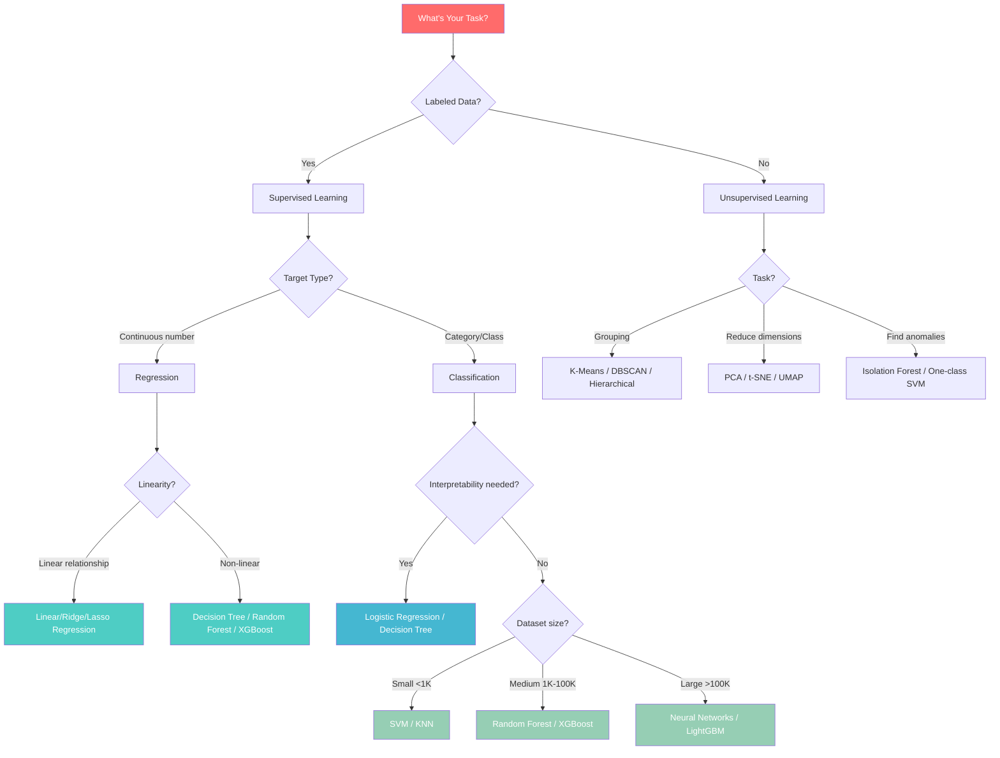
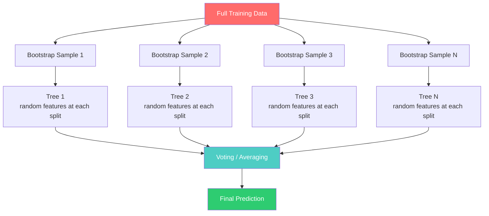

# Phase 9 — ML Algorithms Deep Dive

## Complete Learning & Interview Mastery Guide

---

## Table of Contents

1. [Algorithm Selection Framework](#algorithm-selection-framework)
2. [Linear Regression — Complete Deep Dive](#linear-regression--complete-deep-dive)
3. [Logistic Regression — Classification Workhorse](#logistic-regression--classification-workhorse)
4. [Decision Trees — Interpretable Power](#decision-trees--interpretable-power)
5. [Random Forest — Ensemble Strength](#random-forest--ensemble-strength)
6. [Naive Bayes — Probabilistic Classification](#naive-bayes--probabilistic-classification)
7. [K-Nearest Neighbors (KNN)](#k-nearest-neighbors-knn)
8. [Support Vector Machines (SVM)](#support-vector-machines-svm)
9. [K-Means Clustering](#k-means-clustering)
10. [Algorithm Comparison & Selection](#algorithm-comparison--selection)
11. [Interview Mastery](#interview-mastery)

---

## Algorithm Selection Framework

### How to Choose the Right Algorithm



### Quick Reference Table

| Algorithm | Task | Interpretable | Fast Training | Handles Non-linearity | Feature Scaling |
|-----------|------|:---:|:---:|:---:|:---:|
| Linear Regression | Regression | ✅ | ✅ | ❌ | Required |
| Logistic Regression | Classification | ✅ | ✅ | ❌ | Required |
| Decision Tree | Both | ✅ | ✅ | ✅ | Not needed |
| Random Forest | Both | ⚠️ | ⚠️ | ✅ | Not needed |
| Naive Bayes | Classification | ✅ | ✅ | ❌ | Not needed |
| KNN | Both | ✅ | ❌ | ✅ | Required |
| SVM | Both | ❌ | ❌ | ✅ (kernel) | Required |
| K-Means | Clustering | ✅ | ✅ | ❌ | Required |

---

## Linear Regression — Complete Deep Dive

### Beginner Explanation

Linear regression finds the best straight line (or flat plane in multiple dimensions) through your data points. It predicts a number by assuming the relationship between inputs and output is linear — that is, doubling an input doubles its contribution to the output.

**Real-world analogy:** You know that bigger houses cost more. Linear regression finds exactly how much each extra square foot adds to the price, and how much the base price is.

### Mathematical Foundation

```
Simple Linear Regression (1 feature):
    y = w₁·x + b

Multiple Linear Regression (n features):
    y = w₁·x₁ + w₂·x₂ + ... + wₙ·xₙ + b
    y = Xw + b    (matrix form)

Where:
    y = target variable (what we predict)
    x = features (inputs)
    w = weights/coefficients (learned — how much each feature matters)
    b = bias/intercept (learned — the baseline prediction)
```

### How It Learns — Ordinary Least Squares (OLS)

```
Goal: Find w and b that minimize the sum of squared errors

Loss function (MSE):
    L(w, b) = (1/n) Σᵢ (yᵢ - (w·xᵢ + b))²

Closed-form solution (only algorithm with an exact formula):
    w = (XᵀX)⁻¹ Xᵀy

Or gradient descent (iterative):
    w ← w - α · ∂L/∂w
    b ← b - α · ∂L/∂b

Where:
    ∂L/∂w = -(2/n) Σᵢ xᵢ·(yᵢ - ŷᵢ)
    ∂L/∂b = -(2/n) Σᵢ (yᵢ - ŷᵢ)
```

### Visual Intuition

```
                     y
                     |        x  ← data point
                     |    x /
                     |  x /  ← best fit line (minimizes distances)
                     | /x
                     |/ x
                     +─────────── x_axis
                   b (intercept)

The line minimizes the sum of squared vertical distances
from each point to the line.
```

### Assumptions of Linear Regression

```
1. Linearity:         Relationship between X and y is linear
2. Independence:      Observations are independent of each other
3. Homoscedasticity:  Constant variance of residuals
4. Normality:         Residuals are normally distributed
5. No multicollinearity: Features are not highly correlated with each other
```

### Implementation — From Scratch + Scikit-learn

```python
import numpy as np
import pandas as pd
from sklearn.linear_model import LinearRegression, Ridge, Lasso
from sklearn.preprocessing import StandardScaler, PolynomialFeatures
from sklearn.model_selection import train_test_split
from sklearn.metrics import mean_squared_error, r2_score
import matplotlib.pyplot as plt

# --- From Scratch Implementation ---
class LinearRegressionScratch:
    def __init__(self, learning_rate=0.01, n_iterations=1000):
        self.lr = learning_rate
        self.n_iter = n_iterations
        self.weights = None
        self.bias = None
        self.loss_history = []

    def fit(self, X, y):
        n_samples, n_features = X.shape
        self.weights = np.zeros(n_features)
        self.bias = 0

        for i in range(self.n_iter):
            # Forward pass
            y_pred = X @ self.weights + self.bias

            # Compute gradients
            dw = -(2/n_samples) * (X.T @ (y - y_pred))
            db = -(2/n_samples) * np.sum(y - y_pred)

            # Update parameters
            self.weights -= self.lr * dw
            self.bias -= self.lr * db

            # Track loss
            loss = np.mean((y - y_pred) ** 2)
            self.loss_history.append(loss)

        return self

    def predict(self, X):
        return X @ self.weights + self.bias

# --- Scikit-learn Implementation ---
# Generate data
np.random.seed(42)
X = np.random.randn(200, 3)
true_weights = np.array([3, -2, 0.5])
y = X @ true_weights + 1.5 + np.random.randn(200) * 0.5

X_train, X_test, y_train, y_test = train_test_split(X, y, test_size=0.2, random_state=42)

# Fit models
models = {
    'Linear Regression': LinearRegression(),
    'Ridge (α=1.0)': Ridge(alpha=1.0),
    'Lasso (α=0.1)': Lasso(alpha=0.1)
}

for name, model in models.items():
    model.fit(X_train, y_train)
    y_pred = model.predict(X_test)
    print(f"\n{name}:")
    print(f"  Coefficients: {model.coef_.round(3)}")
    print(f"  Intercept: {model.intercept_:.3f}")
    print(f"  R²: {r2_score(y_test, y_pred):.4f}")
    print(f"  RMSE: {np.sqrt(mean_squared_error(y_test, y_pred)):.4f}")
```

### Polynomial Regression — Handling Non-linearity

```python
# When the true relationship is non-linear
np.random.seed(42)
X = np.sort(np.random.uniform(0, 5, 100)).reshape(-1, 1)
y = 2 * X.ravel()**2 - 3 * X.ravel() + 1 + np.random.randn(100) * 2

fig, axes = plt.subplots(1, 3, figsize=(15, 5))
degrees = [1, 2, 15]

for ax, degree in zip(axes, degrees):
    poly = PolynomialFeatures(degree=degree)
    X_poly = poly.fit_transform(X)

    model = LinearRegression()
    model.fit(X_poly, y)
    y_pred = model.predict(X_poly)

    ax.scatter(X, y, alpha=0.5, s=20)
    ax.plot(X, y_pred, 'r-', linewidth=2)
    r2 = r2_score(y, y_pred)
    ax.set_title(f'Degree {degree} (R²={r2:.3f})')
    ax.grid(True, alpha=0.3)

plt.suptitle('Polynomial Regression: Underfitting → Good Fit → Overfitting')
plt.tight_layout()
plt.show()
# degree=1: underfitting (linear can't capture curvature)
# degree=2: good fit (matches true quadratic)
# degree=15: overfitting (wiggles through noise)
```

### Advantages & Disadvantages

| Advantages | Disadvantages |
|-----------|---------------|
| Simple, interpretable (coefficients = feature importance) | Assumes linear relationship |
| Fast training (closed-form solution) | Sensitive to outliers |
| No hyperparameters (basic version) | Sensitive to multicollinearity |
| Works well when relationship is actually linear | Requires feature scaling for gradient descent |
| Statistical inference (p-values, confidence intervals) | Cannot capture complex non-linear patterns |

### Production Use Cases

- Pricing models (house prices, insurance premiums)
- Sales forecasting (with time features)
- Risk scoring (credit score components)
- Causal inference (with proper experimental design)
- Baseline model for any regression task

---

## Logistic Regression — Classification Workhorse

### Beginner Explanation

Despite its name, logistic regression is a **classification** algorithm (not regression). It predicts the probability that something belongs to a category. Instead of drawing a line through points (linear regression), it draws a line that **separates** two classes and tells you how confident it is about which side a point falls on.

**Real-world analogy:** A doctor looking at test results and saying "there's a 78% chance this is malignant" — that's logistic regression. It gives you a probability, and you decide the cutoff.

### Mathematical Foundation

```
Step 1: Linear combination (same as linear regression)
    z = w₁x₁ + w₂x₂ + ... + wₙxₙ + b

Step 2: Sigmoid function (squashes z into [0, 1] probability)
    P(y=1|x) = σ(z) = 1 / (1 + e⁻ᶻ)

Decision rule:
    ŷ = 1  if P(y=1|x) ≥ threshold (default 0.5)
    ŷ = 0  otherwise
```

### The Sigmoid Function

```
P(y=1)
  1.0 |                    ___________
      |                  /
      |                /
  0.5 |─────────────/──────────────────  ← decision boundary
      |           /
      |         /
  0.0 |________/
      ────────────────────────────────── z
            -6  -4  -2   0   2   4   6

Properties:
- Output always between 0 and 1 (valid probability)
- At z=0, output = 0.5 (maximum uncertainty)
- Large positive z → output ≈ 1 (confident positive)
- Large negative z → output ≈ 0 (confident negative)
```

### Loss Function — Binary Cross-Entropy

```
Why NOT MSE? Because MSE on sigmoid creates a non-convex loss surface
(multiple local minima → gradient descent gets stuck).

Binary Cross-Entropy (Log Loss):
    L = -(1/n) Σ [yᵢ·log(ŷᵢ) + (1-yᵢ)·log(1-ŷᵢ)]

Intuition:
- If y=1 and ŷ=0.99 → loss = -log(0.99) ≈ 0.01 (low — correct!)
- If y=1 and ŷ=0.01 → loss = -log(0.01) ≈ 4.6  (high — very wrong!)
- Penalizes confident WRONG predictions exponentially
```

### Implementation

```python
import numpy as np
from sklearn.linear_model import LogisticRegression
from sklearn.datasets import make_classification
from sklearn.model_selection import train_test_split
from sklearn.metrics import classification_report, roc_auc_score
from sklearn.preprocessing import StandardScaler

# --- From Scratch ---
class LogisticRegressionScratch:
    def __init__(self, learning_rate=0.01, n_iterations=1000):
        self.lr = learning_rate
        self.n_iter = n_iterations

    def sigmoid(self, z):
        return 1 / (1 + np.exp(-np.clip(z, -500, 500)))

    def fit(self, X, y):
        n_samples, n_features = X.shape
        self.weights = np.zeros(n_features)
        self.bias = 0

        for _ in range(self.n_iter):
            z = X @ self.weights + self.bias
            y_pred = self.sigmoid(z)

            # Gradients (derived from binary cross-entropy)
            dw = (1/n_samples) * (X.T @ (y_pred - y))
            db = (1/n_samples) * np.sum(y_pred - y)

            self.weights -= self.lr * dw
            self.bias -= self.lr * db

    def predict_proba(self, X):
        z = X @ self.weights + self.bias
        return self.sigmoid(z)

    def predict(self, X, threshold=0.5):
        return (self.predict_proba(X) >= threshold).astype(int)

# --- Scikit-learn ---
X, y = make_classification(n_samples=1000, n_features=10, n_informative=5,
                           random_state=42)
X_train, X_test, y_train, y_test = train_test_split(X, y, test_size=0.2,
                                                     stratify=y, random_state=42)
scaler = StandardScaler()
X_train_s = scaler.fit_transform(X_train)
X_test_s = scaler.transform(X_test)

# Logistic Regression with different regularization
models = {
    'No regularization': LogisticRegression(penalty=None, max_iter=1000),
    'L2 (Ridge, C=1)': LogisticRegression(penalty='l2', C=1.0, max_iter=1000),
    'L1 (Lasso, C=1)': LogisticRegression(penalty='l1', C=1.0, solver='saga', max_iter=1000),
    'L2 (strong, C=0.01)': LogisticRegression(penalty='l2', C=0.01, max_iter=1000)
}

for name, model in models.items():
    model.fit(X_train_s, y_train)
    y_pred = model.predict(X_test_s)
    y_prob = model.predict_proba(X_test_s)[:, 1]
    auc = roc_auc_score(y_test, y_prob)
    n_nonzero = np.sum(np.abs(model.coef_[0]) > 0.01)
    print(f"{name:<25} | AUC: {auc:.4f} | Non-zero features: {n_nonzero}")
```

### Multi-Class Logistic Regression

```python
# One-vs-Rest (OvR): Train K binary classifiers
# One-vs-One (OvO): Train K(K-1)/2 pairwise classifiers
# Softmax (multinomial): Single model, K outputs that sum to 1

from sklearn.datasets import load_iris
from sklearn.linear_model import LogisticRegression

X, y = load_iris(return_X_y=True)
X_train, X_test, y_train, y_test = train_test_split(X, y, test_size=0.2, random_state=42)

# Multinomial (softmax) — recommended for multi-class
model = LogisticRegression(multi_class='multinomial', solver='lbfgs', max_iter=200)
model.fit(X_train, y_train)

print(f"Accuracy: {model.score(X_test, y_test):.4f}")
print(f"Class probabilities for first sample: {model.predict_proba(X_test[:1]).round(3)}")
```

### Advantages & Disadvantages

| Advantages | Disadvantages |
|-----------|---------------|
| Outputs calibrated probabilities | Assumes linear decision boundary |
| Highly interpretable (coefficients = log-odds) | Can't capture complex interactions |
| Fast training and inference | Requires feature scaling |
| Strong baseline for classification | Sensitive to outliers (though less than LR) |
| Works well in high-dimensions with regularization | Needs feature engineering for non-linearity |
| Handles multi-class natively (softmax) | Assumes features are somewhat independent |

### Production Use Cases

- Credit scoring (probability of default)
- Medical diagnosis (disease probability)
- Click-through rate prediction
- Spam detection
- Any binary classification baseline
- A/B test analysis (conversion probability)

---

## Decision Trees — Interpretable Power

### Beginner Explanation

A decision tree makes predictions by asking a series of yes/no questions about the data, like a game of "20 Questions." At each step, it picks the question that best separates the data, eventually reaching a final prediction at the bottom.

**Real-world analogy:** A doctor's diagnostic process: "Is the patient over 60? → Yes → Do they have chest pain? → Yes → Is their blood pressure high? → Likely heart disease."

### How Decision Trees Learn — Recursive Splitting

```
Algorithm (CART — Classification and Regression Trees):

1. Start with ALL data at root node
2. For each feature and each possible threshold:
   a. Split data into left (≤ threshold) and right (> threshold)
   b. Measure the "impurity" reduction (information gain)
3. Pick the split that gives maximum impurity reduction
4. Repeat recursively on left and right child nodes
5. Stop when: max_depth reached, min_samples_leaf, or node is pure

Result: A tree of if-then rules
```

### Splitting Criteria — How Trees Choose Questions

```python
import numpy as np

# --- GINI IMPURITY (Classification, default in sklearn) ---
# Measures probability of misclassifying a randomly chosen sample
# Gini = 1 - Σ pᵢ²
def gini_impurity(labels):
    _, counts = np.unique(labels, return_counts=True)
    probs = counts / counts.sum()
    return 1 - np.sum(probs ** 2)

# Pure node (all same class): Gini = 0
print(f"Pure [1,1,1,1]: Gini = {gini_impurity([1,1,1,1]):.3f}")
# Maximum impurity (50/50 binary): Gini = 0.5
print(f"Mixed [0,0,1,1]: Gini = {gini_impurity([0,0,1,1]):.3f}")

# --- ENTROPY / INFORMATION GAIN (Classification) ---
# Entropy = -Σ pᵢ · log₂(pᵢ)
def entropy(labels):
    _, counts = np.unique(labels, return_counts=True)
    probs = counts / counts.sum()
    return -np.sum(probs * np.log2(probs + 1e-10))

# Information Gain = Entropy(parent) - weighted_avg(Entropy(children))
def information_gain(parent, left_child, right_child):
    n = len(parent)
    n_left, n_right = len(left_child), len(right_child)
    ig = entropy(parent) - (n_left/n * entropy(left_child) + n_right/n * entropy(right_child))
    return ig

# --- MSE REDUCTION (Regression trees) ---
# Split that minimizes within-group variance
def mse_split_quality(y_left, y_right):
    mse_left = np.var(y_left) * len(y_left)
    mse_right = np.var(y_right) * len(y_right)
    return mse_left + mse_right  # lower is better
```

### Gini vs Entropy Comparison

```
Gini Impurity:                 Entropy:
- Range: [0, 0.5] for binary  - Range: [0, 1.0] for binary
- Faster to compute (no log)  - Slightly more balanced splits
- Default in sklearn           - Slightly slower
- In practice: nearly identical results

Both reach 0 when node is pure (all same class)
Both are maximized when classes are equally mixed
```

### Visual Example of a Decision Tree

```
                    [Is income > 50K?]
                   /                    \
                 Yes                     No
                /                         \
    [Credit score > 700?]         [Has existing loan?]
       /          \                  /           \
     Yes          No               Yes           No
      |            |                |             |
   APPROVE     [Age > 30?]      REJECT       [Age > 25?]
               /        \                    /         \
             Yes        No                 Yes         No
              |          |                  |           |
           APPROVE    REJECT             APPROVE     REJECT
```

### Implementation

```python
from sklearn.tree import DecisionTreeClassifier, DecisionTreeRegressor
from sklearn.tree import export_text, plot_tree
from sklearn.datasets import make_classification
from sklearn.model_selection import train_test_split
import matplotlib.pyplot as plt

# Generate data
X, y = make_classification(n_samples=1000, n_features=10, n_informative=5,
                           random_state=42)
X_train, X_test, y_train, y_test = train_test_split(X, y, test_size=0.2, random_state=42)

# Train with different depths (controls complexity)
depths = [2, 5, 10, None]
for depth in depths:
    tree = DecisionTreeClassifier(max_depth=depth, random_state=42)
    tree.fit(X_train, y_train)
    train_acc = tree.score(X_train, y_train)
    test_acc = tree.score(X_test, y_test)
    print(f"Depth={str(depth):<5} | Train: {train_acc:.4f} | Test: {test_acc:.4f} | "
          f"Nodes: {tree.tree_.node_count} | Leaves: {tree.get_n_leaves()}")

# Best model with regularization
best_tree = DecisionTreeClassifier(
    max_depth=5,
    min_samples_split=10,     # minimum samples to split a node
    min_samples_leaf=5,       # minimum samples in a leaf node
    max_features='sqrt',      # consider √n features per split
    random_state=42
)
best_tree.fit(X_train, y_train)
print(f"\nBest tree test accuracy: {best_tree.score(X_test, y_test):.4f}")

# Print tree rules (interpretability!)
feature_names = [f'feature_{i}' for i in range(10)]
print("\nTree Rules:")
print(export_text(best_tree, feature_names=feature_names, max_depth=3))

# Visualize tree
plt.figure(figsize=(20, 10))
plot_tree(best_tree, feature_names=feature_names,
          class_names=['Class 0', 'Class 1'],
          filled=True, rounded=True, max_depth=3)
plt.tight_layout()
plt.show()

# Feature importance
importances = best_tree.feature_importances_
for name, imp in sorted(zip(feature_names, importances), key=lambda x: -x[1]):
    if imp > 0.01:
        print(f"  {name}: {imp:.4f}")
```

### Controlling Overfitting (Hyperparameters)

```python
# Decision tree hyperparameters for regularization:

DecisionTreeClassifier(
    max_depth=5,              # Maximum tree depth (most important!)
    min_samples_split=10,     # Min samples required to split a node
    min_samples_leaf=5,       # Min samples in a leaf node
    max_features='sqrt',      # Features considered per split
    max_leaf_nodes=50,        # Maximum number of leaf nodes
    min_impurity_decrease=0.01,  # Min impurity decrease for a split
    ccp_alpha=0.01            # Cost-complexity pruning (post-pruning)
)

# Pre-pruning (stop growing early): max_depth, min_samples_split/leaf
# Post-pruning (grow full tree, then prune back): ccp_alpha
```

### Advantages & Disadvantages

| Advantages | Disadvantages |
|-----------|---------------|
| Highly interpretable (visualize as tree) | Prone to overfitting (high variance) |
| No feature scaling needed | Unstable (small data changes → different tree) |
| Handles mixed feature types | Biased toward features with many levels |
| Captures non-linear relationships | Cannot extrapolate beyond training range |
| Fast training and inference | Greedy algorithm (locally optimal, not global) |
| Natural feature importance | Single tree rarely competitive with ensembles |
| Handles missing values (some implementations) | Axis-aligned splits (can't capture diagonal boundaries easily) |

---

## Random Forest — Ensemble Strength

### Beginner Explanation

A Random Forest is a "committee" of many decision trees that vote on the answer. Each tree is trained on a slightly different random subset of data and features, making them diverse. The final prediction is the majority vote (classification) or average (regression) of all trees. By combining many "weak" trees, you get a strong, stable model.

**Real-world analogy:** Instead of asking one expert for a diagnosis, you ask 100 independent doctors (each with slightly different training), and go with the majority opinion. Even if individual doctors make mistakes, the group rarely does.

### How Random Forest Works

```
BAGGING (Bootstrap Aggregating):
1. Create N bootstrap samples (random subsets with replacement)
2. Train one decision tree on each bootstrap sample
3. Each tree also considers random subset of features at each split
4. Final prediction = majority vote (classification) or average (regression)

Why it works:
- Bootstrap samples → different trees see different data (reduces variance)
- Random features → trees are decorrelated (reduces overfitting)
- Averaging → cancels out individual tree errors
```



### Mathematical Insight — Why Ensembles Reduce Variance

```
For N independent models with variance σ²:
    Variance of average = σ² / N

If models are correlated (ρ):
    Variance of average = ρ·σ² + (1-ρ)·σ²/N

Key insight:
- More trees (larger N) → lower variance (second term → 0)
- Less correlated trees (lower ρ) → lower variance (first term smaller)
- Random feature selection decorrelates trees → lower ρ → better!
```

### Implementation

```python
from sklearn.ensemble import RandomForestClassifier, RandomForestRegressor
from sklearn.model_selection import train_test_split, cross_val_score
from sklearn.datasets import make_classification
import numpy as np
import matplotlib.pyplot as plt

# Generate data
X, y = make_classification(n_samples=2000, n_features=20, n_informative=10,
                           n_redundant=5, random_state=42)
X_train, X_test, y_train, y_test = train_test_split(X, y, test_size=0.2, random_state=42)

# --- Basic Random Forest ---
rf = RandomForestClassifier(
    n_estimators=100,         # number of trees (more = better, diminishing returns)
    max_depth=10,             # max depth of each tree
    min_samples_split=5,      # min samples to split
    min_samples_leaf=2,       # min samples in leaf
    max_features='sqrt',      # features per split: √n for classification, n/3 for regression
    bootstrap=True,           # use bootstrap sampling
    oob_score=True,           # out-of-bag score (free validation!)
    n_jobs=-1,                # use all CPU cores
    random_state=42
)
rf.fit(X_train, y_train)

print(f"Train accuracy: {rf.score(X_train, y_train):.4f}")
print(f"Test accuracy:  {rf.score(X_test, y_test):.4f}")
print(f"OOB score:      {rf.oob_score_:.4f}")  # ~unbiased estimate without validation set

# --- Effect of n_estimators ---
n_trees_range = [1, 5, 10, 25, 50, 100, 200, 500]
train_scores = []
test_scores = []

for n_trees in n_trees_range:
    rf_temp = RandomForestClassifier(n_estimators=n_trees, max_depth=10, random_state=42)
    rf_temp.fit(X_train, y_train)
    train_scores.append(rf_temp.score(X_train, y_train))
    test_scores.append(rf_temp.score(X_test, y_test))

plt.figure(figsize=(10, 6))
plt.plot(n_trees_range, train_scores, 'b-o', label='Train')
plt.plot(n_trees_range, test_scores, 'r-o', label='Test')
plt.xlabel('Number of Trees')
plt.ylabel('Accuracy')
plt.title('Random Forest: More Trees → Better (with diminishing returns)')
plt.legend()
plt.grid(True, alpha=0.3)
plt.xscale('log')
plt.show()
```

### Feature Importance

```python
# Random Forest provides two types of feature importance:

# 1. Impurity-based (default) — mean decrease in Gini/entropy across all splits
importances = rf.feature_importances_
feature_names = [f'feature_{i}' for i in range(20)]

sorted_idx = np.argsort(importances)[-10:]  # top 10
plt.figure(figsize=(10, 6))
plt.barh(range(10), importances[sorted_idx])
plt.yticks(range(10), [feature_names[i] for i in sorted_idx])
plt.xlabel('Feature Importance (Gini)')
plt.title('Top 10 Feature Importances')
plt.tight_layout()
plt.show()

# 2. Permutation importance (more reliable — shuffle feature, measure performance drop)
from sklearn.inspection import permutation_importance

perm_importance = permutation_importance(rf, X_test, y_test, n_repeats=10, random_state=42)
sorted_idx = perm_importance.importances_mean.argsort()[-10:]

plt.figure(figsize=(10, 6))
plt.boxplot(perm_importance.importances[sorted_idx].T, vert=False,
            labels=[feature_names[i] for i in sorted_idx])
plt.xlabel('Decrease in Accuracy')
plt.title('Permutation Feature Importance')
plt.tight_layout()
plt.show()
```

### Out-of-Bag (OOB) Score — Free Validation

```
Each tree is trained on ~63% of data (bootstrap).
The other ~37% (out-of-bag) is never seen by that tree.

OOB estimate:
- For each sample, collect predictions from trees that DIDN'T train on it
- Aggregate those predictions → OOB prediction
- Compare to true label → OOB score

Benefits:
- No need for separate validation set!
- Unbiased estimate of generalization performance
- Automatically available (set oob_score=True)
```

### Advantages & Disadvantages

| Advantages | Disadvantages |
|-----------|---------------|
| Excellent accuracy (top performer for tabular data) | Less interpretable than single tree |
| Low overfitting risk (ensemble averaging) | Slower training than single tree |
| No feature scaling needed | Large model size (stores all trees) |
| Built-in feature importance | Cannot extrapolate beyond training range |
| Handles high-dimensional data well | Slower inference than linear models |
| Parallel training (n_jobs=-1) | Hyperparameter tuning still needed |
| OOB score = free validation | Can still overfit on noisy data |
| Robust to outliers | |

---

## Naive Bayes — Probabilistic Classification

### Beginner Explanation

Naive Bayes uses probability (Bayes' theorem) to predict classes. It looks at the features and asks: "Given these feature values, what's the most probable class?" It's called "naive" because it assumes all features are independent of each other — a simplification that's usually wrong but works surprisingly well in practice, especially for text.

**Real-world analogy:** A spam filter that notices spam emails tend to have words like "free," "winner," "click" — and calculates the probability that an email is spam based on which of these words appear, treating each word independently.

### Mathematical Foundation — Bayes' Theorem

```
Bayes' Theorem:
    P(class | features) = P(features | class) × P(class) / P(features)

    posterior = likelihood × prior / evidence

For classification (pick class with highest posterior):
    ŷ = argmax P(class_k) × P(x₁|class_k) × P(x₂|class_k) × ... × P(xₙ|class_k)
         k

The "naive" assumption:
    P(x₁, x₂, ..., xₙ | class) = P(x₁|class) × P(x₂|class) × ... × P(xₙ|class)
    
    (Features are conditionally independent given the class — usually not true!)
```

### Types of Naive Bayes

```python
from sklearn.naive_bayes import GaussianNB, MultinomialNB, BernoulliNB

# 1. GaussianNB — continuous features assumed normally distributed
#    Use for: general numeric data
gaussian_nb = GaussianNB()

# 2. MultinomialNB — features are counts/frequencies
#    Use for: text classification (word counts), document classification
multinomial_nb = MultinomialNB(alpha=1.0)  # alpha = Laplace smoothing

# 3. BernoulliNB — features are binary (0/1)
#    Use for: text (word present/absent), binary features
bernoulli_nb = BernoulliNB(alpha=1.0)
```

### Text Classification with Naive Bayes

```python
from sklearn.feature_extraction.text import CountVectorizer, TfidfVectorizer
from sklearn.naive_bayes import MultinomialNB
from sklearn.pipeline import Pipeline
from sklearn.model_selection import train_test_split
from sklearn.metrics import classification_report

# Sample text data (spam detection)
texts = [
    "Free money! Click here to win big prizes now",
    "Congratulations you won a free iPhone click to claim",
    "URGENT: your account will be suspended unless you act now",
    "Hey, want to grab lunch tomorrow at noon?",
    "Meeting rescheduled to 3pm. See you in conference room B",
    "Can you review the pull request I sent this morning?",
    "Limited time offer! Buy one get one free!!!",
    "Your prescription is ready for pickup at the pharmacy",
    "Team standup notes: sprint goals discussed, new features planned",
    "WINNER! You have been selected for a cash prize of $1000",
    "Remember to submit your timesheet by end of day Friday",
    "Make $$$ fast working from home! No experience needed!!!"
]
labels = [1, 1, 1, 0, 0, 0, 1, 0, 0, 1, 0, 1]  # 1=spam, 0=ham

# Pipeline: Vectorize text → Naive Bayes
spam_pipeline = Pipeline([
    ('vectorizer', TfidfVectorizer(stop_words='english', max_features=5000)),
    ('classifier', MultinomialNB(alpha=0.1))
])

# In production you'd have thousands of samples — this is a demo
spam_pipeline.fit(texts, labels)

# Predict new emails
new_emails = [
    "You won a lottery! Claim your prize now",
    "Please review the attached document for tomorrow's meeting"
]
predictions = spam_pipeline.predict(new_emails)
probabilities = spam_pipeline.predict_proba(new_emails)

for email, pred, prob in zip(new_emails, predictions, probabilities):
    label = "SPAM" if pred == 1 else "HAM"
    print(f"[{label}] ({prob[pred]:.2f}) {email[:50]}")
```

### Why "Naive" Works

```
The independence assumption is almost always violated:
- "New York" — "New" and "York" are clearly dependent
- Age and income are correlated

But Naive Bayes still works because:
1. We only need the RANKING of P(class|features) to be correct
   (not the exact probabilities)
2. Errors from independence assumption often cancel out
3. With enough features, the correct class dominates
4. Works extremely well for text (high-dimensional, sparse features)
```

### Advantages & Disadvantages

| Advantages | Disadvantages |
|-----------|---------------|
| Extremely fast training and prediction | Independence assumption rarely true |
| Works well with small datasets | Probability estimates are poorly calibrated |
| Excellent for text/NLP classification | Can be outperformed by modern models |
| Handles high-dimensional data naturally | Zero-frequency problem (needs smoothing) |
| No hyperparameter tuning needed | Can't learn feature interactions |
| Strong baseline for text classification | Assumes specific feature distribution |

---

## K-Nearest Neighbors (KNN)

### Beginner Explanation

KNN is the simplest ML algorithm: to predict for a new point, find the K closest points in the training data and use their labels as the answer. For classification, take a majority vote; for regression, take the average.

**Real-world analogy:** You move to a new neighborhood and want to predict your house price. KNN says: "Look at the 5 most similar houses nearby. Their average price is your prediction." Simple, intuitive, and often effective.

### How KNN Works

```
Training: Do literally nothing (just store the data) — "lazy learner"

Prediction for new point x_new:
1. Compute distance from x_new to ALL training points
2. Find the K nearest neighbors
3. Classification: majority vote of K neighbors' labels
4. Regression: average (or weighted average) of K neighbors' values
```

```
Example (K=3, classification):

        o        ← new point (what class?)
       / \
      /   \
     x     △      ← 3 nearest neighbors: 2 circles, 1 triangle
      \   /
       ● ●        (other points — further away, don't count)
    
    Prediction: Circle (2 votes vs 1) — majority wins
```

### Distance Metrics

```python
import numpy as np

# Euclidean distance (L2) — most common
def euclidean(a, b):
    return np.sqrt(np.sum((a - b) ** 2))

# Manhattan distance (L1) — for grid-like problems
def manhattan(a, b):
    return np.sum(np.abs(a - b))

# Minkowski distance (general — p=2 is Euclidean, p=1 is Manhattan)
def minkowski(a, b, p=2):
    return np.sum(np.abs(a - b) ** p) ** (1/p)

# Cosine distance — for text/sparse high-dimensional data
def cosine_distance(a, b):
    return 1 - np.dot(a, b) / (np.linalg.norm(a) * np.linalg.norm(b))
```

### Choosing K — The Critical Hyperparameter

```
K=1:  Very flexible, captures local patterns, HIGH VARIANCE (overfitting)
      Decision boundary is very jagged
      
K=N:  Predicts majority class always, HIGH BIAS (underfitting)
      No decision boundary at all

Sweet spot: Usually K = √n (square root of training size) as starting point
            Then tune with cross-validation
            
Rule: Use ODD K for binary classification (avoids ties)
```

### Implementation

```python
from sklearn.neighbors import KNeighborsClassifier
from sklearn.preprocessing import StandardScaler
from sklearn.model_selection import train_test_split, cross_val_score
from sklearn.datasets import make_classification
import numpy as np
import matplotlib.pyplot as plt

# Generate data
X, y = make_classification(n_samples=500, n_features=10, random_state=42)
X_train, X_test, y_train, y_test = train_test_split(X, y, test_size=0.2, random_state=42)

# CRITICAL: KNN requires scaling (distance-based!)
scaler = StandardScaler()
X_train_s = scaler.fit_transform(X_train)
X_test_s = scaler.transform(X_test)

# Find optimal K
k_range = range(1, 31, 2)  # odd numbers only
cv_scores = []

for k in k_range:
    knn = KNeighborsClassifier(n_neighbors=k)
    scores = cross_val_score(knn, X_train_s, y_train, cv=5, scoring='accuracy')
    cv_scores.append(scores.mean())

best_k = list(k_range)[np.argmax(cv_scores)]
print(f"Best K: {best_k} (CV accuracy: {max(cv_scores):.4f})")

# Plot K vs accuracy
plt.figure(figsize=(10, 6))
plt.plot(list(k_range), cv_scores, 'bo-')
plt.axvline(x=best_k, color='red', linestyle='--', label=f'Best K={best_k}')
plt.xlabel('K (number of neighbors)')
plt.ylabel('Cross-Validation Accuracy')
plt.title('KNN: Choosing Optimal K')
plt.legend()
plt.grid(True, alpha=0.3)
plt.show()

# Final model with best K
knn_best = KNeighborsClassifier(
    n_neighbors=best_k,
    weights='distance',    # weight closer neighbors more
    metric='euclidean',
    n_jobs=-1
)
knn_best.fit(X_train_s, y_train)
print(f"Test accuracy: {knn_best.score(X_test_s, y_test):.4f}")
```

### Advantages & Disadvantages

| Advantages | Disadvantages |
|-----------|---------------|
| Simplest algorithm — no training phase | Slow inference: O(nd) per prediction |
| No assumptions about data distribution | Requires feature scaling |
| Naturally handles multi-class | Curse of dimensionality (fails in high-d) |
| Non-parametric (flexible boundary) | Must store all training data (memory) |
| Easy to understand and explain | Sensitive to irrelevant features |
| Good for small datasets | Sensitive to imbalanced classes |

### Production Use Cases

- Recommendation systems (find similar users/items)
- Anomaly detection (points far from all neighbors)
- Imputation (fill missing values from neighbors)
- Image classification (small datasets)
- Baseline model (sanity check)

---

## Support Vector Machines (SVM)

### Beginner Explanation

SVM finds the **best boundary line** (hyperplane) that separates two classes with the **maximum margin** — the widest possible gap between the closest points of each class. It focuses on the "hard cases" (points near the boundary, called support vectors) rather than points that are clearly on one side.

**Real-world analogy:** You're drawing a line between two groups of people in a room. SVM draws the line that keeps the maximum safe distance from both groups. The people standing closest to the line (the "support vectors") are the only ones that determine where the line goes.

### Mathematical Foundation

```
Goal: Find hyperplane w·x + b = 0 that maximizes margin

The margin is: 2 / ||w||

Optimization problem:
    minimize  (1/2)||w||²
    subject to  yᵢ(w·xᵢ + b) ≥ 1  for all i

Where:
- w = weight vector (defines hyperplane orientation)
- b = bias (shifts hyperplane)
- yᵢ ∈ {-1, +1} = class labels
- Support vectors: points where yᵢ(w·xᵢ + b) = 1 (exactly on margin)
```

### Visual Intuition

```
        Class +1                    Class -1
          x x x                     o o o
         x x x x                   o o o o
        x x x x x    ← MARGIN →  o o o o o
         x x x [x]  |         |  [o] o o
          x x x     |  w·x+b=0 |   o o
                     |         |
                 margin    margin
                     
    [x] and [o] = support vectors (determine the boundary)
    All other points don't affect the model at all!
```

### The Kernel Trick — Non-Linear SVM

```
Problem: Data isn't always linearly separable in original space
Solution: Map to higher dimensions where it IS separable

Original space (2D):           Transformed space (3D):
   o o o                          o    o
 o   x x  o                     /  x x  \
o  x x x x  o                  o  x x x x  o   ← NOW separable!
 o   x x  o                     \  x x  /
   o o o                          o    o

The kernel trick: compute dot products in high-D space
WITHOUT actually transforming the data (computationally efficient)
```

### Common Kernels

```python
from sklearn.svm import SVC
import numpy as np

# Linear kernel: K(x, y) = x · y
# Use when: data is linearly separable, high-dimensional (text)
svm_linear = SVC(kernel='linear', C=1.0)

# RBF (Gaussian) kernel: K(x, y) = exp(-γ||x-y||²)
# Use when: non-linear boundaries, DEFAULT choice
svm_rbf = SVC(kernel='rbf', C=1.0, gamma='scale')

# Polynomial kernel: K(x, y) = (γ·x·y + r)^d
# Use when: interaction effects between features
svm_poly = SVC(kernel='poly', degree=3, C=1.0)

# Key hyperparameters:
# C (regularization): High C → tight boundary (may overfit)
#                     Low C → wide margin (more errors allowed)
# gamma (RBF): High γ → complex boundary (overfitting risk)
#              Low γ → smooth boundary (underfitting risk)
```

### Implementation

```python
from sklearn.svm import SVC
from sklearn.preprocessing import StandardScaler
from sklearn.model_selection import train_test_split, GridSearchCV
from sklearn.datasets import make_classification, make_moons
from sklearn.metrics import classification_report
import numpy as np

# Non-linear dataset (moons shape)
X, y = make_moons(n_samples=500, noise=0.2, random_state=42)
X_train, X_test, y_train, y_test = train_test_split(X, y, test_size=0.2, random_state=42)

# CRITICAL: SVM requires feature scaling
scaler = StandardScaler()
X_train_s = scaler.fit_transform(X_train)
X_test_s = scaler.transform(X_test)

# Compare kernels
kernels = ['linear', 'rbf', 'poly']
for kernel in kernels:
    svm = SVC(kernel=kernel, random_state=42)
    svm.fit(X_train_s, y_train)
    acc = svm.score(X_test_s, y_test)
    n_sv = svm.n_support_.sum()
    print(f"Kernel: {kernel:<8} | Accuracy: {acc:.4f} | Support vectors: {n_sv}")

# Hyperparameter tuning for RBF SVM
param_grid = {
    'C': [0.01, 0.1, 1, 10, 100],
    'gamma': ['scale', 'auto', 0.01, 0.1, 1]
}

grid_search = GridSearchCV(SVC(kernel='rbf'), param_grid, cv=5, scoring='accuracy', n_jobs=-1)
grid_search.fit(X_train_s, y_train)

print(f"\nBest params: {grid_search.best_params_}")
print(f"Best CV accuracy: {grid_search.best_score_:.4f}")
print(f"Test accuracy: {grid_search.score(X_test_s, y_test):.4f}")
```

### SVM for Probability Estimation

```python
# Standard SVM doesn't output probabilities — only class predictions
# probability=True fits Platt scaling on top (slower but gives probabilities)
svm_prob = SVC(kernel='rbf', probability=True, random_state=42)
svm_prob.fit(X_train_s, y_train)
probs = svm_prob.predict_proba(X_test_s)
print(f"Prediction probabilities (first 3): {probs[:3].round(3)}")
```

### Advantages & Disadvantages

| Advantages | Disadvantages |
|-----------|---------------|
| Excellent for high-dimensional data | Slow on large datasets: O(n²) to O(n³) |
| Effective when n_features > n_samples | Requires careful feature scaling |
| Memory efficient (only stores support vectors) | Hard to interpret (black box with kernel) |
| Kernel trick handles non-linearity | Hyperparameter tuning (C, γ) is critical |
| Strong theoretical foundation | No native probability estimates |
| Works well with clear margins | Doesn't handle noisy data well (overlapping classes) |

### Production Use Cases

- Text classification (linear kernel with TF-IDF)
- Image classification (before deep learning era)
- Bioinformatics (gene expression classification)
- Anomaly detection (One-class SVM)
- Small-to-medium datasets with clear separation

---

## K-Means Clustering

### Beginner Explanation

K-Means divides data into K groups by finding K center points ("centroids") and assigning each data point to its nearest centroid. It iteratively adjusts the centroids until they stabilize. You tell it how many groups (K) to find, and it finds the best grouping.

**Real-world analogy:** You're organizing a large office into K teams. Place K managers randomly, assign each employee to their nearest manager, then each manager moves to the center of their team. Repeat until teams stabilize.

### Algorithm — Step by Step

```
K-Means Algorithm:

1. INITIALIZE: Randomly place K centroids in the feature space
2. ASSIGN: Each data point → nearest centroid (Euclidean distance)
3. UPDATE: Move each centroid to the mean of its assigned points
4. REPEAT: Steps 2-3 until centroids don't move (convergence)

Converges when: Assignments don't change OR max iterations reached
Time complexity: O(n · k · d · i)  where i = iterations
```

```
Iteration 1:        Iteration 2:        Iteration 3 (converged):
    * ← centroid       * moved →  *        * final position
   x x x             x x x               x x x
  x   x x           x   x x             x * x x
 x x x               x x x               x x x

Points get reassigned → centroids move → repeat
```

### Implementation — From Scratch + Scikit-learn

```python
import numpy as np
import matplotlib.pyplot as plt
from sklearn.cluster import KMeans
from sklearn.preprocessing import StandardScaler
from sklearn.metrics import silhouette_score, silhouette_samples

# --- From Scratch ---
class KMeansScratch:
    def __init__(self, k=3, max_iters=100, tol=1e-4):
        self.k = k
        self.max_iters = max_iters
        self.tol = tol

    def fit(self, X):
        n_samples = X.shape[0]
        # Initialize centroids using K-Means++ (smarter initialization)
        self.centroids = self._kmeans_plus_plus(X)

        for iteration in range(self.max_iters):
            # Assign points to nearest centroid
            distances = self._compute_distances(X)
            self.labels = np.argmin(distances, axis=1)

            # Update centroids
            new_centroids = np.array([X[self.labels == k].mean(axis=0)
                                     for k in range(self.k)])

            # Check convergence
            if np.all(np.abs(new_centroids - self.centroids) < self.tol):
                break
            self.centroids = new_centroids

        self.inertia_ = self._compute_inertia(X)
        return self

    def predict(self, X):
        distances = self._compute_distances(X)
        return np.argmin(distances, axis=1)

    def _compute_distances(self, X):
        return np.array([np.sqrt(np.sum((X - c) ** 2, axis=1))
                        for c in self.centroids]).T

    def _compute_inertia(self, X):
        return sum(np.sum((X[self.labels == k] - self.centroids[k]) ** 2)
                  for k in range(self.k))

    def _kmeans_plus_plus(self, X):
        centroids = [X[np.random.randint(len(X))]]
        for _ in range(1, self.k):
            distances = np.min([np.sum((X - c) ** 2, axis=1) for c in centroids], axis=0)
            probs = distances / distances.sum()
            new_centroid = X[np.random.choice(len(X), p=probs)]
            centroids.append(new_centroid)
        return np.array(centroids)

# --- Scikit-learn ---
np.random.seed(42)
# Create 3 clusters
X = np.vstack([
    np.random.randn(200, 2) * 0.5 + [2, 2],
    np.random.randn(200, 2) * 0.8 + [-2, -1],
    np.random.randn(200, 2) * 0.6 + [0, -3]
])

# Scale (important for K-Means!)
scaler = StandardScaler()
X_scaled = scaler.fit_transform(X)

# Fit K-Means
kmeans = KMeans(n_clusters=3, init='k-means++', n_init=10, random_state=42)
labels = kmeans.fit_predict(X_scaled)

print(f"Inertia: {kmeans.inertia_:.2f}")
print(f"Silhouette Score: {silhouette_score(X_scaled, labels):.3f}")
print(f"Iterations: {kmeans.n_iter_}")
```

### Finding Optimal K

```python
# Method 1: Elbow Method (inertia)
# Method 2: Silhouette Score (cluster quality)
# Method 3: Gap Statistic (compare to random uniform data)

K_range = range(2, 11)
inertias = []
silhouette_scores = []

for k in K_range:
    km = KMeans(n_clusters=k, random_state=42, n_init=10)
    labels = km.fit_predict(X_scaled)
    inertias.append(km.inertia_)
    silhouette_scores.append(silhouette_score(X_scaled, labels))

fig, axes = plt.subplots(1, 2, figsize=(12, 5))

# Elbow plot
axes[0].plot(K_range, inertias, 'bo-', linewidth=2)
axes[0].set_xlabel('K')
axes[0].set_ylabel('Inertia (within-cluster sum of squares)')
axes[0].set_title('Elbow Method')
axes[0].grid(True, alpha=0.3)

# Silhouette scores
axes[1].plot(K_range, silhouette_scores, 'ro-', linewidth=2)
axes[1].set_xlabel('K')
axes[1].set_ylabel('Silhouette Score')
axes[1].set_title('Silhouette Analysis')
axes[1].grid(True, alpha=0.3)

plt.tight_layout()
plt.show()

# Best K = where silhouette is highest (or elbow bend)
best_k = list(K_range)[np.argmax(silhouette_scores)]
print(f"Optimal K: {best_k}")
```

### K-Means Limitations

```
K-Means FAILS when:
1. Clusters are non-spherical (elongated, irregular shapes)
   → Use DBSCAN or Gaussian Mixture Models instead

2. Clusters have very different sizes
   → K-Means tends to split large clusters

3. Clusters have different densities
   → DBSCAN handles this better

4. Number of clusters is unknown
   → Try DBSCAN (finds K automatically) or use elbow/silhouette

5. Outliers present
   → K-Means assigns them to nearest cluster, distorting centroids
   → Use K-Medoids or DBSCAN (labels outliers as noise)
```

### Advantages & Disadvantages

| Advantages | Disadvantages |
|-----------|---------------|
| Simple, fast, scalable O(nkd) | Must specify K in advance |
| Guaranteed convergence | Sensitive to initialization (use k-means++) |
| Works well for spherical clusters | Only finds spherical clusters |
| Easy to interpret (centroids = cluster profile) | Sensitive to outliers |
| Scales to large datasets | Sensitive to feature scaling |
| Good starting point for segmentation | May converge to local minimum |

---

## Algorithm Comparison & Selection

### Head-to-Head Comparison

```python
import numpy as np
import pandas as pd
from sklearn.model_selection import cross_val_score
from sklearn.preprocessing import StandardScaler
from sklearn.pipeline import make_pipeline
from sklearn.datasets import make_classification

from sklearn.linear_model import LogisticRegression
from sklearn.tree import DecisionTreeClassifier
from sklearn.ensemble import RandomForestClassifier
from sklearn.naive_bayes import GaussianNB
from sklearn.neighbors import KNeighborsClassifier
from sklearn.svm import SVC

# Generate realistic dataset
X, y = make_classification(
    n_samples=2000, n_features=20, n_informative=10,
    n_redundant=5, n_clusters_per_class=2, random_state=42
)

# Define all models (with pipelines for scaling where needed)
models = {
    'Logistic Regression': make_pipeline(StandardScaler(), LogisticRegression(max_iter=1000)),
    'Decision Tree': DecisionTreeClassifier(max_depth=10, random_state=42),
    'Random Forest': RandomForestClassifier(n_estimators=100, random_state=42),
    'Naive Bayes': GaussianNB(),
    'KNN (k=5)': make_pipeline(StandardScaler(), KNeighborsClassifier(n_neighbors=5)),
    'SVM (RBF)': make_pipeline(StandardScaler(), SVC(kernel='rbf', random_state=42)),
}

# Compare all models with cross-validation
print(f"{'Model':<25} {'Accuracy':<12} {'Std':<8} {'Training Speed'}")
print("=" * 65)

import time
for name, model in models.items():
    start = time.time()
    scores = cross_val_score(model, X, y, cv=5, scoring='accuracy')
    elapsed = time.time() - start
    speed = "Fast" if elapsed < 1 else "Medium" if elapsed < 5 else "Slow"
    print(f"{name:<25} {scores.mean():<12.4f} {scores.std():<8.4f} {speed} ({elapsed:.2f}s)")
```

### When to Use What — Decision Guide

```
START HERE:
│
├── Is it a baseline? → Logistic Regression (classification) / Linear Regression
│
├── Is interpretability critical? → Decision Tree or Logistic Regression
│
├── Tabular data, want best accuracy?
│   ├── Medium data (1K-100K) → Random Forest or XGBoost
│   └── Large data (>100K) → LightGBM or Neural Network
│
├── Text classification? → Naive Bayes (fast baseline) → then try BERT/transformers
│
├── Small dataset (<500 samples)?
│   ├── High-dimensional → SVM with RBF kernel
│   └── Low-dimensional → KNN
│
├── Need probabilities? → Logistic Regression, Random Forest, Naive Bayes
│
├── Real-time predictions (low latency)?
│   ├── Fastest → Logistic Regression, Naive Bayes
│   └── Fast → Decision Tree, small Random Forest
│
└── Unsupervised (no labels)?
    ├── Known K → K-Means
    ├── Unknown K, arbitrary shapes → DBSCAN
    └── Need soft assignments → Gaussian Mixture Model
```

---

## Interview Mastery

### Beginner Questions

---

**Q1: Explain how linear regression works.**

**Perfect Answer:**
> "Linear regression models the relationship between features and target as a weighted sum: y = w₁x₁ + w₂x₂ + ... + b. It learns the weights by minimizing the mean squared error between predictions and actual values. The closed-form solution is w = (XᵀX)⁻¹Xᵀy, or we use gradient descent iteratively. Each weight tells you how much the target changes per unit change in that feature, making it highly interpretable. The key assumptions are linearity, independent errors, constant variance (homoscedasticity), and no multicollinearity."

**How to answer confidently:** Write the equation. Mention OLS or gradient descent. State at least 2 assumptions.

---

**Q2: What's the difference between logistic regression and linear regression?**

**Perfect Answer:**
> "Linear regression predicts a continuous number (house price), while logistic regression predicts a probability of belonging to a class (spam/not-spam). Logistic regression applies a sigmoid function to the linear output, squashing it into [0, 1]. The loss function differs: linear uses MSE, logistic uses binary cross-entropy (log loss). Despite the name, logistic regression is a classification algorithm. They share the same linear combination internally (z = w·x + b), but logistic adds the sigmoid transformation and a different optimization objective."

---

**Q3: How does a decision tree make predictions?**

**Perfect Answer:**
> "A decision tree recursively partitions the feature space using if-else rules. At each node, it selects the feature and threshold that best separates the target variable — measured by Gini impurity or information gain. It asks questions like 'Is income > 50K?' and splits data left/right. This continues until a stopping criterion is met (max depth, minimum samples, or pure node). For prediction, a new point traverses the tree from root to leaf, following the applicable rules. The leaf node's majority class (classification) or mean value (regression) is the prediction."

**Interviewer expectation:** Mention splitting criteria (Gini or entropy), overfitting control (max_depth, pruning), and the greedy nature of the algorithm.

---

### Intermediate Questions

---

**Q4: Why does Random Forest work better than a single Decision Tree?**

**Perfect Answer:**
> "Random Forest reduces variance through two mechanisms: (1) Bagging — each tree trains on a different bootstrap sample, so they make different errors that cancel out when averaged; (2) Feature randomization — at each split, only a random subset (√n) of features is considered, which decorrelates the trees. A single deep tree has low bias but high variance — it memorizes noise. By averaging many decorrelated trees, you keep the low bias while dramatically reducing variance. Mathematically, for N trees with correlation ρ and individual variance σ², the ensemble variance is ρσ² + (1-ρ)σ²/N. The feature randomization reduces ρ, and more trees reduces the second term."

**How to answer confidently:** Use the variance formula. Explain both bootstrap and feature sampling. Mention that individual trees can be deep (low bias) because the ensemble handles variance.

---

**Q5: Explain the kernel trick in SVM.**

**Perfect Answer:**
> "When data isn't linearly separable in its original feature space, we could map it to a higher-dimensional space where it becomes separable. The kernel trick computes the dot product in that high-dimensional space without ever explicitly performing the transformation — which would be computationally prohibitive (or even infinite-dimensional for RBF). The key insight is that SVM's optimization only needs dot products between data points, not the actual transformed coordinates. So K(x, y) = φ(x)·φ(y) gives us the same result as mapping then dotting, at the cost of computing a simple function. The RBF kernel K(x,y) = exp(-γ||x-y||²) implicitly maps to infinite dimensions, enabling arbitrarily complex decision boundaries."

---

**Q6: When would you choose Logistic Regression over Random Forest?**

**Perfect Answer:**
> "I'd choose Logistic Regression when: (1) Interpretability is required — coefficients directly represent feature effects, which is critical in healthcare, finance, and legal contexts; (2) The relationship is approximately linear and I need a strong baseline quickly; (3) Real-time inference with strict latency requirements — it's O(d) vs O(n_trees × depth); (4) I need well-calibrated probabilities — LR probabilities are naturally calibrated, RF often needs post-hoc calibration; (5) Regulatory requirements demand explainability.
> 
> I'd choose Random Forest when: accuracy matters more than interpretability, relationships are non-linear, I have mixed feature types, or the dataset has complex interactions that a linear model can't capture."

---

### Advanced Questions

---

**Q7: Implement gradient descent for logistic regression from scratch and explain each step.**

**Perfect Answer:**
```python
import numpy as np

class LogisticRegressionGD:
    """Logistic Regression via gradient descent — interview-ready implementation."""
    
    def __init__(self, lr=0.01, n_iter=1000, regularization='l2', lambda_=0.01):
        self.lr = lr
        self.n_iter = n_iter
        self.reg = regularization
        self.lambda_ = lambda_
    
    def sigmoid(self, z):
        # Clip to prevent overflow in exp
        return 1 / (1 + np.exp(-np.clip(z, -500, 500)))
    
    def fit(self, X, y):
        n, d = X.shape
        self.w = np.zeros(d)
        self.b = 0
        self.losses = []
        
        for _ in range(self.n_iter):
            # Forward pass: compute predictions
            z = X @ self.w + self.b
            y_hat = self.sigmoid(z)
            
            # Compute loss (binary cross-entropy + regularization)
            loss = -np.mean(y * np.log(y_hat + 1e-10) + (1-y) * np.log(1-y_hat + 1e-10))
            if self.reg == 'l2':
                loss += self.lambda_ * np.sum(self.w ** 2)
            self.losses.append(loss)
            
            # Backward pass: compute gradients
            error = y_hat - y  # derivative of BCE w.r.t. z
            dw = (1/n) * (X.T @ error)  # gradient for weights
            db = (1/n) * np.sum(error)    # gradient for bias
            
            # Add regularization gradient
            if self.reg == 'l2':
                dw += 2 * self.lambda_ * self.w
            elif self.reg == 'l1':
                dw += self.lambda_ * np.sign(self.w)
            
            # Update step
            self.w -= self.lr * dw
            self.b -= self.lr * db
        
        return self
    
    def predict_proba(self, X):
        return self.sigmoid(X @ self.w + self.b)
    
    def predict(self, X, threshold=0.5):
        return (self.predict_proba(X) >= threshold).astype(int)
```

**Explain each step to the interviewer:**
> "The forward pass computes σ(Xw + b) to get predicted probabilities. The loss is binary cross-entropy — it penalizes confident wrong predictions exponentially. The backward pass computes gradients ∂L/∂w = (1/n)Xᵀ(ŷ-y) — this is the direction that increases loss, so we subtract it. Regularization adds a penalty for large weights. The update step moves weights opposite to the gradient, scaled by learning rate. We iterate until convergence."

---

**Q8: You have a dataset with 50 features and you're using Random Forest. How do you determine which features are actually important?**

**Perfect Answer:**
> "I use multiple methods because each has different biases:
> 
> 1. **Impurity-based importance** (default in sklearn): Mean decrease in Gini across all splits. Fast but biased toward high-cardinality features and correlated features.
> 
> 2. **Permutation importance**: Shuffle one feature at a time and measure the drop in model performance. More reliable — measures actual predictive contribution. Can be computed on validation set to avoid bias.
> 
> 3. **Drop-column importance** (most rigorous): Retrain the model without each feature and measure performance change. Expensive but unbiased. Shows what adding each feature truly contributes.
> 
> 4. **SHAP values** (gold standard): Based on Shapley values from game theory. Shows each feature's contribution to every individual prediction. Handles interactions and is theoretically grounded.
> 
> In practice: start with permutation importance (fast, reliable), validate with SHAP for final report. If features are highly correlated, use hierarchical clustering of features first to group redundant ones, then measure group importance."

---

**Q9: Explain how you would handle a dataset where KNN performs poorly. What's your debugging process?**

**Perfect Answer:**
> "KNN failure modes and fixes:
> 
> 1. **Curse of dimensionality** (most common): With 50+ features, all points are nearly equidistant. Fix: PCA or feature selection to reduce to 5-15 informative dimensions before applying KNN.
> 
> 2. **Feature scaling missing**: A feature ranging 0-1000 dominates distance over one ranging 0-1. Fix: StandardScaler or MinMaxScaler.
> 
> 3. **Irrelevant features**: Noisy features add distance without information. Fix: Feature selection (permutation importance from another model, mutual information).
> 
> 4. **Class imbalance**: Majority class dominates neighborhoods. Fix: Use `weights='distance'` (weight by inverse distance) or `class_weight` adjustments.
> 
> 5. **Wrong K**: Too small → noisy; too large → oversmoothed. Fix: CV search over K.
> 
> 6. **Wrong distance metric**: Euclidean may not suit the data. Fix: Try Manhattan, cosine (for sparse data), or Mahalanobis (accounts for correlation).
> 
> 7. **Too slow**: O(nd) per prediction on large datasets. Fix: Ball tree or KD-tree acceleration (`algorithm='ball_tree'`), or approximate nearest neighbors (FAISS, Annoy).
> 
> My debugging order: scale → select features → try different K → try different metrics → if still bad, the data probably isn't suitable for distance-based methods."

---

**Q10: Design a model selection strategy for a new ML project where you don't know which algorithm will work best.**

**Perfect Answer:**
> "My systematic approach:
> 
> **Phase 1 — Baselines (1 hour):**
> - Logistic Regression / Linear Regression (linear baseline)
> - Random Forest with defaults (non-linear baseline)
> - If text: add Naive Bayes
> - Establishes performance floor and ceiling without tuning
> 
> **Phase 2 — Short-list (1 day):**
> - Based on Phase 1 gap between linear and non-linear:
>   - Small gap → data is linearly separable, use regularized linear model
>   - Large gap → non-linearity matters, focus on gradient boosting (XGBoost/LightGBM)
> - Run 3-5 models with 5-fold CV, same preprocessing pipeline
> - Pick top 2-3 for hyperparameter tuning
> 
> **Phase 3 — Tuning (1-3 days):**
> - Random search (50-100 iterations) on top 2 models
> - Use early stopping to avoid waste
> - Evaluate on held-out test set (touched only once!)
> 
> **Phase 4 — Final selection:**
> - Best CV score → primary model
> - Consider: inference speed, model size, interpretability requirements
> - Sometimes the 2nd-best model is better for production if it's 10x faster
> 
> **Meta-rule**: For tabular data in 2024+, gradient boosting (XGBoost/LightGBM) wins ~80% of Kaggle competitions. Start there unless you have a specific reason not to."

---

**Q11: What's the relationship between Naive Bayes and Logistic Regression?**

**Perfect Answer:**
> "They're more related than people think — both are linear classifiers:
> 
> - Naive Bayes is a **generative** model: it models P(features|class) and P(class), then uses Bayes' theorem. Under the Gaussian assumption, the log-posterior is a linear function of features → linear decision boundary.
> 
> - Logistic Regression is a **discriminative** model: it directly models P(class|features) without modeling the feature distribution.
> 
> Key differences: (1) NB reaches its asymptotic error faster (needs less data) but LR has lower asymptotic error (better with enough data). (2) NB assumes feature independence; LR doesn't. (3) NB gives the same predictions regardless of feature correlations; LR handles them properly.
> 
> The practical takeaway: use NB when data is limited and features are roughly independent (text). Use LR when you have sufficient data and features may be correlated. In a famous result (Ng & Jordan 2002), NB converges to its (higher) error faster, while LR takes more samples but achieves lower error eventually."

---

**Q12: Coding — Implement a Decision Tree split finding algorithm.**

**Perfect Answer:**
```python
import numpy as np

def find_best_split(X, y):
    """Find the best feature and threshold to split on (Gini impurity)."""
    n_samples, n_features = X.shape
    best_gini = float('inf')
    best_feature = None
    best_threshold = None
    
    # Current node's Gini
    parent_gini = gini(y)
    
    for feature_idx in range(n_features):
        # Get unique thresholds (midpoints between sorted unique values)
        values = np.sort(np.unique(X[:, feature_idx]))
        thresholds = (values[:-1] + values[1:]) / 2
        
        for threshold in thresholds:
            # Split
            left_mask = X[:, feature_idx] <= threshold
            right_mask = ~left_mask
            
            if left_mask.sum() == 0 or right_mask.sum() == 0:
                continue
            
            # Weighted Gini of children
            n_left = left_mask.sum()
            n_right = right_mask.sum()
            weighted_gini = (n_left/n_samples * gini(y[left_mask]) +
                           n_right/n_samples * gini(y[right_mask]))
            
            if weighted_gini < best_gini:
                best_gini = weighted_gini
                best_feature = feature_idx
                best_threshold = threshold
    
    info_gain = parent_gini - best_gini
    return best_feature, best_threshold, info_gain

def gini(y):
    """Compute Gini impurity."""
    _, counts = np.unique(y, return_counts=True)
    probs = counts / len(y)
    return 1 - np.sum(probs ** 2)

# Test it
np.random.seed(42)
X = np.random.randn(100, 3)
y = (X[:, 0] + X[:, 1] > 0).astype(int)  # True boundary is x0 + x1 = 0

feature, threshold, gain = find_best_split(X, y)
print(f"Best split: feature {feature}, threshold {threshold:.3f}, info gain {gain:.4f}")
```

---

### Algorithm Selection Cheat Sheet

```
Problem Type          → Best Algorithms (in order)
─────────────────────────────────────────────────────────
Binary Classification → XGBoost > Random Forest > Logistic Regression > SVM
Multi-class           → XGBoost > Random Forest > Logistic Regression (multinomial)
Regression            → XGBoost > Random Forest > Ridge/Lasso > SVR
Text Classification   → Fine-tuned LLM > Logistic + TF-IDF > Naive Bayes
Clustering            → K-Means (known K) > DBSCAN (unknown K) > GMM
Anomaly Detection     → Isolation Forest > One-class SVM > Autoencoder
Small data (<500)     → SVM > KNN > Logistic Regression
Need interpretability → Logistic Regression > Decision Tree > SHAP on any model
Real-time inference   → Logistic Regression > Decision Tree > Small RF
```

---

[⬇️ Download This File](#)

---

*Phase 9 Complete. Waiting for confirmation to proceed to Phase 10 — Ensemble Learning.*
