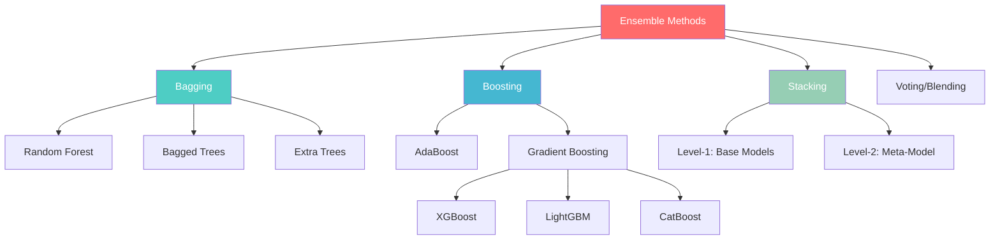

# Phase 10 — Ensemble Learning

## Complete Learning & Interview Mastery Guide

---

## Table of Contents

1. [What is Ensemble Learning](#what-is-ensemble-learning)
2. [Bagging — Bootstrap Aggregating](#bagging--bootstrap-aggregating)
3. [Boosting — Sequential Error Correction](#boosting--sequential-error-correction)
4. [AdaBoost — Adaptive Boosting](#adaboost--adaptive-boosting)
5. [Gradient Boosting — The Framework](#gradient-boosting--the-framework)
6. [XGBoost — Extreme Gradient Boosting](#xgboost--extreme-gradient-boosting)
7. [LightGBM — Light Gradient Boosting Machine](#lightgbm--light-gradient-boosting-machine)
8. [CatBoost — Categorical Boosting](#catboost--categorical-boosting)
9. [Stacking — Meta-Learning](#stacking--meta-learning)
10. [Ensemble Comparison & Production Guide](#ensemble-comparison--production-guide)
11. [Interview Mastery](#interview-mastery)

---

## What is Ensemble Learning

### Beginner Explanation

Ensemble learning combines multiple "weak" models to create one "strong" model — like assembling a team of specialists where each person's weaknesses are covered by the others' strengths. Instead of relying on a single model that might be wrong, you ask many models and aggregate their answers.

**Real-world analogy:** Think of a jury trial. One person might be biased or make a mistake, but 12 people deliberating together are far more likely to reach the correct verdict. Ensemble learning applies this same "wisdom of the crowd" principle to ML models.

### Why Ensembles Work — The Mathematical Reason

```
Single model error: ε = bias² + variance + noise

Ensemble magic:
- Bagging (averaging):  reduces VARIANCE without increasing bias
- Boosting (sequential): reduces BIAS without increasing variance much
- Stacking (meta-learning): captures complementary patterns

Key theorem (Condorcet's Jury Theorem):
If each model is better than random (accuracy > 50%) AND models are independent,
then the majority vote accuracy → 100% as number of models → ∞
```

### Ensemble Methods Overview



### Bagging vs Boosting — Core Difference

```
BAGGING (Parallel):                    BOOSTING (Sequential):
┌────────┐ ┌────────┐ ┌────────┐     ┌────────┐    ┌────────┐    ┌────────┐
│Model 1 │ │Model 2 │ │Model 3 │     │Model 1 │ →  │Model 2 │ →  │Model 3 │
└───┬────┘ └───┬────┘ └───┬────┘     └───┬────┘    └───┬────┘    └───┬────┘
    │          │          │               │              │              │
    └──────────┼──────────┘               │ errors       │ errors       │
               │                          └──────────────┘──────────────┘
         [AVERAGE/VOTE]                        [WEIGHTED SUM]

- Train independently on random subsets    - Train sequentially
- Each model has equal weight              - Each model focuses on previous errors
- Reduces VARIANCE                         - Reduces BIAS
- Hard to overfit                          - Can overfit if too many iterations
- Example: Random Forest                   - Example: XGBoost, LightGBM
```

---

## Bagging — Bootstrap Aggregating

### How Bagging Works

```
Algorithm:
1. Create N bootstrap samples (random sampling WITH replacement)
   - Each sample is ~63.2% of original data (some points repeated, some excluded)
2. Train one base model on each bootstrap sample (independently, in parallel)
3. Aggregate predictions:
   - Classification: majority vote
   - Regression: average

Why bootstrap (sampling WITH replacement)?
- Creates diverse training sets
- ~36.8% of data is left out of each sample (out-of-bag = free validation)
- Different models see different subsets → different errors → averaging cancels errors
```

### Mathematical Intuition

```
If we have N models, each with error variance σ² and correlation ρ:

Variance of averaged ensemble = ρ·σ² + (1-ρ)·σ²/N

As N → ∞:
    Ensemble variance → ρ·σ²

Key insight: The more UNCORRELATED the models (lower ρ), the better.
That's why Random Forest adds feature randomization — to reduce ρ.
```

### Implementation

```python
from sklearn.ensemble import BaggingClassifier, BaggingRegressor
from sklearn.tree import DecisionTreeClassifier
from sklearn.datasets import make_classification
from sklearn.model_selection import train_test_split, cross_val_score
import numpy as np

# Generate data
X, y = make_classification(n_samples=2000, n_features=20, n_informative=10, random_state=42)
X_train, X_test, y_train, y_test = train_test_split(X, y, test_size=0.2, random_state=42)

# Single Decision Tree (high variance)
single_tree = DecisionTreeClassifier(random_state=42)
single_tree.fit(X_train, y_train)
print(f"Single Tree - Train: {single_tree.score(X_train, y_train):.4f} | "
      f"Test: {single_tree.score(X_test, y_test):.4f}")

# Bagged Decision Trees (reduced variance)
bagging = BaggingClassifier(
    estimator=DecisionTreeClassifier(),
    n_estimators=100,       # number of base models
    max_samples=0.8,        # fraction of data per bootstrap sample
    max_features=1.0,       # fraction of features per model (1.0 = all)
    bootstrap=True,         # sample with replacement
    oob_score=True,         # out-of-bag evaluation
    n_jobs=-1,              # parallel training
    random_state=42
)
bagging.fit(X_train, y_train)
print(f"Bagging     - Train: {bagging.score(X_train, y_train):.4f} | "
      f"Test: {bagging.score(X_test, y_test):.4f} | "
      f"OOB: {bagging.oob_score_:.4f}")

# Effect of number of estimators
n_estimators_range = [1, 5, 10, 25, 50, 100, 200, 500]
for n in n_estimators_range:
    bag = BaggingClassifier(n_estimators=n, random_state=42)
    scores = cross_val_score(bag, X_train, y_train, cv=5, scoring='accuracy')
    print(f"  n={n:<4} → CV Accuracy: {scores.mean():.4f} ± {scores.std():.4f}")
```

### Extra Trees (Extremely Randomized Trees)

```python
from sklearn.ensemble import ExtraTreesClassifier

# Extra Trees: even more randomization than Random Forest
# - Uses the FULL dataset (no bootstrap) for each tree
# - Splits are chosen randomly (not optimized) → faster training
# - Even more variance reduction due to extra randomness
extra_trees = ExtraTreesClassifier(
    n_estimators=100,
    max_features='sqrt',
    random_state=42,
    n_jobs=-1
)
extra_trees.fit(X_train, y_train)
print(f"Extra Trees - Train: {extra_trees.score(X_train, y_train):.4f} | "
      f"Test: {extra_trees.score(X_test, y_test):.4f}")
```

---

## Boosting — Sequential Error Correction

### How Boosting Works

```
Core Idea: Train models SEQUENTIALLY, where each new model focuses on
the mistakes of the previous models.

General Boosting Algorithm:
1. Train Model_1 on original data
2. Identify samples that Model_1 got WRONG
3. Train Model_2 with extra focus on those wrong samples
4. Identify samples that Model_1 + Model_2 still get wrong
5. Train Model_3 focusing on remaining errors
6. ... repeat for T iterations
7. Final prediction = weighted combination of all models

Each model is intentionally WEAK (shallow tree, "stump"):
- Individual model: ~60% accuracy
- Combined ensemble: >95% accuracy
```

### Boosting vs Bagging — Visual Comparison

```
Bagging (parallel, diverse models):
Data: ●●●●●●●●●●  →  Model₁  →  pred₁ ─┐
Data: ●●●●●●●●●●  →  Model₂  →  pred₂ ─┼→ AVERAGE → Final
Data: ●●●●●●●●●●  →  Model₃  →  pred₃ ─┘
(random subsets)

Boosting (sequential, corrective models):
All Data  →  Model₁  →  errors₁
errors₁   →  Model₂  →  errors₂    → WEIGHTED SUM → Final
errors₂   →  Model₃  →  errors₃
(each focuses on previous failures)
```

---

## AdaBoost — Adaptive Boosting

### Beginner Explanation

AdaBoost (Adaptive Boosting) is the original boosting algorithm. It trains weak learners (usually decision stumps — trees with depth 1) sequentially, where each new learner gets extra focus on the samples that previous learners got wrong. Samples that are hard to classify get higher weights, forcing subsequent models to pay attention to them.

### Algorithm — Step by Step

```
AdaBoost Algorithm:
1. Initialize sample weights: wᵢ = 1/N for all samples

2. For t = 1 to T (number of boosting rounds):
   a. Train weak learner hₜ on weighted data
   b. Compute weighted error: εₜ = Σ wᵢ · I(hₜ(xᵢ) ≠ yᵢ)
   c. Compute learner weight: αₜ = 0.5 · ln((1-εₜ)/εₜ)
      - Low error → high α (trust this model more)
      - High error → low α (trust this model less)
   d. Update sample weights:
      - Misclassified: wᵢ ← wᵢ · exp(αₜ)   (increase weight)
      - Correctly classified: wᵢ ← wᵢ · exp(-αₜ) (decrease weight)
   e. Normalize weights (so they sum to 1)

3. Final prediction: H(x) = sign(Σ αₜ · hₜ(x))
```

### Mathematical Intuition

```
Learner weight:  αₜ = 0.5 · ln((1-εₜ)/εₜ)

Error = 0.0 → α = +∞  (perfect model, trust completely)
Error = 0.3 → α = 0.42 (good model, moderate trust)
Error = 0.5 → α = 0    (random guess, ignore this model)
Error > 0.5 → α < 0    (worse than random, flip predictions!)

Sample weight update:
- Misclassified samples get weight multiplied by exp(α) > 1 → LARGER
- Correct samples get weight multiplied by exp(-α) < 1 → SMALLER
- Next model must focus on the "hard" samples
```

### Implementation

```python
from sklearn.ensemble import AdaBoostClassifier
from sklearn.tree import DecisionTreeClassifier
from sklearn.datasets import make_classification
from sklearn.model_selection import train_test_split
import numpy as np
import matplotlib.pyplot as plt

# Generate data
X, y = make_classification(n_samples=1000, n_features=10, n_informative=5, random_state=42)
X_train, X_test, y_train, y_test = train_test_split(X, y, test_size=0.2, random_state=42)

# AdaBoost with decision stumps (depth=1)
ada = AdaBoostClassifier(
    estimator=DecisionTreeClassifier(max_depth=1),  # weak learner (stump)
    n_estimators=200,          # number of boosting rounds
    learning_rate=0.1,         # shrinkage (smaller = slower learning, less overfit)
    algorithm='SAMME.R',       # uses probability estimates (better than SAMME)
    random_state=42
)
ada.fit(X_train, y_train)

print(f"AdaBoost - Train: {ada.score(X_train, y_train):.4f} | "
      f"Test: {ada.score(X_test, y_test):.4f}")

# Staged predictions (see how performance improves with more rounds)
train_scores = []
test_scores = []
for y_pred_train, y_pred_test in zip(
    ada.staged_predict(X_train), ada.staged_predict(X_test)
):
    train_scores.append((y_pred_train == y_train).mean())
    test_scores.append((y_pred_test == y_test).mean())

plt.figure(figsize=(10, 6))
plt.plot(range(1, len(train_scores)+1), train_scores, 'b-', label='Train')
plt.plot(range(1, len(test_scores)+1), test_scores, 'r-', label='Test')
plt.xlabel('Number of Boosting Rounds')
plt.ylabel('Accuracy')
plt.title('AdaBoost: Performance vs Number of Rounds')
plt.legend()
plt.grid(True, alpha=0.3)
plt.show()
```

### AdaBoost — Advantages & Disadvantages

| Advantages | Disadvantages |
|-----------|---------------|
| Simple to implement | Sensitive to noisy data and outliers |
| Few hyperparameters to tune | Weak learners must be carefully chosen |
| Automatically identifies hard samples | Can overfit on noisy data |
| Good theoretical guarantees | Slower than bagging (sequential) |
| Works with any weak learner | Outperformed by gradient boosting in practice |

---

## Gradient Boosting — The Framework

### Beginner Explanation

Gradient Boosting builds models sequentially like AdaBoost, but instead of reweighting samples, each new model directly predicts the **errors (residuals)** of the previous ensemble. Think of it as: Model 1 makes predictions, Model 2 predicts what Model 1 got wrong, Model 3 predicts what Model 1 + Model 2 still get wrong... until the residual errors are negligible.

### How Gradient Boosting Works

```
Gradient Boosting Algorithm:
1. Start with a simple prediction (e.g., mean of target)
   F₀(x) = mean(y)

2. For t = 1 to T rounds:
   a. Compute residuals (negative gradient of loss):
      rᵢ = yᵢ - Fₜ₋₁(xᵢ)    (for MSE loss)
      
   b. Fit a new tree hₜ to predict the RESIDUALS rᵢ
   
   c. Update ensemble:
      Fₜ(x) = Fₜ₋₁(x) + η · hₜ(x)
      
      where η = learning rate (shrinkage)

3. Final prediction: F_T(x) = F₀ + η·h₁ + η·h₂ + ... + η·hₜ
```

### Visual Step-by-Step

```
Actual values y:     [10, 20, 30, 15, 25]

Round 0: F₀ = mean = 20
Residuals:           [-10, 0, 10, -5, 5]

Round 1: Tree₁ predicts residuals → captures some pattern
         h₁ predictions:  [-8, 1, 9, -4, 4]
         F₁ = F₀ + 0.1·h₁ = [19.2, 20.1, 20.9, 19.6, 20.4]
         New residuals:    [-9.2, -0.1, 9.1, -4.6, 4.6]

Round 2: Tree₂ predicts NEW residuals → corrects remaining errors
         ...

After 100 rounds: residuals → nearly zero
```

### Why "Gradient" Boosting?

```
The name comes from gradient descent in function space:

Regular gradient descent:
    θ ← θ - η · ∂L/∂θ     (update parameters)

Gradient boosting:
    F ← F - η · ∂L/∂F     (update the FUNCTION itself)

For different loss functions:
- MSE loss:      residual = y - F(x)           → predicting errors
- Log loss:      residual = y - sigmoid(F(x))   → classification
- Huber loss:    residual = clipped (y - F(x))  → robust to outliers

This generality is why gradient boosting works for ANY differentiable loss function.
```

### Implementation (Scikit-learn)

```python
from sklearn.ensemble import GradientBoostingClassifier, GradientBoostingRegressor
from sklearn.datasets import make_classification
from sklearn.model_selection import train_test_split
import numpy as np

X, y = make_classification(n_samples=2000, n_features=20, n_informative=10, random_state=42)
X_train, X_test, y_train, y_test = train_test_split(X, y, test_size=0.2, random_state=42)

# Gradient Boosting Classifier
gb = GradientBoostingClassifier(
    n_estimators=200,         # number of boosting rounds (trees)
    max_depth=3,              # shallow trees! (weak learners)
    learning_rate=0.1,        # shrinkage factor (0.01-0.3 typical)
    subsample=0.8,            # fraction of data per tree (stochastic GB)
    min_samples_split=10,
    min_samples_leaf=5,
    max_features='sqrt',      # feature subsampling (like RF)
    random_state=42
)
gb.fit(X_train, y_train)

print(f"Gradient Boosting - Train: {gb.score(X_train, y_train):.4f} | "
      f"Test: {gb.score(X_test, y_test):.4f}")

# Feature importance
importances = gb.feature_importances_
top_indices = np.argsort(importances)[-5:]
for idx in reversed(top_indices):
    print(f"  Feature {idx}: {importances[idx]:.4f}")
```

### Key Hyperparameters

```
n_estimators (100-5000):   More trees = more complex model
                            Too many → overfitting (use early stopping!)

learning_rate (0.01-0.3):  Lower = need more trees but better generalization
                            Typical: 0.1 (balance speed and quality)

max_depth (3-8):           Shallow! (unlike Random Forest)
                            Deeper → more complex interactions but overfit risk
                            Default: 3-5 for boosting (vs 10-None for RF)

subsample (0.5-1.0):       Stochastic gradient boosting
                            <1.0 reduces overfitting (like bagging within boosting)

min_samples_leaf (1-50):   Prevents tiny leaves → regularization

Rule of thumb: learning_rate ↓ requires n_estimators ↑
    - Fast: lr=0.1, n_estimators=200
    - Quality: lr=0.01, n_estimators=2000 + early_stopping
```

---

## XGBoost — Extreme Gradient Boosting

### What Makes XGBoost Special

XGBoost is an optimized, production-grade implementation of gradient boosting that dominates structured/tabular data competitions and production systems. It adds several innovations over vanilla gradient boosting:

1. **Regularized objective** (prevents overfitting)
2. **Second-order gradients** (Newton's method — faster convergence)
3. **Custom split finding** (approximate for large data — histogram-based)
4. **Built-in handling of missing values**
5. **Parallel tree construction** (across features, not trees)
6. **Cache-aware access** (hardware optimization)
7. **Built-in cross-validation and early stopping**

### Mathematical Formulation

```
XGBoost Objective:
    Obj = Σ L(yᵢ, ŷᵢ) + Σ Ω(fₜ)
              ↑                ↑
         loss function    regularization on trees

Where tree regularization:
    Ω(f) = γ·T + (1/2)·λ·Σ wⱼ²

    T = number of leaves (penalizes complex trees)
    wⱼ = leaf weight (penalizes large leaf values)
    γ = minimum loss reduction for a split (pruning)
    λ = L2 regularization on leaf weights

Second-order Taylor expansion of loss:
    Obj ≈ Σ [gᵢ·fₜ(xᵢ) + (1/2)·hᵢ·fₜ²(xᵢ)] + Ω(fₜ)

    gᵢ = ∂L/∂ŷ  (first-order gradient)
    hᵢ = ∂²L/∂ŷ² (second-order gradient — Hessian)

Optimal leaf weight:
    wⱼ* = -Σᵢ∈ⱼ gᵢ / (Σᵢ∈ⱼ hᵢ + λ)

Split gain:
    Gain = (1/2) [GL²/(HL+λ) + GR²/(HR+λ) - (GL+GR)²/(HL+HR+λ)] - γ
    
    Only split if Gain > 0 (built-in pruning!)
```

### Implementation

```python
import xgboost as xgb
import numpy as np
from sklearn.datasets import make_classification
from sklearn.model_selection import train_test_split
from sklearn.metrics import accuracy_score, roc_auc_score

# Generate data
X, y = make_classification(n_samples=5000, n_features=20, n_informative=10, random_state=42)
X_train, X_test, y_train, y_test = train_test_split(X, y, test_size=0.2, random_state=42)

# --- XGBoost with native API (more control) ---
dtrain = xgb.DMatrix(X_train, label=y_train)
dtest = xgb.DMatrix(X_test, label=y_test)

params = {
    'objective': 'binary:logistic',  # binary classification
    'eval_metric': 'auc',            # evaluation metric
    'max_depth': 6,                  # tree depth
    'learning_rate': 0.1,            # eta (shrinkage)
    'subsample': 0.8,                # row sampling
    'colsample_bytree': 0.8,         # feature sampling per tree
    'min_child_weight': 5,           # minimum sum of instance weight in child
    'gamma': 0.1,                    # minimum loss reduction for split
    'lambda': 1.0,                   # L2 regularization
    'alpha': 0.0,                    # L1 regularization
    'scale_pos_weight': 1,           # for imbalanced classes: sum(negative)/sum(positive)
    'tree_method': 'hist',           # histogram-based (fast for large data)
    'seed': 42
}

# Train with early stopping (CRITICAL — prevents overfitting)
evals = [(dtrain, 'train'), (dtest, 'eval')]
model = xgb.train(
    params,
    dtrain,
    num_boost_round=1000,            # max rounds
    evals=evals,
    early_stopping_rounds=50,        # stop if no improvement for 50 rounds
    verbose_eval=100                 # print every 100 rounds
)

# Predict
y_prob = model.predict(dtest)
y_pred = (y_prob > 0.5).astype(int)
print(f"\nXGBoost - AUC: {roc_auc_score(y_test, y_prob):.4f} | "
      f"Accuracy: {accuracy_score(y_test, y_pred):.4f}")
print(f"Best iteration: {model.best_iteration}")

# --- XGBoost with sklearn API (simpler, pipeline-compatible) ---
from xgboost import XGBClassifier

xgb_sklearn = XGBClassifier(
    n_estimators=1000,
    max_depth=6,
    learning_rate=0.1,
    subsample=0.8,
    colsample_bytree=0.8,
    min_child_weight=5,
    gamma=0.1,
    reg_lambda=1.0,
    reg_alpha=0.0,
    tree_method='hist',
    early_stopping_rounds=50,
    eval_metric='auc',
    random_state=42,
    n_jobs=-1
)

xgb_sklearn.fit(
    X_train, y_train,
    eval_set=[(X_test, y_test)],
    verbose=False
)

print(f"XGBoost (sklearn) - AUC: {roc_auc_score(y_test, xgb_sklearn.predict_proba(X_test)[:, 1]):.4f}")
```

### XGBoost Feature Importance

```python
import matplotlib.pyplot as plt

# Multiple importance types
importance_types = ['weight', 'gain', 'cover']
# weight: number of times a feature is used in splits
# gain: average gain (information) when feature is used
# cover: average number of samples affected by splits on this feature

fig, axes = plt.subplots(1, 3, figsize=(18, 5))
for ax, imp_type in zip(axes, importance_types):
    xgb.plot_importance(model, importance_type=imp_type, max_num_features=10, ax=ax)
    ax.set_title(f'Feature Importance ({imp_type})')
plt.tight_layout()
plt.show()
```

### XGBoost Hyperparameter Tuning Strategy

```python
import optuna

def objective(trial):
    params = {
        'n_estimators': 1000,  # use early stopping instead of tuning this
        'max_depth': trial.suggest_int('max_depth', 3, 10),
        'learning_rate': trial.suggest_float('learning_rate', 0.01, 0.3, log=True),
        'subsample': trial.suggest_float('subsample', 0.5, 1.0),
        'colsample_bytree': trial.suggest_float('colsample_bytree', 0.5, 1.0),
        'min_child_weight': trial.suggest_int('min_child_weight', 1, 20),
        'gamma': trial.suggest_float('gamma', 0, 5),
        'reg_lambda': trial.suggest_float('reg_lambda', 0.01, 10, log=True),
        'reg_alpha': trial.suggest_float('reg_alpha', 0.001, 10, log=True),
    }

    model = XGBClassifier(**params, tree_method='hist', random_state=42,
                          early_stopping_rounds=50, eval_metric='auc')
    model.fit(X_train, y_train, eval_set=[(X_test, y_test)], verbose=False)
    y_prob = model.predict_proba(X_test)[:, 1]
    return roc_auc_score(y_test, y_prob)

study = optuna.create_study(direction='maximize')
study.optimize(objective, n_trials=100, show_progress_bar=True)
print(f"Best AUC: {study.best_value:.4f}")
print(f"Best params: {study.best_params}")
```

### Handling Missing Values in XGBoost

```python
# XGBoost handles missing values NATIVELY
# At each split, it learns which direction (left or right) is best for missing values
# No imputation needed!

import numpy as np

# Create data with missing values
X_with_nan = X_train.copy()
mask = np.random.random(X_with_nan.shape) < 0.1  # 10% missing
X_with_nan[mask] = np.nan

# XGBoost handles this directly
xgb_nan = XGBClassifier(n_estimators=100, random_state=42, tree_method='hist')
xgb_nan.fit(X_with_nan, y_train)
print(f"XGBoost with NaN - Test Accuracy: {xgb_nan.score(X_test, y_test):.4f}")
```

---

## LightGBM — Light Gradient Boosting Machine

### What Makes LightGBM Special

LightGBM (by Microsoft) is designed for **speed and efficiency** on large datasets while maintaining accuracy. Key innovations:

1. **Leaf-wise tree growth** (vs level-wise in XGBoost) — faster convergence
2. **Gradient-based One-Side Sampling (GOSS)** — keeps important samples
3. **Exclusive Feature Bundling (EFB)** — reduces feature count
4. **Histogram-based splitting** — bins continuous features
5. **Native categorical feature support** — no one-hot encoding needed

### Leaf-wise vs Level-wise Growth

```
Level-wise (XGBoost default):        Leaf-wise (LightGBM):
Grows all nodes at same depth        Grows the leaf with highest loss reduction

       ○                                    ○
      / \                                  / \
     ○   ○         ← all at depth 1       ○   ○
    /\   /\                               /\
   ○ ○  ○ ○       ← all at depth 2      ○  ○    ← only where gain is highest
                                             /\
                                            ○  ○  ← asymmetric, but more gain

Level-wise: balanced trees, slower convergence
Leaf-wise: unbalanced trees, FASTER convergence but risk of overfitting
           (control with max_depth or num_leaves)
```

### Implementation

```python
import lightgbm as lgb
import numpy as np
from sklearn.model_selection import train_test_split
from sklearn.metrics import roc_auc_score, accuracy_score

# Generate data
X, y = make_classification(n_samples=10000, n_features=30, n_informative=15, random_state=42)
X_train, X_test, y_train, y_test = train_test_split(X, y, test_size=0.2, random_state=42)

# --- LightGBM Native API ---
lgb_train = lgb.Dataset(X_train, y_train)
lgb_eval = lgb.Dataset(X_test, y_test, reference=lgb_train)

params = {
    'objective': 'binary',            # binary classification
    'metric': 'auc',                  # evaluation metric
    'boosting_type': 'gbdt',          # gradient boosted decision trees
    'num_leaves': 31,                 # max leaves per tree (KEY parameter!)
    'max_depth': -1,                  # no limit (controlled by num_leaves)
    'learning_rate': 0.05,
    'n_estimators': 1000,
    'subsample': 0.8,                 # bagging_fraction
    'colsample_bytree': 0.8,          # feature_fraction
    'min_child_samples': 20,          # min data in leaf
    'reg_alpha': 0.1,                 # L1 regularization
    'reg_lambda': 1.0,                # L2 regularization
    'verbose': -1,
    'seed': 42
}

model = lgb.train(
    params,
    lgb_train,
    num_boost_round=1000,
    valid_sets=[lgb_eval],
    callbacks=[
        lgb.early_stopping(stopping_rounds=50),
        lgb.log_evaluation(period=100)
    ]
)

y_prob = model.predict(X_test)
print(f"\nLightGBM - AUC: {roc_auc_score(y_test, y_prob):.4f}")

# --- LightGBM sklearn API ---
from lightgbm import LGBMClassifier

lgbm_sklearn = LGBMClassifier(
    n_estimators=1000,
    num_leaves=31,
    learning_rate=0.05,
    subsample=0.8,
    colsample_bytree=0.8,
    min_child_samples=20,
    reg_alpha=0.1,
    reg_lambda=1.0,
    random_state=42,
    n_jobs=-1,
    verbose=-1
)

lgbm_sklearn.fit(
    X_train, y_train,
    eval_set=[(X_test, y_test)],
    callbacks=[lgb.early_stopping(50), lgb.log_evaluation(0)]
)

y_prob = lgbm_sklearn.predict_proba(X_test)[:, 1]
print(f"LightGBM (sklearn) - AUC: {roc_auc_score(y_test, y_prob):.4f}")
```

### LightGBM with Categorical Features

```python
import pandas as pd

# LightGBM handles categoricals NATIVELY (no one-hot needed!)
# This is faster and more accurate than one-hot for high-cardinality

df = pd.DataFrame({
    'city': pd.Categorical(['NYC', 'LA', 'SF', 'NYC', 'LA'] * 1000),
    'device': pd.Categorical(['mobile', 'desktop', 'tablet'] * 1666 + ['mobile'] * 2),
    'price': np.random.randn(5000),
    'target': np.random.randint(0, 2, 5000)
})

# Tell LightGBM which features are categorical
cat_features = ['city', 'device']

lgbm_cat = LGBMClassifier(n_estimators=100, random_state=42, verbose=-1)
lgbm_cat.fit(
    df[['city', 'device', 'price']], df['target'],
    categorical_feature=cat_features
)
```

### LightGBM Key Parameters

```
num_leaves (default=31): MOST IMPORTANT parameter
    - Controls model complexity (instead of max_depth)
    - Higher = more complex = more overfit risk
    - Rule: num_leaves ≤ 2^max_depth
    - Start with 31, increase if underfitting

max_depth (-1 = unlimited): Use num_leaves instead
    - Set as backup: max_depth = ceil(log2(num_leaves)) + 2

min_child_samples (20): Minimum data points in a leaf
    - Larger = more regularization
    - Increase for noisy data

learning_rate + n_estimators + early_stopping:
    - lr=0.05-0.1, n_estimators=1000-5000, early_stopping=50
    - Lower lr + more trees = better but slower
```

---

## CatBoost — Categorical Boosting

### What Makes CatBoost Special

CatBoost (by Yandex) is optimized for datasets with many **categorical features**. Key innovations:

1. **Native categorical encoding** — ordered target statistics (no manual encoding)
2. **Ordered boosting** — prevents target leakage in gradient estimation
3. **Symmetric trees** — all leaves at same depth (faster inference)
4. **GPU training** — efficient GPU implementation
5. **Minimal hyperparameter tuning** — good defaults out of the box

### Implementation

```python
from catboost import CatBoostClassifier, Pool
import pandas as pd
import numpy as np
from sklearn.model_selection import train_test_split
from sklearn.metrics import roc_auc_score

# Create dataset with categorical features
np.random.seed(42)
n = 5000
df = pd.DataFrame({
    'age': np.random.normal(35, 10, n),
    'income': np.random.lognormal(10.5, 0.5, n),
    'city': np.random.choice(['NYC', 'LA', 'Chicago', 'Houston', 'Phoenix'], n),
    'education': np.random.choice(['High School', 'Bachelors', 'Masters', 'PhD'], n),
    'device': np.random.choice(['iPhone', 'Android', 'Desktop', 'Tablet'], n),
    'target': np.random.randint(0, 2, n)
})

# Define features
cat_features = ['city', 'education', 'device']
features = ['age', 'income', 'city', 'education', 'device']

X_train, X_test, y_train, y_test = train_test_split(
    df[features], df['target'], test_size=0.2, random_state=42
)

# CatBoost — handles categoricals directly (no encoding needed!)
catboost = CatBoostClassifier(
    iterations=1000,               # number of trees
    depth=6,                       # tree depth (symmetric trees)
    learning_rate=0.05,
    l2_leaf_reg=3.0,               # L2 regularization
    random_seed=42,
    cat_features=cat_features,     # specify categorical columns
    early_stopping_rounds=50,
    verbose=100,
    eval_metric='AUC'
)

catboost.fit(
    X_train, y_train,
    eval_set=(X_test, y_test),
    use_best_model=True
)

y_prob = catboost.predict_proba(X_test)[:, 1]
print(f"\nCatBoost - AUC: {roc_auc_score(y_test, y_prob):.4f}")
print(f"Best iteration: {catboost.get_best_iteration()}")

# Feature importance
feature_importance = catboost.get_feature_importance()
for name, imp in sorted(zip(features, feature_importance), key=lambda x: -x[1]):
    print(f"  {name}: {imp:.1f}")
```

### CatBoost Advantages

```
Why choose CatBoost:
1. Dataset has many categorical features (especially high cardinality)
2. Want minimal preprocessing (no encoding step)
3. Need good performance with default hyperparameters
4. GPU training available
5. Need ordered target encoding (prevents leakage)

CatBoost vs XGBoost vs LightGBM:
- CatBoost: best for categorical-heavy data, slowest training
- LightGBM: fastest training, best for large data
- XGBoost: most versatile, largest community, best documentation
```

---

## Stacking — Meta-Learning

### Beginner Explanation

Stacking (Stacked Generalization) trains multiple different models, then trains a **meta-model** on top that learns how to best combine their predictions. Instead of simple averaging or voting, the meta-model learns which base model to trust for which types of inputs.

**Real-world analogy:** You have specialists (a cardiologist, a radiologist, a GP). A chief doctor (meta-model) reviews all their opinions and makes the final diagnosis, knowing who to trust for which symptoms.

### How Stacking Works

```
Level 0 (Base Models):
┌──────────────┐  ┌──────────────┐  ┌──────────────┐
│  Logistic    │  │   Random     │  │   XGBoost    │
│  Regression  │  │   Forest     │  │              │
└──────┬───────┘  └──────┬───────┘  └──────┬───────┘
       │                  │                  │
       ▼                  ▼                  ▼
   pred_lr=0.7        pred_rf=0.8       pred_xgb=0.85
       │                  │                  │
       └──────────────────┼──────────────────┘
                          │
                          ▼
              ┌────────────────────────┐
              │  Level 1: Meta-Model   │
              │  (e.g., Logistic Reg)  │
              │  Input: [0.7, 0.8, 0.85]│
              └────────────┬───────────┘
                           │
                           ▼
                    Final Prediction: 0.82

Key: Base model predictions become FEATURES for the meta-model
```

### Critical Detail — Cross-Validated Stacking

```
WRONG way (data leakage):
- Train base models on ALL training data
- Use same training data predictions as meta-features
- Meta-model sees "cheating" predictions (overfit base model outputs)

CORRECT way (cross-validated):
- Split training data into K folds
- For each fold: train base models on K-1 folds, predict on held-out fold
- Collect out-of-fold predictions for ALL training samples
- These become meta-features (no leakage — each prediction was "unseen")
- Train meta-model on these honest meta-features

For test data:
- Train base models on FULL training data
- Predict test set with each base model
- Feed base model predictions to meta-model → final prediction
```

### Implementation

```python
from sklearn.ensemble import StackingClassifier, RandomForestClassifier
from sklearn.ensemble import GradientBoostingClassifier
from sklearn.linear_model import LogisticRegression
from sklearn.svm import SVC
from sklearn.neighbors import KNeighborsClassifier
from sklearn.model_selection import train_test_split, cross_val_score
from sklearn.preprocessing import StandardScaler
from sklearn.pipeline import make_pipeline
from sklearn.datasets import make_classification
from sklearn.metrics import roc_auc_score
import numpy as np

# Generate data
X, y = make_classification(n_samples=3000, n_features=20, n_informative=10, random_state=42)
X_train, X_test, y_train, y_test = train_test_split(X, y, test_size=0.2, random_state=42)

# --- Sklearn StackingClassifier ---
# Define base models (diverse algorithms = better stacking)
base_models = [
    ('lr', make_pipeline(StandardScaler(), LogisticRegression(max_iter=1000))),
    ('rf', RandomForestClassifier(n_estimators=100, random_state=42)),
    ('gb', GradientBoostingClassifier(n_estimators=100, random_state=42)),
    ('svm', make_pipeline(StandardScaler(), SVC(probability=True, random_state=42))),
    ('knn', make_pipeline(StandardScaler(), KNeighborsClassifier(n_neighbors=10)))
]

# Meta-model (keep it simple to avoid overfitting!)
stacking = StackingClassifier(
    estimators=base_models,
    final_estimator=LogisticRegression(),  # simple meta-model
    cv=5,                                  # cross-validated meta-features
    stack_method='predict_proba',          # use probabilities (not hard predictions)
    n_jobs=-1
)

stacking.fit(X_train, y_train)
y_prob = stacking.predict_proba(X_test)[:, 1]

print(f"Stacking Ensemble - AUC: {roc_auc_score(y_test, y_prob):.4f}")

# Compare individual models
for name, model in base_models:
    model.fit(X_train, y_train)
    if hasattr(model, 'predict_proba'):
        prob = model.predict_proba(X_test)[:, 1]
    else:
        prob = model.predict(X_test)
    auc = roc_auc_score(y_test, prob)
    print(f"  {name}: AUC = {auc:.4f}")
```

### Manual Stacking (More Control)

```python
from sklearn.model_selection import KFold
import numpy as np

def create_stacking_features(models, X_train, y_train, X_test, n_folds=5):
    """Create out-of-fold meta-features for stacking."""
    kf = KFold(n_splits=n_folds, shuffle=True, random_state=42)
    n_models = len(models)

    # Containers for meta-features
    train_meta = np.zeros((len(X_train), n_models))
    test_meta = np.zeros((len(X_test), n_models))

    for model_idx, (name, model) in enumerate(models):
        test_preds_fold = np.zeros((len(X_test), n_folds))

        for fold_idx, (train_idx, val_idx) in enumerate(kf.split(X_train)):
            X_fold_train = X_train[train_idx]
            y_fold_train = y_train[train_idx]
            X_fold_val = X_train[val_idx]

            model.fit(X_fold_train, y_fold_train)

            # Out-of-fold predictions for training meta-features
            train_meta[val_idx, model_idx] = model.predict_proba(X_fold_val)[:, 1]

            # Test predictions (averaged across folds)
            test_preds_fold[:, fold_idx] = model.predict_proba(X_test)[:, 1]

        # Average test predictions across folds
        test_meta[:, model_idx] = test_preds_fold.mean(axis=1)

        print(f"  {name} OOF complete")

    return train_meta, test_meta

# Usage
from sklearn.linear_model import LogisticRegression as LR

models = [
    ('rf', RandomForestClassifier(n_estimators=100, random_state=42)),
    ('gb', GradientBoostingClassifier(n_estimators=100, random_state=42)),
]

train_meta, test_meta = create_stacking_features(models, X_train, y_train, X_test)

# Train meta-model on stacked features
meta_model = LR()
meta_model.fit(train_meta, y_train)
final_pred = meta_model.predict_proba(test_meta)[:, 1]
print(f"Manual Stacking AUC: {roc_auc_score(y_test, final_pred):.4f}")
```

### Stacking Best Practices

```
1. Base models should be DIVERSE:
   - Mix linear + non-linear models
   - Mix fast + complex models
   - Different algorithms capture different patterns

2. Meta-model should be SIMPLE:
   - Logistic Regression (most common)
   - Ridge Regression
   - Small neural network
   - NOT a complex model (overfitting risk on small meta-feature set)

3. Use probabilities (predict_proba), not hard predictions:
   - More information for the meta-model
   - Probabilities carry confidence information

4. Always use cross-validated meta-features:
   - Prevents leakage
   - Gives honest representation of base model quality

5. Diminishing returns beyond 3-5 diverse base models
```

---

## Ensemble Comparison & Production Guide

### XGBoost vs LightGBM vs CatBoost

| Feature | XGBoost | LightGBM | CatBoost |
|---------|---------|----------|----------|
| **Training Speed** | Medium | Fastest | Slowest |
| **Accuracy** | Excellent | Excellent | Excellent |
| **Categorical Features** | Manual encoding | Partial native | Best native |
| **Missing Values** | Native handling | Native handling | Native handling |
| **GPU Support** | Yes | Yes | Yes (fastest) |
| **Memory Usage** | Medium | Lowest | Highest |
| **Default Performance** | Good | Good | Best (minimal tuning) |
| **Community/Docs** | Largest | Large | Medium |
| **Tree Growth** | Level-wise | Leaf-wise | Symmetric |
| **Best For** | General purpose | Large data, speed | Categorical-heavy |

### When to Use What

```
Decision Guide:

├── Large dataset (>1M rows)?
│   └── LightGBM (fastest training, lowest memory)
│
├── Many categorical features?
│   └── CatBoost (native handling, no encoding needed)
│
├── Need fastest inference?
│   └── CatBoost (symmetric trees = predictable latency)
│
├── Limited tuning time?
│   └── CatBoost (best defaults, least sensitive to hyperparameters)
│
├── Kaggle competition?
│   └── All three + stacking (try all, ensemble the best)
│
├── Production with strict latency?
│   └── LightGBM or XGBoost (lighter models possible)
│
└── Default / unsure?
    └── XGBoost (most proven, largest community, best docs)
```

### Production Ensemble Example

```python
import numpy as np
from sklearn.model_selection import train_test_split
from sklearn.metrics import roc_auc_score
from xgboost import XGBClassifier
from lightgbm import LGBMClassifier
from catboost import CatBoostClassifier

# Data
X, y = make_classification(n_samples=10000, n_features=20, random_state=42)
X_train, X_test, y_train, y_test = train_test_split(X, y, test_size=0.2, random_state=42)

# Train all three gradient boosting frameworks
xgb_model = XGBClassifier(n_estimators=500, learning_rate=0.05, max_depth=6,
                           random_state=42, tree_method='hist', eval_metric='auc',
                           early_stopping_rounds=50)
xgb_model.fit(X_train, y_train, eval_set=[(X_test, y_test)], verbose=False)

lgbm_model = LGBMClassifier(n_estimators=500, learning_rate=0.05, num_leaves=31,
                             random_state=42, verbose=-1)
lgbm_model.fit(X_train, y_train, eval_set=[(X_test, y_test)],
               callbacks=[lgb.early_stopping(50), lgb.log_evaluation(0)])

cat_model = CatBoostClassifier(iterations=500, learning_rate=0.05, depth=6,
                                random_seed=42, verbose=0, early_stopping_rounds=50)
cat_model.fit(X_train, y_train, eval_set=(X_test, y_test))

# Individual predictions
xgb_prob = xgb_model.predict_proba(X_test)[:, 1]
lgbm_prob = lgbm_model.predict_proba(X_test)[:, 1]
cat_prob = cat_model.predict_proba(X_test)[:, 1]

print(f"XGBoost AUC:  {roc_auc_score(y_test, xgb_prob):.4f}")
print(f"LightGBM AUC: {roc_auc_score(y_test, lgbm_prob):.4f}")
print(f"CatBoost AUC: {roc_auc_score(y_test, cat_prob):.4f}")

# Simple blending (weighted average)
blend_prob = 0.4 * xgb_prob + 0.3 * lgbm_prob + 0.3 * cat_prob
print(f"\nBlended AUC:  {roc_auc_score(y_test, blend_prob):.4f}")

# Optimized blending (find best weights)
from scipy.optimize import minimize

def neg_auc(weights):
    w = np.array(weights)
    w = w / w.sum()  # normalize
    blend = w[0] * xgb_prob + w[1] * lgbm_prob + w[2] * cat_prob
    return -roc_auc_score(y_test, blend)

result = minimize(neg_auc, [1/3, 1/3, 1/3], method='Nelder-Mead')
best_weights = result.x / result.x.sum()
print(f"Optimal weights: XGB={best_weights[0]:.3f}, LGBM={best_weights[1]:.3f}, "
      f"Cat={best_weights[2]:.3f}")
print(f"Optimized Blend AUC: {-result.fun:.4f}")
```

---

## Interview Mastery

### Beginner Questions

---

**Q1: What is ensemble learning and why does it work?**

**Perfect Answer:**
> "Ensemble learning combines multiple models to produce a better prediction than any single model. It works because of the statistical principle that averaging independent errors reduces total error. If you have N models each with variance σ² and they're uncorrelated, the ensemble variance is σ²/N — exponentially lower. In practice, models aren't fully independent, but techniques like bootstrap sampling and feature randomization decorrelate them enough to get significant improvements. The two main families are bagging (reduces variance by averaging parallel models) and boosting (reduces bias by sequentially correcting errors)."

**Interviewer expectation:** Explain the bias-variance connection. Mention that diversity among models is key.

---

**Q2: What's the difference between bagging and boosting?**

**Perfect Answer:**
> "Bagging trains multiple models **independently in parallel** on random subsets (bootstrap samples) and averages their predictions. It reduces variance without affecting bias — ideal when base models overfit (like deep decision trees). Random Forest is the classic example.
> 
> Boosting trains models **sequentially**, where each new model focuses on correcting the errors of the previous ones. It reduces bias — ideal when base models underfit (like shallow decision stumps). XGBoost is the classic example.
> 
> Key differences: Bagging uses strong base learners (deep trees), boosting uses weak learners (shallow trees). Bagging is parallelizable, boosting is sequential. Bagging rarely overfits with more models, boosting can overfit (need early stopping). For most tabular data, boosting achieves higher accuracy."

---

**Q3: What is the difference between XGBoost and Random Forest?**

**Perfect Answer:**
> "Both are tree-based ensembles but use fundamentally different strategies:
> 
> **Random Forest** (bagging): Trains many deep, independent trees on random subsets. Each tree is strong but high-variance. Averaging many trees → low variance. Trees are parallel.
> 
> **XGBoost** (boosting): Trains many shallow, sequential trees where each corrects the previous ensemble's errors. Individual trees are weak. Cumulative combination → low bias. Trees are sequential.
> 
> Practical differences: XGBoost typically achieves higher accuracy (lower bias), RF is harder to overfit, RF needs less tuning (good defaults), XGBoost needs early stopping and learning rate tuning, RF trains in parallel (faster on multi-core), XGBoost has built-in regularization and handles missing values natively."

---

### Intermediate Questions

---

**Q4: Explain how gradient boosting reduces residuals step by step.**

**Perfect Answer:**
> "Gradient boosting starts with a simple prediction (e.g., the mean). Then iteratively:
> 
> 1. Compute residuals: r = y - current_prediction (for MSE loss)
> 2. Fit a new shallow tree to predict these residuals
> 3. Add this tree's predictions (scaled by learning rate) to the ensemble
> 4. The new residuals are smaller → repeat
> 
> After T iterations: F(x) = initial_pred + η·tree₁(x) + η·tree₂(x) + ... + η·treeT(x)
> 
> The 'gradient' part: residuals are actually the negative gradient of the loss function with respect to predictions. For MSE, the gradient is simply -(y - ŷ) = -(residual). For log loss (classification), it's y - σ(ŷ). This generalization lets gradient boosting optimize ANY differentiable loss function — not just MSE.
> 
> The learning rate η (0.01-0.1) is crucial — it prevents each tree from overcompensating. A smaller η means more trees are needed but better generalization."

---

**Q5: Why is early stopping important for boosting and how does it work?**

**Perfect Answer:**
> "Boosting adds trees sequentially, and each tree reduces training error. But after enough trees, it starts fitting noise — training error keeps dropping but validation error starts rising. Early stopping monitors validation performance and halts training when it stops improving for N consecutive rounds.
> 
> How it works: After each boosting round, evaluate on a held-out validation set. If the metric hasn't improved for `early_stopping_rounds` iterations, stop and use the model from the best iteration.
> 
> Why it's critical: Without early stopping, you must manually choose n_estimators — too few underfits, too many overfits. With early stopping, you set n_estimators very high (e.g., 10000) and let the algorithm find the right number automatically. This means you can use a lower learning rate (more granular steps) without worrying about when to stop.
> 
> Production tip: Always use early stopping with boosting. Set n_estimators=5000-10000, learning_rate=0.01-0.05, early_stopping_rounds=50-100."

---

**Q6: What is the difference between XGBoost, LightGBM, and CatBoost? When would you choose each?**

**Perfect Answer:**
> "All three are gradient boosting implementations, but with different optimizations:
> 
> **XGBoost**: Level-wise tree growth, second-order gradients, regularized objective. Most general-purpose, largest community, best documented. Choose for: default choice, when you need extensive documentation, or custom loss functions.
> 
> **LightGBM**: Leaf-wise growth (faster convergence), histogram-based splitting, GOSS sampling. Fastest training, lowest memory. Choose for: large datasets (>1M rows), speed-critical pipelines, or memory-constrained environments.
> 
> **CatBoost**: Symmetric trees, ordered boosting, native categorical encoding. Best default performance, least tuning needed. Choose for: categorical-heavy datasets, minimal preprocessing, or when you need good results quickly without extensive tuning.
> 
> In Kaggle competitions, all three perform similarly with proper tuning. In production, the choice usually comes down to data characteristics (categoricals → CatBoost), scale (large data → LightGBM), or team familiarity (most common → XGBoost)."

---

### Advanced Questions

---

**Q7: Explain the mathematical difference between AdaBoost and Gradient Boosting.**

**Perfect Answer:**
> "Both are boosting algorithms, but they approach error correction differently:
> 
> **AdaBoost**: Reweights training SAMPLES based on classification errors. Correctly classified samples get lower weight, misclassified get higher weight. The next weak learner focuses on the hard examples. Final prediction is a weighted vote where each learner's weight αₜ = 0.5·ln((1-εₜ)/εₜ) depends on its accuracy.
> 
> **Gradient Boosting**: Fits each new learner to the RESIDUALS (negative gradient of loss). Instead of changing sample weights, it literally predicts the error. For MSE loss, residuals = y - ŷ. For log loss, residuals = y - σ(ŷ). This is equivalent to gradient descent in function space.
> 
> Mathematical connection: AdaBoost is actually a special case of gradient boosting with exponential loss! When you use log-loss (cross-entropy) with gradient boosting, you get a different (and usually better) algorithm because: (1) exponential loss is sensitive to outliers, (2) gradient boosting naturally generalizes to any loss function, and (3) XGBoost adds second-order gradients (Newton's method) for faster convergence.
> 
> Practical takeaway: Gradient boosting (XGBoost/LightGBM) dominates in practice because it's more flexible (any loss function) and more robust (doesn't upweight outliers as aggressively as AdaBoost)."

---

**Q8: Design an ensemble system for a production fraud detection model.**

**Perfect Answer:**
> "For fraud detection, I'd design a multi-layer ensemble:
> 
> **Layer 1 — Rule-based filters (immediate):**
> Hard rules for obvious fraud (velocity checks, blacklisted IPs). Zero latency, catches ~30% of fraud.
> 
> **Layer 2 — Real-time ML scoring (< 100ms):**
> A stacked ensemble:
> - Base model 1: LightGBM on transactional features (amount patterns, timing)
> - Base model 2: XGBoost on behavioral features (device, location changes)
> - Base model 3: Isolation Forest for anomaly detection (novel fraud patterns)
> - Meta-model: Logistic Regression combining the three
> 
> **Layer 3 — Async deep analysis (minutes):**
> More complex models on graph features (transaction networks) that run post-scoring for high-uncertainty cases.
> 
> **Why this design works:**
> - LightGBM catches known fraud patterns quickly
> - Isolation Forest catches novel/unseen fraud types
> - XGBoost on behavioral data catches account takeovers
> - Meta-model learns which base model to trust for which transaction type
> - Stacking with cross-validation prevents overfitting on the small fraud class
> 
> **Handling class imbalance (99.9% legitimate):**
> - scale_pos_weight = count(legitimate) / count(fraud)
> - Optimize for precision@recall=0.95 (catch 95% of fraud)
> - Use SMOTE only within each CV fold (never on test data)
> 
> **Monitoring:**
> - Track each base model's individual precision/recall
> - If one model degrades, the ensemble still holds until retraining
> - Alert when ensemble confidence distribution shifts"

---

**Q9: Why does stacking often outperform simple averaging? When does it NOT help?**

**Perfect Answer:**
> "Stacking outperforms averaging because the meta-model can learn **non-uniform and conditional weighting**. With simple averaging, each model gets equal weight everywhere. But in reality, model A might be better for young customers while model B is better for older ones. The meta-model learns these conditional relationships.
> 
> Specifically, stacking helps when:
> 1. Base models have different strengths on different subsets of data
> 2. Base models are diverse (different algorithms, not just different hyperparams)
> 3. There's enough data to train the meta-model without overfitting
> 
> Stacking does NOT help (or hurts) when:
> 1. Base models are too similar (e.g., three Random Forests with different seeds) — the meta-model has nothing useful to learn from their differences
> 2. Dataset is too small — meta-model overfits on the small meta-feature set
> 3. One model is clearly dominant — stacking adds complexity for marginal gain
> 4. Base models are already well-calibrated — simple averaging works just as well
> 
> A subtle failure mode: if base models are all overfit to the same noise, stacking amplifies that overfit. This is why cross-validated meta-features are critical — they provide honest (out-of-fold) base model predictions."

---

**Q10: Implement a simplified gradient boosting regressor from scratch.**

**Perfect Answer:**
```python
import numpy as np
from sklearn.tree import DecisionTreeRegressor
from sklearn.metrics import mean_squared_error

class SimpleGradientBoosting:
    """Gradient Boosting Regressor from scratch (MSE loss)."""
    
    def __init__(self, n_estimators=100, learning_rate=0.1, max_depth=3):
        self.n_estimators = n_estimators
        self.lr = learning_rate
        self.max_depth = max_depth
        self.trees = []
        self.initial_prediction = None
    
    def fit(self, X, y):
        # Step 1: Initialize with mean prediction
        self.initial_prediction = np.mean(y)
        current_prediction = np.full(len(y), self.initial_prediction)
        
        for i in range(self.n_estimators):
            # Step 2: Compute residuals (negative gradient of MSE)
            residuals = y - current_prediction
            
            # Step 3: Fit a weak learner to residuals
            tree = DecisionTreeRegressor(max_depth=self.max_depth)
            tree.fit(X, residuals)
            
            # Step 4: Update predictions (with learning rate shrinkage)
            update = self.lr * tree.predict(X)
            current_prediction += update
            
            # Store the tree
            self.trees.append(tree)
            
            # Optional: track training loss
            if (i + 1) % 20 == 0:
                mse = mean_squared_error(y, current_prediction)
                print(f"  Round {i+1}: MSE = {mse:.4f}")
        
        return self
    
    def predict(self, X):
        # Start with initial prediction
        prediction = np.full(len(X), self.initial_prediction)
        
        # Add each tree's contribution
        for tree in self.trees:
            prediction += self.lr * tree.predict(X)
        
        return prediction

# Test it
from sklearn.datasets import make_regression
from sklearn.model_selection import train_test_split

X, y = make_regression(n_samples=1000, n_features=10, noise=10, random_state=42)
X_train, X_test, y_train, y_test = train_test_split(X, y, test_size=0.2, random_state=42)

# Custom implementation
gb_custom = SimpleGradientBoosting(n_estimators=100, learning_rate=0.1, max_depth=3)
gb_custom.fit(X_train, y_train)
y_pred_custom = gb_custom.predict(X_test)
print(f"\nCustom GB - RMSE: {np.sqrt(mean_squared_error(y_test, y_pred_custom)):.4f}")

# Compare with sklearn
from sklearn.ensemble import GradientBoostingRegressor
gb_sklearn = GradientBoostingRegressor(n_estimators=100, learning_rate=0.1, max_depth=3, random_state=42)
gb_sklearn.fit(X_train, y_train)
y_pred_sklearn = gb_sklearn.predict(X_test)
print(f"Sklearn GB - RMSE: {np.sqrt(mean_squared_error(y_test, y_pred_sklearn)):.4f}")
```

---

**Q11: What happens if you set learning_rate=1.0 in gradient boosting? Why do we use small values?**

**Perfect Answer:**
> "With learning_rate=1.0, each tree's full prediction is added directly to the ensemble. This causes two problems:
> 
> 1. **Overfitting**: The first tree might overcorrect residuals, the second tree overcorrects the overcorrection, creating oscillation. The model memorizes noise rather than learning signal gradually.
> 
> 2. **Loss of generalization benefit from averaging**: With η=0.1, each tree contributes only 10% of its prediction. This means the ensemble is a weighted average of many small corrections — averaging reduces variance. With η=1.0, each tree's full output is used — no averaging effect.
> 
> The mathematical intuition: gradient descent with a large step size overshoots the minimum and oscillates. Learning rate in boosting IS the step size in function space. Small η = small steps = stable convergence toward the optimum.
> 
> The tradeoff: smaller η requires more trees (n_estimators) to reach the same performance, but generalizes better. The standard practice is η=0.01-0.1 with early stopping — you get the best of both worlds: stable convergence + automatic stopping when validation stops improving.
> 
> Empirically: η=0.01 with 5000 trees almost always outperforms η=0.3 with 100 trees on held-out data."

---

**Q12: In a Kaggle competition, you have XGBoost at 0.890 AUC, LightGBM at 0.892, and CatBoost at 0.888. How do you combine them optimally?**

**Perfect Answer:**
> "Step 1: **Correlation analysis** — Check how correlated the model predictions are. If all three give almost identical predictions (ρ > 0.98), blending won't help much. If they disagree on different samples (ρ ~0.90-0.95), blending has high potential.
> 
> Step 2: **Simple blending** — Start with equal weights (1/3 each). Then try weighting by individual performance (higher AUC = higher weight). Typically this alone gives +0.001-0.003 AUC.
> 
> Step 3: **Optimized blending** — Use Nelder-Mead or grid search over weight combinations on a validation fold. Constraint: weights ≥ 0 and sum to 1.
> 
> Step 4: **Rank averaging** — Instead of averaging probabilities, convert each model's predictions to ranks, average the ranks, then convert back to uniform probabilities. This is robust to calibration differences between models.
> 
> Step 5: **Stacking** — Train a simple meta-model (logistic regression or Ridge) on out-of-fold predictions from all three. This can learn conditional weighting.
> 
> Step 6: **Diversity maximization** — Train additional diverse models: a neural network, a regularized linear model, a KNN model. Even if individual performance is lower (0.870), they might capture different patterns. Add them to the stack.
> 
> Expected gains:
> - Simple average: 0.892-0.894 (+0.002)
> - Optimized blend: 0.893-0.895 (+0.003)
> - Full stacking with diverse models: 0.895-0.900 (+0.005-0.008)
> 
> The key insight: marginal improvement decreases as models become more similar. Adding a 0.870 neural net helps more than adding another 0.891 LightGBM with different hyperparameters."

---

### Quick Reference: Ensemble Methods

```
Method        Type         Reduces     Parallelizable   Key Hyperparameter
────────────────────────────────────────────────────────────────────────────
Bagging       Parallel     Variance    Yes             n_estimators
Random Forest Parallel     Variance    Yes             n_estimators, max_features
AdaBoost      Sequential   Bias        No              n_estimators, learning_rate
Gradient Boost Sequential  Bias        No              n_estimators, learning_rate, max_depth
XGBoost       Sequential   Both        Partial         All of the above + reg
LightGBM      Sequential   Both        Partial         num_leaves, learning_rate
CatBoost      Sequential   Both        Partial         iterations, depth
Stacking      Meta-learn   Both        Yes (level 0)   Base model diversity
Blending      Averaging    Variance    Yes             Weights

Production ranking (tabular data, 2024):
1. LightGBM / XGBoost (single model, fast)
2. CatBoost (if many categoricals)
3. Stacking of all three (if accuracy matters most)
4. Random Forest (if explainability + robustness needed)
```

---

[⬇️ Download This File](#)

---

*Phase 10 Complete. Waiting for confirmation to proceed to Phase 11 — Model Evaluation.*
