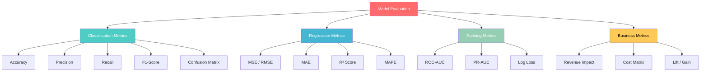
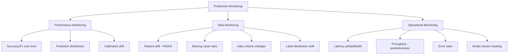

# Phase 11 — Model Evaluation

## Complete Learning & Interview Mastery Guide

---

## Table of Contents

1. [Why Model Evaluation Matters](#why-model-evaluation-matters)
2. [Accuracy — When It Works and When It Lies](#accuracy--when-it-works-and-when-it-lies)
3. [Precision — Minimizing False Positives](#precision--minimizing-false-positives)
4. [Recall — Minimizing False Negatives](#recall--minimizing-false-negatives)
5. [F1-Score — Balancing Precision and Recall](#f1-score--balancing-precision-and-recall)
6. [ROC-AUC — Ranking Quality](#roc-auc--ranking-quality)
7. [Precision-Recall AUC — For Imbalanced Data](#precision-recall-auc--for-imbalanced-data)
8. [Confusion Matrix — Complete Analysis](#confusion-matrix--complete-analysis)
9. [Cross-Validation Deep Dive](#cross-validation-deep-dive)
10. [Regression Metrics](#regression-metrics)
11. [Threshold Tuning & Business Optimization](#threshold-tuning--business-optimization)
12. [Statistical Significance Testing](#statistical-significance-testing)
13. [Production Model Monitoring](#production-model-monitoring)
14. [Interview Mastery](#interview-mastery)

---

## Why Model Evaluation Matters

### Beginner Explanation

Model evaluation tells you how good your model actually is — and more importantly, HOW it fails. A model that's 95% accurate sounds great until you realize it's never detecting the rare fraud cases you built it for. The right metric depends entirely on what matters to your business: is missing a cancer more dangerous than a false alarm? Is blocking a legitimate transaction worse than letting a fraudulent one through?

### The Evaluation Hierarchy



### The Fundamental Question

```
"What does it COST to be wrong?"

If false positives are expensive:   → Optimize PRECISION
  (spam filter blocks real email, good customer denied loan)

If false negatives are expensive:   → Optimize RECALL
  (missed cancer, undetected fraud, missed security threat)

If both are equally bad:            → Optimize F1-SCORE

If you want threshold-independence: → Optimize AUC-ROC or PR-AUC

If you need interpretable numbers:  → Report CONFUSION MATRIX + multiple metrics
```

---

## Accuracy — When It Works and When It Lies

### Definition

```
Accuracy = (Correct Predictions) / (Total Predictions)
         = (TP + TN) / (TP + TN + FP + FN)

Where:
  TP = True Positive  (correctly predicted positive)
  TN = True Negative  (correctly predicted negative)
  FP = False Positive (predicted positive but actually negative) — "Type I Error"
  FN = False Negative (predicted negative but actually positive) — "Type II Error"
```

### When Accuracy WORKS

- Classes are roughly balanced (50/50 or at least 60/40)
- All types of errors are equally costly
- Quick sanity check (is the model better than random?)

### When Accuracy LIES — The Imbalance Problem

```python
import numpy as np

# Fraud detection: 99.5% legitimate, 0.5% fraud
y_true = np.array([0]*995 + [1]*5)  # 1000 samples, 5 fraudulent

# "Model" that ALWAYS predicts "not fraud"
y_pred_dummy = np.zeros(1000)

accuracy = (y_true == y_pred_dummy).mean()
print(f"Accuracy of 'always predict no fraud': {accuracy:.1%}")  # 99.5%!!

# This "model" catches ZERO fraud but has 99.5% accuracy!
# Accuracy is MEANINGLESS for imbalanced data
```

### Balanced Accuracy

```python
from sklearn.metrics import balanced_accuracy_score

# Balanced accuracy = average of recall per class
# Handles imbalanced data fairly

y_true = [0, 0, 0, 0, 0, 0, 0, 0, 1, 1]  # 80% class 0, 20% class 1
y_pred = [0, 0, 0, 0, 0, 0, 0, 0, 0, 0]  # predicts all 0

print(f"Regular accuracy:  {(np.array(y_true)==np.array(y_pred)).mean():.2f}")  # 0.80
print(f"Balanced accuracy: {balanced_accuracy_score(y_true, y_pred):.2f}")      # 0.50

# Balanced accuracy penalizes the model for ignoring the minority class
```

---

## Precision — Minimizing False Positives

### Definition

```
Precision = TP / (TP + FP)

"Of all the samples I predicted as POSITIVE, what fraction actually were positive?"

Also called: Positive Predictive Value (PPV)
```

### Visual Intuition

```
All predictions labeled POSITIVE by the model:
┌─────────────────────────────────────┐
│  Actually Positive (TP)    │ Actually Negative (FP) │
│  ████████████████          │  ░░░░░░                │
│  (correct!)                │  (false alarm!)        │
└─────────────────────────────────────┘

Precision = ████ / (████ + ░░░░) = how clean are my positive predictions?
```

### When to Prioritize Precision

| Scenario | Why Precision Matters | Cost of False Positive |
|----------|----------------------|----------------------|
| Spam filter | Blocking a real email is terrible | User misses important message |
| Recommender system | Showing irrelevant items annoys users | User loses trust |
| Loan approval | Approving a bad loan loses money | Financial loss |
| Drug approval | Approving an ineffective drug | Public health risk |
| Automated actions | Acting on false signal wastes resources | Money, time wasted |

### Code

```python
from sklearn.metrics import precision_score

y_true = [1, 1, 1, 1, 0, 0, 0, 0, 0, 0]
y_pred = [1, 1, 0, 0, 0, 0, 0, 0, 1, 0]

# TP = 2 (correctly predicted 1)
# FP = 1 (predicted 1, but actually 0)
# Precision = 2 / (2 + 1) = 0.667

precision = precision_score(y_true, y_pred)
print(f"Precision: {precision:.3f}")

# Multi-class precision
from sklearn.metrics import precision_score
# average='macro': unweighted mean across classes
# average='weighted': weighted by class frequency
# average='micro': global TP / (TP + FP) across all classes
# average=None: per-class precision
```

---

## Recall — Minimizing False Negatives

### Definition

```
Recall = TP / (TP + FN)

"Of all the ACTUAL positive samples, what fraction did I correctly identify?"

Also called: Sensitivity, True Positive Rate (TPR), Hit Rate
```

### Visual Intuition

```
All ACTUALLY positive samples in the dataset:
┌─────────────────────────────────────┐
│  Model found them (TP)  │ Model missed them (FN)    │
│  ████████████████       │  ░░░░░░░░░░░░            │
│  (detected!)            │  (missed! dangerous!)     │
└─────────────────────────────────────┘

Recall = ████ / (████ + ░░░░) = how many positives did I catch?
```

### When to Prioritize Recall

| Scenario | Why Recall Matters | Cost of False Negative |
|----------|-------------------|----------------------|
| Cancer screening | Missing cancer kills patients | Patient dies |
| Fraud detection | Missing fraud costs money | Financial loss |
| Security threats | Missing intrusion = breach | Data theft |
| Disease outbreak | Missing infected person spreads | Pandemic spread |
| Manufacturing defects | Defective product shipped | Safety hazard, recalls |

### Code

```python
from sklearn.metrics import recall_score

y_true = [1, 1, 1, 1, 0, 0, 0, 0, 0, 0]
y_pred = [1, 1, 0, 0, 0, 0, 0, 0, 1, 0]

# TP = 2 (correctly predicted 1)
# FN = 2 (actually 1, but predicted 0)
# Recall = 2 / (2 + 2) = 0.500

recall = recall_score(y_true, y_pred)
print(f"Recall: {recall:.3f}")
```

### The Precision-Recall Tradeoff

```
You CANNOT maximize both precision and recall simultaneously.

Lower threshold (predict positive more easily):
  → More True Positives → Recall ↑
  → More False Positives → Precision ↓

Higher threshold (predict positive only when very confident):
  → Fewer False Positives → Precision ↑
  → More False Negatives → Recall ↓

Extreme cases:
  Threshold = 0 (predict ALL positive): Recall = 100%, Precision = class_ratio
  Threshold = 1 (predict NONE positive): Recall = 0%, Precision = undefined

The RIGHT tradeoff depends on the business cost of each error type.
```

---

## F1-Score — Balancing Precision and Recall

### Definition

```
F1 = 2 × (Precision × Recall) / (Precision + Recall)

F1 is the HARMONIC MEAN of precision and recall.
- Returns a value between 0 and 1 (1 = perfect)
- Only high when BOTH precision and recall are high
- Penalizes models that sacrifice one for the other

Why harmonic mean (not arithmetic mean)?
  Arithmetic mean of precision=1.0, recall=0.0 → 0.50 (seems OK)
  Harmonic mean of precision=1.0, recall=0.0  → 0.00 (correctly shows problem!)
```

### F-beta Score (Weighted Version)

```python
from sklearn.metrics import fbeta_score

y_true = [1, 1, 1, 1, 0, 0, 0, 0, 0, 0]
y_pred = [1, 1, 1, 0, 0, 0, 0, 0, 1, 0]

# F1: equal weight to precision and recall
f1 = fbeta_score(y_true, y_pred, beta=1)

# F0.5: precision is MORE important (weight precision 2x)
# Use when: false positives are expensive (spam filter)
f05 = fbeta_score(y_true, y_pred, beta=0.5)

# F2: recall is MORE important (weight recall 2x)
# Use when: false negatives are expensive (cancer detection)
f2 = fbeta_score(y_true, y_pred, beta=2)

print(f"F0.5 (precision-focused): {f05:.3f}")
print(f"F1   (balanced):          {f1:.3f}")
print(f"F2   (recall-focused):    {f2:.3f}")

# General formula:
# Fβ = (1 + β²) × (precision × recall) / (β² × precision + recall)
# β > 1: emphasizes recall
# β < 1: emphasizes precision
# β = 1: standard F1
```

### When to Use F1 vs Other Metrics

```
Use F1 when:
- You need a single number to compare models
- Precision and recall are equally important
- Classes are imbalanced (accuracy is misleading)
- You're doing binary classification

Use F0.5 when:
- False positives are more costly than false negatives
- Example: spam filter (don't block real emails)

Use F2 when:
- False negatives are more costly than false positives
- Example: disease screening (don't miss sick patients)

DON'T use F1 when:
- You need threshold-independent evaluation → use AUC
- You have a specific business cost matrix → use expected cost
- You need per-class detail → use classification report
```

---

## ROC-AUC — Ranking Quality

### Beginner Explanation

ROC-AUC measures how well your model **ranks** positive samples above negative samples, regardless of what threshold you choose. An AUC of 1.0 means the model perfectly separates positives and negatives. An AUC of 0.5 means it's no better than random guessing.

### How ROC Works

```
ROC Curve plots:
  X-axis: False Positive Rate (FPR) = FP / (FP + TN) — "noise caught"
  Y-axis: True Positive Rate (TPR) = TP / (TP + FN) — "signal caught" (= Recall)

At EVERY possible threshold, compute (FPR, TPR) → plot as a curve.

AUC = Area Under this ROC Curve
```

```
TPR (Recall)
  1.0 |      ╭──────────────── Perfect model (AUC=1.0)
      |    ╱╱
      |   ╱╱  ╱── Good model (AUC=0.85)
      |  ╱╱ ╱╱
  0.5 |╱╱ ╱╱    ╱── Random (AUC=0.5)
      | ╱╱    ╱╱
      |╱    ╱╱
      |  ╱╱
  0.0 |╱╱──────────────────────
      0    0.5    1.0     FPR

AUC = area under the curve
- 1.0 = perfect (all positives ranked above all negatives)
- 0.5 = random (diagonal line)
- <0.5 = worse than random (flip predictions!)
```

### Probabilistic Interpretation of AUC

```
AUC = P(score(random positive) > score(random negative))

In plain English:
"If I pick a random positive sample and a random negative sample,
what's the probability that the model gives the positive a HIGHER score?"

AUC = 0.90 means: 90% of the time, a random positive gets a higher
score than a random negative. The model's ranking is quite good.
```

### Implementation

```python
import numpy as np
from sklearn.metrics import roc_curve, auc, roc_auc_score
import matplotlib.pyplot as plt

# Simulated predictions (probabilities)
np.random.seed(42)
y_true = np.array([1]*100 + [0]*900)  # 10% positive
y_scores_good = np.where(y_true == 1,
                         np.random.beta(8, 2, 1000),   # positives: high scores
                         np.random.beta(2, 8, 1000))   # negatives: low scores

y_scores_bad = np.where(y_true == 1,
                        np.random.beta(3, 3, 1000),    # positives: medium scores
                        np.random.beta(3, 3, 1000))    # negatives: medium scores (overlap!)

# Compute ROC curves
fpr_good, tpr_good, thresholds_good = roc_curve(y_true, y_scores_good)
fpr_bad, tpr_bad, thresholds_bad = roc_curve(y_true, y_scores_bad)

auc_good = auc(fpr_good, tpr_good)
auc_bad = auc(fpr_bad, tpr_bad)

# Plot
fig, axes = plt.subplots(1, 2, figsize=(14, 6))

# ROC Curves
axes[0].plot(fpr_good, tpr_good, 'b-', lw=2, label=f'Good model (AUC={auc_good:.3f})')
axes[0].plot(fpr_bad, tpr_bad, 'r-', lw=2, label=f'Bad model (AUC={auc_bad:.3f})')
axes[0].plot([0, 1], [0, 1], 'k--', lw=1, label='Random (AUC=0.500)')
axes[0].fill_between(fpr_good, tpr_good, alpha=0.1, color='blue')
axes[0].set_xlabel('False Positive Rate')
axes[0].set_ylabel('True Positive Rate (Recall)')
axes[0].set_title('ROC Curve')
axes[0].legend(loc='lower right')
axes[0].grid(True, alpha=0.3)

# Score distributions (why the good model has higher AUC)
axes[1].hist(y_scores_good[y_true==1], bins=30, alpha=0.5, label='Positive (good)', color='blue')
axes[1].hist(y_scores_good[y_true==0], bins=30, alpha=0.5, label='Negative (good)', color='red')
axes[1].set_xlabel('Model Score')
axes[1].set_ylabel('Count')
axes[1].set_title('Score Distribution (Good Model)')
axes[1].legend()
axes[1].grid(True, alpha=0.3)

plt.tight_layout()
plt.show()

# Quick AUC calculation
print(f"Good model AUC: {roc_auc_score(y_true, y_scores_good):.4f}")
print(f"Bad model AUC:  {roc_auc_score(y_true, y_scores_bad):.4f}")
```

### Multi-class AUC

```python
from sklearn.metrics import roc_auc_score
from sklearn.preprocessing import label_binarize

# Multi-class: use One-vs-Rest (OvR) strategy
y_true_multi = [0, 1, 2, 0, 1, 2, 0, 1, 2, 0]
y_scores_multi = [
    [0.8, 0.1, 0.1],  # confident class 0
    [0.1, 0.7, 0.2],  # confident class 1
    [0.1, 0.2, 0.7],  # confident class 2
    [0.7, 0.2, 0.1],
    [0.2, 0.6, 0.2],
    [0.1, 0.1, 0.8],
    [0.6, 0.3, 0.1],
    [0.1, 0.8, 0.1],
    [0.2, 0.2, 0.6],
    [0.9, 0.05, 0.05]
]

# One-vs-Rest AUC
auc_ovr = roc_auc_score(y_true_multi, y_scores_multi, multi_class='ovr')
print(f"Multi-class AUC (OvR): {auc_ovr:.4f}")

# One-vs-One AUC
auc_ovo = roc_auc_score(y_true_multi, y_scores_multi, multi_class='ovo')
print(f"Multi-class AUC (OvO): {auc_ovo:.4f}")
```

### When ROC-AUC Fails

```
ROC-AUC can be MISLEADING when:

1. Extreme class imbalance (1:1000+)
   - ROC curve looks great because TN is huge → FPR stays low
   - Even many false positives barely move FPR
   - Solution: Use PR-AUC instead

2. You care about a specific operating point
   - AUC summarizes ALL thresholds equally
   - But you'll only use ONE threshold in production
   - Solution: Report metric at your chosen threshold

3. Model calibration matters
   - AUC only measures ranking, not probability quality
   - A model with AUC=0.95 might output P(fraud)=0.3 for actual fraud
   - Solution: Check calibration curve + Brier score
```

---

## Precision-Recall AUC — For Imbalanced Data

### Why PR-AUC Is Better for Imbalanced Data

```
With 99.9% negatives and 0.1% positives:

ROC-AUC problem:
  - 100 false positives out of 99,900 negatives → FPR = 0.001 (looks great!)
  - But those 100 FPs might overwhelm the 100 TPs in practice
  - ROC doesn't "see" this problem because TN count is so large

PR-AUC shows the real picture:
  - 100 TP and 100 FP → Precision = 0.50 (clearly shows the problem)
  - Precision directly shows how many of your positive predictions are wrong
```

### Implementation

```python
from sklearn.metrics import precision_recall_curve, average_precision_score
import matplotlib.pyplot as plt
import numpy as np

# Highly imbalanced scenario (1% positive)
np.random.seed(42)
y_true = np.array([1]*50 + [0]*4950)  # 1% positive

# Good model
y_scores = np.where(y_true == 1,
                    np.random.beta(6, 2, 5000),
                    np.random.beta(1, 6, 5000))

# Compute PR curve
precision, recall, thresholds = precision_recall_curve(y_true, y_scores)
ap_score = average_precision_score(y_true, y_scores)

# Plot
plt.figure(figsize=(10, 6))
plt.plot(recall, precision, 'b-', lw=2, label=f'Model (AP={ap_score:.3f})')

# Baseline for PR curve = positive class ratio
baseline = y_true.mean()
plt.axhline(y=baseline, color='r', linestyle='--', label=f'Random baseline ({baseline:.3f})')

plt.xlabel('Recall', fontsize=12)
plt.ylabel('Precision', fontsize=12)
plt.title('Precision-Recall Curve (1% Positive Class)', fontsize=14)
plt.legend(fontsize=11)
plt.grid(True, alpha=0.3)
plt.xlim([0, 1])
plt.ylim([0, 1.05])
plt.tight_layout()
plt.show()

print(f"Average Precision (PR-AUC): {ap_score:.4f}")
print(f"ROC-AUC (for comparison): {roc_auc_score(y_true, y_scores):.4f}")
# ROC-AUC will be higher and more "optimistic" than PR-AUC for imbalanced data
```

### ROC-AUC vs PR-AUC Decision Guide

```
Use ROC-AUC when:
  - Classes are roughly balanced
  - You care about ranking quality across ALL thresholds
  - Both TP and TN are important
  - Standard benchmark comparison (most papers report ROC-AUC)

Use PR-AUC when:
  - Significant class imbalance (positive class < 10%)
  - False positives are costly relative to the positive class size
  - You primarily care about the POSITIVE class
  - Fraud detection, disease screening, anomaly detection

Rule of thumb:
  If positive_class_ratio < 5%: use PR-AUC
  If positive_class_ratio > 20%: use ROC-AUC
  In between: report both
```

---

## Confusion Matrix — Complete Analysis

### Anatomy of a Confusion Matrix

```
                        PREDICTED
                    Negative    Positive
              ┌────────────┬────────────┐
ACTUAL  Neg   │     TN     │     FP     │
              │ (correct)  │(Type I err)│
              ├────────────┼────────────┤
ACTUAL  Pos   │     FN     │     TP     │
              │(Type II err)│ (correct)  │
              └────────────┴────────────┘

From the confusion matrix, derive ALL metrics:
  Accuracy  = (TP + TN) / (TP + TN + FP + FN)
  Precision = TP / (TP + FP)       ← column-wise for positive
  Recall    = TP / (TP + FN)       ← row-wise for positive
  Specificity = TN / (TN + FP)    ← recall for negative class
  FPR = FP / (FP + TN) = 1 - Specificity
  F1 = 2·P·R / (P+R)
```

### Complete Confusion Matrix Analysis

```python
import numpy as np
from sklearn.metrics import (confusion_matrix, classification_report,
                             ConfusionMatrixDisplay)
import matplotlib.pyplot as plt

# Simulated predictions
np.random.seed(42)
y_true = np.array([1]*200 + [0]*800)
scores = np.where(y_true == 1,
                  np.random.beta(7, 3, 1000),
                  np.random.beta(2, 7, 1000))
y_pred = (scores > 0.5).astype(int)

# Confusion Matrix
cm = confusion_matrix(y_true, y_pred)
tn, fp, fn, tp = cm.ravel()

print("Confusion Matrix:")
print(f"  TN={tn}  FP={fp}")
print(f"  FN={fn}  TP={tp}")
print(f"\nDerived Metrics:")
print(f"  Accuracy:    {(tp+tn)/(tp+tn+fp+fn):.4f}")
print(f"  Precision:   {tp/(tp+fp):.4f}")
print(f"  Recall:      {tp/(tp+fn):.4f}")
print(f"  Specificity: {tn/(tn+fp):.4f}")
print(f"  F1-Score:    {2*tp/(2*tp+fp+fn):.4f}")
print(f"  FPR:         {fp/(fp+tn):.4f}")

# Full classification report
print("\n" + classification_report(y_true, y_pred, target_names=['Negative', 'Positive']))

# Visual
fig, axes = plt.subplots(1, 2, figsize=(12, 5))

# Counts
ConfusionMatrixDisplay(cm, display_labels=['Negative', 'Positive']).plot(ax=axes[0], cmap='Blues')
axes[0].set_title('Confusion Matrix (Counts)')

# Normalized by true label (shows recall per class)
cm_normalized = cm.astype('float') / cm.sum(axis=1)[:, np.newaxis]
ConfusionMatrixDisplay(cm_normalized, display_labels=['Negative', 'Positive']).plot(ax=axes[1], cmap='Oranges', values_format='.2%')
axes[1].set_title('Confusion Matrix (Normalized by True Class)')

plt.tight_layout()
plt.show()
```

### Multi-class Confusion Matrix

```python
from sklearn.metrics import confusion_matrix, classification_report
import seaborn as sns
import matplotlib.pyplot as plt
import numpy as np

# Multi-class example (3 classes)
y_true_multi = np.array([0]*100 + [1]*100 + [2]*100)
y_pred_multi = np.array(
    [0]*80 + [1]*15 + [2]*5 +    # class 0: 80% correct
    [0]*10 + [1]*75 + [2]*15 +   # class 1: 75% correct
    [0]*5  + [1]*10 + [2]*85     # class 2: 85% correct
)

cm = confusion_matrix(y_true_multi, y_pred_multi)

plt.figure(figsize=(8, 6))
sns.heatmap(cm, annot=True, fmt='d', cmap='Blues',
            xticklabels=['Class 0', 'Class 1', 'Class 2'],
            yticklabels=['Class 0', 'Class 1', 'Class 2'])
plt.xlabel('Predicted')
plt.ylabel('Actual')
plt.title('Multi-class Confusion Matrix')
plt.tight_layout()
plt.show()

print(classification_report(y_true_multi, y_pred_multi,
                           target_names=['Class 0', 'Class 1', 'Class 2']))
```

### Error Analysis with Confusion Matrix

```python
def detailed_error_analysis(y_true, y_pred, y_proba, feature_df):
    """Analyze WHERE and WHY the model fails."""

    # Categorize predictions
    tp_mask = (y_true == 1) & (y_pred == 1)
    tn_mask = (y_true == 0) & (y_pred == 0)
    fp_mask = (y_true == 0) & (y_pred == 1)  # false alarms
    fn_mask = (y_true == 1) & (y_pred == 0)  # missed positives

    print("=== ERROR ANALYSIS ===\n")

    # False Positives: what do they look like?
    print(f"FALSE POSITIVES ({fp_mask.sum()} samples):")
    print(f"  Average confidence: {y_proba[fp_mask].mean():.3f}")
    print(f"  Feature means:\n{feature_df[fp_mask].mean().to_string()}\n")

    # False Negatives: what are we missing?
    print(f"FALSE NEGATIVES ({fn_mask.sum()} samples):")
    print(f"  Average confidence: {y_proba[fn_mask].mean():.3f}")
    print(f"  Feature means:\n{feature_df[fn_mask].mean().to_string()}\n")

    # Compare FP vs TP (why is the model confused?)
    print("FP vs TP feature comparison:")
    print(f"  FP mean features: {feature_df[fp_mask].mean().values[:3].round(3)}")
    print(f"  TP mean features: {feature_df[tp_mask].mean().values[:3].round(3)}")
    print("  (Features where FP ≈ TP indicate model confusion boundaries)")
```

---

## Cross-Validation Deep Dive

### Why Simple Train/Test Split Isn't Enough

```
Problem with single train/test split:
- Lucky/unlucky split can give misleading results
- Wastes data (can't train on test set)
- High variance in estimate (depends heavily on which samples are in test)

Cross-validation solves this:
- Uses ALL data for both training and evaluation
- Averages over multiple splits → lower variance estimate
- Gives confidence intervals on performance
```

### Types of Cross-Validation

```python
from sklearn.model_selection import (KFold, StratifiedKFold, RepeatedStratifiedKFold,
                                     LeaveOneOut, GroupKFold, TimeSeriesSplit,
                                     cross_val_score, cross_validate)
from sklearn.ensemble import RandomForestClassifier
import numpy as np

# Generate data
from sklearn.datasets import make_classification
X, y = make_classification(n_samples=1000, n_features=20, random_state=42)

model = RandomForestClassifier(n_estimators=100, random_state=42)

# --- 1. Standard K-Fold ---
kf = KFold(n_splits=5, shuffle=True, random_state=42)
scores = cross_val_score(model, X, y, cv=kf, scoring='accuracy')
print(f"5-Fold CV: {scores.mean():.4f} ± {scores.std():.4f}")
print(f"  Per-fold: {scores.round(4)}")

# --- 2. Stratified K-Fold (ALWAYS USE for classification) ---
# Maintains class proportions in each fold
skf = StratifiedKFold(n_splits=5, shuffle=True, random_state=42)
scores = cross_val_score(model, X, y, cv=skf, scoring='roc_auc')
print(f"\nStratified 5-Fold AUC: {scores.mean():.4f} ± {scores.std():.4f}")

# --- 3. Repeated Stratified K-Fold (most robust) ---
# Repeats the process multiple times with different random splits
rskf = RepeatedStratifiedKFold(n_splits=5, n_repeats=10, random_state=42)
scores = cross_val_score(model, X, y, cv=rskf, scoring='roc_auc')
print(f"\n5×10 Repeated CV AUC: {scores.mean():.4f} ± {scores.std():.4f}")

# --- 4. Time Series Split (for temporal data — NEVER random split!) ---
tscv = TimeSeriesSplit(n_splits=5)
scores = cross_val_score(model, X, y, cv=tscv, scoring='accuracy')
print(f"\nTime Series CV: {scores.mean():.4f} ± {scores.std():.4f}")

# --- 5. Group K-Fold (data from same group must stay together) ---
# Example: multiple measurements from same patient → patient can't be in both train and test
groups = np.repeat(range(200), 5)  # 200 groups, 5 samples each
gkf = GroupKFold(n_splits=5)
scores = cross_val_score(model, X, y, cv=gkf, groups=groups, scoring='accuracy')
print(f"\nGroup K-Fold CV: {scores.mean():.4f} ± {scores.std():.4f}")

# --- 6. Leave-One-Out (for very small datasets) ---
# N-fold CV where N = number of samples — uses maximum training data
loo = LeaveOneOut()
# Warning: very slow for large datasets!
# scores = cross_val_score(model, X[:100], y[:100], cv=loo)
```

### Getting Multiple Metrics from CV

```python
from sklearn.model_selection import cross_validate

# Get multiple metrics + training scores + timing
cv_results = cross_validate(
    model, X, y,
    cv=StratifiedKFold(n_splits=5, shuffle=True, random_state=42),
    scoring=['accuracy', 'precision', 'recall', 'f1', 'roc_auc'],
    return_train_score=True,
    n_jobs=-1
)

print("Cross-Validation Results (5-fold):")
print(f"{'Metric':<12} {'Train':<16} {'Test':<16} {'Overfit Gap'}")
print("-" * 56)
for metric in ['accuracy', 'precision', 'recall', 'f1', 'roc_auc']:
    train_key = f'train_{metric}'
    test_key = f'test_{metric}'
    train_score = cv_results[train_key].mean()
    test_score = cv_results[test_key].mean()
    gap = train_score - test_score
    print(f"{metric:<12} {train_score:.4f} ± {cv_results[train_key].std():.3f}  "
          f"{test_score:.4f} ± {cv_results[test_key].std():.3f}  {gap:.4f}")

print(f"\nAvg fit time: {cv_results['fit_time'].mean():.2f}s")
print(f"Avg score time: {cv_results['score_time'].mean():.4f}s")
```

### Nested Cross-Validation (Unbiased Model Selection)

```python
from sklearn.model_selection import cross_val_score, GridSearchCV, StratifiedKFold

# Problem: If you use CV to tune hyperparameters AND evaluate performance,
# you get an OPTIMISTIC estimate (you've indirectly overfit to the test folds).

# Solution: NESTED CV
# Outer loop: evaluates final performance (unbiased)
# Inner loop: tunes hyperparameters

from sklearn.ensemble import GradientBoostingClassifier

# Inner CV: hyperparameter tuning
param_grid = {
    'n_estimators': [50, 100, 200],
    'max_depth': [3, 5, 7],
    'learning_rate': [0.01, 0.1, 0.2]
}

inner_cv = StratifiedKFold(n_splits=3, shuffle=True, random_state=42)
grid_search = GridSearchCV(
    GradientBoostingClassifier(random_state=42),
    param_grid, cv=inner_cv, scoring='roc_auc', n_jobs=-1
)

# Outer CV: unbiased performance evaluation
outer_cv = StratifiedKFold(n_splits=5, shuffle=True, random_state=42)
nested_scores = cross_val_score(grid_search, X, y, cv=outer_cv, scoring='roc_auc')

print(f"Nested CV AUC: {nested_scores.mean():.4f} ± {nested_scores.std():.4f}")
print(f"This is an UNBIASED estimate of generalization performance")

# Compare with non-nested (optimistic) estimate
grid_search.fit(X, y)
print(f"\nNon-nested best CV AUC: {grid_search.best_score_:.4f} (optimistic!)")
```

---

## Regression Metrics

### Complete Regression Metrics Guide

```python
import numpy as np
from sklearn.metrics import (mean_squared_error, mean_absolute_error,
                             r2_score, mean_absolute_percentage_error)

# Simulated predictions
np.random.seed(42)
y_true = np.random.uniform(10, 100, 200)
y_pred = y_true + np.random.normal(0, 5, 200)  # good predictions with some noise

# --- Mean Squared Error (MSE) ---
# Penalizes large errors heavily (squared)
mse = mean_squared_error(y_true, y_pred)
print(f"MSE:  {mse:.4f}")

# --- Root Mean Squared Error (RMSE) ---
# Same units as target → interpretable
rmse = np.sqrt(mse)
print(f"RMSE: {rmse:.4f}  (in same units as target)")

# --- Mean Absolute Error (MAE) ---
# Robust to outliers (not squared)
mae = mean_absolute_error(y_true, y_pred)
print(f"MAE:  {mae:.4f}")

# --- R² Score (Coefficient of Determination) ---
# How much variance is explained (1.0 = perfect, 0 = predicts mean, <0 = worse than mean)
r2 = r2_score(y_true, y_pred)
print(f"R²:   {r2:.4f}  ({r2*100:.1f}% variance explained)")

# --- Mean Absolute Percentage Error (MAPE) ---
# Percentage-based → comparable across different scales
mape = mean_absolute_percentage_error(y_true, y_pred)
print(f"MAPE: {mape:.4f}  ({mape*100:.1f}% average error)")

# --- Adjusted R² (for comparing models with different feature counts) ---
n = len(y_true)
p = 10  # number of features
adj_r2 = 1 - (1 - r2) * (n - 1) / (n - p - 1)
print(f"Adj R²: {adj_r2:.4f}  (penalizes adding useless features)")
```

### When to Use Which Regression Metric

| Metric | Best When | Sensitive to Outliers | Units |
|--------|----------|:---:|------|
| **RMSE** | Large errors are very bad | Yes (squared) | Same as target |
| **MAE** | All errors matter equally, outliers present | No | Same as target |
| **R²** | Need 0-1 scale, comparing models | Moderate | Unitless |
| **MAPE** | Relative errors matter, different scales | Moderate | Percentage |
| **Huber** | Some outliers but large errors still matter | Configurable | Same as target |
| **Quantile** | Asymmetric errors (over/under-prediction) | Depends | Same as target |

### Regression Diagnostic Plots

```python
import matplotlib.pyplot as plt
import numpy as np
from scipy import stats

def full_regression_diagnostics(y_true, y_pred, figsize=(16, 12)):
    """Complete regression model diagnostic suite."""
    residuals = y_true - y_pred
    standardized_residuals = (residuals - residuals.mean()) / residuals.std()

    fig, axes = plt.subplots(2, 3, figsize=figsize)

    # 1. Actual vs Predicted
    axes[0, 0].scatter(y_true, y_pred, alpha=0.4, s=20, c='steelblue')
    min_val, max_val = min(y_true.min(), y_pred.min()), max(y_true.max(), y_pred.max())
    axes[0, 0].plot([min_val, max_val], [min_val, max_val], 'r--', lw=2)
    axes[0, 0].set_xlabel('Actual')
    axes[0, 0].set_ylabel('Predicted')
    axes[0, 0].set_title(f'Actual vs Predicted (R²={r2_score(y_true, y_pred):.3f})')
    axes[0, 0].grid(True, alpha=0.3)

    # 2. Residuals vs Predicted (heteroscedasticity check)
    axes[0, 1].scatter(y_pred, residuals, alpha=0.4, s=20, c='coral')
    axes[0, 1].axhline(y=0, color='red', linestyle='--', lw=2)
    axes[0, 1].set_xlabel('Predicted')
    axes[0, 1].set_ylabel('Residual')
    axes[0, 1].set_title('Residuals vs Predicted')
    axes[0, 1].grid(True, alpha=0.3)

    # 3. Residual distribution (normality check)
    axes[0, 2].hist(residuals, bins=30, density=True, alpha=0.7, color='purple')
    x_range = np.linspace(residuals.min(), residuals.max(), 100)
    axes[0, 2].plot(x_range, stats.norm.pdf(x_range, residuals.mean(), residuals.std()),
                    'r-', lw=2, label='Normal fit')
    axes[0, 2].set_title('Residual Distribution')
    axes[0, 2].legend()

    # 4. Q-Q Plot (normality check)
    stats.probplot(residuals, dist="norm", plot=axes[1, 0])
    axes[1, 0].set_title('Q-Q Plot')

    # 5. Scale-Location (√|standardized residuals| vs predicted)
    axes[1, 1].scatter(y_pred, np.sqrt(np.abs(standardized_residuals)),
                      alpha=0.4, s=20, c='green')
    axes[1, 1].set_xlabel('Predicted')
    axes[1, 1].set_ylabel('√|Standardized Residuals|')
    axes[1, 1].set_title('Scale-Location (Check Constant Variance)')
    axes[1, 1].grid(True, alpha=0.3)

    # 6. Residuals vs Index (check for patterns / autocorrelation)
    axes[1, 2].plot(range(len(residuals)), residuals, 'o-', alpha=0.4, markersize=3)
    axes[1, 2].axhline(y=0, color='red', linestyle='--', lw=2)
    axes[1, 2].set_xlabel('Observation Index')
    axes[1, 2].set_ylabel('Residual')
    axes[1, 2].set_title('Residuals vs Order (Autocorrelation Check)')
    axes[1, 2].grid(True, alpha=0.3)

    plt.suptitle('Regression Model Diagnostics', fontsize=14, y=1.02)
    plt.tight_layout()
    plt.show()

    # Summary statistics
    print(f"\nDiagnostic Summary:")
    print(f"  Residual mean: {residuals.mean():.4f} (should be ~0)")
    print(f"  Residual std:  {residuals.std():.4f}")
    print(f"  Shapiro-Wilk p-value: {stats.shapiro(residuals[:500])[1]:.4f} "
          f"(p>0.05 → normal)")
    print(f"  % residuals within ±2σ: {(np.abs(standardized_residuals) < 2).mean()*100:.1f}% "
          f"(expect ~95%)")
```

---

## Threshold Tuning & Business Optimization

### Why Default 0.5 Threshold Is Wrong

```
Most classifiers output P(class=1). The default decision:
  predict 1 if P > 0.5, else predict 0

This is ONLY optimal when:
  1. Classes are balanced
  2. False positives and false negatives have EQUAL cost
  3. Model is well-calibrated

In production, these are rarely true. The optimal threshold depends on:
  - Class imbalance
  - Business cost of each error type
  - Required precision/recall operating point
```

### Finding Optimal Threshold

```python
import numpy as np
from sklearn.metrics import (precision_recall_curve, f1_score,
                             precision_score, recall_score)
import matplotlib.pyplot as plt

def find_optimal_threshold(y_true, y_proba, method='f1', target_recall=None,
                           target_precision=None, cost_fp=1, cost_fn=1):
    """Find optimal classification threshold using various strategies."""

    thresholds = np.linspace(0.01, 0.99, 200)
    results = []

    for t in thresholds:
        y_pred = (y_proba >= t).astype(int)
        tp = ((y_pred == 1) & (y_true == 1)).sum()
        fp = ((y_pred == 1) & (y_true == 0)).sum()
        fn = ((y_pred == 0) & (y_true == 1)).sum()
        tn = ((y_pred == 0) & (y_true == 0)).sum()

        prec = tp / (tp + fp) if (tp + fp) > 0 else 0
        rec = tp / (tp + fn) if (tp + fn) > 0 else 0
        f1 = 2 * prec * rec / (prec + rec) if (prec + rec) > 0 else 0
        cost = cost_fp * fp + cost_fn * fn

        results.append({'threshold': t, 'precision': prec, 'recall': rec,
                       'f1': f1, 'cost': cost, 'tp': tp, 'fp': fp, 'fn': fn})

    import pandas as pd
    df = pd.DataFrame(results)

    # Choose optimal based on method
    if method == 'f1':
        optimal_idx = df['f1'].idxmax()
    elif method == 'cost':
        optimal_idx = df['cost'].idxmin()
    elif method == 'target_recall' and target_recall is not None:
        valid = df[df['recall'] >= target_recall]
        optimal_idx = valid['precision'].idxmax() if len(valid) > 0 else df['recall'].idxmax()
    elif method == 'target_precision' and target_precision is not None:
        valid = df[df['precision'] >= target_precision]
        optimal_idx = valid['recall'].idxmax() if len(valid) > 0 else df['precision'].idxmax()
    else:
        optimal_idx = df['f1'].idxmax()

    optimal = df.iloc[optimal_idx]

    # Plot
    fig, axes = plt.subplots(1, 2, figsize=(14, 5))

    axes[0].plot(df['threshold'], df['precision'], 'b-', label='Precision', lw=2)
    axes[0].plot(df['threshold'], df['recall'], 'r-', label='Recall', lw=2)
    axes[0].plot(df['threshold'], df['f1'], 'g-', label='F1', lw=2)
    axes[0].axvline(x=optimal['threshold'], color='black', linestyle='--',
                   label=f"Optimal: {optimal['threshold']:.3f}")
    axes[0].set_xlabel('Threshold')
    axes[0].set_ylabel('Score')
    axes[0].set_title('Precision / Recall / F1 vs Threshold')
    axes[0].legend()
    axes[0].grid(True, alpha=0.3)

    axes[1].plot(df['threshold'], df['cost'], 'purple', lw=2)
    axes[1].axvline(x=optimal['threshold'], color='black', linestyle='--')
    axes[1].set_xlabel('Threshold')
    axes[1].set_ylabel(f'Cost (FP×{cost_fp} + FN×{cost_fn})')
    axes[1].set_title('Business Cost vs Threshold')
    axes[1].grid(True, alpha=0.3)

    plt.tight_layout()
    plt.show()

    print(f"\nOptimal threshold ({method}): {optimal['threshold']:.3f}")
    print(f"  Precision: {optimal['precision']:.4f}")
    print(f"  Recall:    {optimal['recall']:.4f}")
    print(f"  F1:        {optimal['f1']:.4f}")

    return optimal['threshold']

# Example usage:
np.random.seed(42)
y_true = np.array([1]*100 + [0]*900)
y_proba = np.where(y_true == 1, np.random.beta(7, 3, 1000), np.random.beta(2, 7, 1000))

# Method 1: Maximize F1
t_f1 = find_optimal_threshold(y_true, y_proba, method='f1')

# Method 2: Minimize business cost (FN costs 10x more than FP)
t_cost = find_optimal_threshold(y_true, y_proba, method='cost', cost_fp=1, cost_fn=10)

# Method 3: Achieve at least 95% recall
t_recall = find_optimal_threshold(y_true, y_proba, method='target_recall', target_recall=0.95)
```

### Cost-Sensitive Evaluation

```python
def evaluate_with_cost_matrix(y_true, y_pred, cost_tp=0, cost_tn=0,
                               cost_fp=1, cost_fn=10):
    """Evaluate model with business-specific costs."""
    cm = confusion_matrix(y_true, y_pred)
    tn, fp, fn, tp = cm.ravel()

    total_cost = (cost_tp * tp + cost_tn * tn + cost_fp * fp + cost_fn * fn)
    avg_cost = total_cost / len(y_true)

    print(f"Cost Matrix: TP={cost_tp}, TN={cost_tn}, FP={cost_fp}, FN={cost_fn}")
    print(f"Confusion: TP={tp}, TN={tn}, FP={fp}, FN={fn}")
    print(f"Total cost: ${total_cost:,.0f}")
    print(f"Average cost per prediction: ${avg_cost:.2f}")
    print(f"Cost if we did NOTHING (predict all negative): "
          f"${cost_fn * (tp + fn):,.0f}")
    print(f"Model SAVES: ${cost_fn * (tp + fn) - total_cost:,.0f}")

    return total_cost

# Example: Fraud detection
# Missing a fraud (FN) costs $500 (chargeback)
# Investigating a false alarm (FP) costs $25 (analyst time)
evaluate_with_cost_matrix(y_true, (y_proba > 0.3).astype(int),
                          cost_fp=25, cost_fn=500)
```

---

## Statistical Significance Testing

### Is Model A Actually Better Than Model B?

```python
import numpy as np
from scipy import stats
from sklearn.model_selection import cross_val_score, RepeatedStratifiedKFold

def compare_models(model_a, model_b, X, y, n_splits=10, n_repeats=5):
    """Statistically compare two models using paired t-test on CV scores."""

    cv = RepeatedStratifiedKFold(n_splits=n_splits, n_repeats=n_repeats, random_state=42)

    scores_a = cross_val_score(model_a, X, y, cv=cv, scoring='roc_auc')
    scores_b = cross_val_score(model_b, X, y, cv=cv, scoring='roc_auc')

    # Paired t-test (same folds for both models)
    t_stat, p_value = stats.ttest_rel(scores_a, scores_b)

    print(f"Model A: AUC = {scores_a.mean():.4f} ± {scores_a.std():.4f}")
    print(f"Model B: AUC = {scores_b.mean():.4f} ± {scores_b.std():.4f}")
    print(f"Difference: {(scores_a - scores_b).mean():.4f}")
    print(f"Paired t-test: t={t_stat:.3f}, p={p_value:.4f}")

    if p_value < 0.05:
        better = "A" if scores_a.mean() > scores_b.mean() else "B"
        print(f"✓ Statistically significant difference (p < 0.05). Model {better} is better.")
    else:
        print(f"✗ NOT statistically significant (p = {p_value:.3f}). Models are equivalent.")

    return scores_a, scores_b, p_value

# Usage:
from sklearn.ensemble import RandomForestClassifier, GradientBoostingClassifier
from sklearn.datasets import make_classification

X, y = make_classification(n_samples=1000, n_features=20, random_state=42)
model_a = RandomForestClassifier(n_estimators=100, random_state=42)
model_b = GradientBoostingClassifier(n_estimators=100, random_state=42)

scores_a, scores_b, p_val = compare_models(model_a, model_b, X, y)
```

### Confidence Intervals for Metrics

```python
from sklearn.utils import resample

def bootstrap_confidence_interval(y_true, y_scores, metric_func,
                                   n_bootstraps=1000, confidence=0.95):
    """Compute confidence interval for any metric using bootstrap."""
    scores = []

    for _ in range(n_bootstraps):
        # Resample with replacement
        indices = resample(range(len(y_true)), n_samples=len(y_true))
        y_true_boot = y_true[indices]
        y_scores_boot = y_scores[indices]

        # Skip if only one class in bootstrap sample
        if len(np.unique(y_true_boot)) < 2:
            continue

        score = metric_func(y_true_boot, y_scores_boot)
        scores.append(score)

    scores = np.array(scores)
    alpha = (1 - confidence) / 2

    lower = np.percentile(scores, alpha * 100)
    upper = np.percentile(scores, (1 - alpha) * 100)
    mean = scores.mean()

    print(f"Metric: {mean:.4f}")
    print(f"{confidence*100:.0f}% CI: [{lower:.4f}, {upper:.4f}]")

    return mean, lower, upper

# Usage:
from sklearn.metrics import roc_auc_score
bootstrap_confidence_interval(y_true, y_proba, roc_auc_score)
```

---

## Production Model Monitoring

### Key Monitoring Dimensions



### Population Stability Index (PSI) — Detecting Data Drift

```python
import numpy as np

def calculate_psi(expected, actual, bins=10):
    """Population Stability Index — measures distribution shift.

    PSI < 0.1: No significant shift
    PSI 0.1-0.25: Moderate shift — investigate
    PSI > 0.25: Significant shift — retrain model
    """
    # Create bins from expected distribution
    breakpoints = np.quantile(expected, np.linspace(0, 1, bins + 1))
    breakpoints[0] = -np.inf
    breakpoints[-1] = np.inf

    # Calculate proportions in each bin
    expected_counts = np.histogram(expected, bins=breakpoints)[0]
    actual_counts = np.histogram(actual, bins=breakpoints)[0]

    # Avoid division by zero
    expected_pcts = np.clip(expected_counts / expected_counts.sum(), 0.001, None)
    actual_pcts = np.clip(actual_counts / actual_counts.sum(), 0.001, None)

    # PSI formula
    psi = np.sum((actual_pcts - expected_pcts) * np.log(actual_pcts / expected_pcts))
    return psi

# Example: Check if feature distributions have shifted
np.random.seed(42)
training_distribution = np.random.normal(50, 10, 10000)
production_distribution_ok = np.random.normal(50, 10, 5000)      # no drift
production_distribution_drift = np.random.normal(55, 12, 5000)   # drift!

psi_ok = calculate_psi(training_distribution, production_distribution_ok)
psi_drift = calculate_psi(training_distribution, production_distribution_drift)

print(f"PSI (no drift):   {psi_ok:.4f}  {'✓ OK' if psi_ok < 0.1 else '⚠️ DRIFT'}")
print(f"PSI (with drift): {psi_drift:.4f}  {'✓ OK' if psi_drift < 0.1 else '⚠️ DRIFT'}")
```

### Complete Monitoring Pipeline

```python
class ModelMonitor:
    """Production model monitoring system."""

    def __init__(self, training_data, training_predictions, training_labels):
        self.training_features = training_data
        self.training_pred_dist = training_predictions
        self.training_labels = training_labels
        self.alerts = []

    def check_feature_drift(self, current_features, threshold=0.2):
        """Check PSI for each feature."""
        drifted_features = []
        for col in range(current_features.shape[1]):
            psi = calculate_psi(
                self.training_features[:, col],
                current_features[:, col]
            )
            if psi > threshold:
                drifted_features.append((col, psi))
                self.alerts.append(f"⚠️ Feature {col} drift: PSI={psi:.3f}")
        return drifted_features

    def check_prediction_drift(self, current_predictions, threshold=0.15):
        """Check if prediction distribution has shifted."""
        psi = calculate_psi(self.training_pred_dist, current_predictions)
        if psi > threshold:
            self.alerts.append(f"⚠️ Prediction distribution drift: PSI={psi:.3f}")
        return psi

    def check_performance(self, current_labels, current_predictions, metric_func,
                          min_threshold=0.80):
        """Check if performance has dropped below threshold."""
        current_performance = metric_func(current_labels, current_predictions)
        if current_performance < min_threshold:
            self.alerts.append(
                f"🚨 Performance drop: {current_performance:.3f} < {min_threshold}")
        return current_performance

    def check_data_quality(self, current_features):
        """Check for data quality issues."""
        missing_rate = np.isnan(current_features).mean(axis=0)
        high_missing = np.where(missing_rate > 0.1)[0]
        if len(high_missing) > 0:
            self.alerts.append(
                f"⚠️ High missing rate in features: {high_missing.tolist()}")

        return missing_rate

    def get_report(self):
        """Generate monitoring report."""
        print("="*50)
        print("MODEL MONITORING REPORT")
        print("="*50)
        if self.alerts:
            for alert in self.alerts:
                print(f"  {alert}")
        else:
            print("  ✓ All checks passed. Model healthy.")
        print("="*50)
        self.alerts = []  # reset
```

---

## Interview Mastery

### Beginner Questions

---

**Q1: What is the difference between precision and recall?**

**Perfect Answer:**
> "Precision answers: 'Of everything I predicted as positive, what fraction was actually positive?' It measures how trustworthy your positive predictions are. Recall answers: 'Of all actual positives, what fraction did I find?' It measures how complete your detection is.
>
> Example: In a spam filter with 100 emails (10 spam, 90 not-spam), if the model flags 15 emails as spam (8 correctly, 7 wrongly): Precision = 8/15 = 53% (many false alarms). Recall = 8/10 = 80% (found most spam). There's always a tradeoff — you can increase recall by being more aggressive (lower threshold), but precision will drop."

**Interviewer expectation:** Give a concrete numeric example. Mention the tradeoff. Explain when each matters.

---

**Q2: When would you use AUC-ROC vs accuracy?**

**Perfect Answer:**
> "Accuracy is appropriate when classes are balanced and all errors are equally costly. AUC-ROC is better when: (1) classes are imbalanced — a model predicting all-negative achieves high accuracy but 0 recall on the positive class; (2) you want a threshold-independent metric — AUC evaluates the model's ranking ability across ALL thresholds; (3) you care about probability quality, not just hard predictions. AUC = 0.90 means there's a 90% chance the model scores a random positive higher than a random negative. For severely imbalanced data (< 5% positive), I'd use PR-AUC instead of ROC-AUC, because ROC-AUC can still look good when precision is actually terrible."

---

**Q3: Explain what a confusion matrix tells you.**

**Perfect Answer:**
> "A confusion matrix is a 2×2 table (for binary classification) showing: True Positives (correctly predicted positive), True Negatives (correctly predicted negative), False Positives (predicted positive but actually negative — Type I error), and False Negatives (predicted negative but actually positive — Type II error). Every classification metric is derived from these four numbers: Accuracy = (TP+TN)/total, Precision = TP/(TP+FP), Recall = TP/(TP+FN). The power of the confusion matrix is that it shows you exactly HOW the model fails — not just how often. If FN is high, you're missing positives (low recall). If FP is high, you have too many false alarms (low precision)."

---

### Intermediate Questions

---

**Q4: Your model has 95% accuracy but the business team says it's useless. What went wrong?**

**Perfect Answer:**
> "This is almost certainly a class imbalance problem. If 95% of samples are negative, a model that always predicts negative gets 95% accuracy while catching zero positive cases. The fix:
>
> 1. **Look at the confusion matrix**: likely TN=950, TP=0, FN=50, FP=0. The model learned to always predict the majority class.
>
> 2. **Use the right metrics**: precision, recall, F1, and AUC instead of accuracy. For 5% positive class, a useful model needs high recall on the positive class.
>
> 3. **Potential fixes**: (a) Rebalance training — SMOTE, class weights, undersampling; (b) Change the threshold — lower from 0.5 to match class distribution; (c) Use a model that handles imbalance better (XGBoost with scale_pos_weight); (d) Evaluate with business-relevant metrics (cost matrix, precision@recall=0.9).
>
> The root cause: accuracy treats all errors equally, but the business cares specifically about finding the rare positive cases (fraud, churn, disease)."

---

**Q5: How do you choose between F1, ROC-AUC, and PR-AUC?**

**Perfect Answer:**
> "Each serves a different purpose:
>
> **F1-Score**: Use when you need a single number at a specific threshold, and precision/recall are equally important. It's threshold-dependent — changing the threshold changes F1. Good for comparing models when the operating threshold is fixed.
>
> **ROC-AUC**: Use when you want threshold-independent evaluation, classes are somewhat balanced, and you care about the model's overall ranking ability. AUC=0.9 means 90% of random positive-negative pairs are correctly ordered. Good for comparing models before choosing a threshold.
>
> **PR-AUC**: Use when classes are severely imbalanced (positive < 5-10%). ROC-AUC can look deceivingly good with extreme imbalance because the huge TN count keeps FPR low. PR-AUC directly shows the precision-recall tradeoff which is what matters when positives are rare.
>
> My default strategy: Report ROC-AUC for model development/comparison, PR-AUC for imbalanced problems, and F1/precision/recall at the actual production threshold for stakeholder communication."

---

**Q6: Explain cross-validation. When would you NOT use standard K-Fold?**

**Perfect Answer:**
> "K-Fold CV splits data into K parts, trains K models (each leaving one part out for validation), and averages performance across folds. This gives a more reliable estimate than a single split.
>
> When NOT to use standard K-Fold:
>
> 1. **Time-series data** → Use TimeSeriesSplit (train on past, validate on future — never peek into the future)
>
> 2. **Grouped data** (multiple samples from same entity) → Use GroupKFold (same patient/user must not appear in both train and validation — prevents leakage)
>
> 3. **Imbalanced classification** → Use StratifiedKFold (ensures each fold maintains the class ratio — prevents folds with 0 positive samples)
>
> 4. **Very small dataset** (< 100 samples) → Use LeaveOneOut or RepeatedKFold with many repeats
>
> 5. **Hyperparameter tuning + evaluation** → Use Nested CV (inner loop tunes, outer loop evaluates — prevents optimistic bias from information leakage between tuning and evaluation)"

---

### Advanced Questions

---

**Q7: You deploy a model to production and notice performance degrades after 3 months. Walk me through your debugging process.**

**Perfect Answer:**
> "I follow a systematic debugging process from most common to least common causes:
>
> **Step 1 — Confirm the degradation is real:**
> Check if the evaluation data is reliable. Are labels being collected correctly? Is there a labeling delay (e.g., fraud reported 30 days later → recent period appears to have lower fraud rate)? Compare metric over time with confidence intervals.
>
> **Step 2 — Check data quality:**
> Missing values increasing? Upstream pipeline broken? New categories appearing that the model hasn't seen? NULL propagation from a joined table?
>
> **Step 3 — Feature drift (most common cause):**
> Compute PSI (Population Stability Index) for each feature comparing current vs training distribution. If PSI > 0.25 → feature has shifted significantly. Common causes: seasonal change, business change (new pricing), external event.
>
> **Step 4 — Concept drift:**
> The relationship between features and target has changed. Features haven't shifted but the same feature values now predict different outcomes. Example: customer behavior changed after a competitor launched. Check: even on similar-looking data, model accuracy is lower.
>
> **Step 5 — Fix:**
> - Feature drift → retrain on recent data
> - Concept drift → retrain + add temporal features / use a sliding window
> - Data quality → fix the pipeline
> - Seasonal → add seasonal features or retrain quarterly
>
> **Long-term prevention:** Automated PSI monitoring with alerts, scheduled retraining, A/B testing new models before full deployment."

---

**Q8: Design a metric framework for a recommendation system. What metrics would you track?**

**Perfect Answer:**
> "Recommendation systems need metrics at multiple levels:
>
> **Offline Metrics (model quality):**
> - NDCG@K (Normalized Discounted Cumulative Gain) — measures ranking quality, discounting items lower in the list
> - Precision@K / Recall@K — of top-K recommendations, how many does the user interact with
> - MAP (Mean Average Precision) — average precision across all recommendation positions
> - Coverage — what % of the item catalog is ever recommended (diversity check)
> - Novelty — average popularity rank of recommended items (are we just recommending popular items?)
>
> **Online Metrics (A/B test):**
> - CTR (Click-Through Rate) — do users click the recommendations?
> - Conversion rate — do recommendations lead to purchases?
> - Engagement time — do users spend more time with recommendations?
> - Return rate — are recommended products returned more often?
>
> **Business Metrics (what leadership cares about):**
> - Revenue per user — are recommendations increasing spend?
> - Retention — are users coming back more often?
> - Catalog utilization — are we selling a broader range of products?
>
> **Counter-metrics (prevent gaming):**
> - User satisfaction surveys (recommendations can be exploitative)
> - Diversity of consumed content (filter bubble detection)
> - Long-term engagement (not just short-term clicks)
>
> The key insight: optimizing CTR alone leads to clickbait. A good metric framework balances engagement with satisfaction and long-term business value."

---

**Q9: Explain model calibration. Why does it matter, and how do you fix poor calibration?**

**Perfect Answer:**
> "Calibration means the model's predicted probabilities match actual frequencies. If a model says 'P(fraud) = 0.7' for 100 transactions, calibration means ~70 of those should actually be fraud. AUC can be high with poor calibration — the model ranks correctly but the probability values are wrong.
>
> **Why it matters:**
> 1. Downstream decisions use probabilities directly (expected profit = P(conversion) × value)
> 2. Threshold selection becomes unreliable with uncalibrated probabilities
> 3. Combining models requires calibrated probabilities
> 4. Risk scoring (credit, insurance) requires accurate probability estimates for pricing
>
> **Diagnosing calibration:**
> Plot reliability diagram: bin predictions (0-0.1, 0.1-0.2, ...), plot predicted vs actual fraction positive per bin. Perfect calibration = diagonal line. Below diagonal = overconfident. Above = underconfident.
>
> **Fixing poor calibration:**
> 1. **Platt scaling**: Fit logistic regression on model outputs. sigmoid(a·score + b)
> 2. **Isotonic regression**: Non-parametric monotonic fit. More flexible but needs more data.
> 3. **Temperature scaling**: Divide logits by learned temperature T before softmax (popular for neural nets)
>
> Important: Always calibrate on a held-out set (not training data). Calibrate AFTER model selection — it's a post-processing step."

```python
from sklearn.calibration import calibration_curve, CalibratedClassifierCV
import matplotlib.pyplot as plt

def plot_calibration(y_true, y_proba, n_bins=10, model_name='Model'):
    """Plot reliability diagram (calibration curve)."""
    fraction_positive, mean_predicted = calibration_curve(
        y_true, y_proba, n_bins=n_bins, strategy='uniform'
    )

    plt.figure(figsize=(8, 6))
    plt.plot(mean_predicted, fraction_positive, 'bo-', label=model_name)
    plt.plot([0, 1], [0, 1], 'r--', label='Perfectly calibrated')
    plt.xlabel('Mean Predicted Probability')
    plt.ylabel('Fraction of Positives')
    plt.title('Calibration Plot (Reliability Diagram)')
    plt.legend()
    plt.grid(True, alpha=0.3)
    plt.show()

    # Brier score (lower = better calibrated, 0 = perfect)
    from sklearn.metrics import brier_score_loss
    brier = brier_score_loss(y_true, y_proba)
    print(f"Brier Score: {brier:.4f} (lower is better)")
```

---

**Q10: Scenario — You're evaluating two models. Model A has AUC=0.92, Model B has AUC=0.89. Should you always pick Model A?**

**Perfect Answer:**
> "Not necessarily. Several factors could make Model B the better production choice:
>
> 1. **Statistical significance**: Is the 0.03 difference significant? With small test sets, this could be noise. Run a paired t-test on cross-validation scores. If p > 0.05, the difference isn't reliable.
>
> 2. **Performance at the operating point**: AUC summarizes all thresholds, but you use one threshold in production. At your actual threshold (say 0.3 for high-recall fraud detection), Model B might have better precision — AUC doesn't capture this.
>
> 3. **Calibration**: Model B might have better-calibrated probabilities despite lower AUC. If downstream decisions use probabilities (expected value calculations), calibration matters more than ranking.
>
> 4. **Inference speed**: If Model A takes 100ms and Model B takes 5ms, and you need real-time predictions, the 0.03 AUC difference might not justify 20x slower latency.
>
> 5. **Interpretability**: If stakeholders need to understand decisions (regulated industry), a simpler Model B might be required regardless of AUC.
>
> 6. **Stability**: Model A might have higher variance across CV folds (AUC = 0.92 ± 0.05 vs 0.89 ± 0.01). Model B is more predictable.
>
> 7. **Fairness**: Model A might perform well overall but poorly for a protected subgroup. Check performance across demographic groups.
>
> My approach: only switch to the higher-AUC model if the difference is statistically significant AND it doesn't regress on any business-critical dimension (speed, fairness, interpretability)."

---

**Q11: How would you evaluate a model when you have delayed labels (ground truth arrives 30 days after prediction)?**

**Perfect Answer:**
> "Delayed labels are common in fraud (reported later), churn (observed over time), and conversion (attribution window). My strategy:
>
> **Short-term (day 0-3):**
> - Monitor proxy metrics that correlate with eventual labels: prediction distribution stability (PSI), feature drift, model confidence distribution
> - If the prediction distribution shifts without feature drift → potential concept drift
>
> **Medium-term (day 3-30):**
> - Use partial labels (some fraud is caught within days)
> - Track 'early responders' — the fraction of predictions that already have confirmed labels
> - Compare model scores for confirmed positives vs confirmed negatives so far
>
> **Label maturation (day 30+):**
> - Final evaluation once labels are complete
> - Backfill performance metrics to the prediction date (plot lagged performance)
> - Set up cohort analysis: predictions made in week 1, evaluated at week 5 when labels are mature
>
> **Architecture decisions:**
> - Build an evaluation pipeline that automatically re-scores predictions once labels arrive
> - Dashboard shows a 'maturity curve' — metric confidence improves as more labels arrive
> - Set retrain triggers on 30-day-mature performance, not on day-0 proxy metrics
>
> The key insight: separate the decision to retrain from the decision to alert. Alert on day-0 proxies (fast response), but retrain on mature labels (reliable signal)."

---

**Q12: Coding — Implement ROC-AUC from scratch.**

**Perfect Answer:**
```python
import numpy as np

def roc_auc_from_scratch(y_true, y_scores):
    """Compute ROC-AUC from scratch using the trapezoidal rule."""
    # Sort by predicted score (descending)
    sorted_indices = np.argsort(-y_scores)
    y_true_sorted = np.array(y_true)[sorted_indices]
    y_scores_sorted = np.array(y_scores)[sorted_indices]

    # Count positives and negatives
    n_pos = (y_true_sorted == 1).sum()
    n_neg = (y_true_sorted == 0).sum()

    # Compute TPR and FPR at each unique threshold
    tpr_list = [0.0]
    fpr_list = [0.0]
    tp = 0
    fp = 0

    for i in range(len(y_true_sorted)):
        if y_true_sorted[i] == 1:
            tp += 1
        else:
            fp += 1

        # Only add a point when threshold changes (or at end)
        if i == len(y_true_sorted) - 1 or y_scores_sorted[i] != y_scores_sorted[i+1]:
            tpr_list.append(tp / n_pos)
            fpr_list.append(fp / n_neg)

    # Compute AUC using trapezoidal rule
    auc = 0.0
    for i in range(1, len(fpr_list)):
        auc += (fpr_list[i] - fpr_list[i-1]) * (tpr_list[i] + tpr_list[i-1]) / 2

    return auc

# Alternative (faster): Wilcoxon-Mann-Whitney statistic
def auc_wilcoxon(y_true, y_scores):
    """AUC = P(score(random positive) > score(random negative))."""
    pos_scores = y_scores[y_true == 1]
    neg_scores = y_scores[y_true == 0]

    # Count pairs where positive score > negative score
    n_correct = sum(
        (p > n) + 0.5 * (p == n)
        for p in pos_scores for n in neg_scores
    )
    return n_correct / (len(pos_scores) * len(neg_scores))

# Verify
from sklearn.metrics import roc_auc_score

np.random.seed(42)
y_true = np.array([1]*100 + [0]*900)
y_scores = np.where(y_true == 1, np.random.beta(7, 3, 1000), np.random.beta(2, 7, 1000))

auc_custom = roc_auc_from_scratch(y_true, y_scores)
auc_sklearn = roc_auc_score(y_true, y_scores)

print(f"Custom AUC:  {auc_custom:.6f}")
print(f"Sklearn AUC: {auc_sklearn:.6f}")
print(f"Match: {np.isclose(auc_custom, auc_sklearn, atol=1e-4)}")
```

---

### Quick Reference: Metric Selection

```
Scenario                          Primary Metric    Secondary Metrics
──────────────────────────────────────────────────────────────────────
Balanced classification           Accuracy          F1, AUC-ROC
Imbalanced classification         PR-AUC, F1        Recall@precision, cost
Medical diagnosis (miss is fatal) Recall (≥95%)     Precision, Specificity
Spam filter (block real = bad)    Precision (≥99%)  Recall
Fraud detection (rare events)     PR-AUC            Recall@fixed_FPR, cost
Ranking (search, recommendations) NDCG, MAP         Precision@K, Recall@K
Regression (standard)             RMSE, R²          MAE, residual analysis
Regression (with outliers)        MAE, Huber        RMSE for comparison
Probability estimation            Brier Score       Calibration curve, log loss
Model comparison                  AUC-ROC + CI      Paired t-test on CV
A/B test                          Business KPI      Statistical significance

Production monitoring:
- Performance: metric@threshold vs time (with alert thresholds)
- Data quality: PSI per feature (drift detection)
- Operational: latency p95, throughput, error rate
```

---

[⬇️ Download This File](#)

---

*Phase 11 Complete. Waiting for confirmation to proceed to Phase 12 — Feature Engineering.*
