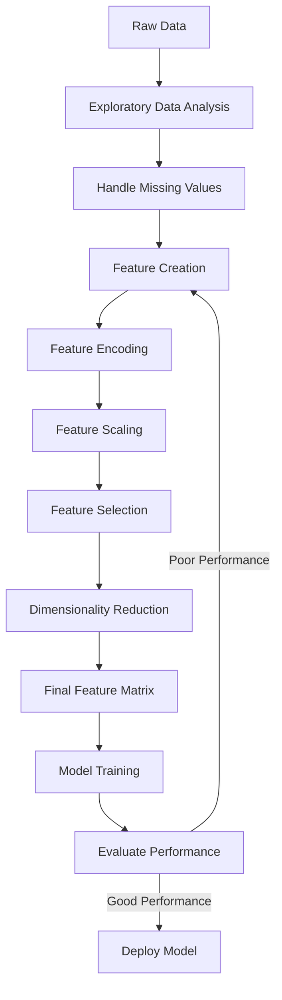
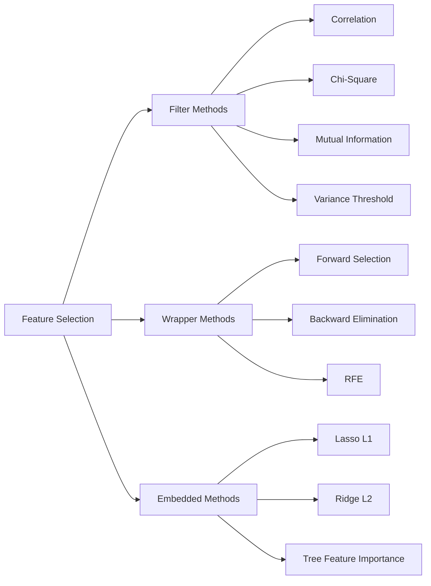
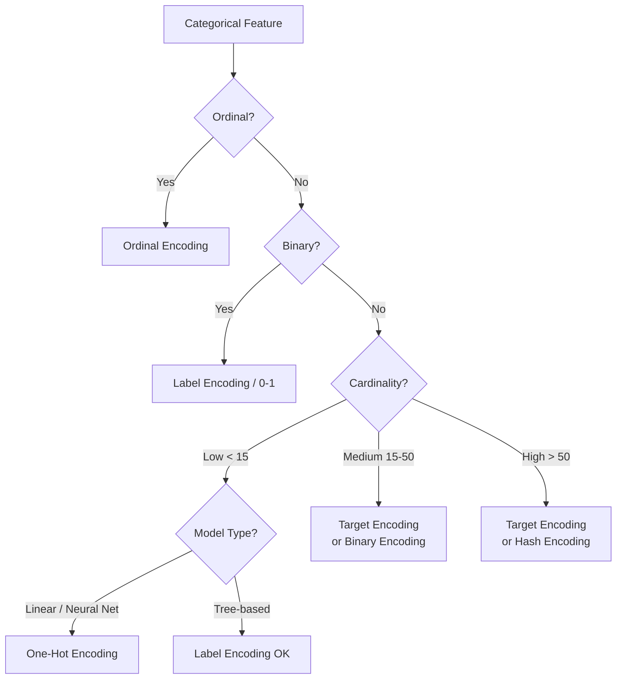
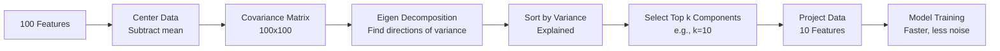
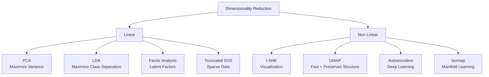
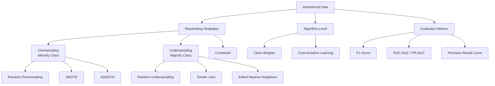
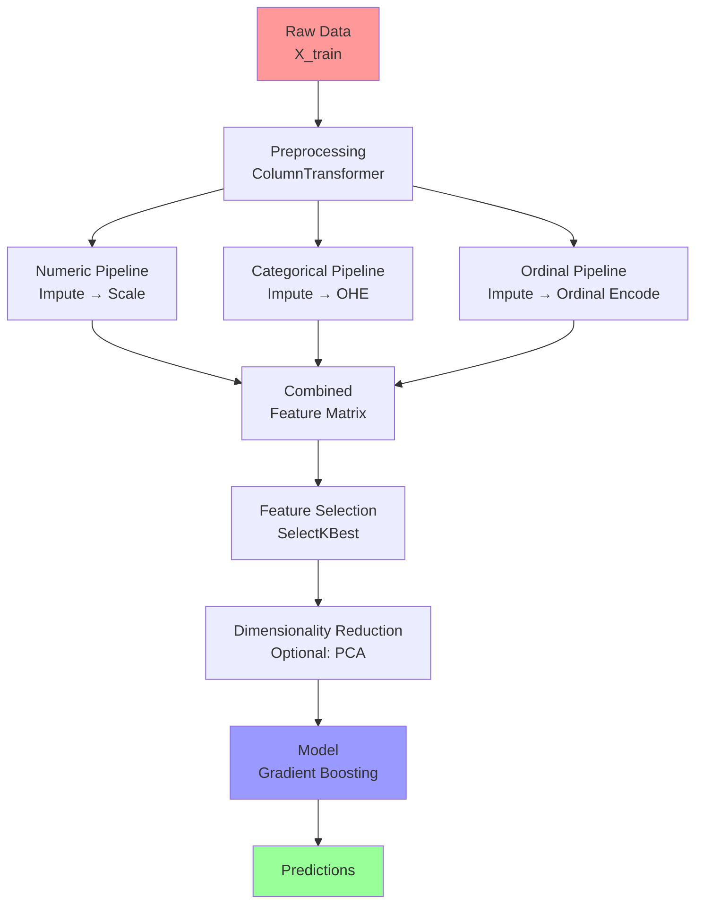

# Phase 12 — Feature Engineering

> **Learning Path:** AI/ML Foundations → Mathematics → Python → NumPy → Pandas → SQL → Visualization → ML Fundamentals → ML Algorithms → Ensemble Learning → Model Evaluation → **Feature Engineering** ✅

---

## Table of Contents

1. [What is Feature Engineering?](#1-what-is-feature-engineering)
2. [Feature Selection](#2-feature-selection)
3. [Encoding Categorical Variables](#3-encoding-categorical-variables)
4. [Feature Scaling](#4-feature-scaling)
5. [Normalization vs Standardization](#5-normalization-vs-standardization)
6. [Principal Component Analysis (PCA)](#6-principal-component-analysis-pca)
7. [Dimensionality Reduction Techniques](#7-dimensionality-reduction-techniques)
8. [Feature Creation & Transformation](#8-feature-creation--transformation)
9. [Handling Imbalanced Data](#9-handling-imbalanced-data)
10. [Feature Engineering Pipeline](#10-feature-engineering-pipeline)
11. [Interview Mastery](#11-interview-mastery)

---

## 1. What is Feature Engineering?

### Beginner Explanation

Imagine you are trying to predict if a house will sell for a high price. You have raw data: number of rooms, total area in square feet, year built, and zip code. Feature Engineering is the process of **transforming this raw data into the best possible inputs for your model**.

For example:
- **Raw feature:** `year_built = 1985`
- **Engineered feature:** `house_age = 2024 - 1985 = 39 years`

The engineered feature is more meaningful to the model because models understand *age* better than a raw year number.

### Technical Explanation

Feature Engineering is the process of using domain knowledge to **create, transform, select, and encode** input variables (features) so that machine learning algorithms can learn more effectively.

It includes:
- **Feature Creation** — deriving new features from existing ones
- **Feature Transformation** — changing the scale or distribution of features
- **Feature Selection** — choosing the most informative subset of features
- **Feature Encoding** — converting non-numeric data to numeric form
- **Dimensionality Reduction** — compressing many features into fewer ones

### Why Feature Engineering Matters

```
Raw Data Quality → Feature Quality → Model Performance

"Garbage in, garbage out"
"Gold in, gold out"
```

| Without Feature Engineering | With Feature Engineering |
|---|---|
| Model struggles with raw data | Model learns meaningful patterns |
| High noise, low signal | Low noise, high signal |
| Slow convergence | Fast convergence |
| Poor generalization | Strong generalization |
| Algorithm-dependent | Algorithm-agnostic improvement |

### Real-World Analogy

Think of a chef preparing ingredients before cooking:
- Raw chicken → cleaned, marinated, cut to size
- Raw vegetables → washed, peeled, chopped uniformly

The cooking (training) is better when ingredients (features) are properly prepared. You wouldn't throw a whole raw chicken into a stir-fry pan.

### The Feature Engineering Pipeline



---

## 2. Feature Selection

### What is Feature Selection?

Feature selection is the process of **identifying and keeping only the most relevant features** while removing irrelevant, redundant, or noisy ones.

### Why Do It?

- Reduces overfitting (fewer features = simpler model)
- Speeds up training
- Improves interpretability
- Reduces memory and compute requirements
- Often improves accuracy by removing noise

### The Curse of Dimensionality

When the number of features grows, the data becomes increasingly sparse in the high-dimensional space.

```
2 features  → manageable space
10 features → much larger space  
100 features → astronomically large space
1000 features → nearly all samples are "outliers"
```

**Mathematical intuition:** For `n` features uniformly distributed in `[0,1]^n`, to capture 10% of the data you need a hypercube of side length `0.1^(1/n)`:

| Dimensions | Side length needed for 10% coverage |
|---|---|
| 1 | 0.1 |
| 2 | 0.316 |
| 5 | 0.631 |
| 10 | 0.794 |
| 100 | 0.977 |

At 100 dimensions, you need 97.7% of the range in each dimension — essentially the entire space — just to capture 10% of the samples!

### Three Categories of Feature Selection



---

### 2.1 Filter Methods

Filter methods evaluate features **independently of the model**, using statistical measures.

#### Variance Threshold

Remove features with variance below a threshold — low-variance features carry little information.

```python
import pandas as pd
import numpy as np
from sklearn.feature_selection import VarianceThreshold

# Create sample dataset
np.random.seed(42)
df = pd.DataFrame({
    'age': np.random.randint(20, 60, 1000),          # high variance
    'constant_col': np.ones(1000),                    # zero variance
    'near_constant': np.where(np.random.rand(1000) > 0.99, 1, 0),  # near-zero variance
    'salary': np.random.randint(30000, 120000, 1000), # high variance
    'gender': np.random.choice([0, 1], 1000),         # moderate variance
})

print("Before selection:", df.shape)
print("\nVariances:")
print(df.var())

# Remove features with variance < 0.1
selector = VarianceThreshold(threshold=0.1)
X_selected = selector.fit_transform(df)

print("\nAfter selection:", X_selected.shape)
print("Selected features:", df.columns[selector.get_support()].tolist())
```

#### Correlation-Based Selection

Remove highly correlated features (they carry redundant information):

```python
import pandas as pd
import numpy as np
import seaborn as sns
import matplotlib.pyplot as plt

def remove_highly_correlated(df, threshold=0.85):
    """Remove features with correlation > threshold."""
    corr_matrix = df.corr().abs()
    
    # Get upper triangle
    upper = corr_matrix.where(
        np.triu(np.ones(corr_matrix.shape), k=1).astype(bool)
    )
    
    # Find features with high correlation
    to_drop = [col for col in upper.columns if any(upper[col] > threshold)]
    
    print(f"Features to drop (corr > {threshold}): {to_drop}")
    return df.drop(columns=to_drop)

# Example
np.random.seed(42)
n = 500
df = pd.DataFrame({
    'feature_A': np.random.randn(n),
    'feature_B': np.random.randn(n),
    'target': np.random.randn(n)
})
# Create highly correlated feature
df['feature_C'] = df['feature_A'] * 0.95 + np.random.randn(n) * 0.05

# Visualize correlation
plt.figure(figsize=(8, 6))
sns.heatmap(df.corr(), annot=True, cmap='coolwarm', center=0)
plt.title('Feature Correlation Matrix')
plt.tight_layout()
plt.savefig('correlation_heatmap.png', dpi=100)
plt.show()

df_reduced = remove_highly_correlated(df, threshold=0.85)
print(f"\nOriginal shape: {df.shape}")
print(f"Reduced shape: {df_reduced.shape}")
```

#### Chi-Square Test (for categorical features)

Measures dependency between a categorical feature and a categorical target:

```python
from sklearn.feature_selection import chi2, SelectKBest
from sklearn.datasets import load_iris
import pandas as pd

# Load example data
iris = load_iris()
X = pd.DataFrame(iris.data, columns=iris.feature_names)
y = iris.target

# Chi-square requires non-negative values
# Select top 2 features
selector = SelectKBest(chi2, k=2)
X_new = selector.fit_transform(X, y)

scores = pd.DataFrame({
    'Feature': iris.feature_names,
    'Chi2 Score': selector.scores_,
    'P-value': selector.pvalues_,
    'Selected': selector.get_support()
}).sort_values('Chi2 Score', ascending=False)

print(scores)
```

#### Mutual Information

Measures the amount of information that knowing one variable provides about another:

```python
from sklearn.feature_selection import mutual_info_classif, mutual_info_regression
import pandas as pd
import numpy as np

np.random.seed(42)
n = 1000

# Create dataset with varying relevance
X = pd.DataFrame({
    'very_relevant': np.random.randn(n),        # high MI
    'somewhat_relevant': np.random.randn(n),     # medium MI
    'irrelevant_noise': np.random.randn(n),      # near-zero MI
    'correlated_noise': np.random.randn(n),      # near-zero MI
})
# Target depends mainly on first feature
y = (X['very_relevant'] > 0.5).astype(int)
X['somewhat_relevant'] = y * 0.3 + np.random.randn(n) * 0.7

mi_scores = mutual_info_classif(X, y, random_state=42)
mi_df = pd.DataFrame({
    'Feature': X.columns,
    'Mutual Information': mi_scores
}).sort_values('Mutual Information', ascending=False)

print(mi_df)
```

---

### 2.2 Wrapper Methods

Wrapper methods **use the model itself** to evaluate feature subsets. More accurate than filter methods but computationally expensive.

#### Recursive Feature Elimination (RFE)

```python
from sklearn.feature_selection import RFE, RFECV
from sklearn.linear_model import LogisticRegression
from sklearn.ensemble import RandomForestClassifier
from sklearn.datasets import make_classification
import pandas as pd
import matplotlib.pyplot as plt

# Create dataset
X, y = make_classification(
    n_samples=1000, n_features=20, n_informative=10,
    n_redundant=5, random_state=42
)
feature_names = [f'feature_{i}' for i in range(20)]

# Basic RFE - select top 10 features
estimator = LogisticRegression(max_iter=1000)
rfe = RFE(estimator=estimator, n_features_to_select=10, step=1)
rfe.fit(X, y)

rfe_df = pd.DataFrame({
    'Feature': feature_names,
    'Ranking': rfe.ranking_,
    'Selected': rfe.support_
}).sort_values('Ranking')
print(rfe_df.to_string())

# RFECV - automatically finds optimal number of features
rfecv = RFECV(
    estimator=RandomForestClassifier(n_estimators=100, random_state=42),
    step=1,
    cv=5,
    scoring='accuracy',
    min_features_to_select=1
)
rfecv.fit(X, y)

print(f"\nOptimal number of features: {rfecv.n_features_}")

# Plot CV scores vs number of features
plt.figure(figsize=(10, 6))
plt.plot(range(1, len(rfecv.cv_results_['mean_test_score']) + 1),
         rfecv.cv_results_['mean_test_score'])
plt.xlabel("Number of Features Selected")
plt.ylabel("Cross-Validation Accuracy")
plt.title("RFECV: Feature Count vs Model Performance")
plt.axvline(rfecv.n_features_, color='red', linestyle='--',
            label=f'Optimal: {rfecv.n_features_} features')
plt.legend()
plt.grid(True, alpha=0.3)
plt.tight_layout()
plt.savefig('rfecv_plot.png', dpi=100)
plt.show()
```

---

### 2.3 Embedded Methods

Embedded methods perform feature selection **during model training** — the most efficient approach.

#### Lasso (L1 Regularization)

Lasso adds an L1 penalty that drives some coefficients to exactly zero, effectively removing features:

```python
from sklearn.linear_model import Lasso, LassoCV
from sklearn.preprocessing import StandardScaler
from sklearn.datasets import make_regression
import pandas as pd
import numpy as np
import matplotlib.pyplot as plt

# Create dataset
X, y = make_regression(
    n_samples=500, n_features=20, n_informative=5,
    noise=10, random_state=42
)
feature_names = [f'feature_{i}' for i in range(20)]

# Scale first (Lasso is sensitive to scale)
scaler = StandardScaler()
X_scaled = scaler.fit_transform(X)

# LassoCV finds optimal alpha
lasso_cv = LassoCV(cv=5, random_state=42, max_iter=5000)
lasso_cv.fit(X_scaled, y)

print(f"Optimal alpha: {lasso_cv.alpha_:.4f}")

# Show coefficients
coef_df = pd.DataFrame({
    'Feature': feature_names,
    'Coefficient': lasso_cv.coef_
}).sort_values('Coefficient', key=abs, ascending=False)

print("\nLasso Coefficients:")
print(coef_df)
print(f"\nFeatures eliminated (coeff=0): {(coef_df['Coefficient'] == 0).sum()}")

# Plot Lasso path
from sklearn.linear_model import lasso_path

alphas, coefs, _ = lasso_path(X_scaled, y, alphas=np.logspace(-4, 1, 100))

plt.figure(figsize=(12, 6))
for i in range(coefs.shape[0]):
    plt.plot(np.log10(alphas), coefs[i], label=feature_names[i])
plt.axvline(np.log10(lasso_cv.alpha_), color='black', linestyle='--',
            label=f'Optimal alpha={lasso_cv.alpha_:.3f}')
plt.xlabel('log10(alpha)')
plt.ylabel('Coefficients')
plt.title('Lasso Path: Feature Coefficients vs Regularization Strength')
plt.legend(loc='upper right', bbox_to_anchor=(1.15, 1), fontsize=8)
plt.grid(True, alpha=0.3)
plt.tight_layout()
plt.savefig('lasso_path.png', dpi=100)
plt.show()
```

#### Tree-Based Feature Importance

```python
from sklearn.ensemble import RandomForestClassifier, GradientBoostingClassifier
from sklearn.datasets import make_classification
import pandas as pd
import numpy as np
import matplotlib.pyplot as plt

# Create dataset with known informative features
X, y = make_classification(
    n_samples=1000, n_features=20, n_informative=5,
    n_redundant=5, n_repeated=2, random_state=42
)
feature_names = [f'feature_{i}' for i in range(20)]

# Random Forest importance
rf = RandomForestClassifier(n_estimators=200, random_state=42)
rf.fit(X, y)

# Get importances with standard deviation
importances = pd.DataFrame({
    'Feature': feature_names,
    'Importance': rf.feature_importances_,
    'Std': np.std([tree.feature_importances_ for tree in rf.estimators_], axis=0)
}).sort_values('Importance', ascending=False)

# Plot
fig, ax = plt.subplots(figsize=(12, 6))
ax.bar(range(len(importances)), importances['Importance'],
       yerr=importances['Std'], capsize=3, color='steelblue', alpha=0.8)
ax.set_xticks(range(len(importances)))
ax.set_xticklabels(importances['Feature'], rotation=45, ha='right')
ax.set_xlabel('Feature')
ax.set_ylabel('Importance (Mean Decrease in Impurity)')
ax.set_title('Random Forest Feature Importances')
plt.tight_layout()
plt.savefig('feature_importance.png', dpi=100)
plt.show()

print(importances.head(10))

# SHAP values for better interpretation
# pip install shap
try:
    import shap
    explainer = shap.TreeExplainer(rf)
    shap_values = explainer.shap_values(X[:100])
    shap.summary_plot(shap_values[1], X[:100],
                      feature_names=feature_names, show=False)
    plt.tight_layout()
    plt.savefig('shap_summary.png', dpi=100)
    plt.show()
except ImportError:
    print("Install shap: pip install shap")
```

---

## 3. Encoding Categorical Variables

### Why Encoding?

Machine learning algorithms operate on **numbers**, not strings. Encoding transforms categorical text data into numeric representations.

```
"Red", "Green", "Blue"  →  numbers the model can work with
```

### Types of Categorical Variables

| Type | Description | Example |
|---|---|---|
| **Nominal** | No natural order | Color, Country, Gender |
| **Ordinal** | Has natural order | Size (S/M/L/XL), Rating (1-5 stars) |
| **Binary** | Only 2 categories | Yes/No, True/False |
| **High Cardinality** | Many unique values | ZIP code, User ID |

---

### 3.1 Label Encoding

Converts each category to a unique integer.

```
"Red" → 0, "Green" → 1, "Blue" → 2
```

**Use for:** Ordinal data, tree-based models (they don't assume numeric order)  
**Avoid for:** Linear models with nominal data (implies false ordering)

```python
from sklearn.preprocessing import LabelEncoder, OrdinalEncoder
import pandas as pd
import numpy as np

df = pd.DataFrame({
    'color': ['Red', 'Blue', 'Green', 'Blue', 'Red', 'Green'],
    'size': ['S', 'M', 'L', 'XL', 'M', 'S'],
    'quality': ['Low', 'Medium', 'High', 'Medium', 'Low', 'High']
})

# Label Encoding (loses ordinal information for size/quality)
le = LabelEncoder()
df['color_encoded'] = le.fit_transform(df['color'])
print("Label Encoded color:")
print(pd.DataFrame({'original': le.classes_,
                    'encoded': le.transform(le.classes_)}))

# Ordinal Encoding (preserves order)
oe = OrdinalEncoder(categories=[['S', 'M', 'L', 'XL']])
df['size_encoded'] = oe.fit_transform(df[['size']])

oe_quality = OrdinalEncoder(categories=[['Low', 'Medium', 'High']])
df['quality_encoded'] = oe_quality.fit_transform(df[['quality']])

print("\nOrdinal Encoded:")
print(df[['size', 'size_encoded', 'quality', 'quality_encoded']])
```

---

### 3.2 One-Hot Encoding (OHE)

Creates a binary column for each category.

```
"Red"   → [1, 0, 0]
"Green" → [0, 1, 0]
"Blue"  → [0, 0, 1]
```

**Use for:** Nominal data with few categories (low cardinality), linear models  
**Problem:** Can create many columns with high-cardinality features

```python
import pandas as pd
from sklearn.preprocessing import OneHotEncoder
import numpy as np

df = pd.DataFrame({
    'color': ['Red', 'Blue', 'Green', 'Blue', 'Red'],
    'country': ['USA', 'UK', 'India', 'USA', 'India'],
    'sales': [100, 200, 150, 180, 220]
})

# Pandas get_dummies (quick method)
df_dummies = pd.get_dummies(df, columns=['color', 'country'], dtype=int)
print("pd.get_dummies result:")
print(df_dummies)

# Sklearn OneHotEncoder (better for pipelines)
ohe = OneHotEncoder(
    sparse_output=False,  # dense matrix
    drop='first',         # drop first category to avoid multicollinearity
    handle_unknown='ignore'
)

X_categorical = df[['color', 'country']]
X_encoded = ohe.fit_transform(X_categorical)

# Feature names
feature_names = ohe.get_feature_names_out(['color', 'country'])
X_encoded_df = pd.DataFrame(X_encoded, columns=feature_names)

print("\nSklearn OHE result (drop='first'):")
print(X_encoded_df)
print(f"\nOriginal columns: 2 | New columns: {len(feature_names)}")
```

---

### 3.3 Target Encoding (Mean Encoding)

Replace each category with the **mean of the target variable** for that category.

```
city          | avg_price
-----------   | ---------
"New York"    | 450,000   → 450000
"Austin"      | 320,000   → 320000
"Detroit"     | 180,000   → 180000
```

**Advantage:** Handles high-cardinality features  
**Risk:** Data leakage if done on the full dataset

```python
import pandas as pd
import numpy as np
from sklearn.model_selection import KFold

def target_encode_cv(df, col, target, n_splits=5, smoothing=10):
    """
    Target encoding with cross-validation to prevent leakage.
    Smoothing blends category mean with global mean.
    """
    global_mean = df[target].mean()
    encoded = df[col].copy().astype(float)
    
    kf = KFold(n_splits=n_splits, shuffle=True, random_state=42)
    
    for train_idx, val_idx in kf.split(df):
        train_fold = df.iloc[train_idx]
        
        # Calculate stats on train fold only
        stats = train_fold.groupby(col)[target].agg(['mean', 'count'])
        
        # Smoothed target encoding
        # smoothed = (count * category_mean + smoothing * global_mean) / (count + smoothing)
        smoothed = (stats['count'] * stats['mean'] + smoothing * global_mean) / \
                   (stats['count'] + smoothing)
        
        # Apply to validation fold
        val_cats = df.iloc[val_idx][col]
        encoded.iloc[val_idx] = val_cats.map(smoothed).fillna(global_mean)
    
    return encoded

# Example
np.random.seed(42)
n = 500
cities = ['NYC', 'LA', 'Chicago', 'Houston', 'Phoenix'] * (n // 5)
df = pd.DataFrame({
    'city': cities,
    'price': np.random.randn(n) * 50000 + 300000
})
# Make NYC more expensive
df.loc[df['city'] == 'NYC', 'price'] += 100000

df['city_target_encoded'] = target_encode_cv(df, 'city', 'price')

print(df.groupby('city')[['price', 'city_target_encoded']].mean().round(0))
```

---

### 3.4 Frequency / Count Encoding

Replace category with how often it appears:

```python
df['city_freq_encoded'] = df['city'].map(df['city'].value_counts())
df['city_count_pct'] = df['city'].map(df['city'].value_counts(normalize=True))
```

### 3.5 Binary Encoding

For high-cardinality features: encode category as integer, then represent as binary bits.

```
1  →  001
2  →  010
3  →  011
4  →  100
5  →  101
```

This uses `log2(n_categories)` columns instead of `n_categories` columns.

```python
# pip install category_encoders
import category_encoders as ce
import pandas as pd

df = pd.DataFrame({
    'zip_code': ['10001', '90210', '60601', '77001', '85001',
                 '10001', '90210', '10001'] * 10,
    'target': [1, 0, 1, 0, 1, 0, 1, 0] * 10
})

# Binary encoding
encoder = ce.BinaryEncoder(cols=['zip_code'])
df_encoded = encoder.fit_transform(df)
print(f"Original cols: 1, Binary encoded cols: {len([c for c in df_encoded.columns if 'zip' in c])}")
print(df_encoded.head())

# Hash encoding for very high cardinality
hash_encoder = ce.HashingEncoder(cols=['zip_code'], n_components=8)
df_hashed = hash_encoder.fit_transform(df)
print(f"\nHash encoded shape: {df_hashed.shape}")
```

---

### Encoding Decision Guide



---

## 4. Feature Scaling

### Why Scale?

Many algorithms are **distance-based** or **gradient-based** and are sensitive to the magnitude of features.

**Problem without scaling:**
```
Feature A: age (20–80)        → small values
Feature B: salary (30k–200k)  → large values

Distance calculation will be dominated by salary,
completely ignoring age — even if age is more relevant!
```

### Algorithms That Need Scaling

| Needs Scaling | Scaling-Invariant |
|---|---|
| Linear/Logistic Regression | Decision Trees |
| SVM | Random Forest |
| KNN | Gradient Boosting |
| K-Means Clustering | XGBoost |
| Neural Networks | Naive Bayes |
| PCA | Rule-based models |

---

### 4.1 Min-Max Scaling (Normalization)

Scales features to a fixed range, typically [0, 1]:

$$X_{scaled} = \frac{X - X_{min}}{X_{max} - X_{min}}$$

```python
from sklearn.preprocessing import MinMaxScaler
import numpy as np
import pandas as pd

X = np.array([[1, 2000], [2, 8000], [3, 6000], [4, 3000], [5, 7000]])
df = pd.DataFrame(X, columns=['age_10', 'income'])

print("Original:")
print(df)

scaler = MinMaxScaler(feature_range=(0, 1))
X_scaled = scaler.fit_transform(X)
df_scaled = pd.DataFrame(X_scaled, columns=['age_scaled', 'income_scaled'])

print("\nAfter Min-Max Scaling:")
print(df_scaled.round(4))
print(f"\nMin: {X_scaled.min(axis=0)}, Max: {X_scaled.max(axis=0)}")
```

**Advantages:** Bounded output, good for neural networks  
**Disadvantages:** Sensitive to outliers — a single extreme value compresses all other values

---

### 4.2 Standardization (Z-Score Normalization)

Transforms data to have **mean=0 and std=1**:

$$X_{scaled} = \frac{X - \mu}{\sigma}$$

```python
from sklearn.preprocessing import StandardScaler
import numpy as np
import pandas as pd

np.random.seed(42)
X = pd.DataFrame({
    'age': np.random.normal(35, 10, 100),
    'income': np.random.normal(60000, 15000, 100),
    'credit_score': np.random.normal(700, 50, 100)
})

print("Original Statistics:")
print(X.describe().loc[['mean', 'std']].round(2))

scaler = StandardScaler()
X_scaled = scaler.fit_transform(X)
X_scaled_df = pd.DataFrame(X_scaled, columns=X.columns)

print("\nAfter Standardization:")
print(X_scaled_df.describe().loc[['mean', 'std']].round(4))
```

**Advantages:** Less sensitive to outliers, works for most algorithms  
**Disadvantages:** Does not bound to a specific range

---

### 4.3 Robust Scaling

Uses the **median and IQR** — highly resistant to outliers:

$$X_{scaled} = \frac{X - median}{IQR}$$

```python
from sklearn.preprocessing import RobustScaler
import numpy as np
import pandas as pd

# Dataset with outliers
np.random.seed(42)
X = pd.DataFrame({
    'feature': np.append(np.random.normal(0, 1, 95), [100, -100, 200, -150, 300])
})

print(f"Original: mean={X['feature'].mean():.2f}, std={X['feature'].std():.2f}")
print(f"Outliers present: min={X['feature'].min():.1f}, max={X['feature'].max():.1f}")

# Compare scalers on data with outliers
scalers = {
    'MinMax': MinMaxScaler(),
    'Standard': StandardScaler(),
    'Robust': RobustScaler()
}

from sklearn.preprocessing import MinMaxScaler
for name, scaler in scalers.items():
    X_s = scaler.fit_transform(X)
    print(f"\n{name}: min={X_s.min():.2f}, max={X_s.max():.2f}, "
          f"mean={X_s.mean():.2f}, std={X_s.std():.2f}")
```

---

### 4.4 Normalizer (Row-wise)

Scales **each sample** (row) to unit norm — often used for text features:

```python
from sklearn.preprocessing import Normalizer

X = np.array([[4, 1, 2, 2],
              [1, 3, 9, 3],
              [5, 7, 5, 1]])

# L2 norm: each row has length 1
normalizer = Normalizer(norm='l2')
X_norm = normalizer.fit_transform(X)

print("After L2 normalization (each row sums to 1 when squared):")
print(X_norm.round(4))
print("\nRow norms:", np.linalg.norm(X_norm, axis=1).round(4))
```

---

## 5. Normalization vs Standardization

### Deep Comparison

| Aspect | Normalization (Min-Max) | Standardization (Z-Score) |
|---|---|---|
| **Formula** | (x - min) / (max - min) | (x - mean) / std |
| **Output range** | [0, 1] (or custom) | Unbounded (-∞ to +∞) |
| **Outlier sensitivity** | Very sensitive | Moderately sensitive |
| **Preserves shape** | Yes | Yes |
| **Preserves zeros** | No | No |
| **When to use** | Neural nets, bounded input | Most ML algorithms |
| **Affected by outliers** | Yes, heavily | Less so |

### Visualization

```python
import numpy as np
import matplotlib.pyplot as plt
from sklearn.preprocessing import MinMaxScaler, StandardScaler, RobustScaler

# Generate bimodal distribution with outliers
np.random.seed(42)
data = np.concatenate([
    np.random.normal(10, 2, 100),
    np.random.normal(20, 3, 100),
    [50, 55, 60]  # outliers
]).reshape(-1, 1)

scalers = [
    ('Original', None),
    ('Min-Max Scaling', MinMaxScaler()),
    ('Standardization', StandardScaler()),
    ('Robust Scaling', RobustScaler())
]

fig, axes = plt.subplots(2, 2, figsize=(14, 10))
axes = axes.flatten()

for idx, (name, scaler) in enumerate(scalers):
    if scaler is None:
        transformed = data
    else:
        transformed = scaler.fit_transform(data)
    
    axes[idx].hist(transformed, bins=30, color='steelblue', alpha=0.7, edgecolor='white')
    axes[idx].set_title(f'{name}\nMean={transformed.mean():.2f}, Std={transformed.std():.2f}',
                        fontsize=11, fontweight='bold')
    axes[idx].set_xlabel('Value')
    axes[idx].set_ylabel('Frequency')
    axes[idx].grid(True, alpha=0.3)

plt.suptitle('Effect of Different Scaling Techniques', fontsize=14, fontweight='bold')
plt.tight_layout()
plt.savefig('scaling_comparison.png', dpi=100)
plt.show()
```

### Practical Decision Rules

```
Has outliers?
  → Yes → Use RobustScaler
  → No  → Continue...

Neural network or needs [0,1] range?
  → Yes → Use MinMaxScaler
  → No  → Continue...

Most other algorithms (SVM, Logistic Regression, KNN)?
  → Use StandardScaler (safe default)

Tree-based models?
  → No scaling needed at all
```

---

## 6. Principal Component Analysis (PCA)

### Beginner Explanation

Imagine you have a dataset with 100 features describing each house. Many of these features are correlated: "number of rooms" and "house area" both measure "house size" in different ways. PCA **finds the most important patterns** and lets you describe your data with fewer dimensions, losing as little information as possible.

### Technical Explanation

PCA is a **linear dimensionality reduction technique** that transforms features into a new coordinate system where:

1. The **first principal component (PC1)** points in the direction of maximum variance
2. **PC2** points in the direction of maximum remaining variance, perpendicular to PC1
3. Each subsequent PC captures less variance, always perpendicular to all previous ones

### Mathematical Intuition

**Step-by-step PCA:**

1. **Center the data:** Subtract the mean from each feature
   $$X_{centered} = X - \bar{X}$$

2. **Compute the covariance matrix:**
   $$\Sigma = \frac{1}{n-1} X_{centered}^T X_{centered}$$

3. **Eigendecomposition:** Find eigenvectors and eigenvalues
   $$\Sigma v = \lambda v$$
   - Eigenvectors = principal component directions
   - Eigenvalues = variance explained by each PC

4. **Sort by eigenvalue** (largest = most variance)

5. **Project data** onto top k eigenvectors:
   $$X_{reduced} = X_{centered} \cdot V_k$$

### Visual Intuition

```
Original 2D data:          After PCA rotation:
     •                         •
  •     •                •           •
     •     •      →         •     •
  •     •                      •
     •

The new axes align with              PC1 captures most
the main directions of spread        of the variance
```



```python
from sklearn.decomposition import PCA
from sklearn.preprocessing import StandardScaler
from sklearn.datasets import load_breast_cancer
import pandas as pd
import numpy as np
import matplotlib.pyplot as plt

# Load data
data = load_breast_cancer()
X = data.data
y = data.target
feature_names = data.feature_names

print(f"Original shape: {X.shape}")  # (569, 30)

# Always scale before PCA!
scaler = StandardScaler()
X_scaled = scaler.fit_transform(X)

# ---- Explained Variance Analysis ----
pca_full = PCA()
pca_full.fit(X_scaled)

cumulative_variance = np.cumsum(pca_full.explained_variance_ratio_)

# Plot scree plot
fig, (ax1, ax2) = plt.subplots(1, 2, figsize=(14, 5))

# Individual variance
ax1.bar(range(1, 31), pca_full.explained_variance_ratio_ * 100,
        color='steelblue', alpha=0.8)
ax1.set_xlabel('Principal Component')
ax1.set_ylabel('Explained Variance (%)')
ax1.set_title('Scree Plot: Variance per Component')
ax1.grid(True, alpha=0.3)

# Cumulative variance
ax2.plot(range(1, 31), cumulative_variance * 100, 'bo-', markersize=5)
ax2.axhline(y=95, color='red', linestyle='--', label='95% threshold')
ax2.axhline(y=90, color='orange', linestyle='--', label='90% threshold')
ax2.set_xlabel('Number of Components')
ax2.set_ylabel('Cumulative Explained Variance (%)')
ax2.set_title('Cumulative Explained Variance')
ax2.legend()
ax2.grid(True, alpha=0.3)

plt.tight_layout()
plt.savefig('pca_variance.png', dpi=100)
plt.show()

# How many components for 95% variance?
n_95 = np.argmax(cumulative_variance >= 0.95) + 1
print(f"\nComponents needed for 95% variance: {n_95}")

# ---- Apply PCA ----
pca = PCA(n_components=2)  # For visualization
X_pca = pca.fit_transform(X_scaled)

print(f"Reduced shape: {X_pca.shape}")
print(f"Variance explained: {pca.explained_variance_ratio_.sum()*100:.1f}%")

# Visualize 2D projection
plt.figure(figsize=(10, 7))
scatter = plt.scatter(X_pca[:, 0], X_pca[:, 1],
                      c=y, cmap='RdYlBu', alpha=0.7, s=60)
plt.colorbar(scatter, label='Class (0=Malignant, 1=Benign)')
plt.xlabel(f'PC1 ({pca.explained_variance_ratio_[0]*100:.1f}% variance)')
plt.ylabel(f'PC2 ({pca.explained_variance_ratio_[1]*100:.1f}% variance)')
plt.title('PCA: Breast Cancer Dataset — 2D Projection')
plt.grid(True, alpha=0.3)
plt.tight_layout()
plt.savefig('pca_2d.png', dpi=100)
plt.show()

# ---- PCA Loadings (what original features contribute to each PC?) ----
loadings = pd.DataFrame(
    pca.components_.T,
    columns=[f'PC{i+1}' for i in range(2)],
    index=feature_names
)
print("\nTop contributing features to PC1:")
print(loadings['PC1'].abs().sort_values(ascending=False).head(5))
```

### PCA in a Full ML Pipeline

```python
from sklearn.pipeline import Pipeline
from sklearn.decomposition import PCA
from sklearn.preprocessing import StandardScaler
from sklearn.linear_model import LogisticRegression
from sklearn.model_selection import cross_val_score
from sklearn.datasets import load_breast_cancer

X, y = load_breast_cancer(return_X_y=True)

# Pipeline: Scale → PCA → Classify
pipeline = Pipeline([
    ('scaler', StandardScaler()),
    ('pca', PCA(n_components=10)),  # Keep 10 components
    ('classifier', LogisticRegression(max_iter=1000))
])

cv_scores = cross_val_score(pipeline, X, y, cv=5, scoring='accuracy')
print(f"PCA Pipeline CV Accuracy: {cv_scores.mean():.4f} ± {cv_scores.std():.4f}")

# Compare: without PCA
pipeline_no_pca = Pipeline([
    ('scaler', StandardScaler()),
    ('classifier', LogisticRegression(max_iter=1000))
])
cv_scores_no_pca = cross_val_score(pipeline_no_pca, X, y, cv=5, scoring='accuracy')
print(f"No PCA CV Accuracy: {cv_scores_no_pca.mean():.4f} ± {cv_scores_no_pca.std():.4f}")
```

### Trade-offs of PCA

| Advantage | Disadvantage |
|---|---|
| Reduces dimensionality | Loses interpretability |
| Removes noise | Principal components are abstract |
| Removes multicollinearity | Assumes linear relationships |
| Speeds up training | Information loss |
| Good for visualization | Can hurt if features are already independent |

### When NOT to Use PCA

- When features are already **independent** and interpretable
- When you need to understand **which features matter** (use SHAP instead)
- When data has **non-linear structure** (use t-SNE, UMAP instead)
- For **tree-based models** (they handle high-dim data natively)

---

## 7. Dimensionality Reduction Techniques

### Overview



---

### 7.1 Linear Discriminant Analysis (LDA)

Unlike PCA (unsupervised), LDA is **supervised** — it maximizes class separability.

**Objective:** Find axes that:
- Maximize **between-class variance** (push classes apart)
- Minimize **within-class variance** (compact each class)

```python
from sklearn.discriminant_analysis import LinearDiscriminantAnalysis
from sklearn.datasets import load_iris
import matplotlib.pyplot as plt
import numpy as np

X, y = load_iris(return_X_y=True)
target_names = ['setosa', 'versicolor', 'virginica']

# LDA: reduce to n_classes - 1 = 2 dimensions
lda = LinearDiscriminantAnalysis(n_components=2)
X_lda = lda.fit_transform(X, y)

print(f"LDA reduced shape: {X_lda.shape}")
print(f"Explained variance ratio: {lda.explained_variance_ratio_}")

# Plot
plt.figure(figsize=(10, 7))
colors = ['navy', 'turquoise', 'darkorange']
for color, target, label in zip(colors, [0, 1, 2], target_names):
    plt.scatter(X_lda[y == target, 0], X_lda[y == target, 1],
                color=color, alpha=0.8, label=label, s=60)

plt.xlabel(f'LD1 ({lda.explained_variance_ratio_[0]*100:.1f}%)')
plt.ylabel(f'LD2 ({lda.explained_variance_ratio_[1]*100:.1f}%)')
plt.title('LDA: Iris Dataset Projection')
plt.legend()
plt.grid(True, alpha=0.3)
plt.tight_layout()
plt.savefig('lda_plot.png', dpi=100)
plt.show()
```

---

### 7.2 t-SNE (t-Distributed Stochastic Neighbor Embedding)

t-SNE is the **gold standard for visualization** — it reveals cluster structure that PCA cannot.

**How it works:**
1. Compute pairwise similarities in high-dim space using Gaussian distributions
2. Create similar distribution in low-dim space using Student t-distribution
3. Minimize KL-divergence between the two distributions using gradient descent

**Key hyperparameter — Perplexity:** Controls the balance between local and global structure (typical values: 5–50)

```python
from sklearn.manifold import TSNE
from sklearn.datasets import load_digits
from sklearn.preprocessing import StandardScaler
import matplotlib.pyplot as plt
import numpy as np

# Load digits (64 features)
digits = load_digits()
X = digits.data
y = digits.target

print(f"Data shape: {X.shape}")  # (1797, 64)

# Scale first
X_scaled = StandardScaler().fit_transform(X)

# t-SNE
tsne = TSNE(
    n_components=2,
    perplexity=30,
    learning_rate=200,
    n_iter=1000,
    random_state=42,
    verbose=1
)
X_tsne = tsne.fit_transform(X_scaled)

# Plot
fig, axes = plt.subplots(1, 2, figsize=(16, 7))

# PCA for comparison
from sklearn.decomposition import PCA
X_pca = PCA(n_components=2).fit_transform(X_scaled)

scatter1 = axes[0].scatter(X_pca[:, 0], X_pca[:, 1], c=y, cmap='tab10', alpha=0.7, s=10)
axes[0].set_title('PCA (2 components)', fontsize=13, fontweight='bold')
axes[0].set_xlabel('PC1')
axes[0].set_ylabel('PC2')
plt.colorbar(scatter1, ax=axes[0], label='Digit')

scatter2 = axes[1].scatter(X_tsne[:, 0], X_tsne[:, 1], c=y, cmap='tab10', alpha=0.7, s=10)
axes[1].set_title('t-SNE (perplexity=30)', fontsize=13, fontweight='bold')
axes[1].set_xlabel('Dimension 1')
axes[1].set_ylabel('Dimension 2')
plt.colorbar(scatter2, ax=axes[1], label='Digit')

plt.suptitle('PCA vs t-SNE on MNIST Digits', fontsize=14, fontweight='bold')
plt.tight_layout()
plt.savefig('tsne_vs_pca.png', dpi=100)
plt.show()
```

**Important caveats for t-SNE:**
- Distances between clusters are **not meaningful**
- Results are **non-deterministic** (random initialization)
- **Do not use for feature engineering before training** — use only for visualization
- Computationally expensive: O(n² log n) → slow on large datasets

---

### 7.3 UMAP (Uniform Manifold Approximation and Projection)

UMAP is **faster than t-SNE** and **better preserves global structure** while still revealing local clusters.

```python
# pip install umap-learn
try:
    import umap
    from sklearn.datasets import load_digits
    from sklearn.preprocessing import StandardScaler
    import matplotlib.pyplot as plt

    X, y = load_digits(return_X_y=True)
    X_scaled = StandardScaler().fit_transform(X)

    reducer = umap.UMAP(
        n_components=2,
        n_neighbors=15,    # local neighborhood size (like perplexity in t-SNE)
        min_dist=0.1,      # how tightly to pack points
        random_state=42,
        verbose=True
    )
    X_umap = reducer.fit_transform(X_scaled)

    plt.figure(figsize=(10, 8))
    scatter = plt.scatter(X_umap[:, 0], X_umap[:, 1],
                          c=y, cmap='tab10', alpha=0.7, s=15)
    plt.colorbar(scatter, label='Digit')
    plt.title('UMAP: MNIST Digits', fontsize=14, fontweight='bold')
    plt.xlabel('UMAP-1')
    plt.ylabel('UMAP-2')
    plt.tight_layout()
    plt.savefig('umap_plot.png', dpi=100)
    plt.show()

except ImportError:
    print("Install UMAP: pip install umap-learn")
```

### UMAP vs t-SNE vs PCA

| Feature | PCA | t-SNE | UMAP |
|---|---|---|---|
| Type | Linear | Non-linear | Non-linear |
| Speed | Very fast | Slow O(n²) | Fast O(n log n) |
| Global structure | Yes | Poor | Good |
| Local structure | Moderate | Excellent | Excellent |
| Deterministic | Yes | No | Can be |
| Use for features | Yes | No | Yes (cautiously) |
| Interpretability | Moderate | None | None |
| Large datasets | Yes | Struggles | Yes |

---

### 7.4 Autoencoders for Dimensionality Reduction

Autoencoders learn a **compressed representation** of data using neural networks:

```
Input (784) → Encoder → Bottleneck (32) → Decoder → Output (784)
                         ↑
                    Compressed features
```

```python
import tensorflow as tf
from tensorflow import keras
import numpy as np
import matplotlib.pyplot as plt

# Load MNIST
(X_train, _), (X_test, _) = keras.datasets.mnist.load_data()
X_train = X_train.reshape(-1, 784).astype('float32') / 255.0
X_test = X_test.reshape(-1, 784).astype('float32') / 255.0

# Autoencoder architecture
encoding_dim = 32  # compressed to 32 dimensions from 784

# Encoder
input_img = keras.Input(shape=(784,))
encoded = keras.layers.Dense(256, activation='relu')(input_img)
encoded = keras.layers.Dense(128, activation='relu')(encoded)
encoded = keras.layers.Dense(encoding_dim, activation='relu')(encoded)

# Decoder
decoded = keras.layers.Dense(128, activation='relu')(encoded)
decoded = keras.layers.Dense(256, activation='relu')(decoded)
decoded = keras.layers.Dense(784, activation='sigmoid')(decoded)

# Models
autoencoder = keras.Model(input_img, decoded)
encoder = keras.Model(input_img, encoded)

autoencoder.compile(optimizer='adam', loss='binary_crossentropy')

# Train
history = autoencoder.fit(
    X_train, X_train,
    epochs=20,
    batch_size=256,
    shuffle=True,
    validation_data=(X_test, X_test),
    verbose=1
)

# Get compressed representations
X_encoded = encoder.predict(X_test)
print(f"Original: {X_test.shape} → Encoded: {X_encoded.shape}")

# Visualize reconstruction
X_decoded = autoencoder.predict(X_test[:10])

fig, axes = plt.subplots(2, 10, figsize=(20, 4))
for i in range(10):
    axes[0, i].imshow(X_test[i].reshape(28, 28), cmap='gray')
    axes[0, i].axis('off')
    axes[1, i].imshow(X_decoded[i].reshape(28, 28), cmap='gray')
    axes[1, i].axis('off')
axes[0, 0].set_title('Original', fontsize=12)
axes[1, 0].set_title('Reconstructed', fontsize=12)
plt.suptitle('Autoencoder: Original vs Reconstructed', fontsize=14)
plt.tight_layout()
plt.savefig('autoencoder.png', dpi=100)
plt.show()
```

---

## 8. Feature Creation & Transformation

### 8.1 Mathematical Transformations

```python
import pandas as pd
import numpy as np
from scipy import stats

np.random.seed(42)
df = pd.DataFrame({
    'income': np.random.exponential(50000, 1000),   # right-skewed
    'age': np.random.normal(35, 10, 1000),
    'distance_km': np.random.exponential(100, 1000)
})

# Log transformation (for right-skewed data)
df['log_income'] = np.log1p(df['income'])  # log1p handles zeros: log(1+x)

# Square root transformation (moderate skew)
df['sqrt_distance'] = np.sqrt(df['distance_km'])

# Box-Cox transformation (more flexible, handles various skews)
df['boxcox_income'], lambda_bc = stats.boxcox(df['income'] + 1)

# Power transformation (sklearn)
from sklearn.preprocessing import PowerTransformer
pt = PowerTransformer(method='yeo-johnson')  # works with negative values too
df['pt_income'] = pt.fit_transform(df[['income']])

# Compare skewness
print("Skewness comparison:")
print(f"  Original income: {df['income'].skew():.3f}")
print(f"  Log income:      {df['log_income'].skew():.3f}")
print(f"  Box-Cox income:  {df['boxcox_income'].skew():.3f}")
print(f"  PowerTransform:  {df['pt_income'].skew():.3f}")

# Visualize
import matplotlib.pyplot as plt
fig, axes = plt.subplots(2, 2, figsize=(12, 8))

axes[0, 0].hist(df['income'], bins=50, color='steelblue', alpha=0.7)
axes[0, 0].set_title(f'Original (skew={df["income"].skew():.2f})')

axes[0, 1].hist(df['log_income'], bins=50, color='green', alpha=0.7)
axes[0, 1].set_title(f'Log Transform (skew={df["log_income"].skew():.2f})')

axes[1, 0].hist(df['boxcox_income'], bins=50, color='orange', alpha=0.7)
axes[1, 0].set_title(f'Box-Cox (skew={df["boxcox_income"].skew():.2f})')

axes[1, 1].hist(df['pt_income'].flatten(), bins=50, color='red', alpha=0.7)
axes[1, 1].set_title(f'Yeo-Johnson (skew={df["pt_income"].skew()[0]:.2f})')

for ax in axes.flatten():
    ax.set_xlabel('Value')
    ax.set_ylabel('Count')
    ax.grid(True, alpha=0.3)

plt.suptitle('Distribution Transformations', fontsize=14, fontweight='bold')
plt.tight_layout()
plt.savefig('transformations.png', dpi=100)
plt.show()
```

---

### 8.2 Interaction Features

```python
import pandas as pd
import numpy as np
from sklearn.preprocessing import PolynomialFeatures

# Manual interaction features (domain-knowledge driven)
df = pd.DataFrame({
    'length': [10, 20, 15, 25, 30],
    'width':  [5,  8,  6,  10, 12],
    'height': [3,  5,  4,  8,  10]
})

# Physically meaningful interactions
df['area'] = df['length'] * df['width']
df['volume'] = df['length'] * df['width'] * df['height']
df['aspect_ratio'] = df['length'] / df['width']
df['length_squared'] = df['length'] ** 2

# Automated polynomial features
poly = PolynomialFeatures(degree=2, interaction_only=False, include_bias=False)
X_poly = poly.fit_transform(df[['length', 'width']])
feature_names = poly.get_feature_names_out(['length', 'width'])
print("Polynomial features created:")
for name in feature_names:
    print(f"  {name}")
```

---

### 8.3 Date/Time Feature Engineering

```python
import pandas as pd
import numpy as np

df = pd.DataFrame({
    'timestamp': pd.date_range('2023-01-01', periods=365, freq='D'),
    'sales': np.random.randint(100, 500, 365)
})

# Extract time components
df['year'] = df['timestamp'].dt.year
df['month'] = df['timestamp'].dt.month
df['day'] = df['timestamp'].dt.day
df['day_of_week'] = df['timestamp'].dt.dayofweek      # 0=Monday
df['day_of_year'] = df['timestamp'].dt.dayofyear
df['week_of_year'] = df['timestamp'].dt.isocalendar().week
df['quarter'] = df['timestamp'].dt.quarter

# Boolean features
df['is_weekend'] = df['day_of_week'].isin([5, 6]).astype(int)
df['is_month_start'] = df['timestamp'].dt.is_month_start.astype(int)
df['is_month_end'] = df['timestamp'].dt.is_month_end.astype(int)

# Cyclical encoding (avoids discontinuity: 23:00 and 00:00 are close!)
df['month_sin'] = np.sin(2 * np.pi * df['month'] / 12)
df['month_cos'] = np.cos(2 * np.pi * df['month'] / 12)
df['dow_sin'] = np.sin(2 * np.pi * df['day_of_week'] / 7)
df['dow_cos'] = np.cos(2 * np.pi * df['day_of_week'] / 7)

# Lag features (time-series patterns)
df['sales_lag_1'] = df['sales'].shift(1)    # yesterday's sales
df['sales_lag_7'] = df['sales'].shift(7)    # last week's sales
df['sales_rolling_7'] = df['sales'].rolling(7).mean()   # 7-day average
df['sales_rolling_30'] = df['sales'].rolling(30).mean() # 30-day average

print(df[['timestamp', 'month_sin', 'month_cos', 'dow_sin', 'dow_cos']].head())
```

---

### 8.4 Text-Based Feature Engineering

```python
import pandas as pd
import re

df = pd.DataFrame({
    'description': [
        "Beautiful 3 bedroom house with 2 bathrooms",
        "Studio apartment, 450 sq ft, renovated",
        "Luxury 5BR 4BA home with pool",
        "Cozy 1 bed 1 bath downtown condo"
    ]
})

# Extract numbers
df['num_bedrooms'] = df['description'].str.extract(r'(\d+)\s*(?:bed|BR|bedroom)', flags=re.IGNORECASE)[0].astype(float)
df['num_bathrooms'] = df['description'].str.extract(r'(\d+)\s*(?:bath|BA|bathroom)', flags=re.IGNORECASE)[0].astype(float)

# Boolean keyword flags
df['has_pool'] = df['description'].str.contains('pool', case=False).astype(int)
df['is_luxury'] = df['description'].str.contains('luxury|premium|high-end', case=False).astype(int)
df['is_renovated'] = df['description'].str.contains('renovated|updated|new', case=False).astype(int)

# Text statistics
df['description_length'] = df['description'].str.len()
df['word_count'] = df['description'].str.split().str.len()

print(df.to_string())
```

---

## 9. Handling Imbalanced Data

### The Problem

In many real-world datasets, classes are not evenly distributed:

```
Fraud detection:    99.9% normal  vs  0.1% fraud
Disease detection:  95% healthy   vs  5% diseased
Spam detection:     90% normal    vs  10% spam
```

A model that always predicts the majority class can achieve 99.9% accuracy while being completely useless!

### Solutions



```python
import numpy as np
import pandas as pd
from sklearn.datasets import make_classification
from sklearn.model_selection import train_test_split
from sklearn.ensemble import RandomForestClassifier
from sklearn.metrics import classification_report, confusion_matrix

# Create imbalanced dataset
X, y = make_classification(
    n_samples=10000, n_features=20, n_informative=10,
    n_redundant=5, weights=[0.95, 0.05],  # 95% class 0, 5% class 1
    random_state=42
)
print(f"Class distribution: {np.bincount(y)}")  # [9500, 500]

X_train, X_test, y_train, y_test = train_test_split(X, y, test_size=0.2, random_state=42)

# ---- Strategy 1: Class Weights ----
rf_weighted = RandomForestClassifier(
    n_estimators=100, class_weight='balanced', random_state=42
)
rf_weighted.fit(X_train, y_train)
y_pred_weighted = rf_weighted.predict(X_test)
print("\nWith class_weight='balanced':")
print(classification_report(y_test, y_pred_weighted))

# ---- Strategy 2: SMOTE (Synthetic Minority Over-sampling Technique) ----
# pip install imbalanced-learn
try:
    from imblearn.over_sampling import SMOTE, ADASYN
    from imblearn.under_sampling import RandomUnderSampler
    from imblearn.combine import SMOTETomek
    from imblearn.pipeline import Pipeline as ImbPipeline

    # SMOTE: creates synthetic minority samples by interpolation
    smote = SMOTE(sampling_strategy=0.3, random_state=42)
    X_resampled, y_resampled = smote.fit_resample(X_train, y_train)
    print(f"\nAfter SMOTE: {np.bincount(y_resampled)}")

    rf_smote = RandomForestClassifier(n_estimators=100, random_state=42)
    rf_smote.fit(X_resampled, y_resampled)
    y_pred_smote = rf_smote.predict(X_test)
    print("\nWith SMOTE:")
    print(classification_report(y_test, y_pred_smote))

    # SMOTETomek: SMOTE + remove borderline samples
    smote_tomek = SMOTETomek(random_state=42)
    X_st, y_st = smote_tomek.fit_resample(X_train, y_train)
    print(f"\nAfter SMOTETomek: {np.bincount(y_st)}")

    # Full pipeline with SMOTE
    imb_pipeline = ImbPipeline([
        ('smote', SMOTE(random_state=42)),
        ('classifier', RandomForestClassifier(n_estimators=100, random_state=42))
    ])
    imb_pipeline.fit(X_train, y_train)
    y_pred_pipeline = imb_pipeline.predict(X_test)
    print("\nWith SMOTE Pipeline:")
    print(classification_report(y_test, y_pred_pipeline))

except ImportError:
    print("Install: pip install imbalanced-learn")
```

---

## 10. Feature Engineering Pipeline

### Production-Grade Pipeline

```python
import pandas as pd
import numpy as np
from sklearn.pipeline import Pipeline
from sklearn.compose import ColumnTransformer
from sklearn.preprocessing import StandardScaler, OneHotEncoder, OrdinalEncoder
from sklearn.impute import SimpleImputer
from sklearn.feature_selection import SelectKBest, f_classif
from sklearn.decomposition import PCA
from sklearn.ensemble import GradientBoostingClassifier
from sklearn.model_selection import train_test_split, GridSearchCV, cross_val_score
from sklearn.metrics import classification_report
import warnings
warnings.filterwarnings('ignore')

# ---- Generate realistic dataset ----
np.random.seed(42)
n = 2000

df = pd.DataFrame({
    # Numeric features
    'age': np.random.normal(40, 15, n).clip(18, 80),
    'income': np.random.exponential(50000, n),
    'credit_score': np.random.normal(680, 80, n).clip(300, 850),
    'loan_amount': np.random.exponential(20000, n),
    
    # Categorical features
    'employment': np.random.choice(['Employed', 'Self-Employed', 'Unemployed'], n,
                                    p=[0.65, 0.20, 0.15]),
    'education': np.random.choice(['High School', 'Bachelor', 'Master', 'PhD'], n,
                                   p=[0.30, 0.45, 0.20, 0.05]),
    'home_ownership': np.random.choice(['Own', 'Rent', 'Mortgage'], n),
    
    # Ordinal features
    'credit_history': np.random.choice(['Poor', 'Fair', 'Good', 'Excellent'], n,
                                        p=[0.10, 0.25, 0.45, 0.20]),
})

# Add missing values (realistic)
for col in ['income', 'credit_score', 'employment']:
    mask = np.random.rand(n) < 0.05
    df.loc[mask, col] = np.nan

# Target: loan default
logit = (-2 
         + 0.01 * (df['credit_score'].fillna(680) - 680)
         - 0.001 * df['loan_amount'] / 1000
         + (df['employment'] == 'Unemployed') * 1.5)
df['default'] = (1 / (1 + np.exp(-logit)) > 0.5).astype(int)

X = df.drop('default', axis=1)
y = df['default']

print(f"Dataset shape: {X.shape}")
print(f"Default rate: {y.mean():.2%}")
print(f"\nMissing values:\n{X.isnull().sum()}")

# ---- Define feature groups ----
numeric_features = ['age', 'income', 'credit_score', 'loan_amount']
categorical_features = ['employment', 'home_ownership']
ordinal_features = ['education', 'credit_history']

ordinal_categories = {
    'education': ['High School', 'Bachelor', 'Master', 'PhD'],
    'credit_history': ['Poor', 'Fair', 'Good', 'Excellent']
}

# ---- Build preprocessing pipelines ----
# Numeric: impute → scale
numeric_transformer = Pipeline([
    ('imputer', SimpleImputer(strategy='median')),
    ('scaler', StandardScaler())
])

# Categorical: impute → one-hot encode
categorical_transformer = Pipeline([
    ('imputer', SimpleImputer(strategy='most_frequent')),
    ('encoder', OneHotEncoder(handle_unknown='ignore', sparse_output=False))
])

# Ordinal: impute → ordinal encode
ordinal_transformer = Pipeline([
    ('imputer', SimpleImputer(strategy='most_frequent')),
    ('encoder', OrdinalEncoder(
        categories=[ordinal_categories['education'], 
                    ordinal_categories['credit_history']]
    ))
])

# ---- Combine all transformers ----
preprocessor = ColumnTransformer([
    ('numeric', numeric_transformer, numeric_features),
    ('categorical', categorical_transformer, categorical_features),
    ('ordinal', ordinal_transformer, ordinal_features)
])

# ---- Full pipeline ----
full_pipeline = Pipeline([
    ('preprocessor', preprocessor),
    ('feature_selection', SelectKBest(f_classif, k=8)),
    ('classifier', GradientBoostingClassifier(n_estimators=100, random_state=42))
])

# ---- Train and evaluate ----
X_train, X_test, y_train, y_test = train_test_split(
    X, y, test_size=0.2, random_state=42, stratify=y
)

full_pipeline.fit(X_train, y_train)
y_pred = full_pipeline.predict(X_test)

print("\n" + "="*50)
print("MODEL PERFORMANCE:")
print("="*50)
print(classification_report(y_test, y_pred, target_names=['No Default', 'Default']))

# Cross-validation
cv_scores = cross_val_score(full_pipeline, X, y, cv=5, scoring='roc_auc')
print(f"CV ROC-AUC: {cv_scores.mean():.4f} ± {cv_scores.std():.4f}")

# Hyperparameter tuning with pipeline
param_grid = {
    'feature_selection__k': [6, 8, 10],
    'classifier__n_estimators': [100, 200],
    'classifier__max_depth': [3, 5]
}

grid_search = GridSearchCV(full_pipeline, param_grid, cv=3, scoring='roc_auc', n_jobs=-1)
grid_search.fit(X_train, y_train)
print(f"\nBest params: {grid_search.best_params_}")
print(f"Best CV ROC-AUC: {grid_search.best_score_:.4f}")
```

---

### Pipeline Architecture Diagram



---

## 11. Interview Mastery

---

### Beginner Interview Questions

---

**Q1: What is feature engineering and why is it important?**

**Perfect Answer:**
"Feature engineering is the process of transforming raw data into meaningful input features that machine learning models can better learn from. It includes creating new features from existing ones, encoding categorical variables into numbers, scaling numerical features, and selecting the most relevant features.

It's important because machine learning algorithms ultimately learn from the data you give them. A model trained on well-engineered features will almost always outperform a more complex model trained on raw, poorly prepared data. In practice, experienced data scientists say: 'Better features beat better algorithms.'"

**Interviewer Expectation:** Understands it's not just preprocessing — it's a core part of ML.  
**Common Mistake:** Saying "it's just data cleaning." Feature engineering goes far beyond cleaning.

---

**Q2: What is the difference between normalization and standardization?**

**Perfect Answer:**
"Both are scaling techniques but they work differently:

- **Normalization (Min-Max Scaling):** Scales features to a fixed range, usually [0,1]. Formula: `(x - min) / (max - min)`. Great for neural networks and when you need bounded inputs. Sensitive to outliers.

- **Standardization (Z-score):** Scales to mean=0, std=1. Formula: `(x - mean) / std`. Less sensitive to outliers and works well for most ML algorithms like SVM, logistic regression, and KNN.

My rule of thumb: Use StandardScaler for most algorithms, MinMaxScaler for neural networks, and RobustScaler when you have significant outliers. Tree-based models like Random Forest and XGBoost don't require scaling at all."

**Interviewer Expectation:** Can articulate when to use each.

---

**Q3: Why do we need to encode categorical variables?**

**Perfect Answer:**
"Most machine learning algorithms are mathematical functions that operate on numbers. They cannot process strings like 'Red', 'Blue', or 'New York' directly. Encoding converts these categories into numeric representations.

The encoding method matters:
- For ordinal data (S/M/L/XL), use ordinal encoding to preserve the order.
- For nominal data with few categories, use one-hot encoding to avoid implying a false order.
- For high-cardinality features (e.g., zip codes with thousands of values), use target encoding or hashing.

Choosing the wrong encoding can mislead the model. For example, label-encoding 'Red'=0, 'Green'=1, 'Blue'=2 tells a linear model that Blue is twice as important as Green, which is nonsense."

---

### Intermediate Interview Questions

---

**Q4: What is the curse of dimensionality and how do you address it?**

**Perfect Answer:**
"The curse of dimensionality refers to the phenomenon where adding more features makes the data increasingly sparse in the high-dimensional feature space. As dimensions grow, the volume of the space increases exponentially, and the available data becomes sparser and sparser.

Consequences:
1. Models overfit because there's too much space to explore with limited data
2. Distance-based algorithms (KNN, K-Means) become unreliable
3. Training becomes slow
4. Generalization suffers

Solutions:
1. **Feature Selection** — Remove irrelevant/redundant features (Lasso, RFE, tree importance)
2. **Dimensionality Reduction** — Compress features (PCA, UMAP)
3. **More Data** — The sparsity problem decreases with more samples
4. **Regularization** — L1/L2 penalties control model complexity"

---

**Q5: Explain how PCA works and when you would use it.**

**Perfect Answer:**
"PCA stands for Principal Component Analysis. It finds the directions of maximum variance in your data and projects the data onto a new coordinate system defined by these directions (principal components).

**How it works:**
1. Center the data by subtracting the mean
2. Compute the covariance matrix
3. Perform eigendecomposition to find eigenvectors (directions) and eigenvalues (amounts of variance)
4. Sort components by eigenvalue descending
5. Project the original data onto the top k components

**When to use it:**
- When you have many correlated features and want to remove multicollinearity
- For visualization (reduce to 2D or 3D)
- To speed up training when you have hundreds of features
- As a noise reduction technique

**When NOT to use it:**
- When feature interpretability is required (PCA destroys it)
- For tree-based models — they handle high-dim data well
- When features are already independent

**Critical best practice:** Always scale your data with StandardScaler before applying PCA. Otherwise, features with large magnitudes will dominate the principal components."

---

**Q6: What is target encoding and what are its risks?**

**Perfect Answer:**
"Target encoding replaces each category with the mean of the target variable for that category. For example, if cities 'NYC' has an average house price of $500k, you replace 'NYC' with 500000.

**Advantages:**
- Handles high-cardinality features elegantly (no dimensionality explosion)
- Captures the relationship between category and target
- Works well with tree-based models

**Risks:**
1. **Data leakage** — If you compute target statistics on the full training set and use them as features, the model sees the target in its inputs. Always use cross-validation-based encoding.
2. **Overfitting for rare categories** — A category appearing only once gets the target value perfectly, which won't generalize.

**Fix with smoothing:**
```
smoothed_mean = (count * category_mean + k * global_mean) / (count + k)
```
This blends rare categories toward the global mean, preventing overfitting."

---

### Advanced Interview Questions

---

**Q7: How do you handle feature engineering for time-series data?**

**Perfect Answer:**
"Time-series feature engineering has unique requirements because data has temporal ordering — you must never use future data to predict the past (temporal leakage).

**Techniques:**
1. **Lag features:** Previous time steps as features (lag-1, lag-7, lag-30)
2. **Rolling statistics:** Rolling mean, std, min, max over windows
3. **Time decomposition:** Extract year, month, day, day_of_week, is_weekend, hour
4. **Cyclical encoding:** Use sin/cos encoding for periodic features so that day 6 (Saturday) and day 0 (Sunday) are mathematically close
5. **Differencing:** Feature = current_value - previous_value (removes trends)
6. **Expanding window statistics:** Growing historical statistics

**Key pitfalls:**
- **Temporal leakage:** Using future data in lag/rolling features
- **Leaking the target:** Including the current target value's components in features
- **Not using time-aware cross-validation:** Must use TimeSeriesSplit, not random splits

The sin/cos encoding for cyclical features is an easy point to impress interviewers — most candidates forget it."

---

**Q8: Compare SMOTE with class weighting for handling imbalanced datasets.**

**Perfect Answer:**
"Both address class imbalance but at different levels:

**Class Weighting:**
- Tells the algorithm to penalize misclassifying minority class samples more heavily
- Doesn't change the data — changes the loss function
- Very easy to apply: `class_weight='balanced'` in sklearn
- Works well when the imbalance isn't extreme and the decision boundary is relatively simple
- Zero risk of overfitting on synthetic data

**SMOTE (Synthetic Minority Oversampling Technique):**
- Creates synthetic minority class samples by interpolating between existing minority samples
- Changes the training distribution
- More flexible — can improve the decision boundary in complex regions
- Risk: Can generate noise if minority samples are not well-clustered
- Must be applied ONLY on training data (never test data) — a common mistake

**My recommendation:**
- Start with `class_weight='balanced'` — it's simple and often sufficient
- If performance is still poor, try SMOTE or SMOTETomek
- Always evaluate with F1-score or PR-AUC (not accuracy!)
- For extreme imbalance (0.01%), consider anomaly detection approaches instead"

---

### Scenario-Based Questions

---

**Q9: You're building a model to predict customer churn. The dataset has 150 features, many of which are correlated. Walk me through your feature engineering strategy.**

**Perfect Answer:**
"I'd approach this systematically:

**Step 1: Exploratory Analysis**
- Check distributions, missing values, and outliers
- Plot correlation matrix to identify highly correlated pairs

**Step 2: Handle Missing Values**
- Numeric: median imputation (robust to outliers)
- Categorical: mode imputation or 'Unknown' category
- Create missing indicator columns — missingness itself can be predictive

**Step 3: Feature Creation**
- Compute engagement metrics: `total_purchases`, `avg_days_between_purchases`
- Recency: days since last activity (very predictive for churn)
- Trend features: 30-day vs 90-day usage change

**Step 4: Encoding**
- Low-cardinality categoricals: one-hot encoding
- High-cardinality (e.g., product category): target encoding with CV

**Step 5: Scaling**
- StandardScaler on all numeric features

**Step 6: Feature Selection to handle 150 features**
- Remove zero-variance features
- Remove features with >50% missing after imputation
- Remove highly correlated pairs (correlation > 0.9)
- Use Lasso or tree importance to select top ~30 features
- Validate with cross-validation to ensure each selection decision isn't causing leakage

**Step 7: Address class imbalance** (churn is typically rare)
- Use `class_weight='balanced'`
- Evaluate with F1 and AUC-PR, not accuracy"

---

**Q10: What is data leakage in feature engineering and how do you prevent it?**

**Perfect Answer:**
"Data leakage occurs when information from outside the training data — specifically the test set or future data — is used to build the model, making it appear to perform better than it will in production.

**Types of Feature Engineering Leakage:**

1. **Target leakage:** A feature is a direct or indirect consequence of the target
   - Example: 'was_prescribed_antibiotic' as a feature for predicting 'has_infection'

2. **Train-test contamination:** Statistics computed on the full dataset before splitting
   - Example: computing mean for StandardScaler on all data, including test set
   - Fix: always fit scalers ONLY on training data, then transform test data

3. **Temporal leakage:** Using future information to predict the past
   - Example: using a 30-day rolling average at time T that includes days after T
   - Fix: use strict lag windows, TimeSeriesSplit for CV

4. **Target encoding leakage:** Computing target means on the full dataset
   - Fix: use cross-validation-based target encoding

**Prevention:**
- Use sklearn Pipelines — they ensure proper fit/transform separation
- Always split data FIRST, then engineer features
- For temporal data, use TimeSeriesSplit
- Code review specifically looking for leakage

Leakage is one of the top reasons models that perform great in development fail catastrophically in production."

---

### Production Debugging Questions

---

**Q11: Your model performed great offline but is degrading in production. How do you investigate whether it's a feature engineering issue?**

**Perfect Answer:**
"This is a feature drift problem. Here's my investigation process:

**Step 1: Feature Distribution Monitoring**
- Compare the distribution of each feature at training time vs current production data
- Use Population Stability Index (PSI) or Kolmogorov-Smirnov test
- PSI > 0.2 = significant distribution shift

**Step 2: Check Preprocessing Stability**
- Are scalers (StandardScaler) fitted on old data that no longer matches current data?
- Solution: periodically refit scalers on recent data

**Step 3: Encoding Issues**
- Are new categories appearing that weren't in training? (unknown category problem)
- Check if OHE is producing unexpected columns

**Step 4: Missing Value Patterns**
- Has the missingness pattern changed? A column that was 5% missing at training time now has 50% missing.

**Step 5: Feature Engineering Code Changes**
- Was a feature formula changed (e.g., date calculation using hardcoded year)?

**Fix Strategy:**
1. Set up automated feature drift monitoring (EvidentlyAI, Great Expectations)
2. Re-trigger full feature engineering + retraining on recent data
3. Consider shorter retraining cycles for volatile features"

---

### FAANG-Style Conceptual Questions

---

**Q12: When would you use t-SNE vs UMAP vs PCA for dimensionality reduction?**

**Perfect Answer:**
"Each serves a different purpose:

**PCA:**
- Use when you need a **linear** reduction that preserves global variance
- When you need the reduced features as model inputs (PCA features are stable and reproducible)
- When interpretability of components matters (loading analysis)
- Fast and deterministic — O(n × d²) complexity
- Works well as preprocessing before other models

**t-SNE:**
- Use **only for visualization** (2D or 3D)
- Best for revealing cluster structure in complex, non-linear data
- NEVER use as features for downstream models — it overfits to the specific dataset, and inter-cluster distances are meaningless
- Slow for large datasets (>50k samples becomes very slow)
- Non-deterministic: run multiple times for stability check

**UMAP:**
- Better than t-SNE for most visualization tasks
- Also usable as feature engineering (more stable, preserves global structure)
- Much faster than t-SNE
- Good choice when you want to use embeddings as features in production

**Decision rule:**
1. Need features for a model? → PCA (or UMAP cautiously)
2. Need to visualize data clusters? → UMAP (then t-SNE to verify)
3. Need interpretable components? → PCA
4. Non-linear structure, large dataset? → UMAP

At FAANG scale, if speed matters: PCA > UMAP >> t-SNE"

---

### Coding Questions

---

**Q13: Implement a pipeline that handles missing values, encodes categoricals, scales numerics, and applies feature selection — all without data leakage.**

```python
from sklearn.pipeline import Pipeline
from sklearn.compose import ColumnTransformer
from sklearn.preprocessing import StandardScaler, OneHotEncoder
from sklearn.impute import SimpleImputer
from sklearn.feature_selection import SelectFromModel
from sklearn.ensemble import RandomForestClassifier
from sklearn.model_selection import cross_val_score
import numpy as np
import pandas as pd

def build_ml_pipeline(numeric_cols, categorical_cols):
    """
    Build a leakage-free ML pipeline.
    All fit steps happen only on training data inside cross-validation.
    """
    # Numeric: impute missing → standardize
    num_pipeline = Pipeline([
        ('impute', SimpleImputer(strategy='median')),
        ('scale', StandardScaler())
    ])
    
    # Categorical: impute missing → one-hot encode
    cat_pipeline = Pipeline([
        ('impute', SimpleImputer(strategy='constant', fill_value='missing')),
        ('encode', OneHotEncoder(handle_unknown='ignore', sparse_output=False))
    ])
    
    # Combine
    preprocessor = ColumnTransformer([
        ('num', num_pipeline, numeric_cols),
        ('cat', cat_pipeline, categorical_cols)
    ])
    
    # Full pipeline
    full_pipeline = Pipeline([
        ('preprocess', preprocessor),
        ('feature_select', SelectFromModel(
            RandomForestClassifier(n_estimators=50, random_state=42),
            threshold='median'
        )),
        ('model', RandomForestClassifier(n_estimators=100, random_state=42))
    ])
    
    return full_pipeline

# Test it
from sklearn.datasets import make_classification
X, y = make_classification(n_samples=500, n_features=10, random_state=42)
df = pd.DataFrame(X, columns=[f'num_{i}' for i in range(10)])

# Add categorical features
df['cat_a'] = np.random.choice(['A', 'B', 'C'], 500)
df['cat_b'] = np.random.choice(['X', 'Y'], 500)

# Add missing values
df.loc[np.random.choice(500, 50), 'num_0'] = np.nan
df.loc[np.random.choice(500, 30), 'cat_a'] = np.nan

numeric_cols = [f'num_{i}' for i in range(10)]
categorical_cols = ['cat_a', 'cat_b']

pipeline = build_ml_pipeline(numeric_cols, categorical_cols)

# Cross-validation ensures no leakage
cv_scores = cross_val_score(pipeline, df, y, cv=5, scoring='accuracy')
print(f"CV Accuracy: {cv_scores.mean():.4f} ± {cv_scores.std():.4f}")
```

---

### ML System Design Questions

---

**Q14: Design a feature engineering system for a real-time fraud detection system that needs to make decisions in under 100ms.**

**Perfect Answer:**

"This is a two-part challenge: **offline feature engineering** (for training) and **online feature engineering** (for inference at 100ms).

**Offline (Training Time):**
1. Compute aggregate features in batch: `user_avg_transaction_30d`, `merchant_fraud_rate_90d`
2. Engineer temporal features: time since last transaction, transaction velocity
3. Encode card type, merchant category (OHE or target encoding with CV)
4. Handle imbalance with SMOTE (fraud is ~0.1% of transactions)
5. Select features with SHAP importance

**Online (Inference at <100ms):**

The key challenge: features like '30-day average transaction amount' require real-time computation.

Architecture:
```
Transaction Event → Feature Store Lookup (2-5ms)
                  → Real-time Feature Computation (3-5ms)
                  → Model Inference (2-10ms)
                  → Decision (<20ms total)
```

**Feature Store (Redis/Feast):**
- Pre-computed aggregate features stored in low-latency store (Redis)
- Background jobs update them in near-real-time
- Feature lookup: ~2ms

**Real-time computations:**
- Transaction amount vs. user's historical average (stored in Redis)
- Time since last transaction
- Velocity: count of transactions in last 5 minutes (Redis sorted sets)

**Scaling features:**
- Scaler parameters (mean, std) saved at training time
- Applied at inference in microseconds

**Key trade-offs:**
- More complex features → higher accuracy but higher latency
- Pre-computed features → low latency but potentially stale
- Balance: pre-compute heavy aggregates, compute simple deltas in real-time

At production scale, tools like Feast (open-source feature store), Tecton, or Vertex AI Feature Store manage this infrastructure."

---

> **Key Takeaways from Phase 12:**
> 1. Feature engineering often has more impact than algorithm choice
> 2. Always prevent data leakage — use sklearn Pipelines
> 3. Scale before PCA; scale based on algorithm requirements
> 4. Encoding choice depends on cardinality and model type
> 5. t-SNE is for visualization only; PCA produces reusable features
> 6. Imbalanced data requires proper metrics (F1, AUC-PR), not just accuracy

---

[⬇️ Download This File](#)
