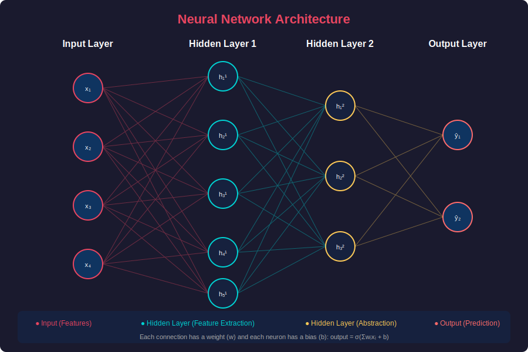
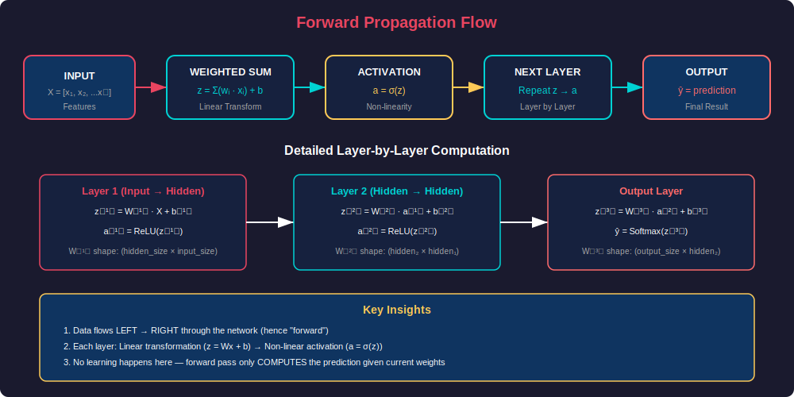
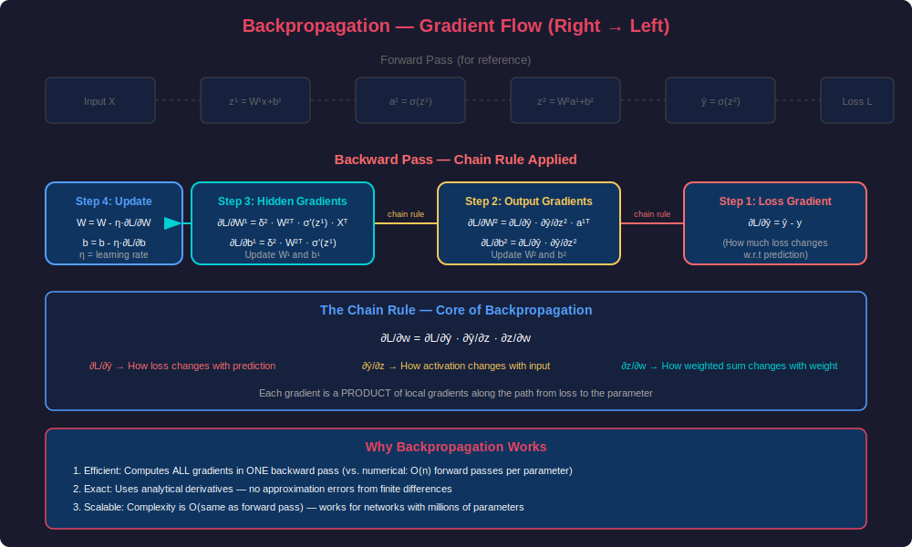
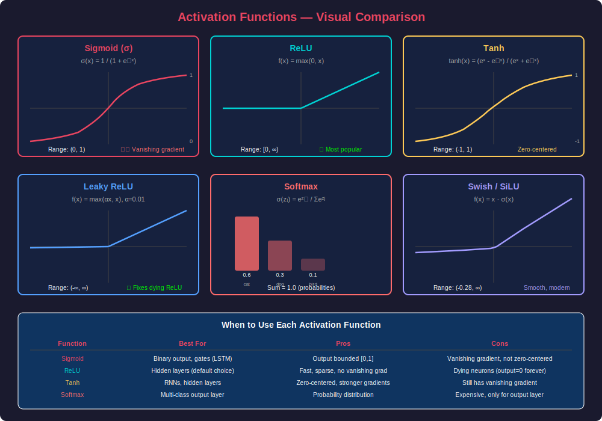
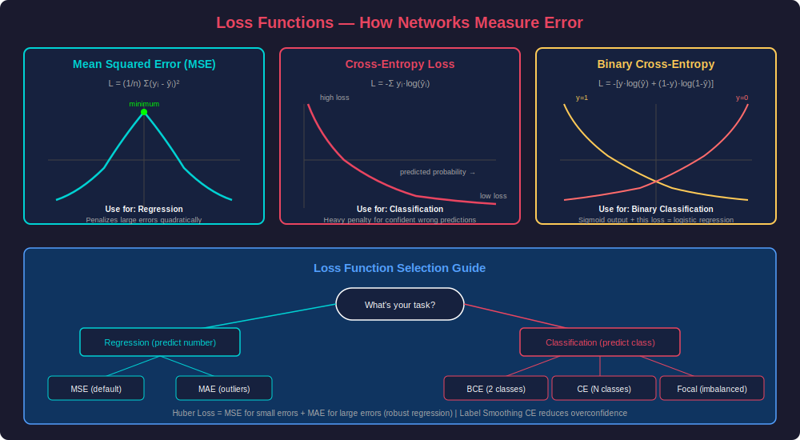
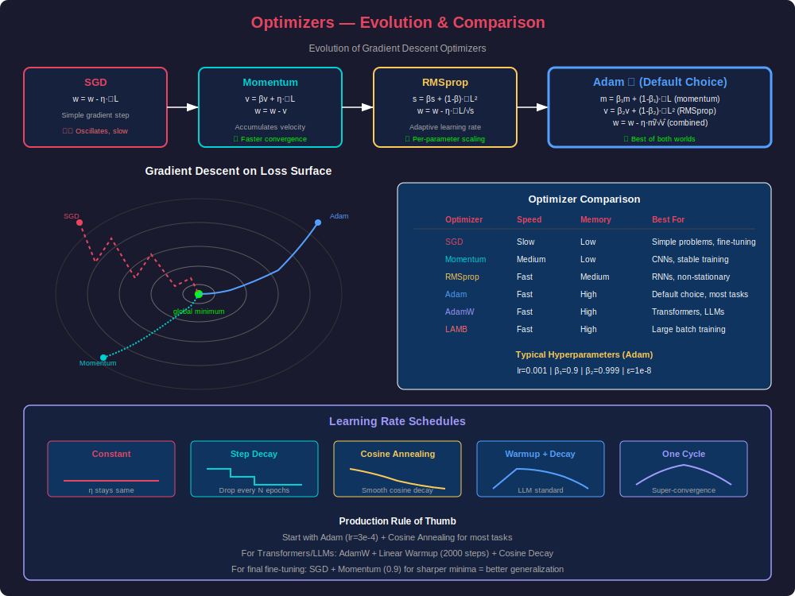
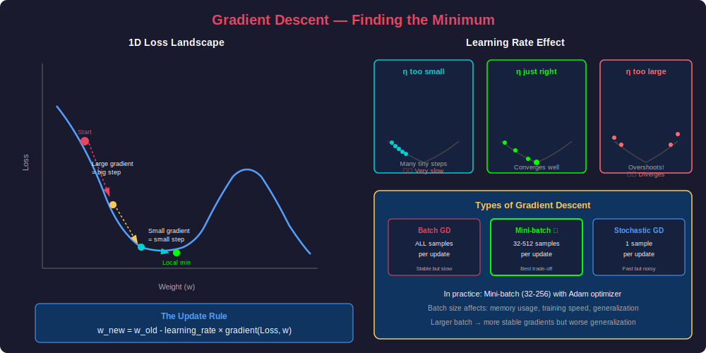
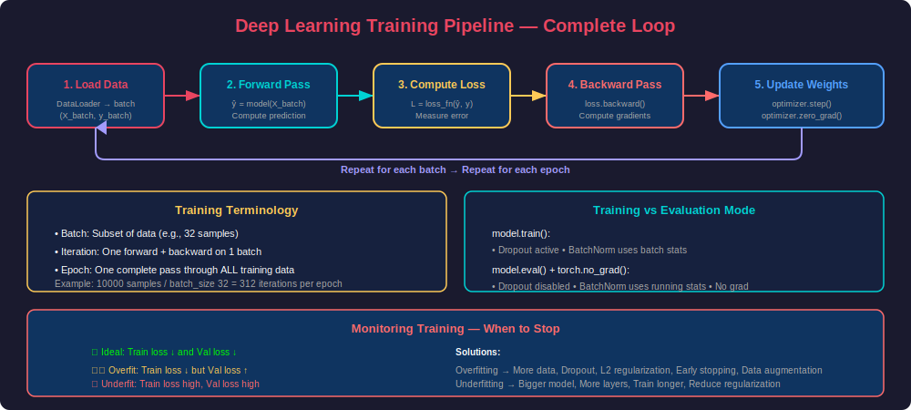

# PHASE 13 — Deep Learning Foundations

---

## Table of Contents

1. [Introduction to Deep Learning](#introduction-to-deep-learning)
2. [Neural Networks](#neural-networks)
3. [Forward Propagation](#forward-propagation)
4. [Backpropagation](#backpropagation)
5. [Activation Functions](#activation-functions)
6. [Loss Functions](#loss-functions)
7. [Optimizers](#optimizers)
8. [Putting It All Together — Training Pipeline](#putting-it-all-together--training-pipeline)
9. [Common Problems & Solutions](#common-problems--solutions)
10. [Production Considerations](#production-considerations)
11. [Interview Mastery](#interview-mastery)

---

## Introduction to Deep Learning

### What is Deep Learning?

**Beginner Explanation:**
Deep Learning is a subset of Machine Learning that uses **neural networks with multiple layers** (hence "deep") to learn from data. Think of it like building a brain — layer by layer — where each layer learns increasingly abstract patterns.

**Real-World Analogy:**
Imagine recognizing a face:
- Layer 1: Detects edges and simple patterns (like lines)
- Layer 2: Combines edges into features (eyes, nose, mouth)
- Layer 3: Combines features into a face
- Layer 4: Recognizes whose face it is

Each layer builds on the previous one — that's the "deep" in deep learning.

**Technical Definition:**
Deep Learning uses artificial neural networks with multiple hidden layers to learn hierarchical representations of data through gradient-based optimization. The "depth" refers to the number of transformation layers between input and output.

### Why Deep Learning Changed Everything

| Era | Approach | Feature Engineering | Performance |
|-----|----------|-------------------|-------------|
| Traditional ML | Manual features + simple model | Human expert required | Good on structured data |
| Deep Learning | End-to-end learning | Automatic | State-of-the-art everywhere |

**Key Advantage:** Deep learning **automatically discovers features** — no human expert needed to hand-craft them.

### When to Use Deep Learning vs Traditional ML

| Use Deep Learning | Use Traditional ML |
|-------------------|-------------------|
| Large datasets (>10K samples) | Small datasets (<1K samples) |
| Unstructured data (images, text, audio) | Structured/tabular data |
| Complex patterns | Simple relationships |
| When you have GPU resources | Limited compute |
| Feature engineering is impractical | Features are well-understood |

---

## Neural Networks

### The Biological Neuron vs Artificial Neuron

**Biological Neuron:**
- Dendrites receive signals from other neurons
- Cell body processes the signals
- If signal exceeds threshold → fires through axon
- Synapses connect to other neurons with varying strengths

**Artificial Neuron (Perceptron):**
- Inputs (x₁, x₂, ..., xₙ) = dendrites
- Weights (w₁, w₂, ..., wₙ) = synapse strengths
- Summation (Σwᵢxᵢ + b) = cell body processing
- Activation function σ(z) = firing decision
- Output = axon signal

### Architecture Diagram



### Mathematical Foundation of a Single Neuron

```
Input:      x = [x₁, x₂, ..., xₙ]
Weights:    w = [w₁, w₂, ..., wₙ]
Bias:       b (a scalar)

Step 1 — Linear transformation:
    z = w₁x₁ + w₂x₂ + ... + wₙxₙ + b
    z = wᵀx + b  (vector notation)

Step 2 — Activation:
    a = σ(z)   where σ is an activation function

Output:     a (the neuron's activation)
```

### From Single Neuron to Network

A **Neural Network** is layers of neurons connected together:

| Layer Type | Role | Example |
|-----------|------|---------|
| **Input Layer** | Receives raw features | 784 neurons for 28×28 image |
| **Hidden Layer(s)** | Learn internal representations | 128, 64 neurons |
| **Output Layer** | Produces final prediction | 10 neurons for 10 classes |

### Key Terminology

| Term | Definition | Analogy |
|------|-----------|---------|
| **Weight** | Connection strength between neurons | Volume knob on each input |
| **Bias** | Offset added to weighted sum | Default baseline level |
| **Activation** | Output of a neuron after activation function | Signal strength |
| **Layer** | Group of neurons operating in parallel | Processing stage |
| **Parameters** | All weights + biases in the network | Things the network learns |
| **Hyperparameters** | Things YOU set (lr, layers, neurons) | Things you tune |

### How Many Parameters?

For a fully-connected (dense) network:

```
Layer: input_size → output_size
Parameters = (input_size × output_size) + output_size
              ↑ weights                    ↑ biases

Example: 784 → 128 → 64 → 10
Layer 1: (784 × 128) + 128 = 100,480 params
Layer 2: (128 × 64) + 64   = 8,256 params
Layer 3: (64 × 10) + 10    = 650 params
Total:                        109,386 parameters
```

### Code: Building a Neural Network from Scratch (NumPy)

```python
import numpy as np

class NeuralNetwork:
    def __init__(self, layer_sizes):
        """
        layer_sizes: list like [784, 128, 64, 10]
        """
        self.weights = []
        self.biases = []
        
        # Initialize weights using Xavier initialization
        for i in range(len(layer_sizes) - 1):
            # Xavier/Glorot initialization
            scale = np.sqrt(2.0 / (layer_sizes[i] + layer_sizes[i+1]))
            w = np.random.randn(layer_sizes[i], layer_sizes[i+1]) * scale
            b = np.zeros((1, layer_sizes[i+1]))
            self.weights.append(w)
            self.biases.append(b)
    
    def relu(self, z):
        return np.maximum(0, z)
    
    def relu_derivative(self, z):
        return (z > 0).astype(float)
    
    def softmax(self, z):
        exp_z = np.exp(z - np.max(z, axis=1, keepdims=True))
        return exp_z / np.sum(exp_z, axis=1, keepdims=True)
    
    def forward(self, X):
        """Forward pass through the network"""
        self.activations = [X]
        self.z_values = []
        
        current_input = X
        for i in range(len(self.weights) - 1):
            z = current_input @ self.weights[i] + self.biases[i]
            self.z_values.append(z)
            a = self.relu(z)
            self.activations.append(a)
            current_input = a
        
        # Output layer with softmax
        z = current_input @ self.weights[-1] + self.biases[-1]
        self.z_values.append(z)
        output = self.softmax(z)
        self.activations.append(output)
        
        return output
    
    def compute_loss(self, y_pred, y_true):
        """Cross-entropy loss"""
        m = y_true.shape[0]
        # Clip to prevent log(0)
        y_pred = np.clip(y_pred, 1e-15, 1 - 1e-15)
        loss = -np.sum(y_true * np.log(y_pred)) / m
        return loss
    
    def backward(self, y_true, learning_rate=0.001):
        """Backpropagation"""
        m = y_true.shape[0]
        
        # Output layer gradient
        dz = self.activations[-1] - y_true  # softmax + CE shortcut
        
        for i in range(len(self.weights) - 1, -1, -1):
            dw = self.activations[i].T @ dz / m
            db = np.sum(dz, axis=0, keepdims=True) / m
            
            if i > 0:
                dz = (dz @ self.weights[i].T) * self.relu_derivative(self.z_values[i-1])
            
            # Update weights
            self.weights[i] -= learning_rate * dw
            self.biases[i] -= learning_rate * db
    
    def train(self, X, y, epochs=100, lr=0.001, batch_size=32):
        """Training loop"""
        for epoch in range(epochs):
            # Mini-batch training
            indices = np.random.permutation(X.shape[0])
            for start in range(0, X.shape[0], batch_size):
                batch_idx = indices[start:start+batch_size]
                X_batch = X[batch_idx]
                y_batch = y[batch_idx]
                
                # Forward
                predictions = self.forward(X_batch)
                
                # Backward
                self.backward(y_batch, lr)
            
            if epoch % 10 == 0:
                predictions = self.forward(X)
                loss = self.compute_loss(predictions, y)
                accuracy = np.mean(np.argmax(predictions, axis=1) == np.argmax(y, axis=1))
                print(f"Epoch {epoch}: Loss={loss:.4f}, Accuracy={accuracy:.4f}")


# Usage
nn = NeuralNetwork([784, 128, 64, 10])
# nn.train(X_train, y_train_onehot, epochs=100, lr=0.001)
```

### Code: Building with PyTorch

```python
import torch
import torch.nn as nn
import torch.optim as optim
from torch.utils.data import DataLoader, TensorDataset

class DeepNetwork(nn.Module):
    def __init__(self, input_size, hidden_sizes, output_size):
        super().__init__()
        
        layers = []
        prev_size = input_size
        
        for hidden_size in hidden_sizes:
            layers.append(nn.Linear(prev_size, hidden_size))
            layers.append(nn.BatchNorm1d(hidden_size))
            layers.append(nn.ReLU())
            layers.append(nn.Dropout(0.3))
            prev_size = hidden_size
        
        layers.append(nn.Linear(prev_size, output_size))
        
        self.network = nn.Sequential(*layers)
    
    def forward(self, x):
        return self.network(x)


# Create model
model = DeepNetwork(
    input_size=784,
    hidden_sizes=[256, 128, 64],
    output_size=10
)

# Count parameters
total_params = sum(p.numel() for p in model.parameters())
trainable_params = sum(p.numel() for p in model.parameters() if p.requires_grad)
print(f"Total parameters: {total_params:,}")
print(f"Trainable parameters: {trainable_params:,}")

# Loss and optimizer
criterion = nn.CrossEntropyLoss()
optimizer = optim.Adam(model.parameters(), lr=0.001)

# Training loop
def train_model(model, train_loader, val_loader, epochs=50):
    for epoch in range(epochs):
        model.train()
        train_loss = 0.0
        correct = 0
        total = 0
        
        for X_batch, y_batch in train_loader:
            # Forward pass
            outputs = model(X_batch)
            loss = criterion(outputs, y_batch)
            
            # Backward pass
            optimizer.zero_grad()
            loss.backward()
            optimizer.step()
            
            train_loss += loss.item()
            _, predicted = torch.max(outputs, 1)
            total += y_batch.size(0)
            correct += (predicted == y_batch).sum().item()
        
        # Validation
        model.eval()
        val_loss = 0.0
        val_correct = 0
        val_total = 0
        
        with torch.no_grad():
            for X_val, y_val in val_loader:
                outputs = model(X_val)
                loss = criterion(outputs, y_val)
                val_loss += loss.item()
                _, predicted = torch.max(outputs, 1)
                val_total += y_val.size(0)
                val_correct += (predicted == y_val).sum().item()
        
        print(f"Epoch {epoch+1}/{epochs} | "
              f"Train Loss: {train_loss/len(train_loader):.4f} | "
              f"Train Acc: {correct/total:.4f} | "
              f"Val Loss: {val_loss/len(val_loader):.4f} | "
              f"Val Acc: {val_correct/val_total:.4f}")
```

### Code: Building with TensorFlow/Keras

```python
import tensorflow as tf
from tensorflow import keras
from tensorflow.keras import layers

# Functional API (recommended for complex models)
def build_model(input_shape, num_classes):
    inputs = keras.Input(shape=input_shape)
    
    x = layers.Dense(256, kernel_initializer='he_normal')(inputs)
    x = layers.BatchNormalization()(x)
    x = layers.ReLU()(x)
    x = layers.Dropout(0.3)(x)
    
    x = layers.Dense(128, kernel_initializer='he_normal')(x)
    x = layers.BatchNormalization()(x)
    x = layers.ReLU()(x)
    x = layers.Dropout(0.3)(x)
    
    x = layers.Dense(64, kernel_initializer='he_normal')(x)
    x = layers.BatchNormalization()(x)
    x = layers.ReLU()(x)
    x = layers.Dropout(0.2)(x)
    
    outputs = layers.Dense(num_classes, activation='softmax')(x)
    
    model = keras.Model(inputs=inputs, outputs=outputs)
    return model

model = build_model(input_shape=(784,), num_classes=10)

# Compile
model.compile(
    optimizer=keras.optimizers.Adam(learning_rate=0.001),
    loss='sparse_categorical_crossentropy',
    metrics=['accuracy']
)

# Model summary
model.summary()

# Train with callbacks
callbacks = [
    keras.callbacks.EarlyStopping(patience=10, restore_best_weights=True),
    keras.callbacks.ReduceLROnPlateau(factor=0.5, patience=5),
    keras.callbacks.ModelCheckpoint('best_model.keras', save_best_only=True)
]

history = model.fit(
    X_train, y_train,
    validation_split=0.2,
    epochs=100,
    batch_size=32,
    callbacks=callbacks
)
```

---

## Forward Propagation

### What is Forward Propagation?

**Beginner Explanation:**
Forward propagation is the process of passing input data **through the network from left to right** to get a prediction. It's like a factory assembly line — raw materials (input) go through processing stages (layers) and come out as a finished product (prediction).

**Real-World Analogy:**
Imagine a series of experts reviewing a document:
1. Expert 1 reads raw text → highlights key phrases
2. Expert 2 takes highlights → extracts themes
3. Expert 3 takes themes → makes a final classification

Each expert (layer) processes what the previous one produced.

### Flow Diagram



### Step-by-Step Mathematics

Given a 2-layer network:

**Layer 1 (Input → Hidden):**
```
Input: X (shape: batch_size × input_dim)
Weights: W¹ (shape: input_dim × hidden_dim)
Bias: b¹ (shape: 1 × hidden_dim)

Step 1: z¹ = X · W¹ + b¹       (linear transformation)
Step 2: a¹ = ReLU(z¹)          (non-linear activation)
```

**Layer 2 (Hidden → Output):**
```
Input: a¹ (output of previous layer)
Weights: W² (shape: hidden_dim × output_dim)
Bias: b² (shape: 1 × output_dim)

Step 1: z² = a¹ · W² + b²     (linear transformation)
Step 2: ŷ = Softmax(z²)       (output activation)
```

### Why Non-linearity is Essential

Without activation functions, stacking layers is useless:
```
z¹ = W¹x + b¹
z² = W²z¹ + b² = W²(W¹x + b¹) + b² = (W²W¹)x + (W²b¹ + b²) = W'x + b'
```

**No matter how many layers — it's still a linear function!** Activation functions break this linearity, allowing the network to learn complex, non-linear patterns.

### Numerical Example

```python
import numpy as np

# Simple 2-input, 2-hidden, 1-output network
X = np.array([[1.0, 0.5]])        # Input: 2 features

# Layer 1 (2→2)
W1 = np.array([[0.1, 0.3],
               [0.2, 0.4]])
b1 = np.array([[0.1, 0.1]])

# Layer 2 (2→1)
W2 = np.array([[0.5],
               [0.6]])
b2 = np.array([[0.2]])

# Forward pass
z1 = X @ W1 + b1
print(f"z1 = {z1}")  # [[0.3, 0.6]]

a1 = np.maximum(0, z1)  # ReLU
print(f"a1 = {a1}")  # [[0.3, 0.6]]

z2 = a1 @ W2 + b2
print(f"z2 = {z2}")  # [[0.71]]

# Sigmoid for binary classification
y_hat = 1 / (1 + np.exp(-z2))
print(f"ŷ = {y_hat}")  # [[0.67]]
```

### Computational Graph

Every forward pass builds a **computational graph** that tracks:
- What operations were performed
- In what order
- Which variables were involved

This graph is then used by backpropagation to compute gradients efficiently.

```python
# PyTorch builds this automatically
x = torch.tensor([1.0, 0.5], requires_grad=True)
z = x @ W + b      # Linear op recorded
a = torch.relu(z)  # ReLU op recorded
loss = criterion(a, target)  # Loss op recorded
# Entire computation graph ready for .backward()
```

### Performance Considerations

| Factor | Impact | Best Practice |
|--------|--------|---------------|
| Batch size | Larger = faster (GPU parallelism) | 32-256 typical |
| Data type | float16 vs float32 | Use mixed precision |
| GPU memory | Limits max batch size | Gradient accumulation |
| Sequential layers | Can't parallelize | Use residual connections |

---

## Backpropagation

### What is Backpropagation?

**Beginner Explanation:**
Backpropagation is **how a neural network learns**. After making a prediction (forward pass), we measure how wrong it was (loss), then work backwards through each layer to figure out which weights need to change and by how much.

**Real-World Analogy:**
Imagine a team of 5 people each adding an ingredient to a recipe. The final dish tastes terrible. Backpropagation is like tracing back: "The final flavor was off → because the spice balance was wrong → because too much salt was added in step 3 → so person 3 needs to use less salt."

**Technical Definition:**
Backpropagation is an algorithm that efficiently computes the gradient of the loss function with respect to every weight in the network using the **chain rule of calculus**, enabling gradient descent optimization.

### Flow Diagram



### The Chain Rule — Heart of Backpropagation

The chain rule allows us to compute gradients through composed functions:

If `L = f(g(h(w)))`, then:
```
∂L/∂w = ∂L/∂f · ∂f/∂g · ∂g/∂h · ∂h/∂w
```

In neural networks:
```
L = Loss(Softmax(W² · ReLU(W¹ · x + b¹) + b²))

∂L/∂W¹ = ∂L/∂ŷ · ∂ŷ/∂z² · ∂z²/∂a¹ · ∂a¹/∂z¹ · ∂z¹/∂W¹
```

### Step-by-Step Backpropagation

**Setup:**
- Network: Input(2) → Hidden(2) → Output(1)
- Loss function: MSE = (y - ŷ)²

**Step 1: Compute Loss Gradient**
```
∂L/∂ŷ = 2(ŷ - y)
```

**Step 2: Gradient through output activation (sigmoid)**
```
∂ŷ/∂z² = ŷ(1 - ŷ)     (sigmoid derivative)
∂L/∂z² = ∂L/∂ŷ · ∂ŷ/∂z² = 2(ŷ - y) · ŷ(1 - ŷ)
```

**Step 3: Gradients for output layer weights**
```
∂z²/∂W² = a¹ᵀ          (input to this layer)
∂L/∂W² = ∂L/∂z² · a¹ᵀ  (weight gradient)
∂L/∂b² = ∂L/∂z²        (bias gradient)
```

**Step 4: Propagate gradient to hidden layer**
```
∂z²/∂a¹ = W²ᵀ          (weights connecting layers)
∂L/∂a¹ = ∂L/∂z² · W²ᵀ  (gradient at hidden activation)
```

**Step 5: Gradient through hidden activation (ReLU)**
```
∂a¹/∂z¹ = 1 if z¹ > 0, else 0    (ReLU derivative)
∂L/∂z¹ = ∂L/∂a¹ · ∂a¹/∂z¹
```

**Step 6: Gradients for hidden layer weights**
```
∂L/∂W¹ = ∂L/∂z¹ · Xᵀ
∂L/∂b¹ = ∂L/∂z¹
```

**Step 7: Update all weights**
```
W² = W² - η · ∂L/∂W²
b² = b² - η · ∂L/∂b²
W¹ = W¹ - η · ∂L/∂W¹
b¹ = b¹ - η · ∂L/∂b¹
```

### Complete Numerical Example

```python
import numpy as np

# Network: 2 inputs → 2 hidden → 1 output
np.random.seed(42)

# Input and target
X = np.array([[0.5, 0.8]])
y = np.array([[1.0]])

# Initialize weights
W1 = np.array([[0.1, 0.3], [0.2, 0.4]])
b1 = np.array([[0.0, 0.0]])
W2 = np.array([[0.5], [0.6]])
b2 = np.array([[0.0]])

learning_rate = 0.1

# ======= FORWARD PASS =======
z1 = X @ W1 + b1
print(f"z1 = {z1}")                    # [[0.21, 0.47]]

a1 = np.maximum(0, z1)                 # ReLU
print(f"a1 = {a1}")                    # [[0.21, 0.47]]

z2 = a1 @ W2 + b2
print(f"z2 = {z2}")                    # [[0.387]]

y_hat = 1 / (1 + np.exp(-z2))         # Sigmoid
print(f"ŷ = {y_hat}")                  # [[0.5955]]

# ======= LOSS =======
loss = (y - y_hat) ** 2
print(f"Loss = {loss}")                # [[0.1636]]

# ======= BACKWARD PASS =======
# Gradient of loss w.r.t. ŷ
dL_dyhat = -2 * (y - y_hat)           # [[0.809]]

# Gradient through sigmoid
dyhat_dz2 = y_hat * (1 - y_hat)       # [[0.2411]]
dL_dz2 = dL_dyhat * dyhat_dz2         # [[0.1949]]

# Gradients for W2, b2
dL_dW2 = a1.T @ dL_dz2
dL_db2 = dL_dz2
print(f"∂L/∂W2 = {dL_dW2}")
print(f"∂L/∂b2 = {dL_db2}")

# Propagate to hidden layer
dL_da1 = dL_dz2 @ W2.T
dL_dz1 = dL_da1 * (z1 > 0)            # ReLU derivative

# Gradients for W1, b1
dL_dW1 = X.T @ dL_dz1
dL_db1 = dL_dz1
print(f"∂L/∂W1 = {dL_dW1}")
print(f"∂L/∂b1 = {dL_db1}")

# ======= UPDATE WEIGHTS =======
W2 = W2 - learning_rate * dL_dW2
b2 = b2 - learning_rate * dL_db2
W1 = W1 - learning_rate * dL_dW1
b1 = b1 - learning_rate * dL_db1

print(f"\nUpdated W2 = {W2}")
print(f"Updated W1 = {W1}")
```

### Automatic Differentiation (Autograd)

In practice, you NEVER implement backprop manually. Frameworks handle it:

```python
import torch

# PyTorch autograd
x = torch.tensor([[0.5, 0.8]], requires_grad=True)
W1 = torch.tensor([[0.1, 0.3], [0.2, 0.4]], requires_grad=True)
W2 = torch.tensor([[0.5], [0.6]], requires_grad=True)

# Forward pass — PyTorch records operations
z1 = x @ W1
a1 = torch.relu(z1)
z2 = a1 @ W2
y_hat = torch.sigmoid(z2)

# Compute loss
target = torch.tensor([[1.0]])
loss = ((target - y_hat) ** 2).mean()

# Backward pass — ONE LINE!
loss.backward()

# Gradients are now available
print(f"W1.grad = {W1.grad}")
print(f"W2.grad = {W2.grad}")
```

### Common Problems in Backpropagation

| Problem | Cause | Solution |
|---------|-------|----------|
| **Vanishing Gradients** | Sigmoid/tanh squash gradients to 0 | Use ReLU, ResNets, LSTM |
| **Exploding Gradients** | Gradients grow exponentially | Gradient clipping, proper init |
| **Dead Neurons** | ReLU outputs 0 → gradient = 0 forever | Leaky ReLU, PReLU |
| **Numerical Instability** | Overflow/underflow in exp() | LogSoftmax, proper scaling |

---

## Activation Functions

### Why Activation Functions?

Without activation functions, a neural network is just a linear function — no matter how many layers you stack. Activation functions introduce **non-linearity**, allowing networks to learn complex patterns like curves, circles, and decision boundaries.

### Visual Comparison



### Detailed Analysis of Each Activation Function

#### 1. Sigmoid

```
σ(x) = 1 / (1 + e⁻ˣ)
σ'(x) = σ(x) · (1 - σ(x))
```

| Property | Value |
|----------|-------|
| Range | (0, 1) |
| Center | Not zero-centered |
| Gradient max | 0.25 (at x=0) |
| Saturates | Yes (both sides) |
| Use case | Binary classification output, gates |

**Problem — Vanishing Gradient:**
- Maximum gradient is only 0.25
- For deep networks: 0.25^n → near 0 for early layers
- Weights in early layers barely update

```python
import numpy as np

def sigmoid(x):
    return 1 / (1 + np.exp(-x))

def sigmoid_derivative(x):
    s = sigmoid(x)
    return s * (1 - s)

# Vanishing gradient demonstration
gradient_after_10_layers = 0.25 ** 10
print(f"Gradient after 10 sigmoid layers: {gradient_after_10_layers}")
# Output: 9.5e-07 — effectively ZERO!
```

#### 2. ReLU (Rectified Linear Unit)

```
f(x) = max(0, x)
f'(x) = 1 if x > 0, else 0
```

| Property | Value |
|----------|-------|
| Range | [0, ∞) |
| Computation | Extremely fast (just max) |
| Gradient | 1 for positive, 0 for negative |
| Sparsity | ~50% of neurons output 0 |
| Use case | Default for hidden layers |

**Why ReLU Dominates:**
- No vanishing gradient (gradient = 1 for positive inputs)
- Computationally cheap (no exp())
- Creates sparse representations (biological)
- Converges 6x faster than sigmoid (proven empirically)

**Problem — Dying ReLU:**
- If all inputs to a neuron become negative → output always 0
- Gradient = 0 → weight never updates → neuron is permanently "dead"
- Can happen with large learning rates

```python
def relu(x):
    return np.maximum(0, x)

def relu_derivative(x):
    return (x > 0).astype(float)
```

#### 3. Leaky ReLU

```
f(x) = x if x > 0, else αx  (α = 0.01 typically)
f'(x) = 1 if x > 0, else α
```

**Fixes dying ReLU** by allowing a small gradient for negative values.

```python
def leaky_relu(x, alpha=0.01):
    return np.where(x > 0, x, alpha * x)

def leaky_relu_derivative(x, alpha=0.01):
    return np.where(x > 0, 1, alpha)
```

#### 4. Tanh

```
tanh(x) = (eˣ - e⁻ˣ) / (eˣ + e⁻ˣ)
tanh'(x) = 1 - tanh²(x)
```

| Property | Value |
|----------|-------|
| Range | (-1, 1) |
| Center | Zero-centered ✓ |
| Gradient max | 1.0 (at x=0) |
| Use case | RNNs, hidden layers when zero-centering matters |

#### 5. Softmax

```
σ(zᵢ) = eᶻⁱ / Σⱼeᶻʲ
```

- Converts raw logits → probability distribution
- All outputs sum to 1
- Used ONLY in the output layer for multi-class classification

```python
def softmax(z):
    exp_z = np.exp(z - np.max(z, axis=1, keepdims=True))  # Numerical stability
    return exp_z / np.sum(exp_z, axis=1, keepdims=True)

# Example
logits = np.array([[2.0, 1.0, 0.1]])
probs = softmax(logits)
print(f"Probabilities: {probs}")  # [[0.659, 0.242, 0.099]]
print(f"Sum: {probs.sum()}")      # 1.0
```

#### 6. Swish / SiLU (Modern Choice)

```
f(x) = x · σ(x)
f'(x) = f(x) + σ(x)(1 - f(x))
```

- Used in EfficientNet, GPT, modern architectures
- Smooth, non-monotonic
- Self-gating: x controls its own gating via sigmoid

#### 7. GELU (Gaussian Error Linear Unit)

```
GELU(x) = x · Φ(x)  where Φ is standard Gaussian CDF
≈ 0.5x(1 + tanh(√(2/π)(x + 0.044715x³)))
```

- Used in BERT, GPT-2/3/4, modern Transformers
- Smooth approximation to ReLU
- Stochastic regularization effect

### Choosing Activation Functions — Decision Framework

```
Hidden Layers:
├── Default → ReLU
├── Dying neuron problem → Leaky ReLU or ELU
├── Modern architecture → GELU or Swish
└── RNNs → Tanh

Output Layer:
├── Binary classification → Sigmoid
├── Multi-class classification → Softmax
├── Regression (any value) → None (Linear)
├── Regression (positive) → ReLU
└── Regression (bounded) → Sigmoid or Tanh
```

---

## Loss Functions

### What are Loss Functions?

**Beginner Explanation:**
A loss function measures **how wrong** the network's prediction is compared to the actual answer. It's the "score" the network tries to minimize. Lower loss = better predictions.

**Real-World Analogy:**
A loss function is like a teacher grading an exam:
- Perfect answer: loss = 0 (no error)
- Slightly wrong: small loss
- Completely wrong: huge loss

The network "studies" (trains) to minimize this score.

### Visual Guide



### Detailed Analysis

#### 1. Mean Squared Error (MSE)

```
L = (1/n) Σᵢ(yᵢ - ŷᵢ)²
```

| Property | Detail |
|----------|--------|
| Task | Regression |
| Range | [0, ∞) |
| Gradient | 2(ŷ - y)/n — proportional to error |
| Sensitivity | Penalizes large errors quadratically |
| Outlier effect | Very sensitive to outliers |

```python
def mse_loss(y_true, y_pred):
    return np.mean((y_true - y_pred) ** 2)

def mse_gradient(y_true, y_pred):
    return 2 * (y_pred - y_true) / len(y_true)
```

**When to use:** Standard regression tasks (predicting house prices, temperature, stock values)

**When NOT to use:** When outliers are present → use Huber or MAE instead

#### 2. Mean Absolute Error (MAE)

```
L = (1/n) Σᵢ|yᵢ - ŷᵢ|
```

- More robust to outliers than MSE
- Gradient is constant (±1) regardless of error magnitude
- Can slow convergence near minimum

#### 3. Binary Cross-Entropy (Log Loss)

```
L = -[y·log(ŷ) + (1-y)·log(1-ŷ)]
```

| Property | Detail |
|----------|--------|
| Task | Binary classification |
| Range | [0, ∞) |
| Paired with | Sigmoid output |
| Key property | Heavily penalizes confident wrong predictions |

```python
def binary_cross_entropy(y_true, y_pred, epsilon=1e-15):
    y_pred = np.clip(y_pred, epsilon, 1 - epsilon)
    return -np.mean(y_true * np.log(y_pred) + (1 - y_true) * np.log(1 - y_pred))
```

**Why Cross-Entropy works better than MSE for classification:**
- MSE gradient near 0 or 1 → very small (vanishing gradient)
- Cross-entropy gradient → large when prediction is confidently WRONG
- This means faster correction of mistakes

#### 4. Categorical Cross-Entropy

```
L = -Σᵢ Σⱼ yᵢⱼ · log(ŷᵢⱼ)
```

- Multi-class version
- Paired with Softmax output
- y is one-hot encoded

```python
# PyTorch
criterion = nn.CrossEntropyLoss()  # Combines LogSoftmax + NLLLoss

# TensorFlow
loss = keras.losses.CategoricalCrossentropy()       # one-hot labels
loss = keras.losses.SparseCategoricalCrossentropy()  # integer labels
```

#### 5. Huber Loss (Smooth L1)

```
L = 0.5(y-ŷ)²     if |y-ŷ| ≤ δ
L = δ|y-ŷ| - 0.5δ²  otherwise
```

- MSE for small errors + MAE for large errors
- Best of both: smooth gradient near minimum + robust to outliers
- Used in Faster R-CNN, many regression tasks

#### 6. Focal Loss

```
L = -αₜ(1 - pₜ)ᵞ · log(pₜ)
```

- Designed for extreme class imbalance
- Down-weights easy examples, focuses on hard ones
- γ (gamma) controls focus strength
- Used in object detection (RetinaNet)

### Loss Function Selection Guide

```python
# Regression
nn.MSELoss()          # Standard regression
nn.L1Loss()           # Robust to outliers (MAE)
nn.SmoothL1Loss()     # Huber loss (best of both)

# Classification
nn.BCELoss()          # Binary (sigmoid output)
nn.BCEWithLogitsLoss() # Binary (raw logits — more stable)
nn.CrossEntropyLoss()  # Multi-class (raw logits)
nn.NLLLoss()          # Multi-class (log probabilities)

# Specialized
nn.TripletMarginLoss()  # Contrastive learning
nn.CosineEmbeddingLoss() # Similarity learning
nn.KLDivLoss()         # Distribution matching (VAEs)
```

---

## Optimizers

### What are Optimizers?

**Beginner Explanation:**
Optimizers decide **how to update the network's weights** based on the gradients computed during backpropagation. They control the "learning strategy" — how fast to learn, in what direction, and how to avoid getting stuck.

**Real-World Analogy:**
Finding the lowest point in a mountain range while blindfolded:
- **SGD:** Take a step downhill based on the slope you feel
- **Momentum:** Like a ball rolling downhill — builds up speed
- **Adam:** A smart hiker with a compass, memory of past slopes, and adaptive step size

### Optimizer Evolution & Comparison



### Gradient Descent Visualization



### Detailed Optimizer Analysis

#### 1. Stochastic Gradient Descent (SGD)

```
w = w - η · ∇L(w)
```

| Property | Value |
|----------|-------|
| Update rule | w = w - lr × gradient |
| Memory | O(0) extra — just parameters |
| Speed | Slow convergence |
| Stability | Can oscillate in ravines |
| Final performance | Often best generalization |

```python
# PyTorch
optimizer = torch.optim.SGD(model.parameters(), lr=0.01)

# Manual implementation
for param in model.parameters():
    param.data -= learning_rate * param.grad
```

#### 2. SGD with Momentum

```
v = β·v + η·∇L(w)     # accumulate velocity
w = w - v              # update with velocity
```

- β (momentum coefficient) typically 0.9
- "Ball rolling downhill" — accelerates in consistent direction
- Dampens oscillation in perpendicular directions

```python
optimizer = torch.optim.SGD(model.parameters(), lr=0.01, momentum=0.9)
```

#### 3. Nesterov Accelerated Gradient (NAG)

```
v = β·v + η·∇L(w - β·v)    # "look ahead" gradient
w = w - v
```

- Looks ahead before computing gradient
- Smarter momentum — starts slowing before overshooting
- Better convergence for convex problems

```python
optimizer = torch.optim.SGD(model.parameters(), lr=0.01, momentum=0.9, nesterov=True)
```

#### 4. AdaGrad

```
s = s + (∇L)²         # accumulate squared gradients
w = w - η·∇L / √(s+ε)  # adaptive learning rate
```

- Per-parameter learning rate
- Frequently updated params → smaller learning rate
- Problem: Learning rate monotonically decreases → eventually stops learning

#### 5. RMSprop

```
s = β·s + (1-β)·(∇L)²        # exponential moving average
w = w - η·∇L / √(s + ε)     # adaptive update
```

- Fixes AdaGrad's decaying learning rate
- Uses exponential moving average (forgets old gradients)
- Works well for RNNs and non-stationary problems

```python
optimizer = torch.optim.RMSprop(model.parameters(), lr=0.001, alpha=0.99)
```

#### 6. Adam (Adaptive Moment Estimation) ⭐

```
m = β₁·m + (1-β₁)·∇L        # first moment (mean of gradients)
v = β₂·v + (1-β₂)·(∇L)²    # second moment (variance of gradients)
m̂ = m / (1 - β₁ᵗ)          # bias correction
v̂ = v / (1 - β₂ᵗ)          # bias correction
w = w - η·m̂ / (√v̂ + ε)     # update
```

| Hyperparameter | Default | Role |
|---------------|---------|------|
| lr (η) | 0.001 | Learning rate |
| β₁ | 0.9 | Momentum decay |
| β₂ | 0.999 | Variance decay |
| ε | 1e-8 | Numerical stability |

```python
optimizer = torch.optim.Adam(model.parameters(), lr=0.001, betas=(0.9, 0.999))
```

**Why Adam is the default:**
- Combines benefits of Momentum + RMSprop
- Adaptive per-parameter learning rates
- Works out-of-the-box with minimal tuning
- Fast convergence for most problems

#### 7. AdamW (Weight Decay Regularization)

```
# Standard Adam with L2 penalty has a bug — weight decay is coupled to LR
# AdamW fixes this by decoupling weight decay

w = w - η·m̂/(√v̂+ε) - η·λ·w    # Separate weight decay term
```

- Standard for Transformers and LLMs
- Decoupled weight decay (proper regularization)
- Used in BERT, GPT, ViT training

```python
optimizer = torch.optim.AdamW(model.parameters(), lr=3e-4, weight_decay=0.01)
```

### Learning Rate Schedulers

```python
from torch.optim.lr_scheduler import (
    StepLR, CosineAnnealingLR, OneCycleLR, 
    ReduceLROnPlateau, CosineAnnealingWarmRestarts
)

# Step decay: multiply LR by gamma every step_size epochs
scheduler = StepLR(optimizer, step_size=30, gamma=0.1)

# Cosine annealing: smooth cosine curve from max to min LR
scheduler = CosineAnnealingLR(optimizer, T_max=100, eta_min=1e-6)

# One cycle: warmup → peak → cooldown (super-convergence)
scheduler = OneCycleLR(optimizer, max_lr=0.01, total_steps=1000)

# Reduce on plateau: lower LR when metric stops improving
scheduler = ReduceLROnPlateau(optimizer, patience=10, factor=0.5)

# Usage in training loop
for epoch in range(epochs):
    train_one_epoch()
    scheduler.step()  # or scheduler.step(val_loss) for ReduceLROnPlateau
```

### Production Recipe

```python
# Standard recipe for most tasks
optimizer = torch.optim.Adam(model.parameters(), lr=3e-4)
scheduler = CosineAnnealingLR(optimizer, T_max=num_epochs)

# For Transformers / LLMs
optimizer = torch.optim.AdamW(model.parameters(), lr=3e-4, weight_decay=0.01)
# Linear warmup + cosine decay
scheduler = get_cosine_schedule_with_warmup(
    optimizer, 
    num_warmup_steps=2000, 
    num_training_steps=total_steps
)

# For final fine-tuning (best generalization)
optimizer = torch.optim.SGD(model.parameters(), lr=0.01, momentum=0.9, weight_decay=5e-4)
scheduler = CosineAnnealingLR(optimizer, T_max=num_epochs)
```

---

## Putting It All Together — Training Pipeline

### Complete Training Loop



### Production-Ready Training Script (PyTorch)

```python
import torch
import torch.nn as nn
import torch.optim as optim
from torch.utils.data import DataLoader, random_split
from torch.cuda.amp import autocast, GradScaler
import time

class Trainer:
    def __init__(self, model, train_loader, val_loader, config):
        self.model = model
        self.train_loader = train_loader
        self.val_loader = val_loader
        self.config = config
        
        # Device
        self.device = torch.device('cuda' if torch.cuda.is_available() else 'cpu')
        self.model.to(self.device)
        
        # Loss and optimizer
        self.criterion = nn.CrossEntropyLoss()
        self.optimizer = optim.AdamW(
            model.parameters(), 
            lr=config['lr'],
            weight_decay=config['weight_decay']
        )
        
        # Scheduler
        self.scheduler = optim.lr_scheduler.CosineAnnealingLR(
            self.optimizer, T_max=config['epochs']
        )
        
        # Mixed precision
        self.scaler = GradScaler() if config.get('mixed_precision') else None
        
        # Tracking
        self.best_val_loss = float('inf')
        self.patience_counter = 0
    
    def train_epoch(self):
        self.model.train()
        total_loss = 0
        correct = 0
        total = 0
        
        for batch_idx, (data, target) in enumerate(self.train_loader):
            data, target = data.to(self.device), target.to(self.device)
            
            self.optimizer.zero_grad()
            
            if self.scaler:
                with autocast():
                    output = self.model(data)
                    loss = self.criterion(output, target)
                self.scaler.scale(loss).backward()
                self.scaler.unscale_(self.optimizer)
                torch.nn.utils.clip_grad_norm_(self.model.parameters(), max_norm=1.0)
                self.scaler.step(self.optimizer)
                self.scaler.update()
            else:
                output = self.model(data)
                loss = self.criterion(output, target)
                loss.backward()
                torch.nn.utils.clip_grad_norm_(self.model.parameters(), max_norm=1.0)
                self.optimizer.step()
            
            total_loss += loss.item()
            _, predicted = output.max(1)
            total += target.size(0)
            correct += predicted.eq(target).sum().item()
        
        return total_loss / len(self.train_loader), correct / total
    
    @torch.no_grad()
    def validate(self):
        self.model.eval()
        total_loss = 0
        correct = 0
        total = 0
        
        for data, target in self.val_loader:
            data, target = data.to(self.device), target.to(self.device)
            output = self.model(data)
            loss = self.criterion(output, target)
            
            total_loss += loss.item()
            _, predicted = output.max(1)
            total += target.size(0)
            correct += predicted.eq(target).sum().item()
        
        return total_loss / len(self.val_loader), correct / total
    
    def train(self):
        for epoch in range(self.config['epochs']):
            start = time.time()
            
            train_loss, train_acc = self.train_epoch()
            val_loss, val_acc = self.validate()
            self.scheduler.step()
            
            elapsed = time.time() - start
            current_lr = self.optimizer.param_groups[0]['lr']
            
            print(f"Epoch {epoch+1}/{self.config['epochs']} ({elapsed:.1f}s) | "
                  f"LR: {current_lr:.6f} | "
                  f"Train: loss={train_loss:.4f} acc={train_acc:.4f} | "
                  f"Val: loss={val_loss:.4f} acc={val_acc:.4f}")
            
            # Early stopping
            if val_loss < self.best_val_loss:
                self.best_val_loss = val_loss
                self.patience_counter = 0
                torch.save(self.model.state_dict(), 'best_model.pth')
            else:
                self.patience_counter += 1
                if self.patience_counter >= self.config['patience']:
                    print(f"Early stopping at epoch {epoch+1}")
                    break
        
        # Load best model
        self.model.load_state_dict(torch.load('best_model.pth'))
        return self.model


# Usage
config = {
    'lr': 3e-4,
    'weight_decay': 0.01,
    'epochs': 100,
    'patience': 15,
    'mixed_precision': True,
    'batch_size': 128
}

model = DeepNetwork(input_size=784, hidden_sizes=[512, 256, 128], output_size=10)
trainer = Trainer(model, train_loader, val_loader, config)
trained_model = trainer.train()
```

---

## Common Problems & Solutions

### 1. Vanishing Gradients

**Symptoms:** Loss decreases very slowly, early layers barely learn

**Solutions:**
| Solution | How it helps |
|----------|-------------|
| ReLU activation | Gradient = 1 for positive inputs |
| Residual connections | Skip connections bypass layers |
| Batch Normalization | Keeps activations in good range |
| Proper initialization | Xavier/He initialization |
| LSTM/GRU (for sequences) | Gating mechanism preserves gradients |

### 2. Exploding Gradients

**Symptoms:** Loss becomes NaN, weights become very large

**Solutions:**
```python
# Gradient clipping (most common fix)
torch.nn.utils.clip_grad_norm_(model.parameters(), max_norm=1.0)

# Or clip by value
torch.nn.utils.clip_grad_value_(model.parameters(), clip_value=0.5)
```

### 3. Overfitting

**Symptoms:** Train accuracy high, validation accuracy low/declining

**Solutions:**
```python
# 1. Dropout
self.dropout = nn.Dropout(0.5)

# 2. Weight Decay (L2 Regularization)
optimizer = optim.Adam(params, lr=0.001, weight_decay=1e-4)

# 3. Data Augmentation
transform = transforms.Compose([
    transforms.RandomHorizontalFlip(),
    transforms.RandomRotation(10),
    transforms.ColorJitter(brightness=0.2)
])

# 4. Early Stopping (implemented in trainer above)

# 5. Batch Normalization
self.bn = nn.BatchNorm1d(hidden_size)
```

### 4. Weight Initialization

```python
# He initialization (best for ReLU)
nn.init.kaiming_normal_(layer.weight, mode='fan_in', nonlinearity='relu')

# Xavier initialization (best for Sigmoid/Tanh)
nn.init.xavier_uniform_(layer.weight)

# For transformer layers
nn.init.normal_(layer.weight, mean=0.0, std=0.02)
```

### 5. Batch Normalization

```python
class NetworkWithBN(nn.Module):
    def __init__(self):
        super().__init__()
        self.fc1 = nn.Linear(784, 256)
        self.bn1 = nn.BatchNorm1d(256)
        self.fc2 = nn.Linear(256, 128)
        self.bn2 = nn.BatchNorm1d(128)
        self.fc3 = nn.Linear(128, 10)
    
    def forward(self, x):
        x = torch.relu(self.bn1(self.fc1(x)))
        x = torch.relu(self.bn2(self.fc2(x)))
        x = self.fc3(x)
        return x
```

**What BatchNorm does:**
1. Normalizes each batch: `x̂ = (x - μ_batch) / √(σ²_batch + ε)`
2. Scales and shifts: `y = γx̂ + β` (learnable parameters)
3. During inference: uses running mean/variance (not batch stats)

**Benefits:**
- Allows higher learning rates (training is more stable)
- Acts as regularization (slight noise from batch stats)
- Reduces sensitivity to initialization
- Faster convergence

---

## Production Considerations

### Model Size & Inference Speed

| Model Size | Parameters | Storage | Inference (CPU) | Inference (GPU) |
|-----------|-----------|---------|-----------------|-----------------|
| Small | <1M | ~4 MB | <10ms | <1ms |
| Medium | 1-100M | 4-400 MB | 10-100ms | 1-10ms |
| Large | 100M-1B | 0.4-4 GB | 100ms-1s | 10-100ms |
| LLM | >1B | >4 GB | >1s | >100ms |

### Deployment Checklist

```python
# 1. Export model for production
model.eval()
torch.save(model.state_dict(), 'model_weights.pth')

# 2. ONNX export (cross-framework)
dummy_input = torch.randn(1, 784)
torch.onnx.export(model, dummy_input, "model.onnx", 
                  input_names=['input'], output_names=['output'])

# 3. TorchScript (for production serving)
scripted_model = torch.jit.script(model)
scripted_model.save("model_scripted.pt")

# 4. Quantization (4x smaller, 2-3x faster)
quantized_model = torch.quantization.quantize_dynamic(
    model, {nn.Linear}, dtype=torch.qint8
)
```

### Debugging Neural Networks

```python
# Check gradient flow
def check_gradients(model):
    for name, param in model.named_parameters():
        if param.grad is not None:
            grad_norm = param.grad.norm().item()
            if grad_norm < 1e-7:
                print(f"⚠️ Vanishing gradient in {name}: {grad_norm:.2e}")
            elif grad_norm > 100:
                print(f"⚠️ Exploding gradient in {name}: {grad_norm:.2e}")

# Hook to monitor activations
def print_activation_stats(name):
    def hook(module, input, output):
        print(f"{name}: mean={output.mean():.4f}, std={output.std():.4f}, "
              f"dead={((output==0).sum()/output.numel()*100):.1f}%")
    return hook

for name, layer in model.named_modules():
    if isinstance(layer, nn.ReLU):
        layer.register_forward_hook(print_activation_stats(name))
```

---

## Interview Mastery

### Beginner Questions

**Q1: What is a neural network?**

**Perfect Answer:**
"A neural network is a computational model inspired by the brain, consisting of layers of interconnected artificial neurons. Each neuron receives inputs, applies a weighted sum with a bias, passes it through an activation function, and produces an output. By stacking layers — input, hidden, and output — the network can learn complex non-linear patterns from data through a process called training, where weights are iteratively adjusted to minimize a loss function."

**Interviewer expects:** Understanding of structure (layers, neurons, weights), the learning process, and why depth matters.

---

**Q2: What is the difference between forward propagation and backpropagation?**

**Perfect Answer:**
"Forward propagation computes the output — data flows from input through each layer to produce a prediction. It's just a sequence of matrix multiplications followed by activation functions. Backpropagation is the learning step — after computing the loss, we propagate gradients backward through the network using the chain rule to determine how each weight contributed to the error, then update weights accordingly. Forward pass answers 'what does the model predict?', backward pass answers 'how should we change the model?'"

**Interviewer expects:** Clear distinction between inference (forward) and learning (backward), mention of chain rule.

---

**Q3: Why do we need activation functions?**

**Perfect Answer:**
"Without activation functions, a neural network — no matter how deep — is equivalent to a single linear transformation. Stacking linear layers just produces another linear function: W₂(W₁x + b₁) + b₂ = W'x + b'. Activation functions introduce non-linearity, allowing the network to learn complex patterns like curves, decision boundaries, and hierarchical features. ReLU is the default choice for hidden layers because it's computationally efficient, doesn't suffer from vanishing gradients, and creates sparse representations."

**Interviewer expects:** Mathematical proof of linearity collapse, practical knowledge of ReLU as default.

---

**Q4: What is the vanishing gradient problem?**

**Perfect Answer:**
"The vanishing gradient problem occurs when gradients become extremely small as they propagate backward through many layers. With sigmoid activation, the maximum gradient is 0.25, so after 10 layers it's 0.25¹⁰ ≈ 10⁻⁷ — early layers essentially stop learning. Solutions include: (1) ReLU activation (gradient = 1 for positive), (2) residual connections that provide gradient highways, (3) batch normalization to prevent activation saturation, and (4) proper weight initialization like He or Xavier."

**Interviewer expects:** Specific numbers showing the problem, multiple solutions, understanding of why certain architectures emerged.

---

### Intermediate Questions

**Q5: Explain Adam optimizer and why it's the default choice.**

**Perfect Answer:**
"Adam combines two ideas: Momentum (first moment — exponential moving average of gradients) and RMSprop (second moment — exponential moving average of squared gradients). The first moment provides direction and momentum, the second moment provides per-parameter adaptive learning rates. It also includes bias correction to account for initialization at zero. The defaults β₁=0.9, β₂=0.999, lr=0.001 work well without tuning for most problems. However, for state-of-the-art performance — especially with Transformers — AdamW (decoupled weight decay) is preferred because standard Adam's L2 regularization is coupled to the adaptive learning rate."

**Interviewer expects:** Understanding of both moments, bias correction, and awareness of AdamW for modern architectures.

---

**Q6: How would you diagnose and fix a neural network that's not learning?**

**Perfect Answer:**
"I follow a systematic debugging process:

1. **Check the loss:** Is it decreasing? NaN? Stuck?
   - NaN → exploding gradients → reduce LR, add gradient clipping
   - Stuck → learning rate too small, or dead neurons

2. **Verify data pipeline:** Can the model overfit on 1 batch?
   - If NO → architecture or implementation bug
   - If YES → model has capacity, issue is generalization

3. **Gradient flow:** Monitor gradient norms per layer
   - Near zero in early layers → vanishing gradients
   - Very large → exploding gradients

4. **Learning rate:** Try LR finder (linearly increase LR, plot loss)
   - Pick LR where loss is decreasing fastest (not minimum!)

5. **Architecture:** Is the model too small? Too large?
   - Overfit first (prove it can learn), then regularize

6. **Initialization:** Wrong init for wrong activation = dead network

This systematic approach isolates the problem every time."

**Interviewer expects:** Structured debugging approach, specific diagnostics, practical experience signals.

---

**Q7: What is batch normalization and why does it help?**

**Perfect Answer:**
"Batch normalization normalizes the inputs to each layer by subtracting the batch mean and dividing by batch standard deviation, then applies learnable scale (γ) and shift (β) parameters. It helps because: (1) it reduces internal covariate shift — each layer's input distribution is more stable, (2) allows higher learning rates since the landscape is smoother, (3) acts as regularization due to mini-batch noise, (4) reduces sensitivity to weight initialization. During inference, it uses running averages instead of batch statistics. One gotcha: it doesn't work well with small batch sizes — use LayerNorm for Transformers/RNNs or GroupNorm for small batches."

**Interviewer expects:** Mechanism, benefits, train vs. inference difference, and alternatives.

---

**Q8: Compare MSE and Cross-Entropy for classification.**

**Perfect Answer:**
"For classification, cross-entropy is strictly superior to MSE. The reason is in the gradient behavior:

With MSE + sigmoid: gradient = (ŷ-y) · ŷ(1-ŷ). When the network is confidently wrong (ŷ≈0, y=1), the sigmoid derivative ŷ(1-ŷ)≈0, making the gradient very small. The network learns slowly from its worst mistakes.

With cross-entropy + sigmoid: gradient = (ŷ-y). The sigmoid derivative cancels perfectly with the cross-entropy derivative. When confidently wrong, gradient is large → fast correction.

MSE is for regression where the error magnitude matters linearly. Cross-entropy is for classification where we care about probability calibration."

**Interviewer expects:** Gradient comparison showing the mathematical advantage, not just a rule-of-thumb.

---

### Advanced Questions

**Q9: Explain the relationship between learning rate, batch size, and generalization.**

**Perfect Answer:**
"There's a deep relationship between batch size and learning rate:

1. **Linear scaling rule:** When doubling batch size, double the learning rate (Goyal et al., 2017). This maintains the same training dynamics.

2. **Generalization gap:** Large batches tend to converge to 'sharp' minima (poor generalization), while small batches find 'flat' minima (better generalization). The gradient noise from small batches acts as implicit regularization.

3. **Practical implications:**
   - Batch size 32-256: Standard, good generalization
   - Batch size >1024: Need warmup + careful LR scaling
   - Gradient accumulation: Simulate large batches on limited GPU

4. **Modern understanding:** It's actually the number of optimization steps that matters more than batch size. More steps = more noise = better generalization. This is why training longer with smaller batches often works better.

In production: I use the largest batch size that fits in GPU memory, scale LR linearly, and add warmup steps."

**Interviewer expects:** Knowledge of scaling rules, sharp vs. flat minima theory, practical trade-offs.

---

**Q10: How would you design a training pipeline for a model with 1B parameters?**

**Perfect Answer:**
"For billion-parameter scale, I'd need:

**Distributed Training:**
- Data Parallelism (DDP): Replicate model on N GPUs, split data
- Model Parallelism: Split model layers across GPUs (for models that don't fit in 1 GPU)
- Pipeline Parallelism: Different layers on different GPUs, micro-batches
- ZeRO optimizer (DeepSpeed): Shard optimizer states, gradients, parameters across GPUs

**Memory Optimization:**
- Mixed precision (FP16/BF16): 2x memory savings, 2-3x throughput
- Gradient checkpointing: Recompute activations vs. storing them (trades compute for memory)
- Gradient accumulation: Effective batch size = micro_batch × accumulation_steps × num_GPUs

**Training Stability:**
- AdamW with decoupled weight decay
- Linear warmup (2000-4000 steps) + cosine decay
- Gradient clipping (max_norm=1.0)
- Loss scaling for mixed precision

**Infrastructure:**
- 8-64 A100 GPUs (80GB each)
- NVLink/InfiniBand for fast communication
- Efficient data loading (parallel workers, prefetch)
- Checkpointing every N steps

```python
# DeepSpeed example
import deepspeed
model_engine, optimizer, _, _ = deepspeed.initialize(
    model=model,
    config={
        'train_batch_size': 1024,
        'fp16': {'enabled': True},
        'zero_optimization': {'stage': 2},
        'gradient_clipping': 1.0
    }
)
```"

**Interviewer expects:** Understanding of distributed strategies, memory optimization, and practical infrastructure knowledge.

---

**Q11: What's the difference between He and Xavier initialization, and when do you use each?**

**Perfect Answer:**
"Both solve the problem of maintaining activation variance across layers:

**Xavier (Glorot) initialization:** `Var(W) = 2 / (fan_in + fan_out)`
- Designed for sigmoid/tanh (symmetric activations)
- Keeps variance stable assuming linear regime
- Breaks down with ReLU (kills half the variance)

**He (Kaiming) initialization:** `Var(W) = 2 / fan_in`
- Designed for ReLU (accounts for killing negative half)
- The '2' compensates for ReLU zeroing half the activations
- Use `fan_in` mode for forward pass stability, `fan_out` for backward pass

**Rule:** ReLU → He, Sigmoid/Tanh → Xavier, Transformers → Normal(0, 0.02)

In practice, with Batch Normalization, initialization matters less — but without BN, wrong initialization can mean the network never learns."

**Interviewer expects:** Mathematical reasoning for each, practical rules, understanding of when it matters.

---

**Q12: Explain gradient accumulation and when you'd use it.**

**Perfect Answer:**
"Gradient accumulation simulates a larger effective batch size when GPU memory is limited:

```python
accumulation_steps = 8
effective_batch_size = batch_size * accumulation_steps  # e.g., 32 * 8 = 256

for i, (data, target) in enumerate(train_loader):
    output = model(data)
    loss = criterion(output, target) / accumulation_steps  # Scale loss
    loss.backward()  # Gradients accumulate in .grad
    
    if (i + 1) % accumulation_steps == 0:
        optimizer.step()   # Only update every N steps
        optimizer.zero_grad()
```

**When to use:**
- Model or activations too large for desired batch size
- Need large batch for training stability (Transformers)
- Multi-GPU not available
- Want to match a paper's training recipe on smaller hardware

**Trade-off:** Same effective batch size, but N× more forward passes per update. Batch Norm is tricky — it uses the micro-batch stats, not the accumulated batch."

**Interviewer expects:** Correct implementation including loss scaling, awareness of BN interaction.

---

### Scenario-Based Questions

**Q13: Your model achieves 99% training accuracy but only 60% validation accuracy. What do you do?**

**Perfect Answer:**
"This is severe overfitting. My systematic approach:

1. **Increase regularization progressively:**
   - Add/increase Dropout (start 0.3, try up to 0.5)
   - Add weight decay (try 1e-4 to 1e-2)
   - Data augmentation (if applicable)

2. **Reduce model capacity:**
   - Fewer layers, fewer neurons
   - If gap is huge: model may be way too large for the data

3. **Get more data:**
   - More training data is the single best fix for overfitting
   - Data augmentation as a proxy
   - Transfer learning (pre-trained features = implicit data)

4. **Early stopping:** Stop training when val loss starts increasing

5. **Cross-validation:** Ensure the split is representative (no data leakage!)

6. **Check for data leakage:** Sometimes 99% train accuracy is because the model is 'cheating' — duplicate samples between train/val, target information in features."

---

**Q14: Loss is NaN after a few hundred iterations. How do you debug?**

**Perfect Answer:**
"NaN loss is almost always from numerical instability. My debugging checklist:

1. **Check for NaN in data:** `assert not torch.isnan(X).any()`

2. **Lower the learning rate:** Most common cause — too large a step causes overflow

3. **Add gradient clipping:** `clip_grad_norm_(params, max_norm=1.0)`

4. **Check for log(0) or division by 0:**
   - Cross-entropy: ensure predictions are clipped (use `BCEWithLogitsLoss` not `BCELoss`)
   - Custom loss: add epsilon to denominators

5. **Mixed precision issues:** FP16 overflow → use loss scaling or BF16

6. **Monitor gradient norms over time:** Usually you'll see them spike before NaN

7. **Reproduce with specific batch:** Find the batch that triggers NaN, inspect its values

In practice, 90% of the time it's: learning rate too high, or computing log/div on unclamped values."

---

**Q15: How do you choose the number of layers and neurons?**

**Perfect Answer:**
"There's no formula, but there are principles:

**Width (neurons per layer):** 
- Start with powers of 2 (128, 256, 512) for GPU efficiency
- Usually decreasing pattern: 512→256→128→output (funnel shape)
- Must be large enough to represent the function, small enough to generalize

**Depth (number of layers):**
- More depth = more abstract features = can learn more complex functions
- But: diminishing returns + harder to train + more data needed
- 3-5 layers sufficient for most tabular problems
- Need to use residual connections for >10 layers

**Practical approach:**
1. Start small (2-3 layers, 128-256 neurons)
2. Verify it can overfit the training data
3. If not → increase capacity
4. If yes → add regularization, get more data
5. Use automated search (Optuna, Ray Tune) for final tuning

**Rules of thumb:**
- Parameters should be < 10× training samples (to avoid overfit)
- Start with what worked on similar problems
- Tabular: 2-4 layers, 64-512 neurons
- Images: Use CNNs, not fully-connected
- Text: Use Transformers"

---

### FAANG-Style Conceptual Questions

**Q16: Why do deeper networks learn better representations than wider networks?**

"Depth gives compositional power. A deep network with N layers of width k has capacity equivalent to a shallow network exponentially wider. This is because each layer can reuse features from the previous layer compositionally — like how we build words from letters, sentences from words. The Lottery Ticket Hypothesis shows that deep networks find efficient sub-networks that shallow networks can't. However, depth only helps if you solve training difficulties (vanishing gradients, initialization) — which is why ResNets unlocked very deep networks."

---

**Q17: Explain the bias-variance tradeoff in the context of neural networks.**

"In classical ML, more parameters = more variance (overfit). Neural networks break this with a 'double descent' phenomenon: as model size increases past interpolation threshold, test error first increases (classical overfitting), then DECREASES again. Modern understanding: massive overparameterization creates many solutions that interpolate training data, and SGD's implicit bias + architecture choices select for smooth solutions. This is why bigger models generalize better — contradicting classical statistics but consistent with empirical observations from GPT-scale models."

---

### Coding Questions

**Q18: Implement a simple neural network classifier from scratch using only NumPy.**

```python
import numpy as np

class SimpleNeuralNetwork:
    def __init__(self, input_dim, hidden_dim, output_dim):
        # He initialization
        self.W1 = np.random.randn(input_dim, hidden_dim) * np.sqrt(2.0 / input_dim)
        self.b1 = np.zeros((1, hidden_dim))
        self.W2 = np.random.randn(hidden_dim, output_dim) * np.sqrt(2.0 / hidden_dim)
        self.b2 = np.zeros((1, output_dim))
    
    def forward(self, X):
        self.z1 = X @ self.W1 + self.b1
        self.a1 = np.maximum(0, self.z1)  # ReLU
        self.z2 = self.a1 @ self.W2 + self.b2
        # Softmax
        exp_z = np.exp(self.z2 - self.z2.max(axis=1, keepdims=True))
        self.probs = exp_z / exp_z.sum(axis=1, keepdims=True)
        return self.probs
    
    def backward(self, X, y_onehot, lr=0.01):
        m = X.shape[0]
        
        # Output layer
        dz2 = (self.probs - y_onehot) / m
        dW2 = self.a1.T @ dz2
        db2 = dz2.sum(axis=0, keepdims=True)
        
        # Hidden layer
        da1 = dz2 @ self.W2.T
        dz1 = da1 * (self.z1 > 0)  # ReLU derivative
        dW1 = X.T @ dz1
        db1 = dz1.sum(axis=0, keepdims=True)
        
        # Update
        self.W2 -= lr * dW2
        self.b2 -= lr * db2
        self.W1 -= lr * dW1
        self.b1 -= lr * db1
    
    def loss(self, y_onehot):
        return -np.mean(y_onehot * np.log(self.probs + 1e-15))
    
    def predict(self, X):
        return np.argmax(self.forward(X), axis=1)


# Test on XOR problem
X = np.array([[0,0], [0,1], [1,0], [1,1]])
y = np.array([0, 1, 1, 0])
y_onehot = np.eye(2)[y]

nn = SimpleNeuralNetwork(2, 8, 2)
for epoch in range(5000):
    nn.forward(X)
    nn.backward(X, y_onehot, lr=0.1)
    if epoch % 1000 == 0:
        print(f"Epoch {epoch}: Loss = {nn.loss(y_onehot):.4f}")

print(f"Predictions: {nn.predict(X)}")  # Should be [0, 1, 1, 0]
```

---

**Q19: Write a PyTorch training loop with all best practices.**

```python
import torch
import torch.nn as nn
from torch.utils.data import DataLoader
from torch.cuda.amp import autocast, GradScaler

def train(model, train_loader, val_loader, epochs=50, lr=3e-4):
    device = torch.device('cuda' if torch.cuda.is_available() else 'cpu')
    model = model.to(device)
    
    optimizer = torch.optim.AdamW(model.parameters(), lr=lr, weight_decay=0.01)
    scheduler = torch.optim.lr_scheduler.CosineAnnealingLR(optimizer, T_max=epochs)
    criterion = nn.CrossEntropyLoss()
    scaler = GradScaler()
    
    best_val_acc = 0
    
    for epoch in range(epochs):
        # Training
        model.train()
        train_loss, train_correct, train_total = 0, 0, 0
        
        for X, y in train_loader:
            X, y = X.to(device), y.to(device)
            
            optimizer.zero_grad(set_to_none=True)  # Slightly faster than zero_grad()
            
            with autocast():
                logits = model(X)
                loss = criterion(logits, y)
            
            scaler.scale(loss).backward()
            scaler.unscale_(optimizer)
            torch.nn.utils.clip_grad_norm_(model.parameters(), 1.0)
            scaler.step(optimizer)
            scaler.update()
            
            train_loss += loss.item() * X.size(0)
            train_correct += (logits.argmax(1) == y).sum().item()
            train_total += X.size(0)
        
        # Validation
        model.eval()
        val_loss, val_correct, val_total = 0, 0, 0
        
        with torch.no_grad():
            for X, y in val_loader:
                X, y = X.to(device), y.to(device)
                with autocast():
                    logits = model(X)
                    loss = criterion(logits, y)
                val_loss += loss.item() * X.size(0)
                val_correct += (logits.argmax(1) == y).sum().item()
                val_total += X.size(0)
        
        scheduler.step()
        
        train_acc = train_correct / train_total
        val_acc = val_correct / val_total
        
        print(f"Epoch {epoch+1}/{epochs} | "
              f"Train: {train_loss/train_total:.4f} ({train_acc:.4f}) | "
              f"Val: {val_loss/val_total:.4f} ({val_acc:.4f})")
        
        if val_acc > best_val_acc:
            best_val_acc = val_acc
            torch.save(model.state_dict(), 'best.pth')
    
    model.load_state_dict(torch.load('best.pth'))
    return model
```

---

### ML System Design Question

**Q20: Design a real-time image classification system serving 10,000 requests/second.**

**Answer Framework:**

```
Requirements:
- 10K req/s, <50ms latency p99
- Image classification (1000 classes)
- High availability

Architecture:
┌─────────────┐     ┌──────────────┐     ┌─────────────────┐
│ Load Balancer│────▶│ API Gateway  │────▶│ Model Servers    │
│ (Nginx/ALB) │     │ (FastAPI)    │     │ (GPU instances)  │
└─────────────┘     └──────────────┘     └─────────────────┘
                           │                      │
                    ┌──────▼──────┐        ┌──────▼──────┐
                    │ Pre-process │        │ Model Cache  │
                    │ (resize,    │        │ (TensorRT)   │
                    │  normalize) │        └─────────────┘
                    └─────────────┘

Optimizations:
1. Model: TensorRT/ONNX Runtime for 3-5x faster inference
2. Batching: Dynamic batching (accumulate requests, batch inference)
3. Caching: Redis cache for repeated images (hash-based)
4. Scaling: 20 GPU instances (each handles ~500 req/s)
5. Quantization: INT8 for 2x throughput with <1% accuracy loss
6. Preprocessing: Async image decode + resize on CPU workers

Monitoring:
- Latency histograms, error rates, GPU utilization
- Model accuracy drift detection
- A/B testing infrastructure for model updates
```

---

## Summary of Key Takeaways

| Concept | Key Insight | Production Default |
|---------|-------------|-------------------|
| Architecture | Start small, prove it overfits, then regularize | 3-5 layers, 256-512 neurons |
| Activation | Non-linearity enables complex learning | ReLU (hidden), Softmax (output) |
| Loss | Measures prediction error | CrossEntropy (classification) |
| Optimizer | Controls how weights update | Adam/AdamW, lr=3e-4 |
| Training | Forward → Loss → Backward → Update → Repeat | Mini-batch + mixed precision |
| Regularization | Prevents overfitting | Dropout + BatchNorm + Weight Decay |
| Initialization | Critical for gradient flow | He (ReLU), Xavier (Sigmoid) |
| Debugging | Overfit 1 batch first, then scale | Monitor gradients + loss curves |

---

[⬇️ Download This File](#)
