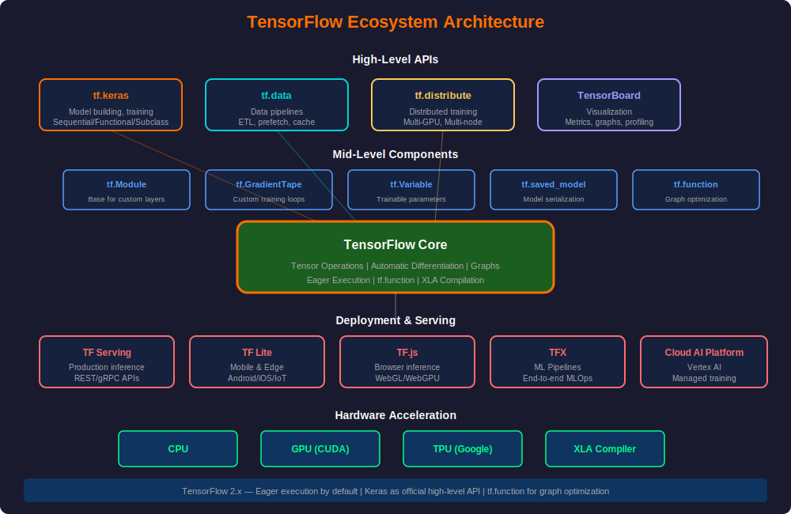
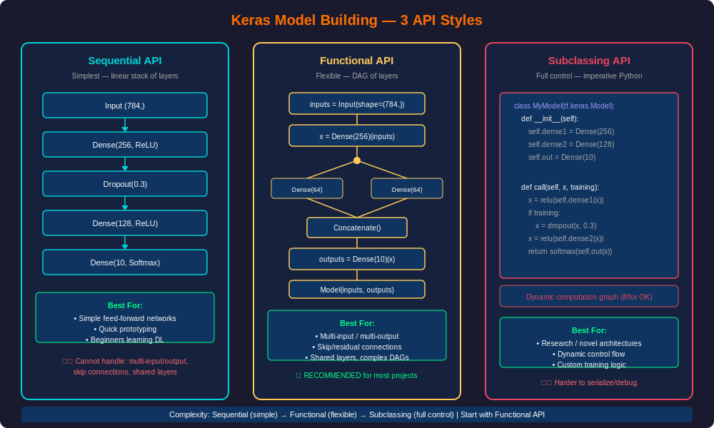
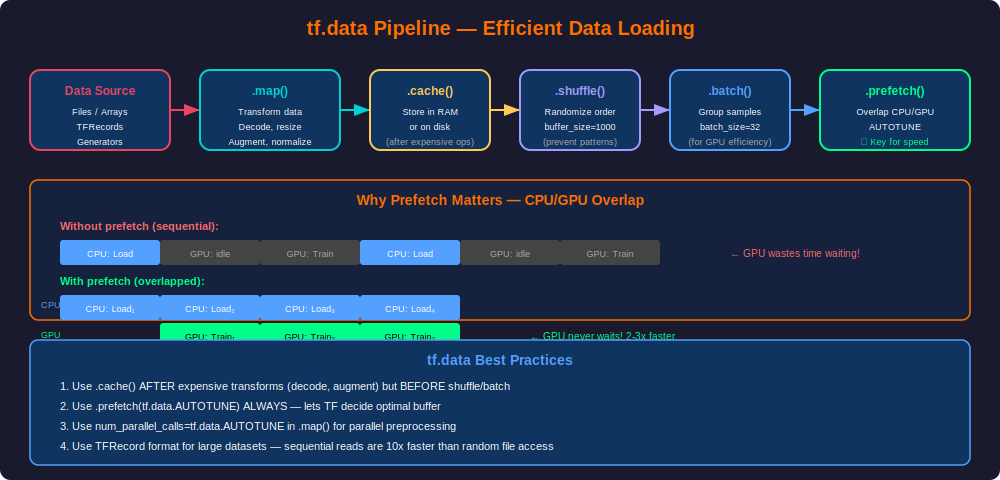
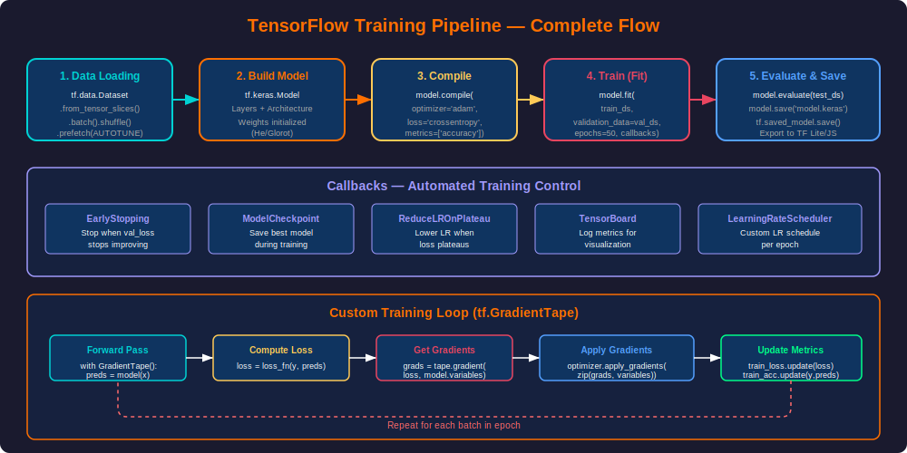
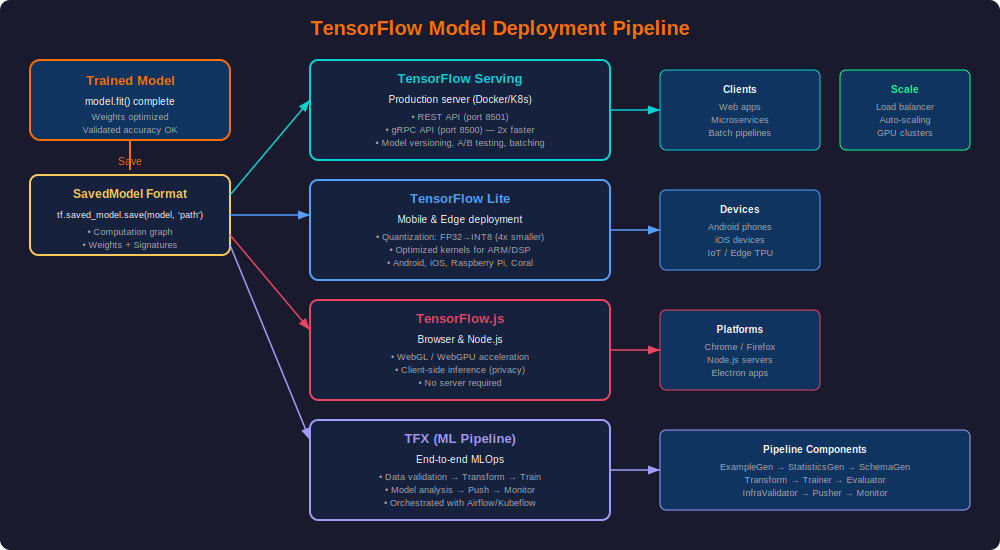
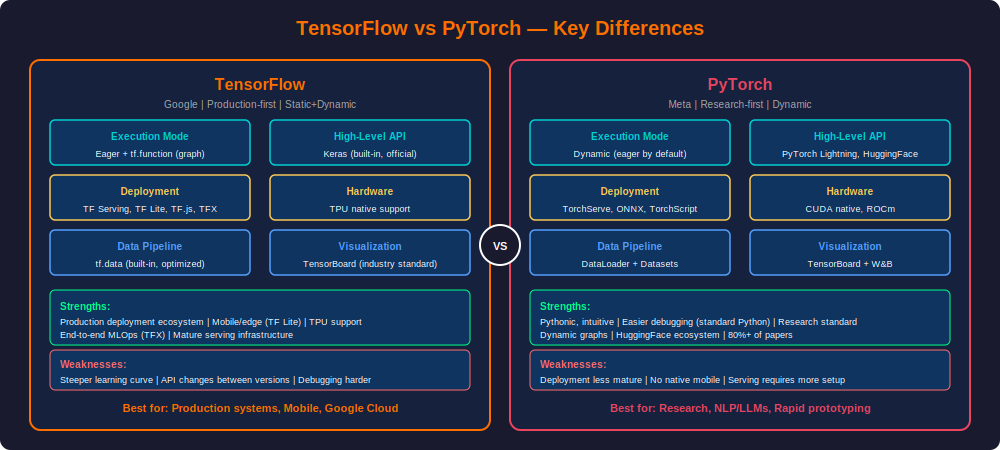

# PHASE 14 — TensorFlow

---

## Table of Contents

1. [Introduction to TensorFlow](#introduction-to-tensorflow)
2. [TensorFlow Ecosystem](#tensorflow-ecosystem)
3. [TensorFlow Basics — Tensors & Operations](#tensorflow-basics--tensors--operations)
4. [Keras — Model Building API](#keras--model-building-api)
5. [tf.data — Efficient Data Pipelines](#tfdata--efficient-data-pipelines)
6. [Training Pipelines](#training-pipelines)
7. [Custom Training with GradientTape](#custom-training-with-gradienttape)
8. [Callbacks & Training Control](#callbacks--training-control)
9. [Model Saving & Loading](#model-saving--loading)
10. [Deployment](#deployment)
11. [TensorFlow vs PyTorch](#tensorflow-vs-pytorch)
12. [Production Best Practices](#production-best-practices)
13. [End-to-End Projects](#end-to-end-projects)
14. [Interview Mastery](#interview-mastery)

---

## Introduction to TensorFlow

### What is TensorFlow?

**Beginner Explanation:**
TensorFlow is Google's open-source framework for building and deploying machine learning models. Think of it as a "machine learning factory" — it provides everything from data loading, to model building, to training, to deploying your model on phones, browsers, or servers.

**Real-World Analogy:**
If building an ML model is like building a car:
- TensorFlow = the entire car factory (assembly line, tools, paint shop, quality control)
- Keras = the easy-to-use control panel for the assembly line
- tf.data = the parts delivery system (efficient, just-in-time)
- TF Serving = the dealership (delivers the car to customers)

**Technical Definition:**
TensorFlow is a comprehensive open-source platform for machine learning that provides:
- A flexible computation framework based on dataflow graphs
- Automatic differentiation for gradient-based optimization
- Hardware acceleration (GPU/TPU) support
- Production deployment infrastructure

### History & Evolution

| Version | Year | Key Change |
|---------|------|-----------|
| TF 1.x | 2015 | Static graphs, Sessions, placeholders |
| TF 2.0 | 2019 | Eager execution, Keras integrated, no Sessions |
| TF 2.x | 2020+ | Stable API, tf.function, better performance |

**TF 2.x philosophy:** "Easy things should be easy, hard things should be possible"

### When to Choose TensorFlow

| Choose TensorFlow | Choose PyTorch |
|-------------------|----------------|
| Production deployment is critical | Research & experimentation |
| Mobile/edge deployment (TF Lite) | Need maximum flexibility |
| Google Cloud / TPU training | HuggingFace NLP models |
| End-to-end ML pipeline (TFX) | Quick prototyping |
| Large enterprise teams | Academic papers |
| Need TensorBoard natively | Dynamic computation graphs |

---

## TensorFlow Ecosystem

### Architecture Overview



### Core Components

| Component | Purpose | When to Use |
|-----------|---------|-------------|
| **tf.keras** | Model building & training | Every project |
| **tf.data** | Efficient data pipelines | When data doesn't fit in RAM |
| **tf.function** | Graph compilation for speed | Production models |
| **tf.distribute** | Multi-GPU/TPU training | Large models/datasets |
| **TensorBoard** | Visualization & monitoring | Always during training |
| **TF Serving** | Production inference server | Backend deployment |
| **TF Lite** | Mobile & edge inference | Mobile apps, IoT |
| **TF.js** | Browser-based inference | Web applications |
| **TFX** | ML pipeline orchestration | MLOps, CI/CD for ML |

### Installation

```python
# Standard installation (CPU + GPU if CUDA available)
# pip install tensorflow

# Verify installation
import tensorflow as tf

print(f"TensorFlow version: {tf.__version__}")
print(f"GPU available: {tf.config.list_physical_devices('GPU')}")
print(f"Eager mode: {tf.executing_eagerly()}")

# Configure GPU memory growth (prevents TF from grabbing all GPU memory)
gpus = tf.config.list_physical_devices('GPU')
if gpus:
    for gpu in gpus:
        tf.config.experimental.set_memory_growth(gpu, True)
    print(f"GPUs configured: {len(gpus)}")
```

---

## TensorFlow Basics — Tensors & Operations

### What is a Tensor?

**Beginner Explanation:**
A tensor is simply a multi-dimensional array — the fundamental data structure in TensorFlow. Everything flows as tensors through the computation graph.

| Rank | Name | Example | Shape |
|------|------|---------|-------|
| 0 | Scalar | 42 | () |
| 1 | Vector | [1, 2, 3] | (3,) |
| 2 | Matrix | [[1,2],[3,4]] | (2, 2) |
| 3 | 3D Tensor | Image batch | (batch, height, width) |
| 4 | 4D Tensor | Color image batch | (batch, H, W, channels) |

### Creating Tensors

```python
import tensorflow as tf
import numpy as np

# Constants (immutable)
scalar = tf.constant(42)
vector = tf.constant([1.0, 2.0, 3.0])
matrix = tf.constant([[1, 2], [3, 4]], dtype=tf.float32)

print(f"Scalar: {scalar}, shape: {scalar.shape}, dtype: {scalar.dtype}")
print(f"Vector: {vector}, shape: {vector.shape}")
print(f"Matrix:\n{matrix}")

# Special tensors
zeros = tf.zeros([3, 4])           # 3x4 matrix of zeros
ones = tf.ones([2, 3])             # 2x3 matrix of ones
random_normal = tf.random.normal([3, 3], mean=0, stddev=1)
random_uniform = tf.random.uniform([2, 4], minval=0, maxval=1)
eye = tf.eye(3)                    # 3x3 identity matrix
linspace = tf.linspace(0.0, 1.0, 5)  # [0, 0.25, 0.5, 0.75, 1.0]

# From NumPy (zero-copy when possible)
numpy_array = np.array([[1, 2], [3, 4]])
tensor_from_numpy = tf.constant(numpy_array)
back_to_numpy = tensor_from_numpy.numpy()

# Variables (mutable — for model weights)
weights = tf.Variable(tf.random.normal([784, 128]))
bias = tf.Variable(tf.zeros([128]))
print(f"Variable shape: {weights.shape}")

# Modify variable
weights.assign(weights * 0.99)     # Scale all weights
weights[0, 0].assign(0.0)         # Set specific element
```

### Tensor Operations

```python
# Arithmetic
a = tf.constant([[1.0, 2.0], [3.0, 4.0]])
b = tf.constant([[5.0, 6.0], [7.0, 8.0]])

add = a + b                    # Element-wise addition
sub = a - b                    # Subtraction
mul = a * b                    # Element-wise multiplication
div = a / b                    # Division
power = a ** 2                 # Element-wise power

# Matrix operations
matmul = a @ b                 # Matrix multiplication (preferred)
matmul2 = tf.matmul(a, b)     # Same thing
transpose = tf.transpose(a)    # Transpose

# Reductions
total = tf.reduce_sum(a)           # Sum all elements
row_sum = tf.reduce_sum(a, axis=1) # Sum along rows
col_mean = tf.reduce_mean(a, axis=0)  # Mean along columns
max_val = tf.reduce_max(a)         # Maximum value

# Reshaping
tensor = tf.constant([[1, 2, 3], [4, 5, 6]])
reshaped = tf.reshape(tensor, [3, 2])     # Reshape to 3x2
flattened = tf.reshape(tensor, [-1])       # Flatten to 1D
expanded = tf.expand_dims(tensor, axis=0)  # Add batch dimension

# Slicing & Indexing
x = tf.constant([10, 20, 30, 40, 50])
print(x[1:3])       # [20, 30]
print(x[::2])       # [10, 30, 50] — every other element

# Concatenation
c1 = tf.constant([[1, 2], [3, 4]])
c2 = tf.constant([[5, 6], [7, 8]])
concat_rows = tf.concat([c1, c2], axis=0)    # Stack vertically (4x2)
concat_cols = tf.concat([c1, c2], axis=1)    # Stack horizontally (2x4)

# Broadcasting (automatic shape expansion)
matrix = tf.constant([[1.0, 2.0, 3.0]])  # Shape: (1, 3)
vector = tf.constant([10.0])             # Shape: (1,)
result = matrix + vector                 # Broadcasting: (1,3) + (1,) → (1,3)
```

### Eager Execution vs Graph Mode

```python
# TF 2.x: Eager execution by default (like PyTorch)
a = tf.constant(5.0)
b = tf.constant(3.0)
c = a * b
print(c)  # tf.Tensor(15.0, shape=(), dtype=float32) — computed immediately!

# tf.function: Convert to graph for production speed
@tf.function
def compute(x, y):
    return x * y + tf.reduce_sum(x)

result = compute(a, b)  # First call: traces & compiles graph
result = compute(a, b)  # Subsequent calls: runs optimized graph (faster!)

# When to use @tf.function:
# - Training loops (2-5x speedup)
# - Production inference
# - Model export (SavedModel requires graph)
```

### Automatic Differentiation

```python
# tf.GradientTape — records operations for automatic differentiation
x = tf.Variable(3.0)

with tf.GradientTape() as tape:
    y = x ** 2 + 2 * x + 1  # y = x² + 2x + 1

# dy/dx = 2x + 2 = 2(3) + 2 = 8
gradient = tape.gradient(y, x)
print(f"dy/dx at x=3: {gradient}")  # 8.0

# Multiple variables
w = tf.Variable(tf.random.normal([3, 2]))
b = tf.Variable(tf.zeros([2]))
x = tf.constant([[1.0, 2.0, 3.0]])

with tf.GradientTape() as tape:
    y = x @ w + b
    loss = tf.reduce_mean(y ** 2)

# Get gradients for both w and b
grads = tape.gradient(loss, [w, b])
print(f"dL/dw shape: {grads[0].shape}")  # (3, 2)
print(f"dL/db shape: {grads[1].shape}")  # (2,)

# Persistent tape (for multiple gradient computations)
x = tf.Variable(2.0)
with tf.GradientTape(persistent=True) as tape:
    y = x ** 3
    z = y ** 2

dy_dx = tape.gradient(y, x)  # 3x² = 12
dz_dx = tape.gradient(z, x)  # 6x⁵ = 192
del tape  # Must manually delete persistent tapes
```

---

## Keras — Model Building API

### Three Ways to Build Models



### 1. Sequential API — Simplest Approach

```python
from tensorflow import keras
from tensorflow.keras import layers

# Simple classification model
model = keras.Sequential([
    layers.Input(shape=(784,)),
    layers.Dense(256, activation='relu'),
    layers.BatchNormalization(),
    layers.Dropout(0.3),
    layers.Dense(128, activation='relu'),
    layers.BatchNormalization(),
    layers.Dropout(0.3),
    layers.Dense(64, activation='relu'),
    layers.Dense(10, activation='softmax')
])

model.summary()
# Output:
# Model: "sequential"
# Total params: 235,146
# Trainable params: 234,378
# Non-trainable params: 768 (BatchNorm running stats)
```

### 2. Functional API — Recommended for Production

```python
# Multi-input model (e.g., text + metadata → prediction)
# Text input branch
text_input = keras.Input(shape=(100,), name='text_features')
text_x = layers.Dense(128, activation='relu')(text_input)
text_x = layers.Dropout(0.3)(text_x)
text_x = layers.Dense(64, activation='relu')(text_x)

# Metadata input branch
meta_input = keras.Input(shape=(10,), name='metadata')
meta_x = layers.Dense(32, activation='relu')(meta_input)

# Merge branches
merged = layers.Concatenate()([text_x, meta_x])
merged = layers.Dense(64, activation='relu')(merged)
merged = layers.Dropout(0.2)(merged)

# Multiple outputs
class_output = layers.Dense(5, activation='softmax', name='classification')(merged)
score_output = layers.Dense(1, activation='sigmoid', name='score')(merged)

# Create model
model = keras.Model(
    inputs=[text_input, meta_input],
    outputs=[class_output, score_output]
)

# Compile with different losses per output
model.compile(
    optimizer='adam',
    loss={
        'classification': 'sparse_categorical_crossentropy',
        'score': 'binary_crossentropy'
    },
    loss_weights={'classification': 1.0, 'score': 0.5},
    metrics={
        'classification': 'accuracy',
        'score': 'auc'
    }
)

model.summary()
```

### 3. Model Subclassing — Full Control

```python
class ResidualBlock(keras.layers.Layer):
    def __init__(self, units, dropout_rate=0.3):
        super().__init__()
        self.dense1 = layers.Dense(units)
        self.dense2 = layers.Dense(units)
        self.bn1 = layers.BatchNormalization()
        self.bn2 = layers.BatchNormalization()
        self.dropout = layers.Dropout(dropout_rate)
    
    def call(self, inputs, training=False):
        x = self.dense1(inputs)
        x = self.bn1(x, training=training)
        x = tf.nn.relu(x)
        x = self.dropout(x, training=training)
        x = self.dense2(x)
        x = self.bn2(x, training=training)
        
        # Residual connection (skip connection)
        if inputs.shape[-1] == x.shape[-1]:
            x = x + inputs
        
        return tf.nn.relu(x)


class CustomClassifier(keras.Model):
    def __init__(self, num_classes, hidden_units=[256, 128, 64]):
        super().__init__()
        
        self.blocks = [ResidualBlock(units) for units in hidden_units]
        self.classifier = layers.Dense(num_classes, activation='softmax')
    
    def call(self, inputs, training=False):
        x = inputs
        for block in self.blocks:
            x = block(x, training=training)
        return self.classifier(x)
    
    def get_config(self):
        return {'num_classes': self.classifier.units}


# Usage
model = CustomClassifier(num_classes=10)
model.compile(
    optimizer='adam',
    loss='sparse_categorical_crossentropy',
    metrics=['accuracy']
)

# Build model by passing dummy data
model(tf.zeros([1, 784]))
model.summary()
```

### Common Layers Reference

```python
# Dense (Fully Connected)
layers.Dense(units=128, activation='relu', kernel_initializer='he_normal')

# Convolutional
layers.Conv2D(filters=32, kernel_size=3, strides=1, padding='same', activation='relu')
layers.Conv2D(64, 3, padding='same', activation='relu')

# Recurrent
layers.LSTM(128, return_sequences=True)
layers.GRU(64, return_sequences=False)

# Normalization
layers.BatchNormalization()
layers.LayerNormalization()

# Regularization
layers.Dropout(0.3)
layers.SpatialDropout2D(0.2)

# Pooling
layers.MaxPooling2D(pool_size=2)
layers.GlobalAveragePooling2D()

# Reshaping
layers.Flatten()
layers.Reshape((28, 28, 1))

# Embedding
layers.Embedding(input_dim=10000, output_dim=128, mask_zero=True)

# Attention
layers.MultiHeadAttention(num_heads=8, key_dim=64)
```

---

## tf.data — Efficient Data Pipelines

### Why tf.data?

Loading data naively (e.g., `model.fit(X, y)`) works for small datasets but fails at scale. `tf.data` provides:
- **Lazy loading** — process data on-the-fly, not all in memory
- **Parallel processing** — multi-threaded map operations
- **Prefetching** — overlap CPU and GPU work
- **Streaming** — handle datasets larger than RAM

### Pipeline Flow



### Building Data Pipelines

```python
import tensorflow as tf

# From NumPy arrays
X_train = np.random.randn(10000, 784).astype(np.float32)
y_train = np.random.randint(0, 10, 10000)

train_ds = tf.data.Dataset.from_tensor_slices((X_train, y_train))
train_ds = (
    train_ds
    .shuffle(buffer_size=10000)
    .batch(32)
    .prefetch(tf.data.AUTOTUNE)
)

# From files (images)
def load_and_preprocess_image(file_path, label):
    img = tf.io.read_file(file_path)
    img = tf.image.decode_jpeg(img, channels=3)
    img = tf.image.resize(img, [224, 224])
    img = img / 255.0  # Normalize to [0, 1]
    return img, label

file_paths = tf.data.Dataset.list_files('data/train/*/*.jpg')
labels = ...  # corresponding labels

image_ds = tf.data.Dataset.from_tensor_slices((file_paths, labels))
image_ds = (
    image_ds
    .map(load_and_preprocess_image, num_parallel_calls=tf.data.AUTOTUNE)
    .cache()  # Cache after expensive decode
    .shuffle(1000)
    .batch(32)
    .prefetch(tf.data.AUTOTUNE)
)

# From TFRecord files (most efficient for large datasets)
def parse_tfrecord(serialized):
    features = tf.io.parse_single_example(
        serialized,
        features={
            'image': tf.io.FixedLenFeature([], tf.string),
            'label': tf.io.FixedLenFeature([], tf.int64),
        }
    )
    image = tf.io.decode_raw(features['image'], tf.float32)
    image = tf.reshape(image, [28, 28, 1])
    label = features['label']
    return image, label

tfrecord_ds = tf.data.TFRecordDataset(['data/train.tfrecord'])
tfrecord_ds = (
    tfrecord_ds
    .map(parse_tfrecord, num_parallel_calls=tf.data.AUTOTUNE)
    .shuffle(10000)
    .batch(64)
    .prefetch(tf.data.AUTOTUNE)
)
```

### Data Augmentation

```python
# Image augmentation layer (runs on GPU!)
data_augmentation = keras.Sequential([
    layers.RandomFlip("horizontal"),
    layers.RandomRotation(0.1),
    layers.RandomZoom(0.1),
    layers.RandomContrast(0.1),
], name="augmentation")

# Apply in model (only during training)
inputs = keras.Input(shape=(224, 224, 3))
x = data_augmentation(inputs)  # Augmentation only active during training
x = keras.applications.ResNet50(weights='imagenet', include_top=False)(x)
x = layers.GlobalAveragePooling2D()(x)
outputs = layers.Dense(10, activation='softmax')(x)
model = keras.Model(inputs, outputs)

# OR apply in tf.data pipeline (runs on CPU)
def augment(image, label):
    image = tf.image.random_flip_left_right(image)
    image = tf.image.random_brightness(image, 0.1)
    image = tf.image.random_contrast(image, 0.9, 1.1)
    return image, label

train_ds = train_ds.map(augment, num_parallel_calls=tf.data.AUTOTUNE)
```

### Performance Optimization

```python
# The OPTIMAL pipeline order:
dataset = (
    tf.data.TFRecordDataset(files, num_parallel_reads=tf.data.AUTOTUNE)
    .map(parse_fn, num_parallel_calls=tf.data.AUTOTUNE)
    .cache()                           # Cache AFTER expensive ops
    .shuffle(buffer_size=10000)        # Shuffle AFTER cache
    .batch(batch_size)                 # Batch AFTER shuffle
    .map(augment_fn, num_parallel_calls=tf.data.AUTOTUNE)  # Augment AFTER batch (vectorized)
    .prefetch(tf.data.AUTOTUNE)        # Prefetch ALWAYS last
)

# Benchmark your pipeline
import time

def benchmark(dataset, num_epochs=2):
    start_time = time.perf_counter()
    for epoch in range(num_epochs):
        for sample in dataset:
            pass  # Simulate training step
    return time.perf_counter() - start_time

print(f"Pipeline throughput: {benchmark(train_ds):.2f} seconds for 2 epochs")
```

---

## Training Pipelines

### Complete Training Flow



### Standard Training with model.fit()

```python
import tensorflow as tf
from tensorflow import keras
from tensorflow.keras import layers
from sklearn.model_selection import train_test_split

# Build model
model = keras.Sequential([
    layers.Input(shape=(784,)),
    layers.Dense(512, activation='relu', kernel_initializer='he_normal'),
    layers.BatchNormalization(),
    layers.Dropout(0.4),
    layers.Dense(256, activation='relu', kernel_initializer='he_normal'),
    layers.BatchNormalization(),
    layers.Dropout(0.3),
    layers.Dense(128, activation='relu', kernel_initializer='he_normal'),
    layers.BatchNormalization(),
    layers.Dropout(0.2),
    layers.Dense(10, activation='softmax')
])

# Compile
model.compile(
    optimizer=keras.optimizers.Adam(learning_rate=1e-3),
    loss='sparse_categorical_crossentropy',
    metrics=['accuracy']
)

# Callbacks
callbacks = [
    keras.callbacks.EarlyStopping(
        monitor='val_loss',
        patience=10,
        restore_best_weights=True,
        verbose=1
    ),
    keras.callbacks.ModelCheckpoint(
        'best_model.keras',
        monitor='val_accuracy',
        save_best_only=True,
        verbose=1
    ),
    keras.callbacks.ReduceLROnPlateau(
        monitor='val_loss',
        factor=0.5,
        patience=5,
        min_lr=1e-6,
        verbose=1
    ),
    keras.callbacks.TensorBoard(
        log_dir='./logs',
        histogram_freq=1,
        profile_batch='10,20'
    )
]

# Train
history = model.fit(
    train_ds,
    validation_data=val_ds,
    epochs=100,
    callbacks=callbacks,
    verbose=1
)

# Evaluate
test_loss, test_accuracy = model.evaluate(test_ds, verbose=0)
print(f"Test Accuracy: {test_accuracy:.4f}")

# Plot training history
import matplotlib.pyplot as plt

fig, axes = plt.subplots(1, 2, figsize=(12, 4))

axes[0].plot(history.history['loss'], label='Train Loss')
axes[0].plot(history.history['val_loss'], label='Val Loss')
axes[0].set_xlabel('Epoch')
axes[0].set_ylabel('Loss')
axes[0].legend()
axes[0].set_title('Loss Curves')

axes[1].plot(history.history['accuracy'], label='Train Acc')
axes[1].plot(history.history['val_accuracy'], label='Val Acc')
axes[1].set_xlabel('Epoch')
axes[1].set_ylabel('Accuracy')
axes[1].legend()
axes[1].set_title('Accuracy Curves')

plt.tight_layout()
plt.savefig('training_curves.png')
plt.show()
```

### Learning Rate Scheduling

```python
# 1. Built-in schedules
lr_schedule = keras.optimizers.schedules.CosineDecay(
    initial_learning_rate=1e-3,
    decay_steps=10000,
    alpha=1e-6  # Minimum LR
)
optimizer = keras.optimizers.Adam(learning_rate=lr_schedule)

# 2. Exponential decay
lr_schedule = keras.optimizers.schedules.ExponentialDecay(
    initial_learning_rate=1e-3,
    decay_steps=1000,
    decay_rate=0.96
)

# 3. Warmup + Cosine (for Transformers)
class WarmupCosineDecay(keras.optimizers.schedules.LearningRateSchedule):
    def __init__(self, warmup_steps, total_steps, peak_lr):
        super().__init__()
        self.warmup_steps = warmup_steps
        self.total_steps = total_steps
        self.peak_lr = peak_lr
    
    def __call__(self, step):
        step = tf.cast(step, tf.float32)
        warmup_pct = step / self.warmup_steps
        decay_pct = (step - self.warmup_steps) / (self.total_steps - self.warmup_steps)
        
        warmup_lr = self.peak_lr * warmup_pct
        decay_lr = self.peak_lr * 0.5 * (1 + tf.cos(3.14159 * decay_pct))
        
        return tf.where(step < self.warmup_steps, warmup_lr, decay_lr)

lr_schedule = WarmupCosineDecay(
    warmup_steps=2000,
    total_steps=50000,
    peak_lr=3e-4
)
```

---

## Custom Training with GradientTape

### When to Use Custom Training

| Use `model.fit()` | Use Custom Loop |
|-------------------|-----------------|
| Standard training workflow | GANs (multiple models) |
| Standard losses | Custom gradient modifications |
| Just need callbacks | Gradient accumulation |
| Beginner-friendly | Mixed precision fine-tuning |
| 90% of use cases | Research experiments |

### Complete Custom Training Loop

```python
import tensorflow as tf
from tensorflow import keras

class CustomTrainer:
    def __init__(self, model, optimizer, loss_fn):
        self.model = model
        self.optimizer = optimizer
        self.loss_fn = loss_fn
        
        # Metrics
        self.train_loss = keras.metrics.Mean(name='train_loss')
        self.train_accuracy = keras.metrics.SparseCategoricalAccuracy(name='train_accuracy')
        self.val_loss = keras.metrics.Mean(name='val_loss')
        self.val_accuracy = keras.metrics.SparseCategoricalAccuracy(name='val_accuracy')
    
    @tf.function
    def train_step(self, x, y):
        with tf.GradientTape() as tape:
            predictions = self.model(x, training=True)
            loss = self.loss_fn(y, predictions)
        
        gradients = tape.gradient(loss, self.model.trainable_variables)
        
        # Gradient clipping
        gradients, _ = tf.clip_by_global_norm(gradients, 1.0)
        
        self.optimizer.apply_gradients(zip(gradients, self.model.trainable_variables))
        
        self.train_loss.update_state(loss)
        self.train_accuracy.update_state(y, predictions)
        
        return loss
    
    @tf.function
    def val_step(self, x, y):
        predictions = self.model(x, training=False)
        loss = self.loss_fn(y, predictions)
        
        self.val_loss.update_state(loss)
        self.val_accuracy.update_state(y, predictions)
    
    def train(self, train_ds, val_ds, epochs):
        best_val_loss = float('inf')
        
        for epoch in range(epochs):
            # Reset metrics
            self.train_loss.reset_state()
            self.train_accuracy.reset_state()
            self.val_loss.reset_state()
            self.val_accuracy.reset_state()
            
            # Training
            for x_batch, y_batch in train_ds:
                self.train_step(x_batch, y_batch)
            
            # Validation
            for x_batch, y_batch in val_ds:
                self.val_step(x_batch, y_batch)
            
            # Print metrics
            print(
                f"Epoch {epoch+1}/{epochs} | "
                f"Train Loss: {self.train_loss.result():.4f} | "
                f"Train Acc: {self.train_accuracy.result():.4f} | "
                f"Val Loss: {self.val_loss.result():.4f} | "
                f"Val Acc: {self.val_accuracy.result():.4f}"
            )
            
            # Save best model
            if self.val_loss.result() < best_val_loss:
                best_val_loss = self.val_loss.result()
                self.model.save_weights('best_weights.h5')


# Usage
model = keras.Sequential([
    layers.Dense(256, activation='relu', input_shape=(784,)),
    layers.Dropout(0.3),
    layers.Dense(128, activation='relu'),
    layers.Dense(10, activation='softmax')
])

trainer = CustomTrainer(
    model=model,
    optimizer=keras.optimizers.Adam(1e-3),
    loss_fn=keras.losses.SparseCategoricalCrossentropy()
)

trainer.train(train_ds, val_ds, epochs=50)
```

### GAN Training (Classic Custom Loop Use Case)

```python
class GANTrainer:
    def __init__(self, generator, discriminator):
        self.generator = generator
        self.discriminator = discriminator
        self.g_optimizer = keras.optimizers.Adam(2e-4, beta_1=0.5)
        self.d_optimizer = keras.optimizers.Adam(2e-4, beta_1=0.5)
        self.loss_fn = keras.losses.BinaryCrossentropy(from_logits=True)
        self.latent_dim = 100
    
    @tf.function
    def train_step(self, real_images):
        batch_size = tf.shape(real_images)[0]
        noise = tf.random.normal([batch_size, self.latent_dim])
        
        # Train Discriminator
        with tf.GradientTape() as d_tape:
            fake_images = self.generator(noise, training=True)
            real_output = self.discriminator(real_images, training=True)
            fake_output = self.discriminator(fake_images, training=True)
            
            d_loss_real = self.loss_fn(tf.ones_like(real_output), real_output)
            d_loss_fake = self.loss_fn(tf.zeros_like(fake_output), fake_output)
            d_loss = d_loss_real + d_loss_fake
        
        d_grads = d_tape.gradient(d_loss, self.discriminator.trainable_variables)
        self.d_optimizer.apply_gradients(zip(d_grads, self.discriminator.trainable_variables))
        
        # Train Generator
        noise = tf.random.normal([batch_size, self.latent_dim])
        with tf.GradientTape() as g_tape:
            fake_images = self.generator(noise, training=True)
            fake_output = self.discriminator(fake_images, training=True)
            g_loss = self.loss_fn(tf.ones_like(fake_output), fake_output)
        
        g_grads = g_tape.gradient(g_loss, self.generator.trainable_variables)
        self.g_optimizer.apply_gradients(zip(g_grads, self.generator.trainable_variables))
        
        return d_loss, g_loss
```

### Gradient Accumulation

```python
@tf.function
def train_step_accumulated(model, optimizer, loss_fn, dataset_batch, accumulation_steps=4):
    """Simulate larger batch by accumulating gradients"""
    
    # Initialize accumulated gradients
    accumulated_grads = [tf.zeros_like(var) for var in model.trainable_variables]
    total_loss = 0.0
    
    for step in range(accumulation_steps):
        x, y = next(iter(dataset_batch))
        
        with tf.GradientTape() as tape:
            predictions = model(x, training=True)
            loss = loss_fn(y, predictions) / accumulation_steps
        
        gradients = tape.gradient(loss, model.trainable_variables)
        accumulated_grads = [ag + g for ag, g in zip(accumulated_grads, gradients)]
        total_loss += loss
    
    # Apply accumulated gradients
    optimizer.apply_gradients(zip(accumulated_grads, model.trainable_variables))
    
    return total_loss
```

---

## Callbacks & Training Control

### Built-in Callbacks

```python
# Complete callback configuration for production training
callbacks = [
    # 1. Early Stopping — prevent overfitting
    keras.callbacks.EarlyStopping(
        monitor='val_loss',          # Metric to watch
        patience=15,                 # Epochs to wait
        min_delta=0.001,            # Minimum improvement
        restore_best_weights=True,  # Load best model when stopped
        verbose=1
    ),
    
    # 2. Model Checkpoint — save best model
    keras.callbacks.ModelCheckpoint(
        filepath='models/model_{epoch:02d}_{val_loss:.4f}.keras',
        monitor='val_loss',
        save_best_only=True,
        save_weights_only=False,  # Save full model
        verbose=1
    ),
    
    # 3. Learning Rate Reduction
    keras.callbacks.ReduceLROnPlateau(
        monitor='val_loss',
        factor=0.5,            # Multiply LR by this
        patience=5,            # Wait N epochs
        min_lr=1e-7,
        verbose=1
    ),
    
    # 4. TensorBoard logging
    keras.callbacks.TensorBoard(
        log_dir='./logs',
        histogram_freq=1,      # Log weight histograms
        write_graph=True,
        write_images=True,
        profile_batch='10,20'  # Profile batches 10-20
    ),
    
    # 5. CSV Logger — save metrics to file
    keras.callbacks.CSVLogger('training_log.csv', append=True),
    
    # 6. Terminate on NaN
    keras.callbacks.TerminateOnNaN(),
]
```

### Custom Callbacks

```python
class CustomCallback(keras.callbacks.Callback):
    def __init__(self, validation_data, log_dir='./custom_logs'):
        super().__init__()
        self.validation_data = validation_data
        self.log_dir = log_dir
    
    def on_train_begin(self, logs=None):
        print("Training started!")
        self.best_accuracy = 0.0
    
    def on_epoch_end(self, epoch, logs=None):
        val_acc = logs.get('val_accuracy', 0)
        
        # Custom logic: alert if accuracy drops
        if epoch > 10 and val_acc < self.best_accuracy - 0.05:
            print(f"\n⚠️ Accuracy dropped significantly! "
                  f"Current: {val_acc:.4f}, Best: {self.best_accuracy:.4f}")
        
        if val_acc > self.best_accuracy:
            self.best_accuracy = val_acc
            print(f"\n🎉 New best accuracy: {val_acc:.4f}")
    
    def on_train_end(self, logs=None):
        print(f"\nTraining complete! Best accuracy: {self.best_accuracy:.4f}")


# Learning rate warmup callback
class WarmupCallback(keras.callbacks.Callback):
    def __init__(self, warmup_epochs, target_lr):
        super().__init__()
        self.warmup_epochs = warmup_epochs
        self.target_lr = target_lr
    
    def on_epoch_begin(self, epoch, logs=None):
        if epoch < self.warmup_epochs:
            lr = self.target_lr * (epoch + 1) / self.warmup_epochs
            self.model.optimizer.learning_rate.assign(lr)
            print(f" Warmup LR: {lr:.6f}")
```

---

## Model Saving & Loading

### Save Formats

```python
# 1. Keras format (.keras) — RECOMMENDED
model.save('my_model.keras')
loaded_model = keras.models.load_model('my_model.keras')

# 2. SavedModel format (for TF Serving deployment)
tf.saved_model.save(model, 'saved_model_dir/')
loaded = tf.saved_model.load('saved_model_dir/')

# 3. Weights only (smaller, need architecture code)
model.save_weights('weights.h5')
# To load: rebuild architecture first, then
model.load_weights('weights.h5')

# 4. ONNX export (cross-framework)
# pip install tf2onnx
import tf2onnx
import onnx

spec = (tf.TensorSpec((None, 784), tf.float32, name="input"),)
output_path = "model.onnx"
model_proto, _ = tf2onnx.convert.from_keras(model, input_signature=spec, output_path=output_path)
```

### SavedModel for Production

```python
# Export with explicit signatures
class ExportableModel(keras.Model):
    def __init__(self, base_model):
        super().__init__()
        self.base_model = base_model
    
    @tf.function(input_signature=[tf.TensorSpec(shape=[None, 784], dtype=tf.float32)])
    def predict(self, inputs):
        """Production inference endpoint"""
        predictions = self.base_model(inputs, training=False)
        return {
            'class_id': tf.argmax(predictions, axis=-1),
            'probabilities': predictions,
            'confidence': tf.reduce_max(predictions, axis=-1)
        }

exportable = ExportableModel(model)
tf.saved_model.save(exportable, 'production_model/')

# Load and use
loaded = tf.saved_model.load('production_model/')
result = loaded.predict(tf.random.normal([1, 784]))
print(f"Predicted class: {result['class_id'].numpy()}")
print(f"Confidence: {result['confidence'].numpy():.4f}")
```

---

## Deployment

### Deployment Pipeline



### TensorFlow Serving (Docker)

```bash
# Pull TF Serving Docker image
docker pull tensorflow/serving

# Organize model for serving
# production_model/
# └── 1/           ← version number
#     ├── saved_model.pb
#     └── variables/

# Run TF Serving
docker run -p 8501:8501 \
    --mount type=bind,source=/path/to/production_model,target=/models/my_model \
    -e MODEL_NAME=my_model \
    tensorflow/serving
```

```python
# Client: Send prediction request
import requests
import json
import numpy as np

# REST API
data = {"instances": [np.random.randn(784).tolist()]}
response = requests.post(
    'http://localhost:8501/v1/models/my_model:predict',
    json=data
)
predictions = response.json()['predictions']
print(f"Prediction: {np.argmax(predictions[0])}")

# gRPC (2x faster for production)
import grpc
from tensorflow_serving.apis import predict_pb2, prediction_service_pb2_grpc

channel = grpc.insecure_channel('localhost:8500')
stub = prediction_service_pb2_grpc.PredictionServiceStub(channel)

request = predict_pb2.PredictRequest()
request.model_spec.name = 'my_model'
request.model_spec.signature_name = 'serving_default'
request.inputs['input'].CopyFrom(tf.make_tensor_proto(input_data))

response = stub.Predict(request)
```

### TensorFlow Lite (Mobile)

```python
# Convert model to TFLite
converter = tf.lite.TFLiteConverter.from_saved_model('production_model/')

# Optimization options
converter.optimizations = [tf.lite.Optimize.DEFAULT]  # Dynamic range quantization

# Full integer quantization (smallest, fastest)
def representative_dataset():
    for _ in range(100):
        yield [np.random.randn(1, 784).astype(np.float32)]

converter.representative_dataset = representative_dataset
converter.target_spec.supported_ops = [tf.lite.OpsSet.TFLITE_BUILTINS_INT8]
converter.inference_input_type = tf.int8
converter.inference_output_type = tf.int8

# Convert
tflite_model = converter.convert()

# Save
with open('model.tflite', 'wb') as f:
    f.write(tflite_model)

print(f"Model size: {len(tflite_model) / 1024:.1f} KB")

# Run inference with TFLite
interpreter = tf.lite.Interpreter(model_path='model.tflite')
interpreter.allocate_tensors()

input_details = interpreter.get_input_details()
output_details = interpreter.get_output_details()

# Set input
interpreter.set_tensor(input_details[0]['index'], input_data)
interpreter.invoke()

# Get output
output = interpreter.get_tensor(output_details[0]['index'])
print(f"Prediction: {np.argmax(output)}")
```

### TensorFlow.js (Browser)

```python
# Convert to TF.js format
# pip install tensorflowjs
import tensorflowjs as tfjs

tfjs.converters.save_keras_model(model, 'tfjs_model/')
```

```javascript
// Browser: Load and run model
import * as tf from '@tensorflow/tfjs';

async function predict() {
    const model = await tf.loadLayersModel('tfjs_model/model.json');
    
    const input = tf.tensor2d([[/* 784 features */]]);
    const prediction = model.predict(input);
    const classId = prediction.argMax(-1).dataSync()[0];
    
    console.log(`Predicted class: ${classId}`);
}
```

### FastAPI Deployment (Custom Server)

```python
from fastapi import FastAPI
from pydantic import BaseModel
import numpy as np
import tensorflow as tf

app = FastAPI()
model = tf.saved_model.load('production_model/')

class PredictionRequest(BaseModel):
    features: list[float]

class PredictionResponse(BaseModel):
    class_id: int
    confidence: float
    probabilities: list[float]

@app.post("/predict", response_model=PredictionResponse)
async def predict(request: PredictionRequest):
    input_tensor = tf.constant([request.features], dtype=tf.float32)
    result = model.predict(input_tensor)
    
    probs = result['probabilities'].numpy()[0].tolist()
    class_id = int(result['class_id'].numpy()[0])
    confidence = float(result['confidence'].numpy()[0])
    
    return PredictionResponse(
        class_id=class_id,
        confidence=confidence,
        probabilities=probs
    )

@app.get("/health")
async def health():
    return {"status": "healthy", "model_loaded": True}

# Run: uvicorn app:app --host 0.0.0.0 --port 8000
```

---

## TensorFlow vs PyTorch

### Visual Comparison



### Code Comparison

| Task | TensorFlow | PyTorch |
|------|-----------|---------|
| Build model | `keras.Sequential([...])` | `nn.Sequential(...)` |
| Compile | `model.compile(optimizer, loss)` | Manual optimizer + loss |
| Train | `model.fit(data, epochs=10)` | Write training loop |
| Save model | `model.save('path.keras')` | `torch.save(model.state_dict())` |
| GPU transfer | Automatic | `model.to('cuda')` |
| Data pipeline | `tf.data.Dataset` | `DataLoader` |
| Graph mode | `@tf.function` | `torch.jit.script` |

### When Each Wins

```
TensorFlow wins at:
├── Production deployment (TF Serving, TF Lite, TF.js)
├── Mobile/edge (TF Lite is far more mature)
├── Google Cloud integration (TPUs, Vertex AI)
├── End-to-end pipelines (TFX)
└── Enterprise adoption (established infra)

PyTorch wins at:
├── Research (80%+ of papers)
├── NLP/LLMs (HuggingFace ecosystem)
├── Debugging (standard Python debugging)
├── Flexibility (dynamic graphs by default)
└── Community momentum (growing faster)
```

---

## Production Best Practices

### Mixed Precision Training

```python
# Use float16 for computation, float32 for accumulation
# 2x memory savings, 2-3x training speedup on modern GPUs
policy = keras.mixed_precision.Policy('mixed_float16')
keras.mixed_precision.set_global_policy(policy)

# Build model normally — computations in FP16, master weights in FP32
model = keras.Sequential([
    layers.Dense(512, activation='relu', input_shape=(784,)),
    layers.Dense(256, activation='relu'),
    layers.Dense(10)  # Don't use softmax here with mixed precision
])

# Use float32 for the loss computation
model.add(layers.Activation('softmax', dtype='float32'))

model.compile(
    optimizer=keras.optimizers.Adam(1e-3),
    loss='sparse_categorical_crossentropy',
    metrics=['accuracy']
)
```

### Multi-GPU Training

```python
# Strategy: Mirror model on multiple GPUs, split data
strategy = tf.distribute.MirroredStrategy()
print(f"Number of devices: {strategy.num_replicas_in_sync}")

with strategy.scope():
    model = keras.Sequential([
        layers.Dense(512, activation='relu', input_shape=(784,)),
        layers.Dense(256, activation='relu'),
        layers.Dense(10, activation='softmax')
    ])
    
    model.compile(
        optimizer=keras.optimizers.Adam(1e-3 * strategy.num_replicas_in_sync),
        loss='sparse_categorical_crossentropy',
        metrics=['accuracy']
    )

# Scale batch size with number of GPUs
BATCH_SIZE_PER_REPLICA = 64
GLOBAL_BATCH_SIZE = BATCH_SIZE_PER_REPLICA * strategy.num_replicas_in_sync

train_ds = train_ds.batch(GLOBAL_BATCH_SIZE)
model.fit(train_ds, epochs=10)
```

### TPU Training

```python
# Connect to TPU
resolver = tf.distribute.cluster_resolver.TPUClusterResolver()
tf.config.experimental_connect_to_cluster(resolver)
tf.tpu.experimental.initialize_tpu_system(resolver)

strategy = tf.distribute.TPUStrategy(resolver)

with strategy.scope():
    model = build_model()
    model.compile(optimizer='adam', loss='sparse_categorical_crossentropy')

model.fit(train_ds, epochs=10)
```

### Model Profiling

```python
# TensorBoard profiler
tensorboard_callback = keras.callbacks.TensorBoard(
    log_dir='./logs',
    profile_batch='100,200'  # Profile batches 100-200
)

# Manual profiling
tf.profiler.experimental.start('logdir')
# ... run some training steps ...
tf.profiler.experimental.stop()

# View: tensorboard --logdir ./logs
```

### Debugging Tips

```python
# 1. Run in eager mode for debugging (disable @tf.function)
tf.config.run_functions_eagerly(True)

# 2. Check for NaN
tf.debugging.enable_check_numerics()

# 3. Assert shapes
tf.debugging.assert_shapes([
    (input_tensor, ('batch', 784)),
    (output_tensor, ('batch', 10)),
])

# 4. Print inside tf.function
@tf.function
def debug_train_step(x, y):
    predictions = model(x)
    loss = loss_fn(y, predictions)
    tf.print("Loss:", loss, "Predictions mean:", tf.reduce_mean(predictions))
    return loss
```

---

## End-to-End Projects

### Project 1: MNIST Classifier (Complete)

```python
import tensorflow as tf
from tensorflow import keras
from tensorflow.keras import layers
import numpy as np

# Load data
(X_train, y_train), (X_test, y_test) = keras.datasets.mnist.load_data()

# Preprocess
X_train = X_train.reshape(-1, 784).astype('float32') / 255.0
X_test = X_test.reshape(-1, 784).astype('float32') / 255.0

# Create tf.data pipelines
train_ds = (
    tf.data.Dataset.from_tensor_slices((X_train, y_train))
    .shuffle(60000)
    .batch(128)
    .prefetch(tf.data.AUTOTUNE)
)

test_ds = (
    tf.data.Dataset.from_tensor_slices((X_test, y_test))
    .batch(128)
    .prefetch(tf.data.AUTOTUNE)
)

# Build model
model = keras.Sequential([
    layers.Input(shape=(784,)),
    layers.Dense(512, activation='relu', kernel_initializer='he_normal'),
    layers.BatchNormalization(),
    layers.Dropout(0.3),
    layers.Dense(256, activation='relu', kernel_initializer='he_normal'),
    layers.BatchNormalization(),
    layers.Dropout(0.2),
    layers.Dense(10, activation='softmax')
])

# Compile
model.compile(
    optimizer=keras.optimizers.Adam(1e-3),
    loss='sparse_categorical_crossentropy',
    metrics=['accuracy']
)

# Train
history = model.fit(
    train_ds,
    validation_data=test_ds,
    epochs=30,
    callbacks=[
        keras.callbacks.EarlyStopping(patience=5, restore_best_weights=True),
        keras.callbacks.ReduceLROnPlateau(patience=3, factor=0.5)
    ]
)

# Evaluate
test_loss, test_acc = model.evaluate(test_ds)
print(f"\nTest Accuracy: {test_acc:.4f}")

# Save for deployment
model.save('mnist_model.keras')
```

### Project 2: Transfer Learning (Image Classification)

```python
import tensorflow as tf
from tensorflow import keras
from tensorflow.keras import layers

# Load pre-trained model (ImageNet weights)
base_model = keras.applications.EfficientNetB0(
    weights='imagenet',
    include_top=False,
    input_shape=(224, 224, 3)
)

# Freeze base model
base_model.trainable = False

# Build classifier on top
inputs = keras.Input(shape=(224, 224, 3))

# Data augmentation
x = layers.RandomFlip("horizontal")(inputs)
x = layers.RandomRotation(0.1)(x)
x = layers.RandomZoom(0.1)(x)

# Feature extraction
x = base_model(x, training=False)
x = layers.GlobalAveragePooling2D()(x)
x = layers.Dense(256, activation='relu')(x)
x = layers.Dropout(0.5)(x)
outputs = layers.Dense(5, activation='softmax')(x)

model = keras.Model(inputs, outputs)

# Phase 1: Train only the top layers
model.compile(
    optimizer=keras.optimizers.Adam(1e-3),
    loss='sparse_categorical_crossentropy',
    metrics=['accuracy']
)

model.fit(train_ds, validation_data=val_ds, epochs=10)

# Phase 2: Fine-tune top layers of base model
base_model.trainable = True
# Freeze everything except last 20 layers
for layer in base_model.layers[:-20]:
    layer.trainable = False

model.compile(
    optimizer=keras.optimizers.Adam(1e-5),  # Much lower LR for fine-tuning
    loss='sparse_categorical_crossentropy',
    metrics=['accuracy']
)

model.fit(
    train_ds,
    validation_data=val_ds,
    epochs=20,
    callbacks=[keras.callbacks.EarlyStopping(patience=5, restore_best_weights=True)]
)
```

### Project 3: Text Classification with Embeddings

```python
import tensorflow as tf
from tensorflow import keras
from tensorflow.keras import layers

# Parameters
VOCAB_SIZE = 20000
MAX_LENGTH = 200
EMBEDDING_DIM = 128

# Text vectorization layer
text_vectorizer = layers.TextVectorization(
    max_tokens=VOCAB_SIZE,
    output_mode='int',
    output_sequence_length=MAX_LENGTH
)

# Adapt to training data
text_vectorizer.adapt(train_texts)

# Build model
model = keras.Sequential([
    text_vectorizer,
    layers.Embedding(VOCAB_SIZE, EMBEDDING_DIM, mask_zero=True),
    layers.Bidirectional(layers.LSTM(64, return_sequences=True)),
    layers.Bidirectional(layers.LSTM(32)),
    layers.Dense(64, activation='relu'),
    layers.Dropout(0.5),
    layers.Dense(1, activation='sigmoid')
])

model.compile(
    optimizer='adam',
    loss='binary_crossentropy',
    metrics=['accuracy', keras.metrics.AUC(name='auc')]
)

# Train with raw text input!
model.fit(
    train_texts, train_labels,
    validation_data=(val_texts, val_labels),
    epochs=10,
    batch_size=32
)
```

---

## Interview Mastery

### Beginner Questions

**Q1: What is TensorFlow and why is it used?**

**Perfect Answer:**
"TensorFlow is Google's open-source machine learning framework that provides a complete ecosystem for building, training, and deploying ML models. It's used because it offers: (1) Keras for easy model building, (2) tf.data for efficient data pipelines, (3) automatic differentiation via GradientTape, (4) hardware acceleration on GPUs and TPUs, and (5) a comprehensive deployment stack including TF Serving for servers, TF Lite for mobile, and TF.js for browsers. It's particularly strong for production systems where you need to deploy models at scale."

**Interviewer expects:** Understanding of the ecosystem, not just 'it's for ML'. Mention of deployment capabilities.

---

**Q2: What is the difference between eager execution and graph mode in TensorFlow?**

**Perfect Answer:**
"In TensorFlow 2.x, eager execution is the default — operations execute immediately like regular Python, which makes debugging intuitive. Graph mode, activated via `@tf.function`, traces Python code into an optimized computation graph that runs faster by eliminating Python overhead, enabling operation fusion, and allowing XLA compilation. The trade-off: eager is great for development and debugging, graph mode is essential for production speed. Best practice: develop in eager, wrap final functions with `@tf.function` for deployment. Key gotcha: `@tf.function` re-traces on new input signatures, so avoid passing different-shaped tensors."

**Interviewer expects:** Understanding of both modes, when to use each, and awareness of tracing behavior.

---

**Q3: Explain the three ways to build models in Keras.**

**Perfect Answer:**
"Keras provides three APIs of increasing flexibility:

1. **Sequential** — a linear stack of layers. Simplest, but limited to single-input/single-output with no branches. Use for quick prototyping.

2. **Functional** — defines models as a directed acyclic graph (DAG) of layers. Supports multi-input/output, skip connections, shared layers. This is the recommended default for production.

3. **Model Subclassing** — inherit from `keras.Model` and define `call()` method with pure Python. Maximum flexibility including dynamic control flow (if/else based on input). Used for research, GANs, novel architectures. Downside: harder to serialize and inspect.

I default to the Functional API for 90% of work — it's flexible enough for complex architectures while still allowing model inspection, serialization, and visualization."

**Interviewer expects:** Clear distinction between all three, practical recommendation, awareness of trade-offs.

---

**Q4: What is tf.data and why should you use it instead of feeding NumPy arrays directly?**

**Perfect Answer:**
"tf.data provides an optimized input pipeline that solves three problems with raw NumPy feeding:

1. **Memory** — tf.data loads data lazily, so datasets larger than RAM work fine. NumPy requires everything in memory.

2. **Speed** — tf.data overlaps data preparation (CPU) with model training (GPU) via `.prefetch()`. Without it, the GPU sits idle while the CPU loads the next batch.

3. **Scalability** — tf.data handles parallel file reading, on-the-fly augmentation, shuffling with bounded memory, and distributed training sharding.

The key optimization chain is: `.cache()` → `.shuffle()` → `.batch()` → `.prefetch(AUTOTUNE)`. This order ensures expensive operations are cached, shuffling uses bounded memory, batching creates GPU-efficient chunks, and prefetching eliminates pipeline stalls."

**Interviewer expects:** Understanding of CPU/GPU overlap, the performance benefit of prefetching, and the correct pipeline ordering.

---

### Intermediate Questions

**Q5: How does @tf.function work internally?**

**Perfect Answer:**
"When you decorate a function with `@tf.function`, TensorFlow:

1. **Traces** the Python function on first call — executes the Python code once to record which TF operations are called and in what order, building a computation graph (ConcreteFunction).

2. **Caches** the traced graph keyed by the input signature (shapes + dtypes). Future calls with matching signatures skip Python entirely and run the optimized graph.

3. **Optimizes** the graph — constant folding, common subexpression elimination, operation fusion, and optionally XLA compilation.

Key implications:
- Python side effects (print, list.append) only execute during tracing, not subsequent calls
- Different input shapes trigger re-tracing (use `input_signature` to prevent)
- Python `if/else` becomes static during tracing — use `tf.cond()` for dynamic control flow
- Variables must be created outside `@tf.function` (only on first trace)

```python
@tf.function(input_signature=[tf.TensorSpec(shape=[None, 784], dtype=tf.float32)])
def predict(x):
    return model(x, training=False)
```"

**Interviewer expects:** Understanding of tracing vs execution, caching behavior, and practical gotchas.

---

**Q6: Explain the difference between model.save() formats and when to use each.**

**Perfect Answer:**
"TensorFlow offers several save formats:

1. **Keras format (.keras)** — the default, recommended format. Saves architecture, weights, optimizer state, and compilation config in a single file. Best for: resuming training, sharing models, general use.

2. **SavedModel directory** — TensorFlow's universal format. Saves a computation graph (protobuf) + weights. Required for: TF Serving deployment, TF Lite conversion, TF.js export. Use `tf.saved_model.save()` with explicit signatures for production.

3. **Weights only (.h5)** — just the weight values, no architecture. Smallest file size. Requires: identical model architecture code to reload. Use for: checkpointing during training, transfer learning.

4. **ONNX** — cross-framework format. Use for: deploying TF models in PyTorch-based systems, or using ONNX Runtime for inference.

For production deployment, I always use SavedModel with explicit `@tf.function` signatures — it guarantees the serving infrastructure gets exactly the API it expects."

**Interviewer expects:** Knowledge of all formats, when each is appropriate, and awareness of the production deployment path.

---

**Q7: How do you handle class imbalance in TensorFlow?**

**Perfect Answer:**
"Multiple strategies, applied based on severity:

1. **Class weights** — simplest, scale loss per class:
```python
class_weights = {0: 1.0, 1: 10.0}  # 10x weight for minority class
model.fit(x, y, class_weight=class_weights)
```

2. **Sample weights** — per-sample importance in tf.data:
```python
sample_weights = compute_weights(y_train)
model.fit(x, y, sample_weight=sample_weights)
```

3. **Oversampling** — duplicate minority samples:
```python
pos_ds = train_ds.filter(lambda x, y: y == 1)
neg_ds = train_ds.filter(lambda x, y: y == 0)
balanced_ds = tf.data.Dataset.sample_from_datasets([pos_ds, neg_ds], weights=[0.5, 0.5])
```

4. **Focal Loss** — down-weight easy examples:
```python
loss = tfa.losses.SigmoidFocalCrossEntropy(alpha=0.25, gamma=2.0)
```

5. **Data augmentation** — synthesize minority class examples.

I typically combine class weights + data augmentation for moderate imbalance, and focal loss + oversampling for extreme imbalance (>1:100)."

**Interviewer expects:** Multiple strategies with code, awareness of when each applies, practical recommendation.

---

**Q8: How would you debug a TensorFlow model that's not learning?**

**Perfect Answer:**
"Systematic debugging approach:

1. **Verify data pipeline:**
```python
for x, y in train_ds.take(1):
    print(f'X shape: {x.shape}, range: [{x.numpy().min():.2f}, {x.numpy().max():.2f}]')
    print(f'Y distribution: {np.bincount(y.numpy())}')
```

2. **Overfit one batch** (prove the model can learn):
```python
single_batch = next(iter(train_ds))
model.fit(*single_batch, epochs=100)  # Should reach ~100% accuracy
```
If this fails → architecture or loss function bug.

3. **Check loss value:** Is it what you expect?
- Cross-entropy initial loss should be ≈ -ln(1/num_classes) = ln(num_classes)
- For 10 classes: initial loss ≈ 2.3. If it's 0 or huge → label/output mismatch.

4. **Enable eager mode** for Python debugging:
```python
tf.config.run_functions_eagerly(True)
```

5. **Monitor gradients:**
```python
with tf.GradientTape() as tape:
    loss = ...
grads = tape.gradient(loss, model.trainable_variables)
for var, grad in zip(model.trainable_variables, grads):
    if grad is not None:
        tf.print(var.name, tf.norm(grad))
```

6. **Learning rate search:** Try LR from 1e-5 to 1e-1 on log scale.

This process isolates the root cause within minutes."

**Interviewer expects:** Structured approach, specific diagnostic commands, knowledge of expected loss values.

---

### Advanced Questions

**Q9: How does TF distribute training across multiple GPUs?**

**Perfect Answer:**
"TensorFlow provides `tf.distribute.Strategy` with several options:

1. **MirroredStrategy** — data parallelism on one machine. Replicates model on each GPU, splits batches, uses AllReduce to average gradients. Synchronous — all GPUs must finish each step.

2. **MultiWorkerMirroredStrategy** — same as Mirrored but across multiple machines. Uses NCCL/Gloo for communication.

3. **TPUStrategy** — optimized for TPUs. Similar to Mirrored but uses TPU-specific communication.

4. **ParameterServerStrategy** — asynchronous training. Workers compute gradients independently, parameter servers aggregate. Better for heterogeneous hardware.

Key implementation details:
- Batch size scales linearly with replicas (global_batch = per_replica × num_replicas)
- Learning rate should scale similarly (linear scaling rule)
- BatchNorm requires syncing statistics across replicas (`tf.keras.layers.experimental.SyncBatchNormalization`)
- The `strategy.scope()` context manager handles variable placement

```python
strategy = tf.distribute.MirroredStrategy()
with strategy.scope():
    model = build_model()
    model.compile(...)
model.fit(distributed_dataset)
```

For large models (>GPU memory), use model parallelism via DTensor or pipeline parallelism with custom distribution logic."

**Interviewer expects:** Knowledge of multiple strategies, when each applies, practical details like batch size scaling.

---

**Q10: Explain how TensorFlow Lite quantization works and its impact.**

**Perfect Answer:**
"TF Lite quantization reduces model size and improves inference speed by converting floating-point weights/activations to lower precision:

**Types:**
1. **Dynamic range** (post-training): Weights quantized to INT8, activations stay FP32 at runtime. ~2x smaller, minimal accuracy loss.

2. **Full integer** (post-training): Both weights and activations quantized to INT8 using a representative dataset to calibrate ranges. ~4x smaller, ~2-3x faster, <1% accuracy loss typically.

3. **Quantization-aware training (QAT):** Simulate quantization during training with fake-quant nodes. The model learns to be robust to quantization noise. Best accuracy but requires retraining.

**How it works:**
- Maps FP32 range [min, max] to INT8 [-128, 127]
- Stores scale and zero_point: `real_value = (int8_value - zero_point) × scale`
- Integer arithmetic on mobile CPUs is 2-4x faster than float
- Modern mobile NPUs (Neural Processing Units) only support INT8

**Trade-offs:**
| Method | Size Reduction | Speed | Accuracy Impact |
|--------|:---:|:---:|:---:|
| No quantization | 1x | 1x | Baseline |
| Dynamic range | 4x | 1.5-2x | Very small |
| Full integer | 4x | 2-3x | Small (<1%) |
| QAT + Full integer | 4x | 2-3x | Minimal |

For production mobile deployment, I always use full integer quantization with a representative dataset. If accuracy drops >1%, I fall back to QAT."

**Interviewer expects:** Understanding of all quantization types, the math behind it, and practical deployment guidance.

---

**Q11: How would you implement a custom training loop with gradient accumulation and mixed precision?**

**Perfect Answer:**
```python
# Production-grade custom loop
policy = keras.mixed_precision.Policy('mixed_float16')
keras.mixed_precision.set_global_policy(policy)

model = build_model()  # Computations in FP16, weights in FP32
optimizer = keras.optimizers.Adam(1e-3)
loss_fn = keras.losses.SparseCategoricalCrossentropy()

ACCUMULATION_STEPS = 4

@tf.function
def train_step(accumulated_gradients, x, y, step_in_accumulation):
    with tf.GradientTape() as tape:
        predictions = model(x, training=True)
        loss = loss_fn(y, predictions)
        # Scale loss for accumulation AND mixed precision
        scaled_loss = loss / ACCUMULATION_STEPS
    
    gradients = tape.gradient(scaled_loss, model.trainable_variables)
    
    # Accumulate
    new_accumulated = [ag + g for ag, g in zip(accumulated_gradients, gradients)]
    
    # Apply on last accumulation step
    if step_in_accumulation == ACCUMULATION_STEPS - 1:
        optimizer.apply_gradients(zip(new_accumulated, model.trainable_variables))
        new_accumulated = [tf.zeros_like(v) for v in model.trainable_variables]
    
    return new_accumulated, loss
```

This combines three production concerns: memory efficiency (gradient accumulation simulates larger batch), speed (mixed precision), and stability (proper loss scaling)."

**Interviewer expects:** Correct implementation combining multiple techniques, understanding of loss scaling with accumulation.

---

### Scenario-Based Questions

**Q12: You need to deploy a model that serves 5000 requests/second with <20ms latency. How do you architect this with TensorFlow?**

**Perfect Answer:**
"Architecture:

1. **Model Optimization:**
   - Quantize to INT8 (4x smaller, 2-3x faster)
   - Use XLA compilation (`tf.function(jit_compile=True)`)
   - Prune unnecessary layers/operations
   - Batch inference (group incoming requests into batches)

2. **Serving Infrastructure:**
   - TF Serving with gRPC (not REST — 2x lower latency)
   - Enable request batching: `--enable_batching --batching_parameters_file=batching.config`
   - Configure: max_batch_size=32, batch_timeout=5ms

3. **Scaling:**
   - 10-15 TF Serving instances behind a load balancer
   - Each instance handles ~400-500 req/s
   - Auto-scale based on latency P99, not CPU
   - Use GPU instances for throughput, CPU for latency-sensitive single requests

4. **Infrastructure:**
   - Kubernetes with HPA (Horizontal Pod Autoscaler)
   - Health checks on `/v1/models/model`
   - Canary deployments for model updates
   - Redis cache for repeated predictions (hash input → cached output)

5. **Monitoring:**
   - Latency P50/P95/P99
   - Throughput (req/s per instance)
   - Model accuracy drift (shadow mode comparison)
   - GPU utilization

For 5K req/s at <20ms, I'd use 12-15 GPU pods with batched inference and a CDN-like cache layer for frequent inputs."

**Interviewer expects:** End-to-end thinking, specific numbers, awareness of batching optimization, monitoring.

---

**Q13: Your TF model works in Python but fails when exported to SavedModel/TF Lite. What's going wrong?**

**Perfect Answer:**
"Common SavedModel/TFLite export failures and fixes:

1. **Dynamic Python control flow:**
   - Problem: `if isinstance(x, tf.Tensor)` or Python `for` loops
   - Fix: Use `tf.cond()`, `tf.while_loop()`, or `@tf.function` with explicit signatures

2. **Unsupported operations:**
   - Problem: Custom Python ops, NumPy calls inside the model
   - Fix: Replace with TF equivalents (`np.array` → `tf.constant`, `scipy` → `tf.math`)

3. **Variable creation inside @tf.function:**
   - Problem: `tf.Variable()` called inside decorated function
   - Fix: Create variables in `__init__`, not in `call()`

4. **Input signature mismatch:**
   - Problem: Model expects different shape than what's being traced
   - Fix: Specify `input_signature` explicitly:
   ```python
   @tf.function(input_signature=[tf.TensorSpec([None, 224, 224, 3], tf.float32)])
   ```

5. **TF Lite specific:**
   - Problem: Ops not supported in TF Lite (e.g., custom layers, some string ops)
   - Fix: Use `tf.lite.OpsSet.SELECT_TF_OPS` or replace with supported ops
   - Check: `converter.target_spec.supported_ops`

Debugging process:
```python
# Test SavedModel export first
tf.saved_model.save(model, '/tmp/test')
loaded = tf.saved_model.load('/tmp/test')
# Verify outputs match original model
```"

**Interviewer expects:** Knowledge of common failure modes, specific fixes, awareness of the graph/eager gap.

---

### FAANG-Style Conceptual Questions

**Q14: Why did TensorFlow 2.0 switch to eager execution by default?**

"TF 1.x's static graph model (define-then-run) was powerful but painful: debugging required `tf.Session()`, `tf.placeholder()`, and `feed_dict` — you couldn't use standard Python debugging tools, print statements didn't work intuitively, and there was a steep learning curve. PyTorch's success with eager execution proved that developers strongly prefer define-by-run semantics. TF 2.0 adopted eager as default while keeping graph benefits via `@tf.function` — you get Python's debuggability during development and graph's performance for production. This 'best of both worlds' approach is why modern TF code looks almost identical to PyTorch."

---

**Q15: How does TensorFlow's XLA compiler improve performance?**

"XLA (Accelerated Linear Algebra) is a domain-specific compiler that optimizes TensorFlow computation graphs. It: (1) fuses multiple operations into single GPU kernels (reducing memory bandwidth), (2) eliminates intermediate buffers (less GPU memory), (3) optimizes memory layout for the target hardware, and (4) generates specialized code for the exact shapes at compile time. Enable with `jit_compile=True` on `@tf.function`. Typical speedup: 20-40% for Transformer models. TPU training requires XLA — it's how TPUs achieve high utilization. Trade-off: first-run compilation cost and occasional shape-dependent recompilation."

---

### Coding Questions

**Q16: Implement a custom Keras layer with trainable weights.**

```python
class LinearWithConstraint(keras.layers.Layer):
    """Custom linear layer with weight norm constraint"""
    
    def __init__(self, units, max_norm=2.0, **kwargs):
        super().__init__(**kwargs)
        self.units = units
        self.max_norm = max_norm
    
    def build(self, input_shape):
        self.w = self.add_weight(
            name='kernel',
            shape=(input_shape[-1], self.units),
            initializer='glorot_uniform',
            trainable=True,
            constraint=keras.constraints.MaxNorm(self.max_norm)
        )
        self.b = self.add_weight(
            name='bias',
            shape=(self.units,),
            initializer='zeros',
            trainable=True
        )
    
    def call(self, inputs):
        return tf.matmul(inputs, self.w) + self.b
    
    def get_config(self):
        config = super().get_config()
        config.update({'units': self.units, 'max_norm': self.max_norm})
        return config


# Usage
layer = LinearWithConstraint(64, max_norm=3.0)
output = layer(tf.random.normal([32, 128]))
print(f"Output shape: {output.shape}")  # (32, 64)
print(f"Trainable params: {layer.count_params()}")  # 128*64 + 64 = 8256
```

---

**Q17: Write a complete tf.data pipeline for image classification with augmentation.**

```python
import tensorflow as tf
from tensorflow.keras import layers

def create_dataset(file_pattern, labels_file, batch_size=32, is_training=True):
    """Production-ready image classification pipeline"""
    
    # Read file paths and labels
    file_paths = tf.data.Dataset.list_files(file_pattern, shuffle=is_training)
    
    def parse_image(file_path):
        # Read and decode
        img = tf.io.read_file(file_path)
        img = tf.image.decode_jpeg(img, channels=3)
        img = tf.image.resize(img, [256, 256])  # Resize larger first
        img = tf.image.central_crop(img, 0.875)  # Center crop to 224
        img = tf.image.resize(img, [224, 224])
        img = tf.cast(img, tf.float32) / 255.0
        
        # Extract label from path
        parts = tf.strings.split(file_path, '/')
        label = parts[-2]  # Assuming path/.../class_name/image.jpg
        
        return img, label
    
    def augment(image, label):
        image = tf.image.random_flip_left_right(image)
        image = tf.image.random_brightness(image, 0.2)
        image = tf.image.random_contrast(image, 0.8, 1.2)
        image = tf.image.random_saturation(image, 0.8, 1.2)
        # Random erasing
        if tf.random.uniform([]) > 0.5:
            h, w = 224, 224
            cut_h = tf.random.uniform([], 10, 50, dtype=tf.int32)
            cut_w = tf.random.uniform([], 10, 50, dtype=tf.int32)
            y = tf.random.uniform([], 0, h - cut_h, dtype=tf.int32)
            x = tf.random.uniform([], 0, w - cut_w, dtype=tf.int32)
            mask = tf.ones([cut_h, cut_w, 3])
            paddings = [[y, h-y-cut_h], [x, w-x-cut_w], [0, 0]]
            mask = tf.pad(mask, paddings)
            image = image * (1 - mask)
        return image, label
    
    dataset = file_paths.map(parse_image, num_parallel_calls=tf.data.AUTOTUNE)
    
    if is_training:
        dataset = (
            dataset
            .cache()
            .shuffle(10000)
            .map(augment, num_parallel_calls=tf.data.AUTOTUNE)
            .batch(batch_size, drop_remainder=True)
            .prefetch(tf.data.AUTOTUNE)
        )
    else:
        dataset = (
            dataset
            .cache()
            .batch(batch_size)
            .prefetch(tf.data.AUTOTUNE)
        )
    
    return dataset

# Usage
train_ds = create_dataset('data/train/*/*.jpg', None, batch_size=32, is_training=True)
val_ds = create_dataset('data/val/*/*.jpg', None, batch_size=32, is_training=False)
```

---

### ML System Design Question

**Q18: Design a real-time recommendation system using TensorFlow.**

**Answer:**

```
Requirements:
- 10M users, 1M items
- <50ms latency per recommendation
- Personalized, real-time updates

Architecture:

┌──────────────┐     ┌────────────────┐     ┌──────────────────┐
│ User Request │────▶│ Feature Store  │────▶│ Embedding Lookup  │
│ (user_id)    │     │ (Redis/Feast)  │     │ (user + item)     │
└──────────────┘     └────────────────┘     └──────────────────┘
                                                      │
                                              ┌───────▼────────┐
                                              │ Two-Tower Model │
                                              │ (TF Serving)    │
                                              └───────┬────────┘
                                                      │
                     ┌────────────────┐       ┌───────▼────────┐
                     │ Ranked Results │◀──────│ ANN Search     │
                     │ (Top-K items)  │       │ (FAISS/ScaNN)  │
                     └────────────────┘       └────────────────┘

Model Architecture (Two-Tower):
- User tower: user_features → Dense(256) → Dense(128) → L2_norm → user_embedding
- Item tower: item_features → Dense(256) → Dense(128) → L2_norm → item_embedding
- Score = dot_product(user_embedding, item_embedding)

Serving Strategy:
1. Pre-compute item embeddings offline → store in vector DB (ScaNN)
2. Compute user embedding in real-time (single forward pass, <5ms)
3. ANN search finds top-K nearest items (<10ms)
4. Re-rank with cross-features if needed (<20ms)
5. Total: <50ms end-to-end

Training:
- tf.data reads interaction logs from BigQuery
- Two-tower model trained with in-batch negatives
- Retrained daily on new interactions
- Embeddings refreshed hourly
```

---

## Summary — TensorFlow Cheat Sheet

| Task | Code |
|------|------|
| Build model | `keras.Sequential([...])` or Functional API |
| Compile | `model.compile(optimizer, loss, metrics)` |
| Train | `model.fit(train_ds, validation_data=val_ds, epochs, callbacks)` |
| Evaluate | `model.evaluate(test_ds)` |
| Predict | `model.predict(x)` or `model(x, training=False)` |
| Save | `model.save('model.keras')` |
| Load | `keras.models.load_model('model.keras')` |
| Deploy | `tf.saved_model.save(model, 'path/')` |
| Custom loop | `tf.GradientTape()` + `optimizer.apply_gradients()` |
| Data pipeline | `.map().cache().shuffle().batch().prefetch()` |
| Multi-GPU | `tf.distribute.MirroredStrategy()` |
| Mixed precision | `keras.mixed_precision.set_global_policy('mixed_float16')` |
| Profile | `TensorBoard(profile_batch='10,20')` |
| TF Lite | `tf.lite.TFLiteConverter.from_saved_model()` |

---

[⬇️ Download This File](#)
