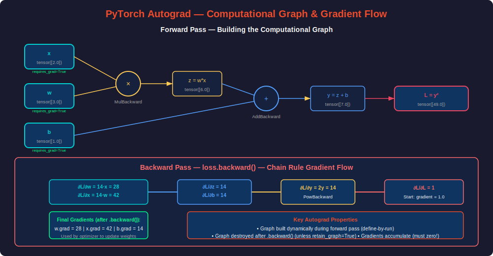
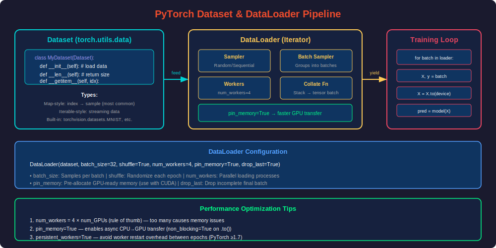
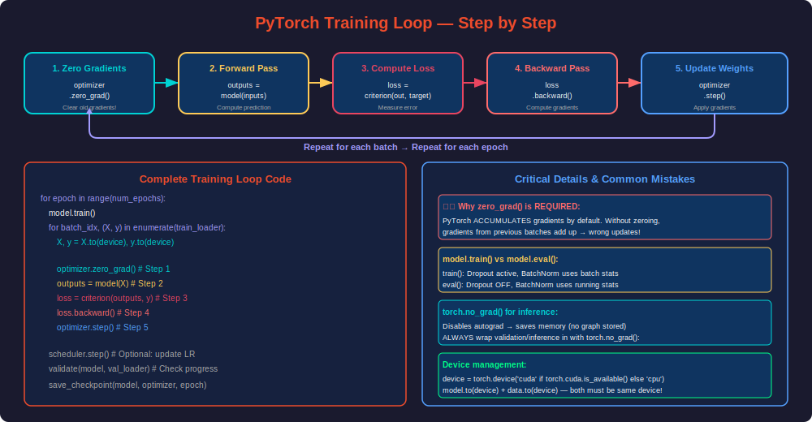
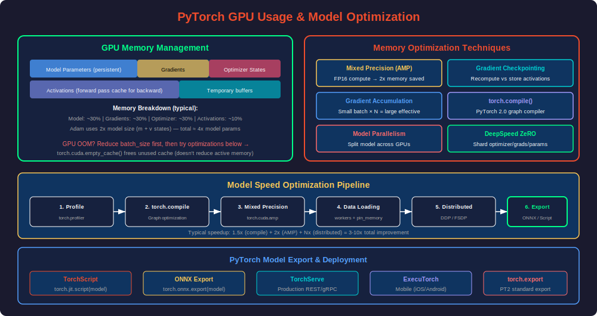

# PHASE 15 — PyTorch

---

## Table of Contents

1. [Introduction to PyTorch](#introduction-to-pytorch)
2. [PyTorch Ecosystem](#pytorch-ecosystem)
3. [Tensors — The Foundation](#tensors--the-foundation)
4. [Autograd — Automatic Differentiation](#autograd--automatic-differentiation)
5. [Building Models with nn.Module](#building-models-with-nnmodule)
6. [Dataset & DataLoader](#dataset--dataloader)
7. [The Training Loop](#the-training-loop)
8. [GPU Usage & CUDA](#gpu-usage--cuda)
9. [Model Optimization & Performance](#model-optimization--performance)
10. [Saving, Loading & Deployment](#saving-loading--deployment)
11. [Advanced Techniques](#advanced-techniques)
12. [End-to-End Projects](#end-to-end-projects)
13. [Interview Mastery](#interview-mastery)

---

## Introduction to PyTorch

### What is PyTorch?

**Beginner Explanation:**
PyTorch is Meta's (Facebook's) open-source deep learning framework. It's designed to be **Pythonic** — meaning it works like natural Python code, making it easy to learn, debug, and experiment with. It's the dominant framework in AI research and increasingly in production.

**Real-World Analogy:**
If TensorFlow is like an automatic car (does a lot for you, harder to customize), PyTorch is like a manual car (more control, you understand exactly what's happening, and you can do things the automatic can't).

**Technical Definition:**
PyTorch is a GPU-accelerated tensor computation library with an automatic differentiation system (autograd) that builds dynamic computational graphs, providing maximum flexibility for neural network research and production deployment.

### Why PyTorch Dominates Research

| Metric | PyTorch |
|--------|---------|
| Academic papers using it | ~80% (2024) |
| HuggingFace models | 95%+ PyTorch native |
| Top AI labs using it | OpenAI, Meta, Google DeepMind, Anthropic |
| Industry growth | Fastest growing DL framework |

### Key Philosophy

```
1. Python-first: No special DSL or compilation step needed
2. Dynamic graphs: Computation graph built at runtime (define-by-run)
3. Imperative: Code executes line-by-line (debuggable with pdb!)
4. Research → Production: Same code for both
```

---

## PyTorch Ecosystem

### Architecture Overview


### Core Components

| Component | Purpose | Import |
|-----------|---------|--------|
| `torch` | Tensor operations, math | `import torch` |
| `torch.nn` | Neural network layers/models | `from torch import nn` |
| `torch.optim` | Optimizers (Adam, SGD, etc.) | `from torch import optim` |
| `torch.autograd` | Automatic differentiation | Built into tensors |
| `torch.utils.data` | Dataset, DataLoader | `from torch.utils.data import ...` |
| `torch.cuda` | GPU management | `torch.cuda.is_available()` |
| `torch.jit` | TorchScript compilation | `torch.jit.script(model)` |
| `torch.distributed` | Multi-GPU training | DDP, FSDP |
| `torch.compile` | PT2 graph compiler | `torch.compile(model)` |

### Installation

```python
# pip install torch torchvision torchaudio

import torch
print(f"PyTorch version: {torch.__version__}")
print(f"CUDA available: {torch.cuda.is_available()}")
print(f"CUDA version: {torch.version.cuda}")
print(f"GPU: {torch.cuda.get_device_name(0) if torch.cuda.is_available() else 'None'}")
print(f"Number of GPUs: {torch.cuda.device_count()}")
```

---

## Tensors — The Foundation

### What is a Tensor?

A tensor is PyTorch's fundamental data structure — a multi-dimensional array that can live on CPU or GPU and tracks gradients for automatic differentiation.

### Creating Tensors

```python
import torch
import numpy as np

# From Python data
scalar = torch.tensor(42)                          # 0D tensor
vector = torch.tensor([1.0, 2.0, 3.0])           # 1D tensor
matrix = torch.tensor([[1, 2], [3, 4]])           # 2D tensor
tensor_3d = torch.tensor([[[1, 2], [3, 4]]])     # 3D tensor

print(f"Shape: {matrix.shape}")    # torch.Size([2, 2])
print(f"Dtype: {matrix.dtype}")    # torch.int64
print(f"Device: {matrix.device}")  # cpu

# Special constructors
zeros = torch.zeros(3, 4)                    # 3x4 zeros
ones = torch.ones(2, 3)                      # 2x3 ones
randn = torch.randn(3, 4)                    # Normal distribution N(0,1)
rand = torch.rand(2, 5)                      # Uniform [0, 1)
arange = torch.arange(0, 10, 2)             # [0, 2, 4, 6, 8]
linspace = torch.linspace(0, 1, 5)          # 5 evenly spaced [0, 1]
eye = torch.eye(3)                           # 3x3 identity
full = torch.full((2, 3), fill_value=7.0)   # 2x3 filled with 7

# Like existing tensor (same shape, dtype, device)
similar = torch.zeros_like(matrix)
similar_rand = torch.randn_like(matrix.float())

# From NumPy (shared memory — no copy!)
numpy_arr = np.array([1.0, 2.0, 3.0])
from_numpy = torch.from_numpy(numpy_arr)     # Shares memory!
numpy_arr[0] = 999                           # Changes both!
print(from_numpy[0])                         # tensor(999.)

# Safe copy from NumPy
safe_tensor = torch.tensor(numpy_arr)        # Creates a copy

# Specify dtype and device
float_tensor = torch.tensor([1, 2, 3], dtype=torch.float32)
gpu_tensor = torch.tensor([1, 2, 3], device='cuda')  # Directly on GPU
```

### Tensor Operations

```python
a = torch.tensor([[1.0, 2.0], [3.0, 4.0]])
b = torch.tensor([[5.0, 6.0], [7.0, 8.0]])

# Arithmetic (element-wise)
add = a + b                    # or torch.add(a, b)
sub = a - b
mul = a * b                    # Element-wise multiplication
div = a / b
power = a ** 2

# Matrix operations
matmul = a @ b                 # Matrix multiplication (RECOMMENDED)
matmul2 = torch.matmul(a, b)  # Same thing
mm = torch.mm(a, b)           # Only for 2D matrices
bmm = torch.bmm(batch_a, batch_b)  # Batched matrix multiply

transpose = a.T                # Transpose
transpose2 = a.transpose(0, 1)
permute = a.permute(1, 0)     # Arbitrary dimension reordering

# Reductions
total = a.sum()                  # Sum all
row_sum = a.sum(dim=1)           # Sum along dim 1
col_mean = a.mean(dim=0)        # Mean along dim 0
max_val, max_idx = a.max(dim=1) # Max values + indices
argmax = a.argmax(dim=1)        # Only indices

# Reshaping
x = torch.arange(12)
reshaped = x.reshape(3, 4)          # New shape (may copy)
viewed = x.view(3, 4)               # New shape (no copy, requires contiguous)
flattened = x.reshape(-1)           # Flatten (-1 = infer)
unsqueezed = x.unsqueeze(0)        # Add dim: (12,) → (1, 12)
squeezed = unsqueezed.squeeze(0)   # Remove dim: (1, 12) → (12,)

# Concatenation & Stacking
c1 = torch.tensor([[1, 2]])
c2 = torch.tensor([[3, 4]])
cat = torch.cat([c1, c2], dim=0)       # Concatenate along existing dim
stacked = torch.stack([c1, c2], dim=0) # Stack along NEW dim

# Indexing (same as NumPy)
x = torch.randn(5, 4)
print(x[0])          # First row
print(x[:, 0])       # First column
print(x[1:3, :2])    # Rows 1-2, first 2 cols
print(x[x > 0])      # Boolean indexing

# In-place operations (end with _)
a.add_(1)      # a = a + 1 (in-place, saves memory)
a.zero_()      # Fill with zeros
a.fill_(5)     # Fill with 5
a.clamp_(0, 1) # Clip values to [0, 1]
```

### Broadcasting Rules

```python
# Broadcasting: automatic shape expansion for operations
# Rules (check from trailing dimensions):
# 1. Dimensions must be equal, OR
# 2. One of them must be 1 (gets expanded)

a = torch.randn(4, 3)    # (4, 3)
b = torch.randn(1, 3)    # (1, 3) → broadcasts to (4, 3)
result = a + b            # Works! (4, 3)

c = torch.randn(4, 1)    # (4, 1) → broadcasts to (4, 3)
result = a + c            # Works! (4, 3)

# Common pattern: batch operations
batch = torch.randn(32, 10)   # (32, 10) — batch of 32 vectors
bias = torch.randn(10)        # (10,) → broadcasts to (32, 10)
result = batch + bias          # Adds bias to every sample in batch
```

### Key Tensor Properties

```python
t = torch.randn(3, 4, requires_grad=True)

# Properties
t.shape          # torch.Size([3, 4])
t.dtype          # torch.float32
t.device         # device(type='cpu')
t.requires_grad  # True (tracks gradients)
t.is_cuda        # False
t.is_contiguous() # True (memory layout)
t.numel()        # 12 (total elements)
t.dim()          # 2 (number of dimensions)

# Type casting
t.float()        # → float32
t.half()         # → float16
t.int()          # → int32
t.long()         # → int64
t.to(torch.float16)  # Explicit

# Device transfer
t.cpu()                    # → CPU
t.cuda()                   # → GPU (default GPU)
t.to('cuda:0')            # → specific GPU
t.to(device)              # → whatever device variable holds
```

---

## Autograd — Automatic Differentiation

### How Autograd Works

**Beginner Explanation:**
Autograd is PyTorch's automatic differentiation engine. When you perform operations on tensors with `requires_grad=True`, PyTorch secretly records every operation in a computational graph. When you call `.backward()`, it traverses this graph in reverse to compute all gradients using the chain rule.

**Key Insight:** The graph is built **dynamically** during the forward pass (define-by-run). This means you can use Python `if/else`, `for` loops, and any control flow — the graph just records whatever actually happened.

### Computational Graph Visualization



### Autograd in Practice

```python
import torch

# Simple example: y = x² + 3x + 1
x = torch.tensor(2.0, requires_grad=True)

y = x**2 + 3*x + 1  # y = 4 + 6 + 1 = 11

# Compute gradient: dy/dx = 2x + 3 = 2(2) + 3 = 7
y.backward()
print(f"dy/dx = {x.grad}")  # tensor(7.)

# IMPORTANT: Gradients accumulate! Must zero before next backward
x.grad.zero_()

# Another computation
y2 = x**3
y2.backward()
print(f"dy2/dx = {x.grad}")  # tensor(12.) — because 3x² = 3(4) = 12
```

### Gradient Computation for Neural Networks

```python
# Realistic example: linear model
torch.manual_seed(42)

# Parameters (what we want to learn)
W = torch.randn(3, 2, requires_grad=True)
b = torch.randn(2, requires_grad=True)

# Input and target
X = torch.randn(5, 3)  # 5 samples, 3 features
y_true = torch.tensor([0, 1, 0, 1, 1])

# Forward pass
logits = X @ W + b                                    # (5, 2)
loss = torch.nn.functional.cross_entropy(logits, y_true)

print(f"Loss: {loss.item():.4f}")

# Backward pass — compute gradients
loss.backward()

print(f"W.grad shape: {W.grad.shape}")  # (3, 2)
print(f"b.grad shape: {b.grad.shape}")  # (2,)
print(f"X has grad: {X.grad}")          # None (requires_grad=False)

# Update weights manually (SGD)
learning_rate = 0.01
with torch.no_grad():  # Don't track these operations!
    W -= learning_rate * W.grad
    b -= learning_rate * b.grad

# Zero gradients for next iteration
W.grad.zero_()
b.grad.zero_()
```

### Important Autograd Rules

```python
# 1. Gradients ACCUMULATE — always zero before backward
optimizer.zero_grad()  # Or param.grad.zero_()

# 2. .backward() destroys the graph (unless retain_graph=True)
loss.backward()       # Graph freed after this
# loss.backward()     # ERROR! Graph no longer exists
loss.backward(retain_graph=True)  # Keep graph for multiple backwards

# 3. Detach tensors to stop gradient tracking
feature = model.encoder(x)
feature_detached = feature.detach()  # No gradient flows through this

# 4. torch.no_grad() context — disable gradient tracking entirely
with torch.no_grad():
    predictions = model(test_data)   # No graph built, saves memory

# 5. .item() to get Python scalar (detaches from graph)
loss_value = loss.item()  # float, not tensor

# 6. requires_grad only for floating-point tensors
int_tensor = torch.tensor([1, 2, 3])  # Can't require grad (integer)
float_tensor = torch.tensor([1.0, 2.0, 3.0], requires_grad=True)  # OK

# 7. Leaf tensors vs computed tensors
a = torch.tensor([1.0], requires_grad=True)  # Leaf (user-created)
b = a * 2                                     # Non-leaf (computed)
print(a.is_leaf)  # True — gradient stored here
print(b.is_leaf)  # False — gradient NOT stored (unless retain_grad())
```

---

## Building Models with nn.Module

### The nn.Module Pattern

Every PyTorch model inherits from `nn.Module`. This base class provides:
- Parameter tracking (automatically finds all `nn.Parameter` and sub-modules)
- `.to(device)` moves everything to GPU/CPU
- `.train()` / `.eval()` mode switching
- State dict for saving/loading
- Hooks for debugging

```python
import torch
import torch.nn as nn
import torch.nn.functional as F

class SimpleClassifier(nn.Module):
    def __init__(self, input_dim, hidden_dim, num_classes):
        super().__init__()
        
        # Define layers (registered as sub-modules automatically)
        self.fc1 = nn.Linear(input_dim, hidden_dim)
        self.bn1 = nn.BatchNorm1d(hidden_dim)
        self.fc2 = nn.Linear(hidden_dim, hidden_dim // 2)
        self.bn2 = nn.BatchNorm1d(hidden_dim // 2)
        self.fc3 = nn.Linear(hidden_dim // 2, num_classes)
        self.dropout = nn.Dropout(0.3)
    
    def forward(self, x):
        # Define forward pass (backward is automatic!)
        x = F.relu(self.bn1(self.fc1(x)))
        x = self.dropout(x)
        x = F.relu(self.bn2(self.fc2(x)))
        x = self.dropout(x)
        x = self.fc3(x)  # Raw logits (no softmax — handled by loss)
        return x


# Instantiate
model = SimpleClassifier(input_dim=784, hidden_dim=256, num_classes=10)

# Inspect
print(model)
print(f"\nTotal parameters: {sum(p.numel() for p in model.parameters()):,}")
print(f"Trainable parameters: {sum(p.numel() for p in model.parameters() if p.requires_grad):,}")

# Forward pass
dummy_input = torch.randn(32, 784)  # Batch of 32
output = model(dummy_input)          # Calls forward() automatically
print(f"Output shape: {output.shape}")  # (32, 10)
```

### nn.Sequential — Quick Model Building

```python
# For simple linear stacks (like Keras Sequential)
model = nn.Sequential(
    nn.Linear(784, 512),
    nn.BatchNorm1d(512),
    nn.ReLU(),
    nn.Dropout(0.4),
    nn.Linear(512, 256),
    nn.BatchNorm1d(256),
    nn.ReLU(),
    nn.Dropout(0.3),
    nn.Linear(256, 128),
    nn.ReLU(),
    nn.Linear(128, 10)
)

# With named layers
model = nn.Sequential(OrderedDict([
    ('fc1', nn.Linear(784, 512)),
    ('bn1', nn.BatchNorm1d(512)),
    ('relu1', nn.ReLU()),
    ('dropout1', nn.Dropout(0.4)),
    ('fc2', nn.Linear(512, 10)),
]))
```

### Advanced Model Patterns

```python
# Residual Block
class ResidualBlock(nn.Module):
    def __init__(self, channels):
        super().__init__()
        self.block = nn.Sequential(
            nn.Linear(channels, channels),
            nn.BatchNorm1d(channels),
            nn.ReLU(),
            nn.Linear(channels, channels),
            nn.BatchNorm1d(channels),
        )
    
    def forward(self, x):
        return F.relu(x + self.block(x))  # Skip connection!


# Model with dynamic behavior (impossible in static graph frameworks)
class DynamicModel(nn.Module):
    def __init__(self, input_dim, num_classes):
        super().__init__()
        self.classifier = nn.Linear(input_dim, num_classes)
        self.aux_head = nn.Linear(input_dim, 1)
        self.feature_extractor = nn.Sequential(
            nn.Linear(input_dim, 256),
            nn.ReLU(),
            nn.Linear(256, input_dim)
        )
    
    def forward(self, x, use_aux=False, num_passes=1):
        # Dynamic control flow — works in PyTorch!
        for _ in range(num_passes):
            x = self.feature_extractor(x)
        
        logits = self.classifier(x)
        
        if use_aux:  # Conditional computation
            aux = self.aux_head(x)
            return logits, aux
        
        return logits
```

### Common Layers Reference

```python
# Linear layers
nn.Linear(in_features, out_features, bias=True)

# Convolutional
nn.Conv2d(in_channels, out_channels, kernel_size, stride=1, padding=0)
nn.ConvTranspose2d(...)  # Upsampling / decoder

# Recurrent
nn.LSTM(input_size, hidden_size, num_layers=1, batch_first=True, bidirectional=False)
nn.GRU(input_size, hidden_size, num_layers=1, batch_first=True)

# Normalization
nn.BatchNorm1d(num_features)  # For FC layers
nn.BatchNorm2d(num_features)  # For Conv layers
nn.LayerNorm(normalized_shape) # For Transformers
nn.GroupNorm(num_groups, num_channels)

# Activation
nn.ReLU()
nn.LeakyReLU(0.01)
nn.GELU()      # For Transformers
nn.SiLU()      # Swish

# Regularization
nn.Dropout(p=0.5)
nn.Dropout2d(p=0.2)  # Spatial dropout for Conv

# Pooling
nn.MaxPool2d(kernel_size=2)
nn.AdaptiveAvgPool2d(output_size=1)  # Global average pooling

# Embedding
nn.Embedding(num_embeddings, embedding_dim, padding_idx=None)

# Transformer
nn.TransformerEncoder(encoder_layer, num_layers)
nn.MultiheadAttention(embed_dim, num_heads)
```

---

## Dataset & DataLoader

### Pipeline Overview



### Custom Dataset

```python
from torch.utils.data import Dataset, DataLoader
import torch

class CustomDataset(Dataset):
    def __init__(self, features, labels, transform=None):
        self.features = torch.tensor(features, dtype=torch.float32)
        self.labels = torch.tensor(labels, dtype=torch.long)
        self.transform = transform
    
    def __len__(self):
        return len(self.labels)
    
    def __getitem__(self, idx):
        x = self.features[idx]
        y = self.labels[idx]
        
        if self.transform:
            x = self.transform(x)
        
        return x, y


# Image dataset from folder
class ImageDataset(Dataset):
    def __init__(self, image_paths, labels, transform=None):
        self.image_paths = image_paths
        self.labels = labels
        self.transform = transform
    
    def __len__(self):
        return len(self.image_paths)
    
    def __getitem__(self, idx):
        from PIL import Image
        
        image = Image.open(self.image_paths[idx]).convert('RGB')
        label = self.labels[idx]
        
        if self.transform:
            image = self.transform(image)
        
        return image, label


# CSV dataset (memory-efficient — loads per sample)
class CSVDataset(Dataset):
    def __init__(self, csv_path):
        import pandas as pd
        self.data = pd.read_csv(csv_path)
    
    def __len__(self):
        return len(self.data)
    
    def __getitem__(self, idx):
        row = self.data.iloc[idx]
        features = torch.tensor(row[:-1].values, dtype=torch.float32)
        label = torch.tensor(row[-1], dtype=torch.long)
        return features, label
```

### DataLoader Configuration

```python
from torch.utils.data import DataLoader, random_split

# Create dataset
dataset = CustomDataset(X, y)

# Split into train/val/test
train_size = int(0.8 * len(dataset))
val_size = int(0.1 * len(dataset))
test_size = len(dataset) - train_size - val_size

train_dataset, val_dataset, test_dataset = random_split(
    dataset, [train_size, val_size, test_size],
    generator=torch.Generator().manual_seed(42)  # Reproducible split
)

# Create DataLoaders
train_loader = DataLoader(
    train_dataset,
    batch_size=64,
    shuffle=True,              # Randomize order each epoch
    num_workers=4,             # Parallel data loading processes
    pin_memory=True,           # Faster GPU transfer
    drop_last=True,            # Drop incomplete last batch
    persistent_workers=True    # Don't restart workers between epochs
)

val_loader = DataLoader(
    val_dataset,
    batch_size=128,            # Larger batch OK for validation (no gradients)
    shuffle=False,             # No need to shuffle validation
    num_workers=4,
    pin_memory=True
)

# Iterate
for batch_idx, (X_batch, y_batch) in enumerate(train_loader):
    print(f"Batch {batch_idx}: X shape={X_batch.shape}, y shape={y_batch.shape}")
    break  # Just show first batch
```

### Built-in Datasets & Transforms

```python
import torchvision
import torchvision.transforms as T

# Image transforms
train_transform = T.Compose([
    T.RandomResizedCrop(224),
    T.RandomHorizontalFlip(),
    T.ColorJitter(brightness=0.2, contrast=0.2, saturation=0.2),
    T.ToTensor(),                    # PIL → Tensor, scales to [0, 1]
    T.Normalize(mean=[0.485, 0.456, 0.406],
                std=[0.229, 0.224, 0.225])   # ImageNet normalization
])

val_transform = T.Compose([
    T.Resize(256),
    T.CenterCrop(224),
    T.ToTensor(),
    T.Normalize(mean=[0.485, 0.456, 0.406],
                std=[0.229, 0.224, 0.225])
])

# Built-in dataset
train_dataset = torchvision.datasets.CIFAR10(
    root='./data',
    train=True,
    download=True,
    transform=train_transform
)

train_loader = DataLoader(train_dataset, batch_size=64, shuffle=True, num_workers=4)
```

---

## The Training Loop

### Complete Training Loop



### Production-Ready Training Script

```python
import torch
import torch.nn as nn
import torch.optim as optim
from torch.utils.data import DataLoader
from torch.cuda.amp import autocast, GradScaler
import time

class Trainer:
    def __init__(self, model, train_loader, val_loader, config):
        self.config = config
        self.device = torch.device('cuda' if torch.cuda.is_available() else 'cpu')
        
        # Model
        self.model = model.to(self.device)
        
        # Loss & Optimizer
        self.criterion = nn.CrossEntropyLoss()
        self.optimizer = optim.AdamW(
            model.parameters(),
            lr=config['lr'],
            weight_decay=config['weight_decay']
        )
        
        # Scheduler
        self.scheduler = optim.lr_scheduler.CosineAnnealingLR(
            self.optimizer, T_max=config['epochs']
        )
        
        # Mixed precision
        self.scaler = GradScaler() if config.get('use_amp', False) else None
        
        # Data
        self.train_loader = train_loader
        self.val_loader = val_loader
        
        # Tracking
        self.best_val_acc = 0.0
        self.patience_counter = 0
    
    def train_one_epoch(self):
        self.model.train()
        total_loss = 0.0
        correct = 0
        total = 0
        
        for X, y in self.train_loader:
            X, y = X.to(self.device, non_blocking=True), y.to(self.device, non_blocking=True)
            
            # Step 1: Zero gradients
            self.optimizer.zero_grad(set_to_none=True)  # Slightly faster than zero_grad()
            
            # Steps 2-3: Forward + Loss (with AMP if enabled)
            if self.scaler:
                with autocast():
                    outputs = self.model(X)
                    loss = self.criterion(outputs, y)
                # Step 4: Backward with scaled loss
                self.scaler.scale(loss).backward()
                # Gradient clipping (unscale first)
                self.scaler.unscale_(self.optimizer)
                torch.nn.utils.clip_grad_norm_(self.model.parameters(), max_norm=1.0)
                # Step 5: Optimizer step with scaler
                self.scaler.step(self.optimizer)
                self.scaler.update()
            else:
                outputs = self.model(X)
                loss = self.criterion(outputs, y)
                loss.backward()
                torch.nn.utils.clip_grad_norm_(self.model.parameters(), max_norm=1.0)
                self.optimizer.step()
            
            # Track metrics
            total_loss += loss.item() * X.size(0)
            _, predicted = outputs.max(1)
            total += y.size(0)
            correct += predicted.eq(y).sum().item()
        
        return total_loss / total, correct / total
    
    @torch.no_grad()
    def validate(self):
        self.model.eval()
        total_loss = 0.0
        correct = 0
        total = 0
        
        for X, y in self.val_loader:
            X, y = X.to(self.device, non_blocking=True), y.to(self.device, non_blocking=True)
            
            if self.scaler:
                with autocast():
                    outputs = self.model(X)
                    loss = self.criterion(outputs, y)
            else:
                outputs = self.model(X)
                loss = self.criterion(outputs, y)
            
            total_loss += loss.item() * X.size(0)
            _, predicted = outputs.max(1)
            total += y.size(0)
            correct += predicted.eq(y).sum().item()
        
        return total_loss / total, correct / total
    
    def train(self):
        for epoch in range(self.config['epochs']):
            start = time.time()
            
            train_loss, train_acc = self.train_one_epoch()
            val_loss, val_acc = self.validate()
            self.scheduler.step()
            
            elapsed = time.time() - start
            lr = self.optimizer.param_groups[0]['lr']
            
            print(f"Epoch {epoch+1:3d}/{self.config['epochs']} ({elapsed:.1f}s) | "
                  f"LR: {lr:.2e} | "
                  f"Train: {train_loss:.4f} / {train_acc:.4f} | "
                  f"Val: {val_loss:.4f} / {val_acc:.4f}")
            
            # Save best model
            if val_acc > self.best_val_acc:
                self.best_val_acc = val_acc
                self.patience_counter = 0
                self.save_checkpoint(epoch, is_best=True)
            else:
                self.patience_counter += 1
            
            # Early stopping
            if self.patience_counter >= self.config.get('patience', 20):
                print(f"Early stopping at epoch {epoch+1}")
                break
        
        # Load best weights
        self.load_checkpoint('best_model.pth')
        print(f"\nTraining complete! Best val accuracy: {self.best_val_acc:.4f}")
    
    def save_checkpoint(self, epoch, is_best=False):
        checkpoint = {
            'epoch': epoch,
            'model_state_dict': self.model.state_dict(),
            'optimizer_state_dict': self.optimizer.state_dict(),
            'scheduler_state_dict': self.scheduler.state_dict(),
            'best_val_acc': self.best_val_acc,
        }
        path = 'best_model.pth' if is_best else f'checkpoint_epoch{epoch}.pth'
        torch.save(checkpoint, path)
    
    def load_checkpoint(self, path):
        checkpoint = torch.load(path, map_location=self.device)
        self.model.load_state_dict(checkpoint['model_state_dict'])


# Usage
config = {
    'lr': 3e-4,
    'weight_decay': 0.01,
    'epochs': 100,
    'patience': 15,
    'use_amp': True,
}

model = SimpleClassifier(784, 256, 10)
trainer = Trainer(model, train_loader, val_loader, config)
trainer.train()
```

---

## GPU Usage & CUDA

### GPU Fundamentals

```python
import torch

# Check GPU availability
print(f"CUDA available: {torch.cuda.is_available()}")
print(f"Number of GPUs: {torch.cuda.device_count()}")
print(f"Current device: {torch.cuda.current_device()}")
print(f"Device name: {torch.cuda.get_device_name(0)}")

# Set default device
device = torch.device('cuda' if torch.cuda.is_available() else 'cpu')
# OR for Apple Silicon:
# device = torch.device('mps' if torch.backends.mps.is_available() else 'cpu')

# Move tensors to GPU
x_cpu = torch.randn(1000, 1000)
x_gpu = x_cpu.to(device)            # Copy to GPU
x_gpu = x_cpu.cuda()                # Same thing (NVIDIA only)

# Move model to GPU (moves ALL parameters and buffers)
model = model.to(device)

# IMPORTANT: Data and model must be on SAME device!
X = X.to(device)
y = y.to(device)
output = model(X)  # Works — both on GPU

# Memory management
print(f"Allocated: {torch.cuda.memory_allocated() / 1e9:.2f} GB")
print(f"Cached: {torch.cuda.memory_reserved() / 1e9:.2f} GB")
torch.cuda.empty_cache()  # Free unused cache (doesn't reduce active memory)
```

### Multi-GPU Training (DDP)

```python
import torch.distributed as dist
from torch.nn.parallel import DistributedDataParallel as DDP
from torch.utils.data.distributed import DistributedSampler

def setup(rank, world_size):
    dist.init_process_group("nccl", rank=rank, world_size=world_size)
    torch.cuda.set_device(rank)

def cleanup():
    dist.destroy_process_group()

def train_ddp(rank, world_size, model, dataset, config):
    setup(rank, world_size)
    
    model = model.to(rank)
    model = DDP(model, device_ids=[rank])
    
    sampler = DistributedSampler(dataset, num_replicas=world_size, rank=rank)
    loader = DataLoader(dataset, batch_size=config['batch_size'], sampler=sampler)
    
    optimizer = optim.Adam(model.parameters(), lr=config['lr'])
    criterion = nn.CrossEntropyLoss()
    
    for epoch in range(config['epochs']):
        sampler.set_epoch(epoch)  # Ensure different shuffling per epoch
        
        for X, y in loader:
            X, y = X.to(rank), y.to(rank)
            
            optimizer.zero_grad()
            output = model(X)
            loss = criterion(output, y)
            loss.backward()
            optimizer.step()
    
    cleanup()

# Launch: torchrun --nproc_per_node=4 train.py
# Or: python -m torch.distributed.launch --nproc_per_node=4 train.py
```

---

## Model Optimization & Performance

### Overview



### Mixed Precision Training (AMP)

```python
from torch.cuda.amp import autocast, GradScaler

scaler = GradScaler()

for X, y in train_loader:
    X, y = X.to(device), y.to(device)
    optimizer.zero_grad()
    
    # Forward pass in FP16 (2x faster, 2x less memory)
    with autocast():
        output = model(X)
        loss = criterion(output, y)
    
    # Backward with loss scaling (prevents FP16 underflow)
    scaler.scale(loss).backward()
    
    # Unscale for gradient clipping
    scaler.unscale_(optimizer)
    torch.nn.utils.clip_grad_norm_(model.parameters(), 1.0)
    
    # Step with scaler
    scaler.step(optimizer)
    scaler.update()
```

### torch.compile() — PyTorch 2.0 Magic

```python
# The simplest and most impactful optimization
model = SimpleClassifier(784, 256, 10)
model = model.to(device)

# One line: 1.5-3x speedup!
compiled_model = torch.compile(model)

# Modes:
# "default" — balanced speed/compile time
# "reduce-overhead" — minimize GPU overhead (best for small models)
# "max-autotune" — maximum speed (long compile time)
compiled_model = torch.compile(model, mode="reduce-overhead")

# Usage is identical to regular model
output = compiled_model(X)
```

### Gradient Accumulation

```python
accumulation_steps = 4
effective_batch_size = batch_size * accumulation_steps

optimizer.zero_grad()

for i, (X, y) in enumerate(train_loader):
    X, y = X.to(device), y.to(device)
    
    output = model(X)
    loss = criterion(output, y) / accumulation_steps  # Scale loss
    loss.backward()  # Accumulate gradients
    
    if (i + 1) % accumulation_steps == 0:
        torch.nn.utils.clip_grad_norm_(model.parameters(), 1.0)
        optimizer.step()
        optimizer.zero_grad()
```

### Gradient Checkpointing

```python
from torch.utils.checkpoint import checkpoint

class MemoryEfficientModel(nn.Module):
    def __init__(self):
        super().__init__()
        self.block1 = nn.Sequential(nn.Linear(784, 512), nn.ReLU())
        self.block2 = nn.Sequential(nn.Linear(512, 256), nn.ReLU())
        self.block3 = nn.Sequential(nn.Linear(256, 128), nn.ReLU())
        self.head = nn.Linear(128, 10)
    
    def forward(self, x):
        # Checkpoint: don't store activations, recompute during backward
        x = checkpoint(self.block1, x, use_reentrant=False)
        x = checkpoint(self.block2, x, use_reentrant=False)
        x = checkpoint(self.block3, x, use_reentrant=False)
        return self.head(x)
    # Saves ~60% activation memory, costs ~30% more compute
```

### Profiling

```python
from torch.profiler import profile, record_function, ProfilerActivity

with profile(
    activities=[ProfilerActivity.CPU, ProfilerActivity.CUDA],
    record_shapes=True,
    profile_memory=True,
    with_stack=True
) as prof:
    with record_function("training_step"):
        output = model(X.to(device))
        loss = criterion(output, y.to(device))
        loss.backward()
        optimizer.step()

# Print summary
print(prof.key_averages().table(sort_by="cuda_time_total", row_limit=10))

# Export for TensorBoard
prof.export_chrome_trace("trace.json")
```

---

## Saving, Loading & Deployment

### Saving & Loading Models

```python
# Method 1: Save state_dict (RECOMMENDED)
torch.save(model.state_dict(), 'model_weights.pth')

# Load
model = SimpleClassifier(784, 256, 10)  # Must recreate architecture!
model.load_state_dict(torch.load('model_weights.pth', map_location=device))
model.eval()

# Method 2: Save entire model (includes architecture)
torch.save(model, 'full_model.pth')
model = torch.load('full_model.pth', map_location=device)

# Method 3: Checkpoint (for resuming training)
checkpoint = {
    'epoch': epoch,
    'model_state_dict': model.state_dict(),
    'optimizer_state_dict': optimizer.state_dict(),
    'scheduler_state_dict': scheduler.state_dict(),
    'loss': loss,
    'best_accuracy': best_acc,
}
torch.save(checkpoint, 'checkpoint.pth')

# Resume
checkpoint = torch.load('checkpoint.pth')
model.load_state_dict(checkpoint['model_state_dict'])
optimizer.load_state_dict(checkpoint['optimizer_state_dict'])
start_epoch = checkpoint['epoch'] + 1
```

### Export for Production

```python
# TorchScript (for C++ deployment)
scripted = torch.jit.script(model)
scripted.save('model_scripted.pt')
# Load in C++: torch::jit::load("model_scripted.pt")

# ONNX export (cross-framework)
dummy_input = torch.randn(1, 784, device=device)
torch.onnx.export(
    model,
    dummy_input,
    'model.onnx',
    input_names=['input'],
    output_names=['output'],
    dynamic_axes={'input': {0: 'batch_size'}, 'output': {0: 'batch_size'}}
)

# Quantization (INT8 — 4x smaller, 2-3x faster on CPU)
quantized_model = torch.quantization.quantize_dynamic(
    model.cpu(), {nn.Linear}, dtype=torch.qint8
)
torch.save(quantized_model.state_dict(), 'model_quantized.pth')
```

### TorchServe Deployment

```python
# 1. Create model archive
# torch-model-archiver --model-name classifier \
#   --version 1.0 --serialized-file model_scripted.pt \
#   --handler image_classifier --export-path model_store

# 2. Start TorchServe
# torchserve --start --model-store model_store --models classifier=classifier.mar

# 3. Client request
import requests
response = requests.post(
    'http://localhost:8080/predictions/classifier',
    data=open('test_image.jpg', 'rb')
)
print(response.json())
```

---

## Advanced Techniques

### Transfer Learning

```python
import torchvision.models as models

# Load pre-trained model
model = models.resnet50(weights=models.ResNet50_Weights.DEFAULT)

# Freeze all layers
for param in model.parameters():
    param.requires_grad = False

# Replace final layer (only this trains)
num_classes = 5
model.fc = nn.Linear(model.fc.in_features, num_classes)

# Only new layer parameters go to optimizer
optimizer = optim.Adam(model.fc.parameters(), lr=1e-3)

# Fine-tuning: unfreeze later
for param in model.layer4.parameters():
    param.requires_grad = True

optimizer = optim.Adam([
    {'params': model.fc.parameters(), 'lr': 1e-3},
    {'params': model.layer4.parameters(), 'lr': 1e-5},  # Lower LR for pre-trained
])
```

### Learning Rate Finder

```python
def find_lr(model, train_loader, criterion, optimizer, start_lr=1e-7, end_lr=10, num_iter=100):
    lrs, losses = [], []
    model.train()
    
    lr_mult = (end_lr / start_lr) ** (1 / num_iter)
    lr = start_lr
    
    for param_group in optimizer.param_groups:
        param_group['lr'] = lr
    
    for i, (X, y) in enumerate(train_loader):
        if i >= num_iter:
            break
        
        X, y = X.to(device), y.to(device)
        optimizer.zero_grad()
        output = model(X)
        loss = criterion(output, y)
        loss.backward()
        optimizer.step()
        
        lrs.append(lr)
        losses.append(loss.item())
        
        lr *= lr_mult
        for param_group in optimizer.param_groups:
            param_group['lr'] = lr
    
    # Plot and pick LR where loss is decreasing fastest
    return lrs, losses
```

### Custom Loss Functions

```python
class FocalLoss(nn.Module):
    def __init__(self, alpha=0.25, gamma=2.0):
        super().__init__()
        self.alpha = alpha
        self.gamma = gamma
    
    def forward(self, inputs, targets):
        ce_loss = F.cross_entropy(inputs, targets, reduction='none')
        pt = torch.exp(-ce_loss)
        focal_loss = self.alpha * (1 - pt) ** self.gamma * ce_loss
        return focal_loss.mean()


class LabelSmoothingLoss(nn.Module):
    def __init__(self, num_classes, smoothing=0.1):
        super().__init__()
        self.smoothing = smoothing
        self.num_classes = num_classes
    
    def forward(self, inputs, targets):
        log_probs = F.log_softmax(inputs, dim=-1)
        targets_one_hot = F.one_hot(targets, self.num_classes).float()
        targets_smooth = targets_one_hot * (1 - self.smoothing) + self.smoothing / self.num_classes
        loss = -(targets_smooth * log_probs).sum(dim=-1)
        return loss.mean()
```

---

## End-to-End Projects

### Project 1: MNIST from Scratch

```python
import torch
import torch.nn as nn
import torch.optim as optim
from torchvision import datasets, transforms
from torch.utils.data import DataLoader

# Device
device = torch.device('cuda' if torch.cuda.is_available() else 'cpu')

# Data
transform = transforms.Compose([
    transforms.ToTensor(),
    transforms.Normalize((0.1307,), (0.3081,))
])

train_dataset = datasets.MNIST('./data', train=True, download=True, transform=transform)
test_dataset = datasets.MNIST('./data', train=False, transform=transform)

train_loader = DataLoader(train_dataset, batch_size=128, shuffle=True, num_workers=4, pin_memory=True)
test_loader = DataLoader(test_dataset, batch_size=256, shuffle=False, num_workers=4, pin_memory=True)

# Model
class MNISTNet(nn.Module):
    def __init__(self):
        super().__init__()
        self.flatten = nn.Flatten()
        self.network = nn.Sequential(
            nn.Linear(784, 512),
            nn.BatchNorm1d(512),
            nn.ReLU(),
            nn.Dropout(0.3),
            nn.Linear(512, 256),
            nn.BatchNorm1d(256),
            nn.ReLU(),
            nn.Dropout(0.2),
            nn.Linear(256, 10)
        )
    
    def forward(self, x):
        x = self.flatten(x)
        return self.network(x)

model = MNISTNet().to(device)
criterion = nn.CrossEntropyLoss()
optimizer = optim.Adam(model.parameters(), lr=1e-3)
scheduler = optim.lr_scheduler.CosineAnnealingLR(optimizer, T_max=20)

# Training
for epoch in range(20):
    model.train()
    train_loss, correct, total = 0.0, 0, 0
    
    for X, y in train_loader:
        X, y = X.to(device), y.to(device)
        
        optimizer.zero_grad()
        output = model(X)
        loss = criterion(output, y)
        loss.backward()
        optimizer.step()
        
        train_loss += loss.item() * X.size(0)
        correct += (output.argmax(1) == y).sum().item()
        total += y.size(0)
    
    scheduler.step()
    
    # Validate
    model.eval()
    val_correct, val_total = 0, 0
    with torch.no_grad():
        for X, y in test_loader:
            X, y = X.to(device), y.to(device)
            output = model(X)
            val_correct += (output.argmax(1) == y).sum().item()
            val_total += y.size(0)
    
    print(f"Epoch {epoch+1:2d} | Train Loss: {train_loss/total:.4f} | "
          f"Train Acc: {correct/total:.4f} | Val Acc: {val_correct/val_total:.4f}")
```

### Project 2: Transfer Learning Image Classifier

```python
import torch
import torch.nn as nn
import torchvision
from torchvision import transforms, models
from torch.utils.data import DataLoader

device = torch.device('cuda' if torch.cuda.is_available() else 'cpu')

# Transforms
train_transform = transforms.Compose([
    transforms.RandomResizedCrop(224),
    transforms.RandomHorizontalFlip(),
    transforms.RandomRotation(15),
    transforms.ToTensor(),
    transforms.Normalize([0.485, 0.456, 0.406], [0.229, 0.224, 0.225])
])

val_transform = transforms.Compose([
    transforms.Resize(256),
    transforms.CenterCrop(224),
    transforms.ToTensor(),
    transforms.Normalize([0.485, 0.456, 0.406], [0.229, 0.224, 0.225])
])

# Load data (assuming ImageFolder structure)
train_data = torchvision.datasets.ImageFolder('data/train', transform=train_transform)
val_data = torchvision.datasets.ImageFolder('data/val', transform=val_transform)

train_loader = DataLoader(train_data, batch_size=32, shuffle=True, num_workers=4, pin_memory=True)
val_loader = DataLoader(val_data, batch_size=64, shuffle=False, num_workers=4, pin_memory=True)

num_classes = len(train_data.classes)

# Model: Pre-trained EfficientNet
model = models.efficientnet_b0(weights=models.EfficientNet_B0_Weights.DEFAULT)

# Freeze backbone
for param in model.features.parameters():
    param.requires_grad = False

# Replace classifier
model.classifier = nn.Sequential(
    nn.Dropout(0.3),
    nn.Linear(model.classifier[1].in_features, num_classes)
)
model = model.to(device)

# Phase 1: Train classifier only
optimizer = torch.optim.Adam(model.classifier.parameters(), lr=1e-3)
criterion = nn.CrossEntropyLoss()

for epoch in range(5):
    model.train()
    for X, y in train_loader:
        X, y = X.to(device), y.to(device)
        optimizer.zero_grad()
        loss = criterion(model(X), y)
        loss.backward()
        optimizer.step()

# Phase 2: Fine-tune last few layers
for param in model.features[-3:].parameters():
    param.requires_grad = True

optimizer = torch.optim.Adam([
    {'params': model.classifier.parameters(), 'lr': 1e-4},
    {'params': model.features[-3:].parameters(), 'lr': 1e-5}
])

scheduler = torch.optim.lr_scheduler.CosineAnnealingLR(optimizer, T_max=15)

for epoch in range(15):
    model.train()
    for X, y in train_loader:
        X, y = X.to(device), y.to(device)
        optimizer.zero_grad()
        loss = criterion(model(X), y)
        loss.backward()
        optimizer.step()
    scheduler.step()
```

---

## Interview Mastery

### Beginner Questions

**Q1: What is PyTorch and how does it differ from TensorFlow?**

**Perfect Answer:**
"PyTorch is Meta's open-source deep learning framework, dominant in research (80%+ of papers). The key philosophical difference: PyTorch uses **dynamic computational graphs** (define-by-run) — the graph is built fresh on each forward pass, meaning you can use standard Python control flow (if/else, loops), debug with pdb, and print tensors mid-computation. TensorFlow historically used static graphs (define-then-run), though TF 2.0 added eager mode to match. PyTorch's strength is flexibility and Pythonic design; TensorFlow's strength is deployment infrastructure (TF Lite, TF Serving). In practice, both converge: PyTorch 2.0 added `torch.compile()` for graph-mode speed, and TF 2.x embraced eager execution."

---

**Q2: Explain PyTorch's autograd system.**

**Perfect Answer:**
"Autograd is PyTorch's automatic differentiation engine. When you create a tensor with `requires_grad=True` and perform operations on it, PyTorch dynamically builds a directed acyclic graph (DAG) recording every operation. Each tensor stores a `grad_fn` pointing to the function that created it. When you call `.backward()` on a scalar loss, autograd traverses this graph in reverse, computing gradients via the chain rule and accumulating them in each leaf tensor's `.grad` attribute. 

Critical details: (1) gradients accumulate — you must `zero_grad()` before each backward pass; (2) the graph is destroyed after backward (unless `retain_graph=True`); (3) `torch.no_grad()` disables tracking for inference, saving memory; (4) only float tensors can require gradients."

---

**Q3: Why must you call optimizer.zero_grad() before each backward pass?**

**Perfect Answer:**
"PyTorch accumulates gradients by default — each call to `.backward()` **adds** to the existing `.grad` values rather than replacing them. This design choice enables gradient accumulation (summing gradients over multiple mini-batches to simulate larger batch sizes). However, in a standard training loop, you want fresh gradients for each batch, so you must explicitly zero them. Using `optimizer.zero_grad(set_to_none=True)` is slightly faster than the default because it sets `.grad` to `None` instead of filling with zeros, saving a memory operation."

---

**Q4: What's the difference between model.train() and model.eval()?**

**Perfect Answer:**
"These switch the model's mode, affecting behavior of certain layers:

- `model.train()`: Dropout is active (randomly zeros neurons), BatchNorm uses per-batch statistics (mean/variance of current batch).

- `model.eval()`: Dropout is disabled (all neurons active), BatchNorm uses learned running statistics (accumulated during training).

This does NOT disable gradient computation — for that you need `torch.no_grad()`. A common mistake is forgetting `model.eval()` during validation, causing inconsistent results due to active dropout. The correct validation pattern is: `model.eval()` + `with torch.no_grad():` for both correctness and memory efficiency."

---

### Intermediate Questions

**Q5: Explain the difference between .view(), .reshape(), and .contiguous().**

**Perfect Answer:**
"These relate to how tensors are stored in memory:

- **`.view()`** — returns a new tensor sharing the same memory with a different shape. Requires the tensor to be **contiguous** (elements stored in row-major order without gaps). Fails on non-contiguous tensors.

- **`.reshape()`** — same as view if possible, otherwise creates a copy. Always works but may silently copy.

- **`.contiguous()`** — creates a copy with standard row-major memory layout. Needed after operations like `.transpose()` or `.permute()` which change the stride without moving data.

In practice: use `.reshape()` if you don't care about memory sharing, `.view()` if you explicitly want no-copy (and want an error if impossible), and `.contiguous()` before `.view()` if working with transposed tensors."

---

**Q6: How does PyTorch's DataLoader work internally?**

**Perfect Answer:**
"DataLoader orchestrates efficient data loading:

1. **Sampler** — decides which indices to fetch (RandomSampler for shuffle=True, SequentialSampler for False).

2. **BatchSampler** — groups sampler indices into batches of `batch_size`.

3. **Workers** — `num_workers` separate processes call `dataset.__getitem__()` in parallel, filling a prefetch queue.

4. **Collate function** — stacks individual samples into a batch tensor (default: `torch.stack`).

5. **Pin memory** — if `pin_memory=True`, copies batch to page-locked memory for faster GPU transfer.

Performance tips: `num_workers=4*num_GPUs`, `pin_memory=True` with CUDA, `persistent_workers=True` to avoid process respawn, and `prefetch_factor=2` to keep the queue full. The main bottleneck is usually I/O — use SSDs and efficient data formats."

---

**Q7: Explain mixed precision training (AMP) in PyTorch.**

**Perfect Answer:**
"Automatic Mixed Precision uses FP16 for most computations and FP32 for numerically sensitive ones:

**How it works:**
1. `autocast()` context: automatically casts operations to FP16 where safe (matmul, conv) and keeps FP32 where needed (loss, softmax, normalization).

2. `GradScaler`: scales the loss by a large factor before backward (prevents FP16 gradient underflow), then unscales gradients before optimizer step. Dynamically adjusts the scale factor — increases if no overflow, decreases on NaN.

**Benefits:** ~2x less GPU memory, 2-3x faster on Tensor Cores (V100, A100, H100), minimal accuracy impact.

**Gotchas:** 
- Must unscale before gradient clipping
- Custom losses may need explicit FP32 casting
- Some operations (like epsilon comparisons) need FP32

```python
scaler = GradScaler()
with autocast():
    loss = model(x)
scaler.scale(loss).backward()
scaler.step(optimizer)
scaler.update()
```"

---

**Q8: What is torch.compile() and how does it speed up models?**

**Perfect Answer:**
"Introduced in PyTorch 2.0, `torch.compile()` is a graph-capture and optimization compiler that gives you graph-mode speed with eager-mode flexibility:

1. **Capture**: Uses TorchDynamo to capture the Python bytecode into a graph representation (FX graph), handling Python control flow via 'graph breaks'.

2. **Optimize**: Applies TorchInductor backend which generates optimized Triton (GPU) or C++ (CPU) kernels — fusing operations, optimizing memory access, eliminating redundant computation.

3. **Execute**: Subsequent calls use the compiled kernel directly.

**Modes:**
- `default`: balanced compile time / speedup
- `reduce-overhead`: CUDA graph integration, best for small models
- `max-autotune`: tries many kernel implementations, picks fastest

**Typical speedup**: 1.5-3x for training, 2-4x for inference. Works with most models out of the box — just `model = torch.compile(model)`. It's the single highest-impact optimization you can make."

---

### Advanced Questions

**Q9: How would you train a model that doesn't fit in one GPU?**

**Perfect Answer:**
"Multiple strategies depending on what doesn't fit:

1. **Activations too large** (model fits, but OOM during forward pass):
   - Gradient checkpointing: `torch.utils.checkpoint.checkpoint()` — recompute instead of store
   - Reduce batch size + gradient accumulation

2. **Model parameters too large** (single GPU can't hold the model):
   - **FSDP** (Fully Sharded Data Parallel): shards parameters, gradients, and optimizer states across GPUs. Each GPU holds only 1/N of the model, all-gathers parameters on-demand.
   - **Pipeline Parallelism**: different layers on different GPUs, micro-batches pipelined
   - **Tensor Parallelism**: split individual layers across GPUs (e.g., split large matrix multiply)

3. **Both** (billion+ parameter models):
   - **DeepSpeed ZeRO Stage 3**: shards everything, offloads to CPU/NVMe if needed
   - Combines FSDP + activation checkpointing + mixed precision + CPU offloading

```python
# FSDP example
from torch.distributed.fsdp import FullyShardedDataParallel as FSDP
model = FSDP(model, auto_wrap_policy=size_based_auto_wrap_policy)
```

For a 7B parameter model: FSDP across 8 A100-80GB with BF16 + activation checkpointing."

---

**Q10: Explain the difference between DDP and FSDP.**

**Perfect Answer:**
"Both are distributed training strategies, but they handle memory differently:

**DDP (DistributedDataParallel):**
- Each GPU holds a **complete copy** of the model
- Data is split across GPUs (data parallelism)
- After backward: AllReduce to average gradients across GPUs
- Memory per GPU: full model + gradients + optimizer states
- Best for: models that fit in one GPU but you want faster training

**FSDP (FullyShardedDataParallel):**
- Model parameters are **sharded** — each GPU holds only 1/N of parameters
- Before forward: AllGather to reconstruct full parameters (then discard)
- After backward: ReduceScatter gradients + re-shard
- Memory per GPU: 1/N model + 1/N gradients + 1/N optimizer
- Best for: models that DON'T fit in one GPU

**Trade-off:**
- DDP: more communication-efficient (one AllReduce vs multiple AllGather+ReduceScatter)
- FSDP: dramatically less memory per GPU (can train 3-4x larger models)
- Rule: use DDP if it fits, FSDP when it doesn't."

---

**Q11: How do you debug a PyTorch model that produces NaN loss?**

**Perfect Answer:**
"Systematic NaN debugging:

1. **Enable anomaly detection:**
```python
torch.autograd.set_detect_anomaly(True)
# Gives exact traceback of where NaN was produced
```

2. **Check inputs first:**
```python
assert not torch.isnan(X).any(), 'NaN in input!'
assert not torch.isinf(X).any(), 'Inf in input!'
```

3. **Common causes and fixes:**
   - **log(0)**: Use `F.cross_entropy()` (internally stable) instead of manual `log(softmax())`
   - **Division by zero**: Add epsilon: `x / (y + 1e-8)`
   - **Exploding gradients**: `clip_grad_norm_(params, max_norm=1.0)`
   - **Learning rate too high**: Reduce by 10x
   - **FP16 overflow**: Check AMP scaler, try BF16 instead

4. **Bisect the network:**
```python
for name, module in model.named_modules():
    module.register_forward_hook(lambda m, i, o: 
        print(f'{name}: has_nan={torch.isnan(o).any()}'))
```

5. **Reproducibility**: Set seeds and run with `CUBLAS_WORKSPACE_CONFIG=:4096:8` for deterministic ops.

In my experience, 80% of NaN issues are: too-high learning rate or manual log/div without epsilon."

---

### Scenario-Based Questions

**Q12: You need to fine-tune a pre-trained model but only have 1 GPU with 16GB memory and the model takes 12GB. What do you do?**

**Perfect Answer:**
"With 12GB model on a 16GB GPU, I have only 4GB for activations, gradients, and optimizer states — not enough for standard training. My strategy:

1. **Mixed precision** (saves ~50% activation memory):
```python
with autocast(dtype=torch.bfloat16):
    output = model(x)
```

2. **Gradient checkpointing** (trades compute for memory):
```python
model.gradient_checkpointing_enable()
```

3. **Freeze most layers** (only fine-tune last few):
```python
for param in model.parameters():
    param.requires_grad = False
for param in model.last_layers.parameters():
    param.requires_grad = True
```

4. **Small batch + gradient accumulation:**
```python
# Batch size 2, accumulate 16 steps = effective batch 32
```

5. **8-bit optimizer** (AdamW uses 2x model params for states):
```python
import bitsandbytes as bnb
optimizer = bnb.optim.AdamW8bit(model.parameters(), lr=2e-5)
```

6. **LoRA** (Low-Rank Adaptation) — only train small adapter matrices:
```python
# Add 0.1% trainable params instead of training full model
from peft import LoraConfig, get_peft_model
```

Combining freeze + LoRA + AMP + gradient accumulation: fine-tune a 7B model on a single 16GB GPU."

---

**Q13: Your model trains fine on one GPU but hangs when you move to multi-GPU DDP. What's wrong?**

**Perfect Answer:**
"Common DDP hangs and fixes:

1. **Different code paths per rank**: If any GPU takes a different control flow path (e.g., skipping a batch due to a filter), the AllReduce will deadlock because other GPUs are waiting. Fix: ensure ALL ranks execute the same operations.

2. **Unused parameters**: If some model parameters don't receive gradients in every forward pass (conditional branches), DDP's AllReduce hangs waiting for those gradients. Fix: `DDP(model, find_unused_parameters=True)` — adds overhead but handles this.

3. **Forgetting `sampler.set_epoch(epoch)`**: Not a hang, but causes all GPUs to get same data ordering each epoch, degrading performance.

4. **Non-NCCL operations on wrong device**: Operations like CPU-only custom layers break NCCL communication.

5. **Mismatched batch sizes**: If last batch is different size across ranks (one rank has fewer samples), the collective op hangs.

Debugging approach: add print statements with rank ID, check if all ranks reach the same point, use `NCCL_DEBUG=INFO` environment variable."

---

### FAANG-Style Conceptual Questions

**Q14: Why does PyTorch use dynamic graphs? What's the fundamental trade-off?**

"Dynamic graphs (define-by-run) build the computation graph fresh on every forward pass, which means: (1) standard Python control flow works naturally, (2) you can change architecture mid-training, (3) debugging is trivial — set a breakpoint anywhere. The trade-off: you can't easily optimize across the whole graph ahead of time, and there's Python interpreter overhead per operation. Static graphs (define-then-run) pay upfront compilation cost but run faster. PyTorch 2.0's `torch.compile()` bridges this gap — it captures the dynamic graph, compiles it, and caches the compiled version, giving you dynamic flexibility with static-graph speed. The philosophical bet is that developer productivity (from eager mode) outweighs the engineering cost of later adding compilation."

---

**Q15: How does gradient accumulation interact with BatchNorm?**

"This is a subtle issue: BatchNorm uses per-mini-batch statistics (mean/variance), not per-effective-batch statistics. With gradient accumulation over N steps with batch size B, BatchNorm sees batches of size B (not N×B). This means: (1) batch statistics are noisier than expected for the effective batch size, (2) different accumulation steps see different normalization, which can hurt convergence. Solutions: (1) use GroupNorm or LayerNorm instead (not batch-dependent), (2) increase actual mini-batch size and reduce accumulation steps, (3) use SyncBatchNorm across GPUs if doing distributed + accumulation. For Transformers, this is a non-issue since they use LayerNorm."

---

### Coding Questions

**Q16: Implement a training loop with early stopping, checkpointing, and learning rate scheduling.**

```python
def train_with_all_best_practices(model, train_loader, val_loader, device, config):
    model = model.to(device)
    compiled_model = torch.compile(model)
    
    criterion = nn.CrossEntropyLoss()
    optimizer = optim.AdamW(model.parameters(), lr=config['lr'], weight_decay=0.01)
    scheduler = optim.lr_scheduler.OneCycleLR(
        optimizer, max_lr=config['lr'], epochs=config['epochs'],
        steps_per_epoch=len(train_loader)
    )
    scaler = GradScaler()
    
    best_val_loss = float('inf')
    patience_counter = 0
    
    for epoch in range(config['epochs']):
        # Train
        model.train()
        for X, y in train_loader:
            X, y = X.to(device, non_blocking=True), y.to(device, non_blocking=True)
            
            optimizer.zero_grad(set_to_none=True)
            with autocast():
                loss = criterion(compiled_model(X), y)
            scaler.scale(loss).backward()
            scaler.unscale_(optimizer)
            torch.nn.utils.clip_grad_norm_(model.parameters(), 1.0)
            scaler.step(optimizer)
            scaler.update()
            scheduler.step()
        
        # Validate
        model.eval()
        val_loss = 0.0
        with torch.no_grad():
            for X, y in val_loader:
                X, y = X.to(device, non_blocking=True), y.to(device, non_blocking=True)
                with autocast():
                    val_loss += criterion(model(X), y).item()
        val_loss /= len(val_loader)
        
        # Checkpointing + early stopping
        if val_loss < best_val_loss:
            best_val_loss = val_loss
            patience_counter = 0
            torch.save(model.state_dict(), 'best.pth')
        else:
            patience_counter += 1
            if patience_counter >= config['patience']:
                break
    
    model.load_state_dict(torch.load('best.pth'))
    return model
```

---

## Summary — PyTorch Cheat Sheet

| Task | Code |
|------|------|
| Create tensor | `torch.tensor([...])` / `torch.randn(shape)` |
| Move to GPU | `tensor.to(device)` / `model.to(device)` |
| Build model | `class Model(nn.Module): __init__ + forward` |
| Forward pass | `output = model(input)` |
| Compute loss | `loss = criterion(output, target)` |
| Backward | `loss.backward()` |
| Update weights | `optimizer.step()` |
| Zero gradients | `optimizer.zero_grad(set_to_none=True)` |
| No gradient | `with torch.no_grad():` |
| Train mode | `model.train()` |
| Eval mode | `model.eval()` |
| Save model | `torch.save(model.state_dict(), path)` |
| Load model | `model.load_state_dict(torch.load(path))` |
| Compile | `model = torch.compile(model)` |
| Mixed precision | `with autocast(): ...` + `GradScaler` |
| Multi-GPU | `DDP(model)` / `FSDP(model)` |
| Export | `torch.onnx.export()` / `torch.jit.script()` |
| DataLoader | `DataLoader(ds, batch_size, shuffle, num_workers, pin_memory)` |
| LR schedule | `scheduler.step()` after optimizer |

---

[⬇️ Download This File](#)
