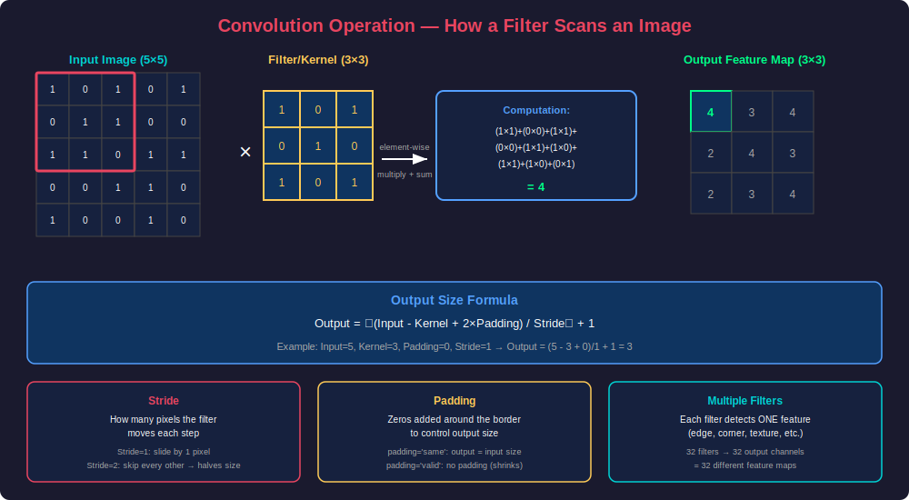
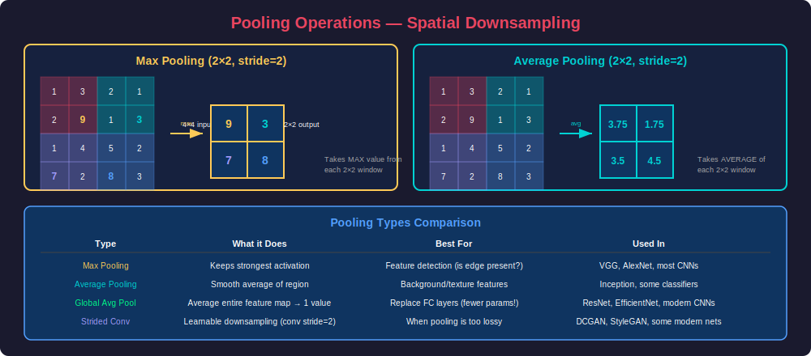
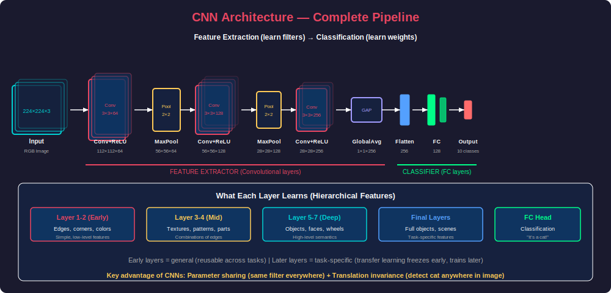
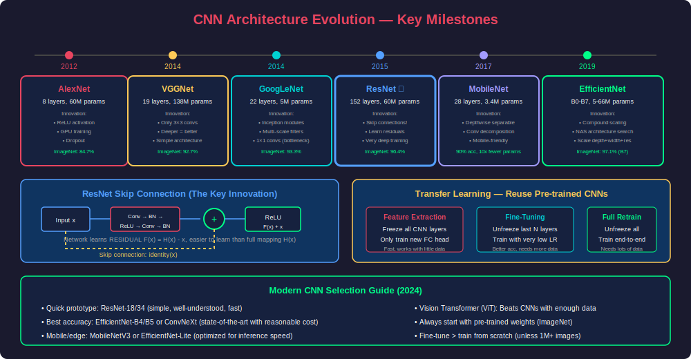
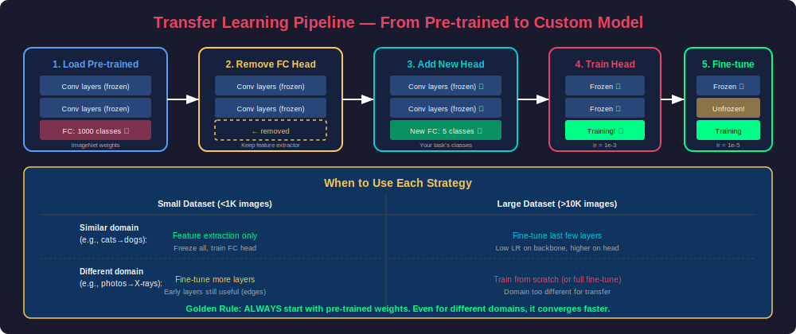

# Phase 16: Convolutional Neural Networks (CNNs)

## Overview

Convolutional Neural Networks are specialized deep learning architectures designed for processing grid-structured data — primarily images. Unlike fully-connected networks that treat every pixel independently, CNNs exploit spatial locality through learnable filters that scan across the input, detecting features regardless of their position. This translation invariance, combined with parameter sharing, makes CNNs extraordinarily efficient for visual tasks.

---

## 1. The Convolution Operation

### Core Intuition

A convolution is a mathematical operation where a small matrix (the **kernel/filter**) slides across the input, computing element-wise products and summing them at each position. Each filter acts as a feature detector — one might detect vertical edges, another horizontal edges, another corners.



### Mathematical Definition

For a 2D input $I$ and kernel $K$ of size $k \times k$:

$$\text{Output}(i, j) = \sum_{m=0}^{k-1} \sum_{n=0}^{k-1} I(i+m, j+n) \cdot K(m, n) + \text{bias}$$

### Implementation from Scratch

```python
import numpy as np

def conv2d_forward(input_image, kernel, bias=0, stride=1, padding=0):
    """
    Perform 2D convolution operation.
    
    Args:
        input_image: Shape (H, W) or (C, H, W)
        kernel: Shape (k_h, k_w) or (C, k_h, k_w)
        bias: Scalar bias term
        stride: Step size for sliding the kernel
        padding: Zero-padding added to input borders
    
    Returns:
        Feature map after convolution
    """
    if input_image.ndim == 2:
        input_image = input_image[np.newaxis, :]  # Add channel dim
    if kernel.ndim == 2:
        kernel = kernel[np.newaxis, :]
    
    C, H, W = input_image.shape
    _, k_h, k_w = kernel.shape
    
    # Apply padding
    if padding > 0:
        input_padded = np.pad(
            input_image,
            ((0, 0), (padding, padding), (padding, padding)),
            mode='constant'
        )
    else:
        input_padded = input_image
    
    # Calculate output dimensions
    out_h = (H + 2 * padding - k_h) // stride + 1
    out_w = (W + 2 * padding - k_w) // stride + 1
    
    output = np.zeros((out_h, out_w))
    
    for i in range(out_h):
        for j in range(out_w):
            h_start = i * stride
            h_end = h_start + k_h
            w_start = j * stride
            w_end = w_start + k_w
            
            receptive_field = input_padded[:, h_start:h_end, w_start:w_end]
            output[i, j] = np.sum(receptive_field * kernel) + bias
    
    return output


# Example: Edge detection
image = np.array([
    [1, 0, 1, 0, 1],
    [0, 1, 1, 0, 0],
    [1, 1, 0, 1, 1],
    [0, 0, 1, 1, 0],
    [1, 0, 0, 1, 0]
], dtype=np.float32)

# Vertical edge detector
vertical_edge_kernel = np.array([
    [-1, 0, 1],
    [-1, 0, 1],
    [-1, 0, 1]
], dtype=np.float32)

# Horizontal edge detector
horizontal_edge_kernel = np.array([
    [-1, -1, -1],
    [ 0,  0,  0],
    [ 1,  1,  1]
], dtype=np.float32)

output_v = conv2d_forward(image, vertical_edge_kernel)
output_h = conv2d_forward(image, horizontal_edge_kernel)

print(f"Input shape: {image.shape}")
print(f"Output shape: {output_v.shape}")
print(f"Vertical edges:\n{output_v}")
print(f"Horizontal edges:\n{output_h}")
```

### Output Size Formula

```
Output_size = floor((Input_size - Kernel_size + 2 * Padding) / Stride) + 1
```

| Input | Kernel | Padding | Stride | Output |
|-------|--------|---------|--------|--------|
| 32×32 | 3×3    | 0       | 1      | 30×30  |
| 32×32 | 3×3    | 1       | 1      | 32×32  |
| 32×32 | 5×5    | 2       | 1      | 32×32  |
| 32×32 | 3×3    | 1       | 2      | 16×16  |
| 224×224| 7×7   | 3       | 2      | 112×112|

### Key Hyperparameters

```python
import torch.nn as nn

# Standard convolution layer
conv = nn.Conv2d(
    in_channels=3,       # RGB input
    out_channels=64,     # Number of filters (output feature maps)
    kernel_size=3,       # Filter size (3×3)
    stride=1,            # Step size
    padding=1,           # Zero-padding (keeps spatial dims with 3×3)
    bias=True,           # Learnable bias per filter
    groups=1,            # Standard conv (groups=in_channels for depthwise)
    dilation=1           # Standard (>1 for dilated/atrous conv)
)

# Parameter count
params = (3 * 3 * 3 * 64) + 64  # (k*k*C_in*C_out) + bias
print(f"Parameters: {params}")  # 1,792
```

### Multi-Channel Convolution

```python
import torch
import torch.nn as nn

# Real-world example: RGB image through conv layer
batch_size = 8
input_tensor = torch.randn(batch_size, 3, 224, 224)  # B, C, H, W

# Each filter has depth = in_channels
# It produces ONE output feature map
conv_layer = nn.Conv2d(in_channels=3, out_channels=64, kernel_size=3, padding=1)

output = conv_layer(input_tensor)
print(f"Input:  {input_tensor.shape}")   # [8, 3, 224, 224]
print(f"Output: {output.shape}")          # [8, 64, 224, 224]

# Weight shape: (out_channels, in_channels, k_h, k_w)
print(f"Weight: {conv_layer.weight.shape}")  # [64, 3, 3, 3]
print(f"Bias:   {conv_layer.bias.shape}")    # [64]
```

### 1×1 Convolutions (Network-in-Network)

```python
# 1×1 convolution: channel-wise linear combination
# Used for: dimensionality reduction, adding non-linearity, cross-channel interaction

# Reduce channels from 256 to 64 (bottleneck)
bottleneck = nn.Conv2d(256, 64, kernel_size=1)

# Params: 256 * 64 + 64 = 16,448
# vs Conv2d(256, 64, 3, padding=1): 256 * 64 * 9 + 64 = 147,520
# 9× fewer parameters!

input_feat = torch.randn(1, 256, 56, 56)
output_feat = bottleneck(input_feat)
print(f"Channel reduction: {input_feat.shape} → {output_feat.shape}")
# [1, 256, 56, 56] → [1, 64, 56, 56]
```

---

## 2. Pooling Operations

### Purpose of Pooling

Pooling reduces spatial dimensions while retaining the most important information. Benefits:
- Reduces computation in subsequent layers
- Provides local translation invariance
- Controls overfitting by reducing parameters
- Increases the effective receptive field



### Types of Pooling

```python
import torch
import torch.nn as nn

# Sample feature map
feature_map = torch.tensor([[
    [[1., 3., 2., 1.],
     [2., 9., 1., 3.],
     [1., 4., 5., 2.],
     [7., 2., 8., 3.]]
]])  # Shape: [1, 1, 4, 4]

# Max Pooling - keeps strongest activation
max_pool = nn.MaxPool2d(kernel_size=2, stride=2)
print(f"Max Pool:\n{max_pool(feature_map)}")
# [[9., 3.],
#  [7., 8.]]

# Average Pooling - smooth spatial average
avg_pool = nn.AvgPool2d(kernel_size=2, stride=2)
print(f"Avg Pool:\n{avg_pool(feature_map)}")
# [[3.75, 1.75],
#  [3.50, 4.50]]

# Global Average Pooling - entire feature map → single value
gap = nn.AdaptiveAvgPool2d(1)
print(f"Global Avg Pool:\n{gap(feature_map)}")
# [[3.625]]  (mean of all 16 values)

# Adaptive pooling - specify output size, auto-computes kernel/stride
adaptive = nn.AdaptiveAvgPool2d((7, 7))  # Any input → 7×7 output
large_input = torch.randn(1, 512, 14, 14)
print(f"Adaptive: {large_input.shape} → {adaptive(large_input).shape}")
# [1, 512, 14, 14] → [1, 512, 7, 7]
```

### Max Pool vs Strided Convolution

```python
import torch.nn as nn

# Traditional: Conv + MaxPool
traditional = nn.Sequential(
    nn.Conv2d(64, 128, 3, padding=1),  # [B, 128, H, W]
    nn.ReLU(),
    nn.MaxPool2d(2, 2)                  # [B, 128, H/2, W/2]
)

# Modern: Strided Convolution (learnable downsampling)
modern = nn.Sequential(
    nn.Conv2d(64, 128, 3, stride=2, padding=1),  # [B, 128, H/2, W/2]
    nn.ReLU()
)

# Strided conv advantages:
# - Learnable (can choose what to discard)
# - No information thrown away arbitrarily
# Used in: ResNets (downsampling), GANs (DCGAN discriminator)
```

### Pooling in Practice

```python
class ConvBlock(nn.Module):
    """Standard Conv → BN → ReLU → Pool block."""
    
    def __init__(self, in_ch, out_ch, pool_type='max'):
        super().__init__()
        self.conv = nn.Conv2d(in_ch, out_ch, 3, padding=1)
        self.bn = nn.BatchNorm2d(out_ch)
        self.relu = nn.ReLU(inplace=True)
        
        if pool_type == 'max':
            self.pool = nn.MaxPool2d(2, 2)
        elif pool_type == 'avg':
            self.pool = nn.AvgPool2d(2, 2)
        elif pool_type == 'strided':
            self.pool = nn.Conv2d(out_ch, out_ch, 3, stride=2, padding=1)
        else:
            self.pool = nn.Identity()
    
    def forward(self, x):
        x = self.conv(x)
        x = self.bn(x)
        x = self.relu(x)
        x = self.pool(x)
        return x
```

---

## 3. CNN Architecture — Complete Pipeline

### Full Architecture Overview



### Building a CNN from Scratch (PyTorch)

```python
import torch
import torch.nn as nn
import torch.nn.functional as F


class SimpleCNN(nn.Module):
    """
    Simple CNN for CIFAR-10 classification.
    Input: 32×32×3 RGB images
    Output: 10 class probabilities
    """
    
    def __init__(self, num_classes=10):
        super().__init__()
        
        # Feature Extractor
        self.features = nn.Sequential(
            # Block 1: 32×32×3 → 32×32×32 → 16×16×32
            nn.Conv2d(3, 32, kernel_size=3, padding=1),
            nn.BatchNorm2d(32),
            nn.ReLU(inplace=True),
            nn.Conv2d(32, 32, kernel_size=3, padding=1),
            nn.BatchNorm2d(32),
            nn.ReLU(inplace=True),
            nn.MaxPool2d(2, 2),
            nn.Dropout2d(0.25),
            
            # Block 2: 16×16×32 → 16×16×64 → 8×8×64
            nn.Conv2d(32, 64, kernel_size=3, padding=1),
            nn.BatchNorm2d(64),
            nn.ReLU(inplace=True),
            nn.Conv2d(64, 64, kernel_size=3, padding=1),
            nn.BatchNorm2d(64),
            nn.ReLU(inplace=True),
            nn.MaxPool2d(2, 2),
            nn.Dropout2d(0.25),
            
            # Block 3: 8×8×64 → 8×8×128 → 4×4×128
            nn.Conv2d(64, 128, kernel_size=3, padding=1),
            nn.BatchNorm2d(128),
            nn.ReLU(inplace=True),
            nn.Conv2d(128, 128, kernel_size=3, padding=1),
            nn.BatchNorm2d(128),
            nn.ReLU(inplace=True),
            nn.MaxPool2d(2, 2),
            nn.Dropout2d(0.25),
        )
        
        # Classifier
        self.classifier = nn.Sequential(
            nn.AdaptiveAvgPool2d(1),  # 4×4×128 → 1×1×128
            nn.Flatten(),              # → 128
            nn.Linear(128, 256),
            nn.ReLU(inplace=True),
            nn.Dropout(0.5),
            nn.Linear(256, num_classes)
        )
    
    def forward(self, x):
        x = self.features(x)
        x = self.classifier(x)
        return x


model = SimpleCNN(num_classes=10)
sample = torch.randn(1, 3, 32, 32)
output = model(sample)
print(f"Output shape: {output.shape}")  # [1, 10]

# Count parameters
total_params = sum(p.numel() for p in model.parameters())
trainable_params = sum(p.numel() for p in model.parameters() if p.requires_grad)
print(f"Total params: {total_params:,}")
print(f"Trainable params: {trainable_params:,}")
```

### Receptive Field

The receptive field is the region of the input that influences a particular output neuron.

```python
def compute_receptive_field(layers):
    """
    Compute receptive field size for a sequence of conv/pool layers.
    
    Each layer is: (kernel_size, stride, padding)
    """
    rf = 1  # Start with 1 pixel
    stride_product = 1
    
    for k, s, p in layers:
        rf = rf + (k - 1) * stride_product
        stride_product *= s
    
    return rf


# VGG-like architecture
vgg_layers = [
    (3, 1, 1),  # Conv 3×3
    (3, 1, 1),  # Conv 3×3
    (2, 2, 0),  # MaxPool 2×2
    (3, 1, 1),  # Conv 3×3
    (3, 1, 1),  # Conv 3×3
    (2, 2, 0),  # MaxPool 2×2
    (3, 1, 1),  # Conv 3×3
    (3, 1, 1),  # Conv 3×3
    (3, 1, 1),  # Conv 3×3
    (2, 2, 0),  # MaxPool 2×2
]

rf = compute_receptive_field(vgg_layers)
print(f"Receptive field after 10 layers: {rf}×{rf} pixels")
# Each output neuron "sees" a 44×44 region of the input
```

### Batch Normalization in CNNs

```python
class ConvBNReLU(nn.Module):
    """The fundamental CNN building block."""
    
    def __init__(self, in_channels, out_channels, kernel_size=3, 
                 stride=1, padding=1):
        super().__init__()
        self.conv = nn.Conv2d(in_channels, out_channels, kernel_size,
                             stride=stride, padding=padding, bias=False)
        self.bn = nn.BatchNorm2d(out_channels)
        self.relu = nn.ReLU(inplace=True)
    
    def forward(self, x):
        return self.relu(self.bn(self.conv(x)))


# Why bias=False when using BatchNorm:
# BN normalizes to zero mean → the bias in conv is cancelled out
# BN has its own learnable bias (beta) → conv bias is redundant
```

---

## 4. CNN Architecture Evolution

### Key Milestones



### ResNet — The Most Important Innovation

```python
import torch
import torch.nn as nn


class BasicBlock(nn.Module):
    """ResNet Basic Block (used in ResNet-18, ResNet-34)."""
    
    expansion = 1
    
    def __init__(self, in_channels, out_channels, stride=1, downsample=None):
        super().__init__()
        self.conv1 = nn.Conv2d(in_channels, out_channels, 3, 
                              stride=stride, padding=1, bias=False)
        self.bn1 = nn.BatchNorm2d(out_channels)
        self.relu = nn.ReLU(inplace=True)
        self.conv2 = nn.Conv2d(out_channels, out_channels, 3,
                              padding=1, bias=False)
        self.bn2 = nn.BatchNorm2d(out_channels)
        self.downsample = downsample
    
    def forward(self, x):
        identity = x
        
        out = self.relu(self.bn1(self.conv1(x)))
        out = self.bn2(self.conv2(out))
        
        # Skip connection: if dimensions don't match, project
        if self.downsample is not None:
            identity = self.downsample(x)
        
        out += identity  # THE key innovation
        out = self.relu(out)
        return out


class BottleneckBlock(nn.Module):
    """ResNet Bottleneck Block (used in ResNet-50, 101, 152).
    
    1×1 conv (reduce) → 3×3 conv (process) → 1×1 conv (expand)
    """
    
    expansion = 4
    
    def __init__(self, in_channels, mid_channels, stride=1, downsample=None):
        super().__init__()
        out_channels = mid_channels * self.expansion
        
        self.conv1 = nn.Conv2d(in_channels, mid_channels, 1, bias=False)
        self.bn1 = nn.BatchNorm2d(mid_channels)
        self.conv2 = nn.Conv2d(mid_channels, mid_channels, 3,
                              stride=stride, padding=1, bias=False)
        self.bn2 = nn.BatchNorm2d(mid_channels)
        self.conv3 = nn.Conv2d(mid_channels, out_channels, 1, bias=False)
        self.bn3 = nn.BatchNorm2d(out_channels)
        self.relu = nn.ReLU(inplace=True)
        self.downsample = downsample
    
    def forward(self, x):
        identity = x
        
        out = self.relu(self.bn1(self.conv1(x)))   # 256 → 64
        out = self.relu(self.bn2(self.conv2(out)))  # 64 → 64 (3×3)
        out = self.bn3(self.conv3(out))              # 64 → 256
        
        if self.downsample is not None:
            identity = self.downsample(x)
        
        out += identity
        out = self.relu(out)
        return out


class ResNet(nn.Module):
    """Simplified ResNet implementation."""
    
    def __init__(self, block, layers, num_classes=1000):
        super().__init__()
        self.in_channels = 64
        
        # Stem
        self.conv1 = nn.Conv2d(3, 64, 7, stride=2, padding=3, bias=False)
        self.bn1 = nn.BatchNorm2d(64)
        self.relu = nn.ReLU(inplace=True)
        self.maxpool = nn.MaxPool2d(3, stride=2, padding=1)
        
        # Residual layers
        self.layer1 = self._make_layer(block, 64, layers[0])
        self.layer2 = self._make_layer(block, 128, layers[1], stride=2)
        self.layer3 = self._make_layer(block, 256, layers[2], stride=2)
        self.layer4 = self._make_layer(block, 512, layers[3], stride=2)
        
        # Classifier
        self.avgpool = nn.AdaptiveAvgPool2d(1)
        self.fc = nn.Linear(512 * block.expansion, num_classes)
        
        self._init_weights()
    
    def _make_layer(self, block, channels, num_blocks, stride=1):
        downsample = None
        if stride != 1 or self.in_channels != channels * block.expansion:
            downsample = nn.Sequential(
                nn.Conv2d(self.in_channels, channels * block.expansion,
                         1, stride=stride, bias=False),
                nn.BatchNorm2d(channels * block.expansion)
            )
        
        layers = [block(self.in_channels, channels, stride, downsample)]
        self.in_channels = channels * block.expansion
        
        for _ in range(1, num_blocks):
            layers.append(block(self.in_channels, channels))
        
        return nn.Sequential(*layers)
    
    def _init_weights(self):
        for m in self.modules():
            if isinstance(m, nn.Conv2d):
                nn.init.kaiming_normal_(m.weight, mode='fan_out', nonlinearity='relu')
            elif isinstance(m, nn.BatchNorm2d):
                nn.init.constant_(m.weight, 1)
                nn.init.constant_(m.bias, 0)
    
    def forward(self, x):
        x = self.maxpool(self.relu(self.bn1(self.conv1(x))))
        x = self.layer1(x)
        x = self.layer2(x)
        x = self.layer3(x)
        x = self.layer4(x)
        x = self.avgpool(x)
        x = torch.flatten(x, 1)
        x = self.fc(x)
        return x


def resnet18(num_classes=1000):
    return ResNet(BasicBlock, [2, 2, 2, 2], num_classes)

def resnet50(num_classes=1000):
    return ResNet(BottleneckBlock, [3, 4, 6, 3], num_classes)

def resnet152(num_classes=1000):
    return ResNet(BottleneckBlock, [3, 8, 36, 3], num_classes)


model = resnet50(num_classes=10)
x = torch.randn(2, 3, 224, 224)
print(f"ResNet-50 output: {model(x).shape}")  # [2, 10]
print(f"Parameters: {sum(p.numel() for p in model.parameters()):,}")
```

### Depthwise Separable Convolution (MobileNet)

```python
class DepthwiseSeparableConv(nn.Module):
    """
    MobileNet's key building block.
    
    Standard conv: C_in × k × k × C_out parameters
    Depthwise separable: C_in × k × k + C_in × C_out parameters
    
    Example: 3×3 conv, 64→128 channels
    - Standard: 64 × 3 × 3 × 128 = 73,728 params
    - Depthwise sep: 64 × 3 × 3 + 64 × 128 = 8,768 params (8.4× fewer!)
    """
    
    def __init__(self, in_channels, out_channels, stride=1):
        super().__init__()
        # Depthwise: one filter per input channel (spatial only)
        self.depthwise = nn.Conv2d(
            in_channels, in_channels, kernel_size=3,
            stride=stride, padding=1, groups=in_channels, bias=False
        )
        self.bn1 = nn.BatchNorm2d(in_channels)
        
        # Pointwise: 1×1 conv for channel mixing
        self.pointwise = nn.Conv2d(in_channels, out_channels, 1, bias=False)
        self.bn2 = nn.BatchNorm2d(out_channels)
        self.relu = nn.ReLU6(inplace=True)
    
    def forward(self, x):
        x = self.relu(self.bn1(self.depthwise(x)))
        x = self.relu(self.bn2(self.pointwise(x)))
        return x


# Compare parameter counts
standard = nn.Conv2d(64, 128, 3, padding=1)
depthwise_sep = DepthwiseSeparableConv(64, 128)

std_params = sum(p.numel() for p in standard.parameters())
dw_params = sum(p.numel() for p in depthwise_sep.parameters())
print(f"Standard Conv: {std_params:,} params")
print(f"Depthwise Sep: {dw_params:,} params")
print(f"Reduction: {std_params / dw_params:.1f}×")
```

### Architecture Comparison Table

| Architecture | Year | Layers | Params | Top-5 Acc | Key Innovation |
|---|---|---|---|---|---|
| AlexNet | 2012 | 8 | 60M | 84.7% | ReLU, dropout, GPU training |
| VGGNet | 2014 | 19 | 138M | 92.7% | Uniform 3×3 convs, deeper is better |
| GoogLeNet | 2014 | 22 | 5M | 93.3% | Inception modules, 1×1 convs |
| ResNet | 2015 | 152 | 60M | 96.4% | Skip connections, residual learning |
| DenseNet | 2017 | 201 | 20M | 96.5% | Dense connections (all-to-all) |
| MobileNetV2 | 2018 | 53 | 3.4M | 91.0% | Inverted residuals, linear bottleneck |
| EfficientNet-B7 | 2019 | 813 | 66M | 97.1% | Compound scaling, NAS |
| ConvNeXt | 2022 | — | 89M | 97.2% | Modernized ResNet with Transformer tricks |

---

## 5. Transfer Learning

### Why Transfer Learning Works

Pre-trained CNNs learn hierarchical features:
- **Early layers** → edges, textures, colors (universal across all image domains)
- **Middle layers** → patterns, parts, shapes (mostly transferable)
- **Later layers** → object-specific features (task-specific, less transferable)



### Strategy 1: Feature Extraction (Freeze Everything)

```python
import torch
import torch.nn as nn
import torchvision.models as models
from torchvision import transforms, datasets
from torch.utils.data import DataLoader


def create_feature_extractor(num_classes, model_name='resnet50'):
    """Load pre-trained model and replace classification head."""
    
    # Load pre-trained weights
    if model_name == 'resnet50':
        weights = models.ResNet50_Weights.IMAGENET1K_V2
        model = models.resnet50(weights=weights)
        num_features = model.fc.in_features  # 2048
        
        # Freeze ALL backbone parameters
        for param in model.parameters():
            param.requires_grad = False
        
        # Replace FC head (unfrozen by default)
        model.fc = nn.Sequential(
            nn.Dropout(0.3),
            nn.Linear(num_features, 256),
            nn.ReLU(inplace=True),
            nn.Dropout(0.2),
            nn.Linear(256, num_classes)
        )
    
    elif model_name == 'efficientnet_b0':
        weights = models.EfficientNet_B0_Weights.IMAGENET1K_V1
        model = models.efficientnet_b0(weights=weights)
        num_features = model.classifier[1].in_features  # 1280
        
        for param in model.parameters():
            param.requires_grad = False
        
        model.classifier = nn.Sequential(
            nn.Dropout(0.3),
            nn.Linear(num_features, num_classes)
        )
    
    # Verify: only head is trainable
    trainable = sum(p.numel() for p in model.parameters() if p.requires_grad)
    total = sum(p.numel() for p in model.parameters())
    print(f"Trainable: {trainable:,} / {total:,} ({100*trainable/total:.1f}%)")
    
    return model


model = create_feature_extractor(num_classes=5, model_name='resnet50')
# Trainable: 525,573 / 24,043,845 (2.2%)
```

### Strategy 2: Fine-Tuning (Gradual Unfreezing)

```python
def create_finetuned_model(num_classes, unfreeze_from='layer3'):
    """Fine-tune last N layers of ResNet."""
    
    weights = models.ResNet50_Weights.IMAGENET1K_V2
    model = models.resnet50(weights=weights)
    
    # Freeze everything first
    for param in model.parameters():
        param.requires_grad = False
    
    # Unfreeze from a specific layer onward
    unfreeze = False
    for name, module in model.named_children():
        if name == unfreeze_from:
            unfreeze = True
        if unfreeze:
            for param in module.parameters():
                param.requires_grad = True
    
    # Replace FC
    num_features = model.fc.in_features
    model.fc = nn.Sequential(
        nn.Dropout(0.3),
        nn.Linear(num_features, num_classes)
    )
    
    trainable = sum(p.numel() for p in model.parameters() if p.requires_grad)
    total = sum(p.numel() for p in model.parameters())
    print(f"Trainable: {trainable:,} / {total:,} ({100*trainable/total:.1f}%)")
    
    return model


# Unfreeze from layer3: ~60% of params trainable
model = create_finetuned_model(num_classes=5, unfreeze_from='layer3')

# Discriminative learning rates: lower LR for backbone, higher for head
optimizer = torch.optim.AdamW([
    {'params': model.layer3.parameters(), 'lr': 1e-5},
    {'params': model.layer4.parameters(), 'lr': 5e-5},
    {'params': model.fc.parameters(), 'lr': 1e-3},
], weight_decay=0.01)
```

### Strategy 3: Progressive Unfreezing

```python
class ProgressiveUnfreezer:
    """Gradually unfreeze layers during training."""
    
    def __init__(self, model, schedule):
        """
        schedule: dict mapping epoch → layer_name to unfreeze from.
        Example: {0: 'fc', 3: 'layer4', 6: 'layer3', 10: 'layer2'}
        """
        self.model = model
        self.schedule = schedule
        self._freeze_all()
    
    def _freeze_all(self):
        for param in self.model.parameters():
            param.requires_grad = False
    
    def step(self, epoch):
        if epoch in self.schedule:
            layer_name = self.schedule[epoch]
            unfreeze = False
            for name, module in self.model.named_children():
                if name == layer_name:
                    unfreeze = True
                if unfreeze:
                    for param in module.parameters():
                        param.requires_grad = True
            
            trainable = sum(
                p.numel() for p in self.model.parameters() if p.requires_grad
            )
            print(f"Epoch {epoch}: Unfroze from '{layer_name}', "
                  f"{trainable:,} trainable params")


# Usage
model = models.resnet50(weights=models.ResNet50_Weights.IMAGENET1K_V2)
model.fc = nn.Linear(2048, 5)

unfreezer = ProgressiveUnfreezer(model, {
    0: 'fc',       # First: only train head
    5: 'layer4',   # Then: unfreeze last block
    10: 'layer3',  # Then: unfreeze more
    15: 'layer2',  # Almost everything
})
```

### Complete Training Pipeline with Transfer Learning

```python
import torch
import torch.nn as nn
from torch.utils.data import DataLoader
from torchvision import transforms, datasets, models
from torch.optim.lr_scheduler import CosineAnnealingLR
from pathlib import Path


def get_transforms(image_size=224):
    """Data augmentation for transfer learning."""
    
    # Use the pre-trained model's expected normalization
    normalize = transforms.Normalize(
        mean=[0.485, 0.456, 0.406],
        std=[0.229, 0.224, 0.225]
    )
    
    train_transform = transforms.Compose([
        transforms.RandomResizedCrop(image_size, scale=(0.8, 1.0)),
        transforms.RandomHorizontalFlip(),
        transforms.RandomRotation(15),
        transforms.ColorJitter(brightness=0.2, contrast=0.2, saturation=0.2),
        transforms.ToTensor(),
        normalize,
    ])
    
    val_transform = transforms.Compose([
        transforms.Resize(image_size + 32),
        transforms.CenterCrop(image_size),
        transforms.ToTensor(),
        normalize,
    ])
    
    return train_transform, val_transform


def train_transfer_learning(
    data_dir,
    num_classes,
    epochs=30,
    batch_size=32,
    lr=1e-3,
    device='cuda'
):
    """Full transfer learning training pipeline."""
    
    # Data
    train_transform, val_transform = get_transforms()
    
    train_dataset = datasets.ImageFolder(
        Path(data_dir) / 'train', transform=train_transform
    )
    val_dataset = datasets.ImageFolder(
        Path(data_dir) / 'val', transform=val_transform
    )
    
    train_loader = DataLoader(
        train_dataset, batch_size=batch_size,
        shuffle=True, num_workers=4, pin_memory=True
    )
    val_loader = DataLoader(
        val_dataset, batch_size=batch_size,
        shuffle=False, num_workers=4, pin_memory=True
    )
    
    # Model
    model = models.resnet50(weights=models.ResNet50_Weights.IMAGENET1K_V2)
    
    # Phase 1: Feature extraction (freeze backbone)
    for param in model.parameters():
        param.requires_grad = False
    
    model.fc = nn.Sequential(
        nn.Dropout(0.3),
        nn.Linear(2048, 512),
        nn.ReLU(inplace=True),
        nn.Dropout(0.2),
        nn.Linear(512, num_classes)
    )
    model = model.to(device)
    
    criterion = nn.CrossEntropyLoss(label_smoothing=0.1)
    optimizer = torch.optim.AdamW(model.fc.parameters(), lr=lr)
    scheduler = CosineAnnealingLR(optimizer, T_max=epochs)
    
    best_acc = 0.0
    
    for epoch in range(epochs):
        # Unfreeze backbone at epoch 10
        if epoch == 10:
            for param in model.layer4.parameters():
                param.requires_grad = True
            optimizer.add_param_group({
                'params': model.layer4.parameters(),
                'lr': lr * 0.01  # 100× lower LR for backbone
            })
            print("Unfroze layer4")
        
        # Training
        model.train()
        running_loss = 0.0
        correct = 0
        total = 0
        
        for images, labels in train_loader:
            images, labels = images.to(device), labels.to(device)
            
            optimizer.zero_grad()
            outputs = model(images)
            loss = criterion(outputs, labels)
            loss.backward()
            
            # Gradient clipping for stability
            torch.nn.utils.clip_grad_norm_(model.parameters(), max_norm=1.0)
            optimizer.step()
            
            running_loss += loss.item() * images.size(0)
            _, predicted = outputs.max(1)
            total += labels.size(0)
            correct += predicted.eq(labels).sum().item()
        
        train_loss = running_loss / total
        train_acc = 100.0 * correct / total
        
        # Validation
        model.eval()
        val_correct = 0
        val_total = 0
        
        with torch.no_grad():
            for images, labels in val_loader:
                images, labels = images.to(device), labels.to(device)
                outputs = model(images)
                _, predicted = outputs.max(1)
                val_total += labels.size(0)
                val_correct += predicted.eq(labels).sum().item()
        
        val_acc = 100.0 * val_correct / val_total
        scheduler.step()
        
        print(f"Epoch {epoch+1}/{epochs} | "
              f"Train Loss: {train_loss:.4f} | "
              f"Train Acc: {train_acc:.1f}% | "
              f"Val Acc: {val_acc:.1f}%")
        
        # Save best model
        if val_acc > best_acc:
            best_acc = val_acc
            torch.save(model.state_dict(), 'best_model.pth')
    
    print(f"\nBest validation accuracy: {best_acc:.1f}%")
    return model
```

### Data Augmentation for Small Datasets

```python
from torchvision import transforms
import torch


class CutMix:
    """CutMix augmentation — cut and paste patches between images."""
    
    def __init__(self, alpha=1.0):
        self.alpha = alpha
    
    def __call__(self, images, labels, num_classes):
        batch_size = images.size(0)
        lam = torch.distributions.Beta(self.alpha, self.alpha).sample()
        
        # Random permutation for mixing
        indices = torch.randperm(batch_size)
        
        # Random bounding box
        W, H = images.size(3), images.size(2)
        cut_w = int(W * torch.sqrt(1 - lam))
        cut_h = int(H * torch.sqrt(1 - lam))
        cx = torch.randint(W, (1,)).item()
        cy = torch.randint(H, (1,)).item()
        
        x1 = max(cx - cut_w // 2, 0)
        x2 = min(cx + cut_w // 2, W)
        y1 = max(cy - cut_h // 2, 0)
        y2 = min(cy + cut_h // 2, H)
        
        # Apply cutmix
        images[:, :, y1:y2, x1:x2] = images[indices, :, y1:y2, x1:x2]
        
        # Adjust labels (soft targets)
        lam = 1 - (x2 - x1) * (y2 - y1) / (W * H)
        labels_one_hot = torch.nn.functional.one_hot(labels, num_classes).float()
        labels_shuffled = torch.nn.functional.one_hot(labels[indices], num_classes).float()
        mixed_labels = lam * labels_one_hot + (1 - lam) * labels_shuffled
        
        return images, mixed_labels


# Test-Time Augmentation (TTA)
def predict_with_tta(model, image, device='cuda'):
    """Apply multiple augmentations at test time and average predictions."""
    
    model.eval()
    tta_transforms = [
        transforms.Compose([]),  # Original
        transforms.RandomHorizontalFlip(p=1.0),
        transforms.RandomVerticalFlip(p=1.0),
        transforms.RandomRotation((90, 90)),
        transforms.RandomRotation((-90, -90)),
    ]
    
    predictions = []
    with torch.no_grad():
        for t in tta_transforms:
            augmented = t(image).unsqueeze(0).to(device)
            pred = torch.softmax(model(augmented), dim=1)
            predictions.append(pred)
    
    # Average predictions
    avg_pred = torch.stack(predictions).mean(dim=0)
    return avg_pred
```

---

## 6. Image Classification — End-to-End Project

### Production-Ready Image Classifier

```python
import torch
import torch.nn as nn
from torchvision import models, transforms
from PIL import Image
from pathlib import Path
import json


class ImageClassifier:
    """Production image classifier with transfer learning."""
    
    def __init__(self, model_path, class_names, device=None):
        self.device = device or ('cuda' if torch.cuda.is_available() else 'cpu')
        self.class_names = class_names
        self.num_classes = len(class_names)
        
        # Build model architecture
        self.model = models.efficientnet_b0(weights=None)
        self.model.classifier = nn.Sequential(
            nn.Dropout(0.3),
            nn.Linear(1280, self.num_classes)
        )
        
        # Load trained weights
        state_dict = torch.load(model_path, map_location=self.device)
        self.model.load_state_dict(state_dict)
        self.model.to(self.device)
        self.model.eval()
        
        # Preprocessing (must match training)
        self.transform = transforms.Compose([
            transforms.Resize(256),
            transforms.CenterCrop(224),
            transforms.ToTensor(),
            transforms.Normalize([0.485, 0.456, 0.406],
                               [0.229, 0.224, 0.225]),
        ])
    
    @torch.no_grad()
    def predict(self, image_path, top_k=5):
        """Predict class probabilities for an image."""
        image = Image.open(image_path).convert('RGB')
        tensor = self.transform(image).unsqueeze(0).to(self.device)
        
        logits = self.model(tensor)
        probs = torch.softmax(logits, dim=1)[0]
        
        top_probs, top_indices = probs.topk(top_k)
        
        results = []
        for prob, idx in zip(top_probs, top_indices):
            results.append({
                'class': self.class_names[idx.item()],
                'confidence': prob.item()
            })
        
        return results
    
    @torch.no_grad()
    def predict_batch(self, image_paths, batch_size=32):
        """Batch prediction for multiple images."""
        all_results = []
        
        for i in range(0, len(image_paths), batch_size):
            batch_paths = image_paths[i:i + batch_size]
            tensors = []
            
            for path in batch_paths:
                img = Image.open(path).convert('RGB')
                tensors.append(self.transform(img))
            
            batch = torch.stack(tensors).to(self.device)
            logits = self.model(batch)
            probs = torch.softmax(logits, dim=1)
            
            for j, prob in enumerate(probs):
                top_prob, top_idx = prob.max(0)
                all_results.append({
                    'path': str(batch_paths[j]),
                    'class': self.class_names[top_idx.item()],
                    'confidence': top_prob.item()
                })
        
        return all_results
    
    def export_onnx(self, output_path='model.onnx'):
        """Export model for deployment."""
        dummy = torch.randn(1, 3, 224, 224).to(self.device)
        torch.onnx.export(
            self.model, dummy, output_path,
            input_names=['image'],
            output_names=['logits'],
            dynamic_axes={
                'image': {0: 'batch_size'},
                'logits': {0: 'batch_size'}
            },
            opset_version=13
        )
        print(f"Exported ONNX model to {output_path}")


# Usage
class_names = ['cat', 'dog', 'bird', 'fish', 'horse']
classifier = ImageClassifier('best_model.pth', class_names)
results = classifier.predict('test_image.jpg')
for r in results:
    print(f"  {r['class']}: {r['confidence']:.2%}")
```

### Visualizing What CNNs Learn

```python
import torch
import torch.nn as nn
import numpy as np
from torchvision import models, transforms
from PIL import Image
import matplotlib.pyplot as plt


class GradCAM:
    """
    Gradient-weighted Class Activation Mapping.
    Visualizes which image regions the CNN focuses on for its prediction.
    """
    
    def __init__(self, model, target_layer):
        self.model = model
        self.model.eval()
        self.gradients = None
        self.activations = None
        
        # Register hooks on target layer
        target_layer.register_forward_hook(self._forward_hook)
        target_layer.register_full_backward_hook(self._backward_hook)
    
    def _forward_hook(self, module, input, output):
        self.activations = output.detach()
    
    def _backward_hook(self, module, grad_input, grad_output):
        self.gradients = grad_output[0].detach()
    
    def generate(self, input_tensor, target_class=None):
        """Generate Grad-CAM heatmap."""
        output = self.model(input_tensor)
        
        if target_class is None:
            target_class = output.argmax(dim=1).item()
        
        # Backward pass for target class
        self.model.zero_grad()
        one_hot = torch.zeros_like(output)
        one_hot[0, target_class] = 1.0
        output.backward(gradient=one_hot)
        
        # Weight activations by average gradients
        weights = self.gradients.mean(dim=[2, 3], keepdim=True)  # GAP of gradients
        cam = (weights * self.activations).sum(dim=1, keepdim=True)
        cam = torch.relu(cam)  # Only positive contributions
        
        # Normalize to [0, 1]
        cam = cam - cam.min()
        cam = cam / (cam.max() + 1e-8)
        
        # Resize to input dimensions
        cam = nn.functional.interpolate(
            cam, size=input_tensor.shape[2:], mode='bilinear', align_corners=False
        )
        
        return cam.squeeze().numpy(), target_class


def visualize_gradcam(image_path, model, target_layer):
    """Visualize Grad-CAM for an image."""
    
    transform = transforms.Compose([
        transforms.Resize(256),
        transforms.CenterCrop(224),
        transforms.ToTensor(),
        transforms.Normalize([0.485, 0.456, 0.406], [0.229, 0.224, 0.225]),
    ])
    
    image = Image.open(image_path).convert('RGB')
    input_tensor = transform(image).unsqueeze(0)
    
    gradcam = GradCAM(model, target_layer)
    heatmap, predicted_class = gradcam.generate(input_tensor)
    
    # Overlay heatmap on image
    fig, axes = plt.subplots(1, 3, figsize=(12, 4))
    
    # Original image
    axes[0].imshow(image.resize((224, 224)))
    axes[0].set_title('Original')
    axes[0].axis('off')
    
    # Heatmap
    axes[1].imshow(heatmap, cmap='jet')
    axes[1].set_title(f'Grad-CAM (class: {predicted_class})')
    axes[1].axis('off')
    
    # Overlay
    img_array = np.array(image.resize((224, 224))) / 255.0
    overlay = 0.6 * img_array + 0.4 * plt.cm.jet(heatmap)[:, :, :3]
    axes[2].imshow(np.clip(overlay, 0, 1))
    axes[2].set_title('Overlay')
    axes[2].axis('off')
    
    plt.tight_layout()
    plt.savefig('gradcam_output.png', dpi=150, bbox_inches='tight')
    plt.close()


# Usage
model = models.resnet50(weights=models.ResNet50_Weights.IMAGENET1K_V2)
model.eval()
target_layer = model.layer4[-1]  # Last residual block
visualize_gradcam('cat.jpg', model, target_layer)
```

### Feature Map Visualization

```python
def visualize_feature_maps(model, image_path, layer_names=None):
    """Visualize intermediate feature maps of a CNN."""
    
    transform = transforms.Compose([
        transforms.Resize(256),
        transforms.CenterCrop(224),
        transforms.ToTensor(),
        transforms.Normalize([0.485, 0.456, 0.406], [0.229, 0.224, 0.225]),
    ])
    
    image = Image.open(image_path).convert('RGB')
    input_tensor = transform(image).unsqueeze(0)
    
    # Hook to capture intermediate outputs
    feature_maps = {}
    
    def get_hook(name):
        def hook(module, input, output):
            feature_maps[name] = output.detach()
        return hook
    
    # Register hooks
    hooks = []
    if layer_names is None:
        layer_names = ['layer1', 'layer2', 'layer3', 'layer4']
    
    for name, module in model.named_children():
        if name in layer_names:
            hooks.append(module.register_forward_hook(get_hook(name)))
    
    # Forward pass
    with torch.no_grad():
        model(input_tensor)
    
    # Visualize first 16 filters from each layer
    fig, axes = plt.subplots(len(layer_names), 16, figsize=(20, 5))
    
    for i, name in enumerate(layer_names):
        fmap = feature_maps[name][0]  # Remove batch dim
        for j in range(min(16, fmap.size(0))):
            axes[i, j].imshow(fmap[j].cpu().numpy(), cmap='viridis')
            axes[i, j].axis('off')
            if j == 0:
                axes[i, j].set_ylabel(name, fontsize=8)
    
    plt.suptitle('Feature Maps at Different Depths')
    plt.tight_layout()
    plt.savefig('feature_maps.png', dpi=150)
    plt.close()
    
    # Clean up hooks
    for h in hooks:
        h.remove()
    
    return feature_maps
```

---

## 7. Advanced CNN Techniques

### Mixed Precision Training

```python
import torch
from torch.cuda.amp import autocast, GradScaler

def train_with_mixed_precision(model, train_loader, optimizer, criterion, device):
    """Train with FP16 mixed precision for 2× speedup on modern GPUs."""
    
    scaler = GradScaler()
    model.train()
    
    for images, labels in train_loader:
        images, labels = images.to(device), labels.to(device)
        
        optimizer.zero_grad()
        
        # Forward pass in FP16
        with autocast():
            outputs = model(images)
            loss = criterion(outputs, labels)
        
        # Backward pass with scaled gradients
        scaler.scale(loss).backward()
        scaler.step(optimizer)
        scaler.update()
```

### Knowledge Distillation for CNN Compression

```python
import torch
import torch.nn as nn
import torch.nn.functional as F


class DistillationLoss(nn.Module):
    """
    Train a smaller student model to mimic a larger teacher model.
    Combines hard label loss with soft knowledge from teacher.
    """
    
    def __init__(self, temperature=4.0, alpha=0.7):
        super().__init__()
        self.temperature = temperature
        self.alpha = alpha
        self.ce_loss = nn.CrossEntropyLoss()
    
    def forward(self, student_logits, teacher_logits, labels):
        # Soft targets from teacher (temperature scaling)
        soft_teacher = F.softmax(teacher_logits / self.temperature, dim=1)
        soft_student = F.log_softmax(student_logits / self.temperature, dim=1)
        
        # KL divergence between soft distributions
        distill_loss = F.kl_div(
            soft_student, soft_teacher, reduction='batchmean'
        ) * (self.temperature ** 2)
        
        # Standard cross-entropy with true labels
        hard_loss = self.ce_loss(student_logits, labels)
        
        # Weighted combination
        return self.alpha * distill_loss + (1 - self.alpha) * hard_loss


def distill_model(teacher, student, train_loader, epochs=20, device='cuda'):
    """Distill knowledge from teacher to student."""
    
    teacher.eval()
    teacher.to(device)
    student.to(device)
    
    criterion = DistillationLoss(temperature=4.0, alpha=0.7)
    optimizer = torch.optim.AdamW(student.parameters(), lr=1e-3)
    
    for epoch in range(epochs):
        student.train()
        total_loss = 0
        
        for images, labels in train_loader:
            images, labels = images.to(device), labels.to(device)
            
            # Teacher predictions (no grad needed)
            with torch.no_grad():
                teacher_logits = teacher(images)
            
            # Student predictions
            student_logits = student(images)
            
            loss = criterion(student_logits, teacher_logits, labels)
            
            optimizer.zero_grad()
            loss.backward()
            optimizer.step()
            
            total_loss += loss.item()
        
        print(f"Epoch {epoch+1}: Loss = {total_loss/len(train_loader):.4f}")


# Example: Distill ResNet-50 → MobileNetV3-Small
teacher = models.resnet50(weights=models.ResNet50_Weights.IMAGENET1K_V2)
teacher.fc = nn.Linear(2048, 10)

student = models.mobilenet_v3_small(weights=None)
student.classifier[-1] = nn.Linear(1024, 10)

# Teacher: 25.6M params, Student: 2.5M params (10× smaller, similar accuracy)
```

### Handling Class Imbalance

```python
import torch
import torch.nn as nn
from torch.utils.data import WeightedRandomSampler
import numpy as np


def get_balanced_sampler(dataset):
    """Create a sampler that oversamples minority classes."""
    targets = [s[1] for s in dataset.samples]
    class_counts = np.bincount(targets)
    class_weights = 1.0 / class_counts
    sample_weights = class_weights[targets]
    
    sampler = WeightedRandomSampler(
        weights=sample_weights,
        num_samples=len(sample_weights),
        replacement=True
    )
    return sampler


def get_focal_loss(alpha=None, gamma=2.0):
    """Focal Loss: down-weight easy examples, focus on hard ones."""
    
    class FocalLoss(nn.Module):
        def __init__(self, alpha, gamma):
            super().__init__()
            self.alpha = alpha  # Per-class weights
            self.gamma = gamma  # Focusing parameter
        
        def forward(self, inputs, targets):
            ce_loss = nn.functional.cross_entropy(
                inputs, targets, weight=self.alpha, reduction='none'
            )
            pt = torch.exp(-ce_loss)  # Probability of correct class
            focal_loss = ((1 - pt) ** self.gamma) * ce_loss
            return focal_loss.mean()
    
    return FocalLoss(alpha, gamma)


# Usage with imbalanced dataset (e.g., 1000 cats, 50 dogs, 30 birds)
class_counts = torch.tensor([1000, 50, 30], dtype=torch.float)
class_weights = 1.0 / class_counts
class_weights = class_weights / class_weights.sum() * len(class_weights)

criterion = get_focal_loss(alpha=class_weights.cuda(), gamma=2.0)
```

---

## 8. CNN for Different Tasks

### Object Detection (Simplified)

```python
import torch
import torch.nn as nn
import torchvision


def get_detection_model(num_classes):
    """Create a Faster R-CNN model with custom backbone."""
    
    # Use pre-trained Faster R-CNN
    model = torchvision.models.detection.fasterrcnn_resnet50_fpn(
        weights=torchvision.models.detection.FasterRCNN_ResNet50_FPN_Weights.DEFAULT
    )
    
    # Replace head for custom number of classes
    in_features = model.roi_heads.box_predictor.cls_score.in_features
    model.roi_heads.box_predictor = (
        torchvision.models.detection.faster_rcnn.FastRCNNPredictor(
            in_features, num_classes
        )
    )
    
    return model


# Inference
model = get_detection_model(num_classes=5)
model.eval()

image = torch.randn(3, 600, 800)
predictions = model([image])
# predictions[0] = {'boxes': Tensor, 'labels': Tensor, 'scores': Tensor}
```

### Semantic Segmentation

```python
import torchvision


def get_segmentation_model(num_classes):
    """DeepLabV3+ with ResNet-101 backbone."""
    
    model = torchvision.models.segmentation.deeplabv3_resnet101(
        weights=torchvision.models.segmentation.DeepLabV3_ResNet101_Weights.DEFAULT
    )
    
    # Modify classifier for custom classes
    model.classifier[4] = nn.Conv2d(256, num_classes, 1)
    model.aux_classifier[4] = nn.Conv2d(256, num_classes, 1)
    
    return model


model = get_segmentation_model(num_classes=21)
model.eval()

input_image = torch.randn(1, 3, 512, 512)
output = model(input_image)
# output['out'] shape: [1, 21, 512, 512] (per-pixel class probabilities)
```

---

## 9. Interview Mastery

### Conceptual Questions

**Q: What is the convolution operation and why is it better than fully-connected layers for images?**

A: Convolution slides a small learnable filter across the input, computing dot products at each position to produce a feature map. It's superior to FC layers for images because of:
1. **Parameter sharing** — the same filter weights are used everywhere, drastically reducing parameters (a 3×3 filter on 224×224 input: 9 params vs. 150,528 in FC)
2. **Translation invariance** — a cat detector works regardless of where the cat appears
3. **Local connectivity** — each output depends only on a local region, respecting spatial structure
4. **Hierarchical features** — stacked convolutions build increasingly complex features

**Q: Explain the difference between valid and same padding.**

A: "Valid" padding means no padding at all — the output shrinks by (kernel_size - 1). "Same" padding adds zeros around the border so output spatial dimensions equal input dimensions. For a 3×3 kernel, same padding = 1; for 5×5, same padding = 2. Formula: padding = (kernel_size - 1) / 2.

**Q: Why do we increase channels and decrease spatial dimensions as we go deeper?**

A: Early layers capture simple features (edges) that exist in every local patch — high spatial resolution is needed. Deeper layers combine these into complex features (objects) that are more abstract — fewer spatial positions suffice, but more channels are needed to represent the growing vocabulary of features. This creates a computational bottleneck (small spatial × many channels ≈ constant FLOPs per layer) and progressively builds a compact, semantic representation.

**Q: What problem do skip connections (residual connections) solve?**

A: Skip connections solve the **degradation problem** — deeper networks paradoxically performed worse than shallower ones (not just overfitting, but higher training error). The reason: it's hard for a deep stack of layers to learn the identity function. With skip connections, the network learns a residual F(x) = H(x) - x. If the identity is optimal, the layers only need to push F(x) toward zero, which is much easier. This enables training networks with 100+ layers effectively.

**Q: When should you use feature extraction vs. fine-tuning in transfer learning?**

A: 
- **Feature extraction** (freeze backbone, only train head): Use when you have very little data (<1K images) AND your domain is similar to ImageNet. Fast training, less overfitting risk.
- **Fine-tuning** (unfreeze some layers): Use when you have moderate data (1K-10K) or your domain differs somewhat from ImageNet. Use lower learning rates for pre-trained layers.
- **Full fine-tuning**: Use when you have lots of data (10K+) or very different domain. Still initialize with pre-trained weights — converges faster than random initialization.

**Q: What is the receptive field and why does it matter?**

A: The receptive field is the region of the input image that influences a particular neuron's output. It grows with depth: each 3×3 conv adds 2 pixels. A neuron in a shallow layer "sees" a small patch (local features), while a deep neuron "sees" the entire image (global features). It matters because: (1) The network can only reason about patterns within its receptive field, (2) For tasks requiring global context (e.g., segmentation), the RF must cover the full input, (3) Dilated convolutions and pooling increase RF without adding parameters.

**Q: Explain depthwise separable convolution and its benefit.**

A: Standard convolution applies a K×K×C_in filter across all input channels simultaneously. Depthwise separable splits this into:
1. **Depthwise**: One K×K filter per input channel (spatial filtering only)
2. **Pointwise**: 1×1 convolution to mix channels

Params comparison for K=3, C_in=64, C_out=128:
- Standard: 64 × 3 × 3 × 128 = 73,728
- Depthwise sep: (64 × 9) + (64 × 128) = 8,768 → **8.4× fewer parameters**

Roughly K² times fewer parameters with minimal accuracy loss. Used in MobileNet, EfficientNet, and many efficient architectures.

**Q: How does Global Average Pooling replace fully-connected layers?**

A: Instead of flattening a feature map (e.g., 7×7×512 = 25,088 values) and feeding it to a massive FC layer, GAP averages each channel's feature map to a single value (512 values total). Benefits: (1) Massively reduces parameters (25,088 × 1000 = 25M → 512 × 1000 = 512K), (2) Acts as structural regularization against overfitting, (3) No fixed input size requirement. Used in all modern CNNs (ResNet onward).

### Coding Challenges

**Challenge 1: Implement a custom conv layer from scratch using only matrix operations**

```python
import torch
import torch.nn.functional as F


def im2col_conv2d(input_tensor, weight, bias=None, stride=1, padding=0):
    """
    Efficient convolution using im2col + matrix multiplication.
    This is how frameworks actually implement convolution.
    """
    batch_size, C_in, H, W = input_tensor.shape
    C_out, _, K_h, K_w = weight.shape
    
    # Pad input
    if padding > 0:
        input_tensor = F.pad(input_tensor, [padding]*4)
    
    _, _, H_pad, W_pad = input_tensor.shape
    H_out = (H_pad - K_h) // stride + 1
    W_out = (W_pad - K_w) // stride + 1
    
    # im2col: unfold input into columns
    # Each column = one receptive field, flattened
    cols = input_tensor.unfold(2, K_h, stride).unfold(3, K_w, stride)
    cols = cols.contiguous().view(batch_size, C_in * K_h * K_w, H_out * W_out)
    
    # Reshape weight: (C_out, C_in * K_h * K_w)
    weight_matrix = weight.view(C_out, -1)
    
    # Matrix multiply: (C_out, C_in*K*K) × (C_in*K*K, H_out*W_out)
    output = torch.bmm(
        weight_matrix.unsqueeze(0).expand(batch_size, -1, -1),
        cols
    )
    
    # Reshape to spatial dimensions
    output = output.view(batch_size, C_out, H_out, W_out)
    
    if bias is not None:
        output += bias.view(1, -1, 1, 1)
    
    return output


# Verify against PyTorch
x = torch.randn(2, 3, 8, 8)
w = torch.randn(16, 3, 3, 3)
b = torch.randn(16)

custom_out = im2col_conv2d(x, w, b, stride=1, padding=1)
pytorch_out = F.conv2d(x, w, b, stride=1, padding=1)

print(f"Max difference: {(custom_out - pytorch_out).abs().max().item():.2e}")
# Should be ~1e-6 (floating point precision)
```

**Challenge 2: Build a CNN that adapts to any input size**

```python
class FlexibleCNN(nn.Module):
    """CNN that works with any input resolution."""
    
    def __init__(self, num_classes=10):
        super().__init__()
        
        self.features = nn.Sequential(
            nn.Conv2d(3, 32, 3, padding=1), nn.ReLU(inplace=True),
            nn.Conv2d(32, 64, 3, padding=1), nn.ReLU(inplace=True),
            nn.MaxPool2d(2, 2),
            nn.Conv2d(64, 128, 3, padding=1), nn.ReLU(inplace=True),
            nn.Conv2d(128, 256, 3, padding=1), nn.ReLU(inplace=True),
            nn.MaxPool2d(2, 2),
        )
        
        # AdaptiveAvgPool makes this resolution-independent
        self.pool = nn.AdaptiveAvgPool2d((1, 1))
        self.classifier = nn.Linear(256, num_classes)
    
    def forward(self, x):
        x = self.features(x)
        x = self.pool(x)       # Any size → [B, 256, 1, 1]
        x = x.flatten(1)       # → [B, 256]
        x = self.classifier(x) # → [B, num_classes]
        return x


model = FlexibleCNN(10)
# Works with ANY input size:
for size in [32, 64, 128, 224, 512]:
    x = torch.randn(1, 3, size, size)
    out = model(x)
    print(f"Input {size}×{size} → Output {out.shape}")
```

### Common Pitfalls

| Mistake | Impact | Fix |
|---------|--------|-----|
| Not normalizing input to match pre-trained stats | Model sees garbage values | Use ImageNet mean/std for pre-trained models |
| Using large learning rate for fine-tuning backbone | Destroys pre-trained features | Use 10-100× smaller LR for backbone vs. head |
| No data augmentation with small datasets | Severe overfitting | Use RandomCrop, Flip, ColorJitter, CutMix |
| Forgetting `model.eval()` at inference | BatchNorm/Dropout behave differently | Always switch to eval mode for inference |
| Not using `torch.no_grad()` at inference | Wastes memory on gradient computation | Wrap inference in `with torch.no_grad():` |
| Training all parameters with tiny dataset | Overfits immediately | Freeze backbone, only train head |
| Wrong input channel order | Silent incorrect results | PyTorch: (B,C,H,W), TF: (B,H,W,C) |

---

## Summary

| Concept | Key Takeaway |
|---------|-------------|
| Convolution | Learnable filters detect spatial features via element-wise multiply + sum |
| Pooling | Reduces spatial dimensions while keeping important activations |
| Architecture | Feature extractor (convs) → Classifier (FC); deeper = more abstract features |
| Skip Connections | Enable training 100+ layer networks by learning residuals |
| Transfer Learning | Always start from pre-trained weights; freeze early, train later |
| Modern Practice | EfficientNet/ConvNeXt for accuracy, MobileNet for speed, always fine-tune |
