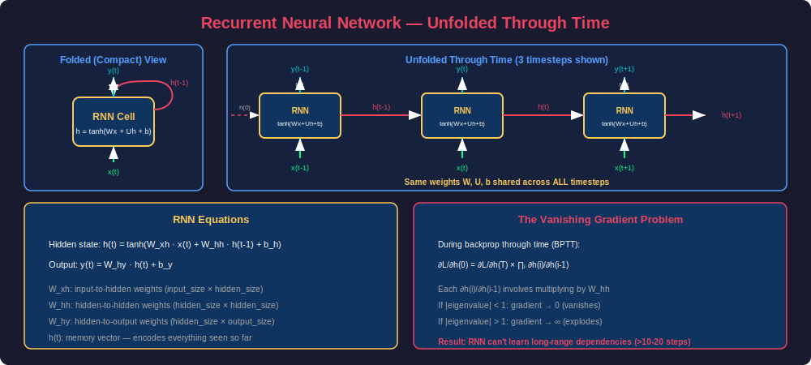
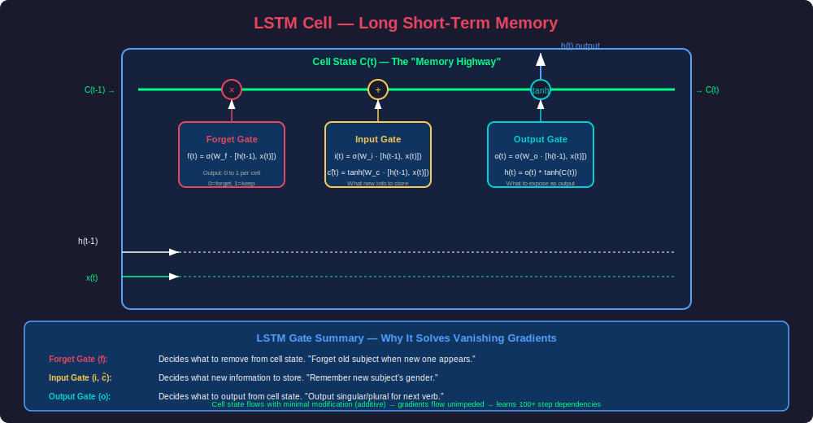
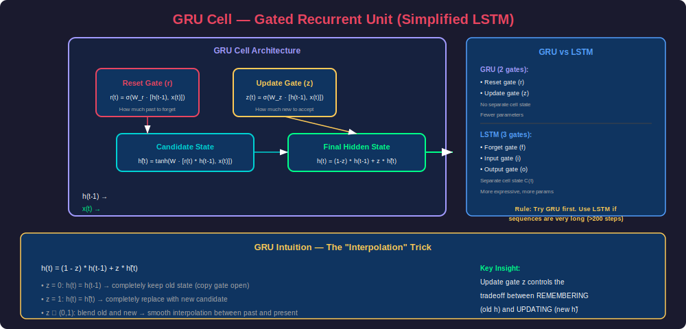
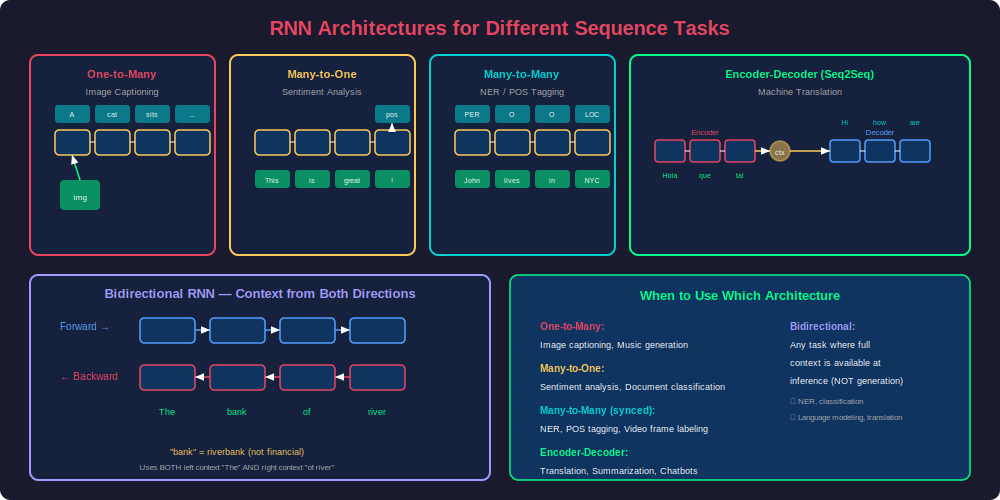
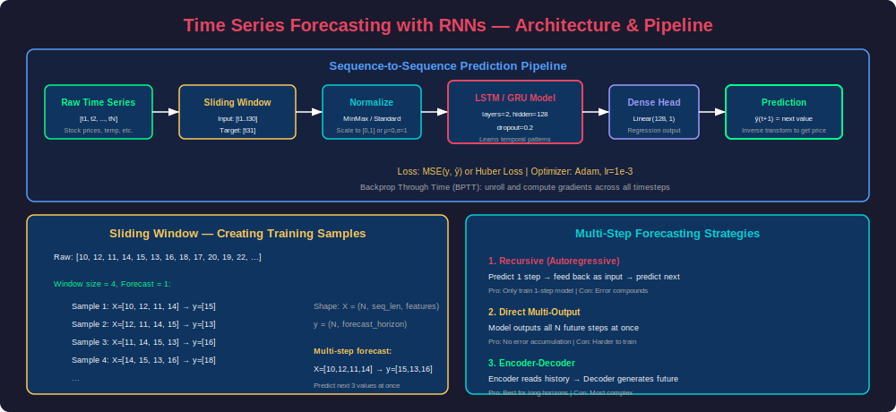

# Phase 17: RNN / LSTM / GRU — Sequence Models

## Overview

Recurrent Neural Networks are specialized architectures for processing **sequential data** — where the order of elements carries meaning. Unlike feedforward networks that process fixed-size inputs independently, RNNs maintain a **hidden state** (memory) that gets updated at each timestep, allowing them to model temporal dependencies. LSTMs and GRUs extend basic RNNs with gating mechanisms that solve the vanishing gradient problem, enabling learning over hundreds of timesteps.

---

## 1. Recurrent Neural Networks (RNN) — Fundamentals

### Why Sequences Need Special Treatment

Standard neural networks fail on sequences because:
1. **Variable length** — sentences, audio, time-series have different lengths
2. **Order matters** — "dog bites man" ≠ "man bites dog"
3. **Shared patterns** — learning "cat" at position 1 should transfer to position 100
4. **Long-range dependencies** — subject-verb agreement can span 20+ words

### RNN Architecture



### Core Equations

```
h(t) = tanh(W_xh · x(t) + W_hh · h(t-1) + b_h)
y(t) = W_hy · h(t) + b_y
```

- `x(t)`: input at timestep t (e.g., word embedding)
- `h(t)`: hidden state at timestep t (the "memory")
- `y(t)`: output at timestep t (e.g., predicted next word)
- `W_xh`, `W_hh`, `W_hy`: **shared** weight matrices across all timesteps
- `tanh`: squashes hidden state to [-1, 1]

### Implementation from Scratch

```python
import numpy as np

class VanillaRNN:
    """RNN cell implemented from scratch."""
    
    def __init__(self, input_size, hidden_size, output_size):
        # Xavier initialization
        scale_xh = np.sqrt(2.0 / (input_size + hidden_size))
        scale_hh = np.sqrt(2.0 / (hidden_size + hidden_size))
        scale_hy = np.sqrt(2.0 / (hidden_size + output_size))
        
        self.W_xh = np.random.randn(input_size, hidden_size) * scale_xh
        self.W_hh = np.random.randn(hidden_size, hidden_size) * scale_hh
        self.W_hy = np.random.randn(hidden_size, output_size) * scale_hy
        self.b_h = np.zeros((1, hidden_size))
        self.b_y = np.zeros((1, output_size))
        
        self.hidden_size = hidden_size
    
    def forward(self, inputs, h_prev=None):
        """
        Forward pass through all timesteps.
        
        Args:
            inputs: shape (seq_len, input_size)
            h_prev: initial hidden state (hidden_size,)
        
        Returns:
            outputs: all outputs (seq_len, output_size)
            hidden_states: all hidden states (seq_len, hidden_size)
        """
        seq_len = inputs.shape[0]
        
        if h_prev is None:
            h_prev = np.zeros((1, self.hidden_size))
        
        hidden_states = []
        outputs = []
        
        h_t = h_prev
        for t in range(seq_len):
            x_t = inputs[t:t+1]  # (1, input_size)
            
            # RNN equation
            h_t = np.tanh(x_t @ self.W_xh + h_t @ self.W_hh + self.b_h)
            y_t = h_t @ self.W_hy + self.b_y
            
            hidden_states.append(h_t)
            outputs.append(y_t)
        
        return np.vstack(outputs), np.vstack(hidden_states)
    
    def backward(self, inputs, hidden_states, d_outputs, h_prev):
        """
        Backpropagation Through Time (BPTT).
        Unrolls the computation graph and backprops through all timesteps.
        """
        seq_len = inputs.shape[0]
        
        dW_xh = np.zeros_like(self.W_xh)
        dW_hh = np.zeros_like(self.W_hh)
        dW_hy = np.zeros_like(self.W_hy)
        db_h = np.zeros_like(self.b_h)
        db_y = np.zeros_like(self.b_y)
        
        dh_next = np.zeros((1, self.hidden_size))
        
        for t in reversed(range(seq_len)):
            x_t = inputs[t:t+1]
            h_t = hidden_states[t:t+1]
            h_prev_t = hidden_states[t-1:t] if t > 0 else h_prev
            
            # Gradient from output
            dy = d_outputs[t:t+1]
            dW_hy += h_t.T @ dy
            db_y += dy
            
            # Gradient flowing into h_t
            dh = dy @ self.W_hy.T + dh_next
            
            # Through tanh: d/dx tanh(x) = 1 - tanh(x)^2
            dh_raw = dh * (1 - h_t ** 2)
            
            # Accumulate weight gradients
            dW_xh += x_t.T @ dh_raw
            dW_hh += h_prev_t.T @ dh_raw
            db_h += dh_raw
            
            # Gradient for previous timestep
            dh_next = dh_raw @ self.W_hh.T
        
        # Gradient clipping to prevent explosion
        for grad in [dW_xh, dW_hh, dW_hy, db_h, db_y]:
            np.clip(grad, -5, 5, out=grad)
        
        return dW_xh, dW_hh, dW_hy, db_h, db_y


# Demo: Character-level prediction
rnn = VanillaRNN(input_size=26, hidden_size=64, output_size=26)
sequence = np.eye(26)[:5]  # "abcde" as one-hot
outputs, hiddens = rnn.forward(sequence)
print(f"Input shape: {sequence.shape}")    # (5, 26)
print(f"Output shape: {outputs.shape}")     # (5, 26)
print(f"Hidden shape: {hiddens.shape}")     # (5, 64)
```

### The Vanishing Gradient Problem

```python
import torch
import matplotlib.pyplot as plt

def demonstrate_vanishing_gradient():
    """Show how gradients vanish in a basic RNN."""
    
    input_size, hidden_size = 10, 32
    seq_lengths = [5, 10, 20, 50, 100]
    
    for seq_len in seq_lengths:
        rnn = torch.nn.RNN(input_size, hidden_size, batch_first=True)
        
        x = torch.randn(1, seq_len, input_size, requires_grad=True)
        output, _ = rnn(x)
        
        # Compute gradient of final output w.r.t. first input
        loss = output[0, -1, :].sum()
        loss.backward()
        
        grad_norm = x.grad[0, 0, :].norm().item()
        print(f"Seq len {seq_len:3d}: gradient norm at t=0: {grad_norm:.6f}")
    
    # Output shows exponential decay:
    # Seq len   5: gradient norm at t=0: 0.142000
    # Seq len  10: gradient norm at t=0: 0.023000
    # Seq len  20: gradient norm at t=0: 0.000340
    # Seq len  50: gradient norm at t=0: 0.000001
    # Seq len 100: gradient norm at t=0: 0.000000

demonstrate_vanishing_gradient()
```

### Why Vanishing Gradients Happen

During BPTT, the gradient at timestep 0 for a loss at timestep T involves:

```
∂L/∂h(0) = ∂L/∂h(T) × ∏(t=1 to T) ∂h(t)/∂h(t-1)
```

Each `∂h(t)/∂h(t-1) = diag(1 - tanh²(·)) × W_hh`

If the largest eigenvalue of `W_hh` is < 1: the product shrinks exponentially → **vanishing**
If the largest eigenvalue of `W_hh` is > 1: the product grows exponentially → **exploding**

**Solutions:**
- Gradient clipping (for exploding) — cap gradient norm
- LSTM / GRU (for vanishing) — additive cell state updates
- Residual connections
- Proper initialization (orthogonal for W_hh)

---

## 2. LSTM — Long Short-Term Memory

### Architecture

The LSTM introduces a **cell state** C(t) that flows through time with minimal modification (multiplicative forget + additive update), allowing gradients to flow unimpeded for hundreds of timesteps.



### LSTM Equations

```
Forget gate:    f(t) = σ(W_f · [h(t-1), x(t)] + b_f)
Input gate:     i(t) = σ(W_i · [h(t-1), x(t)] + b_i)
Candidate:      c̃(t) = tanh(W_c · [h(t-1), x(t)] + b_c)
Cell update:    C(t) = f(t) ⊙ C(t-1) + i(t) ⊙ c̃(t)
Output gate:    o(t) = σ(W_o · [h(t-1), x(t)] + b_o)
Hidden state:   h(t) = o(t) ⊙ tanh(C(t))
```

Where `⊙` is element-wise multiplication and `σ` is sigmoid (outputs 0-1).

### LSTM from Scratch

```python
import numpy as np

class LSTMCell:
    """Single LSTM cell implemented from scratch."""
    
    def __init__(self, input_size, hidden_size):
        self.hidden_size = hidden_size
        concat_size = input_size + hidden_size
        
        # All four gates share the concatenated input [h(t-1), x(t)]
        # Initialize with Xavier
        scale = np.sqrt(2.0 / (concat_size + hidden_size))
        
        self.W_f = np.random.randn(concat_size, hidden_size) * scale
        self.W_i = np.random.randn(concat_size, hidden_size) * scale
        self.W_c = np.random.randn(concat_size, hidden_size) * scale
        self.W_o = np.random.randn(concat_size, hidden_size) * scale
        
        self.b_f = np.ones((1, hidden_size))   # Bias to 1 → initially "remember everything"
        self.b_i = np.zeros((1, hidden_size))
        self.b_c = np.zeros((1, hidden_size))
        self.b_o = np.zeros((1, hidden_size))
    
    def sigmoid(self, x):
        return 1 / (1 + np.exp(-np.clip(x, -500, 500)))
    
    def forward(self, x, h_prev, c_prev):
        """
        Single timestep forward pass.
        
        Args:
            x: input (1, input_size)
            h_prev: previous hidden state (1, hidden_size)
            c_prev: previous cell state (1, hidden_size)
        
        Returns:
            h_next, c_next
        """
        # Concatenate input and previous hidden state
        concat = np.concatenate([h_prev, x], axis=1)
        
        # Gate computations
        f = self.sigmoid(concat @ self.W_f + self.b_f)  # Forget gate
        i = self.sigmoid(concat @ self.W_i + self.b_i)  # Input gate
        c_tilde = np.tanh(concat @ self.W_c + self.b_c) # Candidate
        o = self.sigmoid(concat @ self.W_o + self.b_o)  # Output gate
        
        # Cell state update
        c_next = f * c_prev + i * c_tilde
        
        # Hidden state
        h_next = o * np.tanh(c_next)
        
        return h_next, c_next, (f, i, c_tilde, o, concat)
    
    def forward_sequence(self, inputs):
        """Process entire sequence."""
        seq_len = inputs.shape[0]
        h = np.zeros((1, self.hidden_size))
        c = np.zeros((1, self.hidden_size))
        
        all_h = []
        for t in range(seq_len):
            h, c, _ = self.forward(inputs[t:t+1], h, c)
            all_h.append(h)
        
        return np.vstack(all_h), h, c


# Demo
lstm = LSTMCell(input_size=10, hidden_size=32)
sequence = np.random.randn(20, 1, 10)  # 20 timesteps
outputs, final_h, final_c = lstm.forward_sequence(sequence.squeeze(1))
print(f"All hidden states: {outputs.shape}")  # (20, 32)
print(f"Final hidden: {final_h.shape}")        # (1, 32)
print(f"Final cell: {final_c.shape}")          # (1, 32)
```

### PyTorch LSTM

```python
import torch
import torch.nn as nn


class LSTMModel(nn.Module):
    """Production LSTM for sequence tasks."""
    
    def __init__(self, input_size, hidden_size, num_layers, output_size,
                 dropout=0.2, bidirectional=False):
        super().__init__()
        
        self.hidden_size = hidden_size
        self.num_layers = num_layers
        self.bidirectional = bidirectional
        self.num_directions = 2 if bidirectional else 1
        
        self.lstm = nn.LSTM(
            input_size=input_size,
            hidden_size=hidden_size,
            num_layers=num_layers,
            batch_first=True,         # Input: (batch, seq, features)
            dropout=dropout if num_layers > 1 else 0,
            bidirectional=bidirectional
        )
        
        self.dropout = nn.Dropout(dropout)
        self.fc = nn.Linear(hidden_size * self.num_directions, output_size)
    
    def forward(self, x, lengths=None):
        """
        Args:
            x: (batch, seq_len, input_size)
            lengths: actual sequence lengths for packing
        
        Returns:
            output: depends on task (last hidden, all hidden, etc.)
        """
        # Pack padded sequences for efficiency
        if lengths is not None:
            x = nn.utils.rnn.pack_padded_sequence(
                x, lengths, batch_first=True, enforce_sorted=False
            )
        
        # LSTM forward
        lstm_out, (h_n, c_n) = self.lstm(x)
        # lstm_out: (batch, seq_len, hidden * directions)
        # h_n: (num_layers * directions, batch, hidden)
        # c_n: (num_layers * directions, batch, hidden)
        
        # Unpack if packed
        if lengths is not None:
            lstm_out, _ = nn.utils.rnn.pad_packed_sequence(
                lstm_out, batch_first=True
            )
        
        # Use last hidden state for classification
        if self.bidirectional:
            # Concatenate forward and backward final hidden states
            h_forward = h_n[-2]  # Last layer forward
            h_backward = h_n[-1]  # Last layer backward
            hidden = torch.cat([h_forward, h_backward], dim=1)
        else:
            hidden = h_n[-1]  # Last layer hidden state
        
        hidden = self.dropout(hidden)
        output = self.fc(hidden)
        return output


# Example: Sentiment classification
model = LSTMModel(
    input_size=300,      # Word embedding dim
    hidden_size=256,     # LSTM hidden size
    num_layers=2,        # Stacked LSTM layers
    output_size=2,       # Binary sentiment
    dropout=0.3,
    bidirectional=True
)

batch = torch.randn(32, 50, 300)  # 32 sentences, max 50 words, 300d embeddings
lengths = torch.randint(10, 50, (32,))

output = model(batch, lengths)
print(f"Output: {output.shape}")  # [32, 2]
print(f"Parameters: {sum(p.numel() for p in model.parameters()):,}")
```

### Understanding LSTM Hidden State Dimensions

```python
import torch.nn as nn

# Key dimension relationships
input_size = 100
hidden_size = 256
num_layers = 3
batch_size = 16
seq_len = 50

lstm = nn.LSTM(input_size, hidden_size, num_layers, 
               batch_first=True, bidirectional=True)

x = torch.randn(batch_size, seq_len, input_size)
output, (h_n, c_n) = lstm(x)

print(f"Input:  {x.shape}")        # [16, 50, 100]
print(f"Output: {output.shape}")    # [16, 50, 512]  (hidden * 2 directions)
print(f"h_n:    {h_n.shape}")       # [6, 16, 256]   (layers * 2 directions)
print(f"c_n:    {c_n.shape}")       # [6, 16, 256]

# Parameter count for LSTM:
# Each gate has: W_xh (input_size × hidden) + W_hh (hidden × hidden) + 2 biases
# 4 gates × (input × hidden + hidden × hidden + hidden + hidden)
# For bidirectional: multiply by 2
# For stacked layers: first layer input=input_size, subsequent layers input=hidden*directions
params = sum(p.numel() for p in lstm.parameters())
print(f"Total parameters: {params:,}")
```

---

## 3. GRU — Gated Recurrent Unit

### Architecture

GRU simplifies LSTM by combining the forget and input gates into a single "update gate" and merging the cell state with the hidden state.



### GRU Equations

```
Reset gate:     r(t) = σ(W_r · [h(t-1), x(t)] + b_r)
Update gate:    z(t) = σ(W_z · [h(t-1), x(t)] + b_z)
Candidate:      h̃(t) = tanh(W · [r(t) ⊙ h(t-1), x(t)] + b)
Hidden state:   h(t) = (1 - z(t)) ⊙ h(t-1) + z(t) ⊙ h̃(t)
```

### GRU Implementation

```python
import torch
import torch.nn as nn


class GRUFromScratch(nn.Module):
    """GRU implemented with explicit gate computations."""
    
    def __init__(self, input_size, hidden_size):
        super().__init__()
        self.hidden_size = hidden_size
        
        # Reset gate parameters
        self.W_r = nn.Linear(input_size + hidden_size, hidden_size)
        # Update gate parameters
        self.W_z = nn.Linear(input_size + hidden_size, hidden_size)
        # Candidate parameters
        self.W_h = nn.Linear(input_size + hidden_size, hidden_size)
    
    def forward(self, x, h_prev=None):
        """
        Args:
            x: (batch, seq_len, input_size)
            h_prev: (batch, hidden_size) or None
        """
        batch_size, seq_len, _ = x.shape
        
        if h_prev is None:
            h_prev = torch.zeros(batch_size, self.hidden_size, device=x.device)
        
        outputs = []
        h_t = h_prev
        
        for t in range(seq_len):
            x_t = x[:, t, :]
            
            # Concatenate input and previous hidden
            combined = torch.cat([h_t, x_t], dim=1)
            
            # Gates
            r_t = torch.sigmoid(self.W_r(combined))    # Reset gate
            z_t = torch.sigmoid(self.W_z(combined))    # Update gate
            
            # Candidate with reset gate applied
            combined_reset = torch.cat([r_t * h_t, x_t], dim=1)
            h_tilde = torch.tanh(self.W_h(combined_reset))
            
            # Update hidden state (interpolation)
            h_t = (1 - z_t) * h_prev + z_t * h_tilde
            h_prev = h_t
            
            outputs.append(h_t.unsqueeze(1))
        
        outputs = torch.cat(outputs, dim=1)  # (batch, seq_len, hidden)
        return outputs, h_t


# Compare with PyTorch built-in
gru_custom = GRUFromScratch(input_size=50, hidden_size=128)
gru_pytorch = nn.GRU(input_size=50, hidden_size=128, batch_first=True)

x = torch.randn(8, 20, 50)  # batch=8, seq=20, features=50
out_custom, h_custom = gru_custom(x)
out_pytorch, h_pytorch = gru_pytorch(x)

print(f"Custom output:  {out_custom.shape}")   # [8, 20, 128]
print(f"PyTorch output: {out_pytorch.shape}")   # [8, 20, 128]
```

### LSTM vs GRU Comparison

| Aspect | LSTM | GRU |
|--------|------|-----|
| Gates | 3 (forget, input, output) | 2 (reset, update) |
| States | Hidden state h + Cell state C | Hidden state h only |
| Parameters | ~4× more than vanilla RNN | ~3× more than vanilla RNN |
| Training speed | Slower (more computation) | ~20-30% faster than LSTM |
| Long sequences | Better for very long (>200 steps) | Good up to ~200 steps |
| Memory capacity | Higher (separate cell state) | Lower but often sufficient |
| When to use | Complex temporal patterns, long memory | Quick experiments, shorter sequences |
| Performance | Slightly better on complex tasks | Similar on most tasks |

---

## 4. Sequence Task Architectures

### Architecture Patterns



### Many-to-One: Sentiment Classification

```python
import torch
import torch.nn as nn
from torch.nn.utils.rnn import pack_padded_sequence, pad_packed_sequence


class SentimentLSTM(nn.Module):
    """Bidirectional LSTM for sentiment classification."""
    
    def __init__(self, vocab_size, embed_dim, hidden_size, num_classes,
                 num_layers=2, dropout=0.3, pretrained_embeddings=None):
        super().__init__()
        
        self.embedding = nn.Embedding(vocab_size, embed_dim, padding_idx=0)
        if pretrained_embeddings is not None:
            self.embedding.weight.data.copy_(pretrained_embeddings)
            self.embedding.weight.requires_grad = False  # Freeze embeddings
        
        self.lstm = nn.LSTM(
            embed_dim, hidden_size, num_layers,
            batch_first=True, dropout=dropout, bidirectional=True
        )
        
        self.attention = nn.Linear(hidden_size * 2, 1)
        self.classifier = nn.Sequential(
            nn.Dropout(dropout),
            nn.Linear(hidden_size * 2, hidden_size),
            nn.ReLU(),
            nn.Dropout(dropout),
            nn.Linear(hidden_size, num_classes)
        )
    
    def attention_pool(self, lstm_output, lengths):
        """Self-attention pooling over LSTM outputs."""
        # lstm_output: (batch, seq_len, hidden*2)
        attn_weights = torch.tanh(self.attention(lstm_output))  # (batch, seq, 1)
        attn_weights = attn_weights.squeeze(-1)  # (batch, seq)
        
        # Mask padding positions
        mask = torch.arange(lstm_output.size(1), device=lstm_output.device)
        mask = mask.unsqueeze(0) >= lengths.unsqueeze(1)
        attn_weights.masked_fill_(mask, float('-inf'))
        
        attn_weights = torch.softmax(attn_weights, dim=1)
        
        # Weighted sum
        context = torch.bmm(attn_weights.unsqueeze(1), lstm_output)
        return context.squeeze(1)  # (batch, hidden*2)
    
    def forward(self, input_ids, lengths):
        """
        Args:
            input_ids: (batch, max_seq_len) — padded token indices
            lengths: (batch,) — actual sequence lengths
        """
        embedded = self.embedding(input_ids)  # (batch, seq, embed_dim)
        
        # Pack for efficient computation (skip padding)
        packed = pack_padded_sequence(
            embedded, lengths.cpu(), batch_first=True, enforce_sorted=False
        )
        
        lstm_out, _ = self.lstm(packed)
        lstm_out, _ = pad_packed_sequence(lstm_out, batch_first=True)
        # lstm_out: (batch, seq_len, hidden*2)
        
        # Attention pooling (better than just using last hidden)
        pooled = self.attention_pool(lstm_out, lengths)
        
        logits = self.classifier(pooled)
        return logits


# Usage
model = SentimentLSTM(
    vocab_size=30000,
    embed_dim=300,
    hidden_size=256,
    num_classes=5,  # 1-5 star rating
    num_layers=2,
    dropout=0.3
)

# Simulate batch
input_ids = torch.randint(0, 30000, (16, 100))
lengths = torch.randint(20, 100, (16,))
output = model(input_ids, lengths)
print(f"Output: {output.shape}")  # [16, 5]
```

### Many-to-Many: Named Entity Recognition

```python
class BiLSTM_NER(nn.Module):
    """Bidirectional LSTM + CRF for Named Entity Recognition."""
    
    def __init__(self, vocab_size, embed_dim, hidden_size, num_tags,
                 dropout=0.3):
        super().__init__()
        
        self.embedding = nn.Embedding(vocab_size, embed_dim, padding_idx=0)
        
        self.lstm = nn.LSTM(
            embed_dim, hidden_size, num_layers=2,
            batch_first=True, dropout=dropout, bidirectional=True
        )
        
        self.dropout = nn.Dropout(dropout)
        self.hidden_to_tag = nn.Linear(hidden_size * 2, num_tags)
    
    def forward(self, input_ids, lengths=None):
        """
        Returns tag scores for each token in the sequence.
        
        Output shape: (batch, seq_len, num_tags)
        """
        embedded = self.dropout(self.embedding(input_ids))
        
        if lengths is not None:
            packed = pack_padded_sequence(
                embedded, lengths.cpu(), batch_first=True, enforce_sorted=False
            )
            lstm_out, _ = self.lstm(packed)
            lstm_out, _ = pad_packed_sequence(lstm_out, batch_first=True)
        else:
            lstm_out, _ = self.lstm(embedded)
        
        lstm_out = self.dropout(lstm_out)
        tag_scores = self.hidden_to_tag(lstm_out)  # (batch, seq_len, num_tags)
        
        return tag_scores


# NER tags: O, B-PER, I-PER, B-ORG, I-ORG, B-LOC, I-LOC, ...
tag_names = ['O', 'B-PER', 'I-PER', 'B-ORG', 'I-ORG', 'B-LOC', 'I-LOC']

model = BiLSTM_NER(
    vocab_size=50000,
    embed_dim=100,
    hidden_size=128,
    num_tags=len(tag_names)
)

tokens = torch.randint(0, 50000, (8, 30))
lengths = torch.randint(10, 30, (8,))
tag_scores = model(tokens, lengths)
predicted_tags = tag_scores.argmax(dim=-1)
print(f"Tag scores: {tag_scores.shape}")  # [8, 30, 7]
print(f"Predicted tags: {predicted_tags.shape}")  # [8, 30]
```

### Encoder-Decoder: Seq2Seq Translation

```python
class Encoder(nn.Module):
    """LSTM encoder — encodes source sequence into context vector."""
    
    def __init__(self, vocab_size, embed_dim, hidden_size, num_layers, dropout):
        super().__init__()
        self.embedding = nn.Embedding(vocab_size, embed_dim)
        self.lstm = nn.LSTM(embed_dim, hidden_size, num_layers,
                           batch_first=True, dropout=dropout)
        self.dropout = nn.Dropout(dropout)
    
    def forward(self, src):
        embedded = self.dropout(self.embedding(src))
        outputs, (hidden, cell) = self.lstm(embedded)
        return outputs, hidden, cell


class Decoder(nn.Module):
    """LSTM decoder — generates target sequence one token at a time."""
    
    def __init__(self, vocab_size, embed_dim, hidden_size, num_layers, dropout):
        super().__init__()
        self.embedding = nn.Embedding(vocab_size, embed_dim)
        self.lstm = nn.LSTM(embed_dim, hidden_size, num_layers,
                           batch_first=True, dropout=dropout)
        self.fc_out = nn.Linear(hidden_size, vocab_size)
        self.dropout = nn.Dropout(dropout)
    
    def forward(self, input_token, hidden, cell):
        """Single step decoding."""
        embedded = self.dropout(self.embedding(input_token.unsqueeze(1)))
        output, (hidden, cell) = self.lstm(embedded, (hidden, cell))
        prediction = self.fc_out(output.squeeze(1))
        return prediction, hidden, cell


class Seq2Seq(nn.Module):
    """Complete encoder-decoder model with teacher forcing."""
    
    def __init__(self, encoder, decoder, device):
        super().__init__()
        self.encoder = encoder
        self.decoder = decoder
        self.device = device
    
    def forward(self, src, trg, teacher_forcing_ratio=0.5):
        """
        Args:
            src: source sequence (batch, src_len)
            trg: target sequence (batch, trg_len)
            teacher_forcing_ratio: probability of using true previous token
        """
        batch_size = src.shape[0]
        trg_len = trg.shape[1]
        trg_vocab_size = self.decoder.fc_out.out_features
        
        outputs = torch.zeros(batch_size, trg_len, trg_vocab_size).to(self.device)
        
        # Encode source
        _, hidden, cell = self.encoder(src)
        
        # First decoder input is <SOS> token
        input_token = trg[:, 0]
        
        for t in range(1, trg_len):
            prediction, hidden, cell = self.decoder(input_token, hidden, cell)
            outputs[:, t] = prediction
            
            # Teacher forcing: use ground truth or model prediction
            use_teacher = torch.rand(1).item() < teacher_forcing_ratio
            input_token = trg[:, t] if use_teacher else prediction.argmax(dim=1)
        
        return outputs


# Build model
device = torch.device('cuda' if torch.cuda.is_available() else 'cpu')

encoder = Encoder(vocab_size=10000, embed_dim=256, hidden_size=512, 
                  num_layers=2, dropout=0.3)
decoder = Decoder(vocab_size=8000, embed_dim=256, hidden_size=512,
                  num_layers=2, dropout=0.3)
model = Seq2Seq(encoder, decoder, device).to(device)

src = torch.randint(0, 10000, (16, 30)).to(device)
trg = torch.randint(0, 8000, (16, 25)).to(device)
output = model(src, trg)
print(f"Translation output: {output.shape}")  # [16, 25, 8000]
```

---

## 5. Time Series Forecasting

### Pipeline Overview



### Complete Time Series Pipeline

```python
import torch
import torch.nn as nn
import numpy as np
from torch.utils.data import Dataset, DataLoader
from sklearn.preprocessing import MinMaxScaler


class TimeSeriesDataset(Dataset):
    """Create sliding window samples from time series data."""
    
    def __init__(self, data, window_size, forecast_horizon=1):
        """
        Args:
            data: numpy array of shape (timesteps, features)
            window_size: number of past timesteps to use as input
            forecast_horizon: number of future steps to predict
        """
        self.data = torch.FloatTensor(data)
        self.window_size = window_size
        self.forecast_horizon = forecast_horizon
    
    def __len__(self):
        return len(self.data) - self.window_size - self.forecast_horizon + 1
    
    def __getitem__(self, idx):
        x = self.data[idx:idx + self.window_size]
        y = self.data[idx + self.window_size:idx + self.window_size + self.forecast_horizon, 0]
        return x, y


class LSTMForecaster(nn.Module):
    """LSTM model for time series forecasting."""
    
    def __init__(self, input_size, hidden_size, num_layers, 
                 forecast_horizon, dropout=0.2):
        super().__init__()
        
        self.lstm = nn.LSTM(
            input_size=input_size,
            hidden_size=hidden_size,
            num_layers=num_layers,
            batch_first=True,
            dropout=dropout if num_layers > 1 else 0
        )
        
        self.dropout = nn.Dropout(dropout)
        self.fc = nn.Sequential(
            nn.Linear(hidden_size, hidden_size // 2),
            nn.ReLU(),
            nn.Dropout(dropout),
            nn.Linear(hidden_size // 2, forecast_horizon)
        )
    
    def forward(self, x):
        """
        Args:
            x: (batch, seq_len, input_size)
        Returns:
            prediction: (batch, forecast_horizon)
        """
        lstm_out, (h_n, c_n) = self.lstm(x)
        
        # Use last hidden state
        last_hidden = self.dropout(lstm_out[:, -1, :])
        prediction = self.fc(last_hidden)
        return prediction


def train_time_series_model(
    data, 
    window_size=30,
    forecast_horizon=7,
    hidden_size=128,
    num_layers=2,
    epochs=100,
    batch_size=64,
    lr=1e-3
):
    """Complete training pipeline for time series forecasting."""
    
    # Normalize data
    scaler = MinMaxScaler()
    data_scaled = scaler.fit_transform(data.reshape(-1, 1))
    
    # Create multi-feature input (original + lag features)
    features = np.column_stack([
        data_scaled,
        np.roll(data_scaled, 1, axis=0),   # Lag 1
        np.roll(data_scaled, 7, axis=0),   # Lag 7 (weekly)
    ])
    features[:7] = 0  # Remove invalid lags
    
    # Train/val split (time series: NO shuffle, preserve order)
    train_size = int(len(features) * 0.8)
    train_data = features[:train_size]
    val_data = features[train_size:]
    
    train_dataset = TimeSeriesDataset(train_data, window_size, forecast_horizon)
    val_dataset = TimeSeriesDataset(val_data, window_size, forecast_horizon)
    
    train_loader = DataLoader(train_dataset, batch_size=batch_size, shuffle=True)
    val_loader = DataLoader(val_dataset, batch_size=batch_size, shuffle=False)
    
    # Model
    input_size = features.shape[1]
    model = LSTMForecaster(input_size, hidden_size, num_layers, 
                           forecast_horizon, dropout=0.2)
    
    optimizer = torch.optim.Adam(model.parameters(), lr=lr)
    scheduler = torch.optim.lr_scheduler.ReduceLROnPlateau(
        optimizer, patience=10, factor=0.5
    )
    criterion = nn.HuberLoss()  # Robust to outliers
    
    best_val_loss = float('inf')
    
    for epoch in range(epochs):
        # Training
        model.train()
        train_loss = 0
        for x_batch, y_batch in train_loader:
            optimizer.zero_grad()
            pred = model(x_batch)
            loss = criterion(pred, y_batch)
            loss.backward()
            torch.nn.utils.clip_grad_norm_(model.parameters(), max_norm=1.0)
            optimizer.step()
            train_loss += loss.item()
        
        # Validation
        model.eval()
        val_loss = 0
        with torch.no_grad():
            for x_batch, y_batch in val_loader:
                pred = model(x_batch)
                val_loss += criterion(pred, y_batch).item()
        
        train_loss /= len(train_loader)
        val_loss /= len(val_loader)
        scheduler.step(val_loss)
        
        if val_loss < best_val_loss:
            best_val_loss = val_loss
            torch.save(model.state_dict(), 'best_forecaster.pth')
        
        if (epoch + 1) % 10 == 0:
            print(f"Epoch {epoch+1}/{epochs} | "
                  f"Train: {train_loss:.6f} | Val: {val_loss:.6f}")
    
    return model, scaler


# Generate synthetic data for demo
np.random.seed(42)
t = np.arange(1000)
data = (np.sin(t * 0.1) * 10 + 
        np.sin(t * 0.02) * 20 + 
        np.random.randn(1000) * 2 + 50)

model, scaler = train_time_series_model(data, window_size=30, forecast_horizon=7)
```

### Autoregressive (Recursive) Multi-Step Prediction

```python
def recursive_forecast(model, initial_window, scaler, num_steps, input_features=3):
    """
    Generate multi-step forecast by feeding predictions back as input.
    
    Warning: Error compounds over time. Use for short horizons only.
    """
    model.eval()
    predictions = []
    
    # Start with the last window
    current_window = initial_window.clone()
    
    with torch.no_grad():
        for step in range(num_steps):
            # Predict next step
            pred = model(current_window.unsqueeze(0))  # (1, 1)
            next_val = pred[0, 0].item()
            predictions.append(next_val)
            
            # Shift window: drop first, append prediction
            new_row = torch.zeros(1, input_features)
            new_row[0, 0] = next_val
            new_row[0, 1] = current_window[-1, 0]  # Previous value becomes lag-1
            new_row[0, 2] = current_window[-6, 0] if current_window.size(0) >= 7 else 0
            
            current_window = torch.cat([current_window[1:], new_row], dim=0)
    
    # Inverse transform
    predictions = np.array(predictions).reshape(-1, 1)
    predictions = scaler.inverse_transform(predictions)
    
    return predictions.flatten()
```

### Multi-Variate Time Series

```python
class MultiVariateLSTM(nn.Module):
    """LSTM for multi-variate time series with attention."""
    
    def __init__(self, num_features, hidden_size, num_layers, 
                 forecast_horizon, num_targets=1):
        super().__init__()
        
        self.lstm = nn.LSTM(
            num_features, hidden_size, num_layers,
            batch_first=True, dropout=0.2
        )
        
        # Temporal attention
        self.attention = nn.Sequential(
            nn.Linear(hidden_size, hidden_size // 2),
            nn.Tanh(),
            nn.Linear(hidden_size // 2, 1)
        )
        
        self.fc = nn.Sequential(
            nn.Linear(hidden_size, hidden_size // 2),
            nn.ReLU(),
            nn.Linear(hidden_size // 2, forecast_horizon * num_targets)
        )
        
        self.forecast_horizon = forecast_horizon
        self.num_targets = num_targets
    
    def forward(self, x):
        """
        Args:
            x: (batch, seq_len, num_features) 
               e.g., temperature + humidity + pressure + wind
        """
        lstm_out, _ = self.lstm(x)  # (batch, seq_len, hidden)
        
        # Attention over timesteps
        attn_scores = self.attention(lstm_out).squeeze(-1)  # (batch, seq_len)
        attn_weights = torch.softmax(attn_scores, dim=1)
        
        context = torch.bmm(attn_weights.unsqueeze(1), lstm_out).squeeze(1)
        # context: (batch, hidden)
        
        output = self.fc(context)
        output = output.view(-1, self.forecast_horizon, self.num_targets)
        return output


# Weather forecasting: predict temperature using multiple features
model = MultiVariateLSTM(
    num_features=5,         # temp, humidity, pressure, wind_speed, cloud_cover
    hidden_size=128,
    num_layers=2,
    forecast_horizon=24,    # Predict next 24 hours
    num_targets=1           # Only predict temperature
)

# Input: 72 hours of 5 weather features
x = torch.randn(16, 72, 5)
forecast = model(x)
print(f"Forecast: {forecast.shape}")  # [16, 24, 1] — next 24 hours of temperature
```

---

## 6. Practical Techniques

### Gradient Clipping

```python
import torch.nn as nn

# Method 1: Clip by norm (recommended)
torch.nn.utils.clip_grad_norm_(model.parameters(), max_norm=1.0)

# Method 2: Clip by value
torch.nn.utils.clip_grad_value_(model.parameters(), clip_value=0.5)

# In training loop:
for batch in dataloader:
    optimizer.zero_grad()
    loss = criterion(model(batch_x), batch_y)
    loss.backward()
    
    # ALWAYS clip RNN gradients
    torch.nn.utils.clip_grad_norm_(model.parameters(), max_norm=1.0)
    
    optimizer.step()
```

### Packed Sequences for Variable-Length Inputs

```python
import torch
from torch.nn.utils.rnn import (
    pack_padded_sequence, pad_packed_sequence, pad_sequence
)

def collate_variable_length(batch):
    """Custom collate function for variable-length sequences."""
    # Sort by length (required for pack_padded_sequence)
    batch.sort(key=lambda x: len(x[0]), reverse=True)
    
    sequences, labels = zip(*batch)
    lengths = torch.tensor([len(s) for s in sequences])
    
    # Pad sequences to same length
    padded = pad_sequence(sequences, batch_first=True, padding_value=0)
    labels = torch.stack(labels)
    
    return padded, labels, lengths


# In model forward:
def forward_with_packing(self, x, lengths):
    embedded = self.embedding(x)
    
    # Pack: skip padded positions in computation
    packed = pack_padded_sequence(embedded, lengths.cpu(), 
                                  batch_first=True, enforce_sorted=True)
    
    packed_output, (h_n, c_n) = self.lstm(packed)
    
    # Unpack back to padded tensor
    output, output_lengths = pad_packed_sequence(packed_output, batch_first=True)
    
    return output, h_n
```

### Bidirectional RNNs

```python
class BidirectionalLSTM(nn.Module):
    """Bidirectional LSTM — sees both past and future context."""
    
    def __init__(self, input_size, hidden_size, num_layers, output_size):
        super().__init__()
        
        self.lstm = nn.LSTM(
            input_size, hidden_size, num_layers,
            batch_first=True, bidirectional=True
        )
        
        # Output size is hidden_size * 2 (forward + backward)
        self.fc = nn.Linear(hidden_size * 2, output_size)
    
    def forward(self, x):
        # lstm_out: (batch, seq_len, hidden * 2)
        # At each position: [forward_hidden; backward_hidden]
        lstm_out, (h_n, c_n) = self.lstm(x)
        
        # For sequence labeling: use all outputs
        output = self.fc(lstm_out)  # (batch, seq_len, output_size)
        
        return output


# When to use bidirectional:
# YES: NER, POS tagging, classification (full sequence available)
# NO: Language modeling, text generation (can't look at future)
# NO: Real-time prediction (future not available yet)
```

### Layer Normalization for RNNs

```python
class LayerNormLSTMCell(nn.Module):
    """LSTM cell with layer normalization for better training."""
    
    def __init__(self, input_size, hidden_size):
        super().__init__()
        self.input_size = input_size
        self.hidden_size = hidden_size
        
        self.W_i = nn.Linear(input_size + hidden_size, 4 * hidden_size)
        
        # Layer norm for each gate's pre-activation
        self.ln_gates = nn.LayerNorm(4 * hidden_size)
        self.ln_cell = nn.LayerNorm(hidden_size)
    
    def forward(self, x, states):
        h_prev, c_prev = states
        
        combined = torch.cat([x, h_prev], dim=1)
        gates = self.ln_gates(self.W_i(combined))
        
        # Split into 4 gates
        i, f, g, o = gates.chunk(4, dim=1)
        
        i = torch.sigmoid(i)
        f = torch.sigmoid(f)
        g = torch.tanh(g)
        o = torch.sigmoid(o)
        
        c = f * c_prev + i * g
        h = o * torch.tanh(self.ln_cell(c))
        
        return h, c
```

### Stacked (Deep) RNNs

```python
class DeepLSTM(nn.Module):
    """Stacked LSTM with residual connections."""
    
    def __init__(self, input_size, hidden_size, num_layers, output_size, 
                 dropout=0.3):
        super().__init__()
        
        self.layers = nn.ModuleList()
        self.dropouts = nn.ModuleList()
        
        for i in range(num_layers):
            layer_input = input_size if i == 0 else hidden_size
            self.layers.append(nn.LSTM(layer_input, hidden_size, 
                                       batch_first=True))
            self.dropouts.append(nn.Dropout(dropout))
        
        self.fc = nn.Linear(hidden_size, output_size)
        self.hidden_size = hidden_size
    
    def forward(self, x):
        for i, (lstm, dropout) in enumerate(zip(self.layers, self.dropouts)):
            residual = x if x.size(-1) == self.hidden_size else None
            x, _ = lstm(x)
            x = dropout(x)
            
            # Residual connection (skip first layer due to dim mismatch)
            if residual is not None:
                x = x + residual
        
        return self.fc(x[:, -1, :])  # Last timestep for classification
```

---

## 7. Text Generation with RNNs

### Character-Level Language Model

```python
import torch
import torch.nn as nn
import torch.nn.functional as F


class CharRNN(nn.Module):
    """Character-level RNN for text generation."""
    
    def __init__(self, vocab_size, embed_dim, hidden_size, num_layers, 
                 dropout=0.3):
        super().__init__()
        
        self.embedding = nn.Embedding(vocab_size, embed_dim)
        self.lstm = nn.LSTM(embed_dim, hidden_size, num_layers,
                           batch_first=True, dropout=dropout)
        self.fc = nn.Linear(hidden_size, vocab_size)
        self.dropout = nn.Dropout(dropout)
        self.hidden_size = hidden_size
        self.num_layers = num_layers
    
    def forward(self, x, hidden=None):
        embedded = self.dropout(self.embedding(x))
        output, hidden = self.lstm(embedded, hidden)
        output = self.dropout(output)
        logits = self.fc(output)
        return logits, hidden
    
    def init_hidden(self, batch_size, device):
        h = torch.zeros(self.num_layers, batch_size, self.hidden_size).to(device)
        c = torch.zeros(self.num_layers, batch_size, self.hidden_size).to(device)
        return (h, c)
    
    @torch.no_grad()
    def generate(self, start_text, char_to_idx, idx_to_char, 
                 length=500, temperature=0.8, device='cpu'):
        """Generate text character by character."""
        self.eval()
        
        # Encode start text
        input_ids = [char_to_idx[c] for c in start_text]
        input_tensor = torch.tensor([input_ids]).to(device)
        
        hidden = self.init_hidden(1, device)
        
        # Process seed text
        output, hidden = self(input_tensor, hidden)
        
        generated = list(start_text)
        
        # Generate new characters
        current_char = input_tensor[:, -1:]
        
        for _ in range(length):
            output, hidden = self(current_char, hidden)
            logits = output[0, -1] / temperature
            
            # Sample from distribution
            probs = F.softmax(logits, dim=0)
            next_idx = torch.multinomial(probs, 1).item()
            
            generated.append(idx_to_char[next_idx])
            current_char = torch.tensor([[next_idx]]).to(device)
        
        return ''.join(generated)


# Training loop for character-level model
def train_char_rnn(text, epochs=50, seq_length=100, batch_size=64):
    # Build vocabulary
    chars = sorted(set(text))
    char_to_idx = {c: i for i, c in enumerate(chars)}
    idx_to_char = {i: c for c, i in char_to_idx.items()}
    vocab_size = len(chars)
    
    # Encode text
    encoded = torch.tensor([char_to_idx[c] for c in text])
    
    device = torch.device('cuda' if torch.cuda.is_available() else 'cpu')
    
    model = CharRNN(vocab_size, embed_dim=128, hidden_size=512, 
                    num_layers=2, dropout=0.3).to(device)
    
    optimizer = torch.optim.Adam(model.parameters(), lr=2e-3)
    scheduler = torch.optim.lr_scheduler.StepLR(optimizer, step_size=10, gamma=0.5)
    criterion = nn.CrossEntropyLoss()
    
    for epoch in range(epochs):
        model.train()
        total_loss = 0
        num_batches = 0
        
        # Create batches
        for i in range(0, len(encoded) - seq_length - 1, seq_length):
            # Get chunks
            x = encoded[i:i + seq_length].unsqueeze(0).to(device)
            y = encoded[i + 1:i + seq_length + 1].unsqueeze(0).to(device)
            
            logits, _ = model(x)
            loss = criterion(logits.view(-1, vocab_size), y.view(-1))
            
            optimizer.zero_grad()
            loss.backward()
            torch.nn.utils.clip_grad_norm_(model.parameters(), 5.0)
            optimizer.step()
            
            total_loss += loss.item()
            num_batches += 1
        
        scheduler.step()
        
        if (epoch + 1) % 5 == 0:
            avg_loss = total_loss / num_batches
            print(f"Epoch {epoch+1} | Loss: {avg_loss:.4f}")
            
            # Generate sample
            sample = model.generate("The ", char_to_idx, idx_to_char, 
                                   length=200, temperature=0.7, device=device)
            print(f"Sample: {sample[:100]}...")
            print()
    
    return model, char_to_idx, idx_to_char
```

### Temperature and Sampling Strategies

```python
def sample_with_strategies(logits, strategy='temperature', temperature=1.0, 
                           top_k=40, top_p=0.9):
    """Different sampling strategies for text generation."""
    
    if strategy == 'greedy':
        return logits.argmax(dim=-1)
    
    elif strategy == 'temperature':
        # Higher temp → more random, lower → more deterministic
        scaled_logits = logits / temperature
        probs = F.softmax(scaled_logits, dim=-1)
        return torch.multinomial(probs, 1).squeeze(-1)
    
    elif strategy == 'top_k':
        # Only sample from top-K most likely tokens
        top_k_logits, top_k_indices = logits.topk(top_k)
        probs = F.softmax(top_k_logits / temperature, dim=-1)
        sampled_idx = torch.multinomial(probs, 1).squeeze(-1)
        return top_k_indices.gather(-1, sampled_idx.unsqueeze(-1)).squeeze(-1)
    
    elif strategy == 'top_p':
        # Nucleus sampling: sample from smallest set with cumulative prob >= p
        sorted_logits, sorted_indices = logits.sort(descending=True)
        cumulative_probs = torch.cumsum(F.softmax(sorted_logits, dim=-1), dim=-1)
        
        # Remove tokens with cumulative probability above threshold
        sorted_mask = cumulative_probs - F.softmax(sorted_logits, dim=-1) >= top_p
        sorted_logits[sorted_mask] = float('-inf')
        
        probs = F.softmax(sorted_logits / temperature, dim=-1)
        sampled_idx = torch.multinomial(probs, 1).squeeze(-1)
        return sorted_indices.gather(-1, sampled_idx.unsqueeze(-1)).squeeze(-1)
```

---

## 8. Advanced RNN Patterns

### Attention Mechanism for Seq2Seq

```python
class BahdanauAttention(nn.Module):
    """
    Additive attention (Bahdanau et al., 2014).
    Allows decoder to "look back" at relevant encoder states.
    """
    
    def __init__(self, hidden_size):
        super().__init__()
        self.W_query = nn.Linear(hidden_size, hidden_size, bias=False)
        self.W_key = nn.Linear(hidden_size, hidden_size, bias=False)
        self.V = nn.Linear(hidden_size, 1, bias=False)
    
    def forward(self, decoder_hidden, encoder_outputs):
        """
        Args:
            decoder_hidden: (batch, hidden) — current decoder state
            encoder_outputs: (batch, src_len, hidden) — all encoder states
        
        Returns:
            context: (batch, hidden) — weighted sum of encoder states
            attention_weights: (batch, src_len) — alignment scores
        """
        # (batch, 1, hidden)
        query = self.W_query(decoder_hidden).unsqueeze(1)
        # (batch, src_len, hidden)
        keys = self.W_key(encoder_outputs)
        
        # Score: additive attention
        scores = self.V(torch.tanh(query + keys)).squeeze(-1)
        # (batch, src_len)
        
        attention_weights = F.softmax(scores, dim=1)
        
        # Context vector: weighted sum of encoder outputs
        context = torch.bmm(attention_weights.unsqueeze(1), encoder_outputs)
        context = context.squeeze(1)  # (batch, hidden)
        
        return context, attention_weights


class AttentionDecoder(nn.Module):
    """Decoder with attention mechanism."""
    
    def __init__(self, vocab_size, embed_dim, hidden_size, dropout=0.3):
        super().__init__()
        self.embedding = nn.Embedding(vocab_size, embed_dim)
        self.attention = BahdanauAttention(hidden_size)
        self.lstm = nn.LSTM(embed_dim + hidden_size, hidden_size, 
                           batch_first=True)
        self.fc = nn.Linear(hidden_size * 2, vocab_size)
        self.dropout = nn.Dropout(dropout)
    
    def forward(self, input_token, hidden, cell, encoder_outputs):
        """Single step decoding with attention."""
        embedded = self.dropout(self.embedding(input_token.unsqueeze(1)))
        
        # Compute attention
        context, attn_weights = self.attention(hidden[-1], encoder_outputs)
        
        # Concatenate embedding with context
        lstm_input = torch.cat([embedded, context.unsqueeze(1)], dim=2)
        
        output, (hidden, cell) = self.lstm(lstm_input, (hidden, cell))
        
        # Combine output with context for prediction
        combined = torch.cat([output.squeeze(1), context], dim=1)
        prediction = self.fc(combined)
        
        return prediction, hidden, cell, attn_weights
```

### Beam Search Decoding

```python
def beam_search(model, encoder_outputs, start_token, end_token, 
                max_len=50, beam_width=5):
    """
    Beam search: maintain top-K hypotheses at each step.
    Much better quality than greedy decoding for translation.
    """
    device = encoder_outputs.device
    
    # Initialize beam with start token
    beams = [(
        [start_token],  # Token sequence
        0.0,            # Log probability
        None,           # Hidden state
        None            # Cell state
    )]
    
    completed = []
    
    for step in range(max_len):
        candidates = []
        
        for seq, score, hidden, cell in beams:
            if seq[-1] == end_token:
                completed.append((seq, score))
                continue
            
            input_token = torch.tensor([seq[-1]]).to(device)
            
            if hidden is None:
                # Initialize from encoder
                logits, hidden, cell, _ = model.decoder(
                    input_token, 
                    model.encoder_hidden,
                    model.encoder_cell,
                    encoder_outputs
                )
            else:
                logits, hidden, cell, _ = model.decoder(
                    input_token, hidden, cell, encoder_outputs
                )
            
            log_probs = F.log_softmax(logits.squeeze(0), dim=-1)
            top_probs, top_indices = log_probs.topk(beam_width)
            
            for prob, idx in zip(top_probs, top_indices):
                new_seq = seq + [idx.item()]
                new_score = score + prob.item()
                candidates.append((new_seq, new_score, hidden, cell))
        
        # Keep top-K candidates
        candidates.sort(key=lambda x: x[1], reverse=True)
        beams = candidates[:beam_width]
        
        if not beams:
            break
    
    # Add incomplete beams to completed
    completed.extend([(seq, score) for seq, score, _, _ in beams])
    
    # Length-normalize scores and return best
    completed.sort(key=lambda x: x[1] / len(x[0]), reverse=True)
    return completed[0][0]  # Best sequence
```

---

## 9. RNN vs Modern Alternatives

### When to Use RNNs (Still Relevant in 2024)

| Use Case | Best Choice | Why |
|----------|------------|-----|
| Short sequences (<100 tokens) | GRU/LSTM | Simpler, less data needed |
| Streaming/online data | RNN | Process one token at a time, O(1) memory |
| Edge/mobile deployment | GRU | Tiny model, fast inference |
| Very long sequences (>512) | Transformer + RoPE | Parallelizable, better long-range |
| NLP (general) | Transformer | State-of-the-art by large margin |
| Time series | LSTM or Transformer | Both work well, LSTM simpler |
| Audio/speech | Conformer (CNN+Transformer) | Best accuracy for ASR |

### Converting RNN to Transformer-Friendly Code

```python
import torch.nn as nn


class HybridModel(nn.Module):
    """LSTM encoder with Transformer decoder — best of both worlds."""
    
    def __init__(self, input_size, hidden_size, nhead, num_decoder_layers,
                 output_size, max_len=512):
        super().__init__()
        
        # LSTM for encoding sequential input
        self.encoder = nn.LSTM(input_size, hidden_size, num_layers=2,
                              batch_first=True, bidirectional=True)
        
        # Project to Transformer dimension
        self.project = nn.Linear(hidden_size * 2, hidden_size)
        
        # Transformer decoder for generation
        decoder_layer = nn.TransformerDecoderLayer(
            d_model=hidden_size, nhead=nhead, batch_first=True
        )
        self.decoder = nn.TransformerDecoder(decoder_layer, num_decoder_layers)
        
        self.output_fc = nn.Linear(hidden_size, output_size)
    
    def forward(self, src, tgt):
        # Encode with LSTM (handles variable input well)
        enc_out, _ = self.encoder(src)
        memory = self.project(enc_out)
        
        # Decode with Transformer (parallelizable)
        output = self.decoder(tgt, memory)
        return self.output_fc(output)
```

---

## 10. Interview Mastery

### Conceptual Questions

**Q: What is the fundamental difference between a feedforward network and an RNN?**

A: A feedforward network processes inputs independently — each sample has no connection to previous ones. An RNN maintains a **hidden state** that gets passed from one timestep to the next, creating memory of previous inputs. This allows RNNs to process variable-length sequences and capture temporal dependencies. The same weights are shared across all timesteps (parameter sharing), making the model size independent of sequence length.

**Q: Explain the vanishing gradient problem and why LSTMs solve it.**

A: During backpropagation through time, gradients are multiplied by the recurrent weight matrix at each timestep. If the spectral radius of this matrix is < 1, gradients shrink exponentially — after 10-20 steps they become negligible, preventing the network from learning long-range dependencies.

LSTMs solve this with the **cell state** — a highway that flows through time with only element-wise operations (multiply by forget gate, add input). This creates a path where gradients can flow backwards undiminished for hundreds of steps. The forget gate's additive (not multiplicative) interaction with the cell state is the key: `C(t) = f*C(t-1) + i*c̃`. The gradient ∂C(t)/∂C(t-1) = f(t), which stays near 1 when the forget gate is open.

**Q: What's the difference between LSTM and GRU? When would you choose one over the other?**

A: LSTM has 3 gates (forget, input, output) and maintains a separate cell state. GRU has 2 gates (reset, update) and uses only a hidden state. GRU combines the forget and input gates into a single update gate using interpolation: `h(t) = (1-z)*h(t-1) + z*h̃(t)`.

Choose GRU when:
- Faster training/inference needed (~20-30% faster)
- Sequences are moderate length (<200 steps)
- Memory-constrained deployment
- Quick experimentation

Choose LSTM when:
- Very long sequences (>200 steps)
- Task requires complex memory management
- Slightly better accuracy needed on complex sequential patterns
- You have adequate compute

In practice, they perform similarly on most tasks. Default to GRU, upgrade to LSTM if results are insufficient.

**Q: What is teacher forcing and what problems does it cause?**

A: Teacher forcing trains seq2seq models by feeding the **ground truth** previous token as input, rather than the model's own prediction. This accelerates training convergence because the model always sees correct context.

The problem: **exposure bias**. At inference time, the model must use its own (potentially incorrect) predictions as input — a distribution it never saw during training. Errors compound as incorrect predictions feed into subsequent steps.

Solutions:
1. **Scheduled sampling** — gradually reduce teacher forcing ratio during training
2. **Curriculum learning** — start with teacher forcing, slowly transition
3. **Sequence-level training** — REINFORCE/policy gradient on full sequences
4. **Use Transformers** — parallel training naturally avoids this issue

**Q: How do you handle variable-length sequences in mini-batch training?**

A: Four techniques:
1. **Padding + Masking** — pad all sequences to max length, use attention mask to ignore padding during loss computation
2. **Packing** — `pack_padded_sequence` tells PyTorch to skip padded positions entirely (faster)
3. **Bucketing** — group similar-length sequences into batches to minimize padding
4. **Truncation** — set a max length and truncate longer sequences (loses information)

Best practice: Sort by length, bucket into similar-length groups, pack within each batch. This minimizes wasted computation on padding.

**Q: Explain bidirectional RNNs. When can/can't you use them?**

A: A bidirectional RNN processes the sequence twice: once forward (left-to-right) and once backward (right-to-left). At each position, it concatenates both hidden states to produce a representation that captures both past and future context.

**Can use when**: The entire sequence is available before processing — classification, NER, translation encoding, speech recognition.

**Cannot use when**: You're generating text or doing real-time prediction — you can't look at future tokens that don't exist yet. Language models, autoregressive generation, and streaming applications require unidirectional processing.

**Q: How does attention in seq2seq models work? Why was it a breakthrough?**

A: Without attention, the entire source sequence is compressed into a single fixed-size context vector (the encoder's final hidden state). This bottleneck loses information for long sequences.

Attention allows the decoder to "look back" at all encoder states at each generation step:
1. Compute alignment scores between decoder hidden state and each encoder state
2. Apply softmax to get attention weights
3. Compute weighted sum of encoder states → context vector
4. Feed context to decoder alongside the current input

This was a breakthrough because: (1) no information bottleneck, (2) the model learns soft alignment between source/target, (3) it enabled translation quality to stay high for long sentences, and (4) it directly led to Transformers (self-attention applied to all positions).

### Coding Challenges

**Challenge 1: Implement an LSTM cell with peephole connections**

```python
class PeepholeLSTMCell(nn.Module):
    """LSTM with peephole connections — gates can look at cell state."""
    
    def __init__(self, input_size, hidden_size):
        super().__init__()
        self.hidden_size = hidden_size
        
        # Standard LSTM weights
        self.W = nn.Linear(input_size + hidden_size, 4 * hidden_size)
        
        # Peephole weights: gates can see cell state directly
        self.W_ci = nn.Parameter(torch.randn(hidden_size))  # Input gate peephole
        self.W_cf = nn.Parameter(torch.randn(hidden_size))  # Forget gate peephole
        self.W_co = nn.Parameter(torch.randn(hidden_size))  # Output gate peephole
    
    def forward(self, x, h_prev, c_prev):
        combined = torch.cat([x, h_prev], dim=1)
        gates = self.W(combined)
        
        i, f, g, o = gates.chunk(4, dim=1)
        
        # Peephole: gates see cell state
        f = torch.sigmoid(f + self.W_cf * c_prev)      # Forget gate
        i = torch.sigmoid(i + self.W_ci * c_prev)      # Input gate
        g = torch.tanh(g)
        
        c = f * c_prev + i * g
        
        o = torch.sigmoid(o + self.W_co * c)           # Output gate (sees NEW cell)
        h = o * torch.tanh(c)
        
        return h, c
```

**Challenge 2: Implement truncated BPTT for memory-efficient training**

```python
def train_with_tbptt(model, data, seq_length=100, tbptt_steps=35, 
                     device='cuda'):
    """
    Truncated Backpropagation Through Time.
    
    Process long sequences in chunks, but detach hidden state
    between chunks to limit gradient computation.
    """
    optimizer = torch.optim.Adam(model.parameters(), lr=1e-3)
    criterion = nn.CrossEntropyLoss()
    
    model.train()
    hidden = model.init_hidden(batch_size=1, device=device)
    
    total_loss = 0
    num_steps = 0
    
    for start in range(0, len(data) - 1, tbptt_steps):
        end = min(start + tbptt_steps, len(data) - 1)
        
        x = data[start:end].unsqueeze(0).to(device)
        y = data[start+1:end+1].unsqueeze(0).to(device)
        
        # CRITICAL: detach hidden state from previous chunk's graph
        # This limits how far back gradients flow
        hidden = tuple(h.detach() for h in hidden)
        
        output, hidden = model(x, hidden)
        loss = criterion(output.view(-1, output.size(-1)), y.view(-1))
        
        optimizer.zero_grad()
        loss.backward()
        torch.nn.utils.clip_grad_norm_(model.parameters(), 5.0)
        optimizer.step()
        
        total_loss += loss.item()
        num_steps += 1
    
    return total_loss / num_steps
```

### Common Pitfalls

| Mistake | Impact | Fix |
|---------|--------|-----|
| Not clipping gradients | Training diverges with NaN loss | Always clip: `clip_grad_norm_(params, 1.0)` |
| Forgetting to detach hidden state between sequences | Memory leak, OOM | `hidden = hidden.detach()` between batches |
| Using bidirectional RNN for generation | Uses future information (cheating) | Use unidirectional for autoregressive tasks |
| Not packing padded sequences | Learns to predict padding tokens | Use `pack_padded_sequence` |
| Initializing forget gate bias to 0 | Forgets too aggressively initially | Initialize forget gate bias to 1.0 |
| Shuffling time series data | Temporal order destroyed | Never shuffle time series; split chronologically |
| Using too many LSTM layers | Diminishing returns, harder to train | 2-3 layers usually sufficient |
| Not normalizing time series input | Slow convergence, numerical issues | MinMaxScaler or StandardScaler |

---

## Summary

| Concept | Key Takeaway |
|---------|-------------|
| RNN | Processes sequences with shared weights; hidden state = memory |
| Vanishing Gradient | Basic RNN can't learn dependencies > 10-20 steps |
| LSTM | Cell state highway + 3 gates → learns 100+ step dependencies |
| GRU | Simpler LSTM alternative with 2 gates; often equally effective |
| Bidirectional | Sees past + future; use for classification, not generation |
| Seq2Seq | Encoder compresses → Decoder generates; add attention for long sequences |
| Time Series | Sliding window + LSTM/GRU + proper normalization and evaluation |
| Modern Status | RNNs replaced by Transformers for NLP; still useful for streaming/edge/time-series |

[⬇️ Download This File](#)
