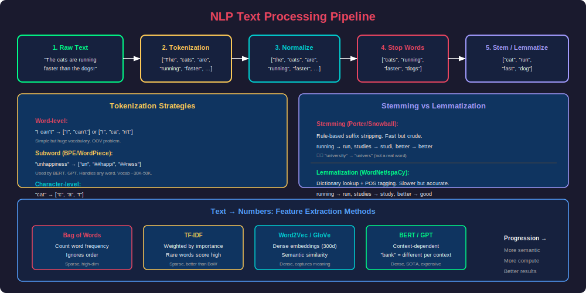
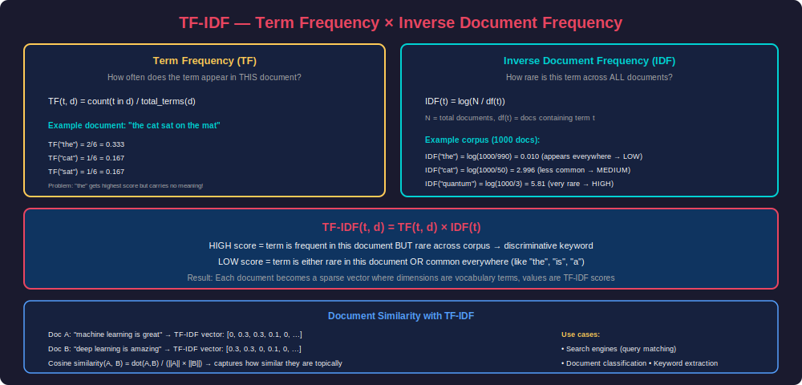
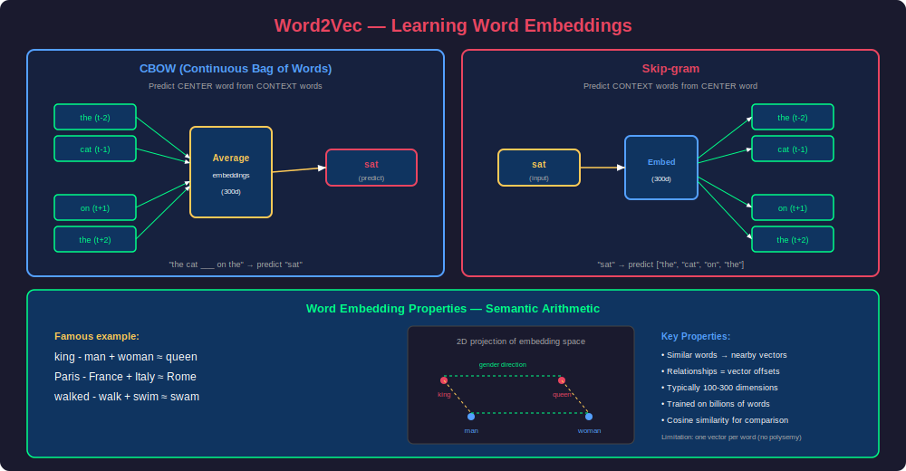
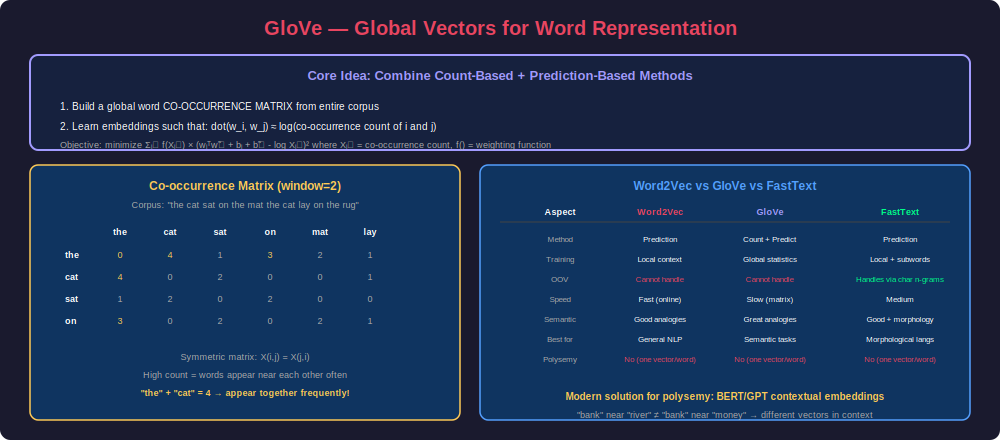
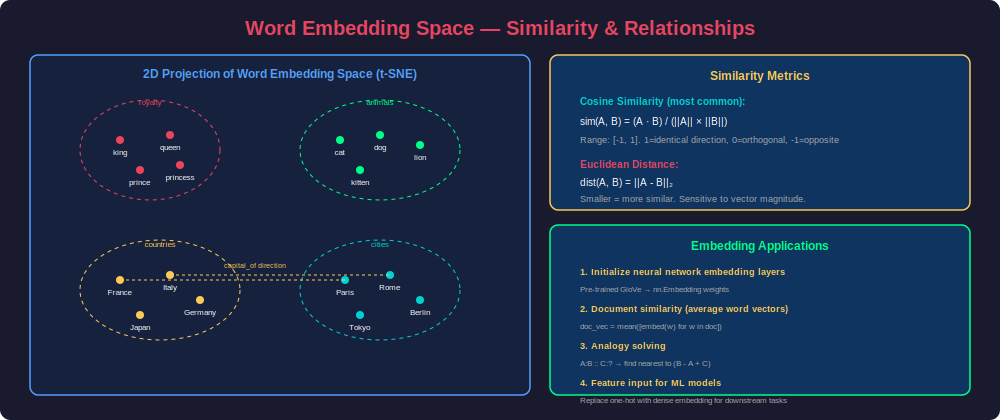

# Phase 18: NLP Foundations

## Overview

Natural Language Processing (NLP) bridges human language and machine computation. Before deep learning, NLP relied heavily on manually crafted features — tokenization, stemming, TF-IDF vectors. Today these remain essential preprocessing steps, and understanding them provides the foundation for comprehending why modern models (BERT, GPT) work so well. This phase covers the complete journey from raw text to numerical representations that machines can process.

---

## 1. Text Processing Pipeline

### The Complete Pipeline



### Step-by-Step Implementation

```python
import re
import string
from collections import Counter


class TextPreprocessor:
    """Complete NLP text preprocessing pipeline."""
    
    def __init__(self, lowercase=True, remove_punctuation=True,
                 remove_numbers=False, remove_stopwords=True,
                 min_word_length=2):
        self.lowercase = lowercase
        self.remove_punctuation = remove_punctuation
        self.remove_numbers = remove_numbers
        self.remove_stopwords = remove_stopwords
        self.min_word_length = min_word_length
        
        # Common English stop words
        self.stop_words = {
            'i', 'me', 'my', 'myself', 'we', 'our', 'ours', 'ourselves',
            'you', 'your', 'yours', 'yourself', 'he', 'him', 'his', 'she',
            'her', 'hers', 'it', 'its', 'itself', 'they', 'them', 'their',
            'what', 'which', 'who', 'whom', 'this', 'that', 'these', 'those',
            'am', 'is', 'are', 'was', 'were', 'be', 'been', 'being',
            'have', 'has', 'had', 'having', 'do', 'does', 'did', 'doing',
            'a', 'an', 'the', 'and', 'but', 'if', 'or', 'because', 'as',
            'until', 'while', 'of', 'at', 'by', 'for', 'with', 'about',
            'between', 'through', 'during', 'before', 'after', 'to', 'from',
            'in', 'out', 'on', 'off', 'over', 'under', 'again', 'further',
            'then', 'once', 'here', 'there', 'when', 'where', 'why', 'how',
            'all', 'each', 'every', 'both', 'few', 'more', 'most', 'other',
            'some', 'such', 'no', 'nor', 'not', 'only', 'own', 'same', 'so',
            'than', 'too', 'very', 'can', 'will', 'just', 'should', 'now'
        }
    
    def clean_text(self, text):
        """Remove HTML, URLs, emails, and extra whitespace."""
        text = re.sub(r'<[^>]+>', '', text)                    # HTML tags
        text = re.sub(r'http\S+|www\.\S+', '', text)          # URLs
        text = re.sub(r'\S+@\S+', '', text)                    # Emails
        text = re.sub(r'\s+', ' ', text).strip()               # Extra spaces
        return text
    
    def tokenize(self, text):
        """Split text into tokens."""
        if self.lowercase:
            text = text.lower()
        
        if self.remove_punctuation:
            text = text.translate(str.maketrans('', '', string.punctuation))
        
        if self.remove_numbers:
            text = re.sub(r'\d+', '', text)
        
        tokens = text.split()
        
        if self.remove_stopwords:
            tokens = [t for t in tokens if t not in self.stop_words]
        
        tokens = [t for t in tokens if len(t) >= self.min_word_length]
        
        return tokens
    
    def process(self, text):
        """Full pipeline: clean → tokenize."""
        text = self.clean_text(text)
        tokens = self.tokenize(text)
        return tokens


# Usage
preprocessor = TextPreprocessor()
text = "The <b>quick</b> brown fox jumps over the lazy dog! Visit http://example.com"
tokens = preprocessor.process(text)
print(tokens)  # ['quick', 'brown', 'fox', 'jumps', 'lazy', 'dog']
```

---

## 2. Tokenization

### Types of Tokenization

```python
# 1. Word-level tokenization (simplest)
def word_tokenize(text):
    """Split on whitespace and punctuation."""
    return re.findall(r'\b\w+\b', text.lower())

print(word_tokenize("I can't believe it's 2024!"))
# ['i', 'can', 't', 'believe', 'it', 's', '2024']


# 2. Using NLTK (smarter word tokenization)
import nltk
from nltk.tokenize import word_tokenize as nltk_tokenize

text = "I can't believe it's not butter!"
tokens = nltk_tokenize(text)
print(tokens)  # ['I', 'ca', "n't", 'believe', "it", "'s", 'not', 'butter', '!']


# 3. Using spaCy (production-grade)
import spacy
nlp = spacy.load("en_core_web_sm")

doc = nlp("Apple is looking at buying U.K. startup for $1 billion")
tokens = [(token.text, token.pos_, token.lemma_) for token in doc]
for text, pos, lemma in tokens:
    print(f"{text:12s} POS: {pos:6s} Lemma: {lemma}")
# Apple        POS: PROPN  Lemma: Apple
# is           POS: AUX    Lemma: be
# looking      POS: VERB   Lemma: look
# at           POS: ADP    Lemma: at
# buying       POS: VERB   Lemma: buy
# U.K.         POS: PROPN  Lemma: U.K.
# startup      POS: NOUN   Lemma: startup
# for          POS: ADP    Lemma: for
# $            POS: SYM    Lemma: $
# 1            POS: NUM    Lemma: 1
# billion      POS: NUM    Lemma: billion
```

### Subword Tokenization (BPE — Byte Pair Encoding)

```python
from collections import Counter, defaultdict


class SimpleBPE:
    """
    Byte Pair Encoding tokenizer (simplified).
    Used by GPT-2, GPT-3, GPT-4.
    
    Algorithm:
    1. Start with character-level vocabulary
    2. Find most frequent adjacent pair
    3. Merge them into a new token
    4. Repeat until vocab size reached
    """
    
    def __init__(self, vocab_size=1000):
        self.vocab_size = vocab_size
        self.merges = []
        self.vocab = {}
    
    def _get_pairs(self, word_freqs):
        """Count all adjacent symbol pairs across vocabulary."""
        pairs = Counter()
        for word, freq in word_freqs.items():
            symbols = word.split()
            for i in range(len(symbols) - 1):
                pairs[(symbols[i], symbols[i+1])] += freq
        return pairs
    
    def train(self, corpus):
        """Learn BPE merges from corpus."""
        # Initialize: split each word into characters + end-of-word marker
        word_freqs = Counter()
        for sentence in corpus:
            for word in sentence.lower().split():
                # Add spaces between chars + end marker
                chars = ' '.join(list(word)) + ' </w>'
                word_freqs[chars] += 1
        
        # Initial vocab = all characters
        self.vocab = set()
        for word in word_freqs:
            for symbol in word.split():
                self.vocab.add(symbol)
        
        # Iteratively merge most frequent pairs
        num_merges = self.vocab_size - len(self.vocab)
        
        for i in range(num_merges):
            pairs = self._get_pairs(word_freqs)
            if not pairs:
                break
            
            # Find most frequent pair
            best_pair = pairs.most_common(1)[0][0]
            self.merges.append(best_pair)
            
            # Merge this pair in all words
            merged = ''.join(best_pair)
            self.vocab.add(merged)
            
            new_word_freqs = {}
            pattern = re.escape(' '.join(best_pair))
            replacement = merged
            
            for word, freq in word_freqs.items():
                new_word = re.sub(pattern, replacement, word)
                new_word_freqs[new_word] = freq
            
            word_freqs = new_word_freqs
        
        print(f"Learned {len(self.merges)} merges. Vocab size: {len(self.vocab)}")
    
    def tokenize(self, word):
        """Apply learned merges to tokenize a word."""
        symbols = list(word) + ['</w>']
        
        for pair in self.merges:
            i = 0
            while i < len(symbols) - 1:
                if symbols[i] == pair[0] and symbols[i+1] == pair[1]:
                    symbols = symbols[:i] + [''.join(pair)] + symbols[i+2:]
                else:
                    i += 1
        
        return symbols


# Train BPE
corpus = [
    "the cat sat on the mat",
    "the cat ate the fish",
    "the dog sat on the log",
    "low lower lowest",
    "new newer newest"
] * 100  # Repeat for frequency

bpe = SimpleBPE(vocab_size=50)
bpe.train(corpus)

# Tokenize
print(bpe.tokenize("lowest"))   # May be: ['low', 'est</w>'] depending on merges
print(bpe.tokenize("newer"))    # May be: ['new', 'er</w>']
print(bpe.tokenize("catfish"))  # Handles compound words!
```

### HuggingFace Tokenizers (Production)

```python
from transformers import AutoTokenizer

# BERT tokenizer (WordPiece)
tokenizer = AutoTokenizer.from_pretrained("bert-base-uncased")
tokens = tokenizer.tokenize("unhappiness is unbelievable")
print(tokens)  # ['un', '##happiness', 'is', 'un', '##believable']
print(tokenizer.encode("unhappiness is unbelievable"))  # [7280, 18223, 2003, ...]

# GPT-2 tokenizer (BPE)
gpt_tokenizer = AutoTokenizer.from_pretrained("gpt2")
tokens = gpt_tokenizer.tokenize("unhappiness is unbelievable")
print(tokens)  # ['un', 'happiness', ' is', ' unbelievable']

# Compare vocabulary sizes
print(f"BERT vocab: {tokenizer.vocab_size}")      # 30,522
print(f"GPT-2 vocab: {gpt_tokenizer.vocab_size}") # 50,257
```

---

## 3. Stemming and Lemmatization

### Stemming — Rule-Based Suffix Stripping

```python
from nltk.stem import PorterStemmer, SnowballStemmer


# Porter Stemmer (most common)
porter = PorterStemmer()

words = ['running', 'runs', 'ran', 'runner', 'easily', 
         'studies', 'studying', 'university', 'better', 'happiness']

print("Porter Stemmer:")
for word in words:
    print(f"  {word:15s} → {porter.stem(word)}")
# running         → run
# runs            → run
# ran             → ran  (irregular!)
# runner          → runner
# easily          → easili  (not a real word!)
# studies         → studi   (not a real word!)
# studying        → studi
# university      → univers (not a real word!)
# better          → better  (misses comparative)
# happiness       → happi


# Snowball Stemmer (improved, multi-language)
snowball = SnowballStemmer("english")
print("\nSnowball Stemmer:")
for word in words:
    print(f"  {word:15s} → {snowball.stem(word)}")
```

### Lemmatization — Dictionary-Based

```python
import spacy
from nltk.stem import WordNetLemmatizer
import nltk


# NLTK WordNet Lemmatizer (requires POS tag for accuracy)
lemmatizer = WordNetLemmatizer()

# Without POS: treats everything as noun
print("Without POS tag:")
print(f"  better → {lemmatizer.lemmatize('better')}")        # better (wrong!)
print(f"  running → {lemmatizer.lemmatize('running')}")      # running (wrong!)

# With correct POS tag
print("\nWith POS tag:")
print(f"  better (adj) → {lemmatizer.lemmatize('better', pos='a')}")    # good ✓
print(f"  running (verb) → {lemmatizer.lemmatize('running', pos='v')}")  # run ✓
print(f"  studies (verb) → {lemmatizer.lemmatize('studies', pos='v')}")   # study ✓
print(f"  mice (noun) → {lemmatizer.lemmatize('mice', pos='n')}")        # mouse ✓
print(f"  better (adv) → {lemmatizer.lemmatize('better', pos='r')}")    # well ✓


# spaCy (auto-detects POS — recommended for production)
nlp = spacy.load("en_core_web_sm")
doc = nlp("The striped bats are hanging on their feet for best results")
print("\nspaCy Lemmatization:")
for token in doc:
    if token.lemma_ != token.text:
        print(f"  {token.text:12s} → {token.lemma_:12s} (POS: {token.pos_})")
# striped      → stripe        (POS: ADJ)
# bats         → bat           (POS: NOUN)
# are          → be            (POS: AUX)
# hanging      → hang          (POS: VERB)
# feet         → foot          (POS: NOUN)
# best         → good          (POS: ADJ)
# results      → result        (POS: NOUN)
```

### When to Use Stemming vs Lemmatization

| Aspect | Stemming | Lemmatization |
|--------|----------|---------------|
| Speed | Very fast (rule-based) | Slower (dictionary lookup) |
| Output | May not be real words | Always valid dictionary words |
| Accuracy | Lower (over/under-stemming) | Higher (uses POS context) |
| Use when | Speed > accuracy, IR/search | Accuracy matters, NLU tasks |
| Example | "better" → "better" | "better" → "good" |
| Libraries | NLTK PorterStemmer | spaCy, NLTK WordNet |

---

## 4. TF-IDF — Term Frequency–Inverse Document Frequency

### Concept and Mathematics



### Implementation from Scratch

```python
import numpy as np
from collections import Counter
import math


class TFIDFVectorizer:
    """TF-IDF implementation from scratch."""
    
    def __init__(self, max_features=None, min_df=1, max_df=1.0,
                 norm='l2', sublinear_tf=False):
        self.max_features = max_features
        self.min_df = min_df
        self.max_df = max_df
        self.norm = norm
        self.sublinear_tf = sublinear_tf
        self.vocabulary_ = {}
        self.idf_ = None
    
    def _compute_tf(self, doc_tokens):
        """Term Frequency: count / total terms."""
        counter = Counter(doc_tokens)
        total = len(doc_tokens)
        tf = {}
        for term, count in counter.items():
            if self.sublinear_tf:
                tf[term] = 1 + math.log(count)  # Dampened TF
            else:
                tf[term] = count / total
        return tf
    
    def _compute_idf(self, documents):
        """Inverse Document Frequency: log(N / df)."""
        N = len(documents)
        df = Counter()  # Document frequency
        
        for doc in documents:
            unique_terms = set(doc)
            for term in unique_terms:
                df[term] += 1
        
        # Filter by min_df and max_df
        min_count = self.min_df if isinstance(self.min_df, int) else int(self.min_df * N)
        max_count = self.max_df if isinstance(self.max_df, int) else int(self.max_df * N)
        
        idf = {}
        for term, count in df.items():
            if min_count <= count <= max_count:
                idf[term] = math.log(N / count) + 1  # Smoothed IDF
        
        return idf
    
    def fit(self, documents):
        """Learn vocabulary and IDF from documents."""
        # Tokenize if needed
        tokenized = [doc.lower().split() if isinstance(doc, str) else doc 
                    for doc in documents]
        
        # Compute IDF
        self.idf_ = self._compute_idf(tokenized)
        
        # Build vocabulary (optionally limit size)
        if self.max_features:
            sorted_terms = sorted(self.idf_.items(), key=lambda x: x[1], reverse=True)
            terms = [t for t, _ in sorted_terms[:self.max_features]]
        else:
            terms = list(self.idf_.keys())
        
        self.vocabulary_ = {term: idx for idx, term in enumerate(sorted(terms))}
        return self
    
    def transform(self, documents):
        """Transform documents to TF-IDF matrix."""
        tokenized = [doc.lower().split() if isinstance(doc, str) else doc 
                    for doc in documents]
        
        matrix = np.zeros((len(tokenized), len(self.vocabulary_)))
        
        for i, doc in enumerate(tokenized):
            tf = self._compute_tf(doc)
            for term, tf_val in tf.items():
                if term in self.vocabulary_:
                    idx = self.vocabulary_[term]
                    matrix[i, idx] = tf_val * self.idf_.get(term, 0)
        
        # L2 normalization
        if self.norm == 'l2':
            norms = np.sqrt((matrix ** 2).sum(axis=1, keepdims=True))
            norms[norms == 0] = 1  # Avoid division by zero
            matrix = matrix / norms
        
        return matrix
    
    def fit_transform(self, documents):
        self.fit(documents)
        return self.transform(documents)


# Example usage
documents = [
    "machine learning is great for predictions",
    "deep learning uses neural networks for AI",
    "natural language processing handles text data",
    "machine learning and deep learning are subfields of AI",
    "text classification is a common NLP task"
]

vectorizer = TFIDFVectorizer(max_features=20)
tfidf_matrix = vectorizer.fit_transform(documents)

print(f"TF-IDF matrix shape: {tfidf_matrix.shape}")
print(f"Vocabulary size: {len(vectorizer.vocabulary_)}")
print(f"\nTop terms for doc 0:")
doc_scores = list(zip(vectorizer.vocabulary_.keys(), tfidf_matrix[0]))
doc_scores.sort(key=lambda x: x[1], reverse=True)
for term, score in doc_scores[:5]:
    if score > 0:
        print(f"  {term}: {score:.4f}")
```

### Using Scikit-learn TF-IDF

```python
from sklearn.feature_extraction.text import TfidfVectorizer
from sklearn.metrics.pairwise import cosine_similarity


# Production TF-IDF
vectorizer = TfidfVectorizer(
    max_features=10000,      # Limit vocabulary size
    min_df=2,                # Ignore terms in < 2 docs
    max_df=0.95,             # Ignore terms in > 95% of docs
    ngram_range=(1, 2),      # Unigrams + bigrams
    sublinear_tf=True,       # Use log(1 + tf) instead of raw tf
    strip_accents='unicode',
    stop_words='english'
)

# Fit and transform
tfidf_matrix = vectorizer.fit_transform(documents)
print(f"Shape: {tfidf_matrix.shape}")     # (5, vocab_size) — sparse matrix
print(f"Non-zero: {tfidf_matrix.nnz}")    # Number of non-zero entries

# Document similarity
similarity = cosine_similarity(tfidf_matrix)
print(f"\nDocument similarity matrix:\n{similarity.round(3)}")

# Find most similar documents
for i in range(len(documents)):
    most_similar = similarity[i].argsort()[-2]  # Exclude self
    print(f"Doc {i} most similar to Doc {most_similar} "
          f"(sim={similarity[i][most_similar]:.3f})")

# Feature importance (top terms per document)
feature_names = vectorizer.get_feature_names_out()
for i, doc in enumerate(documents):
    top_indices = tfidf_matrix[i].toarray().flatten().argsort()[-3:][::-1]
    top_terms = [feature_names[j] for j in top_indices]
    print(f"Doc {i} keywords: {top_terms}")
```

### TF-IDF for Text Classification

```python
from sklearn.feature_extraction.text import TfidfVectorizer
from sklearn.linear_model import LogisticRegression
from sklearn.naive_bayes import MultinomialNB
from sklearn.svm import LinearSVC
from sklearn.pipeline import Pipeline
from sklearn.model_selection import cross_val_score


def build_tfidf_classifier(model_type='logreg'):
    """Build a TF-IDF + classifier pipeline."""
    
    models = {
        'logreg': LogisticRegression(max_iter=1000, C=1.0),
        'nb': MultinomialNB(alpha=0.1),
        'svm': LinearSVC(C=1.0, max_iter=10000)
    }
    
    pipeline = Pipeline([
        ('tfidf', TfidfVectorizer(
            max_features=50000,
            ngram_range=(1, 2),
            sublinear_tf=True,
            min_df=3,
            max_df=0.9,
            strip_accents='unicode',
            stop_words='english'
        )),
        ('classifier', models[model_type])
    ])
    
    return pipeline


# Example: Sentiment classification
texts = [
    "This movie is absolutely wonderful and amazing",
    "Terrible film, waste of time",
    "Great acting and beautiful cinematography",
    "Boring plot, bad dialogue, terrible ending",
    "One of the best films I have ever seen",
    "Worst movie of the year, don't waste your money"
]
labels = [1, 0, 1, 0, 1, 0]  # 1=positive, 0=negative

pipeline = build_tfidf_classifier('logreg')
scores = cross_val_score(pipeline, texts, labels, cv=2)
print(f"Accuracy: {scores.mean():.3f}")

# Train and predict
pipeline.fit(texts, labels)
new_texts = ["Amazing cinematography!", "Terrible acting"]
predictions = pipeline.predict(new_texts)
print(f"Predictions: {predictions}")  # [1, 0]
```

---

## 5. Word Embeddings — Dense Representations

### Why Embeddings Over One-Hot?

```python
import numpy as np

# One-hot encoding (10,000 word vocabulary)
vocab_size = 10000

# "cat" = index 42
cat_onehot = np.zeros(vocab_size)
cat_onehot[42] = 1.0

# "dog" = index 87  
dog_onehot = np.zeros(vocab_size)
dog_onehot[87] = 1.0

# Problem: cosine similarity between ANY two one-hot vectors = 0
similarity = np.dot(cat_onehot, dog_onehot)
print(f"One-hot similarity(cat, dog) = {similarity}")  # 0.0 — no relationship!

# Word embedding (300 dimensions)
cat_embed = np.array([0.2, -0.4, 0.7, ...])  # 300d
dog_embed = np.array([0.25, -0.35, 0.65, ...])  # 300d

# Embeddings capture similarity: cat and dog are semantically close
cos_sim = np.dot(cat_embed, dog_embed) / (
    np.linalg.norm(cat_embed) * np.linalg.norm(dog_embed)
)
print(f"Embedding similarity(cat, dog) ≈ 0.82")  # High similarity!
```

### Word2Vec — Architecture and Training



### Training Word2Vec with Gensim

```python
from gensim.models import Word2Vec
from gensim.models.word2vec import LineSentence
import numpy as np


# Prepare corpus (list of tokenized sentences)
corpus = [
    ['the', 'cat', 'sat', 'on', 'the', 'mat'],
    ['the', 'dog', 'lay', 'on', 'the', 'rug'],
    ['cats', 'and', 'dogs', 'are', 'pets'],
    ['the', 'king', 'and', 'queen', 'ruled', 'the', 'kingdom'],
    ['the', 'prince', 'and', 'princess', 'lived', 'in', 'the', 'castle'],
]

# Train Word2Vec
model = Word2Vec(
    sentences=corpus,
    vector_size=100,     # Embedding dimensions
    window=5,            # Context window size
    min_count=1,         # Minimum word frequency
    workers=4,           # Parallel threads
    sg=1,                # 1=Skip-gram, 0=CBOW
    epochs=100,          # Training iterations
    negative=5,          # Negative sampling count
    seed=42
)

# Access word vectors
cat_vector = model.wv['cat']
print(f"'cat' embedding shape: {cat_vector.shape}")  # (100,)

# Most similar words
similar = model.wv.most_similar('cat', topn=5)
print(f"\nMost similar to 'cat': {similar}")

# Analogy: king - man + woman = ?
result = model.wv.most_similar(positive=['king', 'woman'], negative=['man'], topn=3)
print(f"\nking - man + woman = {result}")

# Similarity between words
sim = model.wv.similarity('cat', 'dog')
print(f"\nSimilarity(cat, dog) = {sim:.4f}")

# Save and load
model.save("word2vec.model")
loaded_model = Word2Vec.load("word2vec.model")
```

### Using Pre-trained Word2Vec / GloVe

```python
import gensim.downloader as api
import numpy as np


# Download pre-trained embeddings
# Options: 'word2vec-google-news-300', 'glove-wiki-gigaword-300', 'glove-twitter-200'
print("Loading pre-trained embeddings...")
wv = api.load('glove-wiki-gigaword-100')  # 100d GloVe trained on Wikipedia

print(f"Vocabulary size: {len(wv)}")
print(f"Embedding dimensions: {wv.vector_size}")

# Explore relationships
print("\n--- Semantic Relationships ---")
print(f"king - man + woman = {wv.most_similar(positive=['king', 'woman'], negative=['man'], topn=1)}")
print(f"Paris - France + Italy = {wv.most_similar(positive=['paris', 'italy'], negative=['france'], topn=1)}")
print(f"walked - walk + swim = {wv.most_similar(positive=['walked', 'swim'], negative=['walk'], topn=1)}")

# Word doesn't fit
print(f"\nDoesn't match: {wv.doesnt_match(['breakfast', 'lunch', 'dinner', 'cat'])}")

# Compute document vectors by averaging word embeddings
def document_vector(doc, model, vector_size):
    """Average word vectors to get document vector."""
    words = doc.lower().split()
    word_vectors = [model[w] for w in words if w in model]
    
    if not word_vectors:
        return np.zeros(vector_size)
    
    return np.mean(word_vectors, axis=0)


doc1 = "machine learning algorithms predict outcomes"
doc2 = "deep neural networks classify images"
doc3 = "the weather is sunny today"

vec1 = document_vector(doc1, wv, 100)
vec2 = document_vector(doc2, wv, 100)
vec3 = document_vector(doc3, wv, 100)

# Cosine similarity
from numpy.linalg import norm
sim_12 = np.dot(vec1, vec2) / (norm(vec1) * norm(vec2))
sim_13 = np.dot(vec1, vec3) / (norm(vec1) * norm(vec3))
print(f"\nDoc similarity (ML vs DL): {sim_12:.4f}")    # High
print(f"Doc similarity (ML vs weather): {sim_13:.4f}")  # Low
```

---

## 6. GloVe — Global Vectors

### How GloVe Works



### Loading GloVe in PyTorch

```python
import torch
import torch.nn as nn
import numpy as np


def load_glove_embeddings(glove_path, word_to_idx, embedding_dim=300):
    """
    Load pre-trained GloVe vectors into a PyTorch embedding layer.
    
    Args:
        glove_path: path to glove.6B.300d.txt
        word_to_idx: vocabulary mapping {word: index}
        embedding_dim: dimension of GloVe vectors
    
    Returns:
        nn.Embedding with pre-trained weights
    """
    vocab_size = len(word_to_idx)
    embedding_matrix = np.random.randn(vocab_size, embedding_dim) * 0.01
    
    found = 0
    with open(glove_path, 'r', encoding='utf-8') as f:
        for line in f:
            parts = line.strip().split()
            word = parts[0]
            if word in word_to_idx:
                idx = word_to_idx[word]
                vector = np.array(parts[1:], dtype=np.float32)
                embedding_matrix[idx] = vector
                found += 1
    
    print(f"Found {found}/{vocab_size} words in GloVe ({100*found/vocab_size:.1f}%)")
    
    # Create embedding layer
    embedding = nn.Embedding(vocab_size, embedding_dim, padding_idx=0)
    embedding.weight.data = torch.FloatTensor(embedding_matrix)
    
    return embedding


class TextClassifierWithGloVe(nn.Module):
    """Text classifier using pre-trained GloVe embeddings."""
    
    def __init__(self, vocab_size, embedding_dim, hidden_size, num_classes,
                 pretrained_embeddings=None, freeze_embeddings=True):
        super().__init__()
        
        if pretrained_embeddings is not None:
            self.embedding = pretrained_embeddings
            if freeze_embeddings:
                self.embedding.weight.requires_grad = False
        else:
            self.embedding = nn.Embedding(vocab_size, embedding_dim, padding_idx=0)
        
        self.lstm = nn.LSTM(embedding_dim, hidden_size, num_layers=2,
                           batch_first=True, bidirectional=True, dropout=0.3)
        
        self.classifier = nn.Sequential(
            nn.Dropout(0.3),
            nn.Linear(hidden_size * 2, hidden_size),
            nn.ReLU(),
            nn.Dropout(0.2),
            nn.Linear(hidden_size, num_classes)
        )
    
    def forward(self, input_ids):
        embedded = self.embedding(input_ids)  # (batch, seq, embed_dim)
        lstm_out, (h_n, _) = self.lstm(embedded)
        
        # Use concatenated forward + backward final hidden
        hidden = torch.cat([h_n[-2], h_n[-1]], dim=1)
        logits = self.classifier(hidden)
        return logits


# Build vocabulary from dataset
vocab = {'<pad>': 0, '<unk>': 1, 'the': 2, 'cat': 3, 'dog': 4}  # etc.

# Load GloVe
glove_embed = load_glove_embeddings('glove.6B.300d.txt', vocab, embedding_dim=300)

# Create model with pre-trained embeddings
model = TextClassifierWithGloVe(
    vocab_size=len(vocab),
    embedding_dim=300,
    hidden_size=128,
    num_classes=2,
    pretrained_embeddings=glove_embed,
    freeze_embeddings=True  # Don't update GloVe weights
)
```

---

## 7. Embedding Space Visualization and Operations

### Embedding Properties



### Visualizing Embeddings with t-SNE

```python
from sklearn.manifold import TSNE
import matplotlib.pyplot as plt
import numpy as np


def visualize_word_embeddings(model, words, title="Word Embeddings"):
    """Visualize word embeddings in 2D using t-SNE."""
    
    # Get vectors for specified words
    vectors = np.array([model[w] for w in words if w in model])
    valid_words = [w for w in words if w in model]
    
    # Reduce to 2D with t-SNE
    tsne = TSNE(n_components=2, random_state=42, perplexity=min(5, len(vectors)-1))
    vectors_2d = tsne.fit_transform(vectors)
    
    # Plot
    plt.figure(figsize=(12, 8))
    plt.scatter(vectors_2d[:, 0], vectors_2d[:, 1], alpha=0.7, s=50)
    
    for i, word in enumerate(valid_words):
        plt.annotate(word, xy=(vectors_2d[i, 0], vectors_2d[i, 1]),
                    fontsize=10, alpha=0.8)
    
    plt.title(title)
    plt.xlabel('t-SNE dimension 1')
    plt.ylabel('t-SNE dimension 2')
    plt.tight_layout()
    plt.savefig('embeddings_tsne.png', dpi=150)
    plt.close()


# Explore semantic clusters
categories = {
    'animals': ['cat', 'dog', 'lion', 'tiger', 'elephant', 'horse'],
    'countries': ['france', 'germany', 'italy', 'japan', 'china', 'brazil'],
    'colors': ['red', 'blue', 'green', 'yellow', 'purple', 'orange'],
    'emotions': ['happy', 'sad', 'angry', 'fearful', 'surprised', 'disgusted']
}

all_words = [w for words in categories.values() for w in words]
# visualize_word_embeddings(wv, all_words, "Semantic Clusters in GloVe")
```

### Word Analogy Solver

```python
import numpy as np
from numpy.linalg import norm


class AnalogySolver:
    """Solve word analogies using vector arithmetic."""
    
    def __init__(self, word_vectors):
        self.wv = word_vectors
    
    def solve(self, a, b, c, topn=5):
        """
        Solve: A is to B as C is to ?
        Answer = B - A + C
        
        Example: "king" is to "queen" as "man" is to ? → "woman"
        """
        if not all(w in self.wv for w in [a, b, c]):
            return None
        
        # Target vector
        target = self.wv[b] - self.wv[a] + self.wv[c]
        
        # Find nearest neighbors (excluding input words)
        results = self.wv.most_similar(positive=[b, c], negative=[a], topn=topn)
        return results
    
    def find_relationship(self, word1, word2):
        """Find the relationship vector between two words."""
        if word1 in self.wv and word2 in self.wv:
            diff = self.wv[word2] - self.wv[word1]
            return diff
        return None
    
    def apply_relationship(self, relationship_vec, source_word, topn=5):
        """Apply a learned relationship to a new word."""
        if source_word not in self.wv:
            return None
        
        target = self.wv[source_word] + relationship_vec
        
        # Find nearest word to target vector
        similarities = []
        for word in self.wv.index_to_key[:50000]:  # Search top 50K words
            vec = self.wv[word]
            sim = np.dot(target, vec) / (norm(target) * norm(vec))
            similarities.append((word, sim))
        
        similarities.sort(key=lambda x: x[1], reverse=True)
        return [(w, s) for w, s in similarities[:topn] if w != source_word]


# Usage
solver = AnalogySolver(wv)

# Classic analogies
print("king:queen :: man:?", solver.solve('king', 'queen', 'man'))
print("france:paris :: italy:?", solver.solve('france', 'paris', 'italy'))
print("big:bigger :: small:?", solver.solve('big', 'bigger', 'small'))
```

---

## 8. FastText — Subword Embeddings

```python
from gensim.models import FastText


# FastText handles out-of-vocabulary words via character n-grams
# "unhappiness" → {<un, unh, nha, hap, app, ppi, pin, ine, nes, ess, ss>}

# Train FastText
corpus = [
    ['natural', 'language', 'processing', 'is', 'fun'],
    ['machine', 'learning', 'helps', 'with', 'nlp'],
    ['deep', 'learning', 'models', 'are', 'powerful'],
]

ft_model = FastText(
    sentences=corpus,
    vector_size=100,
    window=3,
    min_count=1,
    min_n=3,          # Min character n-gram length
    max_n=6,          # Max character n-gram length
    epochs=100
)

# Key advantage: handles OOV words!
# Even words not in training corpus get vectors via character n-grams
oov_vector = ft_model.wv['naturallanguage']  # Never seen, but gets a vector!
print(f"OOV word vector shape: {oov_vector.shape}")

# Good for morphologically rich languages (Turkish, Finnish, German)
# "spielen", "spielt", "gespielt" share character n-grams → similar vectors
```

---

## 9. Bag of Words and N-grams

### Bag of Words

```python
from sklearn.feature_extraction.text import CountVectorizer

documents = [
    "I love machine learning",
    "I love deep learning",
    "deep learning is a subset of machine learning"
]

# Unigram BoW
vectorizer = CountVectorizer()
bow_matrix = vectorizer.fit_transform(documents)

print("Vocabulary:", vectorizer.get_feature_names_out())
print(f"BoW matrix:\n{bow_matrix.toarray()}")
# Each row = document, each column = word count

# N-gram BoW (captures some word order)
bigram_vectorizer = CountVectorizer(ngram_range=(1, 2))
bigram_matrix = bigram_vectorizer.fit_transform(documents)
print(f"\nBigram vocabulary size: {len(bigram_vectorizer.get_feature_names_out())}")
print("Sample bigrams:", list(bigram_vectorizer.get_feature_names_out())[:10])
```

### Character N-grams (Spelling/Language Detection)

```python
from sklearn.feature_extraction.text import CountVectorizer

# Character n-grams for language detection
texts_en = ["hello how are you", "the weather is nice today"]
texts_fr = ["bonjour comment allez vous", "le temps est beau aujourd'hui"]
texts_es = ["hola como estas", "el tiempo es bueno hoy"]

all_texts = texts_en + texts_fr + texts_es
labels = ['en', 'en', 'fr', 'fr', 'es', 'es']

# Character n-grams capture language patterns
char_vectorizer = CountVectorizer(analyzer='char_wb', ngram_range=(2, 4))
char_features = char_vectorizer.fit_transform(all_texts)
print(f"Character n-gram features: {char_features.shape}")
# French has patterns like "ous", "ent", "eur"
# Spanish has patterns like "ola", "sta", "ien"
```

---

## 10. Putting It All Together — NLP Feature Engineering

```python
import numpy as np
from sklearn.feature_extraction.text import TfidfVectorizer
from sklearn.pipeline import Pipeline, FeatureUnion
from sklearn.base import BaseEstimator, TransformerMixin
from sklearn.linear_model import LogisticRegression


class TextLengthFeatures(BaseEstimator, TransformerMixin):
    """Extract text-level statistical features."""
    
    def fit(self, X, y=None):
        return self
    
    def transform(self, X):
        features = []
        for text in X:
            features.append([
                len(text),                          # Character count
                len(text.split()),                  # Word count
                len(text.split()) / max(len(text), 1),  # Word density
                text.count('!'),                    # Exclamation marks
                text.count('?'),                    # Question marks
                sum(1 for c in text if c.isupper()) / max(len(text), 1),  # Caps ratio
                np.mean([len(w) for w in text.split()]) if text.split() else 0,  # Avg word length
            ])
        return np.array(features)


class EmbeddingFeatures(BaseEstimator, TransformerMixin):
    """Average word embeddings as document features."""
    
    def __init__(self, word_vectors, vector_size=100):
        self.wv = word_vectors
        self.vector_size = vector_size
    
    def fit(self, X, y=None):
        return self
    
    def transform(self, X):
        doc_vectors = []
        for text in X:
            words = text.lower().split()
            word_vecs = [self.wv[w] for w in words if w in self.wv]
            if word_vecs:
                doc_vectors.append(np.mean(word_vecs, axis=0))
            else:
                doc_vectors.append(np.zeros(self.vector_size))
        return np.array(doc_vectors)


# Combined feature pipeline
pipeline = Pipeline([
    ('features', FeatureUnion([
        ('tfidf_word', TfidfVectorizer(
            ngram_range=(1, 2), max_features=10000, sublinear_tf=True
        )),
        ('tfidf_char', TfidfVectorizer(
            analyzer='char_wb', ngram_range=(2, 4), max_features=5000
        )),
        ('text_stats', TextLengthFeatures()),
        # ('embeddings', EmbeddingFeatures(wv, 100)),  # Uncomment with loaded embeddings
    ])),
    ('classifier', LogisticRegression(max_iter=1000, C=1.0))
])

# This combined approach often outperforms any single feature type
# TF-IDF captures keyword importance
# Character n-grams capture morphology and spelling patterns
# Text stats capture writing style
# Embeddings capture semantic meaning
```

---

## 11. Interview Mastery

### Conceptual Questions

**Q: What is tokenization and why is subword tokenization (BPE) used in modern models?**

A: Tokenization splits text into discrete units for processing. Word-level tokenization is simple but creates massive vocabularies (100K+) and can't handle new/misspelled words (OOV problem).

Subword tokenization (BPE, WordPiece, SentencePiece) solves this by:
1. Starting with character-level units
2. Iteratively merging frequent pairs into larger tokens
3. Common words stay whole ("the"), rare words split into meaningful subparts ("un" + "##happi" + "##ness")

Benefits: Fixed vocabulary size (~30K-50K), handles any word (including typos and new words), captures morphology (prefixes/suffixes share embeddings), enables cross-lingual transfer. This is why BERT/GPT use it.

**Q: Explain TF-IDF. Why is it better than raw word counts?**

A: TF-IDF = Term Frequency × Inverse Document Frequency.

- **TF**: How often a word appears in THIS document (relative frequency)
- **IDF**: How rare the word is across ALL documents (log N/df)
- **Combined**: Words that are frequent in a document BUT rare globally get high scores

It's better than raw counts because:
1. It down-weights ubiquitous words ("the", "is", "a") that appear everywhere
2. It up-weights discriminative words that distinguish this document
3. A word appearing in every document has IDF ≈ 0, effectively removing stop words
4. Normalization allows fair comparison between documents of different lengths

**Q: What's the difference between Word2Vec's CBOW and Skip-gram? When would you choose one?**

A: Both learn word embeddings from context:
- **CBOW**: Predicts center word from surrounding context. Averages context vectors → predict target. Better for frequent words, faster training.
- **Skip-gram**: Predicts context words from center word. One input → multiple outputs. Better for rare words, better with small datasets.

In practice: Skip-gram is more popular because it gives better representations for infrequent words and produces higher quality embeddings overall. CBOW is faster to train when you have enormous corpora.

**Q: How does Word2Vec capture semantic relationships? Why does "king - man + woman ≈ queen"?**

A: Word2Vec learns vectors where words appearing in similar contexts have similar vectors (distributional hypothesis). During training on billions of words:
- "king" and "queen" appear in similar royal contexts
- "man" and "woman" appear in similar human contexts
- The difference vector (king - man) captures the concept of "royalty without gender"
- Adding "woman" to this gives the female royal concept → queen

This works because the training objective forces the network to encode semantic and syntactic regularities as linear directions in vector space. These directions are emergent properties of the co-occurrence statistics in natural language.

**Q: What is the OOV (out-of-vocabulary) problem and how do different methods handle it?**

A: OOV occurs when a word isn't in the model's vocabulary (wasn't seen during training):
- **Word2Vec / GloVe**: Cannot handle OOV at all. Must map to `<UNK>` token (loses all meaning).
- **FastText**: Solves it via character n-grams. Even unseen words get meaningful vectors from their subword components.
- **BPE/WordPiece tokenizers**: Any word can be split into known subword tokens. No true OOV.
- **Character-level models**: Process individual characters. Never encounter OOV.

**Q: What are the limitations of static embeddings (Word2Vec, GloVe)? How do contextual embeddings (BERT) solve them?**

A: Static embeddings have one vector per word regardless of context:
- "bank" (river bank) = "bank" (financial) — same vector!
- "running" in "running water" = "running" in "running a race"
- Cannot capture polysemy (multiple meanings)

Contextual embeddings (BERT, GPT) produce different vectors for the same word depending on its sentence:
- "bank" near "river" → vector represents geographical feature
- "bank" near "money" → vector represents financial institution
- Each occurrence gets a unique representation based on all surrounding words

This is why BERT outperforms Word2Vec+LSTM on nearly every NLP benchmark.

**Q: When would you still use TF-IDF over deep learning embeddings?**

A: TF-IDF is still preferred when:
1. **Small dataset** (<1000 labeled examples) — deep models overfit, TF-IDF+LogReg works great
2. **Interpretability required** — TF-IDF features are human-readable, you can explain which words matter
3. **Fast inference needed** — sparse matrix operations are much faster than neural inference
4. **Keyword-based tasks** — search, document retrieval, keyword extraction
5. **Baseline model** — always start with TF-IDF as a strong baseline before trying complex models
6. **Limited compute** — no GPU needed, trains in seconds

Rule of thumb: If TF-IDF+LogReg gets >85% accuracy, the extra complexity of deep learning may not be worth it.

### Coding Challenges

**Challenge 1: Build a custom tokenizer that handles contractions, URLs, and emojis**

```python
import re

class RobustTokenizer:
    """Tokenizer that handles real-world messy text."""
    
    CONTRACTIONS = {
        "can't": "can not", "won't": "will not", "n't": " not",
        "'re": " are", "'ve": " have", "'ll": " will",
        "'d": " would", "'m": " am", "'s": " is"
    }
    
    def __init__(self):
        # Pattern order matters — check specific patterns first
        self.patterns = [
            (r'https?://\S+|www\.\S+', '<URL>'),          # URLs
            (r'\S+@\S+\.\S+', '<EMAIL>'),                  # Emails
            (r'[\U0001F600-\U0001F64F]', '<EMOJI>'),       # Emojis
            (r'\$\d+(?:\.\d+)?', '<MONEY>'),               # Money
            (r'\d{1,2}/\d{1,2}/\d{2,4}', '<DATE>'),       # Dates
            (r'\d+:\d+', '<TIME>'),                         # Times
            (r'@\w+', '<MENTION>'),                         # @mentions
            (r'#\w+', '<HASHTAG>'),                         # Hashtags
        ]
    
    def expand_contractions(self, text):
        for contraction, expansion in self.CONTRACTIONS.items():
            text = text.replace(contraction, expansion)
        return text
    
    def tokenize(self, text):
        # Apply special patterns
        for pattern, replacement in self.patterns:
            text = re.sub(pattern, f' {replacement} ', text)
        
        # Expand contractions
        text = self.expand_contractions(text.lower())
        
        # Split on whitespace and punctuation (keep special tokens)
        tokens = re.findall(r'<\w+>|[\w]+|[^\s\w]', text)
        
        return tokens


tokenizer = RobustTokenizer()
text = "I can't believe @john shared https://example.com 😊 for $5.99!"
print(tokenizer.tokenize(text))
# ['i', 'can', 'not', 'believe', '<MENTION>', 'shared', '<URL>', '<EMOJI>', 'for', '<MONEY>', '!']
```

**Challenge 2: Implement cosine similarity search over a document corpus**

```python
import numpy as np
from sklearn.feature_extraction.text import TfidfVectorizer
from sklearn.metrics.pairwise import cosine_similarity


class DocumentSearchEngine:
    """Simple semantic search using TF-IDF + cosine similarity."""
    
    def __init__(self):
        self.vectorizer = TfidfVectorizer(
            ngram_range=(1, 2),
            max_features=50000,
            sublinear_tf=True,
            stop_words='english'
        )
        self.documents = []
        self.tfidf_matrix = None
    
    def index(self, documents):
        """Index a corpus of documents."""
        self.documents = documents
        self.tfidf_matrix = self.vectorizer.fit_transform(documents)
        print(f"Indexed {len(documents)} documents, "
              f"vocab size: {len(self.vectorizer.vocabulary_)}")
    
    def search(self, query, top_k=5):
        """Search documents by query."""
        query_vector = self.vectorizer.transform([query])
        similarities = cosine_similarity(query_vector, self.tfidf_matrix).flatten()
        
        # Get top-k results
        top_indices = similarities.argsort()[-top_k:][::-1]
        
        results = []
        for idx in top_indices:
            if similarities[idx] > 0:
                results.append({
                    'document': self.documents[idx],
                    'score': similarities[idx],
                    'index': idx
                })
        
        return results


# Usage
engine = DocumentSearchEngine()
corpus = [
    "Machine learning algorithms can predict house prices",
    "Neural networks are inspired by the human brain",
    "Natural language processing enables chatbots",
    "Computer vision detects objects in images",
    "Reinforcement learning trains game-playing agents",
    "Transfer learning reuses pre-trained model knowledge",
]

engine.index(corpus)

results = engine.search("deep learning for image recognition")
for r in results:
    print(f"Score: {r['score']:.4f} | {r['document']}")
```

### Common Pitfalls

| Mistake | Impact | Fix |
|---------|--------|-----|
| Not lowercasing before embedding lookup | "Cat" and "cat" treated as different | Always lowercase before lookup |
| Using stop word removal with embeddings | Removes words that BERT/GPT need for context | Only remove stops for BoW/TF-IDF, not for neural models |
| Ignoring OOV words (replacing with zeros) | Document vectors biased by missing words | Use FastText or subword tokenization |
| Fitting TF-IDF on test data | Data leakage — IDF computed on test | Fit on train only, transform test |
| Not normalizing TF-IDF vectors | Longer documents get higher similarity | Use L2 normalization |
| Using Word2Vec for polysemous words | "bank" gets one vector for both meanings | Use BERT contextual embeddings |
| Training Word2Vec on small corpus | Poor quality embeddings | Use pre-trained (GloVe 6B, Google News) |

---

## Summary

| Concept | Key Takeaway |
|---------|-------------|
| Tokenization | Split text into tokens; BPE/WordPiece for modern models (no OOV) |
| Stemming | Fast rule-based suffix stripping; may produce non-words |
| Lemmatization | Dictionary lookup + POS; always gives valid base forms |
| TF-IDF | Sparse keyword importance vectors; great baseline for search/classification |
| Word2Vec | Dense 300d vectors from prediction; captures analogies and similarity |
| GloVe | Dense vectors from co-occurrence statistics; slightly better on analogies |
| FastText | Subword-aware embeddings; handles OOV and morphologically rich languages |
| Modern | BERT/GPT contextual embeddings solve polysemy; but classical methods still valuable for baselines and interpretability |

[⬇️ Download This File](#)
