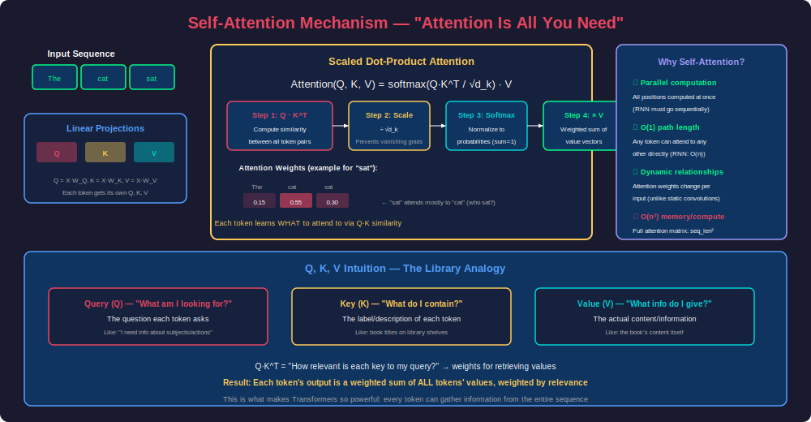
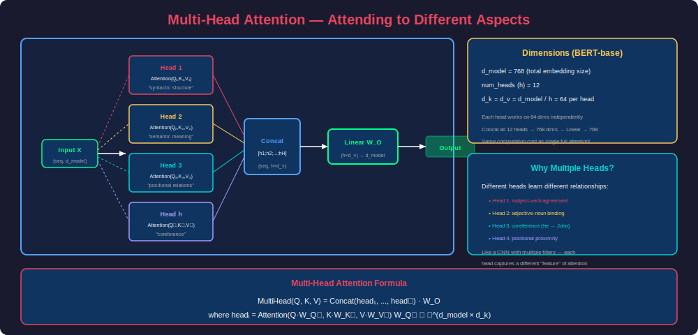
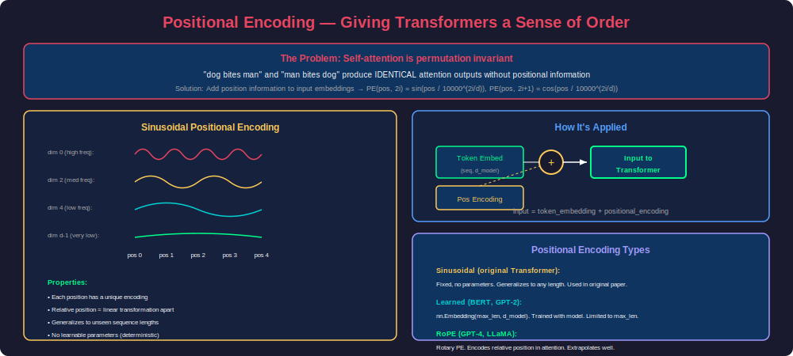
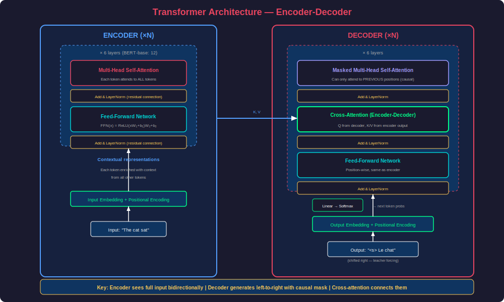
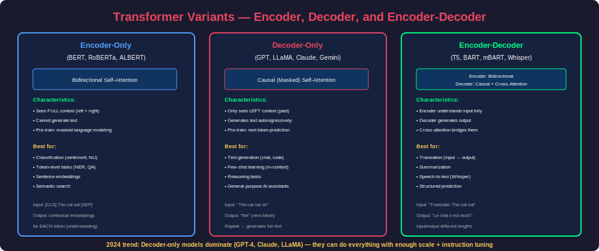

# Phase 19 — Transformers & Attention

## Overview

The Transformer architecture, introduced in the landmark paper *"Attention Is All You Need"* (Vaswani et al., 2017), fundamentally changed deep learning. By replacing recurrence with self-attention, Transformers achieved superior performance while enabling massive parallelization. Today, nearly every state-of-the-art model—from GPT-4 and Claude to BERT and Whisper—is built on Transformer foundations.

This phase covers the complete Transformer architecture from first principles: the self-attention mechanism, multi-head attention, positional encoding strategies, and the encoder-decoder design pattern. You'll implement each component from scratch and understand why this architecture dominates modern AI.

---

## 1. Self-Attention Mechanism

### The Core Problem: Context Understanding

Before Transformers, sequence models (RNNs/LSTMs) processed tokens sequentially—each token could only access information from tokens that came before it (or after it in bidirectional variants). This created two fundamental problems:

1. **Long-range dependencies decay**: Information from early tokens gets diluted through many sequential steps
2. **Sequential bottleneck**: Processing cannot be parallelized across sequence positions

Self-attention solves both: every token can directly attend to every other token in a single step, regardless of distance.



### The Q, K, V Framework

Self-attention introduces three learned projections of each input token:

| Component | Role | Analogy |
|-----------|------|---------|
| **Query (Q)** | "What am I looking for?" | A search query you type |
| **Key (K)** | "What do I contain?" | Index entries / book titles |
| **Value (V)** | "What information do I provide?" | The actual book content |

The attention score between two tokens is the dot product of one token's Query with another token's Key. High scores mean high relevance.

### Mathematical Formulation

$$\text{Attention}(Q, K, V) = \text{softmax}\left(\frac{QK^T}{\sqrt{d_k}}\right) V$$

**Step-by-step breakdown:**

1. **Compute Q, K, V**: Linear projections of input X
   - $Q = XW_Q$, $K = XW_K$, $V = XW_V$
   - Where $W_Q, W_K \in \mathbb{R}^{d_{model} \times d_k}$, $W_V \in \mathbb{R}^{d_{model} \times d_v}$

2. **Compute attention scores**: $QK^T$ gives a (seq_len × seq_len) matrix
   - Entry (i, j) = how much token i should attend to token j

3. **Scale**: Divide by $\sqrt{d_k}$ to prevent softmax saturation
   - Without scaling, large $d_k$ values push dot products into regions where softmax has vanishing gradients

4. **Softmax**: Normalize scores to a probability distribution (rows sum to 1)

5. **Weighted sum**: Multiply attention weights by V to get context-enriched representations

### Implementation from Scratch

```python
import torch
import torch.nn as nn
import torch.nn.functional as F
import math


class ScaledDotProductAttention(nn.Module):
    """Scaled dot-product attention mechanism."""
    
    def __init__(self, dropout=0.1):
        super().__init__()
        self.dropout = nn.Dropout(dropout)
    
    def forward(self, Q, K, V, mask=None):
        """
        Args:
            Q: (batch, heads, seq_len, d_k)
            K: (batch, heads, seq_len, d_k)
            V: (batch, heads, seq_len, d_v)
            mask: optional mask to prevent attending to certain positions
        
        Returns:
            output: (batch, heads, seq_len, d_v)
            attention_weights: (batch, heads, seq_len, seq_len)
        """
        d_k = Q.size(-1)
        
        # Step 1: Compute attention scores
        # (batch, heads, seq_len, d_k) @ (batch, heads, d_k, seq_len)
        # -> (batch, heads, seq_len, seq_len)
        scores = torch.matmul(Q, K.transpose(-2, -1)) / math.sqrt(d_k)
        
        # Step 2: Apply mask (for causal attention or padding)
        if mask is not None:
            scores = scores.masked_fill(mask == 0, float('-inf'))
        
        # Step 3: Softmax normalization
        attention_weights = F.softmax(scores, dim=-1)
        attention_weights = self.dropout(attention_weights)
        
        # Step 4: Weighted sum of values
        output = torch.matmul(attention_weights, V)
        
        return output, attention_weights
```

### Why Scale by √d_k?

Without scaling, when $d_k$ is large, dot products grow in magnitude. Consider:
- If Q and K entries are independent with mean 0, variance 1
- Then $Q \cdot K = \sum_{i=1}^{d_k} q_i k_i$ has variance $d_k$

Large dot products push softmax into regions with extremely small gradients (nearly one-hot), making learning difficult. Dividing by $\sqrt{d_k}$ normalizes the variance back to 1.

```python
def demonstrate_scaling_importance():
    """Show why scaling prevents softmax saturation."""
    d_k = 64
    
    # Random Q and K
    Q = torch.randn(1, 1, 10, d_k)
    K = torch.randn(1, 1, 10, d_k)
    
    # Unscaled scores
    unscaled = torch.matmul(Q, K.transpose(-2, -1))
    print(f"Unscaled scores - Mean: {unscaled.mean():.2f}, Std: {unscaled.std():.2f}")
    # Std ≈ √64 = 8 → softmax becomes nearly one-hot
    
    unscaled_attn = F.softmax(unscaled, dim=-1)
    print(f"Unscaled attention entropy: {-(unscaled_attn * unscaled_attn.log()).sum(-1).mean():.4f}")
    
    # Scaled scores
    scaled = unscaled / math.sqrt(d_k)
    print(f"Scaled scores - Mean: {scaled.mean():.2f}, Std: {scaled.std():.2f}")
    # Std ≈ 1 → softmax gives meaningful distribution
    
    scaled_attn = F.softmax(scaled, dim=-1)
    print(f"Scaled attention entropy: {-(scaled_attn * scaled_attn.log()).sum(-1).mean():.4f}")
```

### Causal (Masked) Attention

For autoregressive generation (GPT-style), each token must only attend to itself and previous tokens—never future tokens. This is enforced with a causal mask:

```python
def create_causal_mask(seq_len, device='cpu'):
    """Create lower-triangular causal mask.
    
    Position i can attend to positions 0..i (inclusive).
    Future positions are masked with -inf before softmax.
    """
    mask = torch.tril(torch.ones(seq_len, seq_len, device=device))
    return mask  # 1 = attend, 0 = mask

# Example: seq_len = 4
# [[1, 0, 0, 0],   ← token 0 sees only itself
#  [1, 1, 0, 0],   ← token 1 sees tokens 0-1
#  [1, 1, 1, 0],   ← token 2 sees tokens 0-2
#  [1, 1, 1, 1]]   ← token 3 sees all tokens
```

### Self-Attention vs Cross-Attention

| Property | Self-Attention | Cross-Attention |
|----------|---------------|-----------------|
| Q source | Same sequence | Decoder tokens |
| K, V source | Same sequence | Encoder output |
| Purpose | Contextualize within sequence | Bridge encoder → decoder |
| Used in | Both encoder and decoder | Decoder only (enc-dec models) |

---

## 2. Multi-Head Attention

### Motivation: Multiple Relationship Types

A single attention head computes one set of attention weights—it can only capture one type of relationship at a time. Language requires understanding multiple simultaneous relationships:

- **Syntactic**: subject-verb agreement ("The dogs **run**")
- **Semantic**: meaning relationships ("bank" → financial vs. river)
- **Coreference**: pronoun resolution ("John said **he** was...")
- **Positional**: nearby word dependencies

Multi-head attention runs multiple attention heads in parallel, each learning different relationship patterns.



### Architecture

$$\text{MultiHead}(Q, K, V) = \text{Concat}(\text{head}_1, ..., \text{head}_h) W_O$$

Where each head is:
$$\text{head}_i = \text{Attention}(QW_Q^i, KW_K^i, VW_V^i)$$

**Key insight**: Each head operates on a smaller dimension ($d_k = d_{model} / h$), so the total computation cost equals single-head attention at full dimension.

### Implementation

```python
class MultiHeadAttention(nn.Module):
    """Multi-head attention with optional causal masking."""
    
    def __init__(self, d_model, num_heads, dropout=0.1):
        super().__init__()
        assert d_model % num_heads == 0, "d_model must be divisible by num_heads"
        
        self.d_model = d_model
        self.num_heads = num_heads
        self.d_k = d_model // num_heads
        
        # Linear projections for Q, K, V (combined for efficiency)
        self.W_Q = nn.Linear(d_model, d_model, bias=False)
        self.W_K = nn.Linear(d_model, d_model, bias=False)
        self.W_V = nn.Linear(d_model, d_model, bias=False)
        
        # Output projection
        self.W_O = nn.Linear(d_model, d_model, bias=False)
        
        self.attention = ScaledDotProductAttention(dropout)
        self.dropout = nn.Dropout(dropout)
    
    def forward(self, query, key, value, mask=None):
        """
        Args:
            query: (batch, seq_len, d_model)
            key: (batch, seq_len, d_model)  [can differ for cross-attention]
            value: (batch, seq_len, d_model)
            mask: optional attention mask
        
        Returns:
            output: (batch, seq_len, d_model)
            attention_weights: (batch, num_heads, seq_len, seq_len)
        """
        batch_size = query.size(0)
        
        # 1. Linear projections: (batch, seq_len, d_model) -> (batch, seq_len, d_model)
        Q = self.W_Q(query)
        K = self.W_K(key)
        V = self.W_V(value)
        
        # 2. Reshape to multiple heads: (batch, seq_len, d_model) -> (batch, num_heads, seq_len, d_k)
        Q = Q.view(batch_size, -1, self.num_heads, self.d_k).transpose(1, 2)
        K = K.view(batch_size, -1, self.num_heads, self.d_k).transpose(1, 2)
        V = V.view(batch_size, -1, self.num_heads, self.d_k).transpose(1, 2)
        
        # 3. Apply attention (in parallel across all heads)
        if mask is not None:
            mask = mask.unsqueeze(1)  # Broadcast across heads
        
        attn_output, attention_weights = self.attention(Q, K, V, mask)
        
        # 4. Concatenate heads: (batch, num_heads, seq_len, d_k) -> (batch, seq_len, d_model)
        attn_output = attn_output.transpose(1, 2).contiguous().view(batch_size, -1, self.d_model)
        
        # 5. Final linear projection
        output = self.W_O(attn_output)
        
        return output, attention_weights


# Verify dimensions
mha = MultiHeadAttention(d_model=512, num_heads=8)
x = torch.randn(2, 10, 512)  # batch=2, seq_len=10, d_model=512
output, weights = mha(x, x, x)  # Self-attention: Q=K=V=x
print(f"Input shape: {x.shape}")          # [2, 10, 512]
print(f"Output shape: {output.shape}")    # [2, 10, 512]
print(f"Weights shape: {weights.shape}")  # [2, 8, 10, 10]
```

### Head Specialization

Research has shown that different heads consistently learn different linguistic functions:

```python
def visualize_attention_heads(model, tokenizer, sentence):
    """Analyze what different attention heads focus on."""
    from transformers import AutoModel, AutoTokenizer
    
    model = AutoModel.from_pretrained("bert-base-uncased", output_attentions=True)
    tokenizer = AutoTokenizer.from_pretrained("bert-base-uncased")
    
    inputs = tokenizer(sentence, return_tensors="pt")
    outputs = model(**inputs)
    
    # outputs.attentions: tuple of (batch, heads, seq_len, seq_len) per layer
    # Layer 0, Head 0 might show positional attention (attend to nearby)
    # Layer 6, Head 8 might show syntactic attention (subject-verb)
    # Layer 11, Head 3 might show semantic attention (coreference)
    
    attentions = outputs.attentions  # 12 layers × 12 heads each
    tokens = tokenizer.convert_ids_to_tokens(inputs['input_ids'][0])
    
    # Print attention pattern for specific head
    layer, head = 6, 8
    attn = attentions[layer][0, head].detach().numpy()
    
    print(f"\nLayer {layer}, Head {head} attention for: '{sentence}'")
    print(f"{'Token':<12} → Top attendees")
    print("-" * 50)
    for i, token in enumerate(tokens):
        top_indices = attn[i].argsort()[-3:][::-1]
        top_tokens = [(tokens[j], f"{attn[i][j]:.3f}") for j in top_indices]
        print(f"{token:<12} → {top_tokens}")
```

### Efficient Multi-Head Attention Variants

```python
class GroupedQueryAttention(nn.Module):
    """GQA: Share K/V heads across groups of Q heads.
    
    Used in LLaMA 2, Mistral - reduces KV cache memory during inference.
    - MHA: num_kv_heads = num_heads (standard)
    - GQA: num_kv_heads < num_heads (grouped)
    - MQA: num_kv_heads = 1 (multi-query, extreme sharing)
    """
    
    def __init__(self, d_model, num_heads, num_kv_heads, dropout=0.1):
        super().__init__()
        assert num_heads % num_kv_heads == 0
        
        self.num_heads = num_heads
        self.num_kv_heads = num_kv_heads
        self.num_groups = num_heads // num_kv_heads
        self.d_k = d_model // num_heads
        
        self.W_Q = nn.Linear(d_model, num_heads * self.d_k, bias=False)
        self.W_K = nn.Linear(d_model, num_kv_heads * self.d_k, bias=False)
        self.W_V = nn.Linear(d_model, num_kv_heads * self.d_k, bias=False)
        self.W_O = nn.Linear(d_model, d_model, bias=False)
        self.dropout = nn.Dropout(dropout)
    
    def forward(self, x, mask=None):
        batch_size, seq_len, _ = x.shape
        
        Q = self.W_Q(x).view(batch_size, seq_len, self.num_heads, self.d_k).transpose(1, 2)
        K = self.W_K(x).view(batch_size, seq_len, self.num_kv_heads, self.d_k).transpose(1, 2)
        V = self.W_V(x).view(batch_size, seq_len, self.num_kv_heads, self.d_k).transpose(1, 2)
        
        # Repeat K, V for each group
        K = K.repeat_interleave(self.num_groups, dim=1)
        V = V.repeat_interleave(self.num_groups, dim=1)
        
        scores = torch.matmul(Q, K.transpose(-2, -1)) / math.sqrt(self.d_k)
        if mask is not None:
            scores = scores.masked_fill(mask == 0, float('-inf'))
        
        attn = F.softmax(scores, dim=-1)
        attn = self.dropout(attn)
        
        output = torch.matmul(attn, V)
        output = output.transpose(1, 2).contiguous().view(batch_size, seq_len, -1)
        return self.W_O(output)
```

---

## 3. Positional Encoding

### The Permutation Invariance Problem

Self-attention treats input as a **set**, not a sequence. The operation $\text{softmax}(QK^T/\sqrt{d_k})V$ is permutation equivariant—if you shuffle input tokens, outputs shuffle the same way. The model has no inherent notion of token order.

Without positional information:
- "dog bites man" = "man bites dog" (identical attention patterns!)
- Word order, which is critical for meaning, is completely lost



### Sinusoidal Positional Encoding (Original Transformer)

The original Transformer uses fixed sinusoidal functions at different frequencies:

$$PE_{(pos, 2i)} = \sin\left(\frac{pos}{10000^{2i/d_{model}}}\right)$$

$$PE_{(pos, 2i+1)} = \cos\left(\frac{pos}{10000^{2i/d_{model}}}\right)$$

**Why sinusoids?**
1. Each position gets a unique encoding
2. Relative positions can be expressed as linear transformations: $PE_{pos+k}$ can be represented as a linear function of $PE_{pos}$
3. Generalizes to sequence lengths longer than seen during training
4. No learnable parameters needed

```python
class SinusoidalPositionalEncoding(nn.Module):
    """Fixed sinusoidal positional encoding from 'Attention Is All You Need'."""
    
    def __init__(self, d_model, max_len=5000, dropout=0.1):
        super().__init__()
        self.dropout = nn.Dropout(dropout)
        
        # Create positional encoding matrix
        pe = torch.zeros(max_len, d_model)
        position = torch.arange(0, max_len, dtype=torch.float).unsqueeze(1)
        
        # Compute division term: 10000^(2i/d_model)
        div_term = torch.exp(
            torch.arange(0, d_model, 2).float() * (-math.log(10000.0) / d_model)
        )
        
        # Apply sin to even indices, cos to odd indices
        pe[:, 0::2] = torch.sin(position * div_term)
        pe[:, 1::2] = torch.cos(position * div_term)
        
        pe = pe.unsqueeze(0)  # (1, max_len, d_model)
        self.register_buffer('pe', pe)
    
    def forward(self, x):
        """
        Args:
            x: (batch, seq_len, d_model) — token embeddings
        Returns:
            (batch, seq_len, d_model) — embeddings + positional encoding
        """
        x = x + self.pe[:, :x.size(1), :]
        return self.dropout(x)


# Demonstrate unique position encodings
pe_module = SinusoidalPositionalEncoding(d_model=512)
dummy = torch.zeros(1, 100, 512)
encoded = pe_module(dummy)

# Each position has a distinct pattern
pos_0 = encoded[0, 0, :8]
pos_1 = encoded[0, 1, :8]
pos_50 = encoded[0, 50, :8]
print(f"Position 0 (first 8 dims): {pos_0}")
print(f"Position 1 (first 8 dims): {pos_1}")
print(f"Position 50 (first 8 dims): {pos_50}")
```

### Learned Positional Embeddings (BERT, GPT-2)

Instead of fixed functions, learn an embedding for each position:

```python
class LearnedPositionalEncoding(nn.Module):
    """Learned positional embedding (BERT, GPT-2 style)."""
    
    def __init__(self, d_model, max_len=512, dropout=0.1):
        super().__init__()
        self.pos_embedding = nn.Embedding(max_len, d_model)
        self.dropout = nn.Dropout(dropout)
    
    def forward(self, x):
        """
        Args:
            x: (batch, seq_len, d_model)
        """
        seq_len = x.size(1)
        positions = torch.arange(seq_len, device=x.device).unsqueeze(0)
        x = x + self.pos_embedding(positions)
        return self.dropout(x)
```

**Trade-offs:**
- ✓ Can learn complex position patterns
- ✓ Slightly better performance in practice for fixed-length tasks
- ✗ Limited to max_len seen during training (no extrapolation)
- ✗ Adds learnable parameters

### Rotary Positional Encoding (RoPE) — Modern Standard

RoPE (used in GPT-4, LLaMA, Mistral) encodes position by rotating the Q and K vectors, so the dot product naturally encodes relative position:

```python
class RotaryPositionalEncoding(nn.Module):
    """RoPE: Rotary Position Embedding.
    
    Key insight: Rotate Q and K vectors such that their dot product
    depends only on relative position (pos_q - pos_k), not absolute positions.
    
    For 2D rotation: R(θ) * [q1, q2]^T rotates the vector by angle θ.
    RoPE applies different rotation frequencies to different dimension pairs.
    """
    
    def __init__(self, d_model, max_len=8192, base=10000):
        super().__init__()
        self.d_model = d_model
        
        # Compute frequency bands
        inv_freq = 1.0 / (base ** (torch.arange(0, d_model, 2).float() / d_model))
        self.register_buffer('inv_freq', inv_freq)
        
        # Precompute sin/cos for positions
        self._build_cache(max_len)
    
    def _build_cache(self, max_len):
        t = torch.arange(max_len, dtype=self.inv_freq.dtype)
        freqs = torch.outer(t, self.inv_freq)
        # Interleave sin and cos
        emb = torch.cat((freqs, freqs), dim=-1)
        self.register_buffer('cos_cached', emb.cos())
        self.register_buffer('sin_cached', emb.sin())
    
    def forward(self, q, k, seq_len):
        """Apply rotary embeddings to Q and K.
        
        Args:
            q, k: (batch, heads, seq_len, d_k)
        """
        cos = self.cos_cached[:seq_len].unsqueeze(0).unsqueeze(0)
        sin = self.sin_cached[:seq_len].unsqueeze(0).unsqueeze(0)
        
        q_rotated = self._rotate(q, cos, sin)
        k_rotated = self._rotate(k, cos, sin)
        
        return q_rotated, k_rotated
    
    def _rotate(self, x, cos, sin):
        """Apply rotation using the identity:
        R(θ)·[x1, x2] = [x1·cos(θ) - x2·sin(θ), x1·sin(θ) + x2·cos(θ)]
        """
        # Split into pairs and rotate
        x1 = x[..., :x.shape[-1] // 2]
        x2 = x[..., x.shape[-1] // 2:]
        
        # Rotate pairs
        rotated = torch.cat([
            x1 * cos[..., :x1.shape[-1]] - x2 * sin[..., :x1.shape[-1]],
            x1 * sin[..., :x1.shape[-1]] + x2 * cos[..., :x1.shape[-1]]
        ], dim=-1)
        
        return rotated
```

**RoPE advantages:**
- Encodes **relative** position (distance between tokens matters, not absolute position)
- Extrapolates well to longer sequences than training
- No additional parameters
- Decays attention naturally with distance (distant tokens have less aligned rotations)

### Positional Encoding Comparison

| Method | Absolute/Relative | Extrapolation | Params | Used In |
|--------|-------------------|---------------|--------|---------|
| Sinusoidal | Absolute | Good | 0 | Original Transformer |
| Learned | Absolute | Poor | max_len × d | BERT, GPT-2 |
| RoPE | Relative | Good | 0 | LLaMA, GPT-4, Mistral |
| ALiBi | Relative | Excellent | 0 | MPT, BLOOM |

---

## 4. The Complete Transformer Architecture

### Encoder-Decoder Design

The original Transformer follows an encoder-decoder pattern designed for sequence-to-sequence tasks (translation, summarization):



### Encoder Block

The encoder processes the full input bidirectionally (every token sees every other token):

```python
class TransformerEncoderLayer(nn.Module):
    """Single encoder layer: Self-Attention → Add&Norm → FFN → Add&Norm"""
    
    def __init__(self, d_model, num_heads, d_ff, dropout=0.1):
        super().__init__()
        
        # Sub-layer 1: Multi-head self-attention
        self.self_attn = MultiHeadAttention(d_model, num_heads, dropout)
        self.norm1 = nn.LayerNorm(d_model)
        
        # Sub-layer 2: Position-wise feed-forward network
        self.ffn = PositionWiseFFN(d_model, d_ff, dropout)
        self.norm2 = nn.LayerNorm(d_model)
        
        self.dropout = nn.Dropout(dropout)
    
    def forward(self, x, mask=None):
        """
        Args:
            x: (batch, seq_len, d_model)
            mask: padding mask
        """
        # Self-attention with residual connection and layer norm
        attn_output, _ = self.self_attn(x, x, x, mask)
        x = self.norm1(x + self.dropout(attn_output))
        
        # Feed-forward with residual connection and layer norm
        ffn_output = self.ffn(x)
        x = self.norm2(x + self.dropout(ffn_output))
        
        return x


class PositionWiseFFN(nn.Module):
    """Position-wise feed-forward network.
    
    FFN(x) = max(0, xW₁ + b₁)W₂ + b₂
    
    Applied independently to each position (same params across positions).
    Expands dimension (d_model → d_ff) then contracts (d_ff → d_model).
    Typically d_ff = 4 × d_model.
    """
    
    def __init__(self, d_model, d_ff, dropout=0.1):
        super().__init__()
        self.linear1 = nn.Linear(d_model, d_ff)
        self.linear2 = nn.Linear(d_ff, d_model)
        self.dropout = nn.Dropout(dropout)
    
    def forward(self, x):
        return self.linear2(self.dropout(F.relu(self.linear1(x))))


class SwiGLU(nn.Module):
    """SwiGLU activation - used in modern transformers (LLaMA, PaLM).
    
    SwiGLU(x) = (xW₁ ⊙ Swish(xW_gate)) W₂
    Better performance than ReLU FFN at same parameter count.
    """
    
    def __init__(self, d_model, d_ff, dropout=0.1):
        super().__init__()
        self.w1 = nn.Linear(d_model, d_ff, bias=False)
        self.w2 = nn.Linear(d_ff, d_model, bias=False)
        self.w_gate = nn.Linear(d_model, d_ff, bias=False)
        self.dropout = nn.Dropout(dropout)
    
    def forward(self, x):
        gate = F.silu(self.w_gate(x))  # Swish activation
        x = self.w1(x) * gate          # Gated linear unit
        x = self.dropout(x)
        return self.w2(x)
```

### Decoder Block

The decoder adds causal masking (prevent seeing future) and cross-attention (attend to encoder output):

```python
class TransformerDecoderLayer(nn.Module):
    """Single decoder layer with three sub-layers:
    1. Masked self-attention (causal)
    2. Cross-attention (attend to encoder)
    3. Feed-forward network
    """
    
    def __init__(self, d_model, num_heads, d_ff, dropout=0.1):
        super().__init__()
        
        # Sub-layer 1: Masked multi-head self-attention
        self.self_attn = MultiHeadAttention(d_model, num_heads, dropout)
        self.norm1 = nn.LayerNorm(d_model)
        
        # Sub-layer 2: Cross-attention (encoder-decoder attention)
        self.cross_attn = MultiHeadAttention(d_model, num_heads, dropout)
        self.norm2 = nn.LayerNorm(d_model)
        
        # Sub-layer 3: Feed-forward network
        self.ffn = PositionWiseFFN(d_model, d_ff, dropout)
        self.norm3 = nn.LayerNorm(d_model)
        
        self.dropout = nn.Dropout(dropout)
    
    def forward(self, x, encoder_output, src_mask=None, tgt_mask=None):
        """
        Args:
            x: decoder input (batch, tgt_len, d_model)
            encoder_output: encoder states (batch, src_len, d_model)
            src_mask: mask for encoder output (padding)
            tgt_mask: causal mask for decoder (lower triangular)
        """
        # 1. Masked self-attention (causal: can't see future tokens)
        self_attn_out, _ = self.self_attn(x, x, x, tgt_mask)
        x = self.norm1(x + self.dropout(self_attn_out))
        
        # 2. Cross-attention: Q from decoder, K/V from encoder
        cross_attn_out, _ = self.cross_attn(x, encoder_output, encoder_output, src_mask)
        x = self.norm2(x + self.dropout(cross_attn_out))
        
        # 3. Feed-forward
        ffn_out = self.ffn(x)
        x = self.norm3(x + self.dropout(ffn_out))
        
        return x
```

### Complete Transformer Model

```python
class Transformer(nn.Module):
    """Complete Transformer for sequence-to-sequence tasks."""
    
    def __init__(
        self,
        src_vocab_size,
        tgt_vocab_size,
        d_model=512,
        num_heads=8,
        num_encoder_layers=6,
        num_decoder_layers=6,
        d_ff=2048,
        max_len=5000,
        dropout=0.1
    ):
        super().__init__()
        
        # Embeddings
        self.src_embedding = nn.Embedding(src_vocab_size, d_model)
        self.tgt_embedding = nn.Embedding(tgt_vocab_size, d_model)
        self.pos_encoding = SinusoidalPositionalEncoding(d_model, max_len, dropout)
        
        # Scale embeddings
        self.scale = math.sqrt(d_model)
        
        # Encoder stack
        self.encoder_layers = nn.ModuleList([
            TransformerEncoderLayer(d_model, num_heads, d_ff, dropout)
            for _ in range(num_encoder_layers)
        ])
        
        # Decoder stack
        self.decoder_layers = nn.ModuleList([
            TransformerDecoderLayer(d_model, num_heads, d_ff, dropout)
            for _ in range(num_decoder_layers)
        ])
        
        # Output projection
        self.output_projection = nn.Linear(d_model, tgt_vocab_size)
        
        self._init_parameters()
    
    def _init_parameters(self):
        """Xavier uniform initialization (from original paper)."""
        for p in self.parameters():
            if p.dim() > 1:
                nn.init.xavier_uniform_(p)
    
    def encode(self, src, src_mask=None):
        """Encode source sequence."""
        x = self.pos_encoding(self.src_embedding(src) * self.scale)
        for layer in self.encoder_layers:
            x = layer(x, src_mask)
        return x
    
    def decode(self, tgt, encoder_output, src_mask=None, tgt_mask=None):
        """Decode target sequence."""
        x = self.pos_encoding(self.tgt_embedding(tgt) * self.scale)
        for layer in self.decoder_layers:
            x = layer(x, encoder_output, src_mask, tgt_mask)
        return x
    
    def forward(self, src, tgt, src_mask=None, tgt_mask=None):
        """
        Args:
            src: source token ids (batch, src_len)
            tgt: target token ids (batch, tgt_len)
        Returns:
            logits: (batch, tgt_len, tgt_vocab_size)
        """
        encoder_output = self.encode(src, src_mask)
        decoder_output = self.decode(tgt, encoder_output, src_mask, tgt_mask)
        logits = self.output_projection(decoder_output)
        return logits


# Example: Translation model
model = Transformer(
    src_vocab_size=32000,
    tgt_vocab_size=32000,
    d_model=512,
    num_heads=8,
    num_encoder_layers=6,
    num_decoder_layers=6,
    d_ff=2048
)

# Count parameters
total_params = sum(p.numel() for p in model.parameters())
print(f"Total parameters: {total_params:,}")  # ~65M for this config
```

### Layer Normalization Variants

Modern Transformers use **Pre-Norm** (normalize before attention) instead of the original **Post-Norm** (normalize after):

```python
class PreNormEncoderLayer(nn.Module):
    """Pre-LayerNorm variant (used in GPT-2+, LLaMA, modern architectures).
    
    Pre-Norm: x + Attention(LayerNorm(x))
    Post-Norm (original): LayerNorm(x + Attention(x))
    
    Pre-Norm trains more stably (doesn't need learning rate warmup).
    """
    
    def __init__(self, d_model, num_heads, d_ff, dropout=0.1):
        super().__init__()
        self.norm1 = nn.LayerNorm(d_model)
        self.self_attn = MultiHeadAttention(d_model, num_heads, dropout)
        self.norm2 = nn.LayerNorm(d_model)
        self.ffn = PositionWiseFFN(d_model, d_ff, dropout)
        self.dropout = nn.Dropout(dropout)
    
    def forward(self, x, mask=None):
        # Pre-norm: normalize BEFORE the sub-layer
        normed = self.norm1(x)
        attn_output, _ = self.self_attn(normed, normed, normed, mask)
        x = x + self.dropout(attn_output)
        
        normed = self.norm2(x)
        ffn_output = self.ffn(normed)
        x = x + self.dropout(ffn_output)
        
        return x


class RMSNorm(nn.Module):
    """Root Mean Square Layer Normalization (LLaMA, Mistral).
    
    Simpler than LayerNorm: no mean subtraction, no bias.
    RMSNorm(x) = x / RMS(x) * γ
    where RMS(x) = sqrt(mean(x²))
    """
    
    def __init__(self, d_model, eps=1e-6):
        super().__init__()
        self.weight = nn.Parameter(torch.ones(d_model))
        self.eps = eps
    
    def forward(self, x):
        rms = torch.sqrt(torch.mean(x ** 2, dim=-1, keepdim=True) + self.eps)
        return x / rms * self.weight
```

### Residual Connections: Why They Matter

Every sub-layer uses a residual connection: $\text{output} = x + \text{SubLayer}(x)$

This is critical because:
1. **Gradient flow**: Gradients can skip sub-layers via the identity path (prevents vanishing)
2. **Depth scaling**: Allows stacking 100+ layers without degradation
3. **Learning refinements**: Each layer learns a small delta, not a full transformation

---

## 5. Transformer Variants



### Encoder-Only Models (BERT Family)

Use bidirectional self-attention—every token sees the full sequence. Cannot generate text.

```python
class BERTEncoder(nn.Module):
    """BERT-style encoder-only Transformer.
    
    Pre-training: Masked Language Modeling (predict [MASK] tokens)
    Fine-tuning: Classification, NER, QA, etc.
    """
    
    def __init__(self, vocab_size, d_model=768, num_heads=12, num_layers=12,
                 d_ff=3072, max_len=512, dropout=0.1):
        super().__init__()
        
        self.token_embedding = nn.Embedding(vocab_size, d_model)
        self.position_embedding = nn.Embedding(max_len, d_model)
        self.segment_embedding = nn.Embedding(2, d_model)  # Sentence A/B
        self.norm = nn.LayerNorm(d_model)
        self.dropout = nn.Dropout(dropout)
        
        self.encoder_layers = nn.ModuleList([
            TransformerEncoderLayer(d_model, num_heads, d_ff, dropout)
            for _ in range(num_layers)
        ])
        
        # MLM prediction head
        self.mlm_head = nn.Sequential(
            nn.Linear(d_model, d_model),
            nn.GELU(),
            nn.LayerNorm(d_model),
            nn.Linear(d_model, vocab_size)
        )
    
    def forward(self, input_ids, segment_ids=None, attention_mask=None):
        seq_len = input_ids.size(1)
        positions = torch.arange(seq_len, device=input_ids.device).unsqueeze(0)
        
        if segment_ids is None:
            segment_ids = torch.zeros_like(input_ids)
        
        # Combine embeddings
        x = (self.token_embedding(input_ids) +
             self.position_embedding(positions) +
             self.segment_embedding(segment_ids))
        x = self.norm(x)
        x = self.dropout(x)
        
        # Pass through encoder stack (bidirectional - no causal mask)
        for layer in self.encoder_layers:
            x = layer(x, attention_mask)
        
        return x  # (batch, seq_len, d_model) - contextual embeddings for all tokens
```

### Decoder-Only Models (GPT Family)

Use causal self-attention—each token only sees previous tokens. Dominant architecture for generation.

```python
class GPTDecoder(nn.Module):
    """GPT-style decoder-only Transformer.
    
    Pre-training: Next token prediction (causal language modeling)
    The same architecture scales from GPT-1 (117M) to GPT-4 (rumored 1.8T).
    """
    
    def __init__(self, vocab_size, d_model=768, num_heads=12, num_layers=12,
                 d_ff=3072, max_len=1024, dropout=0.1):
        super().__init__()
        
        self.token_embedding = nn.Embedding(vocab_size, d_model)
        self.position_embedding = nn.Embedding(max_len, d_model)
        self.dropout = nn.Dropout(dropout)
        
        self.layers = nn.ModuleList([
            PreNormEncoderLayer(d_model, num_heads, d_ff, dropout)
            for _ in range(num_layers)
        ])
        
        self.final_norm = nn.LayerNorm(d_model)
        self.lm_head = nn.Linear(d_model, vocab_size, bias=False)
        
        # Weight tying: share embedding and output weights
        self.lm_head.weight = self.token_embedding.weight
    
    def forward(self, input_ids):
        batch_size, seq_len = input_ids.shape
        device = input_ids.device
        
        positions = torch.arange(seq_len, device=device).unsqueeze(0)
        
        # Token + position embeddings
        x = self.token_embedding(input_ids) + self.position_embedding(positions)
        x = self.dropout(x)
        
        # Causal mask: lower triangular
        causal_mask = torch.tril(torch.ones(seq_len, seq_len, device=device))
        causal_mask = causal_mask.unsqueeze(0).unsqueeze(0)
        
        # Pass through decoder stack
        for layer in self.layers:
            x = layer(x, causal_mask)
        
        x = self.final_norm(x)
        logits = self.lm_head(x)
        
        return logits  # (batch, seq_len, vocab_size)
    
    @torch.no_grad()
    def generate(self, input_ids, max_new_tokens=100, temperature=1.0, top_k=50):
        """Autoregressive generation with top-k sampling."""
        for _ in range(max_new_tokens):
            # Crop to max context length
            context = input_ids[:, -self.position_embedding.num_embeddings:]
            
            logits = self.forward(context)
            logits = logits[:, -1, :] / temperature  # Last position only
            
            # Top-k filtering
            if top_k > 0:
                top_k_values, _ = torch.topk(logits, top_k)
                logits[logits < top_k_values[:, [-1]]] = float('-inf')
            
            probs = F.softmax(logits, dim=-1)
            next_token = torch.multinomial(probs, num_samples=1)
            input_ids = torch.cat([input_ids, next_token], dim=1)
        
        return input_ids
```

### Encoder-Decoder Models (T5 Family)

Full encoder-decoder with cross-attention. Best for sequence-to-sequence tasks where input and output are different.

```python
class T5ForConditionalGeneration(nn.Module):
    """T5-style encoder-decoder model.
    
    Frames ALL tasks as text-to-text:
    - Translation: "translate English to French: The house is wonderful."
    - Summarization: "summarize: Long article text..."
    - Classification: "sentiment: This movie was great!" → "positive"
    """
    
    def __init__(self, vocab_size, d_model=512, num_heads=8,
                 num_encoder_layers=6, num_decoder_layers=6,
                 d_ff=2048, max_len=512, dropout=0.1):
        super().__init__()
        
        self.shared_embedding = nn.Embedding(vocab_size, d_model)
        self.pos_encoding = SinusoidalPositionalEncoding(d_model, max_len, dropout)
        self.scale = math.sqrt(d_model)
        
        self.encoder_layers = nn.ModuleList([
            TransformerEncoderLayer(d_model, num_heads, d_ff, dropout)
            for _ in range(num_encoder_layers)
        ])
        
        self.decoder_layers = nn.ModuleList([
            TransformerDecoderLayer(d_model, num_heads, d_ff, dropout)
            for _ in range(num_decoder_layers)
        ])
        
        self.final_norm = nn.LayerNorm(d_model)
        self.lm_head = nn.Linear(d_model, vocab_size, bias=False)
    
    def encode(self, src_ids, src_mask=None):
        x = self.pos_encoding(self.shared_embedding(src_ids) * self.scale)
        for layer in self.encoder_layers:
            x = layer(x, src_mask)
        return x
    
    def decode(self, tgt_ids, encoder_output, src_mask=None, tgt_mask=None):
        x = self.pos_encoding(self.shared_embedding(tgt_ids) * self.scale)
        for layer in self.decoder_layers:
            x = layer(x, encoder_output, src_mask, tgt_mask)
        x = self.final_norm(x)
        return self.lm_head(x)
```

---

## 6. Training a Transformer

### Learning Rate Schedule: Warmup + Decay

The original Transformer uses a specific learning rate schedule critical for stable training:

```python
class TransformerLRScheduler:
    """Noam learning rate scheduler from 'Attention Is All You Need'.
    
    lr = d_model^(-0.5) * min(step^(-0.5), step * warmup_steps^(-1.5))
    
    Warmup: Linearly increase LR for warmup_steps
    Decay: Then decrease proportionally to 1/√step
    """
    
    def __init__(self, optimizer, d_model, warmup_steps=4000):
        self.optimizer = optimizer
        self.d_model = d_model
        self.warmup_steps = warmup_steps
        self.step_num = 0
    
    def step(self):
        self.step_num += 1
        lr = self._compute_lr()
        for param_group in self.optimizer.param_groups:
            param_group['lr'] = lr
        return lr
    
    def _compute_lr(self):
        step = self.step_num
        return (self.d_model ** -0.5) * min(
            step ** -0.5,
            step * self.warmup_steps ** -1.5
        )


# Modern approach: Cosine annealing with warmup
class CosineWarmupScheduler:
    """Cosine annealing with linear warmup (used in most modern LLMs)."""
    
    def __init__(self, optimizer, warmup_steps, total_steps, min_lr=1e-5):
        self.optimizer = optimizer
        self.warmup_steps = warmup_steps
        self.total_steps = total_steps
        self.min_lr = min_lr
        self.base_lr = optimizer.param_groups[0]['lr']
        self.step_num = 0
    
    def step(self):
        self.step_num += 1
        if self.step_num <= self.warmup_steps:
            lr = self.base_lr * self.step_num / self.warmup_steps
        else:
            progress = (self.step_num - self.warmup_steps) / (self.total_steps - self.warmup_steps)
            lr = self.min_lr + 0.5 * (self.base_lr - self.min_lr) * (1 + math.cos(math.pi * progress))
        
        for param_group in self.optimizer.param_groups:
            param_group['lr'] = lr
        return lr
```

### Label Smoothing

Prevents the model from becoming overconfident (output distributions too peaked):

```python
class LabelSmoothingLoss(nn.Module):
    """Label smoothing cross-entropy loss.
    
    Instead of hard targets [0, 0, 1, 0, ...], use soft targets:
    [ε/(V-1), ε/(V-1), 1-ε, ε/(V-1), ...]
    
    Prevents overconfidence and improves generalization.
    """
    
    def __init__(self, vocab_size, smoothing=0.1, padding_idx=None):
        super().__init__()
        self.vocab_size = vocab_size
        self.smoothing = smoothing
        self.padding_idx = padding_idx
        self.confidence = 1.0 - smoothing
    
    def forward(self, logits, targets):
        """
        Args:
            logits: (batch * seq_len, vocab_size)
            targets: (batch * seq_len,)
        """
        log_probs = F.log_softmax(logits, dim=-1)
        
        # KL divergence with smooth distribution
        smooth_loss = -log_probs.mean(dim=-1)
        nll_loss = -log_probs.gather(dim=-1, index=targets.unsqueeze(1)).squeeze(1)
        
        loss = self.confidence * nll_loss + self.smoothing * smooth_loss
        
        if self.padding_idx is not None:
            mask = targets != self.padding_idx
            loss = loss * mask
            return loss.sum() / mask.sum()
        
        return loss.mean()
```

### Complete Training Loop

```python
def train_transformer(model, train_loader, val_loader, config):
    """Production training loop for Transformer model."""
    
    optimizer = torch.optim.AdamW(
        model.parameters(),
        lr=config['lr'],
        betas=(0.9, 0.98),
        eps=1e-9,
        weight_decay=0.01
    )
    
    scheduler = CosineWarmupScheduler(
        optimizer,
        warmup_steps=config['warmup_steps'],
        total_steps=config['total_steps']
    )
    
    criterion = LabelSmoothingLoss(
        vocab_size=config['vocab_size'],
        smoothing=0.1,
        padding_idx=config['pad_token_id']
    )
    
    scaler = torch.cuda.amp.GradScaler()  # Mixed precision
    
    model.train()
    for epoch in range(config['epochs']):
        total_loss = 0
        
        for batch_idx, batch in enumerate(train_loader):
            src = batch['src_ids'].cuda()
            tgt = batch['tgt_ids'].cuda()
            
            # Teacher forcing: input is tgt[:-1], target is tgt[1:]
            tgt_input = tgt[:, :-1]
            tgt_target = tgt[:, 1:]
            
            # Create masks
            src_mask = (src != config['pad_token_id']).unsqueeze(1).unsqueeze(2)
            tgt_mask = create_causal_mask(tgt_input.size(1), device=src.device)
            
            # Forward pass with mixed precision
            with torch.cuda.amp.autocast():
                logits = model(src, tgt_input, src_mask, tgt_mask)
                loss = criterion(
                    logits.reshape(-1, config['vocab_size']),
                    tgt_target.reshape(-1)
                )
            
            # Backward pass
            scaler.scale(loss).backward()
            
            # Gradient clipping (critical for Transformer stability)
            scaler.unscale_(optimizer)
            torch.nn.utils.clip_grad_norm_(model.parameters(), max_norm=1.0)
            
            scaler.step(optimizer)
            scaler.update()
            optimizer.zero_grad()
            scheduler.step()
            
            total_loss += loss.item()
            
            if batch_idx % 100 == 0:
                avg_loss = total_loss / (batch_idx + 1)
                lr = optimizer.param_groups[0]['lr']
                print(f"Epoch {epoch}, Batch {batch_idx}, Loss: {avg_loss:.4f}, LR: {lr:.6f}")
        
        # Validation
        val_loss = evaluate(model, val_loader, criterion, config)
        print(f"Epoch {epoch} - Val Loss: {val_loss:.4f}")


def evaluate(model, val_loader, criterion, config):
    """Evaluate model on validation set."""
    model.eval()
    total_loss = 0
    total_tokens = 0
    
    with torch.no_grad():
        for batch in val_loader:
            src = batch['src_ids'].cuda()
            tgt = batch['tgt_ids'].cuda()
            
            tgt_input = tgt[:, :-1]
            tgt_target = tgt[:, 1:]
            
            src_mask = (src != config['pad_token_id']).unsqueeze(1).unsqueeze(2)
            tgt_mask = create_causal_mask(tgt_input.size(1), device=src.device)
            
            logits = model(src, tgt_input, src_mask, tgt_mask)
            loss = criterion(
                logits.reshape(-1, config['vocab_size']),
                tgt_target.reshape(-1)
            )
            
            num_tokens = (tgt_target != config['pad_token_id']).sum().item()
            total_loss += loss.item() * num_tokens
            total_tokens += num_tokens
    
    model.train()
    return total_loss / total_tokens
```

---

## 7. Inference & Generation Strategies

### Greedy Decoding vs. Sampling

```python
class TransformerGenerator:
    """Generation strategies for decoder-based Transformers."""
    
    def __init__(self, model, tokenizer):
        self.model = model
        self.tokenizer = tokenizer
    
    @torch.no_grad()
    def greedy_decode(self, src, max_len=100):
        """Always pick the highest-probability token."""
        encoder_output = self.model.encode(src)
        
        # Start with <bos> token
        tgt = torch.tensor([[self.tokenizer.bos_token_id]], device=src.device)
        
        for _ in range(max_len):
            tgt_mask = create_causal_mask(tgt.size(1), device=src.device)
            output = self.model.decode(tgt, encoder_output, tgt_mask=tgt_mask)
            
            next_token = output[:, -1, :].argmax(dim=-1, keepdim=True)
            tgt = torch.cat([tgt, next_token], dim=1)
            
            if next_token.item() == self.tokenizer.eos_token_id:
                break
        
        return tgt
    
    @torch.no_grad()
    def nucleus_sampling(self, src, max_len=100, temperature=0.8, top_p=0.9):
        """Top-p (nucleus) sampling for diverse generation."""
        encoder_output = self.model.encode(src)
        tgt = torch.tensor([[self.tokenizer.bos_token_id]], device=src.device)
        
        for _ in range(max_len):
            tgt_mask = create_causal_mask(tgt.size(1), device=src.device)
            output = self.model.decode(tgt, encoder_output, tgt_mask=tgt_mask)
            
            logits = output[:, -1, :] / temperature
            
            # Sort by probability
            sorted_logits, sorted_indices = torch.sort(logits, descending=True)
            cumulative_probs = torch.cumsum(F.softmax(sorted_logits, dim=-1), dim=-1)
            
            # Remove tokens above the threshold
            sorted_mask = cumulative_probs - F.softmax(sorted_logits, dim=-1) >= top_p
            sorted_logits[sorted_mask] = float('-inf')
            
            # Sample from filtered distribution
            probs = F.softmax(sorted_logits, dim=-1)
            sampled_idx = torch.multinomial(probs, num_samples=1)
            next_token = sorted_indices.gather(-1, sampled_idx)
            
            tgt = torch.cat([tgt, next_token], dim=1)
            
            if next_token.item() == self.tokenizer.eos_token_id:
                break
        
        return tgt
    
    @torch.no_grad()
    def beam_search(self, src, beam_width=5, max_len=100, length_penalty=0.6):
        """Beam search for higher-quality translations."""
        encoder_output = self.model.encode(src)
        device = src.device
        
        # Initialize beams: (score, sequence)
        beams = [(0.0, torch.tensor([[self.tokenizer.bos_token_id]], device=device))]
        completed = []
        
        for step in range(max_len):
            all_candidates = []
            
            for score, seq in beams:
                if seq[0, -1].item() == self.tokenizer.eos_token_id:
                    completed.append((score, seq))
                    continue
                
                tgt_mask = create_causal_mask(seq.size(1), device=device)
                output = self.model.decode(seq, encoder_output, tgt_mask=tgt_mask)
                log_probs = F.log_softmax(output[:, -1, :], dim=-1)
                
                # Get top-k next tokens
                top_log_probs, top_indices = log_probs.topk(beam_width)
                
                for i in range(beam_width):
                    new_score = score + top_log_probs[0, i].item()
                    new_seq = torch.cat([seq, top_indices[:, i:i+1]], dim=1)
                    all_candidates.append((new_score, new_seq))
            
            if not all_candidates:
                break
            
            # Apply length penalty and select top beams
            def score_fn(item):
                s, seq = item
                return s / (seq.size(1) ** length_penalty)
            
            all_candidates.sort(key=score_fn, reverse=True)
            beams = all_candidates[:beam_width]
        
        completed.extend(beams)
        completed.sort(key=lambda x: x[0] / (x[1].size(1) ** length_penalty), reverse=True)
        
        return completed[0][1]
```

### KV-Cache for Efficient Inference

During autoregressive generation, naive implementation recomputes attention for all previous tokens at each step. KV-Cache stores past key/value computations:

```python
class CachedMultiHeadAttention(nn.Module):
    """Multi-head attention with KV-cache for efficient generation."""
    
    def __init__(self, d_model, num_heads, dropout=0.1):
        super().__init__()
        self.num_heads = num_heads
        self.d_k = d_model // num_heads
        
        self.W_Q = nn.Linear(d_model, d_model, bias=False)
        self.W_K = nn.Linear(d_model, d_model, bias=False)
        self.W_V = nn.Linear(d_model, d_model, bias=False)
        self.W_O = nn.Linear(d_model, d_model, bias=False)
    
    def forward(self, x, kv_cache=None, use_cache=False):
        """
        During generation:
        - First token: compute full K, V and cache them
        - Subsequent tokens: only compute K, V for new token, append to cache
        
        This reduces per-step computation from O(n²) to O(n).
        """
        batch_size = x.size(0)
        
        Q = self.W_Q(x).view(batch_size, -1, self.num_heads, self.d_k).transpose(1, 2)
        K = self.W_K(x).view(batch_size, -1, self.num_heads, self.d_k).transpose(1, 2)
        V = self.W_V(x).view(batch_size, -1, self.num_heads, self.d_k).transpose(1, 2)
        
        if kv_cache is not None:
            # Append new K, V to cache
            K = torch.cat([kv_cache[0], K], dim=2)
            V = torch.cat([kv_cache[1], V], dim=2)
        
        new_cache = (K, V) if use_cache else None
        
        # Standard attention
        scores = torch.matmul(Q, K.transpose(-2, -1)) / math.sqrt(self.d_k)
        attn = F.softmax(scores, dim=-1)
        output = torch.matmul(attn, V)
        
        output = output.transpose(1, 2).contiguous().view(batch_size, -1, self.num_heads * self.d_k)
        return self.W_O(output), new_cache
```

---

## 8. Efficient Attention Mechanisms

The O(n²) complexity of standard attention becomes prohibitive for long sequences. Several approaches reduce this:

### Flash Attention

```python
# Flash Attention (hardware-aware implementation)
# Instead of materializing the full N×N attention matrix in HBM,
# it tiles the computation to stay in SRAM (fast on-chip memory).
# Same exact result, just computed more efficiently.

# In PyTorch 2.0+:
from torch.nn.functional import scaled_dot_product_attention

# Automatically uses Flash Attention when available
output = scaled_dot_product_attention(
    query, key, value,
    attn_mask=mask,
    dropout_p=0.1 if training else 0.0,
    is_causal=True  # Applies causal mask efficiently
)
# Memory: O(N) instead of O(N²) — no materialized attention matrix
```

### Sliding Window Attention (Mistral)

```python
class SlidingWindowAttention(nn.Module):
    """Each token attends only to the W nearest tokens.
    
    Complexity: O(N × W) instead of O(N²)
    Used in Mistral, Longformer (local attention component).
    
    Key insight: Information still propagates globally through
    stacking layers — after L layers, receptive field = L × W.
    """
    
    def __init__(self, d_model, num_heads, window_size=256, dropout=0.1):
        super().__init__()
        self.window_size = window_size
        self.num_heads = num_heads
        self.d_k = d_model // num_heads
        
        self.W_Q = nn.Linear(d_model, d_model, bias=False)
        self.W_K = nn.Linear(d_model, d_model, bias=False)
        self.W_V = nn.Linear(d_model, d_model, bias=False)
        self.W_O = nn.Linear(d_model, d_model, bias=False)
    
    def forward(self, x):
        batch_size, seq_len, _ = x.shape
        
        Q = self.W_Q(x).view(batch_size, seq_len, self.num_heads, self.d_k).transpose(1, 2)
        K = self.W_K(x).view(batch_size, seq_len, self.num_heads, self.d_k).transpose(1, 2)
        V = self.W_V(x).view(batch_size, seq_len, self.num_heads, self.d_k).transpose(1, 2)
        
        # Create sliding window mask
        mask = torch.zeros(seq_len, seq_len, device=x.device)
        for i in range(seq_len):
            start = max(0, i - self.window_size)
            mask[i, start:i+1] = 1  # Causal + windowed
        
        scores = torch.matmul(Q, K.transpose(-2, -1)) / math.sqrt(self.d_k)
        scores = scores.masked_fill(mask.unsqueeze(0).unsqueeze(0) == 0, float('-inf'))
        
        attn = F.softmax(scores, dim=-1)
        output = torch.matmul(attn, V)
        
        output = output.transpose(1, 2).contiguous().view(batch_size, seq_len, -1)
        return self.W_O(output)
```

### Comparison of Efficient Attention Methods

| Method | Complexity | Max Context | Exact? | Used In |
|--------|-----------|-------------|--------|---------|
| Standard | O(n²) | ~2K-8K | Yes | BERT, GPT-2 |
| Flash Attention | O(n²) time, O(n) memory | 8K-128K | Yes | GPT-4, Claude, LLaMA 2+ |
| Sliding Window | O(n × w) | ~32K | No (local) | Mistral, Longformer |
| Ring Attention | O(n²/devices) | 1M+ | Yes | Long-context research |
| Linear Attention | O(n) | Unlimited | No (approximation) | Research |

---

## 9. Modern Transformer Architectures at Scale

### Key Scaling Insights

```python
# GPT-3 175B configuration
gpt3_config = {
    'd_model': 12288,
    'num_heads': 96,
    'num_layers': 96,
    'd_ff': 4 * 12288,  # 49152
    'vocab_size': 50257,
    'max_len': 2048,
    'total_params': '175B'
}

# LLaMA 2 70B configuration (modern best practices)
llama2_config = {
    'd_model': 8192,
    'num_heads': 64,
    'num_kv_heads': 8,          # Grouped query attention
    'num_layers': 80,
    'd_ff': 28672,              # ~3.5x d_model (SwiGLU adjusts ratio)
    'vocab_size': 32000,
    'max_len': 4096,
    'rope_theta': 10000,        # RoPE base frequency
    'norm': 'RMSNorm',          # Instead of LayerNorm
    'activation': 'SwiGLU',     # Instead of ReLU
    'total_params': '70B'
}

# Architectural improvements in modern LLMs:
# 1. Pre-Norm (normalize before attention, not after)
# 2. RMSNorm (simpler, no mean subtraction)
# 3. SwiGLU (gated activation in FFN)
# 4. RoPE (rotary positional encoding)
# 5. GQA (grouped query attention for efficient KV cache)
# 6. No bias terms (slight efficiency gain at scale)
# 7. Flash Attention (hardware-aware attention computation)
```

### Using Pre-trained Transformers (HuggingFace)

```python
from transformers import (
    AutoModel, AutoTokenizer, AutoModelForCausalLM,
    AutoModelForSequenceClassification, pipeline
)

# Encoder-only: BERT for classification
classifier = pipeline("sentiment-analysis", model="bert-base-uncased")
result = classifier("This movie was absolutely fantastic!")
print(result)  # [{'label': 'POSITIVE', 'score': 0.9998}]

# Decoder-only: GPT-2 for generation
generator = pipeline("text-generation", model="gpt2")
text = generator("The future of AI is", max_length=50, temperature=0.7)
print(text[0]['generated_text'])

# Encoder-decoder: T5 for summarization
summarizer = pipeline("summarization", model="t5-small")
article = """Transformers have revolutionized natural language processing since 
their introduction in 2017. The self-attention mechanism allows models to process 
all positions in a sequence simultaneously, unlike recurrent models that process 
tokens one at a time. This parallelism enables training on much larger datasets."""
summary = summarizer(article, max_length=30)
print(summary[0]['summary_text'])

# Fine-tuning a pre-trained model
from transformers import Trainer, TrainingArguments

model = AutoModelForSequenceClassification.from_pretrained(
    "bert-base-uncased",
    num_labels=2
)
tokenizer = AutoTokenizer.from_pretrained("bert-base-uncased")

training_args = TrainingArguments(
    output_dir="./results",
    num_train_epochs=3,
    per_device_train_batch_size=16,
    learning_rate=2e-5,
    warmup_ratio=0.1,
    weight_decay=0.01,
    fp16=True,
)

trainer = Trainer(
    model=model,
    args=training_args,
    train_dataset=train_dataset,
    eval_dataset=eval_dataset,
)

trainer.train()
```

---

## 10. Attention Visualization & Interpretation

```python
import matplotlib.pyplot as plt
import seaborn as sns
import numpy as np


def visualize_attention_matrix(attention_weights, tokens, layer=0, head=0):
    """Visualize attention pattern for a specific head."""
    # attention_weights: (layers, heads, seq_len, seq_len) or similar
    attn = attention_weights[layer][0, head].detach().cpu().numpy()
    
    fig, ax = plt.subplots(figsize=(10, 8))
    sns.heatmap(
        attn, xticklabels=tokens, yticklabels=tokens,
        cmap='viridis', ax=ax, square=True
    )
    ax.set_title(f'Attention - Layer {layer}, Head {head}')
    ax.set_xlabel('Key (attending to)')
    ax.set_ylabel('Query (attending from)')
    plt.tight_layout()
    plt.savefig('attention_heatmap.png', dpi=150)
    plt.show()


def analyze_attention_patterns(model, tokenizer, sentences):
    """Identify common attention patterns across layers and heads."""
    patterns = {
        'positional': [],    # Attend to adjacent tokens
        'syntactic': [],     # Subject-verb patterns
        'separator': [],     # Attend to [SEP]/[CLS]
        'uniform': [],       # Nearly uniform attention
    }
    
    for sentence in sentences:
        inputs = tokenizer(sentence, return_tensors="pt")
        outputs = model(**inputs, output_attentions=True)
        
        for layer_idx, layer_attn in enumerate(outputs.attentions):
            attn = layer_attn[0].detach().numpy()  # (heads, seq, seq)
            
            for head_idx in range(attn.shape[0]):
                head_attn = attn[head_idx]
                
                # Check for positional pattern (diagonal dominance)
                diag_strength = np.mean(np.diag(head_attn))
                if diag_strength > 0.3:
                    patterns['positional'].append((layer_idx, head_idx))
                
                # Check for uniform pattern (high entropy)
                entropy = -np.sum(head_attn * np.log(head_attn + 1e-10), axis=-1).mean()
                seq_len = head_attn.shape[0]
                max_entropy = np.log(seq_len)
                if entropy > 0.9 * max_entropy:
                    patterns['uniform'].append((layer_idx, head_idx))
    
    return patterns
```

---

## Interview Mastery

### Conceptual Questions

**Q: Explain the self-attention mechanism. Why is it called "self" attention?**

A: Self-attention allows each token in a sequence to compute attention scores with **every other token in the same sequence** (hence "self" — the sequence attends to itself). Each token produces a Query (what it's looking for), Key (what it advertises about itself), and Value (information it provides). The attention score between tokens i and j is computed as $Q_i \cdot K_j / \sqrt{d_k}$, normalized via softmax across all positions. The output for each token is a weighted sum of all Value vectors, where weights reflect relevance. This replaces the sequential processing of RNNs with fully parallel, direct token-to-token communication regardless of distance.

---

**Q: Why divide by √d_k in scaled dot-product attention?**

A: When $d_k$ is large, the dot products $Q \cdot K$ grow proportionally (variance = $d_k$ for unit-variance inputs). Large-magnitude inputs to softmax produce extremely peaked distributions (nearly one-hot), which have near-zero gradients for most positions—this creates a vanishing gradient problem. Dividing by $\sqrt{d_k}$ normalizes the variance back to 1, keeping softmax in a regime where gradients flow and the model can learn meaningful attention distributions rather than hard assignments.

---

**Q: What is the difference between self-attention and cross-attention?**

A: In **self-attention**, Q, K, and V all come from the same sequence—a token attends to other tokens within its own sequence. In **cross-attention** (encoder-decoder attention), Q comes from one sequence (decoder) while K and V come from a different sequence (encoder output). This allows the decoder to "look at" the encoder's representation of the input while generating output. Cross-attention is the bridge that connects encoder understanding to decoder generation in encoder-decoder models.

---

**Q: Why use multiple attention heads instead of a single large one?**

A: A single attention head can only learn one attention pattern per layer. Language requires simultaneously tracking multiple relationship types: syntactic dependencies (subject-verb), semantic relations (meaning similarity), coreference (pronoun resolution), and positional proximity. Multi-head attention runs h independent attention heads, each with $d_k = d_{model}/h$ dimensions, then concatenates results. Each head specializes in different patterns. Crucially, because each head operates on a smaller dimension, the total computation cost equals single-head attention at full dimension—it's strictly better at no extra cost.

---

**Q: Why do Transformers need positional encoding?**

A: Self-attention is **permutation equivariant**—shuffling input tokens shuffles output in the same way, with no change in attention patterns. The model has zero inherent knowledge of token ordering. Without positional encoding, "dog bites man" and "man bites dog" produce identical representations. Positional encoding injects order information by adding a unique position-dependent signal to each token's embedding, allowing the model to distinguish different orderings.

---

**Q: Compare sinusoidal vs. learned vs. RoPE positional encodings.**

A: **Sinusoidal** (original Transformer): Fixed sin/cos functions at different frequencies. Generalizes to any length, no parameters, but encodes absolute position. **Learned** (BERT, GPT-2): An embedding lookup for each position. Can learn complex patterns but limited to max_len and doesn't extrapolate. **RoPE** (LLaMA, GPT-4): Rotates Q and K vectors by position-dependent angles so their dot product encodes relative distance. No parameters, extrapolates well, and naturally decays attention with distance. RoPE is the current standard for modern LLMs.

---

**Q: Explain the encoder-only vs. decoder-only vs. encoder-decoder paradigm.**

A: **Encoder-only** (BERT): Bidirectional attention—every token sees the full context. Pre-trained with masked language modeling. Excels at understanding tasks (classification, NER, search) but cannot generate text. **Decoder-only** (GPT, Claude, LLaMA): Causal attention—tokens only see past context. Pre-trained with next-token prediction. Generates text autoregressively and can do virtually any task through prompting at sufficient scale. **Encoder-decoder** (T5, BART, Whisper): Encoder understands input bidirectionally, decoder generates output autoregressively, cross-attention bridges them. Natural fit for input→output tasks (translation, summarization, speech-to-text) where input and output have different structures.

---

**Q: Why has the decoder-only architecture become dominant?**

A: Several factors: (1) **Scaling simplicity**—one architecture, one training objective (next-token prediction), scales cleanly. (2) **Emergent capabilities**—at sufficient scale, decoder-only models develop in-context learning, reasoning, and instruction-following without architectural changes. (3) **Generality**—any task can be framed as text generation (classification, extraction, reasoning all expressed as generated text). (4) **Training efficiency**—every token in the training data provides a gradient signal (unlike MLM which only trains on masked positions). (5) **Inference simplicity**—KV-cache enables efficient autoregressive generation without separate encoder/decoder management.

---

**Q: What is the KV-cache and why is it important for inference?**

A: During autoregressive generation, each new token requires attending to all previous tokens. Without caching, generating token N requires recomputing attention for all N-1 previous tokens—making total generation cost O(n²). The KV-cache stores the Key and Value projections for all previous positions. When generating the next token, only its Q needs to be computed and attend to the cached K, V vectors. This reduces per-step computation from O(n) to O(1) for the new token (still O(n) for attending to past). The memory cost is O(n × layers × heads × d_k) per sequence, which becomes the primary bottleneck for long-context generation.

---

**Q: What are the computational bottlenecks of Transformers and how are they addressed?**

A: The main bottleneck is O(n²) attention complexity in both memory and compute. Solutions: **Flash Attention** keeps the same O(n²) compute but reduces memory to O(n) by tiling computation to stay in fast SRAM instead of materializing the full attention matrix in HBM. **Sliding window attention** (Mistral) limits each token to attending within a local window (O(n×w)), relying on layer stacking for global information flow. **Grouped Query Attention** reduces KV-cache memory by sharing K/V heads across multiple Q heads. **Ring Attention** distributes sequence across devices for million-token contexts. **Sparse attention** patterns attend only to selected positions.

---

**Q: Explain teacher forcing and why it's used in training encoder-decoder models.**

A: During training, the decoder receives the **ground-truth** previous tokens as input rather than its own predictions from the previous step. This is "teacher forcing"—the teacher (ground truth) forces the correct context at each position. Benefits: (1) Training is fully parallelizable—all decoder positions can be computed simultaneously since inputs are known. (2) The model receives stable learning signal without cascading errors from early mistakes. Downside: **exposure bias**—during inference, the model uses its own (potentially wrong) predictions, creating a train/test mismatch. Mitigation strategies include scheduled sampling and reinforcement learning fine-tuning.

---

**Q: What is label smoothing and why is it used in Transformer training?**

A: Label smoothing replaces hard targets (one-hot vectors) with soft targets that spread a small probability ε across all classes. Instead of training toward [0, 0, 1, 0], the target becomes [ε/V, ε/V, 1-ε, ε/V]. This prevents the model from becoming overconfident (logits going to ±infinity), acts as a form of regularization, and improves generalization. The model learns to produce calibrated probabilities rather than extreme confidence in single tokens. Typical value: ε = 0.1.

---

### System Design Questions

**Q: Design a machine translation system using Transformers.**

A: Architecture decisions and pipeline:

1. **Data pipeline**: Parallel corpus (src/tgt sentence pairs), BPE tokenization with shared vocabulary (32K-64K tokens), dynamic batching by sequence length
2. **Model**: Encoder-decoder Transformer, 6-12 layers each side, d_model=512-1024, 8-16 heads
3. **Training**: AdamW optimizer, cosine LR schedule with warmup, label smoothing (ε=0.1), gradient clipping, mixed precision (fp16/bf16)
4. **Inference**: Beam search (width 4-5) with length penalty, KV-cache, batched decoding
5. **Evaluation**: BLEU score, chrF++, human evaluation
6. **Production**: Quantization (INT8) for serving, KV-cache memory budget per request, request batching, speculative decoding for latency

---

**Q: How would you extend a Transformer's context length from 4K to 128K tokens?**

A: Multi-pronged approach:

1. **Positional encoding**: Use RoPE with NTK-aware scaling or YaRN (rescale frequency bands rather than linearly interpolating). This is the cheapest fix.
2. **Attention mechanism**: Implement Flash Attention 2 (IO-aware tiling) to handle O(n²) without OOM. Consider sliding window + sparse global tokens for truly long contexts.
3. **KV-cache management**: Implement PagedAttention (vLLM) for efficient memory allocation. GQA reduces per-layer cache by sharing K/V heads.
4. **Training strategy**: Progressive training—start at 4K, incrementally extend to 32K, then 128K. Use fewer but longer sequences in later stages.
5. **Architecture changes**: Sliding window attention in lower layers (local patterns), full attention in upper layers (global reasoning). Potentially use ring attention for distributed long-context.

---

**Q: Compare the training costs and scaling properties of different Transformer variants.**

A: Key scaling considerations:

| Aspect | Encoder-Only | Decoder-Only | Encoder-Decoder |
|--------|-------------|-------------|-----------------|
| Training signal | Only masked tokens (~15%) | Every token (100%) | Every output token |
| Scaling efficiency | Lower (sparse signal) | Highest | Medium |
| Params for same perf | Need less for understanding | Need more but more general | Depends on task |
| Inference cost | Single forward pass | O(n) per generated token | Encoder: once, Decoder: O(n) |
| Serving complexity | Simple | KV-cache management | More complex |

Decoder-only models scale most efficiently because every token provides a training signal, and the architecture naturally handles both understanding and generation. The chinchilla scaling law (Hoffmann et al., 2022) showed optimal allocation is roughly 20 tokens per parameter for training data.

---

### Coding Challenge

**Implement a complete mini-Transformer that can learn to reverse a sequence:**

```python
import torch
import torch.nn as nn
import torch.nn.functional as F
import math


class MiniTransformer(nn.Module):
    """Minimal encoder-decoder Transformer for sequence reversal."""
    
    def __init__(self, vocab_size, d_model=128, num_heads=4,
                 num_layers=2, d_ff=256, max_len=50):
        super().__init__()
        
        self.d_model = d_model
        self.embedding = nn.Embedding(vocab_size, d_model)
        self.pos_enc = SinusoidalPositionalEncoding(d_model, max_len, dropout=0.1)
        
        # Encoder
        encoder_layer = nn.TransformerEncoderLayer(
            d_model=d_model, nhead=num_heads,
            dim_feedforward=d_ff, dropout=0.1, batch_first=True
        )
        self.encoder = nn.TransformerEncoder(encoder_layer, num_layers=num_layers)
        
        # Decoder
        decoder_layer = nn.TransformerDecoderLayer(
            d_model=d_model, nhead=num_heads,
            dim_feedforward=d_ff, dropout=0.1, batch_first=True
        )
        self.decoder = nn.TransformerDecoder(decoder_layer, num_layers=num_layers)
        
        self.output_proj = nn.Linear(d_model, vocab_size)
    
    def forward(self, src, tgt):
        # Generate masks
        tgt_mask = nn.Transformer.generate_square_subsequent_mask(tgt.size(1)).to(src.device)
        
        # Encode
        src_emb = self.pos_enc(self.embedding(src) * math.sqrt(self.d_model))
        memory = self.encoder(src_emb)
        
        # Decode
        tgt_emb = self.pos_enc(self.embedding(tgt) * math.sqrt(self.d_model))
        output = self.decoder(tgt_emb, memory, tgt_mask=tgt_mask)
        
        return self.output_proj(output)


def train_sequence_reversal():
    """Train a Transformer to reverse digit sequences."""
    # Vocab: 0-9 digits + special tokens
    PAD, BOS, EOS = 10, 11, 12
    VOCAB_SIZE = 13
    
    def generate_batch(batch_size=32, seq_len=8):
        """Generate (input, target) pairs for sequence reversal."""
        # Random digit sequences
        src = torch.randint(0, 10, (batch_size, seq_len))
        
        # Target is reversed source with BOS prepended
        reversed_src = src.flip(dims=[1])
        tgt_input = torch.cat([torch.full((batch_size, 1), BOS), reversed_src], dim=1)
        tgt_target = torch.cat([reversed_src, torch.full((batch_size, 1), EOS)], dim=1)
        
        return src, tgt_input, tgt_target
    
    model = MiniTransformer(vocab_size=VOCAB_SIZE)
    optimizer = torch.optim.Adam(model.parameters(), lr=1e-3)
    
    model.train()
    for step in range(2000):
        src, tgt_input, tgt_target = generate_batch()
        
        logits = model(src, tgt_input)
        loss = F.cross_entropy(logits.reshape(-1, VOCAB_SIZE), tgt_target.reshape(-1))
        
        optimizer.zero_grad()
        loss.backward()
        optimizer.step()
        
        if step % 200 == 0:
            # Test
            model.eval()
            with torch.no_grad():
                test_src = torch.tensor([[1, 2, 3, 4, 5, 6, 7, 8]])
                generated = torch.tensor([[BOS]])
                
                memory = model.encoder(
                    model.pos_enc(model.embedding(test_src) * math.sqrt(model.d_model))
                )
                
                for _ in range(8):
                    tgt_mask = nn.Transformer.generate_square_subsequent_mask(
                        generated.size(1)
                    ).to(test_src.device)
                    
                    tgt_emb = model.pos_enc(
                        model.embedding(generated) * math.sqrt(model.d_model)
                    )
                    output = model.decoder(tgt_emb, memory, tgt_mask=tgt_mask)
                    next_token = model.output_proj(output[:, -1:]).argmax(dim=-1)
                    generated = torch.cat([generated, next_token], dim=1)
                
                pred = generated[0, 1:].tolist()
                print(f"Step {step}, Loss: {loss.item():.4f}")
                print(f"  Input:    [1, 2, 3, 4, 5, 6, 7, 8]")
                print(f"  Expected: [8, 7, 6, 5, 4, 3, 2, 1]")
                print(f"  Got:      {pred}")
            model.train()


if __name__ == "__main__":
    train_sequence_reversal()
```

---

## Key Takeaways

1. **Self-attention** enables every token to directly communicate with every other token in O(1) path length, solving the long-range dependency problem
2. **Multi-head attention** captures multiple relationship types simultaneously at no extra computational cost compared to single-head attention at equivalent dimensions
3. **Positional encoding** is necessary because attention is permutation-invariant; modern models use RoPE for relative position encoding
4. **The Transformer** combines self-attention, feed-forward networks, residual connections, and layer normalization into a powerful, scalable architecture
5. **Decoder-only models** have become dominant because they scale efficiently (every token provides gradient signal) and can handle any task through generation
6. **KV-cache** is critical for efficient autoregressive generation, reducing redundant computation
7. **Flash Attention** and other hardware-aware optimizations make Transformers practical for long contexts without changing the mathematical result
8. **Modern improvements** (Pre-Norm, RMSNorm, SwiGLU, GQA, RoPE) collectively make today's LLMs significantly more efficient than the original architecture

---

## Further Reading

- [Attention Is All You Need](https://arxiv.org/abs/1706.03762) — Vaswani et al., 2017 (original paper)
- [BERT: Pre-training of Deep Bidirectional Transformers](https://arxiv.org/abs/1810.04805) — Devlin et al., 2018
- [Language Models are Few-Shot Learners](https://arxiv.org/abs/2005.14165) — Brown et al., 2020 (GPT-3)
- [RoFormer: Enhanced Transformer with Rotary Position Embedding](https://arxiv.org/abs/2104.09864) — Su et al., 2021
- [FlashAttention: Fast and Memory-Efficient Exact Attention](https://arxiv.org/abs/2205.14135) — Dao et al., 2022
- [LLaMA: Open and Efficient Foundation Language Models](https://arxiv.org/abs/2302.13971) — Touvron et al., 2023
- [The Illustrated Transformer](https://jalammar.github.io/illustrated-transformer/) — Jay Alammar (visual guide)
