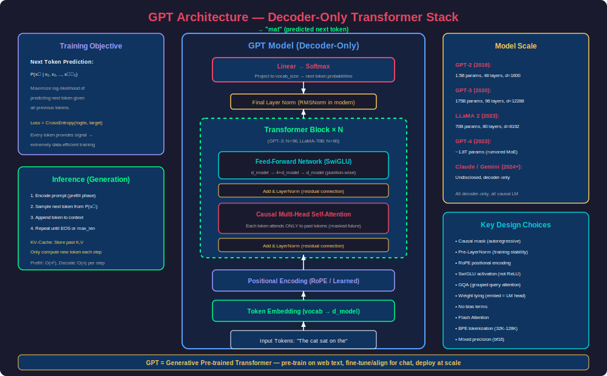
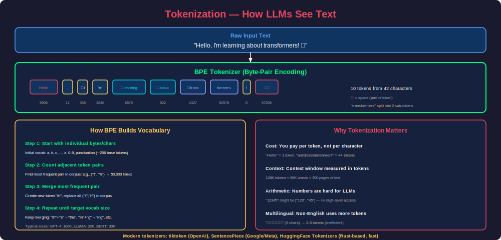
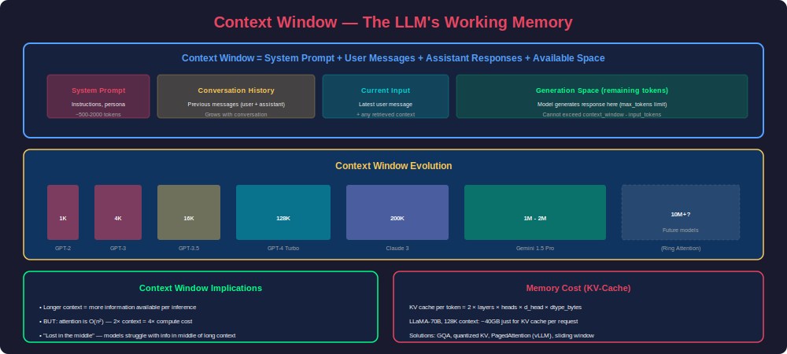
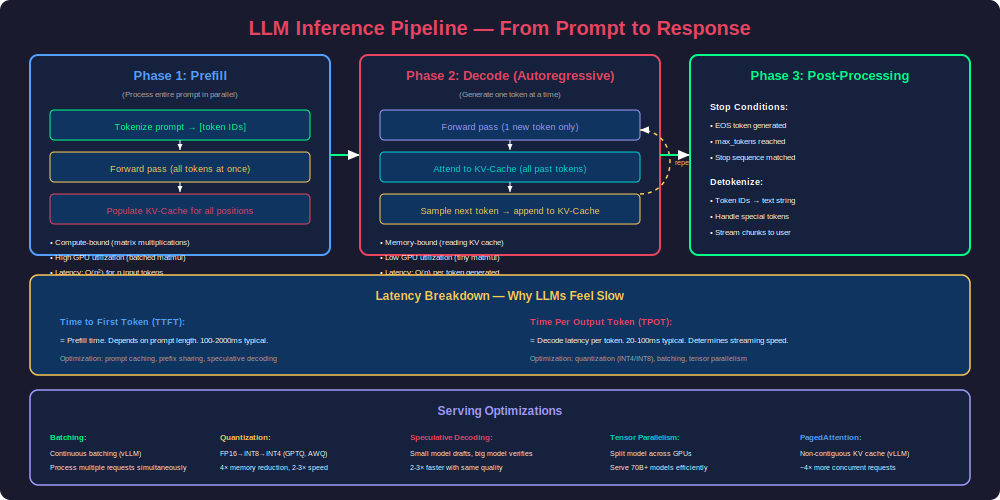
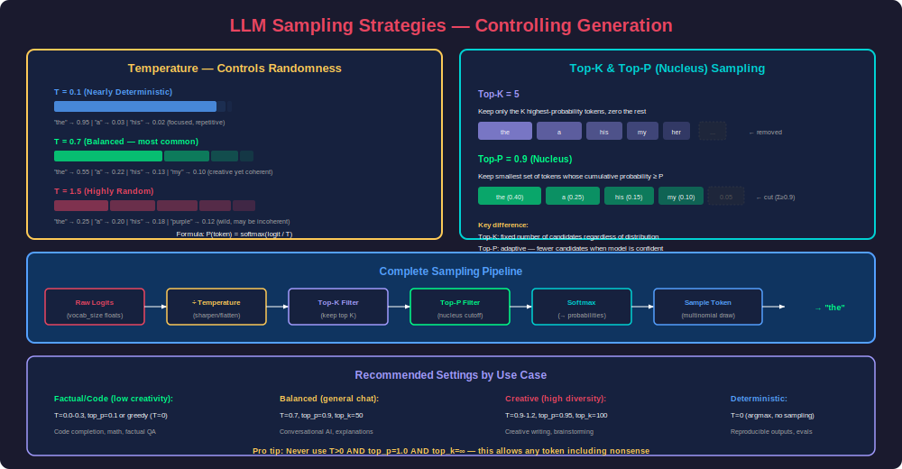
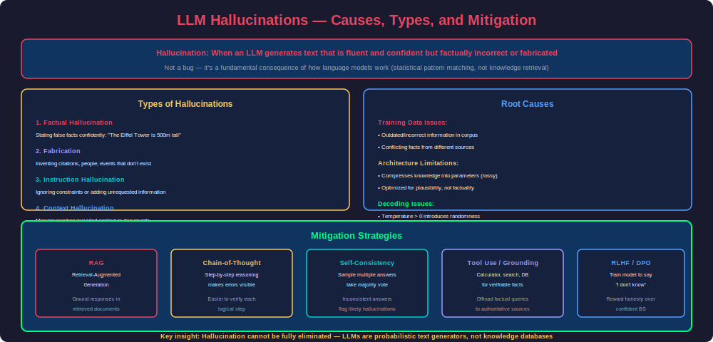

# Phase 20 — LLM Fundamentals

## Overview

Large Language Models (LLMs) represent the most transformative advancement in AI since deep learning itself. Built on the Transformer architecture (Phase 19), LLMs are decoder-only models trained on massive text corpora to predict the next token. Through sheer scale—hundreds of billions of parameters trained on trillions of tokens—they develop remarkable emergent capabilities: reasoning, code generation, multilingual understanding, and in-context learning.

This phase covers the complete LLM stack: the GPT architecture in detail, how tokenization shapes model behavior, context windows and their constraints, the inference pipeline from prompt to response, sampling strategies that control generation quality, temperature and its mathematical effects, and the hallucination problem that remains the field's greatest challenge.

---

## 1. The GPT Architecture

### What is GPT?

**GPT** = **G**enerative **P**re-trained **T**ransformer

- **Generative**: Produces text token by token (autoregressive generation)
- **Pre-trained**: Trained on massive text data in a self-supervised manner before task-specific fine-tuning
- **Transformer**: Built on the decoder-only Transformer architecture

GPT models are the foundation of modern AI assistants (ChatGPT, Claude, Gemini), code generators (Copilot), and increasingly general-purpose reasoning systems.



### Architecture Details

The GPT architecture is remarkably simple—it's a stack of identical decoder blocks:

```python
import torch
import torch.nn as nn
import torch.nn.functional as F
import math


class GPTConfig:
    """Configuration for GPT-style model."""
    
    # GPT-2 Small
    vocab_size: int = 50257
    max_seq_len: int = 1024
    d_model: int = 768
    num_heads: int = 12
    num_layers: int = 12
    d_ff: int = 3072        # 4 * d_model
    dropout: float = 0.1
    bias: bool = True
    
    # Modern LLM settings (LLaMA-style)
    # vocab_size = 32000
    # max_seq_len = 4096
    # d_model = 4096
    # num_heads = 32
    # num_kv_heads = 8  # GQA
    # num_layers = 32
    # d_ff = 11008  # SwiGLU adjusted
    # dropout = 0.0  # No dropout at scale
    # bias = False


class CausalSelfAttention(nn.Module):
    """Multi-head causal (masked) self-attention."""
    
    def __init__(self, config):
        super().__init__()
        assert config.d_model % config.num_heads == 0
        
        self.num_heads = config.num_heads
        self.d_head = config.d_model // config.num_heads
        
        # Combined QKV projection for efficiency
        self.qkv_proj = nn.Linear(config.d_model, 3 * config.d_model, bias=config.bias)
        self.out_proj = nn.Linear(config.d_model, config.d_model, bias=config.bias)
        
        self.attn_dropout = nn.Dropout(config.dropout)
        self.resid_dropout = nn.Dropout(config.dropout)
        
        # Causal mask: prevents attending to future tokens
        self.register_buffer(
            "causal_mask",
            torch.tril(torch.ones(config.max_seq_len, config.max_seq_len))
                 .view(1, 1, config.max_seq_len, config.max_seq_len)
        )
    
    def forward(self, x):
        B, T, C = x.shape  # batch, seq_len, d_model
        
        # Compute Q, K, V in one projection
        qkv = self.qkv_proj(x)
        q, k, v = qkv.split(C, dim=-1)
        
        # Reshape to (B, num_heads, T, d_head)
        q = q.view(B, T, self.num_heads, self.d_head).transpose(1, 2)
        k = k.view(B, T, self.num_heads, self.d_head).transpose(1, 2)
        v = v.view(B, T, self.num_heads, self.d_head).transpose(1, 2)
        
        # Scaled dot-product attention with causal mask
        scores = (q @ k.transpose(-2, -1)) / math.sqrt(self.d_head)
        scores = scores.masked_fill(self.causal_mask[:, :, :T, :T] == 0, float('-inf'))
        attn_weights = F.softmax(scores, dim=-1)
        attn_weights = self.attn_dropout(attn_weights)
        
        # Weighted sum of values
        out = attn_weights @ v  # (B, heads, T, d_head)
        out = out.transpose(1, 2).contiguous().view(B, T, C)
        
        return self.resid_dropout(self.out_proj(out))


class FeedForward(nn.Module):
    """Position-wise feed-forward network."""
    
    def __init__(self, config):
        super().__init__()
        self.fc1 = nn.Linear(config.d_model, config.d_ff, bias=config.bias)
        self.fc2 = nn.Linear(config.d_ff, config.d_model, bias=config.bias)
        self.dropout = nn.Dropout(config.dropout)
    
    def forward(self, x):
        x = F.gelu(self.fc1(x))  # GELU activation (GPT-2+)
        x = self.dropout(x)
        return self.fc2(x)


class TransformerBlock(nn.Module):
    """Single GPT transformer block: LayerNorm → Attention → LayerNorm → FFN"""
    
    def __init__(self, config):
        super().__init__()
        self.ln1 = nn.LayerNorm(config.d_model)
        self.attn = CausalSelfAttention(config)
        self.ln2 = nn.LayerNorm(config.d_model)
        self.ffn = FeedForward(config)
    
    def forward(self, x):
        # Pre-norm architecture with residual connections
        x = x + self.attn(self.ln1(x))
        x = x + self.ffn(self.ln2(x))
        return x


class GPT(nn.Module):
    """Complete GPT language model."""
    
    def __init__(self, config):
        super().__init__()
        self.config = config
        
        # Token and position embeddings
        self.token_emb = nn.Embedding(config.vocab_size, config.d_model)
        self.pos_emb = nn.Embedding(config.max_seq_len, config.d_model)
        self.drop = nn.Dropout(config.dropout)
        
        # Transformer blocks
        self.blocks = nn.ModuleList([
            TransformerBlock(config) for _ in range(config.num_layers)
        ])
        
        # Final layer norm
        self.ln_f = nn.LayerNorm(config.d_model)
        
        # Language model head (projects back to vocabulary)
        self.lm_head = nn.Linear(config.d_model, config.vocab_size, bias=False)
        
        # Weight tying: share token embedding and LM head weights
        self.lm_head.weight = self.token_emb.weight
        
        # Initialize weights
        self.apply(self._init_weights)
        
        # Report model size
        n_params = sum(p.numel() for p in self.parameters())
        print(f"GPT model with {n_params/1e6:.1f}M parameters")
    
    def _init_weights(self, module):
        if isinstance(module, nn.Linear):
            torch.nn.init.normal_(module.weight, mean=0.0, std=0.02)
            if module.bias is not None:
                torch.nn.init.zeros_(module.bias)
        elif isinstance(module, nn.Embedding):
            torch.nn.init.normal_(module.weight, mean=0.0, std=0.02)
    
    def forward(self, input_ids, targets=None):
        """
        Args:
            input_ids: (batch, seq_len) token indices
            targets: (batch, seq_len) target token indices for training
        Returns:
            logits: (batch, seq_len, vocab_size)
            loss: scalar if targets provided
        """
        B, T = input_ids.shape
        assert T <= self.config.max_seq_len, f"Sequence {T} exceeds max {self.config.max_seq_len}"
        
        # Create position indices
        positions = torch.arange(0, T, device=input_ids.device).unsqueeze(0)
        
        # Embed tokens + positions
        x = self.drop(self.token_emb(input_ids) + self.pos_emb(positions))
        
        # Pass through transformer blocks
        for block in self.blocks:
            x = block(x)
        
        # Final norm and project to vocabulary
        x = self.ln_f(x)
        logits = self.lm_head(x)
        
        # Compute loss if training
        loss = None
        if targets is not None:
            loss = F.cross_entropy(
                logits.view(-1, self.config.vocab_size),
                targets.view(-1),
                ignore_index=-1  # Padding token
            )
        
        return logits, loss
    
    @torch.no_grad()
    def generate(self, input_ids, max_new_tokens, temperature=1.0, top_k=None):
        """Autoregressive generation."""
        for _ in range(max_new_tokens):
            # Crop to context window
            idx_cond = input_ids[:, -self.config.max_seq_len:]
            
            # Forward pass
            logits, _ = self.forward(idx_cond)
            logits = logits[:, -1, :] / temperature  # Last position only
            
            # Optional top-k filtering
            if top_k is not None:
                v, _ = torch.topk(logits, min(top_k, logits.size(-1)))
                logits[logits < v[:, [-1]]] = float('-inf')
            
            # Sample from distribution
            probs = F.softmax(logits, dim=-1)
            next_token = torch.multinomial(probs, num_samples=1)
            
            # Append to sequence
            input_ids = torch.cat([input_ids, next_token], dim=1)
        
        return input_ids
```

### Training Objective: Next Token Prediction

The training objective is deceptively simple—predict the next token given all previous tokens:

$$\mathcal{L} = -\sum_{t=1}^{T} \log P(x_t | x_1, x_2, ..., x_{t-1})$$

```python
def training_step(model, batch, optimizer):
    """Single training step for causal language modeling."""
    input_ids = batch['input_ids']  # (batch, seq_len)
    
    # Shift: input is tokens[:-1], target is tokens[1:]
    # The model predicts the NEXT token at each position
    inputs = input_ids[:, :-1]
    targets = input_ids[:, 1:]
    
    logits, loss = model(inputs, targets)
    
    loss.backward()
    torch.nn.utils.clip_grad_norm_(model.parameters(), 1.0)
    optimizer.step()
    optimizer.zero_grad()
    
    return loss.item()


# Why this works so well:
# 1. Every token provides a training signal (not just 15% like BERT's MLM)
# 2. Self-supervised — no labels needed, just raw text
# 3. Implicitly learns grammar, facts, reasoning, code, math...
# 4. The same objective scales from 100M to 1T+ parameters
```

### The Scaling Laws

Kaplan et al. (2020) and Hoffmann et al. (2022, "Chinchilla") established that LLM performance follows predictable power laws:

```python
# Scaling laws for LLMs
# Loss ≈ a * N^(-α) + b * D^(-β) + irreducible_entropy
# Where N = parameters, D = training tokens

# Chinchilla-optimal: train on ~20 tokens per parameter
scaling_examples = {
    "GPT-3":     {"params": "175B", "tokens": "300B",   "ratio": 1.7},   # Under-trained
    "Chinchilla": {"params": "70B",  "tokens": "1.4T",  "ratio": 20.0},  # Optimal
    "LLaMA":     {"params": "65B",  "tokens": "1.4T",  "ratio": 21.5},  # Optimal
    "LLaMA-2":   {"params": "70B",  "tokens": "2.0T",  "ratio": 28.6},  # Over-trained (for inference efficiency)
    "LLaMA-3":   {"params": "70B",  "tokens": "15T",   "ratio": 214.0}, # Heavily over-trained
}

# Modern trend: Over-train smaller models for deployment efficiency
# A 7B model trained on 15T tokens outperforms a 70B model trained on 300B tokens
# AND is 10x cheaper to serve
```

### GPT Architecture Evolution

| Model | Year | Params | Context | Key Innovation |
|-------|------|--------|---------|---------------|
| GPT-1 | 2018 | 117M | 512 | Pre-train + fine-tune paradigm |
| GPT-2 | 2019 | 1.5B | 1024 | Zero-shot task transfer |
| GPT-3 | 2020 | 175B | 2048→4096 | In-context learning, few-shot |
| InstructGPT | 2022 | 175B | 4096 | RLHF alignment |
| GPT-4 | 2023 | ~1.8T (MoE) | 8K→128K | Multimodal, reasoning |
| GPT-4o | 2024 | Undisclosed | 128K | Unified multimodal |
| LLaMA 3 | 2024 | 8B-405B | 128K | Open-weight, trained on 15T tokens |

---

## 2. Tokenization

### Why Tokenization Matters

LLMs don't process characters or words—they process **tokens**, which are subword units learned from training data. Tokenization is the critical bridge between human text and model computation, and it fundamentally affects:

- **Cost**: API pricing is per-token, not per-character
- **Context capacity**: Context windows measured in tokens
- **Model capabilities**: Arithmetic, spelling, multilingual performance all depend on tokenization
- **Latency**: More tokens = more generation steps = slower output



### Byte-Pair Encoding (BPE)

BPE is the dominant tokenization algorithm used by GPT-2, GPT-3, GPT-4, LLaMA, and most modern LLMs:

```python
class SimpleBPE:
    """Simplified BPE tokenizer demonstrating the core algorithm."""
    
    def __init__(self):
        self.merges = {}      # (token_a, token_b) → merged_token
        self.vocab = {}       # token_id → token_bytes
        self.inverse_vocab = {}  # token_bytes → token_id
    
    def train(self, text, vocab_size=1000, verbose=False):
        """Train BPE vocabulary from text corpus.
        
        Algorithm:
        1. Start with byte-level tokens (256 base tokens)
        2. Count all adjacent token pairs
        3. Merge the most frequent pair into a new token
        4. Repeat until vocab_size reached
        """
        # Initialize with individual bytes
        tokens = list(text.encode('utf-8'))
        
        # Base vocabulary: all 256 byte values
        for i in range(256):
            self.vocab[i] = bytes([i])
        
        next_id = 256
        
        while next_id < vocab_size:
            # Count adjacent pairs
            pair_counts = {}
            for i in range(len(tokens) - 1):
                pair = (tokens[i], tokens[i + 1])
                pair_counts[pair] = pair_counts.get(pair, 0) + 1
            
            if not pair_counts:
                break
            
            # Find most frequent pair
            best_pair = max(pair_counts, key=pair_counts.get)
            
            if verbose and next_id % 100 == 0:
                count = pair_counts[best_pair]
                a_str = self.vocab[best_pair[0]].decode('utf-8', errors='replace')
                b_str = self.vocab[best_pair[1]].decode('utf-8', errors='replace')
                print(f"Merge {next_id}: '{a_str}' + '{b_str}' (count: {count})")
            
            # Merge all occurrences of the best pair
            new_tokens = []
            i = 0
            while i < len(tokens):
                if i < len(tokens) - 1 and (tokens[i], tokens[i+1]) == best_pair:
                    new_tokens.append(next_id)
                    i += 2
                else:
                    new_tokens.append(tokens[i])
                    i += 1
            
            tokens = new_tokens
            
            # Record the merge
            self.merges[best_pair] = next_id
            self.vocab[next_id] = self.vocab[best_pair[0]] + self.vocab[best_pair[1]]
            next_id += 1
        
        # Build inverse vocab for encoding
        self.inverse_vocab = {v: k for k, v in self.vocab.items()}
        
        print(f"Vocabulary size: {len(self.vocab)}")
        print(f"Text compressed: {len(text.encode('utf-8'))} bytes → {len(tokens)} tokens")
        print(f"Compression ratio: {len(text.encode('utf-8')) / len(tokens):.1f}x")
    
    def encode(self, text):
        """Encode text to token IDs."""
        tokens = list(text.encode('utf-8'))
        
        # Apply merges in order
        while len(tokens) >= 2:
            # Find the highest-priority merge that applies
            best_pair = None
            best_merge_id = float('inf')
            
            for i in range(len(tokens) - 1):
                pair = (tokens[i], tokens[i+1])
                if pair in self.merges:
                    merge_id = self.merges[pair]
                    if merge_id < best_merge_id:
                        best_pair = pair
                        best_merge_id = merge_id
            
            if best_pair is None:
                break
            
            # Apply the merge
            new_tokens = []
            i = 0
            while i < len(tokens):
                if i < len(tokens) - 1 and (tokens[i], tokens[i+1]) == best_pair:
                    new_tokens.append(best_merge_id)
                    i += 2
                else:
                    new_tokens.append(tokens[i])
                    i += 1
            tokens = new_tokens
        
        return tokens
    
    def decode(self, token_ids):
        """Decode token IDs back to text."""
        byte_sequence = b''.join(self.vocab[tid] for tid in token_ids)
        return byte_sequence.decode('utf-8', errors='replace')


# Using production tokenizers
import tiktoken  # OpenAI's tokenizer

def demonstrate_tokenization():
    """Show how real LLMs tokenize text."""
    
    # GPT-4 tokenizer
    enc = tiktoken.encoding_for_model("gpt-4")
    
    examples = [
        "Hello, world!",
        "The quick brown fox jumps over the lazy dog.",
        "def fibonacci(n):\n    return n if n < 2 else fibonacci(n-1) + fibonacci(n-2)",
        "12345 + 67890 = 80235",
        "こんにちは世界",  # Japanese
        "Антропный",        # Russian
    ]
    
    for text in examples:
        tokens = enc.encode(text)
        decoded_tokens = [enc.decode([t]) for t in tokens]
        print(f"\nText: '{text}'")
        print(f"  Tokens ({len(tokens)}): {decoded_tokens}")
        print(f"  IDs: {tokens}")
        print(f"  Chars/token: {len(text)/len(tokens):.1f}")


# Tokenization gotchas that affect LLM behavior
tokenization_issues = {
    "arithmetic": "12345 may tokenize as [123, 45] — model can't access individual digits",
    "spelling": "'strawberry' may be ['straw', 'berry'] — model doesn't see letters",
    "whitespace": "Leading space is part of token: ' Hello' ≠ 'Hello'",
    "multilingual": "Non-English text uses 2-5x more tokens than English",
    "code": "Indentation consumes tokens: 4 spaces = 1 token, but adds up fast",
    "rare_words": "Uncommon words split into many pieces: 'defenestration' → ['def', 'en', 'estr', 'ation']",
}
```

### Tokenizer Comparison

| Tokenizer | Vocab Size | Used By | Key Feature |
|-----------|-----------|---------|-------------|
| BPE (tiktoken) | 100K | GPT-3.5/4 | Byte-level, fast (Rust) |
| SentencePiece | 32K-128K | LLaMA, T5 | Language-agnostic, BPE or Unigram |
| WordPiece | 30K | BERT | Starts from words, splits subwords |
| Unigram | Varies | XLNet, ALBERT | Probabilistic, removes tokens iteratively |

---

## 3. Context Windows

### What is a Context Window?

The context window is the maximum number of tokens an LLM can process in a single forward pass—its "working memory." Everything the model knows about the current conversation must fit within this window:



### Context Window Composition

```python
def calculate_context_usage(
    system_prompt: str,
    conversation_history: list,
    current_input: str,
    max_context: int = 128000,
    max_output: int = 4096,
    tokenizer=None
):
    """Calculate how much context window is consumed."""
    import tiktoken
    enc = tokenizer or tiktoken.encoding_for_model("gpt-4")
    
    # Count tokens for each component
    system_tokens = len(enc.encode(system_prompt))
    
    history_tokens = 0
    for msg in conversation_history:
        history_tokens += len(enc.encode(msg['content']))
        history_tokens += 4  # Message overhead (role tokens, separators)
    
    input_tokens = len(enc.encode(current_input))
    
    total_input = system_tokens + history_tokens + input_tokens
    available_for_output = max_context - total_input
    effective_max_output = min(max_output, available_for_output)
    
    print(f"Context window: {max_context:,} tokens")
    print(f"  System prompt: {system_tokens:,} tokens")
    print(f"  Conversation history: {history_tokens:,} tokens ({len(conversation_history)} messages)")
    print(f"  Current input: {input_tokens:,} tokens")
    print(f"  Total input: {total_input:,} tokens ({total_input/max_context*100:.1f}%)")
    print(f"  Available for output: {effective_max_output:,} tokens")
    
    if total_input > max_context:
        print(f"  ⚠️ OVERFLOW: Input exceeds context by {total_input - max_context:,} tokens!")
        print(f"  Need to truncate conversation history.")
    
    return {
        'total_input': total_input,
        'available_output': effective_max_output,
        'utilization': total_input / max_context
    }
```

### Context Window Management Strategies

```python
class ConversationManager:
    """Manage conversation history within context limits."""
    
    def __init__(self, max_context=128000, reserved_output=4096, 
                 system_prompt_tokens=500):
        self.max_context = max_context
        self.reserved_output = reserved_output
        self.system_tokens = system_prompt_tokens
        self.available = max_context - reserved_output - system_prompt_tokens
        self.messages = []
    
    def add_message(self, role, content, token_count):
        """Add message and trim if needed."""
        self.messages.append({
            'role': role,
            'content': content,
            'tokens': token_count
        })
        self._trim_if_needed()
    
    def _trim_if_needed(self):
        """Remove oldest messages if context exceeds limit."""
        total = sum(m['tokens'] for m in self.messages)
        
        while total > self.available and len(self.messages) > 1:
            # Strategy 1: Simple FIFO (remove oldest)
            removed = self.messages.pop(0)
            total -= removed['tokens']
    
    def sliding_window_with_summary(self, summarizer_fn):
        """Keep recent messages + summary of older ones."""
        total = sum(m['tokens'] for m in self.messages)
        
        if total > self.available:
            # Summarize older messages
            cutoff = len(self.messages) // 2
            old_messages = self.messages[:cutoff]
            
            summary = summarizer_fn(old_messages)
            summary_tokens = len(summary.split()) * 1.3  # Rough estimate
            
            # Replace old messages with summary
            self.messages = [
                {'role': 'system', 'content': f"[Summary of earlier conversation: {summary}]",
                 'tokens': int(summary_tokens)}
            ] + self.messages[cutoff:]


# Context window sizes and their practical implications
context_examples = {
    4096: "~3,000 words. A short conversation or single document page.",
    8192: "~6,000 words. A few pages or a moderate conversation.",
    32768: "~24,000 words. A long document or extended conversation.",
    128000: "~96,000 words. A short book or entire codebase.",
    200000: "~150,000 words. Multiple documents, extensive codebase.",
    1000000: "~750,000 words. Multiple books, massive context.",
    2000000: "~1.5M words. (Gemini 1.5 Pro) — extreme long-context.",
}
```

### The "Lost in the Middle" Problem

Research shows models struggle to use information placed in the middle of long contexts:

```python
def needle_in_haystack_test(model, context_lengths, needle_positions):
    """Test model's ability to retrieve information at various positions.
    
    Finding (Liu et al., 2023):
    - Models excel at retrieving info near the START of context
    - Models excel at retrieving info near the END of context  
    - Performance degrades significantly for info in the MIDDLE
    
    Implication for RAG:
    - Place most relevant documents at START or END of context
    - Don't bury critical info in the middle of a long prompt
    """
    results = {}
    
    for length in context_lengths:
        for position in needle_positions:
            # Insert a specific fact at position within filler text
            # Query model to retrieve that fact
            # Record accuracy
            pass
    
    return results

# Practical advice:
# 1. System prompt (important instructions) → START
# 2. Retrieved documents → ordered by relevance, most relevant FIRST
# 3. User's actual question → END (closest to model's generation)
# 4. Avoid stuffing context with marginally relevant information
```

---

## 4. LLM Inference

### The Two-Phase Inference Pipeline

LLM inference consists of two distinct computational phases with very different characteristics:



### Phase 1: Prefill (Prompt Processing)

```python
class LLMInference:
    """Demonstrates the two-phase inference pipeline."""
    
    def __init__(self, model, tokenizer):
        self.model = model
        self.tokenizer = tokenizer
        self.kv_cache = None
    
    def prefill(self, prompt):
        """Phase 1: Process entire prompt in parallel.
        
        Characteristics:
        - Compute-bound (large matrix multiplications)
        - All tokens processed simultaneously
        - Builds KV-cache for all prompt positions
        - Latency proportional to prompt length
        - High GPU utilization (large batch dimension)
        """
        input_ids = self.tokenizer.encode(prompt)
        input_tensor = torch.tensor([input_ids])
        
        # Single forward pass through all layers
        # Output: logits for next token + KV-cache populated
        with torch.no_grad():
            logits, self.kv_cache = self.model.forward_with_cache(input_tensor)
        
        # Only care about last position's logits (next token prediction)
        next_token_logits = logits[0, -1, :]
        
        return next_token_logits
    
    def decode_step(self, prev_token):
        """Phase 2: Generate one token using cached K,V.
        
        Characteristics:
        - Memory-bound (reading large KV-cache)
        - Only 1 token computed per step
        - Attends to ALL past tokens via cache
        - Low GPU utilization (tiny computation)
        - This is the bottleneck for streaming speed
        """
        input_tensor = torch.tensor([[prev_token]])
        
        with torch.no_grad():
            logits, self.kv_cache = self.model.forward_with_cache(
                input_tensor,
                past_kv=self.kv_cache  # Reuse cached K,V
            )
        
        return logits[0, -1, :]
    
    def generate(self, prompt, max_tokens=100, **sampling_kwargs):
        """Complete generation pipeline."""
        import time
        
        # Phase 1: Prefill
        t0 = time.time()
        next_logits = self.prefill(prompt)
        prefill_time = time.time() - t0
        
        prompt_tokens = len(self.tokenizer.encode(prompt))
        print(f"Prefill: {prompt_tokens} tokens in {prefill_time*1000:.0f}ms "
              f"({prompt_tokens/prefill_time:.0f} tokens/sec)")
        
        # Phase 2: Autoregressive decoding
        generated_tokens = []
        t1 = time.time()
        
        for _ in range(max_tokens):
            # Sample next token
            next_token = self.sample(next_logits, **sampling_kwargs)
            
            if next_token == self.tokenizer.eos_token_id:
                break
            
            generated_tokens.append(next_token)
            
            # Decode step (uses KV-cache)
            next_logits = self.decode_step(next_token)
        
        decode_time = time.time() - t1
        
        print(f"Decode: {len(generated_tokens)} tokens in {decode_time*1000:.0f}ms "
              f"({len(generated_tokens)/decode_time:.0f} tokens/sec)")
        print(f"TTFT: {prefill_time*1000:.0f}ms")
        print(f"TPOT: {decode_time*1000/max(1,len(generated_tokens)):.0f}ms/token")
        
        return self.tokenizer.decode(generated_tokens)
    
    def sample(self, logits, temperature=1.0, top_k=50, top_p=0.9):
        """Sample next token from logits."""
        if temperature == 0:
            return logits.argmax().item()
        
        logits = logits / temperature
        
        # Top-k
        if top_k > 0:
            top_k_values, _ = torch.topk(logits, top_k)
            logits[logits < top_k_values[-1]] = float('-inf')
        
        # Top-p (nucleus)
        if top_p < 1.0:
            sorted_logits, sorted_idx = torch.sort(logits, descending=True)
            cumulative_probs = torch.cumsum(F.softmax(sorted_logits, dim=-1), dim=-1)
            
            remove_mask = cumulative_probs - F.softmax(sorted_logits, dim=-1) >= top_p
            sorted_logits[remove_mask] = float('-inf')
            
            logits = torch.zeros_like(logits).scatter_(0, sorted_idx, sorted_logits)
        
        probs = F.softmax(logits, dim=-1)
        return torch.multinomial(probs, 1).item()
```

### KV-Cache: The Memory-Compute Tradeoff

```python
def kv_cache_memory_calculator(
    model_params: dict,
    seq_len: int,
    batch_size: int = 1,
    dtype_bytes: int = 2  # fp16 = 2 bytes, fp32 = 4
):
    """Calculate KV-cache memory requirements.
    
    KV-cache stores Key and Value tensors for all past tokens,
    across all layers and heads.
    
    Memory per token = 2 (K+V) × num_layers × num_kv_heads × d_head × dtype_bytes
    """
    num_layers = model_params['num_layers']
    num_kv_heads = model_params.get('num_kv_heads', model_params['num_heads'])
    d_head = model_params['d_model'] // model_params['num_heads']
    
    # Per-token KV cache size
    per_token_bytes = 2 * num_layers * num_kv_heads * d_head * dtype_bytes
    
    # Total for sequence
    total_bytes = per_token_bytes * seq_len * batch_size
    
    print(f"KV-Cache Memory Analysis:")
    print(f"  Per token: {per_token_bytes / 1024:.1f} KB")
    print(f"  Sequence ({seq_len} tokens): {total_bytes / 1024**2:.1f} MB")
    print(f"  Batch of {batch_size}: {total_bytes * batch_size / 1024**3:.2f} GB")
    
    return total_bytes


# Example calculations
print("=== LLaMA-7B ===")
kv_cache_memory_calculator(
    {'num_layers': 32, 'num_heads': 32, 'num_kv_heads': 32, 'd_model': 4096},
    seq_len=4096
)

print("\n=== LLaMA-70B (with GQA) ===")
kv_cache_memory_calculator(
    {'num_layers': 80, 'num_heads': 64, 'num_kv_heads': 8, 'd_model': 8192},
    seq_len=128000
)
# GQA reduces KV cache by 8x compared to full MHA!
```

### Serving Infrastructure

```python
# Production LLM serving with vLLM
"""
# Install: pip install vllm

from vllm import LLM, SamplingParams

# Load model with PagedAttention
llm = LLM(
    model="meta-llama/Llama-2-70b-chat-hf",
    tensor_parallel_size=4,   # Spread across 4 GPUs
    gpu_memory_utilization=0.9,
    max_model_len=4096,
)

# Define sampling parameters
sampling_params = SamplingParams(
    temperature=0.7,
    top_p=0.9,
    max_tokens=512,
    presence_penalty=0.1,
    frequency_penalty=0.1,
)

# Generate (automatic batching + PagedAttention)
prompts = ["Explain quantum computing:", "Write a haiku about AI:"]
outputs = llm.generate(prompts, sampling_params)

for output in outputs:
    print(f"Prompt: {output.prompt[:50]}...")
    print(f"Generated: {output.outputs[0].text}")
"""

# Key serving optimizations:
serving_optimizations = {
    "PagedAttention": {
        "what": "Non-contiguous memory allocation for KV-cache (like OS virtual memory)",
        "benefit": "3-4x more concurrent requests, eliminates memory fragmentation",
        "used_by": "vLLM, TensorRT-LLM"
    },
    "Continuous Batching": {
        "what": "Add new requests to batch as earlier ones complete (no waiting for longest)",
        "benefit": "2-3x throughput improvement over static batching",
        "used_by": "vLLM, TGI, Triton"
    },
    "Speculative Decoding": {
        "what": "Small draft model proposes N tokens, large model verifies in one pass",
        "benefit": "2-3x latency reduction with identical output quality",
        "used_by": "Medusa, EAGLE, SpecInfer"
    },
    "Quantization": {
        "what": "Reduce weight precision: FP16 → INT8 → INT4",
        "benefit": "2-4x memory reduction, 1.5-3x speed improvement",
        "used_by": "GPTQ, AWQ, GGUF (llama.cpp)"
    },
    "Prefix Caching": {
        "what": "Cache and reuse KV-cache for common prompt prefixes",
        "benefit": "Eliminates redundant prefill for shared system prompts",
        "used_by": "SGLang, vLLM"
    }
}
```

---

## 5. Sampling Strategies

### Understanding Logits to Tokens

When an LLM produces output at each position, it generates a vector of **logits**—one raw score for every token in the vocabulary. These logits must be transformed into a probability distribution from which we sample the next token.



### Temperature

Temperature controls the "sharpness" of the probability distribution:

$$P(token_i) = \frac{\exp(z_i / T)}{\sum_j \exp(z_j / T)}$$

```python
def temperature_demo():
    """Demonstrate temperature's effect on distributions."""
    # Simulated logits for 5 tokens
    logits = torch.tensor([4.0, 3.0, 2.0, 1.0, 0.5])
    token_labels = ["the", "a", "his", "my", "our"]
    
    temperatures = [0.1, 0.5, 0.7, 1.0, 1.5, 2.0]
    
    print(f"{'Temp':<6} | " + " | ".join(f"{t:<8}" for t in token_labels))
    print("-" * 60)
    
    for temp in temperatures:
        if temp == 0:
            probs = torch.zeros_like(logits)
            probs[logits.argmax()] = 1.0
        else:
            probs = F.softmax(logits / temp, dim=-1)
        
        prob_strs = [f"{p:.4f}" for p in probs.tolist()]
        print(f"{temp:<6} | " + " | ".join(f"{s:<8}" for s in prob_strs))
    
    # Output:
    # Temp   | the      | a        | his      | my       | our
    # 0.1    | 1.0000   | 0.0000   | 0.0000   | 0.0000   | 0.0000
    # 0.5    | 0.8360   | 0.1142   | 0.0156   | 0.0021   | 0.0008
    # 0.7    | 0.6590   | 0.1740   | 0.0459   | 0.0121   | 0.0058
    # 1.0    | 0.4672   | 0.1715   | 0.0630   | 0.0232   | 0.0141
    # 1.5    | 0.3143   | 0.1785   | 0.1013   | 0.0575   | 0.0423
    # 2.0    | 0.2468   | 0.1663   | 0.1120   | 0.0755   | 0.0612


# Temperature guidelines:
temperature_guide = {
    0.0: "Deterministic (greedy). Always picks highest probability. Use for: factual QA, code, math",
    0.3: "Low creativity. Very focused. Use for: structured extraction, classification",
    0.7: "Balanced (most common default). Use for: general conversation, explanations",
    1.0: "Standard randomness. Model's natural distribution. Use for: creative writing, brainstorming",
    1.2: "High creativity. More unexpected choices. Use for: poetry, story generation",
    1.5: "Very random. May produce incoherent text. Rarely useful in production",
}
```

### Top-K Sampling

```python
def top_k_sampling(logits, k=50, temperature=1.0):
    """Keep only the top K highest-probability tokens.
    
    Pros: Simple, prevents very unlikely tokens
    Cons: Fixed K regardless of distribution shape
          K=50 is too many when model is confident
          K=50 is too few for uniform distributions
    """
    logits = logits / temperature
    
    # Get top-K values and their indices
    top_k_values, top_k_indices = torch.topk(logits, k)
    
    # Zero out everything below top-K
    filtered_logits = torch.full_like(logits, float('-inf'))
    filtered_logits.scatter_(0, top_k_indices, top_k_values)
    
    # Sample from filtered distribution
    probs = F.softmax(filtered_logits, dim=-1)
    return torch.multinomial(probs, 1).item()
```

### Top-P (Nucleus) Sampling

```python
def top_p_sampling(logits, p=0.9, temperature=1.0):
    """Keep smallest set of tokens whose cumulative probability >= p.
    
    Adaptive: When model is confident → fewer candidates
              When model is uncertain → more candidates
    
    This is generally preferred over top-K because it adapts
    to the shape of the distribution.
    """
    logits = logits / temperature
    
    sorted_logits, sorted_indices = torch.sort(logits, descending=True)
    cumulative_probs = torch.cumsum(F.softmax(sorted_logits, dim=-1), dim=-1)
    
    # Find cutoff: where cumulative probability first exceeds p
    # Shift right to keep the token that crosses the threshold
    sorted_mask = cumulative_probs - F.softmax(sorted_logits, dim=-1) >= p
    sorted_logits[sorted_mask] = float('-inf')
    
    # Restore original ordering
    filtered_logits = torch.zeros_like(logits)
    filtered_logits.scatter_(0, sorted_indices, sorted_logits)
    
    probs = F.softmax(filtered_logits, dim=-1)
    return torch.multinomial(probs, 1).item()
```

### Repetition Penalties

```python
def apply_repetition_penalty(logits, generated_ids, penalty=1.2):
    """Penalize tokens that have already been generated.
    
    For each token that appeared in generated text:
    - If logit > 0: divide by penalty (reduce probability)
    - If logit < 0: multiply by penalty (make more negative)
    
    Prevents the common "looping" problem where models repeat phrases.
    """
    for token_id in set(generated_ids):
        if logits[token_id] > 0:
            logits[token_id] /= penalty
        else:
            logits[token_id] *= penalty
    
    return logits


def apply_frequency_penalty(logits, token_counts, penalty=0.5):
    """Penalize tokens proportional to how often they appeared.
    
    logit -= penalty * count(token)
    
    More aggressive than repetition penalty for highly repeated tokens.
    """
    for token_id, count in token_counts.items():
        logits[token_id] -= penalty * count
    
    return logits


def apply_presence_penalty(logits, seen_tokens, penalty=0.5):
    """Flat penalty for any token that appeared at all.
    
    logit -= penalty * (1 if token appeared else 0)
    
    Encourages topic diversity without penalizing needed repetition.
    """
    for token_id in seen_tokens:
        logits[token_id] -= penalty
    
    return logits
```

### Complete Sampling Implementation

```python
class ProductionSampler:
    """Production-ready sampling with all common strategies."""
    
    def __init__(self):
        self.generated_tokens = []
        self.token_counts = {}
    
    def sample(
        self,
        logits: torch.Tensor,
        temperature: float = 0.7,
        top_k: int = 50,
        top_p: float = 0.9,
        repetition_penalty: float = 1.0,
        frequency_penalty: float = 0.0,
        presence_penalty: float = 0.0,
        min_p: float = 0.0,
    ) -> int:
        """Sample next token with full control.
        
        Pipeline order: penalties → temperature → top_k → top_p → min_p → sample
        """
        logits = logits.clone()
        
        # Apply repetition/frequency/presence penalties
        if repetition_penalty != 1.0:
            logits = apply_repetition_penalty(logits, self.generated_tokens, repetition_penalty)
        if frequency_penalty > 0:
            logits = apply_frequency_penalty(logits, self.token_counts, frequency_penalty)
        if presence_penalty > 0:
            logits = apply_presence_penalty(logits, set(self.generated_tokens), presence_penalty)
        
        # Greedy (temperature = 0)
        if temperature == 0:
            token = logits.argmax().item()
            self._update_tracking(token)
            return token
        
        # Apply temperature
        logits = logits / temperature
        
        # Top-K filtering
        if top_k > 0:
            top_k_values, _ = torch.topk(logits, min(top_k, logits.size(-1)))
            logits[logits < top_k_values[-1]] = float('-inf')
        
        # Top-P filtering
        if top_p < 1.0:
            sorted_logits, sorted_indices = torch.sort(logits, descending=True)
            cumulative_probs = torch.cumsum(F.softmax(sorted_logits, dim=-1), dim=-1)
            
            remove = cumulative_probs - F.softmax(sorted_logits, dim=-1) >= top_p
            sorted_logits[remove] = float('-inf')
            logits = torch.zeros_like(logits).scatter_(0, sorted_indices, sorted_logits)
        
        # Min-P filtering (alternative to top_p)
        if min_p > 0:
            probs = F.softmax(logits, dim=-1)
            max_prob = probs.max()
            logits[probs < min_p * max_prob] = float('-inf')
        
        # Sample
        probs = F.softmax(logits, dim=-1)
        token = torch.multinomial(probs, 1).item()
        
        self._update_tracking(token)
        return token
    
    def _update_tracking(self, token):
        self.generated_tokens.append(token)
        self.token_counts[token] = self.token_counts.get(token, 0) + 1
    
    def reset(self):
        self.generated_tokens = []
        self.token_counts = {}
```

---

## 6. Temperature Deep Dive

### Mathematical Foundation

Temperature modifies the softmax function by scaling logits before normalization:

```python
def temperature_analysis():
    """Deep dive into temperature's mathematical effects."""
    
    # Consider a vocabulary of 5 tokens with these logits:
    logits = torch.tensor([5.0, 3.5, 2.0, 0.5, -1.0])
    labels = ["best", "good", "ok", "meh", "bad"]
    
    print("Temperature Effects on Probability Distribution:")
    print("=" * 70)
    
    for T in [0.01, 0.3, 0.5, 0.7, 1.0, 1.5, 3.0]:
        probs = F.softmax(logits / T, dim=-1)
        entropy = -(probs * probs.log()).sum().item()
        max_prob = probs.max().item()
        
        print(f"\nT={T:.2f} | Entropy: {entropy:.3f} | Max prob: {max_prob:.4f}")
        for label, prob in zip(labels, probs.tolist()):
            bar = "█" * int(prob * 40)
            print(f"  {label:<5} {prob:.4f} {bar}")
    
    # Key insights:
    # T → 0: Distribution becomes one-hot (deterministic)
    # T = 1: Original distribution (model's raw confidence)
    # T → ∞: Uniform distribution (maximum randomness)
    # 
    # Entropy increases monotonically with temperature
    # Low entropy = model is "decisive"
    # High entropy = model is "indecisive"


def adaptive_temperature(task_type):
    """Choose temperature based on task requirements."""
    
    configs = {
        "code_completion": {
            "temperature": 0.0,
            "top_p": 1.0,
            "rationale": "Code has one correct answer; creativity = bugs"
        },
        "factual_qa": {
            "temperature": 0.1,
            "top_p": 0.3,
            "rationale": "Facts don't benefit from randomness"
        },
        "conversation": {
            "temperature": 0.7,
            "top_p": 0.9,
            "rationale": "Natural variation without incoherence"
        },
        "creative_writing": {
            "temperature": 0.9,
            "top_p": 0.95,
            "rationale": "Unexpected word choices create interesting prose"
        },
        "brainstorming": {
            "temperature": 1.0,
            "top_p": 0.95,
            "rationale": "Maximize diversity of ideas"
        },
        "translation": {
            "temperature": 0.3,
            "top_p": 0.8,
            "rationale": "Mostly deterministic but allow synonym variation"
        }
    }
    
    return configs.get(task_type, configs["conversation"])
```

### Temperature vs. Top-P Interaction

```python
def visualize_sampling_interaction():
    """Show how temperature and top-p interact."""
    
    # High confidence case: model is sure
    confident_logits = torch.tensor([8.0, 2.0, 1.0, 0.5, 0.1])
    
    # Low confidence case: model is unsure
    uncertain_logits = torch.tensor([2.0, 1.8, 1.6, 1.4, 1.2])
    
    print("High confidence logits: [8.0, 2.0, 1.0, 0.5, 0.1]")
    print("=" * 50)
    
    for T in [0.5, 1.0]:
        probs = F.softmax(confident_logits / T, dim=-1)
        sorted_probs, _ = torch.sort(probs, descending=True)
        cumsum = torch.cumsum(sorted_probs, dim=0)
        
        # How many tokens does top_p=0.9 include?
        nucleus_size = (cumsum < 0.9).sum().item() + 1
        print(f"  T={T}, top_p=0.9 → nucleus size: {nucleus_size} tokens")
    
    print(f"\nLow confidence logits: [2.0, 1.8, 1.6, 1.4, 1.2]")
    print("=" * 50)
    
    for T in [0.5, 1.0]:
        probs = F.softmax(uncertain_logits / T, dim=-1)
        sorted_probs, _ = torch.sort(probs, descending=True)
        cumsum = torch.cumsum(sorted_probs, dim=0)
        
        nucleus_size = (cumsum < 0.9).sum().item() + 1
        print(f"  T={T}, top_p=0.9 → nucleus size: {nucleus_size} tokens")
    
    # Key insight: top_p is ADAPTIVE to model confidence
    # When confident: few tokens in nucleus regardless of temperature
    # When uncertain: many tokens in nucleus
    # Temperature uniformly scales ALL logits
    # Best practice: Use BOTH (T=0.7, top_p=0.9)
```

---

## 7. Hallucinations

### Understanding the Root Cause

LLM hallucination isn't a bug—it's a fundamental consequence of how these models work. A language model is trained to produce **statistically plausible continuations** of text, not to retrieve verified facts.



### Why Hallucinations Happen

```python
# Conceptual model of why LLMs hallucinate

class WhyHallucinations:
    """
    LLMs hallucinate because:
    
    1. TRAINING OBJECTIVE MISMATCH
       - Trained on: P(next_token | context)
       - NOT trained on: "Is this factually correct?"
       - Fluent ≠ Factual. The model optimizes for plausibility.
    
    2. PARAMETRIC MEMORY IS LOSSY
       - Billions of facts compressed into weights
       - Like studying for an exam: you remember the gist, not exact details
       - Conflicting information in training data → model "averages"
    
    3. AUTOREGRESSIVE TRAP
       - Once a wrong token is generated, the model must continue from it
       - Can't go back and self-correct mid-generation
       - Confident wrong start → elaborate fabrication
    
    4. TRAINING DATA ISSUES
       - Internet contains false information
       - Outdated facts (knowledge cutoff date)
       - Underrepresented topics → model fills gaps with patterns
    
    5. SYCOPHANCY
       - RLHF trains model to produce responses users rate highly
       - Users sometimes prefer confident-sounding wrong answers
       - Model learns to be confidently wrong over honestly uncertain
    """
    pass


# Types of hallucinations with examples
hallucination_taxonomy = {
    "intrinsic": {
        "description": "Contradicts the provided source/context",
        "example": "Document says 'revenue was $5B', model says 'revenue reached $8B'",
        "cause": "Model's parametric knowledge overrides context"
    },
    "extrinsic": {
        "description": "Claims cannot be verified from source (may or may not be true)",
        "example": "Summarizing a paper and adding claims not in the paper",
        "cause": "Model fills gaps with plausible-sounding information"
    },
    "factual": {
        "description": "States verifiably false facts",
        "example": "'The Great Wall of China is visible from space' (it's not)",
        "cause": "Common misconceptions in training data"
    },
    "fabrication": {
        "description": "Invents entities that don't exist",
        "example": "Citing 'Smith et al., 2019' — a paper that was never written",
        "cause": "Learned the PATTERN of citations without grounding in reality"
    }
}
```

### Detection Strategies

```python
class HallucinationDetector:
    """Strategies for detecting hallucinations."""
    
    def self_consistency_check(self, model, prompt, n_samples=5, temperature=0.7):
        """Generate multiple responses and check agreement.
        
        If the model gives different answers to the same question,
        it's likely hallucinating on at least some of them.
        """
        responses = []
        for _ in range(n_samples):
            response = model.generate(prompt, temperature=temperature)
            responses.append(response)
        
        # Check consistency
        # If all 5 responses agree → likely correct
        # If responses disagree → likely hallucinating
        # Majority vote can improve accuracy
        
        return self._compute_agreement(responses)
    
    def entropy_based_detection(self, model, prompt):
        """High token-level entropy suggests uncertainty.
        
        If the model's probability distribution is spread across many tokens
        at a particular position, it's less certain about that claim.
        """
        logits_sequence = model.get_logits(prompt)
        
        entropies = []
        for logits in logits_sequence:
            probs = F.softmax(logits, dim=-1)
            entropy = -(probs * probs.log()).sum().item()
            entropies.append(entropy)
        
        # High entropy positions → potential hallucination points
        threshold = 3.0  # Tune based on model and domain
        suspicious_positions = [i for i, e in enumerate(entropies) if e > threshold]
        
        return suspicious_positions, entropies
    
    def retrieval_verification(self, claim, knowledge_base):
        """Verify claims against a trusted knowledge base.
        
        For each factual claim in the response:
        1. Extract the claim
        2. Search knowledge base
        3. Check if evidence supports or contradicts
        """
        # In practice, this would use a retrieval system (RAG)
        # and an NLI model to check entailment
        pass
    
    def citation_verification(self, response):
        """Check if cited sources actually exist.
        
        Common hallucination: inventing academic citations.
        Verify via: CrossRef API, Google Scholar, DOI lookup
        """
        import re
        
        # Extract citations
        citations = re.findall(r'\(([A-Z][a-z]+ et al\., \d{4})\)', response)
        
        verified = {}
        for citation in citations:
            # Check if paper exists (would use API in practice)
            exists = self._verify_citation(citation)
            verified[citation] = exists
        
        return verified
    
    def _verify_citation(self, citation):
        """Placeholder for real citation verification."""
        return None  # Would check CrossRef/Scholar
    
    def _compute_agreement(self, responses):
        """Compute semantic agreement across responses."""
        # Would use embeddings + cosine similarity in practice
        return len(set(responses)) == 1
```

### Mitigation Strategies

```python
class HallucinationMitigation:
    """Production strategies to reduce hallucinations."""
    
    def rag_grounding(self, query, retriever, llm):
        """Retrieval-Augmented Generation: Ground responses in documents.
        
        Most effective single mitigation:
        1. Retrieve relevant documents
        2. Include them in context
        3. Instruct model to ONLY use provided information
        """
        # Retrieve relevant documents
        documents = retriever.search(query, top_k=5)
        
        # Format context
        context = "\n\n".join([
            f"Document {i+1}: {doc.text}" 
            for i, doc in enumerate(documents)
        ])
        
        prompt = f"""Answer the question based ONLY on the provided documents.
If the documents don't contain the answer, say "I don't have enough information."
Do NOT use any knowledge not present in the documents.

Documents:
{context}

Question: {query}

Answer:"""
        
        return llm.generate(prompt, temperature=0.1)
    
    def chain_of_thought_verification(self, query, llm):
        """Force step-by-step reasoning that's easier to verify."""
        
        prompt = f"""Answer this question step by step.
For each step, explicitly state what you know and what you're uncertain about.
If you're not sure about a fact, say so rather than guessing.

Question: {query}

Step-by-step reasoning:"""
        
        return llm.generate(prompt, temperature=0.3)
    
    def structured_output_with_confidence(self, query, llm):
        """Ask model to rate its own confidence."""
        
        prompt = f"""Answer this question and rate your confidence.

Question: {query}

Provide your answer in this format:
Answer: [your answer]
Confidence: [HIGH/MEDIUM/LOW]
Reasoning: [why you're confident or uncertain]
Sources: [what training data this likely came from]"""
        
        return llm.generate(prompt)
    
    def multi_agent_debate(self, query, llm, n_agents=3):
        """Multiple "agents" debate to surface disagreements.
        
        Inconsistencies between agents highlight likely hallucinations.
        """
        responses = []
        
        for i in range(n_agents):
            # Each agent responds independently
            response = llm.generate(query, temperature=0.7)
            responses.append(response)
        
        # Synthesize: identify points of agreement and disagreement
        synthesis_prompt = f"""These {n_agents} responses were generated independently for: "{query}"

{chr(10).join(f'Response {i+1}: {r}' for i, r in enumerate(responses))}

Identify:
1. Points ALL responses agree on (likely correct)
2. Points where responses DISAGREE (potentially hallucinated)
3. A final answer using only the agreed-upon information"""
        
        return llm.generate(synthesis_prompt, temperature=0.1)


# Production best practices for minimizing hallucinations
best_practices = """
1. Use RAG for factual queries — ground in retrieved documents
2. Set low temperature (0.0-0.3) for factual tasks
3. Include "If you don't know, say so" in system prompts
4. Verify critical claims with external tools (search, calculator)
5. Use structured outputs to constrain response format
6. Implement post-generation fact-checking pipelines
7. Log and monitor hallucination rates in production
8. Fine-tune on domain-specific data for specialized use cases
9. Use self-consistency (generate multiple answers, take majority)
10. Design UX to indicate confidence levels to users
"""
```

---

## 8. The LLM Training Pipeline

### Pre-training → Fine-tuning → Alignment

```python
# The modern LLM training pipeline has three stages:

training_pipeline = {
    "stage_1_pretraining": {
        "objective": "Next token prediction on internet text",
        "data": "Trillions of tokens from web, books, code, papers",
        "compute": "Thousands of GPUs for weeks/months",
        "result": "Base model — good at text completion, no instruction following",
        "examples": "LLaMA base, GPT-3 base, Mistral base"
    },
    
    "stage_2_supervised_finetuning": {
        "objective": "Learn instruction-following format",
        "data": "~100K high-quality (instruction, response) pairs",
        "compute": "Much less than pre-training (hours/days)",
        "result": "Instruction-tuned model — follows commands but may be harmful",
        "examples": "Alpaca, Vicuna, initial fine-tuning of any chat model"
    },
    
    "stage_3_alignment": {
        "objective": "Be helpful, harmless, and honest",
        "method": "RLHF (Reinforcement Learning from Human Feedback) or DPO",
        "data": "Human preference comparisons (response A vs B)",
        "result": "Aligned model — helpful, refuses harmful requests, admits uncertainty",
        "examples": "ChatGPT, Claude, GPT-4, LLaMA-2-Chat"
    }
}


# RLHF pipeline (simplified)
def rlhf_training_overview():
    """
    RLHF Steps:
    
    1. Collect preference data:
       - Show humans two responses to same prompt
       - Human picks which is better
       - Creates dataset of (prompt, chosen, rejected) triples
    
    2. Train reward model:
       - Takes (prompt, response) → scalar score
       - Trained to score 'chosen' higher than 'rejected'
       - Essentially learns "what makes a good response"
    
    3. RL fine-tuning (PPO):
       - Generate responses from LLM
       - Score with reward model
       - Update LLM to maximize reward
       - KL penalty prevents diverging too far from base model
    
    4. DPO (Direct Preference Optimization) — simpler alternative:
       - Skips reward model training
       - Directly optimizes policy from preference pairs
       - loss = -log σ(β * (log π(chosen) - log π(rejected)))
       - Same result, simpler pipeline
    """
    pass
```

---

## 9. Practical LLM Usage

### API-Based LLM Usage

```python
# Using the Anthropic API (Claude)
from anthropic import Anthropic

client = Anthropic()

def chat_with_claude(messages, system_prompt="You are a helpful assistant."):
    """Basic Claude API usage."""
    response = client.messages.create(
        model="claude-sonnet-4-6-20250514",
        max_tokens=1024,
        system=system_prompt,
        messages=messages,
        temperature=0.7,
    )
    return response.content[0].text


# Streaming for real-time output
def stream_response(prompt):
    """Stream tokens as they're generated."""
    with client.messages.stream(
        model="claude-sonnet-4-6-20250514",
        max_tokens=1024,
        messages=[{"role": "user", "content": prompt}],
    ) as stream:
        for text in stream.text_stream:
            print(text, end="", flush=True)


# Using OpenAI API
from openai import OpenAI

openai_client = OpenAI()

def chat_with_gpt(messages, model="gpt-4", temperature=0.7):
    """Basic OpenAI API usage."""
    response = openai_client.chat.completions.create(
        model=model,
        messages=messages,
        temperature=temperature,
        max_tokens=1024,
    )
    return response.choices[0].message.content


# Token counting for cost estimation
def estimate_cost(prompt, expected_output_tokens=500, model="gpt-4"):
    """Estimate API cost before making a call."""
    import tiktoken
    
    enc = tiktoken.encoding_for_model(model)
    input_tokens = len(enc.encode(prompt))
    
    # Pricing (example, check current rates)
    pricing = {
        "gpt-4": {"input": 0.03, "output": 0.06},       # per 1K tokens
        "gpt-4-turbo": {"input": 0.01, "output": 0.03},
        "gpt-3.5-turbo": {"input": 0.0005, "output": 0.0015},
        "claude-3-opus": {"input": 0.015, "output": 0.075},
        "claude-3-sonnet": {"input": 0.003, "output": 0.015},
    }
    
    rates = pricing.get(model, pricing["gpt-4"])
    input_cost = (input_tokens / 1000) * rates["input"]
    output_cost = (expected_output_tokens / 1000) * rates["output"]
    
    print(f"Input: {input_tokens} tokens → ${input_cost:.4f}")
    print(f"Output: ~{expected_output_tokens} tokens → ${output_cost:.4f}")
    print(f"Estimated total: ${input_cost + output_cost:.4f}")
    
    return input_cost + output_cost
```

### Running Local LLMs

```python
# Running local models with transformers library
"""
from transformers import AutoModelForCausalLM, AutoTokenizer, pipeline
import torch

# Load a local model
model_name = "meta-llama/Llama-2-7b-chat-hf"  # Requires access approval
tokenizer = AutoTokenizer.from_pretrained(model_name)
model = AutoModelForCausalLM.from_pretrained(
    model_name,
    torch_dtype=torch.float16,  # Half precision for memory efficiency
    device_map="auto",          # Automatically split across GPUs
    load_in_4bit=True,          # 4-bit quantization (requires bitsandbytes)
)

# Generate
pipe = pipeline("text-generation", model=model, tokenizer=tokenizer)
response = pipe(
    "Explain quantum computing in simple terms:",
    max_new_tokens=200,
    temperature=0.7,
    top_p=0.9,
    do_sample=True,
)
print(response[0]['generated_text'])
"""

# Running with llama.cpp (CPU/Metal inference)
"""
# Install: pip install llama-cpp-python

from llama_cpp import Llama

# Load GGUF quantized model
llm = Llama(
    model_path="./models/llama-2-7b-chat.Q4_K_M.gguf",
    n_ctx=4096,        # Context window
    n_gpu_layers=35,   # Offload layers to GPU (Metal on Mac)
    n_threads=8,       # CPU threads
)

output = llm(
    "What is machine learning?",
    max_tokens=200,
    temperature=0.7,
    top_p=0.9,
    echo=False,
)
print(output['choices'][0]['text'])
"""
```

---

## 10. Key Metrics and Evaluation

```python
# LLM Evaluation Metrics

def perplexity(model, tokenizer, text):
    """Perplexity: How surprised is the model by the text?
    
    PPL = exp(-1/N * Σ log P(token_i | context))
    
    Lower = better (model assigns higher probability to correct tokens)
    
    Typical values:
    - GPT-2 on WikiText: ~30
    - GPT-3 on WikiText: ~20
    - GPT-4: ~10 (estimated)
    - Human text predictability baseline: ~20-30
    """
    import torch
    
    inputs = tokenizer(text, return_tensors="pt")
    with torch.no_grad():
        outputs = model(**inputs, labels=inputs["input_ids"])
    
    return torch.exp(outputs.loss).item()


# Common LLM benchmarks
benchmarks = {
    "MMLU": "Massive Multitask Language Understanding — 57 subjects, tests factual knowledge",
    "HumanEval": "Code generation — write Python functions from docstrings",
    "GSM8K": "Grade school math — multi-step word problems",
    "HellaSwag": "Commonsense reasoning — complete everyday scenarios",
    "TruthfulQA": "Tests tendency to hallucinate vs. be truthful",
    "MT-Bench": "Multi-turn conversation quality (GPT-4 as judge)",
    "LMSYS Chatbot Arena": "Human preference — ELO rating from head-to-head comparisons",
}

# The evaluation landscape is evolving rapidly.
# Key insight: No single benchmark captures "intelligence"
# Best practice: Evaluate on YOUR specific use case with YOUR data
```

---

## Interview Mastery

### Conceptual Questions

**Q: What is the GPT architecture and how does it differ from the original Transformer?**

A: GPT uses a **decoder-only** Transformer, meaning it only has the decoder stack from the original encoder-decoder architecture—specifically with causal (masked) self-attention and no cross-attention. Each token can only attend to itself and previous tokens, never future tokens. The training objective is simple next-token prediction: given tokens 1 through t-1, predict token t. This makes it a unidirectional autoregressive model, unlike BERT (encoder-only, bidirectional) or T5 (full encoder-decoder). Modern GPT variants (GPT-4, LLaMA, Claude) add improvements like RoPE, GQA, SwiGLU, and RMSNorm, but the core architecture remains the same.

---

**Q: Explain BPE tokenization. Why not use characters or whole words?**

A: BPE (Byte-Pair Encoding) iteratively merges the most frequent adjacent token pairs to build a vocabulary of subword units. Starting from individual bytes/characters, it progressively creates larger tokens ("t"+"h"→"th", "th"+"e"→"the"). **Why not characters?** Sequences would be extremely long (500 characters vs. 100 tokens), making attention O(n²) much more expensive. **Why not whole words?** The vocabulary would need millions of entries (every word form, typo, code identifier, technical term), and the model couldn't handle unseen words at all. BPE strikes a balance: common words become single tokens ("the", "for"), while rare words decompose into recognizable pieces ("un"+"common"+"ly"), keeping vocabulary size manageable (32K-100K) while handling any input.

---

**Q: What is the context window and why does it matter?**

A: The context window is the maximum number of tokens the model can process in one inference call—its working memory. Everything the model "knows" about the current conversation must fit: system prompt, full conversation history, retrieved documents, and space for the response. Exceeding it means the model literally cannot see older information. Context window matters for: (1) **Cost** — longer inputs cost more. (2) **Capabilities** — longer context enables analyzing whole documents, long conversations, complex code. (3) **Architecture** — self-attention is O(n²), so doubling context quadruples compute. Modern models range from 4K (GPT-3) to 2M tokens (Gemini 1.5), with most production models at 128K-200K.

---

**Q: Explain temperature in LLM sampling. What happens at T=0 vs T=1 vs T>1?**

A: Temperature scales the logits before softmax: $P = \text{softmax}(z/T)$. **T=0** (or very near 0): The distribution collapses to a point mass on the highest-logit token—purely deterministic, always picks the most likely next word. **T=1**: The model's natural learned distribution—the probabilities reflect the model's actual training signal. **T>1**: Distribution becomes flatter/more uniform—less probable tokens get boosted, leading to more diverse but potentially incoherent outputs. Think of it as adjusting confidence: T<1 makes the model more decisive (focused), T>1 makes it more exploratory (random). For factual/code tasks use T≈0; for creative writing use T≈0.9-1.0.

---

**Q: What is the KV-cache and why is it critical for inference?**

A: During autoregressive generation, each new token needs to attend to ALL previous tokens. Without caching, generating the Nth token requires recomputing Key and Value projections for all N-1 previous tokens across all layers—making generation cost O(N²). The KV-cache stores computed K and V tensors for all past positions. At each new step, only the new token's Q, K, V need computing; it attends to the cached K, V. This reduces per-step work from O(N) to O(1) for the new computation (still O(N) for the attention itself). The tradeoff: memory. For a 70B model with 128K context, the KV-cache alone requires ~40GB per request, which is why techniques like GQA (share K/V across heads), quantized KV-cache, and PagedAttention (vLLM) are critical for production serving.

---

**Q: What causes hallucinations and how do you mitigate them?**

A: **Root causes**: (1) LLMs optimize for *plausibility*, not *factuality*—the training objective is "what text should come next?" not "is this true?" (2) Knowledge is compressed lossily into parameters—like studying for an exam, the model remembers patterns not exact facts. (3) Autoregressive trap—once a wrong token is generated, the model must continue from it, potentially elaborating on the error. (4) Training data contains misinformation and contradictions.

**Mitigation strategies** (in order of effectiveness): (1) **RAG** — retrieve relevant documents and instruct the model to use only provided context. (2) **Low temperature** — reduce randomness for factual tasks (T=0-0.3). (3) **Tool use** — offload factual queries to search engines, calculators, databases. (4) **Self-consistency** — generate multiple answers and use majority vote. (5) **Structured prompting** — "If you don't know, say so" + chain-of-thought reasoning makes errors visible. (6) **Post-generation verification** — fact-check claims against trusted sources.

---

**Q: Compare Top-K vs Top-P sampling. When would you use each?**

A: **Top-K** keeps a fixed number of highest-probability tokens and zeroes the rest. Problem: K=50 might be too many when the model is confident about one token (waste of probability mass on unlikely options) and too few when the model is genuinely uncertain (artificially restricting valid options). **Top-P (nucleus)** keeps the smallest set of tokens whose cumulative probability reaches threshold p (e.g., 0.9). It's *adaptive*: when the model is confident, maybe only 2-3 tokens reach the threshold; when uncertain, it might include 100+ tokens. Top-P is generally preferred because it adapts to the distribution's shape. In practice, many systems use both (Top-K as a safety cap, Top-P for adaptive filtering) along with temperature.

---

**Q: Explain the two phases of LLM inference and their bottlenecks.**

A: **Prefill phase**: Processes the entire input prompt in one forward pass. All tokens are computed in parallel (large batched matrix multiplication). This phase is **compute-bound**—GPUs are highly utilized. Latency is proportional to prompt length and determines "time to first token" (TTFT).

**Decode phase**: Generates tokens one at a time, each requiring a forward pass through all layers but for only a single token (attending to cached K, V from all past tokens). This is **memory-bound**—the computation is tiny but reading the large KV-cache from GPU memory takes time. GPU utilization is low because the arithmetic intensity is small. Determines streaming speed (time per output token, TPOT).

Optimization implication: Different strategies for each phase. Prefill benefits from model parallelism and larger batch sizes. Decode benefits from quantization (smaller KV-cache reads), continuous batching (fill GPU with multiple requests), and speculative decoding (amortize overhead across multiple tokens).

---

**Q: What are scaling laws and why do they matter?**

A: Scaling laws (Kaplan 2020, Chinchilla 2022) show that LLM performance (measured as loss/perplexity) improves as a smooth power law with model size (N), dataset size (D), and compute (C): $L \approx a/N^α + b/D^β + c$. **Key finding** (Chinchilla): Optimal training allocates compute equally between parameters and data—approximately 20 training tokens per parameter. This means a 70B model should see ~1.4T tokens. Pre-Chinchilla models (GPT-3: 175B params, 300B tokens) were *under-trained*—same compute on a smaller, better-trained model (Chinchilla: 70B params, 1.4T tokens) performs better. Modern trend: deliberately over-train smaller models (LLaMA-3: 8B params, 15T tokens) because smaller models are cheaper to serve despite higher training cost.

---

### System Design Questions

**Q: Design the inference serving system for a production LLM chatbot.**

A: Key components:

1. **Load Balancer**: Route requests across GPU workers. Sticky sessions for ongoing conversations.
2. **Tokenizer Service**: Validate/tokenize input, count tokens, enforce limits.
3. **Request Queue**: Priority queue with rate limiting per user/tier.
4. **Inference Engine** (vLLM/TensorRT-LLM):
   - PagedAttention for efficient KV-cache memory management
   - Continuous batching to maximize GPU utilization
   - Tensor parallelism for models exceeding single-GPU memory
   - Quantization (INT8/INT4) for throughput/latency tradeoff
5. **Streaming Layer**: Server-Sent Events (SSE) for real-time token delivery.
6. **Safety Filters**: Input/output classifiers for harmful content.
7. **Observability**: Token/sec, TTFT, TPOT, KV-cache utilization, queue depth.
8. **Cost controls**: Token budget per request/user, circuit breakers.

Scale considerations: A 70B model on 4×A100 GPUs serves ~50 requests/sec with continuous batching. For 10K concurrent users, need 200+ GPUs with intelligent routing.

---

**Q: How would you build a system to minimize hallucinations in a customer-facing Q&A product?**

A: Layered defense:

1. **Input processing**: Classify query intent. Route factual questions to RAG pipeline, opinions/creative to standard generation.
2. **RAG pipeline**: Embed query → vector search → retrieve top-5 documents from verified knowledge base → include in prompt with instruction to only use provided context.
3. **Constrained generation**: Low temperature (T=0.1-0.3), structured output format, explicit "I don't know" pathway in system prompt.
4. **Post-generation verification**: NLI model checks if response is entailed by retrieved documents. Flag unsupported claims.
5. **Confidence scoring**: Log token-level entropy. High uncertainty regions → lower confidence in response.
6. **Human-in-the-loop**: For high-stakes responses, route to human review. For low-confidence responses, add disclaimer.
7. **Feedback loop**: Track user corrections → update knowledge base and identify systematic failure patterns.
8. **Monitoring**: Track hallucination rate via automated spot-checking (LLM-as-judge against ground truth).

---

## Key Takeaways

1. **GPT architecture** is a decoder-only Transformer: token embedding → stacked {causal attention + FFN} blocks → linear projection to vocabulary
2. **Tokenization** fundamentally shapes LLM capabilities: BPE creates subword units that balance vocabulary size with sequence length
3. **Context windows** define the model's working memory limit; managing context is a critical production skill
4. **Inference** has two phases: compute-bound prefill and memory-bound decode, each with distinct optimization strategies
5. **Sampling parameters** (temperature, top-k, top-p) control the creativity-coherence tradeoff in generation
6. **Temperature = 0** for factual/code tasks, **0.7** for general conversation, **0.9+** for creative tasks
7. **Hallucinations** are inherent to the architecture (optimizes for plausibility, not truth); RAG + low temperature + tool use is the primary mitigation stack
8. **KV-cache** enables efficient autoregressive generation but becomes the memory bottleneck at scale
9. **Scaling laws** predict performance from compute budget, guiding architectural decisions (model size vs. training data)
10. Modern LLMs follow a three-stage pipeline: **pre-training** (internet text) → **SFT** (instruction tuning) → **alignment** (RLHF/DPO)

---

## Further Reading

- [Language Models are Few-Shot Learners](https://arxiv.org/abs/2005.14165) — Brown et al., 2020 (GPT-3)
- [Training Compute-Optimal Large Language Models](https://arxiv.org/abs/2203.15556) — Hoffmann et al., 2022 (Chinchilla)
- [LLaMA: Open and Efficient Foundation Language Models](https://arxiv.org/abs/2302.13971) — Touvron et al., 2023
- [Efficient Memory Management for Large Language Model Serving with PagedAttention](https://arxiv.org/abs/2309.06180) — Kwon et al., 2023
- [The Curious Case of Neural Text Degeneration](https://arxiv.org/abs/1904.09751) — Holtzman et al., 2020 (nucleus sampling)
- [Training language models to follow instructions with human feedback](https://arxiv.org/abs/2203.02155) — Ouyang et al., 2022 (InstructGPT/RLHF)
- [Direct Preference Optimization](https://arxiv.org/abs/2305.18290) — Rafailov et al., 2023 (DPO)
- [Survey of Hallucination in Natural Language Generation](https://arxiv.org/abs/2202.03629) — Ji et al., 2023
