# Phase 22 — Vector Databases

## Overview

Vector databases are purpose-built storage systems designed to store, index, and search high-dimensional vectors (embeddings) at scale. They are the backbone of modern AI applications—powering semantic search, recommendation systems, Retrieval-Augmented Generation (RAG), anomaly detection, and any system that needs to find "similar" items based on meaning rather than keywords.

Unlike traditional databases that match exact values (WHERE name = 'John'), vector databases find the **closest neighbors** in a continuous mathematical space. A sentence like "How do I reset my password?" is close to "I forgot my login credentials" in vector space, even though they share zero keywords. This semantic understanding is what makes vector databases revolutionary for AI.

This phase covers: what embeddings are and how they're created, similarity/distance metrics, indexing algorithms (HNSW, IVF, PQ), and hands-on implementation with FAISS, Pinecone, ChromaDB, and Weaviate.

---

## 1. Understanding Embeddings

### What Are Embeddings?

An **embedding** is a numerical representation of data (text, image, audio) as a dense vector of floating-point numbers. The key property: **similar items have similar vectors**.

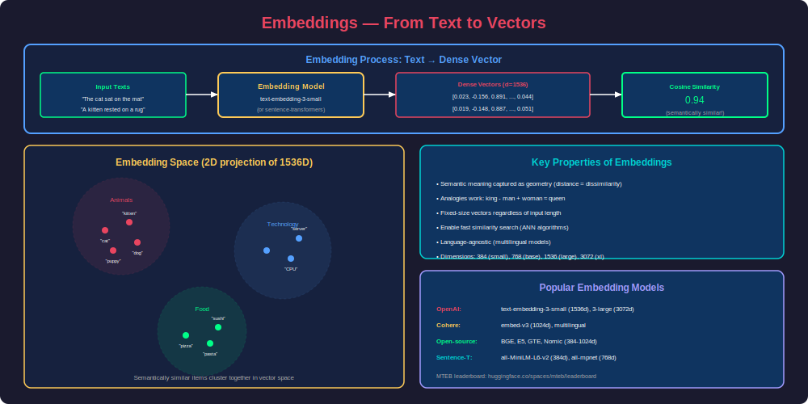

### How Embeddings Work — Real-World Analogy

Think of a library. Traditional search is like looking up a book by its exact title in a card catalog. Embedding-based search is like having a librarian who understands what you *mean* and can find books on similar topics, even if you describe them differently.

Each dimension in an embedding captures some aspect of meaning:
- Dimension 42 might partially encode "formality"
- Dimension 108 might partially encode "topic: technology"
- Dimension 256 might partially encode "sentiment: positive"

No single dimension maps to one clean concept—meaning is distributed across all dimensions.

### Embedding Models

| Model | Provider | Dimensions | Best For | Cost |
|---|---|---|---|---|
| `text-embedding-3-small` | OpenAI | 1536 | General text, cost-effective | $0.02/1M tokens |
| `text-embedding-3-large` | OpenAI | 3072 | High accuracy | $0.13/1M tokens |
| `text-embedding-ada-002` | OpenAI | 1536 | Legacy, still widely used | $0.10/1M tokens |
| `embed-english-v3.0` | Cohere | 1024 | English text, search | $0.10/1M tokens |
| `embed-multilingual-v3.0` | Cohere | 1024 | 100+ languages | $0.10/1M tokens |
| `all-MiniLM-L6-v2` | HuggingFace | 384 | Fast, lightweight | Free (local) |
| `bge-large-en-v1.5` | BAAI | 1024 | MTEB leaderboard top | Free (local) |
| `e5-large-v2` | Microsoft | 1024 | Passage retrieval | Free (local) |
| `nomic-embed-text-v1.5` | Nomic | 768 | Long context (8192 tokens) | Free (local) |
| `voyage-large-2` | Voyage AI | 1536 | Code + text | $0.12/1M tokens |

### Generating Embeddings — Code Examples

```python
# ============================================================
# Method 1: OpenAI Embeddings
# ============================================================
from openai import OpenAI

client = OpenAI()

def get_openai_embedding(text: str, model: str = "text-embedding-3-small") -> list[float]:
    """Generate embedding using OpenAI API."""
    response = client.embeddings.create(
        input=text,
        model=model
    )
    return response.data[0].embedding

# Single text
embedding = get_openai_embedding("Vector databases store high-dimensional data")
print(f"Dimensions: {len(embedding)}")  # 1536
print(f"First 5 values: {embedding[:5]}")
# [-0.0123, 0.0456, -0.0789, 0.0234, -0.0567]

# Batch embedding (more efficient)
def batch_embed(texts: list[str], model: str = "text-embedding-3-small") -> list[list[float]]:
    """Embed multiple texts in one API call."""
    response = client.embeddings.create(
        input=texts,
        model=model
    )
    return [item.embedding for item in response.data]

documents = [
    "Machine learning is a subset of AI",
    "Neural networks learn patterns from data",
    "The weather today is sunny and warm"
]
embeddings = batch_embed(documents)
```

```python
# ============================================================
# Method 2: HuggingFace Sentence Transformers (Local, Free)
# ============================================================
from sentence_transformers import SentenceTransformer
import numpy as np

# Load model (downloads ~90MB first time)
model = SentenceTransformer('all-MiniLM-L6-v2')

# Generate embeddings
sentences = [
    "How do I reset my password?",
    "I forgot my login credentials",
    "What's the weather like today?",
    "Tell me about password recovery"
]

embeddings = model.encode(sentences)
print(f"Shape: {embeddings.shape}")  # (4, 384)

# Check similarity between sentences
from sklearn.metrics.pairwise import cosine_similarity

sim_matrix = cosine_similarity(embeddings)
print("\nSimilarity Matrix:")
for i, sent in enumerate(sentences):
    print(f"  {sent[:40]:40s} → ", end="")
    for j in range(len(sentences)):
        print(f"{sim_matrix[i][j]:.3f} ", end="")
    print()

# Output:
# "How do I reset my password?"        → 1.000  0.823  0.112  0.876
# "I forgot my login credentials"      → 0.823  1.000  0.089  0.791
# "What's the weather like today?"      → 0.112  0.089  1.000  0.098
# "Tell me about password recovery"     → 0.876  0.791  0.098  1.000
```

```python
# ============================================================
# Method 3: Cohere Embeddings (with input_type for better results)
# ============================================================
import cohere

co = cohere.Client("your-api-key")

# Cohere distinguishes between documents and queries
doc_embeddings = co.embed(
    texts=["Vector databases enable semantic search"],
    model="embed-english-v3.0",
    input_type="search_document"  # For documents being stored
).embeddings

query_embedding = co.embed(
    texts=["What are vector DBs used for?"],
    model="embed-english-v3.0",
    input_type="search_query"  # For search queries
).embeddings
```

### Embedding Space Visualization


### Key Properties of Good Embeddings

| Property | Description | Example |
|---|---|---|
| **Semantic clustering** | Similar items cluster together | "happy", "joyful", "elated" are close |
| **Analogical reasoning** | Vector arithmetic captures relationships | king - man + woman ≈ queen |
| **Distance = dissimilarity** | Far apart = different meaning | "cat" is far from "quantum physics" |
| **Dimensionality** | More dims = more nuance (but more compute) | 384 dims vs 3072 dims |
| **Normalization** | Unit vectors simplify distance to cosine | Most models output normalized vectors |

---

## 2. Similarity Search

### The Core Problem

Given a query vector **q** and a database of N vectors, find the K vectors most similar to **q**. This is the **K-Nearest Neighbors (KNN)** problem in high-dimensional space.

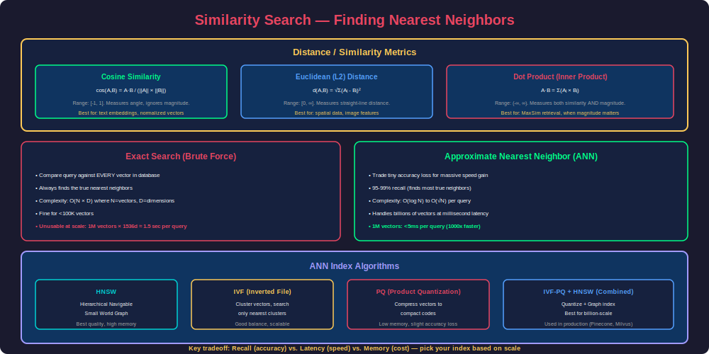

### Distance / Similarity Metrics

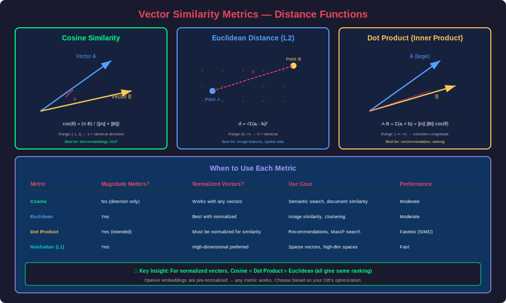

#### Cosine Similarity

Measures the angle between two vectors. Ignores magnitude, focuses on direction.

```
cosine_similarity(A, B) = (A · B) / (||A|| × ||B||)
```

- Range: [-1, 1] (for normalized vectors: [0, 1] since embeddings are positive)
- 1 = identical direction, 0 = orthogonal, -1 = opposite
- **Best for**: text embeddings (most common choice)

#### Euclidean Distance (L2)

Measures straight-line distance between two points.

```
euclidean(A, B) = √(Σ(aᵢ - bᵢ)²)
```

- Range: [0, ∞)
- 0 = identical, larger = more different
- **Best for**: when magnitude matters (e.g., user behavior vectors)

#### Dot Product (Inner Product)

```
dot_product(A, B) = Σ(aᵢ × bᵢ)
```

- Range: (-∞, +∞)
- Combines direction AND magnitude
- For normalized vectors: identical to cosine similarity
- **Best for**: when both direction and magnitude are meaningful (e.g., recommendation scores)

#### Manhattan Distance (L1)

```
manhattan(A, B) = Σ|aᵢ - bᵢ|
```

- Range: [0, ∞)
- Sum of absolute differences
- **Best for**: sparse vectors, high-dimensional spaces where L2 suffers from "curse of dimensionality"

### Code: Computing Similarities

```python
import numpy as np
from scipy.spatial.distance import cosine, euclidean

def compute_all_metrics(vec_a: np.ndarray, vec_b: np.ndarray) -> dict:
    """Compute all common similarity/distance metrics."""
    # Cosine similarity (1 - cosine distance)
    cos_sim = 1 - cosine(vec_a, vec_b)
    
    # Euclidean distance
    l2_dist = euclidean(vec_a, vec_b)
    
    # Dot product
    dot = np.dot(vec_a, vec_b)
    
    # Manhattan distance
    l1_dist = np.sum(np.abs(vec_a - vec_b))
    
    return {
        "cosine_similarity": cos_sim,
        "euclidean_distance": l2_dist,
        "dot_product": dot,
        "manhattan_distance": l1_dist
    }

# Example
vec_a = np.array([0.1, 0.3, 0.5, 0.7, 0.2])
vec_b = np.array([0.2, 0.4, 0.4, 0.6, 0.3])

metrics = compute_all_metrics(vec_a, vec_b)
for name, value in metrics.items():
    print(f"{name:25s}: {value:.6f}")

# cosine_similarity        : 0.993456
# euclidean_distance       : 0.223607
# dot_product              : 0.780000
# manhattan_distance       : 0.500000
```

### Exact vs Approximate Nearest Neighbors

| Approach | Time Complexity | Accuracy | Use Case |
|---|---|---|---|
| **Brute Force (Exact KNN)** | O(N × D) | 100% | Small datasets (<100K vectors) |
| **Approximate NN (ANN)** | O(log N) to O(N^0.5) | 95-99.9% | Production (millions+ vectors) |

The trade-off: ANN sacrifices a tiny amount of accuracy for **orders of magnitude** speed improvement. In practice, 99% recall is acceptable because embeddings are already approximate representations.

---

## 3. Indexing Algorithms for ANN Search

### Why Indexing Matters

Brute-force search compares the query against every vector. For 10M vectors with 1536 dimensions:
- Operations: 10,000,000 × 1536 multiplications = **15.36 billion** FLOPs per query
- Latency: ~500ms on modern hardware
- Unacceptable for real-time search

ANN indexes pre-organize vectors so only a fraction need to be compared.

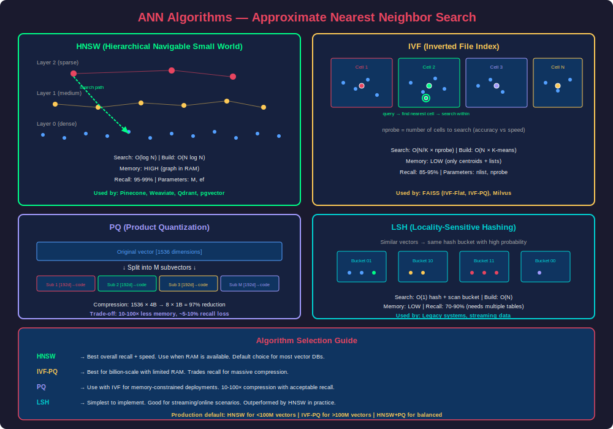

### HNSW (Hierarchical Navigable Small World)

The most popular ANN algorithm. Used by Pinecone, Weaviate, Qdrant, pgvector, and many others.

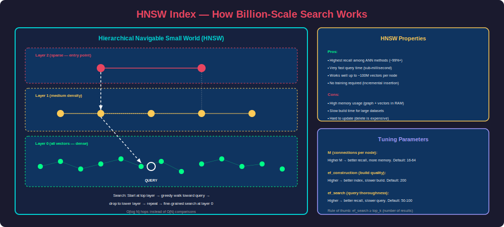

#### How HNSW Works — Analogy

Imagine searching for a person in a city:
- **Layer 0 (bottom)**: Every person in the city (full graph)
- **Layer 1**: Neighborhood leaders (subset, connected to nearby leaders)
- **Layer 2**: District leaders (smaller subset)
- **Layer 3 (top)**: City council (just a few nodes)

Search starts at the top layer, quickly narrows to the right neighborhood, then searches exhaustively in the bottom layer.

#### HNSW Parameters

| Parameter | What It Controls | Typical Value | Trade-off |
|---|---|---|---|
| `M` | Max connections per node | 16-64 | Higher M = better recall, more memory |
| `ef_construction` | Beam width during build | 100-400 | Higher = better graph quality, slower build |
| `ef_search` | Beam width during query | 50-200 | Higher = better recall, slower search |

#### HNSW Complexity

- **Build time**: O(N × log N)
- **Search time**: O(log N)
- **Memory**: O(N × M × layers)
- **Recall@10**: 95-99.5% depending on parameters

### IVF (Inverted File Index)

Partitions the vector space into clusters (Voronoi cells). At query time, only search the closest clusters.

#### How IVF Works

1. **Build**: Run K-Means to create `nlist` centroids (cluster centers)
2. **Insert**: Assign each vector to its nearest centroid
3. **Search**: Find `nprobe` nearest centroids to query, then brute-force within those clusters

#### IVF Parameters

| Parameter | What It Controls | Typical Value |
|---|---|---|
| `nlist` | Number of clusters | √N to 4√N (e.g., 1024 for 1M vectors) |
| `nprobe` | Clusters to search at query time | 5-20% of nlist |

```python
import faiss
import numpy as np

# IVF Index example
d = 128          # dimension
nlist = 100      # number of clusters
n_vectors = 100000

# Generate random data
xb = np.random.random((n_vectors, d)).astype('float32')
xq = np.random.random((10, d)).astype('float32')  # 10 queries

# Build IVF index
quantizer = faiss.IndexFlatL2(d)         # used to find nearest cluster
index = faiss.IndexIVFFlat(quantizer, d, nlist)

index.train(xb)        # learn cluster centroids
index.add(xb)          # add vectors to clusters

# Search
index.nprobe = 10      # search 10 nearest clusters
D, I = index.search(xq, k=5)  # find 5 nearest neighbors
print(f"Distances: {D[0]}")
print(f"Indices: {I[0]}")
```

### Product Quantization (PQ)

Compresses vectors to reduce memory usage. Splits each vector into sub-vectors and quantizes each independently.

#### How PQ Works

1. Split a 128-dim vector into 8 sub-vectors of 16 dims each
2. For each sub-space, learn 256 centroids (codebook)
3. Represent each sub-vector by its nearest centroid ID (1 byte)
4. Original vector (128 × 4 bytes = 512 bytes) → compressed (8 bytes)
5. **64x compression** with ~95% recall preserved

```python
# IVF + PQ for large-scale search
d = 128
nlist = 1024
m = 8           # number of sub-quantizers
nbits = 8      # bits per sub-quantizer (256 centroids each)

index = faiss.IndexIVFPQ(quantizer, d, nlist, m, nbits)
index.train(xb)
index.add(xb)

# Memory: 100K vectors × 8 bytes = 800 KB (vs 48 MB for flat)
```

### Algorithm Comparison

| Algorithm | Search Speed | Memory | Build Time | Best For |
|---|---|---|---|---|
| **Flat (Brute Force)** | Slow O(N) | Low (raw vectors) | None | <100K vectors, 100% recall |
| **IVF-Flat** | Fast | Medium | Medium (K-Means) | 100K–10M vectors |
| **IVF-PQ** | Very Fast | Very Low | Slow (train) | 10M–1B+ vectors, memory-constrained |
| **HNSW** | Very Fast | High (graph) | Slow (graph build) | <50M vectors, low-latency required |
| **HNSW + PQ** | Fast | Medium | Slow | Large scale with latency needs |
| **ScaNN** | Very Fast | Medium | Medium | Google-scale, high throughput |

---

## 4. FAISS (Facebook AI Similarity Search)

### What Is FAISS?

FAISS is a library by Meta AI for efficient similarity search. It's not a database—it's a **low-level indexing library** that you use to build your own search system. Fastest option for local/single-machine use.

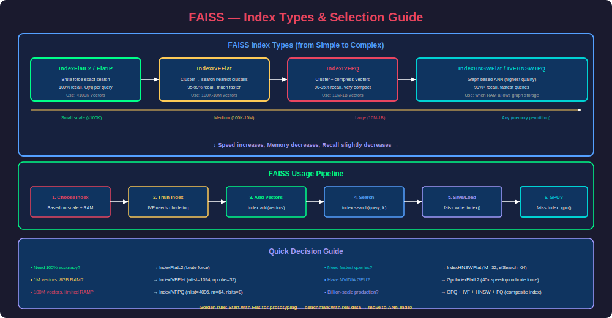

### When to Use FAISS

- You need maximum performance on a single machine
- You don't need persistence/replication/cloud hosting
- Your dataset fits in RAM (or you can use disk-based indexes)
- You want full control over indexing parameters
- You're building a custom system (not using a managed service)

### FAISS Index Types

| Index | Description | Use Case |
|---|---|---|
| `IndexFlatL2` | Brute-force L2 distance | Baseline, small data |
| `IndexFlatIP` | Brute-force inner product | Cosine sim (after normalization) |
| `IndexIVFFlat` | IVF with flat storage | Medium datasets |
| `IndexIVFPQ` | IVF + product quantization | Large datasets, memory-limited |
| `IndexHNSWFlat` | HNSW graph | Low-latency requirements |
| `IndexIVFScalarQuantizer` | IVF + scalar quantization | Good compression/accuracy balance |

### Complete FAISS Example — Semantic Search Engine

```python
import faiss
import numpy as np
from sentence_transformers import SentenceTransformer
import json
import time

class FAISSSearchEngine:
    """Production-ready semantic search with FAISS."""
    
    def __init__(self, model_name: str = "all-MiniLM-L6-v2"):
        self.model = SentenceTransformer(model_name)
        self.dimension = self.model.get_sentence_embedding_dimension()
        self.index = None
        self.documents = []
        self.metadata = []
    
    def build_index(self, documents: list[str], metadata: list[dict] = None,
                    index_type: str = "hnsw"):
        """Build FAISS index from documents."""
        self.documents = documents
        self.metadata = metadata or [{}] * len(documents)
        
        # Generate embeddings
        print(f"Encoding {len(documents)} documents...")
        start = time.time()
        embeddings = self.model.encode(documents, show_progress_bar=True)
        embeddings = embeddings.astype('float32')
        
        # Normalize for cosine similarity (use inner product after normalization)
        faiss.normalize_L2(embeddings)
        
        print(f"Encoding took {time.time()-start:.2f}s")
        
        # Build index based on type
        if index_type == "flat":
            self.index = faiss.IndexFlatIP(self.dimension)
            
        elif index_type == "ivf":
            nlist = min(int(np.sqrt(len(documents))), 256)
            quantizer = faiss.IndexFlatIP(self.dimension)
            self.index = faiss.IndexIVFFlat(quantizer, self.dimension, nlist)
            self.index.train(embeddings)
            self.index.nprobe = max(1, nlist // 10)
            
        elif index_type == "hnsw":
            self.index = faiss.IndexHNSWFlat(self.dimension, 32)  # M=32
            self.index.hnsw.efConstruction = 200
            self.index.hnsw.efSearch = 64
            
        elif index_type == "ivfpq":
            nlist = min(int(4 * np.sqrt(len(documents))), 1024)
            m = 8  # sub-quantizers
            quantizer = faiss.IndexFlatIP(self.dimension)
            self.index = faiss.IndexIVFPQ(quantizer, self.dimension, nlist, m, 8)
            self.index.train(embeddings)
            self.index.nprobe = max(1, nlist // 10)
        
        # Add vectors
        self.index.add(embeddings)
        print(f"Index built: {self.index.ntotal} vectors, type={index_type}")
    
    def search(self, query: str, top_k: int = 5) -> list[dict]:
        """Search for similar documents."""
        # Encode and normalize query
        query_vec = self.model.encode([query]).astype('float32')
        faiss.normalize_L2(query_vec)
        
        # Search
        scores, indices = self.index.search(query_vec, top_k)
        
        results = []
        for score, idx in zip(scores[0], indices[0]):
            if idx == -1:
                continue
            results.append({
                "document": self.documents[idx],
                "score": float(score),
                "metadata": self.metadata[idx],
                "index": int(idx)
            })
        return results
    
    def save(self, path: str):
        """Save index and documents to disk."""
        faiss.write_index(self.index, f"{path}.index")
        with open(f"{path}.meta", "w") as f:
            json.dump({"documents": self.documents, "metadata": self.metadata}, f)
    
    def load(self, path: str):
        """Load index and documents from disk."""
        self.index = faiss.read_index(f"{path}.index")
        with open(f"{path}.meta", "r") as f:
            data = json.load(f)
            self.documents = data["documents"]
            self.metadata = data["metadata"]


# Usage
engine = FAISSSearchEngine()

documents = [
    "Python is a high-level programming language known for its simplicity",
    "Machine learning algorithms learn patterns from data",
    "Docker containers package applications with their dependencies",
    "Kubernetes orchestrates containerized applications at scale",
    "Neural networks are inspired by biological brain structures",
    "SQL databases use structured query language for data manipulation",
    "Vector databases store and search high-dimensional embeddings",
    "Transformers use self-attention mechanisms for sequence processing",
    "REST APIs enable communication between distributed systems",
    "Git is a distributed version control system for tracking code changes"
]

metadata = [{"category": "programming"}, {"category": "ml"}, 
            {"category": "devops"}, {"category": "devops"},
            {"category": "ml"}, {"category": "databases"},
            {"category": "databases"}, {"category": "ml"},
            {"category": "backend"}, {"category": "devops"}]

engine.build_index(documents, metadata, index_type="hnsw")

# Search
results = engine.search("How do AI models process sequences?", top_k=3)
for r in results:
    print(f"  [{r['score']:.4f}] {r['document']}")
    print(f"           Category: {r['metadata']['category']}")

# Output:
#   [0.7234] Transformers use self-attention mechanisms for sequence processing
#            Category: ml
#   [0.5891] Neural networks are inspired by biological brain structures
#            Category: ml
#   [0.5123] Machine learning algorithms learn patterns from data
#            Category: ml
```

### FAISS GPU Acceleration

```python
# Move index to GPU for 5-10x speedup
import faiss

# Single GPU
res = faiss.StandardGpuResources()
gpu_index = faiss.index_cpu_to_gpu(res, 0, cpu_index)  # GPU 0

# Multiple GPUs
gpu_index = faiss.index_cpu_to_all_gpus(cpu_index)

# Search on GPU (same API)
D, I = gpu_index.search(query_vectors, k=10)
```

### FAISS Performance Benchmarks

| Dataset Size | Index Type | Build Time | Query Latency (single) | Recall@10 | Memory |
|---|---|---|---|---|---|
| 100K × 384d | Flat | 0s | 5ms | 100% | 150 MB |
| 100K × 384d | HNSW (M=32) | 12s | 0.2ms | 99.2% | 380 MB |
| 1M × 384d | IVF1024,Flat | 45s | 2ms | 97.5% | 1.5 GB |
| 1M × 384d | IVF1024,PQ8 | 120s | 0.5ms | 93.1% | 50 MB |
| 10M × 384d | IVF4096,PQ16 | 30min | 1ms | 91.8% | 320 MB |

---

## 5. Pinecone

### What Is Pinecone?

Pinecone is a **fully managed vector database** as a service. You don't manage infrastructure—just push vectors and query. It handles scaling, replication, and high availability.

### When to Use Pinecone

- You want zero infrastructure management
- You need multi-region/high-availability
- Your team doesn't have database expertise
- You need metadata filtering + vector search combined
- You're in production and need SLAs

### Architecture

Pinecone separates **storage** and **compute**:
- **Pods**: Dedicated compute units (p1 for storage, s1 for performance)
- **Serverless**: Pay-per-query, auto-scaling (recommended for most use cases)
- **Collections**: Snapshots for backup/migration

### Complete Pinecone Example

```python
from pinecone import Pinecone, ServerlessSpec
from openai import OpenAI
import time

# Initialize
pc = Pinecone(api_key="your-pinecone-api-key")
openai_client = OpenAI()

# Create index
INDEX_NAME = "product-search"

if INDEX_NAME not in pc.list_indexes().names():
    pc.create_index(
        name=INDEX_NAME,
        dimension=1536,  # OpenAI embedding dimension
        metric="cosine",
        spec=ServerlessSpec(
            cloud="aws",
            region="us-east-1"
        )
    )
    # Wait for index to be ready
    while not pc.describe_index(INDEX_NAME).status['ready']:
        time.sleep(1)

index = pc.Index(INDEX_NAME)

# --- INGESTION ---
def embed_texts(texts: list[str]) -> list[list[float]]:
    """Get OpenAI embeddings for a list of texts."""
    response = openai_client.embeddings.create(
        input=texts,
        model="text-embedding-3-small"
    )
    return [item.embedding for item in response.data]


# Sample product catalog
products = [
    {
        "id": "prod_001",
        "text": "Wireless noise-cancelling headphones with 30-hour battery life",
        "metadata": {"category": "electronics", "price": 299.99, "brand": "Sony"}
    },
    {
        "id": "prod_002",
        "text": "Organic cotton t-shirt, breathable fabric, available in 5 colors",
        "metadata": {"category": "clothing", "price": 29.99, "brand": "EcoWear"}
    },
    {
        "id": "prod_003",
        "text": "Professional espresso machine with milk frother and grinder",
        "metadata": {"category": "kitchen", "price": 599.99, "brand": "Breville"}
    },
    {
        "id": "prod_004",
        "text": "Running shoes with carbon fiber plate for marathon racing",
        "metadata": {"category": "sports", "price": 249.99, "brand": "Nike"}
    },
    {
        "id": "prod_005",
        "text": "4K webcam with ring light and noise-cancelling microphone",
        "metadata": {"category": "electronics", "price": 149.99, "brand": "Logitech"}
    }
]

# Upsert vectors in batches
batch_size = 100
texts = [p["text"] for p in products]
embeddings = embed_texts(texts)

vectors = [
    {
        "id": p["id"],
        "values": emb,
        "metadata": {**p["metadata"], "text": p["text"]}
    }
    for p, emb in zip(products, embeddings)
]

index.upsert(vectors=vectors, namespace="products")
print(f"Upserted {len(vectors)} vectors")

# --- QUERYING ---
def search_products(query: str, top_k: int = 3, 
                    filters: dict = None) -> list[dict]:
    """Semantic search with optional metadata filtering."""
    query_embedding = embed_texts([query])[0]
    
    results = index.query(
        vector=query_embedding,
        top_k=top_k,
        filter=filters,
        include_metadata=True,
        namespace="products"
    )
    
    return [
        {
            "id": match.id,
            "score": match.score,
            "text": match.metadata.get("text", ""),
            "category": match.metadata.get("category", ""),
            "price": match.metadata.get("price", 0),
            "brand": match.metadata.get("brand", "")
        }
        for match in results.matches
    ]

# Simple semantic search
results = search_products("I need something to listen to music while commuting")
for r in results:
    print(f"  [{r['score']:.4f}] {r['text']} — ${r['price']}")

# Filtered search: only electronics under $200
results = search_products(
    "good for video calls",
    filters={
        "category": {"$eq": "electronics"},
        "price": {"$lt": 200}
    }
)

# --- METADATA FILTERING SYNTAX ---
# Pinecone filter operators:
# $eq, $ne        — equals, not equals
# $gt, $gte       — greater than (or equal)
# $lt, $lte       — less than (or equal)
# $in, $nin       — in list, not in list
# $and, $or       — logical operators

complex_filter = {
    "$and": [
        {"category": {"$in": ["electronics", "sports"]}},
        {"price": {"$lte": 300}},
        {"brand": {"$ne": "Generic"}}
    ]
}
```

### Pinecone Namespaces

Namespaces partition an index into separate segments—useful for multi-tenancy:

```python
# Each customer gets their own namespace
index.upsert(vectors=customer_a_vectors, namespace="customer_a")
index.upsert(vectors=customer_b_vectors, namespace="customer_b")

# Queries are scoped to a namespace
results = index.query(vector=q, namespace="customer_a", top_k=10)
# Only searches customer_a's vectors
```

---

## 6. ChromaDB

### What Is ChromaDB?

ChromaDB is an **open-source, lightweight embedding database** designed for AI applications. It's the easiest vector database to get started with—runs locally with zero configuration, great for prototyping and small/medium production deployments.

### When to Use ChromaDB

- Rapid prototyping and development
- Local-first applications
- Small to medium datasets (< 10M vectors)
- You want the simplest possible API
- Embedded use (within your application process)
- Open-source requirement

### ChromaDB Architecture

- **Embedded mode**: Runs in-process (like SQLite for vectors)
- **Client/Server mode**: Separate server for multi-client access
- **Cloud mode**: Managed hosting (Chroma Cloud)
- **Storage**: DuckDB + Apache Parquet backend
- **Index**: HNSW (via hnswlib)

### Complete ChromaDB Example

```python
import chromadb
from chromadb.utils import embedding_functions

# ============================================================
# Setup — Embedded mode (simplest)
# ============================================================
# Persistent storage (survives restarts)
client = chromadb.PersistentClient(path="./chroma_data")

# Or ephemeral (in-memory, for testing)
# client = chromadb.EphemeralClient()

# Or client-server mode
# client = chromadb.HttpClient(host="localhost", port=8000)

# ============================================================
# Choose embedding function
# ============================================================
# Option 1: Default (all-MiniLM-L6-v2, runs locally)
default_ef = embedding_functions.DefaultEmbeddingFunction()

# Option 2: OpenAI
openai_ef = embedding_functions.OpenAIEmbeddingFunction(
    api_key="your-key",
    model_name="text-embedding-3-small"
)

# Option 3: HuggingFace
hf_ef = embedding_functions.HuggingFaceEmbeddingFunction(
    model_name="BAAI/bge-small-en-v1.5"
)

# ============================================================
# Create collection
# ============================================================
collection = client.get_or_create_collection(
    name="knowledge_base",
    embedding_function=default_ef,
    metadata={"hnsw:space": "cosine"}  # distance metric
)

# ============================================================
# Add documents (embeddings generated automatically)
# ============================================================
collection.add(
    ids=["doc1", "doc2", "doc3", "doc4", "doc5"],
    documents=[
        "Python is a versatile programming language used in data science",
        "JavaScript powers interactive web applications in browsers",
        "Docker containers isolate applications from the host system",
        "Machine learning models require large datasets for training",
        "PostgreSQL is a powerful open-source relational database"
    ],
    metadatas=[
        {"topic": "programming", "difficulty": "beginner"},
        {"topic": "web", "difficulty": "beginner"},
        {"topic": "devops", "difficulty": "intermediate"},
        {"topic": "ml", "difficulty": "intermediate"},
        {"topic": "databases", "difficulty": "intermediate"}
    ]
)

print(f"Collection size: {collection.count()}")

# ============================================================
# Query — semantic search
# ============================================================
results = collection.query(
    query_texts=["How to analyze data with code?"],
    n_results=3,
    include=["documents", "metadatas", "distances"]
)

for doc, meta, dist in zip(
    results["documents"][0],
    results["metadatas"][0],
    results["distances"][0]
):
    print(f"  [{1-dist:.4f}] {doc}")
    print(f"           Topic: {meta['topic']}, Difficulty: {meta['difficulty']}")

# ============================================================
# Filtered query
# ============================================================
results = collection.query(
    query_texts=["containerization and deployment"],
    n_results=3,
    where={"topic": {"$in": ["devops", "programming"]}},
    include=["documents", "distances"]
)

# ============================================================
# Update documents
# ============================================================
collection.update(
    ids=["doc1"],
    documents=["Python is the #1 language for AI, data science, and automation"],
    metadatas=[{"topic": "programming", "difficulty": "beginner", "updated": True}]
)

# ============================================================
# Delete documents
# ============================================================
collection.delete(ids=["doc5"])
# Or delete by filter:
collection.delete(where={"topic": "databases"})

# ============================================================
# Get documents by ID (no search needed)
# ============================================================
docs = collection.get(
    ids=["doc1", "doc2"],
    include=["documents", "metadatas"]
)
```

### ChromaDB with LangChain Integration

```python
from langchain_community.vectorstores import Chroma
from langchain_openai import OpenAIEmbeddings
from langchain.text_splitter import RecursiveCharacterTextSplitter

# Load and split documents
text_splitter = RecursiveCharacterTextSplitter(
    chunk_size=500,
    chunk_overlap=50
)
docs = text_splitter.split_documents(loaded_documents)

# Create Chroma vector store
vectorstore = Chroma.from_documents(
    documents=docs,
    embedding=OpenAIEmbeddings(),
    persist_directory="./chroma_langchain",
    collection_name="my_docs"
)

# Search
retriever = vectorstore.as_retriever(
    search_type="mmr",  # Maximum Marginal Relevance
    search_kwargs={"k": 5, "fetch_k": 20}
)

relevant_docs = retriever.invoke("What is retrieval augmented generation?")
```

---

## 7. Weaviate

### What Is Weaviate?

Weaviate is an **open-source vector database** with a unique object-oriented schema, built-in vectorization modules, and GraphQL API. It combines vector search with structured filtering and supports hybrid (vector + keyword) search natively.

### When to Use Weaviate

- You need hybrid search (BM25 + vector) out of the box
- You want built-in vectorization (no separate embedding step)
- You need a schema-enforced data model
- You want GraphQL query interface
- Multi-modal search (text + image)
- Self-hosted or Weaviate Cloud

### Key Differentiators

| Feature | Weaviate | Pinecone | ChromaDB |
|---|---|---|---|
| **Hosting** | Self-hosted or Cloud | Cloud only | Local or Cloud |
| **Vectorization** | Built-in modules | Bring your own | Bring your own or built-in |
| **Hybrid search** | Native BM25 + vector | Vector only | Vector only |
| **Schema** | Enforced class-based | Schema-less | Schema-less |
| **Query language** | GraphQL + REST | REST | Python API |
| **Multi-tenancy** | Native | Namespaces | Collections |
| **Generative search** | Built-in (RAG module) | External | External |

### Complete Weaviate Example

```python
import weaviate
from weaviate.classes.init import Auth
from weaviate.classes.config import Configure, Property, DataType
from weaviate.classes.query import MetadataQuery, Filter

# ============================================================
# Connect to Weaviate
# ============================================================
# Option 1: Weaviate Cloud
client = weaviate.connect_to_weaviate_cloud(
    cluster_url="https://your-cluster.weaviate.network",
    auth_credentials=Auth.api_key("your-weaviate-api-key"),
    headers={"X-OpenAI-Api-Key": "your-openai-key"}  # for vectorizer module
)

# Option 2: Local Docker
# client = weaviate.connect_to_local()

# ============================================================
# Define schema (class)
# ============================================================
articles = client.collections.create(
    name="Article",
    vectorizer_config=Configure.Vectorizer.text2vec_openai(
        model="text-embedding-3-small"
    ),
    generative_config=Configure.Generative.openai(
        model="gpt-4"
    ),
    properties=[
        Property(name="title", data_type=DataType.TEXT),
        Property(name="content", data_type=DataType.TEXT),
        Property(name="category", data_type=DataType.TEXT),
        Property(name="published_date", data_type=DataType.DATE),
        Property(name="word_count", data_type=DataType.INT),
    ]
)

# ============================================================
# Insert objects (auto-vectorized by Weaviate!)
# ============================================================
articles = client.collections.get("Article")

# Single insert
articles.data.insert({
    "title": "Introduction to Vector Databases",
    "content": "Vector databases are specialized systems for storing and searching embeddings...",
    "category": "technology",
    "published_date": "2024-03-15T00:00:00Z",
    "word_count": 1500
})

# Batch insert
with articles.batch.dynamic() as batch:
    for article in article_list:
        batch.add_object(properties=article)

# ============================================================
# Vector search (semantic / nearText)
# ============================================================
response = articles.query.near_text(
    query="how to store AI embeddings efficiently",
    limit=5,
    return_metadata=MetadataQuery(distance=True, score=True)
)

for obj in response.objects:
    print(f"  [{obj.metadata.distance:.4f}] {obj.properties['title']}")
    print(f"    Category: {obj.properties['category']}")

# ============================================================
# Hybrid search (BM25 + vector, combined)
# ============================================================
response = articles.query.hybrid(
    query="vector database indexing algorithms",
    alpha=0.7,  # 0=pure BM25, 1=pure vector, 0.7=favor vector
    limit=5,
    return_metadata=MetadataQuery(score=True)
)

# ============================================================
# Filtered search
# ============================================================
response = articles.query.near_text(
    query="machine learning deployment",
    limit=5,
    filters=(
        Filter.by_property("category").equal("technology") &
        Filter.by_property("word_count").greater_than(500)
    )
)

# ============================================================
# Generative search (RAG built-in!)
# ============================================================
response = articles.generate.near_text(
    query="vector database comparison",
    limit=3,
    single_prompt="Summarize this article in one sentence: {content}",
    grouped_task="Based on these articles, what are the key considerations when choosing a vector database?"
)

# Per-object generation
for obj in response.objects:
    print(f"  Summary: {obj.generated}")

# Grouped generation (uses all retrieved objects together)
print(f"\nGrouped answer: {response.generated}")

# ============================================================
# Cleanup
# ============================================================
client.close()
```

---

## 8. Vector Database Architecture & Internals

### Core Components

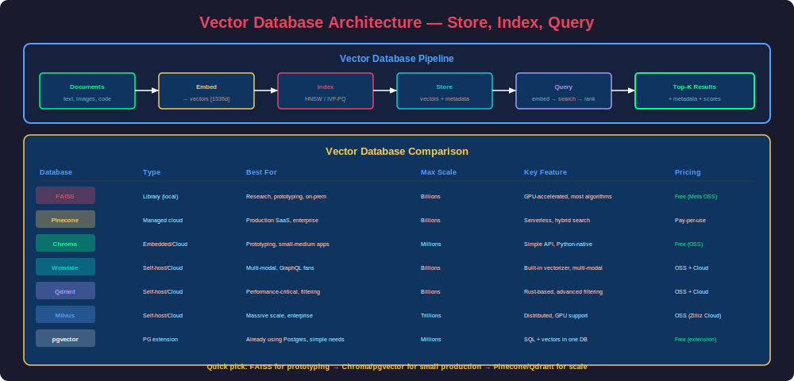

Every vector database has these fundamental components:

| Component | Purpose |
|---|---|
| **Embedding Storage** | Store raw vectors (or compressed versions) |
| **Index Structure** | Organize vectors for fast ANN search (HNSW, IVF, etc.) |
| **Metadata Store** | Store associated structured data (filters) |
| **Query Engine** | Combine vector search with metadata filtering |
| **Write-Ahead Log** | Ensure durability of inserts |
| **Replication** | Copies for high availability |
| **Sharding** | Distribute data across nodes for scale |

### Ingestion Pipeline

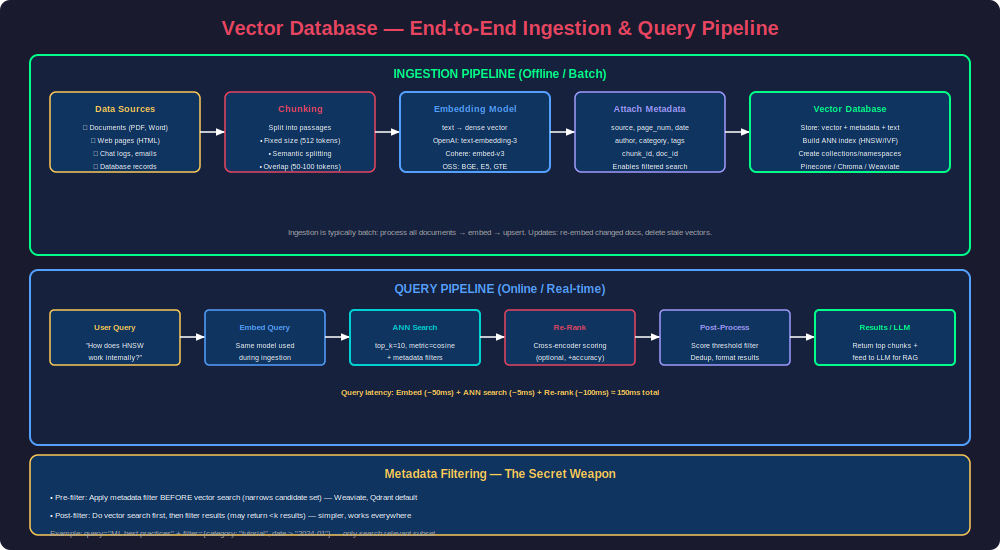

### Scaling Strategies

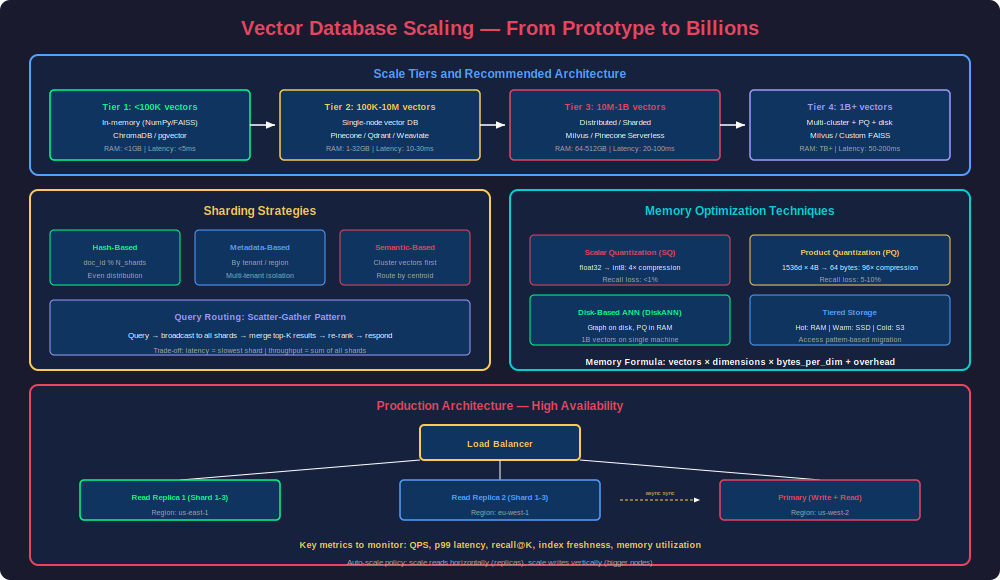

---

## 9. Production Considerations

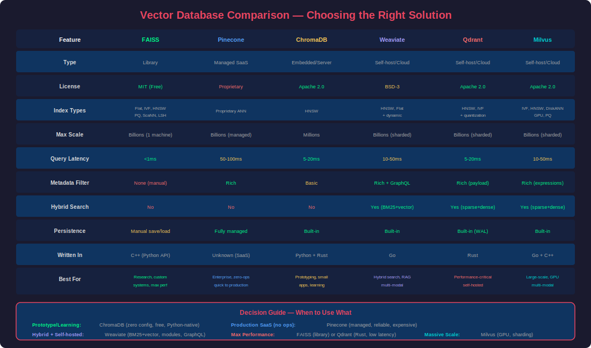

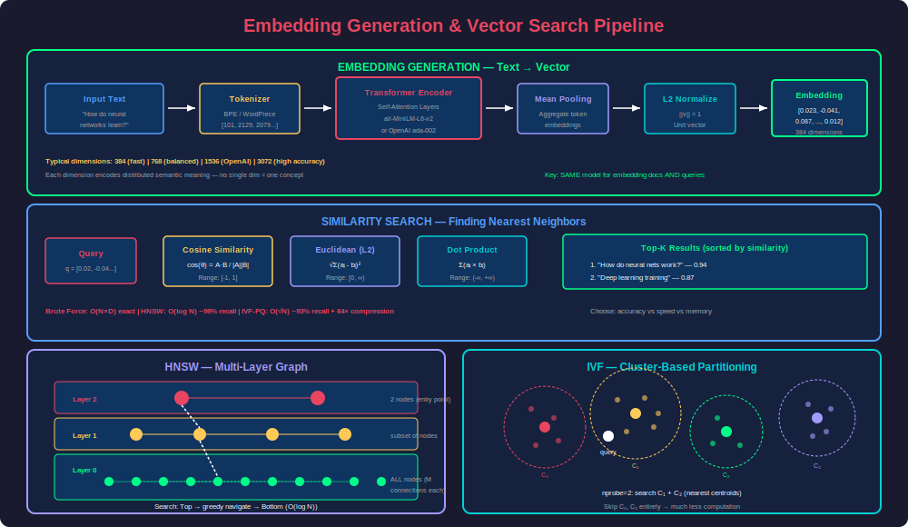

### Choosing the Right Vector Database

| Criteria | FAISS | Pinecone | ChromaDB | Weaviate | Qdrant | Milvus |
|---|---|---|---|---|---|---|
| **Type** | Library | Managed SaaS | Embedded/Server | Self-host/Cloud | Self-host/Cloud | Self-host/Cloud |
| **Max vectors** | Billions (disk) | Billions | Millions | Billions | Billions | Billions |
| **Latency (p99)** | <1ms | 50-100ms | 5-20ms | 10-50ms | 5-20ms | 10-50ms |
| **Filtering** | None (manual) | Rich | Basic | Rich + hybrid | Rich + payload | Rich |
| **Persistence** | Manual save/load | Managed | Built-in | Built-in | Built-in | Built-in |
| **Horizontal scale** | No (single machine) | Yes (managed) | No | Yes (sharding) | Yes (sharding) | Yes (sharding) |
| **Cost** | Free | $$$$ | Free/$ | Free/$$ | Free/$$ | Free/$$ |
| **Best for** | Research, custom | Enterprise SaaS | Prototypes, apps | Hybrid search | Performance | Large scale |

### Performance Optimization Checklist

```python
# 1. Choose the right embedding model
#    - More dimensions ≠ always better
#    - Match model to your domain (code, medical, general)
#    - Benchmark: test retrieval quality on YOUR data

# 2. Optimal chunk size for documents
#    - Too small: loses context → poor retrieval
#    - Too large: dilutes relevance → noisy results
#    - Typical: 256-512 tokens for general text
#    - Test: 128, 256, 512, 1024 and measure recall

# 3. Index tuning
#    HNSW Parameters:
#    - M: 16 (small/fast) → 64 (large/accurate)
#    - efConstruction: 100 → 400 (build quality)
#    - efSearch: 32 → 256 (query quality)
#    Rule: start with M=32, ef_construction=200, ef_search=100

# 4. Batch operations
#    - Always upsert in batches (100-1000 vectors per call)
#    - Parallel embedding generation
#    - Async upserts for high-throughput ingestion

# 5. Metadata filtering strategy
#    - Pre-filter (filter then search): faster for selective filters
#    - Post-filter (search then filter): better recall for broad filters
#    - Understand your DB's approach

# 6. Caching
#    - Cache frequent query embeddings
#    - Cache top results for common queries
#    - TTL based on data freshness requirements
```

### Monitoring Metrics

| Metric | Target | Alert If |
|---|---|---|
| **Query latency (p95)** | < 100ms | > 500ms |
| **Recall@10** | > 95% | < 90% |
| **Index freshness** | < 5 min lag | > 30 min |
| **Memory usage** | < 80% | > 90% |
| **QPS throughput** | Depends on load | Drops > 20% |
| **Error rate** | < 0.1% | > 1% |

---

## 10. End-to-End Project: Semantic Document Search

```python
"""
Complete production-ready semantic search system.
Combines: chunking → embedding → indexing → search → re-ranking
"""

import chromadb
from sentence_transformers import SentenceTransformer, CrossEncoder
from typing import Optional
import hashlib
import re


class SemanticDocumentSearch:
    """Full semantic search pipeline with re-ranking."""
    
    def __init__(self, collection_name: str = "documents"):
        self.client = chromadb.PersistentClient(path="./search_db")
        self.embedder = SentenceTransformer("all-MiniLM-L6-v2")
        self.reranker = CrossEncoder("cross-encoder/ms-marco-MiniLM-L-6-v2")
        
        self.collection = self.client.get_or_create_collection(
            name=collection_name,
            metadata={"hnsw:space": "cosine"}
        )
    
    def chunk_text(self, text: str, chunk_size: int = 500, 
                   overlap: int = 50) -> list[str]:
        """Split text into overlapping chunks by sentences."""
        sentences = re.split(r'(?<=[.!?])\s+', text)
        chunks = []
        current_chunk = []
        current_length = 0
        
        for sentence in sentences:
            sentence_length = len(sentence.split())
            
            if current_length + sentence_length > chunk_size and current_chunk:
                chunks.append(" ".join(current_chunk))
                # Keep overlap
                overlap_sentences = []
                overlap_length = 0
                for s in reversed(current_chunk):
                    if overlap_length + len(s.split()) > overlap:
                        break
                    overlap_sentences.insert(0, s)
                    overlap_length += len(s.split())
                current_chunk = overlap_sentences
                current_length = overlap_length
            
            current_chunk.append(sentence)
            current_length += sentence_length
        
        if current_chunk:
            chunks.append(" ".join(current_chunk))
        
        return chunks
    
    def ingest_document(self, text: str, doc_id: str, 
                        metadata: Optional[dict] = None):
        """Chunk, embed, and store a document."""
        chunks = self.chunk_text(text)
        
        ids = []
        documents = []
        metadatas = []
        
        for i, chunk in enumerate(chunks):
            chunk_id = f"{doc_id}_chunk_{i}"
            ids.append(chunk_id)
            documents.append(chunk)
            metadatas.append({
                **(metadata or {}),
                "doc_id": doc_id,
                "chunk_index": i,
                "total_chunks": len(chunks)
            })
        
        # Embed and store
        embeddings = self.embedder.encode(documents).tolist()
        
        self.collection.add(
            ids=ids,
            embeddings=embeddings,
            documents=documents,
            metadatas=metadatas
        )
        
        return len(chunks)
    
    def search(self, query: str, top_k: int = 5, 
               rerank: bool = True, 
               filters: Optional[dict] = None) -> list[dict]:
        """Search with optional re-ranking for better precision."""
        # Step 1: Retrieve candidates (fetch more than needed for re-ranking)
        fetch_k = top_k * 4 if rerank else top_k
        
        query_embedding = self.embedder.encode([query]).tolist()
        
        results = self.collection.query(
            query_embeddings=query_embedding,
            n_results=fetch_k,
            where=filters,
            include=["documents", "metadatas", "distances"]
        )
        
        if not results["documents"][0]:
            return []
        
        candidates = [
            {
                "document": doc,
                "metadata": meta,
                "vector_score": 1 - dist  # Convert distance to similarity
            }
            for doc, meta, dist in zip(
                results["documents"][0],
                results["metadatas"][0],
                results["distances"][0]
            )
        ]
        
        # Step 2: Re-rank with cross-encoder
        if rerank and len(candidates) > 1:
            pairs = [[query, c["document"]] for c in candidates]
            rerank_scores = self.reranker.predict(pairs)
            
            for candidate, score in zip(candidates, rerank_scores):
                candidate["rerank_score"] = float(score)
            
            candidates.sort(key=lambda x: x["rerank_score"], reverse=True)
        
        return candidates[:top_k]


# Usage
search_engine = SemanticDocumentSearch()

# Ingest documents
doc_text = """
Vector databases are specialized database systems designed to store, index, 
and query high-dimensional vector embeddings efficiently. Unlike traditional 
databases that excel at exact matching and structured queries, vector databases 
are optimized for similarity search — finding the closest vectors to a given 
query vector in high-dimensional space.

The core operation in a vector database is approximate nearest neighbor (ANN) 
search, which trades a small amount of accuracy for dramatic improvements in 
search speed. Modern ANN algorithms like HNSW achieve 99%+ recall while being 
orders of magnitude faster than brute-force search.

Key applications include semantic search, recommendation systems, image similarity, 
anomaly detection, and most importantly, Retrieval-Augmented Generation (RAG) 
systems that combine large language models with external knowledge bases.
"""

chunks_stored = search_engine.ingest_document(
    text=doc_text, 
    doc_id="intro_vector_db",
    metadata={"source": "tutorial", "topic": "vector_databases"}
)
print(f"Stored {chunks_stored} chunks")

# Search with re-ranking
results = search_engine.search(
    "What is approximate nearest neighbor search?",
    top_k=3,
    rerank=True
)

for i, r in enumerate(results, 1):
    print(f"\n--- Result {i} ---")
    print(f"  Text: {r['document'][:100]}...")
    print(f"  Vector score: {r['vector_score']:.4f}")
    print(f"  Rerank score: {r.get('rerank_score', 'N/A')}")
```

---

## 11. Common Mistakes & Best Practices

### Mistakes to Avoid

| Mistake | Why It's Bad | Solution |
|---|---|---|
| Using different models for indexing vs querying | Vectors are incompatible across models | Always use the SAME model for embed + query |
| Chunk size too large (2000+ tokens) | Dilutes relevance, retrieves irrelevant content | Keep chunks 256-512 tokens |
| No overlap between chunks | Loses context at boundaries | Use 10-20% overlap |
| Ignoring metadata filtering | Searching everything when scope is known | Pre-filter by tenant, date, category |
| Not normalizing vectors | Distance metrics give wrong results | Normalize before storage (L2 norm = 1) |
| No re-ranking step | First-stage retrieval is noisy | Add cross-encoder re-ranker for top-K |
| Storing raw text without preprocessing | Noise in embeddings (headers, footers, boilerplate) | Clean text before embedding |
| Not evaluating retrieval quality | No idea if system is actually working | Measure recall@K, MRR, NDCG |

### Best Practices

1. **Embed the same way you'll query**: If users ask questions, your chunks should be question-answerable passages
2. **Hybrid search**: Combine vector + BM25 keyword search for best results
3. **Test with your actual data**: Generic benchmarks don't predict your performance
4. **Version your embeddings**: When you change models, you must re-embed everything
5. **Set up evaluation**: Create a test set of (query, expected_results) pairs

---

## Interview Mastery

### Beginner Questions

**Q1: What is a vector database? How is it different from a traditional database?**

**A:** A vector database stores data as high-dimensional numerical vectors (embeddings) and is optimized for similarity search — finding the closest vectors to a query. Traditional databases store structured data and use exact matching (WHERE x = y), while vector databases find "semantically similar" items even without keyword overlap. For example, a vector DB can find that "I'm feeling under the weather" is similar to "I'm sick" even though they share no words. The core operation is K-Nearest Neighbors (KNN) search in high-dimensional space.

**How to answer confidently:** Start with the definition, contrast with SQL/NoSQL, give a concrete semantic search example, then mention the killer use case (RAG systems with LLMs).

---

**Q2: What are embeddings? How are they generated?**

**A:** Embeddings are dense numerical vector representations of data (text, images, audio) where similar items map to nearby points in vector space. They're generated by neural networks trained on massive datasets — for text, models like OpenAI's text-embedding-3 or open-source Sentence Transformers encode semantic meaning into 384-3072 dimensional vectors. The key property is that `cosine_similarity(embed("happy"), embed("joyful")) >> cosine_similarity(embed("happy"), embed("database"))`.

---

**Q3: Explain cosine similarity. Why is it the most common metric for text embeddings?**

**A:** Cosine similarity measures the angle between two vectors: `cos(θ) = (A·B) / (||A|| × ||B||)`. Range is [-1, 1], where 1 = identical direction. It's preferred for text embeddings because: (1) it's invariant to vector magnitude — a short and long document on the same topic will be similar; (2) most embedding models output normalized vectors, so cosine = dot product (computationally cheap); (3) it works well in high-dimensional spaces where Euclidean distance becomes less meaningful (curse of dimensionality).

---

### Intermediate Questions

**Q4: Explain HNSW. How does it achieve O(log N) search in high-dimensional space?**

**A:** HNSW (Hierarchical Navigable Small World) builds a multi-layer graph. The bottom layer contains all vectors connected to their nearest neighbors. Higher layers contain progressively fewer nodes (sampled exponentially), forming a hierarchy. Search starts at the top layer (few nodes, long-range connections), greedily navigates toward the query vector, then drops to lower layers for finer-grained search.

Key parameters: M (connections per node — higher = better recall, more memory), ef_construction (beam width during build), ef_search (beam width during query). The logarithmic property comes from the hierarchical structure — each layer halves the search space, similar to a skip list.

**Interviewer expects:** Understanding of the graph structure, why hierarchy helps, and the recall/latency/memory trade-off of parameters.

---

**Q5: What is the difference between IVF and HNSW? When would you choose one over the other?**

**A:** **IVF** partitions space into clusters (Voronoi cells) using K-Means. At query time, it finds the nearest clusters and does brute-force within them. **HNSW** builds a navigable graph and does greedy traversal.

Choose IVF when: memory is constrained (IVF+PQ compresses heavily), dataset is very large (1B+), you can tolerate slightly higher latency. Choose HNSW when: you need lowest latency (<1ms), dataset fits in memory (<50M vectors), you need high recall without careful parameter tuning.

IVF allows combining with Product Quantization for massive compression (64x). HNSW requires storing the full graph, so memory usage is higher.

---

**Q6: What is Product Quantization (PQ)? How does it reduce memory?**

**A:** PQ splits each D-dimensional vector into M sub-vectors of D/M dimensions each. For each sub-space, it learns 256 centroids (codebook) via K-Means. Each sub-vector is then represented by its nearest centroid's ID (1 byte). So a 128-dim float32 vector (512 bytes) becomes M=8 bytes — **64x compression**. At search time, distances are computed using pre-computed distance tables between the query sub-vectors and all codebook entries, which is fast.

Trade-off: ~5-10% recall loss for 32-64x memory reduction. Works best when combined with IVF (IVF-PQ) for large-scale systems.

---

### Advanced Questions

**Q7: Design a vector search system that handles 100M documents with <100ms p99 latency and real-time updates.**

**A:** 

**Architecture:**
- **Sharding**: Hash-based sharding across 10 nodes (10M vectors each)
- **Index**: HNSW (M=32, ef_search=128) per shard — fits in RAM at 10M scale
- **Real-time updates**: Write-ahead log + in-memory buffer. New vectors go to a small "hot" flat index. Periodically merge into the main HNSW graph
- **Query flow**: Scatter query to all shards in parallel, each returns top-K, merge and re-rank the combined K×shards results
- **Replication**: 3 replicas per shard for availability + load balancing reads

**Latency breakdown:**
- Network to shard: 5ms
- HNSW search (10M vectors): 2-5ms
- Scatter-gather + merge: 10ms
- Re-ranking top 50: 30ms
- Total: ~50-70ms p95

**Interviewer expects:** Sharding strategy, how to handle real-time inserts into graph-based indexes, consistency model, failure handling.

---

**Q8: How would you evaluate and improve a RAG system's retrieval quality?**

**A:**

**Evaluation metrics:**
- **Recall@K**: What fraction of relevant documents appear in top-K results
- **MRR (Mean Reciprocal Rank)**: Average 1/rank of first relevant result
- **NDCG**: Normalized Discounted Cumulative Gain (accounts for position)
- **Faithfulness**: Does the LLM answer match the retrieved context?
- **Answer Relevance**: Does the answer actually address the question?

**Improvement strategies (in order of impact):**
1. Better chunking (semantic chunking, respect document structure)
2. Hybrid search (BM25 + vector, α=0.7)
3. Re-ranking with cross-encoder
4. Query expansion/transformation (HyDE, multi-query)
5. Better embedding model (domain-specific fine-tuning)
6. Metadata filtering to narrow search space
7. Parent-child retrieval (retrieve chunk, inject surrounding context)

**Tools:** RAGAS, DeepEval, Phoenix (Arize), manual evaluation with domain experts.

---

**Q9: Explain the trade-offs between managed (Pinecone) vs self-hosted (Weaviate/Qdrant) vector databases for a production system.**

**A:**

| Aspect | Managed (Pinecone) | Self-Hosted (Weaviate/Qdrant) |
|---|---|---|
| **Ops effort** | Zero — fully managed | Significant — K8s, monitoring, backups |
| **Cost at scale** | Expensive ($$$) | Cheaper (compute + storage only) |
| **Latency** | Network hop (~50ms) | Can be <5ms (co-located) |
| **Customization** | Limited (their index, their infra) | Full control over index params |
| **Data residency** | Their cloud regions | Your infrastructure, any location |
| **Vendor lock-in** | High (proprietary API) | Low (open-source, standard APIs) |
| **Scaling** | Automatic | Manual (but well-documented) |

**Recommendation:** Start with managed for speed-to-market. Move to self-hosted when: (a) costs exceed $10K/month, (b) you need <10ms latency, (c) data residency requirements, (d) you have DevOps capacity.

---

**Q10: How do you handle embedding model upgrades in production? What happens when you switch from ada-002 to text-embedding-3-small?**

**A:** Different models produce incompatible vector spaces — you cannot query vectors from model A with a query embedded by model B. Migration strategy:

1. **Blue-green deployment**: Build a new index with the new model alongside the old one
2. **Dual-write period**: New documents are embedded with both models during transition
3. **Backfill**: Re-embed all existing documents with the new model (can be expensive for large corpora)
4. **Shadow testing**: Run queries against both indexes, compare results
5. **Cutover**: Switch traffic to new index once quality is validated
6. **Cleanup**: Delete old index

**Key considerations:** 
- Budget the re-embedding cost (1B tokens at $0.02/1M = $20)
- Dimension changes may require a new index entirely
- Keep the embedding model version as metadata on every vector
- Never mix models in the same index

---

### Scenario-Based Questions

**Q11: Your RAG system returns relevant documents but the LLM gives wrong answers. How do you debug?**

**A:** The issue is in the generation step, not retrieval. Debugging:
1. **Check context window overflow**: Are retrieved chunks getting truncated?
2. **Check chunk quality**: Are chunks self-contained or do they require surrounding context?
3. **Check prompt template**: Is the LLM instructed to answer ONLY from context?
4. **Check conflicting information**: Do retrieved chunks contradict each other?
5. **Add citations**: Force the LLM to quote the source, making hallucinations visible
6. **Reduce temperature**: Lower randomness in generation
7. **Use a stronger model**: GPT-4 > GPT-3.5 for faithful generation

---

**Q12: Your vector search has high recall but users report irrelevant results. What's happening?**

**A:** High recall means relevant items ARE in the results, but they're mixed with irrelevant ones (low precision). Solutions:
1. **Add re-ranking**: Cross-encoder re-ranker dramatically improves precision
2. **Tighten similarity threshold**: Don't return results below a score cutoff
3. **Improve chunking**: Smaller, focused chunks = less noise
4. **Add metadata filters**: Use structured data to narrow scope
5. **Hybrid search**: BM25 component catches keyword-specific queries
6. **Fine-tune embeddings**: Contrastive learning on your domain data
7. **Query classification**: Route different query types to different pipelines

---

### FAANG-Style System Design

**Q13: Design a semantic search engine for an e-commerce platform with 50M products.**

**A:**

**Requirements:**
- 50M products, each with title + description + attributes
- Sub-200ms search latency
- Support filters (category, price range, brand, in-stock)
- Handle 10K QPS

**Architecture:**
```
User Query → API Gateway → Query Service
                              ├→ Embed query (cached model, ~20ms)
                              ├→ Pre-filter (category/price → candidate set)
                              ├→ Vector search (HNSW on filtered set, ~10ms)
                              ├→ Re-rank top 50 (cross-encoder, ~50ms)
                              └→ Return top 10 with product details
```

**Index strategy:**
- Shard by category (electronics, clothing, etc.) — natural partitioning
- HNSW per shard (M=32, ef=128)
- Embedding: 384-dim model (fast, small)
- Pre-compute embeddings on product ingest via async pipeline

**Scaling:**
- 5 shards × 3 replicas = 15 nodes
- Each shard: ~10M vectors × 384 dims × 4 bytes = ~15 GB RAM
- Load balance queries across replicas

**Real-time updates:**
- New product → embed → write to "hot" flat index
- Periodic merge hot → main HNSW (every 5 min)
- Delisted products → tombstone, remove on next merge

---

[Download This File](#)
