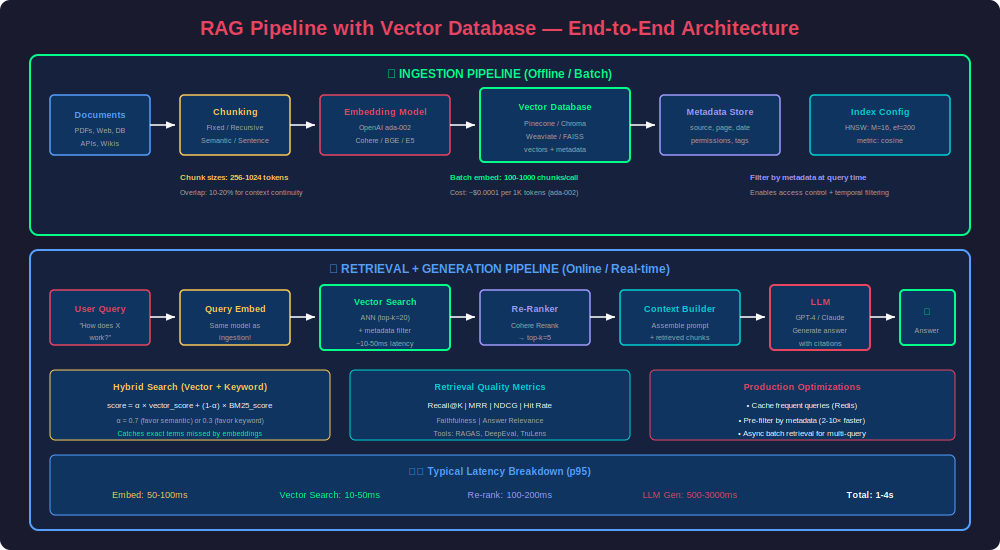
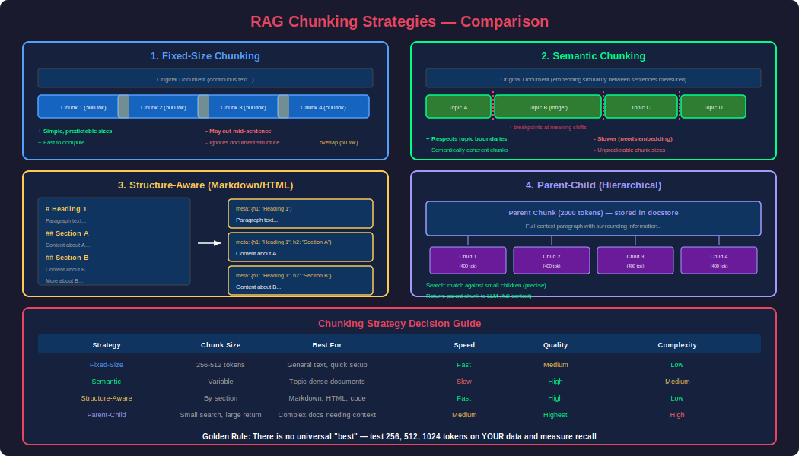
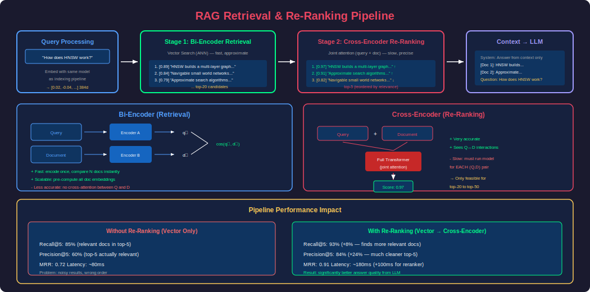

# Phase 23 — RAG (Retrieval-Augmented Generation)

## Overview

Retrieval-Augmented Generation (RAG) is the dominant architecture for building AI systems that answer questions using **private, up-to-date, or domain-specific knowledge**. Instead of relying solely on an LLM's pre-trained knowledge (which is frozen at training time and prone to hallucination), RAG retrieves relevant documents from an external knowledge base and injects them into the LLM's context window — grounding the response in actual facts.

RAG solves the three biggest LLM limitations simultaneously:
1. **Hallucination** — the model generates plausible but false information
2. **Knowledge cutoff** — the model doesn't know about events after its training date
3. **No access to private data** — the model can't answer questions about your company's internal docs

This phase covers the complete RAG pipeline: document ingestion, chunking strategies, retrieval methods, re-ranking, context injection, hybrid search, advanced RAG patterns, evaluation, and production deployment.

---

## 1. RAG Architecture — The Big Picture




### How RAG Works — Step by Step

```
┌─────────────────────────────────────────────────────────────────────┐
│                        RAG PIPELINE                                   │
│                                                                       │
│  ┌──────────┐    ┌──────────┐    ┌──────────┐    ┌──────────────┐  │
│  │  User    │    │  Embed   │    │ Retrieve │    │   Generate   │  │
│  │  Query   │───→│  Query   │───→│  Top-K   │───→│   Answer     │  │
│  │          │    │          │    │  Chunks  │    │  (with LLM)  │  │
│  └──────────┘    └──────────┘    └──────────┘    └──────────────┘  │
│                                        ↑                             │
│                                        │                             │
│                              ┌─────────┴────────┐                   │
│                              │  Vector Database  │                   │
│                              │  (Pre-indexed     │                   │
│                              │   document chunks)│                   │
│                              └──────────────────┘                   │
└─────────────────────────────────────────────────────────────────────┘
```

### Two Phases of RAG

| Phase | When | What Happens |
|---|---|---|
| **Indexing (Offline)** | Before any query | Load docs → chunk → embed → store in vector DB |
| **Querying (Online)** | Every user query | Embed query → retrieve chunks → inject into prompt → LLM generates answer |

### Why RAG Beats Fine-Tuning for Knowledge

| Aspect | RAG | Fine-Tuning |
|---|---|---|
| **Update knowledge** | Add/remove docs instantly | Retrain model (hours/days, $$$) |
| **Source attribution** | Can cite exact source | No provenance |
| **Hallucination control** | Grounded in retrieved text | Still can hallucinate |
| **Cost** | Cheap (retrieval + inference) | Expensive (GPU training) |
| **Data freshness** | Real-time updates | Stale until retrained |
| **Best for** | Factual Q&A, search, support | Style/tone/format changes |

---

## 2. Document Ingestion & Loading

### Loading Documents from Various Sources

```python
# ============================================================
# Document Loading — Multiple Sources
# ============================================================
from langchain_community.document_loaders import (
    PyPDFLoader,
    TextLoader,
    UnstructuredHTMLLoader,
    CSVLoader,
    DirectoryLoader,
    WebBaseLoader,
    NotionDBLoader,
    ConfluenceLoader
)

# PDF
pdf_loader = PyPDFLoader("research_paper.pdf")
pdf_docs = pdf_loader.load()
# Each page becomes a Document with content + metadata (page number, source)

# Web pages
web_loader = WebBaseLoader(["https://docs.example.com/guide"])
web_docs = web_loader.load()

# Directory of mixed files
dir_loader = DirectoryLoader(
    "./knowledge_base/",
    glob="**/*.{pdf,txt,md,html}",
    show_progress=True
)
all_docs = dir_loader.load()

# CSV (each row = one document)
csv_loader = CSVLoader("products.csv", source_column="product_name")
csv_docs = csv_loader.load()

print(f"Loaded {len(all_docs)} documents")
for doc in all_docs[:3]:
    print(f"  Source: {doc.metadata['source']}")
    print(f"  Content: {doc.page_content[:100]}...")
```

### Custom Document Loader

```python
from langchain.schema import Document
import requests

class APIDocumentLoader:
    """Load documents from a REST API."""
    
    def __init__(self, api_url: str, headers: dict = None):
        self.api_url = api_url
        self.headers = headers or {}
    
    def load(self) -> list[Document]:
        response = requests.get(self.api_url, headers=self.headers)
        response.raise_for_status()
        
        documents = []
        for item in response.json()["articles"]:
            doc = Document(
                page_content=item["content"],
                metadata={
                    "source": item["url"],
                    "title": item["title"],
                    "author": item.get("author", "unknown"),
                    "published_date": item.get("date", ""),
                    "category": item.get("category", "general")
                }
            )
            documents.append(doc)
        
        return documents
```

---

## 3. Chunking Strategies

Chunking is arguably the **most impactful** decision in a RAG pipeline. Chunks that are too large dilute relevance; chunks that are too small lose context.



### Strategy 1: Fixed-Size Chunking

The simplest approach — split by character/token count with overlap.

```python
from langchain.text_splitter import CharacterTextSplitter, RecursiveCharacterTextSplitter

# Basic fixed-size (splits on separator, respects boundaries)
splitter = CharacterTextSplitter(
    separator="\n\n",
    chunk_size=500,       # characters
    chunk_overlap=50,     # overlap between chunks
    length_function=len
)

# Better: Recursive (tries multiple separators in priority order)
splitter = RecursiveCharacterTextSplitter(
    separators=["\n\n", "\n", ". ", " ", ""],  # priority order
    chunk_size=500,
    chunk_overlap=50,
    length_function=len
)

chunks = splitter.split_documents(documents)
print(f"Created {len(chunks)} chunks from {len(documents)} documents")
```

### Strategy 2: Token-Based Chunking

More accurate for LLM context — measures in tokens, not characters.

```python
from langchain.text_splitter import TokenTextSplitter
import tiktoken

# Token-based splitting (aligned with LLM context)
splitter = TokenTextSplitter(
    encoding_name="cl100k_base",  # GPT-4 tokenizer
    chunk_size=256,               # tokens
    chunk_overlap=32              # token overlap
)

chunks = splitter.split_documents(documents)

# Verify token counts
enc = tiktoken.get_encoding("cl100k_base")
for chunk in chunks[:3]:
    tokens = len(enc.encode(chunk.page_content))
    print(f"  Chunk: {tokens} tokens, {len(chunk.page_content)} chars")
```

### Strategy 3: Semantic Chunking

Splits based on **meaning changes** rather than fixed size. Uses embeddings to detect topic shifts.

```python
from langchain_experimental.text_splitter import SemanticChunker
from langchain_openai import OpenAIEmbeddings

# Semantic chunking — splits where meaning shifts
semantic_splitter = SemanticChunker(
    embeddings=OpenAIEmbeddings(),
    breakpoint_threshold_type="percentile",  # or "standard_deviation", "interquartile"
    breakpoint_threshold_amount=95           # split at 95th percentile of distance
)

semantic_chunks = semantic_splitter.split_documents(documents)
# Result: chunks naturally aligned with topic boundaries
```

### Strategy 4: Document-Structure-Aware Chunking

Respects the document's inherent structure (headings, sections, code blocks).

```python
from langchain.text_splitter import MarkdownHeaderTextSplitter, HTMLHeaderTextSplitter

# Markdown-aware splitting
md_splitter = MarkdownHeaderTextSplitter(
    headers_to_split_on=[
        ("#", "h1"),
        ("##", "h2"),
        ("###", "h3"),
    ]
)

# Each chunk gets header hierarchy in metadata
md_chunks = md_splitter.split_text(markdown_content)
for chunk in md_chunks[:3]:
    print(f"  Headers: {chunk.metadata}")
    print(f"  Content: {chunk.page_content[:80]}...")

# HTML-aware splitting
html_splitter = HTMLHeaderTextSplitter(
    headers_to_split_on=[
        ("h1", "Header 1"),
        ("h2", "Header 2"),
    ]
)
```

### Strategy 5: Parent-Child (Hierarchical) Chunking

Store small chunks for retrieval precision, but retrieve the larger parent chunk for context.

```python
from langchain.text_splitter import RecursiveCharacterTextSplitter
from langchain.storage import InMemoryStore
from langchain.retrievers import ParentDocumentRetriever
from langchain_community.vectorstores import Chroma
from langchain_openai import OpenAIEmbeddings

# Parent splitter: large chunks (full context for LLM)
parent_splitter = RecursiveCharacterTextSplitter(chunk_size=2000, chunk_overlap=200)

# Child splitter: small chunks (precise retrieval)
child_splitter = RecursiveCharacterTextSplitter(chunk_size=400, chunk_overlap=50)

# Vector store for child chunks
vectorstore = Chroma(
    collection_name="split_parents",
    embedding_function=OpenAIEmbeddings()
)

# Document store for parent chunks
docstore = InMemoryStore()

# Parent-child retriever
retriever = ParentDocumentRetriever(
    vectorstore=vectorstore,
    docstore=docstore,
    child_splitter=child_splitter,
    parent_splitter=parent_splitter,
)

# Add documents
retriever.add_documents(documents)

# Query: searches child chunks, returns parent chunks
results = retriever.invoke("What is HNSW indexing?")
# Returns the full 2000-char parent containing the matching 400-char child
```

### Chunking Comparison & Guidelines

| Strategy | Chunk Size | Best For | Weakness |
|---|---|---|---|
| **Fixed-size** | 256-512 tokens | General text, fast | Cuts mid-sentence/thought |
| **Recursive** | 256-512 tokens | General text | Better boundaries than fixed |
| **Semantic** | Variable | Topic-dense docs | Slower (needs embeddings), unpredictable sizes |
| **Structure-aware** | By section | Markdown, HTML, code | Requires structured input |
| **Parent-child** | Small retrieval, large context | Complex docs | More storage, complexity |
| **Sentence-level** | 1-3 sentences | Q&A datasets | Very small, loses context |

### Golden Rules of Chunking

1. **Match chunk size to query type**: Short factual questions → smaller chunks (256 tokens). Complex analytical questions → larger chunks (512-1024 tokens)
2. **Always use overlap** (10-20%): Prevents losing information at boundaries
3. **Include metadata**: Source file, page number, section heading — critical for citations
4. **Test empirically**: There is no universally "best" chunk size — it depends on your data and queries
5. **Consider the embedding model's max tokens**: all-MiniLM = 256 tokens optimal, OpenAI = up to 8191

---

## 4. Retrieval Methods

### Basic Retrieval: Dense Vector Search

```python
from langchain_openai import OpenAIEmbeddings
from langchain_community.vectorstores import Chroma

# Build vector store
embeddings = OpenAIEmbeddings(model="text-embedding-3-small")
vectorstore = Chroma.from_documents(
    documents=chunks,
    embedding=embeddings,
    persist_directory="./chroma_db"
)

# Basic retriever
retriever = vectorstore.as_retriever(
    search_type="similarity",
    search_kwargs={"k": 5}
)

# Retrieve
docs = retriever.invoke("How does attention mechanism work in transformers?")
for doc in docs:
    print(f"  [{doc.metadata.get('source', '?')}] {doc.page_content[:100]}...")
```

### Maximum Marginal Relevance (MMR)

MMR balances **relevance** with **diversity** — avoids returning 5 chunks that say the same thing.

```python
# MMR retriever: relevant AND diverse results
retriever = vectorstore.as_retriever(
    search_type="mmr",
    search_kwargs={
        "k": 5,          # final results to return
        "fetch_k": 20,   # candidates to consider
        "lambda_mult": 0.7  # 0=max diversity, 1=max relevance
    }
)

# lambda_mult controls the trade-off:
# 0.5 = balance relevance and diversity equally
# 0.7 = favor relevance slightly (recommended default)
# 1.0 = pure similarity (no diversity, same as basic retrieval)
```

### Similarity Score Threshold

Only return results above a minimum quality threshold.

```python
retriever = vectorstore.as_retriever(
    search_type="similarity_score_threshold",
    search_kwargs={
        "score_threshold": 0.75,  # minimum similarity
        "k": 10                    # max results (may return fewer)
    }
)

# Returns only chunks with cosine similarity >= 0.75
# Prevents injecting irrelevant context into the prompt
```

### Multi-Query Retrieval

Generate multiple perspectives of the question to catch more relevant documents.

```python
from langchain.retrievers import MultiQueryRetriever
from langchain_openai import ChatOpenAI

llm = ChatOpenAI(model="gpt-4o-mini", temperature=0.3)

multi_retriever = MultiQueryRetriever.from_llm(
    retriever=vectorstore.as_retriever(search_kwargs={"k": 5}),
    llm=llm
)

# User asks: "What are the benefits of microservices?"
# LLM generates additional queries:
#   1. "advantages of microservice architecture"
#   2. "why use microservices over monolith"
#   3. "microservices pros and cons"
# Retrieves from ALL queries, deduplicates, returns union

docs = multi_retriever.invoke("What are the benefits of microservices?")
```

### Contextual Compression

Filters and compresses retrieved documents to only include relevant parts.

```python
from langchain.retrievers import ContextualCompressionRetriever
from langchain.retrievers.document_compressors import LLMChainExtractor

# Compressor: uses LLM to extract only relevant sentences
compressor = LLMChainExtractor.from_llm(llm)

compression_retriever = ContextualCompressionRetriever(
    base_compressor=compressor,
    base_retriever=vectorstore.as_retriever(search_kwargs={"k": 10})
)

# Retrieves 10 chunks, then compresses each to only relevant sentences
compressed_docs = compression_retriever.invoke("How does HNSW work?")
# Result: shorter, more focused context for the LLM
```

---

## 5. Re-Ranking

Re-ranking is a **second-stage scoring** that dramatically improves precision. The first-stage retrieval (vector search) is fast but approximate. A cross-encoder re-ranker is slower but much more accurate because it sees the query AND document together.



### Why Re-Ranking Matters

| Stage | Model Type | Speed | Accuracy | Purpose |
|---|---|---|---|---|
| **Retrieval** (Stage 1) | Bi-encoder | Fast (separate embeddings) | Good | Cast a wide net (top-50) |
| **Re-ranking** (Stage 2) | Cross-encoder | Slow (joint encoding) | Excellent | Precision filtering (top-5) |

Bi-encoders embed query and documents **independently** — fast but can miss subtle relevance. Cross-encoders process query+document **together** through full attention — much more accurate but O(N) for each candidate.

### Implementation with Cross-Encoders

```python
from sentence_transformers import CrossEncoder
import numpy as np

class Reranker:
    """Cross-encoder re-ranker for RAG pipelines."""
    
    def __init__(self, model_name: str = "cross-encoder/ms-marco-MiniLM-L-6-v2"):
        self.model = CrossEncoder(model_name)
    
    def rerank(self, query: str, documents: list[str], top_k: int = 5) -> list[dict]:
        """Re-rank documents by relevance to query."""
        # Cross-encoder scores each (query, document) pair
        pairs = [[query, doc] for doc in documents]
        scores = self.model.predict(pairs)
        
        # Sort by score descending
        ranked_indices = np.argsort(scores)[::-1][:top_k]
        
        results = []
        for idx in ranked_indices:
            results.append({
                "document": documents[idx],
                "score": float(scores[idx]),
                "original_rank": int(idx)
            })
        
        return results


# Usage in RAG pipeline
reranker = Reranker()

# Stage 1: Retrieve top-20 candidates from vector DB
candidates = retriever.invoke(query)  # Returns 20 docs
candidate_texts = [doc.page_content for doc in candidates]

# Stage 2: Re-rank to top-5
reranked = reranker.rerank(
    query="How does backpropagation update weights?",
    documents=candidate_texts,
    top_k=5
)

for r in reranked:
    print(f"  Score: {r['score']:.4f} | Original rank: {r['original_rank']}")
    print(f"  {r['document'][:100]}...")
```

### Cohere Re-rank API

```python
import cohere

co = cohere.Client("your-api-key")

def cohere_rerank(query: str, documents: list[str], top_k: int = 5) -> list[dict]:
    """Use Cohere's hosted re-ranking model."""
    response = co.rerank(
        model="rerank-english-v3.0",
        query=query,
        documents=documents,
        top_n=top_k,
        return_documents=True
    )
    
    return [
        {
            "text": result.document.text,
            "relevance_score": result.relevance_score,
            "index": result.index
        }
        for result in response.results
    ]
```

### Re-Ranking with LangChain

```python
from langchain.retrievers import ContextualCompressionRetriever
from langchain_cohere import CohereRerank

# Cohere re-ranker as a compressor
cohere_reranker = CohereRerank(
    cohere_api_key="your-key",
    model="rerank-english-v3.0",
    top_n=5
)

# Combine: retrieve 20 → rerank to 5
rerank_retriever = ContextualCompressionRetriever(
    base_compressor=cohere_reranker,
    base_retriever=vectorstore.as_retriever(search_kwargs={"k": 20})
)

final_docs = rerank_retriever.invoke("Explain gradient descent optimization")
```

---

## 6. Context Injection & Prompt Assembly

### The Prompt Template

How you inject retrieved context into the prompt matters enormously for answer quality.

```python
from langchain_core.prompts import ChatPromptTemplate

# Basic RAG prompt
rag_prompt = ChatPromptTemplate.from_messages([
    ("system", """You are a helpful AI assistant. Answer the user's question based ONLY 
on the provided context. If the context doesn't contain enough information to answer 
the question fully, say "I don't have enough information to answer that."

Rules:
- Only use information from the provided context
- Cite your sources using [Source: filename] notation
- If multiple sources agree, synthesize them into a coherent answer
- If sources conflict, mention the disagreement
- Be concise but thorough"""),
    
    ("human", """Context:
{context}

---

Question: {question}

Answer:""")
])
```

### Advanced Context Formatting

```python
def format_context(documents: list, max_tokens: int = 3000) -> str:
    """Format retrieved documents with metadata for clear attribution."""
    formatted_chunks = []
    total_tokens = 0
    
    for i, doc in enumerate(documents, 1):
        source = doc.metadata.get("source", "Unknown")
        page = doc.metadata.get("page", "")
        section = doc.metadata.get("section", "")
        
        header = f"[Document {i}]"
        if source:
            header += f" Source: {source}"
        if page:
            header += f" | Page: {page}"
        if section:
            header += f" | Section: {section}"
        
        chunk_text = f"{header}\n{doc.page_content}\n"
        
        # Approximate token count (4 chars ≈ 1 token)
        chunk_tokens = len(chunk_text) // 4
        if total_tokens + chunk_tokens > max_tokens:
            break
        
        formatted_chunks.append(chunk_text)
        total_tokens += chunk_tokens
    
    return "\n---\n".join(formatted_chunks)


# Usage
context = format_context(retrieved_docs, max_tokens=3000)
response = llm.invoke(rag_prompt.format(context=context, question=user_query))
```

### Context Window Management

```python
import tiktoken

def fit_context_to_window(
    documents: list,
    query: str,
    model: str = "gpt-4o",
    max_context_tokens: int = None
) -> list:
    """Select documents that fit within model's context window."""
    
    # Model context limits
    model_limits = {
        "gpt-4o": 128000,
        "gpt-4o-mini": 128000,
        "gpt-4-turbo": 128000,
        "gpt-3.5-turbo": 16385,
        "claude-3-opus": 200000,
        "claude-3-sonnet": 200000,
    }
    
    total_limit = model_limits.get(model, 8192)
    
    # Reserve tokens for: system prompt (~500) + query (~200) + response (~1000)
    reserved = 1700
    available = (max_context_tokens or total_limit) - reserved
    
    enc = tiktoken.encoding_for_model(model)
    
    selected_docs = []
    used_tokens = 0
    
    for doc in documents:
        doc_tokens = len(enc.encode(doc.page_content))
        if used_tokens + doc_tokens <= available:
            selected_docs.append(doc)
            used_tokens += doc_tokens
        else:
            break
    
    return selected_docs
```

---

## 7. Hybrid Search

Hybrid search combines **vector (semantic) search** with **keyword (BM25) search** for the best of both worlds.

### Why Hybrid?

| Query Type | Vector Search | Keyword Search | Winner |
|---|---|---|---|
| "How do neural networks learn?" | Excellent (semantic) | Poor (misses synonyms) | Vector |
| "error code ERR_SSL_PROTOCOL" | Poor (no semantics for codes) | Excellent (exact match) | Keyword |
| "Python pandas groupby aggregate" | Good | Good | Hybrid |
| "RFC 7231 section 6.5.1" | Poor | Excellent | Keyword |

### Reciprocal Rank Fusion (RRF)

The standard method for combining ranked lists from different search methods.

```python
def reciprocal_rank_fusion(
    ranked_lists: list[list[str]], 
    k: int = 60
) -> list[tuple[str, float]]:
    """
    Combine multiple ranked lists using RRF.
    
    RRF score = Σ (1 / (k + rank_i)) for each list where the doc appears.
    k=60 is the standard constant (dampens the effect of high rankings).
    """
    scores = {}
    
    for ranked_list in ranked_lists:
        for rank, doc_id in enumerate(ranked_list, 1):
            if doc_id not in scores:
                scores[doc_id] = 0.0
            scores[doc_id] += 1.0 / (k + rank)
    
    # Sort by combined score
    sorted_results = sorted(scores.items(), key=lambda x: x[1], reverse=True)
    return sorted_results


# Example
vector_results = ["doc_3", "doc_1", "doc_7", "doc_5", "doc_2"]  # semantic ranking
bm25_results = ["doc_1", "doc_4", "doc_3", "doc_6", "doc_5"]    # keyword ranking

fused = reciprocal_rank_fusion([vector_results, bm25_results])
print("Hybrid results:")
for doc_id, score in fused[:5]:
    print(f"  {doc_id}: {score:.4f}")
# doc_1 and doc_3 rank high in both → boosted to the top
```

### Hybrid Search with BM25 + Vector

```python
from langchain_community.retrievers import BM25Retriever
from langchain.retrievers import EnsembleRetriever
from langchain_community.vectorstores import Chroma
from langchain_openai import OpenAIEmbeddings

# Vector retriever
vectorstore = Chroma.from_documents(chunks, OpenAIEmbeddings())
vector_retriever = vectorstore.as_retriever(search_kwargs={"k": 10})

# BM25 keyword retriever
bm25_retriever = BM25Retriever.from_documents(chunks, k=10)

# Ensemble (hybrid) retriever with weighted combination
hybrid_retriever = EnsembleRetriever(
    retrievers=[vector_retriever, bm25_retriever],
    weights=[0.7, 0.3]  # 70% vector, 30% keyword
)

# Search
results = hybrid_retriever.invoke("Python pandas DataFrame merge join")
```

### Weighted Hybrid Scoring

```python
def hybrid_search(
    query: str,
    vectorstore,
    bm25_index,
    documents: list,
    alpha: float = 0.7,  # vector weight
    top_k: int = 10
) -> list[dict]:
    """
    Custom hybrid search with tunable alpha.
    alpha=1.0: pure vector search
    alpha=0.0: pure BM25
    alpha=0.7: recommended default (favor semantics)
    """
    # Vector search scores (normalized to 0-1)
    vector_results = vectorstore.similarity_search_with_score(query, k=50)
    vector_scores = {}
    max_v = max(s for _, s in vector_results) if vector_results else 1
    for doc, score in vector_results:
        doc_id = doc.metadata.get("id", doc.page_content[:50])
        vector_scores[doc_id] = score / max_v  # normalize
    
    # BM25 scores (normalized to 0-1)
    bm25_scores_raw = bm25_index.get_scores(query.split())
    max_b = max(bm25_scores_raw) if max(bm25_scores_raw) > 0 else 1
    bm25_scores = {}
    for i, score in enumerate(bm25_scores_raw):
        doc_id = documents[i].metadata.get("id", documents[i].page_content[:50])
        bm25_scores[doc_id] = score / max_b
    
    # Combine scores
    all_doc_ids = set(vector_scores.keys()) | set(bm25_scores.keys())
    combined = []
    
    for doc_id in all_doc_ids:
        v_score = vector_scores.get(doc_id, 0.0)
        b_score = bm25_scores.get(doc_id, 0.0)
        hybrid_score = alpha * v_score + (1 - alpha) * b_score
        combined.append({"doc_id": doc_id, "score": hybrid_score,
                        "vector_score": v_score, "bm25_score": b_score})
    
    combined.sort(key=lambda x: x["score"], reverse=True)
    return combined[:top_k]
```

---

## 8. Complete RAG Pipeline — End-to-End

```python
"""
Production RAG Pipeline: Document Q&A System
Combines: ingestion, chunking, hybrid retrieval, re-ranking, generation
"""

from langchain_openai import ChatOpenAI, OpenAIEmbeddings
from langchain_community.vectorstores import Chroma
from langchain_community.retrievers import BM25Retriever
from langchain.retrievers import EnsembleRetriever, ContextualCompressionRetriever
from langchain.text_splitter import RecursiveCharacterTextSplitter
from langchain_core.prompts import ChatPromptTemplate
from langchain_core.output_parsers import StrOutputParser
from langchain_core.runnables import RunnablePassthrough
from sentence_transformers import CrossEncoder
import numpy as np


class ProductionRAG:
    """Complete RAG system with hybrid search and re-ranking."""
    
    def __init__(self, persist_dir: str = "./rag_db"):
        self.embeddings = OpenAIEmbeddings(model="text-embedding-3-small")
        self.llm = ChatOpenAI(model="gpt-4o-mini", temperature=0)
        self.reranker = CrossEncoder("cross-encoder/ms-marco-MiniLM-L-6-v2")
        self.persist_dir = persist_dir
        self.vectorstore = None
        self.bm25_retriever = None
        self.chunks = []
        
        self.text_splitter = RecursiveCharacterTextSplitter(
            chunk_size=500,
            chunk_overlap=50,
            separators=["\n\n", "\n", ". ", " ", ""]
        )
        
        self.prompt = ChatPromptTemplate.from_messages([
            ("system", """You are a precise AI assistant. Answer questions using ONLY 
the provided context. Follow these rules:
1. If the context contains the answer, provide it clearly and concisely
2. Cite sources using [Source: X] notation
3. If the context is insufficient, say "Based on the available documents, I cannot fully answer this question."
4. Never make up information not in the context
5. If multiple sources provide different information, note the discrepancy"""),
            ("human", """Context:
{context}

Question: {question}

Answer (with citations):""")
        ])
    
    def ingest(self, documents: list):
        """Ingest documents: chunk → embed → store."""
        # Chunk
        self.chunks = self.text_splitter.split_documents(documents)
        print(f"Created {len(self.chunks)} chunks from {len(documents)} documents")
        
        # Add unique IDs to chunks
        for i, chunk in enumerate(self.chunks):
            chunk.metadata["chunk_id"] = f"chunk_{i}"
        
        # Vector store
        self.vectorstore = Chroma.from_documents(
            documents=self.chunks,
            embedding=self.embeddings,
            persist_directory=self.persist_dir,
            collection_name="rag_collection"
        )
        
        # BM25 index
        self.bm25_retriever = BM25Retriever.from_documents(self.chunks, k=20)
        
        print(f"Indexed {len(self.chunks)} chunks in vector store + BM25")
    
    def retrieve(self, query: str, top_k: int = 5) -> list:
        """Hybrid retrieval with re-ranking."""
        # Stage 1: Hybrid retrieval (vector + BM25)
        vector_retriever = self.vectorstore.as_retriever(
            search_type="mmr",
            search_kwargs={"k": 15, "fetch_k": 30, "lambda_mult": 0.7}
        )
        
        hybrid = EnsembleRetriever(
            retrievers=[vector_retriever, self.bm25_retriever],
            weights=[0.7, 0.3]
        )
        
        candidates = hybrid.invoke(query)
        
        # Deduplicate
        seen = set()
        unique_candidates = []
        for doc in candidates:
            content_hash = hash(doc.page_content)
            if content_hash not in seen:
                seen.add(content_hash)
                unique_candidates.append(doc)
        
        # Stage 2: Re-rank with cross-encoder
        if len(unique_candidates) > top_k:
            pairs = [[query, doc.page_content] for doc in unique_candidates]
            scores = self.reranker.predict(pairs)
            
            ranked_indices = np.argsort(scores)[::-1][:top_k]
            reranked = [unique_candidates[i] for i in ranked_indices]
            return reranked
        
        return unique_candidates[:top_k]
    
    def query(self, question: str, top_k: int = 5) -> dict:
        """Full RAG pipeline: retrieve → format → generate."""
        # Retrieve
        docs = self.retrieve(question, top_k=top_k)
        
        # Format context
        context_parts = []
        sources = []
        for i, doc in enumerate(docs, 1):
            source = doc.metadata.get("source", f"Document {i}")
            context_parts.append(f"[Source {i}: {source}]\n{doc.page_content}")
            sources.append({"source": source, "content": doc.page_content[:200]})
        
        context = "\n\n---\n\n".join(context_parts)
        
        # Generate
        chain = self.prompt | self.llm | StrOutputParser()
        answer = chain.invoke({"context": context, "question": question})
        
        return {
            "answer": answer,
            "sources": sources,
            "num_chunks_retrieved": len(docs)
        }


# ============================================================
# Usage
# ============================================================
from langchain_community.document_loaders import DirectoryLoader, TextLoader

# Load documents
loader = DirectoryLoader("./docs/", glob="**/*.md", loader_cls=TextLoader)
documents = loader.load()

# Initialize and ingest
rag = ProductionRAG(persist_dir="./my_rag_db")
rag.ingest(documents)

# Query
result = rag.query("How does the attention mechanism work in transformers?")
print(f"\nAnswer: {result['answer']}")
print(f"\nSources used: {len(result['sources'])}")
for s in result['sources']:
    print(f"  - {s['source']}: {s['content'][:80]}...")
```

---

## 9. Advanced RAG Patterns

### Pattern 1: HyDE (Hypothetical Document Embeddings)

Instead of embedding the raw query, generate a **hypothetical answer** first, then embed that. The hypothesis is closer in vector space to the actual answer passages.

```python
from langchain_openai import ChatOpenAI, OpenAIEmbeddings
from langchain_core.prompts import ChatPromptTemplate

llm = ChatOpenAI(model="gpt-4o-mini", temperature=0.7)

hyde_prompt = ChatPromptTemplate.from_template(
    """Write a short passage that would answer the following question.
Don't worry about being accurate — just write what a good answer might look like.

Question: {question}

Passage:"""
)

def hyde_retrieve(question: str, vectorstore, top_k: int = 5):
    """HyDE: Generate hypothetical doc, embed it, search with that."""
    # Generate hypothetical answer
    chain = hyde_prompt | llm
    hypothetical_doc = chain.invoke({"question": question}).content
    
    # Embed the hypothetical doc (closer to actual answers in vector space)
    results = vectorstore.similarity_search(hypothetical_doc, k=top_k)
    return results

# Works especially well for questions where the query phrasing
# is very different from how the answer would be written
```

### Pattern 2: Self-RAG (Retrieval with Self-Reflection)

The LLM decides whether it needs retrieval and grades the relevance of retrieved documents.

```python
from langchain_core.prompts import ChatPromptTemplate
from langchain_openai import ChatOpenAI

llm = ChatOpenAI(model="gpt-4o", temperature=0)

# Step 1: Decide if retrieval is needed
needs_retrieval_prompt = ChatPromptTemplate.from_template(
    """Determine if you need to search external documents to answer this question.
Answer YES if the question requires specific facts, data, or domain knowledge.
Answer NO if it's a general/opinion question you can answer from general knowledge.

Question: {question}

Do you need retrieval? (YES/NO):"""
)

# Step 2: Grade retrieved documents
relevance_prompt = ChatPromptTemplate.from_template(
    """Grade whether this document is relevant to answering the question.
Score from 0-10 where 10 = perfectly relevant.

Question: {question}
Document: {document}

Relevance score (0-10):"""
)

# Step 3: Grade the final answer
hallucination_check_prompt = ChatPromptTemplate.from_template(
    """Check if this answer is fully supported by the provided context.
If the answer contains ANY claim not in the context, respond "HALLUCINATION".
If fully grounded, respond "GROUNDED".

Context: {context}
Answer: {answer}

Verdict:"""
)

def self_rag(question: str, vectorstore) -> dict:
    """Self-RAG with retrieval decision and answer grading."""
    # Decide retrieval
    decision = (needs_retrieval_prompt | llm).invoke({"question": question}).content
    
    if "NO" in decision.upper():
        answer = llm.invoke(question).content
        return {"answer": answer, "retrieval_used": False, "grounded": "N/A"}
    
    # Retrieve and grade
    docs = vectorstore.similarity_search(question, k=10)
    
    relevant_docs = []
    for doc in docs:
        score = (relevance_prompt | llm).invoke({
            "question": question, "document": doc.page_content
        }).content
        if int(score.strip()) >= 6:
            relevant_docs.append(doc)
    
    if not relevant_docs:
        return {"answer": "I couldn't find relevant information.", 
                "retrieval_used": True, "grounded": "NO_RELEVANT_DOCS"}
    
    # Generate answer from relevant docs
    context = "\n\n".join([d.page_content for d in relevant_docs[:5]])
    answer = llm.invoke(f"Context: {context}\n\nQuestion: {question}\n\nAnswer:").content
    
    # Grade answer
    verdict = (hallucination_check_prompt | llm).invoke({
        "context": context, "answer": answer
    }).content
    
    return {"answer": answer, "retrieval_used": True, "grounded": verdict.strip()}
```

### Pattern 3: Corrective RAG (CRAG)

If initial retrieval quality is low, refine the query or fall back to web search.

```python
def corrective_rag(question: str, vectorstore, web_search_fn) -> str:
    """CRAG: Correct retrieval if initial results are poor."""
    
    # Initial retrieval
    docs = vectorstore.similarity_search_with_score(question, k=5)
    
    # Check retrieval quality
    avg_score = sum(score for _, score in docs) / len(docs) if docs else 0
    
    if avg_score > 0.8:  # Good retrieval
        context = "\n".join([doc.page_content for doc, _ in docs])
        return generate_answer(question, context, source="knowledge_base")
    
    elif avg_score > 0.5:  # Ambiguous — try query refinement
        refined_query = llm.invoke(
            f"Rewrite this question for better search results: {question}"
        ).content
        docs = vectorstore.similarity_search(refined_query, k=5)
        context = "\n".join([doc.page_content for doc in docs])
        return generate_answer(question, context, source="refined_search")
    
    else:  # Poor retrieval — fall back to web search
        web_results = web_search_fn(question)
        return generate_answer(question, web_results, source="web_search")
```

### Pattern 4: Agentic RAG (Tool-Using RAG)

The LLM decides which retrieval tools to use based on the query type.

```python
from langchain.agents import create_openai_tools_agent, AgentExecutor
from langchain.tools.retriever import create_retriever_tool

# Create specialized retrievers as tools
technical_tool = create_retriever_tool(
    technical_retriever,
    "search_technical_docs",
    "Search technical documentation for engineering questions about APIs, code, and system architecture."
)

policy_tool = create_retriever_tool(
    policy_retriever,
    "search_company_policies",
    "Search company policies for HR, compliance, and procedural questions."
)

product_tool = create_retriever_tool(
    product_retriever,
    "search_product_catalog",
    "Search product information for pricing, features, and availability."
)

# Agent decides which tool(s) to use
agent = create_openai_tools_agent(llm, [technical_tool, policy_tool, product_tool], prompt)
agent_executor = AgentExecutor(agent=agent, tools=[technical_tool, policy_tool, product_tool])

# The agent routes to the right knowledge base
result = agent_executor.invoke({"input": "What's our refund policy for enterprise plans?"})
# → Agent uses search_company_policies tool
```

---

## 10. RAG Evaluation

### Key Metrics

| Metric | What It Measures | Target |
|---|---|---|
| **Retrieval Recall@K** | % of relevant docs found in top-K | > 90% |
| **Retrieval MRR** | Average reciprocal rank of first relevant doc | > 0.7 |
| **Faithfulness** | Is the answer supported by retrieved context? | > 0.9 |
| **Answer Relevance** | Does the answer address the question? | > 0.85 |
| **Context Precision** | % of retrieved chunks actually used in answer | > 0.7 |
| **Context Recall** | Is all needed info present in retrieved chunks? | > 0.85 |
| **Hallucination Rate** | % of answers containing unsupported claims | < 5% |

### Evaluation with RAGAS

```python
from ragas import evaluate
from ragas.metrics import (
    faithfulness,
    answer_relevancy,
    context_precision,
    context_recall,
    answer_correctness
)
from datasets import Dataset

# Prepare evaluation dataset
eval_data = {
    "question": [
        "What is HNSW indexing?",
        "How does RAG reduce hallucinations?",
        "What's the difference between IVF and HNSW?"
    ],
    "answer": [
        rag.query("What is HNSW indexing?")["answer"],
        rag.query("How does RAG reduce hallucinations?")["answer"],
        rag.query("What's the difference between IVF and HNSW?")["answer"]
    ],
    "contexts": [
        [doc.page_content for doc in rag.retrieve("What is HNSW indexing?")],
        [doc.page_content for doc in rag.retrieve("How does RAG reduce hallucinations?")],
        [doc.page_content for doc in rag.retrieve("What's the difference between IVF and HNSW?")]
    ],
    "ground_truth": [
        "HNSW is a graph-based approximate nearest neighbor algorithm...",
        "RAG grounds LLM responses in retrieved factual context...",
        "IVF uses cluster partitioning while HNSW uses a navigable graph..."
    ]
}

dataset = Dataset.from_dict(eval_data)

# Run evaluation
results = evaluate(
    dataset=dataset,
    metrics=[
        faithfulness,
        answer_relevancy,
        context_precision,
        context_recall,
        answer_correctness
    ]
)

print(results)
# {'faithfulness': 0.92, 'answer_relevancy': 0.88, 
#  'context_precision': 0.75, 'context_recall': 0.85,
#  'answer_correctness': 0.83}
```

### Manual Evaluation Framework

```python
def evaluate_rag_response(question: str, answer: str, 
                          context: list[str], ground_truth: str = None) -> dict:
    """Manual evaluation scoring for RAG responses."""
    
    evaluation_prompt = f"""Evaluate this RAG system response on these criteria (1-5 scale):

Question: {question}
Context provided: {chr(10).join(context[:3])}
Generated Answer: {answer}
{f'Ground Truth: {ground_truth}' if ground_truth else ''}

Score each criterion 1-5:
1. Faithfulness: Is the answer fully supported by the context? (5=fully grounded, 1=hallucinated)
2. Completeness: Does the answer fully address the question? (5=comprehensive, 1=incomplete)
3. Relevance: Is the answer on-topic? (5=precisely relevant, 1=off-topic)
4. Conciseness: Is the answer appropriately brief? (5=concise, 1=verbose/rambling)
5. Citation quality: Are sources properly referenced? (5=well-cited, 1=no citations)

Return scores as JSON: {{"faithfulness": X, "completeness": X, "relevance": X, "conciseness": X, "citation": X}}"""
    
    scores = llm.invoke(evaluation_prompt).content
    return json.loads(scores)
```

---

## 11. Production Deployment Considerations

### Architecture for Scale

```
                    ┌─────────────────────────────────────┐
                    │          Load Balancer               │
                    └───────────┬─────────────────────────┘
                                │
              ┌─────────────────┼─────────────────┐
              │                 │                   │
    ┌─────────▼──────┐  ┌──────▼───────┐  ┌──────▼───────┐
    │  RAG Service 1 │  │ RAG Service 2 │  │ RAG Service 3 │
    │  (Stateless)   │  │  (Stateless)  │  │  (Stateless)  │
    └────────┬───────┘  └──────┬────────┘  └──────┬────────┘
             │                 │                    │
             └─────────────────┼────────────────────┘
                               │
              ┌────────────────┼────────────────┐
              │                │                 │
    ┌─────────▼──────┐ ┌──────▼──────┐ ┌───────▼──────┐
    │  Vector DB     │ │  Cache      │ │  LLM API     │
    │  (Pinecone/    │ │  (Redis)    │ │  (OpenAI/    │
    │   Weaviate)    │ │             │ │   Anthropic) │
    └────────────────┘ └─────────────┘ └──────────────┘
```

### Caching Strategy

```python
import hashlib
import redis
import json

class RAGCache:
    """Cache RAG results to reduce latency and API costs."""
    
    def __init__(self, redis_url: str = "redis://localhost:6379"):
        self.redis = redis.from_url(redis_url)
        self.ttl = 3600  # 1 hour cache
    
    def _cache_key(self, query: str) -> str:
        """Generate deterministic cache key from query."""
        normalized = query.strip().lower()
        return f"rag:{hashlib.sha256(normalized.encode()).hexdigest()[:16]}"
    
    def get(self, query: str) -> dict | None:
        """Check cache for existing answer."""
        key = self._cache_key(query)
        cached = self.redis.get(key)
        if cached:
            return json.loads(cached)
        return None
    
    def set(self, query: str, result: dict):
        """Cache a RAG result."""
        key = self._cache_key(query)
        self.redis.setex(key, self.ttl, json.dumps(result))
    
    def invalidate_by_source(self, source: str):
        """Invalidate cache when a source document is updated."""
        # In production, use a secondary index to track which queries
        # used which source documents
        pass


# Usage in RAG pipeline
cache = RAGCache()

def cached_rag_query(question: str) -> dict:
    # Check cache first
    cached = cache.get(question)
    if cached:
        cached["from_cache"] = True
        return cached
    
    # Miss — run full RAG pipeline
    result = rag.query(question)
    
    # Cache the result
    cache.set(question, result)
    result["from_cache"] = False
    return result
```

### Monitoring & Observability

```python
import time
from dataclasses import dataclass, field
from typing import Optional

@dataclass
class RAGMetrics:
    """Track RAG pipeline performance metrics."""
    query: str
    total_latency_ms: float = 0
    embedding_latency_ms: float = 0
    retrieval_latency_ms: float = 0
    reranking_latency_ms: float = 0
    generation_latency_ms: float = 0
    num_chunks_retrieved: int = 0
    num_chunks_after_rerank: int = 0
    top_similarity_score: float = 0
    cache_hit: bool = False
    model_used: str = ""
    tokens_used: int = 0
    error: Optional[str] = None

def instrumented_rag_query(question: str, rag_system) -> tuple[dict, RAGMetrics]:
    """Run RAG with full instrumentation."""
    metrics = RAGMetrics(query=question)
    start = time.time()
    
    try:
        # Embedding
        t0 = time.time()
        query_embedding = rag_system.embeddings.embed_query(question)
        metrics.embedding_latency_ms = (time.time() - t0) * 1000
        
        # Retrieval
        t0 = time.time()
        docs = rag_system.retrieve(question, top_k=5)
        metrics.retrieval_latency_ms = (time.time() - t0) * 1000
        metrics.num_chunks_retrieved = len(docs)
        
        # Generation
        t0 = time.time()
        result = rag_system.query(question)
        metrics.generation_latency_ms = (time.time() - t0) * 1000
        
        metrics.total_latency_ms = (time.time() - start) * 1000
        return result, metrics
        
    except Exception as e:
        metrics.error = str(e)
        metrics.total_latency_ms = (time.time() - start) * 1000
        return {"answer": "An error occurred.", "sources": []}, metrics
```

---

## 12. Common Mistakes & Troubleshooting

| Problem | Symptom | Solution |
|---|---|---|
| **Wrong chunk size** | Retrieves irrelevant passages or misses answers | Test 256, 512, 1024 tokens; measure recall |
| **No overlap** | Answers cut off at chunk boundaries | Add 10-20% overlap |
| **Embedding model mismatch** | Low similarity scores everywhere | Use SAME model for indexing and querying |
| **Too many chunks in context** | LLM gets confused, contradicts itself | Limit to 3-5 most relevant chunks |
| **No re-ranking** | Relevant docs exist but aren't in top-K | Add cross-encoder re-ranker |
| **Context window overflow** | Truncated context, missing info | Count tokens, prioritize by relevance |
| **No metadata filtering** | Searches everything, returns stale docs | Filter by date, source, category |
| **Missing citation instruction** | LLM doesn't cite sources | Explicitly ask for [Source] citations |
| **Temperature too high** | Creative but unfaithful answers | Use temperature=0 for factual RAG |
| **Not handling "I don't know"** | LLM makes up answers for missing info | Instruct: "say you don't know if context insufficient" |

---

## Interview Mastery

### Beginner Questions

**Q1: What is RAG? Why do we need it?**

**A:** RAG (Retrieval-Augmented Generation) is an architecture that combines an LLM with external knowledge retrieval. Before generating an answer, the system searches a knowledge base for relevant documents and injects them into the LLM's prompt as context. We need RAG because: (1) LLMs have knowledge cutoff dates — RAG provides real-time information; (2) LLMs hallucinate — RAG grounds answers in actual documents; (3) LLMs don't know your private data — RAG connects them to internal knowledge bases. The key insight: instead of training all knowledge INTO the model, retrieve it at query time.

**How to answer:** Start with the acronym expansion, explain the two-phase architecture (index + query), give one concrete example ("like giving the LLM an open-book exam"), then contrast with pure LLM and fine-tuning.

---

**Q2: Explain the basic RAG pipeline steps.**

**A:** 
1. **Indexing (offline)**: Load documents → split into chunks (500 tokens) → generate embeddings → store in vector database with metadata
2. **Querying (online)**: User asks question → embed the question with same model → search vector DB for top-K similar chunks → format chunks into a context prompt → send to LLM → LLM generates answer grounded in context

The key constraint: the embedding model used for indexing MUST be the same one used for query embedding — different models produce incompatible vector spaces.

---

**Q3: What is chunking? Why does chunk size matter?**

**A:** Chunking is splitting documents into smaller pieces for embedding and retrieval. Size matters because: (1) Too large (2000+ tokens) — the embedding averages over too much text, diluting relevance, and you waste context window on irrelevant content; (2) Too small (50 tokens) — loses context, a sentence alone may be meaningless; (3) Sweet spot (256-512 tokens) — specific enough for precise retrieval, long enough to be self-contained. Always use overlap (10-20%) to prevent losing information at chunk boundaries.

---

### Intermediate Questions

**Q4: Explain the difference between bi-encoder retrieval and cross-encoder re-ranking.**

**A:** **Bi-encoder** (used in first-stage retrieval): Embeds query and documents independently into the same vector space. Similarity is computed via dot product/cosine between pre-computed vectors. Fast (O(1) per comparison after pre-computing) but less accurate because query and document never "see" each other.

**Cross-encoder** (used in re-ranking): Takes the query AND document as a single input through the full transformer. Outputs a relevance score directly. Much more accurate because the model can attend to fine-grained interactions between query and document terms. But O(N) — must run the full model for each candidate.

**Production pattern**: Bi-encoder retrieves top-50 candidates fast, cross-encoder re-ranks to top-5 accurately. This gives you both speed AND precision.

---

**Q5: What is hybrid search? When does vector search alone fail?**

**A:** Hybrid search combines vector (semantic) search with keyword (BM25/sparse) search. Vector search alone fails for: (1) exact terms like error codes ("ERR_CONN_REFUSED"), product IDs, or acronyms — embeddings don't encode these well; (2) queries where the exact keyword IS the meaning ("Python 3.12 release notes"); (3) domain-specific jargon the embedding model wasn't trained on.

Combination method: typically Reciprocal Rank Fusion (RRF) or weighted scoring with alpha parameter (0.7 vector + 0.3 BM25 is a good default). Hybrid consistently outperforms either method alone in benchmarks across diverse query types.

---

**Q6: How do you handle documents that are updated or deleted in a RAG system?**

**A:** Strategies:
1. **Document versioning**: Store version/timestamp in metadata. On update, add new chunks with new version, filter out old versions at query time, periodically garbage-collect old versions
2. **Upsert pattern**: Use deterministic chunk IDs (hash of source + position). On update, re-chunk the document and upsert — same IDs get overwritten, new chunks are added, orphaned chunks are deleted
3. **Cache invalidation**: When a source doc changes, invalidate all cached query results that referenced chunks from that source
4. **Freshness scoring**: Boost recent documents in ranking. Optionally decay relevance scores by age

Key challenge: chunk IDs must be deterministic and stable across re-indexing runs.

---

### Advanced Questions

**Q7: Design a RAG system for a legal firm with 10M documents, strict access control, and audit requirements.**

**A:**

**Architecture:**
- **Multi-tenant vector DB** (Weaviate with tenant isolation or Pinecone with namespaces per client/case)
- **Metadata-driven access control**: Every chunk stores `allowed_roles`, `client_id`, `matter_id`. Pre-filter BEFORE vector search
- **Audit log**: Log every query + retrieved docs + generated answer + user ID to immutable store
- **Chunking**: Structure-aware (respect section/paragraph boundaries in legal docs). Larger chunks (800-1000 tokens) for legal context
- **Re-ranking**: Domain-fine-tuned cross-encoder trained on legal relevance judgments
- **Citation**: Mandatory — every answer must cite case number, section, paragraph

**Access control flow:**
```
User query → authenticate → get user's permissions 
→ construct metadata filter (client_id IN user.clients AND classification <= user.clearance)
→ retrieve with filter → re-rank → generate with strict citation prompt → audit log
```

**Compliance considerations:**
- Data residency (on-prem vector DB, not cloud)
- Right to deletion (must be able to purge specific documents and their chunks)
- No data in LLM training (use API with data processing agreements)

---

**Q8: Your RAG system has 95% retrieval recall but only 60% answer accuracy. Diagnose and fix.**

**A:** 95% recall means the relevant documents ARE being retrieved. The problem is in the generation phase. Diagnosis:

1. **Context overload**: Too many chunks confuse the LLM → reduce from 10 to 3-5 chunks
2. **Conflicting information**: Retrieved chunks may contain contradictory facts → add re-ranking to prioritize most authoritative source
3. **Poor prompt engineering**: LLM not properly instructed to use context → strengthen system prompt with "ONLY answer from context" instructions
4. **Chunk quality**: Chunks may be too fragmented to be useful → increase chunk size or use parent-child retrieval
5. **Wrong LLM**: GPT-3.5 has lower faithfulness than GPT-4 → upgrade model
6. **Temperature too high**: Adds creativity/hallucination → set to 0 for factual Q&A

**Debugging process**: 
- Log (question, retrieved_chunks, generated_answer) triples
- Manually review 50 failures
- Categorize: "wrong chunks selected" vs "right chunks but wrong answer" vs "answer contradicts chunks"
- Fix the dominant failure mode

---

**Q9: Compare HyDE, Multi-Query, and Corrective RAG. When would you use each?**

**A:**

| Pattern | How It Works | Best For | Weakness |
|---|---|---|---|
| **HyDE** | Generate hypothetical answer → embed that → search | When query phrasing differs from document phrasing | Extra LLM call; hypothesis may mislead |
| **Multi-Query** | Generate 3-5 query variations → retrieve from all → union | Ambiguous queries with multiple valid interpretations | More retrieval calls; may add noise |
| **Corrective RAG** | Check retrieval quality → if poor, refine query or web search | Production systems needing reliability | Complex logic; slower for fallback cases |

**When to use:**
- HyDE: Technical docs where users ask questions but docs contain statements
- Multi-Query: Broad questions ("tell me about X") that benefit from multiple angles
- Corrective RAG: Customer-facing systems where "I don't know" is unacceptable

---

**Q10: How do you evaluate and continuously improve a RAG system in production?**

**A:**

**Offline evaluation (before deploy):**
- Create golden test set: 100+ (question, expected_answer, relevant_chunks) triples
- Measure: retrieval recall@5, MRR, faithfulness, answer relevance using RAGAS
- A/B test different chunk sizes, models, prompts

**Online evaluation (in production):**
- Implicit feedback: track which answers users follow up on (dissatisfaction signal)
- Explicit feedback: thumbs up/down buttons
- LLM-as-judge: periodically sample responses, use GPT-4 to grade faithfulness/relevance
- Latency monitoring: p50, p95, p99 for each pipeline stage

**Continuous improvement loop:**
1. Collect failure cases from production (low-rated answers)
2. Categorize root cause (retrieval failure vs generation failure)
3. Add failure cases to golden test set
4. Experiment with fixes (better chunking, re-ranking, prompt changes)
5. Validate improvement on test set
6. Deploy and monitor

---

### Scenario-Based Questions

**Q11: A user asks "What were last quarter's revenue numbers?" and the RAG system returns information from 3 quarters ago. What went wrong and how do you fix it?**

**A:** Root cause: The vector search found semantically similar content (revenue discussion) but didn't account for temporal relevance. Fixes:
1. **Metadata filtering**: Add `report_date` to chunk metadata; filter to most recent quarter before vector search
2. **Temporal boosting**: Score = α × vector_similarity + β × recency_score
3. **Query understanding**: Parse temporal references ("last quarter" → "Q1 2024") and add as filter
4. **Document freshness**: When ingesting, tag with fiscal quarter. At query time, apply date range filter
5. **Prompt engineering**: Add "If multiple time periods are found, prefer the most recent"

---

**Q12: Your RAG system works great for English but fails for multilingual queries. How do you extend it?**

**A:** 
1. **Multilingual embedding model**: Switch to `multilingual-e5-large` or Cohere's `embed-multilingual-v3.0` that embeds all languages into the same vector space
2. **Cross-lingual retrieval**: Query in French, retrieve English docs (works with multilingual models)
3. **Language detection**: Detect query language → route to language-specific collection if docs are pre-translated
4. **Translation fallback**: If retrieval quality is low, translate query to English → retrieve → translate answer back
5. **Chunking**: Language-aware sentence splitting (different sentence boundaries per language)
6. **Evaluation**: Separate golden test sets per language

---

### Production Debugging Questions

**Q13: Your RAG pipeline's latency jumped from 2s to 8s after adding more documents. Diagnose.**

**A:** Latency breakdown analysis:
1. **Embedding latency** (should be constant ~50ms): If increased, check if batch size changed or model endpoint is throttled
2. **Vector search latency**: If increased with more docs, the index may need rebalancing. Solutions: increase HNSW ef_construction, add more IVF clusters, or shard the index
3. **Re-ranking latency**: If you're re-ranking more candidates (because retrieval returns more noise with more docs), reduce fetch_k or add pre-filtering
4. **Context assembly**: More chunks = more tokens to format
5. **LLM generation**: If context got larger (more chunks), generation is slower. Limit to top-5 chunks regardless of DB size

Most likely culprit: vector search returning lower-quality results with more data → re-ranker processing more candidates → or context window grew. Fix: stricter similarity threshold, metadata pre-filtering, or cap retrieved chunks.

---

[Download This File](#)
