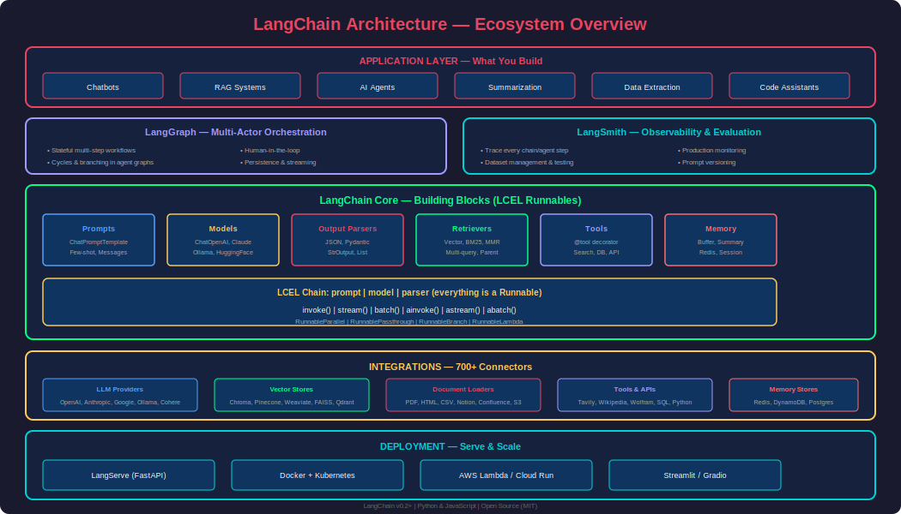
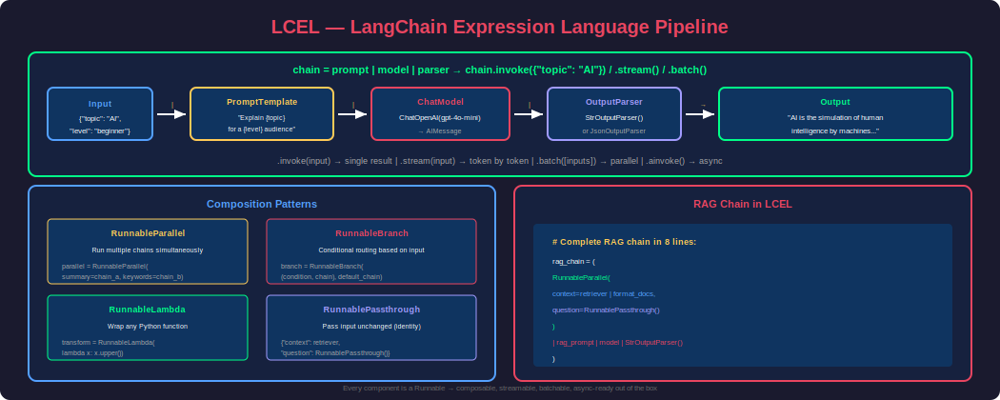
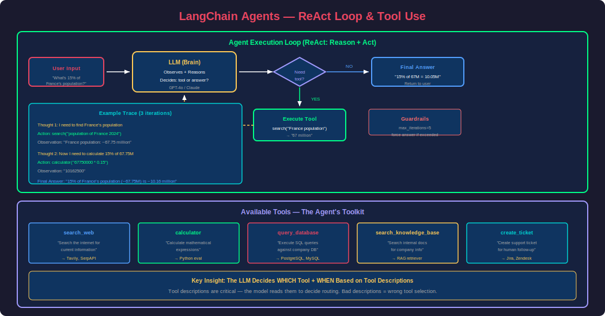

# Phase 24 — LangChain

## Overview

LangChain is the most widely adopted framework for building applications powered by Large Language Models. It provides a modular, composable architecture for connecting LLMs to external data sources, tools, memory systems, and complex multi-step workflows. Think of it as the **"Spring Framework for AI"** — it gives you the building blocks and patterns to go from a simple prompt-response interaction to a production-grade AI system.

LangChain solves the problem of **orchestration**: how do you chain together an LLM with a database lookup, a web search, a calculator, memory of past conversations, and structured output formatting — all in a reliable, debuggable pipeline?

This phase covers: the LangChain Expression Language (LCEL), chains, prompt templates, output parsers, memory systems, retrievers, tools, agents, and complete RAG pipeline construction.

---

## 1. LangChain Architecture & Ecosystem



### The LangChain Stack

| Layer | Package | Purpose |
|---|---|---|
| **Core** | `langchain-core` | Base abstractions (Runnables, prompts, output parsers) |
| **Community** | `langchain-community` | 700+ third-party integrations |
| **Partner packages** | `langchain-openai`, `langchain-anthropic`, etc. | Official integrations |
| **LangChain** | `langchain` | Chains, agents, retrieval strategies |
| **LangGraph** | `langgraph` | Multi-actor stateful workflows |
| **LangSmith** | Cloud platform | Observability, testing, evaluation |
| **LangServe** | `langserve` | Deploy chains as REST APIs |

### Installation

```bash
# Core + OpenAI
pip install langchain langchain-openai langchain-community

# Additional integrations
pip install langchain-anthropic    # Claude
pip install langchain-chroma       # ChromaDB
pip install langchain-pinecone     # Pinecone
pip install langgraph              # Graph-based agents
pip install langsmith              # Observability
```

### Key Design Principles

1. **Composability**: Everything is a `Runnable` — chains, prompts, models, parsers can all be piped together
2. **Modularity**: Swap any component without changing the rest (change LLM, change vector DB, etc.)
3. **Streaming**: First-class support for token-by-token streaming
4. **Async**: Every component supports `ainvoke`, `abatch`, `astream`
5. **Observability**: Built-in tracing via LangSmith

---

## 2. LangChain Expression Language (LCEL)

LCEL is the declarative way to compose chains in LangChain. Every component is a `Runnable` that can be chained with the pipe operator `|`.



### The Runnable Interface

Every LangChain component implements:

```python
class Runnable:
    def invoke(self, input)        # Single input → single output
    def batch(self, inputs)        # Multiple inputs → multiple outputs
    def stream(self, input)        # Single input → streaming output
    async def ainvoke(self, input) # Async version
    async def abatch(self, inputs) # Async batch
    async def astream(self, input) # Async stream
```

### Basic LCEL Chain

```python
from langchain_openai import ChatOpenAI
from langchain_core.prompts import ChatPromptTemplate
from langchain_core.output_parsers import StrOutputParser

# Components
prompt = ChatPromptTemplate.from_messages([
    ("system", "You are a helpful assistant that explains concepts simply."),
    ("human", "Explain {topic} in 3 sentences for a {audience}.")
])

model = ChatOpenAI(model="gpt-4o-mini", temperature=0.7)

parser = StrOutputParser()

# LCEL Chain: prompt | model | parser
chain = prompt | model | parser

# Invoke
result = chain.invoke({"topic": "quantum computing", "audience": "5-year-old"})
print(result)
# "Quantum computers are like magic boxes that can try all answers at once..."

# Stream
for chunk in chain.stream({"topic": "blockchain", "audience": "teenager"}):
    print(chunk, end="", flush=True)

# Batch
results = chain.batch([
    {"topic": "neural networks", "audience": "business executive"},
    {"topic": "git", "audience": "artist"},
    {"topic": "docker", "audience": "chef"}
])
```

### LCEL Composition Patterns

```python
from langchain_core.runnables import (
    RunnablePassthrough,
    RunnableParallel,
    RunnableLambda,
    RunnableBranch
)

# ============================================================
# Pattern 1: RunnablePassthrough — pass input through unchanged
# ============================================================
chain = RunnableParallel(
    topic=RunnablePassthrough(),      # Pass the input as "topic"
    uppercase=RunnableLambda(lambda x: x.upper())  # Transform
) | prompt | model | parser

# ============================================================
# Pattern 2: RunnableParallel — run multiple operations simultaneously
# ============================================================
from langchain_core.runnables import RunnableParallel

parallel_chain = RunnableParallel(
    summary=summary_chain,      # Run summary chain
    keywords=keyword_chain,     # Run keyword extraction chain
    sentiment=sentiment_chain   # Run sentiment chain
)

# All three run in parallel, returns dict with all results
result = parallel_chain.invoke("LangChain is an amazing framework for AI apps")
# {"summary": "...", "keywords": [...], "sentiment": "positive"}

# ============================================================
# Pattern 3: RunnableBranch — conditional routing
# ============================================================
branch = RunnableBranch(
    (lambda x: "code" in x["topic"].lower(), code_chain),
    (lambda x: "math" in x["topic"].lower(), math_chain),
    general_chain  # default
)

# Routes to different chains based on input
result = branch.invoke({"topic": "code review best practices"})
# → uses code_chain

# ============================================================
# Pattern 4: RunnableLambda — custom transformations
# ============================================================
def format_docs(docs):
    """Custom function as a Runnable step."""
    return "\n\n".join(doc.page_content for doc in docs)

chain = (
    {"context": retriever | RunnableLambda(format_docs), 
     "question": RunnablePassthrough()}
    | prompt
    | model
    | parser
)
```

### LCEL with Type Annotations

```python
from langchain_core.runnables import chain as chain_decorator
from langchain_core.prompts import ChatPromptTemplate

@chain_decorator
def custom_chain(input_text: str) -> str:
    """Decorated function becomes a Runnable."""
    # Can do arbitrary logic
    if len(input_text) < 10:
        return "Input too short"
    
    prompt = ChatPromptTemplate.from_template("Summarize: {text}")
    model = ChatOpenAI(model="gpt-4o-mini")
    
    result = (prompt | model | StrOutputParser()).invoke({"text": input_text})
    return result

# Use like any other Runnable
output = custom_chain.invoke("LangChain provides a composable framework...")
```

---

## 3. Prompt Templates

### Types of Prompt Templates

```python
from langchain_core.prompts import (
    ChatPromptTemplate,
    SystemMessagePromptTemplate,
    HumanMessagePromptTemplate,
    AIMessagePromptTemplate,
    MessagesPlaceholder,
    FewShotChatMessagePromptTemplate,
    PromptTemplate
)

# ============================================================
# Chat prompt with system + human messages
# ============================================================
chat_prompt = ChatPromptTemplate.from_messages([
    ("system", "You are a {role}. Respond in {language}."),
    ("human", "{question}")
])

messages = chat_prompt.format_messages(
    role="senior Python developer",
    language="English",
    question="What are type hints?"
)

# ============================================================
# With conversation history placeholder
# ============================================================
prompt_with_history = ChatPromptTemplate.from_messages([
    ("system", "You are a helpful AI assistant."),
    MessagesPlaceholder(variable_name="chat_history"),
    ("human", "{input}")
])

# ============================================================
# Few-shot prompting
# ============================================================
from langchain_core.prompts import FewShotChatMessagePromptTemplate

examples = [
    {"input": "happy", "output": "sad"},
    {"input": "tall", "output": "short"},
    {"input": "fast", "output": "slow"},
]

example_prompt = ChatPromptTemplate.from_messages([
    ("human", "{input}"),
    ("ai", "{output}")
])

few_shot_prompt = FewShotChatMessagePromptTemplate(
    example_prompt=example_prompt,
    examples=examples,
)

final_prompt = ChatPromptTemplate.from_messages([
    ("system", "You give the opposite/antonym of the word given."),
    few_shot_prompt,
    ("human", "{input}")
])

chain = final_prompt | model | parser
result = chain.invoke({"input": "bright"})  # → "dim" or "dark"
```

### Dynamic Few-Shot Selection

```python
from langchain_core.example_selectors import SemanticSimilarityExampleSelector
from langchain_openai import OpenAIEmbeddings
from langchain_community.vectorstores import Chroma

# Select most relevant examples based on query similarity
example_selector = SemanticSimilarityExampleSelector.from_examples(
    examples=all_examples,  # Large pool of examples
    embeddings=OpenAIEmbeddings(),
    vectorstore_cls=Chroma,
    k=3  # Select top-3 most relevant examples
)

dynamic_prompt = FewShotChatMessagePromptTemplate(
    example_prompt=example_prompt,
    example_selector=example_selector,  # Dynamic selection
)
```

---

## 4. Output Parsers

Output parsers transform raw LLM text into structured data.

```python
from langchain_core.output_parsers import (
    StrOutputParser,
    JsonOutputParser,
    CommaSeparatedListOutputParser
)
from langchain_core.pydantic_v1 import BaseModel, Field

# ============================================================
# JSON Output Parser with Pydantic schema
# ============================================================
class MovieReview(BaseModel):
    title: str = Field(description="Movie title")
    rating: float = Field(description="Rating from 1-10")
    summary: str = Field(description="One-sentence summary")
    genres: list[str] = Field(description="List of genres")
    recommend: bool = Field(description="Would you recommend it?")

json_parser = JsonOutputParser(pydantic_object=MovieReview)

prompt = ChatPromptTemplate.from_messages([
    ("system", "Analyze the movie review and extract structured data.\n{format_instructions}"),
    ("human", "{review}")
])

chain = prompt | model | json_parser

# The format_instructions are auto-generated from the Pydantic model
result = chain.invoke({
    "review": "Inception was mind-blowing! Nolan's best work. The dream-within-a-dream concept was executed perfectly. 9/10.",
    "format_instructions": json_parser.get_format_instructions()
})
# Returns: MovieReview(title="Inception", rating=9.0, summary="...", genres=["sci-fi", "thriller"], recommend=True)

# ============================================================
# Structured Output (LangChain's preferred approach with OpenAI)
# ============================================================
from langchain_openai import ChatOpenAI

structured_llm = ChatOpenAI(model="gpt-4o-mini").with_structured_output(MovieReview)

result = structured_llm.invoke("Review: The Matrix is a classic sci-fi action film. 8.5/10")
# Returns MovieReview object directly — no parser needed

# ============================================================
# Comma-separated list parser
# ============================================================
list_parser = CommaSeparatedListOutputParser()

prompt = ChatPromptTemplate.from_template(
    "List 5 {category} items.\n{format_instructions}"
)

chain = prompt | model | list_parser
result = chain.invoke({
    "category": "programming languages for data science",
    "format_instructions": list_parser.get_format_instructions()
})
# Returns: ["Python", "R", "Julia", "SQL", "Scala"]
```

---

## 5. Memory Systems

Memory allows chains to maintain context across multiple interactions — essential for chatbots and conversational AI.

### Memory Types

```python
from langchain.memory import (
    ConversationBufferMemory,
    ConversationBufferWindowMemory,
    ConversationSummaryMemory,
    ConversationSummaryBufferMemory,
    ConversationTokenBufferMemory
)
from langchain_openai import ChatOpenAI

# ============================================================
# 1. Buffer Memory — store ALL messages (simplest)
# ============================================================
buffer_memory = ConversationBufferMemory(
    memory_key="chat_history",
    return_messages=True
)

# Manually add messages
buffer_memory.save_context(
    {"input": "Hi, my name is Alice"},
    {"output": "Hello Alice! How can I help you today?"}
)
buffer_memory.save_context(
    {"input": "What's my name?"},
    {"output": "Your name is Alice!"}
)

# Retrieve history
history = buffer_memory.load_memory_variables({})
print(history["chat_history"])
# [HumanMessage("Hi, my name is Alice"), AIMessage("Hello Alice!..."), ...]

# ============================================================
# 2. Window Memory — keep only last K exchanges
# ============================================================
window_memory = ConversationBufferWindowMemory(
    k=10,  # Keep last 10 messages
    memory_key="chat_history",
    return_messages=True
)
# Good for: keeping context manageable while preserving recent info

# ============================================================
# 3. Summary Memory — LLM summarizes older conversation
# ============================================================
summary_memory = ConversationSummaryMemory(
    llm=ChatOpenAI(model="gpt-4o-mini"),
    memory_key="chat_history",
    return_messages=True
)
# Older messages get summarized, recent ones kept verbatim
# Good for: long conversations where you need gist of early context

# ============================================================
# 4. Summary Buffer Memory — hybrid (best of both)
# ============================================================
summary_buffer_memory = ConversationSummaryBufferMemory(
    llm=ChatOpenAI(model="gpt-4o-mini"),
    max_token_limit=2000,  # Summarize when exceeding this
    memory_key="chat_history",
    return_messages=True
)
# Recent messages kept verbatim, older ones summarized
# Best overall choice for production chatbots

# ============================================================
# 5. Token Buffer — keep messages up to token limit
# ============================================================
token_memory = ConversationTokenBufferMemory(
    llm=ChatOpenAI(model="gpt-4o-mini"),
    max_token_limit=4000,
    memory_key="chat_history",
    return_messages=True
)
```

### Modern Memory with LCEL (Recommended)

```python
from langchain_core.prompts import ChatPromptTemplate, MessagesPlaceholder
from langchain_core.runnables.history import RunnableWithMessageHistory
from langchain_community.chat_message_histories import ChatMessageHistory
from langchain_openai import ChatOpenAI

# Store for session histories
store = {}

def get_session_history(session_id: str) -> ChatMessageHistory:
    """Get or create message history for a session."""
    if session_id not in store:
        store[session_id] = ChatMessageHistory()
    return store[session_id]

# Define chain
prompt = ChatPromptTemplate.from_messages([
    ("system", "You are a helpful AI assistant. Be concise."),
    MessagesPlaceholder(variable_name="history"),
    ("human", "{input}")
])

model = ChatOpenAI(model="gpt-4o-mini")
chain = prompt | model

# Wrap with message history
chain_with_history = RunnableWithMessageHistory(
    chain,
    get_session_history,
    input_messages_key="input",
    history_messages_key="history"
)

# Use with session management
config = {"configurable": {"session_id": "user_123"}}

response1 = chain_with_history.invoke(
    {"input": "My name is Bob and I'm building a RAG system"},
    config=config
)
print(response1.content)

response2 = chain_with_history.invoke(
    {"input": "What am I working on?"},
    config=config
)
print(response2.content)  # "You mentioned you're building a RAG system."

# Works with streaming too
for chunk in chain_with_history.stream({"input": "Give me tips"}, config=config):
    print(chunk.content, end="", flush=True)
```

### Persistent Memory with Redis

```python
from langchain_community.chat_message_histories import RedisChatMessageHistory

def get_redis_history(session_id: str) -> RedisChatMessageHistory:
    return RedisChatMessageHistory(
        session_id=session_id,
        url="redis://localhost:6379"
    )

# Now history persists across server restarts
chain_with_redis = RunnableWithMessageHistory(
    chain,
    get_redis_history,
    input_messages_key="input",
    history_messages_key="history"
)
```

---

## 6. Retrievers & RAG Chains

### Building a RAG Chain with LCEL

```python
from langchain_openai import ChatOpenAI, OpenAIEmbeddings
from langchain_community.vectorstores import Chroma
from langchain_core.prompts import ChatPromptTemplate
from langchain_core.output_parsers import StrOutputParser
from langchain_core.runnables import RunnablePassthrough, RunnableParallel

# Setup
embeddings = OpenAIEmbeddings(model="text-embedding-3-small")
vectorstore = Chroma(persist_directory="./db", embedding_function=embeddings)
retriever = vectorstore.as_retriever(search_kwargs={"k": 5})
model = ChatOpenAI(model="gpt-4o-mini", temperature=0)

# Format documents helper
def format_docs(docs):
    return "\n\n".join(
        f"[Source: {doc.metadata.get('source', 'unknown')}]\n{doc.page_content}" 
        for doc in docs
    )

# RAG Prompt
rag_prompt = ChatPromptTemplate.from_messages([
    ("system", """Answer the question based only on the following context. 
If you cannot answer from the context, say so. Cite sources.

Context:
{context}"""),
    ("human", "{question}")
])

# RAG Chain with LCEL
rag_chain = (
    RunnableParallel(
        context=retriever | format_docs,
        question=RunnablePassthrough()
    )
    | rag_prompt
    | model
    | StrOutputParser()
)

# Use it
answer = rag_chain.invoke("How does HNSW indexing work?")
print(answer)

# Stream it
for chunk in rag_chain.stream("What are the benefits of RAG?"):
    print(chunk, end="", flush=True)
```

### RAG Chain with Sources

```python
from langchain_core.runnables import RunnableParallel

# Chain that returns both answer and sources
rag_chain_with_sources = RunnableParallel(
    answer=(
        RunnableParallel(
            context=retriever | format_docs,
            question=RunnablePassthrough()
        )
        | rag_prompt
        | model
        | StrOutputParser()
    ),
    sources=retriever | (lambda docs: [
        {"source": d.metadata.get("source"), "content": d.page_content[:100]}
        for d in docs
    ])
)

result = rag_chain_with_sources.invoke("What is vector quantization?")
print(f"Answer: {result['answer']}")
print(f"Sources: {result['sources']}")
```

### Conversational RAG (with history)

```python
from langchain.chains.combine_documents import create_stuff_documents_chain
from langchain.chains.retrieval import create_retrieval_chain
from langchain.chains.history_aware_retriever import create_history_aware_retriever

# Step 1: Contextualize question using chat history
contextualize_prompt = ChatPromptTemplate.from_messages([
    ("system", """Given the chat history and latest user question, 
reformulate the question to be standalone (self-contained).
Do NOT answer the question, just reformulate it if needed."""),
    MessagesPlaceholder("chat_history"),
    ("human", "{input}")
])

history_aware_retriever = create_history_aware_retriever(
    model, retriever, contextualize_prompt
)

# Step 2: Answer based on retrieved docs
answer_prompt = ChatPromptTemplate.from_messages([
    ("system", """Answer the question based on the context below.
If you don't know, say so. Be concise.

Context: {context}"""),
    MessagesPlaceholder("chat_history"),
    ("human", "{input}")
])

# Step 3: Combine
question_answer_chain = create_stuff_documents_chain(model, answer_prompt)
conversational_rag = create_retrieval_chain(
    history_aware_retriever, question_answer_chain
)

# Use with history
chat_history = []

result1 = conversational_rag.invoke({
    "input": "What is HNSW?",
    "chat_history": chat_history
})
chat_history.extend([
    HumanMessage(content="What is HNSW?"),
    AIMessage(content=result1["answer"])
])

# Follow-up question uses history to understand "it"
result2 = conversational_rag.invoke({
    "input": "What parameters does it have?",  # "it" = HNSW
    "chat_history": chat_history
})
print(result2["answer"])  # Answers about HNSW parameters
```

---

## 7. Tools & Tool Calling

Tools give LLMs the ability to take actions — search the web, query databases, run code, call APIs.

```python
from langchain_core.tools import tool
from langchain_openai import ChatOpenAI
import requests
import math

# ============================================================
# Define tools with @tool decorator
# ============================================================
@tool
def search_web(query: str) -> str:
    """Search the web for current information. Use for questions about recent events or facts you're unsure about."""
    # In production: use Tavily, SerpAPI, or Google Search
    response = requests.get(
        "https://api.tavily.com/search",
        params={"query": query, "api_key": "your-key"}
    )
    results = response.json()["results"]
    return "\n".join(f"- {r['title']}: {r['content'][:200]}" for r in results[:3])

@tool
def calculator(expression: str) -> str:
    """Calculate a mathematical expression. Input should be a valid Python math expression."""
    try:
        result = eval(expression, {"__builtins__": {}}, {"math": math})
        return str(result)
    except Exception as e:
        return f"Error: {e}"

@tool
def get_weather(city: str) -> str:
    """Get current weather for a city. Use when the user asks about weather."""
    # Simulated — use OpenWeatherMap API in production
    return f"Weather in {city}: 72°F, partly cloudy, humidity 45%"

@tool
def query_database(sql: str) -> str:
    """Execute a read-only SQL query against the company database. Only SELECT queries allowed."""
    if not sql.strip().upper().startswith("SELECT"):
        return "Error: Only SELECT queries are allowed"
    # In production: connect to actual database
    return "Results: [{id: 1, name: 'Product A', sales: 1500}, ...]"

# ============================================================
# Bind tools to model
# ============================================================
model = ChatOpenAI(model="gpt-4o-mini")
model_with_tools = model.bind_tools([search_web, calculator, get_weather, query_database])

# The model can now decide WHEN to call tools
response = model_with_tools.invoke("What's 15% tip on a $84.50 dinner bill?")
# Model will call calculator("84.50 * 0.15")

response = model_with_tools.invoke("What's the weather in Tokyo?")
# Model will call get_weather("Tokyo")
```

### Custom Tools with Complex Inputs

```python
from langchain_core.tools import StructuredTool
from pydantic import BaseModel, Field

class SearchInput(BaseModel):
    query: str = Field(description="The search query")
    max_results: int = Field(default=5, description="Maximum results to return")
    date_range: str = Field(default="all", description="Date filter: 'today', 'week', 'month', 'all'")

def advanced_search(query: str, max_results: int = 5, date_range: str = "all") -> str:
    """Advanced web search with filters."""
    # Implementation
    return f"Found {max_results} results for '{query}' in range '{date_range}'"

search_tool = StructuredTool.from_function(
    func=advanced_search,
    name="advanced_search",
    description="Search with advanced options including result count and date filtering",
    args_schema=SearchInput
)
```

---

## 8. Agents

Agents use LLMs as reasoning engines to decide which tools to use, in what order, and how to combine their outputs. Unlike chains (fixed sequence), agents are **dynamic** — they observe results and adapt.



### ReAct Agent (Recommended)

```python
from langchain_openai import ChatOpenAI
from langchain.agents import create_openai_tools_agent, AgentExecutor
from langchain_core.prompts import ChatPromptTemplate, MessagesPlaceholder
from langchain_core.tools import tool

# Define tools
@tool
def search(query: str) -> str:
    """Search for information on the internet."""
    return f"Results for '{query}': [relevant information here]"

@tool
def calculator(expression: str) -> str:
    """Calculate a mathematical expression."""
    return str(eval(expression))

tools = [search, calculator]

# Agent prompt
prompt = ChatPromptTemplate.from_messages([
    ("system", """You are a helpful assistant with access to tools.
Use tools when you need factual information or calculations.
Think step by step before acting."""),
    MessagesPlaceholder("chat_history", optional=True),
    ("human", "{input}"),
    MessagesPlaceholder("agent_scratchpad")  # Where tool calls/results go
])

# Create agent
model = ChatOpenAI(model="gpt-4o-mini", temperature=0)
agent = create_openai_tools_agent(model, tools, prompt)

# Agent executor handles the tool-calling loop
agent_executor = AgentExecutor(
    agent=agent,
    tools=tools,
    verbose=True,        # Print reasoning steps
    max_iterations=5,    # Prevent infinite loops
    handle_parsing_errors=True
)

# Run
result = agent_executor.invoke({
    "input": "What's the population of France and what's 15% of that number?"
})
print(result["output"])
# Agent will:
# 1. Call search("population of France") → "67 million"
# 2. Call calculator("67000000 * 0.15") → "10050000"
# 3. Combine: "France has ~67 million people. 15% of that is 10,050,000."
```

### Agent with Memory

```python
from langchain_community.chat_message_histories import ChatMessageHistory
from langchain_core.runnables.history import RunnableWithMessageHistory

store = {}

def get_session_history(session_id: str):
    if session_id not in store:
        store[session_id] = ChatMessageHistory()
    return store[session_id]

agent_with_memory = RunnableWithMessageHistory(
    agent_executor,
    get_session_history,
    input_messages_key="input",
    history_messages_key="chat_history"
)

config = {"configurable": {"session_id": "user_456"}}

# Conversation with context
response1 = agent_with_memory.invoke(
    {"input": "Search for the latest SpaceX launch"},
    config=config
)

response2 = agent_with_memory.invoke(
    {"input": "When was it and what was the payload?"},  # "it" refers to previous
    config=config
)
```

### Multi-Tool RAG Agent

```python
from langchain.tools.retriever import create_retriever_tool
from langchain_community.tools.tavily_search import TavilySearchResults

# Tool 1: Internal knowledge base
internal_retriever = vectorstore.as_retriever(search_kwargs={"k": 5})
internal_tool = create_retriever_tool(
    internal_retriever,
    "search_internal_docs",
    "Search internal documentation for company-specific information like policies, procedures, and product details."
)

# Tool 2: Web search for current info
web_search = TavilySearchResults(max_results=3)

# Tool 3: Database query
@tool
def query_sales_db(query: str) -> str:
    """Query the sales database. Input should describe what data you need."""
    # Convert natural language to SQL (in production)
    return "Q3 revenue: $2.4M, up 12% YoY"

# Create agent with all tools
tools = [internal_tool, web_search, query_sales_db]

agent_prompt = ChatPromptTemplate.from_messages([
    ("system", """You are an AI assistant for Acme Corp employees.
You have access to:
1. Internal docs - use for company policies, product info, procedures
2. Web search - use for general knowledge, current events, external info
3. Sales database - use for revenue, metrics, customer data

Choose the right tool based on the question. Use internal docs first for company questions."""),
    MessagesPlaceholder("chat_history", optional=True),
    ("human", "{input}"),
    MessagesPlaceholder("agent_scratchpad")
])

agent = create_openai_tools_agent(model, tools, agent_prompt)
executor = AgentExecutor(agent=agent, tools=tools, verbose=True)

result = executor.invoke({"input": "What was our Q3 revenue and how does it compare to the industry?"})
# Agent uses: query_sales_db for Q3 revenue, web_search for industry comparison
```

---

## 9. Chains — Common Patterns

### Summarization Chain

```python
from langchain.chains.summarize import load_summarize_chain
from langchain.text_splitter import RecursiveCharacterTextSplitter

# For short documents: stuff all content into one prompt
stuff_chain = load_summarize_chain(model, chain_type="stuff")

# For long documents: map-reduce
# Map: summarize each chunk independently
# Reduce: combine chunk summaries into final summary
map_reduce_chain = load_summarize_chain(model, chain_type="map_reduce")

# For long documents: refine
# Process chunks sequentially, refining the summary with each new chunk
refine_chain = load_summarize_chain(model, chain_type="refine")

# Custom LCEL summarization
summarize_prompt = ChatPromptTemplate.from_template(
    "Summarize the following in 3 bullet points:\n\n{text}"
)

summarize_chain = summarize_prompt | model | StrOutputParser()

# For long docs: split → map → combine
splitter = RecursiveCharacterTextSplitter(chunk_size=4000, chunk_overlap=200)
chunks = splitter.split_text(long_document)

# Map step: summarize each chunk
chunk_summaries = summarize_chain.batch([{"text": chunk} for chunk in chunks])

# Reduce step: combine summaries
combine_prompt = ChatPromptTemplate.from_template(
    "Combine these summaries into a coherent 5-sentence overview:\n\n{summaries}"
)
combine_chain = combine_prompt | model | StrOutputParser()

final_summary = combine_chain.invoke({"summaries": "\n\n".join(chunk_summaries)})
```

### Sequential Chain (Multi-Step)

```python
# Step 1: Extract key topics
extract_chain = (
    ChatPromptTemplate.from_template("Extract the 3 main topics from:\n{text}")
    | model
    | StrOutputParser()
)

# Step 2: Research each topic
research_chain = (
    ChatPromptTemplate.from_template("Provide 2 key facts about: {topic}")
    | model
    | StrOutputParser()
)

# Step 3: Write final report
report_chain = (
    ChatPromptTemplate.from_template(
        "Write a brief report combining these findings:\n{research}"
    )
    | model
    | StrOutputParser()
)

# Compose: extract → research → report
full_pipeline = (
    extract_chain
    | RunnableLambda(lambda topics: {"research": "\n".join(
        research_chain.invoke({"topic": t}) for t in topics.split("\n")
    )})
    | report_chain
)

result = full_pipeline.invoke({"text": article_content})
```

### Router Chain

```python
from langchain_core.runnables import RunnableBranch, RunnableLambda

# Classification chain
classify_chain = (
    ChatPromptTemplate.from_template(
        "Classify this query into exactly one category: technical, billing, general\n\nQuery: {input}\n\nCategory:"
    )
    | model
    | StrOutputParser()
)

# Specialized chains for each category
technical_chain = ChatPromptTemplate.from_template(
    "You are a senior engineer. Help with this technical question:\n{input}"
) | model | StrOutputParser()

billing_chain = ChatPromptTemplate.from_template(
    "You are a billing specialist. Help with this billing question:\n{input}"
) | model | StrOutputParser()

general_chain = ChatPromptTemplate.from_template(
    "You are a helpful assistant. Answer:\n{input}"
) | model | StrOutputParser()

# Router
def route(info):
    category = info["category"].strip().lower()
    query = info["input"]
    if "technical" in category:
        return technical_chain.invoke({"input": query})
    elif "billing" in category:
        return billing_chain.invoke({"input": query})
    else:
        return general_chain.invoke({"input": query})

full_chain = (
    RunnableParallel(
        category=classify_chain,
        input=RunnablePassthrough()
    )
    | RunnableLambda(route)
)

result = full_chain.invoke({"input": "My API key isn't working, getting 401 errors"})
# → Routes to technical_chain
```

---

## 10. LangSmith — Observability & Debugging

```python
# Enable LangSmith tracing (set env vars)
import os
os.environ["LANGCHAIN_TRACING_V2"] = "true"
os.environ["LANGCHAIN_API_KEY"] = "your-langsmith-api-key"
os.environ["LANGCHAIN_PROJECT"] = "my-rag-app"

# Now ALL LangChain operations are automatically traced!
# Every chain.invoke() logs:
# - Input/output at each step
# - Latency per component
# - Token usage
# - Errors with full stack traces
# - Model parameters used

# View traces at: https://smith.langchain.com
```

### Evaluation with LangSmith

```python
from langsmith import Client
from langsmith.evaluation import evaluate

client = Client()

# Create a dataset for evaluation
dataset = client.create_dataset("rag-eval-set")

# Add examples
client.create_examples(
    inputs=[
        {"question": "What is HNSW?"},
        {"question": "How does RAG reduce hallucinations?"}
    ],
    outputs=[
        {"answer": "HNSW is a graph-based approximate nearest neighbor algorithm..."},
        {"answer": "RAG grounds LLM responses in retrieved factual context..."}
    ],
    dataset_id=dataset.id
)

# Define evaluator
def correctness_evaluator(run, example):
    """Check if the output matches expected answer semantically."""
    prediction = run.outputs["output"]
    expected = example.outputs["answer"]
    
    # Use LLM to judge
    score = judge_chain.invoke({
        "prediction": prediction,
        "expected": expected
    })
    return {"score": float(score), "key": "correctness"}

# Run evaluation
results = evaluate(
    rag_chain.invoke,
    data="rag-eval-set",
    evaluators=[correctness_evaluator]
)
```

---

## 11. Deploying with LangServe

```python
# server.py
from fastapi import FastAPI
from langserve import add_routes
from langchain_openai import ChatOpenAI
from langchain_core.prompts import ChatPromptTemplate
from langchain_core.output_parsers import StrOutputParser

app = FastAPI(title="My LangChain API")

# Define chains
summarize_chain = (
    ChatPromptTemplate.from_template("Summarize: {text}")
    | ChatOpenAI(model="gpt-4o-mini")
    | StrOutputParser()
)

rag_chain = (
    # ... your RAG chain from earlier
)

# Add routes — automatically creates REST + streaming + playground endpoints
add_routes(app, summarize_chain, path="/summarize")
add_routes(app, rag_chain, path="/rag")

# Run: uvicorn server:app --reload
# Playground: http://localhost:8000/summarize/playground
# API docs:   http://localhost:8000/docs
```

```python
# client.py — consuming the API
from langserve import RemoteRunnable

# Connect to deployed chain
summarizer = RemoteRunnable("http://localhost:8000/summarize")
rag = RemoteRunnable("http://localhost:8000/rag")

# Use exactly like a local chain
result = summarizer.invoke({"text": "Long article content..."})

# Streaming works too
for chunk in rag.stream("What is vector search?"):
    print(chunk, end="", flush=True)

# Batch
results = summarizer.batch([{"text": doc} for doc in documents])
```

---

## 12. Complete Production Example — Customer Support Bot

```python
"""
Production customer support chatbot with:
- RAG for knowledge base
- Tool use for actions (check order, update account)
- Memory for conversation context
- Routing based on intent
"""

from langchain_openai import ChatOpenAI, OpenAIEmbeddings
from langchain_community.vectorstores import Chroma
from langchain_core.prompts import ChatPromptTemplate, MessagesPlaceholder
from langchain_core.tools import tool
from langchain.agents import create_openai_tools_agent, AgentExecutor
from langchain.tools.retriever import create_retriever_tool
from langchain_core.runnables.history import RunnableWithMessageHistory
from langchain_community.chat_message_histories import RedisChatMessageHistory


class CustomerSupportBot:
    def __init__(self):
        self.model = ChatOpenAI(model="gpt-4o", temperature=0)
        self.setup_knowledge_base()
        self.setup_tools()
        self.setup_agent()
    
    def setup_knowledge_base(self):
        """Load and index support documentation."""
        embeddings = OpenAIEmbeddings(model="text-embedding-3-small")
        self.vectorstore = Chroma(
            persist_directory="./support_db",
            embedding_function=embeddings
        )
        self.retriever = self.vectorstore.as_retriever(
            search_type="mmr",
            search_kwargs={"k": 5, "fetch_k": 15}
        )
    
    def setup_tools(self):
        """Define tools the agent can use."""
        
        # Knowledge base search
        kb_tool = create_retriever_tool(
            self.retriever,
            "search_knowledge_base",
            "Search the support knowledge base for product information, troubleshooting guides, and policies. Use this for general questions about our products and services."
        )
        
        @tool
        def check_order_status(order_id: str) -> str:
            """Check the status of a customer order. Input: order ID (e.g., ORD-12345)."""
            # In production: query orders database
            return f"Order {order_id}: Shipped on May 20, expected delivery May 24. Tracking: 1Z999AA1012345678"
        
        @tool
        def update_customer_email(customer_id: str, new_email: str) -> str:
            """Update a customer's email address. Requires customer ID and new email."""
            # In production: update database with validation
            return f"Email updated for customer {customer_id} to {new_email}. Confirmation sent."
        
        @tool
        def create_support_ticket(subject: str, description: str, priority: str = "medium") -> str:
            """Create a support ticket for issues that need human follow-up. Priority: low, medium, high."""
            # In production: create ticket in Jira/Zendesk
            ticket_id = "TKT-99001"
            return f"Ticket {ticket_id} created: '{subject}' (priority: {priority}). A human agent will follow up within 24 hours."
        
        @tool
        def process_refund(order_id: str, reason: str) -> str:
            """Process a refund for an order. Requires order ID and reason."""
            return f"Refund initiated for {order_id}. Reason: {reason}. Amount will be credited within 3-5 business days."
        
        self.tools = [kb_tool, check_order_status, update_customer_email, 
                      create_support_ticket, process_refund]
    
    def setup_agent(self):
        """Create the support agent."""
        prompt = ChatPromptTemplate.from_messages([
            ("system", """You are a helpful customer support agent for TechCo.

Guidelines:
1. Be empathetic, professional, and concise
2. Use the knowledge base for product/policy questions
3. Use order tools for order-related requests (always ask for order ID)
4. Create a support ticket for complex issues you can't resolve
5. Never make up information — use tools to get facts
6. Always confirm before taking actions (refunds, account changes)
7. If the customer is frustrated, acknowledge their feelings first

You have access to the customer's session for context."""),
            MessagesPlaceholder("chat_history", optional=True),
            ("human", "{input}"),
            MessagesPlaceholder("agent_scratchpad")
        ])
        
        agent = create_openai_tools_agent(self.model, self.tools, prompt)
        self.executor = AgentExecutor(
            agent=agent,
            tools=self.tools,
            verbose=False,
            max_iterations=5,
            handle_parsing_errors=True
        )
        
        # Add memory
        self.agent_with_memory = RunnableWithMessageHistory(
            self.executor,
            lambda session_id: RedisChatMessageHistory(
                session_id=session_id,
                url="redis://localhost:6379"
            ),
            input_messages_key="input",
            history_messages_key="chat_history"
        )
    
    def chat(self, user_input: str, session_id: str) -> str:
        """Process a customer message."""
        config = {"configurable": {"session_id": session_id}}
        result = self.agent_with_memory.invoke(
            {"input": user_input},
            config=config
        )
        return result["output"]


# Usage
bot = CustomerSupportBot()

# Conversation
print(bot.chat("Hi, I ordered something last week and haven't received it yet", "session_001"))
# "I'm sorry to hear your order hasn't arrived yet. I'd be happy to check the status for you.
#  Could you please provide your order ID? It usually starts with ORD-."

print(bot.chat("It's ORD-12345", "session_001"))
# "I've checked your order ORD-12345. It was shipped on May 20 and is expected to arrive
#  by May 24. Your tracking number is 1Z999AA1012345678..."

print(bot.chat("That's too late, I need it by tomorrow. Can I get a refund?", "session_001"))
# "I understand that's frustrating. The delivery estimate is May 24, which I realize 
#  doesn't meet your timeline. I can process a refund for you. Would you like me to 
#  go ahead with that for order ORD-12345?"
```

---

## Interview Mastery

### Beginner Questions

**Q1: What is LangChain? Why do we need a framework for LLM applications?**

**A:** LangChain is a framework for building applications powered by LLMs. We need it because real-world AI apps aren't just "send prompt, get response" — they require: (1) connecting LLMs to external data (RAG); (2) giving LLMs access to tools (search, databases, APIs); (3) maintaining conversation memory; (4) chaining multiple LLM calls together; (5) structured output parsing; (6) error handling and retries. LangChain provides standardized abstractions for all these patterns, so you don't rebuild the plumbing for every project.

---

**Q2: What is LCEL? How does the pipe operator work?**

**A:** LCEL (LangChain Expression Language) is the declarative composition syntax where every component is a `Runnable`. The pipe operator `|` chains runnables sequentially: `prompt | model | parser`. The output of one step becomes the input of the next. Every runnable supports `.invoke()`, `.stream()`, `.batch()`, and their async equivalents. The key benefit: you get streaming, batching, and async support for free — the framework handles it.

---

**Q3: Explain the difference between a chain and an agent.**

**A:** A **chain** is a fixed sequence of steps: always prompt → model → parser, in that order. It's deterministic and predictable. An **agent** uses an LLM as a reasoning engine to dynamically decide which tools to call, in what order, based on the input and intermediate results. Agents have a loop: Observe → Think → Act → Observe → ... until done. Chains are simpler and faster; agents are flexible but less predictable and need guardrails (max iterations, error handling).

---

### Intermediate Questions

**Q4: How does memory work in LangChain? Compare the different memory types.**

**A:** Memory stores conversation history so the LLM can reference prior context.

| Type | Mechanism | Best For |
|---|---|---|
| **Buffer** | Store all messages verbatim | Short conversations (<20 turns) |
| **Window (k=10)** | Keep last K messages | Medium conversations |
| **Summary** | LLM summarizes older messages | Long conversations |
| **Summary Buffer** | Recent verbatim + older summarized | Production chatbots (best overall) |
| **Token Buffer** | Keep messages up to token limit | When you need precise token control |

Modern approach: use `RunnableWithMessageHistory` with a session store (Redis, DynamoDB) rather than the legacy `ConversationChain`. This gives you per-user session management, persistence, and works with LCEL.

---

**Q5: How would you implement a RAG chain in LangChain using LCEL?**

**A:** 
```python
chain = (
    RunnableParallel(
        context=retriever | format_docs,  # Retrieve + format
        question=RunnablePassthrough()     # Pass question through
    )
    | rag_prompt    # Inject context + question into template
    | model         # Generate answer
    | StrOutputParser()  # Extract text
)
```

Key decisions: (1) Retriever config — MMR for diversity, k=5 for precision; (2) Format docs with source attribution; (3) Prompt template that instructs "answer only from context"; (4) Temperature=0 for factual answers. For production, add re-ranking between retriever and prompt, and wrap with `RunnableWithMessageHistory` for conversational RAG.

---

**Q6: What are the different ways to deploy a LangChain application?**

**A:** 
1. **LangServe** — wrap chain in FastAPI with `add_routes()`. Gets REST API + streaming + playground automatically
2. **Raw FastAPI/Flask** — call `chain.invoke()` in your own endpoint for full control
3. **AWS Lambda** — serverless, use `langchain` with lightweight deps
4. **Docker + K8s** — containerize the FastAPI app for production scale
5. **Streamlit/Gradio** — for demos and internal tools
6. **LangChain Cloud** (hosted) — managed deployment with LangSmith integration

Production checklist: streaming responses, rate limiting, authentication, error handling, LangSmith tracing, caching (Redis for frequent queries), async for throughput.

---

### Advanced Questions

**Q7: Design a multi-agent customer support system using LangChain.**

**A:**

**Architecture:**
- **Router Agent**: Classifies intent → routes to specialist
- **FAQ Agent**: RAG over knowledge base for common questions
- **Order Agent**: Tools for order lookup, tracking, modifications
- **Billing Agent**: Tools for payment info, refunds, invoicing
- **Escalation Agent**: Creates tickets, transfers to human

**Implementation:**
```
User message → Router (classify intent)
  → "faq" → FAQ Agent (retriever tool) → answer
  → "order" → Order Agent (check_order, cancel_order tools) → answer
  → "billing" → Billing Agent (check_payment, process_refund tools) → answer
  → "complex" → Escalation Agent → create_ticket → "Human will follow up"
```

**Key decisions:**
- Shared memory across agents (user context persists when routed)
- Guardrails: max iterations, action confirmation before destructive operations
- Fallback: if agent fails 3 times, escalate to human
- Observability: LangSmith traces every agent decision for debugging

---

**Q8: How do you handle errors, retries, and fallbacks in LangChain?**

**A:**
```python
from langchain_core.runnables import RunnableWithFallbacks

# Fallback: if GPT-4 fails, try Claude, then GPT-3.5
chain_with_fallback = primary_chain.with_fallbacks(
    [claude_chain, gpt35_chain]
)

# Retry with exponential backoff
from langchain_core.runnables import RunnableRetry

chain_with_retry = chain.with_retry(
    stop_after_attempt=3,
    wait_exponential_jitter=True
)

# Custom error handling
from langchain_core.runnables import RunnableLambda

def safe_invoke(input):
    try:
        return chain.invoke(input)
    except Exception as e:
        return f"I encountered an error. Please try rephrasing. ({type(e).__name__})"

safe_chain = RunnableLambda(safe_invoke)
```

Production patterns: (1) Always set `max_iterations` on agents; (2) Use `handle_parsing_errors=True` on AgentExecutor; (3) Implement circuit breakers for external API tools; (4) Log all failures to LangSmith for analysis; (5) Set timeouts on tool calls.

---

**Q9: Compare LangChain's approach to building AI apps vs doing it from scratch with the raw OpenAI API.**

**A:**

| Aspect | Raw OpenAI API | LangChain |
|---|---|---|
| **Simple Q&A** | 5 lines of code | 10 lines (slight overhead) |
| **RAG pipeline** | 100+ lines, manual orchestration | 20 lines with LCEL |
| **Agent with tools** | 200+ lines, manual tool-calling loop | 30 lines |
| **Memory** | Manual message array management | Built-in session handling |
| **Streaming** | Manual SSE handling | `chain.stream()` |
| **Switching models** | Rewrite API calls | Change one line |
| **Observability** | Build from scratch | LangSmith integration |
| **Testing** | Custom harness | LangSmith evaluation |

**When to use LangChain:** Multi-step pipelines, RAG, agents, production apps with observability needs, teams that want standardized patterns.

**When to skip LangChain:** Very simple single-call apps, performance-critical systems where abstraction overhead matters, when you need behaviors LangChain doesn't support.

---

**Q10: What is LangSmith and why is observability critical for LLM applications?**

**A:** LangSmith is LangChain's observability platform. It traces every step of your chain/agent execution: inputs, outputs, latency, token usage, and errors at each node.

Why it's critical: LLM apps are **non-deterministic** — the same input can produce different outputs. Without observability you can't: (1) debug why an agent took a wrong action; (2) identify which retrieval step returned bad context; (3) measure if a prompt change improved quality; (4) detect production regressions; (5) evaluate at scale (run test suites, compare model versions).

LangSmith provides: trace visualization, dataset management, automated evaluation, prompt versioning, and production monitoring. It's the equivalent of Datadog/New Relic but purpose-built for LLM pipelines.

---

### Scenario-Based Questions

**Q11: Your LangChain agent is getting stuck in infinite loops calling the same tool repeatedly. How do you fix it?**

**A:** 
1. **Set `max_iterations=5`** on AgentExecutor — hard limit on tool calls
2. **Improve tool descriptions** — if the tool description is vague, the model can't tell when to stop. Make descriptions specific about what output to expect
3. **Add "You have already called this tool" to the prompt** — explicitly instruct the model about loop avoidance
4. **Check tool output** — if the tool returns empty/error, the model retries. Return clear "no results found" messages
5. **Use `return_intermediate_steps=True`** — inspect what's happening in the loop
6. **Add early stopping** — `early_stopping_method="force"` stops and generates a final answer when iterations are exceeded

---

**Q12: How would you optimize a LangChain RAG pipeline that's too slow (5+ seconds per query)?**

**A:** Latency breakdown and optimizations:
1. **Embedding latency (50-100ms)**: Cache query embeddings for repeated questions (Redis)
2. **Retrieval (50-200ms)**: Use metadata pre-filtering to narrow search space; reduce k if possible
3. **Re-ranking (100-300ms)**: Use a smaller cross-encoder model; reduce candidate set from 20 to 10
4. **LLM generation (1-3s)**: Use streaming for perceived speed; use gpt-4o-mini instead of gpt-4o; reduce context size (fewer chunks)
5. **Overall**: Implement semantic caching — if a similar question was asked before, return cached answer; use `chain.astream()` for streaming; parallelize retrieval steps with `RunnableParallel`

---

[Download This File](#)
