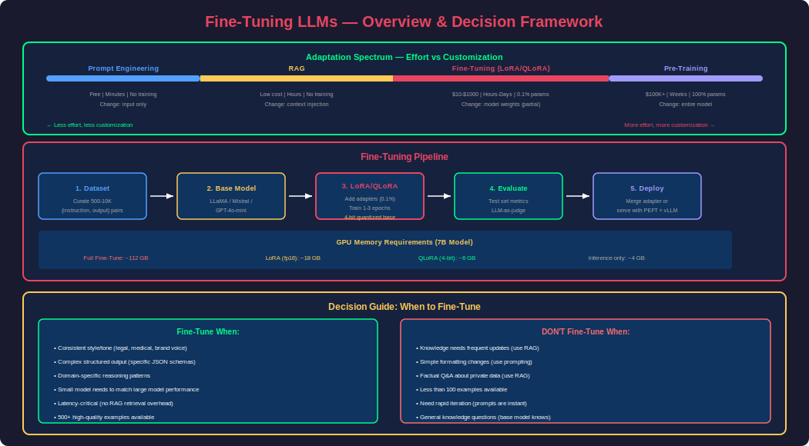
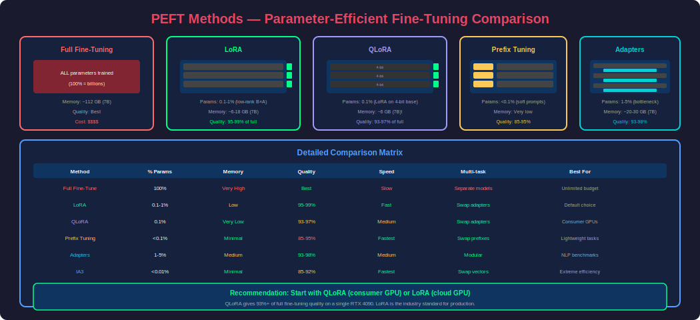
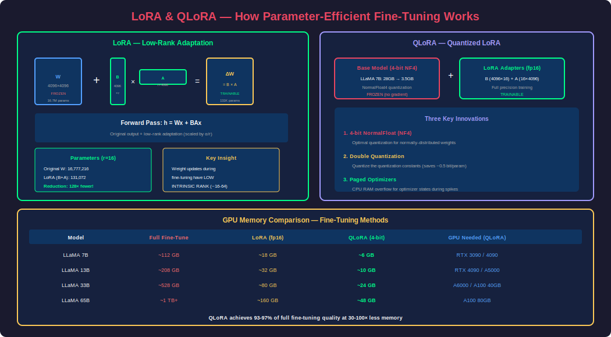
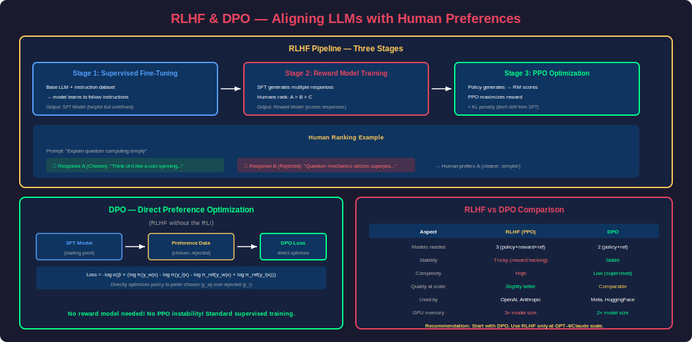

# Phase 26 — Fine-Tuning LLMs

## Overview

Fine-tuning is the process of adapting a pre-trained Large Language Model to a specific task, domain, or style by training it further on a curated dataset. While RAG retrieves external knowledge at inference time, fine-tuning **bakes knowledge and behavior directly into the model's weights** — making it faster, cheaper to run, and capable of nuanced domain expertise.

The fine-tuning landscape has been revolutionized by **Parameter-Efficient Fine-Tuning (PEFT)** methods — particularly LoRA and QLoRA — which allow you to fine-tune billion-parameter models on a single consumer GPU by only training a tiny fraction of the parameters.

This phase covers: when to fine-tune vs. RAG vs. prompt engineering, full fine-tuning vs. PEFT, LoRA/QLoRA in depth, instruction tuning, RLHF basics, dataset preparation, and hands-on implementation with HuggingFace and OpenAI.

---

## 1. When to Fine-Tune



### Decision Framework: Prompt Engineering vs RAG vs Fine-Tuning

| Approach | What It Changes | Best For | Cost | Latency Impact |
|---|---|---|---|---|
| **Prompt Engineering** | Input only | Format, style, simple tasks | Free | None |
| **RAG** | Input context | Factual Q&A, private data, freshness | Low (embedding + retrieval) | +200ms per query |
| **Fine-Tuning** | Model weights | Style, domain expertise, complex behaviors | Medium ($10-$1000) | None (faster inference) |
| **Pre-Training** | Entire model | New language, new modality | Very High ($100K+) | None |

### When Fine-Tuning is the RIGHT Choice

1. **Consistent style/tone**: "Always respond like a legal professional" — hard to enforce with prompts alone
2. **Complex structured output**: Learning a specific JSON schema or API format
3. **Domain-specific reasoning**: Medical diagnosis, legal analysis, code in a niche framework
4. **Reducing inference cost**: A fine-tuned small model (7B) can match a large model (70B) on specific tasks
5. **Latency reduction**: Encode knowledge in weights instead of retrieving it (no RAG overhead)
6. **Instruction following**: Teaching the model to follow specific multi-step procedures

### When Fine-Tuning is the WRONG Choice

1. **Knowledge updates**: Use RAG — fine-tuning can't keep up with daily changes
2. **Simple formatting**: Use prompt engineering — cheaper and faster to iterate
3. **Factual Q&A about private data**: Use RAG — fine-tuning memorizes poorly
4. **You have < 100 examples**: Too little data → overfitting
5. **Quick iteration needed**: Fine-tuning takes hours; prompt engineering takes minutes

---

## 2. Types of Fine-Tuning

### Full Fine-Tuning

Train ALL parameters of the model. Requires massive GPU memory.

```
Model: LLaMA 7B → 7 billion parameters × 4 bytes (fp32) = 28 GB
Optimizer states (Adam): 28 GB × 2 = 56 GB
Gradients: 28 GB
Total GPU memory needed: ~112 GB (multiple A100 80GB GPUs)
```

### Parameter-Efficient Fine-Tuning (PEFT)

Train only a SMALL subset of parameters. Freezes the original weights.



| Method | Parameters Trained | Memory Savings | Quality |
|---|---|---|---|
| **Full Fine-Tuning** | 100% | None | Best (but expensive) |
| **LoRA** | 0.1-1% | 10-100x less | 95-99% of full |
| **QLoRA** | 0.1-1% (4-bit base) | 30-100x less | 93-97% of full |
| **Prefix Tuning** | <0.1% (soft prompts) | 100x less | 85-95% of full |
| **Adapters** | 1-5% (bottleneck layers) | 10-50x less | 93-98% of full |
| **IA3** | <0.01% (scaling vectors) | 100x+ less | 85-92% of full |

---

## 3. LoRA (Low-Rank Adaptation)

LoRA is the dominant fine-tuning method. Instead of updating the full weight matrix W, it learns a low-rank decomposition ΔW = BA, where B and A are small matrices.



### Mathematical Intuition

Original forward pass:
```
h = Wx    (W is d×d, e.g., 4096×4096 = 16.7M parameters)
```

LoRA forward pass:
```
h = Wx + BAx    where B is d×r, A is r×d (r = rank, typically 8-64)
                 Parameters: d×r + r×d = 2×d×r = 2×4096×16 = 131K (0.8% of original!)
```

### Why It Works

The key insight from the LoRA paper: **weight updates during fine-tuning have low intrinsic rank**. When you fine-tune a model, the changes to the weight matrices are concentrated in a low-dimensional subspace. LoRA exploits this by directly parameterizing the update as a low-rank matrix.

### LoRA Implementation with PEFT

```python
from peft import LoraConfig, get_peft_model, TaskType
from transformers import AutoModelForCausalLM, AutoTokenizer, TrainingArguments
from trl import SFTTrainer
import torch

# ============================================================
# Step 1: Load base model
# ============================================================
model_name = "meta-llama/Llama-2-7b-hf"

model = AutoModelForCausalLM.from_pretrained(
    model_name,
    torch_dtype=torch.float16,
    device_map="auto"
)
tokenizer = AutoTokenizer.from_pretrained(model_name)
tokenizer.pad_token = tokenizer.eos_token

# ============================================================
# Step 2: Configure LoRA
# ============================================================
lora_config = LoraConfig(
    r=16,                        # Rank (8, 16, 32, 64 — higher = more capacity)
    lora_alpha=32,               # Scaling factor (usually 2×r)
    target_modules=[             # Which layers to adapt
        "q_proj", "k_proj",      # Attention: query and key projections
        "v_proj", "o_proj",      # Attention: value and output projections
        "gate_proj", "up_proj",  # MLP layers
        "down_proj"
    ],
    lora_dropout=0.05,           # Dropout for regularization
    bias="none",                 # Don't train biases
    task_type=TaskType.CAUSAL_LM
)

# ============================================================
# Step 3: Apply LoRA to model
# ============================================================
model = get_peft_model(model, lora_config)
model.print_trainable_parameters()
# Output: trainable params: 4,194,304 || all params: 6,742,609,920 || trainable%: 0.0622

# ============================================================
# Step 4: Prepare dataset
# ============================================================
from datasets import load_dataset

dataset = load_dataset("timdettmers/openassistant-guanaco", split="train")

# Format: instruction-following format
def format_prompt(example):
    return {
        "text": f"""### Instruction:
{example['instruction']}

### Response:
{example['output']}"""
    }

dataset = dataset.map(format_prompt)

# ============================================================
# Step 5: Training
# ============================================================
training_args = TrainingArguments(
    output_dir="./lora-llama2-7b",
    num_train_epochs=3,
    per_device_train_batch_size=4,
    gradient_accumulation_steps=4,   # Effective batch size: 4×4=16
    learning_rate=2e-4,
    fp16=True,
    logging_steps=10,
    save_strategy="epoch",
    warmup_ratio=0.03,
    lr_scheduler_type="cosine",
    optim="paged_adamw_8bit",        # Memory-efficient optimizer
)

trainer = SFTTrainer(
    model=model,
    args=training_args,
    train_dataset=dataset,
    tokenizer=tokenizer,
    dataset_text_field="text",
    max_seq_length=512,
)

trainer.train()

# ============================================================
# Step 6: Save and load LoRA adapter
# ============================================================
# Save only the LoRA weights (tiny: ~30 MB vs 14 GB for full model)
model.save_pretrained("./lora-adapter")

# Load for inference
from peft import PeftModel

base_model = AutoModelForCausalLM.from_pretrained(model_name, torch_dtype=torch.float16)
model = PeftModel.from_pretrained(base_model, "./lora-adapter")

# Optionally merge LoRA into base model (for deployment without PEFT dependency)
merged_model = model.merge_and_unload()
merged_model.save_pretrained("./merged-model")
```

### LoRA Hyperparameter Guide

| Parameter | Description | Recommended | Trade-off |
|---|---|---|---|
| `r` (rank) | Dimensionality of LoRA matrices | 16-64 | Higher = more capacity but slower/more memory |
| `lora_alpha` | Scaling factor | 2×r (e.g., 32 for r=16) | Higher = larger updates per step |
| `target_modules` | Which layers to adapt | All attention + MLP | More modules = better quality, more memory |
| `lora_dropout` | Regularization | 0.05-0.1 | Higher = less overfitting, potentially less learning |
| `learning_rate` | Training LR | 1e-4 to 3e-4 | Higher = faster but risk instability |

---

## 4. QLoRA (Quantized LoRA)

QLoRA takes LoRA further by **quantizing the base model to 4-bit** while training LoRA adapters in 16-bit. This allows fine-tuning a 65B parameter model on a single 48GB GPU.

### How QLoRA Works

1. **4-bit NormalFloat (NF4)**: Quantize base model weights to 4 bits using an information-theoretically optimal format for normally distributed weights
2. **Double Quantization**: Quantize the quantization constants themselves (saves ~3 GB for 65B model)
3. **Paged Optimizers**: Use CPU RAM as overflow for optimizer states when GPU memory spikes

```python
from transformers import AutoModelForCausalLM, AutoTokenizer, BitsAndBytesConfig
from peft import LoraConfig, get_peft_model, prepare_model_for_kbit_training
import torch

# ============================================================
# QLoRA: 4-bit quantization config
# ============================================================
bnb_config = BitsAndBytesConfig(
    load_in_4bit=True,                    # Load model in 4-bit
    bnb_4bit_quant_type="nf4",           # NormalFloat4 (optimal for normal distributions)
    bnb_4bit_compute_dtype=torch.bfloat16, # Compute in bf16 for speed
    bnb_4bit_use_double_quant=True,       # Double quantization (saves memory)
)

# Load model in 4-bit
model = AutoModelForCausalLM.from_pretrained(
    "meta-llama/Llama-2-13b-hf",
    quantization_config=bnb_config,
    device_map="auto"
)

# Prepare for k-bit training
model = prepare_model_for_kbit_training(model)

# Apply LoRA on top of quantized model
lora_config = LoraConfig(
    r=64,
    lora_alpha=128,
    target_modules=["q_proj", "k_proj", "v_proj", "o_proj",
                    "gate_proj", "up_proj", "down_proj"],
    lora_dropout=0.05,
    bias="none",
    task_type="CAUSAL_LM"
)

model = get_peft_model(model, lora_config)
model.print_trainable_parameters()
# trainable%: 0.08% — fine-tune 13B model on a single 24GB GPU!
```

### Memory Comparison

| Model | Full Fine-Tune | LoRA (fp16) | QLoRA (4-bit + LoRA) |
|---|---|---|---|
| **7B** | ~112 GB | ~18 GB | **~6 GB** |
| **13B** | ~208 GB | ~32 GB | **~10 GB** |
| **33B** | ~528 GB | ~80 GB | **~24 GB** |
| **65B** | ~1 TB+ | ~160 GB | **~48 GB** |

---

## 5. Instruction Tuning

Instruction tuning teaches a model to **follow instructions** — transforming a raw language model (that only predicts next tokens) into a helpful assistant that answers questions, follows formats, and performs tasks.

### Dataset Format

```python
# Standard instruction-tuning format (Alpaca-style)
instruction_dataset = [
    {
        "instruction": "Summarize the following text in 2 sentences.",
        "input": "Quantum computing leverages quantum mechanical phenomena...",
        "output": "Quantum computing uses qubits that can exist in superpositions..."
    },
    {
        "instruction": "Write a Python function to reverse a linked list.",
        "input": "",
        "output": "def reverse_linked_list(head):\n    prev = None\n    current = head..."
    },
    {
        "instruction": "Classify the sentiment of this review as positive, negative, or neutral.",
        "input": "The food was amazing but the service was terrible.",
        "output": "Mixed (positive food, negative service)"
    }
]

# ChatML format (for chat models)
chat_dataset = [
    {
        "messages": [
            {"role": "system", "content": "You are a helpful coding assistant."},
            {"role": "user", "content": "How do I read a CSV file in Python?"},
            {"role": "assistant", "content": "You can use pandas:\n```python\nimport pandas as pd\ndf = pd.read_csv('file.csv')\n```"}
        ]
    }
]
```

### Fine-Tuning with OpenAI API

```python
from openai import OpenAI
import json

client = OpenAI()

# ============================================================
# Step 1: Prepare training data (JSONL format)
# ============================================================
training_data = [
    {
        "messages": [
            {"role": "system", "content": "You are a customer support agent for TechCo. Always be helpful, concise, and professional."},
            {"role": "user", "content": "How do I reset my password?"},
            {"role": "assistant", "content": "To reset your password:\n1. Go to settings.techco.com/password\n2. Click 'Forgot Password'\n3. Enter your email\n4. Check your inbox for the reset link\n\nThe link expires in 24 hours. Need more help?"}
        ]
    },
    # ... 50-1000+ examples
]

# Write to JSONL
with open("training_data.jsonl", "w") as f:
    for example in training_data:
        f.write(json.dumps(example) + "\n")

# ============================================================
# Step 2: Upload training file
# ============================================================
file = client.files.create(
    file=open("training_data.jsonl", "rb"),
    purpose="fine-tune"
)

# ============================================================
# Step 3: Create fine-tuning job
# ============================================================
job = client.fine_tuning.jobs.create(
    training_file=file.id,
    model="gpt-4o-mini-2024-07-18",  # Base model
    hyperparameters={
        "n_epochs": 3,
        "learning_rate_multiplier": 1.8,
        "batch_size": 4
    },
    suffix="techco-support"  # Model name suffix
)

print(f"Job ID: {job.id}")
print(f"Status: {job.status}")

# ============================================================
# Step 4: Monitor training
# ============================================================
import time

while True:
    job = client.fine_tuning.jobs.retrieve(job.id)
    print(f"Status: {job.status}")
    if job.status in ["succeeded", "failed", "cancelled"]:
        break
    time.sleep(60)

# Get training metrics
events = client.fine_tuning.jobs.list_events(fine_tuning_job_id=job.id)
for event in events.data:
    print(f"  {event.message}")

# ============================================================
# Step 5: Use fine-tuned model
# ============================================================
response = client.chat.completions.create(
    model=job.fine_tuned_model,  # e.g., "ft:gpt-4o-mini-2024-07-18:org::abc123"
    messages=[
        {"role": "system", "content": "You are a customer support agent for TechCo."},
        {"role": "user", "content": "My account is locked after too many login attempts"}
    ]
)
print(response.choices[0].message.content)
```

---

## 6. RLHF (Reinforcement Learning from Human Feedback)

RLHF aligns model behavior with human preferences — making outputs more helpful, harmless, and honest. It's how ChatGPT was trained to be a useful assistant rather than just predicting text.



### The Three Stages of RLHF

```
Stage 1: Supervised Fine-Tuning (SFT)
    Base model → trained on (instruction, ideal_response) pairs → SFT model

Stage 2: Reward Model Training
    Generate multiple responses → humans rank them → train reward model to predict rankings

Stage 3: RL Optimization (PPO)
    SFT model generates → reward model scores → PPO updates policy to maximize reward
    + KL penalty to prevent drifting too far from SFT model
```

### DPO (Direct Preference Optimization) — RLHF Without RL

DPO simplifies RLHF by eliminating the reward model and RL training. It directly optimizes the policy from preference data.

```python
from trl import DPOTrainer, DPOConfig
from transformers import AutoModelForCausalLM, AutoTokenizer
from datasets import load_dataset

# Load SFT model (already instruction-tuned)
model = AutoModelForCausalLM.from_pretrained("your-sft-model")
tokenizer = AutoTokenizer.from_pretrained("your-sft-model")

# Reference model (frozen copy of SFT model)
ref_model = AutoModelForCausalLM.from_pretrained("your-sft-model")

# DPO dataset: pairs of (chosen, rejected) responses
# Format: {"prompt": "...", "chosen": "good response", "rejected": "bad response"}
dataset = load_dataset("your-preference-dataset")

# DPO training config
training_args = DPOConfig(
    output_dir="./dpo-output",
    num_train_epochs=1,
    per_device_train_batch_size=4,
    learning_rate=5e-7,           # Very low LR for alignment
    beta=0.1,                     # KL penalty strength
    loss_type="sigmoid",          # DPO loss variant
    logging_steps=10,
    fp16=True,
)

# Train with DPO
trainer = DPOTrainer(
    model=model,
    ref_model=ref_model,
    args=training_args,
    train_dataset=dataset,
    tokenizer=tokenizer,
)

trainer.train()
```

### RLHF vs DPO Comparison

| Aspect | RLHF (PPO) | DPO |
|---|---|---|
| **Complexity** | High (3 models: policy, reward, reference) | Low (2 models: policy, reference) |
| **Stability** | Tricky to tune (reward hacking, KL collapse) | Stable, standard supervised loss |
| **Data** | Needs ranked responses for reward model | Needs pairwise preferences directly |
| **Performance** | Slightly better at scale | Comparable for most tasks |
| **GPU memory** | 3× model size | 2× model size |
| **Industry usage** | OpenAI (GPT-4), Anthropic (Claude) | Meta (Llama 2/3), HuggingFace |

---

## 7. Dataset Preparation Best Practices

### Quality Over Quantity

| Dataset Size | Quality | Expected Result |
|---|---|---|
| 50-100 | Excellent (expert-curated) | Good for specific narrow tasks |
| 500-1000 | High quality | Good for instruction following |
| 5000-10000 | Good quality | Excellent for domain expertise |
| 100000+ | Mixed quality | Risk overfitting to noise |

### Data Formatting Tips

```python
# ============================================================
# Good training examples (instruction-following)
# ============================================================

# GOOD: Clear instruction, specific output
good_example = {
    "instruction": "Convert this SQL query to a MongoDB aggregation pipeline",
    "input": "SELECT department, AVG(salary) FROM employees GROUP BY department HAVING AVG(salary) > 50000",
    "output": """db.employees.aggregate([
  { $group: { _id: "$department", avgSalary: { $avg: "$salary" } } },
  { $match: { avgSalary: { $gt: 50000 } } },
  { $project: { department: "$_id", avgSalary: 1, _id: 0 } }
])"""
}

# BAD: Vague instruction, unclear output
bad_example = {
    "instruction": "Help with database",
    "input": "I have a query",
    "output": "Sure, I can help! What do you need?"  # Too generic, model learns nothing
}

# ============================================================
# Data cleaning checklist
# ============================================================
def validate_training_example(example: dict) -> bool:
    """Validate a single training example."""
    checks = [
        len(example.get("instruction", "")) > 10,     # Not too short
        len(example.get("output", "")) > 20,           # Meaningful output
        len(example.get("output", "")) < 2000,         # Not too long
        example.get("output") != example.get("input"), # Not copying input
        "I don't know" not in example.get("output", ""),# Teaches helpfulness
        not example.get("output", "").startswith("As an AI"), # No meta-awareness
    ]
    return all(checks)
```

### Dataset Diversity

```python
# Ensure diversity in your training set
categories = {
    "format_following": 0.2,    # "Output as JSON", "Write in bullet points"
    "domain_knowledge": 0.3,    # Domain-specific Q&A
    "reasoning": 0.2,           # Multi-step analysis, comparisons
    "creative": 0.1,            # Open-ended generation
    "refusal": 0.1,             # "I can't help with that" for safety
    "edge_cases": 0.1           # Unusual inputs, error handling
}
```

---

## 8. Evaluation & Monitoring

### Evaluating Fine-Tuned Models

```python
from transformers import AutoModelForCausalLM, AutoTokenizer
import json

def evaluate_model(model, tokenizer, test_set: list[dict]) -> dict:
    """Evaluate fine-tuned model on held-out test set."""
    results = {
        "exact_match": 0,
        "format_correct": 0,
        "coherent": 0,
        "total": len(test_set)
    }
    
    for example in test_set:
        prompt = f"### Instruction:\n{example['instruction']}\n\n### Response:\n"
        
        inputs = tokenizer(prompt, return_tensors="pt").to(model.device)
        outputs = model.generate(
            **inputs,
            max_new_tokens=512,
            temperature=0.1,
            do_sample=True
        )
        
        generated = tokenizer.decode(outputs[0], skip_special_tokens=True)
        generated = generated.split("### Response:\n")[-1].strip()
        
        # Check metrics
        if generated.strip() == example["output"].strip():
            results["exact_match"] += 1
        if is_format_correct(generated, example.get("expected_format")):
            results["format_correct"] += 1
        if is_coherent(generated):
            results["coherent"] += 1
    
    # Calculate percentages
    for key in ["exact_match", "format_correct", "coherent"]:
        results[f"{key}_pct"] = results[key] / results["total"] * 100
    
    return results

# LLM-as-judge evaluation
def llm_judge(question: str, response: str, reference: str) -> dict:
    """Use GPT-4 to judge quality of fine-tuned model output."""
    judge_prompt = f"""Rate this response on a scale of 1-5 for each criterion:

Question: {question}
Model Response: {response}
Reference Answer: {reference}

Criteria:
1. Accuracy (factual correctness): 
2. Completeness (covers all aspects):
3. Format (follows requested format):
4. Helpfulness (useful to the user):

Return scores as JSON."""
    
    scores = gpt4_client.chat.completions.create(
        model="gpt-4o",
        messages=[{"role": "user", "content": judge_prompt}]
    ).choices[0].message.content
    
    return json.loads(scores)
```

---

## 9. Common Mistakes & Best Practices

### Mistakes to Avoid

| Mistake | Impact | Fix |
|---|---|---|
| **Training on noisy data** | Model learns bad patterns | Manually review 10% of training data |
| **Overfitting (too many epochs)** | Memorizes training set, poor generalization | Use validation loss, early stopping |
| **Wrong learning rate** | Too high = instability, too low = no learning | Start 2e-4 for LoRA, sweep if needed |
| **Catastrophic forgetting** | Loses general capabilities | Use low rank, keep LR low, add general data |
| **No evaluation set** | Can't measure improvement | Hold out 10-20% for evaluation |
| **Too much data from one category** | Biased model | Ensure category diversity |
| **Ignoring tokenization** | Incomplete sequences, wrong padding | Verify tokenized sequences look correct |

### Production Deployment Checklist

1. **A/B test**: Compare fine-tuned model vs base+prompt on real traffic
2. **Monitor degradation**: Track output quality over time (distribution shift)
3. **Version models**: Tag each fine-tune with dataset version, hyperparams, metrics
4. **Fallback**: If fine-tuned model fails quality threshold, fall back to base+prompt
5. **Safety testing**: Run safety benchmarks before deployment (toxicity, refusal rates)

---

## 10. End-to-End Project: Domain-Specific Fine-Tuning

```python
"""
Complete fine-tuning pipeline: Customer support model
Domain: SaaS product support for a project management tool
"""

from datasets import Dataset
from transformers import AutoModelForCausalLM, AutoTokenizer, BitsAndBytesConfig
from peft import LoraConfig, get_peft_model, prepare_model_for_kbit_training
from trl import SFTTrainer, SFTConfig
import torch
import json


# ============================================================
# Step 1: Prepare domain-specific training data
# ============================================================
training_examples = [
    {
        "messages": [
            {"role": "system", "content": "You are a support agent for ProjectFlow, a project management SaaS. Be helpful, specific, and reference exact UI elements."},
            {"role": "user", "content": "How do I add a team member to my workspace?"},
            {"role": "assistant", "content": "To add a team member:\n\n1. Click your workspace name in the top-left corner\n2. Select 'Settings' → 'Members'\n3. Click the '+ Invite Member' button\n4. Enter their email address\n5. Choose their role (Admin, Editor, or Viewer)\n6. Click 'Send Invitation'\n\nThey'll receive an email with a join link. Note: Free plans are limited to 5 members. You can upgrade to Pro for unlimited members at Settings → Billing."}
        ]
    },
    {
        "messages": [
            {"role": "system", "content": "You are a support agent for ProjectFlow, a project management SaaS."},
            {"role": "user", "content": "The Gantt chart isn't loading, just shows a spinner"},
            {"role": "assistant", "content": "The Gantt chart loading issue is usually caused by one of these:\n\n**Quick fixes:**\n1. Clear browser cache (Ctrl+Shift+Delete)\n2. Try a different browser (Chrome works best)\n3. Disable browser extensions temporarily\n\n**If those don't work:**\n- Check if you have more than 500 tasks in the view (known performance issue in v3.2)\n- Try filtering the view to fewer tasks\n- If on Safari, update to the latest version\n\n**Still stuck?** This might be a bug. Please share:\n- Your browser + version\n- Workspace URL\n- Screenshot of the console (F12 → Console tab)\n\nI'll escalate to engineering if needed."}
        ]
    },
    # ... 500+ examples covering common support scenarios
]

# Save as JSONL
with open("projectflow_support.jsonl", "w") as f:
    for ex in training_examples:
        f.write(json.dumps(ex) + "\n")

# Load as HuggingFace Dataset
dataset = Dataset.from_list(training_examples)

# ============================================================
# Step 2: Load model with QLoRA config
# ============================================================
model_name = "mistralai/Mistral-7B-Instruct-v0.2"

bnb_config = BitsAndBytesConfig(
    load_in_4bit=True,
    bnb_4bit_quant_type="nf4",
    bnb_4bit_compute_dtype=torch.bfloat16,
    bnb_4bit_use_double_quant=True,
)

model = AutoModelForCausalLM.from_pretrained(
    model_name,
    quantization_config=bnb_config,
    device_map="auto",
    attn_implementation="flash_attention_2"  # Faster training
)

tokenizer = AutoTokenizer.from_pretrained(model_name)
tokenizer.pad_token = tokenizer.eos_token
tokenizer.padding_side = "right"

model = prepare_model_for_kbit_training(model)

# ============================================================
# Step 3: Configure LoRA
# ============================================================
lora_config = LoraConfig(
    r=32,
    lora_alpha=64,
    target_modules=["q_proj", "k_proj", "v_proj", "o_proj",
                    "gate_proj", "up_proj", "down_proj"],
    lora_dropout=0.05,
    bias="none",
    task_type="CAUSAL_LM"
)

model = get_peft_model(model, lora_config)
print(f"Trainable parameters: {model.print_trainable_parameters()}")

# ============================================================
# Step 4: Format dataset for chat template
# ============================================================
def format_chat(example):
    """Apply chat template to messages."""
    text = tokenizer.apply_chat_template(
        example["messages"],
        tokenize=False,
        add_generation_prompt=False
    )
    return {"text": text}

formatted_dataset = dataset.map(format_chat)

# ============================================================
# Step 5: Train
# ============================================================
training_config = SFTConfig(
    output_dir="./projectflow-support-model",
    num_train_epochs=3,
    per_device_train_batch_size=2,
    gradient_accumulation_steps=8,
    learning_rate=2e-4,
    warmup_ratio=0.03,
    lr_scheduler_type="cosine",
    logging_steps=10,
    save_strategy="epoch",
    fp16=True,
    max_seq_length=1024,
    dataset_text_field="text",
    packing=True,  # Pack multiple short examples into one sequence
)

trainer = SFTTrainer(
    model=model,
    args=training_config,
    train_dataset=formatted_dataset,
    tokenizer=tokenizer,
)

trainer.train()

# ============================================================
# Step 6: Save adapter
# ============================================================
trainer.save_model("./projectflow-lora-adapter")

# ============================================================
# Step 7: Inference
# ============================================================
from peft import PeftModel

base = AutoModelForCausalLM.from_pretrained(model_name, torch_dtype=torch.float16, device_map="auto")
model = PeftModel.from_pretrained(base, "./projectflow-lora-adapter")

messages = [
    {"role": "system", "content": "You are a support agent for ProjectFlow."},
    {"role": "user", "content": "How do I set up recurring tasks?"}
]

input_text = tokenizer.apply_chat_template(messages, tokenize=False, add_generation_prompt=True)
inputs = tokenizer(input_text, return_tensors="pt").to(model.device)

output = model.generate(**inputs, max_new_tokens=300, temperature=0.3, do_sample=True)
response = tokenizer.decode(output[0], skip_special_tokens=True)
print(response)
```

---

## Interview Mastery

### Beginner Questions

**Q1: What is fine-tuning? How is it different from training from scratch?**

**A:** Fine-tuning takes a pre-trained model (which already understands language from training on billions of tokens) and trains it further on a smaller, task-specific dataset. Unlike training from scratch (which requires millions of dollars and petabytes of data), fine-tuning leverages existing knowledge and only adapts the model to new behaviors or domains. It's like hiring an experienced developer vs. training someone from zero — the experienced person just needs to learn your company's specific codebase.

---

**Q2: What is LoRA? Why is it revolutionary for fine-tuning?**

**A:** LoRA (Low-Rank Adaptation) freezes the original model weights and trains two small matrices (B×A) that represent the change. Instead of updating a 4096×4096 weight matrix (16.7M parameters), LoRA trains a rank-16 decomposition: 4096×16 + 16×4096 = 131K parameters (0.8%). This means: (1) 10-100x less GPU memory; (2) training on consumer GPUs; (3) store multiple fine-tuned versions as tiny adapters (~30MB each); (4) hot-swap adapters at inference time. The key insight: weight updates during fine-tuning have low intrinsic rank — most of the change is in a small subspace.

---

**Q3: When should you fine-tune vs use RAG vs prompt engineering?**

**A:** **Prompt engineering** (free, instant): for format control, simple tasks, fast iteration. **RAG** (cheap, real-time): for factual Q&A, private data access, frequently changing knowledge. **Fine-tuning** (medium cost, baked in): for consistent style/tone, complex reasoning patterns, domain expertise, reducing inference cost (small fine-tuned model replacing large prompted model). Rule of thumb: start with prompting → add RAG if you need knowledge → fine-tune only when behavior/style isn't achievable with prompts.

---

### Intermediate Questions

**Q4: Explain QLoRA. How does it enable fine-tuning 65B models on consumer GPUs?**

**A:** QLoRA combines three innovations: (1) **4-bit NormalFloat quantization** — stores base model weights in 4 bits using an information-theoretically optimal format, reducing memory 4x (65B model: 130GB fp16 → 33GB 4-bit); (2) **LoRA adapters in fp16** — trains small adaptation matrices at full precision while base is frozen at 4-bit; (3) **Paged optimizers** — uses CPU RAM as overflow when GPU memory spikes during gradient computation. Result: fine-tune a 65B model on a single 48GB A6000 GPU. Quality is 93-97% of full fine-tuning at 30-100x less memory.

---

**Q5: What is DPO and how does it compare to RLHF?**

**A:** DPO (Direct Preference Optimization) achieves alignment without reward model training or RL. Given preference pairs (chosen response, rejected response), DPO directly optimizes the policy to prefer chosen over rejected using a binary cross-entropy-like loss. Advantages over RLHF: (1) simpler — no reward model, no PPO instability; (2) less memory — 2 models instead of 3; (3) stable training — standard supervised loss. Disadvantages: slightly less powerful at extreme scale, can't iteratively improve from online feedback. Most open-source models (Llama 2/3, Zephyr) now use DPO.

---

### Advanced Questions

**Q6: Design a fine-tuning pipeline for a production code assistant.**

**A:**

**Dataset (10K+ examples):**
- Source: high-quality open-source code (filtered by stars, tests passing)
- Format: (instruction/docstring, code) pairs + (code, explanation) pairs
- Include: bug fixes, refactoring, test generation, code review
- Quality filter: only code that compiles, passes linting, has tests

**Training:**
- Base: CodeLlama-13B or DeepSeek-Coder-33B
- Method: QLoRA (r=64, all attention + MLP layers)
- Epochs: 2-3 (code models overfit quickly)
- Evaluation: HumanEval pass@1, MBPP, domain-specific test suite

**Deployment:**
- Merge LoRA adapters → quantize to GPTQ 4-bit → deploy with vLLM
- Latency: <200ms for 100-token completions
- A/B test vs GPT-4 on internal coding tasks
- Monitor: user acceptance rate, code that compiles, test pass rate

---

**Q7: How do you prevent catastrophic forgetting during fine-tuning?**

**A:** Catastrophic forgetting occurs when the model loses general capabilities while learning domain-specific ones. Mitigation strategies:
1. **Low rank (LoRA)**: Small rank limits how much the model can change
2. **Low learning rate**: 1e-4 to 3e-4, with warmup
3. **Mix general data**: Include 10-20% general instruction-following data in your training set
4. **Few epochs**: 1-3 epochs max; evaluate general capabilities after each
5. **KL penalty (DPO)**: Explicitly penalizes divergence from the base model
6. **Regularization**: LoRA dropout, weight decay
7. **Evaluate broadly**: Test on general benchmarks (MMLU, HumanEval) alongside your specific task

---

[Download This File](#)
