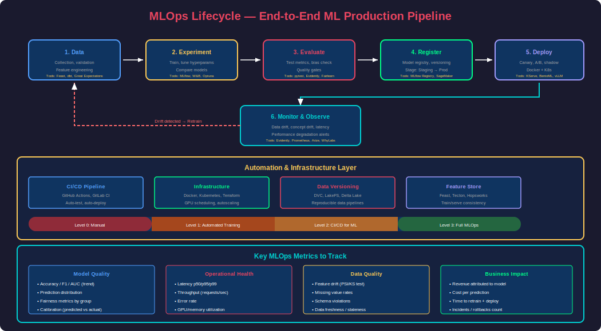
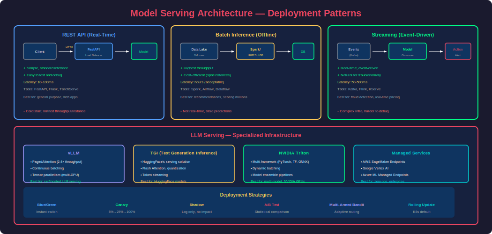
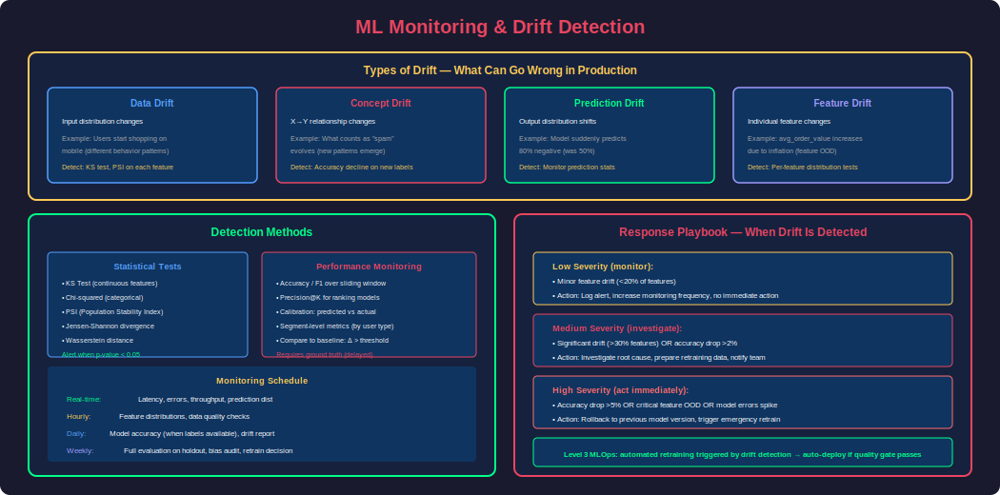
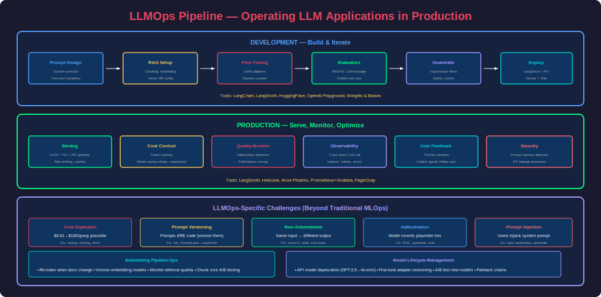

# Phase 27 — MLOps & LLMOps

## Overview

MLOps (Machine Learning Operations) is the discipline of deploying, monitoring, and maintaining ML models in production reliably and at scale. LLMOps extends this to Large Language Model applications — adding concerns like prompt management, embedding pipelines, guardrails, and cost optimization unique to generative AI.

The gap between a working Jupyter notebook and a production ML system is enormous. Research shows that only **~15% of ML projects** make it to production, and the #1 reason for failure isn't model quality — it's **operational complexity**: how do you retrain when data drifts? How do you roll back a bad model? How do you monitor outputs at scale?

This phase covers: ML pipelines, model serving, monitoring/observability, drift detection, CI/CD for ML, Docker/Kubernetes for AI, experiment tracking, and the full LLMOps stack.

---

## 1. The MLOps Lifecycle



### MLOps Maturity Levels

| Level | Description | Characteristics |
|---|---|---|
| **Level 0** | Manual | Jupyter notebooks, manual deployment, no monitoring |
| **Level 1** | ML Pipeline Automation | Automated training, manual deployment, basic monitoring |
| **Level 2** | CI/CD for ML | Automated training + deployment, A/B testing, model registry |
| **Level 3** | Full MLOps | Automated retraining on drift, canary deployments, full observability |

### Key Principles

1. **Reproducibility**: Every model can be recreated from code + data + config
2. **Automation**: Training, testing, and deployment require zero manual steps
3. **Monitoring**: Models degrade silently — continuous monitoring catches drift
4. **Versioning**: Track models, data, code, and config as linked artifacts
5. **Testing**: ML needs unit tests (code), integration tests (pipeline), AND model quality tests

---

## 2. ML Pipelines

### What Is an ML Pipeline?

An ML pipeline automates the end-to-end workflow: data ingestion → preprocessing → training → evaluation → deployment.

```python
# ============================================================
# Example: ML Pipeline with scikit-learn + MLflow
# ============================================================
import mlflow
import mlflow.sklearn
from sklearn.pipeline import Pipeline
from sklearn.preprocessing import StandardScaler
from sklearn.ensemble import RandomForestClassifier
from sklearn.model_selection import train_test_split, cross_val_score
from sklearn.metrics import accuracy_score, f1_score, classification_report
import pandas as pd
import joblib

class MLPipeline:
    """Production ML pipeline with experiment tracking."""
    
    def __init__(self, experiment_name: str = "fraud_detection"):
        mlflow.set_experiment(experiment_name)
        self.model = None
        self.pipeline = None
    
    def load_data(self, path: str) -> tuple:
        """Load and split data."""
        df = pd.read_csv(path)
        X = df.drop("is_fraud", axis=1)
        y = df["is_fraud"]
        return train_test_split(X, y, test_size=0.2, random_state=42, stratify=y)
    
    def build_pipeline(self, params: dict) -> Pipeline:
        """Build sklearn pipeline."""
        self.pipeline = Pipeline([
            ("scaler", StandardScaler()),
            ("model", RandomForestClassifier(**params))
        ])
        return self.pipeline
    
    def train(self, X_train, y_train, X_test, y_test, params: dict):
        """Train with MLflow tracking."""
        with mlflow.start_run():
            # Log parameters
            mlflow.log_params(params)
            
            # Build and train
            self.build_pipeline(params)
            self.pipeline.fit(X_train, y_train)
            
            # Evaluate
            y_pred = self.pipeline.predict(X_test)
            accuracy = accuracy_score(y_test, y_pred)
            f1 = f1_score(y_test, y_pred)
            
            # Cross-validation
            cv_scores = cross_val_score(self.pipeline, X_train, y_train, cv=5)
            
            # Log metrics
            mlflow.log_metrics({
                "accuracy": accuracy,
                "f1_score": f1,
                "cv_mean": cv_scores.mean(),
                "cv_std": cv_scores.std()
            })
            
            # Log model
            mlflow.sklearn.log_model(
                self.pipeline,
                "model",
                registered_model_name="fraud_detector"
            )
            
            # Log artifacts
            report = classification_report(y_test, y_pred)
            with open("classification_report.txt", "w") as f:
                f.write(report)
            mlflow.log_artifact("classification_report.txt")
            
            print(f"Run ID: {mlflow.active_run().info.run_id}")
            print(f"Accuracy: {accuracy:.4f}, F1: {f1:.4f}")
            
            return {"accuracy": accuracy, "f1": f1}
    
    def promote_to_production(self, model_name: str, version: int):
        """Promote a model version to production stage."""
        client = mlflow.tracking.MlflowClient()
        client.transition_model_version_stage(
            name=model_name,
            version=version,
            stage="Production"
        )
        print(f"Model {model_name} v{version} → Production")


# Usage
pipeline = MLPipeline("fraud_detection_v2")
X_train, X_test, y_train, y_test = pipeline.load_data("transactions.csv")

# Experiment with different hyperparameters
for n_estimators in [100, 200, 500]:
    for max_depth in [10, 20, None]:
        params = {"n_estimators": n_estimators, "max_depth": max_depth, "random_state": 42}
        results = pipeline.train(X_train, y_train, X_test, y_test, params)
```

### Pipeline Orchestration Tools

| Tool | Type | Best For | Key Feature |
|---|---|---|---|
| **Airflow** | DAG scheduler | Complex data pipelines | Battle-tested, large ecosystem |
| **Prefect** | Modern orchestrator | Python-native workflows | Easy to use, great UI |
| **Kubeflow** | K8s-native | ML on Kubernetes | Full ML lifecycle |
| **MLflow Pipelines** | ML-specific | Experiment tracking + deploy | Integrated model registry |
| **ZenML** | ML framework | Portable ML pipelines | Abstraction over infra |
| **Dagster** | Data orchestrator | Data + ML pipelines | Software-defined assets |

---

## 3. Model Serving



### Serving Patterns

| Pattern | Latency | Throughput | Best For |
|---|---|---|---|
| **REST API** (FastAPI) | 10-100ms | Medium | General purpose |
| **gRPC** | 5-50ms | High | Internal microservices |
| **Batch inference** | N/A | Very High | Offline scoring, recommendations |
| **Streaming** | Real-time | Medium | Event-driven, fraud detection |
| **Edge** (ONNX/TFLite) | 1-10ms | Low | Mobile, IoT |

### FastAPI Model Serving

```python
from fastapi import FastAPI, HTTPException
from pydantic import BaseModel
import mlflow
import numpy as np
from contextlib import asynccontextmanager

# Load model at startup
model = None

@asynccontextmanager
async def lifespan(app: FastAPI):
    global model
    model = mlflow.sklearn.load_model("models:/fraud_detector/Production")
    print("Model loaded successfully")
    yield
    print("Shutting down")

app = FastAPI(title="Fraud Detection API", lifespan=lifespan)

class PredictionRequest(BaseModel):
    amount: float
    merchant_category: int
    time_since_last_txn: float
    distance_from_home: float
    is_weekend: bool

class PredictionResponse(BaseModel):
    is_fraud: bool
    confidence: float
    model_version: str

@app.post("/predict", response_model=PredictionResponse)
async def predict(request: PredictionRequest):
    features = np.array([[
        request.amount,
        request.merchant_category,
        request.time_since_last_txn,
        request.distance_from_home,
        int(request.is_weekend)
    ]])
    
    prediction = model.predict(features)[0]
    probability = model.predict_proba(features)[0][1]
    
    return PredictionResponse(
        is_fraud=bool(prediction),
        confidence=float(probability),
        model_version="v2.1.0"
    )

@app.get("/health")
async def health():
    return {"status": "healthy", "model_loaded": model is not None}
```

### LLM Serving with vLLM

```python
# vLLM: High-throughput LLM serving
# Supports: PagedAttention, continuous batching, tensor parallelism

# Start vLLM server
# vllm serve meta-llama/Llama-2-7b-chat-hf --dtype float16 --max-model-len 4096

# Client usage
from openai import OpenAI

client = OpenAI(base_url="http://localhost:8000/v1", api_key="unused")

response = client.chat.completions.create(
    model="meta-llama/Llama-2-7b-chat-hf",
    messages=[{"role": "user", "content": "Explain MLOps in one sentence"}],
    max_tokens=100,
    temperature=0.7
)
print(response.choices[0].message.content)
```

### Docker Deployment

```dockerfile
# Dockerfile for ML model serving
FROM python:3.11-slim

WORKDIR /app

COPY requirements.txt .
RUN pip install --no-cache-dir -r requirements.txt

COPY model/ ./model/
COPY app.py .

EXPOSE 8000

CMD ["uvicorn", "app:app", "--host", "0.0.0.0", "--port", "8000", "--workers", "4"]
```

```yaml
# docker-compose.yml
version: "3.8"
services:
  model-api:
    build: .
    ports:
      - "8000:8000"
    environment:
      - MODEL_PATH=/app/model
      - MLFLOW_TRACKING_URI=http://mlflow:5000
    deploy:
      resources:
        reservations:
          devices:
            - driver: nvidia
              count: 1
              capabilities: [gpu]
    healthcheck:
      test: ["CMD", "curl", "-f", "http://localhost:8000/health"]
      interval: 30s
      timeout: 10s
      retries: 3

  mlflow:
    image: ghcr.io/mlflow/mlflow:latest
    ports:
      - "5000:5000"
    volumes:
      - mlflow-data:/mlflow
    command: mlflow server --host 0.0.0.0

volumes:
  mlflow-data:
```

---

## 4. Monitoring & Drift Detection



### Types of Drift

| Drift Type | What Changes | Example | Detection |
|---|---|---|---|
| **Data drift** | Input distribution | Users start using mobile more (different features) | Statistical tests on inputs |
| **Concept drift** | Relationship between X and Y | What counts as "spam" evolves over time | Performance metric degradation |
| **Prediction drift** | Output distribution | Model suddenly predicts fewer positives | Monitor prediction distributions |
| **Feature drift** | Individual features | Average transaction amount increases | Per-feature distribution monitoring |

### Monitoring Implementation

```python
from evidently import ColumnMapping
from evidently.report import Report
from evidently.metric_preset import DataDriftPreset, TargetDriftPreset
from evidently.metrics import (
    DatasetDriftMetric,
    ColumnDriftMetric,
    DatasetMissingValuesMetric
)
import pandas as pd
from datetime import datetime

class ModelMonitor:
    """Production model monitoring with drift detection."""
    
    def __init__(self, reference_data: pd.DataFrame):
        self.reference = reference_data
        self.alerts = []
    
    def check_data_drift(self, current_data: pd.DataFrame) -> dict:
        """Detect data drift between reference and current data."""
        report = Report(metrics=[
            DatasetDriftMetric(),
            DatasetMissingValuesMetric(),
        ])
        
        report.run(
            reference_data=self.reference,
            current_data=current_data
        )
        
        results = report.as_dict()
        drift_detected = results["metrics"][0]["result"]["dataset_drift"]
        drift_share = results["metrics"][0]["result"]["drift_share"]
        
        if drift_detected:
            self.alerts.append({
                "type": "data_drift",
                "timestamp": datetime.now().isoformat(),
                "drift_share": drift_share,
                "message": f"Data drift detected: {drift_share:.1%} of features drifted"
            })
        
        return {
            "drift_detected": drift_detected,
            "drift_share": drift_share,
            "drifted_columns": results["metrics"][0]["result"].get("drift_by_columns", {})
        }
    
    def check_performance(self, y_true, y_pred, threshold: float = 0.05) -> dict:
        """Check if model performance has degraded."""
        from sklearn.metrics import f1_score
        
        current_f1 = f1_score(y_true, y_pred)
        baseline_f1 = 0.92  # Stored from training
        
        degradation = baseline_f1 - current_f1
        
        if degradation > threshold:
            self.alerts.append({
                "type": "performance_degradation",
                "timestamp": datetime.now().isoformat(),
                "current_f1": current_f1,
                "baseline_f1": baseline_f1,
                "degradation": degradation,
                "message": f"F1 dropped by {degradation:.3f} (threshold: {threshold})"
            })
        
        return {
            "current_f1": current_f1,
            "baseline_f1": baseline_f1,
            "degradation": degradation,
            "alert": degradation > threshold
        }
    
    def check_prediction_distribution(self, predictions: list) -> dict:
        """Monitor prediction distribution shifts."""
        import numpy as np
        from scipy import stats
        
        # Compare prediction distribution to reference
        ref_preds = self.reference["prediction"].values
        current_preds = np.array(predictions)
        
        # KS test for distribution shift
        ks_stat, p_value = stats.ks_2samp(ref_preds, current_preds)
        
        shift_detected = p_value < 0.05
        
        if shift_detected:
            self.alerts.append({
                "type": "prediction_drift",
                "timestamp": datetime.now().isoformat(),
                "ks_statistic": ks_stat,
                "p_value": p_value
            })
        
        return {
            "shift_detected": shift_detected,
            "ks_statistic": ks_stat,
            "p_value": p_value
        }


# Usage: run monitoring on schedule (e.g., hourly via Airflow)
monitor = ModelMonitor(reference_data=training_data)

# Daily monitoring job
current_batch = get_todays_predictions()
drift_result = monitor.check_data_drift(current_batch)
perf_result = monitor.check_performance(current_batch["actual"], current_batch["predicted"])

if monitor.alerts:
    send_slack_alert(monitor.alerts)  # Notify team
    trigger_retraining_pipeline()      # Auto-retrain if configured
```

---

## 5. CI/CD for ML

### ML-Specific CI/CD Challenges

| Traditional CI/CD | ML CI/CD (Additional) |
|---|---|
| Code tests | + Data validation tests |
| Build artifacts | + Model artifacts + data versioning |
| Deploy code | + Deploy model + update feature store |
| Integration tests | + Model quality gates (accuracy thresholds) |
| Rollback code | + Rollback model + monitor for regression |

### GitHub Actions for ML

```yaml
# .github/workflows/ml-pipeline.yml
name: ML Training Pipeline

on:
  push:
    paths:
      - 'src/model/**'
      - 'data/processed/**'
  schedule:
    - cron: '0 2 * * 1'  # Weekly retraining

jobs:
  train-and-evaluate:
    runs-on: ubuntu-latest
    steps:
      - uses: actions/checkout@v4
      
      - name: Setup Python
        uses: actions/setup-python@v5
        with:
          python-version: '3.11'
      
      - name: Install dependencies
        run: pip install -r requirements.txt
      
      - name: Validate data
        run: python scripts/validate_data.py
      
      - name: Train model
        run: python scripts/train.py --config configs/production.yaml
        env:
          MLFLOW_TRACKING_URI: ${{ secrets.MLFLOW_URI }}
      
      - name: Evaluate model
        run: python scripts/evaluate.py --threshold 0.90
      
      - name: Quality gate
        run: |
          ACCURACY=$(cat metrics/accuracy.txt)
          if (( $(echo "$ACCURACY < 0.90" | bc -l) )); then
            echo "Model accuracy $ACCURACY below threshold 0.90"
            exit 1
          fi
      
      - name: Push model to registry
        if: success()
        run: python scripts/push_model.py --stage staging
      
      - name: Deploy to staging
        if: success()
        run: |
          kubectl set image deployment/model-api \
            model-api=registry.io/model:${{ github.sha }}

  integration-tests:
    needs: train-and-evaluate
    runs-on: ubuntu-latest
    steps:
      - name: Test staging endpoint
        run: python scripts/test_endpoint.py --url $STAGING_URL
      
      - name: Shadow traffic comparison
        run: python scripts/shadow_test.py --baseline prod --candidate staging
      
      - name: Promote to production
        if: success()
        run: python scripts/promote.py --model fraud_detector --stage production
```

---

## 6. LLMOps — Operations for LLM Applications



### LLMOps vs Traditional MLOps

| Aspect | Traditional MLOps | LLMOps (Additional) |
|---|---|---|
| **Model** | Train custom model | Manage API calls + fine-tuned adapters |
| **Data** | Feature store | Embedding pipeline + vector DB |
| **Testing** | Accuracy metrics | Faithfulness, hallucination, toxicity |
| **Cost** | Compute for training | Per-token API costs (can explode) |
| **Monitoring** | Prediction drift | Output quality, latency, cost per query |
| **Security** | Model poisoning | Prompt injection, data leakage |
| **Versioning** | Model weights | Prompts, embeddings, RAG configs |

### LLM Cost Optimization

```python
class LLMCostTracker:
    """Track and optimize LLM API costs."""
    
    def __init__(self):
        self.costs = []
        self.pricing = {
            "gpt-4o": {"input": 2.50, "output": 10.00},       # per 1M tokens
            "gpt-4o-mini": {"input": 0.15, "output": 0.60},
            "claude-3-opus": {"input": 15.00, "output": 75.00},
            "claude-3-sonnet": {"input": 3.00, "output": 15.00},
        }
    
    def log_call(self, model: str, input_tokens: int, output_tokens: int):
        """Log an API call with cost calculation."""
        pricing = self.pricing[model]
        cost = (input_tokens * pricing["input"] + output_tokens * pricing["output"]) / 1_000_000
        
        self.costs.append({
            "model": model,
            "input_tokens": input_tokens,
            "output_tokens": output_tokens,
            "cost_usd": cost,
            "timestamp": datetime.now()
        })
        return cost
    
    def daily_report(self) -> dict:
        """Generate daily cost report."""
        today = [c for c in self.costs if c["timestamp"].date() == datetime.now().date()]
        
        total_cost = sum(c["cost_usd"] for c in today)
        total_tokens = sum(c["input_tokens"] + c["output_tokens"] for c in today)
        by_model = {}
        
        for call in today:
            model = call["model"]
            if model not in by_model:
                by_model[model] = {"calls": 0, "cost": 0, "tokens": 0}
            by_model[model]["calls"] += 1
            by_model[model]["cost"] += call["cost_usd"]
            by_model[model]["tokens"] += call["input_tokens"] + call["output_tokens"]
        
        return {
            "total_cost_usd": total_cost,
            "total_tokens": total_tokens,
            "total_calls": len(today),
            "by_model": by_model,
            "projected_monthly": total_cost * 30
        }


# Cost optimization strategies
"""
1. Model routing: Use GPT-4o-mini for simple queries, GPT-4o for complex ones
2. Caching: Cache frequent queries (Redis with semantic similarity)
3. Prompt compression: Remove unnecessary tokens from prompts
4. Batch processing: Batch similar requests to reduce per-call overhead
5. Output length limits: Set max_tokens appropriately
6. Fine-tuned small model: Replace GPT-4 + complex prompt with fine-tuned 7B
"""
```

### LLM Guardrails

```python
from guardrails import Guard
from guardrails.hub import ToxicLanguage, CompetitorCheck, PIIFilter

# Define guardrails for LLM outputs
guard = Guard().use_many(
    ToxicLanguage(on_fail="fix"),           # Filter toxic content
    PIIFilter(on_fail="fix"),                # Remove PII from outputs
    CompetitorCheck(                          # Don't mention competitors
        competitors=["CompetitorA", "CompetitorB"],
        on_fail="fix"
    )
)

# Apply guardrails to LLM call
result = guard(
    llm_api=openai_client.chat.completions.create,
    model="gpt-4o-mini",
    messages=[{"role": "user", "content": user_query}],
    max_tokens=500
)

# result.validated_output — safe, clean output
# result.validation_passed — boolean
# result.raw_llm_output — original (possibly unsafe) output
```

---

## 7. Kubernetes for AI

### K8s Deployment for ML Models

```yaml
# k8s/deployment.yaml
apiVersion: apps/v1
kind: Deployment
metadata:
  name: fraud-model-api
  labels:
    app: fraud-model
spec:
  replicas: 3
  selector:
    matchLabels:
      app: fraud-model
  template:
    metadata:
      labels:
        app: fraud-model
    spec:
      containers:
        - name: model-api
          image: registry.io/fraud-model:v2.1.0
          ports:
            - containerPort: 8000
          resources:
            requests:
              memory: "2Gi"
              cpu: "1000m"
              nvidia.com/gpu: "1"
            limits:
              memory: "4Gi"
              cpu: "2000m"
              nvidia.com/gpu: "1"
          readinessProbe:
            httpGet:
              path: /health
              port: 8000
            initialDelaySeconds: 30
            periodSeconds: 10
          env:
            - name: MODEL_VERSION
              value: "v2.1.0"
            - name: MLFLOW_URI
              valueFrom:
                secretKeyRef:
                  name: ml-secrets
                  key: mlflow-uri
---
apiVersion: v1
kind: Service
metadata:
  name: fraud-model-service
spec:
  selector:
    app: fraud-model
  ports:
    - port: 80
      targetPort: 8000
  type: LoadBalancer
---
apiVersion: autoscaling/v2
kind: HorizontalPodAutoscaler
metadata:
  name: fraud-model-hpa
spec:
  scaleTargetRef:
    apiVersion: apps/v1
    kind: Deployment
    name: fraud-model-api
  minReplicas: 2
  maxReplicas: 10
  metrics:
    - type: Resource
      resource:
        name: cpu
        target:
          type: Utilization
          averageUtilization: 70
    - type: Pods
      pods:
        metric:
          name: requests_per_second
        target:
          type: AverageValue
          averageValue: "100"
```

---

## 8. Experiment Tracking & Model Registry

### MLflow Complete Example

```python
import mlflow
from mlflow.tracking import MlflowClient

# ============================================================
# Experiment tracking
# ============================================================
mlflow.set_tracking_uri("http://mlflow-server:5000")
mlflow.set_experiment("recommendation_model_v3")

with mlflow.start_run(run_name="xgboost_tuned"):
    # Log everything
    mlflow.log_params({"learning_rate": 0.1, "max_depth": 6, "n_estimators": 500})
    mlflow.log_metrics({"ndcg@10": 0.82, "map@10": 0.75, "coverage": 0.91})
    mlflow.log_artifact("feature_importance.png")
    mlflow.log_artifact("confusion_matrix.png")
    
    # Log model with signature
    from mlflow.models import infer_signature
    signature = infer_signature(X_train, model.predict(X_train))
    mlflow.xgboost.log_model(model, "model", signature=signature)

# ============================================================
# Model registry — lifecycle management
# ============================================================
client = MlflowClient()

# Register model
result = mlflow.register_model(
    "runs:/<run_id>/model",
    "recommendation_model"
)

# Stage transitions
client.transition_model_version_stage(
    name="recommendation_model",
    version=result.version,
    stage="Staging"  # None → Staging → Production → Archived
)

# Compare models before promotion
staging_model = mlflow.pyfunc.load_model("models:/recommendation_model/Staging")
prod_model = mlflow.pyfunc.load_model("models:/recommendation_model/Production")

# A/B test results
staging_ndcg = evaluate(staging_model, test_data)
prod_ndcg = evaluate(prod_model, test_data)

if staging_ndcg > prod_ndcg + 0.01:  # Must be meaningfully better
    client.transition_model_version_stage(
        name="recommendation_model", version=result.version, stage="Production"
    )
```

---

## 9. Common Production Patterns

### Canary Deployment

```python
# Gradually shift traffic from old model to new
# Day 1: 5% traffic to new model
# Day 2: 25% if metrics hold
# Day 3: 50%
# Day 4: 100% (full rollout)

import random

class CanaryRouter:
    def __init__(self, canary_percentage: float = 0.05):
        self.canary_pct = canary_percentage
        self.prod_model = load_model("production")
        self.canary_model = load_model("canary")
    
    def predict(self, features):
        if random.random() < self.canary_pct:
            result = self.canary_model.predict(features)
            log_prediction(model="canary", result=result)
            return result
        else:
            result = self.prod_model.predict(features)
            log_prediction(model="production", result=result)
            return result
    
    def check_canary_health(self) -> bool:
        """Compare canary metrics to production."""
        canary_metrics = get_metrics(model="canary", last_hours=1)
        prod_metrics = get_metrics(model="production", last_hours=1)
        
        # Canary must not be significantly worse
        return (
            canary_metrics["latency_p99"] < prod_metrics["latency_p99"] * 1.2 and
            canary_metrics["error_rate"] < prod_metrics["error_rate"] * 1.5 and
            canary_metrics["accuracy"] > prod_metrics["accuracy"] * 0.98
        )
```

### Feature Store Pattern

```python
from feast import FeatureStore

# Define features in feature_store.yaml
# Then retrieve for training and serving

store = FeatureStore(repo_path="./feature_repo")

# Training: get historical features
training_df = store.get_historical_features(
    entity_df=entity_df,  # has entity_id and event_timestamp
    features=[
        "user_features:total_purchases_30d",
        "user_features:avg_session_duration",
        "product_features:category_popularity",
    ]
).to_df()

# Serving: get real-time features (low latency)
online_features = store.get_online_features(
    features=["user_features:total_purchases_30d", "user_features:avg_session_duration"],
    entity_rows=[{"user_id": "user_123"}]
).to_dict()
```

---

## 10. Tools Landscape

| Category | Tools | Purpose |
|---|---|---|
| **Experiment Tracking** | MLflow, W&B, Neptune, Comet | Track runs, params, metrics |
| **Pipeline Orchestration** | Airflow, Prefect, Dagster, Kubeflow | Automate workflows |
| **Feature Store** | Feast, Tecton, Hopsworks | Manage features for train + serve |
| **Model Serving** | TorchServe, TFServing, Triton, vLLM, BentoML | Deploy models as APIs |
| **Monitoring** | Evidently, WhyLabs, Arize, Prometheus+Grafana | Detect drift, track quality |
| **LLM Observability** | LangSmith, Phoenix (Arize), Helicone, PromptLayer | Trace LLM calls |
| **Guardrails** | Guardrails AI, NeMo Guardrails, Rebuff | Safety + quality filters |
| **Vector DB Ops** | Pinecone, Weaviate Cloud, Qdrant Cloud | Managed embedding search |
| **CI/CD** | GitHub Actions, GitLab CI, Jenkins, CML | Automated testing + deploy |
| **Infra** | Docker, Kubernetes, Terraform, Pulumi | Container orchestration + IaC |

---

## Interview Mastery

### Beginner Questions

**Q1: What is MLOps? Why do we need it?**

**A:** MLOps applies DevOps principles (CI/CD, monitoring, automation) to machine learning. We need it because ML models degrade over time (data drift), require retraining, need versioning (model + data + code), and fail silently (unlike software crashes). Only ~15% of ML projects reach production — the gap is operational, not algorithmic. MLOps bridges this with: automated pipelines, model registries, monitoring, and standardized deployment patterns.

---

**Q2: What is model drift? How do you detect it?**

**A:** Model drift occurs when a model's performance degrades in production. Types: (1) **Data drift** — input distribution changes (detect with KS test, PSI on features); (2) **Concept drift** — relationship between inputs and outputs changes (detect with declining accuracy on labeled samples); (3) **Prediction drift** — output distribution shifts unexpectedly. Detection: monitor input distributions, prediction distributions, and actual performance metrics. Alert when statistical tests (KS, chi-squared) show significant deviation from training data distribution.

---

### Intermediate Questions

**Q3: Design a CI/CD pipeline for an ML model.**

**A:** 
1. **Trigger**: Code push or scheduled retraining
2. **Data validation**: Check schema, distributions, null rates
3. **Training**: Run pipeline (reproducible from config)
4. **Evaluation**: Compare against baseline on held-out test set
5. **Quality gate**: Fail if accuracy < threshold (e.g., 90%)
6. **Model registry**: Push passing model to staging
7. **Integration tests**: Hit staging endpoint with test cases
8. **Shadow deployment**: Run alongside production, compare outputs
9. **Canary release**: 5% traffic → 25% → 50% → 100%
10. **Monitoring**: Alert if degradation detected post-deploy

Critical difference from software CI/CD: you're testing **behavior**, not just correctness.

---

**Q4: How does LLMOps differ from traditional MLOps?**

**A:** LLMOps adds: (1) **Prompt management** — version and test prompts like code; (2) **Cost monitoring** — per-token billing can spike unexpectedly; (3) **Quality metrics** — faithfulness, hallucination rate, toxicity (not just accuracy); (4) **Guardrails** — prevent prompt injection, PII leakage, toxic outputs; (5) **Embedding pipelines** — manage chunking, embedding model versions, vector DB indexing; (6) **Caching** — semantic caching for frequent queries; (7) **Model routing** — send simple queries to cheap models, complex to expensive ones.

---

### Advanced Questions

**Q5: You're serving an LLM application with 10K QPS. Design the infrastructure.**

**A:**
- **API Gateway**: Rate limiting, authentication, request routing
- **Model routing**: Classifier routes to GPT-4o-mini (80%) or GPT-4o (20%) based on complexity
- **Semantic cache (Redis)**: Hit rate ~30%, saves 30% of API costs
- **Queue (Kafka)**: Buffer during spikes, async processing for non-real-time
- **LLM inference**: vLLM cluster with auto-scaling (GPU nodes), continuous batching
- **Vector DB**: Weaviate cluster with 3 replicas, sharded by tenant
- **Observability**: LangSmith traces, Prometheus metrics, PagerDuty alerts
- **Cost controls**: Per-user rate limits, circuit breaker at $X/hour spend
- **Guardrails**: Input sanitization (prompt injection), output filtering (PII, toxicity)

Estimated cost at 10K QPS: ~$50K-$200K/month depending on model mix and cache hit rate.

---

[Download This File](#)
