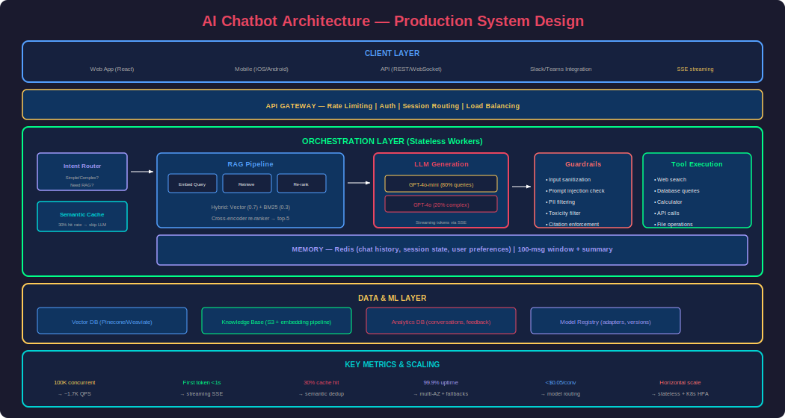
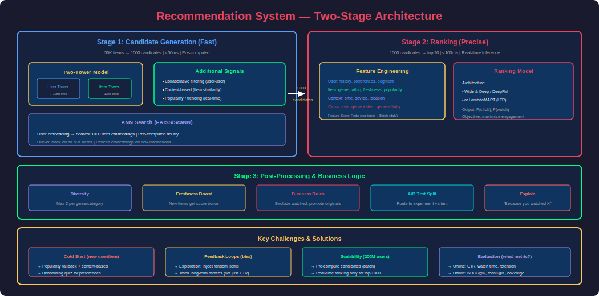
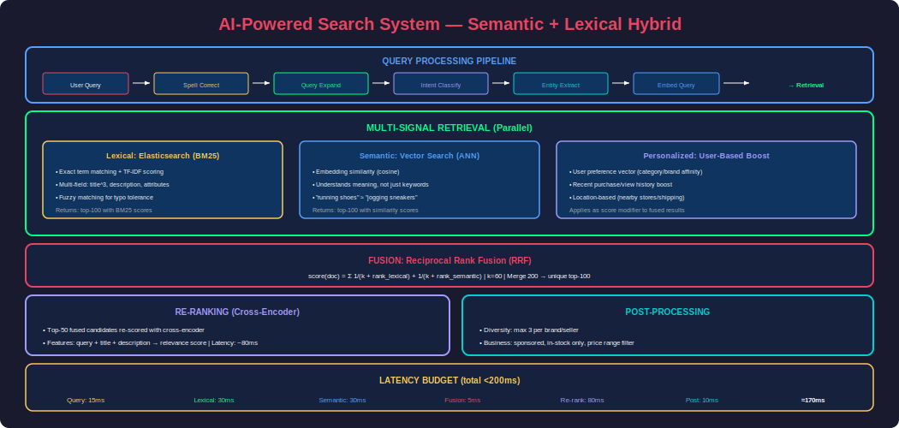

# Phase 28 — AI System Design

## Overview

AI System Design is the discipline of architecting end-to-end AI-powered applications that are scalable, reliable, cost-efficient, and maintainable in production. It combines **ML knowledge** (models, embeddings, inference) with **systems engineering** (distributed systems, databases, caching, load balancing) to solve real-world problems at scale.

This is the most important skill for senior AI/ML engineering interviews at FAANG companies. You'll be asked questions like: "Design an AI chatbot for 10M users," "Design a recommendation system for a streaming service," or "Design a real-time fraud detection system." The interviewer evaluates not just your ML knowledge, but your ability to reason about trade-offs, scalability, cost, and failure modes.

This phase covers: a systematic framework for AI system design, and complete architectures for chatbots, recommendation systems, search engines, document processing, and real-time inference systems.

---

## 1. AI System Design Framework


### The 7-Step Framework

Use this for every system design interview:

| Step | What To Cover | Time (45 min) |
|---|---|---|
| **1. Clarify Requirements** | Functional + non-functional, scale, latency | 3-5 min |
| **2. Define Metrics** | Business metrics + ML metrics + system metrics | 2-3 min |
| **3. High-Level Architecture** | Components, data flow, major services | 5-7 min |
| **4. Data Pipeline** | Collection, storage, features, labeling | 5-7 min |
| **5. ML Model Design** | Model choice, training, inference | 8-10 min |
| **6. Serving & Infrastructure** | APIs, scaling, caching, deployment | 8-10 min |
| **7. Monitoring & Iteration** | Drift, A/B testing, feedback loops | 3-5 min |

### Non-Functional Requirements Checklist

```
Scale:      How many users? QPS? Data volume?
Latency:    Real-time (<100ms)? Near-real-time (<1s)? Batch (hours)?
Availability: 99.9%? 99.99%? What happens on failure?
Cost:       Budget constraints? Cost per prediction?
Privacy:    PII handling? Data residency? GDPR?
Freshness:  How often does data/model need updating?
```

---

## 2. Design: AI Chatbot System



### Requirements

- **Users**: 10M monthly active, 100K concurrent
- **Latency**: First token in <1s, full response in <5s
- **Features**: Multi-turn conversations, knowledge base access, tool use
- **Availability**: 99.9% uptime
- **Cost**: <$0.05 per conversation on average

### Architecture

```
┌─────────────────────────────────────────────────────────────────┐
│                        CLIENT LAYER                               │
│  Web App / Mobile App / API                                       │
│  (WebSocket for streaming, REST for non-streaming)               │
└───────────────────────────┬─────────────────────────────────────┘
                            │
┌───────────────────────────▼─────────────────────────────────────┐
│                      API GATEWAY                                  │
│  Rate limiting, auth, request routing, session management         │
└───────────────────────────┬─────────────────────────────────────┘
                            │
┌───────────────────────────▼─────────────────────────────────────┐
│                   ORCHESTRATION LAYER                             │
│                                                                   │
│  ┌──────────┐  ┌──────────────┐  ┌─────────────┐              │
│  │  Router  │→│  RAG Pipeline  │→│   LLM Call   │→ Response    │
│  │(classify)│  │(retrieve docs)│  │(generate)    │              │
│  └──────────┘  └──────────────┘  └─────────────┘              │
│       │              │                    │                       │
│       │         ┌────▼────┐         ┌────▼────┐                │
│       │         │Vector DB│         │ Tools   │                 │
│       │         │(Pinecone)│        │(search, │                 │
│       │         └─────────┘         │ DB, API)│                 │
│       │                              └─────────┘                │
│  ┌────▼────────────────────────────────────────────┐           │
│  │           MEMORY LAYER (Redis)                    │           │
│  │  Chat history, session state, user preferences    │           │
│  └───────────────────────────────────────────────────┘          │
└─────────────────────────────────────────────────────────────────┘
                            │
┌───────────────────────────▼─────────────────────────────────────┐
│                    DATA & ML LAYER                                │
│  ┌──────────┐  ┌──────────────┐  ┌─────────────────┐          │
│  │Embedding │  │  Knowledge   │  │  Fine-Tuned     │          │
│  │Pipeline  │  │  Base (docs) │  │  Model Registry │          │
│  └──────────┘  └──────────────┘  └─────────────────┘          │
└─────────────────────────────────────────────────────────────────┘
```

### Key Design Decisions

| Decision | Choice | Reasoning |
|---|---|---|
| **LLM** | GPT-4o-mini (default) + GPT-4o (complex) | Cost optimization via routing |
| **Retrieval** | Hybrid (vector + BM25) with re-ranking | Best retrieval quality |
| **Memory** | Redis with 100-message window + summary | Fast, persistent, scalable |
| **Streaming** | WebSocket + SSE | Real-time token delivery |
| **Caching** | Semantic cache (Redis + embeddings) | ~30% cost reduction |
| **Guardrails** | Input sanitization + output filtering | Safety + compliance |
| **Scaling** | Horizontal (stateless workers) + auto-scale | Handle traffic spikes |

### Scaling Calculations

```
Users: 10M MAU, 100K concurrent, 5 messages/session avg
QPS: 100K concurrent × 5 msg / 300s avg session = ~1,667 QPS
Token budget: 1,667 QPS × 500 tokens avg = 833K tokens/second

Model routing: 80% to gpt-4o-mini, 20% to gpt-4o
Cost estimate:
  - mini: 1,333 QPS × 500 tok × $0.60/1M = $0.40/sec = $1,036K/month
  - 4o:   334 QPS × 800 tok × $10/1M = $2.67/sec = $6,917K/month
  - TOTAL: ~$8M/month at full scale (need caching + optimization)

With 30% cache hit rate: ~$5.6M/month
With model distillation (fine-tuned 7B for 60% of queries): ~$2M/month
```

### Failure Modes & Mitigations

| Failure | Impact | Mitigation |
|---|---|---|
| LLM API down | All responses fail | Fallback to cached responses + "try again" |
| Vector DB slow | RAG latency spikes | Circuit breaker, degrade to non-RAG response |
| Redis failure | Lost conversation history | Persistent backup (DynamoDB), graceful degradation |
| Token budget exceeded | Cost overrun | Per-user rate limits, shorter context |
| Hallucination | Wrong information served | Guardrails, confidence thresholds, citations |

---

## 3. Design: Recommendation System



### Requirements (e.g., Netflix/Spotify)

- **Users**: 200M, personalized recommendations
- **Catalog**: 50K items (movies/songs/products)
- **Latency**: Homepage recommendations <200ms
- **Freshness**: New items appear within 1 hour
- **Offline training**: Daily retraining

### Architecture: Two-Stage Recommender

```
Stage 1: CANDIDATE GENERATION (fast, low precision)
  - Retrieve 1000 candidates from 50K catalog
  - Methods: collaborative filtering, content-based, popularity
  - Latency: <50ms (pre-computed, cached)

Stage 2: RANKING (slow, high precision)
  - Score 1000 candidates with ML model
  - Features: user history, item attributes, context
  - Rank and return top 20
  - Latency: <100ms (real-time inference)

Stage 3: POST-PROCESSING
  - Diversity: ensure variety (not all same genre)
  - Business rules: promote new releases, exclude watched
  - A/B test allocation
```

### ML Models

```python
# Stage 1: Candidate Generation
# Two-Tower Model (embed users and items into same space)

class TwoTowerModel:
    """
    User tower: user_id → user embedding (128d)
    Item tower: item_id → item embedding (128d)
    Retrieve: nearest items to user in embedding space
    """
    def __init__(self):
        self.user_tower = UserEncoder(output_dim=128)
        self.item_tower = ItemEncoder(output_dim=128)
    
    def get_candidates(self, user_id, top_k=1000):
        user_emb = self.user_tower(user_id)
        # ANN search in pre-computed item embeddings
        candidates = faiss_index.search(user_emb, k=top_k)
        return candidates

# Stage 2: Ranking Model
# Wide & Deep / DeepFM / DLRM

class RankingModel:
    """
    Input features:
      - User: age, gender, watch_history, avg_session_duration
      - Item: genre, release_year, avg_rating, popularity
      - Context: time_of_day, device, day_of_week
      - Cross: user_genre_affinity × item_genre
    
    Output: P(user clicks/watches item)
    """
    def rank(self, user_features, item_features, context):
        scores = self.model.predict(features)
        return sorted(zip(items, scores), key=lambda x: -x[1])
```

### Feature Store Design

```
REAL-TIME FEATURES (Redis, <5ms):
  - user_last_5_interactions
  - user_session_duration
  - item_trending_score (updated every 5 min)

BATCH FEATURES (computed daily, served from Redis):
  - user_genre_affinity_vector (128d)
  - item_collaborative_score
  - user_lifetime_value_segment

STREAMING FEATURES (Kafka → Flink → Redis):
  - user_click_count_last_hour
  - item_impression_count_today
```

### A/B Testing Framework

```python
class ABTestRouter:
    def __init__(self):
        self.experiments = {
            "ranking_v2": {"control": 0.5, "treatment": 0.5},
            "new_diversity_algo": {"control": 0.9, "treatment": 0.1},
        }
    
    def get_variant(self, user_id: str, experiment: str) -> str:
        # Deterministic hash for consistent assignment
        hash_val = hash(f"{user_id}:{experiment}") % 100
        cumulative = 0
        for variant, pct in self.experiments[experiment].items():
            cumulative += pct * 100
            if hash_val < cumulative:
                return variant
        return "control"
    
    def log_event(self, user_id, experiment, variant, event_type, metadata):
        """Log impressions, clicks, watches for analysis."""
        analytics.track({
            "user_id": user_id,
            "experiment": experiment,
            "variant": variant,
            "event": event_type,  # "impression", "click", "watch_30s", "watch_complete"
            "timestamp": datetime.now(),
            **metadata
        })
```

---

## 4. Design: AI-Powered Search System



### Requirements (e.g., E-commerce Semantic Search)

- **Catalog**: 50M products
- **QPS**: 10K search queries/second
- **Latency**: Results in <200ms
- **Features**: Semantic understanding, typo tolerance, filters, personalization

### Architecture

```
Query → Query Understanding → Retrieval → Ranking → Post-Processing → Results

Query Understanding:
  - Spell correction ("ipohne" → "iphone")
  - Query expansion (synonyms: "laptop" → "notebook computer")
  - Intent classification (navigational vs informational vs transactional)
  - Entity extraction (brand, category, attributes)

Retrieval (Multi-Signal):
  - Lexical: Elasticsearch BM25 (exact term matching)
  - Semantic: Vector search (embedding similarity)
  - Personalized: User history-based boost
  - → Merge via Reciprocal Rank Fusion

Ranking:
  - LTR (Learning-to-Rank) model
  - Features: BM25 score, vector score, click-through rate, conversion rate
  - Model: LambdaMART / neural ranker

Post-Processing:
  - Diversity (don't show 10 of the same brand)
  - Business rules (sponsored results, stock availability)
  - Personalization boost (favorite categories/brands)
```

### Implementation Highlights

```python
class SearchPipeline:
    def __init__(self):
        self.spell_checker = SpellChecker()
        self.embedder = SentenceTransformer("all-MiniLM-L6-v2")
        self.es_client = Elasticsearch()
        self.vector_db = Qdrant()
        self.ranker = CrossEncoder("cross-encoder/ms-marco-MiniLM-L-6-v2")
    
    def search(self, query: str, user_id: str, filters: dict, top_k: int = 20):
        # 1. Query understanding
        corrected_query = self.spell_checker.correct(query)
        query_embedding = self.embedder.encode(corrected_query)
        
        # 2. Multi-signal retrieval
        # Lexical (BM25)
        bm25_results = self.es_client.search(
            index="products",
            query={"multi_match": {"query": corrected_query, "fields": ["title^3", "description"]}},
            size=100
        )
        
        # Semantic (vector)
        vector_results = self.vector_db.search(
            collection="products",
            query_vector=query_embedding,
            limit=100,
            query_filter=self._build_filter(filters)
        )
        
        # 3. Fusion
        candidates = self.reciprocal_rank_fusion(bm25_results, vector_results)
        
        # 4. Re-ranking
        pairs = [[corrected_query, c["title"] + " " + c["description"]] for c in candidates[:50]]
        scores = self.ranker.predict(pairs)
        
        ranked = sorted(zip(candidates[:50], scores), key=lambda x: -x[1])
        
        # 5. Personalization boost
        user_prefs = self.get_user_preferences(user_id)
        final = self.apply_personalization(ranked, user_prefs)
        
        return final[:top_k]
```

---

## 5. Design: Real-Time Fraud Detection

### Requirements

- **Transactions**: 10K/second (payment processor)
- **Latency**: Decision in <100ms (block before authorization)
- **Accuracy**: >99.5% legitimate approved, <0.1% false positive rate
- **Adaptation**: New fraud patterns detected within hours

### Architecture

```
Transaction Event (Kafka)
    │
    ├─→ Feature Enrichment (real-time)
    │     • user_transactions_last_hour
    │     • device_fingerprint_match
    │     • geo_velocity (km/h since last txn)
    │     • merchant_risk_score
    │
    ├─→ Model Ensemble Scoring (<50ms)
    │     • XGBoost (tabular features) → score₁
    │     • Neural network (sequence of transactions) → score₂
    │     • Rule engine (hard rules) → score₃
    │     • Combined: weighted_score = 0.5×s₁ + 0.3×s₂ + 0.2×s₃
    │
    ├─→ Decision Engine
    │     • score > 0.95 → BLOCK (auto-decline)
    │     • score 0.7-0.95 → CHALLENGE (3D Secure / OTP)
    │     • score < 0.7 → APPROVE
    │
    └─→ Feedback Loop
          • Chargebacks (delayed ground truth, ~30 days)
          • Manual reviews → labels
          • Retrain weekly with new fraud patterns
```

### Key Challenges

| Challenge | Solution |
|---|---|
| Class imbalance (0.1% fraud) | SMOTE, focal loss, stratified sampling |
| Concept drift (new fraud patterns) | Weekly retraining, online learning for rules |
| Latency constraint (<100ms) | Pre-compute features, lightweight models |
| False positives (block legitimate users) | Multi-threshold: block/challenge/approve |
| Adversarial attacks (fraudsters adapt) | Ensemble (harder to fool), anomaly detection |

---

## 6. Design: AI Document Processing

### Requirements (e.g., Insurance Claims, Legal Contracts)

- **Volume**: 100K documents/day
- **Types**: PDFs, scanned images, emails
- **Tasks**: Classification, entity extraction, summarization
- **Accuracy**: 95%+ on extraction, human review for low confidence

### Pipeline

```
Document Intake → OCR/Parse → Classification → Extraction → Validation → Output

1. INTAKE: S3 bucket, email ingestion, API upload
2. OCR/PARSE: 
   - Digital PDFs: PyPDF2 / pdfplumber
   - Scanned: AWS Textract / Google Document AI / Tesseract
   - Emails: structured parsing
3. CLASSIFICATION: 
   - Type: invoice / contract / claim / correspondence
   - Priority: urgent / normal / low
   - Model: fine-tuned BERT classifier
4. EXTRACTION:
   - Named entities: amounts, dates, names, addresses
   - Table extraction: line items, totals
   - Model: LayoutLM / Donut / GPT-4V for complex layouts
5. VALIDATION:
   - Confidence thresholds: >0.9 auto-approve, <0.7 human review
   - Cross-field validation (total = sum of line items)
   - Business rules (amount within policy limits)
6. OUTPUT:
   - Structured JSON → downstream systems
   - Audit trail for compliance
```

---

## 7. System Design Interview Template

```markdown
## [System Name] Design

### 1. Requirements
- Functional: [what it does]
- Non-functional: scale, latency, availability, cost
- Constraints: [privacy, compliance, budget]

### 2. Metrics
- Business: [revenue impact, user engagement]
- ML: [accuracy, precision, recall, NDCG]
- System: [latency p99, throughput, error rate]

### 3. High-Level Architecture
- [Diagram of major components]
- Data flow from input to output

### 4. Data Pipeline
- Sources, storage, feature engineering
- Online vs offline features
- Labeling strategy

### 5. ML Model
- Model architecture choice + justification
- Training: data, frequency, infrastructure
- Inference: batch vs real-time, hardware

### 6. Serving & Scale
- API design, deployment, caching
- Scaling strategy (horizontal, sharding)
- Failure modes and mitigations

### 7. Monitoring & Iteration
- What to monitor (drift, quality, cost)
- A/B testing strategy
- Feedback loops for continuous improvement
```

---

## Interview Mastery

### Beginner Questions

**Q1: What is the difference between system design for AI vs traditional software?**

**A:** Traditional system design focuses on deterministic operations: CRUD, transactions, caching. AI system design adds: (1) **Non-determinism** — models can give wrong answers; you need quality monitoring and fallbacks. (2) **Data dependencies** — model quality depends on data quality; you need data pipelines and feature stores. (3) **Training/serving skew** — model trained on different distribution than production; need drift detection. (4) **Cost per query** — ML inference (especially LLMs) has non-trivial per-request cost. (5) **Feedback loops** — user behavior affects future training data (can cause bias amplification).

---

### Intermediate Questions

**Q2: Design a semantic search system for 50M products with <200ms latency.**

**A:** 
- **Query understanding**: Spell correction + query expansion + intent classification
- **Retrieval**: Hybrid (Elasticsearch BM25 + vector DB), top-100 candidates each, fused via RRF
- **Ranking**: Cross-encoder re-ranker on top-50 fused results
- **Personalization**: Boost by user preference vector (category/brand affinity)
- **Scaling**: Shard products by category across 10 Elasticsearch nodes + 5 Qdrant shards. Replicate for read throughput. Cache popular queries (Redis, 30% hit rate)
- **Latency budget**: Query understanding (20ms) + Retrieval (50ms) + Ranking (80ms) + Post-processing (20ms) = ~170ms
- **Freshness**: New products indexed within 15 min via streaming pipeline

---

### Advanced Questions

**Q3: Design a recommendation system for 200M users and 50K items.**

**A:**

**Two-stage architecture:**
1. **Candidate generation** (offline + real-time):
   - Two-tower model: embed users and items into 128-d space
   - ANN search: user embedding → top-1000 items (pre-computed hourly)
   - Real-time signals: trending items, recently added
   
2. **Ranking** (real-time, <100ms):
   - Neural ranker with features: user history, item attributes, context
   - Feature store: Redis (real-time) + batch features (daily)
   - Score 1000 candidates → return top-20

3. **Post-processing**: Diversity, freshness boost, business rules

**Key decisions:**
- Cold start: popularity-based + content-based for new users/items
- Feature store: Feast with Redis online store
- Training: daily batch (collaborative filtering) + hourly incremental (trending)
- A/B testing: 10% traffic to experimental model, track watch-time / click-through

---

**Q4: Design a real-time fraud detection system handling 10K TPS with <100ms latency.**

**A:**

**Architecture:** Event-driven (Kafka → Flink → Model → Decision)

**Feature engineering** (must be <20ms):
- Pre-computed (Redis): user risk score, merchant risk score, device trust score
- Real-time (Flink): transactions in last hour, geo-velocity, time since last txn
- Static: user account age, historical chargeback rate

**Model ensemble:**
- XGBoost on tabular features (fast, interpretable)
- LSTM on transaction sequences (captures temporal patterns)
- Rule engine (hard blocks: impossible geo-velocity, known fraud patterns)
- Combined score: weighted average

**Decision engine:**
- >0.95: Auto-block (immediate decline)
- 0.7-0.95: Challenge (3D Secure, step-up auth)
- <0.7: Approve

**Challenges:**
- Class imbalance (0.1% fraud): Focal loss, stratified sampling
- Latency: Pre-compute everything possible, keep model small
- Adaptation: Weekly retrain with new chargebacks, daily rule updates
- False positives: Track and optimize for user experience (don't block good users)

---

**Q5: You're designing an AI chatbot and the CEO asks: "Why is it so expensive?" Walk through your cost optimization strategy.**

**A:**

**Current cost drivers (ranked):**
1. LLM API tokens (80% of cost)
2. Embedding generation for RAG (10%)
3. Vector DB hosting (5%)
4. Compute infrastructure (5%)

**Optimization strategy (in order of impact):**

1. **Semantic caching** (30% savings): Cache responses to semantically similar queries. If cosine similarity > 0.95 to a cached query, return cached response.

2. **Model routing** (40% savings): Classify query complexity → route simple queries to GPT-4o-mini ($0.15/1M tokens) and only complex queries to GPT-4o ($2.50/1M tokens). 80% of queries are simple.

3. **Fine-tuned small model** (60% savings): Train a 7B model on your most common 1000 query patterns. Serve with vLLM on a single GPU. Handles 60% of traffic at 10x lower cost.

4. **Context optimization**: Reduce chunk count (5→3), shorten system prompts, use prompt compression (LLMLingua).

5. **Batch non-urgent requests**: For internal tools, batch similar queries and process together.

**Result**: $8M/month → ~$2M/month with all optimizations applied.

---

[Download This File](#)
