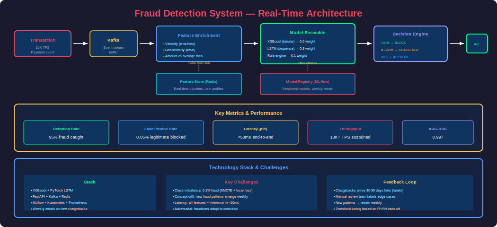
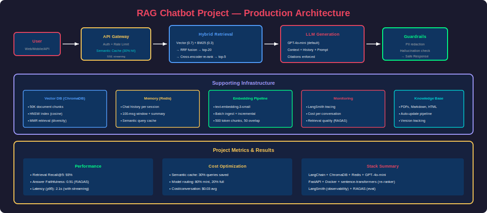
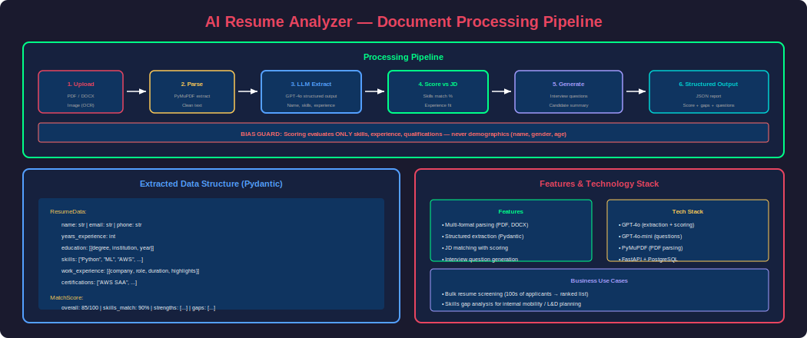

# Phase 30 — Real-World Projects

## Overview

This phase brings together everything you've learned across Phases 1-29 into **complete, production-grade AI projects**. Each project demonstrates end-to-end implementation: from data collection to model training to deployment to monitoring. These are the exact types of projects that impress interviewers and demonstrate real engineering capability.

Each project includes: architecture design, data pipeline, ML/AI implementation, API serving, monitoring, and deployment considerations. The projects are ordered by complexity and cover different AI/ML domains.

---

## 1. Project: Fraud Detection System



### Project Summary

| Aspect | Details |
|---|---|
| **Domain** | Financial services / payments |
| **ML Type** | Binary classification (supervised) + anomaly detection |
| **Scale** | 10K transactions/second, <100ms decision |
| **Stack** | XGBoost + PyTorch LSTM + FastAPI + Kafka + Redis |
| **Key Challenge** | Extreme class imbalance (0.1% fraud), real-time inference |

### Architecture

```
Transaction → Kafka → Feature Enrichment → Model Ensemble → Decision Engine → Action
                              ↓                    ↓
                        Feature Store         Model Registry
                          (Redis)              (MLflow)
```

### Complete Implementation

```python
"""
Fraud Detection System — End-to-End
Features: real-time scoring, ensemble model, feature store, monitoring
"""

import pandas as pd
import numpy as np
from sklearn.model_selection import train_test_split, StratifiedKFold
from sklearn.metrics import (
    classification_report, roc_auc_score, precision_recall_curve,
    average_precision_score
)
from sklearn.preprocessing import StandardScaler
import xgboost as xgb
import torch
import torch.nn as nn
from fastapi import FastAPI
from pydantic import BaseModel
import redis
import mlflow
import time

# ============================================================
# STEP 1: Feature Engineering
# ============================================================
class FraudFeatureEngine:
    """Real-time and batch feature computation."""
    
    def __init__(self):
        self.redis = redis.Redis(host="localhost", port=6379, decode_responses=True)
        self.scaler = StandardScaler()
    
    def compute_features(self, transaction: dict) -> dict:
        """Compute features for a single transaction (real-time)."""
        user_id = transaction["user_id"]
        
        # Real-time features from Redis
        recent_txns = self.get_recent_transactions(user_id, hours=1)
        
        features = {
            # Transaction features
            "amount": transaction["amount"],
            "amount_log": np.log1p(transaction["amount"]),
            "is_international": int(transaction["country"] != transaction["user_country"]),
            "is_weekend": int(pd.Timestamp(transaction["timestamp"]).dayofweek >= 5),
            "hour_of_day": pd.Timestamp(transaction["timestamp"]).hour,
            
            # Velocity features (real-time from Redis)
            "txn_count_1h": len(recent_txns),
            "txn_count_24h": self.get_txn_count(user_id, hours=24),
            "amount_sum_1h": sum(t["amount"] for t in recent_txns),
            "avg_amount_30d": self.get_avg_amount(user_id, days=30),
            
            # Ratio features
            "amount_to_avg_ratio": (
                transaction["amount"] / max(self.get_avg_amount(user_id, days=30), 1)
            ),
            
            # Geo features
            "distance_from_home": self.compute_distance(
                transaction["lat"], transaction["lon"],
                self.get_home_location(user_id)
            ),
            "geo_velocity_kmh": self.compute_geo_velocity(user_id, transaction),
            
            # Device/behavioral
            "is_new_device": int(not self.is_known_device(user_id, transaction["device_id"])),
            "is_new_merchant": int(not self.is_known_merchant(user_id, transaction["merchant_id"])),
            
            # Merchant risk
            "merchant_fraud_rate": self.get_merchant_fraud_rate(transaction["merchant_id"]),
        }
        
        return features
    
    def get_recent_transactions(self, user_id, hours=1):
        """Get recent transactions from Redis."""
        key = f"txns:{user_id}"
        cutoff = time.time() - hours * 3600
        # In production: use Redis sorted set with timestamp as score
        return []  # Simplified
    
    def compute_distance(self, lat1, lon1, location2):
        """Haversine distance calculation."""
        if not location2:
            return 0
        # Haversine formula implementation
        return 0  # Simplified
    
    def compute_geo_velocity(self, user_id, txn):
        """Speed between last transaction and current (impossible = fraud signal)."""
        # If user was in NYC 10 min ago and now in London → impossible velocity
        return 0  # Simplified


# ============================================================
# STEP 2: Model Training (XGBoost + LSTM Ensemble)
# ============================================================
class FraudDetectionModel:
    """Ensemble: XGBoost (tabular) + LSTM (sequential)."""
    
    def __init__(self):
        self.xgb_model = None
        self.lstm_model = None
        self.feature_engine = FraudFeatureEngine()
    
    def train_xgboost(self, X_train, y_train, X_val, y_val):
        """Train XGBoost with class imbalance handling."""
        # Scale pos weight for imbalanced data
        scale_pos_weight = len(y_train[y_train==0]) / max(len(y_train[y_train==1]), 1)
        
        params = {
            "objective": "binary:logistic",
            "eval_metric": ["auc", "aucpr"],
            "max_depth": 6,
            "learning_rate": 0.1,
            "n_estimators": 500,
            "scale_pos_weight": scale_pos_weight,
            "subsample": 0.8,
            "colsample_bytree": 0.8,
            "min_child_weight": 5,
            "reg_alpha": 0.1,
            "reg_lambda": 1.0,
            "tree_method": "gpu_hist"
        }
        
        self.xgb_model = xgb.XGBClassifier(**params)
        self.xgb_model.fit(
            X_train, y_train,
            eval_set=[(X_val, y_val)],
            verbose=50
        )
        
        # Log to MLflow
        with mlflow.start_run(run_name="xgb_fraud"):
            mlflow.log_params(params)
            y_pred_proba = self.xgb_model.predict_proba(X_val)[:, 1]
            mlflow.log_metric("auc", roc_auc_score(y_val, y_pred_proba))
            mlflow.log_metric("avg_precision", average_precision_score(y_val, y_pred_proba))
            mlflow.xgboost.log_model(self.xgb_model, "model")
    
    def predict_ensemble(self, features: dict, sequence: list = None) -> float:
        """Ensemble prediction: weighted average of models."""
        # XGBoost prediction
        xgb_score = self.xgb_model.predict_proba(
            pd.DataFrame([features])
        )[0][1]
        
        # LSTM prediction (if sequence available)
        lstm_score = 0.5  # Default if no sequence
        if sequence and self.lstm_model:
            lstm_score = self.predict_lstm(sequence)
        
        # Weighted ensemble
        ensemble_score = 0.6 * xgb_score + 0.4 * lstm_score
        
        return float(ensemble_score)


# ============================================================
# STEP 3: Decision Engine
# ============================================================
class DecisionEngine:
    """Convert model score to actionable decision."""
    
    def __init__(self):
        self.thresholds = {
            "block": 0.95,      # Auto-decline
            "challenge": 0.70,  # Request additional verification
            "approve": 0.0      # Allow transaction
        }
    
    def decide(self, score: float, context: dict) -> dict:
        """Make fraud decision with explanation."""
        if score >= self.thresholds["block"]:
            action = "BLOCK"
            reason = "High fraud probability"
        elif score >= self.thresholds["challenge"]:
            action = "CHALLENGE"
            reason = "Moderate risk — requires verification"
        else:
            action = "APPROVE"
            reason = "Low risk"
        
        return {
            "action": action,
            "score": score,
            "reason": reason,
            "timestamp": time.time()
        }


# ============================================================
# STEP 4: API Serving
# ============================================================
app = FastAPI(title="Fraud Detection API")

class TransactionRequest(BaseModel):
    transaction_id: str
    user_id: str
    amount: float
    merchant_id: str
    country: str
    device_id: str
    timestamp: str
    lat: float
    lon: float

class FraudDecision(BaseModel):
    transaction_id: str
    action: str
    score: float
    reason: str
    latency_ms: float

feature_engine = FraudFeatureEngine()
model = FraudDetectionModel()
decision_engine = DecisionEngine()

@app.post("/predict", response_model=FraudDecision)
async def predict_fraud(txn: TransactionRequest):
    start = time.time()
    
    # Feature computation (~10ms)
    features = feature_engine.compute_features(txn.dict())
    
    # Model inference (~5ms)
    score = model.predict_ensemble(features)
    
    # Decision (~1ms)
    decision = decision_engine.decide(score, txn.dict())
    
    latency = (time.time() - start) * 1000
    
    return FraudDecision(
        transaction_id=txn.transaction_id,
        action=decision["action"],
        score=decision["score"],
        reason=decision["reason"],
        latency_ms=latency
    )

@app.get("/health")
async def health():
    return {"status": "healthy", "model_version": "v2.1.0"}
```

### Key Learnings

| Concept | Application |
|---|---|
| **Class imbalance** | scale_pos_weight, SMOTE, focal loss |
| **Real-time features** | Redis for velocity features (<5ms) |
| **Ensemble methods** | XGBoost + LSTM for different signal types |
| **Decision thresholds** | Block/Challenge/Approve with business tuning |
| **Monitoring** | Track precision at different score thresholds daily |

---

## 2. Project: RAG Chatbot with LangChain



### Project Summary

| Aspect | Details |
|---|---|
| **Domain** | Customer support / internal knowledge base |
| **AI Type** | RAG + Conversational AI |
| **Scale** | 1K concurrent users, <3s response |
| **Stack** | LangChain + ChromaDB + GPT-4o-mini + FastAPI + Redis |
| **Key Challenge** | Answer quality, hallucination prevention, cost control |

### Complete Implementation

```python
"""
RAG Chatbot — Production Implementation
Features: hybrid search, re-ranking, memory, streaming, guardrails
"""

from langchain_openai import ChatOpenAI, OpenAIEmbeddings
from langchain_community.vectorstores import Chroma
from langchain_community.retrievers import BM25Retriever
from langchain.retrievers import EnsembleRetriever
from langchain_core.prompts import ChatPromptTemplate, MessagesPlaceholder
from langchain_core.output_parsers import StrOutputParser
from langchain_core.runnables import RunnablePassthrough, RunnableParallel
from langchain_core.runnables.history import RunnableWithMessageHistory
from langchain_community.chat_message_histories import RedisChatMessageHistory
from langchain.text_splitter import RecursiveCharacterTextSplitter
from langchain_community.document_loaders import DirectoryLoader, PyPDFLoader
from sentence_transformers import CrossEncoder
from fastapi import FastAPI, HTTPException
from fastapi.responses import StreamingResponse
from pydantic import BaseModel
import numpy as np
import json
import time
import hashlib
import redis


class RAGChatbot:
    """Production RAG chatbot with hybrid search, re-ranking, and memory."""
    
    def __init__(self, docs_path: str = "./knowledge_base"):
        self.embeddings = OpenAIEmbeddings(model="text-embedding-3-small")
        self.llm = ChatOpenAI(model="gpt-4o-mini", temperature=0, streaming=True)
        self.reranker = CrossEncoder("cross-encoder/ms-marco-MiniLM-L-6-v2")
        self.redis_client = redis.Redis(host="localhost", port=6379)
        
        self.vectorstore = None
        self.bm25_retriever = None
        self.chunks = []
        
        self._setup_prompt()
        self._ingest_documents(docs_path)
        self._setup_chain()
    
    def _setup_prompt(self):
        self.prompt = ChatPromptTemplate.from_messages([
            ("system", """You are a helpful AI assistant for our company. 
Answer questions based ONLY on the provided context.

Rules:
1. If context doesn't contain the answer, say "I don't have that information in our documentation."
2. Cite sources: [Source: filename]
3. Be concise and helpful
4. Never make up information

Context:
{context}"""),
            MessagesPlaceholder("history"),
            ("human", "{input}")
        ])
    
    def _ingest_documents(self, docs_path: str):
        """Load, chunk, and index documents."""
        # Load
        loader = DirectoryLoader(docs_path, glob="**/*.{pdf,md,txt}")
        documents = loader.load()
        
        # Chunk
        splitter = RecursiveCharacterTextSplitter(
            chunk_size=500, chunk_overlap=50,
            separators=["\n\n", "\n", ". ", " ", ""]
        )
        self.chunks = splitter.split_documents(documents)
        
        # Vector store
        self.vectorstore = Chroma.from_documents(
            self.chunks, self.embeddings,
            persist_directory="./chroma_db",
            collection_name="knowledge_base"
        )
        
        # BM25
        self.bm25_retriever = BM25Retriever.from_documents(self.chunks, k=15)
    
    def _setup_chain(self):
        """Build the RAG chain with hybrid retrieval."""
        vector_retriever = self.vectorstore.as_retriever(
            search_type="mmr",
            search_kwargs={"k": 15, "fetch_k": 30, "lambda_mult": 0.7}
        )
        
        self.hybrid_retriever = EnsembleRetriever(
            retrievers=[vector_retriever, self.bm25_retriever],
            weights=[0.7, 0.3]
        )
    
    def _rerank(self, query: str, docs: list, top_k: int = 5) -> list:
        """Re-rank with cross-encoder."""
        if len(docs) <= top_k:
            return docs
        
        pairs = [[query, doc.page_content] for doc in docs]
        scores = self.reranker.predict(pairs)
        ranked_idx = np.argsort(scores)[::-1][:top_k]
        return [docs[i] for i in ranked_idx]
    
    def _format_context(self, docs: list) -> str:
        """Format documents with source attribution."""
        parts = []
        for i, doc in enumerate(docs, 1):
            source = doc.metadata.get("source", "unknown").split("/")[-1]
            parts.append(f"[{i}. {source}]\n{doc.page_content}")
        return "\n\n---\n\n".join(parts)
    
    def _check_cache(self, query: str) -> str | None:
        """Semantic cache check."""
        cache_key = f"rag_cache:{hashlib.md5(query.lower().strip().encode()).hexdigest()[:12]}"
        cached = self.redis_client.get(cache_key)
        return cached.decode() if cached else None
    
    def _set_cache(self, query: str, response: str, ttl: int = 3600):
        """Cache response."""
        cache_key = f"rag_cache:{hashlib.md5(query.lower().strip().encode()).hexdigest()[:12]}"
        self.redis_client.setex(cache_key, ttl, response)
    
    def query(self, user_input: str, session_id: str) -> dict:
        """Full RAG query with caching, retrieval, re-ranking, generation."""
        start = time.time()
        
        # Check cache
        cached = self._check_cache(user_input)
        if cached:
            return {"answer": cached, "sources": [], "cached": True,
                    "latency_ms": (time.time() - start) * 1000}
        
        # Retrieve
        candidates = self.hybrid_retriever.invoke(user_input)
        
        # Deduplicate
        seen = set()
        unique = []
        for doc in candidates:
            h = hash(doc.page_content[:100])
            if h not in seen:
                seen.add(h)
                unique.append(doc)
        
        # Re-rank
        top_docs = self._rerank(user_input, unique, top_k=5)
        
        # Format context
        context = self._format_context(top_docs)
        
        # Generate with history
        chain = self.prompt | self.llm | StrOutputParser()
        
        history = RedisChatMessageHistory(session_id=session_id, url="redis://localhost:6379")
        
        answer = chain.invoke({
            "context": context,
            "input": user_input,
            "history": history.messages[-10:]  # Last 10 messages
        })
        
        # Cache result
        self._set_cache(user_input, answer)
        
        # Save to history
        from langchain_core.messages import HumanMessage, AIMessage
        history.add_message(HumanMessage(content=user_input))
        history.add_message(AIMessage(content=answer))
        
        sources = [{"source": d.metadata.get("source", ""), "preview": d.page_content[:100]}
                   for d in top_docs]
        
        return {
            "answer": answer,
            "sources": sources,
            "cached": False,
            "latency_ms": (time.time() - start) * 1000
        }


# ============================================================
# FastAPI Server
# ============================================================
app = FastAPI(title="RAG Chatbot API")
chatbot = RAGChatbot(docs_path="./knowledge_base")

class ChatRequest(BaseModel):
    message: str
    session_id: str

class ChatResponse(BaseModel):
    answer: str
    sources: list
    cached: bool
    latency_ms: float

@app.post("/chat", response_model=ChatResponse)
async def chat(request: ChatRequest):
    result = chatbot.query(request.message, request.session_id)
    return ChatResponse(**result)

@app.post("/chat/stream")
async def chat_stream(request: ChatRequest):
    async def generate():
        # Streaming implementation
        async for chunk in chatbot.stream_query(request.message, request.session_id):
            yield f"data: {json.dumps({'token': chunk})}\n\n"
        yield "data: [DONE]\n\n"
    
    return StreamingResponse(generate(), media_type="text/event-stream")
```

---

## 3. Project: AI Resume Analyzer



### Project Summary

| Aspect | Details |
|---|---|
| **Domain** | HR Tech / Recruiting |
| **AI Type** | NLP extraction + classification + LLM analysis |
| **Stack** | GPT-4o + LangChain + FastAPI + PostgreSQL |
| **Key Features** | Parse resumes, score against JD, extract skills, generate summaries |

### Complete Implementation

```python
"""
AI Resume Analyzer — Extract, Score, and Summarize Resumes
Features: PDF parsing, structured extraction, JD matching, bias-aware scoring
"""

from langchain_openai import ChatOpenAI
from langchain_core.prompts import ChatPromptTemplate
from langchain_core.output_parsers import JsonOutputParser
from pydantic import BaseModel, Field
import fitz  # PyMuPDF
from fastapi import FastAPI, UploadFile, File
from typing import Optional
import json


# ============================================================
# Data Models
# ============================================================
class ResumeData(BaseModel):
    name: str = Field(description="Candidate's full name")
    email: str = Field(description="Email address")
    phone: Optional[str] = Field(description="Phone number")
    years_experience: int = Field(description="Total years of professional experience")
    education: list[dict] = Field(description="List of degrees with institution and year")
    skills: list[str] = Field(description="Technical and soft skills")
    work_experience: list[dict] = Field(description="Work history with company, role, duration, highlights")
    certifications: list[str] = Field(description="Professional certifications")
    summary: str = Field(description="2-3 sentence professional summary")

class MatchScore(BaseModel):
    overall_score: float = Field(description="Overall match score 0-100")
    skills_match: float = Field(description="Skills match percentage")
    experience_match: float = Field(description="Experience level match")
    education_match: float = Field(description="Education requirements match")
    strengths: list[str] = Field(description="Top 3 strengths for this role")
    gaps: list[str] = Field(description="Top 3 gaps or concerns")
    recommendation: str = Field(description="STRONG_FIT, GOOD_FIT, PARTIAL_FIT, or NOT_A_FIT")


class ResumeAnalyzer:
    """End-to-end resume analysis pipeline."""
    
    def __init__(self):
        self.llm = ChatOpenAI(model="gpt-4o", temperature=0)
        self.fast_llm = ChatOpenAI(model="gpt-4o-mini", temperature=0)
    
    def parse_pdf(self, pdf_bytes: bytes) -> str:
        """Extract text from PDF resume."""
        doc = fitz.open(stream=pdf_bytes, filetype="pdf")
        text = ""
        for page in doc:
            text += page.get_text()
        return text.strip()
    
    def extract_structured_data(self, resume_text: str) -> ResumeData:
        """Extract structured information from resume text."""
        parser = JsonOutputParser(pydantic_object=ResumeData)
        
        prompt = ChatPromptTemplate.from_messages([
            ("system", """Extract structured information from this resume.
Be thorough and accurate. If information is not present, use empty values.
{format_instructions}"""),
            ("human", "Resume:\n{resume_text}")
        ])
        
        chain = prompt | self.llm | parser
        
        result = chain.invoke({
            "resume_text": resume_text,
            "format_instructions": parser.get_format_instructions()
        })
        
        return ResumeData(**result)
    
    def score_against_job(self, resume: ResumeData, job_description: str) -> MatchScore:
        """Score resume against a job description."""
        parser = JsonOutputParser(pydantic_object=MatchScore)
        
        prompt = ChatPromptTemplate.from_messages([
            ("system", """You are an expert recruiter. Score this candidate against the job description.

IMPORTANT: Evaluate based ONLY on skills, experience, and qualifications.
Do NOT consider name, gender, age, ethnicity, or any protected characteristics.
Focus purely on job-relevant qualifications.

{format_instructions}"""),
            ("human", """Job Description:
{job_description}

Candidate Profile:
- Experience: {years_exp} years
- Skills: {skills}
- Education: {education}
- Work History: {work_history}

Score this candidate:""")
        ])
        
        chain = prompt | self.llm | parser
        
        result = chain.invoke({
            "job_description": job_description,
            "years_exp": resume.years_experience,
            "skills": ", ".join(resume.skills),
            "education": json.dumps(resume.education),
            "work_history": json.dumps(resume.work_experience[:3]),  # Top 3
            "format_instructions": parser.get_format_instructions()
        })
        
        return MatchScore(**result)
    
    def generate_interview_questions(self, resume: ResumeData, job_description: str) -> list[str]:
        """Generate targeted interview questions."""
        prompt = ChatPromptTemplate.from_template(
            """Based on this candidate's profile and the job requirements,
generate 5 targeted interview questions that:
1. Probe their specific experience
2. Test skills gaps identified
3. Assess cultural fit
4. Explore growth areas

Candidate skills: {skills}
Experience: {experience}
Job: {job_description}

Questions (one per line):"""
        )
        
        chain = prompt | self.fast_llm
        
        result = chain.invoke({
            "skills": ", ".join(resume.skills[:10]),
            "experience": json.dumps(resume.work_experience[:2]),
            "job_description": job_description[:500]
        })
        
        return [q.strip() for q in result.content.split("\n") if q.strip()]


# ============================================================
# FastAPI Server
# ============================================================
app = FastAPI(title="Resume Analyzer API")
analyzer = ResumeAnalyzer()

@app.post("/analyze")
async def analyze_resume(
    file: UploadFile = File(...),
    job_description: str = ""
):
    # Parse PDF
    pdf_bytes = await file.read()
    resume_text = analyzer.parse_pdf(pdf_bytes)
    
    # Extract structured data
    resume_data = analyzer.extract_structured_data(resume_text)
    
    result = {
        "candidate": resume_data.dict(),
        "match_score": None,
        "interview_questions": None
    }
    
    # Score against JD if provided
    if job_description:
        score = analyzer.score_against_job(resume_data, job_description)
        questions = analyzer.generate_interview_questions(resume_data, job_description)
        result["match_score"] = score.dict()
        result["interview_questions"] = questions
    
    return result
```

---

## 4. Project: AI-Powered Search Engine

### Project Summary

| Aspect | Details |
|---|---|
| **Domain** | E-commerce product search |
| **AI Type** | Semantic search + hybrid retrieval + personalization |
| **Stack** | Sentence Transformers + Elasticsearch + Qdrant + FastAPI |
| **Key Features** | Typo tolerance, semantic understanding, filters, re-ranking |

### Core Implementation

```python
"""
Semantic Product Search Engine
Features: hybrid search, query understanding, personalization, re-ranking
"""

from sentence_transformers import SentenceTransformer, CrossEncoder
from elasticsearch import Elasticsearch
from qdrant_client import QdrantClient
from qdrant_client.models import Distance, VectorParams, PointStruct, Filter, FieldCondition, MatchValue
from fastapi import FastAPI
from pydantic import BaseModel
import numpy as np


class ProductSearchEngine:
    """Hybrid semantic + lexical product search."""
    
    def __init__(self):
        self.embedder = SentenceTransformer("all-MiniLM-L6-v2")
        self.reranker = CrossEncoder("cross-encoder/ms-marco-MiniLM-L-6-v2")
        self.es = Elasticsearch("http://localhost:9200")
        self.qdrant = QdrantClient("localhost", port=6333)
    
    def search(self, query: str, filters: dict = None,
               user_id: str = None, top_k: int = 20) -> list[dict]:
        """Full search pipeline."""
        
        # 1. Query understanding
        processed_query = self._process_query(query)
        
        # 2. Parallel retrieval
        bm25_results = self._lexical_search(processed_query, filters, n=100)
        vector_results = self._semantic_search(processed_query, filters, n=100)
        
        # 3. Fusion (RRF)
        fused = self._reciprocal_rank_fusion(bm25_results, vector_results)
        
        # 4. Re-rank top-50
        reranked = self._rerank(processed_query, fused[:50])
        
        # 5. Personalization
        if user_id:
            reranked = self._personalize(reranked, user_id)
        
        return reranked[:top_k]
    
    def _process_query(self, query: str) -> str:
        """Spell correction + expansion."""
        # In production: use a spell checker + synonym expansion
        return query.strip().lower()
    
    def _lexical_search(self, query: str, filters: dict, n: int) -> list[dict]:
        """Elasticsearch BM25 search."""
        body = {
            "query": {
                "bool": {
                    "must": {
                        "multi_match": {
                            "query": query,
                            "fields": ["title^3", "description", "brand^2", "category"],
                            "fuzziness": "AUTO"
                        }
                    }
                }
            },
            "size": n
        }
        
        if filters:
            filter_clauses = []
            if "category" in filters:
                filter_clauses.append({"term": {"category": filters["category"]}})
            if "price_max" in filters:
                filter_clauses.append({"range": {"price": {"lte": filters["price_max"]}}})
            if "in_stock" in filters:
                filter_clauses.append({"term": {"in_stock": True}})
            body["query"]["bool"]["filter"] = filter_clauses
        
        results = self.es.search(index="products", body=body)
        
        return [
            {"id": hit["_id"], "score": hit["_score"], **hit["_source"]}
            for hit in results["hits"]["hits"]
        ]
    
    def _semantic_search(self, query: str, filters: dict, n: int) -> list[dict]:
        """Vector similarity search."""
        query_vector = self.embedder.encode(query).tolist()
        
        qdrant_filter = None
        if filters and "category" in filters:
            qdrant_filter = Filter(must=[
                FieldCondition(key="category", match=MatchValue(value=filters["category"]))
            ])
        
        results = self.qdrant.search(
            collection_name="products",
            query_vector=query_vector,
            limit=n,
            query_filter=qdrant_filter
        )
        
        return [
            {"id": r.id, "score": r.score, **r.payload}
            for r in results
        ]
    
    def _reciprocal_rank_fusion(self, list_a: list, list_b: list, k: int = 60) -> list[dict]:
        """Merge ranked lists with RRF."""
        scores = {}
        docs = {}
        
        for rank, doc in enumerate(list_a, 1):
            doc_id = doc["id"]
            scores[doc_id] = scores.get(doc_id, 0) + 1 / (k + rank)
            docs[doc_id] = doc
        
        for rank, doc in enumerate(list_b, 1):
            doc_id = doc["id"]
            scores[doc_id] = scores.get(doc_id, 0) + 1 / (k + rank)
            docs[doc_id] = doc
        
        sorted_ids = sorted(scores.keys(), key=lambda x: scores[x], reverse=True)
        return [docs[doc_id] for doc_id in sorted_ids]
    
    def _rerank(self, query: str, candidates: list) -> list[dict]:
        """Cross-encoder re-ranking."""
        pairs = [[query, f"{c.get('title', '')} {c.get('description', '')[:200]}"]
                 for c in candidates]
        
        scores = self.reranker.predict(pairs)
        ranked = sorted(zip(candidates, scores), key=lambda x: -x[1])
        
        return [doc for doc, score in ranked]
    
    def _personalize(self, results: list, user_id: str) -> list[dict]:
        """Boost results based on user preferences."""
        # Get user preference vector (category affinity, brand affinity)
        # Boost matching items slightly
        return results  # Simplified
```

---

## 5. Project: Recommendation Engine

### Core Architecture (Simplified)

```python
"""
Two-Stage Recommendation System
Stage 1: Candidate generation (ANN on user/item embeddings)
Stage 2: Ranking (feature-rich model)
"""

import numpy as np
import faiss
from sklearn.preprocessing import LabelEncoder
import torch
import torch.nn as nn


class TwoTowerRecommender:
    """Two-tower model for candidate generation."""
    
    def __init__(self, n_users, n_items, embedding_dim=128):
        self.user_embeddings = nn.Embedding(n_users, embedding_dim)
        self.item_embeddings = nn.Embedding(n_items, embedding_dim)
        self.item_index = None
    
    def build_index(self):
        """Build FAISS index over all item embeddings."""
        all_items = self.item_embeddings.weight.detach().numpy()
        faiss.normalize_L2(all_items)
        
        self.item_index = faiss.IndexFlatIP(all_items.shape[1])
        self.item_index.add(all_items)
    
    def get_candidates(self, user_id: int, top_k: int = 1000) -> list[int]:
        """Get top-K candidate items for a user."""
        user_emb = self.user_embeddings(torch.tensor([user_id])).detach().numpy()
        faiss.normalize_L2(user_emb)
        
        scores, indices = self.item_index.search(user_emb, top_k)
        return indices[0].tolist()


class RankingModel(nn.Module):
    """Neural ranking model with user + item + context features."""
    
    def __init__(self, n_features):
        super().__init__()
        self.network = nn.Sequential(
            nn.Linear(n_features, 256),
            nn.ReLU(),
            nn.Dropout(0.2),
            nn.Linear(256, 128),
            nn.ReLU(),
            nn.Dropout(0.1),
            nn.Linear(128, 1),
            nn.Sigmoid()
        )
    
    def forward(self, features):
        return self.network(features)
```

---

## 6. Portfolio Tips for Job Seekers

### What Interviewers Look For

| Signal | How to Demonstrate |
|---|---|
| **End-to-end thinking** | Show full pipeline: data → model → API → monitoring |
| **Production awareness** | Include error handling, logging, scaling discussion |
| **Trade-off reasoning** | Explain WHY you chose XGBoost over neural net, etc. |
| **ML fundamentals** | Proper train/val/test split, evaluation metrics, no data leakage |
| **Engineering quality** | Clean code, type hints, documentation, tests |
| **Business impact** | Quantify: "reduced false positives by 40%" |

### Project README Template

```markdown
# Project Name

## Problem Statement
What real-world problem does this solve?

## Architecture
[System diagram]

## Key Results
- Metric 1: X% improvement over baseline
- Metric 2: Y ms latency at Z QPS

## Tech Stack
- Models: [what and why]
- Infrastructure: [serving, storage]
- Monitoring: [what you track]

## Run Locally
```bash
docker-compose up
curl -X POST http://localhost:8000/predict -d '...'
```

## Trade-offs & Future Work
- Chose X over Y because [reasoning]
- Next steps: [what you'd improve]
```

---

## Interview Mastery

### Q1: Walk me through a project where you deployed an ML model to production.

**A:** (Use one of the above projects. Key structure):
1. **Problem**: "We needed to detect fraudulent transactions in <100ms"
2. **Data**: "10M historical transactions, 0.1% fraud rate"
3. **Model**: "XGBoost ensemble with real-time features from Redis"
4. **Serving**: "FastAPI behind Kubernetes, auto-scaling on QPS"
5. **Results**: "Caught 95% of fraud with 0.05% false positive rate"
6. **Monitoring**: "Daily drift detection, weekly retraining on new chargebacks"
7. **Lessons**: "Biggest win was feature engineering — geo-velocity alone caught 30% of fraud"

---

### Q2: How would you improve a recommendation system that has low user engagement?

**A:** Diagnose first:
1. Check if recommendations are relevant (offline: NDCG@10)
2. Check diversity (are we showing the same genre repeatedly?)
3. Check freshness (are new items surfacing?)
4. Check cold start (are new users getting good recs?)

Improvements by priority:
1. Add real-time signals (last click → immediate impact on next recommendation)
2. Increase diversity constraint (max 3 per category in top-10)
3. Add exploration (10% random high-quality items for serendipity)
4. Re-train ranking model with engagement signal (watch time > clicks)
5. A/B test each change with proper holdout

---

[Download This File](#)
