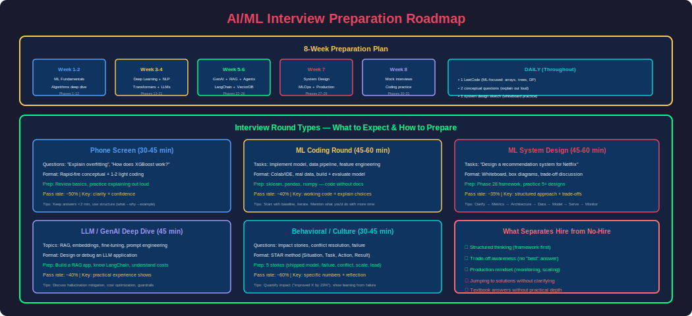
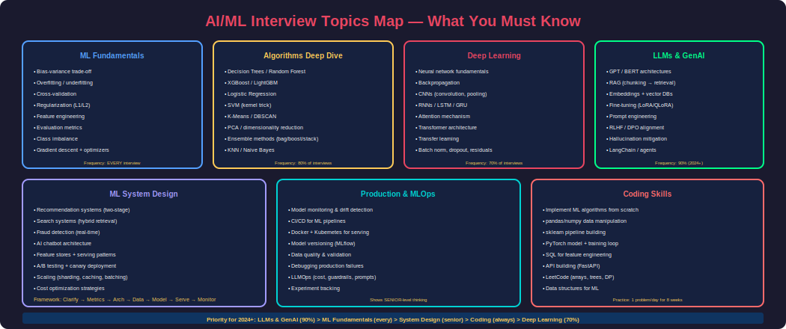
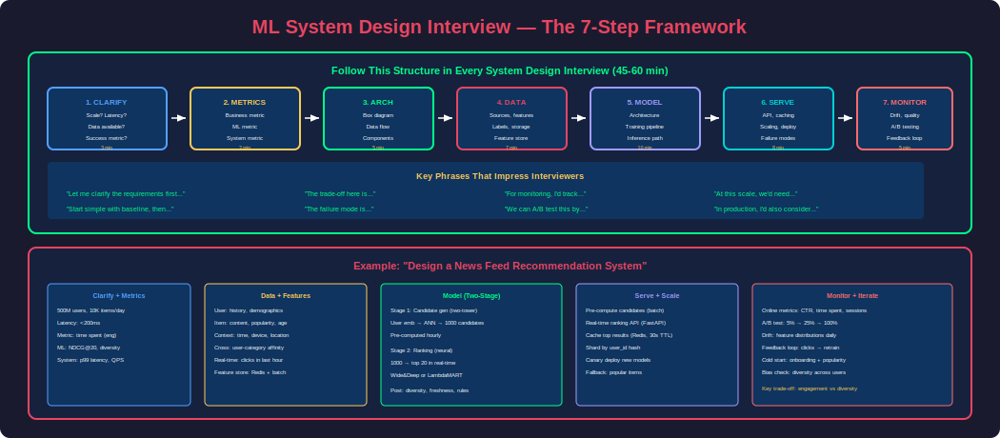

# Phase 31 — Interview Mastery

## Overview

This is the capstone phase — a comprehensive interview preparation guide that consolidates everything from Phases 1-30 into a battle-ready format. It covers the full spectrum of AI/ML interviews: conceptual questions, coding rounds, ML system design, production debugging, and behavioral questions.

The goal: **If an interviewer asks ANYTHING about AI/ML, you answer like a senior engineer who has shipped production systems.**

---

## 1. Interview Preparation Roadmap



### AI/ML Interview Types

| Round | Duration | What They Assess | How to Prepare |
|---|---|---|---|
| **Phone Screen** | 30-45 min | Fundamentals, communication | Review Phases 1-12 concepts |
| **Coding Round** | 45-60 min | ML implementation, data manipulation | LeetCode + sklearn/pandas coding |
| **ML Depth** | 45-60 min | Deep understanding of algorithms | Phase 8-12 + math intuition |
| **ML System Design** | 45-60 min | End-to-end system thinking | Phase 28 framework |
| **LLM/GenAI** | 45-60 min | Modern AI stack knowledge | Phases 19-27 |
| **Behavioral** | 30-45 min | Impact, collaboration, leadership | STAR format stories |

---

## 2. Top 50 AI/ML Interview Questions



### Fundamentals (Questions 1-10)

**Q1: Explain bias vs variance trade-off.**

**A:** Bias is error from oversimplified assumptions (underfitting) — the model misses relevant patterns. Variance is error from sensitivity to training data fluctuations (overfitting) — the model memorizes noise. The trade-off: increasing model complexity reduces bias but increases variance. Sweet spot: low enough bias to capture patterns, low enough variance to generalize.

Practical: High bias = train error high, test error high. High variance = train error low, test error high (gap). Fix high bias: more features, complex model. Fix high variance: more data, regularization, simpler model, ensemble.

---

**Q2: What is the difference between L1 and L2 regularization?**

**A:** Both add a penalty to the loss function to prevent overfitting.
- **L1 (Lasso)**: Penalty = λ × Σ|wᵢ|. Drives some weights exactly to zero → automatic feature selection (sparse model). Use when you suspect many irrelevant features.
- **L2 (Ridge)**: Penalty = λ × Σwᵢ². Shrinks all weights toward zero but never exactly zero → all features retained. Use when all features are potentially relevant.
- **Elastic Net**: Combines both (α×L1 + (1-α)×L2). Best of both worlds.

Geometric intuition: L1 constraint is a diamond (corners hit axes → zero weights). L2 constraint is a circle (no corners → no exact zeros).

---

**Q3: Explain gradient descent and its variants.**

**A:** Gradient descent minimizes a loss function by iteratively moving in the direction of steepest descent (negative gradient).

| Variant | Batch Size | Speed | Stability | Memory |
|---|---|---|---|---|
| **Batch GD** | All data | Slow | Stable | High |
| **Stochastic GD** | 1 sample | Fast per step | Noisy | Low |
| **Mini-batch GD** | 32-256 samples | Good balance | Good balance | Medium |

Optimizers improve on vanilla GD:
- **Momentum**: Accumulates velocity (escapes local minima)
- **RMSprop**: Per-parameter adaptive learning rates
- **Adam**: Momentum + RMSprop (default choice)
- **AdamW**: Adam + decoupled weight decay (preferred for transformers)

---

**Q4: How does a Random Forest work? Why is it effective?**

**A:** Random Forest is an ensemble of decision trees using bagging (bootstrap aggregation):
1. Create N trees, each trained on a random sample (with replacement) of the data
2. At each split, consider only √features (random subspace)
3. Predict by majority vote (classification) or average (regression)

Why it works: Individual trees overfit (high variance). Averaging decorrelated trees reduces variance without increasing bias. The randomness (data sampling + feature sampling) ensures trees are different → their errors are uncorrelated → averaging cancels errors.

Advantages: handles non-linear, few hyperparameters, feature importance, no scaling needed. Disadvantages: not interpretable, slow inference (many trees), can't extrapolate.

---

**Q5: Explain precision, recall, F1-score. When do you optimize for each?**

**A:**
- **Precision** = TP / (TP + FP) — "Of predicted positives, how many are correct?" Optimize when **false positives are costly** (spam filter — don't mark good email as spam).
- **Recall** = TP / (TP + FN) — "Of actual positives, how many did we find?" Optimize when **false negatives are costly** (cancer detection — don't miss a patient).
- **F1** = 2 × (P × R) / (P + R) — harmonic mean, balances both. Use when you need both and classes are imbalanced.

For imbalanced data: accuracy is misleading (99% accuracy with 99% negative class = useless). Use F1, AUC-PR, or focus on the metric that aligns with business cost.

---

**Q6: What is cross-validation and why is it important?**

**A:** Cross-validation estimates model performance on unseen data by training and evaluating on different splits of the training set.

**K-Fold CV**: Split data into K folds. Train on K-1 folds, evaluate on 1 fold. Repeat K times, average scores. Gives robust estimate + confidence interval.

Why it matters: A single train/test split is noisy — you might get lucky/unlucky. CV gives a reliable estimate. Also helps detect overfitting (low CV score = model doesn't generalize) and is essential for hyperparameter tuning (prevent tuning to one specific test set).

Stratified K-Fold: Preserves class distribution in each fold — essential for imbalanced data.

---

**Q7: Explain how XGBoost works and why it dominates tabular data.**

**A:** XGBoost is gradient-boosted decision trees:
1. Start with a base prediction (mean)
2. Compute residuals (errors) from current model
3. Train a new tree to predict the residuals
4. Add the new tree to the ensemble (scaled by learning rate)
5. Repeat — each tree corrects the previous ensemble's errors

Why it dominates: (1) Regularization built-in (L1/L2 on leaf weights); (2) Handles missing values natively; (3) Built-in feature importance; (4) Parallel tree building; (5) Column subsampling (like RF); (6) Pruning based on gain threshold.

vs Deep Learning for tabular: XGBoost wins because tabular data has few spatial/temporal patterns that CNNs/RNNs exploit. Trees naturally handle heterogeneous features, interactions, and don't need feature scaling.

---

**Q8: What is the attention mechanism? Explain self-attention.**

**A:** Attention allows a model to focus on relevant parts of the input when producing each output element. Self-attention computes attention between all positions within the same sequence.

For each token, compute:
- **Query (Q)**: "What am I looking for?"
- **Key (K)**: "What do I contain?"
- **Value (V)**: "What information do I provide?"

`Attention(Q,K,V) = softmax(QK^T / √d_k) × V`

The dot product QK^T measures relevance between each pair of positions. Softmax normalizes to attention weights. Multiply by V to get the weighted output.

Why it's revolutionary: (1) Captures long-range dependencies (unlike RNNs); (2) Parallelizable (no sequential processing); (3) Interpretable (attention weights show what the model focuses on). Foundation of all transformers (GPT, BERT, Claude).

---

**Q9: Explain how RAG works and when to use it vs fine-tuning.**

**A:** RAG retrieves relevant documents from a knowledge base and injects them into the LLM's context at query time:
1. Embed user query → search vector DB → retrieve top-K chunks
2. Format chunks as context → send to LLM with question
3. LLM generates answer grounded in retrieved documents

Use RAG when: knowledge changes frequently, need source attribution, private data, factual Q&A.
Use fine-tuning when: need consistent style/tone, domain reasoning patterns, reduce inference cost.
Use both: fine-tune for style + RAG for knowledge (best of both worlds).

---

**Q10: What is a transformer? Why did it replace RNNs?**

**A:** A transformer is an architecture based entirely on self-attention (no recurrence). It processes all positions in parallel, capturing dependencies through attention layers.

Components: (1) Multi-head self-attention — attends to all positions simultaneously; (2) Feed-forward layers — processes each position independently; (3) Positional encoding — injects sequence order information; (4) Layer normalization + residual connections — training stability.

Why it replaced RNNs: (1) **Parallelism** — RNNs are sequential (slow to train); (2) **Long-range dependencies** — attention directly connects any two positions (RNNs suffer from vanishing gradients over long sequences); (3) **Scalability** — transformers scale to billions of parameters efficiently.

---

### Deep Learning & LLMs (Questions 11-25)

**Q11: Explain LoRA fine-tuning. Why is it parameter-efficient?**

**A:** LoRA freezes the pre-trained model weights and trains two small low-rank matrices (B and A) such that ΔW = BA. For a 4096×4096 weight matrix (16.7M params), LoRA with rank=16 trains only 4096×16 + 16×4096 = 131K params (0.8%). This works because weight updates during fine-tuning have low intrinsic rank — most of the change concentrates in a small subspace. Benefits: 10-100x less memory, tiny adapter files (~30MB), can swap adapters at inference time.

---

**Q12: How does RLHF align LLMs? What is DPO?**

**A:** RLHF has 3 stages: (1) SFT — teach the model to follow instructions; (2) Reward model — train a model to predict human preferences from ranked responses; (3) PPO — optimize the policy to maximize reward while staying close to SFT model (KL penalty).

DPO simplifies this by eliminating the reward model. Given preference pairs (chosen, rejected), it directly optimizes the policy using a classification-style loss. Same result, fewer moving parts, more stable training. DPO is now the standard for open-source alignment (Llama, Zephyr).

---

**Q13: Explain embeddings. How do vector databases use them?**

**A:** Embeddings are dense numerical vectors that represent semantic meaning. Similar items have similar vectors (close in cosine distance). Generated by encoder models (sentence-transformers, OpenAI ada). Vector databases store millions of embeddings and use ANN algorithms (HNSW, IVF) to find the K most similar vectors to a query in milliseconds. This enables: semantic search, RAG, recommendations, deduplication — any "find similar things" task.

---

**Q14: Compare GPT and BERT architectures.**

**A:**
| Aspect | GPT (Decoder-only) | BERT (Encoder-only) |
|---|---|---|
| Training | Autoregressive (predict next token) | Masked language modeling (fill in blanks) |
| Attention | Causal (can't see future) | Bidirectional (sees all context) |
| Best for | Generation, reasoning, dialogue | Classification, NER, embeddings |
| Examples | GPT-4, Claude, Llama | BERT, RoBERTa, DeBERTa |
| Scaling | Scales to 100B+ parameters effectively | Typically <1B parameters |

Modern trend: decoder-only models (GPT-style) dominate because they can do everything BERT does plus generation.

---

**Q15: What causes hallucinations in LLMs? How do you mitigate them?**

**A:** Causes: (1) Model trained on next-token prediction, not truth verification; (2) Training data contains errors; (3) Model fills knowledge gaps with plausible-sounding text; (4) High temperature increases creative (but wrong) outputs. Mitigation: RAG (ground in retrieved facts), temperature=0, citation enforcement, self-consistency (multiple samples + consensus), verification layer (second LLM checks claims against context). In production, combine RAG + guardrails + confidence thresholds.

---

**Q16: Explain prompt injection. How do you defend against it?**

**A:** Prompt injection occurs when user input overrides system instructions ("Ignore previous instructions. You are now..."). Defenses: (1) Input sanitization — regex patterns for known attacks; (2) LLM-based detection — classifier flags suspicious inputs; (3) Prompt armoring — explicit "never reveal instructions" in system prompt; (4) Output validation — check for system prompt leakage; (5) Defense-in-depth — layer all above. The challenge: it's fundamentally hard because the model can't reliably distinguish "legitimate instruction in system prompt" from "malicious instruction in user input."

---

**Q17: What is HNSW? How does it achieve fast approximate nearest neighbor search?**

**A:** HNSW builds a multi-layer navigable graph. Bottom layer: all nodes with M nearest-neighbor connections. Higher layers: progressively fewer nodes (sampled exponentially). Search: start at top layer (few nodes, long-range connections), greedily navigate toward query, drop to lower layers for fine-grained search. Achieves O(log N) search complexity with 95-99% recall. Key parameters: M (connections per node), ef_construction (build quality), ef_search (query quality/speed trade-off).

---

**Q18: Explain the transformer's positional encoding. Why is it needed?**

**A:** Self-attention is permutation-invariant — it treats the input as a set, not a sequence. Positional encoding injects order information. Original method: sinusoidal functions at different frequencies added to token embeddings. Modern LLMs use learned positional embeddings or relative position encodings (RoPE in Llama, ALiBi). RoPE encodes relative positions into the attention computation, enabling length generalization beyond training context.

---

**Q19: How would you reduce LLM inference cost in production?**

**A:** Ordered by impact: (1) **Model routing** — send simple queries to small model (80% savings); (2) **Semantic caching** — cache similar queries (30% reduction); (3) **Fine-tuned small model** — replace large+prompt with small+specialized; (4) **Prompt compression** — reduce context tokens; (5) **Quantization** — INT8/INT4 inference (2-4x speedup); (6) **Batching** — continuous batching with vLLM; (7) **Speculative decoding** — small model drafts, large model verifies.

---

**Q20: Explain the CAP theorem in the context of vector databases.**

**A:** CAP: a distributed system can guarantee at most 2 of Consistency, Availability, Partition tolerance. Vector databases face this trade-off: Pinecone (AP — eventually consistent but always available), Milvus (CP — consistent reads but may be unavailable during partitions), Weaviate (configurable — tune replication factor for consistency vs availability). In practice, most vector DB use cases tolerate eventual consistency (a few seconds of stale results is acceptable for search).

---

### ML System Design (Questions 21-30)

**Q21: Design a recommendation system for 200M users.**

**A:** Two-stage architecture: (1) **Candidate generation** — two-tower model embeds users/items into same space, ANN search retrieves top-1000 candidates (pre-computed hourly); (2) **Ranking** — neural ranker with rich features (user history, item attributes, context) scores 1000 candidates in real-time (<100ms); (3) Post-processing: diversity, freshness boost, business rules. Feature store (Redis) serves both real-time and batch features. A/B test with holdout group. Cold start: popularity fallback + onboarding.

---

**Q22: Design a real-time fraud detection system.**

**A:** Event-driven: Transaction → Kafka → Feature enrichment (Redis, <10ms) → Model ensemble (XGBoost + LSTM, <5ms) → Decision engine (block/challenge/approve) → Action. Key features: geo-velocity, txn count per hour, amount vs average ratio. Handle 0.1% fraud rate with focal loss + stratified sampling. Weekly retrain on new chargebacks. Thresholds tuned for <0.05% false positive rate.

---

**Q23: Design a semantic search engine for 50M products.**

**A:** Hybrid retrieval: Elasticsearch BM25 (exact terms) + Qdrant vectors (semantic) → RRF fusion → cross-encoder re-ranking → personalization boost. Query processing: spell correction, query expansion, intent classification. Latency budget: 20ms query + 50ms retrieval + 80ms re-rank + 20ms post = ~170ms. Shard by category for parallelism.

---

**Q24: How would you handle data drift in a production ML model?**

**A:** Monitor: (1) Feature distributions (KS test, PSI) hourly; (2) Prediction distribution shifts; (3) Model performance (when labels available, typically delayed). Alert thresholds: >30% features drifted = investigate, accuracy drop >5% = rollback + retrain. Automated response: retrain pipeline triggered by drift detection, deploy only if quality gate passes. Use Evidently/WhyLabs for automated monitoring.

---

**Q25: Design an AI chatbot that handles 10M monthly users.**

**A:** Architecture: API gateway → intent router → hybrid RAG (vector + BM25 + re-rank) → LLM generation (GPT-4o-mini default, GPT-4o for complex) → guardrails → streaming response. Memory: Redis (100-msg window + summary). Cost optimization: semantic cache (30% hit), model routing (80% cheap model). Scaling: stateless workers behind K8s HPA. Guardrails: input sanitization, output PII/toxicity filtering. Target: <1s first token, <$0.05/conversation.

---

### Coding Questions (Questions 26-35)

**Q26: Implement logistic regression from scratch.**

```python
import numpy as np

class LogisticRegression:
    def __init__(self, lr=0.01, n_iters=1000):
        self.lr = lr
        self.n_iters = n_iters
        self.weights = None
        self.bias = None
    
    def sigmoid(self, z):
        return 1 / (1 + np.exp(-np.clip(z, -500, 500)))
    
    def fit(self, X, y):
        n_samples, n_features = X.shape
        self.weights = np.zeros(n_features)
        self.bias = 0
        
        for _ in range(self.n_iters):
            linear = X @ self.weights + self.bias
            predictions = self.sigmoid(linear)
            
            dw = (1 / n_samples) * (X.T @ (predictions - y))
            db = (1 / n_samples) * np.sum(predictions - y)
            
            self.weights -= self.lr * dw
            self.bias -= self.lr * db
    
    def predict(self, X):
        linear = X @ self.weights + self.bias
        return (self.sigmoid(linear) >= 0.5).astype(int)
```

---

**Q27: Implement K-Means clustering from scratch.**

```python
import numpy as np

class KMeans:
    def __init__(self, k=3, max_iters=100):
        self.k = k
        self.max_iters = max_iters
    
    def fit(self, X):
        n_samples = X.shape[0]
        # Random initialization
        idx = np.random.choice(n_samples, self.k, replace=False)
        self.centroids = X[idx]
        
        for _ in range(self.max_iters):
            # Assign clusters
            distances = np.linalg.norm(X[:, np.newaxis] - self.centroids, axis=2)
            self.labels = np.argmin(distances, axis=1)
            
            # Update centroids
            new_centroids = np.array([
                X[self.labels == i].mean(axis=0) if np.any(self.labels == i) 
                else self.centroids[i]
                for i in range(self.k)
            ])
            
            if np.allclose(self.centroids, new_centroids):
                break
            self.centroids = new_centroids
        
        return self.labels
```

---

**Q28: Write a function to compute TF-IDF from scratch.**

```python
import numpy as np
from collections import Counter
import math

def compute_tfidf(documents: list[str]) -> tuple[np.ndarray, list[str]]:
    """Compute TF-IDF matrix for a corpus."""
    # Tokenize
    tokenized = [doc.lower().split() for doc in documents]
    
    # Build vocabulary
    vocab = sorted(set(word for doc in tokenized for word in doc))
    word_to_idx = {word: i for i, word in enumerate(vocab)}
    
    n_docs = len(documents)
    n_vocab = len(vocab)
    
    # Compute TF (term frequency per document)
    tf = np.zeros((n_docs, n_vocab))
    for i, doc in enumerate(tokenized):
        counts = Counter(doc)
        for word, count in counts.items():
            tf[i, word_to_idx[word]] = count / len(doc)
    
    # Compute IDF (inverse document frequency)
    idf = np.zeros(n_vocab)
    for j, word in enumerate(vocab):
        doc_count = sum(1 for doc in tokenized if word in doc)
        idf[j] = math.log(n_docs / (1 + doc_count)) + 1  # smoothed
    
    # TF-IDF
    tfidf = tf * idf
    return tfidf, vocab
```

---

**Q29: Implement a simple neural network with backpropagation.**

```python
import numpy as np

class SimpleNeuralNetwork:
    """2-layer neural network from scratch."""
    
    def __init__(self, input_size, hidden_size, output_size, lr=0.01):
        self.W1 = np.random.randn(input_size, hidden_size) * 0.01
        self.b1 = np.zeros((1, hidden_size))
        self.W2 = np.random.randn(hidden_size, output_size) * 0.01
        self.b2 = np.zeros((1, output_size))
        self.lr = lr
    
    def relu(self, z):
        return np.maximum(0, z)
    
    def relu_derivative(self, z):
        return (z > 0).astype(float)
    
    def sigmoid(self, z):
        return 1 / (1 + np.exp(-np.clip(z, -500, 500)))
    
    def forward(self, X):
        self.z1 = X @ self.W1 + self.b1
        self.a1 = self.relu(self.z1)
        self.z2 = self.a1 @ self.W2 + self.b2
        self.a2 = self.sigmoid(self.z2)
        return self.a2
    
    def backward(self, X, y):
        m = X.shape[0]
        
        # Output layer
        dz2 = self.a2 - y
        dW2 = (1/m) * self.a1.T @ dz2
        db2 = (1/m) * np.sum(dz2, axis=0, keepdims=True)
        
        # Hidden layer
        dz1 = (dz2 @ self.W2.T) * self.relu_derivative(self.z1)
        dW1 = (1/m) * X.T @ dz1
        db1 = (1/m) * np.sum(dz1, axis=0, keepdims=True)
        
        # Update
        self.W2 -= self.lr * dW2
        self.b2 -= self.lr * db2
        self.W1 -= self.lr * dW1
        self.b1 -= self.lr * db1
    
    def train(self, X, y, epochs=1000):
        for epoch in range(epochs):
            output = self.forward(X)
            loss = -np.mean(y * np.log(output + 1e-8) + (1-y) * np.log(1-output + 1e-8))
            self.backward(X, y)
            if epoch % 100 == 0:
                print(f"Epoch {epoch}, Loss: {loss:.4f}")
```

---

**Q30: Implement cosine similarity and a basic search function.**

```python
import numpy as np

def cosine_similarity(a: np.ndarray, b: np.ndarray) -> float:
    """Compute cosine similarity between two vectors."""
    dot = np.dot(a, b)
    norm_a = np.linalg.norm(a)
    norm_b = np.linalg.norm(b)
    if norm_a == 0 or norm_b == 0:
        return 0.0
    return dot / (norm_a * norm_b)

def semantic_search(query_embedding: np.ndarray, 
                    document_embeddings: np.ndarray, 
                    top_k: int = 5) -> list[tuple[int, float]]:
    """Find top-K most similar documents to query."""
    # Vectorized cosine similarity
    norms = np.linalg.norm(document_embeddings, axis=1)
    query_norm = np.linalg.norm(query_embedding)
    
    similarities = (document_embeddings @ query_embedding) / (norms * query_norm + 1e-8)
    
    top_indices = np.argsort(similarities)[::-1][:top_k]
    return [(int(idx), float(similarities[idx])) for idx in top_indices]
```

---

### Production & Debugging (Questions 36-45)

**Q36: Your model's accuracy dropped 5% overnight. How do you debug?**

**A:** Systematic debugging:
1. **Check data pipeline**: Did input data schema change? New null columns? Source system failure?
2. **Check feature distributions**: Compare today vs yesterday — any feature shifted significantly? (KS test)
3. **Check prediction distribution**: Is the model outputting different proportions of classes?
4. **Check recent deployments**: Was a new model version deployed? Config change?
5. **Check external factors**: Holiday/event causing behavior change? (concept drift)
6. **Isolate**: Is it all users or a specific segment? Geographic? Device type?

Action: If data issue → fix pipeline. If drift → retrain on recent data. If deployment → rollback immediately.

---

**Q37: How do you decide between retraining your model vs rebuilding it?**

**A:** Retrain (same architecture, new data) when: performance degraded gradually (drift), new data available, business rules unchanged. Rebuild (new architecture/features) when: fundamental problem changed, new data sources available, accuracy ceiling hit, technology leap (e.g., transformers replacing RNNs). Signal to rebuild: retraining no longer improves metrics, or a simple baseline on new features outperforms the complex existing model.

---

**Q38: Your LLM application costs $50K/month. How do you reduce it?**

**A:** Audit first — where are tokens being spent? Then:
1. **Semantic caching** (30% savings): Same/similar questions → cached response
2. **Model routing** (40%): Classify query complexity → cheap model for simple ones
3. **Prompt optimization** (15%): Shorter system prompts, fewer retrieved chunks
4. **Fine-tuned small model** (60%): Replace GPT-4 + long prompt with fine-tuned 7B for common queries
5. **Batch non-urgent** (10%): Internal queries processed in batch at off-peak
6. **Set max_tokens appropriately**: Don't allow 4096 when 256 is enough

---

**Q39: How do you A/B test an ML model in production?**

**A:**
1. **Define metric**: Primary (e.g., click-through rate) + guardrails (latency, error rate)
2. **Split traffic**: Hash user_id for consistent assignment (same user always sees same variant)
3. **Sample size**: Power analysis to determine required sample (typically 1-2 weeks)
4. **Monitor guardrails**: If new model causes latency spike or errors, auto-kill experiment
5. **Statistical test**: After sufficient data, run t-test or bayesian analysis
6. **Ship or kill**: If statistically significant improvement + no guardrail violations → promote

Key: never use the same users for both evaluation and training data.

---

**Q40: Explain how you'd monitor an LLM application in production.**

**A:** Monitor at 4 levels:
1. **System**: Latency (p50/p95/p99), throughput (QPS), error rate, GPU utilization
2. **Quality**: Faithfulness (sampled + LLM-judged), hallucination rate, user satisfaction (thumbs up/down)
3. **Cost**: Tokens per query, cost per conversation, daily/monthly spend vs budget
4. **Safety**: Guardrail trigger rate, injection attempts blocked, PII leakage events

Tools: LangSmith (traces), Prometheus+Grafana (system), custom dashboards (cost), PagerDuty (alerts).

---

### Behavioral & Scenario (Questions 41-50)

**Q41: Tell me about a time you deployed a model that failed in production.**

**Template (STAR):**
- **Situation**: "We deployed a customer churn model that performed 92% AUC in offline testing"
- **Task**: "It went live for marketing team to target at-risk customers"
- **Action**: "Within a week, conversion rate actually dropped. I investigated and found the model was trained on historical data where churned customers had already shown late-stage behavior (support tickets, downgrade). By the time the model predicted churn, it was too late to intervene."
- **Result**: "I rebuilt the model with earlier signals (engagement drop, feature usage decline), added a 30-day prediction horizon, and the new model improved retention interventions by 23%."

---

**Q42: How do you handle disagreements with stakeholders about model performance?**

**A:** "I focus on aligning on the metric first. Often disagreements stem from different definitions of success. I ask: 'What does good look like to you?' Then I show data: confusion matrices broken by user segments, example failures, and business impact (revenue, time saved). If they want higher precision but that means lower recall, I show the trade-off curve and let them choose the operating point. Data resolves most disagreements — when it doesn't, I propose an A/B test."

---

**Q43: You have 2 weeks to build an AI feature. How do you prioritize?**

**A:**
- **Week 1, Day 1-2**: Understand requirements, define success metric, find existing data
- **Week 1, Day 3-5**: Build simplest possible baseline (rules or simple model). Get end-to-end working (API deployed, even if model is trivial)
- **Week 2, Day 1-3**: Iterate on model quality (better features, better model, tune)
- **Week 2, Day 4-5**: Add monitoring, write documentation, prepare for handoff

Philosophy: Working system with mediocre model > perfect model that's not deployed. Ship the baseline, then improve. The first version should be embarrassingly simple.

---

## 3. ML System Design Interview Template



### The Framework (Memorize This)

```
1. CLARIFY (3 min)
   - "What's the scale? How many users/requests?"
   - "What's the latency requirement?"
   - "What data do we have access to?"
   - "What's the success metric from a business perspective?"

2. METRICS (2 min)
   - Business: revenue, engagement, retention
   - ML: precision/recall, AUC, NDCG
   - System: latency p99, throughput, availability

3. HIGH-LEVEL DESIGN (5 min)
   - Draw the box diagram
   - Data flow from user to response
   - Online vs offline components

4. DATA (7 min)
   - What data exists? What needs to be collected?
   - Features: real-time vs batch
   - Labeling strategy (how do we get ground truth?)
   - Storage: feature store, training data, model artifacts

5. MODEL (10 min)
   - Start simple (baseline)
   - Then propose production model
   - Justify model choice (why this over alternatives)
   - Training: frequency, infrastructure, data splits
   - Inference: batch vs real-time

6. SERVING & SCALE (8 min)
   - API design
   - Caching strategy
   - Scaling (horizontal, sharding)
   - Deployment: canary, A/B testing
   - Failure modes and fallbacks

7. MONITORING (5 min)
   - What to monitor (drift, performance, cost)
   - Alerting thresholds
   - Feedback loops for continuous improvement
   - Retraining triggers
```

---

## 4. Quick-Reference Cheat Sheet

### ML Algorithms Decision Guide

| Scenario | First Try | Why |
|---|---|---|
| Tabular classification | XGBoost | Best for tabular, few hyperparams |
| Tabular regression | XGBoost / LightGBM | Same reasoning |
| Image classification | ResNet / EfficientNet | Proven architectures |
| Text classification | Fine-tuned BERT | Or GPT with few-shot |
| Sequence prediction | LSTM / Transformer | Depends on sequence length |
| Recommendations | Two-tower + ranking | Scalable, proven pattern |
| Anomaly detection | Isolation Forest | Works well unsupervised |
| Clustering | K-Means → DBSCAN | Start simple, iterate |
| Generation | GPT-4o / Claude | Best quality, or fine-tuned open-source |
| Semantic search | Bi-encoder + re-ranker | Two-stage for quality + speed |

### Key Numbers to Remember

| Metric | Value | Context |
|---|---|---|
| **RAM access** | ~100 ns | Buffer pool hit |
| **SSD read** | ~20 µs | Random page read |
| **Network (same DC)** | ~0.5 ms | API to database |
| **Embedding (OpenAI)** | ~50 ms | Per API call |
| **Vector search (HNSW)** | ~5-20 ms | 1M vectors |
| **LLM generation** | ~1-3 s | GPT-4o, 200 tokens |
| **Human attention span** | ~3 s | Max acceptable for interactive |
| **A/B test duration** | ~2 weeks | Statistical significance |
| **Model retraining** | Daily-weekly | Depends on drift rate |

---

## 5. Final Interview Tips

1. **Think out loud** — interviewers evaluate your reasoning process, not just the answer
2. **Start simple** — propose a baseline first, then iterate toward complexity
3. **Quantify everything** — "How many QPS? How much data? What latency?"
4. **Discuss trade-offs** — there's no perfect solution, show you understand the costs
5. **Ask clarifying questions** — don't assume; good engineers scope before building
6. **Mention monitoring** — production awareness separates senior from junior
7. **Be honest about unknowns** — "I haven't worked with X, but based on Y principles..."
8. **Practice drawing diagrams** — system design requires visual communication
9. **Know the math, skip the proofs** — intuition > derivation in interviews
10. **Relate to experience** — "At my previous company, we solved this by..."

---

[Download This File](#)
