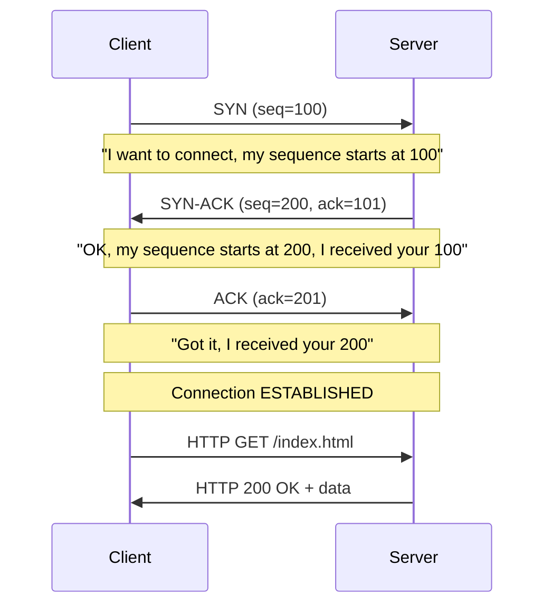
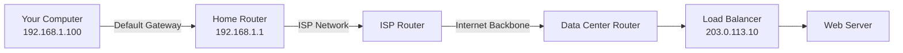
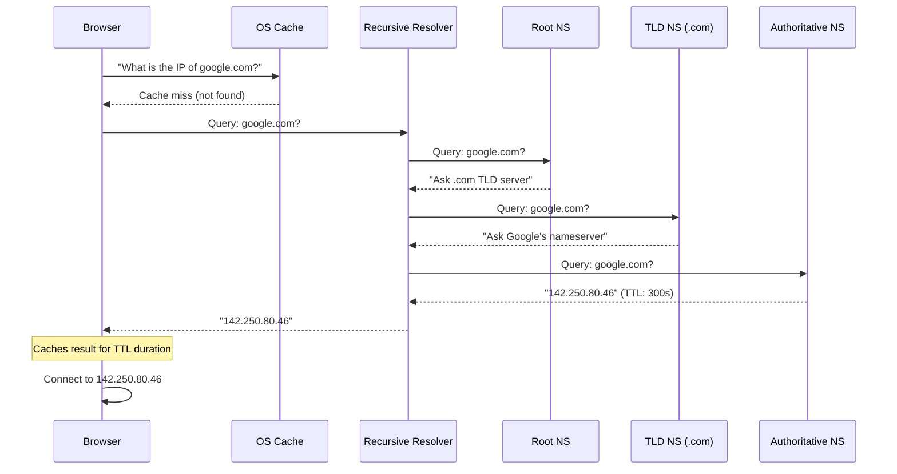
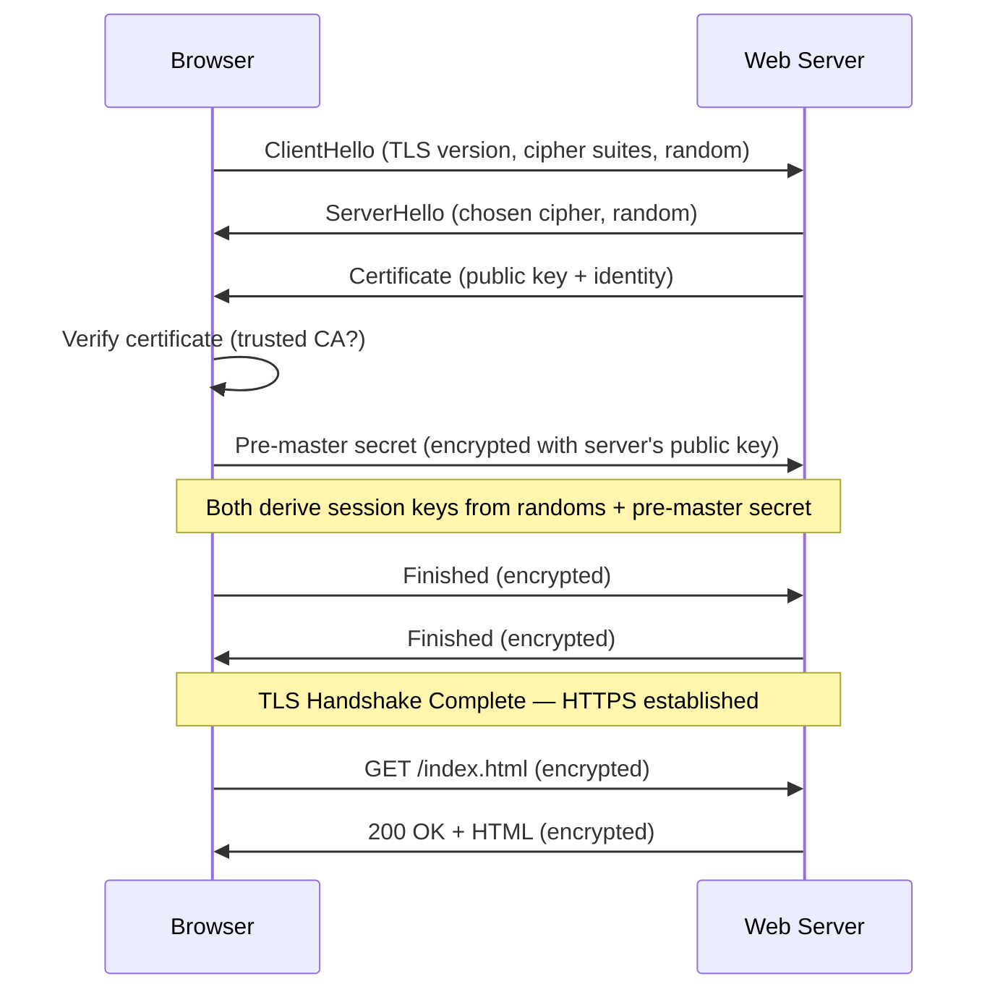
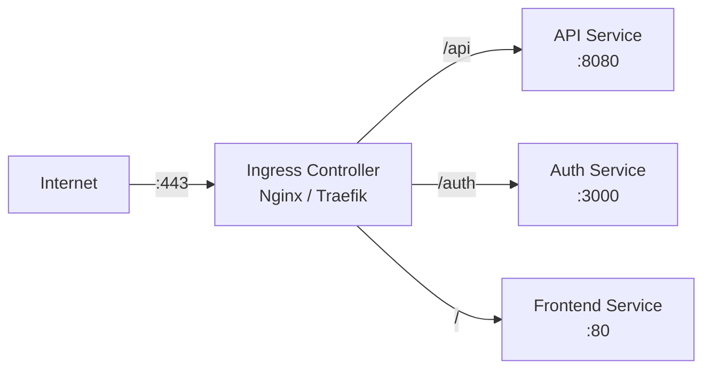
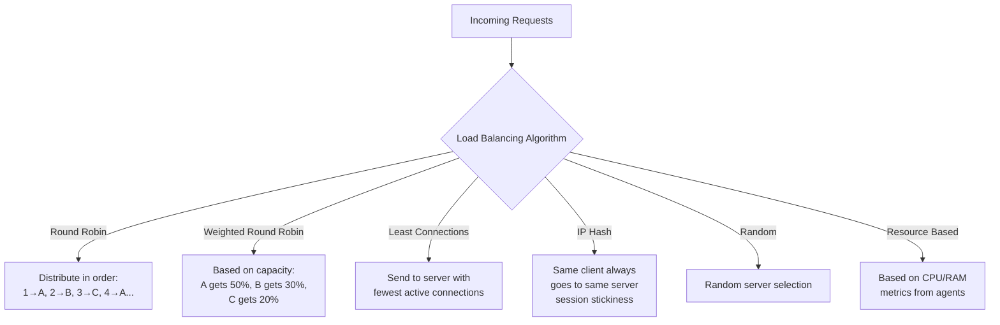
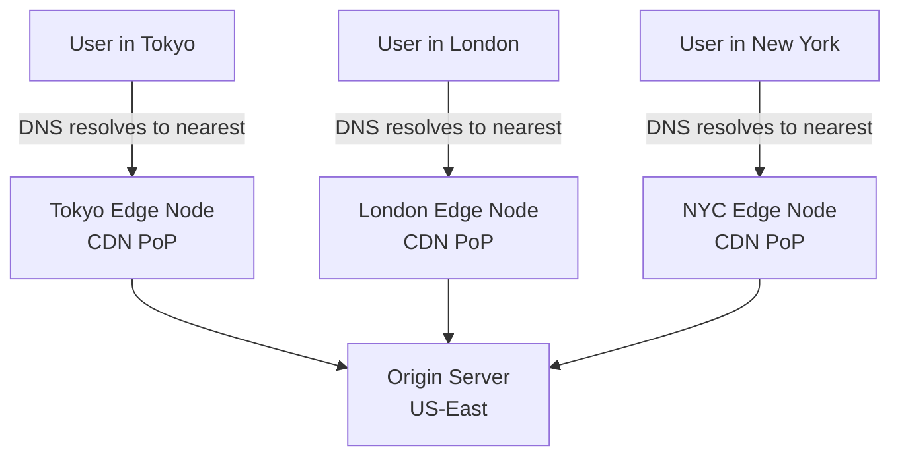
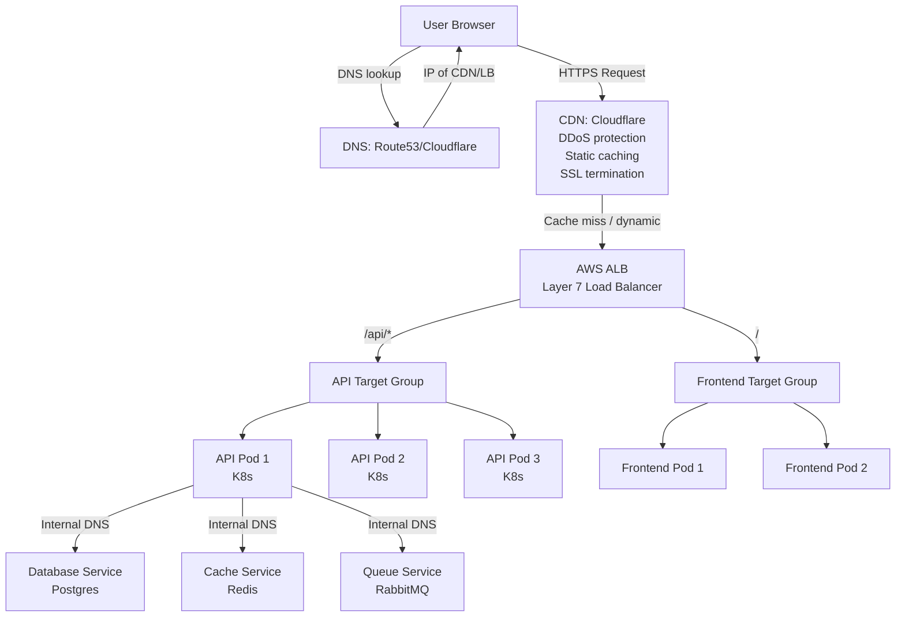

# DevOps Phase 10 — Networking
## DNS · HTTP/HTTPS · TCP/IP · Reverse Proxy · Load Balancing

---

> **Who this is for:** Complete beginners to networking who want to become production-ready DevOps engineers and ace interviews.

---

## Table of Contents

1. [Why Networking Matters in DevOps](#1-why-networking-matters-in-devops)
2. [TCP/IP — The Foundation](#2-tcpip--the-foundation)
3. [DNS — Domain Name System](#3-dns--domain-name-system)
4. [HTTP & HTTPS](#4-http--https)
5. [Reverse Proxy](#5-reverse-proxy)
6. [Load Balancing](#6-load-balancing)
7. [Putting It All Together — Production Architecture](#7-putting-it-all-together--production-architecture)
8. [Interview Mastery](#8-interview-mastery)

---

## 1. Why Networking Matters in DevOps

### Beginner Explanation

Imagine you are sending a letter. You write the letter (data), put it in an envelope, write an address (IP address), drop it at the post office (router), and it gets delivered. Networking is exactly this — a system that moves data from one computer to another.

As a DevOps engineer, **every single system you build communicates over a network**. Containers talk to databases, load balancers talk to pods, users talk to APIs — all over the network. If you don't understand networking, you cannot:
- Debug production outages
- Configure Kubernetes services
- Set up secure HTTPS endpoints
- Design scalable infrastructure

### Why DevOps Engineers Must Master Networking

| Scenario | Networking Concept |
|---|---|
| User can't reach your website | DNS misconfiguration |
| API calls timing out | TCP connection limits, firewall rules |
| Service can't talk to database | Network policies, VPC routing |
| Site slow under load | Load balancer misconfiguration |
| SSL certificate error | TLS/HTTPS misconfiguration |
| Container can't reach internet | Docker network bridge, NAT |

---

## 2. TCP/IP — The Foundation

### Beginner Explanation

TCP/IP is the **language that all computers on the internet use to talk to each other**. It's like an agreement: "we will both follow these rules so we can understand each other."

The name TCP/IP actually refers to **two protocols** working together:
- **IP (Internet Protocol)** — handles addressing and routing (finding the right computer)
- **TCP (Transmission Control Protocol)** — handles reliable delivery (making sure data arrives correctly)

### The OSI Model vs TCP/IP Model

The OSI model is a conceptual framework that describes how data flows through a network. The TCP/IP model is the practical implementation used on the internet.

```
OSI Model (7 Layers)           TCP/IP Model (4 Layers)
┌─────────────────────┐        ┌─────────────────────────┐
│  7. Application     │        │                         │
│  6. Presentation    │  ───►  │  4. Application         │
│  5. Session         │        │     (HTTP, DNS, FTP,    │
├─────────────────────┤        │      SSH, SMTP)         │
│  4. Transport       │  ───►  │  3. Transport           │
│     (TCP, UDP)      │        │     (TCP, UDP)          │
├─────────────────────┤        ├─────────────────────────┤
│  3. Network         │  ───►  │  2. Internet            │
│     (IP, ICMP)      │        │     (IP, ICMP)          │
├─────────────────────┤        ├─────────────────────────┤
│  2. Data Link       │  ───►  │  1. Network Access      │
│  1. Physical        │        │     (Ethernet, WiFi)    │
└─────────────────────┘        └─────────────────────────┘
```

### IP Addressing

#### IPv4 — The Classic Format

```
192.168.1.100
 │   │  │  │
 │   │  │  └── Host (which device on the network)
 │   │  └───── Subnet
 │   └──────── Network
 └──────────── Class/Block
```

IPv4 addresses are **32-bit numbers** written as four decimal octets (0–255). Total possible addresses: ~4.3 billion.

**CIDR Notation:**
```
192.168.1.0/24
              └── Subnet mask: first 24 bits are network, last 8 bits are hosts
                  This gives 256 addresses (192.168.1.0 to 192.168.1.255)
                  Usable hosts: 254 (first and last reserved)
```

Common CIDR ranges:
```
/32  = 1 address     (single host)
/24  = 256 addresses (class C, common for small networks)
/16  = 65,536        (class B)
/8   = 16,777,216    (class A)
```

**Private IP ranges (not routable on public internet):**
```
10.0.0.0/8          (10.x.x.x)
172.16.0.0/12       (172.16.x.x to 172.31.x.x)
192.168.0.0/16      (192.168.x.x)
```

#### IPv6 — The Modern Format

```
2001:0db8:85a3:0000:0000:8a2e:0370:7334
```
128-bit address, written as 8 groups of 4 hexadecimal digits. Solves IPv4 exhaustion.

### TCP — How Reliable Delivery Works

#### The Three-Way Handshake

Before any data is sent, TCP establishes a connection using a three-way handshake:



**Why this matters in DevOps:**
- Connection limits: each TCP connection consumes file descriptors
- TIME_WAIT state: closed connections linger for 2 minutes (can exhaust ports)
- Connection pooling: reuse connections instead of opening new ones

**Check active connections:**
```bash
# See all TCP connections
ss -tuln

# Count connections per state
ss -tan | awk '{print $1}' | sort | uniq -c

# See TIME_WAIT connections (common problem under load)
ss -tan state time-wait | wc -l

# Check listening ports
netstat -tlnp
```

#### TCP vs UDP

| Feature | TCP | UDP |
|---|---|---|
| Connection | Connection-oriented (handshake) | Connectionless |
| Reliability | Guaranteed delivery | Best-effort, can drop |
| Order | In-order delivery | No ordering guarantee |
| Speed | Slower (overhead) | Faster |
| Error checking | Yes | Basic checksum only |
| Use cases | HTTP, SSH, databases | DNS queries, video streaming, gaming |
| Header size | 20-60 bytes | 8 bytes |

### Ports

Ports are like **apartment numbers** in a building. The IP address gets you to the building (computer), the port gets you to the right apartment (service).

```
Common ports to memorize:
22    SSH
25    SMTP (email sending)
53    DNS (UDP and TCP)
80    HTTP
443   HTTPS
3306  MySQL
5432  PostgreSQL
6379  Redis
27017 MongoDB
8080  HTTP alternate / application servers
9090  Prometheus
3000  Grafana (default)
```

**Check what's listening on ports:**
```bash
# Which process is listening on port 80?
sudo lsof -i :80
sudo ss -tlnp | grep :80

# Is port 443 open on a remote host?
nc -zv example.com 443
telnet example.com 443

# Full port scan (use only on systems you own!)
nmap -sT -p 1-1000 localhost
```

### IP Routing



**How routing decisions are made:**
```bash
# View your routing table
ip route show

# Example output:
# default via 192.168.1.1 dev eth0
# 192.168.1.0/24 dev eth0 proto kernel scope link

# Trace the route to a destination (see every hop)
traceroute google.com
# or
mtr google.com   # more detailed, real-time

# Test connectivity
ping 8.8.8.8
curl -I https://google.com
```

### NAT — Network Address Translation

NAT allows multiple devices with private IPs to share a single public IP.

```
Private Network                    Internet
┌──────────────────────┐          ┌──────────────┐
│ 192.168.1.100 ──────►│          │              │
│ 192.168.1.101 ──────►│ Router   │  8.8.8.8     │
│ 192.168.1.102 ──────►│ 203.x.x.x├─────────────►│
└──────────────────────┘          └──────────────┘
   Private IPs          Single      Google DNS
   (not routable)       Public IP
```

**In containers/Kubernetes:** Docker uses NAT (iptables MASQUERADE) so containers can reach the internet using the host's IP.

---

## 3. DNS — Domain Name System

### Beginner Explanation

DNS is the **phonebook of the internet**. You know a person's name (google.com), but to call them you need their phone number (IP address). DNS translates names to numbers.

Without DNS, you'd have to type `142.250.80.46` instead of `google.com`.

### DNS Resolution — Step by Step



### DNS Record Types

| Record | Purpose | Example |
|---|---|---|
| **A** | Maps domain → IPv4 address | `google.com → 142.250.80.46` |
| **AAAA** | Maps domain → IPv6 address | `google.com → 2607:f8b0:4004::200e` |
| **CNAME** | Alias to another domain | `www.example.com → example.com` |
| **MX** | Mail server for domain | `example.com → mail.example.com` |
| **TXT** | Arbitrary text (SPF, DKIM, verification) | `"v=spf1 include:..."` |
| **NS** | Nameservers for domain | `example.com → ns1.cloudflare.com` |
| **PTR** | Reverse DNS (IP → domain) | `1.80.250.142.in-addr.arpa → google.com` |
| **SOA** | Start of authority (zone info) | TTL, admin email |
| **SRV** | Service location | Used by Kubernetes for service discovery |

### DNS Commands

```bash
# Basic lookup
nslookup google.com
dig google.com

# Specific record types
dig google.com A        # IPv4 address
dig google.com AAAA     # IPv6 address
dig google.com MX       # Mail servers
dig google.com NS       # Nameservers
dig google.com TXT      # Text records
dig google.com CNAME    # Alias

# Trace full DNS resolution path
dig +trace google.com

# Reverse DNS lookup (IP to domain)
dig -x 8.8.8.8

# Query specific DNS server
dig @8.8.8.8 google.com    # Ask Google's DNS
dig @1.1.1.1 google.com    # Ask Cloudflare's DNS

# Check DNS propagation (local cache)
host google.com

# Flush DNS cache
# Linux (systemd-resolved):
sudo systemd-resolve --flush-caches
# macOS:
sudo dscacheutil -flushcache
# Windows:
ipconfig /flushdns
```

### DNS in Kubernetes

Kubernetes runs its own internal DNS (CoreDNS) so services can find each other by name.

```yaml
# Service discovery via DNS in Kubernetes:
# Format: <service>.<namespace>.svc.cluster.local

# Example: database service in "production" namespace
# Accessible at:
# db-service.production.svc.cluster.local
# or just "db-service" from same namespace

# CoreDNS config (ConfigMap):
apiVersion: v1
kind: ConfigMap
metadata:
  name: coredns
  namespace: kube-system
data:
  Corefile: |
    .:53 {
        errors
        health
        kubernetes cluster.local in-addr.arpa ip6.arpa {
           pods insecure
           upstream
           fallthrough in-addr.arpa ip6.arpa
        }
        prometheus :9153
        forward . /etc/resolv.conf
        cache 30
        loop
        reload
        loadbalance
    }
```

**Test DNS inside a pod:**
```bash
# Run a debug pod
kubectl run debug --image=busybox --rm -it -- /bin/sh

# Inside the pod:
nslookup kubernetes.default
nslookup my-service.my-namespace.svc.cluster.local
cat /etc/resolv.conf
```

### DNS Caching and TTL

**TTL (Time To Live)** — how long a DNS record is cached (in seconds).

```
Low TTL  (60s)   = Changes propagate fast, but more DNS queries (higher load)
High TTL (3600s) = Fewer queries, but changes take 1hr+ to propagate

DevOps tip: Lower TTL BEFORE making infrastructure changes,
            then raise it back after. This reduces propagation time.
```

---

## 4. HTTP & HTTPS

### Beginner Explanation

HTTP (HyperText Transfer Protocol) is the **language browsers and servers use to communicate**. When you type a URL in your browser:
1. Browser sends an HTTP **request** ("give me this page")
2. Server sends an HTTP **response** ("here is the page")

HTTPS is HTTP with **encryption** — a private conversation no one else can read.

### HTTP Request/Response Structure

```
HTTP REQUEST:
┌────────────────────────────────────────────────────┐
│ GET /api/users HTTP/1.1                            │  ← Request line
│ Host: api.example.com                              │  ← Headers
│ Authorization: Bearer eyJhbG...                    │
│ Content-Type: application/json                     │
│ Accept: application/json                           │
│                                                    │  ← Empty line (end of headers)
│ {"filter": "active"}                               │  ← Body (optional for GET)
└────────────────────────────────────────────────────┘

HTTP RESPONSE:
┌────────────────────────────────────────────────────┐
│ HTTP/1.1 200 OK                                    │  ← Status line
│ Content-Type: application/json                     │  ← Headers
│ Content-Length: 142                                │
│ Cache-Control: max-age=300                         │
│ X-Request-Id: abc-123                              │
│                                                    │  ← Empty line
│ {"users": [{"id": 1, "name": "Alice"}]}            │  ← Body
└────────────────────────────────────────────────────┘
```

### HTTP Methods

| Method | Purpose | Idempotent? | Body? |
|---|---|---|---|
| GET | Retrieve data | Yes | No |
| POST | Create resource | No | Yes |
| PUT | Replace resource entirely | Yes | Yes |
| PATCH | Partial update | No | Yes |
| DELETE | Remove resource | Yes | No |
| HEAD | Like GET but no body (check if resource exists) | Yes | No |
| OPTIONS | What methods are supported? (CORS preflight) | Yes | No |

### HTTP Status Codes

```
1xx — Informational
  100 Continue
  101 Switching Protocols (WebSocket upgrade)

2xx — Success
  200 OK
  201 Created
  204 No Content (DELETE succeeded)

3xx — Redirection
  301 Moved Permanently (update your bookmarks)
  302 Found / Temporary Redirect
  304 Not Modified (use cached version)

4xx — Client Error (YOU made a mistake)
  400 Bad Request (malformed syntax)
  401 Unauthorized (not logged in)
  403 Forbidden (logged in but no permission)
  404 Not Found
  405 Method Not Allowed
  408 Request Timeout
  429 Too Many Requests (rate limited)

5xx — Server Error (SERVER made a mistake)
  500 Internal Server Error
  502 Bad Gateway (upstream server error)
  503 Service Unavailable (overloaded or down)
  504 Gateway Timeout (upstream too slow)
```

**DevOps tip:** In load balancer/proxy setups:
- `502` = upstream app is **down** (no response)
- `503` = upstream app is **overloaded** (refusing connections)
- `504` = upstream app is **too slow** (timeout)

### HTTP/1.1 vs HTTP/2 vs HTTP/3

```
HTTP/1.1:
- One request per TCP connection (unless pipelining, rarely used)
- HEAD-OF-LINE BLOCKING: slow request blocks all others
- Plain text headers (verbose, repeated cookies)
- Multiple connections opened per browser (6-8 typically)

HTTP/2:
- Multiplexing: multiple requests over SINGLE TCP connection
- Binary framing (more efficient than text)
- Header compression (HPACK)
- Server push (server can send assets proactively)
- Requires HTTPS in practice

HTTP/3:
- Built on QUIC (UDP-based, not TCP)
- Eliminates TCP head-of-line blocking entirely
- Faster connection setup (0-RTT)
- Better performance on lossy networks (mobile)
- Still requires HTTPS
```

### TLS/HTTPS — How Encryption Works



**Certificate Chain of Trust:**
```
Root CA (DigiCert, Let's Encrypt, etc.)
  └── Intermediate CA
        └── Your Certificate (example.com)
              └── Contains: domain name, public key, expiry, CA signature
```

**Check a certificate:**
```bash
# View certificate details
openssl s_client -connect example.com:443 -showcerts

# Check expiry
echo | openssl s_client -connect example.com:443 2>/dev/null \
  | openssl x509 -noout -dates

# Test TLS configuration
curl -vI https://example.com 2>&1 | head -50
```

### HTTPS with Nginx

```nginx
server {
    listen 80;
    server_name example.com;
    # Redirect all HTTP to HTTPS
    return 301 https://$host$request_uri;
}

server {
    listen 443 ssl http2;
    server_name example.com;

    ssl_certificate     /etc/ssl/certs/example.com.crt;
    ssl_certificate_key /etc/ssl/private/example.com.key;

    # Modern SSL settings
    ssl_protocols TLSv1.2 TLSv1.3;
    ssl_ciphers ECDHE-RSA-AES256-GCM-SHA512:DHE-RSA-AES256-GCM-SHA512;
    ssl_prefer_server_ciphers off;
    ssl_session_cache shared:SSL:10m;
    ssl_session_timeout 1d;

    # HSTS (tell browsers to always use HTTPS)
    add_header Strict-Transport-Security "max-age=63072000" always;

    location / {
        proxy_pass http://backend;
    }
}
```

**Let's Encrypt (free certificates):**
```bash
# Install certbot
sudo apt install certbot python3-certbot-nginx

# Get certificate + auto-configure Nginx
sudo certbot --nginx -d example.com -d www.example.com

# Auto-renew (add to cron or systemd timer)
sudo certbot renew --dry-run

# Renew is automatic via systemd in modern distros:
systemctl status certbot.timer
```

### HTTP Security Headers

```nginx
# Add these to your Nginx/Apache config:
add_header X-Frame-Options "SAMEORIGIN";           # Prevent clickjacking
add_header X-Content-Type-Options "nosniff";       # Prevent MIME sniffing
add_header X-XSS-Protection "1; mode=block";       # XSS filter
add_header Content-Security-Policy "default-src 'self'"; # CSP
add_header Referrer-Policy "strict-origin-when-cross-origin";
add_header Permissions-Policy "geolocation=(), microphone=()";
```

---

## 5. Reverse Proxy

### Beginner Explanation

A **reverse proxy** is a middleman that sits between users and your backend servers.

**Forward proxy:** You → Proxy → Internet (used to anonymize outbound traffic)
**Reverse proxy:** User → Proxy → Your servers (used to protect and manage inbound traffic)

Think of a hotel reception desk: guests (users) don't go directly to each room (server). They all go through reception (reverse proxy), which routes them to the right room.

### Why Use a Reverse Proxy?

```
Without reverse proxy:
User ──────────────────► App Server :8080 (exposes internal details, no SSL, single point)

With reverse proxy:
                         ┌──► App Server 1 :8080
User ──► Nginx :443  ───►│
         (reverse        └──► App Server 2 :8080
          proxy)
```

Benefits:
- **SSL termination** — Nginx handles HTTPS, backend speaks plain HTTP
- **Load distribution** — spread traffic across multiple backends
- **Caching** — serve cached responses without hitting backend
- **Compression** — gzip responses before sending to client
- **Security** — hide backend infrastructure, block attacks
- **URL rewriting** — `/api/v1/` → backend at `/v1/`
- **Rate limiting** — throttle abusive clients

### Nginx as Reverse Proxy

```mermaid
flowchart LR
    A[User\nBrowser] -->|HTTPS :443| B[Nginx\nReverse Proxy]
    B -->|HTTP :8001| C[App Server 1\nNode.js]
    B -->|HTTP :8002| D[App Server 2\nNode.js]
    B -->|HTTP :5000| E[Flask API]
    B -->|Static files| F[/var/www/static]
    B --> G[(Redis Cache)]
```

**Basic reverse proxy config:**
```nginx
# /etc/nginx/sites-available/myapp

upstream backend {
    server 127.0.0.1:8080;
    server 127.0.0.1:8081;
}

server {
    listen 443 ssl;
    server_name api.example.com;

    ssl_certificate /etc/letsencrypt/live/api.example.com/fullchain.pem;
    ssl_certificate_key /etc/letsencrypt/live/api.example.com/privkey.pem;

    # Proxy all requests to backend
    location / {
        proxy_pass http://backend;
        
        # Pass original client info to backend
        proxy_set_header Host              $host;
        proxy_set_header X-Real-IP         $remote_addr;
        proxy_set_header X-Forwarded-For   $proxy_add_x_forwarded_for;
        proxy_set_header X-Forwarded-Proto $scheme;

        # Timeouts
        proxy_connect_timeout 60s;
        proxy_read_timeout    60s;

        # Buffer settings
        proxy_buffering on;
        proxy_buffer_size 4k;
        proxy_buffers 4 32k;
    }

    # Serve static files directly (don't hit app server)
    location /static/ {
        alias /var/www/static/;
        expires 30d;
        add_header Cache-Control "public, immutable";
    }

    # WebSocket support
    location /ws/ {
        proxy_pass http://backend;
        proxy_http_version 1.1;
        proxy_set_header Upgrade $http_upgrade;
        proxy_set_header Connection "upgrade";
    }
}
```

**Enable and test:**
```bash
# Test Nginx config syntax
sudo nginx -t

# Reload (no downtime)
sudo nginx -s reload

# Check access logs
sudo tail -f /var/log/nginx/access.log

# Check error logs
sudo tail -f /var/log/nginx/error.log
```

### Nginx Caching

```nginx
# Define cache zone in http block (nginx.conf)
http {
    proxy_cache_path /var/cache/nginx
        levels=1:2
        keys_zone=my_cache:10m    # 10MB metadata
        max_size=1g               # 1GB disk cache
        inactive=60m              # Remove if not accessed in 60min
        use_temp_path=off;
}

# Use cache in server block
server {
    location / {
        proxy_pass http://backend;
        proxy_cache my_cache;
        proxy_cache_valid 200 5m;      # Cache 200 responses for 5 minutes
        proxy_cache_valid 404 1m;      # Cache 404 for 1 minute
        proxy_cache_use_stale error timeout updating; # Serve stale if backend down
        add_header X-Cache-Status $upstream_cache_status;
    }
}
```

### Rate Limiting

```nginx
http {
    # Define rate limit zone: 10MB to store client IPs, 10 requests/second
    limit_req_zone $binary_remote_addr zone=api:10m rate=10r/s;

    server {
        location /api/ {
            # Allow burst of 20, with no delay
            limit_req zone=api burst=20 nodelay;
            limit_req_status 429;
            proxy_pass http://backend;
        }
    }
}
```

### Traefik — Cloud-Native Reverse Proxy

Traefik is a modern reverse proxy that auto-discovers services from Docker, Kubernetes, etc.

```yaml
# traefik.yml
api:
  dashboard: true

entryPoints:
  web:
    address: ":80"
    http:
      redirections:
        entryPoint:
          to: websecure
  websecure:
    address: ":443"

certificatesResolvers:
  letsencrypt:
    acme:
      email: admin@example.com
      storage: /letsencrypt/acme.json
      httpChallenge:
        entryPoint: web

providers:
  docker:
    exposedByDefault: false
  kubernetesCRD: {}
```

```yaml
# Docker Compose with Traefik labels:
version: '3.8'
services:
  myapp:
    image: myapp:latest
    labels:
      - "traefik.enable=true"
      - "traefik.http.routers.myapp.rule=Host(`myapp.example.com`)"
      - "traefik.http.routers.myapp.entrypoints=websecure"
      - "traefik.http.routers.myapp.tls.certresolver=letsencrypt"
      - "traefik.http.services.myapp.loadbalancer.server.port=8080"
```

### Kubernetes Ingress — Reverse Proxy for K8s



```yaml
# Kubernetes Ingress resource
apiVersion: networking.k8s.io/v1
kind: Ingress
metadata:
  name: my-ingress
  annotations:
    nginx.ingress.kubernetes.io/ssl-redirect: "true"
    nginx.ingress.kubernetes.io/use-regex: "true"
    cert-manager.io/cluster-issuer: "letsencrypt-prod"
spec:
  ingressClassName: nginx
  tls:
  - hosts:
    - example.com
    secretName: example-tls
  rules:
  - host: example.com
    http:
      paths:
      - path: /api
        pathType: Prefix
        backend:
          service:
            name: api-service
            port:
              number: 8080
      - path: /
        pathType: Prefix
        backend:
          service:
            name: frontend-service
            port:
              number: 80
```

---

## 6. Load Balancing

### Beginner Explanation

Load balancing is like having multiple checkout lanes at a supermarket. Instead of everyone queuing in one line (overloading one server), customers are directed to different lanes (servers) to distribute the work.

**Without load balancing:**
```
User1 ──►
User2 ──►  Server A  ← overwhelmed, crashes
User3 ──►
```

**With load balancing:**
```
User1 ──►            ──► Server A
User2 ──► Load ───►  ──► Server B  ← healthy distribution
User3 ──► Balancer   ──► Server C
```

### Load Balancing Algorithms



#### Round Robin
```
Request 1 → Server A
Request 2 → Server B
Request 3 → Server C
Request 4 → Server A  (wraps around)
```
Simple, equal distribution. Best when all servers are identical.

#### Weighted Round Robin
```nginx
upstream backend {
    server server-a weight=5;   # Gets 5/8 of traffic
    server server-b weight=2;   # Gets 2/8 of traffic
    server server-c weight=1;   # Gets 1/8 of traffic
}
```
Use when servers have different capacities.

#### Least Connections
```nginx
upstream backend {
    least_conn;
    server server-a;
    server server-b;
    server server-c;
}
```
Best for long-lived connections (WebSockets, uploads). Sends to server with fewest active connections.

#### IP Hash (Sticky Sessions)
```nginx
upstream backend {
    ip_hash;
    server server-a;
    server server-b;
}
```
Same client always hits same server. Required when sessions are stored in-memory (not recommended — use Redis for sessions instead).

### Layer 4 vs Layer 7 Load Balancing

```
Layer 4 (Transport Layer — TCP/UDP):
┌─────────────────────────────────────────┐
│ Operates on IP + Port                   │
│ Does NOT inspect HTTP content           │
│ Very fast (no parsing)                  │
│ Cannot route based on URL path          │
│ Example: AWS NLB, HAProxy TCP mode      │
└─────────────────────────────────────────┘

Layer 7 (Application Layer — HTTP):
┌─────────────────────────────────────────┐
│ Inspects HTTP headers, URLs, cookies    │
│ Can route /api → API servers            │
│ Can route /static → CDN                 │
│ Slower (parsing overhead)               │
│ Can do SSL termination                  │
│ Example: Nginx, HAProxy HTTP, AWS ALB   │
└─────────────────────────────────────────┘
```

### Health Checks

Load balancers periodically check if backends are healthy and stop sending traffic to failed servers.

```nginx
upstream backend {
    server server-a:8080;
    server server-b:8080;

    # Passive health check: mark down after 3 failures, wait 30s to retry
    max_fails=3 fail_timeout=30s;
}

# With nginx-plus (active health check):
upstream backend {
    zone backend 64k;
    server server-a:8080;
    server server-b:8080;
}

server {
    location /api/ {
        proxy_pass http://backend;
        health_check interval=10 fails=3 passes=2;
    }
}
```

**Kubernetes readiness probe (K8s health check):**
```yaml
spec:
  containers:
  - name: app
    readinessProbe:
      httpGet:
        path: /health
        port: 8080
      initialDelaySeconds: 5
      periodSeconds: 10
      failureThreshold: 3
    livenessProbe:
      httpGet:
        path: /live
        port: 8080
      initialDelaySeconds: 15
      periodSeconds: 20
```

### HAProxy Configuration

HAProxy is a battle-hardened load balancer used in high-traffic production systems.

```haproxy
# /etc/haproxy/haproxy.cfg

global
    maxconn 50000
    log /dev/log local0

defaults
    mode    http
    timeout connect 5s
    timeout client  50s
    timeout server  50s
    option  httplog
    option  dontlognull
    option  forwardfor
    option  http-server-close

# Frontend: where traffic comes in
frontend http_front
    bind *:80
    bind *:443 ssl crt /etc/ssl/certs/example.pem
    
    # Redirect HTTP to HTTPS
    redirect scheme https if !{ ssl_fc }
    
    # Route to different backends based on path
    acl is_api path_beg /api/
    use_backend api_servers if is_api
    default_backend web_servers

# Backend: web servers
backend web_servers
    balance roundrobin
    option httpchk GET /health
    server web1 10.0.0.1:8080 check
    server web2 10.0.0.2:8080 check
    server web3 10.0.0.3:8080 check backup   # Only used if others are down

# Backend: API servers
backend api_servers
    balance leastconn
    option httpchk GET /api/health
    server api1 10.0.1.1:8080 check
    server api2 10.0.1.2:8080 check

# Stats page (for monitoring)
listen stats
    bind *:8404
    stats enable
    stats uri /stats
    stats refresh 10s
    stats admin if TRUE
```

### AWS Load Balancers

```
AWS Elastic Load Balancing (ELB) types:

ALB (Application Load Balancer):
  - Layer 7 (HTTP/HTTPS)
  - Content-based routing (path, host, headers)
  - WebSocket support
  - Best for microservices, HTTP apps

NLB (Network Load Balancer):
  - Layer 4 (TCP/UDP)
  - Extremely high performance (millions of requests/sec)
  - Static IP support
  - Best for real-time, low latency, non-HTTP

CLB (Classic Load Balancer):
  - Legacy (avoid for new systems)
  - Both Layer 4 and 7 (but limited)
```

**AWS ALB Terraform example:**
```hcl
resource "aws_lb" "main" {
  name               = "my-alb"
  internal           = false
  load_balancer_type = "application"
  security_groups    = [aws_security_group.alb.id]
  subnets            = aws_subnet.public[*].id

  enable_deletion_protection = true

  tags = {
    Environment = "production"
  }
}

resource "aws_lb_target_group" "app" {
  name     = "my-app-tg"
  port     = 8080
  protocol = "HTTP"
  vpc_id   = aws_vpc.main.id

  health_check {
    path                = "/health"
    healthy_threshold   = 2
    unhealthy_threshold = 3
    timeout             = 5
    interval            = 30
  }
}

resource "aws_lb_listener" "https" {
  load_balancer_arn = aws_lb.main.arn
  port              = "443"
  protocol          = "HTTPS"
  ssl_policy        = "ELBSecurityPolicy-TLS13-1-2-2021-06"
  certificate_arn   = aws_acm_certificate.main.arn

  default_action {
    type             = "forward"
    target_group_arn = aws_lb_target_group.app.arn
  }
}
```

### Global Load Balancing — CDN and GeoDNS



**CDNs (Content Delivery Networks):** Cloudflare, AWS CloudFront, Fastly, Akamai
- Cache static assets at edge locations worldwide
- Reduce latency (serve from nearest location)
- Absorb DDoS attacks

---

## 7. Putting It All Together — Production Architecture



**Full request flow:**
1. User types `https://app.example.com`
2. **DNS** resolves `app.example.com` → Cloudflare CDN IP
3. **CDN** checks cache, on miss forwards to **AWS ALB**
4. **ALB** terminates SSL, inspects URL path
5. ALB routes `/api/*` requests to API target group
6. **Load balancer** picks least-loaded pod using health checks
7. **Pod** handles request, queries PostgreSQL via internal DNS (`db.production.svc.cluster.local`)
8. Response travels back through the same chain

---

## 8. Interview Mastery

---

### Beginner Questions

---

**Q: What is an IP address and why do we need it?**

**Perfect Answer:**
> "An IP address is a unique numerical identifier assigned to each device on a network — similar to a postal address for your house. We need it because when data travels across the internet, routers need to know exactly where to send it. Without IP addresses, a packet of data would have no destination.
>
> There are two versions: IPv4, which uses 32-bit addresses like 192.168.1.1 and is running out due to the internet's growth, and IPv6, which uses 128-bit addresses to provide virtually unlimited addresses. In a production environment, I'd typically see public IPv4/IPv6 on load balancers, private IPs (like 10.x.x.x) on internal services, and NAT translating between them."

**Interviewer expectation:** They want to see you understand the concept and connect it to real infrastructure, not just recite a textbook definition.

---

**Q: What is DNS and how does it work?**

**Perfect Answer:**
> "DNS — Domain Name System — is the internet's distributed phonebook. It translates human-readable domain names like google.com into IP addresses like 142.250.80.46 that computers use to route traffic.
>
> The resolution process works like this: first, your browser checks its local cache. If not found, it asks your OS cache, then your configured DNS resolver (usually your ISP or 8.8.8.8). The resolver, if it doesn't have a cached answer, starts from the root nameservers, gets directed to the .com TLD servers, which point to Google's authoritative nameservers, which return the final IP. This whole process happens in under 100ms and the result is cached for the duration of the TTL.
>
> In DevOps, I've used DNS for blue-green deployments by switching DNS records between environments, and in Kubernetes, CoreDNS handles internal service discovery automatically."

---

**Q: What is the difference between HTTP and HTTPS?**

**Perfect Answer:**
> "HTTP is the protocol browsers and servers use to communicate — it's plain text, so anyone who intercepts the traffic can read it. HTTPS adds a layer of encryption using TLS (Transport Layer Security).
>
> With HTTPS: the client and server perform a TLS handshake to exchange keys and verify the server's identity via a certificate signed by a trusted Certificate Authority. After the handshake, all data is encrypted — even if someone intercepts it, they only see ciphertext.
>
> In production, I configure Nginx to handle TLS termination — the reverse proxy decrypts HTTPS from clients, then communicates with backends over plain HTTP internally since the internal network is trusted. I use Let's Encrypt for free automated certificates and enforce HTTPS with HSTS headers."

---

### Intermediate Questions

---

**Q: What is a reverse proxy and why would you use one in production?**

**Perfect Answer:**
> "A reverse proxy sits between clients and backend servers, intercepting all incoming requests. Unlike a forward proxy (which hides clients from the internet), a reverse proxy hides the backend infrastructure from clients.
>
> I use reverse proxies for several reasons in production:
> - **SSL termination:** The proxy handles TLS, so backend apps only need to speak HTTP
> - **Load balancing:** Distribute traffic across multiple backend instances
> - **Caching:** Serve cached responses for repeated requests, reducing backend load
> - **Compression:** Gzip responses at the proxy layer
> - **Security:** Hide internal IPs, block bad actors, add rate limiting
> - **URL routing:** Route `/api` to the API cluster and `/` to the frontend
>
> In my experience, Nginx handles this excellently for medium-scale deployments, and in Kubernetes I use an Ingress controller (also Nginx) which automatically configures routing based on Ingress manifests."

**Interviewer expectation:** They want depth — mention at least 3-4 concrete benefits and show hands-on experience.

---

**Q: Explain TCP's three-way handshake. Why is it important for DevOps?**

**Perfect Answer:**
> "TCP requires a three-way handshake before any data is sent. The client sends a SYN packet, the server responds with SYN-ACK (acknowledging and sending its own sequence number), and the client sends ACK. After this, the connection is established and data flows.
>
> Why it matters for DevOps:
> - **Connection limits:** Each connection uses a file descriptor. Under high load, you can exhaust the system's file descriptor limit (ulimit). I've debugged 'too many open files' errors in production this way.
> - **TIME_WAIT state:** After a connection closes, TCP keeps it in TIME_WAIT for 2 minutes to handle delayed packets. Under bursty traffic, this can exhaust ephemeral ports. Fix: `net.ipv4.tcp_tw_reuse=1` in sysctl.
> - **Connection pooling:** Databases are slow to establish connections. We use connection pools (pgBouncer for Postgres, etc.) to reuse established TCP connections, avoiding handshake overhead per query."

---

**Q: What are the differences between Layer 4 and Layer 7 load balancing?**

**Perfect Answer:**
> "Layer 4 load balancing operates at the transport layer — it routes based on IP addresses and TCP/UDP ports without inspecting the actual content of the requests. It's extremely fast because it doesn't need to parse HTTP, but it can't make routing decisions based on URLs or headers.
>
> Layer 7 load balancing operates at the application layer — it understands HTTP. It can inspect the URL path, headers, cookies, and body to make intelligent routing decisions. For example, route `/api` to the API server farm and `/uploads` to a storage-optimized cluster.
>
> In AWS terms: NLB is Layer 4 (used for real-time gaming, IoT, very high throughput), and ALB is Layer 7 (used for microservices, APIs, web apps). I typically reach for ALB because the content-based routing and TLS termination are essential for modern web architectures."

---

### Advanced Questions

---

**Q: Walk me through how you'd debug a 502 Bad Gateway error in production.**

**Perfect Answer:**
> "A 502 means the reverse proxy or load balancer successfully received a request from the client but got an invalid response from the upstream server. My debugging process:
>
> **Step 1: Check reverse proxy logs**
> ```bash
> tail -f /var/log/nginx/error.log
> # Look for: connect() failed, upstream timed out, no live upstreams
> ```
>
> **Step 2: Is the upstream reachable?**
> ```bash
> curl -I http://app-server:8080/health
> nc -zv app-server 8080
> ```
>
> **Step 3: Check the upstream application**
> ```bash
> systemctl status myapp
> journalctl -u myapp -n 100
> kubectl logs -l app=myapp --tail=100
> ```
>
> **Step 4: Check if it crashed** — process down, OOM killed?
> ```bash
> dmesg | grep -i oom
> kubectl describe pod myapp-xxx
> ```
>
> **Step 5: Resource exhaustion?**
> ```bash
> # Connection limit, file descriptors
> ulimit -n
> cat /proc/sys/fs/file-max
> ss -s  # socket summary
> ```
>
> Common root causes I've seen: app crashed due to unhandled exception, memory OOM-kill, database connection pool exhausted, misconfigured health check causing premature removal from pool, or deployment left zero running replicas."

---

**Q: How does Kubernetes DNS-based service discovery work internally?**

**Perfect Answer:**
> "Kubernetes runs CoreDNS as a cluster-internal DNS server in the kube-system namespace. Every pod has its /etc/resolv.conf configured to point to the CoreDNS service IP.
>
> When a pod queries `db-service.production.svc.cluster.local`:
> 1. The query goes to CoreDNS (via the nameserver in /etc/resolv.conf)
> 2. CoreDNS watches the Kubernetes API server and has an in-memory map of all Services
> 3. It returns the ClusterIP of the db-service Service
> 4. kube-proxy has set up iptables rules on every node that intercept traffic to the ClusterIP and DNAT it to one of the backend pod IPs
>
> For headless services (clusterIP: None), CoreDNS returns all pod IPs directly, enabling clients to do their own load balancing — used with StatefulSets for things like Cassandra or MongoDB clusters where each pod has identity.
>
> The search domains (`production.svc.cluster.local svc.cluster.local cluster.local`) allow short-form queries like just `db-service` from the same namespace."

---

**Q: How would you design a zero-downtime deployment strategy for a stateful application behind a load balancer?**

**Perfect Answer:**
> "For stateful applications, zero-downtime deployment is tricky because in-flight sessions can break. My approach:
>
> **1. Externalize state:** Move sessions and state to an external store (Redis, Postgres). Never store state in-memory on app pods. This makes pods stateless and freely replaceable.
>
> **2. Connection draining:** Configure the load balancer to drain connections before removing an instance. In AWS ALB, set `deregistration_delay` to 30-60 seconds. In Kubernetes, use `preStop` hooks and `terminationGracePeriodSeconds`.
>
> **3. Rolling deployment (Kubernetes default):**
> ```yaml
> strategy:
>   type: RollingUpdate
>   rollingUpdate:
>     maxUnavailable: 0   # Never take a pod down before a new one is ready
>     maxSurge: 1         # Add one extra pod during rollout
> ```
>
> **4. Readiness probes:** New pods only receive traffic after they pass readiness checks. Set appropriate `initialDelaySeconds` so the app fully initializes before serving traffic.
>
> **5. Database migrations:** Run migrations in a separate init container before app pods start, using idempotent, backwards-compatible migrations (never drop columns in the same deploy — do it in a follow-up release).
>
> **6. Monitoring during rollout:** Watch error rate (5xx), latency P99, and connection errors on your dashboard. Set up automated rollback with Argo Rollouts or Flagger if error rate exceeds threshold."

---

### Scenario-Based Questions

---

**Q: Your website suddenly becomes slow. Users report 10+ second page loads. Where do you start?**

**Perfect Answer:**
> "I treat this as an incident and follow a structured approach:
>
> **1. Triage — is it total outage or degraded?**
> - Check monitoring dashboard (Grafana), look at error rate and latency graphs
> - Check CDN hit rate — is the CDN serving cached content?
>
> **2. Is it network/DNS?**
> ```bash
> dig +stats example.com      # Is DNS slow?
> curl -w "@curl-format.txt" https://example.com   # Time each phase
> # Outputs: DNS lookup, TCP connect, TLS handshake, first byte, total
> ```
>
> **3. Is the load balancer healthy?**
> - Check ALB target health in AWS console
> - Check Nginx upstream health: `nginx -T | grep server`
>
> **4. Are backends responding?**
> ```bash
> kubectl top pods              # CPU/memory usage
> kubectl get hpa               # Is autoscaler saturated?
> ```
>
> **5. Database bottleneck?**
> - Check slow query log
> - Check connection pool saturation
> - Check DB CPU/IOPS metrics
>
> **6. Is it traffic spike?** Scale horizontally if so.
>
> **7. Is it a bad deploy?** Roll back if the issue started after a recent deployment.
>
> In a real incident, I'd do steps 1-3 in the first 2 minutes, communicate status to stakeholders, then dig deeper."

---

**Q: You need to migrate from HTTP to HTTPS with zero downtime. How do you do it?**

**Perfect Answer:**
> "This is a phased migration:
>
> **Phase 1: Prepare certificates (1-2 days before)**
> - Issue TLS certificate via Let's Encrypt or ACM (AWS)
> - Test certificate on a staging environment
> - If using Let's Encrypt, ensure auto-renewal is configured
>
> **Phase 2: Enable HTTPS alongside HTTP (migration day)**
> - Configure server to listen on both 80 and 443
> - Test HTTPS is working: `curl -I https://example.com`
> - Test from multiple locations
>
> **Phase 3: Add redirect (monitor for 1-2 days)**
> ```nginx
> server {
>     listen 80;
>     return 301 https://$host$request_uri;
> }
> ```
> - Monitor for 301 redirect errors, check no internal services break
>
> **Phase 4: HSTS (after confident HTTPS works)**
> ```nginx
> add_header Strict-Transport-Security "max-age=300" always;
> ```
> - Start with short max-age (300s = 5 min). Gradually increase to 31536000 (1 year)
> - Add `includeSubDomains` only after all subdomains are HTTPS
>
> **Phase 5: Update all internal references**
> - Update hardcoded HTTP URLs in code/config
> - Update webhook URLs in third-party services
> - Update DNS records if using IP-based HTTP
>
> **Rollback plan:** Keep HTTP enabled until fully confident. Remove it only after 1-2 weeks of clean operation."

---

### FAANG-Style Conceptual Questions

---

**Q: Design the DNS architecture for a globally distributed application serving 100M users.**

**Perfect Answer:**
> "I'd design this as a multi-layer system:
>
> **Layer 1: GeoDNS (Traffic Manager)**
> - Use Route53 with latency-based routing or Cloudflare's Anycast
> - DNS returns the IP of the nearest regional load balancer to each user
> - Health checks remove unhealthy regions from DNS rotation automatically
>
> **Layer 2: Regional Anycast**
> - Each region has an Anycast IP — multiple PoPs (Points of Presence) share one IP
> - BGP routing directs each user to the nearest PoP
>
> **Layer 3: CDN**
> - Static content served at edge, never hits origin
> - Dynamic content cached at edge with short TTLs
>
> **TTL Strategy:**
> - DNS records: 30s TTL for load balancers (enables fast failover)
> - During planned maintenance: drop to 5s before the event
>
> **Failover SLA:** With 30s TTL + GeoDNS health checks every 10s, we can reroute traffic away from a failed region in under 40 seconds.
>
> **Tradeoff:** Very low TTLs increase DNS query volume. Cloudflare/Route53 are designed for this — they handle billions of queries/day. The cost increase is justified by the faster MTTR."

---

**Q: Explain how a CDN works and what happens when there's a cache miss. What are the implications for your origin servers?**

**Perfect Answer:**
> "A CDN (Content Delivery Network) is a geographically distributed network of proxy servers (PoPs). When a user requests an asset:
>
> **Cache HIT flow:**
> User → CDN PoP (nearest) → Returns cached asset instantly
> - Latency: ~5-20ms
> - Origin receives 0 load
>
> **Cache MISS flow:**
> User → CDN PoP → CDN PoP forwards to Origin → Response cached at PoP → Returned to user
> - Latency: 100-500ms (cross-region to origin)
>
> **Thundering herd problem (critical production concern):**
> When a CDN cache expires or is invalidated, and millions of users simultaneously request the same resource — all requests miss the cache simultaneously and slam the origin server.
>
> **Mitigation strategies:**
> - **Request coalescing:** CDN sends only ONE request to origin and holds others waiting. Once origin responds, it fans out to all waiting users. Cloudflare calls this 'request collapsing.'
> - **Stale-while-revalidate:** Serve the stale cached content immediately while refreshing in the background. No thundering herd.
> - **Cache warming:** Pre-populate CDN caches before invalidating (for scheduled deploys)
> - **Staggered TTLs:** Use randomized TTLs (e.g., 300-360s instead of fixed 300s) so not all entries expire simultaneously
>
> **For DevOps:** Size your origin fleet for cache-miss traffic (typically 5-20% of total traffic), not all traffic. During an incident where CDN goes down, origin must handle 100% — keep this in your capacity plan."

---

## Summary

```
Networking in DevOps — Key Takeaways:

TCP/IP:     Foundation of all internet communication
            - IP addresses for routing, TCP for reliable delivery
            - Ports map traffic to services
            - NAT enables private networks to reach internet

DNS:        Translates names to IPs
            - Recursive resolution through root → TLD → authoritative
            - TTL controls caching duration
            - CoreDNS handles service discovery inside Kubernetes

HTTP/HTTPS: The language of the web
            - Request/response model with methods and status codes
            - TLS encrypts traffic (certificates prove identity)
            - HTTP/2 multiplexes requests over single connection

Reverse Proxy: Middleman between users and backends
            - SSL termination, caching, routing, rate limiting
            - Nginx and Traefik are most common in DevOps
            - K8s Ingress is a reverse proxy as a k8s resource

Load Balancing: Distributes traffic across servers
            - Algorithms: round robin, least connections, IP hash
            - Layer 4 (fast) vs Layer 7 (smart/content-aware)
            - Health checks remove failed backends automatically
```

---

[⬇️ Download This File](#)
