# DevOps Phase 1 — DevOps Fundamentals

---

## Table of Contents

1. [What is DevOps](#what-is-devops)
2. [Software Development Life Cycle (SDLC)](#software-development-life-cycle-sdlc)
3. [Agile Methodology](#agile-methodology)
4. [CI/CD Basics](#cicd-basics)
5. [Dev vs Ops — The Cultural Divide](#dev-vs-ops--the-cultural-divide)
6. [Deployment Lifecycle](#deployment-lifecycle)
7. [Interview Mastery](#interview-mastery)

---

## What is DevOps

### Beginner Explanation

Imagine you're building a house. One team designs it (architects = developers), another team actually builds and maintains it (construction workers = operations). Now imagine these two teams never talk to each other. The architect designs a beautiful rooftop pool, but the construction team doesn't know how to support its weight. The building cracks.

**DevOps** is the practice of making these two teams work together from day one — sharing tools, communication, and responsibility — so the building (software) gets delivered faster, safer, and without cracks.

**In one sentence:** DevOps is a culture + set of practices that unifies software development (Dev) and IT operations (Ops) to deliver software faster, more reliably, and with continuous feedback.

### Technical Explanation

DevOps is NOT a tool. It is NOT a job title (though it's used as one). It is a **philosophy and set of practices** that aims to:

1. **Shorten the systems development life cycle**
2. **Provide continuous delivery** with high software quality
3. **Automate everything** between code commit and production deployment
4. **Break down silos** between development, QA, and operations teams

DevOps combines:
- **Cultural philosophies** — shared ownership, no blame culture
- **Practices** — CI/CD, Infrastructure as Code, Monitoring
- **Tools** — Jenkins, Docker, Kubernetes, Terraform, etc.

### The CALMS Framework (DevOps Pillars)

| Pillar | Meaning | Example |
|--------|---------|---------|
| **C**ulture | Collaboration over silos | Dev and Ops share on-call |
| **A**utomation | Automate repetitive tasks | Auto-deploy on merge |
| **L**ean | Eliminate waste | Remove manual approvals |
| **M**easurement | Measure everything | Track deployment frequency |
| **S**haring | Share knowledge | Blameless postmortems |

### The Three Ways of DevOps

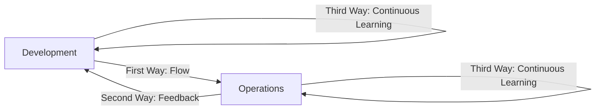

| Way | Principle | Example |
|-----|-----------|---------|
| **First Way** | Accelerate flow from Dev to Ops | CI/CD pipelines, small batch sizes |
| **Second Way** | Amplify feedback loops | Monitoring, alerting, fast rollback |
| **Third Way** | Culture of experimentation & learning | Blameless postmortems, chaos engineering |

### Real-World Example

**Before DevOps (Traditional):**
- Developer writes code → throws it "over the wall" to Ops
- Ops deploys manually, often breaks
- Deployment frequency: once every 3-6 months
- Incident response: blame game

**After DevOps:**
- Developer writes code → automated pipeline tests, builds, and deploys
- Both Dev and Ops monitor production together
- Deployment frequency: multiple times per day
- Incident response: blameless postmortem, learn and improve

### Production Use Cases

| Company | DevOps Practice | Result |
|---------|----------------|--------|
| Amazon | Deploys every 11.7 seconds | Reduced outages by 75% |
| Netflix | Chaos engineering (Chaos Monkey) | 99.99% uptime |
| Etsy | 50+ deploys/day | Faster feature delivery |
| Google | SRE (Site Reliability Engineering) | Error budgets, SLOs |
| Facebook | Canary deployments | Safe rollouts to billions |

### Advantages & Disadvantages

| Advantages | Disadvantages |
|-----------|---------------|
| Faster delivery | Cultural change is hard |
| Fewer failures | Requires investment in automation |
| Faster recovery | Learning curve for tools |
| Better collaboration | Security can be overlooked (→ DevSecOps) |
| Higher quality | Over-engineering risk |

### Common Mistakes

1. **Thinking DevOps = Tools** — Buying Jenkins doesn't make you DevOps
2. **Creating a "DevOps Team"** — This recreates silos
3. **Automating broken processes** — Fix the process first
4. **Ignoring culture** — Technology without culture change fails
5. **Big bang adoption** — Trying to adopt everything at once

### Best Practices

1. Start with version control for EVERYTHING (code, config, infra)
2. Automate testing first, then deployment
3. Implement monitoring before you need it
4. Use small batch sizes (small, frequent releases)
5. Practice blameless postmortems
6. Measure DORA metrics (explained below)

### DORA Metrics — Measuring DevOps Success

| Metric | Elite | High | Medium | Low |
|--------|-------|------|--------|-----|
| **Deployment Frequency** | On-demand (multiple/day) | Weekly-Monthly | Monthly-6 months | 6+ months |
| **Lead Time for Changes** | < 1 hour | 1 day - 1 week | 1 week - 1 month | 1-6 months |
| **Mean Time to Recovery** | < 1 hour | < 1 day | 1 day - 1 week | 1 week+ |
| **Change Failure Rate** | 0-15% | 16-30% | 16-30% | 46-60% |

### Interview Explanation Style

> "DevOps is a cultural and technical practice that bridges the gap between development and operations teams. Its goal is to shorten the feedback loop, automate delivery, and ensure reliability. It's built on five pillars — Culture, Automation, Lean, Measurement, and Sharing. The key metrics we track are the DORA metrics: deployment frequency, lead time, MTTR, and change failure rate."

---

## Software Development Life Cycle (SDLC)

### Beginner Explanation

Think of SDLC as a recipe for cooking a dish. You don't just start randomly — you:
1. Decide what to cook (requirements)
2. Plan ingredients and steps (design)
3. Actually cook (development)
4. Taste it (testing)
5. Serve it (deployment)
6. Clean up and maintain kitchen (maintenance)

SDLC is the structured process that software goes through from idea to retirement.

### Technical Explanation

SDLC (Software Development Life Cycle) is a systematic process for planning, creating, testing, and deploying software. It provides a structured framework that defines tasks at each phase.

### SDLC Phases — Detailed Breakdown

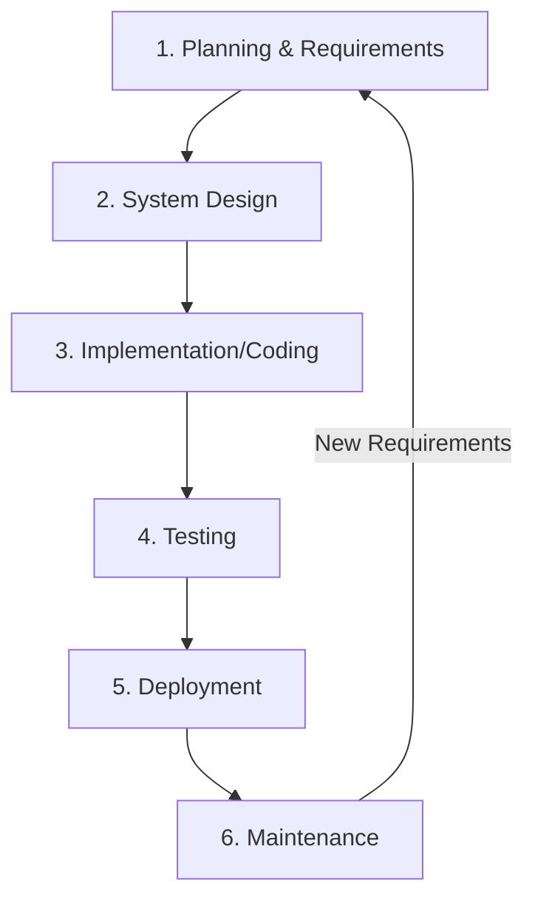

#### Phase 1: Planning & Requirements Gathering

| Aspect | Details |
|--------|---------|
| **Who** | Business analysts, product managers, stakeholders |
| **What** | Gather functional and non-functional requirements |
| **Output** | Software Requirements Specification (SRS) document |
| **Tools** | Jira, Confluence, interviews, surveys |

**Functional Requirements** = What the system should DO
- "User should be able to log in with email and password"

**Non-Functional Requirements** = How the system should PERFORM
- "Login page should load within 2 seconds"
- "System should handle 10,000 concurrent users"

#### Phase 2: System Design

| Aspect | Details |
|--------|---------|
| **Who** | System architects, senior developers |
| **What** | Define architecture, technology stack, database design |
| **Output** | High-Level Design (HLD) + Low-Level Design (LLD) |
| **Tools** | Draw.io, Lucidchart, UML tools |

**HLD (High-Level Design):**
- Overall system architecture
- Technology choices
- Data flow between components

**LLD (Low-Level Design):**
- Database schemas
- API contracts
- Class diagrams
- Function signatures

#### Phase 3: Implementation (Coding)

| Aspect | Details |
|--------|---------|
| **Who** | Developers |
| **What** | Write actual code based on design documents |
| **Output** | Source code, unit tests |
| **Tools** | IDEs, Git, code review tools |

#### Phase 4: Testing

| Testing Type | What it Tests | Who Does It |
|--------------|---------------|-------------|
| Unit Testing | Individual functions | Developers |
| Integration Testing | Components together | Dev/QA |
| System Testing | Complete system | QA |
| UAT (User Acceptance) | Business requirements | Business users |
| Performance Testing | Speed, load | Performance team |
| Security Testing | Vulnerabilities | Security team |

#### Phase 5: Deployment

| Strategy | Description | Risk |
|----------|-------------|------|
| Big Bang | Deploy everything at once | High |
| Rolling | Gradual replacement | Medium |
| Blue-Green | Switch between environments | Low |
| Canary | Deploy to small subset first | Very Low |

#### Phase 6: Maintenance

- Bug fixes
- Performance optimization
- Feature updates
- Security patches
- End-of-life planning

### SDLC Models Comparison

| Model | Flow | Best For | Risk |
|-------|------|----------|------|
| **Waterfall** | Linear, sequential | Fixed requirements, compliance | High (late feedback) |
| **Agile** | Iterative, incremental | Evolving requirements | Low |
| **Spiral** | Risk-driven iterations | Large, risky projects | Medium |
| **V-Model** | Verification & Validation | Safety-critical systems | Medium |
| **DevOps** | Continuous, automated | Fast delivery, web apps | Low |

### Waterfall Model — Deep Dive

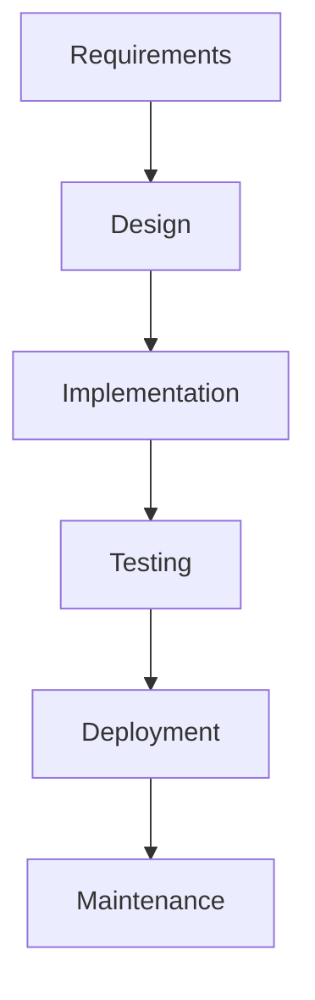

**Key characteristics:**
- Each phase must complete before the next begins
- No going back (in theory)
- Heavy documentation
- Customer sees product only at the end

**When to use Waterfall:**
- Requirements are 100% clear and won't change
- Regulatory/compliance projects
- Short projects with well-defined scope
- Hardware-dependent projects

**When NOT to use Waterfall:**
- Requirements may change
- Long projects (market may shift)
- Innovative/experimental products
- Customer needs fast feedback

### Internal Working — How SDLC Actually Flows in Production

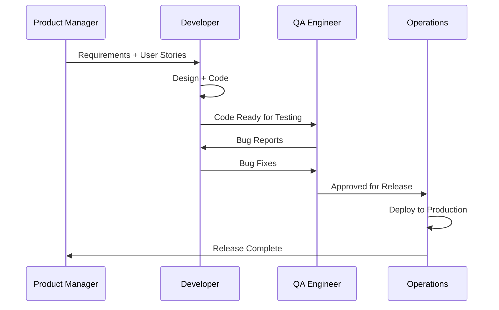

### Trade-offs

| Decision | Trade-off |
|----------|-----------|
| More planning upfront | Slower start but fewer changes later |
| Less documentation | Faster development but harder onboarding |
| More testing phases | Higher quality but longer cycle |
| Frequent releases | Faster feedback but more operational overhead |

---

## Agile Methodology

### Beginner Explanation

Imagine you're writing a novel. In **Waterfall**, you'd plan the entire plot, write all 40 chapters, then show it to readers. If they hate chapter 1, you've wasted months.

In **Agile**, you write 2 chapters at a time, show them to readers, get feedback, and adjust the story. After each batch, you deliver something readable.

**Agile = Build small, deliver fast, get feedback, improve, repeat.**

### Technical Explanation

Agile is an iterative approach to software development that delivers working software in small increments called **sprints** (typically 1-4 weeks). It values:

### The Agile Manifesto (4 Values)

| We Value | Over |
|----------|------|
| **Individuals and interactions** | Processes and tools |
| **Working software** | Comprehensive documentation |
| **Customer collaboration** | Contract negotiation |
| **Responding to change** | Following a plan |

### 12 Agile Principles (Simplified)

1. Satisfy customer through early, continuous delivery
2. Welcome changing requirements, even late
3. Deliver working software frequently (weeks, not months)
4. Business and developers work together daily
5. Build projects around motivated individuals
6. Face-to-face conversation is best
7. Working software is the primary measure of progress
8. Sustainable pace (no burnout)
9. Continuous attention to technical excellence
10. Simplicity — maximize work NOT done
11. Self-organizing teams
12. Regular reflection and adaptation

### Scrum Framework (Most Popular Agile Framework)

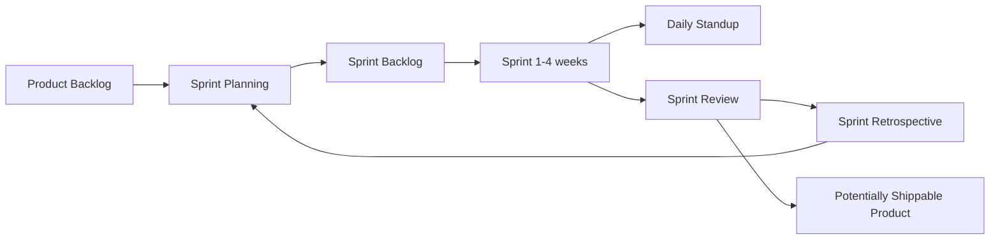

#### Scrum Roles

| Role | Responsibility |
|------|---------------|
| **Product Owner** | Defines WHAT to build, prioritizes backlog |
| **Scrum Master** | Removes blockers, facilitates ceremonies |
| **Development Team** | Self-organizing, builds the product (5-9 people) |

#### Scrum Ceremonies (Events)

| Ceremony | Duration | Purpose |
|----------|----------|---------|
| **Sprint Planning** | 2-4 hours | Select and plan work for the sprint |
| **Daily Standup** | 15 minutes | What did I do? What will I do? Blockers? |
| **Sprint Review** | 1-2 hours | Demo working software to stakeholders |
| **Sprint Retrospective** | 1-1.5 hours | What went well? What to improve? |

#### Scrum Artifacts

| Artifact | Description |
|----------|-------------|
| **Product Backlog** | Ordered list of everything needed in the product |
| **Sprint Backlog** | Items selected for this sprint + plan to deliver |
| **Increment** | Sum of all completed backlog items (must be usable) |

### Kanban (Alternative Agile Framework)


| Aspect | Scrum | Kanban |
|--------|-------|--------|
| Iterations | Fixed sprints | Continuous flow |
| Roles | PO, SM, Team | No prescribed roles |
| WIP Limits | Sprint capacity | Explicit per column |
| Changes | Wait for next sprint | Can add anytime |
| Best for | Product development | Support/maintenance |

### User Stories

Format: `As a [user type], I want [goal], so that [benefit]`

**Example:**
```
As a customer,
I want to reset my password via email,
so that I can regain access to my account if I forget it.

Acceptance Criteria:
- User receives reset email within 30 seconds
- Reset link expires after 24 hours
- Password must meet complexity requirements
- User gets confirmation after successful reset
```

### Story Points & Estimation

| Points | Complexity | Example |
|--------|------------|---------|
| 1 | Trivial | Change button color |
| 2 | Simple | Add form field |
| 3 | Moderate | New API endpoint |
| 5 | Complex | Payment integration |
| 8 | Very complex | New authentication system |
| 13 | Extremely complex | Database migration |

### Real-World Example: Sprint in Action

**Company:** E-commerce platform
**Sprint:** 2 weeks

```
Week 1:
- Day 1: Sprint Planning → Select 8 user stories (34 story points)
- Day 2-5: Development + Daily standups

Week 2:
- Day 6-8: Development + Testing
- Day 9: Sprint Review (demo to stakeholders)
- Day 10: Sprint Retrospective

Delivered: Search filter feature, cart bug fix, performance improvement
```

### Agile vs Waterfall — When to Use What

| Scenario | Use Agile | Use Waterfall |
|----------|-----------|---------------|
| Startup building MVP | ✅ | ❌ |
| Medical device software | ❌ | ✅ |
| Web application | ✅ | ❌ |
| Government contract (fixed scope) | ❌ | ✅ |
| Requirements change frequently | ✅ | ❌ |
| Need compliance documentation | ❌ | ✅ |

### Common Mistakes in Agile

1. **"Agile means no planning"** — Wrong. Agile plans continuously, in smaller chunks
2. **"No documentation needed"** — Wrong. Agile values working software MORE, not instead of docs
3. **"Scrum Master = Project Manager"** — Wrong. SM is a servant-leader, not a boss
4. **"Sprints can be extended"** — Wrong. Sprint length is fixed. Unfinished work goes back to backlog
5. **"Retrospectives are optional"** — Wrong. They're the most important ceremony for improvement

---

## CI/CD Basics

### Beginner Explanation

Think of a car factory:
- **CI (Continuous Integration):** Every worker puts their car part on the assembly line frequently. A robot checks instantly if the part fits correctly. If it doesn't fit, alarms go off immediately (not after the car is fully built).
- **CD (Continuous Delivery):** The finished car is automatically moved to the showroom, ready for sale at any time.
- **CD (Continuous Deployment):** The car is automatically sold and delivered to the customer without any human approval.

### Technical Explanation

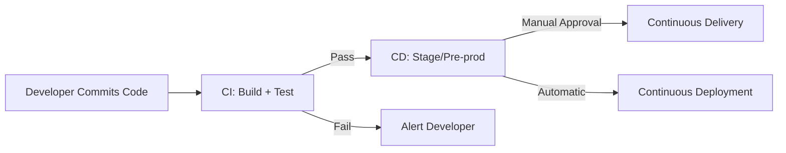

#### Continuous Integration (CI)

**Definition:** Developers merge their code changes into a shared repository frequently (multiple times a day). Each merge triggers an automated build and test pipeline.

**The CI Process — Step by Step:**

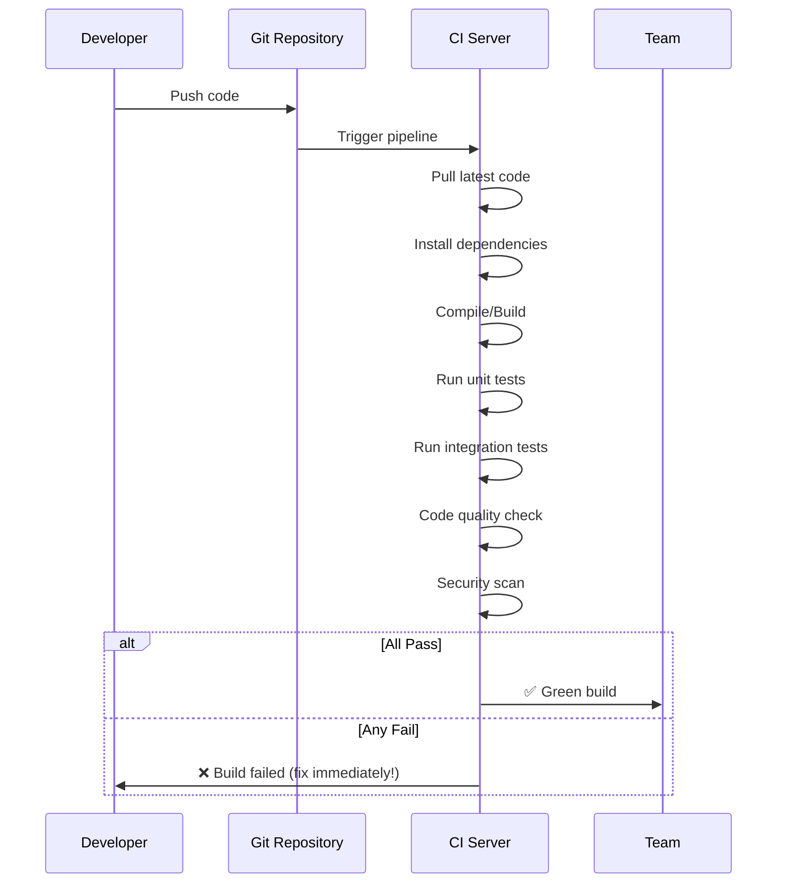

**CI Rules:**
1. Commit to mainline (main/trunk) at least once a day
2. Every commit triggers a build
3. Build must be fast (< 10 minutes ideal)
4. If build breaks, fix it IMMEDIATELY (top priority)
5. All tests must pass before merge

#### Continuous Delivery vs Continuous Deployment

| Aspect | Continuous Delivery | Continuous Deployment |
|--------|--------------------|-----------------------|
| **Definition** | Code is ALWAYS deployable | Code is AUTOMATICALLY deployed |
| **Human approval** | Required before production | Not required |
| **Risk** | Lower (human gate) | Higher (fully automated) |
| **Speed** | Fast (minutes to hours) | Fastest (minutes) |
| **Who uses it** | Most companies | Netflix, Amazon, Etsy |
| **Requirement** | Good test coverage | Excellent test coverage + feature flags |

### CI/CD Pipeline — Complete Flow

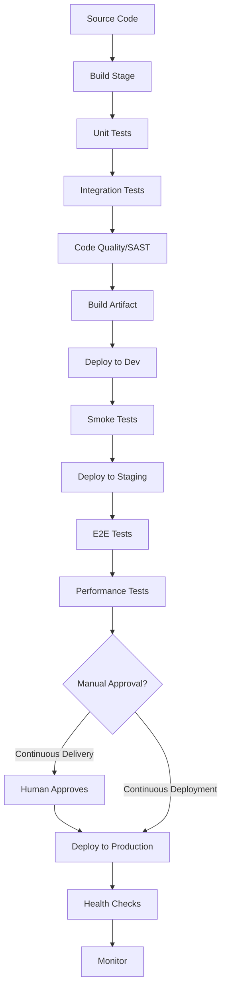

### Real CI/CD Pipeline Example (GitHub Actions)

```yaml
# .github/workflows/ci-cd.yml
name: CI/CD Pipeline

on:
  push:
    branches: [main]
  pull_request:
    branches: [main]

jobs:
  build:
    runs-on: ubuntu-latest
    steps:
      - uses: actions/checkout@v4
      
      - name: Set up Node.js
        uses: actions/setup-node@v4
        with:
          node-version: '20'
          
      - name: Install dependencies
        run: npm ci
        
      - name: Run linting
        run: npm run lint
        
      - name: Run unit tests
        run: npm test -- --coverage
        
      - name: Build application
        run: npm run build

  deploy-staging:
    needs: build
    runs-on: ubuntu-latest
    if: github.ref == 'refs/heads/main'
    steps:
      - name: Deploy to staging
        run: |
          echo "Deploying to staging environment..."
          # deployment commands here

  deploy-production:
    needs: deploy-staging
    runs-on: ubuntu-latest
    environment: production  # Requires manual approval
    steps:
      - name: Deploy to production
        run: |
          echo "Deploying to production..."
          # deployment commands here
```

### Jenkins Pipeline Example

```groovy
// Jenkinsfile
pipeline {
    agent any
    
    stages {
        stage('Checkout') {
            steps {
                git branch: 'main', url: 'https://github.com/org/repo.git'
            }
        }
        
        stage('Build') {
            steps {
                sh 'mvn clean compile'
            }
        }
        
        stage('Unit Test') {
            steps {
                sh 'mvn test'
            }
            post {
                always {
                    junit 'target/surefire-reports/*.xml'
                }
            }
        }
        
        stage('Integration Test') {
            steps {
                sh 'mvn verify -P integration-tests'
            }
        }
        
        stage('Build Docker Image') {
            steps {
                sh 'docker build -t myapp:${BUILD_NUMBER} .'
            }
        }
        
        stage('Deploy to Staging') {
            steps {
                sh 'kubectl apply -f k8s/staging/'
            }
        }
        
        stage('Deploy to Production') {
            input {
                message "Deploy to production?"
                ok "Yes, deploy it!"
            }
            steps {
                sh 'kubectl apply -f k8s/production/'
            }
        }
    }
    
    post {
        failure {
            slackSend channel: '#alerts', message: "Build FAILED: ${env.JOB_NAME}"
        }
    }
}
```

### Key CI/CD Concepts

| Concept | Explanation |
|---------|-------------|
| **Build Artifact** | The output of the build process (JAR, Docker image, binary) |
| **Pipeline** | Automated sequence of stages from commit to deploy |
| **Stage** | A logical grouping of steps (build, test, deploy) |
| **Gate** | A checkpoint that must pass before proceeding |
| **Rollback** | Reverting to a previous known-good version |
| **Feature Flag** | Toggle to enable/disable features without deployment |
| **Trunk-Based Development** | All devs commit to main branch frequently |

### Advantages of CI/CD

| Advantage | Explanation |
|-----------|-------------|
| Fast feedback | Know within minutes if code is broken |
| Reduced risk | Small changes = small failures |
| Higher quality | Automated testing catches bugs early |
| Faster delivery | Minutes/hours instead of weeks/months |
| Developer confidence | Safe to refactor with test safety net |
| Reduced manual work | No manual build/deploy processes |

### Common CI/CD Mistakes

1. **Slow pipelines** — Pipeline takes 1 hour → developers avoid running it
2. **Flaky tests** — Tests that randomly fail → team ignores failures
3. **No rollback plan** — Deploy fails with no way to revert quickly
4. **Testing only in CI** — Developers should run tests locally first
5. **Shared environments** — Multiple pipelines deploying to same environment
6. **No build artifacts** — Rebuilding for each environment instead of promoting artifacts

---

## Dev vs Ops — The Cultural Divide

### Beginner Explanation

Imagine a restaurant:
- **Chefs (Developers):** Want to try new recipes, experiment with exotic ingredients, change the menu weekly
- **Restaurant Managers (Operations):** Want consistency, predictability, no surprises, happy customers

The chef's goal is INNOVATION. The manager's goal is STABILITY. These goals naturally conflict.

**DevOps bridges this gap** — the chef and manager work together to innovate WITHOUT causing chaos.

### Technical Explanation — The Wall of Confusion

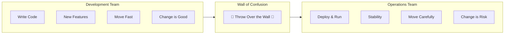

### The Fundamental Conflict

| Aspect | Developers Want | Operations Want |
|--------|----------------|-----------------|
| **Goal** | Ship features fast | Keep systems stable |
| **Change** | Frequent changes | Minimal changes |
| **Speed** | Deploy immediately | Careful, planned deploys |
| **Risk** | Acceptable (move fast) | Minimize at all costs |
| **Success** | Features shipped | Uptime, SLAs met |
| **Blame** | "Works on my machine" | "Dev gave us broken code" |

### What Each Team Does

#### Development Team Responsibilities

| Task | Description |
|------|-------------|
| Write application code | Business logic, features |
| Write unit/integration tests | Ensure code quality |
| Code reviews | Peer review for quality |
| Debug application issues | Fix bugs in code |
| Choose frameworks/libraries | Technical decisions |
| API design | Define interfaces |

#### Operations Team Responsibilities

| Task | Description |
|------|-------------|
| Server provisioning | Set up infrastructure |
| Deployment execution | Get code to production |
| Monitoring & alerting | Watch system health |
| Incident response | Fix production issues |
| Capacity planning | Ensure enough resources |
| Security patches | Keep systems updated |
| Backup & disaster recovery | Data protection |

### How DevOps Resolves the Conflict

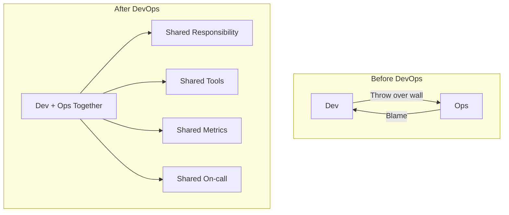

### DevOps Practices That Bridge the Gap

| Practice | How It Helps |
|----------|-------------|
| **Infrastructure as Code** | Devs can understand and modify infra |
| **Shared monitoring** | Both teams see same dashboards |
| **Automated deployments** | No manual handoff needed |
| **Shared on-call** | Devs feel the pain of bad code in production |
| **Blameless postmortems** | Focus on fixing systems, not blaming people |
| **ChatOps** | Communication in shared channels |
| **"You build it, you run it"** | Full ownership from code to production |

### Team Structures in DevOps

| Model | Description | Pros | Cons |
|-------|-------------|------|------|
| **Embedded Ops** | Ops engineers sit within dev teams | Close collaboration | Ops knowledge fragmented |
| **Platform Team** | Central team builds tools for devs | Consistency, expertise | Can become bottleneck |
| **SRE Model** (Google) | Software engineers do operations | Automation-first | Requires strong engineers |
| **Full-stack Teams** | Teams own everything end-to-end | Full ownership | Broad skill requirements |

### Real-World Example

**Before DevOps at a Company:**
```
Monday: Dev finishes feature
Tuesday: Dev writes "deployment document" (10 pages)
Wednesday: Change Advisory Board (CAB) reviews request
Thursday: CAB approves (or rejects and delays 2 weeks)
Friday (2 AM): Ops deploys manually following document
Saturday: System breaks, Ops calls Dev at 3 AM
Sunday: Blame game in email threads
```

**After DevOps:**
```
Monday: Dev finishes feature, pushes to main
Monday: Automated pipeline runs tests (10 min)
Monday: Pipeline deploys to staging automatically
Monday: Automated E2E tests pass
Monday: Dev clicks "Approve" → deploys to production
Monday: Monitoring shows all green
If issue: Automated rollback within 5 minutes
```

---

## Deployment Lifecycle

### Beginner Explanation

Think of launching a space shuttle:
1. **Build the shuttle** (build the code)
2. **Test all systems** (run tests)
3. **Move to launch pad** (deploy to staging)
4. **Final checks** (smoke tests)
5. **Launch!** (deploy to production)
6. **Monitor flight** (production monitoring)
7. **Emergency abort** (rollback plan)

The deployment lifecycle is every step from "code is ready" to "code is running safely in production."

### Technical Explanation

The deployment lifecycle covers the end-to-end process of getting code from a developer's machine to production and keeping it healthy.

### Complete Deployment Lifecycle Flow

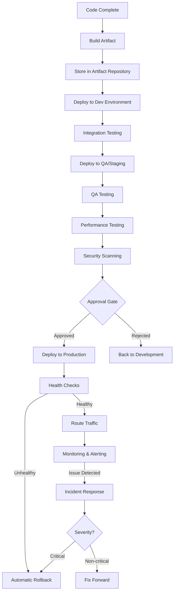

### Environments

| Environment | Purpose | Who Uses It | Data |
|-------------|---------|-------------|------|
| **Local/Dev** | Developer testing | Individual devs | Mock/local data |
| **Integration/Dev** | Shared testing | Dev team | Shared test data |
| **QA/Staging** | Pre-production testing | QA team | Production-like data |
| **Pre-prod** | Final validation | Ops + QA | Anonymized prod data |
| **Production** | Real users | Everyone (monitoring) | Real data |

### Deployment Strategies — Deep Dive

#### 1. Big Bang Deployment

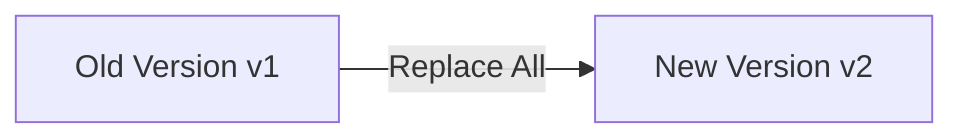

| Aspect | Details |
|--------|---------|
| **How** | Stop old version, deploy new version, start |
| **Downtime** | Yes (minutes to hours) |
| **Risk** | Very high |
| **Rollback** | Slow (redeploy old version) |
| **Use when** | Small apps, scheduled maintenance windows |

#### 2. Rolling Deployment

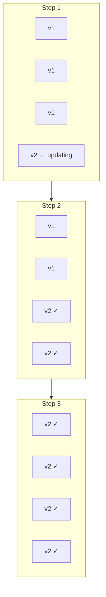

| Aspect | Details |
|--------|---------|
| **How** | Replace instances one by one |
| **Downtime** | Zero |
| **Risk** | Medium (mixed versions temporarily) |
| **Rollback** | Medium speed (reverse the rolling update) |
| **Use when** | Stateless services, API servers |

**Kubernetes Rolling Update Command:**
```bash
kubectl set image deployment/myapp myapp=myapp:v2
kubectl rollout status deployment/myapp
# If issues:
kubectl rollout undo deployment/myapp
```

#### 3. Blue-Green Deployment

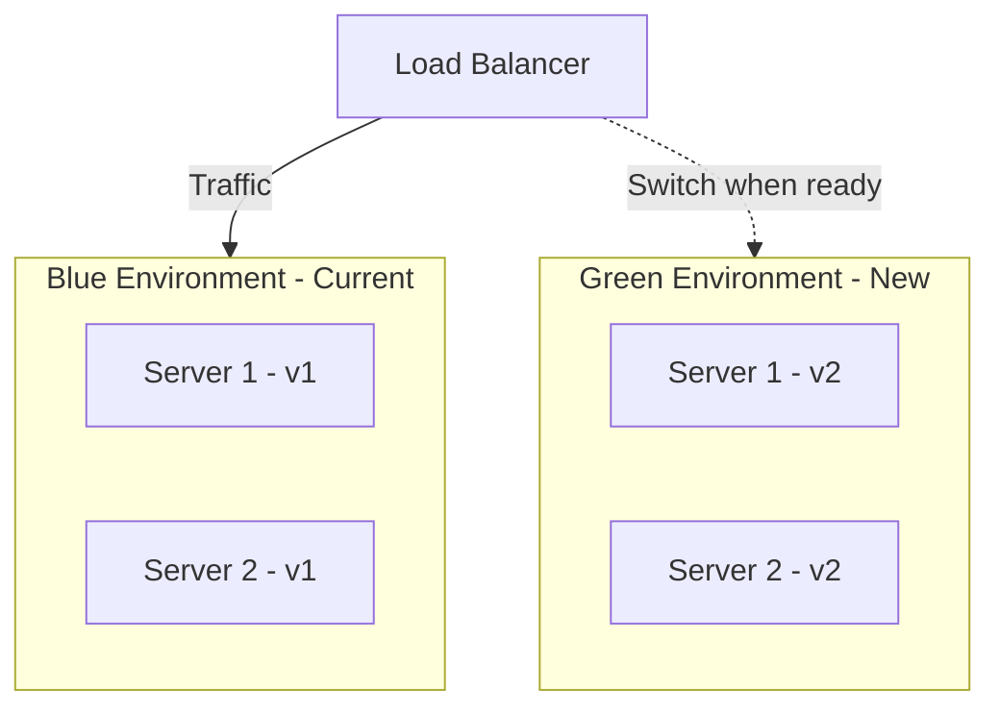

| Aspect | Details |
|--------|---------|
| **How** | Run two identical environments, switch traffic |
| **Downtime** | Zero |
| **Risk** | Low (instant rollback by switching back) |
| **Rollback** | Instant (switch traffic back to blue) |
| **Cost** | High (double infrastructure) |
| **Use when** | Critical applications, need instant rollback |

**Implementation with Nginx:**
```nginx
# Before switch (traffic goes to blue)
upstream backend {
    server blue-server-1:8080;
    server blue-server-2:8080;
}

# After switch (traffic goes to green)
upstream backend {
    server green-server-1:8080;
    server green-server-2:8080;
}
```

#### 4. Canary Deployment

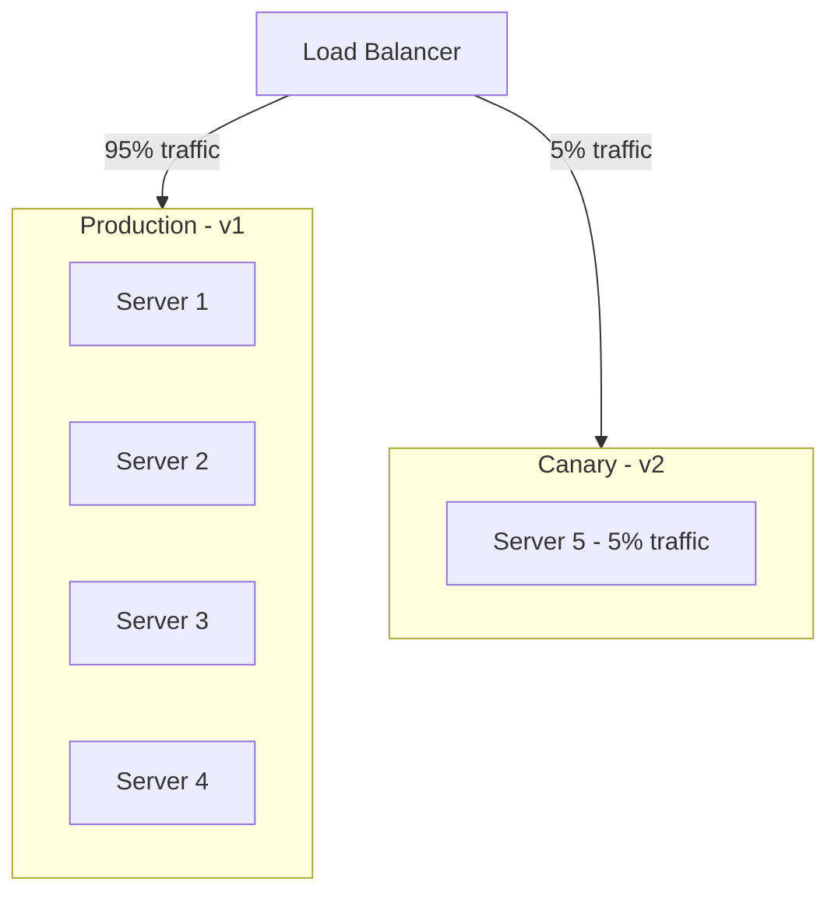

| Aspect | Details |
|--------|---------|
| **How** | Deploy to small subset, gradually increase traffic |
| **Downtime** | Zero |
| **Risk** | Very low (only small % of users affected) |
| **Rollback** | Fast (remove canary instances) |
| **Use when** | Large user base, need data-driven confidence |

**Canary Progression Example:**
```
Step 1: 5% traffic to v2 → monitor 15 min → error rate OK?
Step 2: 25% traffic to v2 → monitor 30 min → latency OK?
Step 3: 50% traffic to v2 → monitor 1 hour → all metrics OK?
Step 4: 100% traffic to v2 → deployment complete
```

#### 5. Feature Flags (Toggle-Based Deployment)

```python
# Feature flag implementation
import featureflags

def get_search_results(query, user):
    if featureflags.is_enabled('new_search_algorithm', user):
        return new_search(query)  # New code
    else:
        return old_search(query)  # Old code
```

| Aspect | Details |
|--------|---------|
| **How** | Deploy code disabled, enable via configuration |
| **Downtime** | Zero |
| **Risk** | Very low (toggle off instantly) |
| **Rollback** | Instant (toggle flag off) |
| **Use when** | A/B testing, gradual rollouts, risky features |

### Deployment Strategy Comparison

| Strategy | Downtime | Risk | Cost | Rollback Speed | Complexity |
|----------|----------|------|------|---------------|------------|
| Big Bang | Yes | High | Low | Slow | Low |
| Rolling | No | Medium | Low | Medium | Medium |
| Blue-Green | No | Low | High | Instant | Medium |
| Canary | No | Very Low | Medium | Fast | High |
| Feature Flags | No | Very Low | Low | Instant | High (code) |

### Post-Deployment — Health Checks & Monitoring

```yaml
# Kubernetes health check configuration
apiVersion: apps/v1
kind: Deployment
metadata:
  name: myapp
spec:
  template:
    spec:
      containers:
      - name: myapp
        image: myapp:v2
        livenessProbe:
          httpGet:
            path: /health
            port: 8080
          initialDelaySeconds: 30
          periodSeconds: 10
        readinessProbe:
          httpGet:
            path: /ready
            port: 8080
          initialDelaySeconds: 5
          periodSeconds: 5
```

| Check Type | Purpose | Example |
|------------|---------|---------|
| **Liveness Probe** | Is the app alive? | `GET /health` → 200 |
| **Readiness Probe** | Can the app serve traffic? | `GET /ready` → 200 |
| **Startup Probe** | Has the app finished starting? | `GET /startup` → 200 |
| **Smoke Test** | Does the core functionality work? | Create user → login → verify |

### Rollback Strategies

```bash
# Kubernetes rollback
kubectl rollout undo deployment/myapp

# Rollback to specific revision
kubectl rollout undo deployment/myapp --to-revision=3

# Check rollout history
kubectl rollout history deployment/myapp
```

### Best Practices for Deployment

1. **Always have a rollback plan** before deploying
2. **Deploy during low-traffic periods** for risky changes
3. **Use immutable artifacts** — same binary in every environment
4. **Never deploy on Friday** (unless you have confidence + monitoring)
5. **Automate everything** — manual steps cause errors
6. **Monitor after every deployment** — don't "fire and forget"
7. **Use deployment checklists** — even with automation
8. **Keep deployments small** — easier to debug if something breaks

---

## Interview Mastery

### Beginner Interview Questions

---

**Q1: What is DevOps? Explain in simple terms.**

**Perfect Answer:**
> "DevOps is a set of cultural practices and tools that bridges the gap between development and operations teams. Its core goal is to shorten the software delivery lifecycle while maintaining high quality. It achieves this through automation, continuous integration, continuous delivery, and a culture of shared responsibility. The key metrics we track are deployment frequency, lead time for changes, mean time to recovery, and change failure rate — known as the DORA metrics."

**How to answer confidently:** Start with the definition, mention it's culture + tools (not just tools), give 2-3 specific practices, and end with how you measure success.

**Hidden interviewer expectation:** They want to see you understand it's NOT just about tools — it's a cultural shift.

---

**Q2: What is the difference between CI and CD?**

**Perfect Answer:**
> "CI (Continuous Integration) is the practice of developers merging code to the main branch frequently — ideally multiple times a day — with each merge triggering an automated build and test. The goal is to catch integration issues early.
>
> CD has two meanings:
> - **Continuous Delivery** means code is always in a deployable state. After CI passes, code CAN be deployed to production at any time with a manual approval step.
> - **Continuous Deployment** means every change that passes all pipeline stages is automatically deployed to production without human intervention.
>
> The key difference: Continuous Delivery requires a human to press the button; Continuous Deployment is fully automated."

**Practical example:** "In my experience, most companies start with Continuous Delivery because it gives them a safety net. Companies like Netflix and Amazon practice Continuous Deployment because they have extensive automated testing and feature flags."

---

**Q3: What is SDLC? What are its phases?**

**Perfect Answer:**
> "SDLC stands for Software Development Life Cycle. It's a structured process that defines the stages of building software. The six main phases are:
> 1. **Planning/Requirements** — gathering what needs to be built
> 2. **Design** — architecture and system design
> 3. **Implementation** — actual coding
> 4. **Testing** — verifying quality
> 5. **Deployment** — releasing to production
> 6. **Maintenance** — ongoing support and updates
>
> Different SDLC models arrange these phases differently — Waterfall does them sequentially, while Agile does them iteratively in short sprints."

---

**Q4: What is Agile? How is it different from Waterfall?**

**Perfect Answer:**
> "Agile is an iterative approach to software development that delivers working software in small increments called sprints (typically 2 weeks). The fundamental difference from Waterfall is:
>
> **Waterfall:** Sequential, plan everything upfront, deliver at the end, change is expensive.
> **Agile:** Iterative, plan as you go, deliver every sprint, change is welcome.
>
> Agile works best when requirements are uncertain or evolving. Waterfall works best when requirements are fixed and well-understood — like regulatory or compliance projects.
>
> The most popular Agile framework is Scrum, which has defined roles (Product Owner, Scrum Master, Dev Team), ceremonies (Sprint Planning, Daily Standup, Review, Retrospective), and artifacts (Product Backlog, Sprint Backlog, Increment)."

---

### Intermediate Interview Questions

---

**Q5: Explain the CALMS framework in DevOps.**

**Perfect Answer:**
> "CALMS is a framework for assessing DevOps maturity:
> - **Culture:** Breaking silos, shared ownership. Example: developers participating in on-call rotation.
> - **Automation:** Automating repetitive tasks. Example: CI/CD pipelines, infrastructure provisioning.
> - **Lean:** Eliminating waste, work in small batches. Example: reducing unnecessary approval gates.
> - **Measurement:** Data-driven decisions. Example: tracking DORA metrics, monitoring error budgets.
> - **Sharing:** Knowledge sharing, blameless postmortems. Example: internal tech talks, shared runbooks.
>
> When I assess an organization's DevOps maturity, I evaluate each of these pillars and identify the weakest link, because DevOps is only as strong as its weakest pillar."

---

**Q6: What are DORA metrics? Why do they matter?**

**Perfect Answer:**
> "DORA (DevOps Research and Assessment) metrics are four key metrics that measure software delivery performance:
>
> 1. **Deployment Frequency** — How often you deploy to production. Elite: on-demand, multiple times/day.
> 2. **Lead Time for Changes** — Time from commit to production. Elite: less than one hour.
> 3. **Mean Time to Recovery (MTTR)** — Time to recover from failures. Elite: less than one hour.
> 4. **Change Failure Rate** — Percentage of deployments causing failures. Elite: 0-15%.
>
> They matter because research (from the book *Accelerate*) shows these metrics directly correlate with organizational performance — companies that excel in these metrics also excel in profitability, market share, and customer satisfaction. They also disprove the myth that speed and stability are trade-offs — elite performers are BOTH faster AND more stable."

---

**Q7: Explain blue-green deployment vs canary deployment.**

**Perfect Answer:**
> "Both are zero-downtime deployment strategies, but they differ in approach:
>
> **Blue-Green:** You maintain two identical production environments. Blue runs the current version, Green gets the new version. After testing Green, you switch ALL traffic instantly from Blue to Green. Rollback is instant — switch back to Blue.
>
> **Canary:** You deploy the new version to a SMALL subset (e.g., 5% of traffic). You monitor metrics. If healthy, gradually increase to 25%, 50%, 100%. If not, you roll back just the canary.
>
> **Key differences:**
> - Blue-Green is all-or-nothing; Canary is gradual
> - Blue-Green requires double infrastructure; Canary doesn't
> - Canary gives you real-user data before full rollout
> - Blue-Green rollback is instant; Canary rollback affects fewer users
>
> **When to choose:**
> - Blue-Green: when you need instant, guaranteed rollback
> - Canary: when you want data-driven confidence before full rollout, especially with large user bases"

---

**Q8: What is the "Wall of Confusion" in DevOps?**

**Perfect Answer:**
> "The Wall of Confusion refers to the traditional divide between Development and Operations teams where each team has conflicting goals:
> - Developers are incentivized to ship features FAST (change is good)
> - Operations are incentivized to keep systems STABLE (change is risk)
>
> This creates a pattern where developers 'throw code over the wall' to operations, who then struggle to deploy and maintain it. When things break, it becomes a blame game.
>
> DevOps removes this wall through:
> - Shared responsibility ('you build it, you run it')
> - Automated pipelines (no manual handoff)
> - Shared metrics (both teams measured on same KPIs)
> - Blameless postmortems (focus on systems, not people)
> - Cross-functional teams (embedded ops engineers or platform teams)"

---

### Advanced Interview Questions

---

**Q9: How would you implement a CI/CD pipeline from scratch for a microservices architecture?**

**Perfect Answer:**
> "I'd approach this systematically:
>
> **1. Source Control Strategy:**
> - Mono-repo or multi-repo (I'd choose multi-repo for team autonomy)
> - Trunk-based development with short-lived feature branches
>
> **2. CI Pipeline (per service):**
> - Trigger on PR and merge to main
> - Build → Unit Tests → Integration Tests → SAST scan → Build Docker image → Push to registry
> - Each service has its own pipeline, owns its own tests
>
> **3. CD Pipeline:**
> - Deploy to Dev environment automatically on merge
> - Deploy to Staging with integration + E2E tests
> - Deploy to Production with canary strategy (5% → 25% → 100%)
> - Automated rollback if error rate exceeds threshold
>
> **4. Cross-cutting concerns:**
> - Contract testing between services (Pact)
> - Shared CI templates for consistency
> - Centralized artifact repository (ECR/Artifactory)
> - Feature flags for decoupling deploy from release
>
> **5. Observability:**
> - Deployment events in monitoring dashboards
> - Automated health checks post-deployment
> - Error budget tracking for each service
>
> **Tools I'd use:** GitHub Actions (CI), ArgoCD (CD), Docker (packaging), Kubernetes (orchestration), Prometheus+Grafana (monitoring), PagerDuty (alerting)."

---

**Q10: Your deployment just caused a 50% increase in error rate. Walk me through your response.**

**Perfect Answer:**
> "I'd follow this incident response framework:
>
> **Immediate (0-5 minutes):**
> 1. Confirm the issue via monitoring dashboards (Grafana/Datadog)
> 2. Check: Is this affecting users? Which endpoints? Which regions?
> 3. Decision: Roll back immediately if error rate is climbing or above SLO
>
> **Rollback (5-10 minutes):**
> ```bash
> kubectl rollout undo deployment/affected-service
> ```
> 4. Verify: Error rate returning to baseline?
> 5. Communicate: Post in incident channel, page on-call if needed
>
> **Investigation (post-rollback):**
> 6. Compare: What changed between v1 and v2?
> 7. Check logs: Are errors from the new code or a dependency?
> 8. Check metrics: Was it all traffic or specific paths?
> 9. Reproduce: Can we reproduce in staging?
>
> **Resolution:**
> 10. Fix the root cause in code
> 11. Add test coverage for the failure scenario
> 12. Re-deploy with canary (smaller traffic %) and closer monitoring
>
> **Postmortem:**
> 13. Blameless postmortem document
> 14. Action items: What detection could have been faster? What test was missing?
>
> **Key principle:** Rollback FIRST, investigate SECOND. Never debug production while users are impacted."

---

**Q11: Explain the concept of "shifting left" in DevOps. Give practical examples.**

**Perfect Answer:**
> "'Shifting left' means performing activities earlier in the development lifecycle to catch issues sooner, when they're cheaper and easier to fix.
>
> **Practical examples:**
>
> | Traditional (Right) | Shifted Left |
> |---|---|
> | Security testing in production | SAST/DAST in CI pipeline |
> | Performance testing before release | Load tests on every PR |
> | Code review at end of sprint | Pair programming / small PRs |
> | Ops debugging production issues | Developers write monitoring/alerts |
> | QA finds bugs after development | TDD (tests written before code) |
>
> **Cost of fixing bugs by stage:**
> - Design phase: $1
> - Development: $10
> - Testing: $100
> - Production: $1,000+
>
> **Examples in practice:**
> - **Shift-left security:** Running Snyk/Trivy in CI to catch vulnerable dependencies before merge
> - **Shift-left testing:** Unit and integration tests in pre-commit hooks
> - **Shift-left quality:** Linting and static analysis as IDE plugins
> - **Shift-left ops:** Developers define Terraform and Kubernetes manifests alongside application code"

---

### Scenario-Based Questions

---

**Q12: Your company deploys once a month. Management wants to move to daily deployments. How would you approach this?**

**Perfect Answer:**
> "I'd approach this as a transformation journey, not a switch. Here's my phased plan:
>
> **Phase 1: Foundation (Weeks 1-4)**
> - Audit current deployment process (document manual steps)
> - Set up version control for everything (code + config + infra)
> - Implement basic CI: automated build + unit tests on every commit
> - Establish baseline DORA metrics
>
> **Phase 2: Automate Delivery (Weeks 5-8)**
> - Containerize applications (Docker)
> - Build automated deployment pipeline to staging
> - Add integration tests and smoke tests
> - Implement feature flags to decouple deploy from release
>
> **Phase 3: Increase Confidence (Weeks 9-12)**
> - Add production monitoring and alerting
> - Implement automated rollback
> - Practice with weekly deployments
> - Train teams on on-call and incident response
>
> **Phase 4: Daily Deployments (Weeks 13-16)**
> - Move to trunk-based development
> - Implement canary deployments
> - Target: daily deployments to production
> - Monitor DORA metrics for improvement
>
> **Key success factors:**
> - Executive sponsorship (cultural change needs top-down support)
> - Start with one team/service as a pilot
> - Celebrate small wins
> - Don't sacrifice reliability for speed — they should improve TOGETHER"

---

**Q13: A developer says "It works on my machine." How do you solve this problem permanently?**

**Perfect Answer:**
> "This is one of the classic problems DevOps solves. The root cause is environment inconsistency. Here's how I'd address it permanently:
>
> **Immediate solutions:**
> 1. **Docker:** Package the application with ALL its dependencies. `Dockerfile` ensures same environment everywhere.
> 2. **Docker Compose:** Define the complete local development environment (app + database + cache)
>
> ```dockerfile
> FROM node:20-alpine
> WORKDIR /app
> COPY package*.json ./
> RUN npm ci
> COPY . .
> CMD ["npm", "start"]
> ```
>
> **Systemic solutions:**
> 3. **CI builds in containers** — Same Docker image used in CI and production
> 4. **Infrastructure as Code** — Environments defined in Terraform, guaranteed identical
> 5. **Immutable artifacts** — Build once, promote the same artifact through environments
> 6. **Dev containers** (VS Code) — Standardized development environments
>
> **Cultural solutions:**
> 7. **Pipeline is the source of truth** — If it doesn't pass in CI, it doesn't work
> 8. **Pre-commit hooks** — Run same linting/tests locally that CI runs
>
> **The principle: If it can't be reproduced in the pipeline, it doesn't exist.**"

---

### FAANG-Style Conceptual Questions

---

**Q14: If you had to design the CI/CD system for a company with 1000 developers and 500 microservices, what would be your key design decisions?**

**Perfect Answer:**
> "At this scale, the key challenges are speed, consistency, and developer autonomy. My design decisions:
>
> **1. Platform approach:**
> - Build an Internal Developer Platform (IDP)
> - Self-service: developers define pipelines via YAML in their repos
> - Platform team maintains shared pipeline templates and infrastructure
>
> **2. Architecture:**
> - Multi-repo (one repo per service for team autonomy)
> - Shared CI template library (common stages that services compose)
> - Centralized artifact registry with retention policies
> - Dedicated build infrastructure with auto-scaling (Kubernetes-based runners)
>
> **3. Pipeline design:**
> - Standardized stages: lint → test → build → security → deploy
> - Service-specific customization via pipeline config
> - Parallel execution wherever possible (build time < 10 min target)
> - Caching: dependency caches, Docker layer caches, build caches
>
> **4. Deployment:**
> - Progressive delivery: canary by default, configurable per service
> - GitOps (ArgoCD): desired state in Git, auto-reconciliation
> - Environment promotion: dev → staging → production
> - Automated rollback based on SLOs
>
> **5. Governance:**
> - Policy as Code: OPA/Kyverno for deployment policies
> - Required security scans (no bypass)
> - Deployment windows for critical services
> - Audit trail for all deployments
>
> **6. Scalability concerns:**
> - Avoid single CI server bottleneck (distributed runners)
> - Queue management for peak times
> - Cost optimization (spot instances for CI jobs)
> - Observability of the platform itself (build times, success rates)"

---

**Q15: What is "GitOps" and how does it relate to traditional CI/CD?**

**Perfect Answer:**
> "GitOps is an operational framework where Git is the single source of truth for both application code AND infrastructure/deployment configuration.
>
> **Core principles:**
> 1. **Declarative:** Desired state is described in Git (YAML/HCL)
> 2. **Versioned:** All changes go through Git (pull requests, audit trail)
> 3. **Automated:** Agents pull desired state and reconcile with actual state
> 4. **Self-healing:** Drift is automatically corrected
>
> **How it differs from traditional CI/CD:**
>
> | Traditional CI/CD | GitOps |
> |---|---|
> | CI pushes changes TO cluster | Agent PULLS desired state FROM Git |
> | Pipeline has cluster credentials | Only the agent has cluster credentials |
> | Imperative (do this, then that) | Declarative (this is the desired state) |
> | Drift can go unnoticed | Drift is auto-corrected |
>
> **Example flow:**
> ```
> Developer → PR to update deployment YAML → Review → Merge
> ArgoCD detects change → Compares to actual cluster state → Applies diff
> ```
>
> **Tools:** ArgoCD, Flux, Jenkins X
>
> **Key benefit:** If someone manually changes something in production (kubectl edit), GitOps agent will detect the drift and revert it back to what's in Git. Git becomes the single source of truth."

---

### Real Production Debugging Questions

---

**Q16: Your CI pipeline has become very slow (45 minutes). How would you optimize it?**

**Perfect Answer:**
> "I'd approach this systematically:
>
> **1. Measure first:**
> - Which stages take the most time? (Often: dependency install, tests, Docker build)
> - Is it CPU/memory/network bound?
>
> **2. Quick wins:**
> - **Dependency caching:** Cache node_modules/pip packages between runs
> - **Docker layer caching:** Structure Dockerfile so code changes don't invalidate dependency layers
> - **Parallel test execution:** Split tests across multiple runners
> - **Only run what changed:** If only service-A changed, only test service-A
>
> **3. Architecture changes:**
> - **Parallelise stages:** Build + lint + security scan can run simultaneously
> - **Test splitting:** Unit tests (fast, parallel) vs integration tests (slower, serial)
> - **Pre-built base images:** Don't install OS packages in every run
>
> **4. Infrastructure:**
> - Larger CI runners (more CPU/RAM)
> - Local artifact caches (avoid downloading from internet)
> - Dedicated test databases (avoid shared resources)
>
> **5. Test optimization:**
> - Remove flaky tests or fix them
> - Remove duplicate tests
> - Use test impact analysis (only run tests affected by the change)
>
> **Target:** CI should take < 10 minutes for fast feedback. If tests legitimately take longer, split into 'fast' (blocks merge) and 'full' (runs post-merge)."

---

**Q17: A deployment went out and now 5% of users are seeing errors, but your canary didn't catch it. What happened and how would you prevent it?**

**Perfect Answer:**
> "This is a canary effectiveness problem. Several things could cause canary to miss issues:
>
> **Root causes:**
> 1. **Traffic sampling bias:** Canary got only synthetic/internal traffic, not real user patterns
> 2. **Insufficient bake time:** Promoted too quickly before the error manifested
> 3. **Wrong metrics monitored:** Watching latency but the issue was data corruption (silent failure)
> 4. **Dependency timing:** The bug triggers only after the cache expires or at specific time intervals
> 5. **User segmentation:** Bug only affects users with specific data (e.g., users with > 100 items in cart)
>
> **Immediate action:**
> - Roll back the deployment
> - Identify the specific user segment affected
> - Fix the bug and add targeted test coverage
>
> **Prevention measures:**
> 1. **Better canary metrics:** Monitor business metrics (conversion rate, checkout success), not just technical metrics (latency, error rate)
> 2. **Longer bake time:** Minimum 30 minutes before promoting, longer for critical services
> 3. **Real user traffic:** Ensure canary gets representative traffic (not just health checks)
> 4. **Segmented canary:** Route specific user segments to canary to catch data-dependent bugs
> 5. **Feature flags with gradual rollout:** Even after deploy, enable feature for 1% → 5% → 25% → 100%
> 6. **Error budget alerting:** If error budget burn rate increases, auto-pause rollout"

---

### Quick-Fire Interview Questions & Answers

| Question | Perfect One-Line Answer |
|----------|----------------------|
| What does "Infrastructure as Code" mean? | Managing infrastructure through version-controlled code files instead of manual processes |
| What is a "blameless postmortem"? | A post-incident review focused on systemic failures and improvements, not individual blame |
| What's the difference between a monolith and microservices? | Monolith is one deployable unit; microservices are independently deployable services communicating via APIs |
| What is "configuration drift"? | When actual infrastructure state diverges from the defined/intended state |
| What does "immutable infrastructure" mean? | Servers are never modified after deployment — they're replaced entirely with new versions |
| What is "shift left"? | Performing testing, security, and quality checks earlier in the development process |
| What is an SLA vs SLO vs SLI? | SLI = metric, SLO = target for that metric, SLA = contract with consequences |
| What is "toil" in SRE? | Repetitive, manual, automatable work that scales linearly with service growth |
| What is an "error budget"? | The allowed amount of unreliability (100% - SLO). Spend it on innovation, exhaust it → freeze deploys |
| What is trunk-based development? | All developers commit directly to main branch (or very short-lived branches), enabling CI |

---

[⬇️ Download This File](#)

---

**✅ Phase 1 Complete. Waiting for your confirmation to generate Phase 2 — Linux for DevOps.**
