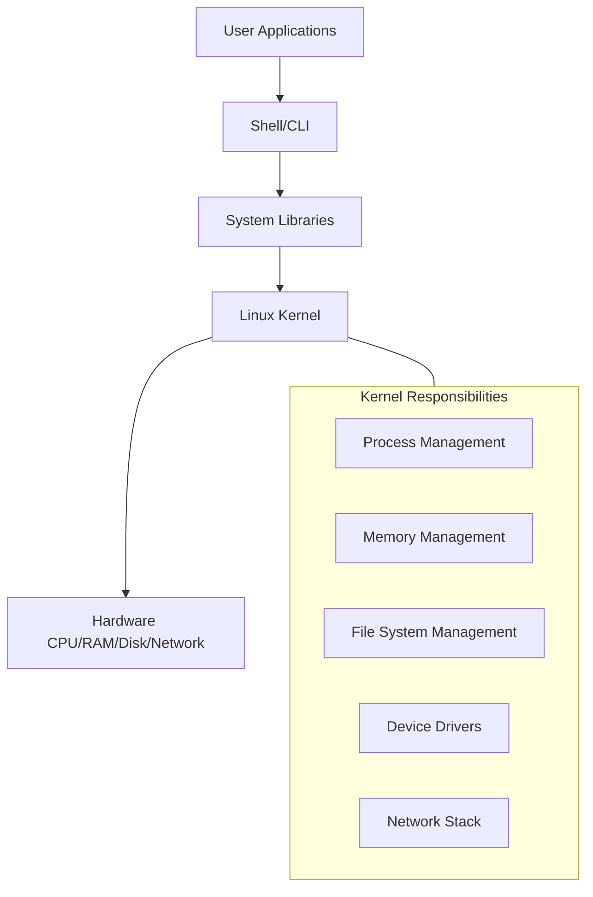
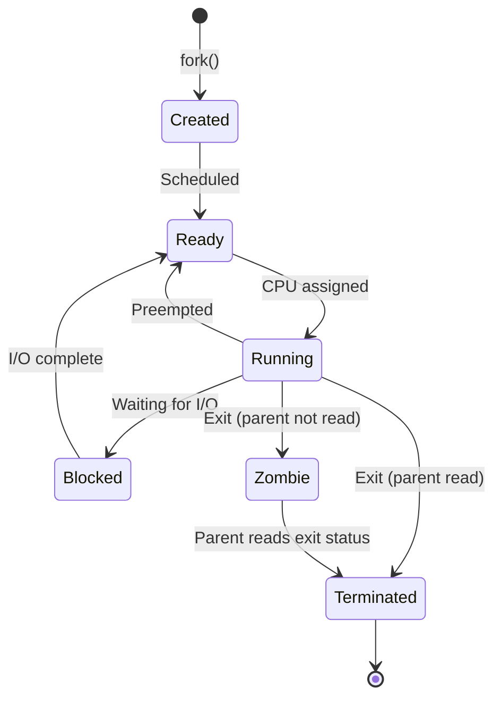
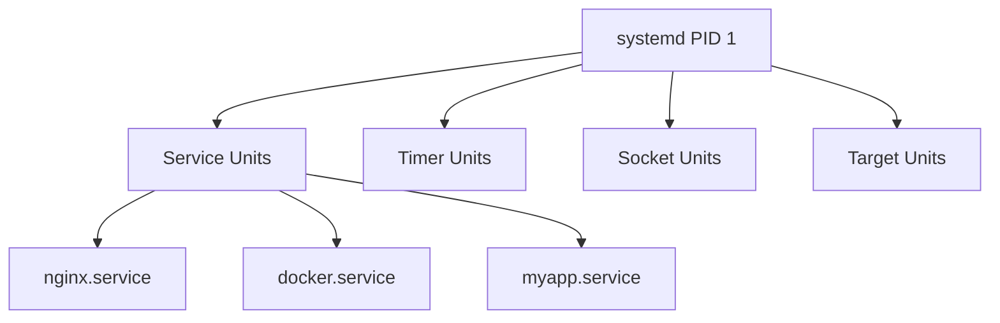
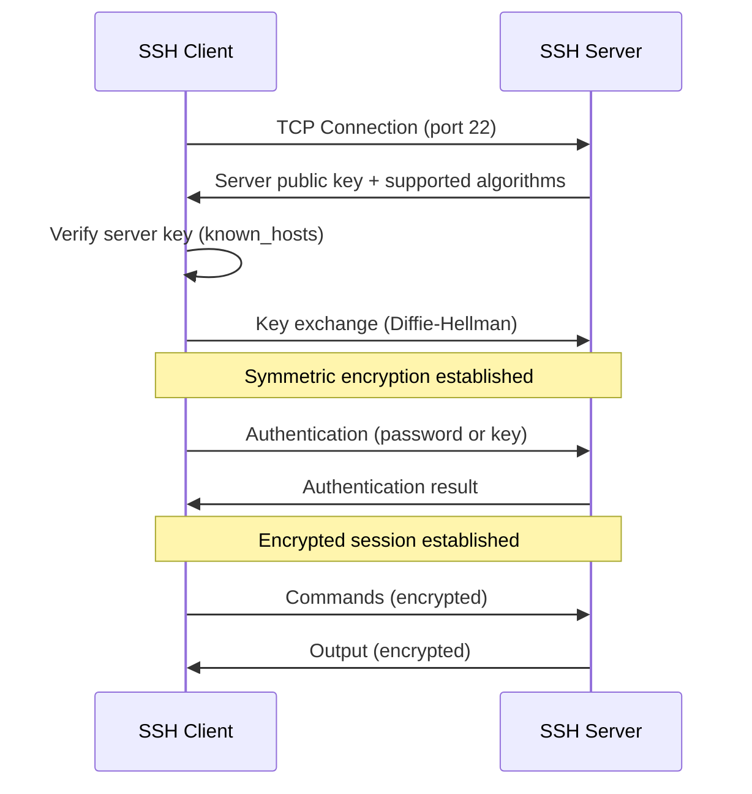
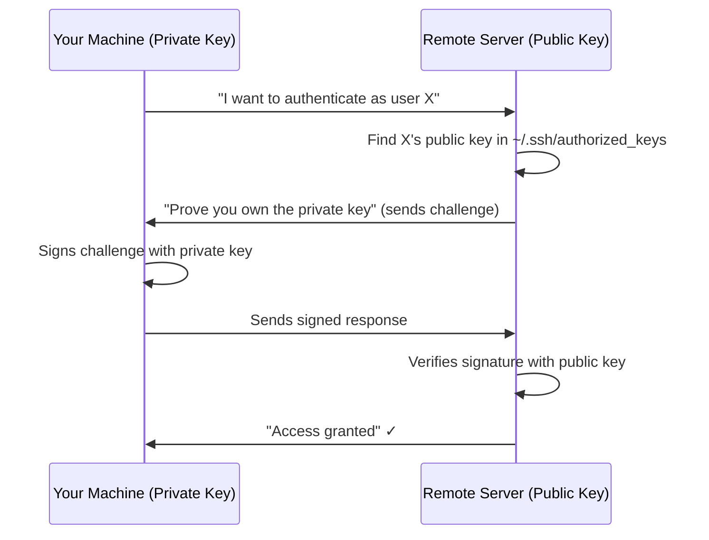
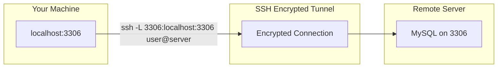
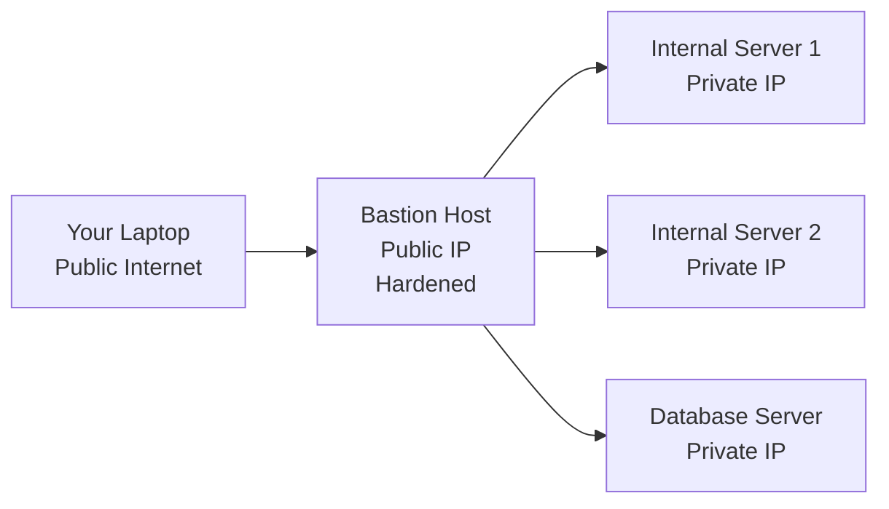

# DevOps Phase 2 — Linux for DevOps

---

## Table of Contents

1. [Why Linux for DevOps](#why-linux-for-devops)
2. [Linux Basics](#linux-basics)
3. [File System](#file-system)
4. [Permissions](#permissions)
5. [Processes](#processes)
6. [Networking](#networking)
7. [Shell Scripting](#shell-scripting)
8. [SSH (Secure Shell)](#ssh-secure-shell)
9. [Interview Mastery](#interview-mastery)

---

## Why Linux for DevOps

### Beginner Explanation

Imagine the internet is a city. Linux is the road system that 90% of the buildings (servers) are built on. If you want to work in DevOps, you MUST know Linux because:

- **96.3% of the world's top 1 million servers run Linux**
- All major cloud providers (AWS, Azure, GCP) default to Linux
- Docker and Kubernetes run on Linux
- CI/CD pipelines run on Linux
- Most open-source tools are built for Linux first

**If you don't know Linux, you can't do DevOps.** Period.

### Linux Distributions Commonly Used in DevOps

| Distribution | Use Case | Package Manager | Why DevOps Uses It |
|-------------|----------|-----------------|-------------------|
| **Ubuntu** | Servers, development | apt | Easy to use, large community |
| **CentOS/Rocky Linux** | Enterprise servers | yum/dnf | RHEL-compatible, stable |
| **Alpine Linux** | Docker containers | apk | Tiny (5MB), secure |
| **Amazon Linux** | AWS environments | yum | AWS-optimized |
| **Debian** | Servers | apt | Ultra-stable, minimal |

### Linux Architecture



| Layer | What It Does | Example |
|-------|-------------|---------|
| **Hardware** | Physical components | CPU, RAM, SSD, NIC |
| **Kernel** | Core OS — manages hardware resources | Linux kernel 6.x |
| **Shell** | Interface between user and kernel | Bash, Zsh |
| **Applications** | Programs you run | Nginx, Docker, Python |

---

## Linux Basics

### The Terminal & Shell

**What is a Shell?**
A shell is a command-line interpreter that takes your commands, translates them for the kernel, and returns results.

| Shell | Description | Default In |
|-------|-------------|-----------|
| **Bash** | Bourne Again Shell (most common) | Ubuntu, CentOS |
| **Zsh** | Z Shell (enhanced Bash) | macOS |
| **sh** | Original Bourne Shell | Minimal systems |
| **fish** | Friendly Interactive Shell | Developer preference |

### Essential Linux Commands — Complete Reference

#### Navigation & File Operations

```bash
# Where am I?
pwd                        # Print working directory → /home/user

# List files
ls                         # Basic listing
ls -la                     # Long format + hidden files
ls -lah                    # Human-readable file sizes
ls -lt                     # Sort by modification time

# Change directory
cd /var/log                # Absolute path
cd ..                      # Go up one level
cd ~                       # Go to home directory
cd -                       # Go to previous directory

# Create
mkdir mydir                # Create directory
mkdir -p a/b/c             # Create nested directories
touch file.txt             # Create empty file (or update timestamp)

# Copy
cp file.txt backup.txt     # Copy file
cp -r dir1/ dir2/          # Copy directory recursively
cp -p file.txt backup.txt  # Preserve permissions and timestamps

# Move / Rename
mv file.txt newname.txt    # Rename
mv file.txt /tmp/          # Move to /tmp

# Delete
rm file.txt                # Delete file
rm -r directory/           # Delete directory recursively
rm -rf directory/          # Force delete (DANGEROUS — no confirmation)

# Find files
find / -name "*.log"                    # Find by name
find /var -size +100M                   # Find files > 100MB
find / -mtime -7                        # Modified in last 7 days
find / -user root -perm 777             # Find by owner and permission
find /tmp -type f -name "*.tmp" -delete # Find and delete
```

#### Viewing & Editing Files

```bash
# View file contents
cat file.txt               # Print entire file
less file.txt              # Scrollable viewer (q to quit)
head -n 20 file.txt        # First 20 lines
tail -n 20 file.txt        # Last 20 lines
tail -f /var/log/syslog    # Follow log in real-time (crucial for DevOps!)

# Search within files
grep "error" file.txt              # Find lines containing "error"
grep -r "error" /var/log/          # Recursive search in directory
grep -i "error" file.txt           # Case-insensitive
grep -n "error" file.txt           # Show line numbers
grep -c "error" file.txt           # Count matches
grep -v "debug" file.txt           # Invert (lines NOT containing "debug")

# Text processing
awk '{print $1}' file.txt          # Print first column
awk -F: '{print $1}' /etc/passwd   # Custom delimiter
sed 's/old/new/g' file.txt         # Replace text
sed -i 's/old/new/g' file.txt      # Replace in-place
cut -d: -f1 /etc/passwd            # Cut by delimiter, field 1
sort file.txt                      # Sort lines
sort -u file.txt                   # Sort + remove duplicates
uniq -c file.txt                   # Count duplicate lines
wc -l file.txt                     # Count lines
wc -w file.txt                     # Count words

# Text editors
nano file.txt              # Simple editor (beginner-friendly)
vim file.txt               # Powerful editor (learning curve)
```

#### Vim Basics (You WILL Need This)

| Mode | How to Enter | Purpose |
|------|-------------|---------|
| **Normal** | Press `Esc` | Navigate, delete, copy |
| **Insert** | Press `i` | Type text |
| **Command** | Press `:` | Save, quit, search |

| Command | Action |
|---------|--------|
| `i` | Enter insert mode |
| `Esc` | Return to normal mode |
| `:w` | Save |
| `:q` | Quit |
| `:wq` | Save and quit |
| `:q!` | Quit without saving |
| `dd` | Delete current line |
| `yy` | Copy current line |
| `p` | Paste |
| `/pattern` | Search forward |
| `u` | Undo |

#### Piping & Redirection

```bash
# Piping: Send output of one command as input to another
cat /var/log/syslog | grep "error" | wc -l
# Reads log → filters errors → counts lines

# Output redirection
echo "hello" > file.txt    # Write (overwrite)
echo "world" >> file.txt   # Append
command 2> errors.log      # Redirect stderr only
command > output.log 2>&1  # Redirect both stdout and stderr
command &> all.log         # Same as above (shorthand)

# Input redirection
wc -l < file.txt           # Feed file as input

# /dev/null — the black hole
command > /dev/null 2>&1   # Discard all output (common in scripts)
```

#### System Information

```bash
# System info
uname -a                   # Full system info
hostnamectl                # Hostname and OS details
cat /etc/os-release        # Distribution info
uptime                     # How long system has been running
date                       # Current date/time
whoami                     # Current user
id                         # User ID and groups

# Hardware info
lscpu                      # CPU information
free -h                    # Memory usage (human-readable)
df -h                      # Disk usage
du -sh /var/log            # Size of specific directory
lsblk                      # Block devices (disks)
```

#### Package Management

```bash
# Debian/Ubuntu (apt)
sudo apt update                    # Update package list
sudo apt upgrade                   # Upgrade all packages
sudo apt install nginx             # Install package
sudo apt remove nginx              # Remove package
sudo apt search nginx              # Search for package
apt list --installed               # List installed packages

# CentOS/RHEL (yum/dnf)
sudo yum update                    # Update all packages
sudo yum install nginx             # Install package
sudo yum remove nginx              # Remove package
yum search nginx                   # Search
yum list installed                 # List installed

# Alpine (apk) — used in Docker
apk update                         # Update index
apk add nginx                      # Install
apk del nginx                      # Remove
```

---

## File System

### Beginner Explanation

Think of the Linux file system as an upside-down tree:
- The root `/` is at the top (like a tree's root)
- Everything branches down from there
- There's no C:\ drive, D:\ drive — everything is under ONE root

### Linux Directory Structure

```mermaid
flowchart TD
    Root["/  (root)"] --> bin["/bin — Essential binaries"]
    Root --> boot["/boot — Boot files, kernel"]
    Root --> dev["/dev — Device files"]
    Root --> etc["/etc — Configuration files"]
    Root --> home["/home — User home directories"]
    Root --> lib["/lib — Shared libraries"]
    Root --> opt["/opt — Optional/third-party software"]
    Root --> proc["/proc — Process information (virtual)"]
    Root --> root2["/root — Root user's home"]
    Root --> sbin["/sbin — System binaries"]
    Root --> tmp["/tmp — Temporary files"]
    Root --> usr["/usr — User programs"]
    Root --> var["/var — Variable data (logs, cache)"]
```



### Directory Reference — What DevOps Engineers Need to Know

| Directory | Purpose | DevOps Relevance |
|-----------|---------|-----------------|
| `/` | Root of everything | Starting point of all paths |
| `/bin` | Essential user commands | `ls`, `cp`, `mv`, `cat` live here |
| `/sbin` | System administration commands | `iptables`, `fdisk`, `reboot` |
| `/etc` | All configuration files | **CRITICAL** — Nginx, SSH, network configs |
| `/etc/nginx/` | Nginx configuration | Web server setup |
| `/etc/ssh/` | SSH configuration | Remote access settings |
| `/etc/systemd/` | Service configurations | Managing services |
| `/var` | Variable data | Logs, mail, caches |
| `/var/log/` | System and application logs | **Debugging central** |
| `/var/log/syslog` | General system log | First place to check issues |
| `/var/log/auth.log` | Authentication log | Security auditing |
| `/tmp` | Temporary files | Cleared on reboot |
| `/home` | User home directories | `/home/username` |
| `/root` | Root user's home | Separate from `/home` for security |
| `/opt` | Third-party software | Jenkins, custom tools |
| `/proc` | Virtual filesystem (process info) | `/proc/cpuinfo`, `/proc/meminfo` |
| `/dev` | Device files | `/dev/sda` (disk), `/dev/null` |
| `/mnt` or `/media` | Mount points | External drives, NFS mounts |

### Important Configuration Files

| File | Purpose | Example Content |
|------|---------|-----------------|
| `/etc/hostname` | System hostname | `web-server-01` |
| `/etc/hosts` | Local DNS mappings | `192.168.1.10 myapp.local` |
| `/etc/resolv.conf` | DNS resolver settings | `nameserver 8.8.8.8` |
| `/etc/fstab` | Filesystem mount table | Disk mount configs |
| `/etc/passwd` | User accounts | `username:x:1000:1000::/home/user:/bin/bash` |
| `/etc/shadow` | Encrypted passwords | Only root can read |
| `/etc/group` | Group definitions | `docker:x:999:username` |
| `/etc/sudoers` | Sudo permissions | Who can run what as root |
| `/etc/crontab` | Scheduled tasks | Cron job definitions |
| `/etc/environment` | System-wide env variables | `PATH=/usr/local/bin:...` |

### File Types in Linux

| Symbol | Type | Example |
|--------|------|---------|
| `-` | Regular file | `-rw-r--r-- file.txt` |
| `d` | Directory | `drwxr-xr-x mydir/` |
| `l` | Symbolic link | `lrwxrwxrwx link -> target` |
| `b` | Block device | `brw-rw---- /dev/sda` |
| `c` | Character device | `crw-rw-rw- /dev/null` |
| `p` | Named pipe (FIFO) | `prw-r--r-- mypipe` |
| `s` | Socket | `srwxrwxrwx /var/run/docker.sock` |

### Links — Hard vs Symbolic

```bash
# Symbolic link (shortcut — most common)
ln -s /var/log/nginx/access.log ~/nginx-log
# If original is deleted, link breaks

# Hard link (same file, different name)
ln /var/log/original.log /var/log/hardlink.log
# Both point to same data on disk — deleting one doesn't affect other
```

| Aspect | Symbolic Link | Hard Link |
|--------|---------------|-----------|
| Cross-filesystem | Yes | No |
| Works for directories | Yes | No |
| Original deleted | Link breaks | Still works |
| Use case | Shortcuts, version switching | Backup, space saving |

### Filesystem Operations

```bash
# Check disk space
df -h                      # Human-readable disk usage
df -i                      # Inode usage (can run out!)

# Check directory size
du -sh /var/log            # Summary of directory size
du -sh /var/log/*          # Size of each subdirectory
ncdu /var                  # Interactive disk usage (install first)

# Mount/unmount
mount /dev/sdb1 /mnt/data  # Mount disk
umount /mnt/data            # Unmount
mount -t nfs server:/share /mnt/nfs  # Mount NFS share

# View /etc/fstab
cat /etc/fstab
# UUID=abc-123  /data  ext4  defaults  0  2
# Format: device  mountpoint  type  options  dump  pass
```

---

## Permissions

### Beginner Explanation

Imagine a filing cabinet in an office:
- **Owner:** The person who created the file (can do anything with it)
- **Group:** Their department (can view but maybe not edit)
- **Others:** Everyone else in the office (maybe can't even view)

Linux permissions control WHO can READ, WRITE, or EXECUTE each file.

### Understanding Permission Notation

```bash
ls -la
# Output:
# -rwxr-xr-- 1 alice devs 4096 Jan 15 10:30 deploy.sh
#  ╷╷╷╷╷╷╷╷╷   ╷     ╷
#  ││││││││╰── Others: r-- (read only)
#  │││││╰╰╰── Group:  r-x (read + execute)
#  ││╰╰╰───── Owner:  rwx (read + write + execute)
#  ╰────────── File type: - (regular file)
#              User owner: alice
#              Group owner: devs
```

### Permission Breakdown

| Permission | Symbol | On File | On Directory |
|-----------|--------|---------|-------------|
| **Read** | `r` (4) | View contents | List contents (`ls`) |
| **Write** | `w` (2) | Modify contents | Create/delete files inside |
| **Execute** | `x` (1) | Run as program | Enter directory (`cd`) |

### Numeric (Octal) Permissions

Each permission has a numeric value. Add them together:

| Permission | Binary | Octal |
|-----------|--------|-------|
| `---` | 000 | 0 |
| `--x` | 001 | 1 |
| `-w-` | 010 | 2 |
| `-wx` | 011 | 3 |
| `r--` | 100 | 4 |
| `r-x` | 101 | 5 |
| `rw-` | 110 | 6 |
| `rwx` | 111 | 7 |

### Common Permission Patterns

| Octal | Symbolic | Meaning | Use Case |
|-------|----------|---------|----------|
| `755` | `rwxr-xr-x` | Owner: full, Others: read+execute | Scripts, directories |
| `644` | `rw-r--r--` | Owner: read+write, Others: read only | Config files |
| `600` | `rw-------` | Owner only | SSH keys, secrets |
| `700` | `rwx------` | Owner only, executable | Private scripts |
| `777` | `rwxrwxrwx` | Everyone: full access | **NEVER use in production!** |
| `400` | `r--------` | Owner read only | SSH private keys |

### Changing Permissions

```bash
# chmod — change file mode
chmod 755 deploy.sh            # Numeric method
chmod u+x script.sh            # Add execute for user (owner)
chmod g-w file.txt             # Remove write for group
chmod o-rwx secret.txt         # Remove all permissions for others
chmod a+r file.txt             # Add read for all (a = all)
chmod -R 755 /var/www          # Recursive (entire directory tree)

# Symbolic notation explained:
# u = user (owner)
# g = group
# o = others
# a = all
# + = add, - = remove, = = set exactly
```

### Changing Ownership

```bash
# chown — change owner
chown alice file.txt                    # Change owner to alice
chown alice:devs file.txt               # Change owner AND group
chown -R www-data:www-data /var/www     # Recursive
chown :docker /var/run/docker.sock      # Change group only

# chgrp — change group only
chgrp devs file.txt
```

### Special Permissions

| Permission | Symbol | Octal | Effect |
|-----------|--------|-------|--------|
| **SUID** | `s` on user | 4xxx | Execute as file owner (not as runner) |
| **SGID** | `s` on group | 2xxx | Execute as group owner / inherit group in dir |
| **Sticky Bit** | `t` on others | 1xxx | Only owner can delete files in directory |

```bash
# SUID example — passwd runs as root even when user runs it
ls -la /usr/bin/passwd
# -rwsr-xr-x 1 root root ... /usr/bin/passwd
#    ^ SUID bit (s instead of x)

# Set SUID
chmod 4755 program
chmod u+s program

# Sticky bit example — /tmp
ls -ld /tmp
# drwxrwxrwt 1 root root ... /tmp
#          ^ Sticky bit (t)
# Anyone can write to /tmp, but only owner can delete their own files

# Set sticky bit
chmod 1777 /shared-dir
chmod +t /shared-dir

# SGID on directory — new files inherit group
chmod 2775 /team-dir
chmod g+s /team-dir
```

### Real-World Permission Scenarios for DevOps

```bash
# SSH key permissions (MUST be this or SSH refuses to work)
chmod 700 ~/.ssh
chmod 600 ~/.ssh/id_rsa          # Private key
chmod 644 ~/.ssh/id_rsa.pub      # Public key
chmod 644 ~/.ssh/authorized_keys

# Web server permissions
chown -R www-data:www-data /var/www/html
chmod -R 755 /var/www/html

# Docker socket (allow non-root to use Docker)
sudo usermod -aG docker $USER
# Then logout/login

# Application secrets
chmod 600 /etc/myapp/secrets.env
chown root:root /etc/myapp/secrets.env

# Log directory
chmod 755 /var/log/myapp
chmod 644 /var/log/myapp/*.log
```

### sudo & User Management

```bash
# Run as root
sudo command                    # Run single command as root
sudo -i                         # Get root shell (interactive)
sudo -u postgres psql           # Run as specific user
sudo su - username              # Switch to another user

# User management
useradd -m -s /bin/bash alice   # Create user with home dir and bash shell
passwd alice                    # Set password
usermod -aG docker alice        # Add user to group
userdel -r alice                # Delete user and home directory

# Check sudo permissions
sudo -l                         # List what current user can sudo

# /etc/sudoers (edit with visudo ONLY)
# username  ALL=(ALL:ALL)  ALL           # Full sudo access
# %devops   ALL=(ALL)      NOPASSWD:ALL  # Group, no password
# deploy    ALL=(ALL)      NOPASSWD: /usr/bin/systemctl restart nginx
```

---

## Processes

### Beginner Explanation

Think of processes like apps on your phone:
- Some run in the foreground (the app you're using)
- Some run in the background (Spotify playing music)
- Some are stuck/frozen (need to force-close)
- Each has a unique ID (PID)

A **process** is a running instance of a program.

### Process Lifecycle



### Process States

| State | Symbol (ps) | Meaning |
|-------|-------------|---------|
| **Running** | R | Currently using CPU |
| **Sleeping** | S | Waiting for event (interruptible) |
| **Uninterruptible Sleep** | D | Waiting for I/O (can't be killed) |
| **Stopped** | T | Paused (Ctrl+Z or SIGSTOP) |
| **Zombie** | Z | Finished but parent hasn't read exit code |

### Viewing Processes

```bash
# ps — process snapshot
ps aux                         # All processes, detailed
ps -ef                         # Full-format listing
ps aux | grep nginx            # Find specific process
ps -u username                 # Processes by user
ps --forest                    # Show process tree

# Understanding ps aux output:
# USER  PID  %CPU  %MEM  VSZ   RSS   TTY  STAT  START  TIME  COMMAND
# root  1    0.0   0.1   169M  13M   ?    Ss    Jan01  0:05  /sbin/init

# top — real-time process monitor
top                            # Interactive process viewer
top -p 1234                    # Monitor specific PID
# Press: M (sort by memory), P (sort by CPU), k (kill), q (quit)

# htop — better version of top (install first)
htop

# pgrep — find PID by name
pgrep nginx                    # Returns PID(s)
pgrep -a nginx                 # Returns PID + full command

# pidof — find PID of running program
pidof nginx
```

### Managing Processes

```bash
# Foreground & Background
./long-running-script.sh       # Runs in foreground (blocks terminal)
./long-running-script.sh &     # Runs in background
Ctrl+Z                         # Suspend foreground process
bg                             # Resume suspended process in background
fg                             # Bring background process to foreground
jobs                           # List background jobs

# Kill processes
kill 1234                      # Send SIGTERM (graceful shutdown)
kill -9 1234                   # Send SIGKILL (force kill — last resort)
kill -HUP 1234                 # Send SIGHUP (reload config)
killall nginx                  # Kill all processes named nginx
pkill -f "python app.py"      # Kill by pattern matching

# nohup — survive terminal close
nohup ./script.sh &           # Keeps running after logout
nohup ./script.sh > output.log 2>&1 &  # With log redirection
```

### Signals

| Signal | Number | Purpose | Can Be Caught? |
|--------|--------|---------|----------------|
| `SIGHUP` | 1 | Hangup / reload config | Yes |
| `SIGINT` | 2 | Interrupt (Ctrl+C) | Yes |
| `SIGQUIT` | 3 | Quit with core dump | Yes |
| `SIGKILL` | 9 | Force kill | **No** |
| `SIGTERM` | 15 | Graceful termination (default) | Yes |
| `SIGSTOP` | 19 | Pause process | **No** |
| `SIGCONT` | 18 | Resume paused process | Yes |

**Best practice:** Always try `SIGTERM` (kill PID) first. Only use `SIGKILL` (kill -9) if the process doesn't respond.

### Systemd — Service Management (Critical for DevOps)



```bash
# Service management (systemctl)
systemctl start nginx          # Start service
systemctl stop nginx           # Stop service
systemctl restart nginx        # Stop then start
systemctl reload nginx         # Reload config without restart
systemctl status nginx         # Check status (VERY useful for debugging)
systemctl enable nginx         # Start on boot
systemctl disable nginx        # Don't start on boot
systemctl is-active nginx      # Quick active check
systemctl is-enabled nginx     # Quick enabled check

# List services
systemctl list-units --type=service             # All running services
systemctl list-units --type=service --state=failed  # Failed services

# View logs for a service
journalctl -u nginx            # All logs for nginx
journalctl -u nginx -f         # Follow logs in real-time
journalctl -u nginx --since "1 hour ago"  # Last hour
journalctl -u nginx --no-pager -n 50      # Last 50 lines
```

### Creating a Custom Systemd Service

```ini
# /etc/systemd/system/myapp.service
[Unit]
Description=My Application
After=network.target
Wants=network-online.target

[Service]
Type=simple
User=appuser
Group=appgroup
WorkingDirectory=/opt/myapp
ExecStart=/opt/myapp/bin/server --port 8080
ExecStop=/bin/kill -SIGTERM $MAINPID
Restart=always
RestartSec=5
Environment=NODE_ENV=production
EnvironmentFile=/opt/myapp/.env

# Resource limits
LimitNOFILE=65535
MemoryMax=512M
CPUQuota=80%

# Security
NoNewPrivileges=true
ProtectSystem=full
PrivateTmp=true

[Install]
WantedBy=multi-user.target
```

```bash
# After creating/modifying service file:
sudo systemctl daemon-reload    # Reload systemd configs
sudo systemctl enable myapp     # Enable on boot
sudo systemctl start myapp      # Start now
systemctl status myapp          # Verify it's running
```

### Resource Monitoring

```bash
# CPU & Memory
top                            # Real-time overview
vmstat 1                       # Virtual memory stats every 1 sec
mpstat 1                       # CPU usage per core
free -h                        # Memory usage

# Disk I/O
iostat 1                       # I/O statistics
iotop                          # Top for disk I/O

# Open files
lsof                           # List open files
lsof -i :80                    # What process is using port 80?
lsof -u username               # Files opened by user
lsof -p 1234                   # Files opened by PID

# Resource limits
ulimit -a                      # Show all limits
ulimit -n                      # Max open files
ulimit -n 65535                # Set max open files (session only)
cat /proc/sys/fs/file-max      # System-wide file limit
```

### Cron Jobs — Scheduled Tasks

```bash
# Crontab format:
# ┌───────────── minute (0 - 59)
# │ ┌───────────── hour (0 - 23)
# │ │ ┌───────────── day of month (1 - 31)
# │ │ │ ┌───────────── month (1 - 12)
# │ │ │ │ ┌───────────── day of week (0 - 7, 0 and 7 = Sunday)
# │ │ │ │ │
# * * * * * command

# Edit crontab
crontab -e                     # Edit your cron jobs
crontab -l                     # List your cron jobs
sudo crontab -u root -e        # Edit root's cron jobs

# Examples:
# Every day at 2 AM — rotate logs
0 2 * * * /usr/local/bin/rotate-logs.sh

# Every 5 minutes — health check
*/5 * * * * /usr/local/bin/health-check.sh >> /var/log/health.log 2>&1

# Every Monday at 9 AM — weekly report
0 9 * * 1 /opt/scripts/weekly-report.sh

# First day of every month — cleanup
0 0 1 * * /opt/scripts/monthly-cleanup.sh
```

---

## Networking

### Beginner Explanation

Think of computer networking like the postal system:
- **IP address** = street address (where to deliver)
- **Port** = apartment number (which service at that address)
- **DNS** = phone book (converts names to addresses)
- **Firewall** = security guard (decides who can enter)

### Network Configuration

```bash
# View network interfaces
ip addr show                   # Show all interfaces and IPs
ip a                           # Shorthand
ifconfig                       # Legacy command (still works)

# View routing table
ip route show                  # Current routes
route -n                       # Legacy format

# DNS resolution
cat /etc/resolv.conf           # DNS server configuration
nslookup google.com            # Query DNS
dig google.com                 # Detailed DNS query
host google.com                # Simple DNS lookup
```

### Network Ports — What DevOps Engineers Must Know

| Port | Service | Protocol |
|------|---------|----------|
| 22 | SSH | TCP |
| 80 | HTTP | TCP |
| 443 | HTTPS | TCP |
| 3306 | MySQL | TCP |
| 5432 | PostgreSQL | TCP |
| 6379 | Redis | TCP |
| 8080 | HTTP alternative / Jenkins | TCP |
| 9090 | Prometheus | TCP |
| 3000 | Grafana | TCP |
| 27017 | MongoDB | TCP |
| 5672 | RabbitMQ | TCP |
| 9200 | Elasticsearch | TCP |
| 2375/2376 | Docker daemon | TCP |
| 6443 | Kubernetes API | TCP |
| 10250 | Kubelet | TCP |

### Network Troubleshooting Commands

```bash
# Test connectivity
ping google.com                # Basic connectivity test
ping -c 4 192.168.1.1         # Send exactly 4 packets

# Test port connectivity
telnet hostname 80             # Test if port is open
nc -zv hostname 80             # Netcat — better port test
nc -zv hostname 80-100         # Scan range of ports

# Trace network path
traceroute google.com          # Show network hops
traceroute -T google.com       # Use TCP (bypass ICMP blocks)
mtr google.com                 # Combines ping + traceroute (real-time)

# Check listening ports
ss -tlnp                       # Show listening TCP ports + process
ss -ulnp                       # Show listening UDP ports
netstat -tlnp                  # Legacy equivalent

# Understanding ss output:
# State    Recv-Q  Send-Q  Local Address:Port  Peer Address:Port  Process
# LISTEN   0       128     0.0.0.0:80          0.0.0.0:*          nginx

# Download files
curl https://example.com                  # Fetch URL content
curl -o file.zip https://example.com/file # Download to file
curl -I https://example.com               # Headers only
curl -X POST -d '{"key":"val"}' URL       # POST request
wget https://example.com/file.tar.gz      # Download file

# DNS troubleshooting
dig +short example.com                    # Quick DNS lookup
dig example.com A                         # A record
dig example.com MX                        # Mail records
dig @8.8.8.8 example.com                  # Query specific DNS server
```

### Firewall Management

```bash
# UFW (Ubuntu Uncomplicated Firewall)
sudo ufw status                # Check firewall status
sudo ufw enable                # Enable firewall
sudo ufw allow 22/tcp          # Allow SSH
sudo ufw allow 80/tcp          # Allow HTTP
sudo ufw allow 443/tcp         # Allow HTTPS
sudo ufw deny 3306             # Block MySQL from outside
sudo ufw allow from 10.0.0.0/24 to any port 22  # Allow SSH from subnet only
sudo ufw delete allow 80/tcp   # Remove rule

# iptables (lower level)
sudo iptables -L -n            # List rules
sudo iptables -A INPUT -p tcp --dport 80 -j ACCEPT   # Allow port 80
sudo iptables -A INPUT -p tcp --dport 22 -s 10.0.0.0/24 -j ACCEPT  # SSH from subnet
sudo iptables -A INPUT -j DROP  # Drop everything else (CAREFUL!)
```

### Network Debugging Scenarios

```bash
# "Website is not loading" — Debug steps:
# 1. Is the server reachable?
ping server-ip

# 2. Is the port open?
nc -zv server-ip 80

# 3. Is the service running?
systemctl status nginx

# 4. Is the service listening?
ss -tlnp | grep :80

# 5. Is the firewall blocking?
sudo ufw status
sudo iptables -L -n

# 6. Is DNS resolving?
dig mysite.com

# 7. What's the HTTP response?
curl -v http://server-ip
```

### /etc/hosts — Local DNS Override

```bash
# /etc/hosts
127.0.0.1   localhost
192.168.1.10  myapp.local
192.168.1.20  db.local
10.0.0.5      staging.mycompany.internal

# Use case: Test against staging without changing DNS
# Add: 10.0.1.50  api.mycompany.com
# Now all traffic to api.mycompany.com goes to 10.0.1.50
```

---

## Shell Scripting

### Beginner Explanation

Shell scripting is like writing a recipe that the computer follows automatically. Instead of typing commands one by one, you put them in a file and the computer runs them in order.

**Why it matters for DevOps:**
- Automate repetitive tasks
- Deploy applications
- Monitor systems
- Process logs
- Manage infrastructure

### Script Basics

```bash
#!/bin/bash
# ↑ Shebang — tells the system which interpreter to use

# Basic script structure
#!/bin/bash
# Description: My first script
# Author: DevOps Engineer
# Date: 2024-01-15

echo "Hello, DevOps World!"
```

```bash
# Make script executable and run
chmod +x myscript.sh
./myscript.sh

# Or run without making executable:
bash myscript.sh
```

### Variables

```bash
#!/bin/bash

# Variable assignment (NO spaces around =)
NAME="DevOps"
PORT=8080
LOG_DIR="/var/log/myapp"

# Using variables
echo "Welcome to $NAME"
echo "Running on port ${PORT}"

# Command substitution
CURRENT_DATE=$(date +%Y-%m-%d)
SERVER_IP=$(hostname -I | awk '{print $1}')
FILE_COUNT=$(ls /var/log | wc -l)

echo "Today: $CURRENT_DATE"
echo "Server IP: $SERVER_IP"
echo "Log files: $FILE_COUNT"

# Special variables
echo "Script name: $0"
echo "First argument: $1"
echo "All arguments: $@"
echo "Number of arguments: $#"
echo "Last exit code: $?"
echo "Current PID: $$"
```

### Conditionals

```bash
#!/bin/bash

# if/elif/else
if [ "$1" == "start" ]; then
    echo "Starting service..."
elif [ "$1" == "stop" ]; then
    echo "Stopping service..."
else
    echo "Usage: $0 {start|stop}"
    exit 1
fi

# File tests
if [ -f /etc/nginx/nginx.conf ]; then
    echo "Nginx config exists"
fi

if [ -d /var/log/myapp ]; then
    echo "Log directory exists"
else
    mkdir -p /var/log/myapp
fi

# Comparison operators
# Strings: ==, !=, -z (empty), -n (not empty)
# Numbers: -eq, -ne, -lt, -gt, -le, -ge
# Files: -f (file exists), -d (dir exists), -r (readable), -w (writable), -x (executable)

# Numeric comparison
DISK_USAGE=$(df / | tail -1 | awk '{print $5}' | tr -d '%')
if [ "$DISK_USAGE" -gt 80 ]; then
    echo "WARNING: Disk usage is ${DISK_USAGE}%!"
fi

# Check if command succeeded
if systemctl is-active --quiet nginx; then
    echo "Nginx is running"
else
    echo "Nginx is NOT running — starting it..."
    sudo systemctl start nginx
fi
```

### Loops

```bash
#!/bin/bash

# For loop — iterate over list
for server in web01 web02 web03 db01; do
    echo "Checking $server..."
    ping -c 1 $server > /dev/null 2>&1
    if [ $? -eq 0 ]; then
        echo "  ✓ $server is UP"
    else
        echo "  ✗ $server is DOWN"
    fi
done

# For loop — iterate over range
for i in {1..5}; do
    echo "Iteration $i"
done

# For loop — iterate over files
for file in /var/log/*.log; do
    echo "Processing: $file ($(wc -l < "$file") lines)"
done

# While loop
COUNT=0
while [ $COUNT -lt 10 ]; do
    echo "Count: $COUNT"
    COUNT=$((COUNT + 1))
done

# While loop — read file line by line
while IFS= read -r line; do
    echo "Processing: $line"
done < /etc/hosts

# Until loop (run until condition is true)
until curl -s http://localhost:8080/health > /dev/null; do
    echo "Waiting for service to start..."
    sleep 2
done
echo "Service is up!"
```

### Functions

```bash
#!/bin/bash

# Function definition
log() {
    local LEVEL=$1
    local MESSAGE=$2
    echo "[$(date '+%Y-%m-%d %H:%M:%S')] [$LEVEL] $MESSAGE"
}

check_service() {
    local SERVICE=$1
    if systemctl is-active --quiet "$SERVICE"; then
        log "INFO" "$SERVICE is running"
        return 0
    else
        log "ERROR" "$SERVICE is NOT running"
        return 1
    fi
}

deploy() {
    local VERSION=$1
    local APP=$2
    
    log "INFO" "Deploying $APP version $VERSION..."
    
    # Pull new image
    docker pull "myregistry/$APP:$VERSION" || {
        log "ERROR" "Failed to pull image"
        return 1
    }
    
    # Stop old container
    docker stop "$APP" 2>/dev/null
    docker rm "$APP" 2>/dev/null
    
    # Start new container
    docker run -d --name "$APP" -p 8080:8080 "myregistry/$APP:$VERSION"
    
    log "INFO" "Deployment complete"
}

# Usage
check_service nginx
deploy "1.2.3" "myapp"
```

### Error Handling

```bash
#!/bin/bash

# Exit on error
set -e                 # Exit immediately if a command fails
set -u                 # Treat unset variables as errors
set -o pipefail        # Pipeline fails if any command fails
# Combined: set -euo pipefail (use this in ALL production scripts)

# Trap — cleanup on exit
cleanup() {
    echo "Cleaning up temporary files..."
    rm -f /tmp/deploy_$$_*
    echo "Done."
}
trap cleanup EXIT      # Run cleanup on script exit (normal or error)
trap cleanup ERR       # Also run on errors

# Error handling with || and &&
mkdir -p /opt/myapp || { echo "Failed to create directory"; exit 1; }
cd /opt/myapp && git pull || { echo "Failed to update code"; exit 1; }

# Custom error function
die() {
    echo "ERROR: $1" >&2
    exit "${2:-1}"
}

[ -f config.yml ] || die "config.yml not found" 2
```

### Real-World DevOps Scripts

#### Deployment Script

```bash
#!/bin/bash
set -euo pipefail

# Configuration
APP_NAME="myapp"
DEPLOY_DIR="/opt/$APP_NAME"
BACKUP_DIR="/opt/backups"
HEALTH_URL="http://localhost:8080/health"
MAX_RETRIES=30

log() {
    echo "[$(date '+%Y-%m-%d %H:%M:%S')] $1"
}

# Validate arguments
if [ $# -ne 1 ]; then
    echo "Usage: $0 <version>"
    exit 1
fi

VERSION=$1

# Create backup
log "Creating backup..."
TIMESTAMP=$(date +%Y%m%d_%H%M%S)
cp -r "$DEPLOY_DIR" "$BACKUP_DIR/${APP_NAME}_${TIMESTAMP}"

# Deploy new version
log "Deploying version $VERSION..."
cd "$DEPLOY_DIR"
git fetch origin
git checkout "v$VERSION"
npm ci --production
npm run build

# Restart service
log "Restarting service..."
sudo systemctl restart "$APP_NAME"

# Wait for health check
log "Waiting for service to become healthy..."
RETRIES=0
until curl -sf "$HEALTH_URL" > /dev/null; do
    RETRIES=$((RETRIES + 1))
    if [ $RETRIES -ge $MAX_RETRIES ]; then
        log "ERROR: Service failed to start! Rolling back..."
        cd "$DEPLOY_DIR"
        git checkout "v$(cat VERSION.prev)"
        npm ci --production
        sudo systemctl restart "$APP_NAME"
        exit 1
    fi
    sleep 2
done

log "Deployment successful! $APP_NAME v$VERSION is running."
```

#### Log Rotation Script

```bash
#!/bin/bash
set -euo pipefail

LOG_DIR="/var/log/myapp"
MAX_AGE_DAYS=30
MAX_SIZE="100M"

# Compress logs older than 1 day
find "$LOG_DIR" -name "*.log" -mtime +1 -not -name "*.gz" -exec gzip {} \;

# Delete compressed logs older than MAX_AGE_DAYS
find "$LOG_DIR" -name "*.log.gz" -mtime +$MAX_AGE_DAYS -delete

# Alert if any log file is too large
for file in "$LOG_DIR"/*.log; do
    SIZE=$(stat -f%z "$file" 2>/dev/null || stat --format=%s "$file")
    if [ "$SIZE" -gt 104857600 ]; then  # 100MB
        echo "WARNING: $file is larger than 100MB ($(du -h "$file" | cut -f1))"
    fi
done

echo "Log rotation complete: $(date)"
```

#### Health Check Script

```bash
#!/bin/bash
set -euo pipefail

SERVICES=("nginx" "docker" "myapp")
ENDPOINTS=("http://localhost:80" "http://localhost:8080/health")
ALERT_WEBHOOK="https://hooks.slack.com/services/xxx/yyy/zzz"

check_service() {
    local service=$1
    if systemctl is-active --quiet "$service"; then
        echo "✓ $service: running"
        return 0
    else
        echo "✗ $service: STOPPED"
        return 1
    fi
}

check_endpoint() {
    local url=$1
    local http_code
    http_code=$(curl -s -o /dev/null -w "%{http_code}" "$url" --max-time 5)
    if [ "$http_code" == "200" ]; then
        echo "✓ $url: OK (200)"
        return 0
    else
        echo "✗ $url: FAILED (HTTP $http_code)"
        return 1
    fi
}

check_disk() {
    local usage
    usage=$(df / | tail -1 | awk '{print $5}' | tr -d '%')
    if [ "$usage" -gt 85 ]; then
        echo "✗ Disk: ${usage}% used (CRITICAL)"
        return 1
    else
        echo "✓ Disk: ${usage}% used"
        return 0
    fi
}

check_memory() {
    local usage
    usage=$(free | awk '/Mem:/ {printf "%.0f", $3/$2 * 100}')
    if [ "$usage" -gt 90 ]; then
        echo "✗ Memory: ${usage}% used (CRITICAL)"
        return 1
    else
        echo "✓ Memory: ${usage}% used"
        return 0
    fi
}

# Run all checks
echo "=== Health Check Report $(date) ==="
FAILED=0

for svc in "${SERVICES[@]}"; do
    check_service "$svc" || FAILED=$((FAILED + 1))
done

for url in "${ENDPOINTS[@]}"; do
    check_endpoint "$url" || FAILED=$((FAILED + 1))
done

check_disk || FAILED=$((FAILED + 1))
check_memory || FAILED=$((FAILED + 1))

# Alert if anything failed
if [ $FAILED -gt 0 ]; then
    echo ""
    echo "⚠️  $FAILED check(s) FAILED!"
    curl -s -X POST "$ALERT_WEBHOOK" \
        -H 'Content-type: application/json' \
        -d "{\"text\":\"🚨 Health check: $FAILED failures on $(hostname)\"}" \
        > /dev/null 2>&1
    exit 1
fi

echo ""
echo "All checks passed ✓"
```

### Shell Scripting Best Practices

| Practice | Why |
|----------|-----|
| Always use `set -euo pipefail` | Catch errors early, fail fast |
| Quote all variables `"$VAR"` | Prevent word splitting bugs |
| Use `local` in functions | Prevent variable leaks |
| Use `[[ ]]` instead of `[ ]` | More features, safer syntax |
| Always use `shellcheck` | Static analysis catches bugs |
| Log with timestamps | Know when things happened |
| Use `trap` for cleanup | Don't leave temp files on failure |
| Store PID: `echo $$ > pidfile` | Allow safe stopping of scripts |

---

## SSH (Secure Shell)

### Beginner Explanation

Imagine you need to control a computer in another city. SSH is like a secure telephone line that lets you type commands on that remote computer as if you were sitting in front of it. Everything you type is encrypted so no one can eavesdrop.

**SSH = Secure remote access to Linux servers.**

### How SSH Works — Internal Working



### SSH Authentication Methods

| Method | Security | Use Case |
|--------|----------|----------|
| **Password** | Low (can be brute-forced) | Quick testing only |
| **Public Key** | High (cryptographic) | Standard production use |
| **Certificate** | Highest (centrally managed) | Enterprise environments |

### SSH Key-Based Authentication — Step by Step

```bash
# Step 1: Generate key pair (on your local machine)
ssh-keygen -t ed25519 -C "your_email@company.com"
# Generates:
#   ~/.ssh/id_ed25519      (private key — NEVER share)
#   ~/.ssh/id_ed25519.pub  (public key — share freely)

# Or RSA (legacy, still widely used)
ssh-keygen -t rsa -b 4096 -C "your_email@company.com"

# Step 2: Copy public key to remote server
ssh-copy-id user@remote-server
# Or manually:
cat ~/.ssh/id_ed25519.pub | ssh user@remote-server "mkdir -p ~/.ssh && cat >> ~/.ssh/authorized_keys"

# Step 3: Connect without password
ssh user@remote-server
# Works because: server checks if client's private key matches any public key in authorized_keys
```

### How Key Authentication Works Internally



### SSH Configuration File

```bash
# ~/.ssh/config — Makes SSH much easier
# Instead of: ssh -i ~/.ssh/prod-key -p 2222 deploy@10.0.1.50

Host production
    HostName 10.0.1.50
    User deploy
    Port 2222
    IdentityFile ~/.ssh/prod-key

Host staging
    HostName 10.0.1.51
    User deploy
    IdentityFile ~/.ssh/staging-key

Host bastion
    HostName bastion.company.com
    User admin
    IdentityFile ~/.ssh/bastion-key

# Connect through bastion (jump host)
Host internal-server
    HostName 192.168.1.100
    User admin
    ProxyJump bastion

# Wildcard — apply to all hosts
Host *
    ServerAliveInterval 60
    ServerAliveCountMax 3
    AddKeysToAgent yes
```

```bash
# Now you can just type:
ssh production
ssh staging
ssh internal-server  # Automatically jumps through bastion
```

### Common SSH Operations

```bash
# Basic connection
ssh user@hostname                  # Connect to remote server
ssh -p 2222 user@hostname          # Custom port
ssh -i ~/.ssh/mykey user@hostname  # Specific key

# Execute remote command (without interactive shell)
ssh user@server "df -h"
ssh user@server "docker ps"
ssh user@server "systemctl status nginx"

# Copy files (SCP)
scp file.txt user@server:/tmp/                # Local → Remote
scp user@server:/var/log/app.log ./           # Remote → Local
scp -r directory/ user@server:/opt/           # Recursive copy

# Better file transfer (rsync over SSH)
rsync -avz --progress ./build/ user@server:/var/www/html/
rsync -avz --delete ./config/ user@server:/etc/myapp/
# --delete: remove files on destination that don't exist on source
# -a: archive (preserve permissions, timestamps)
# -v: verbose, -z: compress during transfer

# SSH Tunneling / Port Forwarding
# Local forward: Access remote service on local port
ssh -L 3306:localhost:3306 user@db-server
# Now: mysql -h 127.0.0.1 -P 3306 connects to remote DB

# Remote forward: Expose local service to remote
ssh -R 8080:localhost:3000 user@server
# Now: server:8080 forwards to your local port 3000

# Dynamic SOCKS proxy
ssh -D 9090 user@server
# Configure browser to use localhost:9090 as SOCKS proxy
```

### SSH Port Forwarding Diagram



### SSH Security Hardening

```bash
# /etc/ssh/sshd_config — Server-side configuration

# Disable password authentication (key-only)
PasswordAuthentication no
PubkeyAuthentication yes

# Disable root login
PermitRootLogin no

# Change default port (security through obscurity — minor benefit)
Port 2222

# Allow only specific users
AllowUsers deploy admin

# Limit authentication attempts
MaxAuthTries 3

# Disable empty passwords
PermitEmptyPasswords no

# Set idle timeout
ClientAliveInterval 300
ClientAliveCountMax 2

# Disable X11 forwarding (unless needed)
X11Forwarding no

# Use strong ciphers only
Ciphers aes256-gcm@openssh.com,chacha20-poly1305@openssh.com
KexAlgorithms curve25519-sha256,diffie-hellman-group16-sha512
```

```bash
# After modifying sshd_config:
sudo sshd -t                    # Test configuration (syntax check)
sudo systemctl restart sshd     # Apply changes
```

### SSH Agent — Managing Keys

```bash
# Start SSH agent
eval $(ssh-agent -s)

# Add key to agent (don't type passphrase every time)
ssh-add ~/.ssh/id_ed25519

# List added keys
ssh-add -l

# Forward agent to remote server (careful — security risk)
ssh -A user@server
# Now on remote server, you can SSH to other servers using YOUR keys
```

### Jump Hosts (Bastion Hosts)



```bash
# Method 1: ProxyJump (modern, preferred)
ssh -J bastion-user@bastion internal-user@internal-server

# Method 2: In SSH config
Host internal
    HostName 192.168.1.100
    User admin
    ProxyJump bastion

# Method 3: ProxyCommand (legacy)
Host internal
    HostName 192.168.1.100
    User admin
    ProxyCommand ssh -W %h:%p bastion-user@bastion
```

### SSH Troubleshooting

```bash
# Verbose mode (shows what's happening)
ssh -v user@server                 # Level 1 verbosity
ssh -vv user@server                # Level 2
ssh -vvv user@server               # Level 3 (maximum detail)

# Common issues and fixes:

# "Permission denied (publickey)"
# → Check: Is the key in authorized_keys?
# → Check: Are permissions correct?
chmod 700 ~/.ssh
chmod 600 ~/.ssh/id_ed25519
chmod 644 ~/.ssh/id_ed25519.pub
chmod 600 ~/.ssh/authorized_keys

# "Host key verification failed"
# → Server changed or MITM attack
# → If expected (server rebuilt):
ssh-keygen -R hostname             # Remove old key
# → Then reconnect (will prompt to accept new key)

# "Connection refused"
# → SSH service not running: systemctl start sshd
# → Firewall blocking: ufw allow 22
# → Wrong port: check sshd_config Port setting

# "Connection timed out"
# → Network issue, firewall, or wrong IP
# → Test: telnet hostname 22 or nc -zv hostname 22
```

### SSH in DevOps Automation

```bash
# Ansible uses SSH for all operations
ansible all -m ping                # Test SSH to all servers
ansible webservers -a "df -h"      # Run command on group

# SSH in CI/CD pipelines (GitHub Actions example)
# Store private key as secret, then:
- name: Deploy via SSH
  run: |
    echo "${{ secrets.SSH_KEY }}" > key.pem
    chmod 600 key.pem
    ssh -i key.pem -o StrictHostKeyChecking=no deploy@server "cd /opt/app && git pull && systemctl restart app"
    rm key.pem

# SSH in Docker build (multi-stage)
# DON'T put SSH keys in Docker images!
# Use build secrets or multi-stage builds
```

---

## Interview Mastery

### Beginner Interview Questions

---

**Q1: What is the Linux file system hierarchy? Explain key directories.**

**Perfect Answer:**
> "Linux follows the Filesystem Hierarchy Standard (FHS). Everything starts from the root `/`. Key directories:
> - `/etc` — All configuration files (nginx.conf, sshd_config)
> - `/var` — Variable data, most importantly `/var/log` for logs
> - `/home` — User home directories
> - `/tmp` — Temporary files, cleared on reboot
> - `/opt` — Third-party/optional software
> - `/proc` — Virtual filesystem exposing kernel/process information
> - `/bin` and `/sbin` — Essential system binaries
>
> As a DevOps engineer, I spend most time in `/etc` (configuration), `/var/log` (troubleshooting), and `/opt` (deploying applications)."

---

**Q2: Explain Linux file permissions. What does `chmod 755` mean?**

**Perfect Answer:**
> "Linux permissions control three actions (read, write, execute) for three entities (owner, group, others). Each permission has a numeric value: read=4, write=2, execute=1.
>
> `755` means:
> - **7** (owner): 4+2+1 = read + write + execute
> - **5** (group): 4+0+1 = read + execute
> - **5** (others): 4+0+1 = read + execute
>
> So the owner has full control, while everyone else can read and execute but not modify. This is the standard permission for scripts and directories.
>
> Critical permissions to know:
> - `600` for SSH private keys (owner read/write only)
> - `644` for config files (owner read/write, others read)
> - `755` for scripts and directories
> - Never use `777` in production — it's a security vulnerability."

---

**Q3: What is the difference between a process and a thread?**

**Perfect Answer:**
> "A **process** is an independent running instance of a program with its own memory space, file descriptors, and PID. A **thread** is a lightweight unit of execution within a process that shares the same memory space.
>
> Key differences:
> - Processes are isolated from each other; threads share memory
> - Creating a process (fork) is expensive; creating a thread is cheap
> - If one process crashes, others aren't affected; if a thread crashes, the whole process can crash
> - Processes communicate via IPC (pipes, sockets); threads communicate via shared memory
>
> In DevOps context: Nginx uses processes (worker processes) for stability — if one dies, others continue. Node.js is single-threaded (uses event loop) but can fork child processes for CPU-intensive tasks."

---

**Q4: How do you check disk space and troubleshoot "disk full" issues?**

**Perfect Answer:**
> "I follow this systematic approach:
>
> ```bash
> # 1. Check overall disk usage
> df -h
>
> # 2. Find which directory is using the most space
> du -sh /* | sort -rh | head -10
> du -sh /var/* | sort -rh | head -10
>
> # 3. Common culprits:
> # /var/log — logs that weren't rotated
> # /tmp — temp files not cleaned up
> # /var/lib/docker — Docker images/containers
>
> # 4. Find large files
> find / -type f -size +100M -exec ls -lh {} \;
>
> # 5. Check for deleted files still held open
> lsof | grep deleted
> # If found: restart the process holding the file
>
> # 6. Check inodes (can run out even with free space)
> df -i
> ```
>
> **Prevention:** Set up log rotation, Docker image pruning cron jobs, and monitoring alerts at 80% disk usage."

---

**Q5: Explain SSH key-based authentication. How does it work?**

**Perfect Answer:**
> "SSH key authentication uses asymmetric cryptography — a key pair consisting of a private key (kept secret on your machine) and a public key (placed on the server).
>
> **Setup:**
> 1. Generate key pair: `ssh-keygen -t ed25519`
> 2. Copy public key to server's `~/.ssh/authorized_keys`
>
> **How it works:**
> 1. Client connects and says 'I want to authenticate as user X'
> 2. Server finds X's public key in `authorized_keys`
> 3. Server sends a random challenge
> 4. Client signs the challenge with its private key
> 5. Server verifies the signature using the public key
> 6. If valid, access is granted
>
> **Why it's better than passwords:**
> - Can't be brute-forced
> - Private key never leaves your machine
> - Can be passphrase-protected for two-factor (something you have + something you know)
> - Can be revoked per-server by removing the public key
>
> **Critical:** Private key permissions must be `600`, `.ssh` directory must be `700`."

---

### Intermediate Interview Questions

---

**Q6: Explain the difference between hard links and symbolic links.**

**Perfect Answer:**
> "Both are ways to reference files, but they work differently at the filesystem level:
>
> **Hard link:** Another name for the same inode (same data on disk). If you delete the original, the hard link still works because they both point to the same data blocks. Cannot cross filesystems, cannot link to directories.
>
> **Symbolic (soft) link:** A pointer to a filename (like a shortcut). If you delete the original, the symlink breaks (dangling link). Can cross filesystems, can link to directories.
>
> ```bash
> # Hard link (same inode number)
> ln original.txt hardlink.txt
> ls -i  # Both show same inode number
>
> # Symbolic link (different inode, points to path)
> ln -s /var/log/nginx/access.log ~/nginx-log
> ls -la  # Shows: nginx-log -> /var/log/nginx/access.log
> ```
>
> **DevOps use case for symlinks:** Switching between application versions:
> ```bash
> /opt/myapp/current -> /opt/myapp/releases/v2.1
> # Rollback: ln -sfn /opt/myapp/releases/v2.0 /opt/myapp/current
> ```"

---

**Q7: A server is running slowly. How do you diagnose the issue?**

**Perfect Answer:**
> "I follow the USE method (Utilization, Saturation, Errors) and check the four key resources:
>
> **1. CPU:**
> ```bash
> top -bn1 | head -20       # Overall CPU and top processes
> mpstat 1 5                 # Per-CPU utilization
> # If high: identify process with top, check if it's expected load
> ```
>
> **2. Memory:**
> ```bash
> free -h                    # Overall memory
> top -o %MEM               # Sort by memory usage
> # Check: Is swap being used heavily? That's slow.
> # Look for OOM killer in dmesg
> dmesg | grep -i 'out of memory'
> ```
>
> **3. Disk I/O:**
> ```bash
> iostat -x 1 5             # Disk utilization and wait times
> iotop                      # Which processes are doing I/O
> # High %util or high await = disk bottleneck
> ```
>
> **4. Network:**
> ```bash
> ss -s                      # Connection summary
> iftop                      # Real-time bandwidth usage
> # Check for too many connections in TIME_WAIT
> ss -ant | awk '{print $1}' | sort | uniq -c | sort -rn
> ```
>
> **5. Application-specific:**
> ```bash
> journalctl -u myapp --since '5 min ago'  # Recent logs
> strace -p PID              # System calls (last resort)
> ```
>
> I'd also check: Was a deployment made recently? Is there unusual traffic? Any cron jobs running?"

---

**Q8: Explain what happens when you type a command in the terminal and press Enter.**

**Perfect Answer:**
> "This is a surprisingly deep question. Here's the sequence:
>
> 1. **Shell reads input** — Bash reads the line from stdin
> 2. **Tokenization** — Shell splits the line into tokens (command, arguments, operators)
> 3. **Expansion** — Variables (`$VAR`), globs (`*.log`), command substitution (`$(...)`) are expanded
> 4. **Command lookup** — Shell checks in order:
>    - Aliases (`alias ll='ls -la'`)
>    - Shell built-ins (`cd`, `echo`, `export`)
>    - Functions
>    - `$PATH` directories (searches left to right)
> 5. **Fork** — Shell creates a child process via `fork()` system call
> 6. **Exec** — Child process replaces itself with the command via `exec()` system call
> 7. **Execution** — Kernel loads the program, allocates memory, starts execution
> 8. **Wait** — Parent shell waits for child to finish (unless `&` for background)
> 9. **Exit code** — Child returns exit code (0 = success, non-zero = failure)
> 10. **Prompt** — Shell displays prompt, ready for next command
>
> For piped commands (`cmd1 | cmd2`), the shell creates multiple child processes connected by pipes, and they run concurrently."

---

**Q9: What is systemd? How is it different from init?**

**Perfect Answer:**
> "Systemd is the modern init system and service manager for Linux (PID 1). It replaced SysVinit (traditional init) in most distributions.
>
> **Key differences:**
>
> | Aspect | SysVinit | systemd |
> |--------|----------|---------|
> | Boot order | Sequential (slow) | Parallel (fast) |
> | Service definition | Shell scripts in `/etc/init.d/` | Unit files in `/etc/systemd/system/` |
> | Dependency management | Manual ordering | Declarative (After=, Requires=) |
> | Process supervision | No (PID file hacks) | Yes (tracks cgroups) |
> | Logging | Separate syslog | Integrated journal (journalctl) |
> | Socket activation | No | Yes (start on demand) |
>
> **Why DevOps cares:**
> - `systemctl` for managing services (start, stop, enable, status)
> - `journalctl` for centralized logging
> - Unit files for defining custom services with restart policies, resource limits, and security options
> - Socket activation enables on-demand service startup (saves resources)
>
> **Example: If a service keeps crashing:**
> ```bash
> systemctl status myapp        # See status and recent logs
> journalctl -u myapp -n 50    # Last 50 log lines
> systemctl restart myapp       # Restart (systemd auto-restarts if Restart=always)
> ```"

---

**Q10: How would you write a script to monitor disk space and alert when it's above 80%?**

**Perfect Answer:**
> ```bash
> #!/bin/bash
> set -euo pipefail
>
> THRESHOLD=80
> ALERT_WEBHOOK="https://hooks.slack.com/services/xxx"
> HOSTNAME=$(hostname)
>
> # Check each mounted filesystem
> df -h --output=pcent,target | tail -n +2 | while read -r usage mount; do
>     # Remove % sign and leading spaces
>     usage_num=${usage%%%}
>     usage_num=$(echo "$usage_num" | tr -d ' ')
>     
>     if [ "$usage_num" -gt "$THRESHOLD" ]; then
>         MESSAGE="⚠️ DISK ALERT: $HOSTNAME — $mount is ${usage_num}% full"
>         echo "$MESSAGE"
>         curl -s -X POST "$ALERT_WEBHOOK" \
>             -H 'Content-type: application/json' \
>             -d "{\"text\":\"$MESSAGE\"}" > /dev/null
>     fi
> done
> ```
>
> I'd run this as a cron job every 5 minutes:
> ```
> */5 * * * * /opt/scripts/disk-check.sh >> /var/log/disk-check.log 2>&1
> ```
>
> In production, I'd use Prometheus node_exporter + Alertmanager, but this script works for quick monitoring needs."

---

### Advanced Interview Questions

---

**Q11: Explain the Linux boot process in detail.**

**Perfect Answer:**
> "The Linux boot process follows these stages:
>
> 1. **BIOS/UEFI** — Hardware POST (Power-On Self-Test), finds boot device
> 2. **Bootloader (GRUB2)** — Loads kernel and initramfs into memory, passes boot parameters
> 3. **Kernel initialization** — Decompresses, initializes hardware, mounts initramfs as temporary root
> 4. **initramfs** — Loads necessary drivers (disk, filesystem), finds real root filesystem
> 5. **Root filesystem mount** — Mounts real root filesystem, switches from initramfs
> 6. **Init/systemd (PID 1)** — First userspace process, starts all services
> 7. **Target/runlevel** — Reaches default target (multi-user.target or graphical.target)
> 8. **Login prompt** — System ready
>
> **DevOps relevance:**
> - If a server won't boot: check GRUB config, check fstab (bad mount = boot failure)
> - Kernel parameters: `nomodeset`, `init=/bin/bash` (emergency access)
> - systemd targets: `rescue.target` for maintenance mode
> - Cloud instances: cloud-init runs during first boot to configure the VM
>
> **Debug boot issues:**
> ```bash
> journalctl -b          # Current boot logs
> journalctl -b -1       # Previous boot logs (if crashed)
> dmesg                  # Kernel ring buffer
> systemctl list-units --failed  # Failed services
> ```"

---

**Q12: Explain Linux namespaces and cgroups. Why are they important for containers?**

**Perfect Answer:**
> "Namespaces and cgroups are the two kernel features that make containers possible. Docker and Kubernetes are built on top of them.
>
> **Namespaces** — Provide isolation (what a process can SEE):
>
> | Namespace | Isolates | Container Effect |
> |-----------|----------|-----------------|
> | PID | Process IDs | Container sees only its own processes |
> | Network | Network stack | Container has its own IP, ports |
> | Mount | Filesystem mounts | Container has its own filesystem |
> | UTS | Hostname | Container has its own hostname |
> | IPC | Inter-process communication | Isolated shared memory |
> | User | User/group IDs | UID 0 in container ≠ root on host |
> | Cgroup | Cgroup visibility | Container only sees its own cgroup |
>
> **Cgroups (Control Groups)** — Provide resource limits (what a process can USE):
> - CPU limits (cpu shares, cpu quota)
> - Memory limits (max memory, OOM behavior)
> - I/O limits (disk read/write bandwidth)
> - Network bandwidth
> - Number of processes (pids)
>
> **How Docker uses them:**
> ```bash
> # Docker --memory and --cpus flags map directly to cgroups
> docker run --memory=512m --cpus=1.5 myapp
> # This creates cgroup entries in /sys/fs/cgroup/
> ```
>
> **Why this matters:** Understanding namespaces/cgroups helps debug container networking issues, resource constraints, and security boundaries."

---

**Q13: How would you troubleshoot a process stuck in D state (uninterruptible sleep)?**

**Perfect Answer:**
> "A process in D (uninterruptible sleep) state is waiting for I/O and CANNOT be killed, even with SIGKILL. This typically indicates:
>
> **Common causes:**
> 1. NFS mount that's unreachable (most common in production)
> 2. Disk I/O failure (bad sector, full disk queue)
> 3. Kernel driver bug
> 4. SAN/iSCSI connectivity issues
>
> **Diagnosis:**
> ```bash
> # 1. Find the stuck processes
> ps aux | awk '$8 ~ /D/'
>
> # 2. Check what they're waiting for
> cat /proc/<PID>/wchan          # Kernel function it's blocked in
> cat /proc/<PID>/stack          # Full kernel stack trace
>
> # 3. Check disk I/O
> iostat -x 1                    # Is any disk at 100% utilization?
> dmesg | tail -50               # Kernel errors?
>
> # 4. Check NFS mounts
> mount | grep nfs               # Are there NFS mounts?
> showmount -e nfs-server        # Is NFS server reachable?
> # Try: ls /nfs-mount (if this hangs, NFS is the problem)
>
> # 5. Check for hardware issues
> smartctl -a /dev/sda           # SMART disk health
> dmesg | grep -i error          # Hardware errors in kernel log
> ```
>
> **Resolution:**
> - NFS: fix network to NFS server, or remount with `soft` option (allows timeout)
> - Disk: replace failing disk, restart I/O subsystem
> - Last resort: reboot (D-state processes can't be killed normally)
>
> **Prevention:** Use `soft,timeo=300` for NFS mounts, monitor disk health with SMART, set up I/O monitoring alerts."

---

### Scenario-Based Questions

---

**Q14: A developer says they can't SSH into a server. How do you troubleshoot?**

**Perfect Answer:**
> "I'd follow a systematic approach from most likely to least likely:
>
> **1. Network connectivity:**
> ```bash
> ping server-ip                  # Can we reach it at all?
> telnet server-ip 22             # Is port 22 reachable?
> traceroute server-ip            # Where does it fail?
> ```
>
> **2. SSH service on the server:**
> ```bash
> systemctl status sshd           # Is SSH running?
> ss -tlnp | grep :22             # Is it listening on port 22?
> ```
>
> **3. Firewall:**
> ```bash
> sudo ufw status                 # Is port 22 allowed?
> sudo iptables -L -n | grep 22  # Check iptables rules
> # Also check: security groups (AWS), NSGs (Azure), firewall rules (GCP)
> ```
>
> **4. Authentication:**
> ```bash
> # On client, verbose mode:
> ssh -vvv user@server            # Shows exactly where auth fails
>
> # Check permissions on server:
> ls -la ~/.ssh/                  # Should be 700
> ls -la ~/.ssh/authorized_keys   # Should be 600
>
> # Check if the key is in authorized_keys:
> cat ~/.ssh/authorized_keys | grep 'users-public-key'
> ```
>
> **5. SSH config:**
> ```bash
> # Check /etc/ssh/sshd_config:
> grep -E 'PermitRootLogin|AllowUsers|PasswordAuthentication' /etc/ssh/sshd_config
> # Is the user allowed? Is their auth method enabled?
> ```
>
> **6. Server-side logs:**
> ```bash
> journalctl -u sshd --since '10 min ago'
> tail -f /var/log/auth.log       # Real-time auth attempts
> ```
>
> **Most common causes:** Wrong key, wrong permissions on `.ssh/authorized_keys`, security group blocking port 22, user not in AllowUsers list."

---

**Q15: How would you set up a new Linux server for production use?**

**Perfect Answer:**
> "Here's my standard server hardening and setup checklist:
>
> **1. Update system:**
> ```bash
> apt update && apt upgrade -y    # Or yum update
> ```
>
> **2. Create non-root user:**
> ```bash
> useradd -m -s /bin/bash deploy
> usermod -aG sudo deploy
> ```
>
> **3. SSH hardening:**
> ```bash
> # Disable root login and password auth
> PermitRootLogin no
> PasswordAuthentication no
> ```
>
> **4. Firewall:**
> ```bash
> ufw default deny incoming
> ufw allow 22/tcp
> ufw allow 80/tcp
> ufw allow 443/tcp
> ufw enable
> ```
>
> **5. Automatic security updates:**
> ```bash
> apt install unattended-upgrades
> ```
>
> **6. Monitoring & logging:**
> - Install node_exporter (Prometheus)
> - Configure log shipping (Fluentd/Filebeat)
> - Set up alerting for disk, CPU, memory
>
> **7. Time synchronization:**
> ```bash
> timedatectl set-timezone UTC
> systemctl enable systemd-timesyncd
> ```
>
> **8. Resource limits:**
> - Configure `/etc/security/limits.conf`
> - Set appropriate ulimits for the application
>
> **9. Backup configuration:**
> - Automate snapshots or backup agent
>
> **10. Documentation:**
> - Record what's installed and why
>
> In practice, this would all be in an Ansible playbook or Terraform configuration so it's reproducible and consistent across all servers."

---

### FAANG-Style Conceptual Questions

---

**Q16: If you have 1000 servers and need to update a configuration file on all of them, how would you do it?**

**Perfect Answer:**
> "This is a configuration management problem at scale. There are several approaches, each appropriate for different contexts:
>
> **Option 1: Configuration Management Tool (Recommended)**
> - **Ansible:** Agentless, uses SSH, declarative
> ```yaml
> # playbook.yml
> - hosts: all
>   tasks:
>     - name: Update config
>       template:
>         src: app.conf.j2
>         dest: /etc/myapp/app.conf
>       notify: restart myapp
> ```
> - Run: `ansible-playbook -i inventory playbook.yml --limit batch1`
> - Use serial/batch mode to avoid all-at-once risk
>
> **Option 2: Immutable Infrastructure**
> - Build new AMI/image with updated config
> - Rolling replacement of instances
> - No SSH needed, most reliable
>
> **Option 3: GitOps + Pull-based**
> - Commit config change to Git
> - Agent on each server pulls and applies (Puppet/Chef/Salt)
>
> **What I would NOT do:**
> - `for server in $(cat list); do ssh $server ...; done` — doesn't handle failures, no parallelism, no idempotency
>
> **Key considerations:**
> - **Rolling updates:** Don't update all 1000 at once (batch: 10%, verify, continue)
> - **Canary:** Update 1% first, verify metrics
> - **Rollback plan:** Keep previous config version
> - **Idempotency:** Running twice should produce same result
> - **Verification:** After update, verify config is correct on each server"

---

**Q17: Explain the difference between /proc and /sys. When would you use each?**

**Perfect Answer:**
> "Both are virtual filesystems (nothing stored on disk — generated by the kernel in real-time).
>
> **/proc** — Process and kernel information:
> - `/proc/[PID]/` — Information about each running process
> - `/proc/cpuinfo` — CPU details
> - `/proc/meminfo` — Memory statistics
> - `/proc/loadavg` — System load averages
> - `/proc/net/` — Network statistics
> - `/proc/sys/` — Tunable kernel parameters
>
> **/sys** — Hardware and driver information (structured):
> - `/sys/class/` — Device classes (net, block, etc.)
> - `/sys/block/` — Block devices
> - `/sys/fs/cgroup/` — Cgroup hierarchies
> - `/sys/devices/` — Physical device tree
>
> **When to use /proc:**
> ```bash
> # Check process info
> cat /proc/1234/status          # Process details
> cat /proc/1234/fd              # Open file descriptors
> cat /proc/1234/limits          # Resource limits
>
> # Tune kernel parameters
> echo 1 > /proc/sys/net/ipv4/ip_forward  # Enable IP forwarding
> echo 65535 > /proc/sys/fs/file-max       # Max open files
> # Persistent: add to /etc/sysctl.conf
> sysctl -w net.ipv4.ip_forward=1
> ```
>
> **When to use /sys:**
> ```bash
> # Check disk queue depth
> cat /sys/block/sda/queue/nr_requests
>
> # Check CPU governor
> cat /sys/devices/system/cpu/cpu0/cpufreq/scaling_governor
>
> # Container resource limits (cgroups)
> cat /sys/fs/cgroup/memory/docker/<container-id>/memory.limit_in_bytes
> ```
>
> **DevOps relevance:** Kernel tuning for high-performance servers (network buffers, file limits, TCP settings), debugging container resource issues, and understanding hardware topology."

---

### Quick-Fire Questions & Answers

| Question | Perfect One-Line Answer |
|----------|----------------------|
| What does `chmod 600` do? | Owner can read and write; no one else has any access |
| Difference between `>` and `>>`? | `>` overwrites the file; `>>` appends to it |
| What is `/dev/null`? | A special file that discards anything written to it — "the black hole" |
| What does `set -e` do in a script? | Exits the script immediately if any command returns non-zero |
| What's the difference between `$*` and `$@`? | `$@` preserves each argument as separate quoted strings; `$*` combines them into one string |
| How do you find which process is using port 80? | `ss -tlnp \| grep :80` or `lsof -i :80` |
| What is a zombie process? | A process that's finished but its parent hasn't read its exit status (shows as Z in `ps`) |
| How do you make a service start on boot? | `systemctl enable service-name` |
| What does `2>&1` mean? | Redirect stderr (file descriptor 2) to the same place as stdout (file descriptor 1) |
| What is swap space? | Disk space used as overflow when RAM is full — much slower than RAM |
| What does `kill -9` do differently from `kill`? | `kill` sends SIGTERM (graceful); `kill -9` sends SIGKILL (force, can't be caught) |
| What is the sticky bit? | On a directory, only the file owner can delete their files (used on `/tmp`) |
| How do you check open ports remotely? | `nmap hostname` or `nc -zv hostname port` |
| What is the purpose of `/etc/fstab`? | Defines filesystems to mount automatically at boot |
| What is inode? | A data structure that stores file metadata (permissions, owner, timestamps, pointers to data blocks) — everything except the filename |

---

[⬇️ Download This File](#)

---

**✅ Phase 2 Complete. Waiting for your confirmation to generate Phase 3 — Git & Version Control.**
