# DevOps Phase 3 — Git & Version Control

---

## Table of Contents

1. [Why Version Control](#why-version-control)
2. [Git Internals — How Git Actually Works](#git-internals--how-git-actually-works)
3. [Branching](#branching)
4. [Merging](#merging)
5. [Rebase](#rebase)
6. [Cherry-pick](#cherry-pick)
7. [Git Workflows](#git-workflows)
8. [Advanced Git Operations](#advanced-git-operations)
9. [Interview Mastery](#interview-mastery)

---

## Why Version Control

### Beginner Explanation

Imagine writing a book with 10 other people simultaneously:
- Without version control: Everyone edits the same file. Chaos. Someone overwrites your chapter. No one knows who changed what or when.
- With version control: Everyone works on their own copy. Changes are tracked with who, what, when, and why. Copies can be merged intelligently. You can always go back to any previous version.

**Git** is the world's most popular version control system. Created by Linus Torvalds (creator of Linux) in 2005.

### Why Git Matters for DevOps

| Reason | Explanation |
|--------|-------------|
| **Everything is versioned** | Code, configs, infrastructure (IaC), pipelines |
| **CI/CD triggers** | Pipelines trigger on git events (push, merge, tag) |
| **Collaboration** | Teams of 100+ developers work on same codebase |
| **Audit trail** | Who changed what, when, and why |
| **Rollback** | Revert to any previous state instantly |
| **GitOps** | Git as single source of truth for deployments |

### Git vs Other Version Control Systems

| Feature | Git | SVN | Mercurial |
|---------|-----|-----|-----------|
| Type | Distributed | Centralized | Distributed |
| Speed | Very fast | Slow (network-dependent) | Fast |
| Branching | Lightweight, instant | Expensive (copies directory) | Lightweight |
| Offline work | Full repo available | Requires server | Full repo available |
| Learning curve | Steep | Gentle | Moderate |
| Industry adoption | Dominant (95%+) | Legacy | Niche |

---

## Git Internals — How Git Actually Works

### Beginner Explanation

Most people use Git as a "save button with history." But Git is actually a **content-addressable filesystem** — a sophisticated key-value store where every piece of data is identified by its SHA-1 hash.

Understanding Git internals transforms you from someone who memorizes commands to someone who truly understands what's happening and can solve any Git problem.

### The Three Areas of Git

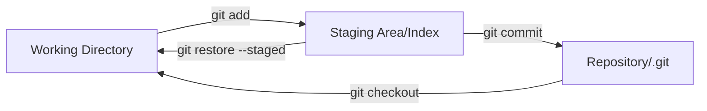

| Area | What It Is | Purpose |
|------|-----------|---------|
| **Working Directory** | Your actual files on disk | Where you edit code |
| **Staging Area (Index)** | Snapshot of what will go in next commit | Allows selective commits |
| **Repository (.git)** | Full history of all commits | Permanent storage |

### Git Objects — The Four Building Blocks

Git has only FOUR types of objects. Everything in Git is built from these:

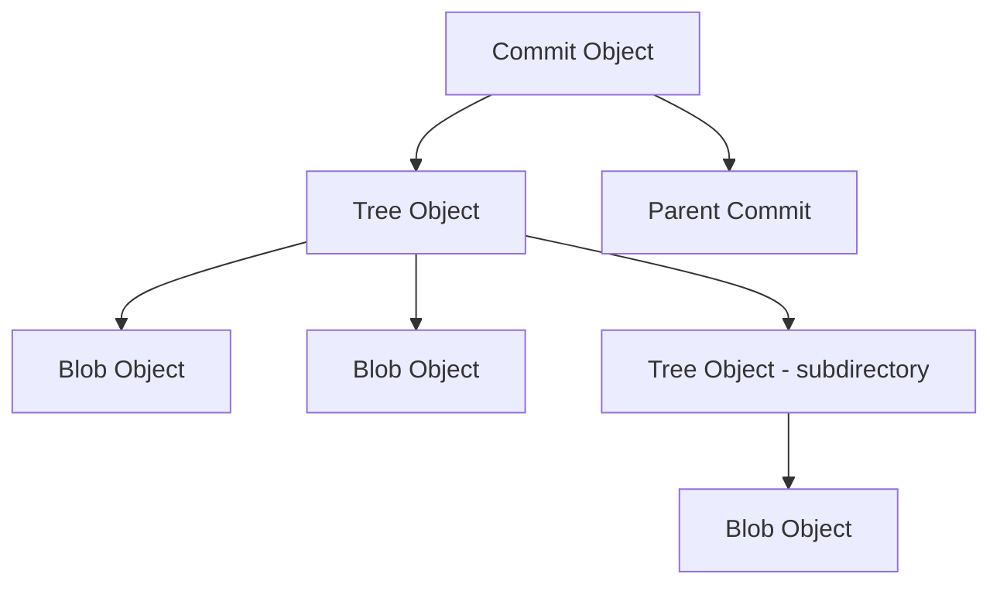

| Object | What It Stores | Analogy |
|--------|---------------|---------|
| **Blob** | File contents (no filename!) | A page of text |
| **Tree** | Directory listing (filenames → blobs/trees) | A folder listing |
| **Commit** | Snapshot pointer + metadata (author, message, parent) | A labeled photo of the folder |
| **Tag** | Pointer to a commit with annotation | A bookmarked photo |

### How Objects Are Stored

Every object is identified by its **SHA-1 hash** (40 hex characters):

```bash
# See a blob object
echo "Hello World" | git hash-object --stdin
# → 557db03de997c86a4a028e1ebd3a1ceb225be238

# See commit objects
git cat-file -p HEAD
# tree 4b825dc642cb6eb9a060e54bf899d8bc24e09f1
# parent a1b2c3d4e5f6...
# author John <john@example.com> 1700000000 +0000
# committer John <john@example.com> 1700000000 +0000
#
# Add user authentication feature

# See tree object
git cat-file -p HEAD^{tree}
# 100644 blob abc123... README.md
# 040000 tree def456... src/

# See blob object
git cat-file -p abc123
# (prints file contents)
```

### How a Commit Is Created Internally

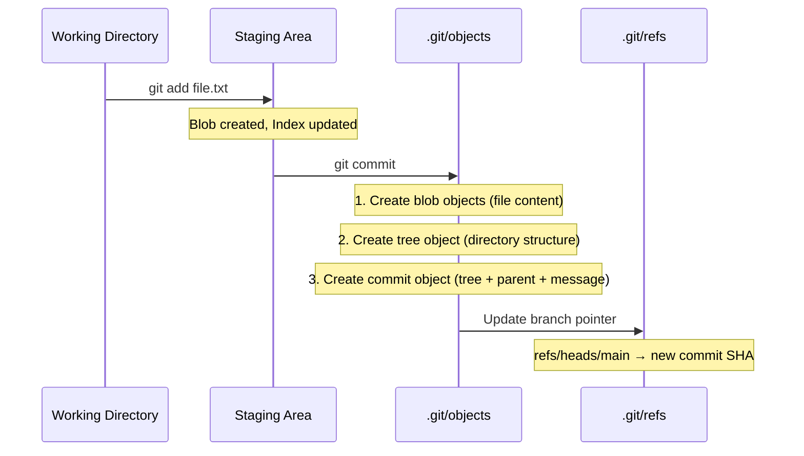

### The .git Directory Structure

```bash
.git/
├── HEAD                 # Points to current branch (ref: refs/heads/main)
├── config               # Repository-level configuration
├── description          # GitWeb description (rarely used)
├── hooks/               # Client/server-side hooks
│   ├── pre-commit       # Runs before commit
│   ├── pre-push         # Runs before push
│   └── commit-msg       # Validate commit message
├── index                # The staging area (binary file)
├── objects/             # All git objects (blobs, trees, commits, tags)
│   ├── pack/            # Packed objects (compressed)
│   └── info/
├── refs/                # Branch and tag pointers
│   ├── heads/           # Local branches
│   │   └── main         # File containing SHA of main's latest commit
│   ├── remotes/         # Remote tracking branches
│   │   └── origin/
│   │       └── main
│   └── tags/            # Tags
└── logs/                # Reflog (history of ref changes)
```

### How HEAD, Branches, and Tags Work

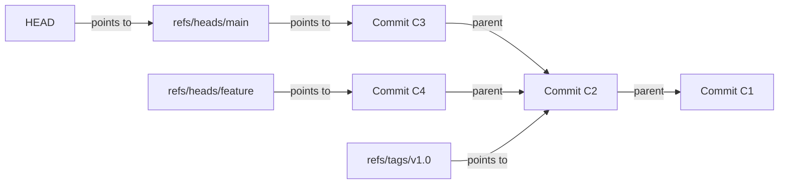

**Key insight:**
- A **branch** is just a file containing a commit SHA (40 bytes!)
- **HEAD** is a pointer to the current branch
- Creating a branch is nearly instantaneous (just creates a tiny file)
- A **tag** is like a branch that never moves

```bash
# Prove it:
cat .git/HEAD
# ref: refs/heads/main

cat .git/refs/heads/main
# a1b2c3d4e5f6g7h8i9j0... (SHA of latest commit)

# Creating a branch just creates a new file:
# .git/refs/heads/feature → same SHA
```

### Commit History Is a DAG (Directed Acyclic Graph)

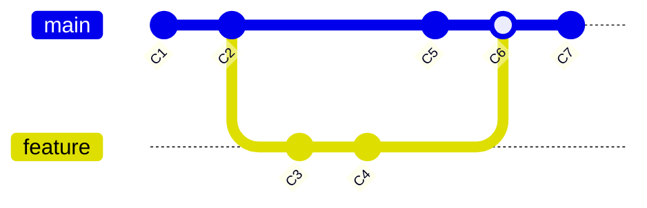

Every commit points to its parent(s). This creates a DAG — you can always trace back to the beginning but never forward. Merge commits have TWO parents.

---

## Branching

### Beginner Explanation

A branch is like a parallel universe for your code. You create a branch, make changes there without affecting the main code, and when you're satisfied, you merge it back.

Think of it like drafting an email: you write in a draft (branch), edit it, and only when it's perfect do you send it (merge to main).

### Branch Operations

```bash
# View branches
git branch                     # List local branches
git branch -a                  # List all branches (local + remote)
git branch -v                  # List with last commit info
git branch --merged            # Branches merged into current
git branch --no-merged         # Branches NOT yet merged

# Create branches
git branch feature-login       # Create branch (don't switch)
git checkout -b feature-login  # Create AND switch (old way)
git switch -c feature-login    # Create AND switch (modern way)

# Switch branches
git checkout main              # Old way
git switch main                # Modern way

# Rename branch
git branch -m old-name new-name
git branch -m new-name         # Rename current branch

# Delete branch
git branch -d feature-login    # Delete (only if merged)
git branch -D feature-login    # Force delete (even if unmerged)

# Delete remote branch
git push origin --delete feature-login
```

### How Branching Works Internally

```bash
# Before creating branch:
# .git/refs/heads/main → commit A1B2C3

# Create branch:
git branch feature
# .git/refs/heads/feature → commit A1B2C3 (same commit!)
# Cost: creating a 41-byte file. INSTANT.

# Switch to branch:
git switch feature
# .git/HEAD → ref: refs/heads/feature

# Make a commit on feature:
# .git/refs/heads/feature → commit D4E5F6 (new commit)
# .git/refs/heads/main → commit A1B2C3 (unchanged!)
```

### Branch Naming Conventions

| Pattern | Example | Use |
|---------|---------|-----|
| `feature/` | `feature/user-authentication` | New features |
| `bugfix/` | `bugfix/login-crash` | Bug fixes |
| `hotfix/` | `hotfix/security-patch` | Urgent production fixes |
| `release/` | `release/2.1.0` | Release preparation |
| `chore/` | `chore/update-dependencies` | Maintenance tasks |

### Remote Branches & Tracking

```bash
# Clone sets up tracking automatically:
git clone https://github.com/org/repo.git
# Creates: origin/main (remote tracking branch)
# Creates: main (local branch tracking origin/main)

# View remote tracking info
git branch -vv
# * main    a1b2c3d [origin/main] Latest commit message
#   feature d4e5f6g [origin/feature: ahead 2] My changes

# Push and set upstream tracking
git push -u origin feature
# Now: git push/pull on this branch knows where to go

# Fetch remote changes (doesn't merge)
git fetch origin
# Updates origin/* branches without touching your local branches

# Pull = fetch + merge
git pull origin main
# Equivalent to:
git fetch origin
git merge origin/main

# List remote branches
git branch -r
# origin/main
# origin/feature
# origin/release/2.0
```

---

## Merging

### Beginner Explanation

Merging is combining two branches back together. It's like taking notes from two different meetings about the same topic and combining them into one final document.

There are two types of merges:
- **Fast-forward:** Like just turning to the next page (no actual combining needed)
- **Three-way merge:** Like actually combining two different documents

### Fast-Forward Merge

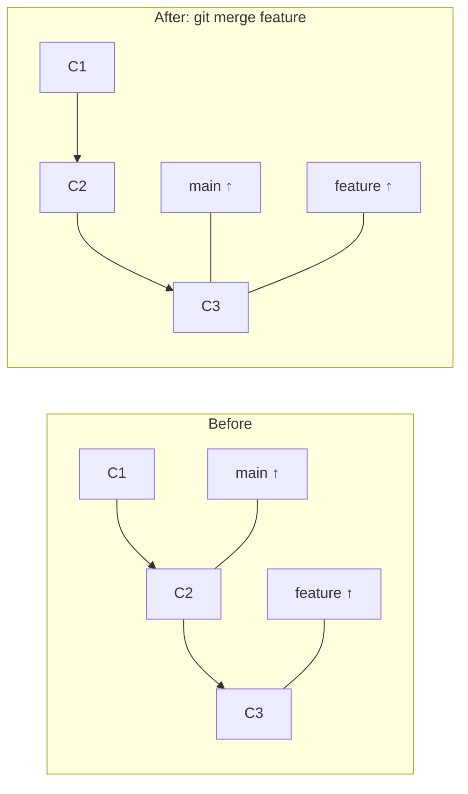

A fast-forward happens when the target branch has NO new commits since the source branch was created. Git just moves the pointer forward.

```bash
# Main hasn't changed since feature branched off:
git switch main
git merge feature
# "Fast-forward" — just moves main pointer to feature's tip

# Force a merge commit even when fast-forward is possible:
git merge --no-ff feature
# Creates a merge commit (useful for history clarity)
```

### Three-Way Merge

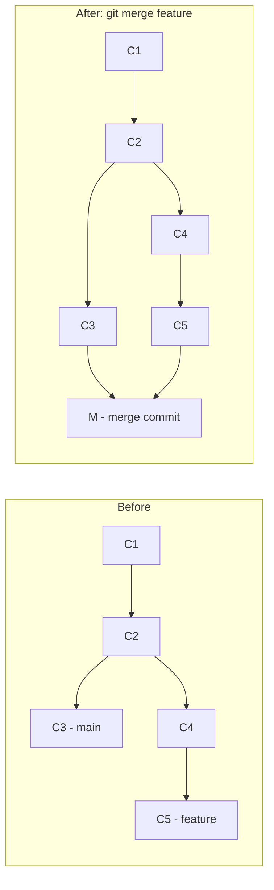

A three-way merge happens when BOTH branches have new commits. Git finds the common ancestor and creates a new **merge commit** with TWO parents.

```bash
# Both main and feature have diverged:
git switch main
git merge feature
# Creates merge commit with two parents
# Message: "Merge branch 'feature' into main"
```

### Merge Conflicts

Conflicts occur when both branches modified the SAME lines in the SAME file.

```bash
# After attempting merge with conflicts:
git merge feature
# CONFLICT (content): Merge conflict in src/app.js
# Automatic merge failed; fix conflicts and then commit the result.

# Git marks conflicts in the file:
<<<<<<< HEAD
// This is the main branch version
const timeout = 5000;
=======
// This is the feature branch version
const timeout = 3000;
>>>>>>> feature

# Resolution steps:
# 1. Open the file and choose/combine the correct code:
const timeout = 3000;  // Decided to use feature's value

# 2. Mark as resolved:
git add src/app.js

# 3. Complete the merge:
git commit
# (Opens editor with merge commit message)

# Or abort the merge entirely:
git merge --abort
```

### Conflict Resolution Strategies

| Strategy | When to Use |
|----------|------------|
| **Keep ours** | Your version is correct | 
| **Keep theirs** | Their version is correct |
| **Combine both** | Both changes are needed |
| **Rewrite** | Neither is correct, write new code |

```bash
# Accept all changes from one side:
git checkout --ours file.txt       # Keep current branch version
git checkout --theirs file.txt     # Keep incoming branch version

# Use merge tool:
git mergetool                      # Opens configured merge tool

# Common merge tools:
# VS Code (built-in), vimdiff, meld, kdiff3, Beyond Compare
```

### Merge Strategies

```bash
# Recursive (default for two branches)
git merge feature
# Three-way merge using recursive algorithm

# Ours (discard all changes from other branch)
git merge -s ours feature
# Creates merge commit but keeps OUR content entirely

# Octopus (merge multiple branches at once)
git merge feature1 feature2 feature3
# Used by Git itself for multi-branch merges

# Squash merge (combine all commits into one, no merge commit)
git merge --squash feature
git commit -m "Add login feature"
# History shows one clean commit instead of all intermediate ones
```

---

## Rebase

### Beginner Explanation

If merging is like combining two documents into one with a staple (merge commit), rebase is like rewriting one document to include the other's changes seamlessly — as if they were never separate.

**Rebase = Replay your commits on top of another branch.**

### How Rebase Works

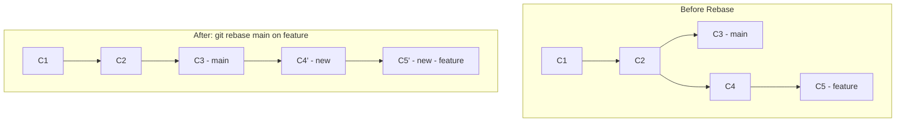

**What happens:**
1. Git finds the common ancestor (C2)
2. Takes your commits (C4, C5) and "peels" them off
3. Moves your branch to the tip of main (C3)
4. Replays your commits one by one on top
5. Creates NEW commits (C4', C5') — different SHA hashes!

```bash
# You're on feature branch, want to update with latest main:
git switch feature
git rebase main
# Your feature commits are now on top of main's latest

# If conflicts occur during rebase:
# 1. Fix the conflict in the file
# 2. Stage the fix:
git add conflicted-file.txt
# 3. Continue rebase:
git rebase --continue
# 4. Or abort:
git rebase --abort
# 5. Or skip this commit:
git rebase --skip
```

### Interactive Rebase — Rewriting History

Interactive rebase is one of Git's most powerful features. It lets you modify, reorder, squash, or delete commits before pushing.

```bash
# Rebase last 4 commits interactively:
git rebase -i HEAD~4

# Opens editor with:
pick a1b2c3d Add user model
pick d4e5f6g Add user controller
pick h7i8j9k Fix typo in user model
pick l0m1n2o Add user tests

# Change to:
pick a1b2c3d Add user model
squash h7i8j9k Fix typo in user model    # Combine with previous
pick d4e5f6g Add user controller
pick l0m1n2o Add user tests

# Commands available:
# pick   = use commit as-is
# reword = change commit message
# edit   = pause to amend the commit
# squash = meld into previous commit (keep message)
# fixup  = meld into previous commit (discard message)
# drop   = remove commit entirely
# reorder lines = reorder commits
```

### Rebase vs Merge — The Great Debate

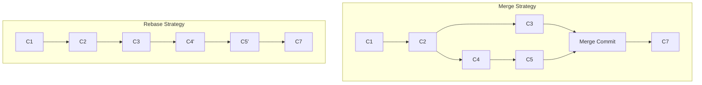

| Aspect | Merge | Rebase |
|--------|-------|--------|
| **History** | Preserves exact history (messy) | Creates linear history (clean) |
| **Merge commits** | Creates merge commit | No merge commits |
| **Conflicts** | Resolve once | May resolve same conflict multiple times |
| **Safety** | Safe (never rewrites) | DANGEROUS on shared branches |
| **Traceability** | Can see when branches were merged | Loses branch context |
| **Use when** | Merging to main/shared branches | Updating feature branch with latest main |

### The Golden Rule of Rebase

> **NEVER rebase commits that have been pushed to a shared/public branch.**

```bash
# SAFE: Rebase your local feature branch onto main
git switch feature
git rebase main
# ✅ Only rewrites YOUR unpushed commits

# DANGEROUS: Rebase main (shared branch)
git switch main
git rebase feature
# ❌ Rewrites shared history, breaks everyone's repos!

# If you already pushed and then rebase:
git push --force-with-lease origin feature
# force-with-lease is safer than --force
# It fails if someone else pushed to the branch since your last fetch
```

### When to Use Merge vs Rebase

| Scenario | Use |
|----------|-----|
| Merging feature → main | **Merge** (preserve history) |
| Updating feature with latest main | **Rebase** (clean history) |
| Shared/team branches | **Merge** (safe) |
| Local/personal branches | **Rebase** (clean) |
| Before creating PR | **Rebase** onto main (clean diff) |
| After PR is approved | **Merge** (squash merge or regular) |

---

## Cherry-pick

### Beginner Explanation

Cherry-picking is like selecting one specific chocolate from a box and putting it on your plate — instead of taking the whole box. You pick ONE specific commit from any branch and apply it to your current branch.

### How Cherry-pick Works

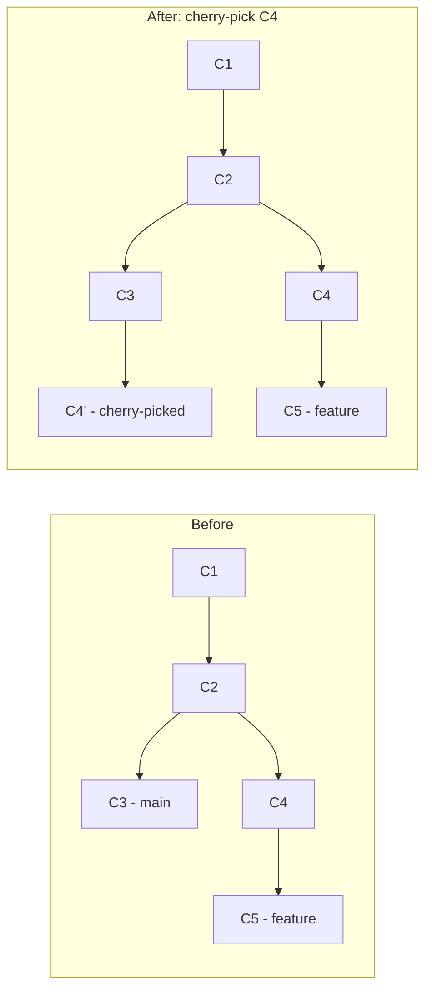

```bash
# Pick a specific commit by SHA:
git cherry-pick a1b2c3d

# Pick multiple commits:
git cherry-pick a1b2c3d d4e5f6g

# Pick a range of commits:
git cherry-pick a1b2c3d..h7i8j9k

# Pick without committing (stage changes only):
git cherry-pick --no-commit a1b2c3d

# If conflict occurs:
git cherry-pick --continue    # After resolving
git cherry-pick --abort       # Cancel

# Cherry-pick from another repository:
git remote add other-repo https://github.com/org/other-repo.git
git fetch other-repo
git cherry-pick abc123
```

### When to Use Cherry-pick

| Scenario | Example |
|----------|---------|
| **Hotfix to production** | Fix is on develop, need it on main NOW |
| **Backporting** | Feature from v3 needed in v2 maintenance branch |
| **Selective migration** | Moving specific commits between branches |
| **Undoing an accidental commit to wrong branch** | Cherry-pick to correct branch, then revert on wrong branch |

### Real-World Cherry-pick Example

```bash
# Scenario: Critical bug fix committed to develop, needs to go to production NOW

# 1. Find the fix commit
git log --oneline develop
# a1b2c3d Fix critical payment validation bug
# d4e5f6g Add new dashboard feature
# h7i8j9k Refactor user service

# 2. Cherry-pick ONLY the fix to the release branch
git switch release/2.1
git cherry-pick a1b2c3d

# 3. Deploy release branch to production
# The fix is now in production without the unfinished features!
```

### Cherry-pick Pitfalls

| Problem | Solution |
|---------|----------|
| Duplicate commits (same change, different SHA) | Use merge/rebase when possible |
| Conflicts with dependent commits | Cherry-pick all dependent commits in order |
| Lost context (commit seems random in history) | Use descriptive commit messages with cherry-pick reference |

---

## Git Workflows

### Why Workflows Matter

A Git workflow is a team agreement on HOW to use branches. Without one:
- Developers step on each other's work
- Main branch is unstable
- Releases are chaotic
- No one knows what's deployed

### 1. Trunk-Based Development

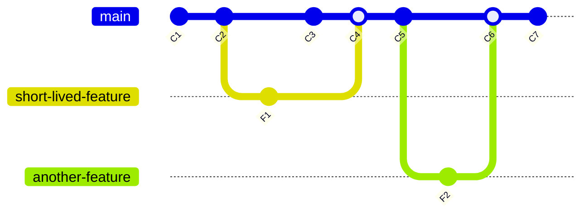

**How it works:**
- Everyone commits directly to `main` (or very short-lived branches — < 1 day)
- Feature flags hide incomplete features
- CI runs on every commit
- Main is ALWAYS deployable

| Pros | Cons |
|------|------|
| Simplest workflow | Requires excellent test coverage |
| Fastest feedback | Requires feature flags |
| Minimal merge conflicts | Not suitable for open-source |
| Enables continuous deployment | Needs experienced team |

**Best for:** Small teams, high-trust environments, companies practicing CD (Google, Facebook)

```bash
# Typical trunk-based flow:
git switch main
git pull
git switch -c quick-fix        # Short-lived branch (hours, not days)
# ... make changes ...
git push -u origin quick-fix
# Create PR → fast review → merge same day
# Delete branch immediately after merge
```

### 2. GitHub Flow

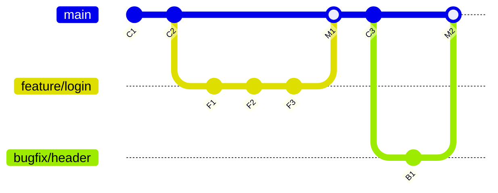

**Rules:**
1. `main` is ALWAYS deployable
2. Create a descriptively named branch from `main`
3. Commit to that branch regularly, push to remote
4. Open a Pull Request when ready for review
5. After review and CI passes, merge to `main`
6. Deploy immediately after merge

| Pros | Cons |
|------|------|
| Simple (only main + feature branches) | No release management |
| Great for continuous deployment | Hard to manage multiple versions |
| PR-based review process | Main must always be deployable |
| GitHub/GitLab native support | — |

**Best for:** Web applications, SaaS products, teams doing continuous deployment

```bash
# GitHub Flow:
git switch main && git pull
git switch -c feature/user-profile
# ... develop for a few days ...
git push -u origin feature/user-profile
# Open PR on GitHub → review → CI passes → merge → auto-deploy
```

### 3. Git Flow (Gitflow)

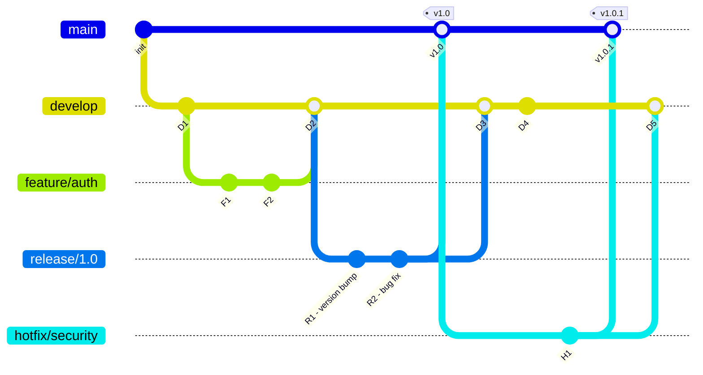

**Branches:**

| Branch | Purpose | Created from | Merges into |
|--------|---------|-------------|-------------|
| `main` | Production code | — | — |
| `develop` | Integration branch | main | — |
| `feature/*` | New features | develop | develop |
| `release/*` | Release preparation | develop | main + develop |
| `hotfix/*` | Emergency production fixes | main | main + develop |

**Flow:**
1. Features branch from `develop`, merge back to `develop`
2. When ready to release: branch `release/x.y` from `develop`
3. Release branch gets bug fixes, version bumps
4. Release merges to BOTH `main` (tagged) and `develop`
5. Hotfixes branch from `main`, merge to BOTH `main` and `develop`

| Pros | Cons |
|------|------|
| Clear release management | Complex (many branches) |
| Supports multiple versions | Long-lived branches → merge hell |
| Suitable for scheduled releases | Slow feedback loop |
| Good for large teams | Overkill for continuous deployment |

**Best for:** Software with scheduled releases, mobile apps, enterprise software, libraries/packages

```bash
# Install git-flow extension for shortcuts:
git flow init

# Feature:
git flow feature start user-auth
# ... develop ...
git flow feature finish user-auth   # Merges to develop

# Release:
git flow release start 2.0.0
# ... version bump, final fixes ...
git flow release finish 2.0.0       # Merges to main + develop, tags

# Hotfix:
git flow hotfix start critical-fix
# ... fix ...
git flow hotfix finish critical-fix  # Merges to main + develop, tags
```

### 4. Forking Workflow

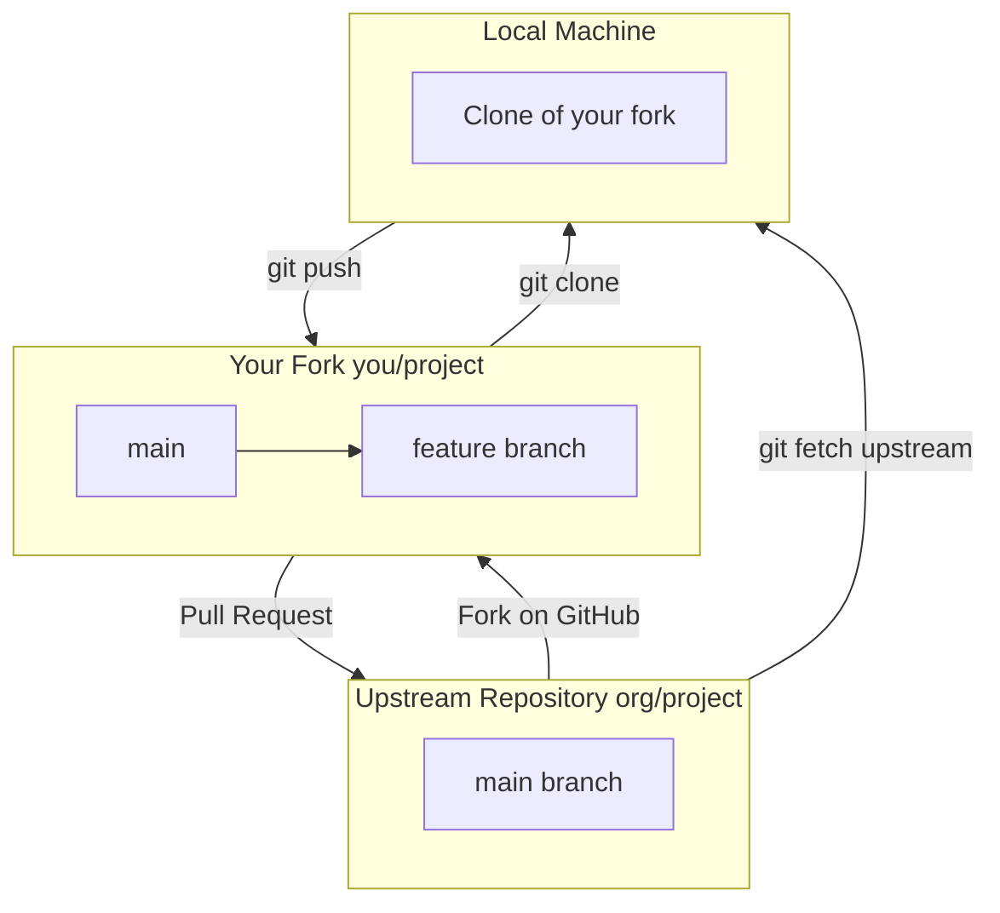

**How it works:**
1. Fork the repository (your own copy on GitHub)
2. Clone your fork locally
3. Create feature branch, develop, push to YOUR fork
4. Create Pull Request from your fork to upstream
5. Upstream maintainer reviews and merges

**Best for:** Open-source projects, untrusted contributors

```bash
# Setup:
git clone https://github.com/YOUR-USER/project.git
git remote add upstream https://github.com/ORIGINAL-ORG/project.git

# Keep your fork updated:
git fetch upstream
git switch main
git merge upstream/main
git push origin main

# Contribute:
git switch -c fix/typo-in-docs
# ... make changes ...
git push origin fix/typo-in-docs
# Create PR on GitHub from your-user:fix/typo-in-docs → org:main
```

### Workflow Comparison Summary

| Workflow | Complexity | Best For | Release Cadence |
|----------|-----------|----------|-----------------|
| **Trunk-Based** | Lowest | Small teams, CD | Continuous |
| **GitHub Flow** | Low | SaaS, web apps | Continuous |
| **Git Flow** | High | Scheduled releases | Periodic |
| **Forking** | Medium | Open source | Variable |

---

## Advanced Git Operations

### Stashing

```bash
# Save current changes temporarily (not ready to commit):
git stash
git stash save "WIP: implementing caching"

# List stashes:
git stash list
# stash@{0}: WIP: implementing caching
# stash@{1}: On feature: quick experiment

# Apply stash (keep in stash list):
git stash apply stash@{0}

# Apply and remove from stash list:
git stash pop

# Apply specific stash:
git stash pop stash@{1}

# View stash contents:
git stash show -p stash@{0}

# Drop a stash:
git stash drop stash@{0}

# Clear all stashes:
git stash clear

# Create branch from stash:
git stash branch new-feature stash@{0}
```

### Git Reset — Moving Branch Pointer

```bash
# Soft reset: Move branch pointer, keep changes staged
git reset --soft HEAD~1
# Undoes last commit, keeps changes in staging
# Use: "I committed too early, want to add more changes"

# Mixed reset (default): Move pointer, keep changes in working directory
git reset HEAD~1
git reset --mixed HEAD~1
# Undoes last commit, keeps changes but unstaged
# Use: "I want to recommit with different staging"

# Hard reset: Move pointer, DISCARD ALL CHANGES
git reset --hard HEAD~1
# ⚠️ DANGEROUS: Permanently destroys uncommitted changes!
# Use: "I want to completely undo the last commit"

# Reset specific file from staging:
git reset HEAD file.txt
# Modern equivalent:
git restore --staged file.txt
```

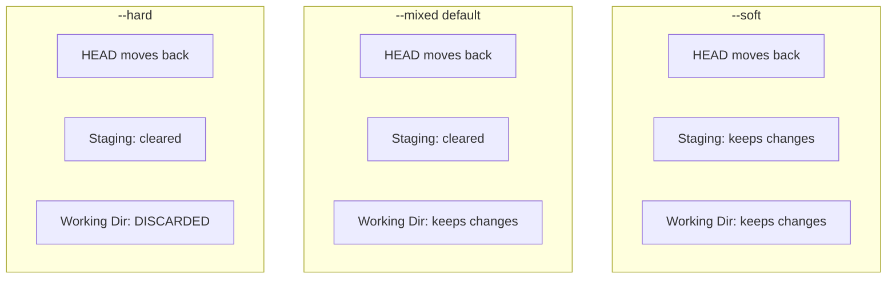

### Git Reflog — Your Safety Net

The reflog records every time HEAD changes. It's your ultimate "undo" tool.

```bash
# View reflog:
git reflog
# a1b2c3d HEAD@{0}: commit: Add feature
# d4e5f6g HEAD@{1}: checkout: moving from main to feature
# h7i8j9k HEAD@{2}: commit: Fix bug
# l0m1n2o HEAD@{3}: reset: moving to HEAD~2

# Recover "lost" commits after a hard reset:
git reset --hard HEAD~3    # Oops, went too far back!
git reflog                 # Find the commit SHA you want
git reset --hard a1b2c3d   # Get it back!

# Recover deleted branch:
git branch -D feature      # Accidentally deleted!
git reflog                 # Find last commit on that branch
git branch feature a1b2c3d # Recreate it

# Reflog expires after 90 days (default)
```

### Tagging

```bash
# Lightweight tag (just a pointer):
git tag v1.0.0

# Annotated tag (recommended — has metadata):
git tag -a v1.0.0 -m "Release version 1.0.0"

# Tag a specific commit:
git tag -a v1.0.0 a1b2c3d -m "Release 1.0.0"

# List tags:
git tag
git tag -l "v2.*"          # Pattern matching

# View tag details:
git show v1.0.0

# Push tags:
git push origin v1.0.0     # Push specific tag
git push origin --tags      # Push all tags

# Delete tag:
git tag -d v1.0.0                  # Local
git push origin --delete v1.0.0    # Remote
```

### Semantic Versioning (SemVer)

```
MAJOR.MINOR.PATCH
  2  .  1  .  3

MAJOR: Breaking changes (incompatible API changes)
MINOR: New features (backward-compatible)
PATCH: Bug fixes (backward-compatible)
```

| Change | Example | Version |
|--------|---------|---------|
| Initial release | — | 1.0.0 |
| Bug fix | Fix login timeout | 1.0.1 |
| New feature | Add password reset | 1.1.0 |
| Breaking change | Change API response format | 2.0.0 |

### Git Hooks

```bash
# .git/hooks/ — client-side hooks
# They run locally on events

# pre-commit: Run before commit is created
#!/bin/bash
# .git/hooks/pre-commit
# Run linting
npm run lint
if [ $? -ne 0 ]; then
    echo "Lint failed. Fix errors before committing."
    exit 1
fi

# commit-msg: Validate commit message format
#!/bin/bash
# .git/hooks/commit-msg
MSG=$(cat "$1")
if ! echo "$MSG" | grep -qE "^(feat|fix|docs|style|refactor|test|chore)\(.+\): .+"; then
    echo "ERROR: Commit message must follow Conventional Commits format"
    echo "Example: feat(auth): add OAuth2 login"
    exit 1
fi

# pre-push: Run before pushing
#!/bin/bash
# .git/hooks/pre-push
npm test
if [ $? -ne 0 ]; then
    echo "Tests failed. Fix before pushing."
    exit 1
fi
```

### Conventional Commits

```
<type>(<scope>): <description>

[optional body]

[optional footer(s)]
```

| Type | Purpose |
|------|---------|
| `feat` | New feature |
| `fix` | Bug fix |
| `docs` | Documentation |
| `style` | Formatting (no code change) |
| `refactor` | Code restructuring |
| `test` | Adding tests |
| `chore` | Maintenance, dependencies |
| `ci` | CI/CD changes |
| `perf` | Performance improvement |

```bash
# Examples:
git commit -m "feat(auth): add Google OAuth2 login"
git commit -m "fix(cart): resolve race condition in quantity update"
git commit -m "docs(api): add endpoint documentation for /users"
git commit -m "refactor(db): migrate from callbacks to async/await"
git commit -m "ci(github): add code coverage reporting to PR checks"
```

### Git Bisect — Find Bug-Introducing Commit

```bash
# "The app was working 2 weeks ago, now it's broken. Which commit broke it?"

# Start bisect:
git bisect start
git bisect bad                     # Current commit is broken
git bisect good v1.5.0             # This version was working

# Git checks out middle commit. You test:
# If broken:
git bisect bad
# If working:
git bisect good

# Git narrows down using binary search. Repeat until:
# "a1b2c3d is the first bad commit"

# Done:
git bisect reset

# Automated bisect (if you have a test script):
git bisect start HEAD v1.5.0
git bisect run npm test
# Git automatically finds the breaking commit!
```

### Git Worktrees

```bash
# Work on multiple branches simultaneously without stashing:
git worktree add ../hotfix hotfix/critical-bug
# Creates a new working directory linked to the same repo

# List worktrees:
git worktree list

# Remove when done:
git worktree remove ../hotfix
```

### .gitignore Patterns

```bash
# .gitignore — files/patterns to exclude from tracking

# Dependencies
node_modules/
vendor/
__pycache__/
*.pyc

# Build output
dist/
build/
*.jar
*.war

# IDE files
.idea/
.vscode/
*.swp
*.swo

# Environment / Secrets
.env
.env.local
*.key
*.pem
credentials.json

# OS files
.DS_Store
Thumbs.db

# Logs
*.log
logs/

# Docker
docker-compose.override.yml

# Terraform
.terraform/
*.tfstate
*.tfstate.backup
```

```bash
# Ignore file that's already tracked:
git rm --cached secret.env         # Stop tracking (keeps file on disk)
echo "secret.env" >> .gitignore    # Prevent future tracking

# Global gitignore (for your machine):
git config --global core.excludesfile ~/.gitignore_global
```

---

## Interview Mastery

### Beginner Interview Questions

---

**Q1: What is Git? How is it different from GitHub?**

**Perfect Answer:**
> "**Git** is a distributed version control system — a tool that tracks changes to files over time, allowing multiple developers to collaborate on the same codebase. It runs locally on your machine.
>
> **GitHub** is a cloud hosting platform for Git repositories. It adds collaboration features on top of Git: pull requests, issues, code review, CI/CD (GitHub Actions), project management.
>
> Analogy: Git is like the engine, GitHub is like the car built around it. Other 'cars' include GitLab, Bitbucket, and Azure DevOps.
>
> Key distinction: You can use Git without GitHub (local repos, self-hosted servers), but you can't use GitHub without Git."

---

**Q2: Explain the Git workflow: working directory, staging area, and repository.**

**Perfect Answer:**
> "Git has three main areas:
>
> 1. **Working Directory** — Your actual files on disk where you edit code. Files here can be modified, untracked, or unmodified.
>
> 2. **Staging Area (Index)** — A preparation zone. When you `git add` a file, it moves here. This lets you select exactly which changes go into the next commit. Think of it as a loading dock — you choose what goes on the truck.
>
> 3. **Repository (.git)** — The permanent history. When you `git commit`, everything in staging gets saved as a commit object with a SHA-1 hash, author, timestamp, and message.
>
> **Flow:** Edit files → `git add` (stage) → `git commit` (save permanently)
>
> **Why staging exists:** It lets you make 10 changes but commit them as 3 logical units. For example, you fix a bug AND refactor some code — you can commit the fix separately from the refactor. This makes history meaningful and reviewable."

---

**Q3: What is a merge conflict? How do you resolve it?**

**Perfect Answer:**
> "A merge conflict occurs when Git can't automatically combine changes because two branches modified the same lines of the same file differently.
>
> **When it happens:**
> - Two developers change the same line
> - One branch deletes a file another branch modifies
> - Conflicting renames
>
> **How to resolve:**
> 1. Git marks conflicts in the file with `<<<<<<<`, `=======`, `>>>>>>>`
> 2. Open the file, understand both versions
> 3. Choose the correct code (keep one, combine both, or rewrite)
> 4. Remove the conflict markers
> 5. `git add` the resolved file
> 6. `git commit` to complete the merge
>
> **Best practices to avoid conflicts:**
> - Pull frequently (stay up to date with main)
> - Keep branches short-lived
> - Communicate about who's editing what
> - Use smaller, focused files
>
> **In case of complex conflicts:** `git mergetool` opens a visual tool (VS Code, meld) that shows base, ours, theirs side by side."

---

**Q4: What is the difference between `git pull` and `git fetch`?**

**Perfect Answer:**
> "**`git fetch`** downloads changes from the remote repository but does NOT modify your working directory or current branch. It updates your remote tracking branches (origin/main) so you can see what's new.
>
> **`git pull`** = `git fetch` + `git merge`. It downloads changes AND immediately merges them into your current branch.
>
> **When to use which:**
> - `git fetch`: When you want to see what others have done without affecting your work. Safe, non-destructive. Good before rebasing.
> - `git pull`: When you're ready to integrate remote changes into your branch.
>
> **Best practice in teams:** Many experienced developers prefer `git fetch` + `git rebase origin/main` over `git pull`, because it keeps history linear and avoids unnecessary merge commits. Or use `git pull --rebase` as a shortcut."

---

**Q5: What is the difference between `git reset` and `git revert`?**

**Perfect Answer:**
> "Both undo changes, but in fundamentally different ways:
>
> **`git reset`** — Moves the branch pointer backward, ERASING commits from history.
> ```bash
> git reset --hard HEAD~1  # Commit is gone (dangerous on shared branches)
> ```
> - Rewrites history (commits disappear)
> - Dangerous on shared branches (breaks others)
> - Use for: local cleanup before pushing
>
> **`git revert`** — Creates a NEW commit that undoes a previous commit's changes.
> ```bash
> git revert abc123  # Creates new commit that reverses abc123
> ```
> - Preserves history (original commit + reversal commit both visible)
> - Safe on shared branches (doesn't rewrite history)
> - Use for: undoing published commits
>
> **Rule of thumb:**
> - Not pushed yet? → `git reset`
> - Already pushed/shared? → `git revert`"

---

### Intermediate Interview Questions

---

**Q6: Explain Git rebase. When would you use it vs merge?**

**Perfect Answer:**
> "**Rebase** takes your branch's commits and replays them on top of another branch, creating new commits with new SHA hashes. It results in a linear history without merge commits.
>
> **Merge** creates a merge commit that ties two branches together, preserving the exact history of when things happened.
>
> **When I use rebase:**
> - Updating my feature branch with latest main: `git rebase main` keeps my work 'on top'
> - Cleaning up commits before PR (interactive rebase): squashing WIP commits
> - Keeping a clean, linear history
>
> **When I use merge:**
> - Merging feature branches into main/develop (via PR)
> - When history of parallel work is important
> - On shared branches (rebase rewrites history)
>
> **The Golden Rule:** Never rebase commits that have been pushed to a shared branch. If you do, use `--force-with-lease` (safer than `--force`) to push.
>
> **My typical workflow:**
> 1. Work on feature branch
> 2. Before PR: `git rebase -i main` (clean up commits)
> 3. PR approved: squash merge to main (one clean commit)"

---

**Q7: What is `git stash`? Give a real-world scenario.**

**Perfect Answer:**
> "`git stash` temporarily saves uncommitted changes (both staged and unstaged) so you can switch context and come back later. It's like putting your current work in a drawer.
>
> **Real-world scenario:**
>
> I'm halfway through implementing a feature when a critical production bug is reported:
> ```bash
> # I'm on feature/dashboard with uncommitted changes
> git stash save 'WIP: dashboard charts'
> 
> # Switch to fix the bug
> git switch main
> git switch -c hotfix/payment-crash
> # ... fix the bug, commit, push, PR ...
> 
> # Return to my feature work
> git switch feature/dashboard
> git stash pop
> # All my in-progress changes are back!
> ```
>
> **Key commands:**
> - `git stash` / `git stash push` — save changes
> - `git stash list` — see all stashes
> - `git stash pop` — apply and remove from stash
> - `git stash apply` — apply but keep in stash
> - `git stash drop` — discard a stash
>
> **Important:** Stash is local only and meant to be temporary. For longer pauses, commit with WIP message on a branch."

---

**Q8: Explain the forking workflow. How does it differ from branching?**

**Perfect Answer:**
> "In a **branching workflow**, all developers clone the same repository and push branches directly to it. Everyone has write access to the central repo.
>
> In a **forking workflow**, developers create a personal copy (fork) of the repository on the server. They push to their own fork and create pull requests to the original (upstream) repo. Only maintainers have write access to upstream.
>
> **Key differences:**
>
> | Aspect | Branching | Forking |
> |--------|-----------|---------|
> | Access needed | Write access to repo | Read access only |
> | Push to | Central repo | Your own fork |
> | PR from | Branch in same repo | Fork to upstream |
> | Isolation | Shared branch namespace | Completely separate repos |
>
> **When to use forking:**
> - Open source projects (untrusted contributors)
> - Large organizations (external contractors)
> - When you want strict code review gates
>
> **Setup:**
> ```bash
> git remote add upstream https://github.com/original/repo.git
> git fetch upstream
> git rebase upstream/main  # Keep fork updated
> ```"

---

**Q9: What are Git hooks? Give a practical example in CI/CD.**

**Perfect Answer:**
> "Git hooks are scripts that run automatically at certain points in the Git workflow. They can run before or after events like commit, push, merge, and receive.
>
> **Client-side hooks (run on developer's machine):**
> - `pre-commit`: Lint code, check formatting, scan for secrets
> - `commit-msg`: Enforce commit message format (Conventional Commits)
> - `pre-push`: Run tests before pushing
>
> **Server-side hooks (run on remote/server):**
> - `pre-receive`: Reject pushes that don't meet criteria
> - `post-receive`: Trigger CI/CD pipeline, send notifications
>
> **Practical example — preventing secrets from being committed:**
> ```bash
> #!/bin/bash
> # .git/hooks/pre-commit
> # Check for AWS keys, API tokens, passwords
> if git diff --cached --diff-filter=d | grep -qE '(AKIA|sk-|password\s*=)'; then
>     echo 'ERROR: Possible secret detected in commit!'
>     echo 'Use git secret or environment variables instead.'
>     exit 1
> fi
> ```
>
> **In practice:** We use tools like Husky (JS) or pre-commit (Python) to manage hooks and share them via the repository, since `.git/hooks/` isn't tracked by Git itself."

---

**Q10: What is `git bisect`? How would you use it to find a bug?**

**Perfect Answer:**
> "`git bisect` performs a binary search through commit history to find exactly which commit introduced a bug. Instead of checking every commit linearly (O(n)), it uses binary search (O(log n)).
>
> **For 1000 commits, bisect finds the bug in ~10 steps instead of 1000.**
>
> **Process:**
> ```bash
> git bisect start
> git bisect bad              # Current version is broken
> git bisect good v2.0.0      # This version was working
> # Git checks out the middle commit
> # Test it → mark good or bad
> git bisect good  # or git bisect bad
> # Git narrows the range by half
> # Repeat until found
> git bisect reset            # Return to normal
> ```
>
> **Automated version (powerful!):**
> ```bash
> git bisect start HEAD v2.0.0
> git bisect run ./test-script.sh
> # Git automatically tests each commit and finds the first bad one
> ```
>
> **Real scenario:** 'The API returns 500 errors but it worked last week.' I'd find last week's commit, mark it as good, mark today's as bad, and bisect with an automated curl test."

---

### Advanced Interview Questions

---

**Q11: Explain Git internals. What are blobs, trees, and commit objects?**

**Perfect Answer:**
> "Git is fundamentally a content-addressable filesystem. Everything is stored as objects identified by SHA-1 hashes.
>
> **Four object types:**
>
> 1. **Blob:** Stores file content (no filename, no metadata — just raw content). Two files with identical content share one blob.
>
> 2. **Tree:** Represents a directory. Contains entries mapping filenames to blobs (files) or other trees (subdirectories). Like `ls -la` output.
>
> 3. **Commit:** Points to a tree (snapshot of project), parent commit(s), and metadata (author, committer, message, timestamp).
>
> 4. **Tag (annotated):** Points to a commit with additional metadata (tagger, message, GPG signature).
>
> **How they relate:**
> ```
> Commit → Tree (root directory)
>          ├── Blob (README.md)
>          ├── Blob (app.py)
>          └── Tree (src/)
>              ├── Blob (main.py)
>              └── Blob (utils.py)
> ```
>
> **Key insights:**
> - A branch is just a file containing a commit SHA (41 bytes)
> - Creating a branch is O(1) — just creates a pointer
> - Git deduplicates: identical files across commits share the same blob
> - Objects are immutable — once created, never changed
>
> **Verify yourself:**
> ```bash
> git cat-file -t HEAD    # Shows: commit
> git cat-file -p HEAD    # Shows commit contents
> git cat-file -p HEAD^{tree}  # Shows tree contents
> ```"

---

**Q12: Your team is experiencing frequent merge conflicts. How would you reduce them?**

**Perfect Answer:**
> "Frequent merge conflicts are a symptom of process and architecture issues. I'd address it at multiple levels:
>
> **1. Process improvements:**
> - **Short-lived branches:** Branches should live 1-3 days max. Long-lived branches diverge too far.
> - **Frequent integration:** Pull from main at least daily. Don't wait until PR to discover conflicts.
> - **Smaller PRs:** 200-400 lines max. Large PRs are conflict magnets.
> - **Communication:** Standup mentions 'I'm working in file X' to avoid duplicated work.
>
> **2. Technical improvements:**
> - **Trunk-based development:** Commit to main directly (with feature flags)
> - **Rebase before PR:** `git rebase main` before creating PR ensures clean merge
> - **Auto-merge bots:** Bots that keep feature branches updated with main
>
> **3. Architecture improvements:**
> - **Modular code:** If two teams keep conflicting in the same file, the file has too many responsibilities. Split it.
> - **Clear ownership:** Each module owned by one team
> - **API boundaries:** Teams interact via interfaces, not shared code
> - **Microservices:** Ultimate separation — separate repos
>
> **4. Code organization:**
> - Avoid monolithic config files (split into per-service configs)
> - Use auto-formatters (Prettier) committed to repo — eliminates formatting conflicts
> - Generated files (lock files, schemas) should be generated by one process
>
> **Measure:** Track conflict frequency per team/repo and treat it as a metric to reduce."

---

**Q13: How would you recover from `git push --force` that overwrote a colleague's work?**

**Perfect Answer:**
> "This is a severe situation. Here's the recovery plan:
>
> **Immediate steps:**
>
> **1. Don't panic — the commits likely still exist somewhere.**
>
> **2. Check if anyone has the lost commits locally:**
> ```bash
> # On the colleague's machine:
> git reflog
> # Their local history still has the original commits
> git branch recovery-branch <SHA-from-reflog>
> git push origin recovery-branch
> ```
>
> **3. If no one has them locally, check the server:**
> - GitHub/GitLab keep reflog for ~90 days
> - GitHub: Support can help recover
> - GitLab: `git reflog` on the server-side repo
>
> **4. Reconstruct the branch:**
> ```bash
> # Get the lost commits from reflog
> git reflog origin/main
> # Find the SHA before the force push
> git reset --hard <original-sha>
> # Cherry-pick any new commits that should exist
> git push --force-with-lease origin main
> ```
>
> **Prevention for the future:**
> 1. **Never use `git push --force`** — use `--force-with-lease` (refuses if remote changed)
> 2. **Branch protection rules:** Block force-push on main/develop
> 3. **Require PR reviews:** No direct push to main
> 4. **Enable GitHub's branch protection:** 'Restrict force pushes'
> 5. **Team convention:** Only force-push to your own feature branches"

---

### Scenario-Based Questions

---

**Q14: You accidentally committed a file containing API keys and pushed it. How do you handle this?**

**Perfect Answer:**
> "This is a security incident. The key is already compromised regardless of what you do with Git — once pushed, it's in server logs, potentially cloned by others, and indexed.
>
> **Immediate actions (in this order):**
>
> **1. Rotate the credentials FIRST (most important):**
> - Revoke/regenerate all exposed API keys immediately
> - This is priority #1 because removing from Git doesn't un-expose them
>
> **2. Remove from current branch:**
> ```bash
> # Remove the file
> git rm --cached secrets.env
> echo 'secrets.env' >> .gitignore
> git commit -m 'chore: remove accidentally committed secrets'
> git push
> ```
>
> **3. Remove from history (if truly sensitive):**
> ```bash
> # Using git-filter-repo (recommended over filter-branch):
> git filter-repo --path secrets.env --invert-paths
> # Force push to overwrite remote history
> git push --force-with-lease --all
> ```
> Or use BFG Repo Cleaner:
> ```bash
> bfg --delete-files secrets.env
> git push --force-with-lease
> ```
>
> **4. Notify the team:**
> - Everyone must re-clone or `git fetch --all && git reset --hard origin/main`
> - Force-pushing rewrites history for everyone
>
> **5. Prevention:**
> - Pre-commit hooks that scan for secrets (gitleaks, detect-secrets)
> - `.gitignore` includes all secret file patterns from day one
> - Use environment variables or secret managers (Vault, AWS Secrets Manager)
> - GitHub secret scanning alerts (automatic)
>
> **Key lesson:** Once a secret is pushed, ROTATE IT. Git history removal is damage limitation, not security."

---

**Q15: Your Git repo is 5GB and clone takes 20 minutes. How do you optimize it?**

**Perfect Answer:**
> "A bloated repo is usually caused by large binary files, build artifacts, or accumulated history. Here's my approach:
>
> **1. Diagnose the problem:**
> ```bash
> # Find large objects in history
> git rev-list --objects --all | \
>   git cat-file --batch-check='%(objecttype) %(objectname) %(objectsize) %(rest)' | \
>   sort -k3 -n -r | head -20
>
> # Or use git-sizer tool:
> git-sizer --verbose
> ```
>
> **2. Solutions based on cause:**
>
> **If large binaries in history:**
> ```bash
> # Remove with BFG or git-filter-repo
> git filter-repo --strip-blobs-bigger-than 10M
> # Then: git push --force-with-lease
> ```
>
> **If large binaries needed (media, models, datasets):**
> ```bash
> # Use Git LFS (Large File Storage)
> git lfs install
> git lfs track '*.psd' '*.zip' '*.model'
> # Stores pointers in Git, actual files on LFS server
> ```
>
> **3. For faster clones (without repo changes):**
> ```bash
> # Shallow clone (recent history only)
> git clone --depth=1 https://github.com/org/repo.git
>
> # Partial clone (download objects on-demand)
> git clone --filter=blob:none https://github.com/org/repo.git
>
> # Single branch
> git clone --single-branch --branch main https://github.com/org/repo.git
> ```
>
> **4. Prevention:**
> - `.gitignore` all build artifacts, dependencies, binaries
> - Use Git LFS from the start for any binary files
> - CI/CD: use shallow clones (`--depth=1`)
> - Regular repo maintenance: `git gc --aggressive`"

---

### FAANG-Style Conceptual Questions

---

**Q16: Design a Git branching strategy for a team of 50 developers working on a mobile app with bi-weekly releases.**

**Perfect Answer:**
> "Given 50 developers, bi-weekly releases, and mobile app constraints (app store review time), I'd use a modified Git Flow:
>
> **Branch structure:**
> ```
> main          ← Production code (what's in the app store)
> develop       ← Integration branch (next release)
> release/x.y   ← Release stabilization (created 3 days before release)
> feature/*     ← Individual features (from develop)
> hotfix/*      ← Emergency production fixes (from main)
> ```
>
> **Why not simpler (trunk-based/GitHub Flow)?**
> - Mobile apps can't deploy instantly (app store review = 1-3 days)
> - Need a stabilization period before release
> - Can't feature-flag everything in mobile (binary size, performance)
>
> **Process:**
> 1. **Sprint work:** Teams work on feature branches from develop
> 2. **Day 1-9:** Features merged to develop via PR + code review
> 3. **Day 10:** Cut `release/x.y` from develop. Only bug fixes allowed.
> 4. **Day 10-12:** QA on release branch, fix bugs
> 5. **Day 12:** Submit to app store
> 6. **Day 14:** Release goes live, merge release → main + develop, tag
>
> **Rules:**
> - Feature branches: < 3 days old, < 400 lines
> - PRs require: 2 reviewers, CI pass, QA label
> - Release branch: only bug fixes (cherry-picked from develop if needed)
> - Hotfixes: branch from main, merge to main + develop, expedited review
>
> **Automation:**
> - CI on every PR (lint, test, build)
> - Nightly builds from develop for internal testing
> - Auto-version bumping on release branch
> - Slack notifications for release branch status
>
> **Scaling to 50 devs:**
> - Feature teams (5-8 devs) own specific modules
> - CODEOWNERS file enforces review ownership
> - Merge queue (GitHub) to prevent merge conflicts at scale
> - Release manager rotates weekly (not permanent role)"

---

**Q17: Explain how `git merge` works internally. What is a three-way merge algorithm?**

**Perfect Answer:**
> "When Git merges two branches, it uses a three-way merge algorithm. The three 'ways' are:
>
> 1. **Common ancestor (base):** The commit where the branches diverged
> 2. **Ours:** The tip of the current branch
> 3. **Theirs:** The tip of the branch being merged
>
> **Algorithm:**
> For each file, Git compares three versions:
> - If file is same in base and ours → take theirs (they changed it)
> - If file is same in base and theirs → take ours (we changed it)
> - If file is same in ours and theirs → take either (both made same change)
> - If all three differ → CONFLICT (both changed differently)
>
> **Line-level resolution:**
> Within files, the same logic applies at the line/hunk level. Git uses the longest common subsequence algorithm to identify which lines changed in each branch relative to the base.
>
> **Finding the common ancestor:**
> Git uses the merge-base algorithm to find the best common ancestor. In simple cases, it's obvious. In complex histories (criss-cross merges), Git may use a recursive strategy:
> ```bash
> git merge-base main feature
> # Returns the SHA of the common ancestor
> ```
>
> **Merge strategies:**
> - **Recursive (default):** Handles complex ancestry, can merge merge-bases recursively
> - **Ort (newer, faster):** Replacement for recursive, handles renames better
> - **Octopus:** Merges multiple branches simultaneously (no conflicts allowed)
> - **Ours:** Takes our version entirely (ignores theirs)
>
> **Why three-way is better than two-way:**
> Without the base, if line X differs between two files, you don't know who changed it. With the base, you know: 'Line X was Y in the base, branch A kept it as Y, branch B changed it to Z → take Z.' This is why three-way merges can auto-resolve most differences."

---

### Quick-Fire Questions & Answers

| Question | Perfect One-Line Answer |
|----------|----------------------|
| What is HEAD in Git? | A pointer to the current branch's latest commit (or a specific commit in detached HEAD state) |
| What is a detached HEAD? | When HEAD points directly to a commit instead of a branch — commits made here can be lost |
| Difference between `git merge` and `git rebase`? | Merge preserves history with a merge commit; rebase rewrites history to create linear history |
| What does `git clone --depth=1` do? | Creates a shallow clone with only the latest commit's history — faster but limited |
| How do you undo the last commit but keep changes? | `git reset --soft HEAD~1` (keeps changes staged) |
| What is `git cherry-pick`? | Applies a specific commit from another branch to your current branch as a new commit |
| What is the staging area for? | Lets you selectively choose which changes to include in the next commit |
| What does `--force-with-lease` do? | Force pushes only if no one else has pushed to the remote branch since your last fetch |
| What is a bare repository? | A repo without a working directory (only `.git` contents) — used as a remote/server repo |
| What is `git reflog`? | A log of all HEAD movements, including "lost" commits — your safety net for recovery |
| What is `.gitkeep`? | A convention (not Git feature) to track empty directories (Git only tracks files) |
| What is `git blame`? | Shows who last modified each line of a file and when |
| How do you squash commits? | `git rebase -i HEAD~N` then change `pick` to `squash` for commits to combine |
| What is a Git submodule? | A Git repository embedded inside another Git repository — tracked by the parent at a specific commit |
| What does `git gc` do? | Garbage collection — compresses objects, removes unreachable objects, optimizes the repo |

---

[⬇️ Download This File](#)

---

**✅ Phase 3 Complete. Waiting for your confirmation to generate Phase 4 — CI/CD Pipelines.**
